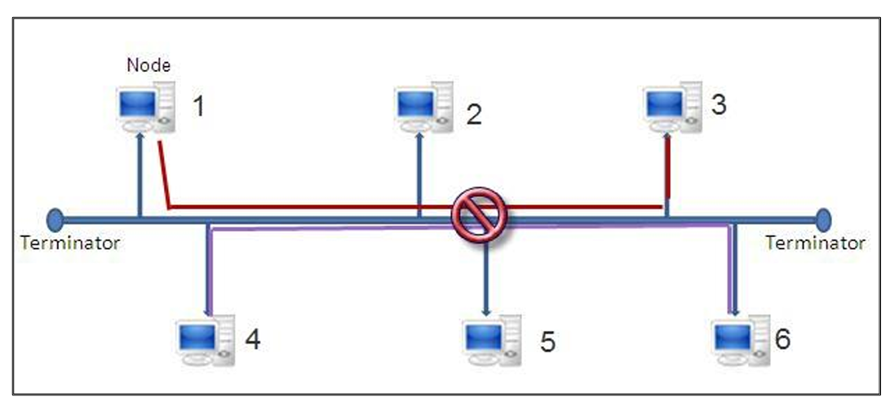
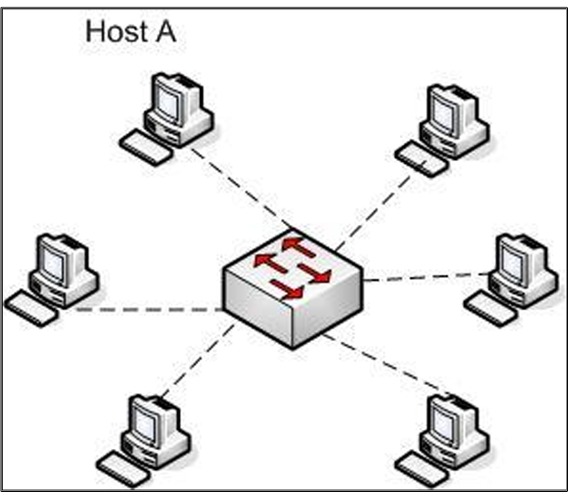
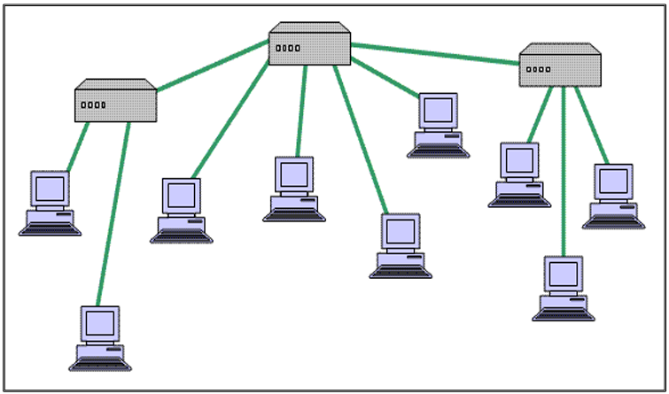
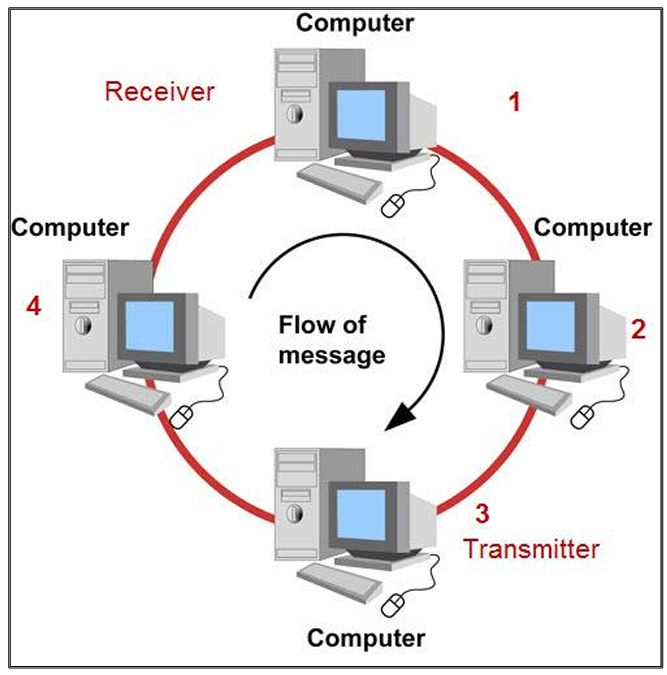
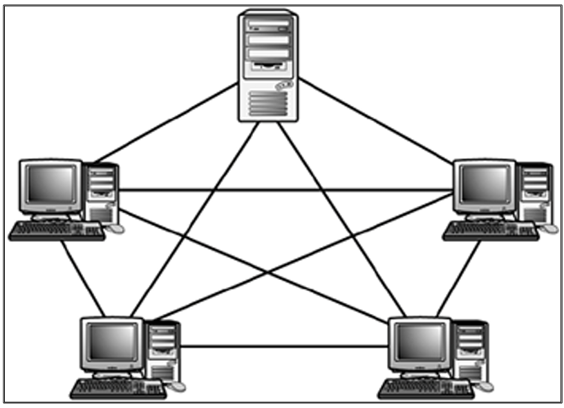
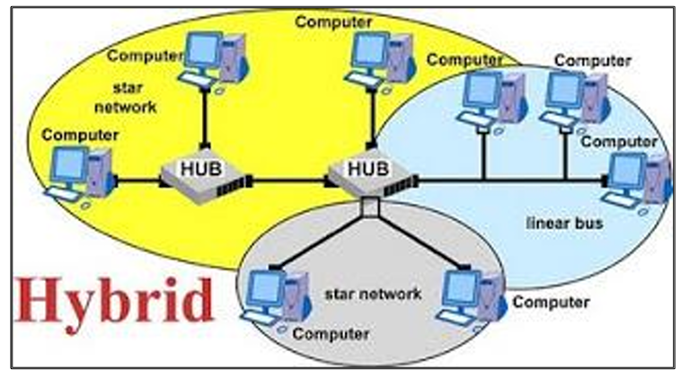

# الموضوع الأول: مقدمة في الشبكات (Introduction to Networks)

## 📌 جدول المحتويات

| المحتويات |
|---:|
| [1. يعني إيه شبكة أصلاً؟ (What is a Network?)](#sec-1) |
| [2. أهداف الشبكات (Goals of Networking)](#sec-2) |
| [3. مزايا وجود الشبكات (Advantages of Networks)](#sec-3) |
| [4. العناصر المكونة للشبكة (Network Components)](#sec-4) |
| [5. أنواع الشبكات (Types of Networks)](#sec-5) |
| [6. Network Topology (الطوبولوجيا الفيزيائية والمنطقية)](#sec-6) |

---

<h2 dir="rtl" align="right" id="sec-1">1. يعني إيه شبكة أصلاً؟ (What is a Network?)</h2>

الشبكة هي **مجموعة من الأجهزة (Devices)** زي الكمبيوترات، السيرفرات، الطابعات، الموبايلات، وأي جهاز تاني عنده قدرة على الاتصال، بيتم توصيلهم ببعض **بطريقة سلكية (Wired) أو لاسلكية (Wireless)** بهدف واحد: إنهم يقدروا **يتبادلوا البيانات والموارد فيما بينهم**.

ببساطة: لو عندك جهازين أو أكتر قادرين "يتكلموا" مع بعض ويبعتوا/يستقبلوا بيانات، يبقى إنت قدامك شبكة.

**أمثلة على الشبكات:**
- شبكة المنزل (Home Network): الراوتر، اللاب توب، الموبايل، السمارت تيفي
- شبكة الشركة (Enterprise Network): فيها سيرفرات وأجهزة كتير ومستويات أمان مختلفة
- الإنترنت (Internet): أكبر شبكة في العالم، وهي عبارة عن شبكة من الشبكات (Network of Networks)

---

<h2 dir="rtl" align="right" id="sec-2">2. أهداف الشبكات (Goals of Networking)</h2>

الشبكات مش عملت بالصدفة، عملت لتحقيق أهداف معينة:

- **مشاركة الموارد (Resource Sharing):** زي مشاركة طابعة واحدة بين عدة أجهزة، أو مشاركة اتصال الإنترنت
- **مشاركة البيانات (Data Sharing):** نقل وتبادل الملفات بين الأجهزة بسهولة
- **التواصل (Communication):** البريد الإلكتروني، المكالمات، الرسائل الفورية، الفيديو كول
- **المركزية في الإدارة والتحكم (Centralized Management):** في الشركات، تقدر تتحكم في كل الأجهزة وتطبق سياسات أمان من نقطة واحدة
- **توفير التكلفة (Cost Efficiency):** متعرفش تشتري جهاز ومعاه كل ملحقاته لوحده، تقدر تشارك الموارد وتوفر فلوس

---

<h2 dir="rtl" align="right" id="sec-3">3. مزايا وجود الشبكات (Advantages of Networks)</h2>

- **توفير في التكلفة:** مش لازم كل جهاز يكون عنده طابعة أو سكانر خاص بيه
- **سهولة الوصول للبيانات:** تقدر توصل لملفاتك من أي جهاز متصل بالشبكة
- **النسخ الاحتياطي المركزي (Centralized Backup):** تقدر تعمل باك أب لكل بيانات الشركة من مكان واحد بدل كل جهاز لوحده
- **سهولة التواصل:** بين الموظفين أو بين الأجهزة نفسها
- **إمكانية التوسع (Scalability):** تقدر تضيف أجهزة جديدة للشبكة بسهولة لما الاحتياج يزيد
- **الأمان المركزي:** تقدر تتابع وتراقب كل الأجهزة من مكان واحد (هيفيدك جدًا بعدين في Security+)

---

<h2 dir="rtl" align="right" id="sec-4">4. العناصر المكونة للشبكة (Network Components)</h2>

أي شبكة لازم يكون فيها العناصر دي:

<h3 dir="rtl" align="right" id="sec-4-1">أ) End Devices (الأجهزة النهائية)</h3>

دي الأجهزة اللي بيستخدمها المستخدم النهائي مباشرة: كمبيوتر، لاب توب، موبايل، طابعة، سيرفر... هي نقطة البداية أو النهاية لأي بيانات بتتنقل في الشبكة.

<h3 dir="rtl" align="right" id="sec-4-2">ب) Intermediary Devices (أجهزة الوسط)</h3>

دي الأجهزة اللي بتساعد في توصيل وتوجيه البيانات بين End Devices، زي:
- **Router:** بيوجه البيانات بين شبكات مختلفة
- **Switch:** بيوصل الأجهزة مع بعض داخل نفس الشبكة المحلية
- **Hub:** نسخة قديمة وأبسط من السويتش (بيبعت البيانات لكل الأجهزة بدون تمييز)
- **Access Point:** بيوفر اتصال لاسلكي (Wi-Fi) للأجهزة

<h3 dir="rtl" align="right" id="sec-4-3">ج) Network Media (وسائط النقل)</h3>

هي الوسيلة اللي البيانات بتنتقل من خلالها:
- **كابلات النحاس (Copper/UTP Cables):** زي كابل الـ Ethernet (RJ45)
- **الفايبر أوبتيك (Fiber Optic):** بينقل البيانات بالضوء، سرعته عالية جدًا ومسافاته طويلة
- **اللاسلكي (Wireless):** بينقل البيانات عن طريق موجات الراديو (Wi-Fi)

<h3 dir="rtl" align="right" id="sec-4-4">د) Network Services & Protocols (الخدمات والبروتوكولات)</h3>

دي القواعد والاتفاقيات اللي بتتحكم في طريقة "كلام" الأجهزة مع بعض، زي بروتوكول TCP/IP، HTTP، إلخ. من غيرها الأجهزة مش هتقدر تفهم بعض حتى لو متوصلة فيزيائيًا.

---

<h2 dir="rtl" align="right" id="sec-5">5. أنواع الشبكات (Types of Networks)</h2>

الشبكات ممكن تتصنف حسب أكتر من عامل:

<h3 dir="rtl" align="right" id="sec-5-1">أولًا: حسب الحجم الجغرافي</h3>

- **PAN (Personal Area Network):** شبكة شخصية صغيرة جدًا، زي البلوتوث بين الموبايل والسماعة
- **LAN (Local Area Network):** شبكة محلية في مكان واحد، زي شبكة المنزل أو المكتب
- **MAN (Metropolitan Area Network):** شبكة تغطي مدينة كاملة
- **WAN (Wide Area Network):** شبكة تغطي مساحة جغرافية واسعة (دول/قارات)، والإنترنت أكبر مثال عليها

<h3 dir="rtl" align="right" id="sec-5-2">ثانيًا: حسب طريقة العلاقة بين الأجهزة (Peer-to-Peer vs Client-Server)</h3>

<h4 dir="rtl" align="right" id="sec-5-2-1">1) شبكة الند للند (Peer-to-Peer Network)</h4>

كل الأجهزة فيها متساوية في الصلاحيات، مفيش جهاز "رئيسي" بيتحكم في باقي الأجهزة، وكل جهاز ممكن يكون في نفس الوقت Client و Server.

**المزايا:**
- سهلة في التركيب والإعداد
- رخيصة (مش محتاجة سيرفر مخصص ومكلف)
- مناسبة للشبكات الصغيرة (بيت، مكتب صغير)

**العيوب:**
- صعب إدارتها لما عدد الأجهزة يزيد
- مستوى الأمان ضعيف (مفيش تحكم مركزي في الصلاحيات)
- مفيش نسخ احتياطي مركزي، كل جهاز مسؤول عن بياناته لوحده

<h4 dir="rtl" align="right" id="sec-5-2-2">2) شبكة العميل والخادم (Client-Server Network)</h4>

فيه جهاز أو أكتر بيلعب دور "Server" بيقدم خدمة، وباقي الأجهزة "Clients" بتطلب الخدمة دي من السيرفر.

**المزايا:**
- إدارة مركزية (Centralized Management) للصلاحيات والمستخدمين
- مستوى أمان أعلى
- يدعم عدد كبير من المستخدمين والأجهزة
- نسخ احتياطي مركزي للبيانات

**العيوب:**
- تكلفة أعلى (محتاج سيرفر مخصص بمواصفات قوية)
- لو السيرفر حصل فيه عطل، ممكن الشبكة كلها تتأثر أو تقف
- محتاج فني متخصص لإدارة وصيانة السيرفر

---

<h2 dir="rtl" align="right" id="sec-6">6. Network Topology (الطوبولوجيا الفيزيائية والمنطقية)</h2>

الـ Topology هو **شكل أو تصميم الشبكة**، وبينقسم لنوعين:

<h3 dir="rtl" align="right" id="sec-6-1">أ) Physical Topology (الطوبولوجيا الفيزيائية)</h3>

هي **الشكل الفعلي/الواقعي** اللي الأجهزة والكابلات متوصلة بيه على الأرض، يعني لو نظرت للشبكة بعينك هتشوفها متوصلة إزاي فعليًا. أشهر أشكالها:

- **Bus Topology:** كل الأجهزة متوصلة على كابل واحد رئيسي (Backbone). بسيطة ورخيصة، لكن لو الكابل الرئيسي حصل فيه عطل الشبكة كلها بتقف.

  

- **Star Topology:** كل الأجهزة متوصلة بجهاز مركزي (زي Switch أو Hub). الأكثر استخدامًا حاليًا، سهلة الإدارة وعزل الأعطال، لكن لو الجهاز المركزي عطل، الشبكة كلها بتتأثر.

  
  

- **Ring Topology:** كل جهاز متوصل بالجهاز اللي جنبه على شكل حلقة مقفولة، والبيانات بتدور في اتجاه واحد. لو سلك اتقطع ممكن الشبكة كلها تتأثر (إلا في حالة Dual Ring).

  

- **Mesh Topology:** كل جهاز متوصل بكل الأجهزة التانية. أعلى درجة في الموثوقية (Reliability) لأن لو أي وصلة عطلت، فيه طرق تانية بديلة، لكنها مكلفة جدًا وصعبة التركيب.

  

- **Hybrid Topology:** مزيج بين شكلين أو أكتر من الأشكال السابقة، وهي الأكثر شيوعًا في الشبكات الحقيقية الكبيرة.

  

<h3 dir="rtl" align="right" id="sec-6-2">ب) Logical Topology (الطوبولوجيا المنطقية)</h3>

هي **الطريقة اللي البيانات بتتحرك بيها فعليًا** بين الأجهزة، بغض النظر عن الشكل الفيزيائي للتوصيل.

مثال مهم: ممكن شبكة تكون شكلها الفيزيائي **Star** (كل الأجهزة متوصلة بسويتش واحد)، لكن البيانات بتتحرك بينهم منطقيًا على شكل **Ring** (كل جهاز يستقبل ويبعت للجهاز التالي بالدور) — وهو ده اللي كان بيحصل في تقنية **Token Ring** قديمًا.

> **الخلاصة:** الـ Physical Topology بتجاوب على سؤال "الأجهزة متوصلة إزاي على الأرض؟"، والـ Logical Topology بتجاوب على سؤال "البيانات بتتحرك إزاي فعليًا بين الأجهزة؟"
---