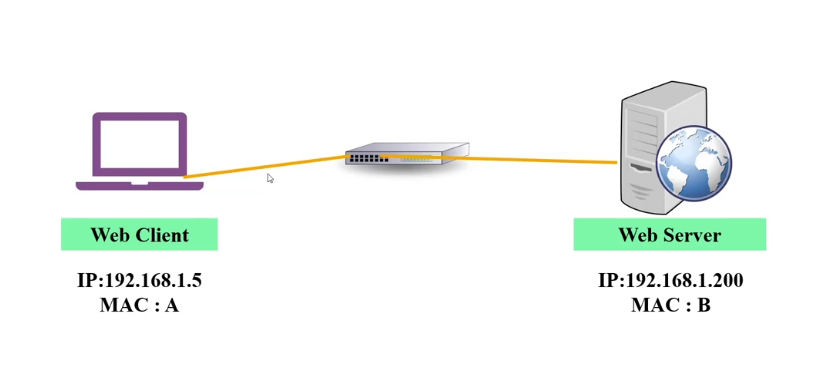
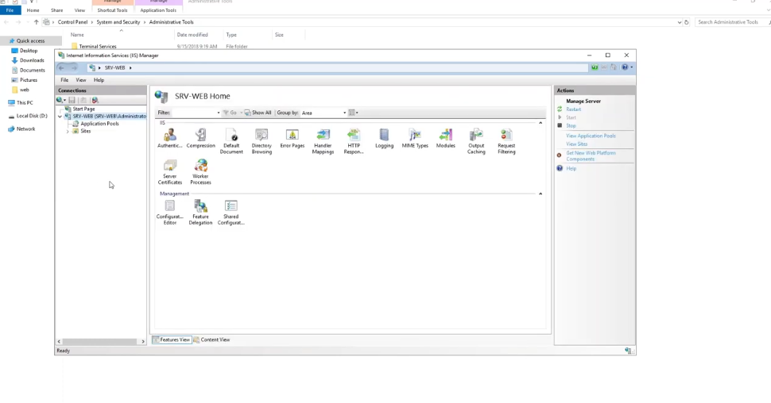
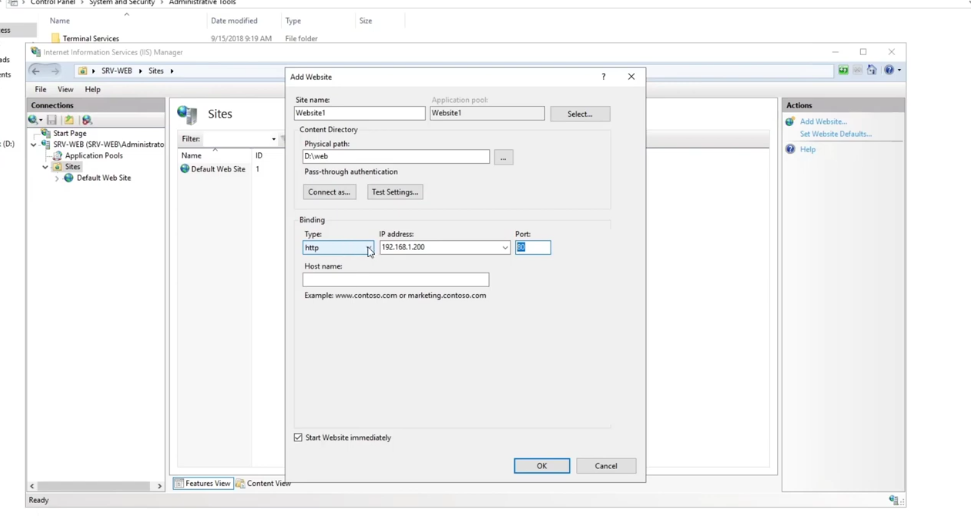
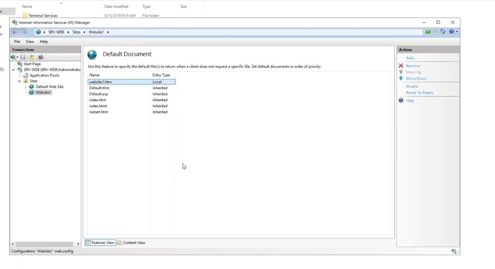
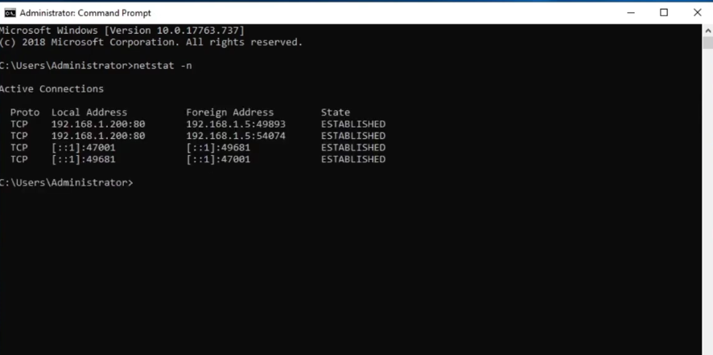
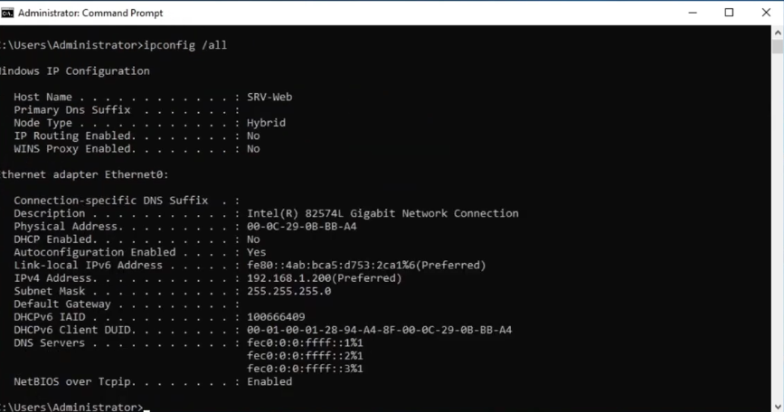
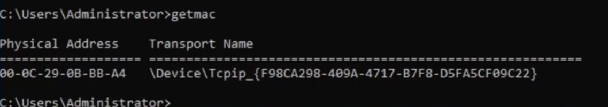
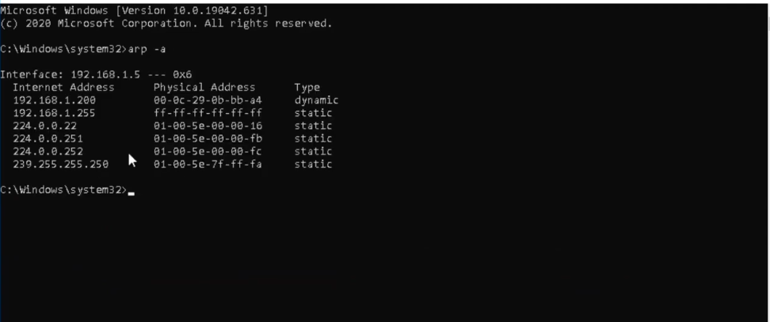
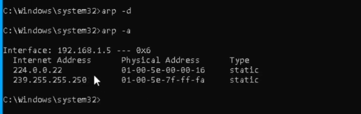

<div dir="rtl" align="center">

# تطبيق عملي على الـ OSI Model

</div>

<div dir="rtl" align="right">

في الملف ده هنطبق عملي كل اللي اتعلمناه نظرياً عن الـ `OSI Model` (7 Layers)، من خلال عمل لاب كامل بين جهاز `Client` وجهاز `Web Server`، ونشوف كل طبقة بتشتغل إزاي في الواقع. 

---

## 📑 جدول المحتويات

| # | الموضوع |
|---|---------|
| 1 | [فكرة اللاب والهدف منه](#section-1) |
| 2 | [تجهيز البيئة الافتراضية](#section-2) |
| 3 | [تركيب وتفعيل خدمة الـ Web Server (IIS)](#section-3) |
| 4 | [إنشاء الـ Website من خلال IIS Manager](#section-4) |
| 5 | [تفعيل الصفحة الرئيسية (Default Document)](#section-5) |
| 6 | [اختبار الاتصال من جهاز الـ Client](#section-6) |
| 7 | [تتبع الاتصالات باستخدام أمر netstat -n](#section-7) |
| 8 | [أعمق في الـ TCP: الـ 3-Way Handshake](#section-8) |
| 9 | [أعمق في البورتات: الـ Ephemeral Ports](#section-9) |
| 10 | [تركيبة الـ MAC Address](#section-10) |
| 11 | [طرق معرفة الـ MAC Address](#section-11) |
| 12 | [الـ ARP بالتفصيل الكامل](#section-12) |
| 13 | [مشكلة عملية: تغيير كارت الشبكة وتأثيره على الـ ARP Cache](#section-13) |
| 14 | [أوامر ARP: ملخص شامل](#section-14) |
| 15 | [الجانب الأمني: ARP Spoofing / ARP Poisoning](#section-15) |
| 16 | [ربط التجربة كلها بطبقات الـ OSI Model](#section-16) |
| 17 | [جدول تلخيصي شامل للمراجعة](#section-17) |

---

<a id="section-1"></a>
## 1️⃣ فكرة اللاب والهدف منه

الهدف من اللاب إننا نشوف عملياً إزاي الاتصال بيتم بين جهازين على الشبكة (`Client` و `Server`)، وإزاي كل طبقة من الـ 7 طبقات بتاعة الـ `OSI Model` بتلعب دورها في العملية دي، بداية من إرسال الـ `Request` من المتصفح لحد ما الـ `Server` يرد بالصفحة المطلوبة.

السيناريو اللي هنعمله:
- جهاز **Client** عادي (Workstation) عايز يفتح موقع.
- جهاز **Server** شغال عليه Windows Server ومظبط كـ **Web Server**.
- الاتنين متوصلين على نفس الشبكة المحلية.

---

<a id="section-2"></a>
## 2️⃣ تجهيز البيئة الافتراضية

علشان نعمل اللاب من غير ما نحتاج جهازين فعليين، استخدمنا برنامج **VMware** لعمل بيئة افتراضية (Virtual Environment).

### الخطوات:
1. نزّلنا نسخة **Windows Server 2019** وشغّلناها كـ Virtual Machine على VMware.
2. حولنا السيرفر ده من سيرفر عادي (مبيقدمش أي خدمة) إلى **Web Server** فعلي.
3. ظبطنا الـ **IP Address** بتاع السيرفر، وكمان الـ **IP Address** بتاع جهاز الـ Client.
4. وصّلنا الجهازين على نفس الـ **Switch الافتراضي**، وهو `VMnet2`، علشان يبقوا في نفس الـ Network ويقدروا يتواصلوا مع بعض مباشرة.

### الإعدادات المستخدمة:

| الجهاز | الدور | IP Address | MAC Address |
|---|---|---|---|
| Laptop / PC | Web Client | `192.168.1.5` | A |
| Server | Web Server | `192.168.1.200` | B |



### ليه اخترنا VMnet2 بالتحديد؟

برنامج VMware بيوفر أكتر من نوع Virtual Switch، وكل نوع له استخدام مختلف:

| النوع | الوظيفة |
|---|---|
| **VMnet0 (Bridged)** | بيوصل الـ VM مباشرة بشبكة الـ Host الحقيقية، وكأنه جهاز فعلي على نفس الراوتر |
| **VMnet1 (Host-only)** | بيوصل الـ VM بجهاز الـ Host بتاعك بس، من غير خروج للإنترنت أو أي شبكة تانية |
| **VMnet2 (Custom)** | Switch افتراضي معزول تماماً، بتقدر توصل بيه أي عدد من الـ VMs مع بعض بس، من غير تدخل من شبكة الـ Host أو الإنترنت |

اخترنا **VMnet2** عشان عايزين شبكة معزولة (Isolated Lab Network) بين جهاز الـ Client وجهاز الـ Server بس، من غير أي تشويش من أجهزة تانية على الشبكة، وده بيسهّل علينا مراقبة الترافيك بينهم بدقة (زي اللي هنشوفه بعدين مع `netstat` و `arp`).

---

<a id="section-3"></a>
## 3️⃣ تركيب وتفعيل خدمة الـ Web Server (IIS)

علشان الـ Windows Server يقدر يشتغل كـ **Web Server** ويستقبل طلبات المتصفحات (HTTP Requests)، لازم نفعّل فيه خدمة اسمها:

> **IIS – Internet Information Services**

الـ **IIS** هي الأداة اللي مايكروسوفت وفّرتها جوه الـ Windows Server عشان تخليه يقدر يستضيف مواقع (Host Websites) ويرد على طلبات الـ HTTP/HTTPS.

### الخطوات:
1. دخلنا على **Server Manager** → **Add Roles and Features**.
2. فعّلنا الـ Role بتاع **Web Server (IIS)**.
3. بعد التثبيت، فتحنا الأداة من:
   `Administrative Tools → Internet Information Services (IIS) Manager`



الصورة دي بتوضح شكل الأداة بعد ما فتحناها، وشايفين فيها إعدادات السيرفر (`SRV-WEB`) والخيارات المختلفة زي:
- **Authentication**
- **Default Document**
- **Sites**
- **Server Certificates**

---

<a id="section-4"></a>
## 4️⃣ إنشاء الـ Website من خلال IIS Manager

بعد ما فتحنا الأداة، عملنا موقع جديد (Website) بالخطوات دي:

1. من قائمة **Connections** دوسنا كليك يمين على **Sites** → **Add Website**.
2. ملينا البيانات:

| الحقل | القيمة |
|---|---|
| **Site name** | Website1 |
| **Physical path** | D:\web |
| **Type** | http |
| **IP address** | 192.168.1.200 |
| **Port** | 80 |



### شرح الحقول:
- **Site name**: اسم الموقع اللي هيظهر في الـ IIS Manager بس (مش هو اسم الدومين).
- **Physical path**: المسار على الهارد بتاع السيرفر اللي فيه ملفات الموقع (زي ملف الـ `HTML`).
- **Type**: نوع البروتوكول اللي الموقع هيشتغل بيه، هنا اخترنا `http`.
- **IP address**: الـ IP بتاع الـ Network Card اللي الموقع هيرد من خلالها.
- **Port**: البورت اللي الموقع هيستقبل عليه الطلبات، والبورت الافتراضي لـ `HTTP` هو **80**.

قبل كده جهزنا ملف بسيط بامتداد `.html` فيه رسالة ترحيب وتعريف بسيط، وحطيناه جوه الـ **Physical Path** بتاع الموقع، وده اللي المتصفح هيعرضه لما حد يفتح الموقع.

---

<a id="section-5"></a>
## 5️⃣ تفعيل الصفحة الرئيسية (Default Document)

علشان لما أي جهاز يفتح الموقع من غير ما يكتب اسم صفحة معينة (يعني يكتب بس الـ IP)، السيرفر يعرف يرد بأنهي صفحة، لازم نحدد الصفحة دي كـ **Default Document**.

### الخطوات:
1. من داخل الموقع اللي عملناه (Website1)، فتحنا أداة **Default Document**.
2. ضفنا اسم الملف بتاعنا (`website1.htm`) وخليناه في أعلى الترتيب (Move Up).



كده لما أي جهاز يبعت `Request` للـ IP بتاع السيرفر من غير ما يحدد صفحة، الـ IIS هيرجّع أول ملف موجود في الليستة دي، وهو ملفنا احنا.

> ملحوظة: الترتيب مهم جداً هنا، لإن السيرفر بيفحص الليستة من فوق لتحت، وأول ملف موجود فعلياً في المسار هو اللي هيتقدم.

---

<a id="section-6"></a>
## 6️⃣ اختبار الاتصال من جهاز الـ Client

قبل ما نفتح المتصفح، الأفضل دايماً إننا نتأكد إن الاتصال شغال على مستوى أساسي أول، وده بنعمله باستخدام أمر:

```
ping 192.168.1.200
```

الأمر ده شغال على الـ **Network Layer (Layer 3)**، وبيتأكد إن فيه استجابة أصلاً بين الجهازين قبل ما نروح نختبر خدمة الـ HTTP اللي شغالة على الـ **Application Layer (Layer 7)**. لو الـ ping فشل، معناها إن المشكلة في مستوى أعمق (زي الـ IP أو الـ Physical Connection)، ومفيش داعي نضيع وقت نفحص المتصفح.

بعد ما اتأكدنا إن الـ ping بيرد، فتحنا المتصفح على جهاز الـ Client وكتبنا الـ IP بتاع السيرفر:

```
http://192.168.1.200
```

وفعلاً ظهرت صفحة الموقع اللي عملناها، وده معناه إن:
- الجهاز قدر يبعت **HTTP Request** للسيرفر.
- السيرفر استقبل الطلب ورد عليه بالصفحة الصحيحة (**HTTP Response**).
- كل الطبقات من الـ `Physical Layer` لحد الـ `Application Layer` اشتغلت صح من الطرفين.

---

<a id="section-7"></a>
## 7️⃣ تتبع الاتصالات باستخدام أمر `netstat -n`

بعد ما اتأكدنا إن الاتصال شغال، استخدمنا أمر `netstat -n` على السيرفر عشان نعرف مين الأجهزة اللي فاتحة اتصال معاه دلوقتي.

```
netstat -n
```



### شرح مخرجات الأمر:

| العمود | الشرح |
|---|---|
| **Proto** | البروتوكول المستخدم في الاتصال، هنا `TCP` |
| **Local Address** | الـ IP والـ Port بتاع الجهاز المحلي (السيرفر نفسه) |
| **Foreign Address** | الـ IP والـ Port بتاع الجهاز التاني اللي متصل بينا |
| **State** | حالة الاتصال دلوقتي |

### تفاصيل أكتر عن الناتج بتاعنا:
- `192.168.1.200:80` → ده الـ IP بتاع السيرفر والبورت `80` اللي بيستقبل عليه طلبات الـ HTTP.
- `192.168.1.5:49893` → ده الـ IP بتاع جهاز الـ Client، والـ Port هنا رقم عشوائي (Ephemeral Port) بيختاره نظام التشغيل بتاع الـ Client لكل اتصال جديد (هنشرحها بالتفصيل في القسم الجاي).
- **State: ESTABLISHED** معناها إن الاتصال قائم وشغال فعلاً (الـ TCP 3-Way Handshake اتم بنجاح).
- الأسطر اللي فيها `[::1]` دي عبارة عن اتصالات داخلية على بروتوكول **IPv6** (Localhost)، ومالهاش علاقة بجهاز الـ Client بتاعنا.

### باقي حالات الـ State المهمة (مش كلها ظهرت في اللاب بس مهم تعرفها كمرجع):

| الحالة | معناها |
|---|---|
| **LISTENING** | البورت مفتوح وبينتظر أي اتصال جديد يوصله (زي السيرفر قبل ما أي Client يتصل) |
| **ESTABLISHED** | الاتصال قائم وشغال فعلياً وبيتبادل بيانات |
| **SYN_SENT** | الجهاز بعت أول رسالة في الـ Handshake (SYN) وبينتظر رد |
| **SYN_RECEIVED** | الجهاز استقبل SYN ورد بـ SYN-ACK وبينتظر التأكيد الأخير |
| **TIME_WAIT** | الاتصال اتقفل من الطرفين، لكن الجهاز لسه محتفظ بالمعلومات لفترة قصيرة تحسباً لأي بيانات متأخرة |
| **CLOSE_WAIT** | الطرف التاني قفل الاتصال، والجهاز ده لسه في انتظار يقفل هو كمان من ناحيته |

> أمر `netstat -n` مفيد جداً في تتبع الاتصالات النشطة على أي جهاز، ومعرفة مين متصل بيه دلوقتي وعلى أنهي بورت وفي أنهي حالة.

---

<a id="section-8"></a>
## 8️⃣ أعمق في الـ TCP: الـ `3-Way Handshake`

شفنا في القسم اللي فات إن حالة الاتصال كانت **ESTABLISHED**، لكن السؤال هنا: إزاي الاتصال بيوصل للحالة دي أصلاً؟ الإجابة هي عملية اسمها **TCP 3-Way Handshake**، وهي الطريقة اللي بروتوكول الـ **TCP** بيستخدمها عشان يفتح اتصال موثوق (Reliable Connection) بين طرفين قبل ما يبدأ تبادل أي بيانات فعلية.

العملية بتتم على 3 خطوات:

### الخطوة 1: SYN
جهاز الـ **Client** بيبعت رسالة للسيرفر اسمها **SYN (Synchronize)**، وفيها بيقوله: "عايز أفتح اتصال معاك، ودي رقم البداية بتاعي (Sequence Number)".

### الخطوة 2: SYN-ACK
السيرفر بيرد برسالة اسمها **SYN-ACK**، وفيها بيأكد استلامه للطلب (Acknowledgment)، وفي نفس الوقت بيبعت رقم البداية بتاعه هو كمان، يعني "موافق، واستلمت رقمك، ودي رقم البداية بتاعي أنا".

### الخطوة 3: ACK
جهاز الـ Client بيرد بآخر رسالة **ACK**، يأكد فيها إنه استلم رد السيرفر، وبكده الاتصال يبقى جاهز، وتتحول حالته في `netstat` إلى **ESTABLISHED**.

```
Client                          Server
  |------ 1) SYN ------------------>|
  |<----- 2) SYN-ACK ----------------|
  |------ 3) ACK -------------------->|
  |========== ESTABLISHED ===========|
```

الخطوات التلاتة دي هي اللي بتحصل في اللحظة اللي فتحنا فيها المتصفح وكتبنا الـ IP بتاع السيرفر، قبل ما أي بيانات فعلية للصفحة تتبادل. وهي اللي بتمثل عملياً الفرق بين بروتوكول **TCP** (Connection-Oriented) وبروتوكول **UDP** (Connectionless) اللي مش بيعمل الخطوات دي أصلاً.

---

<a id="section-9"></a>
## 9️⃣ أعمق في البورتات: الـ `Ephemeral Ports`

في ناتج `netstat -n` شفنا إن جهاز الـ Client كان بيستخدم بورت غريب زي `49893`، مع إن السيرفر بيستخدم بورت معروف وهو `80`. السؤال: البورت ده جاي منين؟

### إيه هو الـ Ephemeral Port؟

هو بورت مؤقت (Temporary Port) بيختاره نظام التشغيل بتاع الجهاز **المرسل** (في الغالب الـ Client) تلقائياً لكل اتصال جديد بيفتحه، عشان يقدر يميّز بين كل اتصال والتاني لو فتح أكتر من اتصال في نفس الوقت.

### الرينج بتاعه:

| النوع | الرينج |
|---|---|
| **Well-Known Ports** | من `0` إلى `1023` (زي `80` لـ HTTP و `443` لـ HTTPS) |
| **Registered Ports** | من `1024` إلى `49151` |
| **Ephemeral (Dynamic) Ports** | من `49152` إلى `65535` (وده اللي بيستخدمه غالبية أنظمة الويندوز الحديثة) |

### ليه بيتغير كل مرة؟

كل ما تفتح اتصال جديد (حتى لو لنفس السيرفر ونفس الموقع)، النظام هيختار رقم Ephemeral Port مختلف، عشان لو فتحت أكتر من Tab في المتصفح على نفس الموقع في نفس الوقت، كل اتصال يبقى ليه "بصمة" فريدة (IP + Port) تميزه عن التاني، ولما الرد يرجع من السيرفر، النظام يعرف يوصله بالظبط للـ Tab أو البرنامج الصح اللي طلبه.

---

<a id="section-10"></a>
## 🔟 تركيبة الـ `MAC Address`

قبل ما نتكلم عن طرق معرفة الـ MAC، الأول لازم نفهم هو مكوّن من إيه.

الـ **MAC Address** بيتكون من **48 بت** (6 بايت)، وبيتكتب في صورة **Hexadecimal** (زي `00-0C-29-0B-BB-A4`)، ومقسوم لجزئين:

| الجزء | عدد البايتات | الوظيفة |
|---|---|---|
| **OUI (Organizationally Unique Identifier)** | أول 3 بايت | بيحدد الشركة المصنعة لكارت الشبكة (زي Intel, VMware, Cisco...) ومسجل رسمياً عند هيئة الـ IEEE |
| **NIC Specific / Device ID** | آخر 3 بايت | رقم فريد بيحدده المصنّع نفسه لكل كارت شبكة، عشان يضمن إن كل كارت في العالم ليه MAC مختلف عن التاني |

### مثال من اللاب:

في الـ MAC بتاعنا `00-0C-29-0B-BB-A4`:
- `00-0C-29` → دي بصمة شركة **VMware** (بتدل إن ده Virtual Network Adapter مش كارت فيزيائي حقيقي).
- `0B-BB-A4` → ده الرقم الفريد اللي VMware ولّدته للكارت الافتراضي ده بالتحديد.

> ملحوظة: الـ MAC Address بيوصف بإنه **Physical / Hardware Address**، وعلى عكس الـ IP بتاع الـ Layer 3 اللي بيتغير حسب الشبكة، الـ MAC بيفضل ثابت مع الكارت نفسه (إلا في حالات خاصة زي الـ MAC Spoofing).

---

<a id="section-11"></a>
## 1️⃣1️⃣ طرق معرفة الـ `MAC Address`

عرفنا أكتر من طريقة نجيب بيها الـ **MAC Address** بتاع أي جهاز:

### الطريقة الأولى: من خلال Network Properties
عن طريق قائمة **View your network properties** في إعدادات الشبكة بالويندوز، وهي بتوريك تفاصيل الـ Adapter من غير ما تستخدم الـ CMD.

### الطريقة الثانية: من خلال الأمر `ipconfig /all`

```
ipconfig /all
```



الأمر ده بيديك تفاصيل شاملة عن كل الـ Network Adapters في الجهاز، من أهمها:

| الحقل | الشرح |
|---|---|
| **Host Name** | اسم الجهاز على الشبكة |
| **Physical Address** | ده الـ MAC Address بتاع الـ Network Card |
| **DHCP Enabled** | هل الجهاز بياخد IP تلقائي ولا لأ |
| **IPv4 Address** | الـ IP بتاع الجهاز |
| **Subnet Mask** | الـ Subnet Mask بتاع الشبكة |
| **Default Gateway** | الـ IP بتاع الـ Router اللي بيوصلنا بره الشبكة المحلية |
| **DNS Servers** | عناوين سيرفرات الـ DNS المستخدمة |

### الطريقة الثالثة: من خلال الأمر `getmac`

```
getmac
```



الأمر ده أبسط وأسرع، وبيديك الـ **Physical Address (MAC)** مباشرة مع اسم الـ **Transport Name** بتاع الكارت، من غير ما يديك كل تفاصيل الـ `ipconfig /all`.

---

<a id="section-12"></a>
## 1️⃣2️⃣ الـ `ARP`

الـ **ARP** من أهم البروتوكولات اللي بتشرح إزاي الطبقتين **Network Layer (Layer 3)** و **Data Link Layer (Layer 2)** بيتكلموا مع بعض، فهنشرحه هنا بكل تفاصيله.

### 🔹 إيه هو الـ ARP؟

**ARP (Address Resolution Protocol)** هو بروتوكول وظيفته إنه يربط بين:

- الـ **IP Address** (عنوان منطقي - Logical Address) بتاع الجهاز، وده بيتغير حسب الشبكة.
- الـ **MAC Address** (عنوان فيزيائي - Physical Address) بتاع نفس الجهاز، وده ثابت مع الكارت.

بيشتغل في المنطقة اللي بين الـ **Layer 2** والـ **Layer 3**، لإنه بياخد معلومة من الـ Layer 3 (الـ IP) ويحولها لمعلومة يقدر الـ Layer 2 يستخدمها (الـ MAC).

### 🔹 ليه محتاجين ARP أصلاً؟

لما جهاز عايز يبعت بيانات لجهاز تاني على نفس الشبكة المحلية، مش بيكفي إنه يعرف الـ **IP Address** بتاعه بس، لإن الاتصال الفعلي على مستوى الشبكة (Data Link Layer) بيتم باستخدام الـ **MAC Address**، مش الـ IP. فالجهاز محتاج يعرف: "الـ IP ده بتاع مين من ناحية الـ MAC؟" قبل ما يقدر يبعت أي إطار بيانات (Frame) فعلي.

### 🔹 أنواع رسائل الـ ARP

| النوع | الوظيفة |
|---|---|
| **ARP Request** | رسالة **Broadcast** بتتبعت لكل الشبكة بتسأل "مين صاحب الـ IP ده؟" |
| **ARP Reply** | رسالة **Unicast** بترجع من صاحب الـ IP بس، وفيها الـ MAC بتاعه |
| **Gratuitous ARP** | رسالة بيبعتها الجهاز بنفسه لنفسه (Broadcast) من غير ما حد يطلبها، غالباً لما يشتغل لأول مرة أو يغيّر الـ IP بتاعه، عشان يعلن لكل الشبكة "أنا موجود وده الـ IP والـ MAC بتاعي"، وبتستخدم كمان في اكتشاف تعارض عناوين الـ IP (IP Conflict Detection) |

### 🔹 إزاي الـ ARP بيشتغل خطوة بخطوة (بمثال من نفس اللاب)

نتخيل إن جهاز الـ **Client** (`192.168.1.5`) عايز يبعت بيانات لجهاز الـ **Server** (`192.168.1.200`) لأول مرة، ومفيش أي معلومة محفوظة عنده قبل كده:

1. الـ Client بيدور الأول في الـ **ARP Cache** بتاعه لو فيه إجابة محفوظة من قبل، مش بيلاقي حاجة.
2. الـ Client بيعمل **ARP Request** (Broadcast) لكل الأجهزة على الشبكة (`VMnet2` في حالتنا)، وبيقول: "مين صاحب الـ IP `192.168.1.200`؟ ابعتلي الـ MAC بتاعك".
3. كل الأجهزة على الشبكة بتستقبل الرسالة، لكن الجهاز صاحب الـ IP ده بس (السيرفر) هو اللي بيرد.
4. السيرفر بيرد برسالة **ARP Reply** (Unicast) مباشرة للـ Client، وفيها الـ MAC بتاعه (`00-0C-29-0B-BB-A4`).
5. الـ Client بيستقبل الرد، ويحفظ الزوج (IP + MAC) ده في جدول محلي عنده اسمه **ARP Cache**، عشان في المرة الجاية ميحتاجش يسأل تاني، ويوفر وقت ومصادر الشبكة.
6. دلوقتي الـ Client قادر يبني الـ **Ethernet Frame** ويحط فيه الـ MAC بتاع السيرفر كـ Destination MAC، ويبعت البيانات فعلياً.

### 🔹 أمر عرض الـ ARP Cache: `arp -a`

```
arp -a
```



### شرح مخرجات الأمر:

| العمود | الشرح |
|---|---|
| **Internet Address** | الـ IP Address المحفوظ في الجدول |
| **Physical Address** | الـ MAC Address المرتبط بالـ IP ده |
| **Type** | نوع القيد: `dynamic` (اتسجل تلقائي وبينتهي بعد فترة) أو `static` (ثابت ومتضاف يدوي أو محجوز للنظام) |

من الصورة شايفين إن:
- `192.168.1.200` (الـ Server) مرتبط بالـ MAC `00-0c-29-0b-bb-a4` من نوع `dynamic`.
- باقي العناوين (زي `224.0.0.x` و `239.255.255.250`) دي عناوين **Multicast** ثابتة (`static`) محجوزة للنظام، ومش ليها علاقة بجهاز معين.

### 🔹 مدة صلاحية الـ ARP Cache (Cache Timeout)

القيود من نوع **dynamic** في الـ ARP Cache مش بتفضل للأبد، ليها **مدة صلاحية (TTL - Time To Live)** بعدها بتتمسح تلقائياً من الجدول، وده بيحصل لسببين:

1. **توفير مساحة** في الجدول، وعدم تراكم قيود لأجهزة ممكن تكون سابت الشبكة خالص.
2. **ضمان تحديث المعلومة**، لإن لو أي جهاز غيّر كارت الشبكة بتاعه (زي المشكلة اللي هنشرحها في القسم الجاي)، الجدول لازم يتحدث بالـ MAC الجديد بعد فترة، مش يفضل محتفظ بمعلومة قديمة غلط.

المدة دي بتختلف حسب نظام التشغيل، لكن في الغالب بتتراوح بين **دقيقتين لـ 20 دقيقة** تقريباً في أنظمة الويندوز، وبعدها لو الجهاز محتاج يبعت بيانات تاني لنفس الـ IP، هيعيد عملية الـ ARP Request من الأول.

---

<a id="section-13"></a>
## 1️⃣3️⃣ مشكلة عملية: تغيير كارت الشبكة وتأثيره على الـ ARP Cache

### السيناريو:

جهاز Client حاول يوصل لسيرفر معين، لكنه فشل في الاتصال. لما دورنا على السبب، لقينا إن:

- كارت الشبكة (Network Card) بتاع السيرفر اتغيّر (Hardware جديد).
- الكارت الجديد ليه **MAC Address** مختلف عن القديم.
- لكن جهاز الـ Client لسه محتفظ في الـ **ARP Cache** بتاعه بالـ **MAC القديم** المرتبط بنفس الـ IP (لإن مدة الصلاحية بتاعته لسه ما خلصتش، زي ما شرحنا في القسم اللي فات).

### النتيجة:
الجهاز بيحاول يبعت البيانات على الـ MAC القديم (الغلط)، فالبيانات مش بتوصل، وبيفشل الاتصال، رغم إن الـ IP صحيح ومسجل صح، والمشكلة الحقيقية إن الربط بين الـ IP والـ MAC بقى غلط.

### الحل: مسح الـ ARP Cache

لازم نمسح القيد القديم من الجدول عشان الجهاز يضطر يعمل **ARP Request** جديد ويجيب الـ MAC الصح.

### الأمر: `arp -d`

```
arp -d
```

الأمر ده بيمسح كل القيود الموجودة في الـ ARP Cache (أو قيد معين لو حددنا الـ IP بعده، زي: `arp -d 192.168.1.200`).



من الصورة شايفين إننا نفذنا `arp -d` وبعدها عملنا `arp -a` للتأكد، ولاحظنا إن القيد الخاص بـ `192.168.1.200` (الـ dynamic) اتشال خالص من الجدول، وفضلت بس العناوين الـ **static** (زي الـ Multicast Addresses) اللي مش بتتأثر بالأمر ده لإنها مش مرتبطة بجهاز فعلي على الشبكة.

بعد المسح، أول ما الجهاز يحاول يبعت بيانات للسيرفر تاني، هيعمل **ARP Request** جديد، ويجيب الـ MAC الجديد الصحيح، ويترحفظ من جديد في الـ Cache.

### طرق تانية لمسح الـ ARP Cache:
- إعادة تشغيل الجهاز (Restart) بتمسح الـ Cache تلقائياً.
- إيقاف وتشغيل كارت الشبكة (Disable/Enable Network Adapter).
- استخدام أمر `netsh interface ip delete arpcache` في بعض إصدارات الويندوز.

---

<a id="section-14"></a>
## 1️⃣4️⃣ أوامر `ARP` 

| الأمر | الوظيفة |
|---|---|
| `arp -a` | عرض كل القيود الموجودة حالياً في الـ ARP Cache |
| `arp -a [IP]` | عرض قيد جهاز معين بس من الجدول |
| `arp -d` | مسح كل القيود الديناميكية من الـ ARP Cache |
| `arp -d [IP]` | مسح قيد معين بالـ IP المحدد فقط |
| `arp -s [IP] [MAC]` | إضافة قيد ثابت (Static) يدوياً في الجدول، بحيث ميتمسحش تلقائي |

---

<a id="section-15"></a>
## 1️⃣5️⃣ الجانب الأمني: `ARP Spoofing / ARP Poisoning`

بعد ما فهمنا إزاي الـ ARP بيشتغل، مهم نعرف إنه بروتوكول **مش فيه أي طريقة توثيق (No Authentication)**، يعني أي جهاز على الشبكة يقدر يرد على ARP Request حتى لو مش هو صاحب الـ IP فعلاً، والجهاز الطالب هيصدقه ويحفظ المعلومة الغلط دي في الـ Cache بتاعه، ودي بالظبط النقطة اللي بيستغلها هجوم اسمه:

> **ARP Spoofing** (وبيتسمى كمان **ARP Poisoning**)

### إزاي الهجوم بيحصل؟

المهاجم بيبعت رسائل **ARP Reply** مزوّرة للشبكة، بيقول فيها مثلاً: "أنا صاحب الـ IP بتاع الـ Default Gateway"، فيخلي أجهزة الشبكة تحدّث الـ ARP Cache بتاعها وتربط IP الراوتر بالـ MAC بتاع جهاز المهاجم بدل الراوتر الحقيقي.

### النتيجة:
كل البيانات اللي المفروض تروح للراوتر (أو لأي جهاز تاني على الشبكة)، بتعدي الأول على جهاز المهاجم من غير ما حد يحس، وده بيفتح الباب لهجمات زي:

- **Man-in-the-Middle (MITM)**: المهاجم بيتنصت أو يعدّل على البيانات وهي عدّية عليه.
- **Denial of Service (DoS)**: المهاجم يوجّه الترافيك لمكان ميت فيوقف الاتصال بالكامل.

### علاقته باللاب اللي عملناه:

بالظبط نفس الآلية اللي شرحناها في القسم اللي فات (الجهاز بيصدق أي ARP Reply ويحفظه في الـ Cache) هي نفسها الثغرة اللي بيستغلها الهجوم، فرق واحد بس: في اللاب الرد كان من السيرفر الحقيقي، وفي حالة الهجوم الرد بييجي من جهاز مزوّر.

### طرق الحماية الأساسية (كمقدمة، وهيتم التوسع فيها لاحقاً في مسار Security+):
- استخدام **Static ARP Entries** للأجهزة المهمة (زي الـ Default Gateway) بأمر `arp -s`.
- استخدام أدوات وميزات زي **Dynamic ARP Inspection (DAI)** الموجودة في السويتشات المُدارة (Managed Switches).
- تقسيم الشبكة لـ **VLANs** لتقليل حجم الـ Broadcast Domain.

---

<a id="section-16"></a>
## 1️⃣6️⃣ ربط التجربة كلها بطبقات الـ `OSI Model`

كل خطوة عملناها في اللاب ده بتمثل طبقة أو أكتر من طبقات الـ **OSI Model**:

| الطبقة (Layer) | إيه اللي حصل فيها في اللاب |
|---|---|
| **7 - Application** | المتصفح بيبعت `HTTP Request` للسيرفر، والـ IIS بيرد بصفحة الـ HTML |
| **6 - Presentation** | تنسيق الصفحة (HTML) بشكل يقدر المتصفح يعرضه بشكل صحيح |
| **5 - Session** | إدارة جلسة الاتصال بين المتصفح والسيرفر طول فترة تصفح الموقع |
| **4 - Transport** | استخدام بروتوكول `TCP` والـ `3-Way Handshake`، وأرقام البورتات (زي `80` و الـ Ephemeral Ports) اللي شفناها في `netstat -n` |
| **3 - Network** | التوجيه باستخدام الـ **IP Addresses** (`192.168.1.5` و `192.168.1.200`)، واستخدام أمر `ping` للتأكد من الوصول |
| **2 - Data Link** | استخدام الـ **MAC Address** وبروتوكول **ARP** لربط الـ IP بالـ MAC |
| **1 - Physical** | الكابلات والـ Switch الافتراضي (`VMnet2`) اللي وصّل الجهازين ببعض |

---

<a id="section-17"></a>
## 1️⃣7️⃣ جدول تلخيصي شامل للمراجعة

| المصطلح | الشرح المختصر |
|---|---|
| **IIS** | خدمة داخل Windows Server بتخلي الجهاز يشتغل كـ Web Server |
| **Website (IIS)** | موقع بيتحدد له اسم، مسار فيزيائي، IP، وبورت |
| **Default Document** | الصفحة اللي بتظهر تلقائي لما محدش يحدد صفحة معينة |
| **VMnet2** | Switch افتراضي معزول في VMware، بيوصل أجهزة الـ VM ببعض بس |
| **ping** | أمر بيتأكد من وجود اتصال على مستوى الـ Network Layer قبل اختبار الخدمات الأعلى |
| **netstat -n** | يعرض الاتصالات النشطة على الجهاز (Local/Foreign Address + State) |
| **ESTABLISHED** | حالة تدل إن الاتصال بين الجهازين قائم وشغال |
| **LISTENING** | حالة تدل إن البورت مفتوح وبينتظر اتصال جديد |
| **3-Way Handshake** | عملية SYN → SYN-ACK → ACK لفتح اتصال TCP موثوق |
| **Ephemeral Port** | بورت مؤقت (49152–65535 تقريباً) بيختاره النظام لكل اتصال جديد |
| **MAC Address (OUI)** | أول 3 بايت من الـ MAC بتحدد الشركة المصنعة للكارت |
| **ipconfig /all** | يعرض كل تفاصيل إعدادات الشبكة، وفيها الـ MAC |
| **getmac** | يعرض الـ MAC Address بسرعة من غير تفاصيل زيادة |
| **ARP** | بروتوكول بيربط بين الـ IP Address والـ MAC Address |
| **ARP Request / Reply** | طلب Broadcast لمعرفة صاحب IP معين، ورد Unicast من صاحبه بالـ MAC |
| **Gratuitous ARP** | إعلان الجهاز عن نفسه على الشبكة من غير طلب، غالباً عند بدء التشغيل |
| **ARP Cache** | جدول مؤقت بيحفظ فيه الجهاز نتائج الـ ARP اللي عملها قبل كده |
| **ARP Cache Timeout** | مدة صلاحية القيد الديناميكي في الجدول قبل ما يتمسح تلقائي |
| **arp -a** | يعرض محتوى الـ ARP Cache الحالي |
| **arp -d** | يمسح القيود الديناميكية من الـ ARP Cache |
| **arp -s** | يضيف قيد ثابت (Static) يدوياً في الـ ARP Cache |
| **Dynamic Entry** | قيد مؤقت بيتسجل تلقائي وبينتهي بعد فترة معينة |
| **Static Entry** | قيد ثابت (زي عناوين الـ Multicast أو المُضاف يدوياً) مش بيتغير أو يتمسح تلقائي |
| **ARP Spoofing / Poisoning** | هجوم بيستغل غياب التوثيق في ARP لتزوير الربط بين IP و MAC |