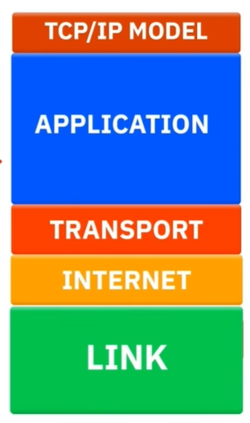
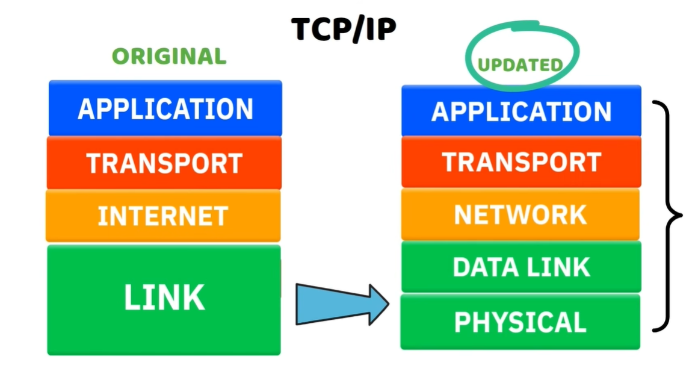
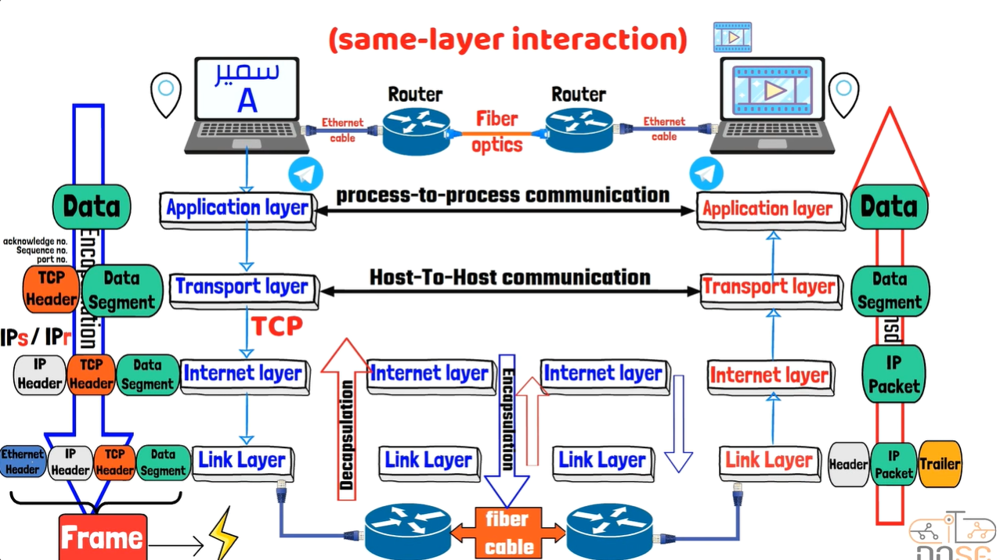
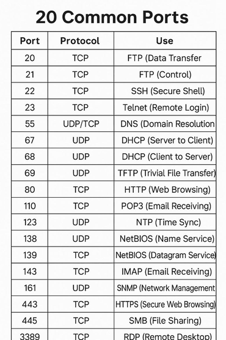

# 🌐 07. نموذج TCP/IP | TCP/IP Model

---

<h2 dir="rtl" align="right">📌 الفهرس السريع</h2>

| الرقم | الموضوع |
|---|---|
| 1 | [تعريف نموذج TCP/IP وأشكال استخدامه](#1-تعريف-نموذج-tcpip-وأشكال-استخدامه) |
| 2 | [ليه لسه بندرس OSI Model والشغال فعليًا هو TCP/IP؟](#2-ليه-لسه-بندرس-osi-model-والشغال-فعليا-هو-tcpip) |
| 3 | [النسخة القديمة (4 طبقات) مقابل النسخة المحدثة (5 طبقات)](#3-النسخة-القديمة-4-طبقات-مقابل-النسخة-المحدثة-5-طبقات) |
| 4 | [المقارنة التفصيلية بين OSI و TCP/IP](#4-المقارنة-التفصيلية-بين-osi-و-tcpip) |
| 5 | [وظيفة كل طبقة في نموذج TCP/IP](#5-وظيفة-كل-طبقة-في-نموذج-tcpip) |
| 6 | [أهم البروتوكولات العاملة في كل طبقة](#6-أهم-البروتوكولات-العاملة-في-كل-طبقة) |
| 7 | [الفرق بين TCP و UDP](#7-الفرق-بين-tcp-و-udp) |
| 8 | [المسميات (PDU) وعملية Encapsulation / Decapsulation](#8-المسميات-pdu-وعملية-encapsulation--decapsulation) |
| 9 | [سبب التسمية TCP/IP](#9-سبب-التسمية-tcpip) |
| 10 | [جدول مرجعي: أشهر 20 بورت (مراجعة سريعة)](#10-جدول-مرجعي-أشهر-20-بورت-مراجعة-سريعة) |
| 11 | [كبسولة المذاكرة السريعة](#11-كبسولة-المذاكرة-السريعة) |

---

<h2 dir="rtl" align="right" id="1-تعريف-نموذج-tcpip-وأشكال-استخدامه">1️⃣ تعريف نموذج TCP/IP وأشكال استخدامه</h2>

نموذج TCP/IP (اختصار لـ Transmission Control Protocol / Internet Protocol) هو مجموعة البروتوكولات (Protocol Suite) اللي **فعليًا بتشغّل الإنترنت والشبكات في الواقع العملي**، على عكس نموذج OSI اللي هو نموذج نظري مرجعي بس.

باختصار، هو بروتوكول (أو بالأصح مجموعة بروتوكولات) مصمم بفلسفة أساسية: **نقل الداتا بنجاح تحت أي ظروف**، حتى لو كان فيه:

* ضعف أو بطء في الاتصال.
* انقطاعات متكررة في الشبكة.
* فقدان جزء من الحزم (Packet Loss) أثناء النقل.

ده رجّاع لأصل نشأته؛ لأنه اتطور أصلًا من مشروع عسكري أمريكي (ARPANET) في السبعينات، وكان لازم يضمن وصول البيانات حتى لو جزء من الشبكة اتدمر أو انقطع (زي ظروف الحرب الباردة وقتها).

**أشكال استخدامه** (يعني بيتمثل عمليًا في):

* كل مرة بتفتح فيها متصفح وتزور موقع، بتستخدم TCP/IP عشان توصلك الداتا.
* كل تطبيق على الموبايل بيتواصل مع سيرفر (واتساب، انستجرام، تليجرام) بيعتمد على نفس المجموعة دي من البروتوكولات.
* عنونة كل جهاز على الشبكة (IP Addressing) وتوجيه الحزم بين الشبكات (Routing) كلها جزء من نفس النموذج.
* هو النموذج اللي بتتبني عليه كل بروتوكولات الطبقات العليا زي HTTP, FTP, DNS, SMTP وغيرهم.

---

<h2 dir="rtl" align="right" id="2-ليه-لسه-بندرس-osi-model-والشغال-فعليا-هو-tcpip">2️⃣ ليه لسه بندرس OSI Model والشغال فعليًا هو TCP/IP؟</h2>

سؤال منطقي جدًا وبيتسأل كتير: طالما TCP/IP هو اللي شغال فعليًا في كل الأجهزة والشبكات حوالينا، ليه بندرس OSI Model بـ 7 طبقات من الأساس؟ الإجابة في عدة نقاط:

* **الدقة التعليمية:** نموذج OSI بيقسم العملية لـ 7 طبقات منفصلة وواضحة، وده بيسهّل شرح وفهم كل وظيفة لوحدها من غير تداخل، عكس TCP/IP اللي بيدمج عدة وظائف في طبقة واحدة.
* **اللغة المشتركة:** كل مهندسي الشبكات في العالم بيستخدموا مصطلحات OSI (زي "المشكلة في Layer 2" أو "فحص على مستوى Layer 7") كلغة موحدة لوصف أي عطل أو تحليل، حتى لو الأدوات الفعلية شغالة بمنطق TCP/IP.
* **منهجية استكشاف الأعطال (Troubleshooting):** المرور طبقة بطبقة بمنطق OSI (من Physical لحد Application أو العكس) بيدي منهج منظم لعزل أي مشكلة في الشبكة، وده أساسي في امتحان الـ Network+ والعمل الميداني.
* **معيار المقارنة:** أي بروتوكول أو تقنية جديدة بتتقيّم وتتوصف بالنسبة لمكانها في طبقات OSI، حتى لو مش هتشتغل فعليًا كطبقة منفصلة.

باختصار: **OSI نموذج بنتعلم بيه إزاي نفهم ونحلل، وTCP/IP نموذج بيوصف إزاي الشبكة فعلًا بتشتغل.**

---

<h2 dir="rtl" align="right" id="3-النسخة-القديمة-4-طبقات-مقابل-النسخة-المحدثة-5-طبقات">3️⃣ النسخة القديمة (4 طبقات) مقابل النسخة المحدثة (5 طبقات)</h2>

نموذج TCP/IP نفسه اتقدم بيه أكتر من وصف عبر السنين:

* **النسخة الأصلية (Original / Classic) - 4 طبقات:** كانت بتضم Application, Transport, Internet, Link؛ وكانت طبقة الـ Link بتدمج فيها وظائف طبقتين مختلفين تمامًا (Data Link و Physical) في طبقة واحدة بس.
* **النسخة المحدثة (Updated / Modern) - 5 طبقات:** فصلت طبقة الـ Link القديمة لطبقتين منفصلتين وواضحتين: Data Link و Physical، عشان تقرب أكتر من دقة نموذج OSI وتسهّل عملية التدريس والمقارنة.

النسخة المحدثة دي هي اللي بتتدرّس غالبًا دلوقتي، وبتخلي المقارنة مع OSI أسهل بكتير؛ لأن أول 4 طبقات من OSI (من فوق) بتتقابل واحدة لواحدة مع طبقات TCP/IP الخمسة، وباقي الـ 3 طبقات العليا في OSI بتتلخص كلها في طبقة Application واحدة في TCP/IP.

---

<h2 dir="rtl" align="right" id="4-المقارنة-التفصيلية-بين-osi-و-tcpip">4️⃣ المقارنة التفصيلية بين OSI و TCP/IP</h2>

أهم نقطة لازم تتثبت في دماغك: **العدد مش هو المهم، المهم هو التطابق الوظيفي.** يعني طبقة الـ Application في TCP/IP مش بس "بديلة" لطبقة Application في OSI، لكنها **بتلخّص وتدمج وظائف 3 طبقات كاملة** من الـ OSI جوّاها.

**الخطأ الشائع اللي لازم تتجنبه:** كتير بيفتكروا إن طبقة الـ Application في TCP/IP بتقابل بس طبقة الـ Application في OSI وخلاص، وده غلط. الصح إنها بتقابل **3 طبقات مع بعض**: Application + Presentation + Session.

| طبقة OSI | تقابلها في TCP/IP |
|:---:|:---:|
| Application | Application |
| Presentation | Application |
| Session | Application |
| Transport | Transport |
| Network | Internet |
| Data Link | Data Link (أو Network Access في النسخة القديمة) |
| Physical | Physical (أو Network Access في النسخة القديمة) |

يعني ملخص التجميع كده:

* Application + Presentation + Session ➜ طبقة Application واحدة.
* Network ➜ طبقة Internet.
* Data Link + Physical ➜ طبقة Network Access (في النسخة القديمة) أو طبقتين منفصلتين بنفس الاسم في النسخة المحدثة.

---

<h2 dir="rtl" align="right" id="5-وظيفة-كل-طبقة-في-نموذج-tcpip">5️⃣ وظيفة كل طبقة في نموذج TCP/IP</h2>

هنا هنشرح وظيفة كل طبقة (بالنسخة المحدثة بـ 5 طبقات) بترتيب من الأعلى للأسفل:

* **طبقة Application:** الطبقة اللي بيتفاعل معاها المستخدم مباشرة والبرامج اللي بتنتج وتستقبل البيانات (المتصفح، تطبيق الإيميل، إلخ). هي المسؤولة عن تجهيز البيانات بصيغة يفهمها البرنامج، وبتدمج جوّاها كل وظائف التنسيق (Formatting) والتشفير وإدارة الجلسات اللي كانت متقسمة في OSI.
* **طبقة Transport:** مسؤولة عن نقل البيانات بين البرنامج المصدر والبرنامج الوجهة (Process-to-Process Communication)، وبتحدد هل النقل هيكون موثوق ومضمون (TCP) ولا سريع من غير ضمانات (UDP)، وبتستخدم أرقام البورتات (Port Numbers) لتوجيه البيانات للبرنامج الصح.
* **طبقة Internet:** مسؤولة عن العنونة المنطقية (Logical Addressing) باستخدام عناوين الـ IP، وتحديد أفضل مسار (Routing) عشان توصل الحزمة من الشبكة المصدر للشبكة الوجهة، حتى لو فيه شبكات كتير بينهم.
* **طبقة Network Access (أو Data Link + Physical في النسخة المحدثة):** مسؤولة عن النقل الفعلي للبيانات كإشارات كهربائية أو ضوئية أو راديوية عبر الوسط الفيزيائي (كابل، فايبر، واي فاي)، وكمان مسؤولة عن العنونة الفيزيائية (MAC Address) والتحكم في الوصول للوسط الناقل.

---

<h2 dir="rtl" align="right" id="6-أهم-البروتوكولات-العاملة-في-كل-طبقة">6️⃣ أهم البروتوكولات العاملة في كل طبقة</h2>

* **طبقة Application:** HTTP/HTTPS, FTP, SSH, Telnet, DNS, DHCP, SMTP, POP3, IMAP, SNMP.
* **طبقة Transport:** TCP و UDP بس - دول أهم بروتوكولين في الطبقة دي.
* **طبقة Internet:** IP (IPv4/IPv6), ICMP, ARP.
* **طبقة Network Access:** Ethernet, Wi-Fi (802.11), PPP، وبروتوكولات التحكم في الوصول للوسط زي CSMA/CD و CSMA/CA.

---

<h2 dir="rtl" align="right" id="7-الفرق-بين-tcp-و-udp">7️⃣ الفرق بين TCP و UDP</h2>

أهم نقطة في طبقة الـ Transport، وأكتر حاجة بتتسأل في الامتحان بشكل مباشر:

| المعيار | TCP | UDP |
|:---:|:---:|:---:|
| الاسم الكامل | Transmission Control Protocol | User Datagram Protocol |
| نوع الاتصال | موجه بالاتصال (Connection-Oriented) | بلا اتصال (Connectionless) |
| الموثوقية | مضمون 100% (تأكيد استلام + إعادة إرسال) | غير مضمون، من غير تأكيد استلام |
| السرعة | أبطأ نسبيًا بسبب الفحص والتأكيد | أسرع بكتير لعدم وجود أي فحص |
| ترتيب البيانات | بيحافظ على ترتيب وصول الحزم | مفيش ترتيب مضمون للحزم |
| مرحلة الاتصال | يبدأ بمصافحة (3-Way Handshake) | بيبدأ الإرسال على طول من غير أي مصافحة |
| أفضل استخدام له | نقل ملفات، مواقع، إيميلات (دقة أهم من السرعة) | بث فيديو مباشر، مكالمات صوتية (سرعة أهم من الدقة) |

**قاعدة تفتكرها بيها بسهولة:** لو البيانات لازم توصل **كاملة وصح** حتى لو أبطأ ➜ TCP. لو البيانات لازم توصل **بسرعة** حتى لو جزء منها ضاع ➜ UDP.

---

<h2 dir="rtl" align="right" id="8-المسميات-pdu-وعملية-encapsulation--decapsulation">8️⃣ المسميات (PDU) وعملية Encapsulation / Decapsulation</h2>

كل طبقة من طبقات TCP/IP بتضيف "غلاف" (Header) خاص بيها فوق البيانات القادمة من الطبقة اللي فوقها، وده اللي بيتسمى **Protocol Data Unit (PDU)** - يعني اسم البيانات بيتغير حسب الطبقة اللي هي فيها دلوقتي:

| الطبقة | اسم الـ PDU |
|:---:|:---:|
| Application | Data |
| Transport | Segment (لو TCP) أو Datagram (لو UDP) |
| Internet | Packet |
| Network Access | Frame |

**عملية Encapsulation (التغليف):** بتحصل عند **جهاز الإرسال**؛ البيانات بتنزل من طبقة Application للأسفل، وكل طبقة بتضيف Header خاص بيها (فيه معلومات زي رقم البورت، عنوان الـ IP، عنوان الـ MAC) لحد ما توصل لطبقة Network Access وتتحول لإشارات وتتبعت فعليًا على الوسط الناقل.

**عملية Decapsulation (فك التغليف):** بتحصل عند **جهاز الاستقبال**، وهي عكس العملية بالظبط؛ البيانات بتطلع من طبقة Network Access لفوق، وكل طبقة بتشيل الـ Header بتاعها وتقرأ المعلومة اللي محتاجاها، وتسلّم الباقي للطبقة اللي فوقها، لحد ما توصل البيانات الأصلية لطبقة الـ Application عند المستقبل.

**مفهوم Same-Layer Interaction:** المهم إنك تفهم إن كل طبقة عند جهاز الإرسال بتتواصل منطقيًا مع **نفس الطبقة بالظبط** عند جهاز الاستقبال (مثلًا طبقة Transport عند الاثنين بتتفاهم مع بعض بمنطق Host-to-Host Communication)، حتى لو فعليًا البيانات مرّت بكل الطبقات التانية وعدّت على أجهزة توجيه (Routers) في النص.

---

<h2 dir="rtl" align="right" id="9-سبب-التسمية-tcpip">9️⃣ سبب التسمية TCP/IP</h2>

النموذج اتسمى بالاسم ده لأنه في الأساس مسمى على اسم **أهم وأشهر بروتوكولين** فيه، واللي بيمثلوا العمود الفقري لعملية النقل كلها:

* **TCP (Transmission Control Protocol):** ممثل طبقة الـ Transport، ومسؤول عن ضمان وصول البيانات بشكل موثوق ومرتب.
* **IP (Internet Protocol):** ممثل طبقة الـ Internet، ومسؤول عن العنونة والتوجيه بين الشبكات.

رغم إن النموذج فعليًا بيضم عشرات البروتوكولات التانية (زي UDP, ICMP, ARP, DNS...)، إلا إن الاسم اتثبت تاريخيًا على أشهر بروتوكولين فيه، بالظبط زي ما بيحصل مع أسماء تجارية كتير بتتسمى على أول أو أشهر منتج فيها.

---

<h2 dir="rtl" align="right" id="10-جدول-مرجعي-أشهر-20-بورت-مراجعة-سريعة">🔟 جدول مرجعي: أشهر 20 بورت (مراجعة سريعة)</h2>

جدول مرجعي سريع لأشهر البورتات اللي بتشتغل فوق طبقة الـ Transport (تفاصيلها الكاملة موجودة في ملف [5-port-number.md](5-port-number.md))، مفيد هنا كمراجعة سريعة وربط بين البروتوكول والطبقة اللي بيشتغل عليها:

| البورت | البروتوكول | الاستخدام |
|:---:|:---:|:---:|
| 20 | TCP | FTP (نقل البيانات) |
| 21 | TCP | FTP (التحكم) |
| 22 | TCP | SSH |
| 23 | TCP | Telnet |
| 53 | UDP/TCP | DNS |
| 67 | UDP | DHCP (من السيرفر للعميل) |
| 68 | UDP | DHCP (من العميل للسيرفر) |
| 69 | UDP | TFTP |
| 80 | TCP | HTTP |
| 110 | TCP | POP3 |
| 123 | UDP | NTP |
| 138 / 139 | UDP / TCP | NetBIOS |
| 143 | TCP | IMAP |
| 161 | UDP | SNMP |
| 443 | TCP | HTTPS |
| 445 | TCP | SMB |
| 3389 | TCP | RDP |

---

<h2 dir="rtl" align="right" id="11-كبسولة-المذاكرة-السريعة">📝 كبسولة المذاكرة السريعة (Cheat Sheet)</h2>

| النقطة | الملخص |
|:---:|:---:|
| التعريف | مجموعة بروتوكولات فعليًا بتشغّل الإنترنت، تصميمها الأساسي لضمان نقل الداتا رغم الأعطال |
| ليه بندرس OSI برضو | عشان الدقة التعليمية واللغة المشتركة ومنهجية استكشاف الأعطال |
| عدد الطبقات | 4 طبقات (النسخة القديمة) أو 5 طبقات (النسخة المحدثة اللي فصلت Data Link عن Physical) |
| المطابقة مع OSI | Application+Presentation+Session ➜ Application \| Network ➜ Internet \| Data Link+Physical ➜ Network Access |
| بروتوكولات Transport | TCP (موثوق وبطيء) و UDP (سريع وغير موثوق) |
| PDU بالترتيب | Data ➜ Segment/Datagram ➜ Packet ➜ Frame |
| Encapsulation | تغليف البيانات بإضافة Headers عند جهاز الإرسال (من فوق لتحت) |
| Decapsulation | فك التغليف عند جهاز الاستقبال (من تحت لفوق) |
| سبب التسمية | نسبة لأشهر بروتوكولين فيه: TCP و IP |

