

# Physical Media - الربط الفيزيائي

| القسم الرئيسي | المواضيع الفرعية |
| :--- | :--- |
| **[مقدمة](#intro)** | - |
| **[أولاً: الكابلات المحورية](#coaxial)** | • [تعريف الكابل المحوري](#coaxial-def) • [مكونات الكابل المحوري](#coaxial-components) • [الأنواع الرئيسية: Thick و Thin](#coaxial-types) • [معايير RG للكابلات المحورية](#coaxial-rg) • [موصلات الكابل المحوري](#coaxial-connectors) |
| **[ثانياً: الكابلات المجدولة](#twisted-pair)** | • [تعريف الكابل المجدول](#twisted-pair-def) • [مكانة الكابل المجدول في الشبكات](#twisted-pair-status) • [مكونات الكابل المجدول](#twisted-pair-components) • [ترتيب الألوان (T568A / T568B)](#color-order) • [أنماط توصيل الكابل: Straight / Crossover / Rollover](#cable-patterns) • [أنواع الكابل المجدول من ناحية التغليف: UTP و STP](#utp-stp) • [أطراف رؤوس الكابل المجدول](#twisted-pair-connectors) • [فئات الكابلات المجدولة (Cat)](#cable-categories) |
| **[ثالثاً: كابلات الألياف الضوئية](#fiber)** | • [تعريف كابل الألياف الضوئية واستخداماته](#fiber-def) • [مكونات كابل الألياف الضوئية](#fiber-components) • [أقسام تصنيع الألياف الضوئية: Single-mode و Multi-mode](#fiber-modes) • [أطراف رؤوس كابلات الألياف الضوئية](#fiber-connectors) • [منافذ الكابلات الضوئية](#fiber-ports) • [مميزات وعيوب الألياف الضوئية](#fiber-pros-cons) |
| **[رابعاً: الكابلات المتسلسلة ومنافذها](#serial)** | • [تعريف الكابل المتسلسل واستخدامه](#serial-def) • [الـ DTE والـ DCE](#dte-dce) • [طريقة التوصيل بالأجهزة](#serial-connection) |
| **[خامساً: لوحة تجميع الكابلات](#patch-panel)** | • [تعريفها وأنواعها](#patch-panel-types) |
| **[سادساً: خصائص كابلات الشبكة](#cable-properties)** | • [سرعة النقل والمسافة](#speed-distance) • [اتجاه الإرسال: Simplex / Half Duplex / Full Duplex](#duplex-modes) |
| **[ملخص شامل للمقارنة بين كل الكابلات](#summary-table)** | - |

<h2 id="intro" dir="rtl" align="right">مقدمة</h2>

الموضوع ده بيتكلم عن الطبقة الفيزيائية (Physical Layer) في نموذج OSI، وتحديدًا وسائط النقل (Physical Media) اللي بتوصل الأجهزة ببعضها في الشبكة. الوسائط دي بتتقسم بشكل أساسي لـ 3 أنواع رئيسية من الكابلات، بالإضافة لكابلات التوصيل الإداري والتحكم:

1. الكابلات المحورية Coaxial Cable
2. الكابلات المجدولة Twisted Pair
3. كابلات الألياف الضوئية Fiber Optic
4. الكابلات المتسلسلة Serial Cables (للتحكم والإدارة)

فهم الفرق بين كل نوع، ومميزاته وعيوبه، ومتى بيتستخدم، هو أساس أي حد بيدخل مجال الشبكات أو الأمن السيبراني، لأن أي هجوم فيزيائي على الشبكة (زي الـ Wiretapping أو التنصت على الكابل) بيعتمد على فهمك لطبيعة الوسيط نفسه.

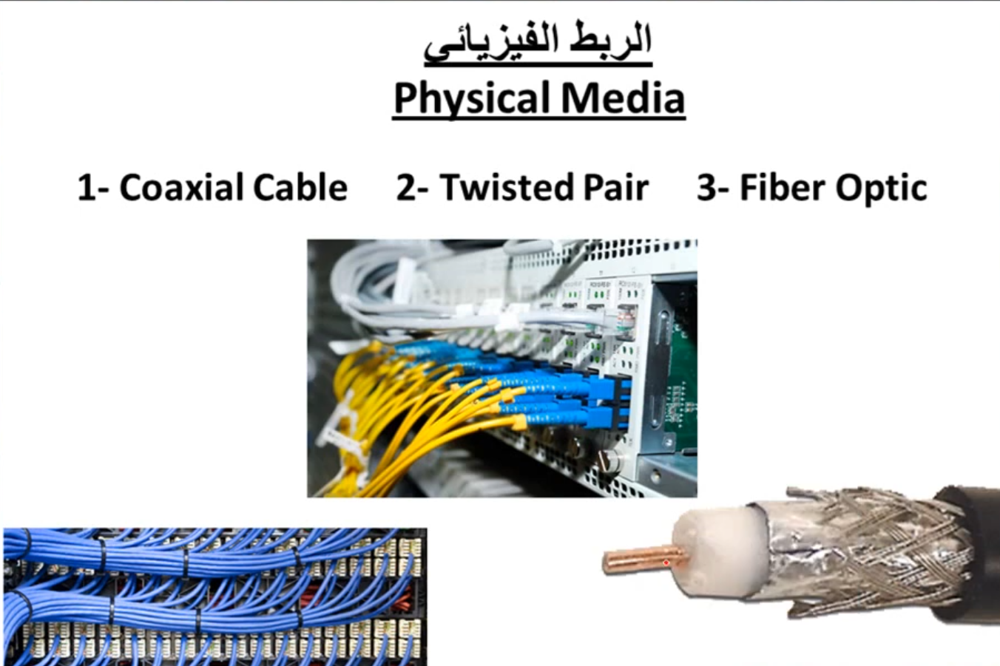
 
<em>الأنواع الثلاثة الأساسية لوسائط الربط الفيزيائي</em>

---

<h2 id="coaxial" dir="rtl" align="right">أولاً: الكابلات المحورية Coaxial Cable</h2>

<h3 id="coaxial-def" dir="rtl" align="right">تعريف الكابل المحوري</h3>

الكابل المحوري هو كابل نحاسي قديم نسبيًا كان بيُستخدم كوسيط أساسي لنقل البيانات في الشبكات القديمة، وحاليًا بقى استخدامه الأساسي في نقل إشارات التلفزيون (Cable TV) والإنترنت من مزودي الخدمة (ISP) عن طريق تقنية DOCSIS، وكمان في أنظمة المراقبة (CCTV) القديمة.

سُمي "محوري" لأنه بيتكون من موصل مركزي واحد (core) محاط بطبقات تانية تلف حوله في نفس المحور (axis).

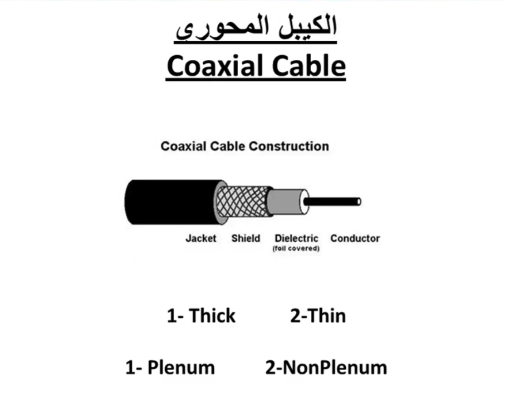
 
<em>الكابل المحوري ومكوناته الأساسية</em>

<h3 id="coaxial-components" dir="rtl" align="right">مكونات الكابل المحوري</h3>

الكابل المحوري بيتكون من 4 طبقات أساسية من الداخل للخارج:

| الطبقة | الاسم بالإنجليزي | الوظيفة |
|:---:|:---:|:---:|
| اللب المركزي | Core / Conductor | سلك نحاسي مصمت أو مجدول، هو المسؤول عن نقل الإشارة الكهربائية فعليًا |
| العازل | Dielectric Insulator | طبقة بلاستيكية بتعزل الـ Core عن الحماية المعدنية وتمنع التماس |
| الحماية المعدنية | Metallic Shield / Braiding | شبكة معدنية مجدولة أو ورقة ألومنيوم بتحمي الإشارة من التداخل الكهرومغناطيسي (EMI) |
| الغلاف الخارجي | Outer Jacket | طبقة بلاستيكية خارجية بتحمي الكابل من العوامل الخارجية (رطوبة، احتكاك) |

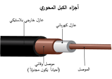
 
<em>مقطع عرضي يوضح طبقات الكابل المحوري</em>

💡 **ملاحظة أمنية**: طبقة الـ Shield مش بس بتمنع التداخل، لكن كمان بتقلل من إمكانية تسريب الإشارة للخارج (اللي ممكن يُستغل في هجمات التنصت الفيزيائي)، وده سبب من أسباب تفضيل الكابل المحوري على الكابل المجدول العادي في بيئات معينة قديمًا.

<h3 id="coaxial-types" dir="rtl" align="right">الأنواع الرئيسية: Thick و Thin</h3>

**أ- Thick Coaxial (10Base5)**
- كابل سميك وصلب (قطره حوالي 10 مم)، صعب التمديد والانحناء.
- بيدعم مسافات أطول تصل لحوالي 500 متر بدون تكرار للإشارة.
- كان بيُستخدم كـ "العمود الفقري" (Backbone) في الشبكات الكبيرة، وبيتم توصيل الأجهزة بيه عن طريق وحدة تسمى Vampire Tap أو Transceiver.
- معروف كمان باسم "Frozen Yellow Garden Hose" بسبب لونه الأصفر وصلابته.

**ب- Thin Coaxial (10Base2)**
- كابل أرفع وأسهل في التمديد، أرخص من النوع السميك.
- المسافة القصوى أقل، حوالي 185 متر لكل قطعة.
- بيتم توصيله مباشرة بكارت الشبكة عن طريق موصل BNC على شكل حرف T، وبيحتاج مقاومة ختامية (Terminator) في نهاية كل طرف من الشبكة عشان يمنع ارتداد الإشارة.
- كان بيُستخدم في شبكات Bus Topology الصغيرة.

 فيه كمان تصنيف تاني للكابل المحوري حسب مكان التركيب: Plenum (غلافه مقاوم للحريق ومسموح تمديده في فتحات التكييف بالأسقف) و Non-Plenum (غلاف عادي PVC، أرخص لكن ممنوع استخدامه في أماكن التهوية لأنه بيطلق غازات سامة عند الاحتراق).

<h3 id="coaxial-rg" dir="rtl" align="right">معايير RG للكابلات المحورية</h3>

RG اختصار لـ Radio Guide، وهي معايير بتحدد سُمك ومواصفات الكابل المحوري ومقاومته الكهربائية (Impedance). أشهر الأنواع:

| المعيار | الاسم الشائع | المقاومة | الاستخدام |
|:---:|:---:|:---:|:---:|
| RG-6 | - | 75 أوم | كابلات التلفزيون والإنترنت من مزودي الخدمة، مسافات أطول من RG-59 |
| RG-59 | - | 75 أوم | كابلات CCTV ونقل الفيديو التناظري لمسافات قصيرة |
| RG-58 A/U | Thinnet | 50 أوم | شبكات 10Base2 |
| RG-8 | Thicknet | 50 أوم | شبكات 10Base5 |
| RG-62 | - | 93 أوم | شبكات ARCnet (قديمة جدًا) |

 الفرق الأساسي بين معايير الـ 50 أوم ومعايير الـ 75 أوم إن الأولى صُممت أصلًا لنقل بيانات الشبكات (إشارة رقمية)، والتانية صُممت لنقل إشارات الفيديو والتلفزيون (إشارة تناظرية عالية التردد).

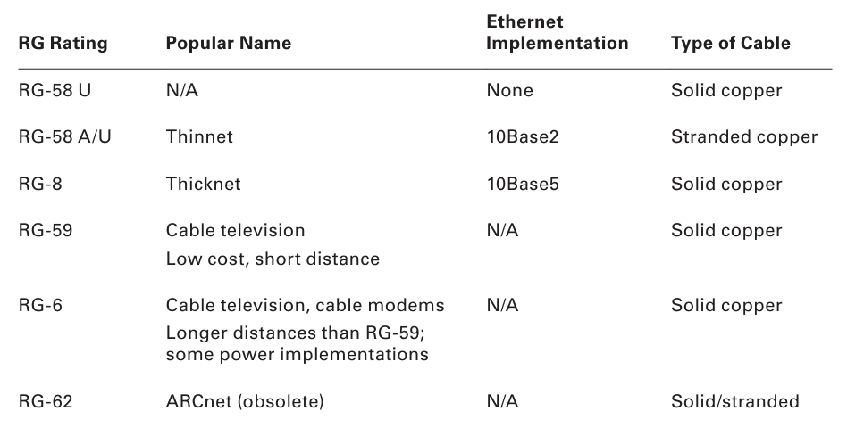
 
<em>جدول معايير RG واستخداماتها</em>

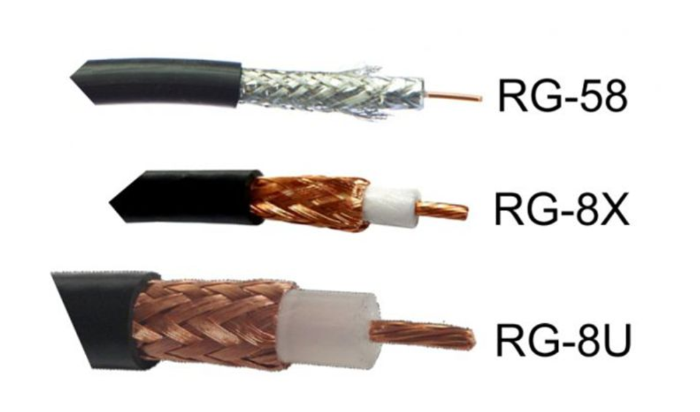
 
<em>مقارنة فيزيائية بين RG-58 و RG-8X و RG-8U</em>

<h3 id="coaxial-connectors" dir="rtl" align="right">موصلات الكابل المحوري</h3>

- **BNC (Bayonet Neill-Concelman)**: موصل بيتقفل بحركة لف وقفل سريع (ربع لفة)، بيُستخدم مع الكابل الرفيع (Thin Coax) وفي أجهزة القياس والـ CCTV القديمة.
- **F-Connector**: موصل بيتلف زي البرغي، وهو الأشهر حاليًا لأنه بيُستخدم في كابلات الـ RG-6 لتوصيل التلفزيون والراوتر بخدمة الإنترنت الكابلي.
- **N-Connector**: موصل أكبر حجمًا وأقوى، بيُستخدم في التطبيقات الصناعية وأنظمة الاتصالات اللاسلكية عالية القدرة.
- **Terminator**: مش موصل توصيل فعلي، لكنه مقاومة بتتركب في آخر الكابل في شبكات الـ Bus Topology عشان تمتص الإشارة وتمنع ارتدادها.

---

<h2 id="twisted-pair" dir="rtl" align="right">ثانياً: الكابلات المجدولة Twisted Pair</h2>

<h3 id="twisted-pair-def" dir="rtl" align="right">تعريف الكابل المجدول</h3>

الكابل المجدول هو نوع من كابلات النحاس بيتكون من أزواج من الأسلاك ملفوفة حوالين بعضها (كل زوج بيتلف حوالين نفسه بعدد لفات مختلف عن باقي الأزواج). فكرة اللف دي مش شكلية، لكنها بتقلل من التداخل الكهرومغناطيسي بين الأزواج نفسها (Crosstalk) ومن التداخل الخارجي (EMI).

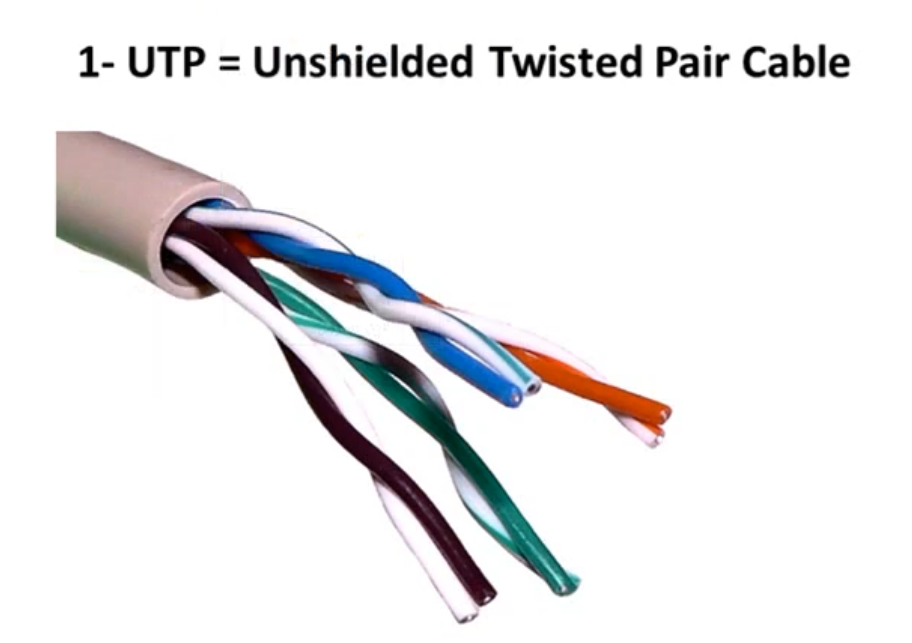
 
<em>الكابل المجدول غير المحمي UTP</em>

<h3 id="twisted-pair-status" dir="rtl" align="right">مكانة الكابل المجدول في عالم الشبكات</h3>

الكابل المجدول هو **الوسيط الأكثر انتشارًا** في شبكات الـ LAN حاليًا، بسبب سهولة تركيبه، رخص تكلفته مقارنة بالألياف الضوئية، وكفايته لمعظم استخدامات الشبكات المحلية. بيُستخدم في توصيل الأجهزة بالـ Switch، وفي البنية التحتية لمعظم المكاتب والمنازل.

<h3 id="twisted-pair-components" dir="rtl" align="right">مكونات الكابل المجدول</h3>

- **الأسلاك النحاسية**: 8 أسلاك مقسمة لـ 4 أزواج (pairs)، كل زوج ملفوف حوالين بعضه.
- **العزل الفردي**: كل سلك مغطى بطبقة عزل ملونة تميزه.
- **طبقة الحماية (اختيارية)**: موجودة بس في النوع المحمي STP.
- **الغلاف الخارجي**: بيحمي كل الأزواج الأربعة سوا.

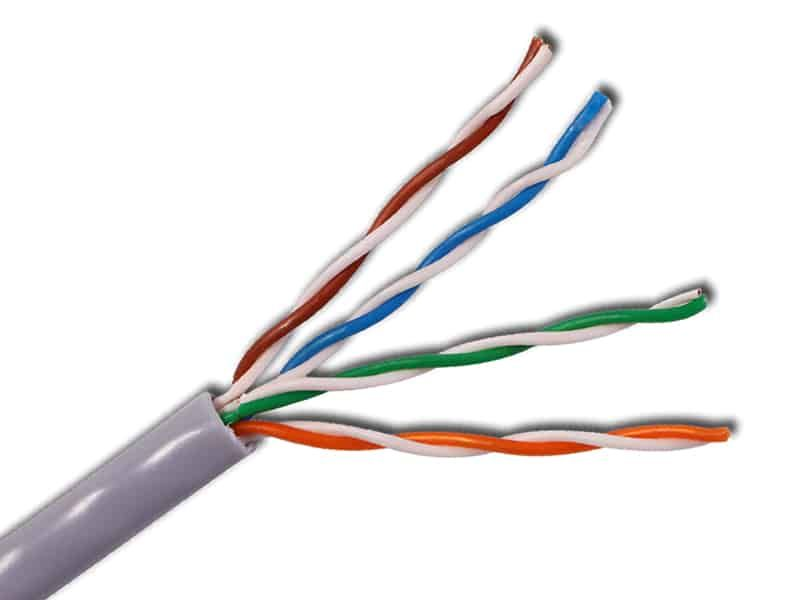
 
<em>الأزواج الأربعة داخل الكابل المجدول وألوانها (أخضر / أزرق / برتقالي / بني)</em>

<h3 id="color-order" dir="rtl" align="right">ترتيب الألوان (T568A / T568B)</h3>

فيه معياريين عالميين لترتيب ألوان الأسلاك الثمانية جوه موصل الـ RJ-45، وهما T568A و T568B. الاختلاف بينهم بس في مكان زوجي الألوان الأخضر والبرتقالي، وباقي الترتيب زي بعضه.

**ترتيب T568A** (من الطرف 1 للطرف 8):
أبيض/أخضر، أخضر، أبيض/برتقالي، أزرق، أبيض/أزرق، برتقالي، أبيض/بني، بني

**ترتيب T568B** (من الطرف 1 للطرف 8):
أبيض/برتقالي، برتقالي، أبيض/أخضر، أزرق، أبيض/أزرق، أخضر، أبيض/بني، بني

T568B هو المعيار الأكثر استخدامًا في الشركات والشبكات التجارية حاليًا، رغم إن الاتنين بيشتغلوا بنفس الكفاءة الكهربائية طالما اتطبقوا بشكل متسق على طرفي الكابل.

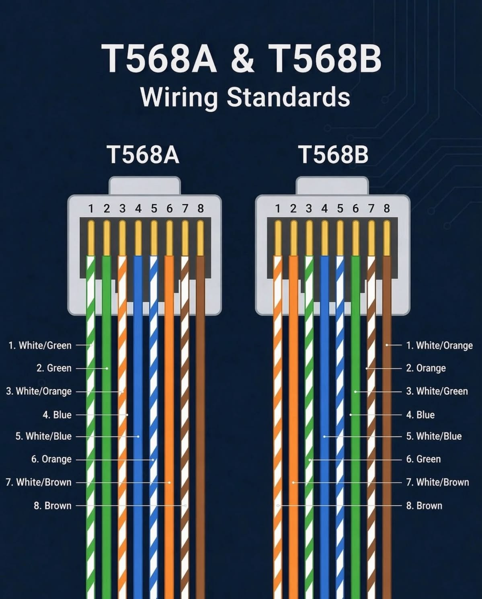
 
<em>ترتيب الأسلاك الكامل في معياري T568A و T568B</em>

<h3 id="cable-patterns" dir="rtl" align="right">أنماط توصيل الكابل: Straight-Through / Crossover / Rollover</h3>

بناءً على ترتيب الألوان في طرفي الكابل، بيتحدد نوع الكابل ووظيفته:

**أ- Straight-Through Cable**
- نفس ترتيب الألوان في الطرفين (مثلاً T568B في الطرفين).
- بيُستخدم لتوصيل أجهزة من **نوع مختلف** فيما بينها: PC ↔ Switch، أو Switch ↔ Router.
- هو الأكثر شيوعًا في الاستخدام اليومي.

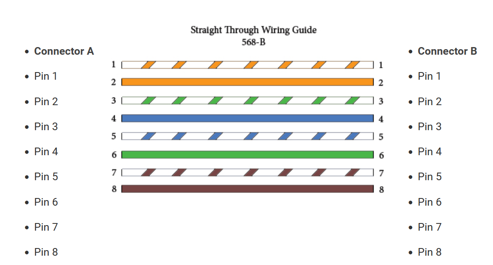
 
<em>ترتيب الأسلاك في كابل Straight-Through</em>

**ب- Crossover Cable**
- ترتيب مختلف بين الطرفين: طرف T568A والطرف التاني T568B.
- بيُستخدم لتوصيل أجهزة من **نفس النوع** فيما بينها: PC ↔ PC، أو Switch ↔ Switch، أو Router ↔ Router.
- الفكرة إنه بيقلب أسلاك الإرسال (Tx) مع أسلاك الاستقبال (Rx) عشان الجهازين يقدروا يبعتوا ويستقبلوا صح بدون تعارض.
- **ملاحظة**: أغلب الأجهزة الحديثة فيها خاصية Auto-MDIX اللي بتخلي الجهاز يكتشف نوع التوصيل تلقائيًا، فبقى ممكن تستخدم Straight-Through حتى بين أجهزة من نفس النوع.

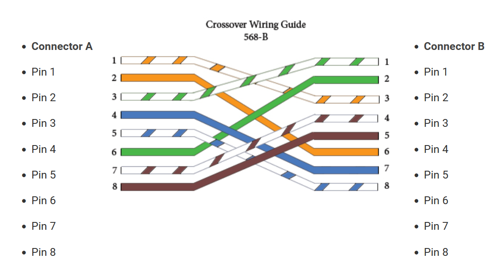
 
<em>ترتيب الأسلاك في كابل Crossover</em>

**جـ- Rollover Cable**
- ترتيب الألوان في الطرف التاني هو **معكوس تمامًا** لترتيب الطرف الأول (لو الطرف الأول 1-2-3-4-5-6-7-8، الطرف التاني بيبقى 8-7-6-5-4-3-2-1).
- مش بيُستخدم لنقل بيانات الشبكة العادية، لكنه بيُستخدم لأغراض **الإدارة والتحكم** (Console/Management)، بالتحديد لتوصيل جهاز الكمبيوتر بمنفذ الـ Console في الراوتر أو السويتش عن طريق موصل RJ-45 to DB-9 أو USB.
- معروف كمان باسم Cisco Console Cable.

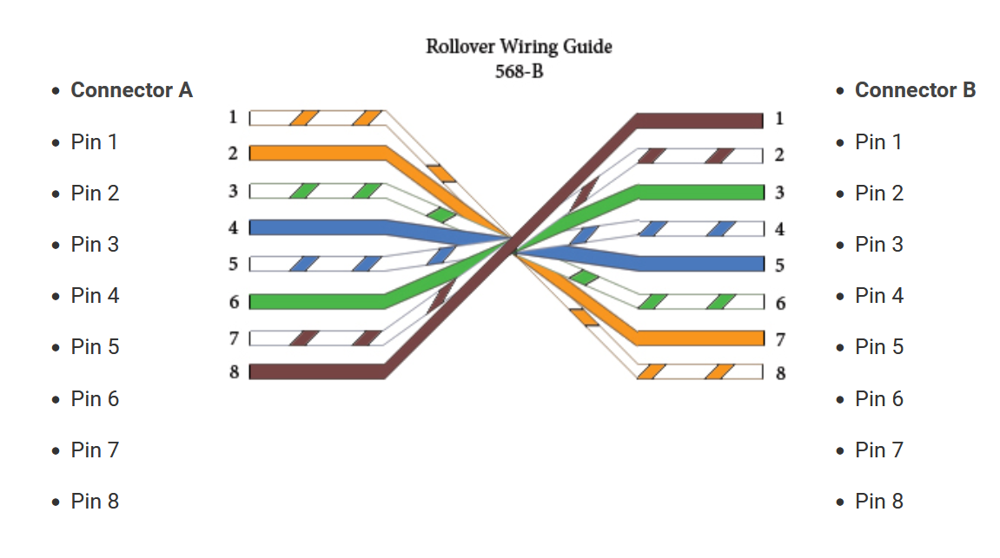
 
<em>ترتيب الأسلاك في كابل Rollover</em>

جدول مقارنة سريع:

| النوع | ترتيب الطرفين | الاستخدام | يوصل بين |
|:---:|:---:|:---:|:---:|
| Straight-Through | نفس المعيار في الطرفين | نقل بيانات بين أجهزة مختلفة | PC ↔ Switch، Switch ↔ Router |
| Crossover | معيار مختلف بين الطرفين (A و B) | نقل بيانات بين أجهزة متشابهة | PC ↔ PC، Switch ↔ Switch |
| Rollover | ترتيب معكوس بالكامل | إدارة وتحكم (Console) | PC ↔ Router/Switch Console Port |

<h3 id="utp-stp" dir="rtl" align="right">أنواع الكابل المجدول من ناحية التغليف</h3>

**1- UTP (Unshielded Twisted Pair)**
- الأزواج غير محمية بأي طبقة معدنية إضافية، غلافه الخارجي بلاستيكي بس.
- أرخص وأسهل في التركيب والمرونة.
- الأكثر شيوعًا في الشبكات المحلية والمكاتب والمنازل.
- أكثر عرضة للتداخل الكهرومغناطيسي (EMI) في البيئات الصناعية القريبة من مصادر كهرباء قوية.

**2- STP (Shielded Twisted Pair)** وأنواعها الفرعية:
- **FTP (Foiled Twisted Pair)**: طبقة ورق ألومنيوم واحدة بتغلف كل الأزواج مع بعض.
- **STP**: كل زوج بيتغلف بطبقة حماية على حدة، حماية أقوى من FTP.
- **S-FTP / SSTP (Screened Shielded Twisted Pair)**: بتجمع بين حماية كل زوج على حدة + طبقة حماية عامة تانية للكابل كله، أعلى مستوى حماية.

- بيُستخدم في البيئات اللي فيها تداخل كهرومغناطيسي عالي، زي المصانع وجانب المعدات الكهربائية الثقيلة.
- بيحتاج توصيل أرضي (Grounding) صحيح عشان يبقى فعّال، وإلا ممكن يبقى مصدر تشويش بدل ما يمنعه.

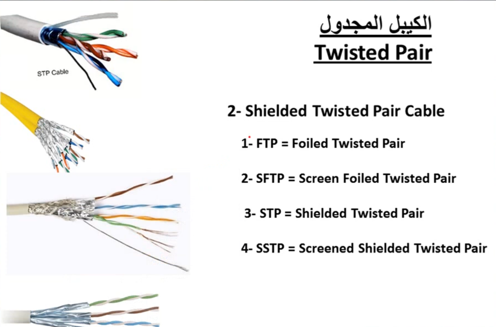
 
<em>أنواع الكابل المجدول المحمي: FTP / STP / S-FTP / SSTP</em>

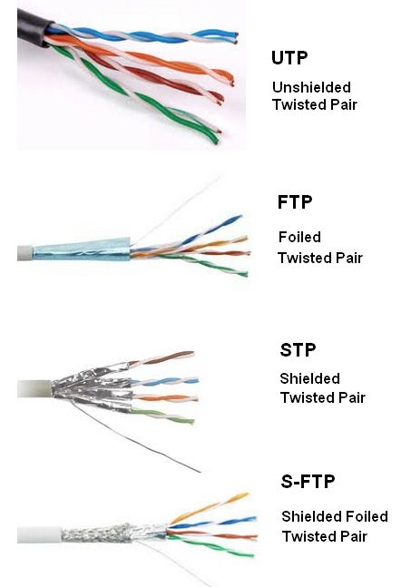
 
<em>مقارنة بصرية بين UTP و FTP و STP و S-FTP</em>

| المقارنة | UTP | STP |
|:---:|:---:|:---:|
| التكلفة | أقل | أعلى |
| المرونة | أعلى | أقل |
| الحماية من التداخل | أقل | أعلى |
| سهولة التركيب | أسهل | أصعب (يحتاج تأريض) |
| الاستخدام الشائع | مكاتب، منازل، شبكات LAN عادية | بيئات صناعية، مناطق تداخل كهرومغناطيسي عالي |

<h3 id="twisted-pair-connectors" dir="rtl" align="right">أطراف رؤوس الكابل المجدول</h3>

- **RJ-45**: الموصل الأشهر لكابلات الشبكة (8 أسنان)، بيُستخدم في كل تطبيقات الإيثرنت الحديثة.
- **RJ-11**: أصغر حجمًا (4 أو 6 أسنان)، بيُستخدم في خطوط الهاتف الأرضي والفاكس، وأحيانًا في مودمات الـ ADSL.

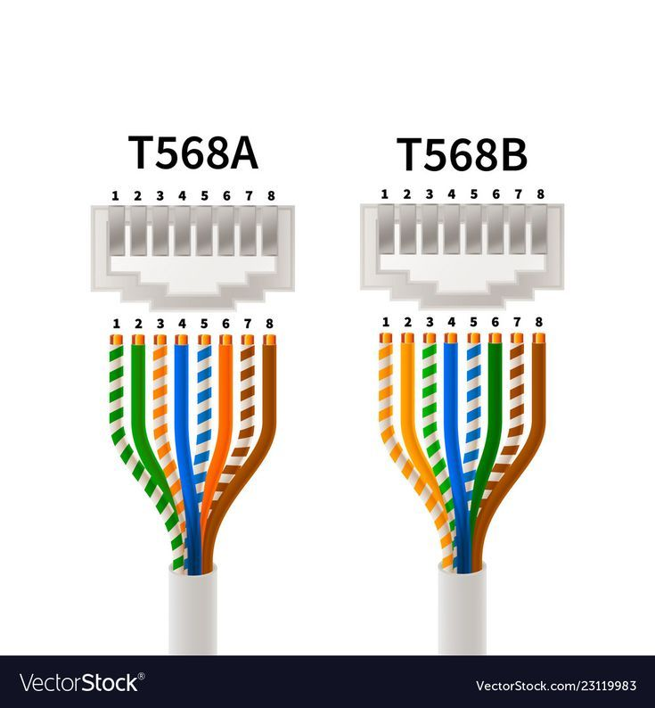
 
<em>ترقيم أسنان موصل RJ-45 من 1 إلى 8 حسب المعيارين</em>

<h3 id="cable-categories" dir="rtl" align="right">فئات الكابلات المجدولة (Cat)</h3>

| الفئة | أقصى سرعة | أقصى تردد | ملاحظات |
|:---:|:---:|:---:|:---:|
| Cat 3 | 10 Mbps | 16 MHz | قديم جدًا، كان بيُستخدم في الهاتف والشبكات القديمة |
| Cat 5 | 100 Mbps | 100 MHz | قديم، حل محله Cat 5e |
| Cat 5e | 1 Gbps | 100 MHz | الأكثر شيوعًا في المنازل والمكاتب الصغيرة (e = enhanced) |
| Cat 6 | 1 Gbps (10 Gbps لمسافة قصيرة تصل لـ 55 م) | 250 MHz | فيه فاصل بلاستيكي داخلي (spline) لتقليل الـ Crosstalk |
| Cat 6a | 10 Gbps لمسافة 100 م كاملة | 500 MHz | مواصفات أقوى ضد التداخل، أسلاك أسمك |
| Cat 7 | 10 Gbps فأكثر | 600 MHz | كل زوج محمي على حدة (STP)، يحتاج موصل خاص GG45 |
| Cat 8 | 25-40 Gbps | 2000 MHz | لمسافات قصيرة جدًا (30 م)، بيُستخدم في مراكز البيانات |

**حد المسافة العام** لكابلات النحاس المجدولة هو **100 متر** كأقصى مسافة قبل ما الإشارة تضعف بشكل مؤثر (Attenuation)، وده بينطبق على معظم فئات الـ Cat بغض النظر عن السرعة.

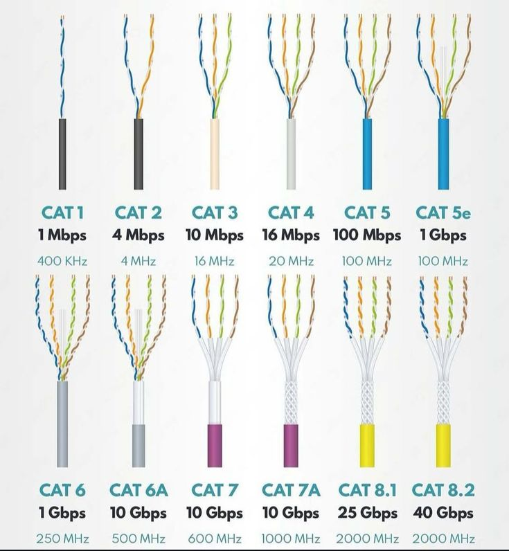
 
<em>مخطط سرعات وترددات فئات Cat المختلفة</em>

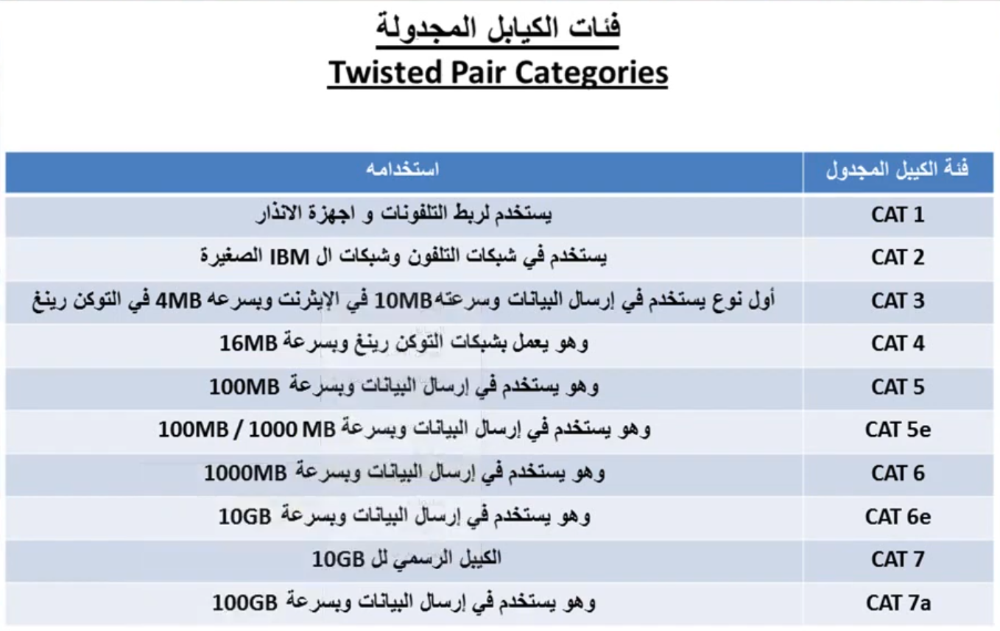
 
<em>جدول استخدامات كل فئة Cat</em>

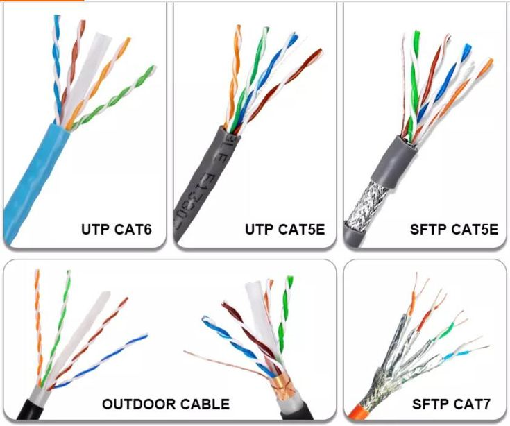
 
<em>مقارنة فيزيائية بين فئات UTP/SFTP المختلفة</em>

---

<h2 id="fiber" dir="rtl" align="right">ثالثاً: كابلات الألياف الضوئية Fiber Optic Cables</h2>

<h3 id="fiber-def" dir="rtl" align="right">تعريف كابل الألياف الضوئية واستخداماته</h3>

كابل الألياف الضوئية بينقل البيانات في صورة **نبضات ضوئية** بدل الإشارات الكهربائية، عن طريق ألياف زجاجية أو بلاستيكية رفيعة جدًا. بيُستخدم أساسًا في:
- الربط بين المدن والدول (Backbone Networks) وخطوط الإنترنت البحرية.
- الربط بين مراكز البيانات (Data Centers).
- شبكات الـ FTTH (Fiber To The Home) لتوفير إنترنت فائق السرعة للمنازل.
- أي بيئة محتاجة سرعة عالية جدًا أو مسافات طويلة أو حماية قصوى من التنصت.

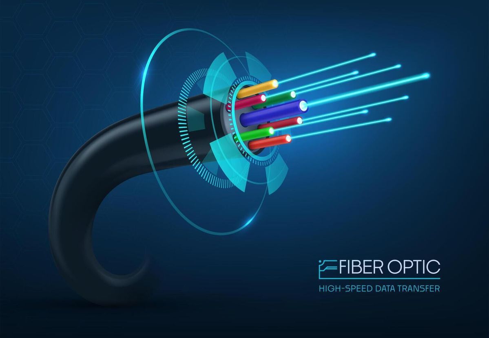
 
<em>كابل الألياف الضوئية - نقل بيانات عالي السرعة</em>

<h3 id="fiber-components" dir="rtl" align="right">مكونات كابل الألياف الضوئية</h3>

| المكوّن | الوظيفة |
|:---:|:---:|
| Glass Core | اللب الزجاجي الرفيع اللي بينقل الضوء فعليًا |
| Cladding | طبقة زجاجية حوالين الـ Core بمعامل انكسار مختلف، بتخلي الضوء ينعكس جوه الـ Core بدل ما يتسرب (مبدأ الانعكاس الكلي الداخلي) |
| Coating / Buffer | طبقة بلاستيكية بتحمي الألياف من الرطوبة والكسر |
| Strength Member | ألياف تقوية (زي الكيفلار أو أسلاك الصلب) بتحمي الكابل من الشد الميكانيكي |
| Outer Jacket | الغلاف الخارجي الواقي |

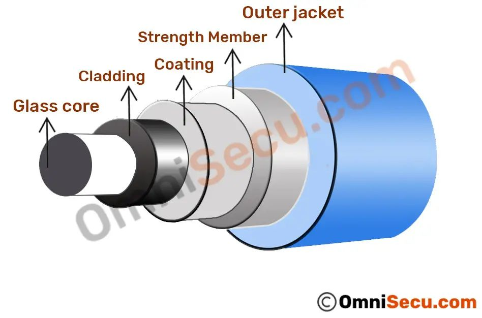
 
<em>مكونات كابل الألياف الضوئية الأساسية: Core / Cladding / Coating / Strength Member / Outer Jacket</em>

الكابلات المستخدمة في المسافات الطويلة جدًا (زي الكابلات البحرية) بتضيف طبقات حماية إضافية زي أسلاك الصلب المجلفن (Galvanized Armor Wires) وحاجز مائي (Water Barrier) وأنبوب نحاسي لحماية الألياف من الضغط والرطوبة تحت الأرض أو تحت البحر:

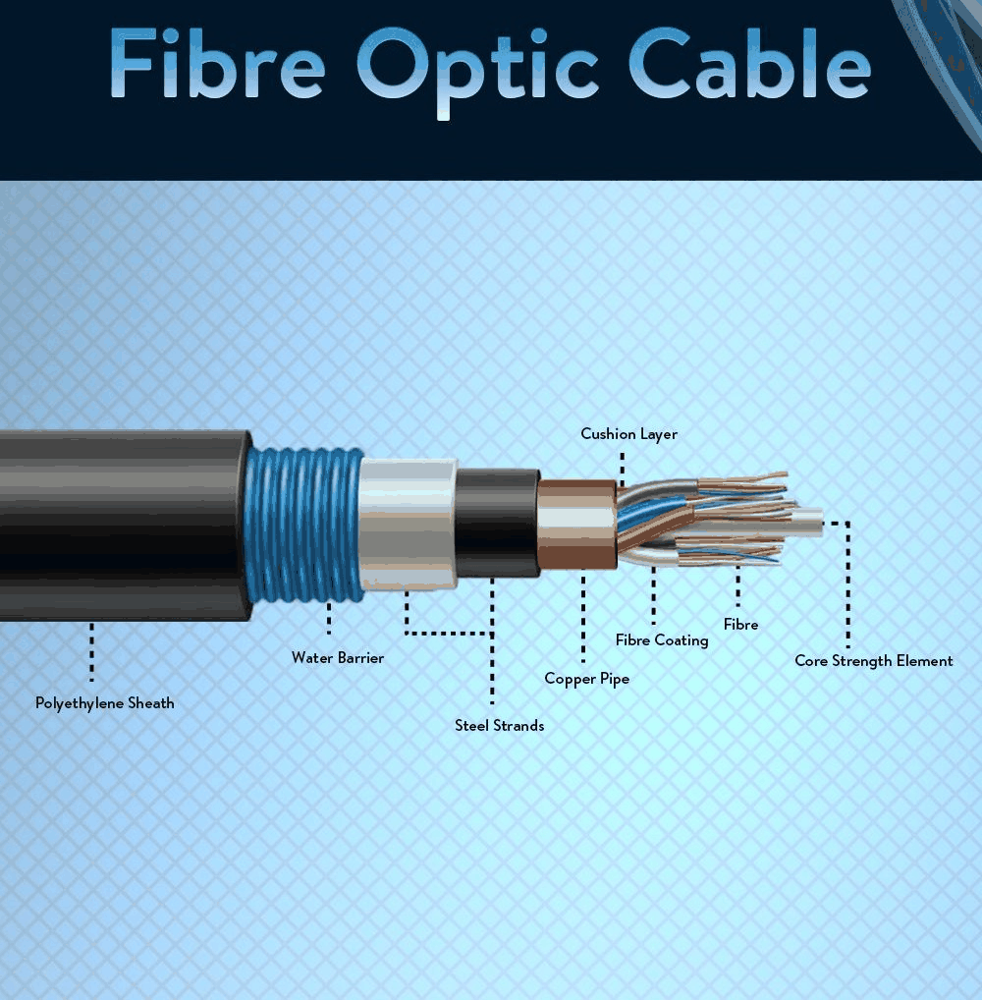
 
<em>مكونات كابل الألياف الضوئية المدرّع للمسافات الطويلة</em>

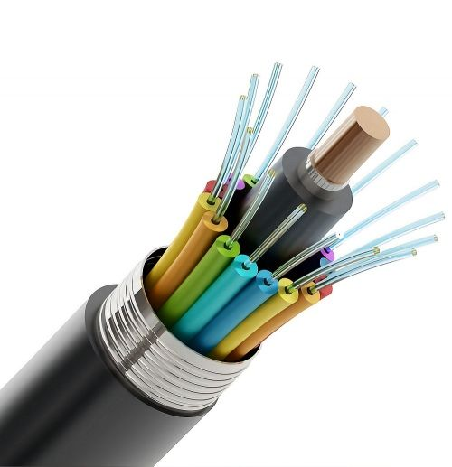
 
<em>مقطع عرضي يوضح حزمة الألياف الزجاجية داخل الكابل</em>

<h3 id="fiber-modes" dir="rtl" align="right">أقسام تصنيع الألياف الضوئية</h3>

**أ- Single-Mode Fiber (SMF)**
- قطر الـ Core صغير جدًا (حوالي 9 ميكرون)، بيسمح لشعاع ضوء واحد بس يمر (بمسار واحد مستقيم تقريبًا).
- بيستخدم مصدر ضوء ليزر (Laser).
- بيدعم مسافات طويلة جدًا (تصل لعشرات ومئات الكيلومترات) بأقل فقدان للإشارة.
- أغلى في التكلفة، وبيُستخدم في الربط بين المدن ومراكز البيانات البعيدة.
- الغلاف عادة أصفر اللون كعلامة تمييز عالمية.

**ب- Multi-Mode Fiber (MMF)**
- قطر الـ Core أكبر (50 أو 62.5 ميكرون)، بيسمح بمرور أكتر من شعاع ضوء في مسارات متعددة (modes) في نفس الوقت.
- بيستخدم مصدر ضوء LED أو ليزر رخيص (VCSEL).
- مسافته أقصر (عادة حتى 550 متر أو أقل حسب الفئة)، بسبب ظاهرة تشتت الإشارة (Modal Dispersion) بسبب تعدد المسارات.
- أرخص من الـ Single-Mode، وبيُستخدم داخل المباني ومراكز البيانات القريبة.
- الغلاف عادة برتقالي أو أكوا (aqua) حسب الفئة.

| المقارنة | Single-Mode | Multi-Mode |
|:---:|:---:|:---:|
| قطر الـ Core | صغير (~9 μm) | أكبر (50/62.5 μm) |
| مصدر الضوء | ليزر | LED / VCSEL |
| المسافة | طويلة جدًا (كيلومترات) | قصيرة (أمتار لمئات الأمتار) |
| التكلفة | أعلى | أقل |
| لون الغلاف الشائع | أصفر | برتقالي / أكوا |

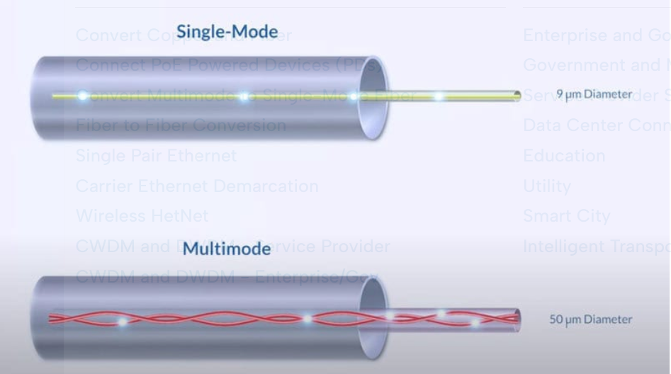
 
<em>الفرق بين مسار الضوء في Single-Mode و Multi-Mode</em>

<h3 id="fiber-connectors" dir="rtl" align="right">أطراف رؤوس كابلات الألياف الضوئية</h3>

- **SC (Subscriber Connector)**: موصل مربع الشكل، بيتركب بدفعة بسيطة (Push-Pull)، من أكتر الأنواع شيوعًا.
- **LC (Lucent Connector)**: موصل أصغر حجمًا من الـ SC، بيُستخدم كتير في المعدات الحديثة عالية الكثافة (زي الـ SFP modules).
- **ST (Straight Tip)**: موصل دائري بيتقفل بلفة ربع دورة زي الـ BNC، أقدم نوع وبيُستخدم أقل حاليًا.
- **MTRJ (Mechanical Transfer Registered Jack)**: بيجمع زوج من الألياف (إرسال واستقبال) في موصل واحد صغير.

<h3 id="fiber-ports" dir="rtl" align="right">منافذ الكابلات الضوئية</h3>

المنافذ اللي بتستقبل كابلات الألياف الضوئية في المعدات الشبكية غالبًا مش منفذ ثابت زي RJ-45، لكنها بتعتمد على وحدة تحويل (Transceiver Module) بتترّكب في السويتش أو الراوتر، زي:
- **SFP (Small Form-factor Pluggable)**: وحدة صغيرة قابلة للفك والتركيب، بتدعم سرعات تصل لـ 1 Gbps.
- **SFP+**: نسخة محسّنة بتدعم سرعات تصل لـ 10 Gbps.
- **QSFP**: بيدعم سرعات أعلى (40 Gbps فأكثر)، بيُستخدم في مراكز البيانات الكبيرة.

<h3 id="fiber-pros-cons" dir="rtl" align="right">مميزات وعيوب استخدام كابلات الألياف الضوئية</h3>

**المميزات:**
- سرعات نقل عالية جدًا ومسافات طويلة بدون تكرار للإشارة.
- مناعة كاملة تقريبًا ضد التداخل الكهرومغناطيسي (EMI) لأنها مش بتنقل كهرباء أصلًا.
- أصعب بكتير في التنصت عليها مقارنة بالكابل النحاسي، لأن أي محاولة قطع أو "تنصت فيزيائي" بتسبب انقطاع ملحوظ في الإشارة يقدر يكتشفه الفني بسهولة.
- أخف وزنًا وأرفع حجمًا من الكابل النحاسي المكافئ لها في السعة.

**العيوب:**
- التكلفة أعلى بكتير (سواء الكابل نفسه أو المعدات المصاحبة له زي الـ Transceivers).
- التركيب والصيانة بتحتاج مهارة وأدوات متخصصة (زي أجهزة الـ Fusion Splicing).
- هشة نسبيًا وسهلة الكسر لو انثنت بزاوية حادة جدًا.
- صعوبة إصلاحها ميدانيًا مقارنة بكابل النحاس.

---

<h2 id="serial" dir="rtl" align="right">رابعاً: الكابلات المتسلسلة ومنافذها Serial Cables and Interfaces</h2>

<h3 id="serial-def" dir="rtl" align="right">تعريفها</h3>

الكابل المتسلسل هو نوع من الكابلات بينقل البيانات بت بعد بت في تتابع واحد على نفس السلك (bit by bit, sequentially)، على عكس الكابلات المتوازية اللي كانت بتنقل عدة بتات في نفس الوقت على أسلاك منفصلة.

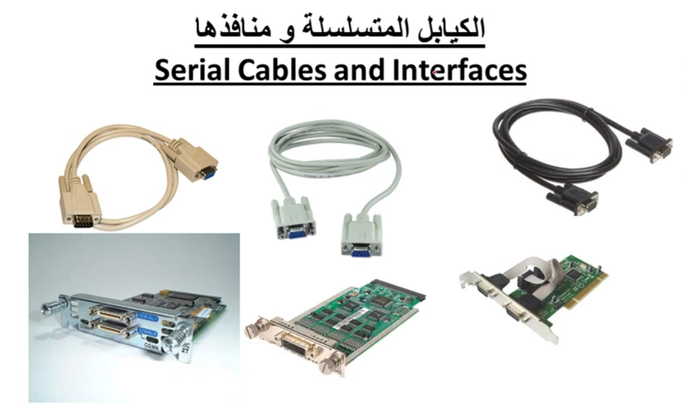
 
<em>الكابلات المتسلسلة ومنافذها</em>

**استخدامها في عالم الشبكات:**
- الاتصال بأجهزة الراوتر القديمة عبر واجهات WAN (زي خطوط T1 أو Frame Relay).
- بروتوكولات زي HDLC و PPP بتشتغل على الواجهات المتسلسلة دي.
- الاتصال بمنفذ الـ Console في الأجهزة الشبكية للإدارة الأولية (باستخدام كابل Rollover ومحول RJ-45 to DB-9).

<h3 id="serial-connection" dir="rtl" align="right">كيفية التوصيل بينها وبين الأجهزة</h3>

بيتم التوصيل عادة عن طريق موصلات DB-9 أو DB-25، وحاليًا بتُستبدل غالبًا بمحولات USB to Serial لأن أغلب أجهزة الكمبيوتر الحديثة معندهاش منفذ متسلسل تقليدي.

<h3 id="dte-dce" dir="rtl" align="right">الـ DTE والـ DCE</h3>

- **DTE (Data Terminal Equipment)**: هو الجهاز اللي "بيولّد" أو "بيستقبل" البيانات النهائية، زي الراوتر أو الكمبيوتر.
- **DCE (Data Circuit-terminating Equipment)**: هو الجهاز المسؤول عن **توفير التوقيت (Clocking)** وتحويل الإشارة عشان تتنقل على خط الاتصال، زي المودم أو وحدة الـ CSU/DSU.

 في الاتصال المتسلسل، جهاز الـ DCE هو المسؤول عن ضبط سرعة الساعة (Clock Rate) اللي هيتزامن بيها نقل البيانات، والـ DTE بيعتمد على التوقيت ده. في المعامل والمحاكاة (زي Packet Tracer)، بتحدد سرعة الـ Clock Rate يدويًا على الطرف اللي معاه كابل الـ DCE.

---

<h2 id="patch-panel" dir="rtl" align="right">خامساً: لوحة تجميع وتنظيم الكابلات Patch Panel</h2>

<h3 id="patch-panel-types" dir="rtl" align="right">تعريفها وأنواعها</h3>

الـ Patch Panel هي لوحة معدنية بيها عدد كبير من منافذ الـ RJ-45 (أو الألياف الضوئية)، بتُستخدم كنقطة وسيطة بين كابلات الشبكة الممتدة داخل الحوائط (من نقاط الشبكة في المكاتب) وبين جهاز الـ Switch. الهدف منها تنظيم الكابلات وتسهيل الصيانة، لأنك بدل ما تلمس الأسلاك جوه الحائط تقدر تغيّر التوصيل من على اللوحة نفسها بكابل قصير (Patch Cable).

أنواعها الرئيسية:
- **Copper Patch Panel**: مخصصة لكابلات النحاس المجدولة (RJ-45)، وبتُستخدم في معظم الشبكات المكتبية العادية.
- **Fiber Patch Panel**: مخصصة لكابلات الألياف الضوئية، وفيها غالبًا مساحة إضافية لحفظ الطول الزائد من الكابل الضوئي بدون ما ينثني بزاوية حادة.
- **Modular Patch Panel**: بتسمح بتغيير أو إضافة منافذ فردية (Keystone Jacks) بدل ما تكون اللوحة كلها ثابتة.

**الفايدة الأمنية**: تنظيم الـ Patch Panel وتوثيق كل منفذ بيسهّل جدًا اكتشاف أي جهاز غريب اتوصل بالشبكة فيزيائيًا، وهو جزء من ممارسات الأمان الفيزيائي (Physical Security) في أي بنية تحتية.

---

<h2 id="cable-properties" dir="rtl" align="right">سادساً: خصائص كابلات الشبكة</h2>

<h3 id="speed-distance" dir="rtl" align="right">سرعة النقل والمسافة</h3>

كل نوع كابل بيتحدد بمواصفتين أساسيتين بيتنافسوا مع بعض غالبًا: **السرعة القصوى** اللي يقدر ينقلها، و**أقصى مسافة** يقدر يوصلها بدون ما الإشارة تضعف بشكل مؤثر (Attenuation). القاعدة العامة إن زيادة السرعة أو المسافة بتحتاج جودة تصنيع أعلى (فئة أعلى في النحاس، أو تحول للألياف الضوئية).

| نوع الكابل | أقصى سرعة تقريبية | أقصى مسافة (بدون Repeater) |
|:---:|:---:|:---:|
| Coaxial (Thin) | 10 Mbps | 185 م |
| Coaxial (Thick) | 10 Mbps | 500 م |
| UTP Cat 5e/6 | 1-10 Gbps | 100 م |
| Multi-Mode Fiber | 10+ Gbps | حتى 550 م |
| Single-Mode Fiber | 100+ Gbps | عشرات الكيلومترات |

<h3 id="duplex-modes" dir="rtl" align="right">اتجاه الإرسال بين الأجهزة</h3>

بيوصف اتجاه تدفق البيانات على وسيط النقل، وله 3 أنماط:

**أ- Simplex Mode**
- الإرسال في اتجاه واحد بس، جهاز بيبعت والتاني بيستقبل فقط، من غير رجوع.
- مثال: أجهزة الراديو التقليدية، لوحات العرض (Display Boards).

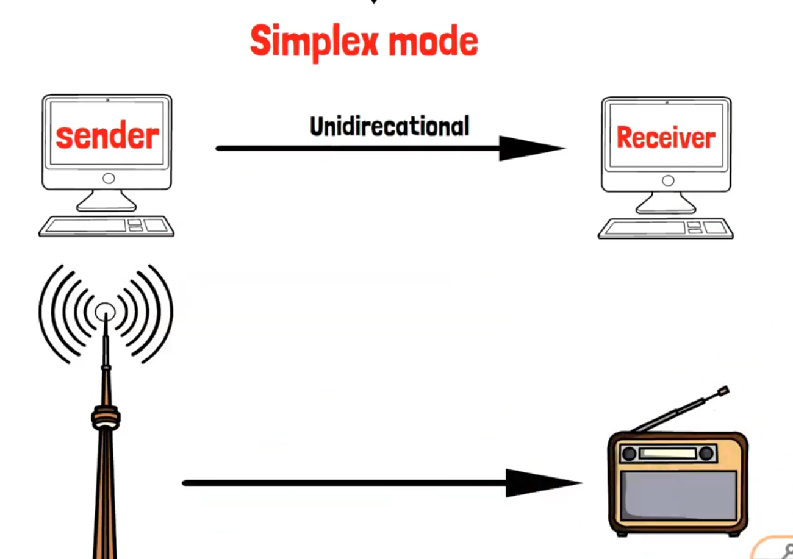
 
<em>نمط Simplex - اتجاه واحد فقط</em>

**ب- Half Duplex Mode**
- الإرسال في الاتجاهين، لكن مش في نفس الوقت — أي وقت بيبعت الجهاز مش بيقدر يستقبل، والعكس.
- مثال: أجهزة اللاسلكي (Walkie-Talkie)، والشبكات القديمة اللي كانت بتشتغل على Hub (لأن الـ Hub بيبعت لكل الأجهزة مرة واحدة فبيحصل تصادم لو بعتوا في نفس الوقت - Collision).

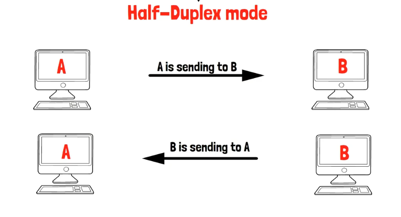
 
<em>نمط Half Duplex - اتجاهين بالتناوب</em>

**جـ- Full Duplex Mode**
- الإرسال والاستقبال في نفس الوقت في الاتجاهين، من غير ما يأثروا على بعض.
- مثال: المكالمات الهاتفية العادية، وشبكات الإيثرنت الحديثة اللي بتشتغل على Switch (لأن الـ Switch بيوفر مسار مخصص لكل جهاز فمفيش تصادم).

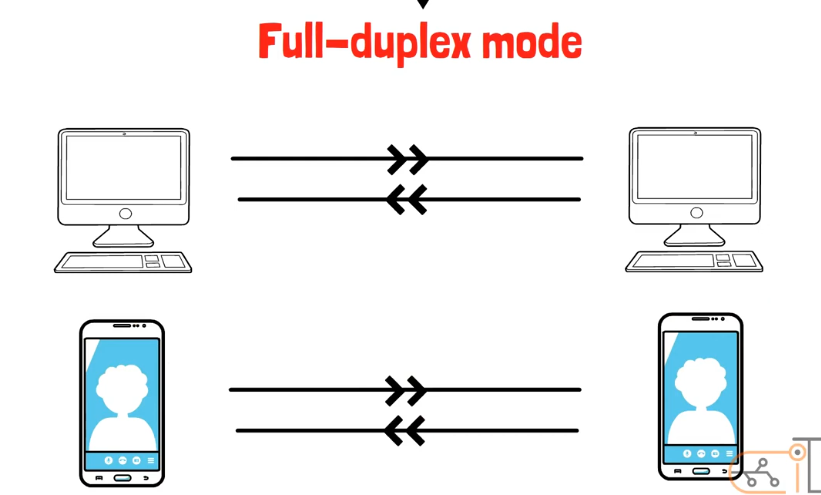
 
<em>نمط Full Duplex - اتجاهين في نفس الوقت</em>

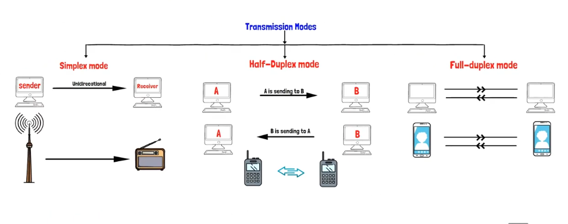
 
<em>ملخص شامل لأنماط الإرسال الثلاثة</em>

| النمط | الاتجاه | التزامن | مثال |
|:---:|:---:|:---:|:---:|
| Simplex | اتجاه واحد فقط | - | راديو، بث تلفزيوني |
| Half Duplex | اتجاهين، بالتناوب | لا يوجد | Walkie-Talkie، شبكة على Hub |
| Full Duplex | اتجاهين، في نفس الوقت | يوجد | مكالمة هاتفية، شبكة على Switch |

---

<h2 id="summary-table" dir="rtl" align="right">ملخص شامل للمقارنة بين كل الكابلات</h2>

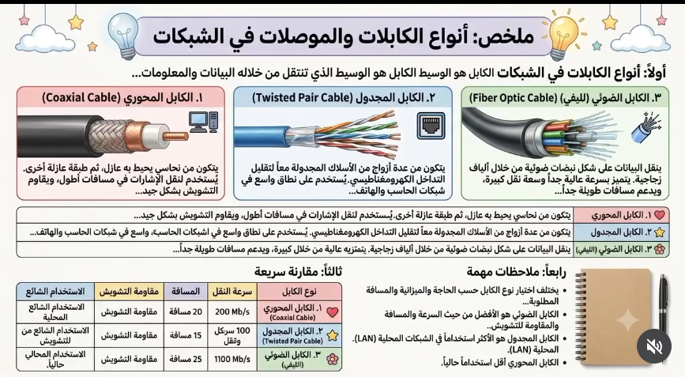
 
<em>ملخص أنواع الكابلات والموصلات في الشبكات</em>

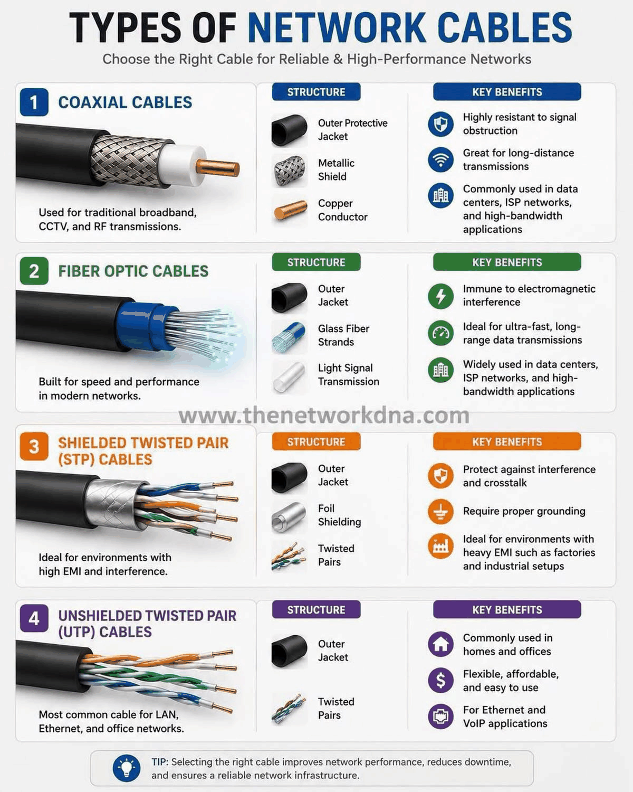
 
<em>مقارنة شاملة بين Coaxial و Fiber Optic و STP و UTP</em>

| الخاصية | Coaxial | Twisted Pair (UTP/STP) | Fiber Optic |
|:---:|:---:|:---:|:---:|
| نوع الإشارة | كهربائية | كهربائية | ضوئية |
| السرعة | منخفضة (~10 Mbps) | متوسطة إلى عالية (حتى 40 Gbps) | عالية جدًا (100+ Gbps) |
| المسافة القصوى | 185-500 م | 100 م | كيلومترات (Single-Mode) |
| المقاومة للتداخل الكهرومغناطيسي | متوسطة | منخفضة (UTP) / متوسطة (STP) | مناعة كاملة |
| التكلفة | متوسطة | منخفضة | مرتفعة |
| سهولة التركيب | متوسطة | سهلة جدًا | صعبة (تحتاج تخصص) |
| الاستخدام الحالي الشائع | إنترنت كابلي، CCTV قديم | شبكات LAN المكتبية والمنزلية | Backbone، مراكز بيانات، FTTH |
| مقاومة التنصت الفيزيائي | منخفضة | منخفضة | عالية جدًا |

**نقاط مهمة للمراجعة السريعة:**

- Coaxial = موصل مركزي واحد، RG-6/RG-59 للتلفزيون والإنترنت الكابلي.
- Twisted Pair = 4 أزواج، T568A/T568B، حد أقصى 100 متر لكل الفئات.
- Straight-Through لأجهزة مختلفة، Crossover لأجهزة متشابهة، Rollover للإدارة.
- Single-Mode = مسافات طويلة وليزر، Multi-Mode = مسافات قصيرة و LED.
- DTE بيستقبل/يولّد البيانات، DCE بيوفر التوقيت (Clocking).
- Full Duplex = إرسال واستقبال في نفس الوقت (Switch)، Half Duplex = بالتناوب (Hub).

