<div dir="rtl">

<div align="center">

# 🌐 الموضوع الحادي عشر: عنوان الـ IP وتقسيم الشبكات <span dir="ltr">(IP Address and Subnetting)</span>

<a href="#part1-ip-address">🟦 الجزء الأول: عنوان الـ IP</a> &nbsp;|&nbsp; <a href="#part2-subnetting">🟩 الجزء الثاني: تقسيم الشبكات</a>

</div>

## 📑 جدول المحتويات

| # | القسم الرئيسي | المواضيع الفرعية |
|:---:|:---:|:---:|
| - | <a href="#part1-ip-address">🟦 الجزء الأول: عنوان الـ IP</a> | - |
| 1 | <a href="#ip-definition-importance">تعريف عنوان الـ IP وأهميته</a> | - |
| 2 | <a href="#ipv4-components">مكونات عنوان الـ IPv4</a> | <a href="#bit-byte-octet-terms">Bit / Byte / Octet</a><br>&nbsp;&nbsp;&nbsp;<a href="#octet-system">نظام الأوكتت بالتفصيل (Dotted-Decimal, حدود الأوكتت)</a> |
| 3 | <a href="#ipv4-vs-ipv6">نبذة: <span dir="ltr">IPv4</span> مقابل <span dir="ltr">IPv6</span> (مقارنة كاملة)</a> | - |
| 4 | <a href="#ip-layer-nature">الطبقة التي يعمل بها الـ IP وثباته</a> | - |
| 5 | <a href="#ip-vs-mac">الفرق بين الـ <span dir="ltr">IP</span> والـ <span dir="ltr">MAC Address</span></a> | <a href="#mac-address-review">مراجعة الـ MAC Address</a><br>&nbsp;&nbsp;&nbsp;<a href="#mac-ip-comparison-table">جدول المقارنة الكامل</a><br>&nbsp;&nbsp;&nbsp;<a href="#why-two-addresses">ليه محتاجين عنوانين مش واحد بس</a><br>&nbsp;&nbsp;&nbsp;<a href="#flat-vs-hierarchical">Flat مقابل Hierarchical</a> |
| 6 | <a href="#iana">منظمة <span dir="ltr">IANA</span> وسجلات الإنترنت</a> | <a href="#iana-registry-hierarchy">التسلسل الهرمي للسجلات</a><br>&nbsp;&nbsp;&nbsp;<a href="#whois-registry">سجل WHOIS</a> |
| 7 | <a href="#ip-classes">فئات الـ <span dir="ltr">IP (Classes A–E)</span></a> | <a href="#class-ranges">مدى كل فئة</a><br>&nbsp;&nbsp;&nbsp;<a href="#class-network-host-split">الفرق بين الفئات</a><br>&nbsp;&nbsp;&nbsp;<a href="#why-d-e-no-mask">ليه D, E مالهمش Subnet Mask</a> |
| 8 | <a href="#network-host-id">أجزاء عنوان الـ <span dir="ltr">IP</span>: <span dir="ltr">Network ID</span> و<span dir="ltr">Host ID</span></a> | - |
| 9 | <a href="#network-host-broadcast">أنواع العناوين داخل الشبكة</a> | <a href="#network-host-broadcast-terms">Network / Host / Broadcast Address</a><br>&nbsp;&nbsp;&nbsp;<a href="#quiz-examples">3 أمثلة محلولة (Class A/B/C)</a> |
| 10 | <a href="#ip-types">أنواع عناوين الـ IP</a> | <a href="#private-public-ip">Private و Public (+فئات الـ Public لكل Class)</a><br>&nbsp;&nbsp;&nbsp;<a href="#apipa-virtual-ip">APIPA (وأنه Non-routable) و Virtual IP</a><br>&nbsp;&nbsp;&nbsp;<a href="#multicast-loopback">Multicast (+عناوين شهيرة وربطها بالـ MAC) و Loopback</a><br>&nbsp;&nbsp;&nbsp;<a href="#reserved-addresses">عناوين محجوزة أخرى</a> |
| 11 | <a href="#network-address-benefit">فائدة عنوان الشبكة في التحكم والحماية</a> | <a href="#acl-concept">ACL</a><br>&nbsp;&nbsp;&nbsp;<a href="#firewall-example">مثال الجدار الناري</a> |
| 12 | <a href="#ip-assignment-methods">طرق حصول الجهاز على عنوان <span dir="ltr">IP</span> وإعداداته</a> | <a href="#assignment-table">DHCP / DHCPv6 / Static / APIPA / EUI-64</a><br>&nbsp;&nbsp;&nbsp;<a href="#default-gateway">Default Gateway</a><br>&nbsp;&nbsp;&nbsp;<a href="#devices-with-ip">الأجهزة التي تمتلك عنوان IP</a><br>&nbsp;&nbsp;&nbsp;<a href="#ipconfig-renew">أمر ipconfig /renew</a><br>&nbsp;&nbsp;&nbsp;<a href="#dhcp-relay-agent">DHCP Relay Agent (Helper Address)</a> |
| 13 | <a href="#routing">التوجيه: جدول التوجيه وأنواع المسارات</a> | <a href="#routing-table">جدول التوجيه</a><br>&nbsp;&nbsp;&nbsp;<a href="#routing-protocols">بروتوكولات التوجيه</a><br>&nbsp;&nbsp;&nbsp;<a href="#router-uses-ip">كيف يستخدم الراوتر الـ IP للتوجيه</a><br>&nbsp;&nbsp;&nbsp;<a href="#default-vs-static-route">Default Route مقابل Static Route</a> |
| 14 | <a href="#ip-header">عملية التغليف وهيدر الـ IP</a> | <a href="#ip-header-basic-fields">حقول أساسية (Source/Destination/TTL/Protocol)</a><br>&nbsp;&nbsp;&nbsp;<a href="#dscp-tos">DSCP/ToS (QoS)</a><br>&nbsp;&nbsp;&nbsp;<a href="#fragmentation-fields">Identification, Flags, Fragment Offset (التجزئة)</a> |
| 15 | <a href="#ip-port-relationship">العلاقة بين IP والـ <span dir="ltr">Port Number</span></a> | <a href="#socket-concept">مفهوم الـ Socket</a><br>&nbsp;&nbsp;&nbsp;<a href="#source-destination-port">Source و Destination Port</a><br>&nbsp;&nbsp;&nbsp;<a href="#ephemeral-ports">الـ Ephemeral Ports</a> |
| 16 | <a href="#nat">ترجمة عناوين الشبكة <span dir="ltr">NAT</span></a> | <a href="#nat-types">أنواعه</a><br>&nbsp;&nbsp;&nbsp;<a href="#pat-home-router">مثال: راوتر منزلي بـ IP عام واحد لأكثر من 10 أجهزة</a><br>&nbsp;&nbsp;&nbsp;<a href="#nat-table-records">سجلات NAT (NAT Table)</a><br>&nbsp;&nbsp;&nbsp;<a href="#nat-terms">مصطلحاته</a><br>&nbsp;&nbsp;&nbsp;<a href="#port-forwarding-dmz">Port Forwarding و DMZ</a> |
| 17 | <a href="#network-monitoring">مراقبة الشبكة عبر عنوان الـ IP</a> | - |
| 18 | <a href="#transmission-types">طرق إرسال البيانات: <span dir="ltr">Unicast, Broadcast, Multicast</span></a> | - |
| 19 | <a href="#ip-security-concepts">اعتبارات أمنية مرتبطة بعناوين IP والتقسيم</a> | <a href="#segmentation-vlans">عزل الشبكات و VLANs</a><br>&nbsp;&nbsp;&nbsp;<a href="#spoofing-broadcast-storms">انتحال العناوين و Broadcast Storms</a><br>&nbsp;&nbsp;&nbsp;<a href="#classful-vs-classless-routing">Classful مقابل Classless Routing</a> |
| 20 | <a href="#cli-reference">أدوات التشخيص والأوامر العملية (<span dir="ltr">CLI</span>)</a> | - |
| - | <a href="#part2-subnetting">🟩 الجزء الثاني: تقسيم الشبكات</a> | - |
| 1 | <a href="#why-subnetting">مقدمة: ليه بنقسم الشبكة؟</a> | - |
| 2 | <a href="#subnet-mask-basics"><span dir="ltr">Subnet Mask</span>: تعريفه وقواعده</a> | - |
| 3 | <a href="#anding">عملية <span dir="ltr">ANDing</span></a> | - |
| 4 | <a href="#number-systems">أنظمة العد وطرق التحويل بينها</a> | <a href="#number-systems-intro">Base 10 / Base 2 / Base 16 (+نبذة عن Octal)</a><br>&nbsp;&nbsp;&nbsp;<a href="#weights-table">جدول الأوزان (الجدول السحري)</a><br>&nbsp;&nbsp;&nbsp;<a href="#binary-decimal-conversion">تحويل ديسيمال ↔ باينري (+أمثلة إضافية)</a><br>&nbsp;&nbsp;&nbsp;<a href="#division-method">طريقة القسمة المتتالية على 2</a><br>&nbsp;&nbsp;&nbsp;<a href="#full-ip-binary-example">مثال شامل: تحويل IP كامل أوكتت بأوكتت</a><br>&nbsp;&nbsp;&nbsp;<a href="#binary-range">مدى الاحتمالات في الباينري</a><br>&nbsp;&nbsp;&nbsp;<a href="#hex-binary-conversion">تحويل هيكس ↔ باينري</a><br>&nbsp;&nbsp;&nbsp;<a href="#hex-range">مدى الاحتمالات في الهيكس</a><br>&nbsp;&nbsp;&nbsp;<a href="#bit-count-rule">معرفة عدد البتات لأي رقم (+مثال شامل)</a><br>&nbsp;&nbsp;&nbsp;<a href="#decimal-hex-direct">التحويل المباشر ديسيمال↔هيكس</a> |
| 5 | <a href="#cidr">نظام <span dir="ltr">CIDR</span> وكتابة السلاش</a> | <a href="#prefix-length-def">تعريف Prefix Length</a><br>&nbsp;&nbsp;&nbsp;<a href="#cidr-cheat-sheet">جدول CIDR المرجعي السريع (/8–/30)</a><br>&nbsp;&nbsp;&nbsp;<a href="#point-to-point-links">شبكات الربط النقطي /30 و /31 (RFC 3021) و/32</a> |
| 6 | <a href="#subnetting-laws">القوانين الأساسية للتقسيم</a> | <a href="#law-num-subnets">عدد الشبكات 2ⁿ</a><br>&nbsp;&nbsp;&nbsp;<a href="#law-num-hosts">عدد الأجهزة 2ʰ − 2</a><br>&nbsp;&nbsp;&nbsp;<a href="#law-block-size">حجم القفزة Block Size</a> |
| 7 | <a href="#solving-steps">خطوات حل أي مسألة <span dir="ltr">Subnetting</span></a> | - |
| 8 | <a href="#worked-examples">أمثلة محلولة خطوة بخطوة</a> | <a href="#example-easy">مثال سهل</a><br>&nbsp;&nbsp;&nbsp;<a href="#example-medium">مثال متوسط (معطى: عدد الأجهزة)</a><br>&nbsp;&nbsp;&nbsp;<a href="#example-advanced">مثال متقدم (معطى: عدد الشبكات)</a> |
| 9 | <a href="#subnet-id-boundaries">حساب <span dir="ltr">Subnet ID</span> وحدود كل شبكة فرعية</a> | - |
| 10 | <a href="#vlsm"><span dir="ltr">VLSM</span>: التقسيم متغير الطول</a> | <a href="#vlsm-definition">تعريفه والفرق عن Subnetting العادي</a><br>&nbsp;&nbsp;&nbsp;<a href="#vlsm-steps">خطوات الحل</a><br>&nbsp;&nbsp;&nbsp;<a href="#vlsm-mini-example">مثال مصغّر خطوة بخطوة</a><br>&nbsp;&nbsp;&nbsp;<a href="#vlsm-big-example">مثال شامل: كلاس A + وصلة راوترين</a><br>&nbsp;&nbsp;&nbsp;<a href="#vlsm-common-mistake">تحذير: خطأ ترتيب التخصيص</a> |
| 11 | <a href="#supernetting"><span dir="ltr">Supernetting</span></a> | <a href="#route-summarization-example">مثال تلخيص 4 شبكات (Route Summarization)</a> |
| 12 | <a href="#identify-class">معرفة الفئة من الـ <span dir="ltr">IP</span> والـ <span dir="ltr">Subnet Mask</span></a> | - |
| 13 | <a href="#octet-split">تقسيم أوكتت واحد بين الشبكات والأجهزة</a> | - |
| 14 | <a href="#find-network-of-host">إيجاد عنوان شبكة جهاز معين</a> | - |
| 15 | <a href="#troubleshooting">مسائل الخدع والأخطاء الشائعة (Troubleshooting)</a> | <a href="#same-mask-different-subnet">نفس الـ Mask، شبكات مختلفة</a><br>&nbsp;&nbsp;&nbsp;<a href="#invalid-ip-assignment">تحديد العناوين غير الصالحة</a> |
| 16 | <a href="#case-study">دراسة حالة كاملة: تصميم شبكة شركة (<span dir="ltr">VLSM Case Study</span>)</a> | - |
| 17 | <a href="#cheat-sheet-summary">ملخص شامل: كل القوانين الرياضية في جدول واحد</a> | <a href="#all-formulas-table">جدول القوانين</a><br>&nbsp;&nbsp;&nbsp;<a href="#wildcard-mask">Wildcard Mask</a> |
| 18 | <a href="#cloud-subnetting">تطبيقات الـ Subnetting في البيئات السحابية</a> | <a href="#aws-vpc">AWS VPC</a><br>&nbsp;&nbsp;&nbsp;<a href="#azure-vnet">Azure VNet</a><br>&nbsp;&nbsp;&nbsp;<a href="#aws-reservation-formula">حجز 5 عناوين بدل 2</a> |
| 19 | <a href="#advanced-routing-concepts">مفاهيم هندسية متقدمة في التوجيه والعناوين</a> | <a href="#anycast">Anycast</a><br>&nbsp;&nbsp;&nbsp;<a href="#overlapping-ip">تداخل العناوين و Double/Twice NAT</a> |
| 20 | <a href="#ipv6-appendix">ملحق: أساسيات عنونة وتقسيم <span dir="ltr">IPv6</span></a> | <a href="#ipv6-address-types">تركيب العنوان وأنواعه</a><br>&nbsp;&nbsp;&nbsp;<a href="#ipv6-subnetting">تقسيم شبكات IPv6</a> |
| - | <a href="#practice-problems">📝 مسائل تدريب ذاتي (بدون حل مباشر)</a> | - |
| - | <a href="#review-questions">❓ أسئلة المراجعة الشاملة</a> | - |

---

<h2 dir="rtl" align="right" id="part1-ip-address">🟦 الجزء الأول: عنوان الـ IP <span dir="ltr">(IP Address)</span></h2>

<h3 dir="rtl" align="right" id="ip-definition-importance">1. تعريف عنوان الـ IP وأهميته</h3>

عنوان الـ <span dir="ltr">IP (Internet Protocol Address)</span> هو عنوان **منطقي (Logical Address)** يُستخدم لتحديد هوية أي جهاز على الشبكة، ويعمل في **طبقة الشبكة (Network Layer)** — الطبقة الثالثة من نموذج الـ <span dir="ltr">OSI</span> (راجع <a href="../04-OSI-Model.md">الموضوع الرابع</a>)، وهو ما يقابله في نموذج الـ <span dir="ltr">TCP/IP</span> طبقة الـ <span dir="ltr">Internet Layer</span> (راجع <a href="../07-TCP-IP-Model.md">الموضوع السابع</a>).

**أهمية عنوان الـ IP:**
- بيسمح بتوجيه البيانات <span dir="ltr">(Routing)</span> بين شبكات مختلفة، وده أهم فرق بينه وبين عنوان الـ <span dir="ltr">MAC</span> اللي شغال جوه الشبكة الواحدة بس.
- بيدي كل جهاز هوية فريدة تسمح بالتواصل معاه من أي مكان في الإنترنت أو الشبكة الداخلية.
- بيحدد انتماء الجهاز لشبكة معينة (Network) من خلال جزء الـ <span dir="ltr">Network ID</span> منه، وهو ما يُبنى عليه كل موضوع الـ <span dir="ltr">Subnetting</span> في الجزء الثاني من هذا الملف.
- بيسمح بتقسيم الشبكات الكبيرة إلى شبكات أصغر (تفصيل كامل في <a href="#why-subnetting">الجزء الثاني</a>)، وهو ما يحقق فوائد كبيرة في الإدارة والتحكم والأمان.

---

<h3 dir="rtl" align="right" id="ipv4-components">2. مكونات عنوان الـ IPv4</h3>

عنوان الـ <span dir="ltr">IPv4</span> يتكون من **32 بت (Bit)** مقسمة إلى **4 أجزاء (Octets)**، كل جزء منها 8 بت (1 بايت)، ويُكتب بصيغة عشرية (Decimal) مفصولة بنقاط.

<div align="center">
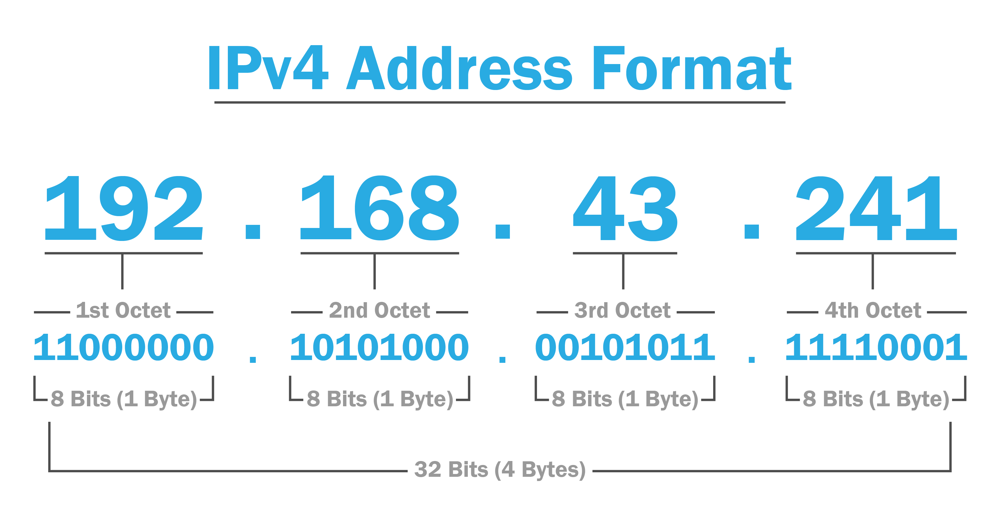
<br><em>شكل عنوان الـ IPv4: 4 أوكتت × 8 بت = 32 بت</em>
</div>

<span id="bit-byte-octet-terms"></span>**المصطلحات الأساسية:**

| المصطلح | التعريف | مثال |
|:---:|:---:|:---:|
| <span dir="ltr">Bit</span> | أصغر وحدة بيانات، وقيمتها إما <span dir="ltr">0</span> أو <span dir="ltr">1</span> | البت الأول في `11000000` هو `1` |
| <span dir="ltr">Byte</span> | مجموعة من 8 بت | `11000000` = 1 بايت |
| <span dir="ltr">Octet</span> | نفس معنى الـ <span dir="ltr">Byte</span> لكن يُستخدم تحديدًا عند الحديث عن أجزاء عنوان الـ IP | في العنوان `192.168.43.241` كل رقم (192، 168، 43، 241) يمثل أوكتت واحد = 8 بت |

> 💡 كل أوكتت قيمته العشرية تتراوح من `0` إلى `255`، لأن أقصى قيمة ممكنة لـ 8 بت هي <span dir="ltr">2⁸ − 1 = 255</span>.

<h4 dir="rtl" align="right" id="octet-system">نظام الأوكتت (Octet System) بالتفصيل</h4>

- **لماذا 8 بت بالتحديد؟** الاختيار التاريخي لتقسيم عنوان الـ 32 بت إلى 4 مجموعات متساوية كل واحدة 8 بت كان لتسهيل القراءة والكتابة والمعالجة، لأن 8 بت = بايت واحد كامل، وهي وحدة المعالجة الأساسية في معظم أنظمة الحاسوب.
- **الترقيم:** يُشار لكل أوكتت برقم موقعه في العنوان — **الأوكتت الأول** (أقصى اليسار) وحتى **الأوكتت الرابع** (أقصى اليمين). في العنوان `192.168.43.241`: الأوكتت الأول = `192`، الثاني = `168`، الثالث = `43`، الرابع = `241`.
- **اسم الصيغة الكاملة:** كتابة العنوان بهذا الشكل (4 أرقام عشرية مفصولة بنقاط) يُطلق عليها رسميًا **Dotted-Decimal Notation**.
- **حدود الأوكتت <span dir="ltr">(Octet Boundary)</span>:** المقصود بها النقطة التي ينتهي عندها أوكتت ويبدأ التالي (كل 8 بت). التقسيم **الكلاسيكي** للفئات A/B/C (راجع <a href="#ip-classes">البند 7</a>) يقع دائمًا عند حدود أوكتت كاملة (`/8`, `/16`, `/24`)، بعكس الـ Subnetting الحر بـ CIDR الذي يمكن أن يقسّم **داخل** أوكتت واحد (راجع <a href="#octet-split">تقسيم أوكتت واحد بين الشبكات والأجهزة</a> في الجزء الثاني).

---

<h3 dir="rtl" align="right" id="ipv4-vs-ipv6">3. نبذة: IPv4 مقابل IPv6</h3>

<div align="center">
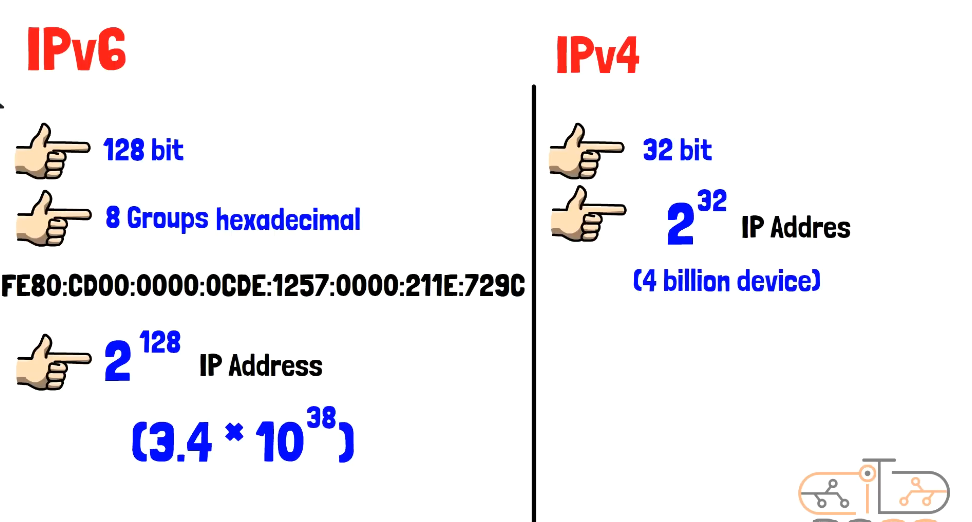
<br><em>مقارنة سريعة: طول العنوان وعدد العناوين المتاحة في IPv4 مقابل IPv6</em>
</div>

| المقارنة | <span dir="ltr">IPv4</span> | <span dir="ltr">IPv6</span> |
|:---:|:---:|:---:|
| الطول | 32 بت | 128 بت |
| عدد العناوين المتاحة | حوالي 4.3 مليار عنوان | عدد هائل (تقريبًا غير محدود عمليًا) |
| صيغة الكتابة | عشري مفصول بنقاط (مثال: `192.168.1.1`) | هيكساديسيمال مفصول بنقطتين رأسيتين (مثال: `2001:0db8::1`) |
| عدد الأجزاء | 4 أوكتتات | 8 مجموعات (كل مجموعة 16 بت) |
| هيدر الحزمة | معقّد نسبيًا (يحتوي حقول أكثر، منها ما هو نادر الاستخدام) | مبسّط ومحسّن للأداء (حقول أقل وأسرع في المعالجة عند الراوترات) |
| الحاجة لـ <span dir="ltr">NAT</span> | ضرورية غالبًا بسبب محدودية العناوين (راجع <a href="#nat">البند 16</a>) | غير ضرورية عادة، لأن كل جهاز يمكن أن يمتلك عنوان Public فريد خاص به |
| الإعداد التلقائي | يعتمد على <span dir="ltr">DHCP</span> بشكل أساسي | يدعم إعدادًا ذاتيًا بدون DHCP عبر <span dir="ltr">SLAAC (Stateless Address Autoconfiguration)</span> بالإضافة إلى DHCPv6 |
| البث <span dir="ltr">(Broadcast)</span> | موجود (Broadcast Address) | غير موجود إطلاقًا؛ تم الاستغناء عنه بالكامل لصالح Multicast وAnycast |
| الأمان | اختياري (IPSec يُضاف كطبقة إضافية) | مدمج ومصمَّم داخل البروتوكول من الأساس (IPSec جزء أصلي منه) |
| السبب في وجوده | — | نفاد عناوين IPv4 مع توسع الإنترنت، إضافة لحل مشكلة نفاد العناوين وتحسينات أمنية وأدائية |

> 📌 باقي هذا الملف يتناول <span dir="ltr">IPv4</span> بالتفصيل لأنه الأساس المطلوب في مقرر <span dir="ltr">Network+</span>.

---

<h3 dir="rtl" align="right" id="ip-layer-nature">4. الطبقة التي يعمل بها الـ IP وثباته</h3>

- يعمل عنوان الـ <span dir="ltr">IP</span> في **طبقة الشبكة (Layer 3 – Network Layer)** من نموذج الـ <span dir="ltr">OSI</span>، وهي المسؤولة عن التوجيه <span dir="ltr">(Routing)</span> واختيار أفضل مسار للبيانات (راجع تفاصيل الطبقة في <a href="../04-OSI-Model.md">الموضوع الرابع</a> و<a href="../07-TCP-IP-Model.md">الموضوع السابع</a>).
- عنوان الـ IP **قابل للتغيير**: يمكن أن يتغير حسب الشبكة التي يتصل بها الجهاز، أو حسب طريقة التوزيع (يدوي أو تلقائي عبر <span dir="ltr">DHCP</span>) — على عكس عنوان الـ <span dir="ltr">MAC</span> الثابت المحفور في كرت الشبكة.

---

<h3 dir="rtl" align="right" id="ip-vs-mac">5. الفرق بين الـ IP والـ MAC Address</h3>

<h4 dir="rtl" align="right" id="mac-address-review">أ. مراجعة عنوان MAC</h4>

قبل المقارنة، لازم نراجع تعريف عنوان الـ <span dir="ltr">MAC</span> نفسه (تم شرحه بالتفصيل في <a href="../09-Ethernet-LAN.md">الموضوع التاسع – Ethernet/LAN</a>)، ونلخص أهم عناصره هنا للمقارنة:

- **تعريفه:** عنوان **مادي (Physical Address)** محفور في كرت الشبكة <span dir="ltr">(NIC)</span> من المصنع.
- **مكوناته ونظامه:** طوله 48 بت، ويُكتب بنظام <span dir="ltr">Hexadecimal (Base 16)</span> في صورة 6 أزواج (مثال: `00:1A:2B:3C:4D:5E`).
- **تقسيماته:** أول 24 بت (3 بايت) تمثل <span dir="ltr">OUI (Organizationally Unique Identifier)</span> — معرف الشركة المصنّعة — وآخر 24 بت تمثل **معرف كرت الشبكة نفسه (NIC-specific)**، وفائدة هذا التقسيم أنه يضمن عدم تكرار نفس الـ MAC عالميًا.
- **الطبقة التي يعمل بها:** طبقة ربط البيانات <span dir="ltr">(Data Link Layer – Layer 2)</span>.
- **ثباته:** ثابت لا يتغير (إلا بتقنيات معينة مثل <span dir="ltr">MAC Spoofing</span>).
- **منظمته:** تُدار بواسطة <span dir="ltr">IEEE</span>، وهي المسؤولة عن توزيع أرقام الـ <span dir="ltr">OUI</span> على الشركات المصنّعة.

<h4 dir="rtl" align="right" id="mac-ip-comparison-table">ب. جدول المقارنة الكامل</h4>

| وجه المقارنة | <span dir="ltr">IP Address</span> | <span dir="ltr">MAC Address</span> |
|:---:|:---:|:---:|
| النوع | منطقي <span dir="ltr">(Logical)</span> | مادي <span dir="ltr">(Physical)</span> |
| الطبقة | Layer 3 – Network | Layer 2 – Data Link |
| الطول | 32 بت (IPv4) | 48 بت |
| نظام الكتابة | عشري (Decimal) | هيكساديسيمال (Hex) |
| الثبات | قابل للتغيير | ثابت |
| الجهة المسؤولة | <span dir="ltr">IANA</span> | <span dir="ltr">IEEE</span> |
| نوع العنونة | هرمي <span dir="ltr">(Hierarchical)</span> | مسطح <span dir="ltr">(Flat)</span> |
| الاستخدام | التوجيه بين شبكات مختلفة | التواصل داخل نفس الشبكة المحلية |

<h4 dir="rtl" align="right" id="why-two-addresses">ج. ليه محتاجين عنوانين مش عنوان واحد بس؟</h4>

لأن العنوان المادي (MAC) وحده لا يكفي للتوجيه بين شبكات مختلفة حول العالم — فهو غير هرمي <span dir="ltr">(Flat)</span> ولا يحمل أي معلومة عن موقع الجهاز أو الشبكة التي ينتمي إليها. عنوان الـ IP هرمي <span dir="ltr">(Hierarchical)</span> يحمل جزءًا يدل على الشبكة وجزءًا يدل على الجهاز، وهو ما يمكّن أجهزة التوجيه <span dir="ltr">(Routers)</span> من إيصال البيانات عبر شبكات متعددة دون معرفة تفاصيل كل جهاز على حدة.

<h4 dir="rtl" align="right" id="flat-vs-hierarchical">د. Flat مقابل Hierarchical</h4>

عنوان الـ IP خاصية أساسية فيه أنه <span dir="ltr">Hierarchical Address</span> (به تدرج: شبكة ثم جهاز)، بينما عنوان الـ MAC هو <span dir="ltr">Flat Address</span> (لا تدرج فيه، كل عنوان مستقل تمامًا عن الآخر). هذا الفرق هو السبب الجوهري في إمكانية عمل الـ <span dir="ltr">Subnetting</span> على مستوى الـ IP فقط، وسنعتمد عليه بشكل كامل في <a href="#part2-subnetting">الجزء الثاني</a>.

---

<h3 dir="rtl" align="right" id="iana">6. منظمة IANA وسجلات الإنترنت</h3>

<span dir="ltr">IANA (Internet Assigned Numbers Authority)</span> هي **السلطة العالمية المسؤولة عن تخصيص أرقام الإنترنت**، بما في ذلك توزيعات وأقسام وفئات وأنواع عناوين الـ <span dir="ltr">IP</span>، وكذلك أرقام الـ <span dir="ltr">Ports</span> (راجع <a href="../05-Port-Number.md">الموضوع الخامس</a>) والبروتوكولات.

تتفرع من IANA **خمس منظمات إقليمية (RIRs – Regional Internet Registries)** تتولى توزيع عناوين الـ IP على مستوى كل قارة/منطقة:

| المنظمة | المنطقة المسؤولة عنها |
|:---:|:---:|
| <span dir="ltr">ARIN</span> | أمريكا الشمالية |
| <span dir="ltr">RIPE NCC</span> | أوروبا والشرق الأوسط وآسيا الوسطى |
| <span dir="ltr">APNIC</span> | آسيا والمحيط الهادئ |
| <span dir="ltr">LACNIC</span> | أمريكا اللاتينية والكاريبي |
| <span dir="ltr">AFRINIC</span> | أفريقيا |

<h4 dir="rtl" align="right" id="iana-registry-hierarchy">أ. التسلسل الهرمي لسجلات الإنترنت</h4>

توزيع عناوين الـ IP لا يحدث دفعة واحدة من IANA مباشرة لكل مستخدم، بل عبر تسلسل هرمي من السجلات:

```
IANA (السلطة العالمية)
   ↓
RIRs الخمس (توزيع إقليمي: ARIN, RIPE NCC, APNIC, LACNIC, AFRINIC)
   ↓
ISPs / LIRs (مزودو خدمة الإنترنت والسجلات المحلية الكبرى)
   ↓
المستخدم النهائي (شركتك، منزلك)
```

<h4 dir="rtl" align="right" id="whois-registry">ب. سجل الـ WHOIS</h4>

قاعدة بيانات عامة يمكن لأي شخص الاستعلام منها لمعرفة الجهة المالكة لأي عنوان IP عام أو نطاق (Domain)، وتُدار بيانات هذا السجل بواسطة الـ RIRs كل حسب منطقته.

---

<h3 dir="rtl" align="right" id="ip-classes">7. فئات الـ IP (Classes A–E)</h3>

<h4 dir="rtl" align="right" id="class-ranges">أ. مدى كل فئة واستخدامها</h4>

عناوين الـ <span dir="ltr">IPv4</span> مقسّمة إلى 5 فئات <span dir="ltr">(Classes)</span> حسب قيمة أول أوكتت:

<div align="center">
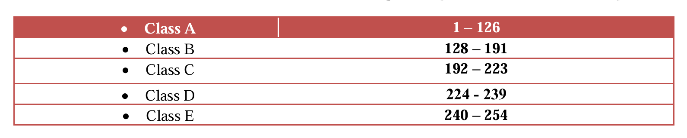
<br><em>مدى أول أوكتت لكل فئة</em>
</div>

| الفئة | مدى أول أوكتت | الاستخدام | عدد الأجهزة القصوى |
|:---:|:---:|:---:|:---:|
| <span dir="ltr">Class A</span> | 1 – 126 | مؤسسات ضخمة جدًا | 16,777,214 |
| <span dir="ltr">Class B</span> | 128 – 191 | مؤسسات متوسطة الحجم | 65,534 |
| <span dir="ltr">Class C</span> | 192 – 223 | مؤسسات صغيرة | 254 |
| <span dir="ltr">Class D</span> | 224 – 239 | البث المتعدد <span dir="ltr">(Multicast)</span> | — |
| <span dir="ltr">Class E</span> | 240 – 254 | أغراض بحثية/تجريبية <span dir="ltr">(Research)</span> | — |

> ملاحظة: النطاق `127.x.x.x` محجوز لعنوان الاسترجاع الذاتي <span dir="ltr">Loopback Address</span>، وهو غير مُتاح للاستخدام كعنوان جهاز عادي (تفصيل كامل في <a href="#ip-types">البند العاشر</a>).

**السابنت ماسك الافتراضي لكل فئة:**

<div align="center">
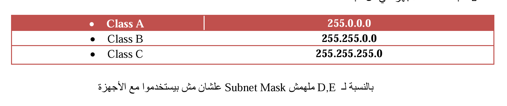
<br><em>Subnet Mask الافتراضي لكل فئة</em>
</div>

| الفئة | Subnet Mask الافتراضي | صيغة CIDR |
|:---:|:---:|:---:|
| Class A | `255.0.0.0` | `/8` |
| Class B | `255.255.0.0` | `/16` |
| Class C | `255.255.255.0` | `/24` |

**كيف توزّع كل فئة الأوكتتات بين Network و Host:**

<h4 dir="rtl" align="right" id="class-network-host-split">ب. توزيع Network/Host لكل فئة والفرق بينها</h4>

<div align="center">
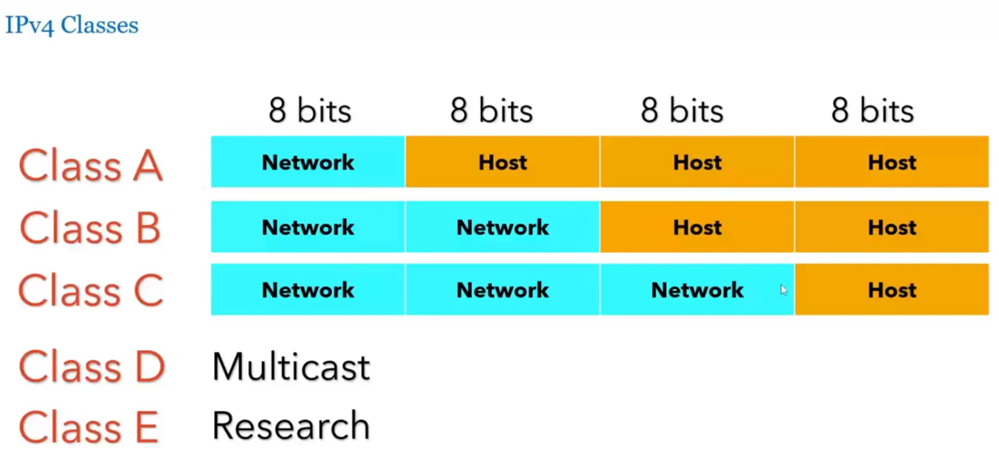
<br><em>توزيع الأوكتتات الأربعة بين Network و Host لكل فئة</em>
</div>

- <span dir="ltr">Class A</span>: أول أوكتت فقط ثابت للشبكة (Network)، والثلاثة الباقية للأجهزة. عدد الشبكات قليل جدًا، لكن عدد الأجهزة المتاحة في كل شبكة ضخم جدًا.
- <span dir="ltr">Class B</span>: أول أوكتتين ثابتين للشبكة، والأوكتتين الباقيين للأجهزة.
- <span dir="ltr">Class C</span>: أول ثلاثة أوكتتات ثابتة للشبكة، والأوكتت الأخير فقط للأجهزة. عدد الشبكات كبير جدًا، لكن عدد الأجهزة المتاحة في كل شبكة قليل نسبيًا (مناسبة للمنازل والشركات الصغيرة).

<div align="center">
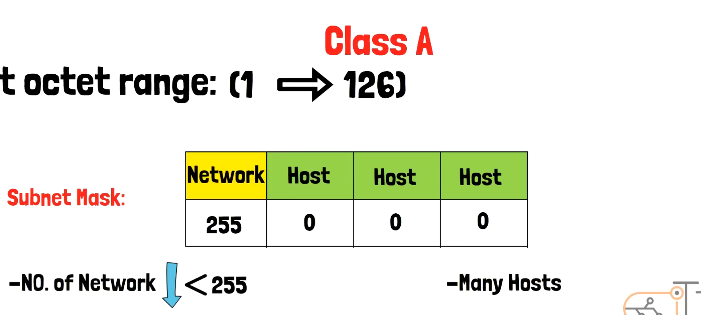
<br><em>Class A بالتفصيل: مدى الأوكتت الأول (1–126)، توزيع Network/Host، وخاصية "عدد شبكات قليل، عدد أجهزة كبير"</em>
</div>

<div align="center">
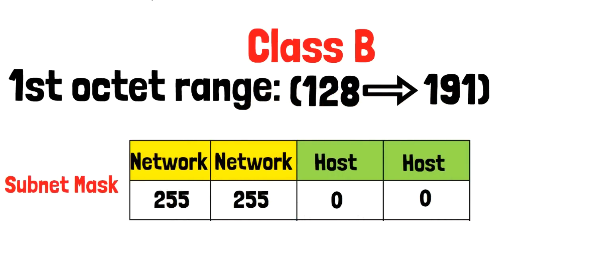
<br><em>Class B بالتفصيل: مدى الأوكتت الأول (128–191) وتوزيع Network/Host</em>
</div>

<div align="center">
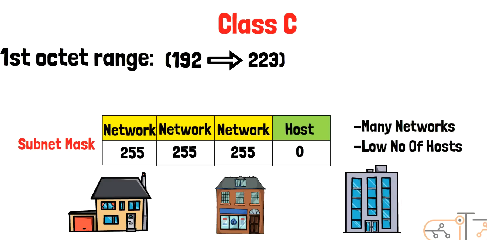
<br><em>Class C بالتفصيل: مدى الأوكتت الأول (192–223)، وخاصية "شبكات كثيرة بعدد أجهزة قليل" المناسبة للمنازل والشركات الصغيرة</em>
</div>

<h4 dir="rtl" align="right" id="why-d-e-no-mask">ج. ليه Class D و E مالهمش Subnet Mask؟</h4>

لأنهما غير مخصصين لعناوين أجهزة عادية على الإطلاق:
- <span dir="ltr">Class D</span> مخصصة بالكامل لعناوين البث المتعدد <span dir="ltr">(Multicast)</span>، وهي تمثل مجموعة من الأجهزة وليست جهازًا واحدًا، فلا معنى لتقسيمها إلى Network/Host.
- <span dir="ltr">Class E</span> محجوزة للأغراض البحثية والتجريبية ولم تُطرح للاستخدام العام.

---

<h3 dir="rtl" align="right" id="network-host-id">8. أجزاء عنوان الـ IP: Network ID و Host ID</h3>

<div align="center">
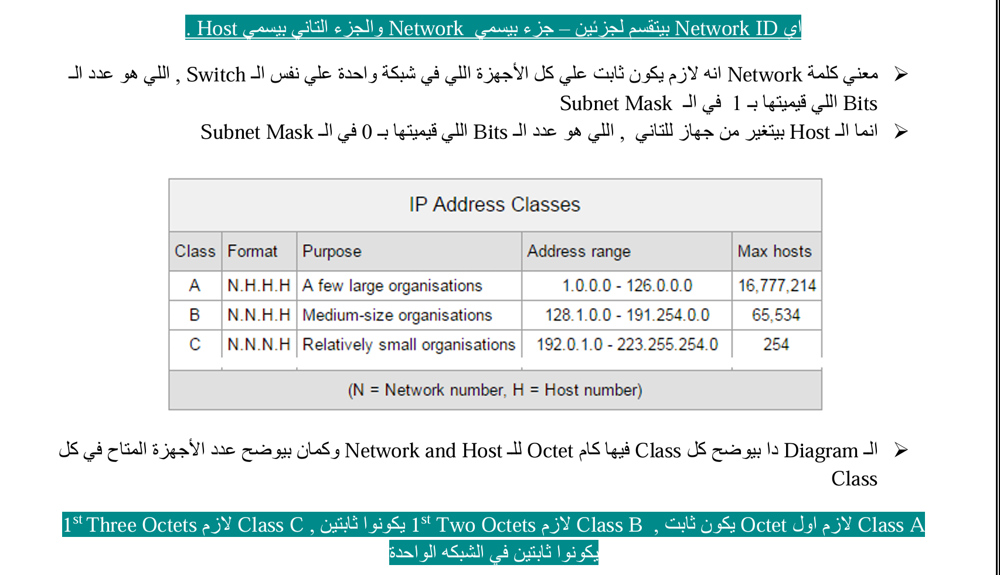
<br><em>تقسيم Network ID إلى جزء Network وجزء Host، وجدول الفئات الكامل</em>
</div>

كل عنوان <span dir="ltr">IP</span> ينقسم منطقيًا لجزئين:

| الجزء | معناه |
|:---:|:---:|
| <span dir="ltr">Network ID</span> | الجزء الثابت الذي يجب أن يكون **متطابقًا** لكل الأجهزة الموجودة على نفس الشبكة (نفس الـ Switch)، وهو يقابل البتات التي قيمتها `1` في الـ Subnet Mask |
| <span dir="ltr">Host ID</span> | الجزء **المتغير** من جهاز لآخر داخل نفس الشبكة، ويقابل البتات التي قيمتها `0` في الـ Subnet Mask |

**جدول الفئات الكامل (المدى + الصيغة + الاستخدام):**

| Class | الصيغة | الاستخدام | مدى العناوين | أقصى عدد Hosts |
|:---:|:---:|:---:|:---:|:---:|
| A | N.H.H.H | مؤسسات كبيرة قليلة العدد | `1.0.0.0 – 126.0.0.0` | 16,777,214 |
| B | N.N.H.H | مؤسسات متوسطة الحجم | `128.1.0.0 – 191.254.0.0` | 65,534 |
| C | N.N.N.H | مؤسسات صغيرة نسبيًا | `192.0.1.0 – 223.255.254.0` | 254 |

> 💡 **قاعدة الثبات حسب الفئة:** في <span dir="ltr">Class A</span> يجب أن يكون أول أوكتت ثابتًا، في <span dir="ltr">Class B</span> يجب أن يكون أول أوكتتين ثابتين، وفي <span dir="ltr">Class C</span> يجب أن تكون أول ثلاثة أوكتتات ثابتة داخل الشبكة الواحدة.

---

<h3 dir="rtl" align="right" id="network-host-broadcast">9. أنواع العناوين داخل الشبكة</h3>

<span id="network-host-broadcast-terms"></span>

| النوع | التعريف | مثال (على شبكة `192.168.1.0/24`) |
|:---:|:---:|:---:|
| <span dir="ltr">Network Address</span> | أول عنوان في نطاق الشبكة، يمثل الشبكة نفسها ولا يُخصَّص لأي جهاز | `192.168.1.0` |
| <span dir="ltr">Host Address</span> | أي عنوان بين عنوان الشبكة وعنوان البث، يُخصَّص فعليًا لجهاز | `192.168.1.1` إلى `192.168.1.254` |
| <span dir="ltr">Broadcast Address</span> | آخر عنوان في نطاق الشبكة، يُستخدم لإرسال بيانات لكل الأجهزة على الشبكة دفعة واحدة | `192.168.1.255` |

> 🔗 هذا التقسيم هو نفس السبب في معادلة عدد الأجهزة <span dir="ltr">2ʰ − 2</span> التي سنشرحها بالتفصيل في <a href="#subnetting-laws">الجزء الثاني</a>، لأن عنواني الشبكة والبث محجوزان دائمًا ولا يُحسبان ضمن الأجهزة القابلة للاستخدام.

<h4 dir="rtl" align="right" id="quiz-examples">تطبيق عملي: 3 أمثلة محلولة (بالـ Subnet Mask الافتراضي لكل فئة)</h4>

قبل الدخول في تفاصيل التقسيم الحر (Subnetting) في الجزء الثاني، هذه ثلاثة أمثلة محلولة لإيجاد عنوان الشبكة والبث وأول/آخر عنوان صالح، باستخدام الـ Subnet Mask **الافتراضي** لكل فئة (بدون أي تقسيم إضافي):

<div align="center">
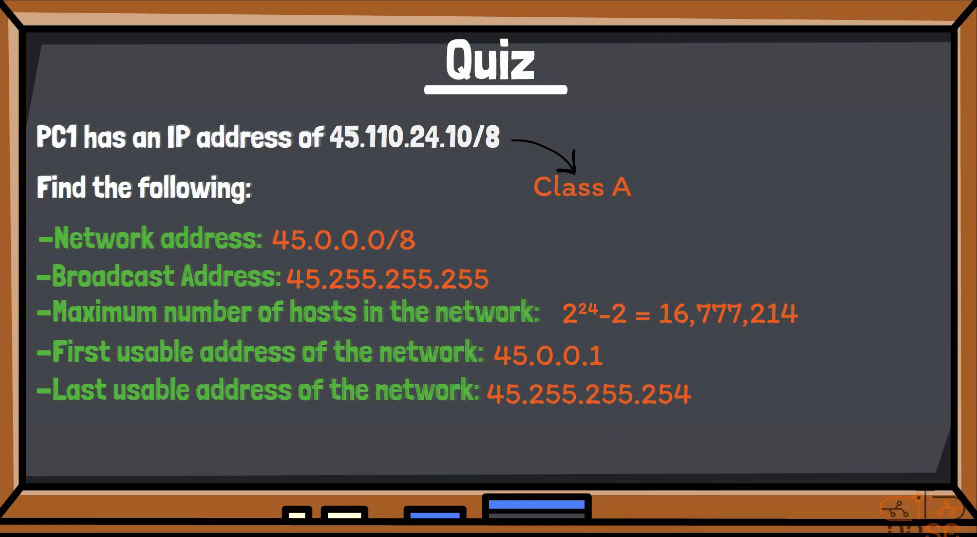
<br><em>مثال Class A: العنوان 45.110.24.10/8 ⬅ Network: 45.0.0.0، Broadcast: 45.255.255.255، أول IP: 45.0.0.1، آخر IP: 45.255.255.254، عدد الأجهزة: 2²⁴−2 = 16,777,214</em>
</div>

<div align="center">
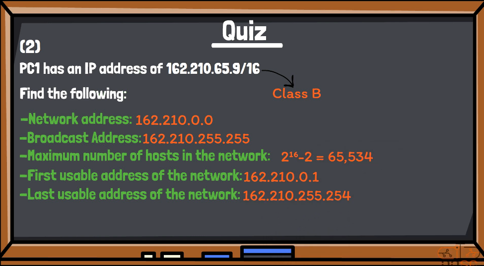
<br><em>مثال Class B: العنوان 162.210.65.9/16 ⬅ Network: 162.210.0.0، Broadcast: 162.210.255.255، أول IP: 162.210.0.1، آخر IP: 162.210.255.254، عدد الأجهزة: 2¹⁶−2 = 65,534</em>
</div>

<div align="center">
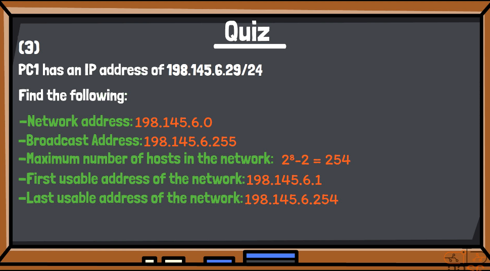
<br><em>مثال Class C: العنوان 198.145.6.29/24 ⬅ Network: 198.145.6.0، Broadcast: 198.145.6.255، أول IP: 198.145.6.1، آخر IP: 198.145.6.254، عدد الأجهزة: 2⁸−2 = 254</em>
</div>

> 🔑 لاحظ النمط في الأمثلة الثلاثة: عنوان الشبكة دائمًا هو نفس عنوان الـ IP لكن بتصفير كل بتات الأجهزة، وعنوان البث هو نفس عنوان الشبكة لكن بجعل كل بتات الأجهزة `1` (أي القيمة `255` في كل أوكتت متبقٍ للأجهزة).

---

<h3 dir="rtl" align="right" id="ip-types">10. أنواع عناوين الـ IP</h3>

<h4 dir="rtl" align="right" id="private-public-ip">أ. Private و Public IP</h4>

| النوع | الوصف |
|:---:|:---:|
| <span dir="ltr">Private IP</span> (خاص) | عناوين محجوزة للاستخدام داخل الشبكات المحلية فقط، غير قابلة للتوجيه على الإنترنت العام |
| <span dir="ltr">Public IP</span> (عام) | عناوين فريدة عالميًا يمكن الوصول إليها عبر الإنترنت |

**نطاقات الـ Private IP (RFC 1918)** — سبق ذكرها في <a href="../07-TCP-IP-Model.md">الموضوع السابع</a>:

| الفئة | النطاق الخاص |
|:---:|:---:|
| Class A | `10.0.0.0 – 10.255.255.255` |
| Class B | `172.16.0.0 – 172.31.255.255` |
| Class C | `192.168.0.0 – 192.168.255.255` |

<div align="center">
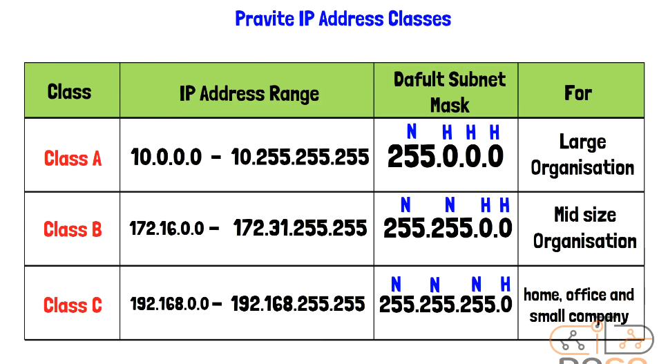
<br><em>جدول Private IP Address Classes: النطاق، الـ Subnet Mask الافتراضي، والاستخدام النموذجي لكل فئة</em>
</div>

**عناوين الـ Public IP حسب كل فئة:** أي عنوان داخل مدى الفئة (المذكور في <a href="#ip-classes">البند السابع</a>) ولا يقع ضمن النطاقات الخاصة أعلاه ولا ضمن النطاقات المحجوزة الأخرى (مثل APIPA أو Loopback) يُعتبر تلقائيًا **عنوان Public** قابل للتوجيه على الإنترنت. بما أن النطاق الخاص يقع **في المنتصف** غالبًا، فإن نطاق الـ Public يظهر كجزئين منفصلين قبله وبعده:

| الفئة | مدى الفئة الكامل | الجزء الخاص (Private) | نطاق Public الأول (قبل الجزء الخاص) | نطاق Public الثاني (بعد الجزء الخاص) |
|:---:|:---:|:---:|:---:|:---:|
| Class A | `1.0.0.0 – 126.255.255.255` | `10.0.0.0 – 10.255.255.255` | `1.0.0.0 – 9.255.255.255` | `11.0.0.0 – 126.255.255.255` |
| Class B | `128.0.0.0 – 191.255.255.255` | `172.16.0.0 – 172.31.255.255` | `128.0.0.0 – 172.15.255.255` | `172.32.0.0 – 191.255.255.255` |
| Class C | `192.0.0.0 – 223.255.255.255` | `192.168.0.0 – 192.168.255.255` | `192.0.0.0 – 192.167.255.255` | `192.169.0.0 – 223.255.255.255` |

> 💡 **مثال سريع للتفرقة:** لو شفت عنوان `172.20.5.1`، هو داخل نطاق `172.16.0.0 – 172.31.255.255` ⬅ **خاص (Private)**. لو شفت `172.50.5.1`، هو خارج النطاق الخاص لكن لسه داخل مدى Class B ⬅ **عام (Public)**. الفرق كله في هل الرقم واقع جوه النطاق الخاص المحدد بدقة ولا لأ، مش مجرد كونه في نفس الفئة.

> 💡 يعني عمليًا: كل عنوان Public IP بترجعله شركتك أو الراوتر بتاعك من الـ ISP، هو عنوان مُنتقى من نفس فئات A/B/C العادية، لكنه خارج النطاقات الخاصة المحجوزة، وهو ما يخلّيه صالحًا للظهور والتوجيه على الإنترنت العام مباشرة.

<h4 dir="rtl" align="right" id="apipa-virtual-ip">ب. APIPA و Virtual IP</h4>

| النوع | الوصف |
|:---:|:---:|
| <span dir="ltr">APIPA</span> (تلقائي) | عنوان يُخصصه الجهاز لنفسه تلقائيًا (بمدى `169.254.0.0/16`) عند فشل الحصول على IP من DHCP |
| <span dir="ltr">Virtual IP</span> (افتراضي) | عنوان IP غير مرتبط بكرت شبكة فعلي واحد، يُستخدم غالبًا في موازنة الأحمال <span dir="ltr">(Load Balancing)</span> أو أنظمة التعافي من الكوارث لتمثيل عدة أجهزة بعنوان واحد |

> ⚠️ **عنوان APIPA غير قابل للتوجيه <span dir="ltr">(Non-routable)</span>:** أي عنوان من نطاق `169.254.0.0/16` لا يمر أبدًا عبر أي راوتر، ويُستخدم فقط للتواصل بين الأجهزة الموجودة على **نفس الشبكة المحلية** (الطبقة الثانية). ظهور عنوان APIPA على جهاز هو مؤشر تشخيصي مباشر على وجود مشكلة في الوصول لسيرفر DHCP، وليس مجرد إعداد عادي.

<h4 dir="rtl" align="right" id="multicast-loopback">ج. Multicast و Loopback Address</h4>

| النوع | الوصف |
|:---:|:---:|
| <span dir="ltr">Multicast Address</span> (بث متعدد) | عنوان من نطاق <span dir="ltr">Class D</span> (`224.0.0.0 – 239.255.255.255`) يمثل مجموعة من الأجهزة معًا، وليس جهازًا واحدًا؛ يُستخدم لإرسال بيانات لمجموعة مشتركين محددة فقط (بدلًا من كل الشبكة كما في Broadcast) |
| <span dir="ltr">Loopback Address</span> (الاسترجاع الذاتي) | النطاق `127.0.0.0/8` (وأشهر مثال `127.0.0.1`)، يُستخدم لاختبار كرت الشبكة والبرمجيات على نفس الجهاز دون إرسال أي بيانات فعليًا على الشبكة |

**أشهر عناوين الـ Multicast المستخدمة في بروتوكولات التوجيه:**

| العنوان | الاستخدام |
|:---:|:---:|
| `224.0.0.5` | كل راوترات <span dir="ltr">OSPF</span> على الشبكة (All OSPF Routers) |
| `224.0.0.6` | راوترات <span dir="ltr">OSPF</span> المُعيَّنة (Designated Routers) فقط |
| `224.0.0.9` | كل راوترات <span dir="ltr">RIPv2</span> |
| `224.0.0.10` | كل راوترات <span dir="ltr">EIGRP</span> |

**كيف يرتبط عنوان الـ IP Multicast بعنوان الـ MAC؟**
عند إرسال بيانات Multicast على شبكة Ethernet، يُترجَم عنوان الـ IP Multicast تلقائيًا إلى عنوان **MAC Multicast مخصص** يبدأ دائمًا بالبادئة الثابتة `01:00:5E`، ويُشتق باقي العنوان من آخر 23 بت من عنوان الـ IP Multicast — وهذا يسمح لكرت الشبكة بتمييز حركة الـ Multicast تلقائيًا على مستوى الطبقة الثانية <span dir="ltr">(Data Link Layer)</span> دون فحص كل حزمة على مستوى الـ IP.

<h4 dir="rtl" align="right" id="reserved-addresses">د. عناوين محجوزة أخرى</h4>

| العنوان | الاستخدام |
|:---:|:---:|
| `0.0.0.0` | يمثل "أي عنوان غير معروف/غير محدد بعد"، يُستخدم أحيانًا كعنوان مصدر مؤقت قبل حصول الجهاز على IP فعلي |
| `255.255.255.255` | عنوان البث المحدود <span dir="ltr">(Limited Broadcast)</span>، يرسل لكل الأجهزة على الشبكة المحلية بغض النظر عن عنوان الشبكة |

---

<h3 dir="rtl" align="right" id="network-address-benefit">11. فائدة عنوان الشبكة في التحكم والحماية</h3>

<h4 dir="rtl" align="right" id="acl-concept">أ. ACL (Access Control List)</h4>

من أهم فوائد عنوان الشبكة أنه يسمح بتطبيق قواعد التحكم <span dir="ltr">(Access Control List – ACL)</span> على **شبكة كاملة بعنوان واحد**، بدلًا من التعامل مع كل جهاز على حدة. الـ <span dir="ltr">ACL</span> هي قائمة قواعد تُطبَّق عادةً على الراوتر أو الجدار الناري <span dir="ltr">(Firewall)</span> لتحديد أي حركة بيانات مسموح بها وأيها ممنوعة.

<h4 dir="rtl" align="right" id="firewall-example">ب. مثال الجدار الناري</h4>

لو عايزين نمنع شبكة فيها 200 جهاز من الوصول إلى الإنترنت، فبدلًا من إضافة 200 قاعدة منفصلة (عنوان كل جهاز على حدة) داخل سيرفر الجدار الناري، يكفي كتابة **قاعدة واحدة تستهدف عنوان الشبكة نفسه** (مثال: `192.168.10.0/24`)، وتُطبَّق تلقائيًا على كل الأجهزة المنتمية لهذه الشبكة.

هذا المبدأ نفسه هو أساس فائدة تقسيم مجال البث <span dir="ltr">(Broadcast Domain)</span> عن طريق الـ Subnetting: فكل ما كانت الشبكة أصغر (بعد التقسيم)، كل ما كان التحكم فيها والتعامل معها إداريًا وأمنيًا أسهل وأدق، وقلّ الازدحام الناتج عن رسائل البث (تفصيل كامل في <a href="#why-subnetting">بداية الجزء الثاني</a>).

---

<h3 dir="rtl" align="right" id="ip-assignment-methods">12. طرق حصول الجهاز على عنوان IP وإعداداته</h3>

<h4 dir="rtl" align="right" id="assignment-table">أ. طرق التوزيع</h4>

| الطريقة | الوصف |
|:---:|:---:|
| <span dir="ltr">DHCP</span> | توزيع تلقائي لعنوان IPv4 من سيرفر مخصص (راجع تفاصيل عملية <span dir="ltr">DORA</span> في <a href="../10-Networking-Devices.md">الموضوع العاشر</a>) |
| <span dir="ltr">DHCPv6</span> | نفس فكرة DHCP لكن لتوزيع عناوين IPv6 |
| <span dir="ltr">Static</span> | تعيين العنوان يدويًا من قِبل المسؤول عن الشبكة، ويظل ثابتًا حتى يُغيَّر يدويًا |
| <span dir="ltr">APIPA</span> | تعيين ذاتي تلقائي (`169.254.x.x`) عند فشل الجهاز في الوصول لسيرفر DHCP |
| <span dir="ltr">EUI-64</span> | آلية تلقائية (تُستخدم غالبًا مع IPv6) يُشتق فيها الجزء الخاص بالجهاز من عنوان الـ IP مباشرة من عنوان الـ MAC الخاص به |

<h4 dir="rtl" align="right" id="default-gateway">ب. Default Gateway</h4>

<span dir="ltr">Default Gateway</span> هو عنوان الـ <span dir="ltr">IP</span> الخاص بالراوتر (أو أي جهاز توجيه) الذي يستخدمه الجهاز للخروج من شبكته المحلية إلى أي شبكة أخرى (بما في ذلك الإنترنت). أي بيانات وجهتها خارج نطاق الشبكة المحلية للجهاز تُرسَل أولًا إلى الـ Default Gateway ليتولى هو توجيهها.

بالإضافة لعنوان الـ IP نفسه، يحتاج الجهاز عادة **إعدادات مصاحبة** حتى يقدر يتواصل بشكل كامل، أهمها: الـ <span dir="ltr">Subnet Mask</span>، والـ <span dir="ltr">Default Gateway</span>، وخادم الـ <span dir="ltr">DNS</span> (راجع تفاصيل الـ DNS في <a href="../10-Networking-Devices.md">الموضوع العاشر</a>) — وكلها تُوزَّع تلقائيًا مع الـ IP عند استخدام DHCP.

<h4 dir="rtl" align="right" id="devices-with-ip">ج. الأجهزة التي تمتلك عنوان IP</h4>

أي جهاز يحتاج التواصل عبر الشبكة يحتاج عنوان IP، وهذا يشمل: أجهزة الكمبيوتر والهواتف، الطابعات الشبكية، الراوترات والسويتشات القابلة للإدارة <span dir="ltr">(Managed Switches)</span>، الكاميرات الأمنية، وأجهزة إنترنت الأشياء <span dir="ltr">(IoT)</span> بشكل عام — أي جهاز "ذكي" متصل بالشبكة يحتاج عنوانًا فريدًا للتواصل.

<h4 dir="rtl" align="right" id="ipconfig-renew">د. أمر ipconfig /renew</h4>

أمر يُستخدم في أنظمة <span dir="ltr">Windows</span> لإجبار الجهاز على تجديد طلب الحصول على عنوان IP جديد من سيرفر الـ <span dir="ltr">DHCP</span>، ويُستخدم غالبًا عند حدوث مشاكل في الاتصال أو عند الحاجة لتحديث إعدادات الشبكة يدويًا دون إعادة تشغيل الجهاز.

<h4 dir="rtl" align="right" id="dhcp-relay-agent">هـ. DHCP Relay Agent (Helper Address)</h4>

**المشكلة:** طلب الـ DHCP الأول اللي بيبعته أي جهاز (Discover) هو رسالة **Broadcast**، والـ Broadcast بطبيعته **لا يعبر الراوتر** أبدًا — الراوتر يوقف أي مجال بث <span dir="ltr">(Broadcast Domain)</span> عند حدوده (راجع <a href="#why-subnetting">مقدمة الجزء الثاني</a>). فماذا لو كان سيرفر الـ DHCP موجودًا في شبكة فرعية (Subnet) مختلفة عن الجهاز الذي يطلب عنوانًا؟

**الحل — DHCP Relay Agent:**
1. الراوتر (أو السويتش من الطبقة 3) المتصل مباشرة بالشبكة الفرعية الطالبة يُهيَّأ بأمر خاص يُسمى **Helper Address** يحدد عنوان سيرفر الـ DHCP الحقيقي.
2. عندما يستقبل الراوتر طلب Broadcast من الجهاز، **يحوّله إلى رسالة Unicast** عادية (بدل ما يتجاهله)، ويرسلها مباشرة لعنوان سيرفر الـ DHCP المحدد في الـ Helper Address.
3. سيرفر الـ DHCP يرد بعنوان IP مناسب **لشبكة الجهاز الفرعية الأصلية** (وليس لشبكة السيرفر)، ويمر الرد عبر نفس الراوتر بالعكس حتى يصل للجهاز.

بهذه الطريقة، سيرفر DHCP مركزي واحد يقدر يخدم عشرات الشبكات الفرعية المختلفة دون الحاجة لسيرفر منفصل في كل Subnet.

---

<h3 dir="rtl" align="right" id="routing">13. التوجيه: جدول التوجيه وأنواع المسارات</h3>

<h4 dir="rtl" align="right" id="routing-table">أ. جدول التوجيه</h4>

**جدول التوجيه <span dir="ltr">(Routing Table)</span>** هو جدول موجود داخل كل راوتر، يحتوي على المعلومات التي يحتاجها لتحديد أفضل مسار لإرسال البيانات، وأهم محتوياته:
- عنوان الشبكة الوجهة <span dir="ltr">(Destination Network)</span>
- الـ Subnet Mask الخاص بها
- عنوان القفزة التالية <span dir="ltr">(Next Hop)</span>
- واجهة الخروج <span dir="ltr">(Exit Interface)</span>

<h4 dir="rtl" align="right" id="routing-protocols">ب. بروتوكولات التوجيه</h4>

**بروتوكولات التوجيه <span dir="ltr">(Routing Protocols)</span>** هي البروتوكولات التي تستخدمها الراوترات لتبادل معلومات المسارات بينها بشكل تلقائي وبناء جداول التوجيه (مثل <span dir="ltr">RIP, OSPF, EIGRP, BGP</span>) — سيتم التوسع فيها بالتفصيل عند دراسة موضوع التوجيه المتقدم لاحقًا في المسار.

<h4 dir="rtl" align="right" id="router-uses-ip">ج. كيف يستخدم الراوتر الـ IP للتوجيه</h4>

عندما تصل حزمة بيانات إلى الراوتر، يقارن الراوتر عنوان الشبكة الوجهة (المُستخرَج من عنوان الـ IP الوجهة عبر عملية <span dir="ltr">ANDing</span> — انظر <a href="#anding">البند الثالث من الجزء الثاني</a>) بالمسارات المخزّنة في جدول التوجيه الخاص به، ويختار أفضل مسار مطابق (عادة الأكثر تحديدًا)، ثم يعيد توجيه الحزمة عبر واجهة الخروج المناسبة نحو القفزة التالية، وتتكرر هذه العملية عند كل راوتر في الطريق حتى تصل الحزمة لوجهتها النهائية.

<h4 dir="rtl" align="right" id="default-vs-static-route">د. Default Route مقابل Static Route</h4>

| النوع | التعريف | متى يُستخدم |
|:---:|:---:|:---:|
| <span dir="ltr">Static Route</span> | مسار مُحدَّد يدويًا من قِبل المسؤول لشبكة وجهة **معينة** بالتحديد | عند الحاجة للتحكم الدقيق في مسار شبكة أو شبكات معينة بعينها |
| <span dir="ltr">Default Route</span> | مسار "افتراضي" يُستخدم كحل احتياطي شامل لأي وجهة **غير موجودة** في جدول التوجيه، ويُكتب عادة بصيغة `0.0.0.0/0` | عند الحاجة لتوجيه أي بيانات لا تطابق أي مسار محدد آخر (غالبًا للخروج إلى الإنترنت) |

**الفرق الجوهري:** الـ Static Route محدد ودقيق لشبكة بعينها، بينما الـ Default Route عام وشامل ويُستخدم كملاذ أخير عندما لا يجد الراوتر أي مسار أكثر تحديدًا يطابق وجهة الحزمة.

---

<h3 dir="rtl" align="right" id="ip-header">14. عملية التغليف وهيدر الـ IP</h3>

عند إرسال البيانات، يقوم الجهاز بعملية **التغليف <span dir="ltr">(Encapsulation)</span>** التي شُرحت بالتفصيل في <a href="../04-OSI-Model.md">الموضوع الرابع</a> و<a href="../07-TCP-IP-Model.md">الموضوع السابع</a>، حيث تُضاف عند طبقة الشبكة معلومات **هيدر الـ IP <span dir="ltr">(IP Header)</span>**:

<div align="center">
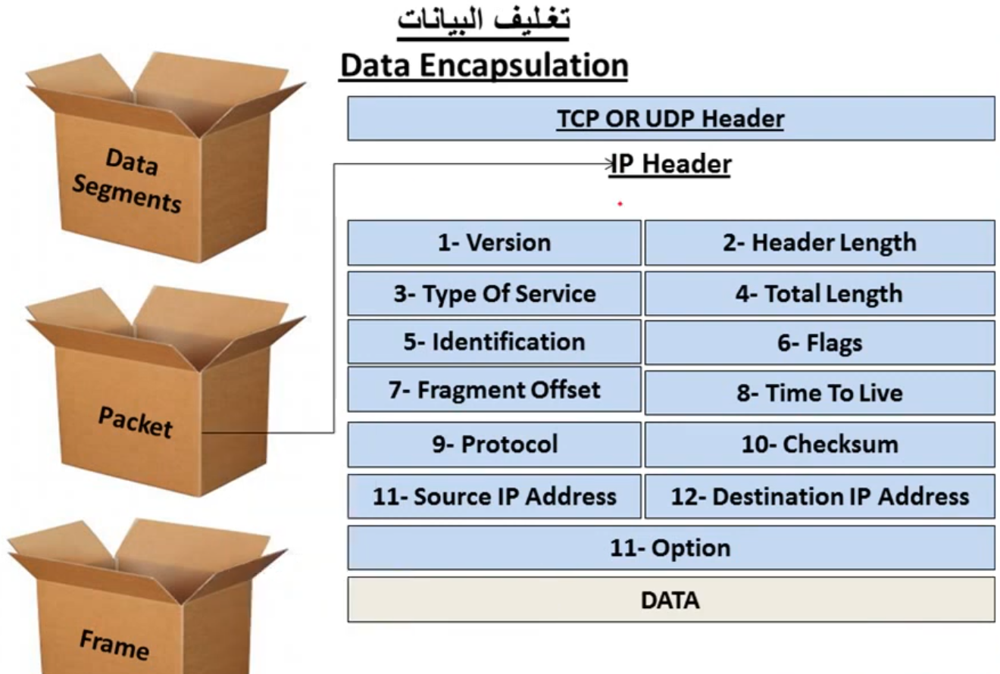
<br><em>تغليف البيانات (Data Encapsulation) وحقول هيدر الـ IP كاملة</em>
</div>

<h4 dir="rtl" align="right" id="ip-header-basic-fields">أ. الحقول الأساسية</h4>

| الحقل | الوظيفة |
|:---:|:---:|
| <span dir="ltr">Version</span> | يحدد إصدار بروتوكول الـ IP المستخدم (4 لـ IPv4 أو 6 لـ IPv6) |
| <span dir="ltr">Header Length</span> | يحدد طول الهيدر نفسه بالضبط، لأنه قد يتضمن حقل Options الاختياري فيتغير طوله |
| <span dir="ltr">Total Length</span> | يحدد الطول الكامل للحزمة بأكملها (الهيدر + البيانات) |
| <span dir="ltr">Source IP</span> | عنوان الجهاز المُرسِل |
| <span dir="ltr">Destination IP</span> | عنوان الجهاز المستقبِل |
| <span dir="ltr">TTL (Time to Live)</span> | يحدد أقصى عدد قفزات <span dir="ltr">(Hops)</span> يمكن أن تمر بها الحزمة قبل إسقاطها، لمنع دورانها إلى الأبد |
| <span dir="ltr">Protocol</span> | يوضح البروتوكول المستخدم في الطبقة الأعلى (مثل TCP أو UDP، راجع <a href="../07-TCP-IP-Model.md">الموضوع السابع</a>) |
| <span dir="ltr">Checksum</span> | قيمة تُستخدم للتحقق من سلامة الهيدر نفسه، والتأكد إنه لم يتعرض لأي تلف أثناء النقل |
| <span dir="ltr">Options</span> | حقل اختياري إضافي، نادرًا ما يُستخدم في الحركة العادية، مخصص لميزات متقدمة مثل التسجيل الأمني أو تتبع المسار |

<h4 dir="rtl" align="right" id="dscp-tos">ب. DSCP / ToS (QoS)</h4>

| الحقل | الوظيفة |
|:---:|:---:|
| <span dir="ltr">DSCP / ToS (Type of Service)</span> | حقل يُستخدم لتحديد **أولوية جودة الخدمة <span dir="ltr">(QoS)</span>** للحزمة، بحيث يقدر الراوتر يعطي أولوية أعلى لحزم حساسة للتأخير (مثل مكالمات الصوت VoIP) عن حزم أقل حساسية (مثل تحميل ملف) |

<h4 dir="rtl" align="right" id="fragmentation-fields">ج. Identification, Flags, Fragment Offset (التجزئة)</h4>

| الحقل | الوظيفة |
|:---:|:---:|
| <span dir="ltr">Identification</span> | رقم تعريفي فريد يُعطى لكل حزمة أصلية **قبل** تقسيمها، بحيث لو الحزمة اتقسّمت لأجزاء (Fragments)، كل الأجزاء بتحمل نفس الرقم عشان الجهاز المستقبل يعرف إنها تابعة لنفس الحزمة الأصلية |
| <span dir="ltr">Flags</span> | بتات تتحكم في عملية التقسيم <span dir="ltr">(Fragmentation)</span>، أهمها `DF (Don't Fragment)` اللي يمنع تقسيم الحزمة نهائيًا، و`MF (More Fragments)` اللي يوضح إن فيه أجزاء تانية جاية بعد الجزء ده |
| <span dir="ltr">Fragment Offset</span> | يوضح **ترتيب/موضع** كل جزء (Fragment) بالنسبة للحزمة الأصلية الكاملة، عشان الجهاز المستقبل يقدر يعيد تجميع الأجزاء بالترتيب الصحيح |

> 💡 **التقسيم والتجميع <span dir="ltr">(Fragmentation & Reassembly)</span>:** لو كانت الحزمة أكبر من الحد الأقصى لحجم الوحدة القابلة للنقل <span dir="ltr">(MTU – Maximum Transmission Unit)</span> لأي وصلة في طريقها، يقوم الراوتر بتقسيمها لأجزاء أصغر (باستخدام حقلي Identification و Fragment Offset لتمييزها وترتيبها)، ويتم تجميعها مرة أخرى عند وصولها للجهاز المستقبل النهائي فقط — الأجهزة الوسيطة لا تعيد تجميعها.

---

<h3 dir="rtl" align="right" id="ip-port-relationship">15. العلاقة بين IP والـ Port Number</h3>

<h4 dir="rtl" align="right" id="socket-concept">أ. مفهوم الـ Socket</h4>

عنوان الـ <span dir="ltr">IP</span> وحده **يحدد الجهاز** فقط، لكنه لا يحدد **أي برنامج أو خدمة** داخل هذا الجهاز يجب أن يستقبل البيانات. هنا يأتي دور رقم الـ <span dir="ltr">Port</span> (تم شرحه بالتفصيل الكامل في <a href="../05-Port-Number.md">الموضوع الخامس</a>):

| العنصر | الطبقة | الوظيفة |
|:---:|:---:|:---:|
| <span dir="ltr">IP Address</span> | Layer 3 – Network | يحدد **الجهاز** (مين المُرسِل ومين المستقبِل) |
| <span dir="ltr">Port Number</span> | Layer 4 – Transport | يحدد **الخدمة/البرنامج** المطلوب داخل هذا الجهاز (مثل متصفح، بريد إلكتروني، لعبة أونلاين...) |

الدمج بين عنوان الـ IP ورقم الـ Port معًا (مثال: `192.168.1.10:443`) يُكوّن ما يُسمى <span dir="ltr">Socket</span>، وهو ما يحدد بدقة متناهية **جهازًا بعينه + خدمة بعينها عليه** — وهو نفس مفهوم الـ <span dir="ltr">Socket Pair / 4-Tuple</span> الذي شُرح بالتفصيل في <a href="../05-Port-Number.md">الموضوع الخامس</a>.

<h4 dir="rtl" align="right" id="source-destination-port">ب. Source و Destination Port</h4>

**ما الذي "يُضاف" لعنوان الـ IP علشان الجهاز يقدر يطلع على الإنترنت؟**
عند إرسال أي طلب (مثل فتح موقع على المتصفح)، الجهاز لا يرسل عنوان الـ IP بمفرده، بل يرفقه بالمعلومات التالية:

1. **Destination Port:** رقم Port ثابت ومعروف للخدمة المطلوبة على السيرفر البعيد (مثال: `443` لـ HTTPS، `80` لـ HTTP).
2. **Source Port:** رقم Port **عشوائي** يختاره الجهاز المُرسِل لنفسه من نطاق الـ <span dir="ltr">Ephemeral Ports</span> (منافذ مؤقتة، عادة من `49152` إلى `65535`) — وهذا الرقم هو ما يسمح للجهاز بالتفريق بين عدة اتصالات مفتوحة في نفس الوقت (مثال: فتح أكتر من تبويب في المتصفح على نفس الموقع، كل تبويب له Source Port مختلف).

<h4 dir="rtl" align="right" id="ephemeral-ports">ج. الـ Ephemeral Ports</h4>

مفهوم الـ Ephemeral Ports واختياره العشوائي تم شرحه بالتفصيل في <a href="../06-Lab-OSI-Model.md">الموضوع السادس – OSI Practical Lab</a>.

---

<h3 dir="rtl" align="right" id="nat">16. ترجمة عناوين الشبكة NAT</h3>

<span dir="ltr">NAT (Network Address Translation)</span> هي تقنية تُستخدم لترجمة عناوين الـ <span dir="ltr">IP</span> الخاصة <span dir="ltr">(Private)</span> غير القابلة للتوجيه على الإنترنت إلى عنوان IP عام <span dir="ltr">(Public)</span> واحد أو أكثر، والعكس.

**فوائد ووظيفة NAT:**
- تسمح لعدة أجهزة داخل شبكة محلية بمشاركة عنوان IP عام واحد للوصول إلى الإنترنت، مما يقلل الحاجة لعناوين عامة كثيرة (يعالج جزئيًا مشكلة نفاد عناوين IPv4).
- تضيف طبقة أمان إضافية، لأن الأجهزة الداخلية غير مرئية مباشرة من الإنترنت الخارجي.

<h4 dir="rtl" align="right" id="nat-types">أ. أنواع NAT</h4>

| النوع | الوصف |
|:---:|:---:|
| <span dir="ltr">Static NAT</span> | ترجمة ثابتة عنوان خاص واحد ↔ عنوان عام واحد بشكل دائم |
| <span dir="ltr">Dynamic NAT</span> | ترجمة من مجموعة عناوين خاصة إلى مجموعة عناوين عامة، بشكل تلقائي غير ثابت |
| <span dir="ltr">PAT (Port Address Translation)</span> | يُعرف أيضًا بـ <span dir="ltr">NAT Overload</span>، يسمح لعدة أجهزة بمشاركة عنوان IP عام واحد عن طريق التفريق بينهم بأرقام Ports مختلفة |
| <span dir="ltr">CGNAT (Carrier-Grade NAT)</span> | نفس فكرة الـ PAT، لكن يطبّقها مزود خدمة الإنترنت <span dir="ltr">(ISP)</span> نفسه على مستوى شبكته بالكامل — بحيث يشارك عشرات أو مئات المشتركين المنزليين **نفس عنوان الـ Public IP الواحد**، وليس فقط أجهزة المنزل الواحد. تُستخدم بكثافة حاليًا كحل مؤقت لتأخير نفاد عناوين IPv4 مع تأخر انتشار IPv6 الكامل (راجع <a href="#ipv6-appendix">ملحق IPv6</a>) |

<h4 dir="rtl" align="right" id="pat-home-router">ب. مثال تطبيقي: إزاي راوتر منزلي بـ IP عام واحد يخدم أكثر من 10 أجهزة</h4>

هذا هو التطبيق العملي الأشهر لـ <span dir="ltr">PAT</span>، ويعتمد بالكامل على <a href="#ip-port-relationship">العلاقة بين IP والـ Port</a> المشروحة أعلاه:

الراوتر المنزلي عادة عنده **عنوان Public IP واحد فقط** من مزود الخدمة <span dir="ltr">(ISP)</span>، بينما كل جهاز داخل المنزل (موبايل، لابتوب، سمارت تي في...) له **عنوان Private IP مختلف**. عند خروج أي جهاز للإنترنت:

1. الجهاز يرسل طلبه بعنوانه الخاص (Private IP) + Source Port عشوائي اختاره هو لنفسه.
2. الراوتر يستقبل الطلب، ويستبدل عنوان الـ IP الخاص بعنوانه العام (Public IP) الوحيد، **لكنه يغيّر رقم الـ Source Port لرقم عشوائي جديد فريد** لا يتعارض مع أي جهاز آخر متصل في نفس اللحظة.
3. الراوتر يسجّل هذه العملية في **جدول ترجمة (NAT Table)** داخلي يربط بين: (Private IP + Port الأصلي للجهاز) ⬌ (Public IP + Port الجديد المُخصَّص).
4. لما يرجع الرد من الإنترنت لنفس الـ Port الجديد، الراوتر يرجع لجدول الترجمة، يعرف بالظبط الرد ده خاص بأنهي جهاز داخلي، ويوجهه له.

**مثال مبسط:**

| الجهاز | Private IP | Source Port الأصلي | بعد الترجمة (Public IP:Port) |
|:---:|:---:|:---:|:---:|
| موبايل 1 | `192.168.1.10` | `51000` | `41.32.10.5:61001` |
| لابتوب | `192.168.1.11` | `51000` | `41.32.10.5:61002` |
| سمارت تي في | `192.168.1.12` | `52310` | `41.32.10.5:61003` |

لاحظ أن الـ Public IP **واحد ثابت** لكل الأجهزة (`41.32.10.5`)، لكن رقم الـ Port المُترجَم مختلف لكل اتصال — وهذا بالضبط ما يسمح بتمييز آلاف الاتصالات المتزامنة عبر عنوان Public واحد فقط، لأن نطاق أرقام الـ Port يصل لـ 65,535 رقم مختلف لكل عنوان IP.

<h4 dir="rtl" align="right" id="nat-table-records">ج. سجلات NAT (NAT Table / NAT Records)</h4>

**جدول ترجمة الـ NAT <span dir="ltr">(NAT Table)</span>** هو السجل الفعلي الذي يحتفظ به الراوتر (أو جدار الحماية) لكل عملية ترجمة تحدث، وهو ما يجعل عملية الـ <a href="#pat-home-router">PAT</a> ممكنة أصلًا. كل سطر (سجل/Record) في هذا الجدول يحتوي عادةً على الحقول التالية:

| الحقل | الوظيفة |
|:---:|:---:|
| <span dir="ltr">Private IP : Private Port</span> | عنوان ومنفذ الجهاز الداخلي الأصليين قبل الترجمة |
| <span dir="ltr">Public IP : Public Port</span> | عنوان ومنفذ الراوتر العام بعد الترجمة (المُستخدَم فعليًا على الإنترنت) |
| <span dir="ltr">Destination IP : Destination Port</span> | عنوان ومنفذ السيرفر البعيد الذي يتواصل معه الجهاز |
| <span dir="ltr">Protocol</span> | نوع البروتوكول المستخدم (<span dir="ltr">TCP</span> أو <span dir="ltr">UDP</span>، راجع <a href="#ip-port-relationship">البند 15</a>) |
| <span dir="ltr">Timeout / Idle Time</span> | المدة الزمنية التي يظل بها السجل نشطًا؛ لو لم يُستخدم الاتصال لفترة معينة، يُحذف السجل تلقائيًا لتحرير رقم الـ Port لاستخدامه من جديد |

**لماذا هذا السجل مهم؟** بدون هذا الجدول، لن يعرف الراوتر إلى أي جهاز داخلي يوجّه أي رد قادم من الإنترنت — فهو "الذاكرة" التي تربط كل طلب صادر بردّه الوارد، ولهذا السبب أجهزة NAT تُعتبر عمومًا **Stateful** (تحتفظ بحالة كل اتصال)، على عكس التوجيه العادي الذي لا يحتاج تذكّر أي شيء عن الحزم السابقة.

<h4 dir="rtl" align="right" id="nat-terms">د. مصطلحات NAT</h4>

| المصطلح | المعنى |
|:---:|:---:|
| <span dir="ltr">Inside Local</span> | العنوان الخاص للجهاز الداخلي كما يُرى من داخل الشبكة المحلية |
| <span dir="ltr">Inside Global</span> | العنوان العام الذي يُترجَم إليه الجهاز الداخلي عند خروجه للإنترنت |
| <span dir="ltr">Outside Local</span> | كيف يُرى الجهاز الخارجي (على الإنترنت) من داخل الشبكة المحلية |
| <span dir="ltr">Outside Global</span> | العنوان العام الحقيقي للجهاز الخارجي كما هو على الإنترنت |
| <span dir="ltr">Global Address</span> | أي عنوان يُستخدم على الإنترنت العام |
| <span dir="ltr">Local Address</span> | أي عنوان يُستخدم داخل الشبكة المحلية الخاصة |

<h4 dir="rtl" align="right" id="port-forwarding-dmz">هـ. Port Forwarding و DMZ</h4>

بما إن الـ NAT بطبيعته **يمنع** أي اتصال يبدأ من الإنترنت الخارجي بجهاز داخلي (لأنه مفيش سجل NAT مسبق له، راجع <a href="#nat-table-records">سجلات NAT</a>)، أحيانًا محتاجين نسمح لطلبات خارجية معينة بالوصول لجهاز داخلي محدد عن قصد — وده بيتم بطريقتين:

| التقنية | الوصف |
|:---:|:---:|
| <span dir="ltr">Port Forwarding</span> | إعداد ثابت في الراوتر يقول: "أي طلب خارجي يجي على Port معين (زي 80 أو 3389)، حوّله لجهاز داخلي محدد بعينه بنفس الـ Port أو بـ Port مختلف". يُستخدم غالبًا لاستضافة سيرفر ألعاب أو كاميرا مراقبة داخل الشبكة المنزلية |
| <span dir="ltr">DMZ (Demilitarized Zone)</span> | إعداد يجعل جهازًا داخليًا واحدًا **مكشوفًا بالكامل** لكل حركة المرور الواردة من الإنترنت (بدل تحديد Port بعينه)؛ يُستخدم عادة لسيرفرات عامة تحتاج وصولًا واسعًا، لكنه أقل أمانًا بكثير من الـ Port Forwarding المحدد لأنه يزيل معظم حماية الـ NAT عن هذا الجهاز |

---

<h3 dir="rtl" align="right" id="network-monitoring">17. مراقبة الشبكة عبر عنوان الـ IP</h3>

توجد برامج وبروتوكولات مخصصة لمراقبة حالة الأجهزة على الشبكة اعتمادًا على عنوان الـ <span dir="ltr">IP</span> الخاص بكل منها، أبرزها بروتوكول <span dir="ltr">SNMP (Simple Network Management Protocol)</span>، الذي يسمح لأدوات المراقبة بجمع معلومات عن أداء وحالة الأجهزة (مثل الراوترات والسويتشات والسيرفرات) عن بُعد، والتنبيه عند حدوث أعطال أو تجاوز حدود معينة في الاستخدام.

---

<h3 dir="rtl" align="right" id="transmission-types">18. طرق إرسال البيانات: Unicast, Broadcast, Multicast</h3>

هي ثلاث طرق مختلفة تحدد **عدد وهوية** الأجهزة المستقبِلة لأي حزمة بيانات:

<div align="center">
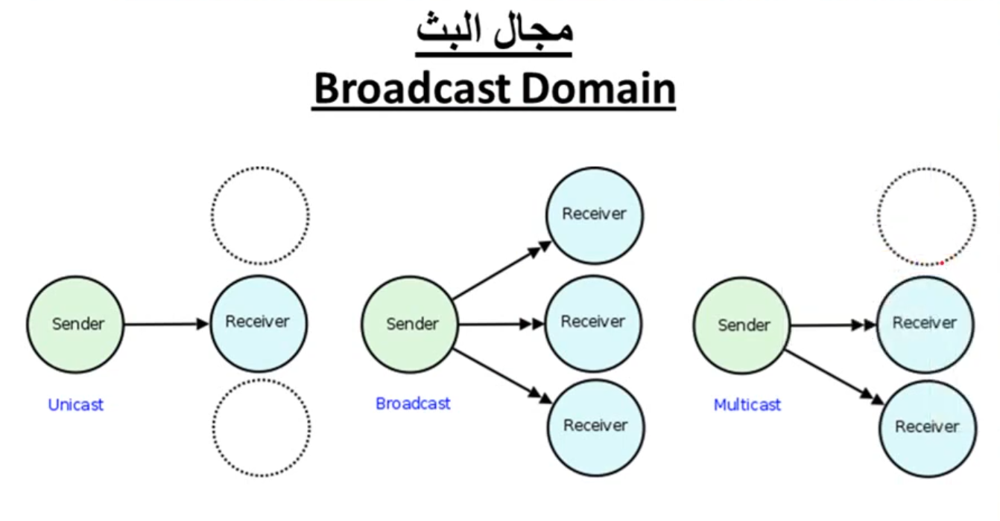
<br><em>الفرق البصري بين Unicast (مستقبل واحد)، Broadcast (كل المستقبلين)، وMulticast (مجموعة محددة)</em>
</div>

| النوع | عدد المستقبِلين | مثال عملي |
|:---:|:---:|:---:|
| <span dir="ltr">Unicast</span> (فردي) | جهاز واحد محدد بالضبط | تصفح موقع ويب، أو مكالمة فيديو بين شخصين |
| <span dir="ltr">Broadcast</span> (بث عام) | **كل** الأجهزة على نفس الشبكة المحلية بلا استثناء | طلب الـ DHCP الأول (Discover)، أو رسائل ARP (راجع <a href="../09-Ethernet-LAN.md">الموضوع التاسع</a>) |
| <span dir="ltr">Multicast</span> (بث موجّه لمجموعة) | مجموعة محددة فقط من الأجهزة المشتركة في هذا البث (راجع <a href="#multicast-loopback">البند العاشر</a>) | تحديثات بروتوكولات التوجيه (OSPF, EIGRP)، أو بث فيديو مباشر لمشتركين محددين |

> 🔑 **الفرق الجوهري:** الـ Unicast يستهلك أقل موارد لكنه محدود لجهة واحدة، الـ Broadcast يصل للجميع لكنه مُكلف على أداء الشبكة كلما كبر حجمها (وهو أحد أهم أسباب <a href="#why-subnetting">الحاجة للـ Subnetting</a>)، بينما الـ Multicast حل وسط: يوصل لمجموعة مهتمة بالفعل دون إزعاج باقي الشبكة.

---

<h3 dir="rtl" align="right" id="ip-security-concepts">19. اعتبارات أمنية مرتبطة بعناوين IP والتقسيم</h3>

<h4 dir="rtl" align="right" id="segmentation-vlans">أ. عزل الشبكات (Network Segmentation) و VLANs</h4>

تقسيم الشبكة عبر الـ <span dir="ltr">Subnetting</span> ليس مجرد فائدة تنظيمية — هو **إجراء أمني جوهري**. عندما تُقسَّم الشبكة لأجزاء أصغر (غالبًا بالتزامن مع <span dir="ltr">VLANs</span> على مستوى السويتشات)، فإن أي جهاز يتم اختراقه لا يستطيع بسهولة الوصول لباقي أجزاء الشبكة، لأن حركة المرور بين الشبكات الفرعية المختلفة **تمر إجباريًا عبر راوتر أو جدار ناري** يمكن التحكم فيه بقواعد <span dir="ltr">ACL</span> (راجع <a href="#network-address-benefit">البند 11</a>). هذا المبدأ يُسمى **تقليل مساحة الانتشار الجانبي <span dir="ltr">(Lateral Movement)</span>** — أي كلما كانت الشبكة مقسّمة بدقة أكبر، كل ما كان صعبًا على مهاجم اخترق جهازًا واحدًا أن يتحرك بحرية لبقية الشبكة.

<h4 dir="rtl" align="right" id="spoofing-broadcast-storms">ب. انتحال العناوين (IP/MAC Spoofing) وعواصف البث (Broadcast Storms)</h4>

- **IP/MAC Spoofing:** انتحال عنوان IP أو MAC مهاجم بانتحال هوية جهاز شرعي على الشبكة، بهدف تجاوز قواعد التحكم أو اعتراض حركة المرور الموجهة لذلك الجهاز.
- **Broadcast Storm:** حالة تحدث عندما تتراكم كميات هائلة من رسائل الـ Broadcast على شبكة واحدة كبيرة (غالبًا بسبب حلقة في الشبكة أو هجوم متعمد)، فتستهلك كل عرض النطاق الترددي المتاح وتشل الشبكة بالكامل. **تقليل حجم كل Subnet عبر الـ Subnetting** يحد تلقائيًا من حجم أي مجال بث واحد، وبالتالي يقلل الضرر المحتمل من عاصفة بث لو حدثت، لأنها تبقى محصورة داخل الشبكة الفرعية المتأثرة فقط.

<h4 dir="rtl" align="right" id="classful-vs-classless-routing">ج. بروتوكولات التوجيه Classful مقابل Classless</h4>

| النوع | الوصف | مثال |
|:---:|:---:|:---:|
| <span dir="ltr">Classful Routing</span> | بروتوكول توجيه **لا يرسل** معلومة الـ Subnet Mask ضمن تحديثاته، ويفترض دائمًا الـ Subnet Mask الافتراضي حسب الفئة (A/B/C) | <span dir="ltr">RIPv1</span> |
| <span dir="ltr">Classless Routing</span> | بروتوكول توجيه **يرسل** الـ Subnet Mask (أو صيغة CIDR) صراحة مع كل تحديث، مما يسمح بدعم شبكات مُقسَّمة بـ VLSM بحرية كاملة | <span dir="ltr">RIPv2, OSPF, EIGRP</span> |

> 💡 هذا الفرق مهم عمليًا لأن أي شبكة تستخدم VLSM (راجع <a href="#vlsm">الجزء الثاني، البند 10</a>) **يجب** أن تعتمد على بروتوكول Classless، وإلا فقدت المعلومات الدقيقة عن حدود كل Subnet أثناء التوجيه.

---

<h3 dir="rtl" align="right" id="cli-reference">20. أدوات التشخيص والأوامر العملية (CLI Reference)</h3>

| الأمر | نظام التشغيل | الوظيفة |
|:---:|:---:|:---:|
| `ipconfig` | Windows | عرض إعدادات الشبكة الحالية (IP, Subnet Mask, Default Gateway) |
| `ifconfig` | Linux/macOS (قديم) | نفس وظيفة ipconfig، أصبح يُستبدل تدريجيًا بأمر `ip a` |
| `ip a` (أو `ip address`) | Linux (حديث) | عرض تفاصيل كل واجهات الشبكة وعناوينها |
| `ping <IP>` | الكل | إرسال حزم اختبار (ICMP) للتأكد من إمكانية الوصول لجهاز معين والقياس الأولي لزمن الاستجابة |
| `tracert <IP>` | Windows | عرض كل القفزات (Hops) التي تمر بها الحزمة في طريقها للوجهة، لتشخيص مكان المشكلة في المسار |
| `traceroute <IP>` | Linux/macOS | نفس وظيفة tracert على أنظمة Linux/macOS |

> 🔗 هذه الأوامر أول خطوة عملية في تشخيص أي مشكلة اتصال: `ipconfig`/`ip a` للتأكد من صحة الإعدادات المحلية، ثم `ping` للتأكد من الوصول الأساسي، ثم `tracert`/`traceroute` لتحديد أين بالضبط ينقطع المسار لو الـ ping فشل.

---
---

<h2 dir="rtl" align="right" id="part2-subnetting">🟩 الجزء الثاني: تقسيم الشبكات <span dir="ltr">(IP Subnetting)</span></h2>

<h3 dir="rtl" align="right" id="why-subnetting">1. مقدمة: ليه بنقسم الشبكة؟</h3>

تخيل شبكة واحدة كبيرة <span dir="ltr">(Single Flat Network)</span> تضم كل أجهزة شركة كاملة بدون أي تقسيم. هذا التصميم يسبب مشاكل جوهرية:

- **مجال بث واحد ضخم <span dir="ltr">(Broadcast Domain)</span>:** أي رسالة بث <span dir="ltr">(Broadcast)</span> يرسلها أي جهاز تصل لكل الأجهزة الأخرى، مما يزيد الازدحام على الشبكة ويهدر عرض النطاق الترددي بلا داعٍ.
- **صعوبة الإدارة والتحكم:** لا يمكن فصل أقسام الشركة (مثل قسم المحاسبة عن قسم تقنية المعلومات) منطقيًا أو تطبيق سياسات أمان مختلفة لكل قسم (راجع فائدة عنوان الشبكة في التحكم، <a href="#network-address-benefit">البند 11 من الجزء الأول</a>).
- **هدر في عناوين الـ IP:** بدون تقسيم، أي شبكة صغيرة تحتاج فقط لعدد قليل من الأجهزة تضطر لاستخدام نطاق IP كامل مُصمَّم لآلاف الأجهزة.

**الحل هو التقسيم <span dir="ltr">(Subnetting)</span>:** تقسيم شبكة واحدة كبيرة إلى عدة شبكات فرعية أصغر <span dir="ltr">(Subnets)</span>، كل واحدة منها لها مجال بث خاص بها وحدود منفصلة، وهذا ممكن تحديدًا بفضل الطبيعة الهرمية <span dir="ltr">(Hierarchical)</span> لعنوان الـ IP التي ذكرناها في <a href="#ip-vs-mac">البند الخامس من الجزء الأول</a>.

<div align="center">
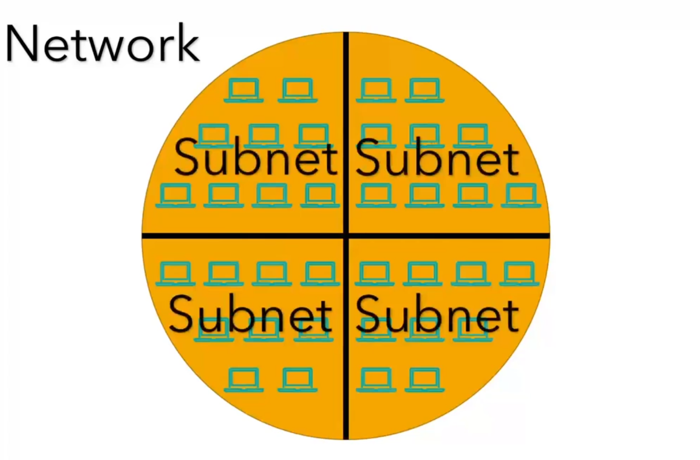
<br><em>تقسيم شبكة واحدة إلى عدة Subnets أصغر</em>
</div>

---

<h3 dir="rtl" align="right" id="subnet-mask-basics">2. Subnet Mask: تعريفه وقواعده</h3>

**Subnet Mask** هو رقم مكوّن من 32 بت (بنفس صيغة عنوان الـ IP)، وظيفته الوحيدة هي **تحديد أي جزء من عنوان الـ IP يمثل الشبكة <span dir="ltr">(Network)</span> وأي جزء يمثل الجهاز <span dir="ltr">(Host)</span>**.

**قاعدة كتابته (لا يجوز خلطها):**
> يجب أن يكون Subnet Mask عبارة عن **سلسلة متصلة من الواحدات (1) تليها مباشرة سلسلة متصلة من الأصفار (0)**، ولا يجوز أبدًا أن يتخلل الأصفارَ رقمُ واحد، أو العكس.

- البتات التي قيمتها `1` ⬅ خاصة بـ **الشبكة (Network)**.
- البتات التي قيمتها `0` ⬅ خاصة بـ **الأجهزة (Host)**.

**طرق كتابة الـ Subnet Mask:**
1. **الصيغة العشرية الكاملة:** مثل `255.255.255.0`.
2. **صيغة CIDR (السلاش):** مثل `/24` — وسيتم شرحها بالتفصيل في <a href="#cidr">البند التالي</a>.

**فائدة الـ Subnet Mask ولماذا يحتاجه الجهاز:** بدونه، لا يستطيع أي جهاز أو راوتر تحديد هل عنوان IP معين يقع داخل نفس شبكته المحلية أم في شبكة أخرى بعيدة تحتاج توجيه عبر الـ <span dir="ltr">Default Gateway</span> (راجع <a href="#ip-assignment-methods">البند 12 من الجزء الأول</a>).

---

<h3 dir="rtl" align="right" id="anding">3. عملية ANDing</h3>

عملية <span dir="ltr">ANDing</span> هي العملية المنطقية التي يستخدمها الجهاز فعليًا لمعرفة **عنوان الشبكة** الخاص به، وذلك بتطبيق عملية <span dir="ltr">AND</span> المنطقية (بت مقابل بت) بين عنوان الـ IP والـ Subnet Mask الخاص به:

| قاعدة AND | الناتج |
|:---:|:---:|
| 1 AND 1 | 1 |
| 1 AND 0 | 0 |
| 0 AND 1 | 0 |
| 0 AND 0 | 0 |

**مثال:**
```
IP:          11000000.10101000.00000001.00000101   (192.168.1.5)
Subnet Mask: 11111111.11111111.11111111.00000000   (255.255.255.0)
------------------------------------------------  AND
Network ID:  11000000.10101000.00000001.00000000   (192.168.1.0)
```
الناتج هو عنوان الشبكة `192.168.1.0`، وهو ما يستخدمه الراوتر لمعرفة هل الوجهة داخل نفس الشبكة المحلية أم تحتاج توجيه خارجي (راجع <a href="#router-uses-ip">كيف يستخدم الراوتر الـ IP للتوجيه</a>).

---

<h3 dir="rtl" align="right" id="number-systems">4. أنظمة العد وطرق التحويل بينها</h3>

فهم الـ Subnetting يعتمد بشكل كامل على القدرة على التحويل بسهولة بين ثلاثة أنظمة عد:

<span id="number-systems-intro"></span>

| النظام | الاسم | القاعدة |
|:---:|:---:|:---:|
| <span dir="ltr">Base 10</span> | العشري (Decimal) | الأرقام من 0 إلى 9 |
| <span dir="ltr">Base 2</span> | الثنائي (Binary) | كل رقم له احتمالان فقط: 0 أو 1 |
| <span dir="ltr">Base 16</span> | الهيكساديسيمال (Hexadecimal) | الأرقام من 0-9 ثم الحروف A-F (تُستخدم أساسًا في كتابة عناوين MAC) |

<div align="center">
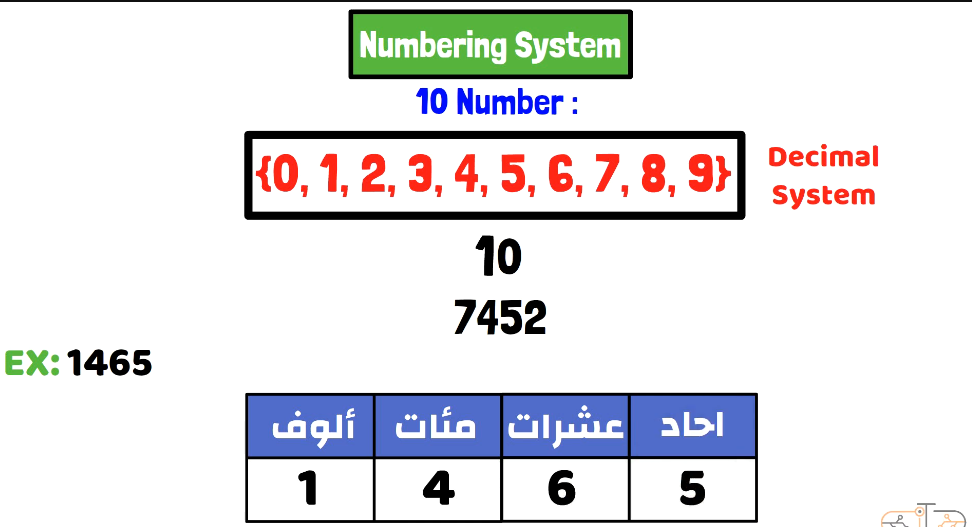
<br><em>النظام العشري (Base 10): كل خانة تمثل مرتبة (آحاد، عشرات، مئات، آلاف...) — مثال الرقم 1465</em>
</div>

> 📌 **للمعرفة العامة — نظام Base 8 (Octal):** بجانب الأنظمة الثلاثة المستخدمة فعليًا في الشبكات، يوجد أيضًا نظام العد الثماني <span dir="ltr">(Octal, Base 8)</span> الذي يستخدم الأرقام من `0` إلى `7` فقط. لا يُستخدم في عنونة الـ IP أو الـ MAC، لكنه يظهر أحيانًا في بعض أنظمة الصلاحيات (مثل صلاحيات الملفات في Linux). نفس منطق جدول الأوزان يُطبَّق عليه لكن بقوى الرقم 8 بدل 2:

<div align="center">
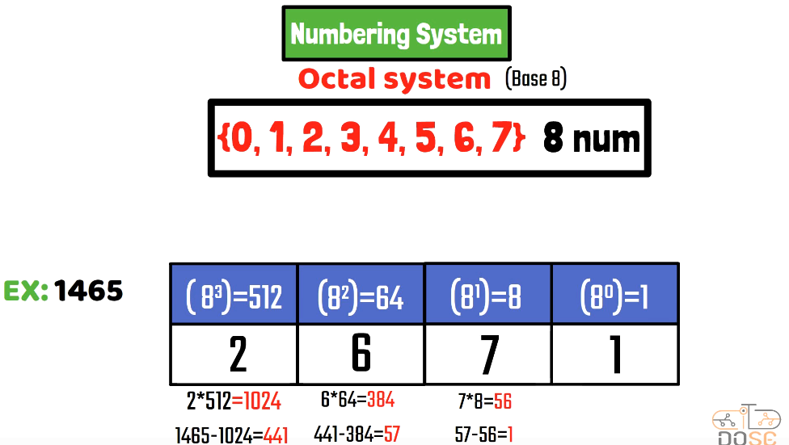
<br><em>مثال تحويل الرقم 1465 (ديسيمال) إلى النظام الثماني (Octal) باستخدام قوى الرقم 8</em>
</div>

<h4 dir="rtl" align="right" id="weights-table">أ. جدول الأوزان (الجدول السحري)</h4>

الأداة الأهم على الإطلاق في كل عمليات التحويل والتقسيم هي **جدول الأوزان**، وهو ببساطة قيم القوى المتتالية للرقم 2:

<div align="center">
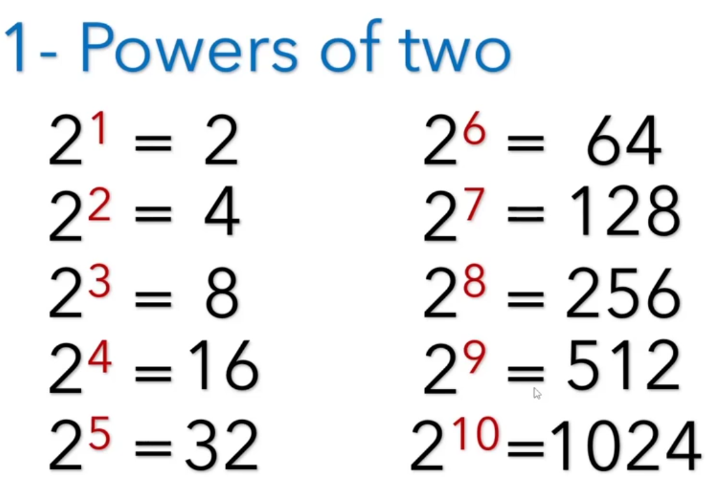
<br><em>جدول قوى الرقم 2 (Powers of Two)</em>
</div>

**جدول الأوزان الخاص بالأوكتت الواحد (8 بت) — وهو ما يُستخدم عمليًا في كل مسائل الـ Subnetting:**

| الوزن | 128 | 64 | 32 | 16 | 8 | 4 | 2 | 1 |
|:---:|:---:|:---:|:---:|:---:|:---:|:---:|:---:|:---:|
| مكافئ | 2⁷ | 2⁶ | 2⁵ | 2⁴ | 2³ | 2² | 2¹ | 2⁰ |

<h4 dir="rtl" align="right" id="binary-decimal-conversion">ب. التحويل بين الباينري والديسيمال</h4>

**من الباينري إلى الديسيمال:** نضع تحت كل بت قيمته من جدول الأوزان، ثم نجمع فقط الأوزان المقابلة للبتات التي قيمتها `1`.

**مثال بسيط:** حوّل `1101` إلى ديسيمال — بتطبيق نفس منطق جدول الأوزان (لكن على 4 بت فقط هنا للتبسيط):

<div align="center">
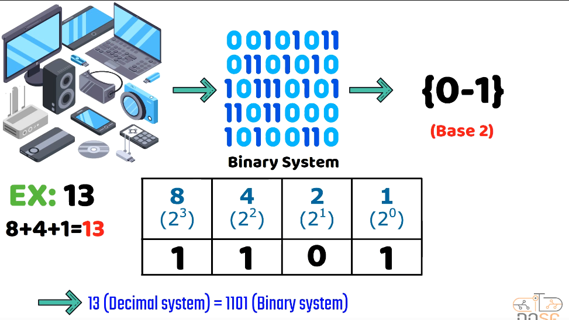
<br><em>مثال مبسّط: 1101 (باينري) = 8+4+1 = 13 (ديسيمال)</em>
</div>

**مثال على أوكتت كامل (8 بت):** حوّل `11000000` إلى ديسيمال:

| 128 | 64 | 32 | 16 | 8 | 4 | 2 | 1 |
|:---:|:---:|:---:|:---:|:---:|:---:|:---:|:---:|
| 1 | 1 | 0 | 0 | 0 | 0 | 0 | 0 |

الناتج = `128 + 64 = 192` ✅

**مثال إضافي:** حوّل `10001111` إلى ديسيمال:

<div align="center">
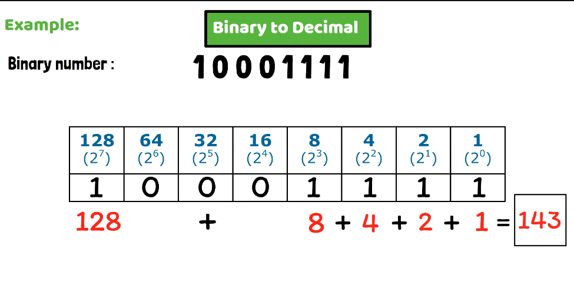
<br><em>10001111 = 128+8+4+2+1 = 143</em>
</div>

**من الديسيمال إلى الباينري:** نبدأ من أكبر وزن في الجدول، ونسأل: هل هذا الوزن **أصغر من أو يساوي** الرقم المطلوب تحويله؟
- لو **نعم** ⬅ نضع `1` تحت هذا الوزن، ونطرحه من الرقم، ونكمل بالباقي على باقي الأوزان.
- لو **لا** ⬅ نضع `0` تحت هذا الوزن، ونكمل بنفس الرقم على الوزن الأصغر التالي.

**مثال:** حوّل `172` إلى باينري:

| الوزن | 128 | 64 | 32 | 16 | 8 | 4 | 2 | 1 |
|:---:|:---:|:---:|:---:|:---:|:---:|:---:|:---:|:---:|
| هل الوزن ≤ الباقي؟ | 128≤172 ✅ | 44<64 ❌ | 44≥32 ✅ | 12<16 ❌ | 12≥8 ✅ | 4≥4 ✅ | 0<2 ❌ | 0<1 ❌ |
| البت | 1 | 0 | 1 | 0 | 1 | 1 | 0 | 0 |
| الباقي بعد الطرح | 172-128=44 | 44 | 44-32=12 | 12 | 12-8=4 | 4-4=0 | 0 | 0 |

الناتج: `172 = 10101100` ✅

**مثال إضافي بنفس الطريقة:** حوّل `221` إلى باينري:

<div align="center">
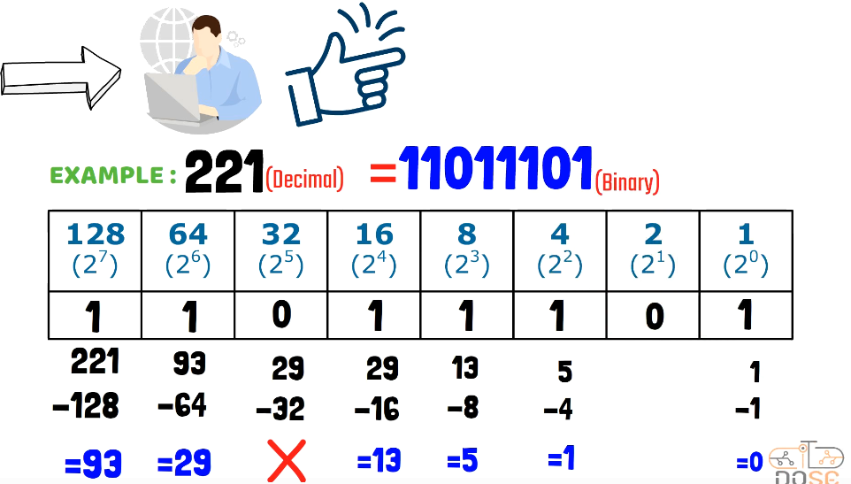
<br><em>221 = 128+64+16+8+4+1 = 11011101 (باينري)، بنفس طريقة الطرح المتتالي من جدول الأوزان</em>
</div>

<h4 dir="rtl" align="right" id="division-method">ج. طريقة بديلة: القسمة المتتالية على 2 (Division Method)</h4>

بجانب طريقة جدول الأوزان (الأشيع في حسابات الشبكات)، هناك طريقة رياضية بديلة لتحويل أي رقم ديسيمال لباينري، وهي **القسمة المتكررة على 2** مع تسجيل الباقي في كل مرة:

**الخطوات:** اقسم الرقم على 2، سجّل الباقي (0 أو 1)، وكرر القسمة على الناتج (خارج القسمة) حتى يصل لـ 1 أو 0. الناتج النهائي هو الباقي مقروءًا **من الأسفل للأعلى**.

<div align="center">
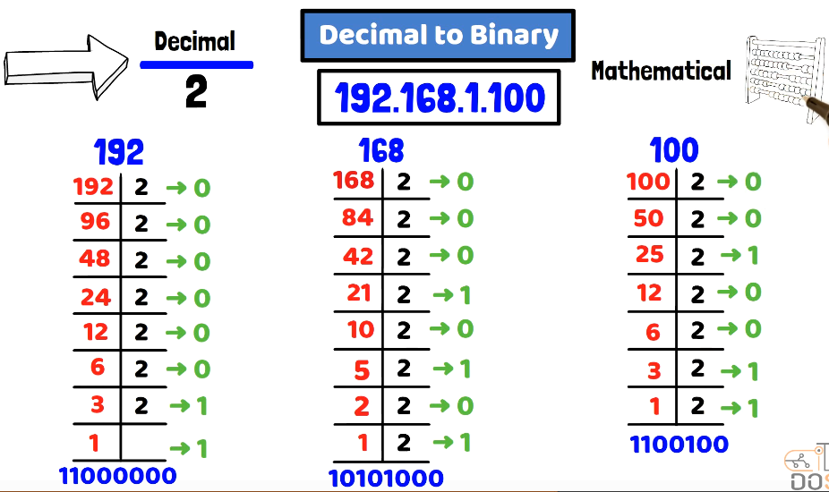
<br><em>تحويل الأوكتتات الثلاثة 192، 168، 100 من عنوان IP باستخدام طريقة القسمة المتتالية على 2</em>
</div>

> 💡 الطريقتان (الأوزان والقسمة المتتالية) تعطيان **نفس النتيجة بالضبط** دائمًا؛ اختر الطريقة الأسرع بالنسبة لك. في حسابات الشبكات وأسئلة الامتحانات، طريقة جدول الأوزان غالبًا أسرع لأنها لا تحتاج قسمة متكررة.

<h4 dir="rtl" align="right" id="full-ip-binary-example">د. مثال شامل: تحويل عنوان IP كامل للباينري أوكتت بأوكتت</h4>

لتثبيت الفكرة، هذا مثال كامل يحوّل عنوان `192.168.1.100` أوكتت بأوكتت (بطريقة جدول الأوزان):

<div align="center">
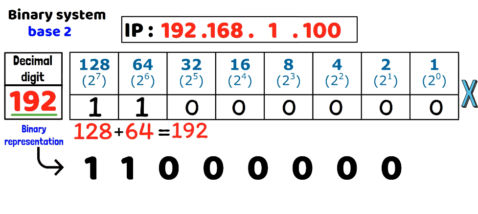
<br><em>الأوكتت الأول: 192 = 128+64 = 11000000</em>
</div>

<div align="center">
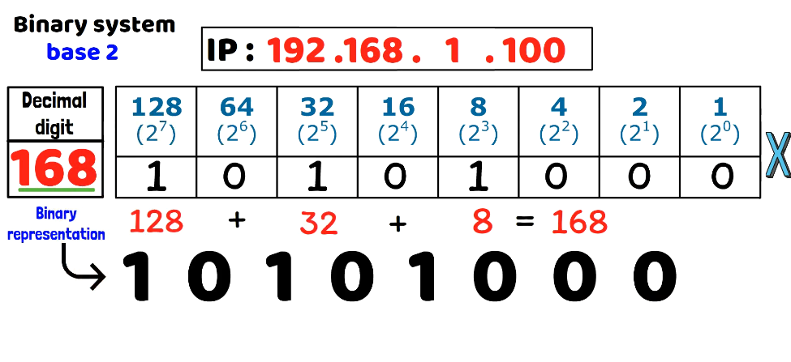
<br><em>الأوكتت الثاني: 168 = 128+32+8 = 10101000</em>
</div>

<div align="center">
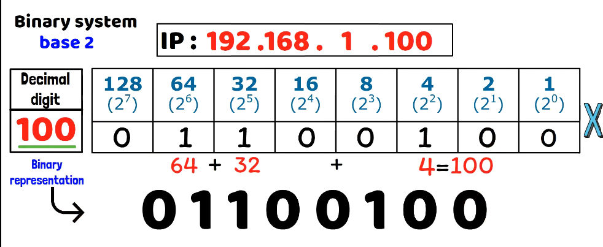
<br><em>الأوكتت الرابع: 100 = 64+32+4 = 01100100</em>
</div>

بتكرار نفس الخطوة على كل أوكتت، يكون العنوان الكامل بالباينري: `11000000.10101000.00000001.01100100`.
<h4 dir="rtl" align="right" id="binary-range">هـ. طريقة التعبير عن مدى الاحتمالات في النظام الثنائي</h4>

كل بت إضافي يُضاعف عدد الاحتمالات الممكنة (لأن كل بت له احتمالان: 0 أو 1). القاعدة العامة: **عدد الاحتمالات = 2 (عدد البتات)**:

| عدد البتات | عدد الاحتمالات | المدى (من - إلى) |
|:---:|:---:|:---:|
| 1 بت | 2¹ = 2 | `0` إلى `1` |
| 2 بت | 2² = 4 | `00` إلى `11` |
| 4 بت | 2⁴ = 16 | `0000` إلى `1111` |
| 8 بت (أوكتت كامل) | 2⁸ = 256 | `00000000` إلى `11111111` (أي من 0 إلى 255 بالديسيمال) |

> 💡 هذا بالضبط سبب أن قيمة أي أوكتت في عنوان IP تتراوح من `0` إلى `255`: لأن الأوكتت 8 بت، وأقصى قيمة ممكنة هي `2⁸ − 1 = 255`.

<h4 dir="rtl" align="right" id="hex-binary-conversion">و. التحويل بين الهيكساديسيمال والباينري</h4>

كل خانة هيكساديسيمال واحدة (0-9, A-F) تقابل بالضبط **4 بتات باينري**:

| Hex | Binary | Hex | Binary |
|:---:|:---:|:---:|:---:|
| 0 | 0000 | 8 | 1000 |
| 1 | 0001 | 9 | 1001 |
| 2 | 0010 | A | 1010 |
| 3 | 0011 | B | 1011 |
| 4 | 0100 | C | 1100 |
| 5 | 0101 | D | 1101 |
| 6 | 0110 | E | 1110 |
| 7 | 0111 | F | 1111 |

**طريقة التحويل من Hex إلى Binary:** نستبدل كل خانة هيكس بمقابلها من 4 بتات مباشرة من الجدول، ونلصقهم مع بعض.
**طريقة التحويل من Binary إلى Hex:** نقسّم البتات إلى مجموعات كل مجموعة 4 بتات (من اليمين لليسار)، ونحول كل مجموعة لخانة هيكس من الجدول.

**مثال تطبيقي — تحويل عنوان MAC إلى باينري:**
عنوان MAC مثل `3C:5A` يتحول كالتالي:
```
3    C    5    A
0011 1100 0101 1010
```
الناتج الباينري الكامل: `00111100 01011010`

> 🔗 هذا التمرين يربط مباشرة بما تم شرحه عن نظام كتابة عنوان MAC بالهيكساديسيمال في <a href="#ip-vs-mac">البند الخامس من الجزء الأول</a> وفي <a href="../09-Ethernet-LAN.md">الموضوع التاسع</a>.

<h4 dir="rtl" align="right" id="hex-range">ز. طريقة التعبير عن مدى الاحتمالات في نظام الهيكساديسيمال</h4>

بنفس منطق النظام الثنائي، لكن كل خانة هيكس واحدة لها **16 احتمالًا** (من 0 إلى F)، لأنها تمثل 4 بتات (2⁴ = 16):

| عدد الخانات | عدد الاحتمالات | المدى |
|:---:|:---:|:---:|
| خانة واحدة | 16 | `0` إلى `F` |
| خانتان | 256 | `00` إلى `FF` |
| 6 خانات (عنوان MAC كامل) | 2⁴⁸ (عدد ضخم) | `00:00:00:00:00:00` إلى `FF:FF:FF:FF:FF:FF` |

<h4 dir="rtl" align="right" id="bit-count-rule">ح. معرفة "الرقم ده كام بت؟"</h4>

قبل التحويل، أحيانًا محتاج تعرف بسرعة عدد البتات اللازمة لتمثيل رقم معين. القانون: **أوجد أكبر وزن في جدول الأوزان يكون أصغر من (أو يساوي) الرقم المطلوب**، وترتيب هذا الوزن في الجدول يحدد لك عدد البتات المطلوبة (لأن كل الأوزان الأصغر منه يجب تضمينها كاحتمالات).

**القانون بصيغة رياضية:** لو أكبر قوة $2^k$ أصغر من (أو تساوي) الرقم المطلوب، فإن عدد البتات اللازمة = $k + 1$ (لأن الخانات تبدأ من $2^0$ وحتى $2^k$، وهذا مجموعه $k+1$ خانة).

**مثال:** الرقم `100` — أكبر وزن أصغر منه أو يساويه هو `64` (وهو 2⁶)، إذن الرقم يحتاج `6 + 1 = 7` بتات كحد أقصى ليُكتب بالكامل (من 2⁶ إلى 2⁰).

**مثال أشمل (رقم أكبر من حدود الأوكتت الواحد):** حوّل الرقم `1465` لباينري.

**الخطوة 1 — تحديد عدد البتات:** أكبر قوة لا تتجاوز 1465 هي `1024 = 2¹⁰` (الأس = 10)، إذن نحتاج `10 + 1 = 11` بت، وجدول الأوزان يكون: `[1024, 512, 256, 128, 64, 32, 16, 8, 4, 2, 1]`.

**الخطوة 2 — الطرح المتتالي (نفس طريقة <a href="#binary-decimal-conversion">التحويل من ديسيمال لباينري</a>):**

| الوزن | 1024 | 512 | 256 | 128 | 64 | 32 | 16 | 8 | 4 | 2 | 1 |
|:---:|:---:|:---:|:---:|:---:|:---:|:---:|:---:|:---:|:---:|:---:|:---:|
| هل الوزن ≤ الباقي؟ | 1024≤1465 ✅ | 441<512 ❌ | 256≤441 ✅ | 128≤185 ✅ | 57<64 ❌ | 32≤57 ✅ | 16≤25 ✅ | 8≤9 ✅ | 4>1 ❌ | 2>1 ❌ | 1≤1 ✅ |
| البت | 1 | 0 | 1 | 1 | 0 | 1 | 1 | 1 | 0 | 0 | 1 |
| الباقي بعد الطرح | 1465-1024=441 | 441 | 441-256=185 | 185-128=57 | 57 | 57-32=25 | 25-16=9 | 9-8=1 | 1 | 1 | 1-1=0 |

**النتيجة:** `1465 = 10110111001` ✅ (تحقّق: `1024+256+128+32+16+8+1 = 1465`)

<h4 dir="rtl" align="right" id="decimal-hex-direct">ط. التحويل المباشر بين الديسيمال والهيكس</h4>

بالإضافة للمرور عبر الباينري (الطريقة الأشمل والأكثر استخدامًا في الشبكات)، يمكن التحويل مباشرة بين الديسيمال والهيكس باستخدام نفس جدول التكافؤ المذكور في <a href="#hex-binary-conversion">البند و</a> (حيث `A=10, B=11, C=12, D=13, E=14, F=15`):

**مثال — تحويل `202` من ديسيمال إلى هيكس:** نقسم على 16 مرارًا: `202 ÷ 16 = 12` والباقي `10` ⬅ الخانة الأولى (الأصغر) = `10 = A`، والخانة الثانية = `12 = C` ⬅ الناتج `CA` بالهيكس.

**مثال — تحويل `2F` من هيكس إلى ديسيمال:** `2×16¹ + 15×16⁰ = 32 + 15 = 47`.

---

<h3 dir="rtl" align="right" id="cidr">5. نظام CIDR وكتابة السلاش</h3>

<span dir="ltr">CIDR (Classless Inter-Domain Routing)</span> هي طريقة مختصرة لكتابة الـ Subnet Mask، بحيث بدلًا من كتابة الأربع أوكتتات كاملة، نكتب فقط **عدد البتات التي قيمتها 1** بعد علامة السلاش `/`.

<span id="prefix-length-def"></span>**اسم هذا الرقم رسميًا هو <span dir="ltr">Prefix Length</span> (طول البادئة):** هو نفسه عدد بتات الشبكة (Network bits) مُعبَّرًا عنه كرقم مباشر بدل صيغة الـ Subnet Mask الكاملة. فمثلًا في `192.168.1.0/24`، الرقم `24` هو الـ Prefix Length، ويعني أن أول 24 بت من العنوان (البادئة) ثابتة وتمثل جزء الشبكة، بينما الـ 8 بت المتبقية متغيرة وتمثل جزء الأجهزة. أي إشارة لـ "طول الـ Prefix" أو "Prefix Length" في أي مصدر أو امتحان تعني **بالضبط** نفس الرقم المكتوب بعد السلاش في صيغة CIDR — المصطلحان مترادفان تمامًا.

**معنى `/24` عمليًا:** أول 24 بت من العنوان (أول 3 أوكتتات) ثابتة وتمثل الشبكة، والـ 8 بت المتبقية (الأوكتت الأخير) للأجهزة.

<div align="center">
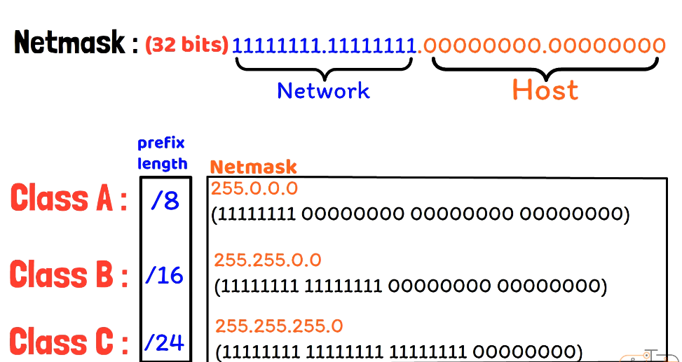
<br><em>Netmask (32 بت) مقسّم لـ Network و Host، وجدول الـ Prefix Length الافتراضي لكل فئة (Class A=/8, B=/16, C=/24)</em>
</div>

> 💡 نظام CIDR سُمّي "Classless" لأنه حرّر التقسيم من قيود الفئات التقليدية الثابتة (A, B, C)، وسمح بتقسيم أي شبكة بأي عدد بتات نحتاجه فعليًا، بدل الالتزام بحدود الفئة الافتراضية فقط — وهذا هو أساس كل عملية الـ Subnetting نفسها.

<h4 dir="rtl" align="right" id="cidr-cheat-sheet">أ. جدول CIDR المرجعي السريع (Cheat Sheet)</h4>

جدول جاهز يربط كل صيغة CIDR من `/8` إلى `/30` بالـ Subnet Mask المكافئ، عدد الأجهزة المتاحة، وحجم القفزة — لتسهيل الحساب الذهني السريع في الامتحانات دون الحاجة للتحويل للباينري في كل مرة:

| CIDR | Subnet Mask | عدد الأجهزة (2ʰ − 2) | حجم القفزة |
|:---:|:---:|:---:|:---:|
| `/8` | `255.0.0.0` | 16,777,214 | — (حدود أوكتت كامل) |
| `/9` | `255.128.0.0` | 8,388,606 | 128 |
| `/10` | `255.192.0.0` | 4,194,302 | 64 |
| `/11` | `255.224.0.0` | 2,097,150 | 32 |
| `/12` | `255.240.0.0` | 1,048,574 | 16 |
| `/13` | `255.248.0.0` | 524,286 | 8 |
| `/14` | `255.252.0.0` | 262,142 | 4 |
| `/15` | `255.254.0.0` | 131,070 | 2 |
| `/16` | `255.255.0.0` | 65,534 | — (حدود أوكتت كامل) |
| `/17` | `255.255.128.0` | 32,766 | 128 |
| `/18` | `255.255.192.0` | 16,382 | 64 |
| `/19` | `255.255.224.0` | 8,190 | 32 |
| `/20` | `255.255.240.0` | 4,094 | 16 |
| `/21` | `255.255.248.0` | 2,046 | 8 |
| `/22` | `255.255.252.0` | 1,022 | 4 |
| `/23` | `255.255.254.0` | 510 | 2 |
| `/24` | `255.255.255.0` | 254 | — (حدود أوكتت كامل) |
| `/25` | `255.255.255.128` | 126 | 128 |
| `/26` | `255.255.255.192` | 62 | 64 |
| `/27` | `255.255.255.224` | 30 | 32 |
| `/28` | `255.255.255.240` | 14 | 16 |
| `/29` | `255.255.255.248` | 6 | 8 |
| `/30` | `255.255.255.252` | 2 | 4 |

<h4 dir="rtl" align="right" id="point-to-point-links">ب. شبكات الربط النقطي (/30 و /31) و/32</h4>

الوصلة التي تربط بين راوترين مباشرة <span dir="ltr">(Point-to-Point Link)</span> تحتاج جهازين فقط، فاستخدام Subnet Mask عادي مثل `/24` (254 عنوان متاح) يكون **هدرًا فادحًا** في عناوين الـ IP.

**الحل التقليدي — `/30`:** يوفر `2² - 2 = 2` عنوان صالح للاستخدام بالظبط (وعنوان Network وعنوان Broadcast محجوزان كالمعتاد) — وهو العدد المثالي تمامًا لربط راوترين ببعض، ولذلك يُعتبر المعيار الشائع تاريخيًا لوصلات الـ Point-to-Point.

**المعيار الحديث — `/31` (وفق <span dir="ltr">RFC 3021</span>):** يسمح باستخدام Subnet Mask بمقاس `/31` (يوفر عنوانين فقط، بدون تخصيص عنوان Network أو Broadcast منفصلين — كلا العنوانين يُستخدمان مباشرة للجهازين) لزيادة كفاءة استخدام عناوين الـ IP بشكل أكبر، وهو شائع الاستخدام في تصميمات الشبكات الحديثة وبيئات مزودي الخدمة (ISPs) الكبيرة.

**الحالة القصوى — `/32`:** يمثل **مضيفًا واحدًا فقط <span dir="ltr">(Host Route)</span>** بلا أي بتات متاحة للأجهزة إطلاقًا (`2⁰ = 1` عنوان واحد بالضبط). يُستخدم غالبًا لتحديد مسار دقيق لجهاز بعينه في جدول التوجيه، أو لعناوين واجهات الـ Loopback على الراوترات.

<div align="center">
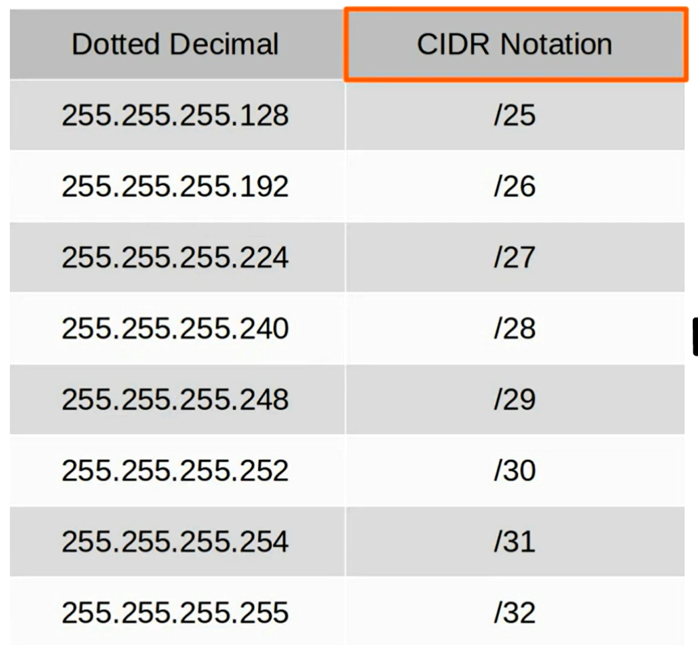
<br><em>جدول مرجعي: Dotted Decimal مقابل CIDR Notation من /25 حتى /32</em>
</div>

---

<h3 dir="rtl" align="right" id="subnetting-laws">6. القوانين الأساسية للتقسيم</h3>

<div align="center">
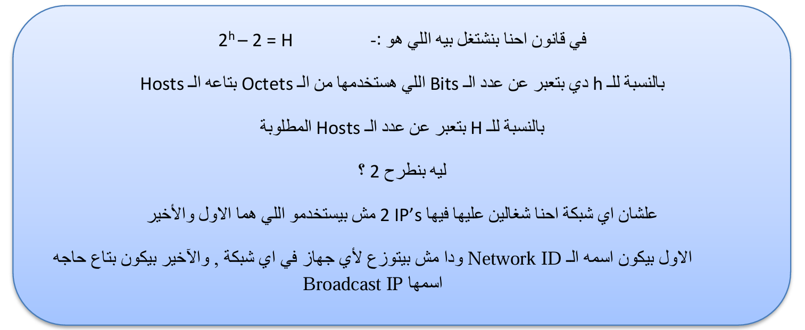
<br><em>سبب طرح 2 من معادلة عدد الأجهزة</em>
</div>

<h4 dir="rtl" align="right" id="law-num-subnets">أ. القانون الأول: عدد الشبكات الفرعية</h4>

$$\text{عدد الشبكات} = 2^n$$
حيث **n** = عدد البتات التي تم استلافها من جزء الأجهزة وتحويلها لجزء الشبكة (أي عدد الواحدات الإضافية في الـ Subnet Mask بعد المدى الافتراضي للفئة).

<h4 dir="rtl" align="right" id="law-num-hosts">ب. القانون الثاني: عدد الأجهزة المتاحة في كل شبكة فرعية</h4>

$$\text{عدد الأجهزة} = 2^h - 2$$
حيث **h** = عدد البتات المتبقية لجزء الأجهزة (أي عدد الأصفار في الـ Subnet Mask).

**ليه بنطرح 2؟**
لأن أي شبكة عليها دائمًا عنوانان محجوزان لا يُخصَّصان لأي جهاز فعلي:
- **الأول:** عنوان الشبكة نفسه <span dir="ltr">(Network ID)</span> — لا يُوزَّع لأي جهاز، هو ممثل الشبكة فقط.
- **الأخير:** عنوان البث <span dir="ltr">(Broadcast Address)</span> — مخصص لإرسال بيانات لكل أجهزة الشبكة دفعة واحدة، وليس لجهاز بعينه.

<h4 dir="rtl" align="right" id="law-block-size">ج. القانون الثالث: حجم القفزة (Block Size)</h4>

حجم القفزة هو الفرق بين بداية كل شبكة فرعية والتالية لها، ويُحسب كالتالي:
$$\text{Block Size} = 256 - \text{قيمة الأوكتت المتغير في الـ Subnet Mask}$$

**مثال:** لو الـ Subnet Mask هو `255.255.255.224`، فالأوكتت المتغير قيمته `224`، وحجم القفزة = `256 - 224 = 32`. يعني كل شبكة فرعية تبدأ بعد 32 عنوانًا من التي قبلها (0, 32, 64, 96, ...).

**جدول تلخيصي شامل** يجمع الفئة، مداها، الـ Subnet Mask الافتراضي، عدد الشبكات، وعدد الأجهزة داخل كل شبكة معًا في مكان واحد:

<div align="center">
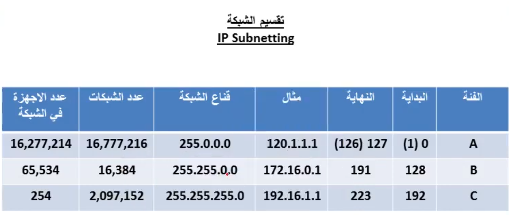
<br><em>جدول تلخيصي: الفئة، البداية والنهاية، Subnet Mask، عدد الشبكات، وعدد الأجهزة في كل شبكة</em>
</div>

---

<h3 dir="rtl" align="right" id="solving-steps">7. خطوات حل أي مسألة Subnetting</h3>

بغض النظر عن نوع المعطى (سواء عدد الأجهزة المطلوب، أو عدد الشبكات المطلوب)، الخطوات ثابتة دائمًا:

1. حدد الـ Subnet Mask الأصلي (الافتراضي للفئة أو المُعطى في السؤال) وحوّله إلى باينري.
2. حدد المطلوب (عدد الأجهزة أم عدد الشبكات؟) وطبّق القانون المناسب (`2ⁿ` أو `2ʰ − 2`) لإيجاد عدد البتات اللازم استلافها.
3. عدّل الـ Subnet Mask بتحويل العدد اللازم من الأصفار (من جهة اليسار) إلى واحدات.
4. حوّل الـ Subnet Mask الجديد من باينري إلى ديسيمال باستخدام جدول الأوزان.
5. احسب حجم القفزة (Block Size)، واستخرج منه عناوين كل الشبكات الفرعية (Subnet IDs) وحدودها.

---

<h3 dir="rtl" align="right" id="worked-examples">8. أمثلة محلولة خطوة بخطوة</h3>

<h4 dir="rtl" align="right" id="example-easy">🟢 مثال 1 (سهل) — تحديد بيانات شبكة CIDR بسيطة</h4>

**السؤال:** عندنا شبكة `192.168.5.0/26`. المطلوب: عدد بتات الشبكة، عدد بتات الأجهزة، عدد الأجهزة المتاحة، وحجم القفزة.

**الحل:**
- `/26` يعني 26 بت للشبكة، وبما أن العنوان بالكامل 32 بت، إذن بتات الأجهزة = `32 - 26 = 6` بت.
- عدد الأجهزة = `2⁶ - 2 = 64 - 2 = 62` جهاز.
- الـ Subnet Mask بالباينري: `11111111.11111111.11111111.11000000` ⬅ بالديسيمال: `255.255.255.192`.
- حجم القفزة = `256 - 192 = 64`.
- الشبكات الفرعية تبدأ من: `192.168.5.0`, `192.168.5.64`, `192.168.5.128`, `192.168.5.192` ...

<h4 dir="rtl" align="right" id="example-medium">🟡 مثال 2 (متوسط) — معطى: عدد الأجهزة المطلوب</h4>

**السؤال:** عندنا `IP: 198.61.20.0/24`، والمطلوب تقسيم الشبكة بحيث يكون في كل شبكة فرعية **30 جهاز**.

**الحل خطوة بخطوة:**

**الخطوة 1:** الـ Subnet Mask الأصلي `/24`:
```
11111111.11111111.11111111.00000000
```
الأوكتت الأخير بالكامل (8 بت) متاح حاليًا للأجهزة.

**الخطوة 2:** تطبيق قانون `2ʰ = ؟` لمعرفة عدد بتات الأجهزة اللازمة لتغطية 30 جهاز:
$$2^5 = 32$$
بما أن أول وآخر عنوان لا يُحسبان، فـ `32 - 2 = 30` جهاز ✅ (بالضبط العدد المطلوب).

**الخطوة 3:** بما أن 5 بت هتفضل للأجهزة، الباقي من الـ 8 بت الأصلية (وهو `8 - 5 = 3` بت) هيتحول للشبكات:
```
11111111.11111111.11111111.11100000
```

**الخطوة 4:** تحويل الـ Subnet Mask الجديد من باينري لديسيمال باستخدام جدول الأوزان — الأوكتت الأخير `11100000` = `128+64+32 = 224`:
$$\text{Subnet Mask} = 255.255.255.224 \;(/27)$$

**الخطوة 5:** حساب عدد الشبكات الناتجة من الـ 3 بت المستلفة:
$$2^3 = 8 \text{ شبكات}$$

**ملخص الحل:** حصلنا على **8 شبكات فرعية**، كل شبكة فيها **30 جهاز قابل للاستخدام** (من إجمالي 32 عنوان)، وحجم القفزة = `256 - 224 = 32`.

<h4 dir="rtl" align="right" id="example-advanced">🔴 مثال 3 (متقدم) — معطى: عدد الشبكات المطلوب</h4>

**السؤال:** عندنا `IP: 172.24.0.0/16` (من كلاس B)، والمطلوب تقسيمها إلى **32 شبكة فرعية**، مع حساب عدد الأجهزة في كل شبكة وتحديد الـ Subnet ID لكل شبكة.

**الحل خطوة بخطوة:**

**الخطوة 1:** الـ Subnet Mask الأصلي لـ `/16`: `255.255.0.0` ⬅ بالباينري:
```
11111111.11111111.00000000.00000000
```

**الخطوة 2:** تطبيق قانون `2ⁿ = ؟` لمعرفة عدد بتات الشبكات اللازمة لتغطية 32 شبكة:
$$2^5 = 32 \text{ شبكة}$$
إذن نحتاج استلاف 5 بت من جزء الأجهزة وتحويلها لجزء الشبكة.

**الخطوة 3:** تعديل الـ Subnet Mask بإضافة 5 بت من أول الأوكتت الثالث:
```
11111111.11111111.11111000.00000000
```

**الخطوة 4:** حساب عدد بتات الأجهزة المتبقية: كان أصل الأجهزة 16 بت (الأوكتتين الأخيرين في /16)، استلفنا منها 5 بت، فتبقى `16 - 5 = 11` بت للأجهزة:
$$2^{11} - 2 = 2048 - 2 = 2046 \text{ جهاز في كل شبكة فرعية}$$

**الخطوة 5:** تحويل الـ Subnet Mask الجديد لديسيمال — الأوكتت الثالث `11111000` = `128+64+32+16+8 = 248`:
$$\text{Subnet Mask} = 255.255.248.0 \;(/21)$$

**الخطوة 6:** حساب حجم القفزة في الأوكتت الثالث: `256 - 248 = 8`. إذن الشبكات الفرعية (Subnet IDs) تبدأ من:
`172.24.0.0` , `172.24.8.0` , `172.24.16.0` , `172.24.24.0` ... وهكذا بفارق 8 في الأوكتت الثالث، حتى نصل لـ 32 شبكة.

**ملخص الحل:** حصلنا على **32 شبكة فرعية**، كل شبكة فيها **2046 جهاز قابل للاستخدام**.

> 🔑 **استنتاج مهم من مقارنة المثالين 2 و3:**
> - في **المثال 2** كان المعطى هو عدد الأجهزة، فطبّقنا `2ʰ` وجعلنا الأس (h) يمثل **بتات الأجهزة (الأصفار)**، والباقي تلقائيًا يكون للشبكات.
> - في **المثال 3** كان المعطى هو عدد الشبكات، فطبّقنا `2ⁿ` وجعلنا الأس (n) يمثل **بتات الشبكات (الواحدات)**، والباقي تلقائيًا يكون للأجهزة.
> **القاعدة الذهبية:** حدّد أولًا هل المُعطى في السؤال عدد أجهزة أم عدد شبكات، لأن هذا يحدد أي طرف من المعادلة تبدأ منه.

---

<h3 dir="rtl" align="right" id="subnet-id-boundaries">9. حساب Subnet ID وحدود كل شبكة فرعية</h3>

بعد تحديد حجم القفزة <span dir="ltr">(Block Size)</span>، يمكن استخراج **كل** الشبكات الفرعية وحدودها بسهولة عن طريق ضرب مضاعفات حجم القفزة.

**مثال:** بالاستمرار على مثال `198.61.20.0/27` (حجم القفزة = 32):

| # | Subnet ID (Network) | أول Host | آخر Host | Broadcast |
|:---:|:---:|:---:|:---:|:---:|
| 1 | `198.61.20.0` | `198.61.20.1` | `198.61.20.30` | `198.61.20.31` |
| 2 | `198.61.20.32` | `198.61.20.33` | `198.61.20.62` | `198.61.20.63` |
| 3 | `198.61.20.64` | `198.61.20.65` | `198.61.20.94` | `198.61.20.95` |
| ... | ... | ... | ... | ... |
| 8 | `198.61.20.224` | `198.61.20.225` | `198.61.20.254` | `198.61.20.255` |

**قاعدة استخراج الجدول:**
- الـ Subnet ID التالي = الـ Subnet ID الحالي + حجم القفزة.
- أول Host = Subnet ID + 1.
- الـ Broadcast = الـ Subnet ID التالي − 1 (أو: Subnet ID الحالي + حجم القفزة − 1).
- آخر Host = الـ Broadcast − 1.

---

<h3 dir="rtl" align="right" id="vlsm">10. VLSM: التقسيم متغير الطول</h3>

<h4 dir="rtl" align="right" id="vlsm-definition">أ. تعريف VLSM والفرق عن Subnetting العادي</h4>

<span dir="ltr">VLSM (Variable Length Subnet Masking)</span> هي طريقة تقسيم متقدمة، والفرق الجوهري بينها وبين الـ Subnetting العادي (المشروح في <a href="#solving-steps">البند السابع</a>):

| Subnetting العادي | VLSM |
|:---:|:---:|
| كل الشبكات الفرعية الناتجة **بنفس الحجم بالضبط** (نفس الـ Subnet Mask) | كل شبكة فرعية يمكن أن يكون لها **Subnet Mask مختلف**، بحسب احتياجها الفعلي من الأجهزة |
| قد يسبب هدرًا كبيرًا في العناوين لو احتياجات الأقسام مختلفة | يستغل عناوين الـ IP بكفاءة أكبر، ويقلل الهدر |

**ليه بنستخدم VLSM أصلًا؟** لأن أقسام أي شبكة حقيقية (شركة، جامعة، مزود خدمة) نادرًا ما تحتاج نفس عدد الأجهزة بالظبط. لو استخدمنا Subnetting العادي بحجم واحد ثابت لكل الأقسام، هنضطر نختار حجم يكفي أكبر قسم، وده يسبب هدر ضخم في باقي الأقسام الأصغر. الـ VLSM يحل المشكلة دي بإعطاء كل قسم **بالظبط** المساحة اللي يحتاجها، ولا زيادة.

<h4 dir="rtl" align="right" id="vlsm-steps">ب. خطوات حل أي مسألة VLSM</h4>

1. **رتّب كل الأقسام تنازليًا** حسب عدد الأجهزة المطلوب (من الأكبر للأصغر) — هذه أهم خطوة ولا يجوز تخطيها (راجع تحذير الخطأ الشائع تحت).
2. لكل قسم بالترتيب، احسب أصغر Subnet Mask يفي باحتياجه بتطبيق قانون `2ʰ - 2 ≥` عدد الأجهزة المطلوب (نفس <a href="#solving-steps">خطوات حل Subnetting العادي</a>).
3. خصّص للقسم الشبكة الفرعية التي تبدأ **مباشرة بعد نهاية الشبكة الفرعية السابقة** (أول عنوان متاح غير مُستخدَم).
4. كرر الخطوتين 2 و3 لكل الأقسام المتبقية بالترتيب.
5. أي عناوين تتبقى بعد تخصيص كل الأقسام تُترك **احتياطًا للتوسع المستقبلي**.

<h4 dir="rtl" align="right" id="vlsm-mini-example">ج. مثال مصغّر (خطوة بخطوة)</h4>

قسّم شبكة كلاس C `192.168.5.0/24` إلى 3 أقسام: قسم أول يحتاج 100 جهاز، قسم ثانٍ يحتاج 25 جهاز، قسم ثالث يحتاج 10 أجهزة.

**الخطوة 1 (الترتيب التنازلي):** 100 ← 25 ← 10.

**الخطوة 2 و3 (التخصيص بالترتيب):**

| القسم | المطلوب | Subnet Mask | الأجهزة المتاحة | الشبكة الفرعية |
|:---:|:---:|:---:|:---:|:---:|
| الأول | 100 | `/25` (2⁷−2=126) | 126 | `192.168.5.0/25` (يبدأ من أول عنوان متاح: `.0`) |
| الثاني | 25 | `/27` (2⁵−2=30) | 30 | `192.168.5.128/27` (يبدأ بعد نهاية القسم الأول مباشرة: `.128`) |
| الثالث | 10 | `/28` (2⁴−2=14) | 14 | `192.168.5.160/28` (يبدأ بعد نهاية القسم الثاني مباشرة: `.160`) |

**نتيجة:** استخدمنا من `192.168.5.0` إلى `192.168.5.175` فقط (176 عنوان من أصل 256)، والباقي (`192.168.5.176 – 255`) متاح للتوسع لاحقًا.

<h4 dir="rtl" align="right" id="vlsm-big-example">د. مثال شامل: مؤسسة كبيرة بشبكة كلاس A (+ وصلة ربط راوترين)</h4>

**السيناريو:** مؤسسة كبيرة حصلت على شبكة كاملة من كلاس A: `10.0.0.0/8`. المطلوب تقسيمها باستخدام VLSM لخدمة 4 أقسام مختلفة في الحجم، بالإضافة إلى وصلة ربط مباشرة بين راوترين (Point-to-Point):

| القسم | الأجهزة المطلوبة |
|:---:|:---:|
| Sales | 1000 جهاز |
| IT | 500 جهاز |
| HR | 200 جهاز |
| Support | 50 جهاز |
| وصلة الربط بين الراوترين (Router-to-Router Link) | 2 جهاز (الراوترين نفسهم) |

**الخطوة 1 — الترتيب تنازليًا حسب الحجم:**

$$\text{Sales (1000)} \;\to\; \text{IT (500)} \;\to\; \text{HR (200)} \;\to\; \text{Support (50)} \;\to\; \text{Router Link (2)}$$

**الخطوة 2 — حساب Subnet Mask كل قسم مع شرح التحويل بالتفصيل:**

تذكّر أن الـ Subnet Mask الافتراضي لكلاس A هو `/8` (راجع <a href="#ip-classes">البند السابع</a>)، ومعناه إن أول أوكتت بس ثابت للشبكة والـ 24 بت الباقية (3 أوكتتات) متاحة بالكامل للتقسيم والأجهزة. في VLSM بنستلف من الـ 24 بت دي بالتدريج حسب احتياج كل قسم.

**🔹 Sales (1000 جهاز):**
- نطبّق القانون: أصغر `h` يحقق `2ʰ - 2 ≥ 1000` هو `h=10` لأن `2¹⁰ - 2 = 1022 ≥ 1000` ✅ (بينما `2⁹-2=510` غير كافٍ).
- بتات الشبكة = `32 - 10 = 22` ⬅ الصيغة `/22`.
- **تحويل الـ Subnet Mask لباينري:** أول 22 بت واحدات، والباقي أصفار:
  ```
  11111111.11111111.11111100.00000000
  ```
  الأوكتت الثالث (`11111100`) فيه أول 6 بت واحدات فقط (لأن 8+8+6=22) = `128+64+32+16+8+4 = 252`.
  ⬅ **Subnet Mask = `255.255.252.0`**
- حجم القفزة في الأوكتت الثالث = `256 - 252 = 4`.
- الشبكة تبدأ من أول عنوان متاح `10.0.0.0` ⬅ **`10.0.0.0/22`**، تغطي من `10.0.0.0` إلى `10.0.3.255` (4 قيم في الأوكتت الثالث: 0,1,2,3).
- أول عنوان صالح: `10.0.0.1` — آخر عنوان صالح: `10.0.3.254` — Broadcast: `10.0.3.255`.

**🔹 IT (500 جهاز):**
- أصغر `h` يحقق `2ʰ - 2 ≥ 500` هو `h=9` لأن `2⁹ - 2 = 510 ≥ 500` ✅.
- بتات الشبكة = `32 - 9 = 23` ⬅ الصيغة `/23`.
- **التحويل:** الأوكتت الثالث فيه 7 بت واحدات (8+8+7=23) = `128+64+32+16+8+4+2 = 254` ⬅ **Subnet Mask = `255.255.254.0`**.
- حجم القفزة = `256 - 254 = 2`. تبدأ الشبكة **مباشرة بعد نهاية Sales** (بعد `10.0.3.255`) ⬅ **`10.0.4.0/23`**، تغطي `10.0.4.0` إلى `10.0.5.255`.
- أول عنوان صالح: `10.0.4.1` — آخر عنوان صالح: `10.0.5.254` — Broadcast: `10.0.5.255`.

**🔹 HR (200 جهاز):**
- أصغر `h` يحقق `2ʰ - 2 ≥ 200` هو `h=8` لأن `2⁸ - 2 = 254 ≥ 200` ✅.
- بتات الشبكة = `32 - 8 = 24` ⬅ الصيغة `/24` (حدود أوكتت كامل، Subnet Mask = `255.255.255.0`).
- تبدأ **مباشرة بعد نهاية IT** (بعد `10.0.5.255`) ⬅ **`10.0.6.0/24`**، تغطي `10.0.6.0` إلى `10.0.6.255`.
- أول عنوان صالح: `10.0.6.1` — آخر عنوان صالح: `10.0.6.254` — Broadcast: `10.0.6.255`.

**🔹 Support (50 جهاز):**
- أصغر `h` يحقق `2ʰ - 2 ≥ 50` هو `h=6` لأن `2⁶ - 2 = 62 ≥ 50` ✅.
- بتات الشبكة = `32 - 6 = 26` ⬅ الصيغة `/26`. الأوكتت الأخير فيه أول بتين واحدات = `128+64=192` ⬅ **Subnet Mask = `255.255.255.192`**.
- حجم القفزة = `256-192=64`. تبدأ **مباشرة بعد نهاية HR** (بعد `10.0.6.255`) ⬅ **`10.0.7.0/26`**، تغطي `10.0.7.0` إلى `10.0.7.63`.
- أول عنوان صالح: `10.0.7.1` — آخر عنوان صالح: `10.0.7.62` — Broadcast: `10.0.7.63`.

**🔹 وصلة الربط بين الراوترين (2 جهاز — Router-to-Router Link):**
- هذه أصغر وحدة ممكنة: احتياج جهازين فقط بالظبط (الراوتر الأول والراوتر الثاني على طرفي الوصلة المباشرة)، وهو تحديدًا سيناريو <a href="#point-to-point-links">شبكات الربط النقطي</a> المشروح في هذا الجزء الثاني.
- أصغر `h` يحقق `2ʰ - 2 ≥ 2` هو `h=2` لأن `2² - 2 = 2` بالظبط ✅ (الحد الأدنى الرياضي الممكن أصلًا).
- بتات الشبكة = `32 - 2 = 30` ⬅ الصيغة `/30` (المعيار التقليدي لوصلات الراوترات، Subnet Mask = `255.255.255.252`).
- تبدأ **مباشرة بعد نهاية Support** (بعد `10.0.7.63`) ⬅ **`10.0.7.64/30`**، تغطي `10.0.7.64` إلى `10.0.7.67`.
- عنوان الراوتر الأول: `10.0.7.65` — عنوان الراوتر الثاني: `10.0.7.66` — Broadcast: `10.0.7.67` (غير مُستخدَم، فقط عنوانان للراوترين نفسهم).
- 🔗 ملحوظة: لو كنا نطبّق المعيار الحديث <span dir="ltr">RFC 3021</span> بدل `/30`، كانت الوصلة هتاخد `/31` فقط (عنوانان صالحان بدون Network/Broadcast منفصلين)، لكن استخدمنا `/30` هنا كمثال تعليمي كلاسيكي.

**الجدول التلخيصي الكامل:**

| القسم | المطلوب | Subnet Mask | CIDR | الشبكة الفرعية | نطاق العناوين الصالحة |
|:---:|:---:|:---:|:---:|:---:|:---:|
| Sales | 1000 | `255.255.252.0` | `/22` | `10.0.0.0` | `10.0.0.1 – 10.0.3.254` |
| IT | 500 | `255.255.254.0` | `/23` | `10.0.4.0` | `10.0.4.1 – 10.0.5.254` |
| HR | 200 | `255.255.255.0` | `/24` | `10.0.6.0` | `10.0.6.1 – 10.0.6.254` |
| Support | 50 | `255.255.255.192` | `/26` | `10.0.7.0` | `10.0.7.1 – 10.0.7.62` |
| Router Link | 2 | `255.255.255.252` | `/30` | `10.0.7.64` | `10.0.7.65 – 10.0.7.66` |

**ملاحظة ختامية:** استخدمنا فقط من `10.0.0.0` إلى `10.0.7.67` (أقل من 2000 عنوان بالكامل)، من أصل الشبكة الكاملة `10.0.0.0/8` (أكثر من 16 مليون عنوان!) — وهذا يوضح بجلاء لماذا شبكات كلاس A بالكامل نادرًا ما تُستخدم إلا في مؤسسات ضخمة جدًا (أو لتقسيمها لاحقًا على عدة فروع ومواقع)، وأن VLSM هو ما يجعل استغلال هذه المساحة الهائلة منطقيًا وفعالًا بدل هدرها.

> 🔎 مثال إضافي (شركة أصغر بشبكة كلاس C) موجود في <a href="#case-study">البند 16 – دراسة حالة VLSM</a>.

<h4 dir="rtl" align="right" id="vlsm-common-mistake">هـ. تحذير: الخطأ الشائع في ترتيب التخصيص</h4>

**لو خصّصت الأقسام بترتيب عشوائي أو من الأصغر للأكبر بدل الأكبر للأصغر، هتقع في مشكلة تداخل العناوين (Overlap).**

**مثال على الخطأ:** بنفس أرقام المثال أعلاه، لو بدأنا بالقسم الأصغر (10 أجهزة) الأول وخصصناه `/28` بادئًا من `192.168.5.0` (يغطي `.0–.15`)، ثم جاء دور القسم الأكبر (100 جهاز) واحتاج `/25` كاملة (128 عنوان) — فلن يجد مساحة متجاورة كافية تبدأ من عنوان صحيح إحصائيًا (لأن شبكة `/25` يجب أن تبدأ على مضاعف لـ 128 بالضبط، أي `.0` أو `.128` فقط)، مما يجبرنا على "تخطي" مساحة كبيرة أو إعادة الترتيب من الصفر. **لذلك الترتيب التنازلي ليس مجرد تفضيل، بل ضرورة حسابية** لضمان أن كل شبكة فرعية تبدأ على حدود صحيحة (Block Boundary) دون تعارض.

---

<h3 dir="rtl" align="right" id="supernetting">11. Supernetting</h3>

<span dir="ltr">Supernetting</span> هي العملية **العكسية** للـ Subnetting: بدلًا من تقسيم شبكة كبيرة إلى شبكات أصغر، يتم **دمج عدة شبكات صغيرة متجاورة** في شبكة واحدة أكبر، عن طريق تقليل عدد بتات الشبكة (نقل بتات من الشبكة إلى الأجهزة).

**مثال:** دمج الشبكتين `192.168.0.0/24` و`192.168.1.0/24` في شبكة واحدة `192.168.0.0/23`.

**كيف تعمل:** يتم اختصار عدد بتات الشبكة المشتركة بين النطاقات المتجاورة، بحيث يمثل عنوان واحد بـ Subnet Mask أوسع كل النطاقات المدموجة.

**عيوبها:**
- تتطلب أن تكون الشبكات المُدمجة **متجاورة رقميًا ومتوافقة حسابيًا** (على حدود صحيحة من مضاعفات القوى)، وإلا لا يمكن دمجها بشكل صحيح.
- تُستخدم أساسًا لتلخيص جداول التوجيه <span dir="ltr">(Route Summarization)</span> وتقليل حجمها، وليست شائعة الاستخدام داخل الشبكات المحلية الصغيرة.

<h4 dir="rtl" align="right" id="route-summarization-example">مثال: تلخيص 4 شبكات (Route Summarization)</h4>

**مثال تطبيقي أكبر — تلخيص 4 شبكات في مسار واحد:** عندنا 4 شبكات فرعية متجاورة يديرها نفس الراوتر: `192.168.0.0/24`, `192.168.1.0/24`, `192.168.2.0/24`, `192.168.3.0/24`. بدل ما الراوتر المجاور يحتفظ بـ 4 أسطر منفصلة في جدول التوجيه، يمكن تلخيصها في **مسار واحد فقط**:

- الأوكتت الثالث للشبكات الأربع بالباينري: `00000010, 00000001, 00000010, 00000011` — أول 6 بت منها متطابقة (`000000`)، ومختلفة فقط في آخر 2 بت.
- إذن نقدر ندمجهم في شبكة واحدة بحجم `2² = 4` شبكات `/24`، أي بإزاحة بتين لليسار: `/24 - 2 = /22`.
- **المسار الملخّص (Summary Route):** `192.168.0.0/22` — يغطي بالظبط الأربع شبكات من `192.168.0.0` وحتى `192.168.3.255` بسطر واحد بدل أربعة.

---

<h3 dir="rtl" align="right" id="identify-class">12. معرفة الفئة من الـ IP والـ Subnet Mask</h3>

**مين اللي بيحدد للجهاز إن الـ Subnet Mask ده من كلاس معين؟**
الجهاز نفسه لا "يقرر" الفئة — بل يحدد الفئة تلقائيًا بالنظر إلى **قيمة أول أوكتت من عنوان الـ IP** ومطابقتها بجدول الفئات القياسي (المذكور في <a href="#ip-classes">البند السابع من الجزء الأول</a>). فمثلًا أي IP يبدأ بقيمة بين 192 و223 في الأوكتت الأول، يتعرف عليه الجهاز تلقائيًا كـ Class C ويطبّق عليه الـ Subnet Mask الافتراضي `255.255.255.0` ما لم يُخبَر بغير ذلك صراحة (عبر CIDR مخصص).

**المقارنة بين IP والـ Subnet Mask لتحديد الفئة:**
1. حدد أول أوكتت من عنوان الـ IP.
2. طابقه مع مدى الفئات (Class A: 1-126، B: 128-191، C: 192-223).
3. قارن الـ Subnet Mask المُعطى بالـ Subnet Mask الافتراضي للفئة؛ لو تطابقا فالشبكة **بحجمها الافتراضي (Classful)**، ولو كان الـ Subnet Mask "أطول" من الافتراضي (بتات واحدات إضافية)، فهذا يعني أن الشبكة **مُقسَّمة (Classless / Subnetted)**.

---

<h3 dir="rtl" align="right" id="octet-split">13. تقسيم أوكتت واحد بين الشبكات والأجهزة</h3>

من المهم إدراك أن التقسيم لا يحدث دائمًا على حدود أوكتت كاملة — يمكن لأوكتت واحد أن يُقسَّم **جزئيًا** بين الشبكة والأجهزة في نفس الوقت، وهذا بالضبط ما حدث في <a href="#worked-examples">مثال 2 و3</a> أعلاه، حيث تم استلاف عدد بتات (3 أو 5) من داخل أوكتت واحد فقط دون أخذ الأوكتت بالكامل.

**مثال توضيحي إضافي:** لو عندنا `/20` على شبكة كلاس B (`172.16.0.0`):
```
Subnet Mask: 11111111.11111111.11110000.00000000
             = 255.255.240.0
```
هنا الأوكتت الثالث (`11110000`) مقسوم فعليًا لنصفين: أول 4 بت منه (`1111`) خاصة بالشبكة، وآخر 4 بت (`0000`) خاصة بالأجهزة — وهذا مثال مباشر على تقسيم أوكتت واحد بين الاثنين معًا.

---

<h3 dir="rtl" align="right" id="find-network-of-host">14. إيجاد عنوان شبكة جهاز معين</h3>

لمعرفة عنوان الشبكة <span dir="ltr">(Network ID)</span> التي ينتمي إليها أي جهاز، بمعرفة عنوان الـ IP والـ Subnet Mask الخاصين به:

1. حوّل عنوان الـ IP والـ Subnet Mask إلى باينري.
2. طبّق عملية <span dir="ltr">ANDing</span> (المشروحة في <a href="#anding">البند الثالث</a>) بين الاثنين، بت بت.
3. الناتج هو عنوان الشبكة (Network ID) الذي ينتمي إليه هذا الجهاز.

**مثال سريع:** جهاز عنوانه `10.20.35.60` بـ Subnet Mask `255.255.255.0` ⬅ عنوان شبكته هو `10.20.35.0` (لأن الأوكتت الأخير بالكامل خاص بالأجهزة، فيُصفَّر تلقائيًا عند تطبيق AND).

---

<h3 dir="rtl" align="right" id="troubleshooting">15. مسائل الخدع والأخطاء الشائعة (Troubleshooting Subnetting)</h3>

<h4 dir="rtl" align="right" id="same-mask-different-subnet">أ. جهازان بنفس الـ Subnet Mask لكن في شبكتين مختلفتين</h4>

**السؤال الفخ الشائع في الامتحانات:** جهازان يحملان نفس الـ Subnet Mask بالضبط — هل هما بالضرورة على نفس الشبكة الفرعية؟ **الإجابة: لا بالضرورة!** الـ Subnet Mask وحده يحدد **حجم** الشبكة فقط، لكن عنوان الشبكة الفعلي الذي ينتمي إليه كل جهاز يُحدَّد بتطبيق <a href="#anding">عملية ANDing</a> على عنوان الـ IP الخاص به.

**مثال:** جهاز A بعنوان `192.168.1.10/26` وجهاز B بعنوان `192.168.1.70/26` — نفس الـ Mask (`/26`، حجم القفزة = 64):
- جهاز A: `10` يقع بين `0-63` ⬅ شبكته `192.168.1.0/26`.
- جهاز B: `70` يقع بين `64-127` ⬅ شبكته `192.168.1.64/26`.

رغم أن الاثنين بنفس الـ Subnet Mask بالضبط، إلا أنهما في **شبكتين فرعيتين مختلفتين تمامًا**، ولن يقدروا يتواصلوا مباشرة إلا عبر راوتر.

<h4 dir="rtl" align="right" id="invalid-ip-assignment">ب. تحديد العناوين غير الصالحة للاستخدام</h4>

عند مراجعة أي مسألة أو إعداد فعلي، تحقق دائمًا أن العنوان المُخصَّص لجهاز **ليس** عنوان الشبكة ولا عنوان البث لتلك الشبكة الفرعية.

**مثال على خطأ شائع:** بافتراض شبكة `192.168.1.0/26` (حدودها `192.168.1.0 – 192.168.1.63`، عنوان الشبكة `.0`، عنوان البث `.63`) — لو حاول أحدهم تخصيص العنوان `192.168.1.63` لجهاز، فهذا **خطأ**، لأنه عنوان البث المحجوز لهذه الشبكة الفرعية بالذات، وليس عنوان جهاز صالح.

---

<h3 dir="rtl" align="right" id="case-study">16. دراسة حالة كاملة: تصميم شبكة شركة من الصفر (VLSM Case Study)</h3>

> 🔗 هذه الدراسة تطبّق نفس <a href="#vlsm-steps">خطوات حل VLSM</a> المشروحة في البند العاشر. للمثال الأكبر (مؤسسة كبيرة بكلاس A + وصلة ربط راوترين)، راجع <a href="#vlsm-big-example">البند العاشر – مثال شامل</a>.

**السيناريو:** شركة لديها 4 أقسام: قسم <span dir="ltr">IT</span> (50 جهاز)، قسم <span dir="ltr">HR</span> (20 جهاز)، قسم <span dir="ltr">Sales</span> (100 جهاز)، ووصلة ربط <span dir="ltr">Point-to-Point</span> لفرع آخر (تحتاج جهازين فقط). النطاق المتاح: `192.168.1.0/24`. المطلوب: تصميم الشبكات الفرعية باستخدام <a href="#vlsm">VLSM</a>.

**الخطوة 1 — الترتيب تنازليًا حسب الحجم (قاعدة أساسية في VLSM: نبدأ دائمًا بأكبر متطلب أولًا):**

| الترتيب | القسم | الأجهزة المطلوبة |
|:---:|:---:|:---:|
| 1 | Sales | 100 |
| 2 | IT | 50 |
| 3 | HR | 20 |
| 4 | وصلة الفرع (P2P) | 2 |

**الخطوة 2 — تخصيص أصغر Subnet Mask يفي باحتياج كل قسم، بالترتيب، بادئين من أول عنوان متاح:**

| القسم | المطلوب | Subnet Mask | الأجهزة الفعلية المتاحة | الشبكة الفرعية | نطاق العناوين |
|:---:|:---:|:---:|:---:|:---:|:---:|
| Sales | 100 | `/25` (2⁷−2=126) | 126 | `192.168.1.0/25` | `.1 – .126` (Broadcast: `.127`) |
| IT | 50 | `/26` (2⁶−2=62) | 62 | `192.168.1.128/26` | `.129 – .190` (Broadcast: `.191`) |
| HR | 20 | `/27` (2⁵−2=30) | 30 | `192.168.1.192/27` | `.193 – .222` (Broadcast: `.223`) |
| وصلة الفرع | 2 | `/30` (2²−2=2) | 2 | `192.168.1.224/30` | `.225 – .226` (Broadcast: `.227`) |

**ملاحظة ختامية:** بعد تخصيص الأقسام الأربعة، يتبقى النطاق `192.168.1.228 – 192.168.1.255` (28 عنوان) **غير مستخدم**، محجوز للتوسع المستقبلي — وهذا بالضبط الفرق الجوهري بين VLSM والتقسيم المتساوي: كل قسم أخذ بالظبط المساحة التي يحتاجها لا أكثر، دون هدر.

---

<h3 dir="rtl" align="right" id="cheat-sheet-summary">17. ملخص شامل: كل القوانين الرياضية في جدول واحد</h3>

<h4 dir="rtl" align="right" id="all-formulas-table">أ. جدول القوانين</h4>

| القانون | الصيغة | الشرح |
|:---:|:---:|:---:|
| عدد الشبكات الفرعية | $2^n$ | n = عدد البتات المُستلَفة من جزء الأجهزة (راجع <a href="#subnetting-laws">البند 6</a>) |
| عدد الأجهزة لكل شبكة | $2^h - 2$ | h = عدد بتات الأجهزة المتبقية |
| حجم القفزة (Block Size) | $256 - \text{قيمة الأوكتت}$ | الفرق بين بداية كل شبكة فرعية والتالية لها |
| مجموع البتات | Network bits + Host bits = 32 | ثابت دائمًا لعنوان IPv4 |
| عدد البتات اللازمة لرقم | $k + 1$ حيث $2^k \le$ الرقم | راجع <a href="#bit-count-rule">البند 4-ح</a> |
| Wildcard Mask | $255.255.255.255 - \text{Subnet Mask}$ | راجع الشرح التالي |

<h4 dir="rtl" align="right" id="wildcard-mask">ب. Wildcard Mask</h4>

الـ <span dir="ltr">Wildcard Mask</span> هو **عكس (Inverse)** الـ Subnet Mask تمامًا (كل `1` تصبح `0` والعكس)، ويُستخدم أساسًا في إعداد قوائم التحكم بالوصول <span dir="ltr">(ACLs)</span> وبعض بروتوكولات التوجيه (مثل OSPF)، بدلًا من الـ Subnet Mask العادي.

$$\text{Wildcard Mask} = 255.255.255.255 - \text{Subnet Mask}$$

**مثال:** لو الـ Subnet Mask هو `255.255.255.0`، فالـ Wildcard Mask = `255.255.255.255 - 255.255.255.0 = 0.0.0.255`. وده معناه في قواعد الـ ACL: "أول 3 أوكتتات لازم تتطابق بالظبط (0 = مطابقة إجبارية)، والأوكتت الأخير أي قيمة مقبولة (255 = تجاهل تمامًا)".

---

<h3 dir="rtl" align="right" id="cloud-subnetting">18. تطبيقات الـ Subnetting في البيئات السحابية (Cloud Networking)</h3>

نفس مبادئ الـ Subnetting المشروحة في هذا الملف تُطبَّق حرفيًا في بيئات الحوسبة السحابية، لكن بفروقات عملية مهمة:

<h4 dir="rtl" align="right" id="aws-vpc">أ. AWS VPC</h4>

عند إنشاء شبكة افتراضية <span dir="ltr">(VPC – Virtual Private Cloud)</span> وتقسيمها لـ Subnets، تفرض <span dir="ltr">AWS (Amazon Web Services)</span> **حجز 5 عناوين إضافية** في كل Subnet (وليس عنوانين فقط كالتقسيم التقليدي): أول 4 عناوين (عنوان الشبكة + 3 عناوين لأغراض داخلية مثل الراوتر الافتراضي وخدمة الـ DNS واحتياطي مستقبلي) + آخر عنوان (Broadcast، رغم أن AWS لا يستخدم Broadcast فعليًا لكنه يبقى محجوزًا لأسباب تاريخية).

<h4 dir="rtl" align="right" id="aws-reservation-formula">ب. حجز 5 عناوين بدل 2</h4>

**الصيغة المعدَّلة في AWS:** $\text{الأجهزة الفعلية المتاحة} = 2^h - 5$ (بدلًا من $2^h - 2$ التقليدية). فمثلًا Subnet بحجم `/24` في AWS تعطي `256 - 5 = 251` عنوان مستخدم فعليًا، مقابل `254` في الشبكات التقليدية. هذا فرق عملي مهم: أي شخص يحسب عدد الأجهزة بالقانون التقليدي فقط، هيلاقي إنه في الواقع أقل بـ 3 عناوين من حسابه.

<h4 dir="rtl" align="right" id="azure-vnet">ج. Azure VNet</h4>

<span dir="ltr">Azure (Microsoft Azure)</span> يتبع نفس المبدأ تقريبًا في الشبكات الافتراضية <span dir="ltr">(VNet – Virtual Network)</span>، ويحجز أيضًا 5 عناوين لكل Subnet لنفس الأسباب.

---

<h3 dir="rtl" align="right" id="advanced-routing-concepts">19. مفاهيم هندسية متقدمة في التوجيه والعناوين</h3>

<h4 dir="rtl" align="right" id="anycast">أ. عناوين Anycast</h4>

<span dir="ltr">Anycast</span> هي تقنية توجيه يُخصَّص فيها **نفس عنوان الـ IP لعدة سيرفرات في مواقع جغرافية مختلفة** في نفس الوقت، وتتولى بروتوكولات التوجيه (مثل BGP على مستوى الإنترنت) توجيه أي طلب تلقائيًا إلى **أقرب سيرفر متاح** بناءً على المسار الأقصر في جدول التوجيه، دون أي تدخل من المستخدم.

**أشهر الأمثلة:** خدمات الـ DNS العامة الشهيرة مثل `8.8.8.8` (Google) و`1.1.1.1` (Cloudflare) تستخدم Anycast — فعند استعلامك من مصر، طلبك يذهب لأقرب سيرفر في المنطقة، بينما نفس العنوان بالظبط يوجّه مستخدمًا في أمريكا لسيرفر مختلف تمامًا هناك، وكلاهما "نفس" الـ IP ظاهريًا. تُستخدم هذه التقنية أيضًا بكثافة في شبكات توزيع المحتوى <span dir="ltr">(CDNs)</span> لتسريع وصول المحتوى للمستخدمين حول العالم.

<h4 dir="rtl" align="right" id="overlapping-ip">ب. حل مشكلة تداخل العناوين (Overlapping IP Solutions)</h4>

**المشكلة:** عند اندماج شركتين، من الشائع جدًا أن تكتشفا أن كلتيهما تستخدم **نفس نطاق الـ Private IP** بالضبط (مثلًا كلاهما يستخدم `192.168.1.0/24`) — وهذا التداخل يمنع الشركتين من التواصل مباشرة، لأن كل شبكة لن تستطيع تمييز عناوين الطرف الآخر عن عناوينها الداخلية الخاصة.

**الحل — Double NAT (أو Twice NAT):** بدلًا من إعادة ترقيم <span dir="ltr">(Re-numbering)</span> إحدى الشبكتين بالكامل (عملية مكلفة ومعقدة)، يقوم جهاز NAT بترجمة **كل من عنوان المصدر وعنوان الوجهة معًا** لكل حزمة تعبر بين الشبكتين، بحيث تظهر كل شبكة للأخرى بنطاق عناوين مؤقت مختلف تمامًا عن نطاقها الحقيقي المتداخل، مما يحل التعارض دون الحاجة لتغيير الإعدادات الداخلية لأي من الشبكتين.

---

<h3 dir="rtl" align="right" id="ipv6-appendix">20. ملحق: أساسيات عنونة وتقسيم IPv6</h3>

<h4 dir="rtl" align="right" id="ipv6-address-types">أ. تركيب عنوان IPv6 وأنواعه</h4>

عنوان الـ <span dir="ltr">IPv6</span> (128 بت، مكتوب في 8 مجموعات هيكساديسيمال، راجع <a href="#ipv4-vs-ipv6">البند 3</a>) له عدة أنواع رئيسية حسب البادئة:

| النوع | البادئة | الاستخدام |
|:---:|:---:|:---:|
| <span dir="ltr">Global Unicast</span> | `2000::/3` | عنوان عام قابل للتوجيه على الإنترنت مباشرة (مكافئ الـ Public IP في IPv4) |
| <span dir="ltr">Link-Local</span> | `fe80::/10` | يُنشأ تلقائيًا على كل واجهة شبكة، صالح للتواصل داخل نفس الوصلة المحلية فقط، وغير قابل للتوجيه إطلاقًا خارجها |
| <span dir="ltr">Unique Local</span> | `fc00::/7` | مكافئ الـ Private IP في IPv4 (RFC 1918)، للاستخدام الداخلي فقط وغير موجّه على الإنترنت العام |

<h4 dir="rtl" align="right" id="ipv6-subnetting">ب. تقسيم شبكات IPv6 (IPv6 Subnetting)</h4>

التقسيم في IPv6 **أبسط بكثير** من IPv4 لسببين رئيسيين:
1. يعتمد على تغيير طول الـ **Prefix** بنفس منطق CIDR، لكن بالحساب الهيكساديسيمال (كل خانة هيكس = 4 بت، أسهل حسابيًا من التعامل مع كل بت منفردًا).
2. **المعيار الشائع عالميًا هو تخصيص `/64` لكل شبكة فرعية (LAN) بغض النظر عن عدد الأجهزة الفعلي**، لأن مساحة العناوين ضخمة جدًا لدرجة أن الهدر لم يعد مصدر قلق كما في IPv4، وهذا يترك 64 بت كاملة لجزء الجهاز (غالبًا يُشتق تلقائيًا من عنوان الـ MAC عبر <a href="#assignment-table">EUI-64</a>).

**مثال:** شركة عندها Prefix عام `2001:db8:acad::/48`، وعايزة تقسمه لعدة شبكات فرعية بمقاس `/64` (الطريقة المعتادة): ببساطة تُغيّر رقم المجموعة الرابعة تصاعديًا:
- الشبكة الأولى: `2001:db8:acad:0001::/64`
- الشبكة الثانية: `2001:db8:acad:0002::/64`
- الشبكة الثالثة: `2001:db8:acad:0003::/64`

بدون أي حاجة لحسابات باينري معقدة أو قوانين `2ⁿ`/`2ʰ` كما في IPv4 — مجرد زيادة رقم هيكس بسيط لكل شبكة فرعية جديدة.

<h4 dir="rtl" align="right" id="ipv6-compression">ج. قواعد اختصار عنوان IPv6</h4>

عنوان IPv6 الكامل طويل (8 مجموعات هيكس)، لذلك توجد قاعدتان رسميتان لاختصار كتابته:

1. **حذف الأصفار البادئة في كل مجموعة:** `00cd` تُكتب `cd`، و`0000` تُكتب `0`.
2. **استبدال أطول سلسلة متتالية من المجموعات الصفرية بـ `::` مرة واحدة فقط في العنوان بالكامل** (لا يجوز استخدامها مرتين، لأن هذا يجعل عدد المجموعات المحذوفة غامضًا).

**مثال:** العنوان الكامل `2001:0db8:0000:0000:0000:0000:1257:0000` يُختصر إلى `2001:db8::1257:0`.

<h4 dir="rtl" align="right" id="ndp">د. Neighbor Discovery Protocol (NDP)</h4>

في IPv4، يعتمد الجهاز على بروتوكول <span dir="ltr">ARP</span> لمعرفة عنوان الـ MAC المرتبط بعنوان IP معين على نفس الشبكة (راجع <a href="../09-Ethernet-LAN.md">الموضوع التاسع</a>). في IPv6، **لا يوجد ARP إطلاقًا** — بديله هو بروتوكول <span dir="ltr">NDP (Neighbor Discovery Protocol)</span>، الذي يقوم بنفس الوظيفة (وأكثر) باستخدام رسائل Multicast بدلًا من Broadcast، بالإضافة لمهام أخرى مثل اكتشاف الراوترات المتاحة على الشبكة تلقائيًا.

<h4 dir="rtl" align="right" id="slaac">هـ. SLAAC (التهيئة الذاتية بدون DHCP)</h4>

<span dir="ltr">SLAAC (Stateless Address Autoconfiguration)</span> هي آلية تسمح لجهاز IPv6 بتوليد عنوان IP كامل لنفسه تلقائيًا **دون الحاجة لسيرفر DHCP على الإطلاق**: يحصل الجهاز على الـ Prefix (أول 64 بت) من رسالة إعلان يبثها الراوتر عبر NDP، ثم يولّد جزء الجهاز (آخر 64 بت) بنفسه — غالبًا عبر EUI-64 المشتق من عنوان الـ MAC (راجع <a href="#assignment-table">البند 12</a>)، أو عبر رقم عشوائي لأسباب خصوصية.

<h4 dir="rtl" align="right" id="ipv6-transition">و. آليات الانتقال بين IPv4 و IPv6</h4>

نظرًا لأن معظم شبكات العالم لا تزال تعتمد على IPv4 جزئيًا، توجد آليات للسماح بتعايش النظامين خلال فترة الانتقال:

| الآلية | الوصف |
|:---:|:---:|
| <span dir="ltr">Dual-Stack</span> | تشغيل IPv4 و IPv6 **في نفس الوقت** على نفس الجهاز/الواجهة، بحيث يختار الجهاز البروتوكول المناسب حسب الوجهة — الحل الأكثر شيوعًا واستقرارًا حاليًا |
| <span dir="ltr">Tunneling</span> (مثل 6to4) | تغليف حزم IPv6 داخل حزم IPv4 لنقلها عبر بنية تحتية لا تدعم IPv6 بشكل أصلي، حتى تصل لنقطة تدعم IPv6 فتُفك التغليف |

---
---

<h2 dir="rtl" align="right" id="practice-problems">📝 مسائل تدريب ذاتي (بدون حل مباشر)</h2>

حاول تحل المسائل دي بنفسك الأول باستخدام الخطوات المشروحة في <a href="#solving-steps">البند السابع من الجزء الثاني</a>، وبعدين قارن إجابتك بمفتاح الإجابات في الآخر.

1. عندك عنوان `10.20.30.40/27`. أوجد: عنوان الشبكة، عنوان البث، أول وآخر عنوان صالح، وعدد الأجهزة المتاحة.
2. عندك شبكة كلاس B الافتراضية `172.16.0.0/16`، ومطلوب تقسيمها لعدد **10 شبكات فرعية على الأقل**. أوجد صيغة الـ CIDR المناسبة وعدد الشبكات الفعلي الناتج.
3. عندك شبكة `192.168.100.0/24`، ومطلوب تقسيمها بحيث كل شبكة فرعية تحتوي على **40 جهاز على الأقل**. أوجد صيغة الـ CIDR المناسبة وعدد الأجهزة الفعلي المتاح لكل شبكة.
4. عندك عنوان جهاز `192.168.1.130/26`. أوجد عنوان الشبكة وعنوان البث الخاصين به.
5. **(VLSM)** عندك النطاق `172.20.0.0/16`، ومطلوب تقسيمه لثلاث شبكات فرعية باستخدام VLSM بالمتطلبات التالية: القسم الأول 300 جهاز، القسم الثاني 60 جهاز، القسم الثالث 10 أجهزة. رتّب التخصيص من الأكبر للأصغر وأوجد الشبكة الفرعية (Subnet) الكاملة لكل قسم.
6. عندك شبكة كلاس A `45.0.0.0/8`، ومطلوب تقسيمها لعدد **500 شبكة فرعية على الأقل**. أوجد صيغة الـ CIDR المناسبة.

<details>
<summary>🔑 اضغط هنا لإظهار مفتاح الإجابات</summary>

1. الشبكة: `10.20.30.32/27` — البث: `10.20.30.63` — أول عنوان: `10.20.30.33` — آخر عنوان: `10.20.30.62` — عدد الأجهزة: `2⁵-2 = 30`.
2. نحتاج `2ⁿ ≥ 10` ⬅ `2⁴ = 16` (أصغر قوة تفي بالغرض) ⬅ نستلف 4 بت ⬅ `/16 + 4 = /20`، وينتج فعليًا **16 شبكة فرعية**.
3. نحتاج `2ʰ - 2 ≥ 40` ⬅ `2⁶ - 2 = 62` (أصغر قوة تفي بالغرض) ⬅ بتات الأجهزة = 6 ⬅ `/32 - 6 = /26`، وعدد الأجهزة الفعلي = **62 جهاز**.
4. حجم القفزة لـ `/26` = 64 ⬅ الشبكة تبدأ من أقرب مضاعف لـ 64 أقل من أو يساوي 130، وهو 128 ⬅ عنوان الشبكة: `192.168.1.128` — عنوان البث: `192.168.1.191`.
5. **القسم الأول (300):** `2⁹-2=510` ⬅ `172.20.0.0/23`. **القسم الثاني (60):** `2⁶-2=62` ⬅ `172.20.2.0/26` (يبدأ بعد نهاية القسم الأول مباشرة). **القسم الثالث (10):** `2⁴-2=14` ⬅ `172.20.2.64/28` (يبدأ بعد نهاية القسم الثاني مباشرة).
6. نحتاج `2ⁿ ≥ 500` ⬅ `2⁹ = 512` (أصغر قوة تفي بالغرض) ⬅ نستلف 9 بت ⬅ `/8 + 9 = /17`.

</details>

---
---

<h2 dir="rtl" align="right" id="review-questions">❓ أسئلة المراجعة الشاملة</h2>

**1) ما الفرق الجوهري بين عنوان الـ IP وعنوان الـ MAC من حيث نوع العنونة (Flat أم Hierarchical)؟**
> عنوان الـ MAC هو <span dir="ltr">Flat Address</span> (لا يحمل أي تدرج أو معنى هرمي)، بينما عنوان الـ IP هو <span dir="ltr">Hierarchical Address</span> يحمل جزءًا للشبكة وجزءًا للجهاز، وهذا التدرج هو ما يجعل التوجيه بين الشبكات ممكنًا، وهو أيضًا أساس إمكانية تطبيق الـ Subnetting عليه.

**2) لماذا نطرح 2 من معادلة عدد الأجهزة `2ʰ`؟**
> لأن أول عنوان في أي شبكة محجوز دائمًا لعنوان الشبكة نفسه (Network ID)، وآخر عنوان محجوز دائمًا لعنوان البث (Broadcast Address)، وكلاهما لا يُخصَّص لأي جهاز فعلي.

**3) عندك شبكة `/28`، كام عدد الأجهزة المتاحة فيها؟**
> بتات الأجهزة = `32 - 28 = 4` بت ⬅ `2⁴ - 2 = 16 - 2 = 14` جهاز.

**4) ما الفرق بين Subnetting العادي و VLSM؟**
> الـ Subnetting العادي ينتج شبكات فرعية متساوية الحجم تمامًا، بينما الـ VLSM يسمح بأحجام مختلفة لكل شبكة فرعية حسب احتياجها الفعلي، مما يقلل هدر العناوين.

**5) ما هو حجم القفزة (Block Size) لشبكة بـ Subnet Mask يساوي `255.255.255.240`؟**
> `256 - 240 = 16`، فكل شبكة فرعية تبدأ بفارق 16 عن التي قبلها.

**6) لماذا لا يمتلك Class D و Class E عنوان Subnet Mask؟**
> لأنهما غير مخصصين لعناوين أجهزة عادية على الإطلاق: D للبث المتعدد (Multicast) و E للأغراض البحثية، فلا معنى لتقسيمهما إلى Network/Host.

**7) ما وظيفة عملية الـ ANDing عمليًا؟**
> تُستخدم لمعرفة عنوان الشبكة (Network ID) الذي ينتمي إليه أي جهاز، بتطبيق عملية AND المنطقية بين عنوان الـ IP والـ Subnet Mask الخاصين به بت بت.

**8) عندك متطلب 500 جهاز في شبكة واحدة، ما هو أقرب صيغة CIDR تفي بهذا الاحتياج؟**
> نحتاج `2ʰ - 2 ≥ 500` ⬅ `2⁹ - 2 = 510` تفي بالغرض (أصغر منها `2⁸-2=254` غير كافية) ⬅ بتات الأجهزة = 9 ⬅ CIDR = `/23` (لأن `32 - 9 = 23`).

**9) ما الفرق بين Supernetting و Subnetting؟**
> الـ Subnetting يقسّم شبكة كبيرة إلى شبكات أصغر (زيادة بتات الشبكة)، بينما الـ Supernetting يدمج عدة شبكات صغيرة متجاورة في شبكة واحدة أكبر (تقليل بتات الشبكة).

**10) كيف تعرف عنوان البث (Broadcast Address) لأي شبكة فرعية بسرعة؟**
> هو آخر عنوان قبل بداية الشبكة الفرعية التالية مباشرة، ويُحسب بجمع حجم القفزة (Block Size) على عنوان الشبكة الحالي، ثم طرح 1 من الناتج.

**11) ما الفرق بين Default Route و Static Route؟**
> الـ Static Route مسار محدد يدويًا لشبكة وجهة معينة بعينها، بينما الـ Default Route مسار عام شامل (`0.0.0.0/0`) يُستخدم كحل احتياطي لأي وجهة لا تطابق مسارًا آخر في جدول التوجيه.

**12) ما الفرق بين Multicast Address و Broadcast Address؟**
> الـ Broadcast يرسل البيانات لكل الأجهزة على الشبكة بلا استثناء، بينما الـ Multicast يرسل فقط لمجموعة محددة من الأجهزة المشتركة في هذا البث (من نطاق Class D)، دون إزعاج باقي أجهزة الشبكة.

</div>
