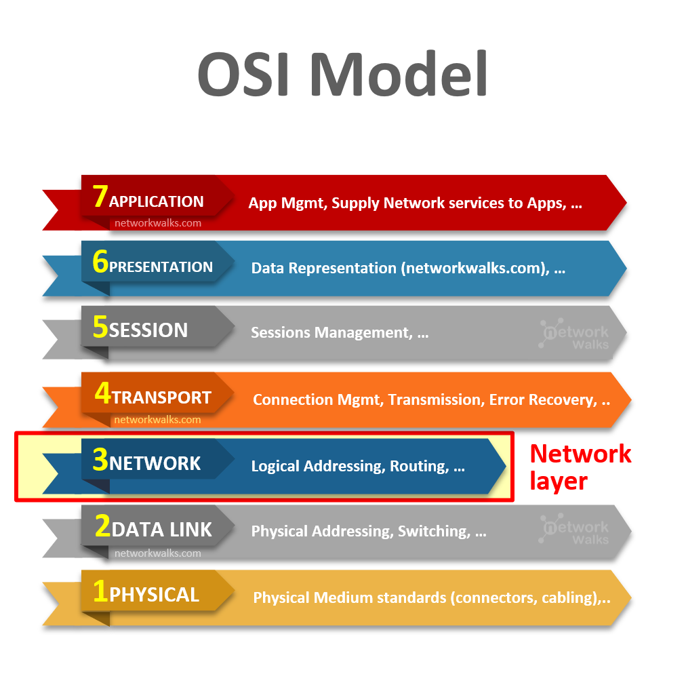
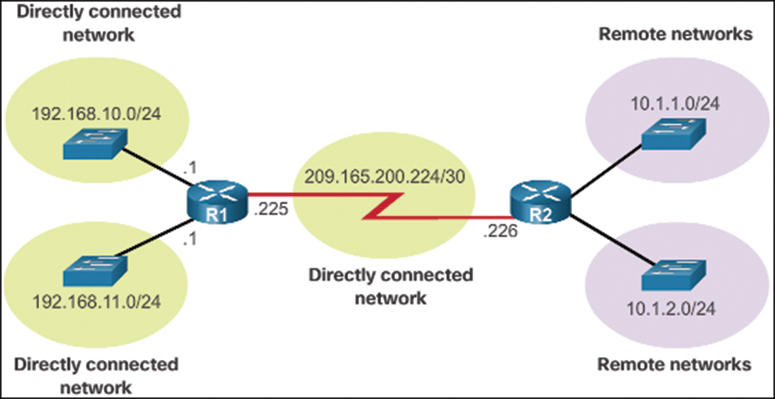
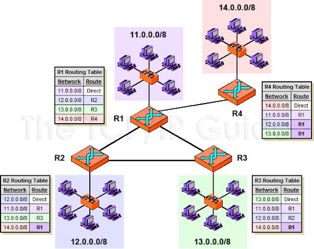
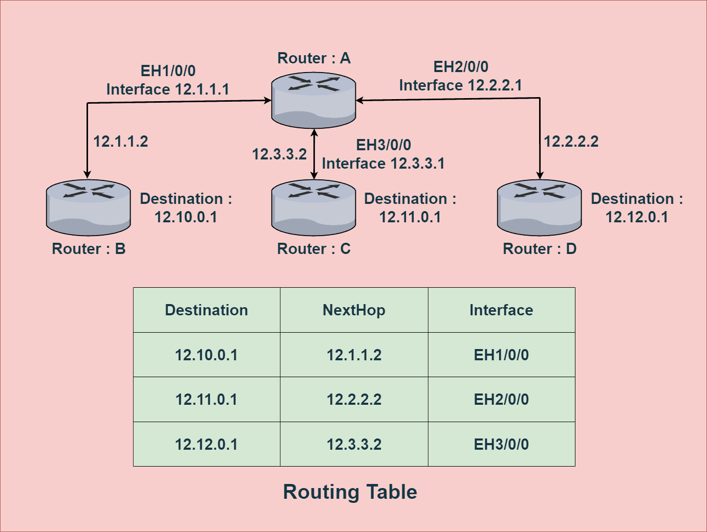
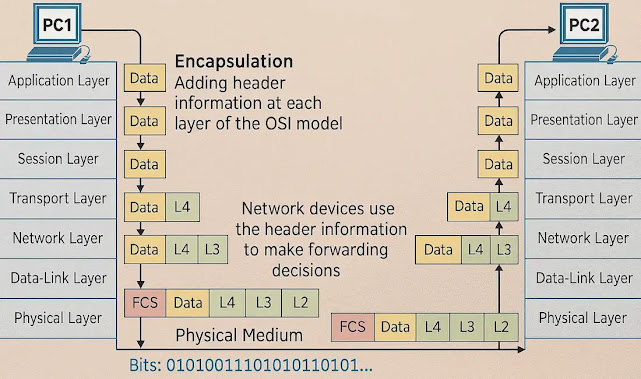
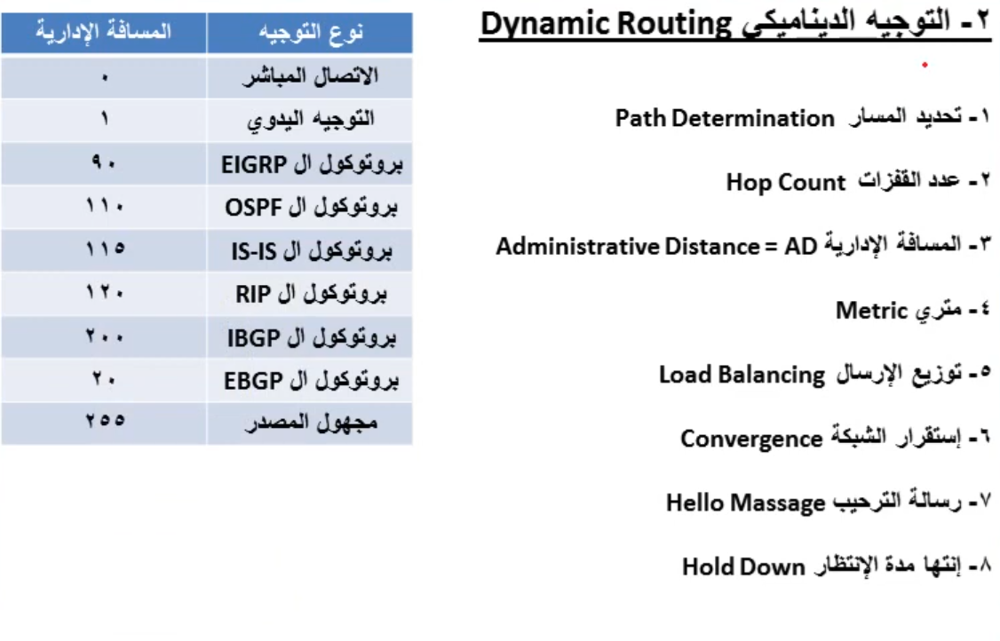
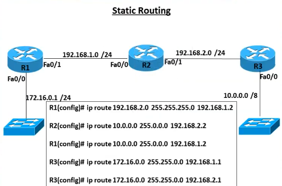
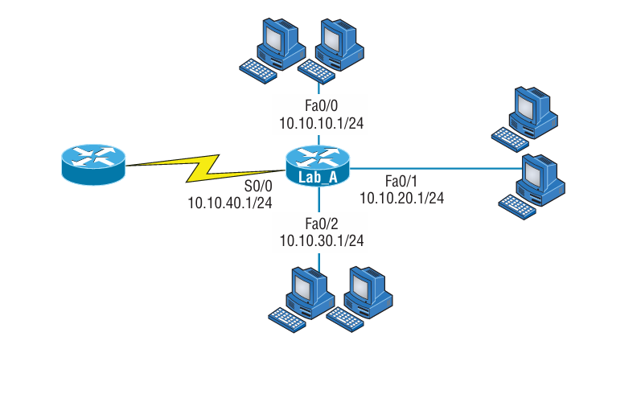
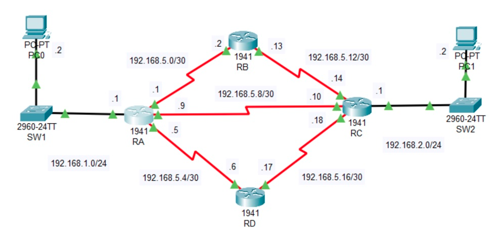

<div dir="rtl">

# الموضوع الثاني عشر: مقدمة في التوجيه (Introduction to IP Routing)

## جدول المحتويات

| # | القسم الرئيسي | المواضيع الفرعية |
|:---:|:---:|:---:|
| 1 | <a href="#intro-to-routing">مقدمة في التوجيه</a> | - |
| 2 | <a href="#router-role">جهاز الراوتر ومهامه</a> | - |
| 3 | <a href="#network-address-basis">لماذا يعتمد التوجيه على عنوان الشبكة لا عنوان الجهاز</a> | - |
| 4 | <a href="#network-types">أنواع الشبكات بالنسبة للراوتر</a> | <a href="#directly-connected">الشبكات المتصلة مباشرة</a><br><a href="#remote-networks">الشبكات البعيدة (Remote Networks)</a> |
| 5 | <a href="#routing-table">جدول التوجيه</a> | <a href="#show-ip-route">أمر show ip route</a><br>&nbsp;&nbsp;&nbsp;<a href="#route-source-codes">رموز مصدر المسار</a> |
| 6 | <a href="#arp-cache">ARP Cache ودوره في عملية التوجيه</a> | - |
| 7 | <a href="#routing-requirements">البيانات التي يحتاجها الراوتر لتوجيه البيانات</a> | - |
| 8 | <a href="#end-to-end-example">مثال متكامل: توجيه البيانات من PC1 إلى PC2</a> | <a href="#arp-request-step">الحصول على الماك عبر ARP</a><br><a href="#router-hop-actions">مهام الراوتر أثناء التوجيه</a> |
| 9 | <a href="#routing-and-osi-layers">عملية التوجيه وطبقات OSI / TCP-IP</a> | - |
| 10 | <a href="#routing-types">أنواع عملية التوجيه (Static / Dynamic)</a> | - |
| 11 | <a href="#static-routing">التوجيه الساكن (Static Routing)</a> | <a href="#static-routing-syntax">صيغة الأمر والأمثلة</a><br><a href="#static-routing-commands">أوامر المشاهدة والتحقق</a><br><a href="#default-route">المسار الافتراضي (Default Route)</a><br><a href="#floating-static-route">Floating Static Route</a><br><a href="#recursive-vs-directly-attached">Recursive vs Directly Attached</a> |
| 12 | <a href="#dynamic-routing">التوجيه الديناميكي (Dynamic Routing)</a> | <a href="#dynamic-routing-terms">المصطلحات المشتركة بين بروتوكولات التوجيه</a> |
| 13 | <a href="#routing-loops">مشكلة حلقات التوجيه (Routing Loops) وحلولها</a> | - |
| 14 | <a href="#administrative-distance">المسافة الإدارية (Administrative Distance)</a> | <a href="#ad-worked-example">مثال عملي محلول</a> |
| 15 | <a href="#metric-calculation">المعيار (Metric) وطرق حسابه</a> | - |
| 16 | <a href="#routing-algorithms">خوارزميات التوجيه</a> | <a href="#distance-vector">Distance Vector</a><br>&nbsp;&nbsp;&nbsp;<a href="#rip">RIP</a><br>&nbsp;&nbsp;&nbsp;<a href="#eigrp">EIGRP</a><br><a href="#link-state">Link State</a><br>&nbsp;&nbsp;&nbsp;<a href="#ospf">OSPF</a><br><a href="#path-vector">Path Vector</a><br>&nbsp;&nbsp;&nbsp;<a href="#bgp">BGP</a> |
| 17 | <a href="#convergence-comparison">سرعة التقارب (Convergence Time) عبر البروتوكولات</a> | - |
| 18 | <a href="#classful-classless">بروتوكولات Classful و Classless</a> | - |
| 19 | <a href="#route-summarization">تلخيص المسارات (Route Summarization)</a> | - |
| 20 | <a href="#igp-vs-egp">التوجيه الداخلي والخارجي (IGP و EGP)</a> | - |
| 21 | <a href="#nat-and-routing">NAT وعلاقته بالتوجيه</a> | - |
| 22 | <a href="#protocol-vs-routed">الفرق بين Routing Protocol و Routed Protocol</a> | - |
| 23 | <a href="#summary-table">جدول تلخيصي</a> | - |
| 24 | <a href="#self-test">أسئلة تقييم ذاتي</a> | - |

---

<h2 dir="rtl" align="right" id="intro-to-routing">1️⃣ مقدمة في التوجيه (Introduction to Routing)</h2>

التوجيه (Routing) هو العملية التي تسمح بنقل البيانات (الحزم / Packets) من شبكة إلى شبكة أخرى مختلفة، وهو ما يميز طبقة الشبكة (Network Layer - Layer 3) عن طبقة ربط البيانات (Data Link Layer) التي تتعامل فقط مع الاتصال داخل نفس الشبكة المحلية (راجع <a href="04-OSI-Model.md">الموضوع الرابع: OSI Model</a>).

<div align="center"><br><em>طبقة الشبكة (Network Layer) هي المسؤولة عن التوجيه (Logical Addressing, Routing)</em></div>

بدون التوجيه، تكون الأجهزة قادرة على التواصل فقط مع الأجهزة الموجودة في نفس الشبكة المحلية (Broadcast Domain)، أما إذا أردنا الوصول لشبكة أخرى (سواء داخل نفس المؤسسة أو عبر الإنترنت) فلا بد من وجود جهاز يقوم بهذه المهمة، وهو **الراوتر (Router)**.

أهمية التوجيه تكمن في أنه العمود الفقري لأي شبكة كبيرة أو شبكة الإنترنت نفسها؛ فكل حزمة بيانات تنتقل من جهازك إلى أي خادم حول العالم تمر عبر سلسلة من الراوترات التي تتخذ قرار التوجيه في كل قفزة (Hop) على حدة.

---

<h2 dir="rtl" align="right" id="router-role">2️⃣ جهاز الراوتر ومهامه (The Router)</h2>

**الراوتر (Router)** هو جهاز شبكي يعمل على **الطبقة الثالثة (Network Layer)** من نموذج OSI، ومهمته الأساسية هي **توجيه حزم البيانات (Packets) بين شبكات مختلفة** بناءً على عنوان الشبكة الوجهة (Destination Network Address).

### مهام الراوتر الأساسية:

- استقبال الحزمة القادمة على أحد منافذه (Interfaces).
- فحص عنوان IP الوجهة الموجود داخل رأس (Header) الحزمة.
- البحث في **جدول التوجيه (Routing Table)** الخاص به عن أفضل مسار يوصل إلى الشبكة الوجهة.
- إعادة تغليف الحزمة بإطار (Frame) جديد مناسب للشبكة الصادرة، وتغيير عنوان MAC الخاص بطبقة ربط البيانات.
- إرسال الحزمة عبر المنفذ (Interface) الصحيح باتجاه الخطوة التالية (Next Hop) نحو الوجهة.
- إذا لم يجد الراوتر مسارًا مناسبًا للشبكة الوجهة، يقوم بإسقاط الحزمة (Drop) وإرسال رسالة خطأ عبر بروتوكول **ICMP** (مثل Destination Unreachable) إلى المرسل.

كل قفزة (Hop) بين راوتر وآخر تُعتبر خطوة مستقلة يعيد فيها كل راوتر اتخاذ قرار التوجيه من جديد بناءً على جدول التوجيه الخاص به فقط، دون أن يعرف بالضرورة المسار الكامل من المصدر إلى الوجهة.

---

<h2 dir="rtl" align="right" id="network-address-basis">3️⃣ لماذا يعتمد التوجيه على عنوان الشبكة لا عنوان الجهاز</h2>

عند اتخاذ قرار التوجيه، **لا ينظر الراوتر إطلاقًا إلى هوية الجهاز المرسل أو المستقبل نفسه (Host)**، بل ينظر فقط إلى **عنوان الشبكة (Network Address / Network Portion)** الذي ينتمي إليه عنوان IP الوجهة. وهذا هو الفرق الجوهري بين عمل الراوتر (طبقة 3) وعمل السويتش (طبقة 2) الذي يتعامل مع عناوين الأجهزة (MAC Address) مباشرة داخل نفس الشبكة (راجع <a href="10-Networking-Devices.md">الموضوع العاشر: Networking Devices</a>).

### لماذا هذا التصميم؟

- **قابلية التوسع (Scalability):** لو كان كل راوتر مضطرًا لحفظ مسار مستقل لكل جهاز (Host) على حدة بدلاً من كل شبكة، لأصبح جدول التوجيه ضخمًا بشكل غير عملي، خاصة على مستوى الإنترنت الذي يضم مليارات الأجهزة.
- **التلخيص (Summarization):** بما أن كل أجهزة الشبكة الواحدة تشترك في نفس الجزء الخاص بعنوان الشبكة (Network Portion)، يكفي للراوتر معرفة مسار واحد فقط للوصول لأي جهاز داخل تلك الشبكة، بغض النظر عن عدد الأجهزة الفعلي بداخلها.
- **الفصل بين وظيفة كل طبقة:** تحديد الجهاز المستهدف تحديدًا (Host-to-Host delivery) داخل الشبكة المحلية هي مهمة **طبقة ربط البيانات (عنوان MAC)**، بينما توجيه البيانات بين الشبكات المختلفة (Network-to-Network delivery) هي مهمة **طبقة الشبكة (عنوان IP)**.

بمعنى آخر: الراوتر يسأل "أي شبكة؟" وليس "أي جهاز؟"، وبمجرد وصول الحزمة إلى الراوتر الأخير المتصل مباشرة بالشبكة الوجهة (Directly Connected)، عندها فقط يتم تحديد الجهاز المستهدف بدقة عبر عنوان MAC الخاص به (باستخدام ARP إذا لزم الأمر).

---

<h2 dir="rtl" align="right" id="network-types">4️⃣ أنواع الشبكات بالنسبة للراوتر</h2>

من منظور الراوتر، تنقسم الشبكات التي يتعامل معها إلى نوعين رئيسيين:

<h3 dir="rtl" align="right" id="directly-connected">أ. الشبكات المتصلة مباشرة (Directly Connected Networks)</h3>

هي الشبكات المتصلة فعليًا بأحد منافذ (Interfaces) الراوتر نفسه، ويتعرف عليها الراوتر تلقائيًا بمجرد تفعيل المنفذ (no shutdown) وضبط عنوان IP عليه، دون الحاجة لأي إعداد إضافي. تظهر في جدول التوجيه برمز **C** (Connected) و **L** (Local).

<h3 dir="rtl" align="right" id="remote-networks">ب. الشبكات البعيدة (Remote Networks)</h3>

هي الشبكات التي **لا تتصل مباشرة** بأي من منافذ الراوتر، وإنما تكون موجودة خلف راوتر أو أكثر من الراوترات المجاورة. لا يستطيع الراوتر معرفة وجود هذه الشبكات تلقائيًا، ولا بد من تزويده بهذه المعلومة بإحدى طريقتين:

- **يدويًا (Static Routing):** بإدخال المسار بنفسه عبر أوامر التوجيه الساكن.
- **تلقائيًا (Dynamic Routing):** عبر تشغيل بروتوكول توجيه (Routing Protocol) يتبادل به الراوتر معلومات الشبكات مع الراوترات المجاورة له؛ حيث يتعرف الراوتر على هذه الشبكات البعيدة من خلال **رسائل التحديث (Routing Updates)** التي يستقبلها من جيرانه المباشرين، ثم يعيد نشرها لبقية جيرانه، وهكذا تنتشر معرفة الشبكات البعيدة تدريجيًا عبر الشبكة بأكملها حتى تصل كل الراوترات لنفس الصورة الكاملة (Convergence).

<div align="center"><br><em>الشبكات المتصلة مباشرة بـ R1 و R2 مقابل الشبكات البعيدة (Remote Networks) خلف كل راوتر</em></div>

---

<h2 dir="rtl" align="right" id="routing-table">5️⃣ جدول التوجيه (Routing Table)</h2>

**جدول التوجيه (Routing Table)** هو قاعدة بيانات محلية داخل ذاكرة الراوتر (RAM) تحتوي على كل الشبكات التي يعرفها الراوتر، سواء كانت متصلة به مباشرة أو تم تعلمها من راوترات أخرى، بالإضافة إلى المسار (Route) الذي يجب اتباعه للوصول إلى كل شبكة من هذه الشبكات.

يعتمد الراوتر على هذا الجدول في اتخاذ **كل قرار توجيه** يقوم به؛ فبدون وجود مسار (Route) لشبكة معينة داخل الجدول، لن يستطيع الراوتر توجيه أي بيانات إليها مهما كان الاتصال الفعلي موجودًا.

<h3 dir="rtl" align="right" id="show-ip-route">أمر show ip route</h3>

أمر `show ip route` هو الأمر المستخدم على أجهزة Cisco لعرض محتوى جدول التوجيه بالكامل، ويوضح لكل شبكة معروفة لدى الراوتر:

| العنصر | الوصف |
|:---:|:---:|
| رمز مصدر المسار (Source Code) | يوضح كيف تعلّم الراوتر هذا المسار (مباشر - يدوي - بروتوكول توجيه) |
| عنوان الشبكة (Network) | عنوان الشبكة الوجهة مع قناع الشبكة (Subnet Mask / Prefix) |
| المسافة الإدارية والمعيار [AD/Metric] | يظهران بين قوسين أمام كل مسار |
| البوابة التالية (Next Hop / via) | عنوان IP للراوتر المجاور الذي سترسل له البيانات |
| المنفذ الصادر (Outgoing Interface) | المنفذ الذي ستخرج منه الحزمة |

<h3 dir="rtl" align="right" id="route-source-codes">رموز مصدر المسار الشائعة</h3>

| الرمز | المعنى |
|:---:|:---:|
| C | Connected — شبكة متصلة مباشرة بالراوتر |
| L | Local — عنوان الواجهة نفسها (Local Route) |
| S | Static — مسار تم إدخاله يدويًا |
| S* | Static Default Route — المسار الافتراضي الساكن |
| R | RIP |
| D | EIGRP |
| O | OSPF |
| B | BGP |

يوضح المثالان التاليان كيف يختلف محتوى جدول التوجيه من راوتر لآخر حسب موقعه داخل الشبكة، وكيف يحدد كل راوتر البوابة التالية (Next Hop) والمنفذ الصادر (Interface) المناسبين لكل شبكة وجهة يعرفها:

<div align="center"><br><em>مثال لأربع راوترات متصلة، وكيف يختلف جدول التوجيه في كل راوتر حسب موقعه من الشبكات الأربع</em></div>

<div align="center"><br><em>مثال آخر: راوتر مركزي (A) متصل بثلاث راوترات فرعية، مع جدول التوجيه الموضح لكل شبكة وجهته (Next Hop) والمنفذ الصادر (Interface)</em></div>

---

<h2 dir="rtl" align="right" id="arp-cache">6️⃣ ARP Cache ودوره في عملية التوجيه</h2>

**ARP Cache** هي جدول مؤقت يحتفظ به كل جهاز (بما في ذلك الراوتر) في الذاكرة، ويربط بين **عنوان IP** و**عنوان MAC** المقابل له لكل جهاز تم التواصل معه مؤخرًا على نفس الشبكة المحلية. الهدف منه تجنب تكرار إرسال رسائل **ARP Request** (Broadcast) في كل مرة يُراد فيها إرسال بيانات لنفس الجهة، مما يقلل الحمل على الشبكة ويسرّع عملية الإرسال.

- عندما يحتاج الراوتر إرسال حزمة لجهاز أو راوتر مجاور على شبكة متصلة مباشرة، يتحقق أولًا من **ARP Cache** الخاص به.
- إذا كان العنوان موجودًا بالفعل، يستخدمه مباشرة دون إرسال أي طلب ARP جديد.
- إذا لم يكن موجودًا (أو انتهت مدة صلاحيته)، يرسل الراوتر طلب **ARP Request** جديد للحصول عليه، ثم يضيف النتيجة إلى الجدول.
- لكل إدخال في ARP Cache **مدة صلاحية محددة (Aging Time)**، وبعدها يُحذف تلقائيًا إذا لم يُستخدم، للحفاظ على تحديث الجدول ودقته.
- يمكن مشاهدة محتوى الجدول على أجهزة Cisco بالأمر `show arp` أو `show ip arp`.

> **ملاحظة:** ARP Cache يخص فقط الأجهزة الموجودة على **نفس الشبكة المحلية** (مثل جار مباشر للراوتر أو جهاز نهائي)، ولا علاقة له بالشبكات البعيدة التي يتم الوصول إليها عبر جدول التوجيه.

---

<h2 dir="rtl" align="right" id="routing-requirements">7️⃣ البيانات التي يحتاجها الراوتر لتوجيه البيانات</h2>

لكي ينجح الراوتر في مهمة التوجيه، لا بد أن تتوفر لديه العناصر التالية:

| # | العنصر | الوصف |
|:---:|:---:|:---:|
| أ | عنوان الشبكة المرسل إليها (Destination Network Address) | يستخرجه الراوتر من رأس الحزمة (IP Header) |
| ب | الاتصال مع راوترات الجوار (Neighbor Connectivity) | لتبادل معلومات الشبكات معهم |
| ج | معرفة مسار واحد على الأقل يؤدي للشبكة الوجهة | سواء تم تعلمه يدويًا أو ديناميكيًا |
| د | قناع الشبكة (Subnet Mask) | لتحديد حجم الشبكة الوجهة بدقة |
| هـ | البوابة التالية (Next Hop) | عنوان IP للراوتر المجاور الذي سيُرسل له |
| و | التكلفة / المعيار (Cost / Metric) | لاختيار أفضل مسار عند توفر أكثر من مسار |
| ز | جدول التوجيه (Routing Table) | المرجع الذي يبني عليه الراوتر قراره |
| ح | التحقق من صلاحية المسار | التأكد أن أفضل مسار ما زال يعمل ولم ينقطع |

راجع أيضًا مفاهيم **عناوين IP وأقنعة الشبكة (Subnet Mask)** بالتفصيل في <a href="11-IP-Addressing-and-IP-Subnetting.md">الموضوع الحادي عشر: IP Address and Subnetting</a>.

---

<h2 dir="rtl" align="right" id="end-to-end-example">8️⃣ مثال متكامل: توجيه البيانات من PC1 إلى PC2</h2>

هذا مثال شامل يوضح كل ما يحدث عندما يرسل جهاز (PC1) بيانات إلى جهاز آخر (PC2) موجود في **شبكة مختلفة**، ويمر الاتصال عبر راوتر واحد على الأقل.

<div align="center"><br><em>عملية التغليف (Encapsulation) عبر طبقات OSI من PC1 إلى PC2، وإزالة التغليف (Decapsulation) عند الوصول</em></div>

<h3 dir="rtl" align="right" id="arp-request-step">الخطوة الأولى: تجهيز البيانات والحصول على عنوان MAC عبر ARP</h3>

1. يبدأ PC1 بتغليف البيانات عبر طبقات النموذج بدءًا من طبقة التطبيقات وحتى الوصول لطبقة الشبكة، حيث يضاف رأس IP (Source IP = PC1, Destination IP = PC2).
2. يقارن PC1 بين عنوان IP الخاص به وعنوان IP الوجهة (PC2) باستخدام قناع الشبكة (Subnet Mask)، فيكتشف أن PC2 **ليس في نفس الشبكة المحلية**.
3. بما أن الوجهة خارج الشبكة المحلية، لا يحتاج PC1 لمعرفة عنوان MAC الخاص بـ PC2 نفسه، بل يحتاج لعنوان MAC الخاص **بالبوابة الافتراضية (Default Gateway)** أي الراوتر.
4. إذا لم يكن عنوان MAC الخاص بالبوابة موجودًا في ARP Cache، يرسل PC1 رسالة **ARP Request** (Broadcast) يسأل فيها: "من صاحب عنوان IP هذا؟" فيرد الراوتر برسالة **ARP Reply** تحمل عنوان MAC الخاص بمنفذه.
5. يقوم PC1 بتغليف الحزمة داخل إطار (Frame) طبقة ربط البيانات، حيث يكون:
   - Source MAC = عنوان MAC الخاص بـ PC1
   - Destination MAC = عنوان MAC الخاص **بمنفذ الراوتر** (وليس PC2)

<h3 dir="rtl" align="right" id="router-hop-actions">الخطوة الثانية: مهام الراوتر عند استقبال البيانات</h3>

عندما تصل الإطار إلى الراوتر، يقوم بالخطوات التالية:

1. يزيل رأس طبقة ربط البيانات (De-encapsulation) للوصول إلى الحزمة (Packet) على طبقة الشبكة.
2. يفحص عنوان IP الوجهة، ويبحث عن مسار مطابق له داخل **جدول التوجيه (Routing Table)**.
3. إذا لم يجد مسارًا مناسبًا، يُسقط الحزمة ويرسل رسالة **ICMP Destination Unreachable** إلى المرسل.
4. إذا وجد مسارًا مناسبًا، يحدد المنفذ الصادر (Outgoing Interface) وعنوان البوابة التالية (Next Hop).
5. يعيد تغليف الحزمة بإطار جديد مناسب لتقنية الشبكة الصادرة (مثل Ethernet)، ويستبدل عناوين MAC:
   - Source MAC الجديد = عنوان MAC الخاص بمنفذ الراوتر الصادر
   - Destination MAC الجديد = عنوان MAC الخاص بـ PC2 (يحصل عليه عبر ARP إذا لم يكن معروفًا)
6. يرسل الإطار الجديد عبر المنفذ الصادر باتجاه PC2.
7. عند وصول البيانات لـ PC2، يقوم بإزالة التغليف طبقة بعد طبقة (Decapsulation) حتى يصل للبيانات الأصلية على طبقة التطبيقات.

> **ملاحظة مهمة:** عنوان MAC يتغير في **كل قفزة (Hop)** بين راوتر وآخر (Hop-by-Hop)، بينما عنوان IP المصدر والوجهة **يبقى ثابتًا طوال الرحلة** من المصدر إلى الوجهة النهائية. راجع تفاصيل بنية الإطار وأنواع العناوين في <a href="09-Ethernet-LAN.md">الموضوع التاسع: Ethernet and LAN</a> و<a href="10-Networking-Devices.md">الموضوع العاشر: Networking Devices</a>.

---

<h2 dir="rtl" align="right" id="routing-and-osi-layers">9️⃣ عملية التوجيه وطبقات OSI / TCP-IP</h2>

التوجيه هو وظيفة تنتمي حصريًا إلى **طبقة الشبكة (Network Layer - L3)** في نموذج OSI، والتي تقابل **طبقة الإنترنت (Internet Layer)** في نموذج TCP/IP.

| النموذج | الطبقة المسؤولة عن التوجيه | الوظيفة |
|:---:|:---:|:---:|
| OSI Model | Layer 3 – Network Layer | العنونة المنطقية (IP Addressing) واتخاذ قرار التوجيه |
| TCP/IP Model | Internet Layer | نفس الوظيفة، ويُطلق عليها أحيانًا IP Layer |

أثناء عملية الإرسال، تُضاف رؤوس (Headers) كل طبقة تباعًا (Encapsulation)، وعند الاستقبال تُزال هذه الرؤوس بالترتيب المعاكس (Decapsulation). الراوتر تحديدًا **يقرأ وينشئ رؤوس طبقة الشبكة والطبقة التي تليها في كل قفزة فقط**، ولا يتعامل مع طبقات أعلى من ذلك (Application, Session, Presentation) خلال عملية التوجيه نفسها. للتفاصيل الكاملة لآلية التغليف راجع <a href="07-TCP-IP-Model.md">الموضوع السابع: TCP/IP Model</a>.

---

<h2 dir="rtl" align="right" id="routing-types">🔟 أنواع عملية التوجيه (Static / Dynamic)</h2>

تنقسم طرق بناء جدول التوجيه إلى نوعين رئيسيين، لكل منهما مميزاته وعيوبه:

| المقارنة | Static Routing (ساكن) | Dynamic Routing (ديناميكي) |
|:---:|:---:|:---:|
| طريقة الإضافة | يدويًا بواسطة المسؤول | تلقائيًا عبر بروتوكول توجيه |
| استهلاك موارد الراوتر (CPU/RAM) | منخفض جدًا | أعلى (معالجة ومقارنة وتبادل رسائل) |
| استهلاك عرض النطاق (Bandwidth) | لا يوجد (لا رسائل تبادل) | يوجد (رسائل Hello وتحديثات دورية) |
| الأمان | أعلى (لا رسائل تُكتشف أو تُخترق) | أقل نسبيًا (رسائل التوجيه قابلة للاعتراض ما لم تُؤمَّن) |
| التوسع (Scalability) | ضعيف جدًا في الشبكات الكبيرة | ممتاز، مناسب للشبكات الكبيرة والمعقدة |
| التكيف مع تغييرات الشبكة | لا يتكيف تلقائيًا (يحتاج تدخل يدوي) | يتكيف تلقائيًا عند حدوث أي تغيير (Convergence) |
| الاستخدام الأمثل | الشبكات الصغيرة أو المسارات الحرجة/الاحتياطية | الشبكات المتوسطة والكبيرة |

---

<h2 dir="rtl" align="right" id="static-routing">1️⃣1️⃣ التوجيه الساكن (Static Routing)</h2>

في **التوجيه الساكن**، يقوم مسؤول الشبكة بإدخال المسار إلى الشبكات البعيدة يدويًا على كل راوتر، وهذا يتطلب معرفة تفصيلية بكامل مخطط الشبكة.

<h3 dir="rtl" align="right" id="static-routing-syntax">صيغة الأمر والأمثلة</h3>

الصيغة العامة لإضافة مسار ساكن على أجهزة Cisco:

```
Router(config)# ip route <Destination Network> <Subnet Mask> <Next Hop IP / Exit Interface>
```

<div align="center"><br><em>مثال عملي: شبكة من ثلاث راوترات (R1 - R2 - R3) مع أوامر التوجيه الساكن الكاملة لكل راوتر</em></div>

بالنظر إلى المخطط أعلاه، تكون أوامر التوجيه الساكن المطلوبة كالتالي:

```
! على R1: للوصول إلى شبكة 192.168.2.0 وشبكة 10.0.0.0 (البوابة التالية = منفذ R2)
R1(config)# ip route 192.168.2.0 255.255.255.0 192.168.1.2
R1(config)# ip route 10.0.0.0 255.0.0.0 192.168.1.2

! على R2: للوصول إلى شبكة 172.16.0.0 (اتجاه R1) وشبكة 10.0.0.0 (اتجاه R3)
R2(config)# ip route 172.16.0.0 255.255.0.0 192.168.1.1
R2(config)# ip route 10.0.0.0 255.0.0.0 192.168.2.2

! على R3: للوصول إلى شبكة 172.16.0.0 (يمكن عبر R1 مباشرة أو عبر R2)
R3(config)# ip route 172.16.0.0 255.255.0.0 192.168.1.1
R3(config)# ip route 172.16.0.0 255.255.0.0 192.168.2.1
```

<div align="center"><br><em>مثال آخر: راوتر واحد (Lab_A) بثلاث شبكات محلية متصلة مباشرة، وشبكة بعيدة عبر منفذ تسلسلي S0/0</em></div>

<h3 dir="rtl" align="right" id="static-routing-commands">أوامر المشاهدة والتحقق</h3>

| الأمر | الوظيفة |
|:---:|:---:|
| `show ip route` | عرض جدول التوجيه بالكامل، والتحقق من ظهور المسارات الساكنة برمز **S** |
| `show ip route static` | عرض المسارات الساكنة فقط |
| `show running-config` | التحقق من الأوامر المُدخلة فعليًا في إعدادات الراوتر |
| `ping <destination>` | اختبار الوصول الفعلي للشبكة البعيدة بعد إضافة المسار |
| `no ip route ...` | حذف مسار ساكن تم إدخاله سابقًا |

<h3 dir="rtl" align="right" id="default-route">المسار الافتراضي (Default Route)</h3>

**المسار الافتراضي (Default Route)** هو مسار ساكن خاص يُستخدم كـ "مسار الملاذ الأخير" (Gateway of Last Resort)، بحيث يُرسل إليه الراوتر أي حزمة **لا يوجد لها مسار محدد ومطابق تمامًا** داخل جدول التوجيه. يُكتب بالصيغة التالية، حيث يمثل `0.0.0.0 0.0.0.0` أي شبكة وأي قناع (أي "كل الشبكات"):

```
Router(config)# ip route 0.0.0.0 0.0.0.0 <Next Hop IP>
```

يظهر هذا المسار في جدول التوجيه برمز **S\*** (Static Default)، ويُستخدم غالبًا على الراوتر الطرفي (Edge Router) المتصل بمزود خدمة الإنترنت (ISP)، بدلًا من كتابة مسار مستقل لكل شبكة على الإنترنت.

<h3 dir="rtl" align="right" id="floating-static-route">المسار الساكن العائم (Floating Static Route)</h3>

**Floating Static Route** هو مسار ساكن احتياطي (Backup) يُضبط بقيمة **مسافة إدارية (AD) أعلى من قيمة AD الخاصة بالمسار الأساسي** (سواء كان المسار الأساسي ديناميكيًا أو ساكنًا آخر)، بحيث يبقى هذا المسار **غير نشط ومخفيًا عن جدول التوجيه** طالما المسار الأساسي يعمل، ولا يظهر ويُستخدم فعليًا إلا في حالة **انقطاع المسار الأساسي بالكامل**.

```
! المسار الأساسي عبر OSPF (AD = 110) يعمل بشكل طبيعي
! المسار الاحتياطي بقيمة AD أعلى من 110 حتى لا يُستخدم إلا عند الحاجة
Router(config)# ip route 192.168.2.0 255.255.255.0 192.168.1.2 130
```

يُستخدم غالبًا لتوفير مسار احتياطي (Backup Link) عبر رابط بديل (مثل خط اتصال احتياطي عبر مزود آخر)، يعمل تلقائيًا فقط عند فشل الرابط الأساسي دون أي تدخل يدوي.

<h3 dir="rtl" align="right" id="recursive-vs-directly-attached">المسار المتكرر مقابل المسار المتصل مباشرة</h3>

عند كتابة أمر `ip route`، يمكن تحديد **البوابة التالية (Next Hop)** بإحدى طريقتين، ولكل منهما سلوك مختلف داخل الراوتر:

| النوع | طريقة الكتابة | الوصف |
|:---:|:---:|:---:|
| **Recursive Static Route** | تحديد **عنوان IP** الخاص بالراوتر المجاور (Next Hop IP) | يضطر الراوتر لعمل بحث إضافي (Recursive Lookup) داخل جدول التوجيه ليعرف عبر أي منفذ يصل لهذا الـ IP، مما يزيد الحمل قليلًا على المعالج |
| **Directly Attached Static Route** | تحديد **اسم المنفذ الصادر** (Exit Interface) مباشرة بدلًا من عنوان IP | أسرع لأن الراوتر لا يحتاج بحث إضافي، لكنه غير مناسب على منافذ Ethernet متعددة الوصول (Multi-Access) لاحتمال حدوث مشاكل في ARP |

```
! Recursive: تحديد عنوان IP للجار
Router(config)# ip route 192.168.2.0 255.255.255.0 192.168.1.2

! Directly Attached: تحديد المنفذ الصادر مباشرة
Router(config)# ip route 192.168.2.0 255.255.255.0 GigabitEthernet0/1
```

---

<h2 dir="rtl" align="right" id="dynamic-routing">1️⃣2️⃣ التوجيه الديناميكي (Dynamic Routing)</h2>

في **التوجيه الديناميكي**، يقوم الراوتر بتشغيل **بروتوكول توجيه (Routing Protocol)** يتبادل بموجبه معلومات الشبكات المعروفة لديه مع الراوترات المجاورة (Neighbors) تلقائيًا، ويقوم ببناء وتحديث جدول التوجيه بنفسه دون تدخل يدوي، كما يتكيف تلقائيًا مع أي تغيير يطرأ على الشبكة (مثل انقطاع رابط) عبر عملية إعادة التقارب (Convergence).

> **قاعدة مهمة:** يجب استخدام **نفس بروتوكول التوجيه** على جميع الراوترات المشاركة في تبادل المعلومات؛ فالراوترات التي تعمل ببروتوكولات مختلفة لا تستطيع تبادل معلومات التوجيه فيما بينها مباشرة إلا عبر إعادة التوزيع (Redistribution).

<div align="center"><br><em>عناصر ومصطلحات بروتوكولات التوجيه الديناميكي، وجدول المسافة الإدارية الافتراضية لكل بروتوكول</em></div>

<h3 dir="rtl" align="right" id="dynamic-routing-terms">المصطلحات المشتركة بين بروتوكولات التوجيه</h3>

| # | المصطلح | الشرح |
|:---:|:---:|:---:|
| 1 | تحديد المسار (Path Determination) | العملية التي يقيّم بها البروتوكول المسارات المتاحة ليختار الأفضل بينها |
| 2 | عدد القفزات (Hop Count) | عدد الراوترات التي تمر بها الحزمة للوصول إلى الوجهة؛ يُستخدم كمعيار في RIP |
| 3 | المسافة الإدارية (Administrative Distance - AD) | مقياس ثقة الراوتر بمصدر المسار؛ كلما قلّت القيمة زادت الأولوية (راجع القسم التالي) |
| 4 | المعيار (Metric) | القيمة التي يحسبها كل بروتوكول لاختيار أفضل مسار من بين عدة مسارات لنفس البروتوكول |
| 5 | توزيع الإرسال (Load Balancing) | توزيع البيانات على أكثر من مسار متساوٍ في القيمة للوصول لنفس الوجهة |
| 6 | استقرار الشبكة (Convergence) | الحالة التي تتفق فيها كل الراوترات على نفس الصورة المحدثة لجدول التوجيه بعد أي تغيير |
| 7 | رسالة الترحيب (Hello Message) | رسائل دورية صغيرة يتبادلها الراوتر المجاورة لاكتشاف بعضها والتأكد من استمرار الاتصال بينها |
| 8 | مدة الانتظار (Hold-Down Timer) | فترة زمنية يرفض فيها الراوتر قبول أي تحديث أسوأ لمسار معين، لمنع انتشار معلومات خاطئة أثناء عدم الاستقرار |
| 9 | تحديثات التوجيه (Routing Updates) | الرسائل التي يتبادل بها الراوترات معلومات الشبكات المعروفة لديها (دوريًا أو عند حدوث تغيير) |
| 10 | المسار الافتراضي (Default Route) | يمكن أن يُعلن ويُوزَّع تلقائيًا عبر بروتوكولات التوجيه الديناميكي بين الراوترات |
| 11 | النسبة الكاملة والنسبة المقسمة (Full Update / Split Horizon) | Full Update: إرسال جدول التوجيه بالكامل ضمن التحديث. Split Horizon: قاعدة تمنع إعادة إعلان مسار عبر نفس المنفذ الذي وصل منه، لمنع حدوث حلقات توجيه (Routing Loops) |

**توزيع الإرسال (Load Balancing)** يظهر بوضوح في التصميمات ذات المسارات المتعددة والمتكررة (Redundant Topology)، حيث يمكن للراوتر توزيع البيانات على أكثر من مسار في نفس الوقت لتحسين الأداء وتوفير مسار احتياطي عند فشل أحدها:

<div align="center"><br><em>مثال Packet Tracer لشبكة ذات مسارات متعددة ومتكررة بين الراوترات، تتيح توزيع الإرسال والتعافي السريع عند انقطاع أحد الروابط</em></div>

---

<h2 dir="rtl" align="right" id="routing-loops">1️⃣3️⃣ مشكلة حلقات التوجيه (Routing Loops) وحلولها</h2>

**حلقة التوجيه (Routing Loop)** هي مشكلة تحدث خصوصًا في بروتوكولات **Distance Vector**، حيث تدور الحزمة بين راوترين أو أكثر بشكل متكرر دون أن تصل لوجهتها أبدًا، مما يستهلك عرض النطاق الترددي ومعالجة الراوتر بلا فائدة.

### كيف تحدث المشكلة؟

تحدث الحلقة عادةً عند **انقطاع رابط متصل بشبكة معينة**، فإذا لم يعرف أحد الراوترات المجاورة بالانقطاع بالسرعة الكافية (بسبب بطء التقارب)، فإنه يستمر في الاعتقاد بوجود مسار صالح لتلك الشبكة عبر جاره (الذي فَقَد الاتصال بالفعل)، فيرسل له الحزم، والجار بدوره يرسلها مرة أخرى ظنًا منه أن الراوتر الأول ما زال يملك مسارًا صالحًا، وهكذا تستمر الحزمة "ترتد" بين الراوترين حتى تنتهي صلاحيتها (TTL Expired).

### مشكلة العد إلى ما لا نهاية (Counting to Infinity)

في بروتوكول **RIP** تحديدًا، إذا حدثت حلقة توجيه، يستمر عدد القفزات (Hop Count) المُعلن عن تلك الشبكة في **الازدياد تدريجيًا مع كل تبادل رسائل** بين الراوترين المتورطين، دون أن يكتشفا المشكلة، حتى تصل القيمة إلى **16 قفزة**، وعندها فقط يعتبر RIP الشبكة **غير قابلة للوصول (Unreachable)** وتتوقف الحلقة تلقائيًا. هذه هي المشكلة الأساسية التي دفعت لتصميم حد الـ15 قفزة في RIP أصلًا.

### آليات الحماية من حلقات التوجيه

| الآلية | الوصف |
|:---:|:---:|
| **Split Horizon** | قاعدة تمنع الراوتر من إعادة إعلان مسار معين عبر **نفس المنفذ** الذي تعلّم منه هذا المسار أصلًا؛ فمن غير المنطقي إخبار الجار بمعلومة تعلمتها منه هو نفسه |
| **Route Poisoning** | عندما يكتشف الراوتر أن شبكة متصلة به مباشرة أصبحت غير قابلة للوصول، يقوم بـ"تسميم" المسار بإعلانه بقيمة Metric تمثل اللانهاية (مثل 16 قفزة في RIP) بدلًا من حذفه بصمت، لإخبار كل الجيران بوضوح أن هذا المسار فشل |
| **Poison Reverse** | امتداد لـ Split Horizon، حيث بدلًا من عدم إعلان المسار للجار الذي تعلمناه منه، يُعلَن له **بقيمة Metric لا نهائية**، لتأكيد فشل المسار صراحة بدلًا من الصمت فقط |
| **Hold-Down Timer** | بعد استقبال معلومة بأن مسارًا ما فشل، يدخل الراوتر في فترة "انتظار" يرفض خلالها أي تحديث جديد أفضل لنفس المسار، حتى يتأكد استقرار الشبكة ولا تنتشر معلومات متضاربة أثناء فترة عدم اليقين |
| **Triggered Updates** | إرسال تحديث فوري بمجرد حدوث تغيير في الشبكة، بدلًا من الانتظار حتى موعد التحديث الدوري التالي، لتسريع اكتشاف المشكلة وتقليل نافذة حدوث الحلقة |
| **Maximum Hop Count** | تحديد حد أقصى لعدد القفزات (مثل 15 في RIP) بحيث تُعتبر أي شبكة تتجاوزه غير قابلة للوصول، فتتوقف الحلقة تلقائيًا مهما طال أمدها |

> **ملاحظة:** بروتوكولات **Link State** مثل OSPF أقل عرضة لهذه المشكلة بطبيعتها، لأن كل راوتر يملك صورة كاملة ومطابقة لبنية الشبكة (Topology Database) بدلًا من الاعتماد على معلومات غير مؤكدة من الجيران فقط.

---

<h2 dir="rtl" align="right" id="administrative-distance">1️⃣4️⃣ المسافة الإدارية (Administrative Distance - AD)</h2>

**المسافة الإدارية (AD)** هي قيمة رقمية (من 0 إلى 255) تعبّر عن مدى **ثقة** الراوتر في مصدر معلومة المسار، وتُستخدم للمفاضلة بين **مسارات متعددة لنفس الشبكة الوجهة قادمة من مصادر مختلفة** (مثل مسار ساكن ومسار عبر OSPF لنفس الشبكة). **كلما قلّت قيمة AD، زادت أولوية المسار وثقة الراوتر به**، ويقوم الراوتر باعتماد المسار صاحب أقل قيمة AD فقط.

> **ملاحظة:** لا يجب الخلط بين **المسافة الإدارية (AD)** التي تقارن بين بروتوكولات مختلفة، وبين **المعيار (Metric)** الذي يقارن بين مسارات من نفس البروتوكول.

| نوع المصدر / البروتوكول | قيمة AD الافتراضية |
|:---:|:---:|
| الاتصال المباشر (Directly Connected) | 0 |
| التوجيه اليدوي (Static Route) | 1 |
| EIGRP | 90 |
| OSPF | 110 |
| IS-IS | 115 |
| RIP | 120 |
| EBGP (External BGP) | 20 |
| IBGP (Internal BGP) | 200 |
| مصدر مجهول / غير موثوق (Unknown) | 255 (لا يُستخدم إطلاقًا) |

<h3 dir="rtl" align="right" id="ad-worked-example">مثال عملي محلول</h3>

**السيناريو:** راوتر لديه ثلاثة مسارات مختلفة تصل جميعها إلى نفس الشبكة الوجهة `192.168.20.0/24`:

| المصدر | المسار | AD |
|:---:|:---:|:---:|
| Static Route مُدخل يدويًا | عبر 10.0.0.2 | 1 |
| OSPF | عبر 10.0.0.6 | 110 |
| EIGRP | عبر 10.0.0.10 | 90 |

**خطوات القرار:**

1. يقارن الراوتر بين قيم AD الثلاث فقط (1، 90، 110)، **متجاهلاً تمامًا** أي قيمة Metric داخلية لكل بروتوكول في هذه المرحلة.
2. يختار الراوتر المسار صاحب **أقل قيمة AD**، وهو المسار الساكن (Static) بقيمة **1**.
3. يُضاف هذا المسار فقط إلى جدول التوجيه (`show ip route`) ويظهر برمز **S**، بينما **لا يظهر** مساري OSPF و EIGRP إطلاقًا في الجدول طالما المسار الساكن نشط ويعمل.
4. إذا انقطع المسار الساكن لاحقًا (مثلاً تعطل الرابط 10.0.0.2)، يعيد الراوتر تلقائيًا المقارنة بين الخيارين المتبقيين (OSPF بقيمة 110 مقابل EIGRP بقيمة 90)، فيختار **EIGRP** لأن قيمة AD الخاصة به أقل.

> هذا بالضبط هو المبدأ الذي يقوم عليه **Floating Static Route** الذي تم شرحه في قسم Static Routing: بضبط AD المسار الساكن بقيمة **أعلى** من AD بروتوكول التوجيه الديناميكي، يصبح المسار الديناميكي هو الأساسي، ويتحول المسار الساكن لاحتياطي فقط.

---

<h2 dir="rtl" align="right" id="metric-calculation">1️⃣5️⃣ المعيار (Metric) وطرق حسابه</h2>

**المعيار (Metric)** هو القيمة التي يحسبها بروتوكول التوجيه نفسه للمفاضلة بين **عدة مسارات لنفس الشبكة الوجهة من نفس البروتوكول**، ويختار الراوتر المسار صاحب أقل قيمة Metric. تختلف طريقة حساب هذه القيمة تمامًا من بروتوكول لآخر:

| البروتوكول | طريقة حساب المعيار (Metric) | متى يُستخدم |
|:---:|:---:|:---:|
| **RIP** | عدد القفزات (Hop Count) فقط — كل قفزة = +1، بحد أقصى 15 قفزة | مناسب فقط للشبكات الصغيرة جدًا، دون اعتبار لسرعة الروابط |
| **OSPF** | التكلفة (Cost)، وتُحسب اعتمادًا على عرض النطاق الترددي لكل وصلة بالمعادلة: Cost = 10⁸ ÷ Bandwidth (bps) | الشبكات المؤسسية؛ يفضّل الروابط الأسرع تلقائيًا لأن التكلفة تقل كلما زاد عرض النطاق |
| **EIGRP** | معيار مركب (Composite Metric) يعتمد بشكل أساسي على أقل عرض نطاق (Bandwidth) وأكبر تأخير تراكمي (Delay) على المسار، مع إمكانية إضافة الموثوقية (Reliability) والحمل (Load) | شبكات Cisco التي تحتاج دقة أعلى من مجرد عدد القفزات |
| **BGP** | لا يعتمد على معيار تقني تلقائي بشكل أساسي، بل على قائمة الأنظمة المستقلة (AS-Path) وسياسات توجيه يحددها المسؤول (Routing Policies) | التوجيه بين الأنظمة المستقلة (بين مزودي خدمة الإنترنت) |

> **تذكير:** الفرق الجوهري — **AD** يفاضل بين **بروتوكولات مختلفة** لنفس الشبكة، بينما **Metric** يفاضل بين **مسارات من نفس البروتوكول** لنفس الشبكة. الراوتر يطبّق الاثنين بالترتيب: يفحص AD أولًا لاختيار مصدر المسار الموثوق، ثم يفحص Metric للمفاضلة بين المسارات المتعددة من هذا المصدر نفسه إن وُجدت.

---

<h2 dir="rtl" align="right" id="routing-algorithms">1️⃣6️⃣ خوارزميات التوجيه (Routing Algorithms)</h2>

تعتمد بروتوكولات التوجيه الديناميكي على **خوارزمية** معينة لحساب أفضل مسار، وتنقسم بروتوكولات التوجيه الداخلي (IGP) حسب الخوارزمية المستخدمة إلى ثلاثة أنواع رئيسية:

<h3 dir="rtl" align="right" id="distance-vector">أ. بروتوكولات متجهة المسافة (Distance Vector)</h3>

تعتمد فكرة "التوجيه بالإشاعة" (Routing by Rumor)؛ حيث لا يعرف الراوتر الصورة الكاملة للشبكة، بل يثق فيما يخبره به جيرانه المباشرون فقط عن باقي الشبكة، ويقوم بمشاركة **جدول التوجيه بالكامل دوريًا** مع الجيران المباشرين.

<h4 dir="rtl" align="right" id="rip">RIP (Routing Information Protocol)</h4>

بروتوكول قديم وبسيط، يعتمد على **عدد القفزات (Hop Count)** فقط كمعيار (Metric) لاختيار أفضل مسار، بحد أقصى **15 قفزة** (أي شبكة تبعد 16 قفزة تُعتبر غير قابلة للوصول). يرسل تحديثات دورية كل 30 ثانية لكامل جدول التوجيه، مما يجعله غير مناسب للشبكات الكبيرة.

<h4 dir="rtl" align="right" id="eigrp">EIGRP (Enhanced Interior Gateway Routing Protocol)</h4>

بروتوكول من تطوير شركة Cisco، يُصنَّف غالبًا كبروتوكول **هجين (Hybrid)** لأنه يجمع خصائص من Distance Vector ومن Link State معًا، ويستخدم خوارزمية **DUAL (Diffusing Update Algorithm)** لحساب أفضل مسار بسرعة ودون حدوث حلقات توجيه، ويعتمد على معيار مركب (Composite Metric) يشمل عرض النطاق والتأخير (Bandwidth & Delay) بشكل أساسي.

<h3 dir="rtl" align="right" id="link-state">ب. بروتوكولات حالة الوصلة (Link State)</h3>

على عكس Distance Vector، يبني كل راوتر هنا **صورة كاملة ومطابقة لبنية الشبكة بأكملها** (Topology Database)، من خلال تبادل معلومات عن حالة كل وصلة (Link State Advertisement) مع كل الراوترات، ثم يقوم كل راوتر بشكل مستقل بحساب أفضل مسار باستخدام **خوارزمية أقصر مسار (SPF - Shortest Path First)** المعروفة أيضًا بخوارزمية Dijkstra.

<h4 dir="rtl" align="right" id="ospf">OSPF (Open Shortest Path First)</h4>

من أكثر بروتوكولات التوجيه الداخلي (IGP) استخدامًا في الشبكات المؤسسية، وهو بروتوكول **مفتوح المعيار (Open Standard)** غير مملوك لشركة معينة، يعتمد على خوارزمية **SPF**، ويستخدم **التكلفة (Cost)** كمعيار وهي قيمة مرتبطة عكسيًا بعرض النطاق الترددي (Bandwidth) لكل وصلة، ويتميز بسرعة تقارب عالية (Fast Convergence) وقابلية توسع ممتازة عبر تقسيم الشبكة إلى مناطق (Areas).

<h3 dir="rtl" align="right" id="path-vector">ج. بروتوكولات متجهة المسار (Path Vector)</h3>

<h4 dir="rtl" align="right" id="bgp">BGP (Border Gateway Protocol)</h4>

البروتوكول المستخدم لتبادل معلومات التوجيه **بين الأنظمة المستقلة المختلفة (Autonomous Systems)**، وهو البروتوكول الذي يشغّل شبكة الإنترنت العالمية نفسها. يُصنَّف كبروتوكول توجيه خارجي (EGP)، ويعتمد بشكل أساسي على قائمة الأنظمة المستقلة (AS-Path) بدلًا من معيار تقني بحت، مع إمكانية ضبط سياسات توجيه معقدة (Routing Policies).

---

<h2 dir="rtl" align="right" id="convergence-comparison">1️⃣7️⃣ سرعة التقارب (Convergence Time) عبر البروتوكولات</h2>

**سرعة التقارب (Convergence)** هي المدة الزمنية التي تحتاجها **كل راوترات الشبكة** لتتفق على نفس الصورة المحدثة لجدول التوجيه بعد حدوث أي تغيير (مثل انقطاع رابط أو إضافة شبكة جديدة). كلما كانت هذه المدة أقصر، كانت الشبكة أكثر استقرارًا وأقل عرضة لحلقات التوجيه وفقدان الحزم أثناء فترة عدم اليقين.

| البروتوكول | سرعة التقارب | السبب |
|:---:|:---:|:---:|
| **RIP** | بطيئة جدًا (قد تصل لعدة دقائق) | يعتمد على تحديثات دورية كل 30 ثانية فقط، ولا يكتشف الأعطال إلا بعد انتهاء عدة مؤقتات (Invalid / Hold-Down / Flush Timers) بالتتابع |
| **EIGRP** | سريعة جدًا | يعتمد على خوارزمية DUAL التي تحسب مسارات احتياطية بديلة (Feasible Successors) مسبقًا، فيتحول للمسار البديل فورًا دون إعادة حساب كاملة |
| **OSPF** | سريعة | كل راوتر يملك خريطة كاملة لبنية الشبكة (Topology Database)، فبمجرد استقبال إعلان بالتغيير (LSA) يعيد حساب SPF بسرعة عبر رسائل Triggered فورية بدلًا من الانتظار |
| **BGP** | الأبطأ نسبيًا على مستوى الإنترنت الكلي | بسبب ضخامة عدد المسارات المعلنة (جداول توجيه بمئات الآلاف من المسارات) وتعقيد سياسات التوجيه بين الأنظمة المستقلة المختلفة |

بشكل عام، بروتوكولات **Link State** و**Hybrid** (مثل OSPF و EIGRP) أسرع بكثير في التقارب من بروتوكولات **Distance Vector** التقليدية مثل RIP، وهذا أحد الأسباب الرئيسية التي جعلت RIP أقل استخدامًا في الشبكات الحديثة رغم بساطته.

---

<h2 dir="rtl" align="right" id="classful-classless">1️⃣8️⃣ بروتوكولات Classful و Classless</h2>

تنقسم بروتوكولات التوجيه أيضًا حسب طريقة تعاملها مع معلومات قناع الشبكة (Subnet Mask) إلى:

| النوع | الوصف | أمثلة |
|:---:|:---:|:---:|
| **Classful Routing Protocols** | لا تُرسل معلومة قناع الشبكة (Subnet Mask) ضمن تحديثات التوجيه، وتفترض أن القناع يتبع تصنيف الفئات الافتراضي (Class A/B/C) دائمًا؛ لذلك لا تدعم VLSM ولا التلخيص غير المتجاور | RIPv1 |
| **Classless Routing Protocols** | تُرسل قناع الشبكة (Subnet Mask) صراحةً مع كل مسار ضمن التحديث، مما يسمح بدعم **VLSM** والتلخيص المرن للمسارات (Route Summarization) | RIPv2, EIGRP, OSPF, IS-IS, BGP |

راجع تفاصيل **VLSM** الكاملة مع الأمثلة المحلولة في <a href="11-IP-Addressing-and-IP-Subnetting.md">الموضوع الحادي عشر: IP Address and Subnetting</a>.

---

<h2 dir="rtl" align="right" id="route-summarization">1️⃣9️⃣ تلخيص المسارات (Route Summarization)</h2>

**تلخيص المسارات (Route Summarization)**، ويُعرف أيضًا بـ **Supernetting** أو **CIDR (Classless Inter-Domain Routing)**، هو تجميع **عدة شبكات فرعية متجاورة** في **مسار واحد** بقناع شبكة أصغر (أقل عدد بتات)، بدلًا من الإعلان عن كل شبكة فرعية على حدة داخل تحديثات التوجيه.

### الفائدة من التلخيص

- **تقليل حجم جدول التوجيه** على الراوترات الأخرى، لأنها تحتفظ بمسار واحد فقط بدلًا من عدة مسارات منفصلة.
- **تقليل حجم رسائل التحديث** المتبادلة بين الراوترات، مما يوفر عرض النطاق الترددي.
- **تسريع عملية التقارب (Convergence)**، لأن أي تغيير داخل إحدى الشبكات الفرعية الملخَّصة لا يُضطر الراوتر لإعادة إعلانه لكل الشبكة بأكملها في كثير من الحالات.
- هذه القدرة تحديدًا هي ما **يميز بروتوكولات Classless** (مثل OSPF و EIGRP) والتي تدعم التلخيص المرن، عن بروتوكولات Classful التي لا تدعمه إلا في حدود تصنيف الفئات الافتراضي.

### مثال عملي

راوتر متصل بأربع شبكات فرعية متتالية:

```
192.168.0.0/24
192.168.1.0/24
192.168.2.0/24
192.168.3.0/24
```

بدلاً من إعلان أربعة مسارات منفصلة، يمكن للراوتر تلخيصها في مسار واحد فقط:

```
192.168.0.0/22
```

لأن هذه الشبكات الأربع تشترك جميعها في نفس أول 22 بت من عنوان IP، وقناع `/22` يغطي بالضبط المدى من `192.168.0.0` إلى `192.168.3.255` (أي 1024 عنوان، تكفي للشبكات الأربع مجتمعة). راجع طريقة حساب هذا النوع من التلخيص بالتفصيل خطوة بخطوة (تحويل العناوين للثنائي، إيجاد البتات المشتركة، تحديد القناع المناسب) في قسم VLSM بـ<a href="11-IP-Addressing-and-IP-Subnetting.md">الموضوع الحادي عشر: IP Address and Subnetting</a>.

---

<h2 dir="rtl" align="right" id="igp-vs-egp">2️⃣0️⃣ التوجيه الداخلي والخارجي (IGP و EGP)</h2>

| النوع | التعريف | أمثلة |
|:---:|:---:|:---:|
| **IGP (Interior Gateway Protocol)** | بروتوكول توجيه يعمل **داخل نفس النظام المستقل (Autonomous System - AS)** الواحد، مثل شبكة شركة أو مؤسسة واحدة | RIP, EIGRP, OSPF, IS-IS |
| **EGP (Exterior Gateway Protocol)** | بروتوكول توجيه يعمل **بين أنظمة مستقلة مختلفة**، مثل التوجيه بين مزودي خدمة الإنترنت المختلفين | BGP |

كل بروتوكولات التوجيه التي تم شرحها بالتفصيل في قسم <a href="#routing-algorithms">خوارزميات التوجيه</a> (RIP, EIGRP, OSPF) هي بروتوكولات **IGP**، بينما **BGP** فقط هو المُصنَّف كبروتوكول **EGP**.

---

<h2 dir="rtl" align="right" id="nat-and-routing">2️⃣1️⃣ NAT وعلاقته بالتوجيه</h2>

**NAT (Network Address Translation)** ليس بروتوكول توجيه بحد ذاته، لكنه وظيفة تعمل غالبًا على نفس الراوتر الذي يقوم بالتوجيه، وتتفاعل معه بشكل مباشر ومهم:

- عندما يمر IP خاص (Private IP) عبر راوتر يقوم بـ **NAT**، يُترجم عنوان IP المصدر إلى عنوان عام (Public IP) **قبل** أن يخرج للشبكة الخارجية (الإنترنت)، ويُسجَّل هذا التحويل في جدول ترجمة مؤقت (NAT Table) داخل الراوتر.
- بخلاف التوجيه العادي الذي يعتمد فقط على عنوان الشبكة الوجهة، يحتاج الراوتر عند استخدام NAT إلى **تعديل رأس IP نفسه** (العنوان المصدر أو الوجهة، وأحيانًا رقم المنفذ في حالة PAT) قبل إعادة توجيه الحزمة، وهو أمر إضافي لا يحدث في التوجيه المباشر بين الشبكات الخاصة.
- هذا يعني أن الراوتر الذي يقوم بـ NAT يحتاج أن يكون لديه **مسار صحيح للشبكة الخارجية** (غالبًا عبر Default Route نحو مزود خدمة الإنترنت) بالإضافة لجدول ترجمة العناوين، والاثنان يعملان معًا: التوجيه يحدد **الطريق**، وNAT يحدد **هوية العنوان** الذي سيظهر به المرسل على هذا الطريق.
- في حالة **CGNAT (Carrier-Grade NAT)** الذي تستخدمه شركات الاتصالات، تتم هذه العملية على مستوى أكبر من التعقيد، حيث يشترك آلاف المستخدمين في مجموعة محدودة من عناوين IP العامة، مما يزيد الحمل على جداول الترجمة والتوجيه معًا على راوترات مزود الخدمة.

راجع تفاصيل عناوين IP الخاصة والعامة وNAT وCGNAT الكاملة في <a href="11-IP-Addressing-and-IP-Subnetting.md">الموضوع الحادي عشر: IP Address and Subnetting</a>.

---

<h2 dir="rtl" align="right" id="protocol-vs-routed">2️⃣2️⃣ الفرق بين Routing Protocol و Routed Protocol</h2>

هذان مصطلحان يتشابهان في الاسم لكنهما مختلفان تمامًا في الوظيفة، وكثيرًا ما يحدث الخلط بينهما:

| المقارنة | Routing Protocol (بروتوكول توجيه) | Routed Protocol (بروتوكول موجَّه) |
|:---:|:---:|:---:|
| الوظيفة | يُستخدم **لبناء وتحديث جدول التوجيه** نفسه، عبر تبادل معلومات الشبكات بين الراوترات | هو البروتوكول الذي **يحمل بيانات المستخدم الفعلية** التي يقوم الراوتر بتوجيهها |
| مثال | RIP, EIGRP, OSPF, BGP | IP (IPv4 / IPv6) |
| العلاقة بينهما | يعمل "خلف الكواليس" لتجهيز المسار | يستخدم المسار الذي جهّزه بروتوكول التوجيه لتوصيل بياناته فعليًا |

بصيغة مبسطة: **بروتوكول التوجيه (Routing Protocol) يبني الخريطة (جدول التوجيه)، بينما البروتوكول الموجَّه (Routed Protocol) هو البيانات التي تسافر فعليًا على هذه الخريطة.**

---

<h2 dir="rtl" align="right" id="summary-table">2️⃣3️⃣ جدول تلخيصي</h2>

| المفهوم | التعريف المختصر |
|:---:|:---:|
| Router | جهاز طبقة 3 يوجه الحزم بين شبكات مختلفة بناءً على جدول التوجيه |
| Routing Table | قاعدة بيانات محلية بكل الشبكات المعروفة لدى الراوتر والمسار الخاص بكل منها |
| Directly Connected | شبكة متصلة فعليًا بمنفذ الراوتر، تُتعلَّم تلقائيًا |
| Remote Network | شبكة غير متصلة مباشرة، تحتاج توجيه ساكن أو ديناميكي لتُعرف |
| Static Routing | إضافة المسارات يدويًا؛ بسيط وآمن لكن غير قابل للتوسع |
| Dynamic Routing | بروتوكول يبني ويحدّث جدول التوجيه تلقائيًا، ويتكيف مع تغييرات الشبكة |
| Administrative Distance | مقياس ثقة للمفاضلة بين بروتوكولات/مصادر مختلفة لنفس الشبكة (الأقل = الأفضل) |
| Metric | مقياس للمفاضلة بين مسارات من نفس البروتوكول |
| Distance Vector | خوارزمية "التوجيه بالإشاعة"، تشارك الجدول كاملًا (RIP, EIGRP) |
| Link State | خوارزمية SPF، كل راوتر يبني خريطة كاملة للشبكة (OSPF) |
| Path Vector | يعتمد على مسار الأنظمة المستقلة (BGP) |
| IGP / EGP | توجيه داخل نظام مستقل واحد مقابل توجيه بين أنظمة مستقلة مختلفة |
| Classful / Classless | إرسال قناع الشبكة ضمن التحديثات (Classless) أو عدم إرساله (Classful) |
| Routing vs Routed Protocol | بروتوكول يبني المسار مقابل بروتوكول يحمل البيانات الفعلية عبر هذا المسار |
| ARP Cache | جدول مؤقت يربط IP بـ MAC لتجنب تكرار طلبات ARP على نفس الشبكة المحلية |
| Routing Loop | دوران الحزمة بين راوترين دون الوصول للوجهة، غالبًا بعد انقطاع رابط وبطء التقارب |
| Split Horizon / Route Poisoning | آليتان أساسيتان لمنع حلقات التوجيه في بروتوكولات Distance Vector |
| Floating Static Route | مسار ساكن احتياطي بـ AD أعلى من المسار الأساسي، يعمل فقط عند فشله |
| Route Summarization | تجميع عدة شبكات فرعية متجاورة في مسار واحد بقناع أصغر لتقليل حجم جدول التوجيه |
| Convergence Time | زمن اتفاق كل الراوترات على نفس صورة جدول التوجيه؛ RIP أبطأ، OSPF/EIGRP أسرع |
| NAT | ترجمة عناوين IP خاصة لعامة، تعمل جنبًا إلى جنب مع التوجيه على نفس الراوتر غالبًا |

---

<h2 dir="rtl" align="right" id="self-test">2️⃣4️⃣ أسئلة تقييم ذاتي</h2>

1. ما الفرق بين الشبكة المتصلة مباشرة (Directly Connected) والشبكة البعيدة (Remote Network) من منظور الراوتر؟
2. لماذا يهتم الراوتر بعنوان الشبكة (Network Address) فقط عند اتخاذ قرار التوجيه، ولا يهتم بعنوان الجهاز (Host Address) نفسه؟
3. لماذا يتغير عنوان MAC في كل قفزة (Hop) بينما يبقى عنوان IP المصدر والوجهة ثابتًا طوال الرحلة؟
4. راوتر لديه مساران لنفس الشبكة الوجهة: مسار ساكن (Static)، ومسار متعلَّم عبر OSPF. أي المسارين سيعتمده الراوتر، ولماذا؟
5. ما الفرق العملي بين المسافة الإدارية (Administrative Distance) والمعيار (Metric)؟
6. اذكر الفرق بين خوارزميتي Distance Vector و Link State من حيث طريقة معرفة كل راوتر لبنية الشبكة.
7. ما وظيفة المسار الافتراضي (Default Route)، ولماذا يُكتب بالصيغة `0.0.0.0 0.0.0.0`؟
8. ما الفرق بين Routing Protocol و Routed Protocol؟ اذكر مثالًا لكل منهما.
9. لماذا لا تدعم بروتوكولات Classful الفئات المقسمة (VLSM)؟
10. متى يُفضَّل استخدام التوجيه الساكن (Static Routing) عن التوجيه الديناميكي رغم كل مميزات الأخير؟
11. لماذا يعتمد الراوتر على عنوان الشبكة (Network Address) فقط بدلًا من حفظ مسار مستقل لكل جهاز (Host) على حدة؟
12. راوتران يستخدمان OSPF ولديهما مساران مختلفان لنفس الشبكة الوجهة. على أي أساس سيختار الراوتر أفضل مسار بينهما؟ وما الفرق بين هذا الأساس ومقارنة AD؟
13. اشرح كيف تحدث حلقة توجيه (Routing Loop) في بروتوكول RIP بعد انقطاع رابط، ولماذا تتوقف تلقائيًا عند 16 قفزة؟
14. ما الفرق بين Split Horizon و Poison Reverse؟
15. لديك Static Route وEIGRP لنفس الشبكة، وتريد أن يبقى EIGRP هو المسار الأساسي مع الاحتفاظ بالمسار الساكن كاحتياطي فقط. ما القيمة التي يجب ضبطها على المسار الساكن، ولماذا؟
16. لماذا تُعتبر بروتوكولات OSPF وEIGRP أسرع تقاربًا من RIP بشكل عام؟
17. أربع شبكات فرعية متتالية بقناع /24 تبدأ من 10.10.0.0. اقترح مسارًا واحدًا ملخَّصًا (Summarized Route) يغطيها جميعًا.
18. لماذا يحتاج الراوتر الذي يقوم بـ NAT لمسار افتراضي (Default Route) بشكل شبه دائم؟


</div>
