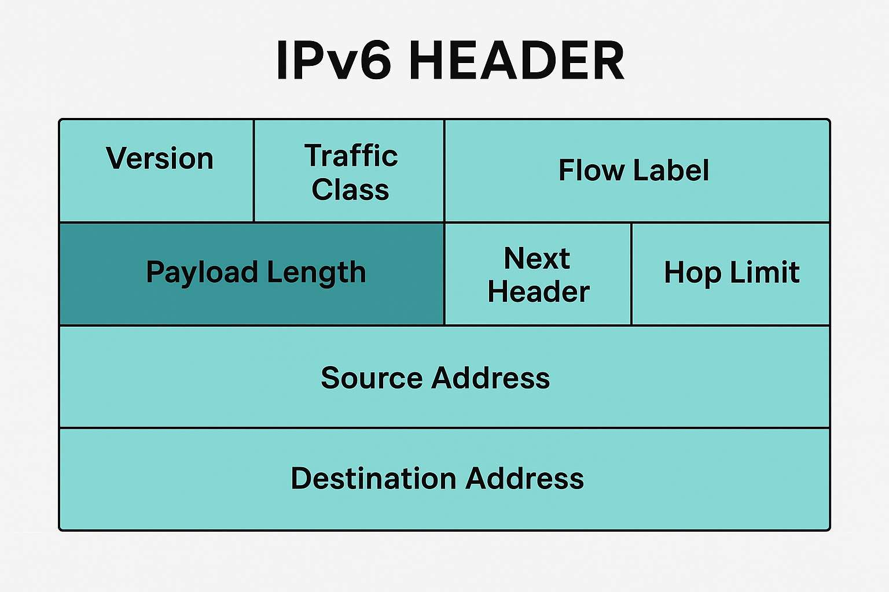
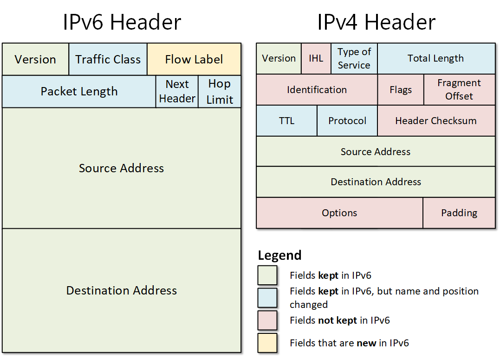
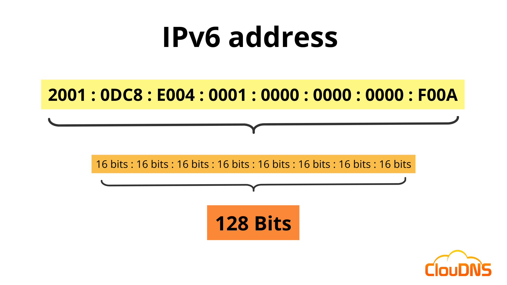
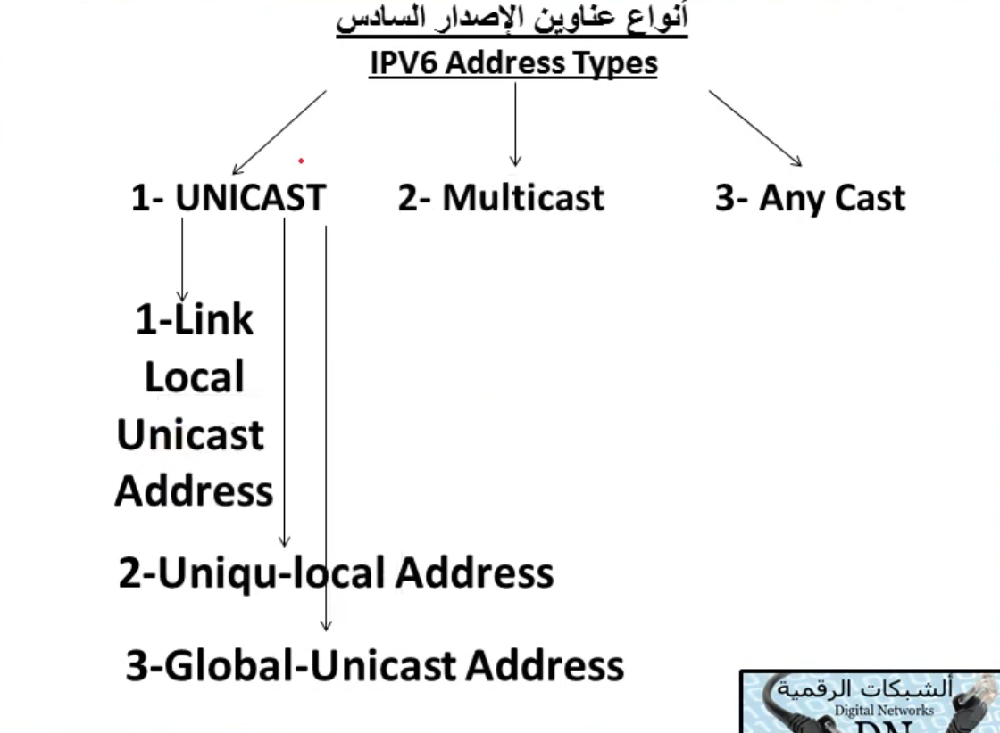
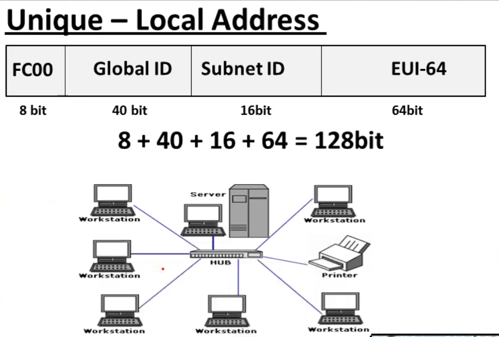
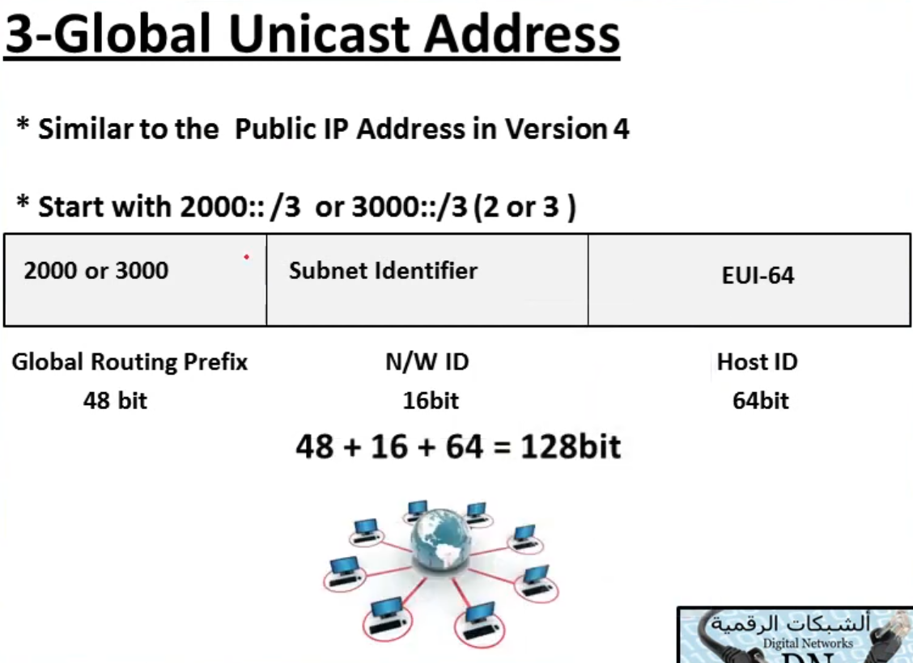
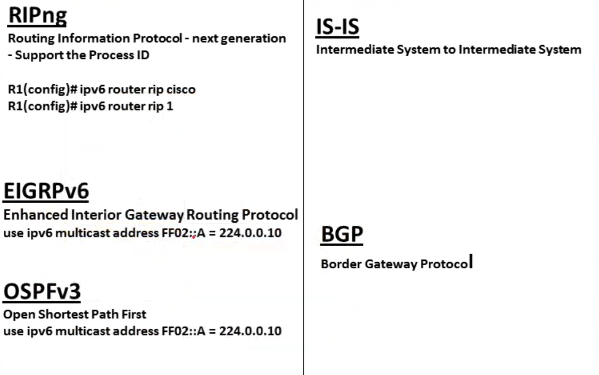

<div dir="rtl">

# 🌐 الموضوع الرابع عشر: بروتوكول الإصدار السادس (TCP/IPv6)

## 📑 جدول المحتويات

| # | القسم الرئيسي | المواضيع الفرعية |
|:---:|:---:|:---:|
| 1 | [مقدمة عن IPv6](#introduction) | [تعريف IPv6](#definition)<br>[لماذا احتجنا إلى IPv6؟](#why-ipv6)<br>[أهداف وفوائد IPv6](#goals-benefits)<br>[مميزات وعيوب IPv6](#pros-cons) |
| 2 | [مقارنة عامة بين IPv4 و IPv6](#ipv4-vs-ipv6-overview) | [الفرق في الحجم والتكوين](#size-structure)<br>[الفاصلة مقابل الأوكتيت](#separator-difference) |
| 3 | [هيكل الـ Header في IPv6](#ipv6-header) | [الشكل العام لهيدر IPv6](#header-overview)<br>[مقارنة تفصيلية بين حقول IPv4 و IPv6](#header-comparison)<br>[عمليات التجزئة والفرق بين الإصدارين](#fragmentation)<br>[Extension Headers](#extension-headers) |
| 4 | [عمليات إرسال البيانات وتغليفها](#data-encapsulation) | [الفرق بين تغليف البيانات في IPv4 و IPv6](#encapsulation-diff)<br>[العمليات الإضافية الجديدة في IPv6](#additional-processes)<br>[بديل ARP في IPv6 (NDP)](#ndp-vs-arp)<br>&nbsp;&nbsp;&nbsp;[مصطلح NS و NA و DAD](#dad-process)<br>&nbsp;&nbsp;&nbsp;[حالات عنوان IPv6](#address-states) |
| 5 | [بنية عنوان IPv6 وكتابته](#address-structure) | [صيغة العنوان المنطقي (128 بت)](#address-format)<br>[كتابة العنوان بالنظام الست عشري](#hex-writing)<br>[عدد الخانات والبتات والأوكتيدات](#segments-bits)<br>[قواعد اختصار العنوان](#shortening-rules)<br>[أخطاء شائعة في الاختصار](#common-mistakes) |
| 6 | [الـ Prefix بديل الـ Subnet](#prefix-concept) | [تعريف Prefix ومهامه](#prefix-definition)<br>[قيمة Prefix Value](#prefix-value)<br>[تحديد جزء الشبكة وجزء الأجهزة](#network-host-portion)<br>&nbsp;&nbsp;&nbsp;[مثال محسوب: تحديد Network Address](#network-address-example) |
| 7 | [أنواع عناوين IPv6](#address-types) | [نظرة عامة على الأنواع](#types-overview)<br>[عناوين Unicast](#unicast-addresses)<br>&nbsp;&nbsp;&nbsp;[Link-Local Unicast (APIPA)](#link-local)<br>&nbsp;&nbsp;&nbsp;[Unique Local Address (Private IP)](#unique-local-address)<br>&nbsp;&nbsp;&nbsp;[Global Unicast Address (Public IP)](#global-unicast-address)<br>[مقارنة شاملة بين أنواع Unicast](#unicast-comparison)<br>[Privacy Extensions (العناوين المؤقتة)](#privacy-extensions)<br>[عناوين Anycast](#anycast)<br>[عناوين Multicast](#multicast)<br>&nbsp;&nbsp;&nbsp;[Solicited-Node Multicast Address](#solicited-node)<br>[عناوين خاصة محجوزة](#special-addresses) |
| 8 | [عملية NAT في IPv6](#nat-ipv6) | — |
| 9 | [طرق توزيع عناوين IPv6](#assigning-methods) | [SLAAC](#slaac)<br>[DHCPv6 Stateful](#dhcpv6-stateful)<br>[DHCPv6 Stateless](#dhcpv6-stateless)<br>[العنوان الثابت Static](#static-assignment)<br>[اكتشاف DHCPv6 Server عبر Multicast](#dhcpv6-discovery) |
| 10 | [بروتوكولات IPv6](#ipv6-protocols) | [علاقة IPv6 بطبقات النموذج المرجعي](#ipv6-osi-layers)<br>[DNS في IPv6 (AAAA)](#dns-ipv6)<br>[بروتوكولات التوجيه في IPv6](#ipv6-routing-protocols) |
| 11 | [أوامر Cisco IOS الأساسية لـ IPv6](#cisco-ios-commands) | [تفعيل التوجيه بـ IPv6](#enable-ipv6-routing)<br>[تعيين عنوان يدوياً](#manual-address-config)<br>[تفعيل SLAAC على الواجهة](#enable-slaac)<br>[إعداد DHCPv6](#dhcpv6-config) |
| 12 | [الانتقال من IPv4 إلى IPv6](#ipv4-to-ipv6-transition) | [Dual Stack](#dual-stack)<br>[Tunneling](#tunneling)<br>[NAT64 / NAT-PT](#nat64-pt)<br>[تواصل الشبكات المختلطة](#mixed-communication) |
| 13 | [Mobile IPv6 (نبذة سريعة)](#mobile-ipv6) | — |
| 14 | [جدول ملخص شامل](#cheat-sheet) | — |

---

<h2 dir="rtl" align="right" id="introduction">1️⃣ مقدمة عن IPv6</h2>

<h3 dir="rtl" align="right" id="definition">📌 تعريف IPv6</h3>

<p dir="rtl" align="right">**IPv6 (Internet Protocol version 6)** هو الجيل الجديد من بروتوكول الإنترنت، اللي جه بعد **IPv4** عشان يحل المشاكل اللي ظهرت مع الوقت، وأهمها إن عدد عناوين IPv4 بقى مش كفاية للأجهزة المتصلة بالإنترنت في العالم كله.</p>

<p dir="rtl" align="right">IPv6 هو بروتوكول من طبقة الـ **Network Layer** (زي IPv4 بالظبط)، ومسؤول عن نفس المهام: تحديد هوية الجهاز على الشبكة (Logical Addressing)، وتحديد الطريق اللي هتتوجه بيه البيانات (Routing) من المصدر للوجهة.</p>

<p dir="rtl" align="right">الفرق الجوهري إن IPv6 بيستخدم عنوان بحجم <strong>128 bit</strong> بدل الـ 32 bit اللي في IPv4، وده بيدّي عدد عناوين ضخم جداً (تقريباً 340 تريليون تريليون تريليون عنوان).</p>

<h3 dir="rtl" align="right" id="why-ipv6">❓ لماذا احتجنا إلى IPv6؟ (المشاكل التي أدّت لظهوره)</h3>

<p dir="rtl" align="right">ظهور IPv6 مكانش رفاهية، كان ضرورة بسبب مجموعة مشاكل تراكمت مع IPv4:</p>

<ol dir="rtl">
<li><strong>نفاد عناوين IPv4 (IPv4 Address Exhaustion):</strong><br>
عدد عناوين IPv4 هو 2^32 ≈ 4.3 مليار عنوان بس، ومع الانفجار الهائل في عدد الأجهزة المتصلة بالإنترنت (موبايلات، أجهزة IoT، سيرفرات، شركات)، العدد ده بقى مش كافي خالص، وفعلياً اتخلصت عناوين IPv4 العامة الجديدة من سنين.</li>
<li><strong>الحل المؤقت (NAT) وليس الحل الجذري:</strong><br>
تقنية الـ <strong>NAT</strong> استخدمت كحل مؤقت عشان جهاز واحد بعنوان عام يقدر يشارك الإنترنت مع أجهزة كتير جوه شبكة خاصة، لكن NAT بيسبب مشاكل في بعض التطبيقات (زي الألعاب أونلاين، الـ VoIP، وبعض بروتوكولات الأمان اللي محتاجة اتصال مباشر End-to-End)، وبيعقّد شكل الشبكة.</li>
<li><strong>حجم جداول التوجيه (Routing Tables) الضخم:</strong><br>
عناوين IPv4 اتوزعت بشكل غير منظم على مدار السنين، فجداول التوجيه في الراوترات الأساسية على الإنترنت بقت ضخمة جداً وبطيئة في المعالجة.</li>
<li><strong>ضعف الأمان المدمج:</strong><br>
IPv4 اتصمم من الأساس من غير تفكير في الأمان (Security)، فالتشفير (زي IPSec) كان اختياري ويتضاف بعدين، مش جزء أساسي من البروتوكول.</li>
<li><strong>تعقيد عملية التوجيه (Header معقد):</strong><br>
هيدر IPv4 فيه حقول كتير بتخلي الراوتر ياخد وقت في معالجة كل باكيت (زي حقول التجزئة والـ Options)، وده بيقلل من كفاءة وسرعة التوجيه.</li>
<li><strong>صعوبة الإعداد التلقائي:</strong><br>
IPv4 محتاج DHCP إجباري عشان الجهاز ياخد عنوان تلقائي، مفيش آلية مدمجة في البروتوكول نفسه للـ Auto-Configuration.</li>
</ol>

<h3 dir="rtl" align="right" id="goals-benefits">🎯 أهداف وفوائد IPv6</h3>

<ul dir="rtl">
<li>**مساحة عناوين ضخمة** تكفي أي عدد أجهزة متصلة بالإنترنت لعشرات السنين القادمة.</li>
<li>**إلغاء الحاجة لـ NAT** بشكل كبير، لأن كل جهاز يقدر ياخد عنوان عام فريد (اتصال End-to-End حقيقي).</li>
<li>**هيدر أبسط وأسرع في المعالجة** (عدد حقول أقل وحجم ثابت)، وده بيقلل الحمل على الراوترات.</li>
<li>**أمان مدمج من الأساس**، لأن IPSec كان جزء أساسي في التصميم الأصلي لـ IPv6 (مش اختياري زي IPv4).</li>
<li>**إعداد تلقائي بدون DHCP إجباري**، عن طريق تقنية **SLAAC**.</li>
<li>**دعم أفضل للـ Multicast والـ QoS** (Quality of Service) عن طريق حقل Flow Label الجديد.</li>
<li>**تبسيط عملية التوجيه** عن طريق نقل عملية التجزئة (Fragmentation) من الراوترات للأجهزة المرسلة نفسها.</li>
</ul>

<h3 dir="rtl" align="right" id="pros-cons">⚖️ مميزات وعيوب IPv6</h3>

<p dir="rtl" align="right">**المميزات:**</p>

| الميزة | الشرح |
|:---:|:---:|
| مساحة عنونة ضخمة | 128 bit بدل 32 bit |
| هيدر مبسّط | معالجة أسرع في الراوترات |
| أمان مدمج | IPSec جزء أساسي من البروتوكول |
| Auto-Configuration | عن طريق SLAAC بدون الحاجة لـ DHCP إجباري |
| إلغاء الحاجة لـ NAT | اتصال مباشر End-to-End |
| دعم أفضل للـ Mobility والـ QoS | حقل Flow Label |

<p dir="rtl" align="right">**العيوب:**</p>

| العيب | الشرح |
|:---:|:---:|
| صعوبة التوافق مع IPv4 | محتاج تقنيات انتقالية (Dual Stack, Tunneling, NAT64) |
| صعوبة الحفظ والكتابة | العنوان طويل (128 bit) مقارنة بـ IPv4 |
| تكلفة الترقية | تحديث الأجهزة والبنية التحتية والتدريب |
| انتشار غير مكتمل عالمياً | لسه فيه شبكات ومواقع كتير شغالة بـ IPv4 فقط |
| مفيش Broadcast | بعض التطبيقات القديمة المعتمدة على Broadcast محتاجة تعديل لتستخدم Multicast |

---

<h2 dir="rtl" align="right" id="ipv4-vs-ipv6-overview">2️⃣ مقارنة عامة بين IPv4 و IPv6</h2>

<h3 dir="rtl" align="right" id="size-structure">📏 الفرق في الحجم والتكوين</h3>

| المقارنة | IPv4 | IPv6 |
|:---:|:---:|:---:|
| حجم العنوان | 32 bit | 128 bit |
| عدد العناوين | 2^32 ≈ 4.3 مليار | 2^128 (رقم فلكي) |
| عدد الأقسام (Segments) | 4 أوكتيدات | 8 خانات (Hextets) |
| حجم كل قسم | 8 bit (Octet) | 16 bit (Hextet) |
| نظام الكتابة | عشري (Decimal) | ست عشري (Hexadecimal) |
| الفاصل بين الأقسام | نقطة (.) | نقطتين رأسيتين (:) |
| مثال | 192.168.1.1 | 2001:0DB8:E004:0001:0000:0000:0000:F00A |

<h3 dir="rtl" align="right" id="separator-difference">🔹 الفرق بين الفاصلة والأوكتيت في الإصدارين</h3>

<p dir="rtl" align="right">في **IPv4** العنوان بيتقسم لأربع أجزاء (Octets)، كل جزء 8 bit، ومفصولين عن بعض بـ **نقطة (.)**، والقيمة بتتكتب بالنظام العشري من 0 لـ 255.</p>

<p dir="rtl" align="right">في **IPv6** العنوان بيتقسم لثمن أجزاء (Hextets/Segments)، كل جزء 16 bit، ومفصولين عن بعض بـ **نقطتين رأسيتين (:)**، والقيمة بتتكتب بالنظام الست عشري (Hexadecimal) من 0000 لـ FFFF.</p>

> 💡 **ملاحظة مهمة:** الأوكتيت (Octet) مصطلح خاص بـ IPv4 لأنه 8 bit، أما في IPv6 المصطلح الصحيح للقسم هو **Hextet أو Segment** لأنه 16 bit، مش أوكتيت.

---

<h2 dir="rtl" align="right" id="ipv6-header">3️⃣ هيكل الـ Header في IPv6</h2>

<h3 dir="rtl" align="right" id="header-overview">🧩 الشكل العام لهيدر IPv6</h3>

<div align="center">

<br>
<em>الشكل العام لحقول هيدر IPv6</em>
</div>

<p dir="rtl" align="right">هيدر IPv6 اتصمم عشان يكون **بسيط وثابت الحجم** (40 byte بس)، وده بيسهّل ويسرّع عملية معالجة الباكيت في الراوترات، على عكس هيدر IPv4 اللي حجمه متغير وفيه حقول كتير (زي Options) بتبطّئ المعالجة.</p>

<h3 dir="rtl" align="right" id="header-comparison">🔍 مقارنة تفصيلية بين حقول IPv4 Header و IPv6 Header</h3>

<div align="center">

<br>
<em>مقارنة بين حقول هيدر IPv4 وهيدر IPv6 (الحقول المحتفظ بها، المتغيرة، المحذوفة، والجديدة)</em>
</div>

<p dir="rtl" align="right">جدول شرح كل حقل من حقول **IPv6 Header**:</p>

| الحقل | الحجم | الشرح |
|:---:|:---:|:---:|
| **Version** | 4 bit | رقم الإصدار = 6، نفس فكرة الحقل في IPv4 |
| **Traffic Class** | 8 bit | بديل حقل **Type of Service (ToS)** في IPv4، بيحدد أولوية الباكيت (QoS) |
| **Flow Label** | 20 bit | حقل **جديد كلياً** مش موجود في IPv4، بيستخدم لتحديد الباكيتات اللي تابعة لنفس التدفق (Flow) عشان الراوتر يعاملها بنفس الأولوية والمسار (مفيد جداً للـ Real-time traffic زي الصوت والفيديو) |
| **Payload Length** | 16 bit | بديل حقل **Total Length**، لكن بيحسب حجم البيانات (Payload) بس من غير الهيدر نفسه (لأن هيدر IPv6 حجمه ثابت 40 byte أصلاً) |
| **Next Header** | 8 bit | بديل حقل **Protocol** في IPv4، بيحدد نوع البروتوكول اللي جاي بعد الهيدر (TCP, UDP...) أو بيشاور على وجود **Extension Header** تاني |
| **Hop Limit** | 8 bit | بديل حقل **TTL (Time To Live)**، نفس الفكرة بالظبط: عدد القفزات (Hops) المسموح بيها قبل ما الباكيت يترفض |
| **Source Address** | 128 bit | عنوان المرسل |
| **Destination Address** | 128 bit | عنوان المستقبل |

<p dir="rtl" align="right">**الحقول اللي اتحذفت تماماً من IPv6 مقارنة بـ IPv4:**</p>

| الحقل المحذوف | السبب |
|:---:|:---:|
| Header Length (IHL) | مش محتاجينه لأن هيدر IPv6 حجمه ثابت دايماً (40 byte) |
| Identification, Flags, Fragment Offset | التجزئة (Fragmentation) بقت مسؤولية الجهاز المرسل بس، مش الراوترات (تفاصيل أكتر في القسم الجاي) |
| Header Checksum | اتشالت لتقليل الحمل على الراوتر؛ التحقق من الأخطاء بقى مسؤولية طبقات أعلى (زي TCP) وطبقة الـ Data Link |
| Options + Padding | استُبدلت بمفهوم أفضل وأكثر مرونة اسمه **Extension Headers** |

<h3 dir="rtl" align="right" id="fragmentation">✂️ عمليات التجزئة والفرق بين الإصدارين (Fragment Offset)</h3>

<p dir="rtl" align="right">في **IPv4**: لو حجم البيانات المرسلة أكبر من الـ **MTU** (Maximum Transmission Unit) بتاع الشبكة، الراوتر نفسه كان بيقوم بعملية **Fragmentation** (تقسيم الباكيت لأجزاء أصغر)، وكانت بتستخدم حقول **Identification** (عشان تعرف الأجزاء تابعة لأنهي باكيت أصلي) و**Flags** (زي More Fragments) و**Fragment Offset** (عشان يحدد ترتيب كل جزء عند إعادة التجميع في الجهاز المستقبل).</p>

<p dir="rtl" align="right">في **IPv6**: العملية دي **اتشالت تماماً من الراوترات**. الراوترات في IPv6 **مسموحلهاش تعمل Fragmentation خالص**. بدل كده:</p>

<ul dir="rtl">
<li>الجهاز المرسل (Source Host) هو المسؤول عن اكتشاف أصغر MTU على طول المسار للوجهة، عن طريق عملية اسمها **Path MTU Discovery (PMTUD)**.</li>
<li>الجهاز المرسل هو اللي بيقسّم البيانات من الأساس لأحجام تتوافق مع الـ MTU، قبل ما يبعتها.</li>
<li>لو باكيت وصل لراوتر وكان أكبر من MTU الخاص بالوصلة الجاية، الراوتر مش هيقسّمه، هيرفضه ويبعت رسالة **ICMPv6 "Packet Too Big"** للمرسل عشان يقلل حجم الباكيتات.</li>
<li>ده خلى حقول Identification و Flags و Fragment Offset **مش موجودة خالص** في الهيدر الأساسي، وبقت تتحط (لو احتجناها) جوه **Extension Header** خاص اسمه Fragment Extension Header.</li>
</ul>

> 💡 الفايدة: تقليل الحمل على الراوترات (اللي وظيفتها الأساسية التوجيه بسرعة، مش المعالجة)، ونقل هذا العبء لطرفي الاتصال بس.

<p dir="rtl" align="right">**الـ Default MTU في IPv6:**</p>
<p dir="rtl" align="right">كل وصلة (Link) في IPv6 لازم تدعم **MTU لا يقل عن 1280 byte** كحد أدنى إجباري حسب المعيار (مقارنة بـ IPv4 اللي أقل MTU مضمون فيه كان 576 byte بس). لو وصلة معينة MTU بتاعها أقل من كده لأي سبب، لازم تتعمل عندها عملية تجزئة على مستوى طبقة الـ Link نفسها (Link-Layer Fragmentation)، مش على مستوى IP. الحد الأدنى الكبير ده (1280) بيقلل جداً من احتمالية الحاجة لـ Path MTU Discovery من الأساس في أغلب الشبكات الحديثة.</p>

<h3 dir="rtl" align="right" id="extension-headers">🧱 استخدامات Extension Headers</h3>

<p dir="rtl" align="right">بدل ما هيدر IPv6 يبقى محمّل بحقول Options زي IPv4 (اللي بتبطّئ المعالجة حتى لو مش مستخدمة)، IPv6 قدّم فكرة **Extension Headers**: هيدرات إضافية اختيارية، بتتحط بين الهيدر الأساسي وبيانات طبقة النقل (TCP/UDP)، ومترتبة على هيئة **سلسلة (Chain)** باستخدام حقل **Next Header**.</p>

<ul dir="rtl">
<li>لو مفيش Extension Headers، حقل **Next Header** بيشاور مباشرة على البروتوكول (TCP=6, UDP=17...).</li>
<li>لو فيه Extension Header، حقل Next Header في الهيدر الأساسي بيشاور على نوع أول Extension Header، وكل Extension Header بيه حقل Next Header بتاعه كمان بيشاور على اللي بعده، وهكذا لحد ما توصل لبيانات طبقة النقل.</li>
</ul>

<p dir="rtl" align="right">أشهر أنواع الـ Extension Headers:</p>

| النوع | الوظيفة |
|:---:|:---:|
| Hop-by-Hop Options | معلومات لازم كل راوتر في الطريق يفحصها |
| Routing Header | تحديد مسار معين يمر بيه الباكيت |
| Fragment Header | تُستخدم فقط من الجهاز المرسل عند الحاجة للتجزئة |
| Authentication Header (AH) | التحقق من صحة وسلامة الباكيت (جزء من IPSec) |
| Encapsulating Security Payload (ESP) | تشفير البيانات (جزء من IPSec) |
| Destination Options | معلومات إضافية تُفحص فقط من الجهاز المستقبل النهائي |

> ✅ الميزة الكبرى: **المرونة** — تقدر تضيف وظائف جديدة للبروتوكول في المستقبل عن طريق تعريف Extension Header جديد، من غير ما تغيّر في تصميم الهيدر الأساسي نفسه.

---

<h2 dir="rtl" align="right" id="data-encapsulation">4️⃣ عمليات إرسال البيانات وتغليفها في IPv6</h2>

<h3 dir="rtl" align="right" id="encapsulation-diff">📦 الفرق بين تغليف البيانات في IPv4 و IPv6</h3>

<p dir="rtl" align="right">المبدأ العام للتغليف (Encapsulation) واحد في الإصدارين: البيانات بتنزل من الطبقات العليا لحد ما توصل لطبقة الـ Network فيتحط عليها هيدر IP، وبعدين لطبقة الـ Data Link فيتحط عليها هيدر وتريلر Frame.</p>

<p dir="rtl" align="right">الفرق الجوهري:</p>

| النقطة | IPv4 | IPv6 |
|:---:|:---:|:---:|
| مكان التجزئة | ممكن تحصل عند أي راوتر في الطريق | تحصل فقط عند الجهاز المرسل (End Host) |
| حجم الهيدر | متغير (20-60 byte) | ثابت (40 byte دايماً) |
| الحقول الإضافية | جوه الهيدر نفسه (Options) | خارج الهيدر الأساسي (Extension Headers منفصلة) |
| الـ Checksum | موجود في هيدر IPv4 | غير موجود، الاعتماد على طبقة Data Link و Transport |

<h3 dir="rtl" align="right" id="additional-processes">➕ العمليات الإضافية في IPv6</h3>

<p dir="rtl" align="right">IPv6 مش مجرد عنونة بحجم أكبر، جاله معاه بروتوكول كامل جديد اسمه **Neighbor Discovery Protocol (NDP)** بيعتمد على رسائل **ICMPv6**، وبيقوم بمهام كتير كانت متفرقة في IPv4 على أكتر من بروتوكول (ARP, ICMP Router Discovery, ICMP Redirect):</p>

<ul dir="rtl">
<li>اكتشاف الجيران على نفس الشبكة (Neighbor Discovery).</li>
<li>التأكد من عدم تكرار العنوان (Duplicate Address Detection - DAD).</li>
<li>اكتشاف الراوترات المتاحة على الشبكة (Router Discovery).</li>
<li>إعادة التوجيه (Redirect) لو فيه مسار أفضل.</li>
</ul>

<h3 dir="rtl" align="right" id="ndp-vs-arp">🔁 بديل ARP في IPv6 (NDP)</h3>

<p dir="rtl" align="right">في **IPv4**، لما جهاز يحتاج يعرف الـ MAC Address بتاع جهاز تاني على نفس الشبكة، بيستخدم بروتوكول **ARP** (Address Resolution Protocol) اللي بيعتمد على **Broadcast**.</p>

<p dir="rtl" align="right">في **IPv6**، مفيش Broadcast خالص (اتلغى تماماً)، فاتلغى معاه ARP، واستُبدل بمفهوم اسمه **Neighbor Discovery Protocol (NDP)**، اللي بيستخدم رسائل **ICMPv6** بدل الـ Broadcast، وبيعتمد على **Multicast** بدل منه. أهم رسائل NDP:</p>

| الرسالة | الاسم الكامل | الوظيفة |
|:---:|:---:|:---:|
| **NS** | Neighbor Solicitation | رسالة بتتبعت (بالـ Multicast) عشان تسأل "مين معاه العنوان ده؟" — هي البديل المباشر لرسالة ARP Request |
| **NA** | Neighbor Advertisement | الرد على رسالة NS، وفيها الـ MAC Address بتاع الجهاز صاحب العنوان — البديل المباشر لـ ARP Reply |
| **RS** | Router Solicitation | الجهاز بيسأل "فيه راوتر على الشبكة دي؟" |
| **RA** | Router Advertisement | الراوتر بيرد ويبعت معلومات الشبكة (زي الـ Prefix) للأجهزة، وأساس عملية SLAAC |

<h4 dir="rtl" align="right" id="dad-process">مصطلح NS و NA و DAD — عملية التأكد من عدم تكرار العنوان</h4>

<p dir="rtl" align="right">قبل ما أي جهاز يستخدم عنوان IPv6 (خصوصاً Link-Local) بشكل نهائي، بيعمل عملية اسمها **Duplicate Address Detection (DAD)**، وبتتم كالآتي:</p>

<ol dir="rtl">
<li>الجهاز بيولّد عنوان IPv6 مبدئي (Tentative Address).</li>
<li>بيبعت رسالة <strong>NS (Neighbor Solicitation)</strong> على الـ Multicast address الخاص بالعنوان ده، وبيسأل فعلياً "فيه حد شغال بالعنوان ده؟"، لكن المرسل نفسه هو صاحب العنوان (مش بيسأل عن حد تاني).</li>
<li>لو محدش رد بـ <strong>NA (Neighbor Advertisement)</strong> خلال فترة زمنية معينة، الجهاز يبقى متأكد إن العنوان <strong>فريد (Unique)</strong> ومش متكرر، ويقدر يستخدمه بشكل نهائي.</li>
<li>لو حد رد بـ NA، يبقى العنوان متكرر (Duplicate)، والجهاز مضطر يولّد عنوان تاني أو يوقف الإعداد التلقائي ويبلغ بمشكلة.</li>
</ol>

<h4 dir="rtl" align="right" id="address-states">🔄 حالات عنوان IPv6 (Address States)</h4>

<p dir="rtl" align="right">خلال دورة حياة أي عنوان IPv6 (خصوصاً المولّد تلقائياً عن طريق SLAAC)، بيمر بمجموعة حالات:</p>

| الحالة | الشرح |
|:---:|:---:|
| **Tentative** | العنوان لسه بيتفحص عن طريق DAD، ومينفعش يُستخدم في أي اتصال فعلي لحد ما يتأكد إنه فريد |
| **Preferred** | العنوان نجح في DAD وبقى **صالح للاستخدام الكامل**، سواء للإرسال أو الاستقبال |
| **Deprecated** | العنوان لسه شغال ويقدر يستقبل ويرسل، لكنه **قارب على الانتهاء** (اقترب من نهاية Valid Lifetime بتاعه، زي حالة SLAAC مع Router Advertisement قديم)، والنظام بيبدأ يفضّل عنوان جديد بدله للاتصالات الجديدة |
| **Invalid** | العنوان انتهت صلاحيته تماماً (خلص الـ Lifetime بتاعه) ومبقاش يصلح للاستخدام خالص |

> 💡 الحالتين Deprecated و Invalid مرتبطين بمفهوم **Lifetime** اللي بيتحدد في رسالة **RA (Router Advertisement)** أثناء SLAAC، عشان الشبكة تقدر تتحكم في صلاحية العناوين وتجدّدها بشكل دوري بدون تدخل يدوي.

---

<h2 dir="rtl" align="right" id="address-structure">5️⃣ بنية عنوان IPv6 وكتابته</h2>

> 💡 نفس مبادئ الـ IP Addressing والـ Subnetting اللي اتشرحت في [الموضوع الحادي عشر: IP Addressing and IP Subnetting](11-IP-Addressing-and-IP-Subnetting.md) بتتطبق هنا بمنطق مشابه (تقسيم Network/Host Portion)، لكن بحجم عنوان وأرقام مختلفة تماماً (128 bit بدل 32 bit).

<h3 dir="rtl" align="right" id="address-format">🔢 صيغة العنوان المنطقي (128 بت)</h3>

<div align="center">

<br>
<em>بنية عنوان IPv6 - 128 بت مقسّمة على 8 خانات، كل خانة 16 بت</em>
</div>

<p dir="rtl" align="right">عنوان IPv6 بيتكوّن من **128 bit**، مقسّمة لـ **8 خانات (Hextets/Segments)**، كل خانة منهم **16 bit**، ومفصولين عن بعض بـ **نقطتين رأسيتين (:)**.</p>

$$8 \times 16 = 128 \text{ bit}$$

<p dir="rtl" align="right">كل خانة بتتكتب بالنظام الست عشري (Hexadecimal)، يعني ممكن تحتوي على أرقام من 0 لـ 9 وحروف من A لـ F.</p>

<p dir="rtl" align="right">مثال على عنوان كامل:</p>

```
2001:0DC8:E004:0001:0000:0000:0000:F00A
```

<h3 dir="rtl" align="right" id="hex-writing">🔡 كتابة العنوان بالنظام الست عشري</h3>

<p dir="rtl" align="right">النظام الست عشري (Hexadecimal) بيمثّل كل 4 bits برمز واحد (0-9 و A-F)، وبما إن كل خانة في IPv6 حجمها 16 bit، يبقى كل خانة بتتمثل بـ **4 رموز ست عشرية** (لأن 4 × 4 bit = 16 bit).</p>

<p dir="rtl" align="right">جدول تحويل سريع:</p>

| Binary (4 bit) | Hexadecimal |
|:---:|:---:|
| 0000 | 0 |
| 0001 | 1 |
| 1001 | 9 |
| 1010 | A |
| 1111 | F |

<h3 dir="rtl" align="right" id="segments-bits">🧮 عدد الخانات وعدد البت وعدد الرموز داخل كل خانة</h3>

| العنصر | القيمة |
|:---:|:---:|
| إجمالي حجم العنوان | 128 bit |
| عدد الخانات (Hextets) | 8 خانات |
| حجم كل خانة | 16 bit |
| عدد الرموز الست عشرية في كل خانة | 4 رموز (Hex Digits) |
| الفاصل بين الخانات | نقطتين رأسيتين (:) |

<h3 dir="rtl" align="right" id="shortening-rules">✂️ قواعد اختصار عنوان IPv6</h3>

<p dir="rtl" align="right">عشان عنوان IPv6 طويل جداً (32 رمز)، فيه قوانين رسمية لاختصار طريقة كتابته، وهي:</p>

<p dir="rtl" align="right">**القاعدة الأولى: حذف الأصفار البادئة (Leading Zeros) في كل خانة**</p>

<p dir="rtl" align="right">كل خانة فيها أصفار في بدايتها من الشمال، تقدر تحذفها (بشرط يفضل رقم واحد على الأقل في الخانة).</p>

<p dir="rtl" align="right">مثال:</p>
```
0DC8  →  DC8
0001  →  1
0000  →  0   (لازم يفضل صفر واحد على الأقل)
```

<p dir="rtl" align="right">**القاعدة الثانية: اختصار الخانات المتتالية اللي كلها أصفار بـ (::)**</p>

<p dir="rtl" align="right">لو فيه **خانة أو أكتر متتالية** كل قيمتها صفر بالكامل (0000)، تقدر تختصرها كلها برمز **نقطتين رأسيتين متتاليتين (::)**، لكن بشرط مهم جداً:</p>

> ⚠️ **الرمز (::) مينفعش يتكرر غير مرة واحدة بس في العنوان كله.** لو استخدمته أكتر من مرة، العنوان يبقى غامض (Ambiguous) ومش هيعرف الجهاز يحسب بالظبط كام خانة اتحذفت في كل مكان.

<p dir="rtl" align="right">**مثال كامل يجمع القاعدتين:**</p>

<p dir="rtl" align="right">العنوان الأصلي:</p>
```
2001:0DC8:E004:0001:0000:0000:0000:F00A
```

<p dir="rtl" align="right">الخطوة 1 (حذف الأصفار البادئة من كل خانة):</p>
```
2001:DC8:E004:1:0:0:0:F00A
```

<p dir="rtl" align="right">الخطوة 2 (اختصار الخانات المتتالية الصفرية بـ ::):</p>
```
2001:DC8:E004:1::F00A
```

<p dir="rtl" align="right">**مثال تاني (Link-Local Address):**</p>

<p dir="rtl" align="right">الأصلي:</p>
```
FE80:0000:0000:0000:0250:56FF:FEBE:64F0
```

<p dir="rtl" align="right">بعد الاختصار:</p>
```
FE80::250:56FF:FEBE:64F0
```

<h3 dir="rtl" align="right" id="common-mistakes">🚫 أخطاء شائعة في عملية الاختصار</h3>

| الخطأ | مثال غلط | الصح |
|:---:|:---:|:---:|
| استخدام (::) أكتر من مرة في نفس العنوان | `2001::DC8::F00A` ❌ (العنوان بقى غامض، الجهاز مش هيعرف كام خانة اتحذفت في كل (::)) | `2001:0:0:DC8:0:0:0:F00A` → `2001::DC8:0:0:0:F00A` (استخدام (::) مرة واحدة بس، للمجموعة الأطول من الأصفار) |
| اختصار مجموعة قصيرة بدل الأطول | العنوان `2001:0:0:DC8:0:0:0:F00A` فيه مجموعتين أصفار: الأولى خانتين (بعد 2001) والتانية 3 خانات (قبل F00A)؛ اختصار المجموعة القصيرة غلط: `2001::DC8:0:0:0:F00A` | لازم تختصر **أطول مجموعة أصفار متتالية** دايماً: `2001:0:0:DC8::F00A` |
| حذف كل الأصفار من الخانة خالص (تسييب الخانة فاضية بدون رمز) | `2001:DC8::` ثم فاضي بدل الرقم | لازم يفضل رقم واحد على الأقل في الخانة، الصفر المفرد "0" مينفعش يتحذف تماماً لو مش جزء من (::) |
| اختصار خانة واحدة بس بـ (::) بدل ما تسيبها برقمها | `2001:DC8:E004:1::0:F00A` | لو الخانة واحدة بس فاضية، الأفضل تسيبها "0" عادي، والـ (::) يتستخدم لمجموعة خانات متتالية مش خانة واحدة (رغم إنه تقنياً مسموح لكنه مش الأفضل أسلوبياً) |
| نسيان إن (::) بتمثل خانة أو أكتر حسب طول العنوان | التعامل معاها وكأنها دايماً بتعوّض خانة واحدة بس | لازم تحسب عدد الخانات الموجودة فعلياً وتطرحها من 8 عشان تعرف كام خانة اتخفت جوه الـ (::) |

> 💡 **قاعدة ذهبية:** لو في أكتر من مجموعة أصفار متتالية في العنوان، الاختصار بـ (::) بيتطبق على **أطول مجموعة** بس، والباقي بيتكتب عادي بدون حذف الصفر المفرد. لو المجموعتين بنفس الطول بالظبط، الاختيار بيقع على **أول مجموعة** من الشمال حسب المعيار الرسمي (RFC 5952).

---

<h2 dir="rtl" align="right" id="prefix-concept">6️⃣ الـ Prefix بديل الـ Subnet</h2>

<h3 dir="rtl" align="right" id="prefix-definition">📐 تعريف Prefix ومهامه</h3>

<p dir="rtl" align="right">في IPv4 كنا بنستخدم **Subnet Mask** (زي 255.255.255.0) عشان نحدد جزء الشبكة من جزء الأجهزة. في IPv6، المصطلح المستخدم هو **Prefix**، ومفيش حاجة اسمها Subnet Mask بالمعنى التقليدي، بس فيه **Prefix Length** بيعبّر عن نفس الفكرة.</p>

<p dir="rtl" align="right">الـ Prefix بيحدد **عدد البتات** (من الشمال) المخصصة لجزء الشبكة (Network Portion)، والباقي من الـ 128 bit بيبقى مخصص لجزء الجهاز (Host/Interface ID).</p>

<h3 dir="rtl" align="right" id="prefix-value">🔢 قيمة Prefix Value</h3>

<p dir="rtl" align="right">بيتكتب الـ Prefix بنفس أسلوب CIDR في IPv4، يعني بعد العنوان بنحط **شرطة مائلة (/)** وبعدها عدد البتات:</p>

```
2001:0DC8:E004:0001::/64
```

<p dir="rtl" align="right">هنا الـ **/64** معناها إن أول 64 bit (يعني أول 4 خانات) هي جزء الشبكة، والـ 64 bit الباقية (آخر 4 خانات) هي جزء الجهاز (Interface ID).</p>

<h3 dir="rtl" align="right" id="network-host-portion">🖧 تحديد جزء الشبكة وجزء الأجهزة</h3>

<ul dir="rtl">
<li>الأكتر شيوعاً واستخداماً هو **Prefix /64**، لأن IPv6 اتصمم بحيث جزء الـ Interface ID يكون دايماً **64 bit** عشان يستوعب تقنية **EUI-64** (اللي بتولّد الجزء ده من الـ MAC Address).</li>
<li>يعني في أغلب الشبكات: أول 64 bit = Network Portion (Global Routing Prefix + Subnet ID)، وآخر 64 bit = Host Portion (Interface ID).</li>
</ul>

<p dir="rtl" align="right">مثال:</p>

```
Prefix:  2001:0DC8:E004:0001::/64
Network Portion (64 bit): 2001:0DC8:E004:0001
Host Portion (64 bit):    يتحدد تلقائياً (EUI-64) أو يدوياً
```

<h4 dir="rtl" align="right" id="network-address-example">🧮 مثال محسوب كامل: تحديد عنوان الشبكة (Network Address)</h4>

<p dir="rtl" align="right">في IPv4 كنا بنحدد عنوان الشبكة عن طريق عملية **AND** بين العنوان والـ Subnet Mask. في IPv6 الفكرة أبسط بكتير لأن الـ Prefix دايماً بيقع على حدود الخانة (Hextet Boundary) في أغلب الحالات العملية (زي /64، /48، /32)، فمش محتاجين نعمل عمليات AND على مستوى البت يدوياً غالباً — بس نحدد عدد الخانات الكاملة اللي داخلة في الـ Prefix ونصفّر الباقي.</p>

<p dir="rtl" align="right">**مثال 1: عنوان جهاز `2001:0DC8:E004:0001:250:56FF:FEBE:64F0` بـ Prefix `/64`**</p>

<p dir="rtl" align="right">الخطوات:</p>

<ol dir="rtl">
<li><strong>احسب عدد الخانات الكاملة اللي داخلة في الـ Network Portion:</strong><br>
$$64 \div 16 = 4 \text{ خانات}$$<br>
يعني أول <strong>4 خانات</strong> (من أصل 8) هي جزء الشبكة، والـ 4 خانات الباقية هي جزء الجهاز.</li>
<li><strong>خد أول 4 خانات من العنوان زي ما هي، وصفّر باقي الخانات:</strong>

```
العنوان الكامل:        2001:0DC8:E004:0001:0250:56FF:FEBE:64F0
                        └────── Network (64bit) ──────┘└────── Host (64bit) ──────┘
عنوان الشبكة (Network Address): 2001:0DC8:E004:0001:0000:0000:0000:0000
مختصراً:                        2001:0DC8:E004:0001::
```
</li>
</ol>

<p dir="rtl" align="right">**مثال 2: نفس الفكرة بـ Prefix مختلف `/48`**</p>

<p dir="rtl" align="right">نفس العنوان: `2001:0DC8:E004:0001:0250:56FF:FEBE:64F0/48`</p>

<ol dir="rtl">
<li>عدد الخانات الداخلة في الشبكة: $$48 \div 16 = 3 \text{ خانات}$$</li>
<li>خد أول 3 خانات بس، وصفّر الباقي (5 خانات):

```
عنوان الشبكة: 2001:0DC8:E004:0000:0000:0000:0000:0000
مختصراً:       2001:0DC8:E004::
```
</li>
</ol>

<p dir="rtl" align="right">**مثال 3: لما الـ Prefix مايقعش على حدود خانة كاملة (زي /60)**</p>

<p dir="rtl" align="right">هنا لازم شغل على مستوى البت جوه الخانة نفسها، بنفس فكرة الـ AND في IPv4:</p>

```
Prefix: 2001:0DC8:E004:0001::/60
```

<ul dir="rtl">
<li>أول 3 خانات كاملة (48 bit) داخلة كاملة في الشبكة.</li>
<li>الخانة الرابعة (`0001`) مقسومة: أول 4 bits منها (60 - 48 = 12 bit، يبقى محتاجين 4 bits كمان من الخانة الرابعة عشان نوصل لـ 60) داخلة في الشبكة، والـ 12 bit الباقية من نفس الخانة داخلة في جزء الجهاز.</li>
<li>الخانة `0001` بالـ Binary: `0000 0000 0000 0001`</li>
<li>أول 4 bits منها (`0000`) بتفضل زي ما هي، والباقي (`000000000001`) بيتصفّر → الخانة تبقى `0000`</li>
</ul>

```
عنوان الشبكة: 2001:0DC8:E004:0000:0000:0000:0000:0000
مختصراً:       2001:0DC8:E004::/60
```

> 💡 **الخلاصة:** لو الـ Prefix مضاعف لـ 16 (زي /16, /32, /48, /64, /80...)، العملية بسيطة جداً: خد عدد الخانات (Prefix ÷ 16) زي ما هي وصفّر الباقي. لو مش مضاعف لـ 16، لازم تنزل على مستوى البت جوه الخانة اللي الـ Prefix بيقطعها في المنتصف، بنفس منطق الـ AND.

---

<h2 dir="rtl" align="right" id="address-types">7️⃣ أنواع عناوين IPv6</h2>

<h3 dir="rtl" align="right" id="types-overview">🗺️ نظرة عامة على الأنواع</h3>

<div align="center">

<br>
<em>الأنواع الرئيسية لعناوين IPv6</em>
</div>

<p dir="rtl" align="right">عناوين IPv6 بتتقسم لثلاث فئات رئيسية:</p>

| النوع | الوظيفة | المكافئ في IPv4 |
|:---:|:---:|:---:|
| **Unicast** | عنوان لجهاز واحد بعينه | Unicast |
| **Multicast** | عنوان لمجموعة أجهزة مشتركة في نفس الـ Group | Multicast (لكن IPv6 بيستخدمه أكتر بكتير، لأن Broadcast اتلغى تماماً) |
| **Anycast** | نفس العنوان بيتحط على أكتر من جهاز/سيرفر، والباكيت بيوصل لأقرب واحد منهم | مفيش مكافئ مباشر في IPv4 |

> ⚠️ **ملحوظة مهمة:** عناوين **Broadcast اتلغت تماماً** في IPv6، ووظيفتها اتوزعت بين Multicast (للإرسال لمجموعة) و Anycast (للإرسال لأقرب سيرفر من مجموعة).

<p dir="rtl" align="right">النوع **Unicast** نفسه بينقسم لتلات أنواع فرعية:</p>

<ol dir="rtl">
<li>Link-Local Unicast Address (APIPA)</li>
<li>Unique Local Address (Private IP)</li>
<li>Global Unicast Address (Public IP)</li>
</ol>

<h3 dir="rtl" align="right" id="unicast-addresses">1️⃣ عناوين Unicast</h3>

<h4 dir="rtl" align="right" id="link-local">A - Link-Local Unicast Address = APIPA</h4>

<p dir="rtl" align="right">**التعريف:** عنوان بيتولّد **تلقائياً** على كل واجهة شبكة (Interface) بمجرد تفعيلها، حتى لو مفيش راوتر أو DHCP على الشبكة. وهو المكافئ المباشر لعنوان **APIPA** (169.254.x.x) في IPv4.</p>

<p dir="rtl" align="right">**طريقة التكوين:** الجهاز بيولّد العنوان ده تلقائياً بدمج:</p>

<ul dir="rtl">
<li>بادئة ثابتة دايماً: **FE80::/10**</li>
<li>جزء الـ Interface ID (آخر 64 bit)، وغالباً بيتولّد من الـ **MAC Address** باستخدام تقنية **EUI-64**.</li>
</ul>

<p dir="rtl" align="right">**مثال على شكل العنوان:**</p>
```
FE80::250:56FF:FEBE:64F0
```

<p dir="rtl" align="right">**اختصاره وبدايته:** دايماً بيبدأ بـ `FE80` (البادئة الكاملة هي `FE80::/10`، يعني أول 10 bits ثابتة).</p>

<p dir="rtl" align="right">**أقسامه:**</p>

| الجزء | الحجم | المصدر |
|:---:|:---:|:---:|
| البادئة | 10 bit ثابتة (FE80::/10) | معيار ثابت |
| Interface ID | 64 bit | من MAC Address عن طريق EUI-64 (أو رقم عشوائي في بعض الأنظمة الحديثة لأسباب خصوصية) |

<p dir="rtl" align="right">**استخداماته:**</p>

<ul dir="rtl">
<li>التواصل بين الأجهزة الموجودة على **نفس الشبكة المحلية (Same Link)** فقط، ومينفعش يتوجّه (Routed) خارج الشبكة دي خالص.</li>
<li>أساسي لعمليات **NDP** (زي NS, NA, RS, RA).</li>
<li>بيتولد على **كل** واجهة شبكة تلقائياً، حتى لو الجهاز عنده عناوين تانية (Global/ULA).</li>
</ul>

> 💡 كل جهاز بيقدر يبقى ليه أكتر من عنوان IPv6 على نفس الواجهة في نفس الوقت (Link-Local + ULA + Global مثلاً)، على عكس IPv4 اللي كل Interface بياخد عنوان واحد بس عادةً.

<h4 dir="rtl" align="right" id="unique-local-address">B - Unique Local Address (ULA) = Private IP</h4>

<div align="center">

<br>
<em>بنية عنوان Unique Local Address</em>
</div>

<p dir="rtl" align="right">**التعريف:** هو المكافئ لعناوين IPv4 الخاصة (Private) زي 192.168.x.x و 10.x.x.x، بيُستخدم جوه الشبكات الداخلية (Local Networks) ومش قابل للتوجيه على الإنترنت العام.</p>

<p dir="rtl" align="right">**البداية:** يبدأ بالبادئة **FC00::/7** (عملياً بيتستخدم غالباً النطاق FD00::/8).</p>

<p dir="rtl" align="right">**أجزاؤه وأقسامه:**</p>

| الجزء | الحجم |
|:---:|:---:|
| البادئة (FC00) | 8 bit |
| Global ID | 40 bit |
| Subnet ID | 16 bit |
| Interface ID (EUI-64) | 64 bit |

$$8 + 40 + 16 + 64 = 128 \text{ bit}$$

<p dir="rtl" align="right">**الـ Global ID:**</p>
<p dir="rtl" align="right">حقل 40 bit بيتولّد بشكل **شبه عشوائي (Pseudo-Random)**، عشان يقلل فرصة تصادم نفس الـ Prefix بين شبكتين خاصتين مختلفتين (مثلاً لو اتربطوا ببعض عن طريق VPN مستقبلاً). مكانه مباشرة بعد البادئة FC00، وبيمثل هوية شبه فريدة للمنظمة أو الشبكة.</p>

<p dir="rtl" align="right">**الـ Subnet ID:**</p>
<p dir="rtl" align="right">حقل 16 bit بيسمح بتقسيم الشبكة الداخلية لحد **65536 شبكة فرعية (Subnet)** مختلفة، وبيتحدد يدوياً من مسؤول الشبكة حسب تصميم الشبكة الداخلية.</p>

<p dir="rtl" align="right">**الـ EUI-64:**</p>
<p dir="rtl" align="right">الـ 64 bit الأخيرة (Interface ID)، بتتولد بنفس طريقة Link-Local، من الـ MAC Address.</p>

<p dir="rtl" align="right">**استخداماته:** مشابهة تماماً لاستخدامات Private IP في IPv4 — شبكات الشركات والمنازل الداخلية، بدون الحاجة لتسجيل رسمي، ومينفعش يتوجّه على الإنترنت العام مباشرة.</p>

<h4 dir="rtl" align="right" id="global-unicast-address">C - Global Unicast Address (GUA) = Public IP</h4>

<div align="center">

<br>
<em>بنية عنوان Global Unicast Address</em>
</div>

<p dir="rtl" align="right">**التعريف:** هو المكافئ المباشر لعنوان **Public IP** في IPv4، وهو العنوان اللي بيتحدد بيه هوية الجهاز بشكل فريد على مستوى الإنترنت كله، وقابل للتوجيه عالمياً (Globally Routable).</p>

<p dir="rtl" align="right">**البداية:** يبدأ بـ **2000::/3** (النطاق العملي الحالي بيبدأ غالباً بـ `2` أو `3`).</p>

<p dir="rtl" align="right">**أجزاؤه:**</p>

| الجزء | الحجم | الاسم البديل |
|:---:|:---:|:---:|
| Global Routing Prefix | 48 bit | N/W ID (جزء الشبكة، بيتحدد من مزود الخدمة ISP) |
| Subnet ID | 16 bit | جزء الشبكة الفرعية (بيتحدد من مسؤول الشبكة الداخلية) |
| Interface ID (EUI-64) | 64 bit | Host ID (جزء الجهاز) |

$$48 + 16 + 64 = 128 \text{ bit}$$

<p dir="rtl" align="right">**مميزاته وأهميته:**</p>

<ul dir="rtl">
<li>عنوان فريد عالمياً، بيسمح باتصال **End-to-End** مباشر بدون NAT.</li>
<li>سهّل جداً على البروتوكولات اللي كانت بتتعب مع NAT (زي VoIP والألعاب أونلاين والـ P2P).</li>
<li>علاقته بعنوان كرت الشبكة: زي باقي أنواع Unicast، جزء الـ **Interface ID** بيتولد من MAC Address كرت الشبكة عن طريق EUI-64 (في حالة SLAAC)، أو بيتحدد يدوياً/عن طريق DHCPv6.</li>
</ul>

<h3 dir="rtl" align="right" id="unicast-comparison">📊 مقارنة تفصيلية بين جميع أنواع Unicast وبداياتها</h3>

| النوع | البادئة | المكافئ في IPv4 | نطاق العمل | تكوين تلقائي؟ |
|:---:|:---:|:---:|:---:|:---:|
| Link-Local | `FE80::/10` | APIPA (169.254.x.x) | داخل نفس الشبكة المحلية فقط | ✅ دايماً تلقائي |
| Unique Local (ULA) | `FC00::/7` | Private IP (192.168.x.x, 10.x.x.x) | داخل الشبكة الداخلية | يدوي أو SLAAC |
| Global Unicast (GUA) | `2000::/3` | Public IP | عالمياً على الإنترنت | يدوي، SLAAC، أو DHCPv6 |

<h3 dir="rtl" align="right" id="privacy-extensions">🔐 Privacy Extensions (العناوين المؤقتة)</h3>

<p dir="rtl" align="right">من أكبر عيوب توليد الـ **Interface ID** عن طريق **EUI-64** (المبني على MAC Address) إنه بيخلي الجهاز يستخدم **نفس الجزء الأخير من العنوان دايماً**، حتى لو اتنقل بين شبكات مختلفة، وده بيسهّل تتبع نشاط الجهاز والمستخدم على الإنترنت (مشكلة خصوصية حقيقية).</p>

<p dir="rtl" align="right">عشان كده اتقدّمت تقنية اسمها **Privacy Extensions (RFC 4941)**، وبتشتغل كالآتي:</p>

<ul dir="rtl">
<li>بدل ما الجهاز يستخدم EUI-64 الثابت، بيولّد **Interface ID عشوائي** بشكل دوري (Temporary/Random Interface ID).</li>
<li>بيستخدم العنوان المؤقت ده في الاتصالات الصادرة (Outbound Connections) للإنترنت العام، بينما ممكن يفضل يحتفظ بعنوان EUI-64 التقليدي للاتصالات الداخلية أو للسيرفرات اللي محتاجة عنوان ثابت.</li>
<li>العنوان المؤقت بيتغيّر بشكل دوري (كل فترة زمنية معينة)، فبيصعّب تتبع الجهاز بمرور الوقت.</li>
</ul>

> 💡 التقنية دي مفعّلة تلقائياً كـ Default في أغلب أنظمة التشغيل الحديثة (Windows, macOS, iOS, Android) لأي اتصال عادي بالإنترنت، بينما بتتقفل غالباً على السيرفرات اللي محتاجة عنوان ثابت ومعروف.

<h3 dir="rtl" align="right" id="anycast">2️⃣ عناوين Anycast</h3>

<p dir="rtl" align="right">عنوان **Anycast** تقنياً بيبقى شكله زي أي عنوان Unicast عادي (مفيش صيغة مميزة بتفرقه شكلياً)، لكن الفرق إنه بيتحط **بنفس العنوان** على **أكتر من جهاز/سيرفر** في أماكن مختلفة من الشبكة.</p>

<p dir="rtl" align="right">لما جهاز يبعت باكيت لعنوان Anycast، الراوترات بتوصّل الباكيت لـ **أقرب سيرفر** (من ناحية عدد القفزات/التكلفة في جدول التوجيه) من ضمن السيرفرات اللي بتحمل نفس العنوان ده.</p>

<p dir="rtl" align="right">**الاستخدام الأشهر:** سيرفرات **DNS الجذرية (Root DNS Servers)** حول العالم، وشبكات **CDN** الكبيرة (زي Cloudflare, Google DNS 8.8.8.8 مبدئياً في IPv4، ونفس الفكرة في IPv6)، عشان المستخدم يوصل لأقرب سيرفر له جغرافياً بدل ما كل الطلبات تروح لمكان واحد بعيد.</p>

<h3 dir="rtl" align="right" id="multicast">3️⃣ عناوين Multicast</h3>

<p dir="rtl" align="right">عنوان **Multicast** هو عنوان **بث متعدد**، بيخلي مجموعة معينة بس من الأجهزة (اللي مشتركة/مسجلة في نفس الـ Multicast Group) تستقبل الباكيت، بينما باقي الأجهزة على الشبكة اللي مش مشتركة في نفس المجموعة **متستقبلش حاجة**.</p>

<p dir="rtl" align="right">**بداية جميع عناوين Multicast في IPv6:** دايماً بتبدأ بالبادئة **FF00::/8**.</p>

<p dir="rtl" align="right">**أمثلة أساسية على عناوين Multicast محجوزة (Well-Known Multicast Addresses):**</p>

| العنوان | الاسم | الوظيفة |
|:---:|:---:|:---:|
| `FF02::1` | All-Nodes Multicast | بيوصّل لكل الأجهزة (Nodes) على نفس الشبكة المحلية — أقرب حاجة لمفهوم Broadcast في IPv4 |
| `FF02::2` | All-Routers Multicast | بيوصّل لكل الراوترات فقط على نفس الشبكة المحلية |
| `FF02::5` | OSPFv3 Routers | تواصل راوترات بروتوكول OSPFv3 مع بعضها |
| `FF02::A` | EIGRP Routers | تواصل راوترات بروتوكول EIGRPv6 مع بعضها |
| `FF02::1:2` | All-DHCP-Relay-Agents-and-Servers | تواصل الأجهزة مع سيرفرات DHCPv6 |

<p dir="rtl" align="right">**طريقة اتصال جميع راوترات الشبكة بغض النظر عن نوع البروتوكول:**</p>
<p dir="rtl" align="right">بيتم عن طريق عنوان `FF02::2` (All-Routers)، وهو عنوان عام مخصص لأي راوتر على الشبكة يستقبله بغض النظر عن بروتوكول التوجيه اللي بيستخدمه.</p>

<p dir="rtl" align="right">**عنوان تواصل جميع أجهزة الشبكة:**</p>
<p dir="rtl" align="right">بيتم عن طريق `FF02::1` (All-Nodes)، وده العنوان اللي أي جهاز على الشبكة (راوتر أو Host عادي) بيستقبله.</p>

<p dir="rtl" align="right">**الأهمية والاختلاف عن IPv4:**</p>
<p dir="rtl" align="right">في IPv4، Multicast كان موجود بس مكانش أساسي زي كده، لأن Broadcast كان بيغطي حالات كتير. في IPv6، بما إن **Broadcast اتلغى تماماً**، بقى **Multicast** هو الوسيلة الأساسية والوحيدة لأي نوع اتصال جماعي، سواء كان ده لعمليات NDP الأساسية (بدل ARP)، أو لبروتوكولات التوجيه، أو لتوزيع عناوين DHCPv6.</p>

<p dir="rtl" align="right">**عناوين Multicast الخاصة ببروتوكولات التوجيه:**</p>
<p dir="rtl" align="right">كل بروتوكول توجيه في IPv6 عنده عنوان Multicast مخصص يستخدمه الراوترات اللي شغالة بنفس البروتوكول للتواصل وتبادل معلومات التوجيه فيما بينها بس (زي `FF02::5` لـ OSPFv3، و `FF02::A` لـ EIGRPv6) — تفاصيل أكتر في [قسم بروتوكولات التوجيه](#ipv6-routing-protocols).</p>

<h4 dir="rtl" align="right" id="solicited-node">🎯 Solicited-Node Multicast Address</h4>

<p dir="rtl" align="right">ده النوع اللي بيخلّي عملية **NS (Neighbor Solicitation)** و **DAD** تتم فعلياً بكفاءة، وهو تفصيلة تقنية مهمة جداً كملنا عليها إشارة سريعة قبل كده في قسم NDP.</p>

<p dir="rtl" align="right">**الفكرة:** بدل ما الجهاز يبعت رسالة NS على عنوان **All-Nodes** (`FF02::1`) اللي هيوصل لكل جهاز على الشبكة (وده بيرجّعنا لمشكلة الـ Broadcast اللي كنا عايزين نتخلص منها)، كل جهاز بيولّد تلقائياً عنوان Multicast خاص بيه مبني على آخر **24 bit** بس من عنوانه (Unicast/Anycast)، وبيشترك فيه ("ينضم له" - Joins).</p>

<p dir="rtl" align="right">**طريقة تكوينه:**</p>

```
البادئة الثابتة:  FF02::1:FF00:0000/104
+
آخر 24 bit من عنوان IPv6 بتاع الجهاز
```

<p dir="rtl" align="right">**مثال:** لو عنوان الجهاز هو `2001:DB8::1234:5678:9ABC`، آخر 24 bit بتاعته هي `78:9ABC`، فعنوان الـ Solicited-Node بتاعه يبقى:</p>

```
FF02::1:FF78:9ABC
```

<p dir="rtl" align="right">**الفايدة:** بما إن آخر 24 bit بس هي اللي بتحدد العنوان، احتمالية إن جهازين مختلفين على نفس الشبكة يشتركوا في **نفس** عنوان Solicited-Node بيبقى ضئيل جداً. فلما جهاز يبعت رسالة NS على عنوان Solicited-Node بتاع عنوان معين، **الجهاز المستهدف بس (وأحياناً عدد قليل جداً غيره)** هو اللي هيستقبلها ويرد، مش كل الشبكة، وده بيوفر Bandwidth بشكل كبير مقارنة بلو استخدمنا All-Nodes أو (أسوأ) Broadcast زي ARP في IPv4.</p>

<h3 dir="rtl" align="right" id="special-addresses">🔒 عناوين خاصة محجوزة</h3>

<p dir="rtl" align="right">زي ما IPv4 عنده عناوين خاصة محجوزة لوظائف معينة (127.0.0.1 للـ Loopback، و 0.0.0.0 لعدم التحديد)، IPv6 عنده كمان عناوين محجوزة مماثلة:</p>

| العنوان | الاسم | الوظيفة |
|:---:|:---:|:---:|
| `::1` (يعني `0000:0000:0000:0000:0000:0000:0000:0001`) | **Loopback Address** | مكافئ `127.0.0.1` في IPv4، بيستخدمه الجهاز عشان يتواصل مع نفسه (اختبار الـ Stack المحلي) |
| `::` (يعني كل الـ 128 bit أصفار) | **Unspecified Address** | مكافئ `0.0.0.0` في IPv4، بيُستخدم كعنوان مصدر مؤقت من جهاز لسه ملوش عنوان محدد (زي أثناء عملية DAD نفسها قبل ما يتأكد العنوان) |
| `FF00::/8` | Multicast | (اتشرحت بالتفصيل فوق) |
| `FE80::/10` | Link-Local | (اتشرحت بالتفصيل فوق) |
| `2001:DB8::/32` | Documentation Prefix | نطاق مخصص **للتوثيق والأمثلة التعليمية فقط** (زي الأمثلة المستخدمة في الملف ده)، ومينفعش يتستخدم أو يتوجّه فعلياً على أي شبكة حقيقية |

---

<h2 dir="rtl" align="right" id="nat-ipv6">8️⃣ عملية NAT في IPv6</h2>

<p dir="rtl" align="right">في **IPv4**، الـ NAT كان أساسي وضروري عشان أجهزة كتير بعناوين خاصة تشارك عنوان عام واحد للخروج على الإنترنت، وكان كمان بيحل مشكلة نقص العناوين.</p>

<p dir="rtl" align="right">في **IPv6**، بسبب المساحة الهائلة من العناوين العامة (Global Unicast)، **مفيش حاجة فعلية لـ NAT** بالمعنى التقليدي، لأن كل جهاز يقدر ياخد عنوان عام فريد خاص بيه، وده بيرجّع فكرة الاتصال **End-to-End** المباشرة اللي كانت موجودة في بدايات الإنترنت.</p>

<p dir="rtl" align="right">**أهم فرق عملي:** في IPv4، كل منفذ (Interface) من أجهزة الشبكة كان بياخد عنوان واحد بس، ولو عايز يظهر بأكتر من هوية كان لازم NAT معقد. في IPv6، يمكن أن يحصل **منفذ واحد** على **أكتر من عنوان IPv6** في نفس الوقت (مثلاً: Link-Local + ULA + Global Unicast، أو أكتر من عنوان Global في حالة وجود أكتر من مزود إنترنت Multihoming)، من غير أي حاجة معقدة.</p>

> ملحوظة: فيه نوع خاص اسمه **NAT66** (أو Prefix Translation) بيُستخدم أحياناً لأغراض معينة (زي إخفاء تفاصيل الشبكة الداخلية أو Multihoming)، لكنه مش أساسي وضروري زي NAT في IPv4، ودوره مختلف تماماً عن NAT التقليدي (مش لحل نقص عناوين).

---

<h2 dir="rtl" align="right" id="assigning-methods">9️⃣ طرق توزيع عناوين IPv6 (IPv6 Assigning Methods)</h2>

<p dir="rtl" align="right">فيه أكتر من طريقة يقدر بيها الجهاز ياخد عنوان IPv6:</p>

<h3 dir="rtl" align="right" id="slaac">🔹 SLAAC (Stateless Address Auto-Configuration)</h3>

<p dir="rtl" align="right">طريقة تكوين تلقائي **بدون** الحاجة لسيرفر DHCPv6 خالص:</p>

<ol dir="rtl">
<li>الجهاز بيولّد عنوان <strong>Link-Local</strong> لنفسه أولاً.</li>
<li>بيعمل <strong>DAD</strong> للتأكد إن العنوان ده مش متكرر.</li>
<li>بيبعت رسالة <strong>RS (Router Solicitation)</strong> على عنوان Multicast الخاص بالراوترات (`FF02::2`) عشان يسأل "فيه راوتر هنا؟".</li>
<li>الراوتر بيرد برسالة <strong>RA (Router Advertisement)</strong> وفيها الـ <strong>Prefix</strong> الخاص بالشبكة.</li>
<li>الجهاز بياخد الـ Prefix ده، وبيضيفله جزء الـ <strong>Interface ID</strong> بتاعه (المولّد بـ EUI-64 أو رقم عشوائي)، فيكوّن عنوان <strong>Global Unicast</strong> كامل لنفسه تلقائياً.</li>
</ol>

<h3 dir="rtl" align="right" id="dhcpv6-stateful">🔹 DHCPv6 Stateful</h3>

<p dir="rtl" align="right">زي فكرة DHCP التقليدي في IPv4 بالظبط: سيرفر DHCPv6 هو اللي بيوزّع العناوين **كاملة** على الأجهزة، وبيحتفظ بسجل (State) لكل عنوان اتوزع ولمين، وممكن يديله معلومات إضافية زي DNS Server.</p>

<h3 dir="rtl" align="right" id="dhcpv6-stateless">🔹 DHCPv6 Stateless</h3>

<p dir="rtl" align="right">حل هجين بين SLAAC و DHCPv6 Stateful: الجهاز بيولّد عنوانه بنفسه عن طريق **SLAAC**، لكن بيتواصل مع سيرفر DHCPv6 عشان ياخد معلومات إضافية بس (زي عنوان DNS Server)، من غير ما السيرفر يحتفظ بأي سجل (State) عن توزيع العناوين نفسها.</p>

<h3 dir="rtl" align="right" id="static-assignment">🔹 العنوان الثابت (Static)</h3>

<p dir="rtl" align="right">زي IPv4 بالظبط، ممكن مسؤول الشبكة يحدد عنوان IPv6 يدوياً بنفسه على الجهاز أو الراوتر، بدون أي تكوين تلقائي.</p>

<h3 dir="rtl" align="right" id="dhcpv6-discovery">🔍 اكتشاف DHCPv6 Server عبر Multicast</h3>

<p dir="rtl" align="right">لما جهاز يحتاج يعرف مين هو الـ **DHCPv6 Server** الموجود على الشبكة، بيبعت طلبه على عنوان **Multicast** مخصص لكل سيرفرات ووكلاء DHCPv6 (`FF02::1:2`)، بدل ما يعمل Broadcast زي في IPv4، وده بيوفر Bandwidth لأن الأجهزة اللي مش سيرفرات DHCP مش هتستقبل ولا تعالج الطلب أصلاً.</p>

---

<h2 dir="rtl" align="right" id="ipv6-protocols">🔟 بروتوكولات IPv6</h2>

<h3 dir="rtl" align="right" id="ipv6-osi-layers">🧬 علاقة IPv6 بطبقات النموذج المرجعي</h3>

<p dir="rtl" align="right">زي IPv4 بالظبط، IPv6 بروتوكول شغال في **طبقة الـ Network (OSI)** أو **طبقة الـ Internet (TCP/IP Model)**، زي ما اتشرح في [الموضوع السابع: TCP/IP Model](07-TCP-IP-Model.md). البروتوكولات التانية اللي بتعمل معاه (TCP, UDP في طبقة النقل، وHTTP/DNS/FTP في طبقة التطبيقات) اتعدّلت بالشكل اللي يخليها تتوافق مع عناوين 128 bit بدل 32 bit، لكن دورها ومكانها في الطبقات ما اتغيرش.</p>

<h3 dir="rtl" align="right" id="dns-ipv6">🌐 الـ DNS في IPv6</h3>

<p dir="rtl" align="right">بروتوكول DNS (اللي اتشرح بالتفصيل في [الموضوع العاشر: Networking Devices](10-Networking-Devices.md)) اتعدّل عشان يدعم IPv6 عن طريق إضافة نوع سجل جديد اسمه **AAAA Record** (بدل A Record المستخدم في IPv4)، وبيربط اسم النطاق (Domain Name) بعنوان IPv6 بتاعه (128 bit بدل 32 bit، فاحتاج سجل جديد كامل بدل ما يتعدل السجل القديم).</p>

<p dir="rtl" align="right">سيرفرات DNS نفسها بقت تدعم كمان الرد على استعلامات جاية عبر عناوين IPv6، وممكن سيرفر DNS واحد يخدم استعلامات IPv4 و IPv6 في نفس الوقت.</p>

<h3 dir="rtl" align="right" id="ipv6-routing-protocols">🛣️ بروتوكولات التوجيه في IPv6</h3>

<div align="center">

<br>
<em>بروتوكولات التوجيه المدعومة في IPv6</em>
</div>

<p dir="rtl" align="right">كل بروتوكولات التوجيه اللي اتشرحت بالتفصيل في [الموضوع الثالث عشر: Routing Protocols](13-Routing-Protocols.md) اتعملها نسخة جديدة (أو تعديل) عشان تدعم عناوين IPv6:</p>

| البروتوكول | الاسم الكامل | ملاحظات |
|:---:|:---:|:---:|
| **RIPng** | RIP - next generation | نسخة IPv6 من RIP، بتدعم Process ID، مثال: `R1(config)# ipv6 router rip cisco` |
| **EIGRPv6** | Enhanced Interior Gateway Routing Protocol | نسخة IPv6 من EIGRP، بيستخدم عنوان Multicast مخصص `FF02::A` |
| **OSPFv3** | Open Shortest Path First version 3 | نسخة IPv6 من OSPF، بيستخدم عنوانين Multicast: `FF02::5` (AllSPFRouters - كل راوترات OSPF) و `FF02::6` (AllDRouters - للتواصل مع الـ DR/BDR بس) |
| **IS-IS** | Intermediate System to Intermediate System | بروتوكول Link-State مستقل عن IP أساساً، وبيدعم IPv6 بشكل طبيعي بنفس آلية عمله |
| **BGP** | Border Gateway Protocol | بيدعم IPv6 عن طريق إضافة Address Family جديدة (IPv6 Unicast) لنفس جلسات BGP |

<p dir="rtl" align="right">**الفرق والاختلاف عن IPv4:**</p>

<ul dir="rtl">
<li>أغلب البروتوكولات (زي OSPF و RIP) احتاجت **إصدار جديد كامل** (v3 لـ OSPF، ng لـ RIP) بدل التعديل البسيط، لأن طريقة تمثيل العناوين والـ Neighbor Discovery اختلفت جذرياً (اعتماد على Link-Local وMulticast بدل Broadcast).</li>
<li>بروتوكولات زي **BGP** و **IS-IS** اتعاملت بشكل مختلف: احتاجت بس **إضافة دعم (Extension)** لعناوين IPv6 من غير ما تتغير النسخة بالكامل، لأن تصميمها الأساسي كان مرن بما يكفي.</li>
<li>كل بروتوكولات التوجيه في IPv6 بقت **تعتمد على Multicast** بشكل أساسي للتواصل بين الراوترات، بدل الاعتماد الجزئي على Broadcast اللي كان موجود في نسخ IPv4.</li>
</ul>

---

<h2 dir="rtl" align="right" id="cisco-ios-commands">1️⃣1️⃣ أوامر Cisco IOS الأساسية لـ IPv6</h2>

<p dir="rtl" align="right">عشان تربط كل المفاهيم النظرية اللي فاتت بالتطبيق العملي على أجهزة Cisco، دي أهم الأوامر الأساسية للتعامل مع IPv6:</p>

<h3 dir="rtl" align="right" id="enable-ipv6-routing">🔹 تفعيل التوجيه بـ IPv6</h3>

<p dir="rtl" align="right">بشكل افتراضي، الراوتر مبيعملش Routing لـ IPv6 حتى لو الواجهات عندها عناوين IPv6، لازم تفعّل الخاصية دي أولاً بشكل عام على الراوتر كله:</p>

```
Router(config)# ipv6 unicast-routing
```

<h3 dir="rtl" align="right" id="manual-address-config">🔹 تعيين عنوان IPv6 يدوياً على الواجهة</h3>

```
Router(config)# interface GigabitEthernet0/0
Router(config-if)# ipv6 address 2001:DB8:E004:1::1/64
Router(config-if)# no shutdown
```

> 💡 ملحوظة: بمجرد ما تفعّل IPv6 على أي واجهة (حتى لو بأمر يدوي زي ده)، الراوتر بيولّد تلقائياً عنوان **Link-Local** (`FE80::/10`) لنفس الواجهة من غير ما تحتاج تحدده بنفسك.

<p dir="rtl" align="right">**لتحديد Link-Local يدوياً (اختياري):**</p>

```
Router(config-if)# ipv6 address FE80::1 link-local
```

<h3 dir="rtl" align="right" id="enable-slaac">🔹 تفعيل SLAAC وإرسال Router Advertisement</h3>

<p dir="rtl" align="right">عشان الراوتر يبقى Default Gateway ويبعت رسائل RA للأجهزة على الشبكة (أساس عملية SLAAC):</p>

```
Router(config-if)# ipv6 address 2001:DB8:E004:1::/64 eui-64
```

<p dir="rtl" align="right">الأمر ده بيخلّي الراوتر يولّد جزء الـ Interface ID بتاعه تلقائياً بتقنية EUI-64 على نفس الـ Prefix المحدد.</p>

<p dir="rtl" align="right">**عرض عناوين IPv6 المفعّلة على الراوتر:**</p>

```
Router# show ipv6 interface brief
Router# show ipv6 route
```

<h3 dir="rtl" align="right" id="dhcpv6-config">🔹 إعداد DHCPv6 بسيط (Stateless)</h3>

```
Router(config)# ipv6 dhcp pool DNS-POOL
Router(config-dhcpv6)# dns-server 2001:4860:4860::8888
Router(config-dhcpv6)# domain-name motaz-lab.local
Router(config-dhcpv6)# exit
Router(config)# interface GigabitEthernet0/0
Router(config-if)# ipv6 nd other-config-flag
Router(config-if)# ipv6 dhcp server DNS-POOL
```

<p dir="rtl" align="right">الأمر `ipv6 nd other-config-flag` هو اللي بيقول للأجهزة "خدوا عنوانكم من SLAAC، بس روحوا اطلبوا معلومات إضافية (زي DNS) من سيرفر DHCPv6" — ده بالظبط تطبيق عملي لفكرة **DHCPv6 Stateless** اللي اتشرحت فوق.</p>

---

<h2 dir="rtl" align="right" id="ipv4-to-ipv6-transition">1️⃣2️⃣ الانتقال من IPv4 إلى IPv6</h2>

<p dir="rtl" align="right">بما إن الانتقال الكامل والفوري من IPv4 لـ IPv6 مستحيل عملياً (بسبب حجم الإنترنت والبنية التحتية القديمة)، اتطورت تقنيات انتقالية عشان الإصدارين يتعايشوا مع بعض:</p>

<h3 dir="rtl" align="right" id="dual-stack">🔹 Dual Stack (جعل الشبكة تعمل بالعنوانين معاً)</h3>

<p dir="rtl" align="right">الطريقة الأكتر انتشاراً واستقراراً: كل جهاز وراوتر بيشتغل بـ **كلا البروتوكولين في نفس الوقت** (يعني عنده Stack كامل لـ IPv4 وStack كامل لـ IPv6 بيشتغلوا Side by Side)، وبيختار يستخدم أنهي واحد حسب الجهاز التاني اللي بيتواصل معاه.</p>

<p dir="rtl" align="right">**المميزات:** أكثر استقراراً وموثوقية، لأنه مش بيعتمد على تحويل أو تغليف بين البروتوكولين.</p>
<p dir="rtl" align="right">**العيوب:** بيحتاج إدارة وصيانة لبروتوكولين كاملين في نفس الوقت.</p>

<h3 dir="rtl" align="right" id="tunneling">🔹 Tunneling</h3>

<p dir="rtl" align="right">لما يكون فيه شبكة تعمل بـ IPv4 موجودة **بين** شبكتين بتعملوا بـ IPv6 (أو العكس)، بيتم تغليف (Encapsulate) باكيتات IPv6 جوه باكيتات IPv4 عشان تعدي من خلال الشبكة القديمة، وبعدين يتم فك التغليف عند الطرف التاني. من أشهر تقنيات الـ Tunneling: **6to4**, **Teredo**, **ISATAP**.</p>

<h3 dir="rtl" align="right" id="nat64-pt">🔹 NAT64 / NAT-PT (Protocol Translation)</h3>

<p dir="rtl" align="right">عملية **NAT-PT** (Network Address Translation - Protocol Translation) هي التقنية المسؤولة عن السماح بتواصل جهاز شغال **IPv4 فقط** مع جهاز شغال **IPv6 فقط** (والعكس)، عن طريق **ترجمة** الباكيتات فعلياً من بروتوكول للتاني (مش مجرد تغليف زي Tunneling)، بما فيها ترجمة العناوين نفسها. النسخة الأحدث والأكتر استخداماً حالياً هي **NAT64** (مع بروتوكول مساعد اسمه DNS64 لترجمة استعلامات DNS).</p>

<h3 dir="rtl" align="right" id="mixed-communication">🔹 تواصل الشبكات المختلطة</h3>

<p dir="rtl" align="right">باختصار السيناريوهات الممكنة:</p>

| السيناريو | الحل المستخدم |
|:---:|:---:|
| جهاز IPv4 ↔ جهاز IPv6 مباشرة | NAT64 / NAT-PT (ترجمة) |
| شبكة IPv6 ↔ شبكة IPv6 عبر شبكة IPv4 وسيطة | Tunneling (6to4, Teredo, ISATAP) |
| جهاز عايز يدعم الإصدارين في نفس الوقت | Dual Stack |

---

<h2 dir="rtl" align="right" id="mobile-ipv6">1️⃣3️⃣ Mobile IPv6 (نبذة سريعة)</h2>

<p dir="rtl" align="right">**Mobile IPv6 (MIPv6)** هو بروتوكول بيسمح لجهاز (زي موبايل أو لابتوب) إنه **يفضل محتفظ بنفس عنوان IPv6 بتاعه** حتى لو اتنقل من شبكة لشبكة تانية (تغيير في نقطة الاتصال بالإنترنت)، من غير ما الاتصالات الجارية (زي مكالمة أو تحميل ملف) تتقطع.</p>

<p dir="rtl" align="right">**الفكرة الأساسية:**</p>

| المصطلح | الشرح |
|:---:|:---:|
| **Home Address (HoA)** | العنوان الثابت والدائم بتاع الجهاز، المرتبط بالشبكة الأصلية بتاعه (Home Network) |
| **Care-of Address (CoA)** | عنوان مؤقت بياخده الجهاز لما يتنقل لشبكة تانية (Foreign Network) |
| **Home Agent (HA)** | راوتر في الشبكة الأصلية، وظيفته إنه يستقبل أي بيانات جاية لـ Home Address ويعيد توجيهها (Forward) لعنوان CoA الحالي بتاع الجهاز أينما كان |

<p dir="rtl" align="right">**ببساطة:** لما الجهاز يتنقل، بيبلّغ الـ Home Agent بعنوانه الجديد المؤقت (CoA)، فأي جهاز تاني على الإنترنت بيتواصل معاه على عنوانه الأصلي (HoA) وكأن حاجة ماتغيرتش، بينما الـ Home Agent هو اللي بيتكفّل بتوصيل البيانات فعلياً للمكان الجديد.</p>

> 💡 IPv6 اتصمم من الأساس بدعم أفضل لـ Mobility مقارنة بـ IPv4 (اللي كان محتاج حلول إضافية معقدة زي Mobile IPv4)، بسبب مرونة الـ Extension Headers ووفرة العناوين.

---

<h2 dir="rtl" align="right" id="cheat-sheet">1️⃣4️⃣ جدول ملخص شامل (Cheat Sheet)</h2>

| المفهوم | القيمة/التفاصيل |
|:---:|:---:|
| حجم العنوان | 128 bit |
| عدد الخانات | 8 خانات (Hextets)، كل خانة 16 bit |
| نظام الكتابة | Hexadecimal، فاصل بين الخانات (:) |
| حجم الهيدر | ثابت 40 byte |
| حقل جديد كلياً | Flow Label (20 bit) — لدعم QoS |
| بديل TTL | Hop Limit |
| بديل Protocol | Next Header |
| بديل Options | Extension Headers |
| التجزئة (Fragmentation) | مسؤولية الجهاز المرسل فقط، الراوترات ممنوعة تعمل تجزئة |
| بديل ARP | NDP (Neighbor Discovery Protocol) عن طريق ICMPv6 |
| رسائل NDP الأساسية | NS, NA (بديل ARP) — RS, RA (اكتشاف الراوترات و SLAAC) |
| التأكد من عدم تكرار العنوان | DAD (Duplicate Address Detection) |
| Link-Local Address | `FE80::/10` — تلقائي دايماً، محلي فقط |
| Unique Local Address (ULA) | `FC00::/7` (عملياً `FD00::/8`) — مكافئ Private IP |
| Global Unicast Address (GUA) | `2000::/3` — مكافئ Public IP |
| Multicast | `FF00::/8` — بديل Broadcast (الملغي تماماً) |
| All-Nodes Multicast | `FF02::1` |
| All-Routers Multicast | `FF02::2` |
| Anycast | نفس عنوان Unicast على أكتر من جهاز، الوصول لأقرب واحد |
| Prefix الشائع | `/64` (64 bit شبكة + 64 bit Interface ID) |
| توليد Interface ID تلقائياً | EUI-64 من MAC Address، أو عشوائي (Privacy Extensions) |
| حالات العنوان | Tentative → Preferred → Deprecated → Invalid |
| Default MTU | 1280 byte كحد أدنى إجباري على كل وصلة |
| Solicited-Node Multicast | `FF02::1:FF00:0000/104` + آخر 24 bit من عنوان الجهاز — يستخدم في NS/DAD |
| Loopback Address | `::1` (مكافئ 127.0.0.1) |
| Unspecified Address | `::` (مكافئ 0.0.0.0) |
| Documentation Prefix | `2001:DB8::/32` — للأمثلة والتوثيق فقط |
| NAT في IPv6 | غير ضروري أساساً (وفرة العناوين)، NAT66 لأغراض خاصة فقط |
| طرق التوزيع | SLAAC / DHCPv6 Stateful / DHCPv6 Stateless / Static |
| سجل DNS | AAAA Record (بدل A Record في IPv4) |
| بروتوكولات التوجيه | RIPng, EIGRPv6, OSPFv3, IS-IS, BGP (Address Family) |
| تفعيل التوجيه (Cisco) | `ipv6 unicast-routing` |
| تعيين عنوان EUI-64 (Cisco) | `ipv6 address PREFIX/64 eui-64` |
| تقنيات الانتقال من IPv4 | Dual Stack, Tunneling (6to4/Teredo/ISATAP), NAT64/NAT-PT |
| Mobile IPv6 | Home Address (HoA) + Care-of Address (CoA) + Home Agent (HA) |

</div>
