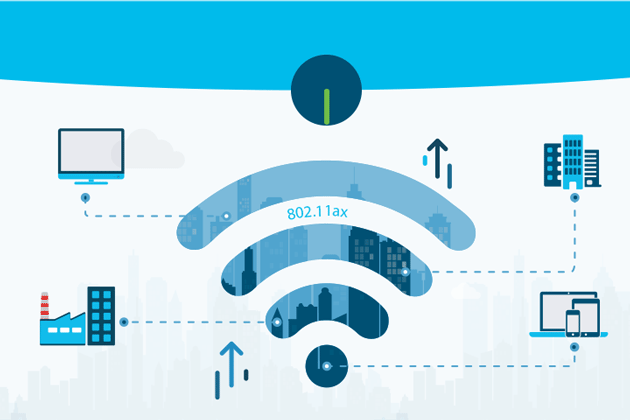

<h1 align="center">1️⃣6️⃣ Wireless Networking</h1>

 <em>نظرة عامة على مفهوم الشبكة اللاسلكية وربطها لأنواع مختلفة من الأجهزة والمواقع</em>

الشبكة اللاسلكية (<strong>Wireless Network</strong>) بتنقل البيانات عن طريق موجات الراديو بدل الكابلات، وده بيديها مرونة كبيرة في الحركة والتوسع، لكن بيجيب معاه تحديات مختلفة تمامًا عن الشبكة السلكية زي التداخل، الأمان، وطريقة الوصول للوسط المشترك. الملف ده بيغطي كل حاجة من تعريف الشبكة اللاسلكية وأساسياتها، لحد تفاصيل الإرسال عبر الهوائي، وأنواع الشبكات حسب النطاق، وإعداد نقطة الوصول، وأخيرًا الأمان والتشفير. الموضوع مرتبط بملف Topic 4 - OSI Model وملف Topic 9 - Ethernet/LAN خصوصًا في مقارنة طريقة الوصول للوسط.

---

## 📑 جدول المحتويات (Table of Contents)

| # | القسم الرئيسي | المواضيع الفرعية |
|:---:|:---:|:---:|
| 1 | [مقدمة عن الشبكات اللاسلكية](#intro) | [تعريفها](#wireless-definition) [بدايتها وتطورها](#wireless-history) [الفرق بينها وبين الشبكة السلكية](#wired-vs-wireless) [أهميتها ومزاياها](#wireless-advantages) |
| 2 | [مؤسسات ومعايير الشبكة اللاسلكية](#standards-bodies) | [المؤسسات المسؤولة](#regulatory-bodies) [معيار 802.11 وإصداراته](#80211-standards) [الترددات ونطاقاتها](#frequency-bands) |
| 3 | [أجهزة الشبكة اللاسلكية](#wireless-devices) | [جدول الأجهزة السلكية واللاسلكية والمشتركة](#device-table) |
| 4 | [الهوائيات (Antennas)](#antennas) | [Antenna Pattern](#antenna-pattern) [أنواع الهوائيات](#antenna-types) [ربح الهوائي و EIRP](#antenna-gain-eirp) |
| 5 | [طرق توصيل الأجهزة وأنواع الاتصال](#wireless-topologies) | [نقطة لنقطة، متعدد، بث](#connection-types-detail) [Infrastructure Mode](#infrastructure-mode) [Ad-Hoc Mode](#adhoc-mode) [النمط الممتد Mesh](#mesh-mode) [بنية نقاط الوصول](#ap-architecture) [عملية الارتباط بنقطة الوصول](#association-process) |
| 6 | [طرق إرسال البيانات عبر الهوائي](#signal-transmission) | [طرق تعديل الإشارة](#modulation) [النطاق الضيق أحادي التردد](#narrowband) [الطيف المنتشر](#spread-spectrum) [نمط انتشار الموجات](#wave-propagation) [تقنيات التوجيه وتعدد المنافذ (MIMO)](#mimo) [طرق تعدد الوصول](#multiple-access) [طرق البث](#broadcasting-methods) [أنواع الاستقطاب](#polarization) |
| 7 | [أنواع الشبكات اللاسلكية حسب النطاق](#wireless-network-types) | [WPAN](#wpan) [WLAN](#wlan) [WMAN](#wman) [WWAN](#wwan) |
| 8 | [خاصية التجوال (Roaming)](#roaming) | - |
| 9 | [إعداد الشبكة اللاسلكية](#ap-configuration) | [خطوات الإعداد الأساسية](#ap-basic-setup) [إعداد DHCP وإدارة المستخدمين](#ap-dhcp-users) |
| 10 | [مشاكل الانقطاع والمعوقات المؤثرة](#wireless-interference) | [أسباب انقطاع الإشارة](#signal-loss-causes) [القنوات المتداخلة وغير المتداخلة](#channel-overlap) [عرض القناة وBand Steering](#channel-width) |
| 11 | [أمان الشبكة اللاسلكية](#wireless-security) | [هجمات شائعة تستهدف الشبكة](#wireless-attacks) [إخفاء وتغيير SSID](#ssid-hiding) [تحديد نطاق التغطية](#coverage-limiting) [إنشاء الحسابات وكلمات المرور](#accounts-passwords) [تفعيل RADIUS و AAA](#radius-aaa) [مراقبة الشبكة](#wireless-monitoring) [برامج الحماية على الأجهزة](#endpoint-protection) [تصفية عناوين MAC](#mac-filtering) [الشبكة الضيفية و Captive Portal](#guest-network) |
| 12 | [بروتوكولات تشفير الشبكة اللاسلكية](#encryption-protocols) | [WEP](#wep) [WPA](#wpa) [WPA2](#wpa2) [WPA3](#wpa3) [IPSec](#ipsec) [جدول مقارنة](#encryption-comparison) |

---

<h2 dir="rtl" align="right" id="intro">1️⃣ مقدمة عن الشبكات اللاسلكية</h2>

<h3 dir="rtl" align="right" id="wireless-definition">🔹 تعريفها</h3>

<strong>الشبكة اللاسلكية (Wireless Network)</strong> هي شبكة بتربط الأجهزة مع بعضها وتنقل البيانات بينها عن طريق موجات كهرومغناطيسية (موجات راديو - Radio Frequency Waves) تنتقل عبر الهواء، من غير الحاجة لكابلات فيزيائية بين الأجهزة. البيانات بتتحول لإشارة كهرومغناطيسية عند الإرسال عن طريق الهوائي، وبترجع تتحول لبيانات رقمية تاني عند الاستقبال.

<h3 dir="rtl" align="right" id="wireless-history">🔹 بدايتها وتطورها</h3>

فكرة نقل البيانات لاسلكيًا مش جديدة، وأصلها بيرجع لتقنيات الراديو والاتصالات العسكرية، لكن الشبكات اللاسلكية للبيانات (Data Networks) بالشكل المعروف حاليًا بدأت تتطور بشكل جدي في التسعينات مع ظهور أول نسخة من معيار <strong>802.11</strong> سنة 1997، وبعدها بدأت السرعات والمعايير تتطور بشكل متسارع (هيتفصل في قسم معيار 802.11) لحد ما وصلنا لمعايير حديثة زي 802.11ax (Wi-Fi 6) وWi-Fi 7 اللي بتدعم سرعات وكثافة أجهزة عالية جدًا.

<h3 dir="rtl" align="right" id="wired-vs-wireless">🔹 الفرق بينها وبين الشبكة السلكية</h3>

<table align="center">
<tr><th>المقارنة</th><th>الشبكة السلكية (Wired)</th><th>الشبكة اللاسلكية (Wireless)</th></tr>
<tr><td>وسط النقل</td><td>كابلات نحاسية أو فيبر</td><td>موجات راديو عبر الهواء</td></tr>
<tr><td>طريقة الوصول للوسط</td><td>CSMA/CD (راجع Topic 9)</td><td>CSMA/CA</td></tr>
<tr><td>الأمان الفيزيائي</td><td>أعلى (لازم اتصال فيزيائي)</td><td>أقل (أي جهاز في النطاق يقدر يحاول الاتصال)</td></tr>
<tr><td>سهولة التوسع والحركة</td><td>محدودة بموقع الكابل</td><td>مرنة جدًا</td></tr>
<tr><td>التأثر بالعوائق</td><td>غير متأثرة تقريبًا</td><td>متأثرة بالمسافة، الجدران، التداخل</td></tr>
<tr><td>الاستقرار والسرعة القصوى</td><td>أعلى وأثبت عمومًا</td><td>متغيرة حسب الظروف المحيطة</td></tr>
</table>

<h3 dir="rtl" align="right" id="wireless-advantages">🔹 أهميتها ومزاياها</h3>

<ul dir="rtl">
<li><strong>المرونة (Mobility):</strong> المستخدم يقدر يتحرك بحرية جوه نطاق التغطية من غير ما يفقد الاتصال.</li>
<li><strong>سهولة التوسع (Scalability):</strong> إضافة جهاز جديد للشبكة مش محتاجة مد كابل جديد، بس تديله بيانات الاتصال.</li>
<li><strong>توفير التكلفة في البنية التحتية:</strong> تقليل الحاجة لمد كابلات في المباني، خصوصًا الأماكن التاريخية أو صعبة التمديد.</li>
<li><strong>دعم عدد كبير من الأجهزة المحمولة:</strong> الهواتف والأجهزة اللوحية بطبيعتها مصممة للاتصال اللاسلكي.</li>
<li><strong>سهولة إعادة التنظيم:</strong> تغيير توزيع المكاتب أو الأجهزة مبيحتاجش إعادة تمديد كابلات.</li>
</ul>

---

<h2 dir="rtl" align="right" id="standards-bodies">2️⃣ مؤسسات ومعايير الشبكة اللاسلكية</h2>

<h3 dir="rtl" align="right" id="regulatory-bodies">🔹 المؤسسات المسؤولة عن الشبكة اللاسلكية</h3>

عشان الأجهزة اللاسلكية من شركات مختلفة تقدر تتواصل مع بعضها بشكل موحد، وعشان الترددات المستخدمة متتضاربش مع أجهزة تانية (زي أجهزة الاتصالات العسكرية أو الطبية)، فيه مؤسسات مسؤولة عن وضع المعايير والتنظيم:

<ul dir="rtl">
<li><strong>ITU (International Telecommunication Union):</strong> منظمة دولية تابعة للأمم المتحدة، مسؤولة عن التنسيق العالمي لاستخدام الترددات بين الدول المختلفة عشان يتجنبوا التداخل بين الدول المتجاورة. دي أوسع مؤسسة في السلسلة، بتحدد الإطار العام على مستوى العالم.</li>
<li><strong>FCC (Federal Communications Commission):</strong> الهيئة الحكومية الأمريكية المسؤولة عن تنظيم استخدام الترددات اللاسلكية في الولايات المتحدة، بتحدد مين مسموح له يستخدم أي نطاق تردد وبأنهي قوة إرسال، وده بيتم جوه الإطار العام اللي حددته الـ ITU.</li>
<li><strong>IEEE (Institute of Electrical and Electronics Engineers):</strong> المؤسسة المسؤولة عن وضع المعايير التقنية للشبكات اللاسلكية جوه النطاقات المسموح بيها من الجهات المنظمة، وأشهر معيار وضعته هو عائلة معايير <strong>802.11</strong> اللي بتحدد كل تفاصيل عمل الشبكة اللاسلكية (السرعة، الترددات، طريقة التشفير...إلخ).</li>
<li><strong>Wi-Fi Alliance:</strong> منظمة غير حكومية مكونة من شركات مصنعة، مهمتها إنها تتأكد إن الأجهزة المختلفة اللي بتدعي دعم معيار معين من معايير IEEE (زي Wi-Fi 6) متوافقة فعليًا مع بعضها (Interoperability Certification)، وهي اللي بتمنح شهادة "Wi-Fi Certified" وهي اللي أطلقت مسميات "Wi-Fi 4/5/6/7" التسويقية بدل أرقام المعايير التقنية المعقدة.</li>
</ul>

<h3 dir="rtl" align="right" id="80211-standards">🔹 معيار 802.11 وإصداراته الفرعية</h3>

معيار <strong>802.11</strong> هو المعيار الأساسي اللي بيحدد كل تفاصيل عمل الشبكات اللاسلكية المحلية (Wi-Fi)، وبيتطور باستمرار عن طريق إصدارات فرعية بيحسن كل واحدة فيها السرعة والكفاءة وعدد الأجهزة المدعومة:

<table align="center">
<tr><th>المعيار</th><th>سنة الإصدار</th><th>مدى التغطية (تقريبي)</th><th>التردد</th><th>أقصى سرعة نظرية</th></tr>
<tr><td>802.11a</td><td>1999</td><td>~100 قدم</td><td>5 GHz</td><td>54 Mbps</td></tr>
<tr><td>802.11b</td><td>1999</td><td>~150 قدم</td><td>2.4 GHz</td><td>11 Mbps</td></tr>
<tr><td>802.11g</td><td>2003</td><td>~150 قدم</td><td>2.4 GHz</td><td>54 Mbps</td></tr>
<tr><td>802.11n</td><td>2009</td><td>~300 قدم</td><td>2.4/5 GHz</td><td>~600 Mbps (مع MIMO)</td></tr>
<tr><td>802.11ac</td><td>2013</td><td>~100 قدم</td><td>5 GHz</td><td>~3.5 Gbps</td></tr>
<tr><td>802.11ax</td><td>2019</td><td>~150 قدم</td><td>2.4/5/6 GHz</td><td>~9.6 Gbps</td></tr>
<tr><td>802.11be</td><td>2024</td><td>~150 قدم</td><td>2.4/5/6 GHz</td><td>~46 Gbps (نظريًا)</td></tr>
</table>

أرقام المدى دي تقريبية داخل المباني وبتفترض ظروف عادية بدون عوائق كتير؛ المدى الفعلي دايمًا بيقل بسبب عوامل زي الجدران والتداخل هيتفصل في قسم مشاكل الانقطاع لاحقًا في الملف. ملاحظة مهمة: المعايير اللي بتشتغل على تردد 5 GHz (زي 802.11a وac) بيكون مداها الطبيعي أقصر من المعايير اللي بتشتغل على 2.4 GHz، حتى لو سرعتها أعلى، وده بسبب خاصية التردد نفسه مش ضعف في التقنية.

السرعات دي نظرية قصوى في ظروف مثالية، والسرعة الفعلية دايمًا بتقل بسبب التداخل، عدد الأجهزة المشتركة في نفس نقطة الوصول، والمسافة والعوائق (هيتفصل في قسم مشاكل الانقطاع لاحقًا).

<h3 dir="rtl" align="right" id="frequency-bands">🔹 الترددات ونطاقاتها</h3>

الشبكات اللاسلكية بتشتغل في نطاقات ترددية معينة مخصصة للاستخدام العام (Unlicensed Spectrum)، وأشهرها:

<ul dir="rtl">
<li><strong>2.4 GHz:</strong> نطاق تردد قديم ومنتشر جدًا، مدى تغطية أوسع وقدرة أفضل على اختراق الجدران، لكنه مزدحم جدًا لأن أجهزة تانية كتير بتستخدمه (Bluetooth، أفران الميكروويف، بعض أجهزة التحكم عن بعد)، وبيوفر عدد قنوات أقل وغير متداخلة (هيتفصل في قسم القنوات المتداخلة).</li>
<li><strong>5 GHz:</strong> نطاق أحدث وأقل ازدحامًا، بيوفر سرعات أعلى وعدد قنوات غير متداخلة أكتر بكتير، لكن مداه أقصر ومقدرته على اختراق الجدران أضعف من الـ 2.4 GHz.</li>
<li><strong>6 GHz:</strong> نطاق جديد ظهر مع معيار Wi-Fi 6E وWi-Fi 7، بيوفر مساحة ترددية إضافية كبيرة وأقل ازدحامًا خالص، لكن مداه الأقصر بين التلاتة.</li>
</ul>

---

<h2 dir="rtl" align="right" id="wireless-devices">3️⃣ أجهزة الشبكة اللاسلكية</h2>

<h3 dir="rtl" align="right" id="device-table">🔹 جدول الأجهزة السلكية واللاسلكية والمشتركة</h3>

مش كل الأجهزة اللي بنتعامل معاها في الشبكات مخصصة لنوع واحد بس (سلكي أو لاسلكي)؛ بعضها بيشتغل في الاتنين، وبعضها ليه ما يعادله في النوع التاني بوظيفة مشابهة. الجدول ده بيلخص العلاقة دي:

<table align="center">
<tr><th>الجهاز</th><th>النوع</th><th>يعادله في النوع الآخر</th><th>طبقة العمل (OSI)</th></tr>
<tr><td>Switch</td><td>سلكي فقط</td><td>Wireless Access Point (AP)</td><td>Layer 2</td></tr>
<tr><td>Access Point (AP)</td><td>لاسلكي فقط</td><td>Switch</td><td>Layer 1/2</td></tr>
<tr><td>Router</td><td>مشترك (سلكي ولاسلكي)</td><td>-</td><td>Layer 3</td></tr>
<tr><td>Network Interface Card (NIC)</td><td>مشترك (Wired NIC / Wireless NIC)</td><td>-</td><td>Layer 1/2</td></tr>
<tr><td>Wireless Controller</td><td>لاسلكي فقط</td><td>-</td><td>Layer 2/3 (إدارة)</td></tr>
<tr><td>Repeater / Range Extender</td><td>لاسلكي فقط غالبًا</td><td>Hub (من ناحية التكرار)</td><td>Layer 1</td></tr>
<tr><td>Firewall</td><td>مشترك</td><td>-</td><td>Layer 3/4</td></tr>
</table>

أهم نقطة في الجدول ده إن جهاز الـ <strong>Access Point</strong> هو المعادل اللاسلكي لجهاز الـ <strong>Switch</strong> من ناحية الوظيفة الأساسية (ربط الأجهزة النهائية بالشبكة)، لكنه بيشتغل بمبدأ مختلف تمامًا (وسط مشترك يستخدم CSMA/CA بدل منافذ منفصلة زي السويتش، راجع Topic 15 - Switching للمقارنة).

---

<h2 dir="rtl" align="right" id="antennas">4️⃣ الهوائيات (Antennas)</h2>

<h3 dir="rtl" align="right" id="antenna-pattern">🔹 Antenna Pattern</h3>

<strong>Antenna Pattern (نمط الهوائي)</strong> هو رسم بياني بيوضح شكل وقوة الإشارة اللي الهوائي بيبثها أو بيستقبلها في كل اتجاه حواليه. النمط ده بيحدد هل الهوائي بيبعت الإشارة بالتساوي في كل الاتجاهات، ولا بيركز الإشارة في اتجاه معين بقوة أعلى، وده اللي بيحدد نوع الهوائي المناسب حسب طبيعة المكان المطلوب تغطيته.

<h3 dir="rtl" align="right" id="antenna-types">🔹 أنواع الهوائيات</h3>

<ul dir="rtl">
<li><strong>Omnidirectional Antenna (هوائي غير موجه):</strong> بيبث الإشارة بالتساوي في كل الاتجاهات حواليه بشكل دائري (زي شكل الدونات)، مناسب للأماكن اللي محتاجة تغطية شاملة حوالين نقطة مركزية زي المكاتب المفتوحة أو المنازل.</li>
<li><strong>Directional Antenna (هوائي موجه):</strong> بيركز الإشارة في اتجاه واحد بس بقوة أعلى ومدى أبعد، مناسب لربط مبنيين ببعض على مسافة طويلة (Point-to-Point Link) أو لتغطية ممر طويل.</li>
<li><strong>Yagi Antenna:</strong> نوع من الهوائيات الموجهة، بيوفر مدى طويل جدًا في اتجاه واحد محدد، وبيستخدم غالبًا في الوصلات طويلة المدى بين المباني.</li>
<li><strong>Parabolic/Dish Antenna:</strong> هوائي على شكل طبق، بيركز الإشارة بشكل شديد جدًا في اتجاه واحد ضيق، وبيستخدم للمسافات الطويلة جدًا واللينكات النقطة لنقطة عالية الأداء.</li>
</ul>

<h3 dir="rtl" align="right" id="antenna-gain-eirp">🔹 ربح الهوائي (Antenna Gain) والقدرة المشعة الفعلية (EIRP)</h3>

<strong>ربح الهوائي (Antenna Gain)</strong> هو مقياس بيوضح مدى قدرة الهوائي على تركيز الإشارة في اتجاه معين مقارنة بهوائي مرجعي مثالي يبث بالتساوي في كل الاتجاهات، وبيتقاس بوحدة <strong>dBi (decibels relative to isotropic)</strong>؛ كل ما زادت قيمة الـ dBi، كل ما كان الهوائي قادر يركز الإشارة أكتر في اتجاه معين ويوصلها لمسافة أبعد في الاتجاه ده.

القدرة الفعلية اللي بتوصل للمستقبِل مش بس قدرة إرسال الجهاز نفسه (Transmit Power)، لكنها محصلة قدرة الإرسال زائد ربح الهوائي المستخدم، وده اللي بيتسمى <strong>EIRP (Effective Isotropic Radiated Power)</strong>. الهيئات المنظمة زي الـ FCC بتحدد حد أقصى قانوني لقيمة الـ EIRP في كل نطاق تردد، عشان تمنع أي جهاز إنه "يصرخ" بقوة عالية جدًا تسبب تداخل مع باقي الشبكات المجاورة، فحتى لو زودت قدرة الهوائي (Gain)، المسؤول لازم يقلل قدرة إرسال الجهاز نفسه للحفاظ على الـ EIRP جوه الحد القانوني المسموح بيه.

---

<h2 dir="rtl" align="right" id="wireless-topologies">5️⃣ طرق توصيل الأجهزة وأنواع الاتصال اللاسلكي</h2>

<h3 dir="rtl" align="right" id="connection-types-detail">🔹 أنواع الاتصال: نقطة لنقطة، متعدد، بث</h3>

<ul dir="rtl">
<li><strong>Point-to-Point (P2P):</strong> اتصال مباشر بين جهازين بس، زي وصلة لاسلكية بين مبنيين باستخدام هوائيات موجهة (Directional Antennas)، وبيوفر أقصى استخدام ممكن لعرض النطاق الترددي لأنه مخصص للجهازين دول بس.</li>
<li><strong>Point-to-Multipoint (P2MP):</strong> جهاز مركزي واحد (زي نقطة الوصول) بيتصل بيه عدة أجهزة في نفس الوقت، وهو النمط الأكتر شيوعًا في شبكات الـ Wi-Fi العادية.</li>
<li><strong>Broadcast:</strong> إرسال الإشارة لكل الأجهزة في النطاق من غير تحديد مستقبِل معين، زي بث القنوات التلفزيونية أو الراديو.</li>
</ul>

التصنيف ده بيوصف شكل العلاقة بين الأجهزة بشكل عام، أما الأقسام الجاية فبتوضح إزاي التصنيف ده بيتطبق عمليًا في تصميم الشبكة اللاسلكية نفسها.

<h3 dir="rtl" align="right" id="infrastructure-mode">🔹 Infrastructure Mode (اتصال عبر نقطة وصول مركزية)</h3>

الوضع الأكتر شيوعًا في الشبكات اللاسلكية، وفيه كل الأجهزة بتتصل بجهاز مركزي واحد وهو <strong>Access Point (AP)</strong>، وأي تواصل بين جهازين لازم يمر عن طريق نقطة الوصول دي أولاً حتى لو الجهازين قريبين من بعض فيزيائيًا. الوضع ده بيسهل الإدارة والأمان المركزي، وهو الأساس اللي بتشتغل عليه شبكات المنازل والشركات، وده تطبيق عملي لنمط الـ Point-to-Multipoint اللي شرحناه فوق.

<h3 dir="rtl" align="right" id="adhoc-mode">🔹 Ad-Hoc Mode (اتصال مباشر بين جهازين)</h3>

في الوضع ده، جهازين (أو أكتر) بيتصلوا ببعض مباشرة من غير أي نقطة وصول مركزية بينهم، وكل جهاز بيتصرف كأنه Peer مستقل. الوضع ده بسيط ومناسب لنقل بيانات سريع بين جهازين قريبين، لكنه مش قابل للتوسع بسهولة ومفيهوش إدارة مركزية أو أمان قوي، فبيستخدم غالبًا في حالات مؤقتة أو محدودة.

<h3 dir="rtl" align="right" id="mesh-mode">🔹 النمط الممتد (Mesh / Extended Mode)</h3>

في الشبكات الكبيرة اللي محتاجة تغطية أوسع من مدى نقطة وصول واحدة، بيتم استخدام أكتر من نقطة وصول مربوطين ببعض بشكل يسمح للمستخدم إنه يتنقل بينهم من غير ما يفقد الاتصال (هيتفصل في قسم التجوال لاحقًا). في تقنية <strong>Mesh Network</strong> بالتحديد، نقاط الوصول بتتواصل مع بعضها لاسلكيًا مباشرة (من غير الحاجة لكابل يربطهم كلهم بالراوتر الأساسي)، وكل نقطة بتقدر تمرر البيانات لنقطة تانية جنبها لحد ما توصل لمصدر الإنترنت، وده بيوفر تغطية مرنة جدًا وسهلة التوسع في المساحات الكبيرة.

<h3 dir="rtl" align="right" id="ap-architecture">🔹 بنية نقاط الوصول (Autonomous مقابل Controller-Based)</h3>

في الشبكات المؤسسية اللي فيها عدد كبير من نقاط الوصول، طريقة إدارتها بتتحدد حسب البنية المستخدمة:

<ul dir="rtl">
<li><strong>Autonomous AP (نقطة وصول مستقلة):</strong> كل نقطة وصول بتدار وتتظبط بشكل منفصل تمامًا عن باقي النقاط، وليها إعداداتها الخاصة بيها (SSID، تشفير، قنوات...إلخ). الطريقة دي بسيطة ومناسبة للشبكات الصغيرة، لكنها بتصبح صعبة الإدارة جدًا مع زيادة عدد النقاط، لأن أي تغيير (زي تغيير كلمة السر) لازم يتكرر يدويًا على كل نقطة لوحدها.</li>
<li><strong>Lightweight AP (نقطة وصول خفيفة) مع Wireless LAN Controller (WLC):</strong> في الشبكات الكبيرة، بيتم استخدام جهاز مركزي اسمه <strong>WLC</strong> بيدير كل نقاط الوصول من مكان واحد؛ نقاط الوصول نفسها بتبقى "خفيفة" (Lightweight) لأنها مش محتاجة إعدادات محلية معقدة، وكل الإعدادات والسياسات بتتوزع عليها تلقائيًا من الـ Controller. التواصل بين نقاط الوصول والـ WLC بيتم عن طريق بروتوكول <strong>CAPWAP (Control And Provisioning of Wireless Access Points)</strong>. الفايدة الأساسية من البنية دي إنها بتسهل الإدارة المركزية بشكل كبير، وبتحسن تجربة الـ Roaming لأن الـ WLC عنده رؤية كاملة لكل الأجهزة المتصلة بكل نقاط الوصول، فبيقدر ينسق عملية انتقال الأجهزة بينهم بسلاسة أكبر بكتير من الاعتماد على نقاط وصول مستقلة عن بعضها.</li>
</ul>

<h3 dir="rtl" align="right" id="association-process">🔹 عملية الارتباط بنقطة الوصول (Association Process)</h3>

قبل ما أي جهاز يقدر يستخدم الشبكة اللاسلكية، لازم يمر بعملية ارتباط (Association) مع نقطة الوصول، وبتتكون من ثلاث مراحل أساسية:

<ol dir="rtl">
<li><strong>Probing:</strong> الجهاز بيبحث عن الشبكات المتاحة، إما بشكل سلبي (بيستمع لرسائل Beacon اللي نقطة الوصول بتبثها باستمرار وبتحمل اسم الشبكة SSID)، أو بشكل نشط (بيبعت Probe Request لنقاط الوصول القريبة وبيستنى الرد).</li>
<li><strong>Authentication:</strong> الجهاز بيثبت هويته لنقطة الوصول حسب نوع التشفير المُفعّل (هيتفصل في قسم بروتوكولات التشفير).</li>
<li><strong>Association:</strong> بعد نجاح المصادقة، الجهاز بيرتبط رسميًا بنقطة الوصول ويصبح جزء من الشبكة، وياخد عنوان IP (غالبًا عن طريق DHCP) ويقدر يبدأ ينقل بيانات فعلية.</li>
</ol>

---

<h2 dir="rtl" align="right" id="signal-transmission">6️⃣ طرق إرسال البيانات عبر الهوائي</h2>

<h3 dir="rtl" align="right" id="modulation">🔹 طرق تعديل الإشارة (Modulation)</h3>

<strong>Modulation</strong> هي العملية اللي بيتم فيها "ركوب" البيانات الرقمية (0 و1) على موجة كهرومغناطيسية حاملة (Carrier Wave) عشان تقدر تنتقل عبر الهواء. الطرق الأساسية بتعتمد على تغيير إحدى خصائص الموجة الحاملة (السعة، التردد، أو الطور) حسب قيمة البت المُرسل:

<ul dir="rtl">
<li><strong>ASK (Amplitude Shift Keying):</strong> بيغيّر سعة (ارتفاع) الموجة حسب البيانات.</li>
<li><strong>FSK (Frequency Shift Keying):</strong> بيغيّر تردد الموجة حسب البيانات.</li>
<li><strong>PSK (Phase Shift Keying):</strong> بيغيّر طور (Phase) الموجة حسب البيانات، وبيوفر كفاءة أعلى من الطريقتين اللي فاتوا.</li>
<li><strong>QAM (Quadrature Amplitude Modulation):</strong> بيدمج بين تغيير السعة والطور مع بعض في نفس الوقت، وده بيسمح بنقل عدد أكبر من البتات في كل إشارة، وهو الأساس اللي بتعتمد عليه معايير Wi-Fi الحديثة عشان توصل لسرعات عالية.</li>
</ul>

<h3 dir="rtl" align="right" id="narrowband">🔹 النطاق الضيق أحادي التردد (Narrowband)</h3>

بعد ما البيانات اتشكلت على الموجة الحاملة (Modulation)، السؤال التاني: هل هنستخدم تردد واحد بس ولا نطاق أوسع؟ تقنية <strong>Narrowband</strong> بترسل كل البيانات على تردد واحد ثابت وضيق النطاق. ميزتها الأساسية إنها بسيطة وبتستخدم عرض ترددي صغير جدًا، لكن عيبها الكبير إنها حساسة جدًا للتداخل (Interference) والتشويش، لأنه لو حصل تشويش بالظبط على التردد ده، الاتصال كله بيتعطل من غير أي بديل. بتستخدم في تطبيقات محدودة زي بعض أجهزة الراديو القديمة وأنظمة التحكم عن بعد البسيطة.

<h3 dir="rtl" align="right" id="spread-spectrum">🔹 الطيف المنتشر (Spread Spectrum)</h3>

تقنية <strong>Spread Spectrum</strong> هي الأساس اللي بتعتمد عليه شبكات الـ Wi-Fi الحديثة، وفكرتها إن البيانات بتتوزع على نطاق ترددي أوسع بدل تردد واحد ضيق، وده بيوفر مقاومة أعلى للتداخل والتشويش لأن فقدان جزء من النطاق الترددي مش بيأثر على كل الاتصال. أهم أنواعها:

<ul dir="rtl">
<li><strong>FHSS (Frequency Hopping Spread Spectrum):</strong> الإشارة بتقفز بسرعة بين عدة ترددات مختلفة حسب نمط (Pattern) متفق عليه بين المرسل والمستقبِل، وده بيصعّب على أي جهاز تشويش إنه يعطل الاتصال كله لأنه محتاج يشوش على كل الترددات في نفس الوقت.</li>
<li><strong>DSSS (Direct Sequence Spread Spectrum):</strong> البيانات بتتوزع مباشرة على نطاق ترددي عريض بشكل ثابت (من غير قفز)، عن طريق دمج كل بت بيانات مع كود خاص (Chipping Code) بيوزعه على النطاق كله، وكان مستخدم في معايير Wi-Fi المبكرة زي 802.11b.</li>
<li><strong>OFDM (Orthogonal Frequency-Division Multiplexing):</strong> التقنية المستخدمة في معظم معايير Wi-Fi الحديثة، وفكرتها إنها بتقسم النطاق الترددي المتاح لعدد كبير من القنوات الفرعية الصغيرة المتعامدة على بعضها (Subcarriers) وبترسل جزء من البيانات على كل واحدة فيهم في نفس الوقت بالتوازي، وده بيوفر كفاءة عالية جدًا في استخدام النطاق الترددي ومقاومة ممتازة للتداخل.</li>
</ul>

<h3 dir="rtl" align="right" id="wave-propagation">🔹 نمط انتشار الموجات في الهواء</h3>

بعد ما الإشارة تتشكل وتتوزع على الترددات، بتنتشر في الهواء بأشكال مختلفة حسب طبيعة البيئة المحيطة وتردد الموجة نفسه، ومن أهم الظواهر اللي بتتحكم في انتشارها: <strong>الانعكاس (Reflection)</strong> عند اصطدامها بسطح صلب (زي المرايا أو المعادن)، <strong>الانكسار (Refraction)</strong> عند مرورها بين وسطين مختلفين، <strong>الحيود (Diffraction)</strong> اللي بيخليها تلتف حوالين العوائق الصغيرة، و<strong>التشتت (Scattering)</strong> لما تصطدم بسطح خشن فبتتفرق في اتجاهات متعددة. الظواهر دي مجتمعة هي اللي بتفسر ليه الإشارة اللاسلكية بتضعف وتتشوه لما تعدي على جدران وعوائق (هيتفصل أكتر في قسم مشاكل الانقطاع).

<h3 dir="rtl" align="right" id="mimo">🔹 تقنيات التوجيه وتعدد المنافذ (MIMO)</h3>

<strong>MIMO (Multiple Input, Multiple Output)</strong> هي تقنية بتستخدم أكتر من هوائي إرسال واستقبال في نفس الوقت (بدل هوائي واحد بس)، وده بيسمح بإرسال أكتر من تيار بيانات (Data Stream) في نفس الوقت على نفس القناة، وبالتالي زيادة السرعة الكلية والاعتمادية من غير الحاجة لعرض نطاق ترددي إضافي. التقنية دي ظهرت بشكل أساسي مع معيار 802.11n واستمرت تتطور في المعايير اللي بعده. من التقنيات المرتبطة بيها كمان <strong>Beamforming</strong>، وهي تقنية بتخلي نقطة الوصول توجه الإشارة بشكل مركز نحو الجهاز المستقبِل بالتحديد بدل ما تبثها بالتساوي في كل الاتجاهات، وده بيحسن قوة الإشارة وسرعة الاتصال للجهاز المستهدف.

<h3 dir="rtl" align="right" id="multiple-access">🔹 طرق تعدد الوصول (Multiple Access)</h3>

بما إن الهواء وسط مشترك بين كل الأجهزة اللي في نطاق نقطة الوصول (زي الـ Hub بالظبط من ناحية المبدأ)، لازم يكون فيه آلية تحكم في مين يقدر يرسل وإمتى عشان نتجنب التصادم. الشبكات اللاسلكية بتستخدم بروتوكول <strong>CSMA/CA (Carrier Sense Multiple Access with Collision Avoidance)</strong>، وده مختلف عن CSMA/CD المستخدم في الشبكات السلكية القديمة:

<ul dir="rtl">
<li><strong>Carrier Sense:</strong> الجهاز بيسمع القناة الأول قبل ما يرسل، عشان يتأكد إنها فاضية.</li>
<li><strong>Collision Avoidance (بدل Detection):</strong> في الشبكة اللاسلكية، صعب جدًا على الجهاز إنه يكتشف تصادم وهو بيرسل (لأنه مش بيقدر يسمع ويرسل في نفس الوقت على نفس الهوائي)، فبدل ما يكتشف التصادم بعد حدوثه (زي CSMA/CD)، البروتوكول بيحاول يتجنبه من الأساس: الجهاز بيستنى فترة عشوائية (Random Backoff) قبل الإرسال حتى لو القناة فاضية، وبيستخدم كمان آلية <strong>RTS/CTS (Request to Send / Clear to Send)</strong> الاختيارية، وفيها الجهاز بيبعت طلب صغير للسماح له بالإرسال، ولو نقطة الوصول ردت بالموافقة، باقي الأجهزة بتفهم إنها لازم تستنى وميرسلوش في نفس الوقت.</li>
</ul>

<strong>مشكلة العقدة المخفية (Hidden Node Problem):</strong> مشكلة شائعة بتحصل لما جهازين يكونوا في نطاق نقطة الوصول لكن مش قادرين يسمعوا بعض مباشرة (بسبب المسافة أو عائق بينهم)، فكل واحد فيهم ممكن يفتكر القناة فاضية ويرسل في نفس وقت التاني، وده يسبب تصادم عند نقطة الوصول من غير ما أي جهاز فيهم يحس بيه. آلية RTS/CTS بتساعد في تقليل المشكلة دي لأن نقطة الوصول بتنسق الإرسال مركزيًا.

<h3 dir="rtl" align="right" id="broadcasting-methods">🔹 طرق البث (Broadcasting Methods)</h3>

<ul dir="rtl">
<li><strong>Unicast:</strong> إرسال البيانات من جهاز لجهاز واحد محدد بس.</li>
<li><strong>Multicast:</strong> إرسال البيانات لمجموعة محددة من الأجهزة المشتركة في نفس المجموعة.</li>
<li><strong>Broadcast:</strong> إرسال البيانات لكل الأجهزة الموجودة في نطاق الشبكة اللاسلكية، زي رسائل الـ Beacon Frames اللي نقطة الوصول بتبثها باستمرار للإعلان عن وجودها واسم الشبكة (SSID).</li>
</ul>

<h3 dir="rtl" align="right" id="polarization">🔹 أنواع الاستقطاب (Polarization)</h3>

<strong>الاستقطاب (Polarization)</strong> هو اتجاه اهتزاز الموجة الكهرومغناطيسية أثناء انتقالها، وبيتحدد حسب اتجاه تركيب الهوائي نفسه. أهمية الاستقطاب إن الهوائي المرسل والمستقبِل لازم يكونوا على نفس نوع الاستقطاب (أو قريب منه) عشان الإشارة توصل بأقوى شكل ممكن، وأي اختلاف كبير في الاستقطاب بين طرفي الاتصال بيسبب ضعف شديد في قوة الإشارة المستقبَلة:

<ul dir="rtl">
<li><strong>الاستقطاب الرأسي (Vertical Polarization):</strong> الهوائي مركب بشكل رأسي (عمودي على الأرض)، وهو الأكتر شيوعًا في أجهزة الـ Wi-Fi المنزلية والمكتبية.</li>
<li><strong>الاستقطاب الأفقي (Horizontal Polarization):</strong> الهوائي مركب بشكل أفقي (موازي للأرض)، بيستخدم في بعض تطبيقات البث والوصلات طويلة المدى.</li>
<li><strong>الاستقطاب الخطي (Linear Polarization):</strong> مصطلح عام بيشمل النوعين الرأسي والأفقي مع بعض، لأن كل واحد فيهم بيهتز في خط مستقيم واحد بس (رأسي أو أفقي).</li>
<li><strong>الاستقطاب الدائري (Circular Polarization):</strong> الموجة بتهتز بشكل دائري بدل الخط المستقيم، وميزته الأساسية إنه أقل حساسية لاتجاه تركيب الهوائي المستقبِل، وبيستخدم في تطبيقات زي الأقمار الصناعية والـ RFID، لكنه بيفقد جزء من قوة الإشارة (حوالي 3dB) مقارنة بالاستقطاب الخطي المتطابق تمامًا.</li>
</ul>

---

<h2 dir="rtl" align="right" id="wireless-network-types">7️⃣ أنواع الشبكات اللاسلكية حسب النطاق الجغرافي</h2>

<h3 dir="rtl" align="right" id="wpan">🔹 WPAN (Wireless Personal Area Network)</h3>

أصغر نطاق، بيغطي مسافة قصيرة جدًا (عادة أقل من 10 أمتار) حوالين شخص واحد أو جهاز واحد، وبيستخدم لربط أجهزة شخصية قريبة من بعض زي السماعات، الساعات الذكية، والفأرة اللاسلكية. أهم التقنيات المستخدمة فيه:

<ul dir="rtl">
<li><strong>Bluetooth:</strong> التقنية الأشهر في المدى ده، بتستهلك طاقة قليلة ومناسبة لنقل بيانات بسرعات متوسطة على مسافة قصيرة.</li>
<li><strong>Zigbee:</strong> تقنية منخفضة استهلاك الطاقة جدًا، بتستخدم بكثرة في تطبيقات إنترنت الأشياء (IoT) والمنازل الذكية.</li>
<li><strong>NFC (Near Field Communication):</strong> مدى قصير جدًا (سنتيمترات قليلة)، بيستخدم في الدفع الإلكتروني والمصادقة السريعة.</li>
</ul>

<h3 dir="rtl" align="right" id="wlan">🔹 WLAN (Wireless Local Area Network)</h3>

النطاق الأكتر شيوعًا وهو موضوع الملف الأساسي، بيغطي مساحة محلية زي المنزل أو المكتب أو المبنى، وبيعتمد على معيار <strong>802.11 (Wi-Fi)</strong> بكل إصداراته اللي اتكلمنا عنهم في قسم معايير 802.11.

<h3 dir="rtl" align="right" id="wman">🔹 WMAN (Wireless Metropolitan Area Network)</h3>

بيغطي نطاق مدينة كاملة أو منطقة جغرافية كبيرة، وأشهر تقنية مرتبطة بيه هي <strong>WiMAX (Worldwide Interoperability for Microwave Access - معيار 802.16)</strong>، اللي كانت بتستخدم لتوفير اتصال إنترنت لاسلكي واسع النطاق كبديل لخطوط الـ DSL أو الفيبر في المناطق اللي صعب فيها مد بنية تحتية سلكية، لكن استخدامها قل كتير حاليًا لصالح تقنيات الجيل الرابع والخامس الخلوية.

<h3 dir="rtl" align="right" id="wwan">🔹 WWAN (Wireless Wide Area Network)</h3>

أوسع نطاق، بيغطي مساحات جغرافية شاسعة جدًا (دولة كاملة أو أكتر)، وبيعتمد على شبكات الاتصال الخلوي (Cellular Networks) اللي بتديها شركات الاتصالات. الأجيال المختلفة من التقنية دي:

<table align="center">
<tr><th>الجيل</th><th>الاسم</th><th>أهم خصائصه</th></tr>
<tr><td>2G</td><td>GSM/CDMA</td><td>مكالمات صوتية ورسائل نصية بس، بيانات بطيئة جدًا</td></tr>
<tr><td>3G</td><td>UMTS/CDMA2000</td><td>أول دعم حقيقي لتصفح الإنترنت على الموبايل</td></tr>
<tr><td>4G</td><td>LTE</td><td>سرعات عالية تدعم الفيديو والتطبيقات الحديثة بسلاسة</td></tr>
<tr><td>5G</td><td>5G NR</td><td>سرعات فائقة، زمن استجابة منخفض جدًا (Low Latency)، دعم عدد ضخم من الأجهزة المتصلة في نفس الوقت (IoT)</td></tr>
</table>

---

<h2 dir="rtl" align="right" id="roaming">8️⃣ خاصية التجوال (Roaming)</h2>

<strong>Roaming</strong> هي الخاصية اللي بتسمح للجهاز إنه يتنقل بسلاسة بين أكتر من نقطة وصول (Access Points) في نفس الشبكة (بنفس اسم الـ SSID) من غير ما يفقد الاتصال أو يحتاج يعيد إدخال بيانات الدخول من الأول. لما الجهاز يبتعد عن نقطة الوصول الحالية وقوة إشارتها تضعف، الجهاز بيبحث تلقائيًا عن نقطة وصول تانية في نفس الشبكة بإشارة أقوى، ويعمل عملية Handoff (تسليم) سلسة للاتصال بيها. الخاصية دي أساسية في الشبكات الكبيرة اللي بتستخدم أكتر من نقطة وصول (Mesh أو Extended Networks زي ما شرحنا فوق) عشان تديم اتصال مستمر للمستخدم وهو بيتحرك في المبنى كله.

---

<h2 dir="rtl" align="right" id="ap-configuration">9️⃣ إعداد الشبكة اللاسلكية (AP Configuration)</h2>

<h3 dir="rtl" align="right" id="ap-basic-setup">🔹 خطوات الإعداد الأساسية</h3>

من لحظة إخراج جهاز الـ Access Point من الكرتونة لحد ما يبقى شغال بالكامل، بيمر بمجموعة خطوات أساسية:

<ol dir="rtl">
<li><strong>التوصيل الفيزيائي:</strong> توصيل الجهاز بمصدر الكهرباء، وربطه بكابل شبكة (Ethernet) بكارت الشبكة الخاص بجهاز الإدارة أو مباشرة بالراوتر/السويتش.</li>
<li><strong>الوصول لواجهة الإدارة:</strong> الدخول على واجهة إدارة الجهاز (Web Interface أو تطبيق مخصص) عن طريق عنوان الـ IP الافتراضي بتاع الجهاز.</li>
<li><strong>ضبط عنوان الـ IP والـ Subnet Mask:</strong> تحديد عنوان IP ثابت للجهاز نفسه (أو تركه يعتمد على DHCP) وضبط قناع الشبكة (Subnet Mask) المناسب (راجع Topic 11).</li>
<li><strong>ضبط البوابة الافتراضية (Default Gateway):</strong> تحديد عنوان الراوتر اللي هيوجه بيانات الجهاز للإنترنت أو الشبكات التانية (راجع Topic 12).</li>
<li><strong>تحديد اسم الشبكة (SSID):</strong> اختيار اسم واضح للشبكة اللاسلكية اللي هيظهر للمستخدمين.</li>
<li><strong>اختيار القناة (Channel) ونطاق التردد:</strong> تحديد القناة المناسبة (هيتفصل في قسم القنوات المتداخلة) والتردد المستخدم (2.4/5/6 GHz).</li>
<li><strong>اختيار نوع التشفير وكلمة المرور:</strong> ضبط بروتوكول التشفير المناسب (هيتفصل بالكامل في قسم بروتوكولات التشفير لاحقًا).</li>
<li><strong>تحديد مدى التغطية المطلوب:</strong> ضبط قوة الإرسال (Transmit Power) حسب حجم المساحة المطلوب تغطيتها، من غير ما تتعدى حدود المكان بشكل غير ضروري (راجع قسم تحديد نطاق التغطية في قسم الأمان).</li>
</ol>

<h3 dir="rtl" align="right" id="ap-dhcp-users">🔹 إعداد DHCP وإدارة المستخدمين</h3>

بعد الإعدادات الأساسية، فيه إعدادات إضافية بتكمل تجهيز الشبكة للتشغيل الفعلي:

<ul dir="rtl">
<li><strong>تفعيل خدمة DHCP:</strong> تشغيل جهاز الـ AP (أو الراوتر المدمج معاه) كخادم DHCP عشان يوزع عناوين IP تلقائيًا على الأجهزة المتصلة بدل الإعداد اليدوي لكل جهاز.</li>
<li><strong>إنشاء حسابات المستخدمين:</strong> في البيئات المؤسسية، بيتم إنشاء حسابات مصادقة فردية لكل مستخدم بدل كلمة سر واحدة مشتركة للجميع (هيتفصل في قسم إنشاء الحسابات).</li>
<li><strong>حفظ وتفعيل الإعدادات:</strong> الخطوة الأخيرة بعد ضبط كل الإعدادات فوق، لتكوين الشبكة المحلية اللاسلكية بشكل كامل وجاهزة للاستخدام.</li>
</ul>

---

<h2 dir="rtl" align="right" id="wireless-interference">🔟 مشاكل الانقطاع والمعوقات المؤثرة</h2>

<h3 dir="rtl" align="right" id="signal-loss-causes">🔹 أسباب انقطاع الإشارة</h3>

عكس الشبكة السلكية اللي بتفضل مستقرة نسبيًا، الشبكة اللاسلكية متأثرة بعوامل بيئية كتير ممكن تسبب ضعف أو انقطاع الإشارة:

<ul dir="rtl">
<li><strong>طول المسافة (Distance):</strong> كل ما ابتعد الجهاز عن نقطة الوصول، كل ما ضعفت قوة الإشارة (Signal Attenuation) بشكل طبيعي.</li>
<li><strong>الجدران والعوائق (Obstacles):</strong> المواد الكثيفة زي الخرسانة والمعادن بتمتص أو تعكس جزء كبير من الإشارة، وبتقلل من مداها الفعلي بشكل كبير.</li>
<li><strong>الانعكاس (Reflection) والتشتت (Scattering):</strong> زي ما شرحنا في قسم انتشار الموجات، الإشارة ممكن توصل بمسارات متعددة منعكسة (Multipath) وتتداخل مع بعضها وتسبب تشويه.</li>
<li><strong>سوء الأحوال الجوية:</strong> المطر الشديد والرطوبة العالية ممكن يأثروا على وصلات لاسلكية طويلة المدى بين المباني.</li>
<li><strong>التداخل من أجهزة تانية (Interference):</strong> أجهزة تانية بتستخدم نفس نطاق التردد (زي أفران الميكروويف وأجهزة Bluetooth على نطاق 2.4 GHz) ممكن تسبب تشويش.</li>
<li><strong>ازدحام عدد الأجهزة (Congestion):</strong> عدد كبير من الأجهزة المتصلة بنفس نقطة الوصول في نفس الوقت بيقلل من نصيب كل جهاز من عرض النطاق الترددي المتاح.</li>
</ul>

<h3 dir="rtl" align="right" id="channel-overlap">🔹 القنوات المتداخلة وغير المتداخلة</h3>

نطاق تردد الـ 2.4 GHz مقسم لـ 14 قناة، لكن القنوات دي قريبة من بعضها جدًا وبتتداخل (Overlap) مع القنوات المجاورة ليها. عشان كده، في البيئات اللي فيها أكتر من نقطة وصول قريبة من بعضها، بيتم اختيار القنوات <strong>غير المتداخلة (Non-Overlapping Channels)</strong> بس، وهي غالبًا القنوات <strong>1، 6، و11</strong>، عشان نضمن إن نقاط الوصول القريبة من بعضها متشوشش على بعضها البعض. نطاق الـ 5 GHz وبالتأكيد الـ 6 GHz بيوفروا عدد أكبر بكتير من القنوات غير المتداخلة، وده سبب إضافي ليه بيوفروا أداء أفضل في البيئات المزدحمة.

<h3 dir="rtl" align="right" id="channel-width">🔹 عرض القناة (Channel Width) وتوجيه النطاق (Band Steering)</h3>

كل قناة من القنوات اللي اتكلمنا عنها مالهاش عرض ثابت دايمًا؛ العرض الأساسي للقناة الواحدة هو <strong>20 MHz</strong>، لكن المعايير الحديثة زي 802.11n وما بعده بتدعم <strong>دمج القنوات (Channel Bonding)</strong> عشان تكوّن قناة أوسع بعرض <strong>40، 80، أو حتى 160 MHz</strong>، وده بيزود السرعة القصوى المتاحة بشكل كبير لأن كمية البيانات اللي ممكن تتنقل في نفس اللحظة بتزيد. المقابل الطبيعي لده إن دمج القنوات بيقلل من عدد القنوات غير المتداخلة المتاحة في المكان، فقرار استخدام عرض قناة أوسع بيكون مقايضة بين السرعة القصوى والقدرة على تجنب التداخل في البيئات المزدحمة.

<strong>Band Steering</strong> هي خاصية في نقاط الوصول الحديثة (خصوصًا اللي بتبث على 2.4 GHz و5 GHz في نفس الوقت بنفس اسم الـ SSID) بتكتشف الأجهزة القادرة تشتغل على نطاق 5 GHz، وبتوجهها تلقائيًا للاتصال بيه بدل نطاق 2.4 GHz الأكتر ازدحامًا، من غير أي تدخل من المستخدم. ده بيحسن الأداء العام للشبكة لأنه بيوزع الأجهزة بذكاء على النطاقين المتاحين حسب قدرة كل جهاز.

---

<h2 dir="rtl" align="right" id="wireless-security">1️⃣1️⃣ أمان الشبكة اللاسلكية</h2>

بما إن الوسط المستخدم في الشبكة اللاسلكية هو الهواء المفتوح، فأي جهاز في نطاق التغطية يقدر يحاول يتصل أو حتى يتنصت على الإشارة، وده بيخلي الأمان أهم بكتير مقارنة بالشبكة السلكية. فيه مجموعة إعدادات أساسية بتوفر طبقات حماية مختلفة:

<h3 dir="rtl" align="right" id="wireless-attacks">🔹 هجمات شائعة تستهدف الشبكة اللاسلكية</h3>

قبل ما نتكلم عن إعدادات الحماية، مهم نفهم إحنا بنحمي الشبكة من إيه بالظبط:

<ul dir="rtl">
<li><strong>Rogue AP (نقطة وصول مارقة):</strong> نقطة وصول غير مصرح بيها بيتم توصيلها بالشبكة السلكية الداخلية بدون علم أو موافقة المسؤول (زي موظف بيوصل راوتر شخصي عشان يوسع التغطية)، وده بيفتح ثغرة أمنية خطيرة لأنها بتتخطى كل إعدادات الحماية المضبوطة على نقاط الوصول الرسمية.</li>
<li><strong>Evil Twin:</strong> نقطة وصول مزيفة بيقيمها المهاجم بنفس اسم الشبكة الأصلية (SSID) بالظبط، بهدف خداع المستخدمين إنهم يتصلوا بيها ظنًا منهم إنها الشبكة الحقيقية، وبمجرد الاتصال المهاجم يقدر يتنصت على كل بياناتهم أو يعمل هجوم Man-in-the-Middle.</li>
<li><strong>Deauthentication Attack:</strong> المهاجم بيبعت رسائل فصل مزيفة (Deauth Frames) لجهاز متصل بالشبكة تخليه ينفصل قسريًا، وده بيستخدم غالبًا كخطوة تمهيدية لهجمات تانية (زي إجبار الجهاز يعيد الاتصال عشان يلتقط المهاجم بيانات المصادقة أثناء إعادة الارتباط، أو كنوع من هجمات حجب الخدمة DoS).</li>
<li><strong>WPS PIN Attack:</strong> خاصية <strong>WPS (Wi-Fi Protected Setup)</strong> بتسمح بالاتصال السريع بالشبكة عن طريق رقم PIN من 8 أرقام بدل كلمة السر الكاملة، لكن التصميم الأصلي للخاصية كان فيه ثغرة بتسمح للمهاجم يخمن الـ PIN بالتجربة (Brute-Force) في وقت قصير نسبيًا، وبمجرد معرفة الـ PIN يقدر يستخرج كلمة سر الشبكة الفعلية حتى لو كانت بتستخدم WPA2. النصيحة الأمنية الأساسية هنا هي تعطيل خاصية WPS تمامًا لو مش ضرورية.</li>
</ul>

<h3 dir="rtl" align="right" id="ssid-hiding">🔹 إخفاء وتغيير الـ SSID</h3>

تغيير اسم الشبكة الافتراضي (SSID) اللي بييجي من المصنع بيقلل من احتمالية إن مهاجم يعرف نوع أو موديل الجهاز المستخدم (لأن الاسم الافتراضي غالبًا بيدل على الشركة المصنعة). إخفاء الـ SSID (منع بث اسم الشبكة في رسائل الـ Beacon) بيمنع ظهور الشبكة في قائمة الشبكات المتاحة للمستخدم العادي، لكنه مش إجراء أمني قوي فعليًا لأن أدوات بسيطة تقدر تكتشف الشبكة المخفية برضه، فهو بيعتبر طبقة حماية إضافية بسيطة (Security through Obscurity) مش بديل عن التشفير الحقيقي.

<h3 dir="rtl" align="right" id="coverage-limiting">🔹 عدم تجاوز التغطية للموقع</h3>

ضبط قوة إرسال نقطة الوصول (Transmit Power) بحيث تغطي المساحة المطلوبة بس من غير ما تمتد لخارج حدود المبنى أو الموقع بشكل غير ضروري، وده بيقلل من فرصة إن حد خارج الموقع (زي في الشارع أو مبنى مجاور) يقدر يستقبل الإشارة أصلاً ويحاول يخترقها.

<h3 dir="rtl" align="right" id="accounts-passwords">🔹 إنشاء الحسابات وكلمات مرور معقدة ومتغيرة</h3>

في البيئات المؤسسية، الأفضل إنشاء حساب مصادقة منفصل لكل مستخدم بدل الاعتماد على كلمة سر واحدة مشتركة للشبكة كلها، وده بيسهل تتبع مين متصل ومتى، ويسمح بإلغاء صلاحية مستخدم واحد بس من غير ما نضطر نغير كلمة السر لكل الشبكة. كلمات المرور نفسها لازم تكون معقدة (خليط من حروف كبيرة وصغيرة وأرقام ورموز) وتتغير بشكل دوري لتقليل فرصة اختراقها بمرور الوقت.

<h3 dir="rtl" align="right" id="radius-aaa">🔹 تفعيل RADIUS و AAA</h3>

<strong>RADIUS (Remote Authentication Dial-In User Service)</strong> هو بروتوكول مصادقة مركزي بيسمح بإدارة حسابات المستخدمين من مكان واحد بدل تخزينهم على كل نقطة وصول بشكل منفصل، وبيستخدم غالبًا مع بروتوكول 802.1X (راجع Topic 15 - Port Security) لتوفير مصادقة قوية على مستوى المستخدم الفردي.

مفهوم <strong>AAA (Authentication, Authorization, Accounting)</strong> بيوصف الإطار الكامل للتحكم في الوصول للشبكة:

<ul dir="rtl">
<li><strong>Authentication (المصادقة):</strong> التأكد من هوية المستخدم (هو فعلاً مين بيدعي إنه هو).</li>
<li><strong>Authorization (التفويض):</strong> تحديد الصلاحيات المسموح بيها للمستخدم ده بعد ما يتم التأكد من هويته.</li>
<li><strong>Accounting (المحاسبة/التسجيل):</strong> تسجيل نشاط المستخدم على الشبكة (وقت الدخول، البيانات المنقولة...إلخ) لأغراض المراجعة والتدقيق.</li>
</ul>

<h3 dir="rtl" align="right" id="wireless-monitoring">🔹 مراقبة الشبكة اللاسلكية</h3>

المراقبة المستمرة للشبكة بتساعد في اكتشاف أي نشاط غير طبيعي أو محاولات اختراق بشكل مبكر، وبتتم عن طريق أدوات زي:

<ul dir="rtl">
<li><strong>SNMP (Simple Network Management Protocol):</strong> بروتوكول لمراقبة وإدارة أجهزة الشبكة عن بعد وجمع إحصائيات الأداء.</li>
<li><strong>NetFlow:</strong> تقنية لتحليل حركة البيانات المارة عبر الشبكة والتعرف على أنماط الاستخدام غير الطبيعية.</li>
<li><strong>سجلات AAA:</strong> مراجعة سجلات الدخول والنشاط اللي اتسجلت عن طريق نظام AAA.</li>
</ul>

<h3 dir="rtl" align="right" id="endpoint-protection">🔹 تنزيل برامج حماية على متصلي الشبكة</h3>

حتى لو الشبكة نفسها محمية بشكل جيد، لازم الأجهزة المتصلة بيها (Endpoints) تكون محمية بشكل مستقل عن طريق برامج مكافحة الفيروسات وجدران الحماية الشخصية، لأن اختراق جهاز واحد ضعيف الحماية ممكن يبقى نقطة دخول لباقي الشبكة.

<h3 dir="rtl" align="right" id="mac-filtering">🔹 تفعيل خاصية الـ MAC Filtering</h3>

<strong>MAC Filtering</strong> هي خاصية بتسمح للمسؤول بتحديد قائمة عناوين MAC مسموح لها بالاتصال بالشبكة بس (Whitelist)، وأي جهاز عنوانه مش موجود في القائمة بيتم رفضه تلقائيًا حتى لو كان عارف كلمة السر الصحيحة. الخاصية دي مفيدة كطبقة حماية إضافية، لكنها مش قوية بمفردها لأن عنوان الـ MAC ممكن يتزوير (MAC Spoofing) بسهولة نسبيًا لو المهاجم عرف عنوان جهاز مسموح بيه، فبتُستخدم غالبًا كطبقة إضافية جنب التشفير القوي مش كبديل عنه.

<h3 dir="rtl" align="right" id="guest-network">🔹 الشبكة الضيفية (Guest Network) والـ Captive Portal</h3>

في البيئات المؤسسية والأماكن العامة (فنادق، مقاهي، مطارات)، من الممارسات الأمنية الأساسية إنشاء <strong>شبكة ضيفية (Guest Network)</strong> منفصلة تمامًا عن الشبكة الداخلية الأساسية، وغالبًا بيتم عزلها منطقيًا عن طريق ربطها بـ <strong>VLAN</strong> مستقل (راجع Topic 15 - VLANs)، وده بيضمن إن زوار الشبكة يقدروا يستخدموا الإنترنت من غير ما يكون عندهم أي إمكانية وصول لأجهزة أو موارد الشبكة الداخلية الحساسة.

غالبًا بترتبط الشبكة الضيفية بصفحة دخول اسمها <strong>Captive Portal</strong>، وهي صفحة ويب بتظهر تلقائيًا لأي جهاز بيتصل بالشبكة الضيفية قبل ما يُسمح له بالوصول للإنترنت فعليًا، وبتُستخدم لأغراض متعددة زي عرض شروط الاستخدام والموافقة عليها، طلب بيانات دخول بسيطة (زي رقم الغرفة في الفندق)، أو حتى عرض إعلانات، وبعد إتمام الخطوة دي بيتم تفعيل وصول الجهاز للإنترنت.

---

<h2 dir="rtl" align="right" id="encryption-protocols">1️⃣2️⃣ بروتوكولات تشفير الشبكة اللاسلكية</h2>

تفعيل التشفير هو أهم إجراء أمني في الشبكة اللاسلكية، لأنه بيمنع أي جهاز غير مصرح له من قراءة البيانات المنقولة حتى لو قدر يستقبل الإشارة نفسها. البروتوكولات دي تطورت بمرور الوقت لتحل مشاكل أمنية اكتُشفت في الإصدارات الأقدم:

<h3 dir="rtl" align="right" id="wep">🔹 WEP (Wired Equivalent Privacy)</h3>

أقدم بروتوكول تشفير للشبكات اللاسلكية، والاسم بيدل على إن الهدف كان توفير مستوى أمان يعادل الشبكة السلكية. البروتوكول ده بيستخدم مفتاح تشفير ثابت وضعيف نسبيًا (خوارزمية RC4)، واتكتشف فيه ثغرات أمنية خطيرة بتسمح باختراقه في دقائق معدودة باستخدام أدوات بسيطة، فهو <strong>غير آمن تمامًا</strong> ومهجور حاليًا، ومفروض ميتستخدمش في أي شبكة حديثة.

<h3 dir="rtl" align="right" id="wpa">🔹 WPA (Wi-Fi Protected Access)</h3>

ظهر كحل مؤقت لمشاكل WEP الأمنية، وبيستخدم بروتوكول <strong>TKIP (Temporal Key Integrity Protocol)</strong> بدل المفتاح الثابت، وده بيخلي مفتاح التشفير يتغير بشكل دوري لكل حزمة بيانات (Per-Packet Key)، وده بيحسن الأمان بشكل كبير مقارنة بـ WEP. لكن TKIP نفسه لسه بيعتمد على خوارزمية RC4 الضعيفة نسبيًا في الأساس، فـ WPA اتعتبر حل انتقالي مش نهائي.

<h3 dir="rtl" align="right" id="wpa2">🔹 WPA2</h3>

النسخة المطورة اللي استبدلت TKIP بخوارزمية تشفير أقوى بكتير وهي <strong>AES (Advanced Encryption Standard)</strong>، وهي معيار التشفير القوي المستخدم برضه في مجالات تانية كتير غير الشبكات اللاسلكية. WPA2 فضل المعيار السائد لفترة طويلة جدًا وأمانه قوي جدًا لو اتظبط صح، لكن اتكتشفت فيه ثغرة معروفة اسمها <strong>KRACK (Key Reinstallation Attack)</strong> بتستغل ضعف في آلية تبادل المفاتيح (4-Way Handshake) بين الجهاز ونقطة الوصول.

<h3 dir="rtl" align="right" id="wpa3">🔹 WPA3</h3>

أحدث معيار تشفير للشبكات اللاسلكية، وبيحل مشاكل WPA2 المعروفة (زي ثغرة KRACK) عن طريق استخدام آلية تبادل مفاتيح أقوى وأكتر أمانًا اسمها <strong>SAE (Simultaneous Authentication of Equals)</strong> بدل الـ 4-Way Handshake التقليدي، وده بيوفر حماية أفضل ضد هجمات تخمين كلمة السر بالقوة (Brute-Force/Dictionary Attacks) حتى لو كلمة السر مش قوية جدًا. WPA3 بيوفر كمان تشفير فردي لكل جهاز متصل على الشبكات المفتوحة (زي شبكات الـ Wi-Fi العامة) عن طريق تقنية <strong>OWE (Opportunistic Wireless Encryption)</strong>، وده بيحمي بيانات المستخدم حتى لو الشبكة مفتوحة من غير كلمة سر أصلاً.

<h3 dir="rtl" align="right" id="ipsec">🔹 IPSec (IP Security)</h3>

بروتوكول تشفير بيشتغل على مستوى طبقة الشبكة (Layer 3)، مش خاص بالشبكات اللاسلكية بس زي WEP/WPA، لكنه بيُستخدم كطبقة حماية إضافية فوق الشبكة اللاسلكية، خصوصًا في تكوين شبكات VPN اللي بتوفر قناة مشفرة بالكامل بين الجهاز والشبكة المؤسسية حتى لو الاتصال اللاسلكي نفسه على شبكة مش موثوقة بالكامل.

<h3 dir="rtl" align="right" id="encryption-comparison">🔹 جدول مقارنة بروتوكولات التشفير</h3>

<table align="center">
<tr><th>البروتوكول</th><th>خوارزمية التشفير</th><th>مستوى الأمان</th><th>ملاحظات</th></tr>
<tr><td>WEP</td><td>RC4 (مفتاح ثابت)</td><td>ضعيف جدًا</td><td>مهجور، غير آمن تمامًا</td></tr>
<tr><td>WPA</td><td>TKIP (يعتمد على RC4)</td><td>متوسط</td><td>حل انتقالي، مهجور حاليًا</td></tr>
<tr><td>WPA2</td><td>AES</td><td>قوي</td><td>عرضة لثغرة KRACK</td></tr>
<tr><td>WPA3</td><td>AES + SAE</td><td>قوي جدًا</td><td>يحل ثغرة KRACK، يدعم OWE للشبكات المفتوحة</td></tr>
</table>

---

---

## 📋 جدول المراجعة السريعة (Quick Review)

<table align="center">
<tr><th>المفهوم</th><th>أهم النقاط</th></tr>
<tr><td><strong>طريقة الوصول للوسط</strong></td><td>CSMA/CA (تجنب التصادم)، مقابل CSMA/CD في الشبكة السلكية</td></tr>
<tr><td><strong>المؤسسات الأساسية</strong></td><td>ITU (تنسيق عالمي) - FCC (تنظيم أمريكي) - IEEE (المعايير التقنية) - Wi-Fi Alliance (شهادة التوافق)</td></tr>
<tr><td><strong>أحدث معايير 802.11</strong></td><td>802.11ax = Wi-Fi 6/6E، 802.11be = Wi-Fi 7</td></tr>
<tr><td><strong>الترددات</strong></td><td>2.4 GHz (مدى أوسع، ازدحام أكبر) / 5 GHz / 6 GHz (سرعة أعلى، ازدحام أقل)</td></tr>
<tr><td><strong>القنوات غير المتداخلة (2.4GHz)</strong></td><td>القنوات 1، 6، 11</td></tr>
<tr><td><strong>AP يعادل</strong></td><td>Switch (لكن بوسط مشترك بدل منافذ منفصلة)</td></tr>
<tr><td><strong>MIMO</strong></td><td>أكتر من هوائي لإرسال أكتر من تيار بيانات في نفس الوقت</td></tr>
<tr><td><strong>مشكلة العقدة المخفية</strong></td><td>Hidden Node Problem، بتتحسن بـ RTS/CTS</td></tr>
<tr><td><strong>تقنيات Spread Spectrum</strong></td><td>FHSS (قفز ترددات) / DSSS (توزيع ثابت) / OFDM (قنوات فرعية متعامدة - الأحدث)</td></tr>
<tr><td><strong>أوضاع الاتصال</strong></td><td>Infrastructure (عبر AP) / Ad-Hoc (مباشر) / Mesh (نقاط وصول مترابطة)</td></tr>
<tr><td><strong>مراحل الارتباط بالـ AP</strong></td><td>Probing → Authentication → Association</td></tr>
<tr><td><strong>أنواع الشبكات حسب النطاق</strong></td><td>WPAN (Bluetooth/Zigbee) → WLAN (Wi-Fi) → WMAN (WiMAX) → WWAN (خلوي 2G-5G)</td></tr>
<tr><td><strong>Roaming</strong></td><td>تنقل سلس بين نقاط وصول بنفس الـ SSID من غير فصل الاتصال</td></tr>
<tr><td><strong>ترتيب بروتوكولات التشفير</strong></td><td>WEP (ضعيف) → WPA (TKIP) → WPA2 (AES) → WPA3 (AES+SAE، الأقوى)</td></tr>
<tr><td><strong>RADIUS / AAA</strong></td><td>Authentication - Authorization - Accounting</td></tr>
<tr><td><strong>MAC Filtering</strong></td><td>طبقة حماية إضافية، ليست بديلة عن التشفير لأن العنوان قابل للتزوير</td></tr>
<tr><td><strong>EIRP</strong></td><td>قدرة الإرسال + ربح الهوائي (dBi)، له حد أقصى قانوني يحدده الـ FCC</td></tr>
<tr><td><strong>بنية إدارة الـ AP</strong></td><td>Autonomous (مستقلة، إدارة فردية) مقابل Lightweight + WLC عبر بروتوكول CAPWAP (إدارة مركزية)</td></tr>
<tr><td><strong>عرض القناة</strong></td><td>الأساسي 20 MHz، ممكن يتدمج لـ 40/80/160 MHz لزيادة السرعة على حساب عدد القنوات</td></tr>
<tr><td><strong>هجمات الشبكة اللاسلكية</strong></td><td>Rogue AP - Evil Twin - Deauthentication Attack - WPS PIN Attack</td></tr>
<tr><td><strong>الشبكة الضيفية</strong></td><td>معزولة عن الشبكة الداخلية غالبًا عبر VLAN، مرتبطة بصفحة Captive Portal</td></tr>
</table>

