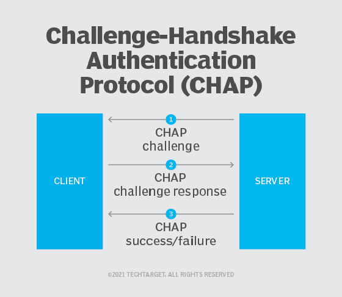
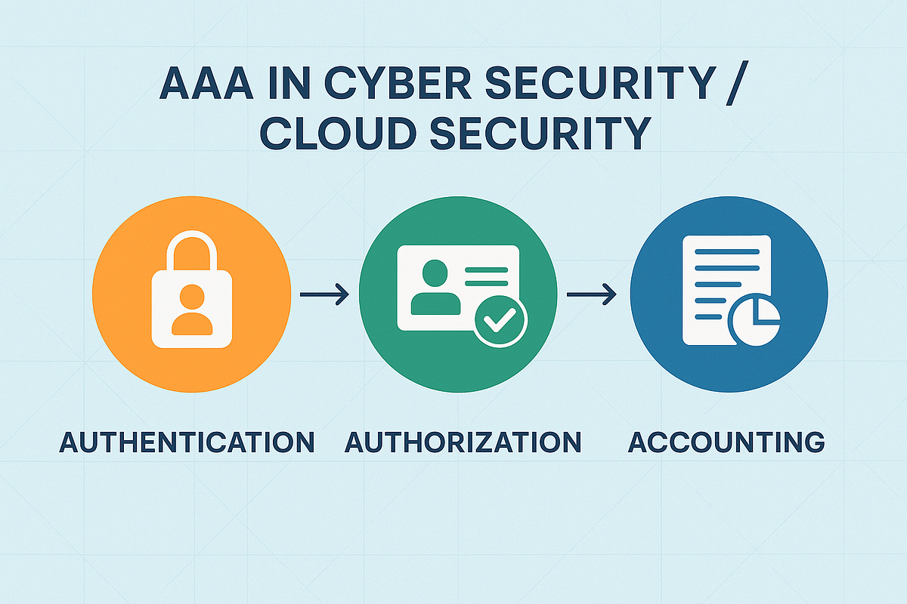
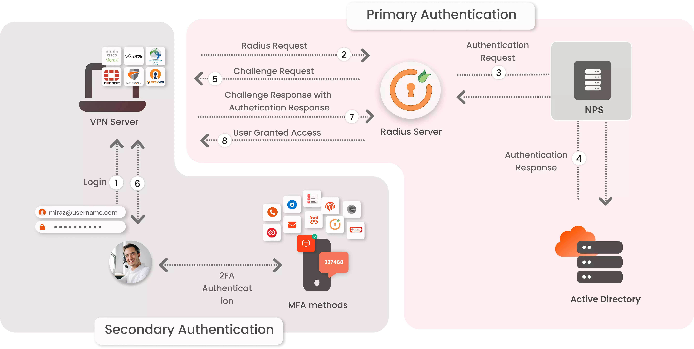
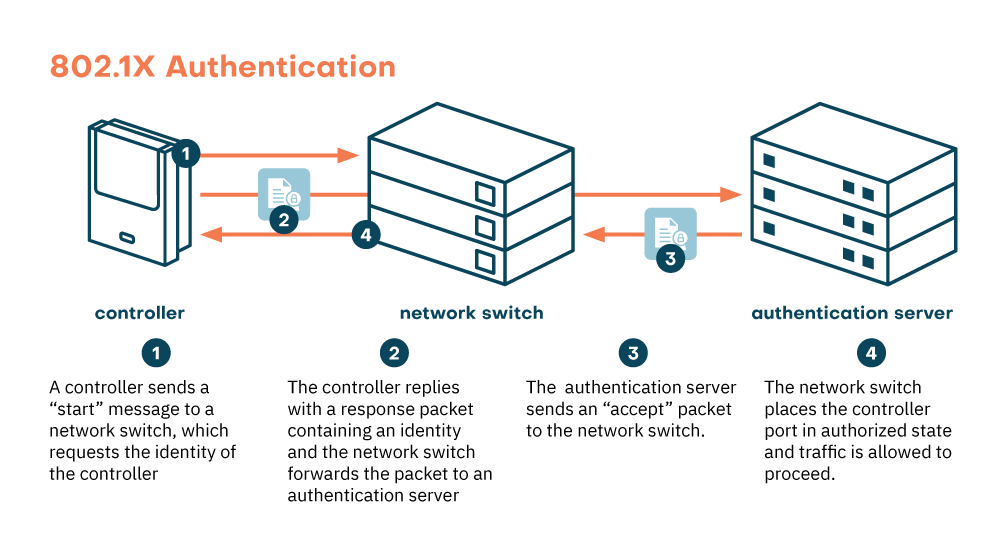
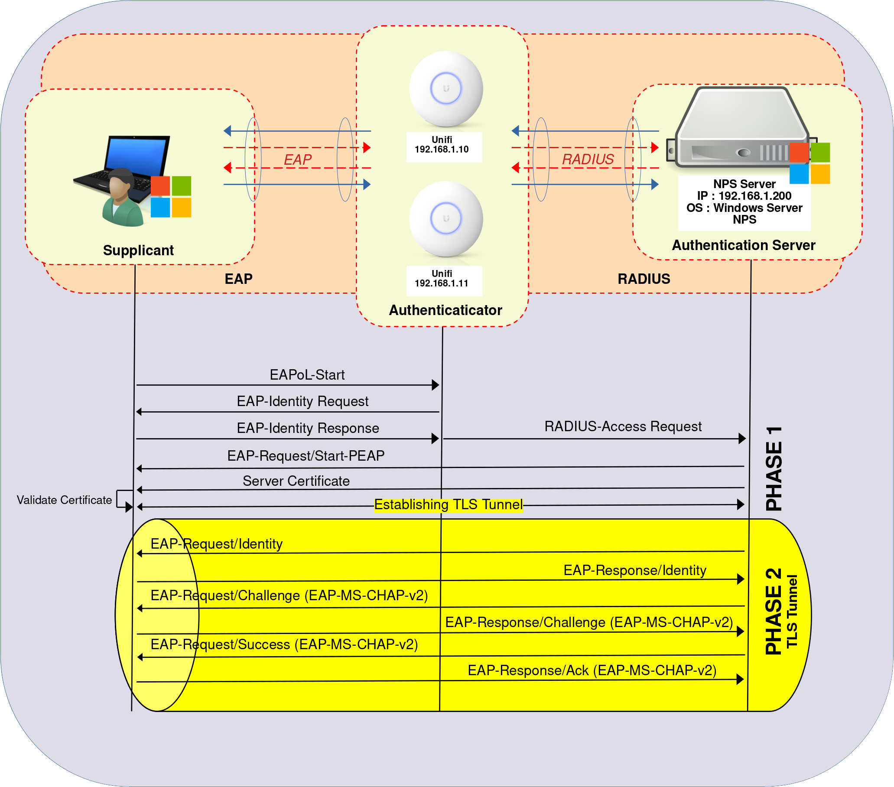
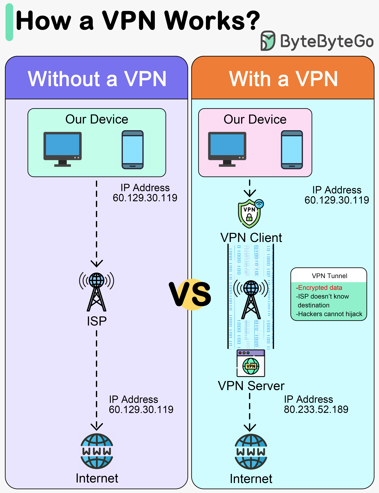
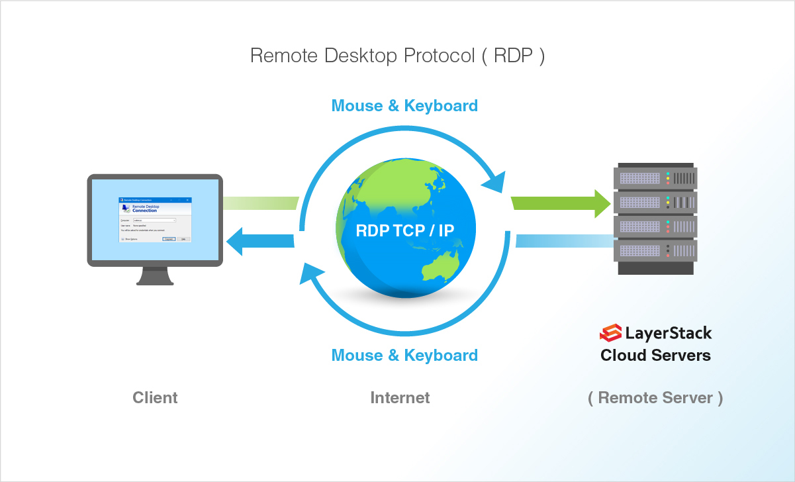

<h1 align="center">1️⃣7️⃣ Authentication and Access Control</h1>

موضوع المصادقة والتحكم بالوصول هو حجر الأساس اللي بيربط عالم الشبكات بعالم الأمان (Security)؛ كل تقنية هنا (بروتوكولات المصادقة، AAA، PKI، ACL، VPN) هي أساس أي شهادة أمنية جاية بعد كده. الملف ده بيبدأ بمفهوم المصادقة نفسه، وبعدين بروتوكولاتها الأساسية، وأطر العمل المركزية زي RADIUS، وبعدين التحكم بالوصول على مستوى المنفذ والشبكة، وأخيرًا الشبكات الافتراضية والوصول عن بعد.

## 📑 جدول المحتويات (Table of Contents)

| # | القسم الرئيسي | المواضيع الفرعية |
|:---:|:---:|:---:|
| 1 | [مقدمة عن المصادقة](#intro) | [تعريف المصادقة](#auth-definition) [الغرض منها وآلية عملها](#auth-purpose-mechanism) |
| 2 | [أنواع وعناصر المصادقة الحديثة](#auth-types-modern) | [عناصر المصادقة الخمسة](#auth-factors) [MFA / 2FA](#mfa-2fa) [SSO](#sso) [Federated Identity](#federated-identity) [المصادقة بدون كلمة سر](#passwordless-auth) |
| 3 | [الشهادات الرقمية والبنية التحتية للمفاتيح العامة (PKI)](#pki-certificates) | [تعريف PKI](#pki-definition) [مكونات PKI](#pki-components) [الشهادات الرقمية](#digital-certificates) [دورة حياة الشهادة](#cert-lifecycle) [المصادقة بالشهادات](#cert-based-auth) |
| 4 | [بروتوكول طبقة المنافذ الآمنة (SSL/TLS)](#ssl-tls) | [تعريفه وآلية عمله](#ssl-tls-definition) [استخداماته العملية](#ssl-tls-usage) [DTLS](#ssl-tls-dtls) |
| 5 | [بروتوكولات المصادقة الأساسية](#core-auth-protocols) | [PAP](#pap) [CHAP](#chap) [MS-CHAP](#mschap) [EAP](#eap) [استخدام بروتوكول لبروتوكول آخر](#combining-protocols) |
| 6 | [أطر العمل المركزية للمصادقة (AAA)](#aaa-framework) | [مفهوم AAA](#aaa-concept) [خادم المصادقة بشكل عام](#auth-server-concept) [خدمات الدليل](#directory-services) [LDAP](#ldap) [RADIUS](#radius) [TACACS+](#tacacs-plus) [Diameter](#diameter) [جدول مقارنة](#aaa-comparison-table) |
| 7 | [بروتوكول Kerberos](#kerberos) | - |
| 8 | [بروتوكول 802.1X و NAC](#dot1x-nac) | [أدوار 802.1X الثلاثة](#dot1x-roles) [تدفق EAP/RADIUS الكامل](#dot1x-eap-flow) [أمان منفذ السويتش](#port-security-recap) [Captive Portal](#captive-portal) [NAC: فحص الحالة والعزل](#nac-posture-assessment) [Agent مقابل Agentless NAC](#agent-vs-agentless-nac) |
| 9 | [أمان الشبكات اللاسلكية (ملخص)](#wifi-security-recap) | [معايير WPA](#wpa-standards) [تحسينات WPA3](#wpa3-sae) [حماية الشبكات المفتوحة: OWE](#owe-open-networks) |
| 10 | [قائمة التحكم بالوصول (ACL)](#acl) | [التعريف وآلية العمل](#acl-definition-mechanism) [اتجاه التطبيق](#acl-direction-application) [Wildcard Mask](#wildcard-mask) [Standard ACL](#standard-acl) [Extended ACL](#extended-acl) [Named ACL](#named-acl) [جدول مقارنة الأنواع](#acl-comparison-table) [أوامر الإنشاء والتعديل](#acl-commands) [مثال عملي](#acl-example-scenario) |
| 11 | [الشبكات الافتراضية الخاصة (VPN)](#vpn) | [التعريف وآلية العمل](#vpn-definition-mechanism) [مصادقة VPN](#vpn-authentication) [أنواع VPN](#vpn-types) [Split مقابل Full Tunneling](#split-full-tunneling) [بروتوكول IPsec](#ipsec-protocol) [بروتوكولات IPsec الفرعية: AH و ESP](#ipsec-sub-protocols) [أوضاع IPsec](#ipsec-modes) [مراحل IKE](#ike-phases) [استخدام SSL/TLS/DTLS في VPN](#ssl-tls-dtls-vpn) |
| 12 | [خدمات الوصول عن بعد (RAS)](#ras) | [تعريف RAS ومكوناتها](#ras-definition-components) [سيناريوهات وبروتوكولات الوصول](#ras-scenarios-protocols) [بروتوكول RDP](#rdp) [VNC مقابل RDP](#vnc-vs-rdp) [CLI و SSH](#cli-ssh) |
| 13 | [نماذج ومبادئ التحكم الحديثة بالوصول](#access-control-principles) | [نماذج التحكم بالوصول (RBAC/DAC/MAC/ABAC)](#access-control-models) [Least Privilege](#least-privilege) [Zero Trust](#zero-trust) [PAM](#pam) |

---

<h2 dir="rtl" align="right" id="intro">1️⃣ مقدمة عن المصادقة</h2>

<h3 dir="rtl" align="right" id="auth-definition">🔹 تعريف المصادقة (Authentication)</h3>

<strong>المصادقة (Authentication)</strong> هي العملية اللي بيتم فيها التأكد من هوية شخص أو جهاز بيحاول يوصل لنظام أو شبكة معينة، بمعنى إن النظام بيتأكد إن "أنت فعلاً مين بتدعي إنك هو" قبل ما يسمح لك بأي وصول. المصادقة مختلفة عن التفويض (Authorization) اللي بيحدد إيه اللي مسموح لك تعمله بعد ما تثبت هويتك، والاتنين مع بعض بيبقوا جزء من إطار أشمل هيتفصل في قسم AAA لاحقًا.

<h3 dir="rtl" align="right" id="auth-purpose-mechanism">🔹 الغرض منها وآلية عملها</h3>

الغرض الأساسي من المصادقة إنها تمنع أي شخص غير مصرح له من الوصول للشبكة أو الموارد الحساسة، وبتتم بشكل عام عن طريق مقارنة بيانات (زي اسم مستخدم وكلمة سر، أو شهادة رقمية، أو بصمة) قدمها المستخدم مع بيانات محفوظة مسبقًا في نظام موثوق (زي خادم مصادقة). لو البيانات المقدمة طابقت المحفوظة، يتم قبول الهوية والسماح بالمرحلة التالية (التفويض)؛ لو مطابقتش، يتم رفض الاتصال. الطريقة اللي بيتم بيها التحقق ده بتختلف حسب البروتوكول المستخدم، وهيتفصل كل بروتوكول لوحده في الأقسام الجاية.

---

<h2 dir="rtl" align="right" id="auth-types-modern">2️⃣ أنواع وعناصر المصادقة الحديثة</h2>

<h3 dir="rtl" align="right" id="auth-factors">🔹 عناصر المصادقة الخمسة (Authentication Factors)</h3>

عملية إثبات الهوية بتعتمد على واحد أو أكتر من خمس عناصر أساسية، وكل ما زاد عدد العناصر المستخدمة مع بعض، كل ما زادت قوة المصادقة:

<ul dir="rtl">
<li><strong>Something You Know (حاجة تعرفها):</strong> زي كلمة السر أو رقم الـ PIN.</li>
<li><strong>Something You Have (حاجة معاك):</strong> زي كارت ذكي (Smart Card)، أو تطبيق مصادقة على الموبايل بيولد أكواد مؤقتة (OTP)، أو مفتاح USB أمني.</li>
<li><strong>Something You Are (حاجة إنت هي):</strong> القياسات الحيوية (Biometrics) زي بصمة الإصبع، بصمة الوجه، أو مسح قزحية العين.</li>
<li><strong>Somewhere You Are (مكان إنت فيه):</strong> التحقق من موقع المستخدم الجغرافي (زي عنوان IP أو إحداثيات GPS) للتأكد إن الطلب جاي من مكان متوقع.</li>
<li><strong>Something You Do (حاجة إنت بتعملها):</strong> أنماط سلوكية مميزة للمستخدم، زي طريقة كتابته على الكيبورد (Keystroke Dynamics) أو طريقة توقيعه.</li>
</ul>

<h3 dir="rtl" align="right" id="mfa-2fa">🔹 MFA / 2FA (Multi-Factor Authentication)</h3>

<strong>MFA (Multi-Factor Authentication)</strong> هي استخدام أكتر من عنصر واحد من العناصر الخمسة اللي فاتت مع بعض في نفس عملية المصادقة، عشان لو عنصر واحد اتخترق (زي كلمة السر اتسرقت)، لسه المهاجم محتاج العنصر التاني عشان يقدر يدخل. لازم العناصر تكون من فئات مختلفة (مش نفس الفئة مرتين) عشان تتحسب MFA فعليًا؛ يعني كلمة سر + سؤال أمني (الاتنين "حاجة تعرفها") مش MFA حقيقية. <strong>2FA (Two-Factor Authentication)</strong> هي حالة خاصة من الـ MFA بتستخدم عنصرين بالظبط بس، وهي الأكتر شيوعًا في التطبيقات العملية (زي كلمة سر + كود OTP من الموبايل).

<h3 dir="rtl" align="right" id="sso">🔹 SSO (Single Sign-On)</h3>

<strong>SSO (Single Sign-On)</strong> هو مفهوم تسجيل الدخول الموحد، وفيه المستخدم بيسجل دخوله مرة واحدة بس على نظام مصادقة مركزي، وبعدها يقدر يوصل لكل الخدمات والتطبيقات المرتبطة بالنظام ده من غير ما يحتاج يعيد إدخال بياناته مرة تانية لكل خدمة. الفايدة الأساسية إنها بتحسن تجربة المستخدم وبتقلل عدد كلمات السر اللي محتاج يتذكرها، لكن في المقابل، لو حساب الـ SSO المركزي نفسه اتخترق، المهاجم بيوصل لكل الخدمات المرتبطة بيه دفعة واحدة، فمهم جدًا يترافق مع MFA قوية.

<h3 dir="rtl" align="right" id="federated-identity">🔹 Federated Identity & Cloud Auth</h3>

<strong>Federated Identity</strong> هو مفهوم بيسمح لمؤسسات أو أنظمة مختلفة إنها تثق في نفس هوية المستخدم من غير ما كل نظام يحتاج يحتفظ بنسخته الخاصة من بيانات المستخدم، وبيتحقق عمليًا عن طريق بروتوكولات مصادقة الويب والسحاب:

<ul dir="rtl">
<li><strong>SAML 2.0 (Security Assertion Markup Language):</strong> بروتوكول قديم نسبيًا بيعتمد على تبادل رسائل بصيغة XML بين مزود الهوية (Identity Provider) ومزود الخدمة (Service Provider)، وبيستخدم بكثرة في بيئات الشركات المؤسسية للـ SSO.</li>
<li><strong>OAuth 2.0:</strong> بروتوكول تفويض (Authorization) في الأساس مش مصادقة، بيسمح لتطبيق معين إنه يوصل لموارد محدودة في حساب المستخدم على خدمة تانية من غير ما ياخد كلمة السر بتاعته (زي "تسجيل الدخول بحساب جوجل" اللي بيدي التطبيق صلاحية محدودة بس).</li>
<li><strong>OIDC (OpenID Connect):</strong> طبقة مصادقة مبنية فوق OAuth 2.0 مباشرة، بتضيف له القدرة على التحقق من هوية المستخدم فعليًا مش بس التفويض، وبقت المعيار الحديث الأكتر شيوعًا لتسجيل الدخول عبر خدمات الطرف الثالث.</li>
</ul>

<h3 dir="rtl" align="right" id="passwordless-auth">🔹 المصادقة بدون كلمة سر (Passwordless Authentication)</h3>

اتجاه حديث بيحاول يلغي الاعتماد على كلمة السر التقليدية تمامًا من العملية، لأنها أضعف عنصر في أي نظام مصادقة (سهلة النسيان، التخمين، أو السرقة عبر التصيد الاحتيالي Phishing). بدل كلمة السر، المستخدم بيثبت هويته باستخدام عنصر "حاجة معاه" (زي مفتاح أمان فيزيائي USB) مقترن بعنصر "حاجة هو هي" (زي بصمة أو التعرف على الوجه على نفس الجهاز). المعيار الأساسي اللي بيحقق ده هو <strong>FIDO2</strong>، ومعاه واجهة برمجية بيستخدمها المتصفح والتطبيقات اسمها <strong>WebAuthn</strong>. الميزة الأمنية الكبيرة إن مفتاح المصادقة في الطرق دي بيفضل محلي على جهاز المستخدم ومبيتبعتش عبر الشبكة خالص، وده بيلغي تمامًا فرصة نجاح هجمات التصيد الاحتيالي اللي بتعتمد على خداع المستخدم يكتب كلمة سره في موقع مزيف.

---

<h2 dir="rtl" align="right" id="pki-certificates">3️⃣ الشهادات الرقمية والبنية التحتية للمفاتيح العامة (PKI)</h2>

<h3 dir="rtl" align="right" id="pki-definition">🔹 تعريف PKI</h3>

<strong>PKI (Public Key Infrastructure)</strong> هي منظومة متكاملة من السياسات، الأجهزة، والبرمجيات، مسؤولة عن إنشاء وإدارة وتوزيع وإلغاء الشهادات الرقمية، واللي بتستخدم أساسًا نظام التشفير بالمفتاح العام (Public Key Cryptography) - وفيه كل طرف عنده زوج من المفاتيح: مفتاح عام (Public Key) ممكن يتشارك مع الجميع، ومفتاح خاص (Private Key) بيفضل سري تمامًا. البنية دي هي الأساس اللي بيسمح لجهازين ملهمش أي علاقة سابقة إنهم يثقوا في بعض ويتواصلوا بأمان.

<h3 dir="rtl" align="right" id="pki-components">🔹 المكونات الأساسية للـ PKI</h3>

<ul dir="rtl">
<li><strong>CA (Certificate Authority):</strong> الجهة الموثوقة المسؤولة عن إصدار وتوقيع الشهادات الرقمية، وهي "الجهة اللي بتضمن" إن المفتاح العام فعلاً بتاع صاحبه المُعلن.</li>
<li><strong>RA (Registration Authority):</strong> جهة وسيطة بتتحقق من هوية طالب الشهادة قبل ما تتقدم بطلب إصدارها لـ CA، بتخفف الحمل عن الـ CA الرئيسي.</li>
<li><strong>Certificate Repository / CRL (Certificate Revocation List):</strong> قاعدة بيانات بتحتفظ بقائمة الشهادات اللي اتلغت قبل ما ينتهي وقت صلاحيتها الطبيعي (زي لو المفتاح الخاص اتسرق).</li>
<li><strong>OCSP (Online Certificate Status Protocol):</strong> بروتوكول بديل أحدث للـ CRL، بيسمح بالتحقق الفوري من حالة شهادة معينة (سارية ولا ملغاة) من غير الحاجة لتحميل قائمة كاملة.</li>
</ul>

<h3 dir="rtl" align="right" id="digital-certificates">🔹 الشهادات الرقمية</h3>

<strong>الشهادة الرقمية (Digital Certificate)</strong> هي ملف إلكتروني بيربط مفتاح عام معين بهوية صاحبه (شخص، جهاز، أو خادم)، وبيكون موقّع رقميًا من جهة الـ CA الموثوقة عشان يثبت إن الربط ده صحيح ومعتمد. الشهادة بتحتوي عادة على معلومات زي اسم صاحب الشهادة، المفتاح العام بتاعه، اسم الجهة المُصدرة، تاريخ الإصدار وانتهاء الصلاحية، والتوقيع الرقمي للـ CA نفسها.

<h3 dir="rtl" align="right" id="cert-lifecycle">🔹 دورة حياة الشهادة الرقمية</h3>

<ol dir="rtl">
<li><strong>الإنشاء وطلب التوقيع (CSR - Certificate Signing Request):</strong> الطرف اللي عايز شهادة بيولّد زوج المفاتيح (عام وخاص)، وبيبعت طلب موقّع بالمفتاح العام والمعلومات المطلوبة لجهة الـ CA.</li>
<li><strong>الإصدار (Issuance):</strong> بعد التحقق من الهوية، الـ CA بتوقع الشهادة رقميًا وتصدرها لصاحب الطلب.</li>
<li><strong>الاستخدام (Usage):</strong> الشهادة بتُستخدم في عمليات المصادقة والتشفير المختلفة (زي EAP-TLS اللي هيتفصل في القسم الجاي، أو تصفح المواقع المشفرة HTTPS).</li>
<li><strong>التجديد (Renewal):</strong> قبل انتهاء صلاحية الشهادة، بيتم تجديدها عن طريق إصدار شهادة جديدة.</li>
<li><strong>الإلغاء (Revocation):</strong> لو حصل اختراق للمفتاح الخاص أو أي مشكلة أمنية قبل انتهاء الصلاحية الطبيعية، الـ CA بتضيف الشهادة لقائمة الإلغاء (CRL) أو تحدث حالتها في نظام OCSP، عشان أي طرف يتحقق منها يعرف إنها بقت غير موثوقة.</li>
</ol>

<h3 dir="rtl" align="right" id="cert-based-auth">🔹 المصادقة على الشهادات الرقمية</h3>

المصادقة باستخدام الشهادات الرقمية بتتم عن طريق إثبات إن الطرف فعلاً بيمتلك المفتاح الخاص المرتبط بالمفتاح العام الموجود في الشهادة، من غير ما يحتاج يكشف المفتاح الخاص نفسه لأي طرف تاني (عن طريق عمليات تشفير رياضية زي التوقيع الرقمي). الطريقة دي أقوى بكتير من كلمة السر التقليدية، وهي الأساس اللي هتعتمد عليه بروتوكولات زي EAP-TLS واتصالات VPN وHTTPS، هيتفصلوا في الأقسام الجاية.

---

<h2 dir="rtl" align="right" id="ssl-tls">4️⃣ بروتوكول طبقة المنافذ الآمنة (SSL/TLS)</h2>

<h3 dir="rtl" align="right" id="ssl-tls-definition">🔹 تعريفه وآلية عمله</h3>

<strong>SSL (Secure Sockets Layer)</strong> و<strong>TLS (Transport Layer Security)</strong> هما بروتوكولات بتوفر تشفير ومصادقة لأي اتصال بين طرفين عبر الشبكة، بيشتغلوا فوق طبقة النقل (Transport Layer) مباشرة. TLS هو النسخة الحديثة والآمنة اللي حلت محل SSL القديم (اللي بقى مهجور بسبب ثغرات أمنية خطيرة)، لكن الاسم "SSL" لسه بيستخدم بشكل شائع في العامية للإشارة لـ TLS.

آلية العمل بتعتمد على عملية اسمها <strong>TLS Handshake</strong>، وبتتم على الخطوات التالية:

<ol dir="rtl">
<li>العميل بيبعت طلب اتصال للخادم، ويقترح إصدارات TLS وخوارزميات تشفير يدعمها.</li>
<li>الخادم بيرد باختيار الإصدار والخوارزمية، وبيبعت <strong>شهادته الرقمية</strong> (اللي شرحناها في قسم PKI اللي فات) عشان يثبت هويته للعميل.</li>
<li>العميل بيتحقق من صحة الشهادة (إنها موقعة من CA موثوقة ومش منتهية أو ملغاة)، وبعدين بيستخدم المفتاح العام الموجود في الشهادة عشان يشفر ويبعت مفتاح جلسة مؤقت (Session Key) للخادم.</li>
<li>من دلوقتي، الطرفين بيستخدموا مفتاح الجلسة المؤقت ده عشان يشفروا كل البيانات المتبادلة بينهم بتشفير متماثل (Symmetric Encryption) اللي أسرع بكتير من تشفير المفتاح العام في نقل كميات بيانات كبيرة.</li>
</ol>

<h3 dir="rtl" align="right" id="ssl-tls-usage">🔹 استخداماته العملية</h3>

SSL/TLS مش مرتبط بتطبيق واحد بس، لكنه طبقة أمان عامة بتُستخدم في حاجات كتير جدًا: تأمين تصفح المواقع (HTTPS بيستخدم TLS فوق HTTP)، تأمين رسائل البريد الإلكتروني، وكمان بيُستخدم كأساس لبناء أنفاق VPN كاملة (هيتفصل في قسم VPN لاحقًا)، بالإضافة لكونه الأساس اللي بروتوكولات مصادقة زي EAP-TLS وPEAP بتبني عليه النفق المشفر بينها وبين خادم المصادقة.

<h3 dir="rtl" align="right" id="ssl-tls-dtls">🔹 DTLS (Datagram TLS)</h3>

<strong>DTLS</strong> هو نسخة من TLS مصممة عشان تشتغل فوق بروتوكول <strong>UDP</strong> بدل TCP، لأن TLS التقليدي مبني على افتراض إن البيانات بتوصل بترتيب موثوق (زي ما TCP بيوفر)، وده مش متاح مع UDP. الفايدة الأساسية من DTLS إنه بيوفر أداء أفضل للتطبيقات الحساسة للتأخير الزمني (زي نقل الصوت والفيديو، أو أنفاق VPN اللي محتاجة سرعة استجابة عالية)، لأنه بيتجنب أعباء إعادة الإرسال المعقدة بتاعة TCP.

---

<h2 dir="rtl" align="right" id="core-auth-protocols">5️⃣ بروتوكولات المصادقة الأساسية</h2>

<h3 dir="rtl" align="right" id="pap">🔹 PAP (Password Authentication Protocol)</h3>

<strong>PAP</strong> هو أبسط وأقدم بروتوكول لمصادقة اتصالات الشبكة (خصوصًا اتصالات PPP)، وآلية عمله بسيطة جدًا: الجهاز العميل بيبعت اسم المستخدم وكلمة السر لجهاز الاستقبال <strong>كنص واضح (Plaintext)</strong> من غير أي تشفير، والجهاز المستقبِل بيقارنهم بالبيانات المحفوظة عنده، ولو طابقوا بيقبل الاتصال.

<ul dir="rtl">
<li><strong>مكوناته:</strong> جهاز عميل (Client) وجهاز مصادقة (Authenticator) بس، من غير أي تعقيد إضافي.</li>
<li><strong>خطوات المصادقة:</strong> (1) العميل بيبعت اسم المستخدم وكلمة السر مرة واحدة، (2) المستقبِل بيتحقق منهم، (3) رد بالقبول أو الرفض.</li>
<li><strong>درجة الأمان:</strong> ضعيفة جدًا وغير آمنة تمامًا، لأن أي جهاز بيتنصت على الخط (Sniffing) يقدر يقرأ كلمة السر مباشرة بما إنها بترسل من غير تشفير.</li>
<li><strong>استخداماته:</strong> مهجور حاليًا في أي بيئة حديثة، وموجود بس كمرجع تاريخي أو كحل احتياطي أخير في بعض الأجهزة القديمة جدًا.</li>
</ul>

<h3 dir="rtl" align="right" id="chap">🔹 CHAP (Challenge Handshake Authentication Protocol)</h3>

 <em>الخطوات الثلاث لعملية مصادقة CHAP بين العميل والخادم</em>

<strong>CHAP</strong> هو بروتوكول مصادقة أقوى بكتير من PAP، وفكرته الأساسية إنه <strong>مش بيبعت كلمة السر نفسها أبدًا</strong> عبر الشبكة، وده بيحميه من هجمات التنصت اللي كانت بتكسر PAP بسهولة.

<ul dir="rtl">
<li><strong>مكوناته:</strong> جهاز عميل (Client)، جهاز خادم (Server)، وسر مشترك (Shared Secret) معروف للطرفين مسبقًا.</li>
<li><strong>آلية العمل وخطوات المصادقة:</strong>
  <ol dir="rtl">
    <li>العميل بيطلب الاتصال بالخادم.</li>
    <li>الخادم بيبعت للعميل قيمة عشوائية (Challenge) مختلفة في كل مرة.</li>
    <li>العميل بيدمج القيمة العشوائية دي مع السر المشترك، وبيعمل عليهم دالة هاش (Hash) - غالبًا MD5 - وبيبعت الناتج (Response) للخادم.</li>
    <li>الخادم بيعمل نفس عملية الهاش على نفس القيمة العشوائية مع السر المشترك اللي عنده هو، ولو الناتج طابق اللي جاله من العميل، يتم قبول الاتصال (Authentication Success)؛ لو مطابقش، يتم الرفض (Authentication Failure).</li>
  </ol>
</li>
<li><strong>درجة الأمان:</strong> أعلى بكتير من PAP لأن السر المشترك نفسه مبيتبعتش أبدًا عبر الشبكة، بس فيه ميزة إضافية مهمة: الخادم بيعيد عملية التحدي (Challenge) بشكل دوري أثناء الاتصال (مش مرة واحدة بس في البداية)، وده بيحمي من هجمات إعادة الإرسال (Replay Attacks).</li>
<li><strong>استخداماته:</strong> كان منتشر جدًا في اتصالات PPP القديمة (زي اتصالات الـ Dial-up) وبعض وصلات WAN، ولسه بيستخدم كجزء من بروتوكولات أحدث زي MS-CHAP.</li>
</ul>

<h3 dir="rtl" align="right" id="mschap">🔹 MS-CHAP</h3>

<strong>MS-CHAP</strong> هو نسخة معدّلة من CHAP طورتها شركة Microsoft، بتعمل بنفس المبدأ الأساسي (تحدي واستجابة عن طريق هاش بدل إرسال كلمة السر مباشرة)، لكن بتضيف بعض التحسينات المتوافقة مع بيئة Windows.

<ul dir="rtl">
<li><strong>الإصدارات:</strong> فيه إصدارين أساسيين، <strong>MS-CHAPv1</strong> القديم اللي فيه ثغرات أمنية معروفة، و<strong>MS-CHAPv2</strong> الأحدث والأكتر أمانًا، واللي بيضيف ميزة مهمة وهي <strong>المصادقة المتبادلة (Mutual Authentication)</strong> - يعني مش بس العميل بيثبت هويته للخادم، لكن الخادم كمان بيثبت هويته للعميل، وده بيحمي من هجمات انتحال الخادم (Rogue Server).</li>
<li><strong>درجة الأمان:</strong> MS-CHAPv2 أقوى من CHAP التقليدي بسبب المصادقة المتبادلة، لكن اتكتشفت فيه ثغرات لاحقًا بتسمح بكسر التشفير في ظروف معينة، فبقى ينصح باستخدامه جوه نفق مشفر إضافي (زي PEAP) بدل ما يستخدم لوحده.</li>
<li><strong>استخداماته:</strong> بيستخدم بكثرة كطريقة مصادقة داخلية جوه بروتوكولات EAP الحديثة (زي PEAP-MSCHAPv2)، وهيظهر تاني في قسم 802.1X لاحقًا.</li>
</ul>

<h3 dir="rtl" align="right" id="eap">🔹 EAP (Extensible Authentication Framework)</h3>

<strong>EAP</strong> مش بروتوكول مصادقة واحد بذاته، لكنه <strong>إطار عمل (Framework)</strong> عام ومرن بيسمح باستخدام طرق مصادقة مختلفة جواه، وده معنى كلمة "Extensible" (قابل للتوسعة) في اسمه. EAP بيوفر بس الهيكل العام لتبادل رسائل المصادقة، أما تفاصيل طريقة التحقق الفعلية فبتتحدد حسب النوع الفرعي المستخدم جواه.

<ul dir="rtl">
<li><strong>أهم الأنواع الفرعية لـ EAP:</strong>
  <ul dir="rtl">
    <li><strong>EAP-MD5:</strong> أبسط الأنواع، بيستخدم آلية شبيهة بـ CHAP، لكنه ضعيف نسبيًا ومش بيدعم مصادقة متبادلة.</li>
    <li><strong>EAP-TLS:</strong> يعتمد بالكامل على الشهادات الرقمية (زي ما شرحنا في قسم PKI) لكل من العميل والخادم، وهو من أقوى أنواع EAP أمانًا لكنه محتاج بنية تحتية لإدارة الشهادات.</li>
    <li><strong>PEAP (Protected EAP):</strong> بينشئ نفق مشفر (TLS Tunnel) بين العميل والخادم أولاً باستخدام شهادة الخادم بس، وجوه النفق ده بيتم تبادل بيانات مصادقة أبسط (غالبًا MS-CHAPv2)، وده بيجمع بين أمان الشهادات وسهولة إدارة كلمات السر التقليدية.</li>
  </ul>
</li>
<li><strong>آلية العمل العامة:</strong> EAP بيشتغل غالبًا فوق بروتوكول 802.1X، وبيتبادل الرسائل بين العميل (Supplicant) وجهاز الوصول (Authenticator) وخادم المصادقة (زي RADIUS)، وهيتفصل التدفق الكامل ده بالرسم في قسم 802.1X لاحقًا.</li>
<li><strong>استخداماته:</strong> الأساس اللي بتعتمد عليه معظم شبكات Wi-Fi المؤسسية (WPA2/WPA3-Enterprise) والشبكات السلكية اللي بتستخدم 802.1X للمصادقة على مستوى المنفذ.</li>
</ul>

<h3 dir="rtl" align="right" id="combining-protocols">🔹 إمكانية استخدام واستيعاب بروتوكول لبروتوكول آخر</h3>

البروتوكولات اللي شرحناها لحد دلوقتي مش لازم تتستخدم كل واحدة لوحدها بشكل منفصل؛ من الشائع جدًا إن بروتوكول مصادقة "يستوعب" بروتوكول تاني جواه عشان يجمع بين مميزات الاتنين. المثال الأوضح على كده هو <strong>PEAP</strong> اللي شرحناه فوق بالظبط: هو أصلاً نوع فرعي من EAP، لكنه بيستخدم بروتوكول <strong>TLS</strong> (نفس مبدأ تأمين الاتصال المستخدم في PKI) عشان يبني نفق مشفر أولاً، وبعدين جوه النفق ده بيستخدم بروتوكول <strong>MS-CHAPv2</strong> عشان يتم التحقق الفعلي من كلمة السر. يعني في العملية الواحدة دي، عندنا ثلاث بروتوكولات شغالة مع بعض: EAP كإطار العمل العام، TLS لتأمين القناة، وMS-CHAPv2 للتحقق الفعلي من الهوية. نفس المبدأ هنشوفه تاني وبشكل أوضح في تدفق 802.1X الكامل في القسم الجاي، واللي بيجمع بين EAP وRADIUS مع بعض في نفس العملية.

---

<h2 dir="rtl" align="right" id="aaa-framework">6️⃣ أطر العمل المركزية للمصادقة (AAA)</h2>

<h3 dir="rtl" align="right" id="aaa-concept">🔹 مفهوم AAA</h3>

 <em>المراحل الثلاث لإطار عمل AAA</em>

<strong>AAA</strong> هو إطار عمل بيوصف ثلاث عمليات متتالية بتحصل لأي مستخدم بيحاول يوصل لنظام أو شبكة:

<ul dir="rtl">
<li><strong>Authentication (المصادقة):</strong> التأكد من هوية المستخدم فعليًا (هو مين بيدعي إنه هو)، باستخدام أي من البروتوكولات اللي شرحناها فوق (PAP, CHAP, EAP...إلخ).</li>
<li><strong>Authorization (التفويض):</strong> بعد ما تثبت الهوية، تحديد إيه بالظبط المسموح للمستخدم ده يعمله (أي موارد يوصلها، أي أوامر يقدر ينفذها).</li>
<li><strong>Accounting (المحاسبة/التسجيل):</strong> تسجيل كل نشاط المستخدم على النظام (وقت الدخول، مدة الجلسة، البيانات اللي اتنقلت، الأوامر اللي اتنفذت) لأغراض المراجعة الأمنية والتدقيق.</li>
</ul>

AAA مفهوم عام، والتطبيق الفعلي بيتم عن طريق بروتوكولات وخوادم متخصصة، أهمها RADIUS وTACACS+ وDiameter اللي هنشرحهم دلوقتي.

<h3 dir="rtl" align="right" id="auth-server-concept">🔹 خادم المصادقة (Authentication Server) بشكل عام</h3>

قبل ما ندخل في تفاصيل كل بروتوكول لوحده، مهم نفهم <strong>خادم المصادقة (Authentication Server)</strong> كمفهوم عام: هو جهاز أو خدمة مركزية مسؤولة عن تخزين بيانات اعتماد المستخدمين (أو الاتصال بمصدر خارجي بيخزنها زي Active Directory)، واستقبال طلبات التحقق من الهوية من أجهزة الشبكة المختلفة (زي سويتشات، نقاط وصول، أو خوادم VPN)، والرد عليها بالقبول أو الرفض. الفكرة الأساسية إن أجهزة الشبكة نفسها (اللي بيتصل بيها المستخدم مباشرة) <strong>مش لازم تحتفظ ببيانات كل مستخدم</strong>؛ بدل كده، بتبعت طلب المصادقة لخادم مركزي واحد بيدير كل الحسابات من مكان واحد، وده بيسهل الإدارة بشكل كبير (تغيير كلمة سر أو إلغاء حساب مستخدم بيتم مرة واحدة بس على الخادم المركزي، بدل ما يتكرر على كل جهاز شبكة لوحده). RADIUS وTACACS+ وDiameter هي بروتوكولات التواصل اللي بتحدد إزاي أجهزة الشبكة بتتواصل مع خادم المصادقة ده بالتحديد.

<h3 dir="rtl" align="right" id="directory-services">🔹 خدمات الدليل (Directory Services)</h3>

لكن السؤال اللي بيسبق كل ده: خادم المصادقة نفسه إزاي بيخزن ويستعلم عن بيانات آلاف المستخدمين بكفاءة؟ الإجابة غالبًا بتكون عن طريق <strong>خدمة دليل (Directory Service)</strong> - قاعدة بيانات متخصصة ومنظمة هرميًا (Hierarchical) لتخزين معلومات الكيانات المختلفة في المؤسسة (مستخدمين، أجهزة، مجموعات، صلاحيات) في مكان مركزي واحد بدل ما تتفرق. أشهر تطبيق عملي ليها هو <strong>Active Directory</strong> من Microsoft، لكن المبدأ العام (تنظيم هرمي لكل هويات المؤسسة) بيتكرر في أنظمة تانية كتير برضو. البروتوكول القياسي المستخدم للاستعلام والتعديل في خدمة الدليل دي هو <strong>LDAP</strong>، هنشرحه دلوقتي.

<h3 dir="rtl" align="right" id="ldap">🔹 LDAP (Lightweight Directory Access Protocol)</h3>

<strong>LDAP</strong> هو البروتوكول القياسي المستخدم للتواصل مع خدمة الدليل، سواء للاستعلام عن بيانات موجودة أو التعديل عليها.

<ul dir="rtl">
<li><strong>آلية العمل:</strong> البيانات في LDAP بتتنظم في هيكل شجري (Directory Information Tree)، وكل كائن (Object) - زي مستخدم أو جهاز - ليه مسار فريد يوصفه (Distinguished Name)، وأي تطبيق أو خدمة (زي خادم RADIUS) يقدر يبعت استعلام لخادم LDAP يسأل فيه عن بيانات مستخدم معين أو يتحقق من كلمة سره.</li>
<li><strong>علاقته بباقي البروتوكولات:</strong> LDAP مش بروتوكول AAA بذاته (مبيوفرش Accounting مثلاً)، لكنه غالبًا الطبقة اللي بتقف <strong>خلف</strong> خوادم RADIUS وTACACS+ وحتى Kerberos، يعني لما خادم RADIUS يستقبل طلب مصادقة، ممكن يستعلم هو نفسه من خادم LDAP/Active Directory عشان يتأكد من بيانات المستخدم، بدل ما يحتفظ بنسخته الخاصة منها.</li>
<li><strong>الأمان:</strong> بروتوكول LDAP التقليدي بينقل البيانات كنص واضح غير مشفر، فبينصح دايمًا باستخدام النسخة المؤمنة <strong>LDAPS (LDAP over SSL/TLS)</strong> - وهنا بيظهر تاني تطبيق عملي لبروتوكول SSL/TLS اللي شرحناه فوق.</li>
</ul>

<h3 dir="rtl" align="right" id="radius">🔹 RADIUS (Remote Authentication Dial-In User Service)</h3>

 <em>تدفق كامل لعملية مصادقة RADIUS متعددة العوامل عبر VPN</em>

<strong>RADIUS</strong> هو أشهر بروتوكول AAA مركزي، وبيسمح بإدارة حسابات المستخدمين من مكان واحد بدل تخزينهم على كل جهاز شبكة بشكل منفصل.

<ul dir="rtl">
<li><strong>مكوناته:</strong> جهاز العميل (زي Access Point أو VPN Server أو Switch يدعم 802.1X)، خادم RADIUS نفسه، وقاعدة بيانات المستخدمين (ممكن تكون محلية على الخادم أو مرتبطة بنظام خارجي زي Active Directory).</li>
<li><strong>آلية العمل:</strong> جهاز العميل (اللي بيتصرف كـ Client من منظور RADIUS حتى لو هو أصلاً Server لجهاز المستخدم النهائي) بيبعت طلب مصادقة لخادم RADIUS يحتوي على بيانات المستخدم، الخادم بيتحقق منها ويرد بالقبول (Access-Accept) أو الرفض (Access-Reject)، وممكن كمان يطلب معلومات إضافية (Access-Challenge) في حالة استخدام MFA.</li>
<li><strong>خصائصه التقنية:</strong> بيستخدم بروتوكول UDP للنقل (منافذ 1812 للمصادقة و1813 للمحاسبة)، وبيشفر كلمة السر بس في الرسائل المتبادلة، أما باقي بيانات الحزمة فبتفضل غير مشفرة بالكامل، وده أحد الفروق المهمة عن TACACS+.</li>
<li><strong>درجة الأمان:</strong> جيدة، لكن بما إن التشفير جزئي بس (كلمة السر فقط)، بينصح بتشغيله جوه بيئة شبكة موثوقة أو عبر نفق مشفر إضافي.</li>
<li><strong>استخداماته:</strong> المصادقة على شبكات Wi-Fi المؤسسية، مصادقة اتصالات VPN، ومصادقة 802.1X على المنافذ السلكية.</li>
</ul>

<h3 dir="rtl" align="right" id="tacacs-plus">🔹 TACACS+ (Terminal Access Controller Access-Control System Plus)</h3>

<strong>TACACS+</strong> بروتوكول AAA تاني، طورته شركة Cisco، وبيتشابه مع RADIUS في الهدف العام لكنه مختلف في التفاصيل التقنية والفلسفة.

<ul dir="rtl">
<li><strong>الفرق الأساسي عن RADIUS:</strong> TACACS+ بيفصل بين مراحل الـ AAA الثلاثة (يقدر يعامل كل مرحلة بشكل منفصل تمامًا)، بينما RADIUS بيدمج المصادقة والتفويض مع بعض في خطوة واحدة غالبًا. كمان TACACS+ بيستخدم بروتوكول TCP (منفذ 49) بدل UDP، وبيشفر <strong>محتوى الحزمة بالكامل</strong> مش كلمة السر بس زي RADIUS، وده بيخليه أكتر أمانًا من ناحية حماية البيانات المنقولة.</li>
<li><strong>آلية العمل:</strong> شبيهة بـ RADIUS من ناحية المبدأ العام (Client يبعت طلب لخادم TACACS+ مركزي)، لكن بيسمح بتحكم أدق جدًا في التفويض، زي تحديد أوامر معينة بالظبط مسموح للمستخدم ينفذها على جهاز الشبكة (Command Authorization).</li>
<li><strong>استخداماته:</strong> بيستخدم بشكل رئيسي لإدارة الوصول لأجهزة الشبكة نفسها (Device Administration) زي السويتشات والراوترات، يعني بيتحكم في مين يقدر يدخل على واجهة إدارة الجهاز وينفذ أنهي أوامر بالظبط، عكس RADIUS اللي بيستخدم غالبًا لمصادقة المستخدمين النهائيين على الشبكة.</li>
</ul>

<h3 dir="rtl" align="right" id="diameter">🔹 Diameter</h3>

<strong>Diameter</strong> هو بروتوكول AAA أحدث، صُمم أصلاً كخليفة لـ RADIUS عشان يحل مشاكله ويتعامل مع بيئات أكبر وأكتر تعقيدًا زي شبكات الاتصالات الخلوية الحديثة (4G/5G).

<ul dir="rtl">
<li><strong>التحسينات عن RADIUS:</strong> بيستخدم بروتوكول TCP أو SCTP بدل UDP (اتصال أكتر موثوقية)، بيدعم عدد أكبر بكتير من الأجهزة والجلسات المتزامنة، وبيوفر آلية أفضل للتعامل مع الأخطاء والفشل في نقل الرسائل.</li>
<li><strong>استخداماته:</strong> بيستخدم بشكل أساسي في البنية التحتية لشبكات الاتصالات الخلوية الحديثة، أكتر من كونه بروتوكول شائع في شبكات الشركات التقليدية اللي لسه غالبًا بتعتمد على RADIUS أو TACACS+.</li>
</ul>

<h3 dir="rtl" align="right" id="aaa-comparison-table">🔹 جدول مقارنة بروتوكولات AAA</h3>

<table align="center">
<tr><th>المقارنة</th><th>RADIUS</th><th>TACACS+</th><th>Diameter</th></tr>
<tr><td>بروتوكول النقل</td><td>UDP</td><td>TCP</td><td>TCP / SCTP</td></tr>
<tr><td>ما الذي يُشفَّر</td><td>كلمة السر فقط</td><td>الحزمة بالكامل</td><td>الحزمة بالكامل</td></tr>
<tr><td>فصل مراحل AAA</td><td>مدمجة غالبًا</td><td>منفصلة تمامًا</td><td>مرنة</td></tr>
<tr><td>الاستخدام الشائع</td><td>مصادقة مستخدمي الشبكة (Wi-Fi, VPN, 802.1X)</td><td>إدارة الوصول لأجهزة الشبكة نفسها</td><td>شبكات الاتصالات الخلوية</td></tr>
<tr><td>الجهة المطورة</td><td>معيار مفتوح (IETF)</td><td>Cisco</td><td>معيار مفتوح (IETF)</td></tr>
</table>

---

<h2 dir="rtl" align="right" id="kerberos">7️⃣ بروتوكول Kerberos</h2>

<strong>Kerberos</strong> هو بروتوكول مصادقة قوي بيعتمد على مبدأ مختلف تمامًا عن اللي فات، وهو استخدام <strong>تذاكر (Tickets)</strong> مشفرة بدل إرسال كلمة السر بشكل متكرر عبر الشبكة، وهو المعتمد بشكل أساسي في بيئات Windows Active Directory.

<ul dir="rtl">
<li><strong>مكوناته:</strong>
  <ul dir="rtl">
    <li><strong>Client:</strong> المستخدم اللي طالب المصادقة.</li>
    <li><strong>KDC (Key Distribution Center):</strong> الخادم المركزي المسؤول عن إصدار التذاكر، وبيتكون من جزئين: <strong>AS (Authentication Server)</strong> المسؤول عن المصادقة الأولية، و<strong>TGS (Ticket Granting Service)</strong> المسؤول عن إصدار تذاكر الوصول للخدمات المختلفة.</li>
    <li><strong>Service Server:</strong> الخادم اللي المستخدم عايز يوصله (زي خادم ملفات أو تطبيق).</li>
  </ul>
</li>
<li><strong>آلية العمل وخطوات المصادقة:</strong>
  <ol dir="rtl">
    <li>المستخدم بيبعت طلب مصادقة أولي لخادم AS.</li>
    <li>خادم AS بيتحقق من الهوية وبيرد بـ <strong>TGT (Ticket Granting Ticket)</strong> مشفرة، وهي تذكرة "عامة" بتثبت إن المستخدم اتأكد من هويته بالفعل.</li>
    <li>لما المستخدم يحتاج يوصل لخدمة معينة، بيقدم الـ TGT دي لخادم TGS.</li>
    <li>خادم TGS بيصدر تذكرة خدمة جديدة (Service Ticket) خاصة بالخدمة المطلوبة بالتحديد.</li>
    <li>المستخدم بيقدم تذكرة الخدمة دي مباشرة لخادم الخدمة نفسه، واللي بيتحقق منها ويسمح بالوصول من غير ما يحتاج يتواصل مع خادم المصادقة تاني.</li>
  </ol>
</li>
<li><strong>درجة الأمان:</strong> عالية جدًا، لأن كلمة السر مبتتبعتش عبر الشبكة أبدًا بعد المصادقة الأولية، وكل التذاكر ليها وقت صلاحية محدود (Time-Stamped) بيقلل من فرصة استغلالها لو اتسرقت.</li>
<li><strong>استخداماته:</strong> النظام الافتراضي للمصادقة في بيئات Windows Active Directory، وبيوفر ميزة الـ SSO بشكل طبيعي جوه الشبكة المؤسسية الواحدة، لأن المستخدم بيسجل دخوله مرة واحدة بس ويحصل على TGT يقدر يستخدمها للوصول لعدة خدمات مختلفة من غير ما يعيد إدخال كلمة السر لكل واحدة فيهم.</li>
</ul>

---

<h2 dir="rtl" align="right" id="dot1x-nac">8️⃣ بروتوكول 802.1X و NAC</h2>

<h3 dir="rtl" align="right" id="dot1x-roles">🔹 أدوار 802.1X الثلاثة</h3>

 <em>تدفق مصادقة 802.1X بين العميل والسويتش وخادم المصادقة</em>

<strong>802.1X</strong> هو معيار من IEEE بيوفر مصادقة على مستوى المنفذ (Port-Based Network Access Control)، بمعنى إن أي جهاز بيتصل بمنفذ سويتش أو نقطة وصول لاسلكية لازم يثبت هويته الأول قبل ما يُسمح له بأي وصول فعلي للشبكة (حتى قبل ما ياخد عنوان IP). المعيار ده بيعتمد على ثلاث أدوار أساسية:

<ul dir="rtl">
<li><strong>Supplicant (المتقدم بالطلب):</strong> الجهاز اللي عايز يتصل بالشبكة (زي الكمبيوتر أو الموبايل)، وبيشتغل غالبًا ببرنامج عميل بيدعم بروتوكول EAP.</li>
<li><strong>Authenticator (المصادِق):</strong> جهاز الشبكة اللي المستخدم بيحاول يتصل بيه (زي سويتش أو Access Point)، ووظيفته إنه ينقل رسائل المصادقة بين الـ Supplicant وخادم المصادقة، ومبيتخذش قرار القبول أو الرفض بنفسه.</li>
<li><strong>Authentication Server (خادم المصادقة):</strong> الخادم المركزي (غالبًا RADIUS) اللي بياخد القرار الفعلي بقبول أو رفض المستخدم، بناءً على بيانات الاعتماد المقدمة.</li>
</ul>

قبل نجاح المصادقة، المنفذ بيكون في حالة "غير مصرح" (Unauthorized) ومش بيسمح بمرور أي بيانات عادية غير رسائل المصادقة نفسها، وبعد نجاح المصادقة بيتحول لحالة "مصرح" (Authorized) ويُسمح بمرور البيانات بشكل طبيعي.

<h3 dir="rtl" align="right" id="dot1x-eap-flow">🔹 تدفق EAP/RADIUS الكامل عبر 802.1X</h3>

 <em>تدفق تفصيلي لمصادقة PEAP-MSCHAPv2 عبر 802.1X وRADIUS على مرحلتين</em>

الرسم فوق بيوضح إزاي كل المفاهيم اللي شرحناها لحد دلوقتي (802.1X، EAP، RADIUS، MS-CHAPv2) بتشتغل مع بعضها في عملية واحدة متكاملة:

<ol dir="rtl">
<li>الـ Supplicant بيبدأ الاتصال برسالة <strong>EAPoL-Start</strong> (EAP over LAN) للـ Authenticator.</li>
<li>الـ Authenticator بيطلب هوية المستخدم (EAP-Identity Request)، والمستخدم بيرد بهويته.</li>
<li>الـ Authenticator بيمرر الطلب لخادم RADIUS عن طريق رسالة <strong>RADIUS-Access Request</strong>.</li>
<li><strong>المرحلة الأولى (Phase 1):</strong> بيتم إنشاء نفق TLS مشفر بين الـ Supplicant وخادم المصادقة، باستخدام شهادة رقمية خاصة بالخادم (زي ما شرحنا في قسم PKI وقسم SSL/TLS) للتحقق من هويته أولاً.</li>
<li><strong>المرحلة الثانية (Phase 2):</strong> جوه النفق المشفر ده، بيتم تبادل بيانات المصادقة الفعلية (زي MS-CHAPv2) بأمان تام، وفي حالة النجاح بيتم إرسال تأكيد القبول، ويتحول منفذ السويتش لحالة "مصرح".</li>
</ol>

<h3 dir="rtl" align="right" id="port-security-recap">🔹 أمان منفذ السويتش (Port Security)</h3>

بالتوازي مع 802.1X، فيه ميزة تانية بتضيف طبقة حماية إضافية على مستوى المنفذ الفيزيائي نفسه وهي <strong>Port Security</strong>، وبتسمح للمسؤول بتحديد أقصى عدد من عناوين MAC المسموح بيها على المنفذ، ولو حصل تجاوز للعدد ده، السويتش بياخد أحد ثلاث إجراءات: <strong>Shutdown</strong> (يقفل المنفذ بالكامل تلقائيًا)، <strong>Protect</strong> (يتجاهل الفريمات غير المصرح بيها بصمت)، أو <strong>Restrict</strong> (يتجاهلها لكن بيسجل الحدث ويبلغ المسؤول). الميزة دي بتحمي من محاولة توصيل جهاز إضافي غير مصرح بيه على نفس المنفذ، وبتعمل جنب 802.1X مش بديلة عنه.

<h3 dir="rtl" align="right" id="captive-portal">🔹 Captive Portal</h3>

<strong>Captive Portal</strong> هي صفحة ويب تفاعلية بتظهر تلقائيًا لأي جهاز بيحاول يتصل بشبكة معينة (غالبًا شبكات الضيوف - Guest Networks) قبل ما يُسمح له بالوصول الكامل للإنترنت. بتُستخدم لعرض شروط الاستخدام والموافقة عليها، أو طلب بيانات دخول بسيطة، وبتُعتبر طريقة مصادقة أبسط بكتير من 802.1X، مناسبة للشبكات اللي مش محتاجة نفس مستوى الأمان الصارم (زي شبكات الفنادق والمقاهي).

<h3 dir="rtl" align="right" id="nac-posture-assessment">🔹 NAC كمفهوم أشمل: فحص حالة الجهاز والعزل</h3>

802.1X والـ Captive Portal اللي شرحناهم بيركزوا على سؤال واحد: "مين إنت؟" (هوية المستخدم). لكن <strong>NAC (Network Access Control)</strong> كمفهوم أشمل بيسأل سؤال إضافي مهم: "هل الجهاز نفسه آمن بما فيه الكفاية إنه يدخل الشبكة؟" حتى لو هوية المستخدم سليمة 100%.

<ul dir="rtl">
<li><strong>Posture Assessment (تقييم الحالة):</strong> قبل أو أثناء السماح بالدخول، نظام NAC بيفحص حالة الجهاز نفسه: هل نظام التشغيل محدث؟ هل برنامج مكافحة الفيروسات شغال ومحدث؟ هل فيه إعدادات أمنية معينة مفعّلة (زي الـ Firewall المحلي)؟ الفحص ده بيتم بطريقة من طريقتين هنشرحهم دلوقتي (Agent-based أو Agentless).</li>
<li><strong>Quarantine VLAN (شبكة العزل):</strong> لو الجهاز فشل في تقييم الحالة (زي مثلاً برنامج الحماية مش محدث)، النظام مش بيرفضه بالكامل، لكن بيوجهه تلقائيًا لـ VLAN معزول ومحدود الصلاحيات جدًا (Quarantine VLAN)، غالبًا بيسمح بالوصول لخوادم التحديثات بس عشان الجهاز يظبط نفسه، وبعد ما يستوفي الشروط المطلوبة بيتم نقله تلقائيًا للـ VLAN الطبيعي المخصص له.</li>
<li><strong>العلاقة مع 802.1X:</strong> عمليًا، NAC غالبًا بيشتغل جنب 802.1X مش بديل عنه؛ 802.1X بيتأكد من هوية المستخدم أولاً، وبعدين نظام NAC بيضيف طبقة فحص إضافية لحالة الجهاز قبل ما يقرر أنهي VLAN بالظبط يوجهه له.</li>
</ul>

<h3 dir="rtl" align="right" id="agent-vs-agentless-nac">🔹 Agent-based مقابل Agentless NAC</h3>

طريقة تنفيذ عملية Posture Assessment بتختلف حسب إمكانية تثبيت برنامج على الجهاز اللي بيحاول يتصل:

<ul dir="rtl">
<li><strong>Agent-based NAC:</strong> بيحتاج تثبيت برنامج عميل صغير (Agent) على الجهاز نفسه، والبرنامج ده بيفحص حالة الجهاز من الداخل (تحديثات، برامج حماية، إعدادات) وبيبلغ نتيجة الفحص لنظام NAC المركزي. الميزة إنه بيوفر فحص دقيق وعميق جدًا لحالة الجهاز، لكن العيب إنه محتاج تثبيت مسبق، وده صعب أو مستحيل مع أجهزة الضيوف أو الأجهزة الشخصية (BYOD) اللي المؤسسة مالهاش سيطرة عليها.</li>
<li><strong>Agentless NAC:</strong> بيفحص الجهاز من غير ما يحتاج تثبيت أي برنامج عليه، إما عن طريق فحص عبر المتصفح (Web-based Scan) وقت الاتصال بالـ Captive Portal، أو عن طريق تقنيات فحص من مستوى الشبكة نفسها (زي فحص خصائص حركة الترافيك أو استخدام بروتوكولات إدارة الأجهزة عن بعد). الميزة إنه أسهل بكتير في التطبيق مع أجهزة الضيوف والأجهزة الشخصية، لكن الفحص غالبًا أقل عمقًا ودقة من الطريقة اللي بتعتمد على Agent.</li>
</ul>

---

<h2 dir="rtl" align="right" id="wifi-security-recap">9️⃣ أمان الشبكات اللاسلكية (ملخص)</h2>

<h3 dir="rtl" align="right" id="wpa-standards">🔹 معايير WPA (Personal مقابل Enterprise)</h3>

بروتوكولات تشفير الشبكة اللاسلكية (WEP, WPA, WPA2, WPA3) كل واحد منهم بيقدم وضعين أساسيين للمصادقة: <strong>Personal (PSK)</strong> اللي بيعتمد على كلمة سر مشتركة واحدة لكل المستخدمين (مناسب للشبكات المنزلية الصغيرة)، و<strong>Enterprise</strong> اللي بيعتمد على مصادقة فردية لكل مستخدم عن طريق بروتوكول 802.1X وخادم RADIUS مركزي (اللي شرحناه بالتفصيل فوق)، وده بيوفر أمان أعلى بكتير ومراقبة أدق في البيئات المؤسسية لأن كل مستخدم بيدخل ببياناته الخاصة بدل كلمة سر مشتركة واحدة يعرفها الجميع.

<h3 dir="rtl" align="right" id="wpa3-sae">🔹 تحسينات WPA3: تقنية SAE</h3>

أهم تحسين أمني في WPA3 هو استبدال آلية تبادل المفاتيح التقليدية في وضع الـ Personal (WPA2-PSK) بتقنية <strong>SAE (Simultaneous Authentication of Equals)</strong>، واللي بتوفر حماية أقوى بكتير ضد هجمات تخمين كلمة السر بالقوة (Brute-Force/Dictionary Attacks) حتى لو كانت كلمة السر نفسها مش قوية جدًا، لأن كل محاولة تخمين فاشلة محتاجة تفاعل مباشر ومباشر مع نقطة الوصول (مش مجرد التقاط بيانات مشفرة وتحليلها Offline زي ما كان ممكن يحصل مع WPA2-PSK القديمة).

<h3 dir="rtl" align="right" id="owe-open-networks">🔹 حماية الشبكات المفتوحة: OWE</h3>

تحدي تاني حلته WPA3 هو حماية <strong>الشبكات المفتوحة (Open Networks)</strong> - يعني الشبكات اللي من غير كلمة سر خالص (زي شبكات الـ Wi-Fi المجانية في المقاهي والمطارات). في الأنظمة القديمة، الشبكات دي كانت بتنقل بيانات كل المستخدمين بشكل غير مشفر تمامًا، وأي حد تاني على نفس الشبكة يقدر يتنصت عليها بسهولة. WPA3 قدمت تقنية <strong>OWE (Opportunistic Wireless Encryption)</strong>، واللي بتشفر الترافيك بين كل جهاز ونقطة الوصول بمفتاح فريد ومختلف لكل جهاز، حتى من غير ما يكون فيه كلمة سر مشتركة أصلاً؛ يعني المستخدم لسه بيقدر يدخل الشبكة من غير كلمة سر (زي المتوقع من شبكة "مفتوحة")، لكن بياناته بقت محمية من التنصت من باقي المستخدمين على نفس الشبكة.

---

<h2 dir="rtl" align="right" id="acl">🔟 قائمة التحكم بالوصول (ACL)</h2>

<h3 dir="rtl" align="right" id="acl-definition-mechanism">🔹 التعريف ومبدأ العمل وآلية العمل</h3>

<strong>ACL (Access Control List)</strong> هي مجموعة من القواعد (Rules) بيتم تطبيقها على واجهة (Interface) جهاز شبكة زي راوتر أو سويتش من نوع Layer 3، وبتحدد إيه نوع الترافيك المسموح بمروره (Permit) وإيه اللي ممنوع (Deny)، بناءً على معايير معينة زي عنوان الـ IP المصدر أو الوجهة، البروتوكول، أو رقم البورت.

آلية العمل بتعتمد على مبدأ أساسي: الجهاز بيفحص كل حزمة بيانات واردة أو صادرة، وبيقارنها بقواعد القائمة <strong>بالترتيب من أعلى لتحت</strong>، وأول قاعدة تنطبق على الحزمة بتُطبَّق فورًا (يتم قبولها أو رفضها) من غير ما يكمل فحص باقي القواعد. لو الحزمة معملتش Match مع أي قاعدة في القائمة كلها، بيتم رفضها تلقائيًا بسبب قاعدة ضمنية غير مكتوبة في آخر كل ACL اسمها <strong>Implicit Deny</strong>.

<h3 dir="rtl" align="right" id="acl-direction-application">🔹 اتجاه التطبيق وما الذي نستطيع عمله من خلال الـ ACL</h3>

الـ ACL بيتم تطبيقها على واجهة معينة وفي اتجاه محدد:

<ul dir="rtl">
<li><strong>Inbound (وارد):</strong> بيتم فحص الحزمة وهي داخلة للواجهة قبل ما توجه لأي مكان تاني في الجهاز، وده بيوفر معالجة أسرع لأنه بيرفض الحزمة الممنوعة من الأول قبل ما تستهلك موارد المعالجة والتوجيه.</li>
<li><strong>Outbound (صادر):</strong> بيتم فحص الحزمة بعد ما الجهاز يقرر توجيهها ناحية الواجهة دي وقبل ما تخرج فعليًا منها.</li>
</ul>

من أهم الاستخدامات العملية للـ ACL: منع جهاز معين (بعنوان IP محدد) من الوصول للإنترنت بالكامل، منع الوصول لخدمة معينة بس على الإنترنت (زي منع بورت 80 للويب مع السماح بباقي الخدمات)، حماية سيرفرات داخلية من وصول غير مصرح بيه من الشبكة الخارجية، والتحكم في الترافيك بين شبكات فرعية مختلفة (VLANs) داخل نفس المؤسسة.

<h3 dir="rtl" align="right" id="wildcard-mask">🔹 الـ Wildcard Mask</h3>

كل قاعدة ACL محتاجة تحدد "مين العناوين اللي القاعدة دي بتنطبق عليهم"، وده بيتم عن طريق <strong>Wildcard Mask</strong> بدل الـ Subnet Mask العادي اللي اتعلمناه في مواضيع الـ IP Addressing. الفرق الجوهري إن الـ Wildcard Mask بيشتغل بمنطق <strong>عكسي</strong> تمامًا عن الـ Subnet Mask:

<ul dir="rtl">
<li><strong>في الـ Subnet Mask:</strong> البت اللي قيمته <strong>1</strong> معناه "الجزء ده ثابت (Network Portion)"، والبت اللي قيمته <strong>0</strong> معناه "الجزء ده متغير (Host Portion)".</li>
<li><strong>في الـ Wildcard Mask:</strong> العكس بالظبط - البت اللي قيمته <strong>0</strong> معناه "لازم يتطابق بالظبط (Must Match)"، والبت اللي قيمته <strong>1</strong> معناه "مش مهم قيمته، اتجاهله (Don't Care)".</li>
</ul>

مثال عملي: لو عايزين نكتب قاعدة تنطبق على جهاز واحد بالظبط بعنوان 192.168.1.50، هنستخدم Wildcard Mask بقيمة <strong>0.0.0.0</strong> (كل البتات لازم تتطابق تمامًا)، وده بالظبط اللي بيعادله الاختصار <code>host</code> اللي استخدمناه في الأمثلة السابقة. أما لو عايزين نكتب قاعدة تنطبق على شبكة فرعية كاملة زي 192.168.1.0/24، هنستخدم Wildcard Mask بقيمة <strong>0.0.0.255</strong> (أول 3 بايتات لازم تتطابق، والبايت الأخير مش مهم قيمته - يعني أي جهاز في الشبكة دي).

<h3 dir="rtl" align="right" id="standard-acl">🔹 Standard ACL</h3>

<strong>Standard ACL</strong> هي أبسط أنواع الـ ACL، ومعيار الفحص بتاعها (Filtering Criteria) بيعتمد على <strong>عنوان الـ IP المصدر (Source IP) بس</strong>، من غير أي اعتبار لعنوان الوجهة أو نوع البروتوكول أو رقم البورت.

<ul dir="rtl">
<li><strong>النطاق الرقمي (Numbered Range):</strong> من 1 إلى 99، وامتداد إضافي من 1300 إلى 1999 (بعد ما نفد المدى الأول مع نمو الشبكات).</li>
<li><strong>آلية العمل:</strong> بما إنها بتفحص عنوان المصدر بس، فهي مش قادرة تميز بين أنواع الخدمات المختلفة أو الوجهات المختلفة، وبتاخد قرار الفلترة بناءً على "مين اللي باعت الحزمة" بس بغض النظر عن "بيروح فين" أو "بيعمل إيه".</li>
<li><strong>أفضل موضع للتطبيق:</strong> بسبب إنها مش دقيقة (بتمنع أو تسمح لكل ترافيك المصدر ده بغض النظر عن الوجهة)، أفضل مكان لتطبيقها هو <strong>أقرب ما يكون للوجهة (Destination)</strong>، عشان متمنعش ترافيك مشروع كان المفروض يوصل لمكان تاني غير الممنوع فعليًا. لو طبقتها قريب من المصدر، هتمنع الجهاز ده من الوصول لأي حاجة بالكامل حتى لو كنت قاصد تمنعه من وجهة واحدة بس.</li>
<li><strong>مميزاتها:</strong> بسيطة جدًا في الإنشاء والفهم، وسريعة في المعالجة لأنها بتفحص معيار واحد بس.</li>
<li><strong>عيوبها:</strong> غير دقيقة، مش قادرة تفرق بين أنواع الخدمات، وبتفرض قيود عامة جدًا على كل ترافيك المصدر.</li>
</ul>

<h3 dir="rtl" align="right" id="extended-acl">🔹 Extended ACL</h3>

<strong>Extended ACL</strong> هي نسخة أقوى وأدق بكتير، ومعيار الفحص بتاعها بيشمل عدة عناصر مع بعض: <strong>عنوان الـ IP المصدر والوجهة معًا</strong>، <strong>نوع البروتوكول</strong> (TCP, UDP, ICMP...إلخ)، و<strong>أرقام البورتات (Ports)</strong>.

<ul dir="rtl">
<li><strong>النطاق الرقمي (Numbered Range):</strong> من 100 إلى 199، وامتداد إضافي من 2000 إلى 2699.</li>
<li><strong>آلية العمل:</strong> بفضل دقة معايير الفحص المتعددة، الـ Extended ACL تقدر تحدد بالظبط "مين ماسح ايه لمين وبأي خدمة"، زي مثلاً السماح لجهاز معين بس بالوصول لخادم ويب معين على البورت 443 بس، مع منع أي ترافيك تاني.</li>
<li><strong>أفضل موضع للتطبيق:</strong> بسبب دقتها العالية (بتحدد المصدر والوجهة والخدمة مع بعض)، أفضل مكان لتطبيقها هو <strong>أقرب ما يكون للمصدر (Source)</strong>، عشان يتم رفض الترافيك الممنوع من أقرب نقطة ممكنة وتوفير موارد معالجة الشبكة اللي كانت هتستهلك في تمرير حزمة هترفض في النهاية على أي حال.</li>
<li><strong>مميزاتها:</strong> دقة عالية جدًا في التحكم، وبتسمح بسياسات أمنية معقدة ومحددة بدقة.</li>
<li><strong>عيوبها:</strong> أعقد في الإنشاء والإدارة، ومحتاجة فهم أعمق لبروتوكولات الشبكة وأرقام البورتات، وبما إنها بتفحص معايير أكتر، بتستهلك موارد معالجة أكبر شوية من الـ Standard.</li>
</ul>

<h3 dir="rtl" align="right" id="named-acl">🔹 Named ACL</h3>

<strong>Named ACL</strong> مش نوع فلترة جديد فعليًا، لكنها طريقة بديلة لتعريف أي من الـ Standard أو الـ Extended ACL، وبتستخدم <strong>اسم نصي (String)</strong> بدل رقم للتعريف عن القائمة، زي "BLOCK_GUEST_INTERNET" بدل رقم زي 105.

<ul dir="rtl">
<li><strong>معيار الفحص:</strong> نفس معايير الفحص بتاعة النوع الأساسي اللي مبنية عليه (Standard أو Extended)، الفرق بس في طريقة التسمية والتعريف.</li>
<li><strong>النطاق الرقمي:</strong> مفيش نطاق رقمي محدد، لأنها بتستخدم نصوص بدل الأرقام.</li>
<li><strong>أفضل موضع للتطبيق:</strong> بيعتمد على نوعها الأساسي (زي Standard لو قريب من الوجهة، أو Extended لو قريب من المصدر).</li>
<li><strong>مميزاتها الأساسية:</strong> الاسم الوصفي بيسهل جدًا فهم الغرض من القائمة على أول نظرة (بدل ما يكون مجرد رقم مالوش معنى واضح)، وده بيسهل عملية التعديل والصيانة لاحقًا، خصوصًا في الشبكات الكبيرة اللي فيها عدد كبير من الـ ACLs.</li>
<li><strong>ميزة إضافية مهمة:</strong> في بعض الأنظمة، الـ Named ACL بتسمح بإضافة أو حذف قاعدة معينة جوه القائمة من غير الحاجة تمسح القائمة كلها وتعيد كتابتها من الأول (عكس بعض إصدارات الـ Numbered ACL القديمة).</li>
</ul>

<h3 dir="rtl" align="right" id="acl-comparison-table">🔹 جدول مقارنة أنواع الـ ACL</h3>

<table align="center">
<tr><th>نوع الـ ACL</th><th>معيار الفحص (Criteria)</th><th>النطاق الرقمي (Cisco)</th><th>أفضل موضع للتطبيق</th></tr>
<tr><td><strong>Standard ACL</strong></td><td>عنوان IP المصدر فقط (Source IP)</td><td>1-99 &amp; 1300-1999</td><td>أقرب ما يكون للوجهة (Destination)</td></tr>
<tr><td><strong>Extended ACL</strong></td><td>IP (المصدر والوجهة)، البروتوكول، وأرقام البورتات (Ports)</td><td>100-199 &amp; 2000-2699</td><td>أقرب ما يكون للمصدر (Source)</td></tr>
<tr><td><strong>Named ACL</strong></td><td>نفس معايير القياسية أو الممتدة، ولكن تُعرف باسم بدلاً من الرقم (Strings)</td><td>نصوص (Strings)</td><td>حسب نوعها (Standard/Extended)</td></tr>
</table>

<h3 dir="rtl" align="right" id="acl-commands">🔹 الأوامر المستخدمة في إنشاء القائمة وحذفها وتعديلها</h3>

شروط إنشاء ACL بشكل عام: لازم تحدد نوعها (Standard/Extended)، ورقمها أو اسمها، وقواعدها بالترتيب المطلوب، وبعدين تربطها بواجهة معينة واتجاه معين (Inbound/Outbound). أهم الأوامر الأساسية (بصيغة أجهزة Cisco كمثال شائع):

<ul dir="rtl">
<li><strong>إنشاء Standard ACL:</strong> <code>access-list [رقم من 1-99] [permit/deny] [عنوان IP المصدر] [wildcard mask]</code></li>
<li><strong>إنشاء Extended ACL:</strong> <code>access-list [رقم من 100-199] [permit/deny] [بروتوكول] [IP مصدر] [wildcard] [IP وجهة] [wildcard] [eq رقم البورت]</code></li>
<li><strong>إنشاء Named ACL:</strong> <code>ip access-list [standard/extended] [الاسم]</code>، وبعدها تدخل وضع تعديل القائمة وتكتب القواعد سطر سطر.</li>
<li><strong>ربط القائمة بواجهة:</strong> من داخل إعدادات الواجهة (Interface Configuration)، الأمر <code>ip access-group [رقم أو اسم القائمة] [in/out]</code>.</li>
<li><strong>حذف قائمة كاملة:</strong> الأمر <code>no access-list [رقم القائمة]</code>، أو <code>no ip access-list [standard/extended] [الاسم]</code> للـ Named ACL.</li>
<li><strong>تعديل قائمة موجودة (في الـ Named ACL أو الإصدارات الحديثة):</strong> الدخول لوضع تعديل القائمة وإضافة أو حذف سطر معين برقم تسلسلي (Sequence Number) من غير التأثير على باقي القواعد.</li>
</ul>

<h3 dir="rtl" align="right" id="acl-example-scenario">🔹 مثال عملي: منع جهاز من الوصول للإنترنت أو خدمة معينة</h3>

<strong>مثال 1 - منع جهاز بالكامل من الوصول للإنترنت (باستخدام Standard ACL):</strong> لو عايزين نمنع جهاز عنوانه 192.168.1.50 من الوصول لأي حاجة على الإنترنت، هنستخدم Standard ACL لأن الفلترة هنا بناءً على المصدر بس، ونطبقها أقرب ما يكون لواجهة الخروج للإنترنت (قريب من الوجهة):

<ul dir="rtl">
<li><code>access-list 10 deny host 192.168.1.50</code></li>
<li><code>access-list 10 permit any</code> (لازم نضيف السطر ده صراحة عشان نسمح لباقي الأجهزة، وإلا هيتفعل الـ Implicit Deny ويمنع كل حاجة تانية كمان).</li>
<li>وبعدها نربطها بواجهة الخروج للإنترنت في اتجاه Outbound.</li>
</ul>

<strong>مثال 2 - منع جهاز من خدمة معينة بس على الإنترنت (باستخدام Extended ACL):</strong> لو عايزين نمنع نفس الجهاز من تصفح المواقع (بورت 80 وHTTPS بورت 443) بس نسمحله بباقي الخدمات، لازم نستخدم Extended ACL لأننا محتاجين نحدد البروتوكول والبورت مش المصدر بس، ونطبقها أقرب ما يكون للمصدر:

<ul dir="rtl">
<li><code>access-list 110 deny tcp host 192.168.1.50 any eq 80</code></li>
<li><code>access-list 110 deny tcp host 192.168.1.50 any eq 443</code></li>
<li><code>access-list 110 permit ip any any</code> (للسماح بباقي الترافيك).</li>
<li>وبعدها نربطها بالواجهة المتصلة بالجهاز نفسه في اتجاه Inbound.</li>
</ul>

---

<h2 dir="rtl" align="right" id="vpn">1️⃣1️⃣ الشبكات الافتراضية الخاصة (VPN)</h2>

<h3 dir="rtl" align="right" id="vpn-definition-mechanism">🔹 التعريف وآلية العمل</h3>

 <em>الفرق بين الاتصال العادي بالإنترنت والاتصال عبر نفق VPN مشفر</em>

<strong>VPN (Virtual Private Network)</strong> هي تقنية بتنشئ نفق افتراضي مشفر (Encrypted Tunnel) بين جهاز المستخدم وشبكة بعيدة (زي شبكة الشركة) عبر شبكة عامة غير موثوقة زي الإنترنت. من غير VPN، بيانات المستخدم بتمر مباشرة عبر مزود خدمة الإنترنت (ISP) بشكل مكشوف نسبيًا؛ أما مع VPN، البيانات بتتشفر بالكامل جوه النفق، وده بيمنع مزود الإنترنت أو أي طرف بينصت على الشبكة من معرفة محتوى البيانات أو حتى وجهتها النهائية الحقيقية.

<h3 dir="rtl" align="right" id="vpn-authentication">🔹 مصادقة VPN</h3>

قبل ما ينشئ النفق المشفر، لازم طرفي الاتصال (العميل والخادم) يثبتوا هويتهم لبعض، وده بيتم باستخدام أي من الطرق اللي شرحناها فوق: كلمة سر بسيطة، شهادات رقمية (زي ما شرحنا في قسم PKI)، أو مصادقة عبر خادم RADIUS مركزي، وممكن كمان تترافق مع MFA لطبقة حماية إضافية، زي ما ظهر في رسم مصادقة RADIUS اللي فات.

<h3 dir="rtl" align="right" id="vpn-types">🔹 أنواع VPN</h3>

<ul dir="rtl">
<li><strong>Site-to-Site VPN:</strong> نفق دائم بيربط شبكتين كاملتين ببعض (زي فرع شركة بالمقر الرئيسي)، وبيتم إنشاؤه بين جهازي راوتر أو فايروول في الطرفين، والمستخدمين في الشبكتين مش محتاجين يعرفوا حتى إن فيه VPN شغال - كل الاتصال بينهم بيتم تلقائيًا عبر النفق.</li>
<li><strong>Client-to-Site VPN (Remote Access VPN):</strong> نفق مؤقت بيربط جهاز مستخدم فردي (زي موظف بيشتغل من البيت) بشبكة الشركة، وبيحتاج المستخدم يشغل برنامج عميل VPN ويسجل دخوله كل مرة يحتاج يتصل.</li>
</ul>

<h3 dir="rtl" align="right" id="split-full-tunneling">🔹 Split Tunneling مقابل Full Tunneling</h3>

في اتصال Client-to-Site بالتحديد، فيه قرار إعدادي مهم بيتحدد وقت إنشاء النفق: مصير <strong>كل</strong> ترافيك جهاز المستخدم بعد الاتصال بالـ VPN.

<ul dir="rtl">
<li><strong>Full Tunneling:</strong> <strong>كل</strong> ترافيك جهاز المستخدم - سواء متجه لشبكة الشركة أو لموقع عادي على الإنترنت - بيمر عبر نفق الـ VPN أولاً وصولاً لشبكة الشركة، وبعدين لو الوجهة إنترنت عادي، بيخرج من هناك. الميزة إن كل الترافيك بيخضع لسياسات أمان الشركة ومراقبتها حتى لو مكانش متجه لموارد الشركة، لكن العيب إنه بيحمّل نفق الـ VPN وموارد الشركة بترافيك مش لازم يمر بيها أصلاً، وبيبطئ تجربة تصفح الإنترنت العادي للمستخدم.</li>
<li><strong>Split Tunneling:</strong> بس الترافيك المتجه فعليًا لموارد شبكة الشركة هو اللي بيمر عبر النفق المشفر، أما ترافيك الإنترنت العادي (زي تصفح مواقع أو استخدام تطبيقات شخصية) فبيخرج <strong>مباشرة</strong> من جهاز المستخدم لمزود الإنترنت بتاعه من غير ما يمر بالنفق خالص. الميزة إنه بيوفر أداء أسرع وبيقلل الحمل على شبكة الشركة، لكن العيب الأمني إن ترافيك الإنترنت العادي بقى خارج نطاق مراقبة وحماية الشركة تمامًا.</li>
</ul>

<h3 dir="rtl" align="right" id="ipsec-protocol">🔹 بروتوكول IPsec (IP Security)</h3>

<strong>IPsec</strong> هو مجموعة بروتوكولات بتوفر التشفير والمصادقة على مستوى طبقة الشبكة (Layer 3)، وهو من أشهر وأقوى البروتوكولات المستخدمة في بناء أنفاق VPN، خصوصًا من نوع Site-to-Site.

<h3 dir="rtl" align="right" id="ipsec-sub-protocols">🔹 بروتوكولات IPsec الفرعية: AH مقابل ESP</h3>

IPsec مش بروتوكول واحد فعليًا، لكنه بيتكون من بروتوكولين فرعيين بيحددوا نوع الحماية المطبقة على الحزمة:

<ul dir="rtl">
<li><strong>AH (Authentication Header):</strong> بيوفر التحقق من <strong>سلامة البيانات (Integrity)</strong> والمصادقة على مصدر الحزمة، بمعنى إنه بيضمن إن الحزمة مجتش من طرف مزيف ومتغيرتش أثناء النقل، لكنه <strong>مبيشفرش محتوى البيانات نفسه (No Confidentiality)</strong> - يعني أي طرف بيتنصت يقدر يقرأ محتوى الحزمة برضو، بس مش يقدر يغيره من غير ما يتكشف.</li>
<li><strong>ESP (Encapsulating Security Payload):</strong> بيوفر <strong>التشفير الكامل (Confidentiality)</strong> للبيانات بالإضافة للمصادقة وسلامة البيانات مع بعض، وده اللي بيخليه <strong>الأكتر استخدامًا عمليًا</strong> في أغلب أنفاق IPsec الحديثة، لأنه بيغطي كل جوانب الحماية المطلوبة في عملية واحدة.</li>
</ul>

أي من البروتوكولين ممكن يشتغل في وضع Transport أو Tunnel (اللي هنشرحهم دلوقتي)، لكن عمليًا ESP هو الأكتر شيوعًا في التطبيقات الحديثة بسبب دعمه للتشفير الكامل.

<h3 dir="rtl" align="right" id="ipsec-modes">🔹 أوضاع IPsec (Transport مقابل Tunnel)</h3>

<ul dir="rtl">
<li><strong>Transport Mode:</strong> بيشفر <strong>حمولة الحزمة فقط (Payload)</strong>، ويسيب هيدر الـ IP الأصلي زي ما هو من غير تشفير. بيستخدم غالبًا في الاتصال المباشر بين جهازين نهائيين (End-to-End) داخل نفس الشبكة الموثوقة.</li>
<li><strong>Tunnel Mode:</strong> بيشفر <strong>الحزمة بالكامل</strong> (الهيدر الأصلي والحمولة مع بعض)، وبيغلفها جوه هيدر IP جديد تمامًا. ده الوضع المستخدم بشكل شائع في أنفاق Site-to-Site VPN، لأنه بيخفي حتى تفاصيل الشبكة الداخلية الأصلية عن أي طرف بيراقب الترافيك من الخارج.</li>
</ul>

<h3 dir="rtl" align="right" id="ike-phases">🔹 مراحل IKE (Internet Key Exchange)</h3>

<strong>IKE</strong> هو البروتوكول المسؤول عن إنشاء النفق الآمن وتبادل مفاتيح التشفير بين طرفي اتصال IPsec قبل ما يبدأ نقل البيانات الفعلي، وبيتم على مرحلتين:

<ul dir="rtl">
<li><strong>IKE Phase 1:</strong> الطرفين بيتفاوضوا على إنشاء قناة اتصال آمنة ومصادقة أولية بينهم (باستخدام مفتاح مشترك مسبقًا Pre-Shared Key، أو شهادات رقمية)، والهدف الأساسي هو حماية باقي عملية التفاوض اللي جاية في المرحلة التانية.</li>
<li><strong>IKE Phase 2:</strong> جوه القناة الآمنة اللي اتبنت في Phase 1، بيتم التفاوض على تفاصيل نفق IPsec الفعلي (خوارزميات التشفير المستخدمة، مدة صلاحية المفاتيح)، وبعد الاتفاق يبدأ النفق الفعلي ونقل البيانات المشفرة.</li>
</ul>

<h3 dir="rtl" align="right" id="ssl-tls-dtls-vpn">🔹 استخدام SSL/TLS/DTLS في بناء أنفاق VPN</h3>

بديل شائع تاني لـ IPsec هو استخدام بروتوكولات <strong>SSL/TLS</strong> اللي شرحناها بالتفصيل فوق لبناء نفق VPN كامل بدل الاعتماد على IPsec. ميزة الأسلوب ده إنه بيشتغل على مستوى أعلى (قريب من طبقة التطبيقات)، وبيقدر يمر بسهولة عبر معظم الفايروولات من غير إعدادات خاصة (لأنه بيستخدم نفس البورت المستخدم في تصفح المواقع الآمنة HTTPS غالبًا)، وبيستخدم بكثرة في حلول VPN اللي بتشتغل من خلال المتصفح مباشرة (Clientless VPN) أو برامج عميل خفيفة. ولنفس أسباب الأداء اللي شرحناها فوق، نسخة <strong>DTLS</strong> بالتحديد بتُفضَّل في أنفاق VPN الحساسة للتأخير الزمني (زي نقل الصوت والفيديو عبرها).

---

<h2 dir="rtl" align="right" id="ras">1️⃣2️⃣ خدمات الوصول عن بعد (RAS)</h2>

<h3 dir="rtl" align="right" id="ras-definition-components">🔹 تعريف RAS ومكوناتها</h3>

<strong>RAS (Remote Access Service)</strong> هو مصطلح عام بيصف أي خدمة أو تقنية بتسمح للمستخدم بالوصول لجهاز أو شبكة من مكان بعيد، كأنه موجود فيزيائيًا جنبها. مكوناتها الأساسية: جهاز العميل (اللي بيحاول يتصل من بعيد)، خادم الوصول عن بعد (اللي بيستقبل الاتصال ويديره)، وبروتوكول نقل يحمل جلسة الاتصال (زي VPN، RDP، أو SSH).

<h3 dir="rtl" align="right" id="ras-scenarios-protocols">🔹 سيناريوهات وبروتوكولات الوصول عن بعد وتأمينها</h3>

من أشهر سيناريوهات الاستخدام: موظف بيشتغل من البيت ومحتاج يوصل لملفات الشركة، مسؤول شبكة محتاج يدير جهاز راوتر من مكان بعيد، أو فني دعم فني بيحتاج يتحكم في جهاز مستخدم عن بعد لحل مشكلة. البروتوكولات المستخدمة بتختلف حسب طبيعة السيناريو: VPN لربط الشبكات (شرحناه فوق)، RDP وVNC للتحكم الكامل في سطح مكتب جهاز بعيد (هيتفصلوا دلوقتي)، وSSH للوصول لواجهة سطر الأوامر بأمان. تأمين خدمة RAS بشكل عام بيعتمد على نفس المبادئ اللي اتكلمنا عنها: مصادقة قوية (يفضل MFA)، تشفير كامل للجلسة، وتطبيق مبدأ أقل الصلاحيات الممكنة (هيتفصل في القسم الأخير من الملف).

<h3 dir="rtl" align="right" id="rdp">🔹 بروتوكول RDP (Remote Desktop Protocol)</h3>

 <em>اتصال RDP بين جهاز العميل والخادم البعيد عبر الإنترنت</em>

<strong>RDP</strong> بروتوكول طورته Microsoft بيسمح بالتحكم الكامل في سطح مكتب جهاز بعيد، وكأن المستخدم قاعد قدامه فعليًا. بينقل صورة الشاشة من الجهاز البعيد للعميل، وبينقل حركة الماوس وضغطات الكيبورد من العميل للجهاز البعيد، بيستخدم بورت TCP رقم 3389 بشكل افتراضي.

<h3 dir="rtl" align="right" id="vnc-vs-rdp">🔹 VNC والفرق بينه وبين RDP</h3>

<strong>VNC (Virtual Network Computing)</strong> بروتوكول تاني بيوفر نفس فكرة التحكم في سطح مكتب بعيد، لكن بفروق مهمة عن RDP:

<ul dir="rtl">
<li><strong>التوافق مع أنظمة التشغيل:</strong> RDP مرتبط أساسًا بأنظمة Windows (رغم وجود عملاء له على أنظمة تانية)، بينما VNC مستقل عن نظام التشغيل تمامًا ويشتغل على Windows وLinux وmacOS بسهولة.</li>
<li><strong>آلية النقل:</strong> RDP بينقل أوامر رسم الشاشة (Rendering Instructions) بذكاء بدل الصورة الكاملة في كل مرة، وده بيخليه أخف وأسرع عمومًا؛ بينما VNC بينقل صور فعلية لمحتوى الشاشة (Screen Captures) بشكل متكرر، وده ممكن يكون أتقل على الشبكة في بعض الحالات.</li>
<li><strong>الأمان الافتراضي:</strong> RDP بيدعم تشفير مدمج من الأساس، بينما بعض إصدارات VNC القديمة كانت بتحتاج طبقة تشفير إضافية (زي تشغيلها جوه نفق VPN أو SSH) عشان تبقى آمنة بما فيه الكفاية.</li>
</ul>

<h3 dir="rtl" align="right" id="cli-ssh">🔹 CLI و SSH</h3>

بدل التحكم الكامل في سطح مكتب رسومي، بعض السيناريوهات (خصوصًا إدارة أجهزة الشبكة نفسها زي السويتشات والراوترات) بتحتاج بس الوصول لواجهة سطر الأوامر (Command Line Interface - CLI). الطريقة الآمنة للوصول لـ CLI عن بعد هي بروتوكول <strong>SSH (Secure Shell)</strong>، اللي بيوفر جلسة نصية مشفرة بالكامل بين العميل والخادم، وبيستخدم بورت TCP رقم 22 بشكل افتراضي. SSH استبدل بروتوكولات أقدم وأقل أمانًا زي Telnet، اللي كان بينقل كل البيانات (بما فيها كلمة السر) كنص واضح غير مشفر.

---

<h2 dir="rtl" align="right" id="access-control-principles">1️⃣3️⃣ نماذج ومبادئ التحكم الحديثة بالوصول</h2>

<h3 dir="rtl" align="right" id="access-control-models">🔹 نماذج التحكم بالوصول (Access Control Models)</h3>

قبل ما نتكلم عن المبادئ العامة، مهم نفرق بين أربع نماذج كلاسيكية بتحدد <strong>الفلسفة الأساسية</strong> اللي بيتقرر بيها "مين يقدر يوصل لإيه" على مستوى الملفات والأنظمة (مختلفة عن الـ ACL اللي شرحناها فوق، واللي بتتحكم في ترافيك الشبكة تحديدًا لا في صلاحيات الملفات والأنظمة):

<ul dir="rtl">
<li><strong>DAC (Discretionary Access Control):</strong> صاحب المورد نفسه (زي المستخدم اللي أنشأ ملف معين) هو اللي بيقرر مين يقدر يوصله ويدي صلاحيات لغيره حسب تقديره الشخصي. مرن جدًا لكنه أقل أمانًا، لأن القرار متروك لتقدير فردي مش لسياسة مركزية موحدة. ده النموذج المستخدم في أنظمة تشغيل زي Windows وLinux بشكل افتراضي لملفات المستخدمين العاديين.</li>
<li><strong>MAC (Mandatory Access Control):</strong> نظام مركزي بيحدد مستويات تصنيف ثابتة (زي Confidential, Secret, Top Secret) لكل مورد ولكل مستخدم، والوصول بيتقرر تلقائيًا بناءً على مطابقة مستوى التصنيف، من غير ما يكون لصاحب المورد أو حتى المستخدم نفسه أي حرية تغيير القرار ده. الأكتر صرامة وأمانًا، وبيستخدم في البيئات العسكرية والحكومية الحساسة جدًا.</li>
<li><strong>RBAC (Role-Based Access Control):</strong> الصلاحيات بتتحدد بناءً على <strong>الدور الوظيفي (Role)</strong> للمستخدم مش هويته الفردية، يعني بدل ما تدي كل موظف صلاحياته لوحده، بتنشئ أدوار (زي "محاسب" أو "مدير مبيعات") وتحدد صلاحيات كل دور مرة واحدة، وبعدين تربط كل مستخدم بالدور المناسب له. ده أكتر نموذج شائع وعملي في بيئات الشركات، لأنه بيسهل الإدارة جدًا خصوصًا مع دوران الموظفين.</li>
<li><strong>ABAC (Attribute-Based Access Control):</strong> النموذج الأحدث والأكتر مرونة، وبيقرر الوصول بناءً على مجموعة من <strong>الخصائص (Attributes)</strong> المجتمعة مع بعض في نفس اللحظة - زي دور المستخدم، الوقت الحالي، موقعه الجغرافي، ونوع الجهاز المستخدم - مش دور وظيفي ثابت بس. مثال: "اسمح لموظفي المحاسبة بالوصول للنظام المالي بس في أوقات العمل الرسمية ومن أجهزة الشركة فقط". ده النموذج اللي بيتماشى بشكل طبيعي جدًا مع فلسفة Zero Trust اللي هنشرحها دلوقتي.</li>
</ul>

<h3 dir="rtl" align="right" id="least-privilege">🔹 Principle of Least Privilege</h3>

<strong>مبدأ أقل الصلاحيات (Least Privilege)</strong> بينص على إن أي مستخدم أو نظام أو تطبيق لازم ياخد بالظبط الحد الأدنى من الصلاحيات اللازمة عشان ينفذ مهمته بس، مش أكتر من كده أبدًا. لو موظف محتاج يقرأ ملفات بس، مايتدلوش صلاحية تعديل أو حذف. تطبيق المبدأ ده بيقلل بشكل كبير من الضرر المحتمل لو حساب معين اتخترق، لأن المهاجم هيكون محدود بنفس الصلاحيات الضيقة اللي كانت للمستخدم الأصلي.

<h3 dir="rtl" align="right" id="zero-trust">🔹 Zero Trust Model</h3>

<strong>نموذج الثقة الصفرية (Zero Trust)</strong> هو فلسفة أمنية حديثة شعارها "لا تثق أبدًا، تحقق دائمًا" (Never Trust, Always Verify)، وبيرفض الافتراض القديم إن أي جهاز أو مستخدم داخل حدود الشبكة الداخلية موثوق تلقائيًا بمجرد وجوده جواها. في نموذج Zero Trust، كل طلب وصول - سواء جاي من داخل الشبكة أو خارجها - لازم يتم التحقق منه ومصادقته وتفويضه بشكل صريح وباستمرار، مش مرة واحدة بس عند الدخول الأول. المبدأ ده بيعتمد بشكل أساسي على كل التقنيات اللي شرحناها في الملف ده مجتمعة: مصادقة قوية (MFA)، تحكم دقيق في الوصول (ACL ومبدأ أقل الصلاحيات)، ومراقبة مستمرة (Accounting).

<h3 dir="rtl" align="right" id="pam">🔹 PAM (Privileged Access Management)</h3>

<strong>PAM</strong> هو نظام أو مجموعة أدوات متخصصة في إدارة ومراقبة <strong>الحسابات ذات الصلاحيات العالية</strong> بشكل خاص (زي حسابات مسؤولي النظام Admin أو حسابات الخدمات الحساسة)، لأن الحسابات دي بتمثل أعلى خطورة لو اتخترقت. من أهم وظائف أنظمة PAM: تخزين بيانات اعتماد الحسابات الحساسة في خزنة مشفرة مركزية بدل ما تكون معروفة لعدد كبير من الأشخاص، منح صلاحيات مؤقتة (Just-in-Time Access) بدل صلاحيات دائمة، وتسجيل كل نشاط تم بحساب الصلاحيات العالية بالتفصيل لأغراض المراجعة الأمنية.

---

## 📋 جدول المراجعة السريعة (Quick Review)

<table align="center">
<tr><th>المفهوم</th><th>أهم النقاط</th></tr>
<tr><td><strong>PAP</strong></td><td>يبعت كلمة السر كنص واضح، غير آمن تمامًا، مهجور</td></tr>
<tr><td><strong>CHAP</strong></td><td>تحدي (Challenge) + هاش للسر المشترك، مبيبعتش كلمة السر أبدًا، تحدي متكرر يحمي من Replay</td></tr>
<tr><td><strong>MS-CHAPv2</strong></td><td>نسخة Microsoft من CHAP، بتضيف مصادقة متبادلة (Mutual Authentication)</td></tr>
<tr><td><strong>EAP</strong></td><td>إطار عمل مرن، أنواعه: EAP-MD5 / EAP-TLS (شهادات) / PEAP (نفق TLS + MSCHAPv2 جواه)</td></tr>
<tr><td><strong>SSL/TLS</strong></td><td>تشفير عام لأي اتصال عبر Handshake وشهادة رقمية، DTLS نسخته لفوق UDP</td></tr>
<tr><td><strong>AAA</strong></td><td>Authentication (هوية) - Authorization (صلاحيات) - Accounting (تسجيل)</td></tr>
<tr><td><strong>LDAP</strong></td><td>بورت 389 (LDAPS: 636)، بروتوكول الاستعلام من خدمة الدليل (زي Active Directory)، غالبًا خلف RADIUS/TACACS+/Kerberos</td></tr>
<tr><td><strong>RADIUS مقابل TACACS+</strong></td><td>RADIUS: بورت 1812/1813، UDP، يشفر كلمة السر فقط، لمستخدمي الشبكة. TACACS+: بورت 49، TCP، يشفر الحزمة كاملة، لإدارة أجهزة الشبكة</td></tr>
<tr><td><strong>Diameter</strong></td><td>خليفة RADIUS، لشبكات الاتصالات الخلوية 4G/5G</td></tr>
<tr><td><strong>Kerberos</strong></td><td>بورت 88، مصادقة بالتذاكر (TGT + Service Ticket) عبر KDC، أساس Active Directory</td></tr>
<tr><td><strong>أدوار 802.1X</strong></td><td>Supplicant (العميل) - Authenticator (السويتش/AP) - Authentication Server (RADIUS)</td></tr>
<tr><td><strong>Port Security</strong></td><td>تحديد عدد MAC مسموح بها، ردود الفعل: Shutdown / Protect / Restrict</td></tr>
<tr><td><strong>NAC Posture Assessment</strong></td><td>فحص حالة الجهاز (تحديثات، حماية)، الفاشل يُوجَّه لـQuarantine VLAN. طرقه: Agent-based (دقيق، يحتاج تثبيت) أو Agentless (أسهل مع BYOD)</td></tr>
<tr><td><strong>PKI</strong></td><td>CA يصدر الشهادات، RA يتحقق من الهوية، CRL/OCSP للإلغاء</td></tr>
<tr><td><strong>Wildcard Mask</strong></td><td>عكس الـSubnet Mask: 0 = لازم يطابق، 1 = تجاهل. مثال: 0.0.0.255 لشبكة /24 كاملة</td></tr>
<tr><td><strong>ACL - Standard</strong></td><td>يفحص Source IP فقط، نطاق 1-99 و1300-1999، يُطبق قرب الوجهة</td></tr>
<tr><td><strong>ACL - Extended</strong></td><td>يفحص Source+Destination IP والبروتوكول والبورت، نطاق 100-199 و2000-2699، يُطبق قرب المصدر</td></tr>
<tr><td><strong>ACL - Named</strong></td><td>نفس معايير Standard/Extended لكن بالاسم بدل الرقم</td></tr>
<tr><td><strong>Implicit Deny</strong></td><td>أي حزمة لم تطابق أي قاعدة تُرفض تلقائيًا في نهاية كل ACL</td></tr>
<tr><td><strong>VPN Site-to-Site</strong></td><td>يربط شبكتين كاملتين، نفق دائم بين راوترات/فايروول</td></tr>
<tr><td><strong>VPN Client-to-Site</strong></td><td>يربط مستخدم فردي بالشبكة، نفق مؤقت عبر برنامج عميل</td></tr>
<tr><td><strong>Split مقابل Full Tunneling</strong></td><td>Split: ترافيك الشركة فقط عبر النفق. Full: كل الترافيك (حتى الإنترنت العادي) عبر النفق</td></tr>
<tr><td><strong>IPsec Sub-protocols</strong></td><td>AH: سلامة ومصادقة فقط (بدون تشفير). ESP: تشفير + مصادقة معًا (الأكثر استخدامًا)</td></tr>
<tr><td><strong>IPsec Modes</strong></td><td>Transport (يشفر الحمولة فقط) مقابل Tunnel (يشفر الحزمة بالكامل)</td></tr>
<tr><td><strong>IKE Phases</strong></td><td>Phase 1: تأمين قناة تفاوض أولية. Phase 2: التفاوض على تفاصيل نفق IPsec الفعلي</td></tr>
<tr><td><strong>RDP مقابل VNC</strong></td><td>RDP: بورت 3389، مرتبط بـWindows، ينقل أوامر رسم. VNC: مستقل عن نظام التشغيل، ينقل صور الشاشة</td></tr>
<tr><td><strong>SSH</strong></td><td>بورت 22، جلسة CLI مشفرة، بديل آمن لـ Telnet</td></tr>
<tr><td><strong>WPA Personal مقابل Enterprise</strong></td><td>Personal: كلمة سر مشتركة (PSK). Enterprise: مصادقة فردية عبر 802.1X + RADIUS</td></tr>
<tr><td><strong>OWE</strong></td><td>WPA3، تشفير الشبكات المفتوحة بدون كلمة سر، مفتاح فريد لكل جهاز</td></tr>
<tr><td><strong>Passwordless Auth</strong></td><td>FIDO2/WebAuthn، مفتاح أمان محلي بدل كلمة سر، يقاوم هجمات Phishing</td></tr>
<tr><td><strong>نماذج التحكم بالوصول</strong></td><td>DAC (تقدير صاحب المورد) - MAC (تصنيف مركزي صارم) - RBAC (حسب الدور الوظيفي) - ABAC (حسب خصائص متعددة)</td></tr>
<tr><td><strong>Zero Trust</strong></td><td>لا تثق أبدًا، تحقق دائمًا - حتى لو الطلب جاي من داخل الشبكة</td></tr>
<tr><td><strong>PAM</strong></td><td>إدارة الحسابات ذات الصلاحيات العالية، صلاحيات مؤقتة Just-in-Time</td></tr>
</table>

