

# الموضوع الثامن عشر: تهديدات الشبكة والتخفيف منها (Network Threats and Mitigation)

## جدول المحتويات

| # | القسم الرئيسي | المواضيع الفرعية |
|:---:|:---:|:---:|
| 1 | [مقدمة عن الموضوع](#introduction) | - |
| 2 | [هجمات حجب الخدمة](#dos-ddos-family) | [DoS](#dos-attack) [DDoS](#ddos-attack) [SYN Flood](#syn-flood) [Smurf Attack](#smurf-attack) &nbsp;&nbsp;[أنواع Smurf](#smurf-types) [Fraggle Attack](#fraggle-attack) [Ping of Death](#ping-of-death) [TFN وشبكة الزومبي](#tfn-zombie-master) |
| 3 | [البرمجيات الخبيثة](#malware) | [الفيروسات](#viruses) [الديدان](#worms) [حصان طروادة](#trojan-horse) [Rootkit](#rootkit) [Ransomware](#ransomware) [Spyware & Keyloggers](#spyware-keyloggers) [Logic Bombs](#logic-bombs) |
| 4 | [مهاجمو الشبكات](#threat-actors) | [White Hat](#white-hat) [Grey Hat](#grey-hat) [Black Hat](#black-hat) |
| 5 | [أدوات وتقنيات الهجوم على الشبكة](#attack-tools) | [هجمات الانتحال Spoofing](#spoofing-attacks) &nbsp;&nbsp;[IP Spoofing](#ip-spoofing) &nbsp;&nbsp;[ARP Spoofing](#arp-spoofing) &nbsp;&nbsp;[DNS Spoofing](#dns-spoofing) &nbsp;&nbsp;[MAC Spoofing](#mac-spoofing) [هجمات طبقة التطبيقات](#application-layer-attacks) [البوابة الخلفية Backdoor](#backdoor) [ActiveX Attacks](#activex-attacks) [VLAN Hopping](#vlan-hopping) [Man-in-the-Browser (MitB)](#mitb) [Zero-Day Attack](#zero-day) |
| 6 | [جمع المعلومات عن الشبكة قبل الهجوم](#reconnaissance) | [فحص المنافذ Port Scanning](#port-scanning) |
| 7 | [التقاط حزم البيانات](#packet-sniffing) | - |
| 8 | [هجمات كلمات المرور](#password-attacks) | [Brute Force / تخمين كلمة السر](#password-guessing) [هجوم الشخص في المنتصف MITM](#mitm) |
| 9 | [تهديدات الشبكات اللاسلكية](#wireless-threats) | [Rogue Access Point](#rogue-ap) [Evil Twin Attack](#evil-twin) [Jamming](#jamming) [Deauthentication Attack](#deauth) [WPS PIN Attack](#wps-attack) |
| 10 | [الهندسة الاجتماعية](#social-engineering) | - |
| 11 | [تقنيات التخفيف من تهديدات الشبكة](#mitigation-techniques) | 19 تقنية تفصيلية |
| 12 | [السياسات وأفضل الممارسات](#policies-best-practices) | [قيود الترخيص](#licensing-restrictions) [ضوابط التصدير الدولية](#export-controls) [سياسات الاستجابة للحوادث](#incident-response-policy) [دورة حياة النظام](#system-life-cycle) |
| 13 | [أجهزة الحماية الفيزيائية](#physical-security-devices) | [أجهزة الكشف](#detection-devices) [أجهزة الردع](#deterrent-devices) [أجهزة المنع والتحكم بالوصول](#prevention-devices) |
| 14 | [جدول المراجعة السريع](#cheat-sheet) | - |

---

<h2 dir="rtl" align="right" id="introduction">1. مقدمة عن الموضوع</h2>

موضوع تهديدات الشبكة والتخفيف منها (Network Threats and Mitigation) من أهم مواضيع شهادة الـ Network+ على الإطلاق بالنسبة لأي شخص متجه لمسار الـ Information Security، لأنه الأساس النظري اللي هتبني عليه كل تخصصات السايبر سيكيوريتي اللاحقة (Security+, CEH, eJPT, Penetration Testing...). الموضوع بيجاوب على سؤالين أساسيين:

<ol dir="rtl">
<li><strong>إيه هي الطرق اللي بيهاجم بيها المهاجمون الشبكات ويعطلوها أو يخترقوها؟</strong></li>
<li><strong>إزاي نحمي الشبكة ونقلل من فرص نجاح الهجمات دي (Mitigation)؟</strong></li>
</ol>

المسؤول عن تطبيق تقنيات الحماية دي مش شخص واحد بالضرورة — ده مسؤولية مشتركة بين مهندس الشبكات (Network Engineer)، ومسؤول الأمن السيبراني (Security Analyst / SOC)، ومدير النظام (System Administrator)، وأحياناً المستخدم النهائي نفسه (لأنه بوابة دخول شائعة للهندسة الاجتماعية). فهم كل هجوم بالتفصيل — تعريفه، آلية عمله، خطورته، وطريقة التخفيف منه — هو اللي بيفرق بين شخص بيحفظ تعريفات وشخص فاهم فعلاً إزاي يحمي شبكة حقيقية.

 <em>خريطة عامة لأنواع التهديدات السيبرانية التي سيتم تفصيلها في هذا الموضوع</em>

---

<h2 dir="rtl" align="right" id="dos-ddos-family">2. أولاً: هجمات حجب الخدمة (DoS / DDoS Family)</h2>

عائلة هجمات حجب الخدمة هي أشهر وأخطر أنواع الهجمات اللي بتستهدف <strong>Availability</strong> (التوافرية) من مثلث الأمان الشهير CIA Triad (Confidentiality – Integrity – Availability). هدف المهاجم هنا مش سرقة بيانات، هدفه إغراق النظام أو الشبكة بطلبات وهمية لحد ما تفشل في خدمة المستخدمين الشرعيين.

<h3 dir="rtl" align="right" id="dos-attack">2.1 هجوم حجب الخدمة (DoS – Denial of Service)</h3>

هجوم DoS هو هجوم بيتم من <strong>مصدر واحد فقط</strong> (جهاز واحد أو اتصال واحد)، بيرسل فيه المهاجم كمية ضخمة من الطلبات أو البيانات إلى الهدف بهدف استهلاك موارده (المعالج، الذاكرة، عرض النطاق الترددي Bandwidth) لحد ما يتوقف عن الاستجابة للمستخدمين الشرعيين.

 <em>هجوم DoS: مصدر واحد يغرق السيرفر بالطلبات ويمنع المستخدمين الشرعيين من الوصول</em>

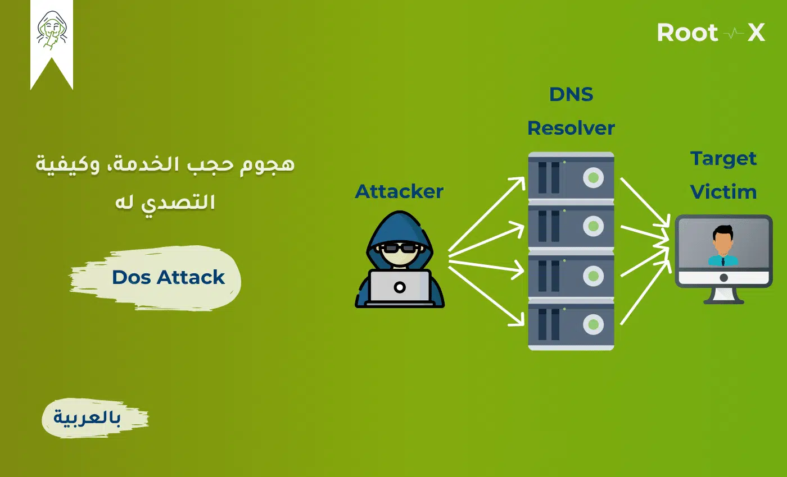 <em>مثال آخر لهجوم DoS: مهاجم واحد يرسل حركة ضخمة عبر خوادم DNS Resolver تتجه لضرب هدف واحد (Target Victim)</em>

<strong>مدى الخطورة:</strong> بما إنه بييجي من مصدر واحد، فهو أسهل نسبياً في الاكتشاف والحجب (بمنع الـ IP المصدر مثلاً) مقارنة بالـ DDoS، لكنه لسه فعّال ضد أنظمة ضعيفة الموارد.

<h3 dir="rtl" align="right" id="ddos-attack">2.2 هجوم حجب الخدمة الموزع (DDoS – Distributed Denial of Service)</h3>

نفس فكرة الـ DoS، لكن الفرق الجوهري إن الهجوم بييجي من <strong>مصادر متعددة وموزعة جغرافياً</strong> في نفس الوقت — عادةً شبكة ضخمة من الأجهزة المخترقة (Botnet) بيتحكم فيها المهاجم عن بعد. ده بيخلي الهجوم أصعب بكتير في الحجب، لأن مفيش IP واحد تقدر تمنعه، والحركة بتيجي من آلاف الأجهزة المنتشرة حول العالم واللي كل واحد فيها ممكن يكون جهاز مستخدم عادي مخترق من غير ما صاحبه يدري.

 <em>هجوم DDoS: المهاجم يتحكم في عدد ضخم من الأجهزة المخترقة لضرب هدف واحد في نفس اللحظة</em>

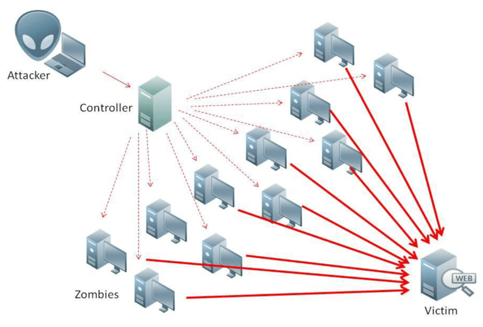 <em>بنية هجوم DDoS الكاملة: المهاجم يتحكم في جهاز Controller مركزي، وهو بدوره يوجّه شبكة كاملة من أجهزة الزومبي لضرب الضحية معاً</em>

<strong>الفرق الجوهري بين DoS و DDoS:</strong>

| المقارنة | DoS | DDoS |
|:---:|:---:|:---:|
| عدد المصادر | مصدر واحد | مصادر متعددة (Botnet) |
| صعوبة الاكتشاف | أسهل | أصعب بكثير |
| صعوبة الحجب (Mitigation) | أسهل (حجب IP واحد) | معقدة (تحتاج خدمات متخصصة CDN/Anti-DDoS) |
| حجم التأثير | محدود عادةً | ضخم جداً وقد يستهدف بنية تحتية كاملة |

<h3 dir="rtl" align="right" id="syn-flood">2.3 هجوم إغراق SYN (SYN Flood)</h3>

هجوم SYN Flood بيستغل عملية الـ <strong>Three-Way Handshake</strong> بتاعة بروتوكول TCP (SYN → SYN-ACK → ACK). المهاجم بيرسل عدد ضخم من طلبات SYN للسيرفر، وبيستخدم عناوين IP مزورة (Spoofed) عشان السيرفر يرد بـ SYN-ACK لعناوين مش هترد. السيرفر بيفضل مستني إكمال الـ Handshake (ACK) لكل اتصال منها، وبكده بتتحجز مصادره (Half-open connections) لحد ما تمتلئ قائمة الانتظار (Backlog Queue) بالكامل، فيبقى مش قادر يستقبل أي اتصالات جديدة من مستخدمين شرعيين.

 <em>هجوم SYN Flood: المهاجم يرسل طلبات SYN متعددة فيبقى السيرفر مشغولاً بانتظار إكمال الـ Handshake ويصبح غير متاح للمستخدم الشرعي</em>

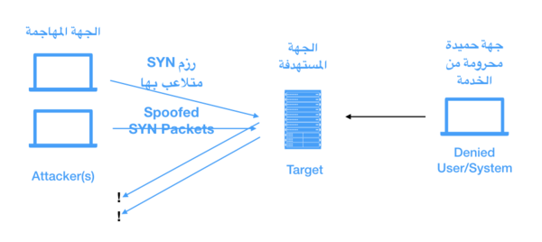 <em>نفس الفكرة من زاوية أخرى: حزم SYN مزوّرة (Spoofed) من عدة مهاجمين تجاه الجهة المستهدفة، بينما الجهة الحميدة (Denied User/System) تُمنع من الوصول للخدمة</em>

<h3 dir="rtl" align="right" id="smurf-attack">2.4 هجوم السنافر (Smurf Attack)</h3>

هجوم Smurf هو نوع من هجمات الانعكاس (Reflection Attack) بيستخدم بروتوكول <strong>ICMP</strong> (نفس بروتوكول الـ Ping). المهاجم بيرسل طلب ICMP Echo Request إلى عنوان <strong>Broadcast</strong> بتاع شبكة كبيرة، وبيزوّر عنوان الـ IP المصدر (Spoofed Source IP) ليكون هو عنوان الضحية. كل الأجهزة اللي في الشبكة المُستهدَفة (اللي بتُعرف بـ Amplifying Network) بترد على الطلب برد ICMP Echo Reply — لكن الرد بيروح كله للضحية مش للمهاجم، وده بيغرق جهاز الضحية بردود مضخّمة من مئات أو آلاف الأجهزة في نفس اللحظة.

 <em>هجوم Smurf: طلب ICMP واحد بعنوان مصدر مزوّر يتحول إلى ردود ضخمة من شبكة كاملة تتجه كلها للضحية</em>

<strong>آلية العمل خطوة بخطوة:</strong> (1) المهاجم يرسل طلب ICMP Echo Request بعنوان مصدر مزوّر هو عنوان الضحية ← (2) الحزمة توجَّه لعنوان Broadcast الخاص بالشبكة فتصل لكل جهاز فيها ← (3) كل جهاز في الشبكة يرسل رد ICMP Echo Reply تلقائياً للعنوان المصدر المزوّر ← (4) كل هذه الردود مجتمعة تصل للضحية في نفس اللحظة وتُغرقها، وينتج عن ذلك هجوم DDoS فعلي رغم إن نقطة الانطلاق الأصلية مهاجم واحد فقط.

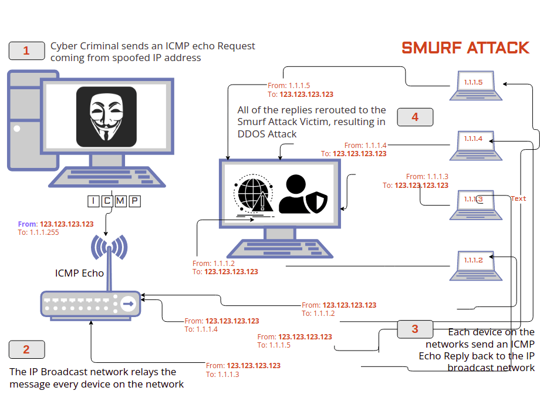 <em>الخطوات التفصيلية لهجوم Smurf مرقّمة: من إرسال طلب ICMP المزوّر وحتى وصول كل الردود للضحية مسبباً DDoS</em>

<h4 dir="rtl" align="right" id="smurf-types">2.4.1 أنواع هجوم السنافر (Types of Smurf Attacks)</h4>

بيُقسَّم هجوم Smurf عادةً إلى نوعين حسب نطاق الاستهداف:

<ul dir="rtl">
<li><strong>Basic Smurf Attack:</strong> يستهدف شبكة واحدة (Broadcast Network واحدة) بعدد كبير جداً من طلبات ICMP، بحيث تُغرق الضحية بردود شبكة واحدة فقط لكن بكثافة عالية.</li>
<li><strong>Advanced Smurf Attack:</strong> يستهدف عدة شبكات (Broadcast Networks متعددة) في نفس الوقت، وبيوجّه الردود المجمَّعة من كل الشبكات دي لضحية واحدة — وده بيضاعف حجم الهجوم بشكل كبير جداً مقارنة بالنوع الأساسي.</li>
</ul>

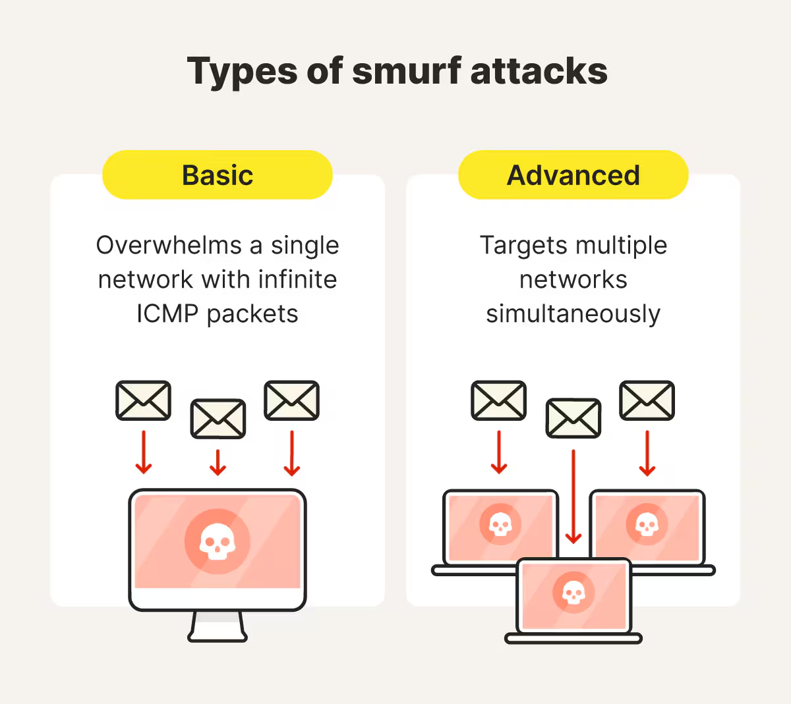 <em>الفرق بين Basic Smurf Attack (استهداف شبكة واحدة) وAdvanced Smurf Attack (استهداف عدة شبكات في آن واحد)</em>

<strong>متغيّر آخر شائع لنفس الفكرة:</strong> بدلاً من الاعتماد على Broadcast مباشرة، بعض الأدوات بتستخدم جهاز وسيط (زي راوتر أو Reflector) بحيث المهاجم يرسل حزمة بعنوان مستقبِل خاطئ (Spoofed) عبر هذا الجهاز الوسيط، وهو بدوره يعيد توجيه الحزمة لكل الأجهزة المتصلة به، فترد كل الأجهزة على الجهاز الوسيط بردودها إلى أن تتجمّع الاستجابات وتضرب الهدف الحقيقي — نفس مبدأ الانعكاس والتضخيم لكن بمسار مختلف قليلاً عن الـ Broadcast التقليدي.

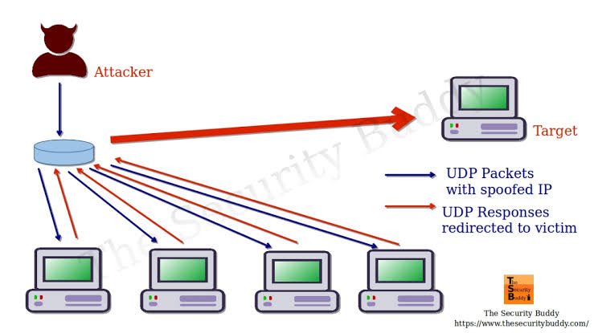 <em>متغيّر آخر لهجوم الانعكاس: المهاجم يرسل حزم عبر جهاز وسيط (Router) بعنوان مصدر مزوّر، فترد كل الأجهزة المتصلة بردودها المجمَّعة على الهدف</em>

<h3 dir="rtl" align="right" id="fraggle-attack">2.5 هجوم Fraggle</h3>

Fraggle هو نسخة معدّلة من هجوم Smurf، بنفس الفكرة تماماً (استغلال Broadcast وتزوير عنوان المصدر) لكن الفرق إنه بيستخدم بروتوكول <strong>UDP</strong> بدل ICMP، وبيستهدف عادةً منافذ Echo (Port 7) و Chargen (Port 19). المهاجم بيبعت حزمة UDP بعنوان مصدر مزوّر (عنوان الضحية) إلى عنوان الـ Broadcast، فكل الأجهزة على الشبكة بترسل ردود UDP إلى الضحية في نفس الوقت.

 <em>هجوم Fraggle: نفس منطق Smurf لكن باستخدام حزم UDP بدل ICMP</em>

<h3 dir="rtl" align="right" id="ping-of-death">2.6 هجوم Ping of Death</h3>

هجوم قديم لكنه مهم من الناحية المفاهيمية. الحد الأقصى المسموح به لحجم حزمة IP هو <strong>65,535 بايت</strong>. في هجوم Ping of Death، المهاجم بيرسل حزمة ping (ICMP) مجزّأة (Fragmented) بحيث لما النظام المستهدف يعيد تجميع الأجزاء (Reassembly)، يتخطى الحجم الكلي للحزمة الحد الأقصى المسموح به، وده بيسبب Buffer Overflow في النظام المستهدف، وممكن يؤدي لتوقف النظام (Crash) أو إعادة تشغيله أو تجمّده بالكامل.

 <em>حزمة Ping of Death: تجزئة IP تتجاوز الحد الأقصى المسموح به (65,535 بايت) عند إعادة التجميع في الجهاز الهدف</em>

<strong>ملاحظة مهمة:</strong> معظم الأنظمة الحديثة أصبحت محصّنة ضد هذا الهجوم تحديداً لأن أنظمة التشغيل الحديثة بتتحقق من حجم الحزمة قبل إعادة التجميع، لكنه لسه بيتدرّس كمثال كلاسيكي على استغلال ثغرات مستوى البروتوكول.

<h3 dir="rtl" align="right" id="tfn-zombie-master">2.7 شبكة الزومبي والجهاز المتحكم (TFN – Tribe Flood Network)</h3>

<strong>TFN (Tribe Flood Network)</strong> — واحدة من أوائل الأدوات المستخدمة في تنفيذ هجمات DDoS المنظّمة، وبتوضح بشكل عملي إزاي بتشتغل الـ Botnet. الفكرة قائمة على تسلسل هرمي من ثلاث طبقات:

<ol dir="rtl">
<li><strong>المهاجم (Attacker / Master):</strong> الشخص أو الجهاز اللي بيتحكم في العملية بالكامل عن بعد.</li>
<li><strong>أجهزة الزومبي (Zombies / Botnet):</strong> أجهزة مخترقة مسبقاً (عادةً من غير علم أصحابها) وبتستقبل الأوامر من المهاجم عبر قنوات تحكم (C2 – Command & Control) وبتنفذها في نفس اللحظة.</li>
<li><strong>الضحية (Victim):</strong> الهدف النهائي اللي بيستقبل الحركة المُضخّمة من كل أجهزة الزومبي مجتمعة.</li>
</ol>

 <em>البنية الهرمية للهجوم: المهاجم يتحكم في شبكة من أجهزة الزومبي التي تهاجم الضحية معاً</em>

هذا نفس المنطق المستخدم في هجمات <strong>DNS Amplification</strong> الحديثة، حيث يستغل المهاجم شبكة Botnet لإرسال طلبات DNS صغيرة بعنوان مصدر مزوّر (عنوان الضحية) إلى محلّلات DNS مفتوحة (Open Resolvers)، فترد بحزم استجابة أضخم بكثير من حجم الطلب الأصلي (Amplification) وتتجه كلها للضحية.

 <em>مثال DNS Amplification: طلب DNS صغير مزوّر المصدر يتحول إلى استجابة مضخّمة تضرب خادم الضحية عبر شبكة Botnet كاملة</em>

---

<h2 dir="rtl" align="right" id="malware">3. البرمجيات الخبيثة (Malware)</h2>

<h3 dir="rtl" align="right" id="viruses">3.1 الفيروسات (Viruses)</h3>

الفيروس هو برنامج خبيث بيحتاج <strong>ملف مضيف (Host File)</strong> أو تدخّل من المستخدم عشان ينتشر — يعني مبيقدرش ينسخ نفسه وينتقل من جهاز لآخر من غير ما حد يفتح ملف مصاب أو ينفّذ برنامج مصاب. بمجرد ما الملف المصاب يتفتح، الفيروس بيربط نفسه ببرامج أو ملفات تانية في الجهاز وينتشر داخلياً.

<strong>طرق الانتشار الشائعة:</strong> مرفقات البريد الإلكتروني، الملفات التنفيذية المقرصنة، أجهزة USB، تحميل برامج من مصادر غير موثوقة.

<strong>ما قد يفعله الفيروس:</strong> حذف أو تلف الملفات، إبطاء أداء الجهاز، سرقة بيانات، فتح ثغرات للمهاجمين، تعطيل برامج الحماية، أو حتى تدمير نظام التشغيل بالكامل.

<strong>أنواع الفيروسات الشائعة:</strong> Boot Sector Virus (يصيب قطاع الإقلاع)، Macro Virus (يصيب ملفات المكتب مثل Word/Excel)، Polymorphic Virus (يغيّر شكل كوده باستمرار للتهرب من الاكتشاف)، Resident Virus (يبقى نشطاً في الذاكرة).

<strong>لغات البرمجة الشائعة في صناعتها:</strong> غالباً بتُكتب بلغات منخفضة المستوى أو قريبة من النظام مثل <strong>Assembly</strong> و <strong>C/C++</strong> للحصول على تحكم دقيق في الذاكرة والعمليات، وأحياناً بلغات سكريبت مثل <strong>VBA/VBScript</strong> (في حالة Macro Viruses) أو <strong>Python</strong> للنماذج الأبسط.

<h3 dir="rtl" align="right" id="worms">3.2 دودة الحاسوب (Worms)</h3>

الفرق الجوهري بين الدودة والفيروس: الدودة <strong>مستقلة بذاتها ولا تحتاج ملف مضيف ولا تدخل من المستخدم</strong> — بتقدر تنتشر تلقائياً من جهاز لآخر عبر الشبكة باستغلال ثغرات أمنية (Vulnerabilities) في أنظمة التشغيل أو الخدمات الشبكية.

<table>
<tr><th align="center">المقارنة</th><th align="center">Virus</th><th align="center">Worm</th></tr>
<tr><td align="center">الاعتماد على ملف مضيف</td><td align="center">نعم</td><td align="center">لا</td></tr>
<tr><td align="center">تدخل المستخدم للانتشار</td><td align="center">مطلوب</td><td align="center">غير مطلوب</td></tr>
<tr><td align="center">طريقة الانتشار</td><td align="center">ملفات/برامج مصابة</td><td align="center">استغلال ثغرات الشبكة مباشرة</td></tr>
<tr><td align="center">سرعة الانتشار</td><td align="center">أبطأ</td><td align="center">أسرع بكثير (قد تصيب آلاف الأجهزة في دقائق)</td></tr>
</table>

<strong>آلية العمل:</strong> الدودة بتفحص الشبكة عن أجهزة فيها ثغرة معينة، تستغل الثغرة عشان تدخل الجهاز، تنسخ نفسها فيه، وبعدين تستخدمه كنقطة انطلاق لفحص أجهزة تانية — وهكذا تنتشر بشكل تلقائي (Self-Propagating) بدون أي تدخل بشري.

<h3 dir="rtl" align="right" id="trojan-horse">3.3 حصان طروادة (Trojan Horse)</h3>

حصان طروادة بيتنكّر في هيئة برنامج شرعي أو مفيد (لعبة، أداة، تحديث وهمي...) عشان يخدع المستخدم ويخليه يثبته بنفسه بمحض إرادته. على عكس الفيروس والدودة، الـ Trojan <strong>مبيكررش نفسه</strong> — دوره الأساسي إنه يفتح باب خلفي (Backdoor) للمهاجم أو يقوم بمهمة خبيثة محددة (سرقة بيانات، تسجيل ضغطات لوحة المفاتيح Keylogging، منح تحكم عن بعد Remote Access Trojan - RAT).

<h3 dir="rtl" align="right" id="rootkit">3.4 Rootkit (Auto Rooters)</h3>

الـ Rootkit هي مجموعة أدوات خبيثة مصممة للحصول على صلاحيات إدارية كاملة (Root/Administrator) على الجهاز المستهدف <strong>مع إخفاء وجودها بالكامل</strong> عن المستخدم وبرامج الحماية. الاسم بييجي من "Root" (أعلى صلاحية في أنظمة Unix/Linux) + "Kit" (مجموعة أدوات).

<strong>طرق الدخول للجهاز:</strong> غالباً بتُزرع عن طريق Trojan Horse، أو استغلال ثغرة أمنية، أو مرفق بريد خبيث، أو تحميل برنامج مقرصن.

<strong>الفرق عن الفيروس العادي:</strong> الفيروس هدفه غالباً التخريب أو الانتشار وممكن يُلاحظ وجوده، أما الـ Rootkit فهدفه الأساسي <strong>البقاء مخفياً لأطول فترة ممكنة</strong> عن طريق التلاعب في نواة النظام (Kernel-level) أو استبدال أوامر النظام الأساسية، وده بيخليه من أخطر وأصعب أنواع البرمجيات الخبيثة في الاكتشاف والإزالة.

<h3 dir="rtl" align="right" id="ransomware">3.5 برمجيات الفدية (Ransomware)</h3>

الـ Ransomware هي من أخطر أنواع البرمجيات الخبيثة انتشاراً في السنوات الأخيرة. بتقوم بـ <strong>تشفير</strong> ملفات الضحية بالكامل (أو تشفير القرص كله في بعض الأنواع المتقدمة) بمفتاح تشفير لا يملكه إلا المهاجم، وبعدين بتعرض رسالة فدية (Ransom Note) بتطالب الضحية بدفع مبلغ مالي (غالباً بعملات مشفّرة صعبة التتبع مثل Bitcoin) مقابل الحصول على مفتاح فك التشفير.

<strong>طرق الانتشار الشائعة:</strong> مرفقات بريد إلكتروني خبيثة (Phishing)، استغلال ثغرات في خدمات مكشوفة على الإنترنت (زي RDP بدون حماية كافية)، أو عبر Worm ينشرها تلقائياً داخل الشبكة (زي هجمات WannaCry الشهيرة).

<strong>الخطورة:</strong> عالية جداً على مستوى المؤسسات — ممكن تشل عمل شركة كاملة، ومفيش ضمان إن دفع الفدية هيؤدي لاسترجاع البيانات فعلاً. أفضل خط دفاع ضدها هو <strong>النسخ الاحتياطية المنتظمة المعزولة عن الشبكة (Offline Backups)</strong>.

<h3 dir="rtl" align="right" id="spyware-keyloggers">3.6 برمجيات التجسس ومسجلات المفاتيح (Spyware & Keyloggers)</h3>

الـ <strong>Spyware</strong> برنامج خبيث بيثبّت نفسه على الجهاز ويراقب نشاط المستخدم سراً (المواقع اللي بيزورها، البرامج اللي بيستخدمها، بياناته الشخصية) ويرسل المعلومات دي للمهاجم دون علم الضحية، غالباً بهدف الإعلانات المستهدفة أو سرقة بيانات حساسة.

الـ <strong>Keylogger</strong> نوع متخصص من الـ Spyware، وظيفته الوحيدة تسجيل <strong>كل ضغطة زر</strong> على لوحة المفاتيح وإرسالها للمهاجم — وده بيخليه أداة فتّاكة لسرقة كلمات المرور وبيانات البطاقات البنكية ورسائل حساسة أول ما تُكتب، حتى قبل ما تتشفّر أو تُرسل عبر الشبكة.

<h3 dir="rtl" align="right" id="logic-bombs">3.7 القنابل المنطقية (Logic Bombs)</h3>

الـ Logic Bomb هي كود خبيث بيُزرع داخل برنامج شرعي أو نظام، لكنه بيفضل <strong>خامل تماماً (Dormant)</strong> ومش بينفّذ أي شيء ضار لحد ما يتحقق شرط معين (Trigger) — زي تاريخ ووقت محدد، أو حدث معين (مثلاً حذف اسم موظف معين من قاعدة بيانات الموارد البشرية، وهو سيناريو كلاسيكي لموظف ساخط زرع قنبلة منطقية تتفعّل عند إنهاء خدمته). بمجرد تحقق الشرط، الكود الخبيث بيتنفذ فوراً (حذف بيانات، تعطيل نظام، فتح باب خلفي...).

<strong>الفرق عن باقي البرمجيات الخبيثة:</strong> الـ Logic Bomb مش بالضرورة بتنتشر أو تتكاثر زي الفيروس أو الدودة — دورها الأساسي إنها تنتظر بصمت لحد وقت أو حدث محدد سلفاً، وده بيخليها صعبة الاكتشاف جداً بأدوات الفحص التقليدية لحد ما تتفعّل.

---

<h2 dir="rtl" align="right" id="threat-actors">4. ثانياً: مهاجمو الشبكات ودورهم (Threat Actors)</h2>

مصطلح "Hat" (القبعة) بيُستخدم لتصنيف الأشخاص اللي بيمارسوا القرصنة (Hacking) حسب النية والشرعية القانونية وراء أفعالهم:

<h3 dir="rtl" align="right" id="white-hat">4.1 المهاجم الأبيض (White Hat)</h3>

هاكر أخلاقي (Ethical Hacker) بيعمل باختراقات <strong>مصرّح بها قانونياً</strong> من الجهة المالكة للنظام، بهدف اكتشاف الثغرات وإصلاحها قبل ما يستغلها مهاجم حقيقي. ده الأساس اللي عليه بتقوم شهادات زي CEH و eJPT.

<h3 dir="rtl" align="right" id="grey-hat">4.2 المهاجم الرمادي (Grey Hat)</h3>

بيخترق أنظمة <strong>بدون إذن مسبق</strong>، لكن بدون نية خبيثة أو تخريبية — غالباً بيكتشف ثغرة ويبلّغ عنها صاحب النظام (أحياناً يطلب مقابل)، وده تصرف في منطقة رمادية قانونياً لأن الاختراق نفسه غير مصرح به حتى لو النية كانت حسنة.

<h3 dir="rtl" align="right" id="black-hat">4.3 المهاجم الأسود (Black Hat)</h3>

المهاجم الفعلي بالمعنى الإجرامي — بيخترق الأنظمة <strong>بدون إذن ولنية خبيثة</strong> (سرقة بيانات، ابتزاز، تخريب، ربح مادي غير مشروع). كل الهجمات اللي اتشرحت في الأقسام السابقة (DoS, DDoS, Malware...) لما تُنفَّذ بدون تصريح، تُنسب لهذه الفئة.

---

<h2 dir="rtl" align="right" id="attack-tools">5. أشهر أدوات وتقنيات الهجوم على الشبكة</h2>

<h3 dir="rtl" align="right" id="spoofing-attacks">5.1 هجمات الانتحال (Spoofing Attacks)</h3>

مصطلح "Spoofing" بشكل عام معناه انتحال (تزوير) هوية عنصر موثوق داخل الشبكة — سواء كان عنوان IP، أو عنوان MAC، أو حتى استجابة DNS — عشان خداع جهاز أو مستخدم وجعله يثق في المهاجم كأنه الطرف الشرعي. دي مجموعة تقنيات أساسية بتُبنى عليها هجمات أخطر بكتير (زي MITM).

<h4 dir="rtl" align="right" id="ip-spoofing">5.1.1 تزوير عنوان IP (IP Spoofing)</h4>

IP Spoofing هي تقنية بيقوم فيها المهاجم بتعديل عنوان الـ <strong>IP المصدر (Source IP)</strong> في رأس الحزمة (Packet Header) ليبدو وكأن الحزمة قادمة من جهاز موثوق أو من عنوان الضحية نفسه، بدلاً من عنوانه الحقيقي.

 <em>الفكرة الأساسية لتزوير IP: نسخ عنوان IP موثوق للتحايل على الحماية والوصول لشبكة محمية</em>

<strong>آلية العمل:</strong> المهاجم بيبني الحزمة يدوياً (Packet Crafting) بحيث يحط في خانة الـ Source IP عنوان غير عنوانه الحقيقي. الهدف من ده بيختلف حسب نوع الهجوم:

<ol dir="rtl">
<li>التحايل على قوائم التحكم بالوصول (ACLs) اللي بتسمح بمرور حركة من عناوين موثوقة فقط.</li>
<li>تنفيذ هجمات الانعكاس (Reflection) زي Smurf و Fraggle و DNS Amplification، حيث يُستخدم عنوان الضحية كمصدر مزوّر لتوجيه الردود إليها.</li>
<li>إخفاء هوية المهاجم الحقيقية وصعّب تتبعه.</li>
</ol>

 <em>مثال تفصيلي: المهاجم (9.8.7.6) يرسل حزمة مصدرها المزوّر 1.2.3.4 فيرد السيرفر على الضحية الحقيقية بدلاً من المهاجم</em>

<h4 dir="rtl" align="right" id="arp-spoofing">5.1.2 تزوير الـ ARP (ARP Spoofing / ARP Poisoning) ⚠️ هام</h4>

بروتوكول ARP (Address Resolution Protocol) مسؤول عن ربط عنوان IP بعنوان MAC داخل الشبكة المحلية (LAN). المشكلة إن بروتوكول ARP <strong>لا يملك آلية مصادقة (Authentication)</strong> أصلاً، فأي جهاز في الشبكة يقدر يرسل رد ARP (ARP Reply) حتى لو محدش سأله، وباقي الأجهزة هتصدّقه وتحدّث جدول الـ ARP بتاعها بناءً عليه.

المهاجم بيستغل الثغرة دي عن طريق إرسال ردود ARP مزوّرة بشكل متكرر تربط عنوان الـ MAC بتاعه بعنوان الـ IP الخاص بجهاز آخر (غالباً البوابة الافتراضية Gateway)، وبكده كل الأجهزة في الشبكة بتحدّث جداول الـ ARP بتاعتها لتشير لجهاز المهاجم بدلاً من الجهاز الحقيقي. النتيجة: كل حركة البيانات المتجهة للبوابة (يعني كل حركة الإنترنت تقريباً) بتمر أولاً عبر جهاز المهاجم.

<strong>الأهمية:</strong> ده يُعتبر <strong>الطريقة الأساسية والأشهر لتنفيذ هجوم Man-in-the-Middle داخل الشبكات المحلية</strong> — لازم تتفهمه كويس جداً لأنه أساس عملي هتقابله كتير في اختبارات الاختراق.

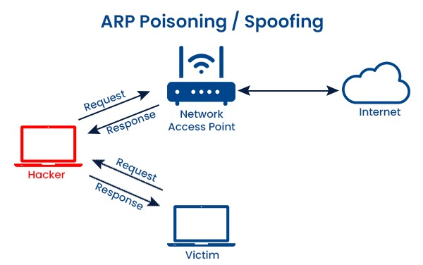 <em>المهاجم يعترض طلبات وردود ARP بين نقطة الوصول والضحية بدلاً من المسار الطبيعي المباشر</em>

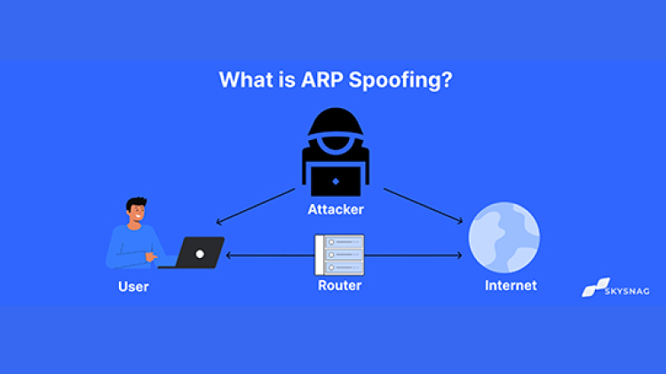 <em>بعد نجاح التسميم، كل حركة بيانات المستخدم (User) المتجهة للراوتر والإنترنت تمر أولاً عبر جهاز المهاجم (Attacker)</em>

<h4 dir="rtl" align="right" id="dns-spoofing">5.1.3 تزوير الـ DNS (DNS Spoofing / DNS Cache Poisoning)</h4>

DNS Spoofing هو التلاعب في استجابات نظام أسماء النطاقات (DNS) بحيث لما المستخدم يكتب اسم موقع (مثلاً bank.com)، بدل ما يتحول لعنوان الـ IP الحقيقي للموقع، المهاجم بيوجّهه لعنوان IP مزيّف يتحكم فيه — غالباً سيرفر يستضيف نسخة مطابقة (مزيّفة) من الموقع الأصلي بهدف سرقة بيانات الدخول.

<strong>طرق التنفيذ الشائعة:</strong> تسميم ذاكرة التخزين المؤقت لسيرفر DNS (Cache Poisoning) بإدخال سجلات مزيفة فيها، أو التلاعب مباشرة في استجابات DNS المارة عبر الشبكة المحلية بعد الوصول لموقع MITM (غالباً بعد تنفيذ ARP Spoofing أولاً).

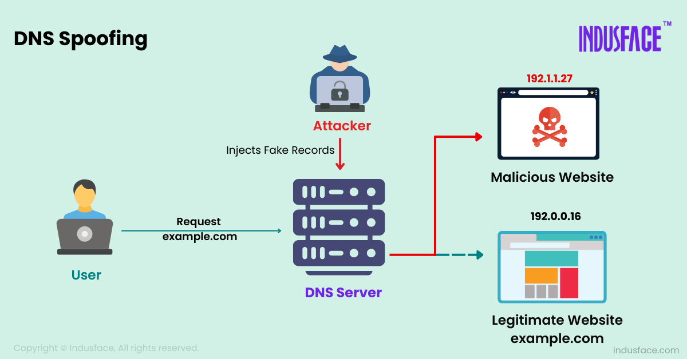 <em>المهاجم يحقن سجلات DNS مزيّفة (Injects Fake Records) في السيرفر، فيتحول طلب المستخدم لموقع خبيث بدلاً من الموقع الشرعي</em>

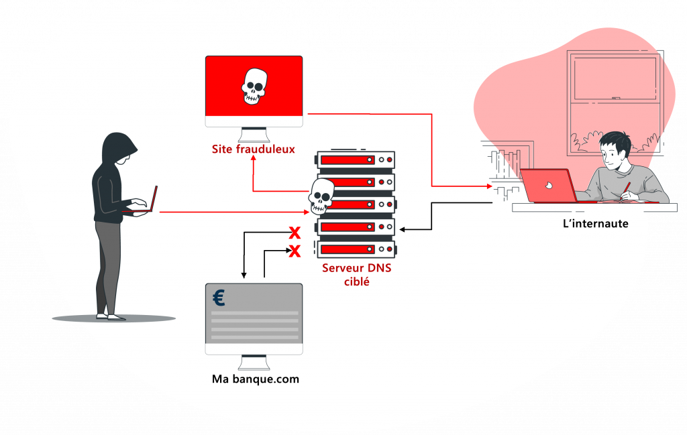 <em>مثال تطبيقي: طلب المستخدم لموقع بنكه الحقيقي يُعاد توجيهه عبر سيرفر DNS مخترق إلى موقع احتيالي مطابق للشكل</em>

<h4 dir="rtl" align="right" id="mac-spoofing">5.1.4 تزوير عنوان الـ MAC (MAC Spoofing)</h4>

عنوان الـ MAC هو المعرّف الفريد (نظرياً) لكل بطاقة شبكة (NIC). في MAC Spoofing، المهاجم بيغيّر عنوان الـ MAC بتاع جهازه برمجياً ليتطابق مع عنوان MAC لجهاز آخر موثوق في الشبكة.

<strong>الاستخدامات الشائعة لهذا الهجوم:</strong> تجاوز آليات التصفية المبنية على عنوان MAC (MAC Filtering) المستخدمة في بعض شبكات الـ Wi-Fi كطبقة حماية، انتحال هوية جهاز موثوق للوصول لموارد شبكة مقيّدة، أو كخطوة تمهيدية ضمن هجمات أعقد زي MITM أو تجاوز بوابات الدخول الأسيرة (Captive Portals).

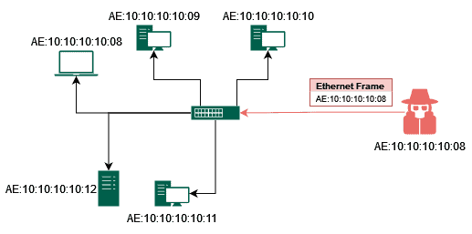 <em>المهاجم (AE:10:10:10:10:08) يزوّر عنوان MAC ليطابق جهازاً شرعياً على السويتش، فيستقبل حركة البيانات الموجَّهة لذلك الجهاز بدلاً منه</em>

<h3 dir="rtl" align="right" id="application-layer-attacks">5.2 هجمات طبقة التطبيقات (Application Layer Attacks)</h3>

على عكس الهجمات السابقة اللي بتستهدف طبقات الشبكة والنقل (Network/Transport)، هجمات طبقة التطبيقات بتستهدف مباشرةً <strong>الطبقة السابعة (Application Layer)</strong> من نموذج OSI — يعني بتستهدف البرامج والخدمات نفسها (مواقع الويب، قواعد البيانات، تطبيقات الويب) بدلاً من البنية التحتية للشبكة.

<strong>أمثلة شائعة:</strong> SQL Injection (حقن أوامر SQL خبيثة عبر مدخلات النماذج)، Cross-Site Scripting - XSS (حقن كود جافاسكريبت خبيث)، HTTP Flood (نوع من DDoS يستهدف طبقة HTTP تحديداً بطلبات صفحات ثقيلة بدل حزم بسيطة)، واستغلال ثغرات في كود التطبيق نفسه.

<strong>الخطورة:</strong> صعبة الاكتشاف بأدوات حماية الشبكة التقليدية (Firewalls على مستوى الشبكة) لأنها بتشبه حركة مستخدم عادي على مستوى البروتوكول، وبتحتاج حلول متخصصة زي <strong>WAF (Web Application Firewall)</strong>.

<h3 dir="rtl" align="right" id="backdoor">5.3 البوابة الخلفية (Backdoor)</h3>

الـ Backdoor هي طريقة دخول خفية للنظام بتتجاوز آليات المصادقة والحماية العادية. ممكن تكون مزروعة عمداً من مطوّر النظام (لأغراض صيانة مثلاً وممكن يُساء استخدامها)، أو مزروعة من مهاجم بعد اختراق ناجح عشان يضمن دخول مستقبلي للجهاز حتى لو اتقفلت الثغرة الأصلية اللي دخل منها. غالباً بتُزرع عن طريق Trojan Horse.

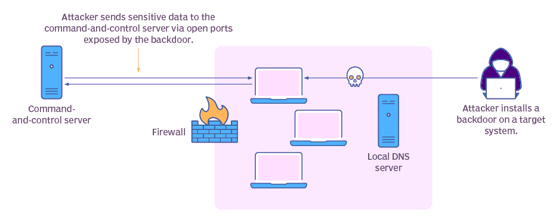 <em>المهاجم يثبّت Backdoor على النظام الهدف، وتُستخدم المنافذ المفتوحة عبرها لإرسال بيانات حساسة لسيرفر التحكم (Command-and-Control Server) خارج نطاق الجدار الناري</em>

<h3 dir="rtl" align="right" id="activex-attacks">5.4 هجمات ActiveX (ActiveX Attacks)</h3>

ActiveX هي تقنية قديمة من مايكروسوفت كانت بتسمح بتشغيل مكونات برمجية تفاعلية (Controls) داخل متصفح Internet Explorer. المشكلة الأمنية إن الـ ActiveX Controls كانت بتشتغل بصلاحيات كاملة على النظام (زي أي برنامج تنفيذي عادي) وبدون بيئة عزل (Sandbox) صارمة زي الموجودة في المتصفحات الحديثة. المهاجم كان بيقدر يبني ActiveX Control خبيث ويستضيفه في صفحة ويب، وبمجرد ما المستخدم يزور الصفحة ويوافق على تشغيله (أو حتى تلقائياً في إعدادات ضعيفة)، الكود الخبيث بيشتغل بصلاحيات كاملة على جهاز الضحية.

<h3 dir="rtl" align="right" id="vlan-hopping">5.5 القفز بين الشبكات الافتراضية (VLAN Hopping)</h3>

VLAN Hopping هو هجوم على مستوى <strong>الطبقة الثانية (Data Link Layer)</strong> بيسمح للمهاجم بالوصول لحركة بيانات VLAN تانية غير الـ VLAN اللي هو متصل بيها أصلاً، رغم إن الهدف الأساسي من تقسيم الشبكة لـ VLANs هو العزل المنطقي بين الأقسام المختلفة. له طريقتان أساسيتان:

<ul dir="rtl">
<li><strong>Switch Spoofing:</strong> المهاجم بيعدّل إعدادات جهازه ليتصرف وكأنه سويتش (باستخدام بروتوكولات زي DTP - Dynamic Trunking Protocol) عشان يقنع السويتش الحقيقي بإنشاء رابط Trunk معاه. رابط الـ Trunk بينقل حركة بيانات <strong>كل الـ VLANs</strong> وليس VLAN واحد بس، وبكده المهاجم بيوصل لحركة بيانات كل الأقسام المعزولة.</li>
<li><strong>Double Tagging:</strong> المهاجم بيبني حزمة فيها <strong>وسمان (Tags) من نوع 802.1Q</strong> بدلاً من وسم واحد — الوسم الخارجي بيمثل VLAN المهاجم نفسه (وبيتشال تلقائياً من أول سويتش يعالج الحزمة)، والوسم الداخلي المخفي بيمثل الـ VLAN المستهدف. النتيجة إن الحزمة بتتسرب لـ VLAN تاني غير المصرح له بالوصول له، وده هجوم من اتجاه واحد فقط (One-Way) وبيشتغل غالباً لما الـ VLAN الأصلي بتاع المهاجم يكون نفسه الـ Native VLAN على رابط الـ Trunk.</li>
</ul>

<strong>التخفيف:</strong> تعطيل الـ DTP التلقائي على المنافذ (Manual Trunk Configuration)، وعدم استخدام VLAN 1 كـ Native VLAN الافتراضي، وفصل الـ Native VLAN عن أي VLAN بيانات فعلي مستخدم.

<h3 dir="rtl" align="right" id="mitb">5.6 هجوم الشخص في المتصفح (Man-in-the-Browser – MitB)</h3>

MitB هو نوع فرعي متخصص من هجوم <strong>Man-in-the-Middle</strong> (الموضّح بالتفصيل في <a href="#mitm">القسم 8.2</a>)، لكن الفرق الجوهري إن الاعتراض هنا بيحصل <strong>داخل المتصفح نفسه</strong> بدلاً من مستوى الشبكة. المهاجم بيصيب جهاز الضحية ببرمجية خبيثة (غالباً Trojan متخصص أو Browser Extension خبيث) بتحقن كود داخل المتصفح وتراقب أو تعدّل البيانات <strong>قبل ما تتشفّر</strong> بواسطة HTTPS/TLS أو بعد فك تشفيرها مباشرة — يعني حتى لو الاتصال بالكامل مشفّر ومحمي على مستوى الشبكة، المهاجم لسه شايف البيانات بوضوح لأنه واقف على مستوى التطبيق نفسه.

<strong>الاستخدامات الشائعة:</strong> التلاعب في معاملات مصرفية إلكترونية أثناء تنفيذها (تغيير رقم حساب المستفيد أو المبلغ دون علم الضحية)، سرقة بيانات دخول من نماذج تسجيل الدخول، وحقن محتوى إضافي في صفحات ويب شرعية.

<strong>الفرق عن MITM التقليدي:</strong> MITM التقليدي (زي اللي بيحصل عبر ARP Spoofing) بيعترض حركة البيانات وهي <strong>عابرة عبر الشبكة</strong>، بينما MitB بيعترضها وهي لسه <strong>داخل الجهاز نفسه</strong> — وده بيخليه فعّال حتى مع اتصالات HTTPS المشفّرة بالكامل، وأصعب في الاكتشاف بأدوات مراقبة الشبكة التقليدية.

<h3 dir="rtl" align="right" id="zero-day">5.7 هجوم يوم الصفر (Zero-Day Attack)</h3>

هجوم Zero-Day هو استغلال ثغرة أمنية <strong>غير معروفة أصلاً للشركة المصنّعة للبرنامج أو النظام</strong> — يعني لسه معملهاش تحديث أمني (Patch) يسدّها، لأن المطوّرين نفسهم لسه مش عارفين بوجودها. الاسم "Zero-Day" جاي من إن المطوّر عنده <strong>صفر يوم</strong> فرصة للاستعداد أو إصلاح الثغرة قبل ما تُستغل فعلياً.

<strong>آلية العمل:</strong> المهاجم (أو باحث أمني) بيكتشف الثغرة قبل أي حد تاني، وبيبني كود استغلال (Exploit) خاص بيها. لو الاكتشاف وقع في إيد مهاجم Black Hat، بيقدر يستخدمها فوراً ضد أي نظام لسه مش محدّث، من غير ما يكون فيه أي دفاع معروف ضدها في الوقت ده.

<strong>الخطورة:</strong> من أخطر أنواع الهجمات على الإطلاق لأن <strong>مفيش حماية موجودة أصلاً</strong> وقت وقوع الهجوم (لا Patch ولا حتى توقيع معروف في برامج مكافحة الفيروسات)، وبتُستخدم غالباً في هجمات مستهدفة عالية القيمة (زي التجسس الصناعي أو هجمات دول على بنية تحتية حساسة) قبل ما تُكتشف وتتسرب للعامة.

<strong>التخفيف:</strong> بما إن الثغرة نفسها مجهولة، الدفاع بيعتمد على طبقات غير مباشرة: أنظمة كشف السلوك الشاذ (Behavior-based IDS/IPS بدل الاعتماد على التوقيعات فقط)، تحديث الأنظمة بسرعة بمجرد صدور الـ Patch الرسمي (راجع <a href="#patch-management">Patch Management</a>)، وتقليل سطح الهجوم عموماً (Least Functionality، Least Privilege) عشان لو حصل استغلال، الضرر يفضل محدود.

---

<h2 dir="rtl" align="right" id="reconnaissance">6. سابعاً: التعرف على الشبكة وجمع المعلومات (Reconnaissance / Footprinting)</h2>

دي عادةً <strong>أول مرحلة</strong> في أي هجوم حقيقي منظّم، قبل حتى تنفيذ أي حزمة خبيثة. المهاجم بيجمع أكبر قدر ممكن من المعلومات عن الهدف عشان يحدد نقطة الضعف الأنسب ويختار السلاح والطريقة المناسبة للاختراق. تنقسم عادةً إلى:

<ol dir="rtl">
<li><strong>Passive Reconnaissance (سلبي):</strong> جمع معلومات بدون تفاعل مباشر مع الهدف — بحث في السجلات العامة، مواقع التواصل الاجتماعي، سجلات DNS، محركات البحث المتخصصة (Shodan)، وغيرها. صعب اكتشافه لأن مفيش حركة مباشرة تلمس الهدف.</li>
<li><strong>Active Reconnaissance (نشط):</strong> تفاعل مباشر مع الهدف — فحص المنافذ (Port Scanning)، فحص الثغرات (Vulnerability Scanning)، تعداد الخدمات (Enumeration). أسهل اكتشافاً لأنه بيترك أثر في سجلات الشبكة (Logs).</li>
</ol>

المعلومات المُجمَّعة (نوع نظام التشغيل، الخدمات الشغالة، إصدارات البرامج، هيكل الشبكة، أسماء الموظفين...) بتُستخدم لتحديد أضعف نقطة دخول ممكنة.

<h3 dir="rtl" align="right" id="port-scanning">6.1 فحص المنافذ (Port Scanning)</h3>

فحص المنافذ من أشهر تقنيات الـ Active Reconnaissance. المهاجم (أو الفاحص الأمني في حالة الاستخدام الشرعي) بيرسل حزم لكل منفذ (Port) على الجهاز الهدف عشان يعرف حالته: <strong>Open</strong> (فيه خدمة شغالة وبتستقبل اتصالات)، <strong>Closed</strong> (المنفذ متاح لكن مفيش خدمة شغالة عليه)، أو <strong>Filtered</strong> (فيه جدار حماية بيمنع الوصول للمنفذ ومش واضح لو مفتوح أو مقفول).

<strong>أشهر أنواعه:</strong>

<ul dir="rtl">
<li><strong>TCP Connect Scan (Full Open Scan):</strong> بيكمّل الـ Three-Way Handshake بالكامل مع كل منفذ — دقيق لكن سهل الاكتشاف لأنه بيسجّل اتصال كامل في اللوجات.</li>
<li><strong>SYN Scan (Half-Open / Stealth Scan):</strong> بيرسل SYN بس وبيقفل الاتصال بمجرد استقبال SYN-ACK بدون إكمال الـ Handshake — أسرع وأصعب في الاكتشاف، وده أشهر نوع مستخدم عملياً.</li>
<li><strong>UDP Scan:</strong> لفحص المنافذ اللي بتستخدم UDP بدل TCP — أبطأ وأقل دقة لأن UDP بروتوكول بلا اتصال (Connectionless).</li>
</ul>

<strong>الأداة الأشهر:</strong> Nmap، وهي الأداة المرجعية القياسية في هذا المجال سواء للاستخدام الدفاعي (معرفة إيه اللي ظاهر من شبكتك للخارج) أو الهجومي.

---

<h2 dir="rtl" align="right" id="packet-sniffing">7. ثامناً: التقاط حزم البيانات (Packet Sniffing)</h2>

الـ Packet Sniffing هي عملية اعتراض ومراقبة حزم البيانات المارة داخل الشبكة باستخدام أدوات متخصصة (زي Wireshark). في الشبكات غير المشفّرة، أي شخص عنده وصول للوسط الناقل (خصوصاً في شبكات الـ Hub القديمة أو الشبكات اللاسلكية غير المؤمّنة) بيقدر يلتقط الحزم ويقرأ محتواها كامل — بما فيها كلمات المرور، رسائل، بيانات حساسة — لو مفيش تشفير (زي HTTPS/TLS) بيحميها.

 <em>عملية Packet Sniffing: التقاط حزم البيانات المارة عبر نقطة في الشبكة وتحليل محتواها</em>

<strong>أنواعه:</strong> Passive Sniffing (في شبكات Hub، مجرد استماع دون تدخل)، Active Sniffing (في شبكات Switch، يتطلب تقنيات إضافية زي ARP Spoofing — الموضّح بالتفصيل في القسم السابق — لتحويل الحركة إلى جهاز المهاجم).

---

<h2 dir="rtl" align="right" id="password-attacks">8. هجمات كلمات المرور (Password Attacks)</h2>

<h3 dir="rtl" align="right" id="password-guessing">8.1 هجوم تخمين كلمة السر (Password Guessing / Brute Force)</h3>

محاولة الوصول لحساب عن طريق تجربة كلمات مرور متعددة حتى الوصول للصحيحة. له نوعان رئيسيان: <strong>Brute Force</strong> (تجربة كل الاحتمالات الممكنة بشكل منهجي)، و <strong>Dictionary Attack</strong> (تجربة قائمة كلمات شائعة أو مسرّبة مسبقاً). كلمة مرور معقدة وطويلة ومتغيّرة دورياً بتقلل احتمالية نجاح هذا النوع من الهجمات بشكل كبير.

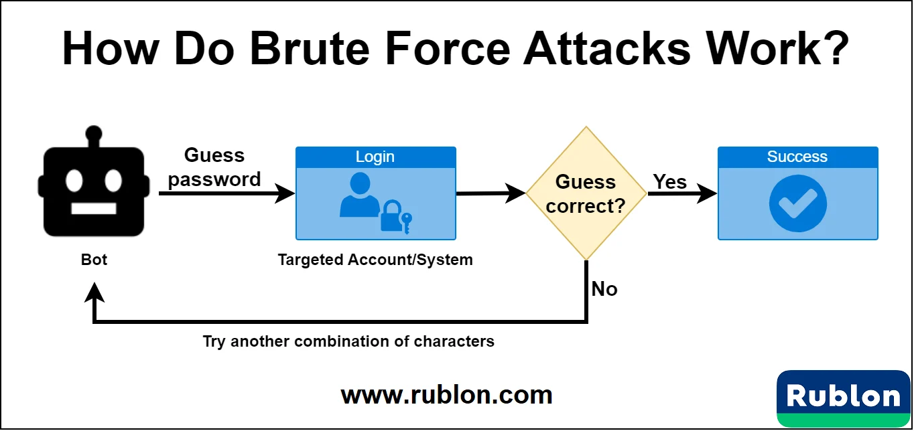 <em>آلية عمل Brute Force: بوت آلي يجرّب تخمين كلمة المرور بشكل متكرر، وفي حالة الفشل يجرّب توليفة أخرى من الحروف حتى ينجح</em>

<h3 dir="rtl" align="right" id="mitm">8.2 هجوم الشخص في المنتصف (Man-in-the-Middle – MITM) ⚠️ هام</h3>

من أخطر وأهم الهجمات اللي لازم تتفهم كويس جداً. في هجوم MITM، المهاجم بيتموضع (سواء فعلياً أو منطقياً) <strong>بين طرفين يتواصلوا مع بعض</strong> (المستخدم والسيرفر مثلاً) بحيث كل حركة البيانات بتمر من خلاله أولاً، وهو بيقدر يقرأها أو يعدّلها أو يعيد توجيهها — والطرفان مش حاسّين إن فيه طرف ثالث في النص، وكل واحد فيهم فاكر إنه بيتواصل مباشرة مع الطرف التاني.

 <em>هجوم MITM: المهاجم يعترض الاتصال الأصلي بين المستخدم والسيرفر ويقف في المنتصف دون علم أي من الطرفين</em>

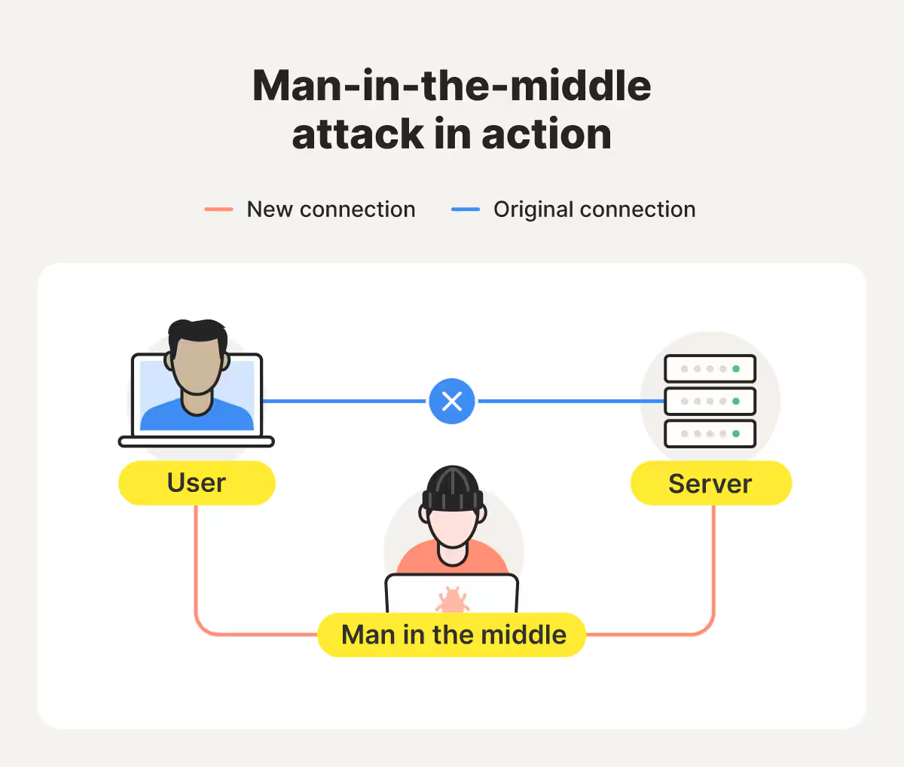 <em>توضيح بديل لنفس الفكرة: الاتصال الأصلي (Original Connection) بين المستخدم والسيرفر يُقطع تماماً، ويفتح المهاجم اتصالاً جديداً (New Connection) يمر من خلاله هو نفسه بين الطرفين</em>

<strong>إزاي بيقدر المهاجم يقف في المنتصف؟ (من أشهر الطرق):</strong>

<ol dir="rtl">
<li><strong>ARP Spoofing/Poisoning:</strong> الطريقة الأساسية داخل الشبكة المحلية — مشروحة بالتفصيل في <a href="#arp-spoofing">القسم 5.1.2</a>.</li>
<li><strong>DNS Spoofing:</strong> توجيه الضحية لسيرفر مزيّف — مشروح بالتفصيل في <a href="#dns-spoofing">القسم 5.1.3</a>.</li>
<li><strong>Evil Twin / Rogue Access Point:</strong> إنشاء نقطة وصول لاسلكية مزيّفة لخداع المستخدمين للاتصال بها مباشرة — مشروح بالتفصيل في <a href="#wireless-threats">قسم تهديدات الشبكات اللاسلكية</a>.</li>
<li><strong>Wi-Fi عام غير مؤمَّن:</strong> مراقبة الحركة المارة في شبكة Wi-Fi عامة مفتوحة.</li>
<li><strong>SSL Stripping:</strong> إجبار الاتصال على العمل بـ HTTP غير مشفّر بدلاً من HTTPS.</li>
</ol>

<strong>الخطورة:</strong> عالية جداً — المهاجم ممكن يسرق بيانات دخول، جلسات (Session Hijacking)، بيانات مالية، أو حتى يحقن محتوى خبيث في الاتصال، وكل ده بشكل غير مرئي تماماً للضحية.

---

<h2 dir="rtl" align="right" id="wireless-threats">9. تهديدات الشبكات اللاسلكية (Wireless Threats)</h2>

الشبكات اللاسلكية (Wi-Fi) بتضيف سطح هجوم إضافي مش موجود في الشبكات السلكية، لأن الوسط الناقل (الهواء) مفتوح لأي جهاز في النطاق، بدون الحاجة لاتصال فيزيائي مباشر بالشبكة.

<h3 dir="rtl" align="right" id="rogue-ap">9.1 نقطة وصول غير مصرح بها (Rogue Access Point)</h3>

نقطة وصول لاسلكية (Wireless Access Point) بتتوصل بالشبكة بدون تصريح رسمي من إدارة الشبكة — سواء زرعها موظف بحسن نية (Shadow IT) لتسهيل استخدامه الشخصي، أو زرعها مهاجم عمداً. وجودها بيفتح ثغرة أمنية غير مُراقَبة في الشبكة المحمية، حتى لو مكانتش بنية خبيثة من البداية.

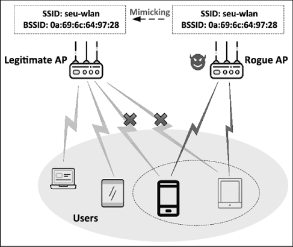 <em>نقطة وصول غير مصرح بها (Rogue AP) موجودة بجانب نقطة الوصول الشرعية داخل نطاق الشبكة</em>

<h3 dir="rtl" align="right" id="evil-twin">9.2 هجوم التوأم الشرير (Evil Twin Attack)</h3>

Evil Twin هو نوع متخصص وخبيث من الـ Rogue Access Point: المهاجم بينشئ نقطة وصول لاسلكية مزيّفة <strong>بنفس اسم الشبكة الشرعية (SSID)</strong> بالضبط — أحياناً بإشارة أقوى من الشبكة الحقيقية — عشان يخدع أجهزة المستخدمين (اللي بتتصل تلقائياً بالشبكات المألوفة) للاتصال بيها بدلاً من الشبكة الأصلية دون ما يلاحظوا الفرق. بمجرد ما الضحية يتصل، كل حركة بياناته بتمر عبر جهاز المهاجم مباشرة — وده أساساً هجوم MITM لكن على مستوى الطبقة اللاسلكية.

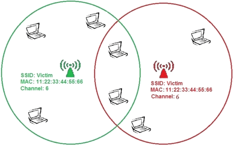 <em>نقطتا وصول بنفس اسم الشبكة (SSID) وعنوان الـ MAC، بنطاقين متداخلين يتنافسان على اتصال نفس الأجهزة — المستخدم لا يقدر يميّز الشرعية من المزيّفة</em>

<strong>الفرق عن Rogue AP العادي:</strong> الـ Rogue AP ممكن يكون بحسن نية أو باسم مختلف تماماً، أما الـ Evil Twin فهو محاكاة متعمدة ودقيقة لهوية شبكة موثوقة بهدف الخداع المباشر.

<h3 dir="rtl" align="right" id="jamming">9.3 التشويش (Jamming)</h3>

هجوم Jamming هو أبسط أشكال هجمات حجب الخدمة على الشبكات اللاسلكية — المهاجم بيستخدم جهاز إرسال يبعث ترددات راديوية قوية على نفس تردد شبكة الـ Wi-Fi المستهدفة (2.4GHz أو 5GHz)، بحيث تتداخل الإشارة وتمنع أي جهاز شرعي من الاتصال بنقطة الوصول أو حتى إتمام أي تواصل لاسلكي في النطاق المتأثر. هجوم على المستوى الفيزيائي (Physical Layer) بحت، وصعب التصدي له بحلول برمجية لأنه مش بيستهدف البروتوكول أصلاً بل الوسط الناقل نفسه.

<h3 dir="rtl" align="right" id="deauth">9.4 هجوم إلغاء المصادقة (Deauthentication Attack)</h3>

هجوم Deauth بيستغل ثغرة في بروتوكول 802.11 (Wi-Fi) — إطارات إلغاء المصادقة (Deauthentication Frames) في الإصدارات القديمة مش مشفّرة أو موثّقة (Unauthenticated Management Frames). المهاجم بيرسل إطارات Deauth مزوّرة تدّعي إنها من نقطة الوصول نفسها، بتجبر جهاز الضحية على قطع الاتصال بالشبكة فوراً وتكرار المحاولة.

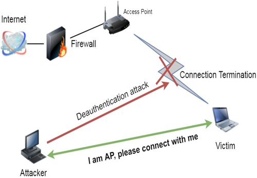 <em>المهاجم يرسل إطارات Deauth للضحية فتنقطع الاتصال بنقطة الوصول الشرعية (Connection Termination)، ثم يخدعها للاتصال به هو مباشرة كأنه نقطة الوصول</em>

<strong>الاستخدامات الشائعة:</strong> هجوم حجب خدمة مباشر (منع الضحية من الاتصال بالشبكة تكراراً)، أو كخطوة تمهيدية لهجمات أخرى — زي إجبار جهاز الضحية على إعادة الاتصال (Reconnect) عشان يلتقط المهاجم عملية المصافحة (WPA Handshake) ويحاول كسر كلمة المرور منها لاحقاً، أو دفع الضحية للاتصال بشبكة Evil Twin بدلاً من الشبكة الحقيقية.

<strong>⚠️ ملاحظة أمنية — الحماية في WPA3:</strong> معيار <strong>WPA3</strong> بيتصدى لهجوم Deauth بشكل جذري عن طريق تقنية <strong>PMF (Protected Management Frames – معيار 802.11w)</strong>، واللي بتفرض تشفير وتوثيق إطارات الإدارة (Management Frames) — ومنها إطارات إلغاء المصادقة نفسها. يعني في شبكة WPA3 مفعّل عليها PMF، أي إطار Deauth مزوّر من المهاجم هيتم رفضه فوراً لأنه مش موقّع بمفتاح الشبكة الصحيح، وده بيقفل الثغرة اللي هجوم Deauth بيعتمد عليها من الأساس. الشبكات اللي لسه بتستخدم WPA2 بدون PMF تفضل عرضة لهذا الهجوم بشكل كامل.

<h3 dir="rtl" align="right" id="wps-attack">9.5 هجوم تخمين رمز الـ WPS (WPS PIN Attack)</h3>

ميزة <strong>WPS (Wi-Fi Protected Setup)</strong> صُممت لتسهيل الاتصال بشبكة Wi-Fi على المستخدم العادي — بدل كتابة كلمة مرور طويلة ومعقدة، يكفي إدخال رمز PIN مكوّن من 8 أرقام (أو الضغط على زر فيزيائي على الراوتر). المشكلة إن تصميم بروتوكول WPS نفسه فيه ثغرة تصميمية خطيرة: الراوتر بيتحقق من نصف رمز الـ PIN (4 أرقام) بشكل مستقل عن النصف التاني، وبيرد برسالة خطأ مختلفة حسب أي نصف غلط — وده بيقلل عدد الاحتمالات اللي المهاجم محتاج يجربها من 10^8 لأقل من 11,000 احتمال فقط، وهو رقم صغير جداً يمكن تجربته بالكامل (Brute Force) خلال ساعات قليلة باستخدام أدوات متخصصة (زي Reaver).

<strong>الخطورة:</strong> بمجرد ما المهاجم يعرف رمز الـ WPS الصحيح، بيقدر يستخرج كلمة مرور شبكة الـ Wi-Fi (WPA/WPA2 Passphrase) مباشرة من الراوتر، بغض النظر عن مدى تعقيد كلمة المرور نفسها — لأن الثغرة في آلية WPS مش في كلمة المرور ذاتها.

<strong>التخفيف:</strong> أفضل حل هو <strong>تعطيل ميزة WPS بالكامل</strong> من إعدادات الراوتر، خصوصاً وضع إدخال الـ PIN عن بُعد. لو الميزة مش قابلة للتعطيل الكامل في جهاز معين، الاعتماد على زر WPS الفيزيائي فقط (Push-Button) أفضل نسبياً من وضع الـ PIN القابل للتخمين عن بعد.

---

<h2 dir="rtl" align="right" id="social-engineering">10. الهندسة الاجتماعية (Social Engineering)</h2>

الهندسة الاجتماعية — أو "فن اختراق العقول" — هي مجموعة تقنيات نفسية بيستخدمها المهاجم لخداع البشر (مش الأنظمة) عشان يخليهم يفصحوا عن معلومات حساسة أو يقوموا بأفعال تخدم مصلحة المهاجم، بدلاً من استغلال ثغرة تقنية في النظام. المبدأ الأساسي: <strong>الإنسان غالباً أضعف حلقة في منظومة الأمان</strong>، مهما كانت الأنظمة التقنية محمية بإحكام.

<strong>كيف تحقق معلومة صغيرة أهدافاً تخريبية كبيرة؟</strong> المهاجم بيبني صورة كاملة عن الهدف من معلومات تبدو بسيطة وغير حساسة على حدة (اسم موظف، منصبه، اسم مديره، شركة يتعامل معها، حدث داخلي...) وبيستخدمها عشان يبني <strong>مصداقية مزيّفة (Pretext)</strong> تخليه يبدو شخص موثوق فيه، وبيستغل هذه الثقة للوصول لمعلومات أعمق أو أنظمة حساسة تدريجياً.

<strong>أشهر التقنيات المستخدمة:</strong>

<ul dir="rtl">
<li><strong>Phishing (التصيّد):</strong> رسائل بريد إلكتروني أو رسائل مزيّفة تنتحل هوية جهة موثوقة لخداع الضحية للنقر على رابط خبيث أو إدخال بيانات حساسة.</li>
<li><strong>Spear Phishing:</strong> نسخة مستهدفة ومخصصة من الـ Phishing لشخص أو جهة بعينها بعد بحث دقيق عنها.</li>
<li><strong>Pretexting:</strong> اختلاق سيناريو أو هوية مزيّفة (موظف دعم فني مثلاً) لكسب ثقة الضحية.</li>
<li><strong>Baiting (الطعم):</strong> ترك جهاز USB مصاب في مكان عام بشكل متعمد ليلتقطه أحد الموظفين ويوصّله بجهازه بدافع الفضول.</li>
<li><strong>Tailgating / Piggybacking:</strong> الدخول الفعلي لمبنى محمي بالتسلل خلف موظف مصرّح له دون تصريح مستقل.</li>
<li><strong>Vishing / Smishing:</strong> نفس فكرة الـ Phishing لكن عبر المكالمات الصوتية (Vishing) أو الرسائل النصية القصيرة SMS (Smishing).</li>
<li><strong>Watering Hole Attack:</strong> بدل ما المهاجم يستهدف الضحية مباشرة، بيحدد أولاً موقع ويب أو منصة شرعية بيزورها الضحايا المستهدفون بشكل منتظم (زي موقع نقابة مهنية أو منتدى متخصص)، وبيخترق الموقع ده نفسه ويزرع فيه كود خبيث. لما الضحايا يزوروا الموقع الموثوق العادي بتاعهم، بيتصابوا تلقائياً دون ما يشكّوا في حاجة — تشبيه الاسم بمفترس بيكمن عند "مورد مياه" وينتظر فرائسه تيجي لوحدها بدل ما يطاردها.</li>
<li><strong>Dumpster Diving (الغوص في القمامة):</strong> تفتيش سلة المهملات أو المخلفات الورقية الخاصة بشركة أو فرد للحصول على معلومات حساسة تم التخلص منها بإهمال — مستندات فيها بيانات موظفين، كلمات مرور مكتوبة، مخططات شبكة، أو حتى أجهزة تخزين قديمة لم تُمسح بشكل آمن. تقنية بسيطة وغير تقنية بالمرة، لكنها فعّالة جداً في مرحلة جمع المعلومات (Reconnaissance) قبل تنفيذ هجوم أكبر، وهي السبب الرئيسي وراء أهمية التخلص السليم من المخلفات الموضّح في <a href="#asset-disposal">قسم Asset Disposal</a>.</li>
</ul>

<strong>الهدف والتوقيت:</strong> الهدف النهائي غالباً الحصول على بيانات دخول، معلومات مالية، أو الوصول الفيزيائي/المنطقي لأنظمة حساسة — وبتتم غالباً في أوقات ضغط العمل (لتقليل يقظة الضحية) أو عبر التظاهر بحالة طارئة تستدعي رد فعل سريع بدون تفكير.

---

<h2 dir="rtl" align="right" id="mitigation-techniques">11. القسم الثاني: تقنيات التخفيف من تهديدات الشبكة (Mitigation Techniques)</h2>

معرفة الهجوم بدون معرفة طريقة التخفيف منه معلومة ناقصة. القسم ده بيغطي 19 تقنية أساسية بتشكل معاً استراتيجية دفاع متعددة الطبقات (Defense in Depth).

<h3 dir="rtl" align="right" id="network-monitoring">11.1 مراقبة الشبكة (Network Monitoring)</h3>

المراقبة المستمرة لحركة الشبكة (عبر أدوات SIEM وغيرها) لاكتشاف الأنماط غير الطبيعية (زي طفرة مفاجئة في الحركة تدل على هجوم DDoS) قبل ما تتحول لمشكلة كبيرة. الميزة الأساسية: اكتشاف مبكر (Early Detection). العيب: يحتاج موارد وخبرة لتحليل الإنذارات وتفادي الإيجابيات الكاذبة (False Positives).

<h3 dir="rtl" align="right" id="ids-vs-ips">11.2 أنظمة كشف ومنع التسلل (IDS vs IPS)</h3>

<strong>IDS (Intrusion Detection System):</strong> نظام مراقبة سلبي (Passive) — بيحلّل حركة الشبكة أو نشاط النظام، وبيقارنها بتوقيعات هجمات معروفة (Signature-based) أو بسلوك غير طبيعي (Anomaly-based)، وعند اكتشاف تهديد بيرسل <strong>تنبيه (Alert)</strong> فقط دون التدخل لمنعه — القرار والتصرف بيرجع لفريق الأمن.

<strong>IPS (Intrusion Prevention System):</strong> نفس آلية الكشف بتاعة الـ IDS، لكنه يعمل بشكل <strong>نشط (Active/Inline)</strong> — بيتواجد مباشرة في مسار حركة البيانات (In-line)، وبمجرد اكتشاف تهديد، بيقدر <strong>يمنعه فوراً</strong> (إسقاط الحزمة، حجب الاتصال) بدون انتظار تدخل بشري.

<table>
<tr><th align="center">المقارنة</th><th align="center">IDS</th><th align="center">IPS</th></tr>
<tr><td align="center">موقعه من حركة البيانات</td><td align="center">خارج المسار (Out-of-band)</td><td align="center">داخل المسار مباشرة (In-line)</td></tr>
<tr><td align="center">رد الفعل</td><td align="center">تنبيه فقط (Detect)</td><td align="center">منع فوري (Prevent)</td></tr>
<tr><td align="center">تأثيره على الأداء</td><td align="center">أقل (لا يعطّل الحركة)</td><td align="center">أعلى (قد يسبب تأخير أو Bottleneck)</td></tr>
<tr><td align="center">خطر الإيجابيات الكاذبة</td><td align="center">أقل خطورة (مجرد تنبيه)</td><td align="center">أخطر (قد يحجب حركة شرعية بالخطأ)</td></tr>
</table>

<h3 dir="rtl" align="right" id="nac">11.3 التحكم في الوصول للشبكة (NAC – Network Access Control)</h3>

الـ NAC هو نظام بيتحقق من <strong>هوية وحالة أمان الجهاز</strong> قبل السماح له بالاتصال بالشبكة أصلاً — مش بس مين المستخدم، لكن كمان: هل الجهاز محدّث؟ هل عليه برنامج مكافحة فيروسات شغال؟ هل ملتزم بسياسة الشبكة الأمنية؟ لو الجهاز مايستوفيش الشروط، بيتم عزله في شبكة محجورة (Quarantine VLAN) أو منعه تماماً من الاتصال لحد ما يستوفي المتطلبات.

<strong>أهميته:</strong> بيمنع دخول أجهزة غير موثوقة أو مصابة للشبكة الداخلية من الأساس، وهو خط دفاع أساسي ضد سيناريوهات زي موظف بيوصّل جهاز شخصي مصاب بشبكة الشركة.

<h3 dir="rtl" align="right" id="antivirus">11.4 تثبيت برنامج مكافحة فيروسات (نسخة أصلية)</h3>

استخدام برامج حماية موثوقة ومرخّصة (وليست مقرصنة) مع تحديثها بانتظام لقواعد بيانات التوقيعات (Signatures) الخاصة بها، للكشف عن الفيروسات والبرمجيات الخبيثة وإزالتها. البرامج المقرصنة نفسها مصدر شائع لزرع البرمجيات الخبيثة.

<h3 dir="rtl" align="right" id="original-os">11.5 تثبيت أنظمة تشغيل أصلية</h3>

الأنظمة الأصلية بتستقبل تحديثات أمنية رسمية ومنتظمة من الشركة المصنّعة، بعكس النسخ المقرصنة أو المعدَّلة اللي غالباً بتكون معطّلة التحديثات أو مزروع فيها Backdoor من البداية.

<h3 dir="rtl" align="right" id="original-software">11.6 تثبيت برامج أصلية على الأجهزة</h3>

نفس منطق أنظمة التشغيل — البرامج المقرصنة مصدر شائع جداً لدخول الفيروسات وأحصنة طروادة والـ Rootkits، لأنها غالباً بتتطلب تعطيل الحماية أو تحميل "Cracks" من مصادر غير موثوقة.

<h3 dir="rtl" align="right" id="physical-security">11.7 توفير الحماية الفيزيائية</h3>

حماية الأجهزة والبنية التحتية فيزيائياً — لأن أي حماية برمجية بتفقد قيمتها لو المهاجم قدر يوصل فيزيائياً للجهاز مباشرة. الأنواع التفصيلية لأجهزة الحماية الفيزيائية (كشف، ردع، منع) موضّحة بالكامل في <a href="#physical-security-devices">القسم 13</a>.

<h3 dir="rtl" align="right" id="disable-unused-services">11.8 إغلاق البروتوكولات والخدمات غير المستخدمة</h3>

كل بروتوكول أو خدمة أو منفذ (Port) شغال بدون استخدام فعلي هو سطح هجوم إضافي (Attack Surface) بدون فائدة حقيقية. تقليل الخدمات الشغالة لأقل حد ممكن (مبدأ Least Functionality) بيقلل من عدد الثغرات المحتملة.

<h3 dir="rtl" align="right" id="privilege-distribution">11.9 توزيع الصلاحيات (Least Privilege)</h3>

إعطاء كل مستخدم أو نظام أقل قدر من الصلاحيات اللازمة لأداء مهمته فقط، بدلاً من صلاحيات إدارية شاملة للجميع. لو حساب مستخدم عادي اتخترق، الضرر بيبقى محدود بدلاً من انتشاره لكامل الشبكة.

<h3 dir="rtl" align="right" id="dmz">11.10 إنشاء مناطق منزوعة السلاح (DMZ – Demilitarized Zone)</h3>

الـ DMZ هي شبكة فرعية معزولة بتوضع فيها الخدمات اللي محتاجة تكون متاحة للإنترنت (Web Servers, Mail Servers) بحيث تكون مفصولة عن الشبكة الداخلية الخاصة (Private Network) بجدار حماية (Firewall). لو حصل اختراق لأحد سيرفرات الـ DMZ، الشبكة الداخلية الحساسة بتفضل محمية لأنها مش موصولة مباشرة.

 <em>بنية DMZ: سيرفرات الويب معزولة عن الشبكة الخاصة الداخلية بجدار حماية، بينما تظل متاحة للإنترنت</em>

<h3 dir="rtl" align="right" id="backups">11.11 أخذ النسخ الاحتياطية (Backups)</h3>

نسخ احتياطية منتظمة (ويُفضّل تخزين نسخة منها بمعزل عن الشبكة - Offline/Air-gapped) بتضمن إمكانية استعادة البيانات في حالة هجوم تدميري أو Ransomware، بدون الحاجة للاستسلام لمطالب المهاجم.

<h3 dir="rtl" align="right" id="network-policy">11.12 إنشاء السياسة الخاصة بالشبكة (Network Security Policy)</h3>

وثيقة رسمية بتحدد القواعد والمعايير الأمنية المتوقعة من كل مستخدمي ومسؤولي الشبكة — بتشمل قواعد استخدام مقبول (Acceptable Use Policy) وضوابط الوصول وغيرها. بدون سياسة موثّقة وواضحة، الحماية بتبقى عشوائية وغير متسقة. سياسات أكثر تخصصاً (الاستجابة للحوادث، الترخيص، دورة حياة النظام) موضّحة بالتفصيل في <a href="#policies-best-practices">القسم 12</a>.

<h3 dir="rtl" align="right" id="strong-passwords">11.13 إنشاء كلمات سر معقدة ومتغيّرة</h3>

كلمات مرور طويلة ومعقّدة (تجمع حروف كبيرة وصغيرة وأرقام ورموز) مع تغييرها بشكل دوري وعدم إعادة استخدامها بين حسابات مختلفة، بيقلل بشكل كبير من فعالية هجمات Brute Force وDictionary Attack، وبيقلل الضرر لو تسربت كلمة مرور من خدمة معينة.

<h3 dir="rtl" align="right" id="continuous-development">11.14 التطوير المستمر</h3>

تحديث السياسات والأدوات والمعرفة الأمنية بشكل مستمر لمواكبة التهديدات الجديدة — الأمن السيبراني مش حالة "تُطبَّق مرة واحدة وتُنسى"، بل عملية مستمرة (Continuous Process) لأن المهاجمين أنفسهم بيطوّروا أساليبهم باستمرار.

<h3 dir="rtl" align="right" id="user-awareness">11.15 توعية مستخدمي الشبكة (Security Awareness)</h3>

تدريب دوري للموظفين والمستخدمين على التعرف على محاولات الهندسة الاجتماعية والتصيّد والممارسات الآمنة. بما إن الإنسان غالباً أضعف حلقة، التوعية من أهم وأرخص وأفعل طبقات الدفاع.

<h3 dir="rtl" align="right" id="baseline-review">11.16 مراجعة الخطوط الأساسية الأمنية (Reviewing Baselines)</h3>

الـ Baseline هي وثيقة توضّح <strong>الحالة الآمنة والمعتمدة</strong> لإعدادات نظام أو جهاز معين لحظة تأمينه بشكل صحيح لأول مرة — إعدادات الجدار الناري، المنافذ المفتوحة، البرامج المثبَّتة، الحسابات المُصرَّح بها، وغيرها. مراجعة الخط الأساسي (Baseline Review) معناها المقارنة الدورية بين <strong>الحالة الحالية الفعلية</strong> للنظام وبين الـ Baseline المعتمدة، لاكتشاف أي انحراف أو تغيير غير مصرّح به (Configuration Drift) ممكن يكون ناتج عن خطأ بشري أو حتى مؤشر على اختراق تم بالفعل.

<strong>الفرق عن Vulnerability Scanning:</strong> فحص الثغرات بيدوّر على نقاط ضعف معروفة عالمياً، أما مراجعة الـ Baseline فبتدوّر تحديداً على أي <strong>تغيير عن الإعداد الآمن المعتمد للمؤسسة نفسها</strong>، حتى لو التغيير ده مش ثغرة معروفة رسمياً.

<h3 dir="rtl" align="right" id="vuln-scan-vs-pentest">11.17 الفحص الدوري: Vulnerability Scanning مقابل Penetration Testing</h3>

كلاهما فحص دوري لأمن الشبكة، لكن بفرق جوهري في العمق والهدف:

<strong>Vulnerability Scanning:</strong> فحص آلي (Automated) باستخدام أدوات متخصصة (زي Nessus, OpenVAS) بيقارن النظام بقاعدة بيانات ثغرات معروفة، وبيطلع تقرير بكل الثغرات المحتملة اللي لقاها — <strong>بدون استغلالها فعلياً</strong>. أسرع، أرخص، وبيتكرر بشكل منتظم (أسبوعي/شهري).

<strong>Penetration Testing:</strong> عملية يدوية (غالباً بمساعدة أدوات) بيقوم بيها هاكر أخلاقي (White Hat) بمحاكاة هجوم حقيقي كامل — بيحاول <strong>يستغل</strong> الثغرات المكتشفة فعلياً عشان يثبت مدى تأثيرها الحقيقي على النظام (زي الوصول لبيانات حساسة أو صلاحيات إدارية). أعمق وأدق لكن أبطأ وأغلى، وبيتم عادةً بشكل دوري أقل تكراراً (سنوي مثلاً) أو بعد تغييرات كبيرة في البنية التحتية.

<table>
<tr><th align="center">المقارنة</th><th align="center">Vulnerability Scanning</th><th align="center">Penetration Testing</th></tr>
<tr><td align="center">الطريقة</td><td align="center">آلي بالكامل</td><td align="center">يدوي (بمساعدة أدوات)</td></tr>
<tr><td align="center">استغلال الثغرة فعلياً</td><td align="center">لا</td><td align="center">نعم</td></tr>
<tr><td align="center">التكرار المعتاد</td><td align="center">متكرر (أسبوعي/شهري)</td><td align="center">أقل تكراراً (سنوي أو عند التغييرات الكبرى)</td></tr>
<tr><td align="center">التكلفة والوقت</td><td align="center">أقل</td><td align="center">أعلى</td></tr>
</table>

<h3 dir="rtl" align="right" id="patch-management">11.18 إدارة التحديثات واستراتيجية التراجع (Patch Management & Rollback Strategy)</h3>

تطبيق التحديثات الأمنية (Patches) بشكل منتظم ومنظّم على أنظمة التشغيل والبرامج والأجهزة، لإغلاق الثغرات المعروفة قبل ما يستغلها مهاجم. عملية Patch Management السليمة بتمر بمراحل: تحديد التحديثات المطلوبة → اختبارها في بيئة تجريبية (Staging) قبل النشر الفعلي → نشرها على الإنتاج (Production) بشكل مجدوَل → التحقق من نجاحها.

<strong>استراتيجية التراجع (Rollback Strategy):</strong> خطة احتياطية جاهزة للتراجع الفوري عن أي تحديث بيسبب مشاكل غير متوقعة (تعطّل خدمة، تعارض مع برامج أخرى) والعودة للإصدار المستقر السابق بأسرع وقت ممكن، بدون الحاجة لإعادة بناء النظام من الصفر. أخذ نسخة احتياطية (Backup/Snapshot) قبل أي تحديث هو الأساس اللي بيخلي الـ Rollback ممكناً وسريعاً.

<h3 dir="rtl" align="right" id="asset-disposal">11.19 الطريقة السليمة في التخلص من المخلفات (Asset Disposal)</h3>

عند التخلص من أجهزة أو وسائط تخزين قديمة (هارد ديسك، USB، سيرفرات) لازم تتم عملية مسح آمن للبيانات (Secure Data Wipe / Degaussing) أو تدمير فيزيائي للوسيط (Physical Destruction/Shredding) قبل التخلص منه، لمنع استعادة بيانات حساسة من معدّات مُتخلَّص منها — نقطة ضعف شائعة ومُهمَلة غالباً في السياسات الأمنية. هذه الخطوة أيضاً جزء أساسي من دورة حياة النظام الموضّحة في القسم التالي.

---

<h2 dir="rtl" align="right" id="policies-best-practices">12. السياسات وأفضل الممارسات (Policies and Best Practices)</h2>

بعيداً عن الجوانب التقنية البحتة، فيه مجموعة من السياسات الإدارية والقانونية اللي لازم أي مؤسسة تراعيها كجزء من استراتيجيتها الأمنية الشاملة.

<h3 dir="rtl" align="right" id="licensing-restrictions">12.1 قيود الترخيص (Licensing Restrictions)</h3>

استخدام البرامج والأنظمة لازم يكون بترخيص قانوني سليم (Per-Seat, Per-Device, Subscription, Open Source...). البرامج غير المرخّصة أو المقرصنة مش بس مخالفة قانونية بتعرّض المؤسسة لغرامات، لكنها كمان — زي ما اتشرح في قسم البرمجيات الخبيثة — مصدر شائع جداً لدخول الفيروسات والـ Trojans والـ Rootkits، لأن مصادرها غير موثوقة وغالباً بتتطلب تعطيل آليات الحماية والتحقق. متابعة تراخيص البرامج (Software Asset Management) جزء من النظافة الأمنية العامة للمؤسسة.

<h3 dir="rtl" align="right" id="export-controls">12.2 ضوابط التصدير الدولية (International Export Controls)</h3>

بعض الدول (وعلى رأسها الولايات المتحدة عبر لوائح مثل EAR وITAR) بتفرض قيوداً قانونية على تصدير تقنيات معينة — وعلى رأسها برمجيات وأجهزة <strong>التشفير القوي (Strong Encryption)</strong> — لدول أو جهات معينة. أي مؤسسة بتعمل دولياً أو بتنشر حلول أمنية (VPN، أدوات تشفير...) عبر حدود دولية لازم تكون على وعي بالقيود دي عشان تتجنب مخالفات قانونية جسيمة.

<h3 dir="rtl" align="right" id="incident-response-policy">12.3 سياسات الاستجابة للحوادث (Incident Response Policies)</h3>

وثيقة رسمية بتحدد بالتفصيل خطوات التصرف عند وقوع حادث أمني (اختراق، تسريب بيانات، إصابة بـ Ransomware...)، بدل ما يكون رد الفعل عشوائي وقت الأزمة. المراحل الأساسية المعروفة بـ <strong>PICERL</strong>:

<ol dir="rtl">
<li><strong>Preparation (التحضير):</strong> بناء الخطة والأدوات والفريق مسبقاً قبل وقوع أي حادث.</li>
<li><strong>Identification (التحديد):</strong> اكتشاف وتأكيد وقوع الحادث فعلاً.</li>
<li><strong>Containment (الاحتواء):</strong> عزل المشكلة لمنع انتشارها لباقي الشبكة.</li>
<li><strong>Eradication (الاستئصال):</strong> إزالة السبب الجذري للحادث بالكامل (الفيروس، الثغرة المستغَلة...).</li>
<li><strong>Recovery (الاستعادة):</strong> إعادة الأنظمة المتأثرة للعمل الطبيعي بأمان.</li>
<li><strong>Lessons Learned (الدروس المستفادة):</strong> تحليل الحادث بعد انتهائه لتحسين السياسات ومنع تكراره.</li>
</ol>

<h3 dir="rtl" align="right" id="system-life-cycle">12.4 دورة حياة النظام (System Life Cycle)</h3>

أي جهاز أو نظام في المؤسسة بيمر بمراحل محددة، ولكل مرحلة اعتبارات أمنية خاصة بيها:

<ol dir="rtl">
<li><strong>التخطيط والشراء (Planning / Procurement):</strong> تحديد المتطلبات الأمنية قبل شراء أي جهاز أو نظام جديد.</li>
<li><strong>النشر (Deployment):</strong> تثبيت النظام بإعدادات آمنة معتمدة (Baseline) من اليوم الأول.</li>
<li><strong>التشغيل والصيانة (Operation / Maintenance):</strong> المرحلة الأطول — تشمل التحديثات الدورية (Patch Management)، المراقبة، ومراجعة الخط الأساسي بشكل مستمر.</li>
<li><strong>التقاعد والتخلص (Retirement / Disposal):</strong> المرحلة الأخيرة، وتشمل عملية التخلص السليم من الأصل (Asset Disposal) الموضّحة في قسم تقنيات التخفيف.</li>
</ol>

---

<h2 dir="rtl" align="right" id="physical-security-devices">13. أجهزة الحماية الفيزيائية (Physical Security Devices)</h2>

الحماية الفيزيائية بتكمّل الحماية المنطقية (Logical Security) — أي حماية برمجية بتفقد قيمتها لو المهاجم قدر يوصل فيزيائياً للجهاز أو غرفة السيرفرات مباشرة. بتُصنَّف الأجهزة عادةً لثلاث فئات حسب دورها:

<h3 dir="rtl" align="right" id="detection-devices">13.1 أجهزة الكشف (Detection Devices)</h3>

دورها اكتشاف وقوع محاولة اختراق فيزيائي وقت حدوثها أو بعده. أمثلة: <strong>كاميرات المراقبة (CCTV)</strong>، وأجهزة <strong>كشف الحركة (Motion Detectors)</strong>.

<h3 dir="rtl" align="right" id="deterrent-devices">13.2 أجهزة الردع (Deterrent Devices)</h3>

دورها إقناع أي متطفل محتمل بعدم المحاولة من الأساس، بدون منعه فعلياً لو أصرّ. أمثلة: لافتات تحذيرية، إضاءة قوية للمناطق المحيطة بالمبنى، وكاميرات المراقبة الظاهرة بشكل واضح (نفس الجهاز ممكن يكون رادعاً وكاشفاً في نفس الوقت).

<h3 dir="rtl" align="right" id="prevention-devices">13.3 أجهزة المنع والتحكم بالوصول (Prevention / Access Control Devices)</h3>

دورها منع الدخول الفعلي غير المصرح به من الأساس. أمثلة:

<ul dir="rtl">
<li><strong>الأقفال (Locks):</strong> تقليدية أو إلكترونية (Electronic Locks).</li>
<li><strong>بطاقات الدخول الذكية (Smart Cards / Badge Readers):</strong> للتحقق من الهوية قبل السماح بالدخول.</li>
<li><strong>أجهزة القياسات الحيوية (Biometric Scanners):</strong> بصمة الإصبع، بصمة الوجه، قزحية العين.</li>
<li><strong>مصائد الدخول (Mantraps / Access Control Vestibules):</strong> ممر مزدوج الأبواب لا يسمح بفتح الباب الثاني إلا بعد إغلاق الأول، لمنع دخول أكثر من شخص بتصريح واحد (Tailgating — راجع قسم الهندسة الاجتماعية).</li>
<li><strong>الحراسة الأمنية والحواجز الخارجية (Security Guards / Fencing / Bollards):</strong> الطبقة الأولى من الحماية المحيطية للمبنى.</li>
</ul>

---

<h2 dir="rtl" align="right" id="cheat-sheet">14. جدول المراجعة السريع (Cheat Sheet)</h2>

| الهجوم / التقنية | الفئة | الفكرة الأساسية |
|:---:|:---:|:---:|
| DoS | حجب خدمة | إغراق من مصدر واحد |
| DDoS | حجب خدمة | إغراق موزّع من Botnet |
| SYN Flood | حجب خدمة | استغلال Three-Way Handshake |
| Smurf | حجب خدمة (انعكاس) | ICMP + Broadcast + IP مزوّر |
| Fraggle | حجب خدمة (انعكاس) | مثل Smurf لكن بـ UDP |
| Ping of Death | حجب خدمة | تجاوز الحد الأقصى لحجم الحزمة (Buffer Overflow) |
| TFN (Tribe Flood Network) | بنية هجوم DDoS | تحكم هرمي: مهاجم ← زومبي ← ضحية |
| Virus | برمجية خبيثة | يحتاج ملف مضيف وتدخل مستخدم |
| Worm | برمجية خبيثة | ينتشر ذاتياً بدون تدخل بشري |
| Trojan Horse | برمجية خبيثة | يتنكّر ببرنامج شرعي، لا يتكاثر |
| Rootkit | برمجية خبيثة | صلاحيات جذر + إخفاء كامل |
| Ransomware | برمجية خبيثة | تشفير الملفات مقابل فدية |
| Spyware / Keylogger | برمجية خبيثة | تجسس ومراقبة / تسجيل ضغطات لوحة المفاتيح |
| Logic Bomb | برمجية خبيثة | كود خامل يتفعّل عند شرط أو تاريخ محدد |
| IP Spoofing | هجوم انتحال | تزوير عنوان IP المصدر |
| ARP Spoofing | هجوم انتحال | أساس تنفيذ MITM داخل الشبكة المحلية |
| DNS Spoofing | هجوم انتحال | توجيه الضحية لموقع مزيّف عبر DNS |
| MAC Spoofing | هجوم انتحال | تزوير عنوان MAC لتجاوز التصفية |
| Application Layer Attack | تقنية هجوم | يستهدف طبقة التطبيقات مباشرة (SQLi, XSS) |
| Backdoor | تقنية هجوم | باب دخول خفي يتجاوز المصادقة |
| ActiveX Attack | تقنية هجوم | كود خبيث يعمل بصلاحيات كاملة عبر المتصفح |
| VLAN Hopping | تقنية هجوم (Layer 2) | Switch Spoofing أو Double Tagging للوصول لـ VLAN غير مصرح به |
| Man-in-the-Browser (MitB) | تقنية هجوم | اعتراض البيانات داخل المتصفح نفسه، فعّال حتى مع HTTPS |
| Zero-Day Attack | تقنية هجوم | استغلال ثغرة غير معروفة أصلاً قبل صدور أي تحديث لها |
| Reconnaissance | مرحلة تمهيدية | جمع معلومات قبل الهجوم (Passive/Active) |
| Port Scanning | مرحلة تمهيدية | تحديد المنافذ المفتوحة والخدمات الشغالة (TCP Connect / SYN / UDP Scan) |
| Packet Sniffing | التقاط بيانات | اعتراض حزم الشبكة غير المشفّرة |
| Password Guessing | هجوم كلمات مرور | Brute Force / Dictionary Attack |
| MITM | هجوم اعتراض | التموضع بين طرفين للتنصت أو التعديل |
| Rogue Access Point | هجوم لاسلكي | نقطة وصول غير مصرح بها |
| Evil Twin | هجوم لاسلكي | نقطة وصول مزيّفة بنفس اسم الشبكة الأصلية |
| Jamming | هجوم لاسلكي | تشويش الترددات لمنع الاتصال |
| Deauthentication Attack | هجوم لاسلكي | فصل الأجهزة قسراً باستغلال إطارات غير موثّقة (محمي في WPA3 عبر PMF/802.11w) |
| WPS PIN Attack | هجوم لاسلكي | تخمين رمز WPS الضعيف لاستخراج كلمة مرور Wi-Fi |
| Social Engineering | استغلال بشري | خداع الأفراد بدل استغلال الأنظمة |
| Watering Hole Attack | هندسة اجتماعية / استغلال بشري | اختراق موقع موثوق يزوره الضحايا بانتظام بدل استهدافهم مباشرة |
| Dumpster Diving | هندسة اجتماعية / جمع معلومات | تفتيش المخلفات للحصول على معلومات حساسة تم التخلص منها بإهمال |
| IDS | تخفيف | كشف التهديدات وتنبيه فقط (Passive) |
| IPS | تخفيف | كشف ومنع فوري للتهديدات (In-line) |
| NAC | تخفيف | التحقق من هوية وأمان الجهاز قبل السماح بالاتصال |
| DMZ | تخفيف | عزل الخدمات العامة عن الشبكة الداخلية |
| Least Privilege | تخفيف | أقل صلاحية كافية لأداء المهمة |
| Vulnerability Scanning | تخفيف | فحص آلي للثغرات دون استغلالها |
| Penetration Testing | تخفيف | محاكاة هجوم حقيقي واستغلال الثغرات فعلياً |
| Baseline Review | تخفيف | مقارنة الحالة الحالية بالإعداد الآمن المعتمد لاكتشاف أي انحراف |
| Patch Management & Rollback | تخفيف | تحديث منظّم + خطة تراجع عند الفشل |
| Security Awareness | تخفيف | تدريب المستخدمين على التهديدات |
| Asset Disposal | تخفيف | مسح آمن أو تدمير فيزيائي قبل التخلص من الأجهزة |
| Licensing Restrictions | سياسات | استخدام برامج مرخّصة قانونياً لتجنّب المخاطر والمخالفات |
| International Export Controls | سياسات | قيود تصدير تقنيات التشفير عبر الحدود (EAR / ITAR) |
| Incident Response Policy | سياسات | خطة PICERL: تحضير، تحديد، احتواء، استئصال، استعادة، دروس مستفادة |
| System Life Cycle | سياسات | مراحل الأصل: تخطيط، نشر، تشغيل وصيانة، تقاعد وتخلص |
| Detection Devices | حماية فيزيائية | كاميرات مراقبة وأجهزة كشف حركة |
| Deterrent Devices | حماية فيزيائية | لافتات وإضاءة لردع المتطفلين |
| Prevention Devices | حماية فيزيائية | أقفال، بطاقات ذكية، بصمات حيوية، Mantraps |

