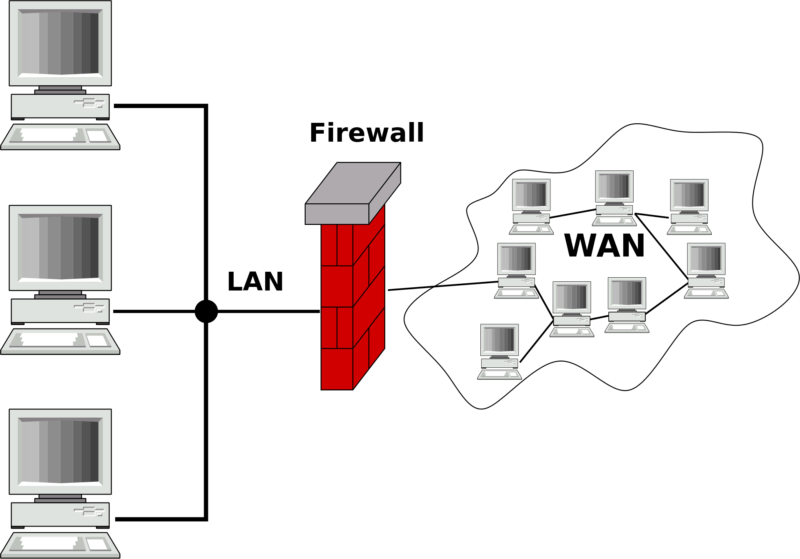
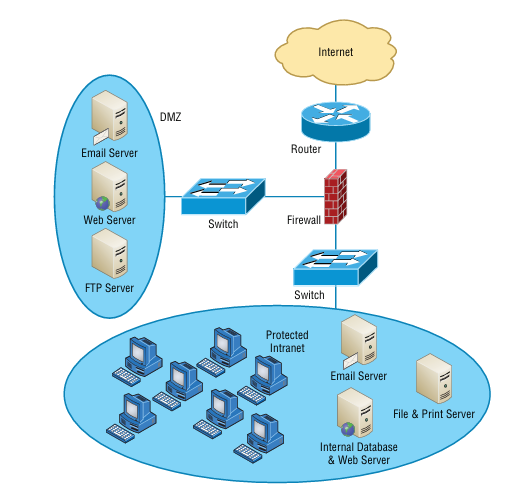
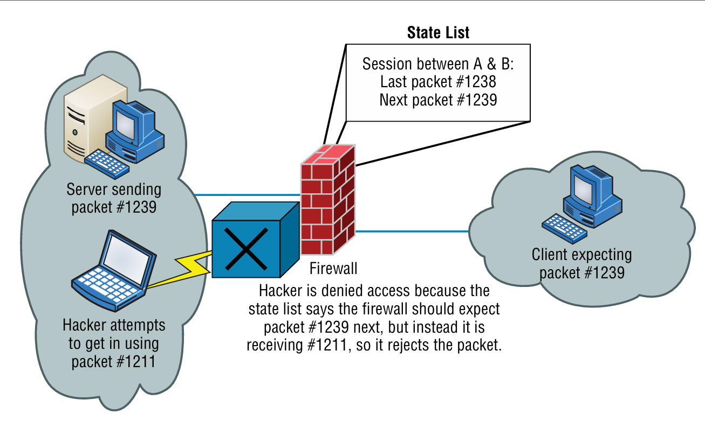
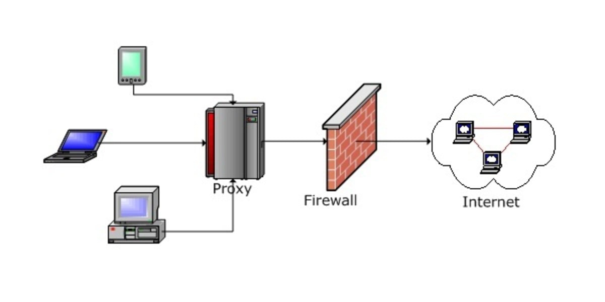
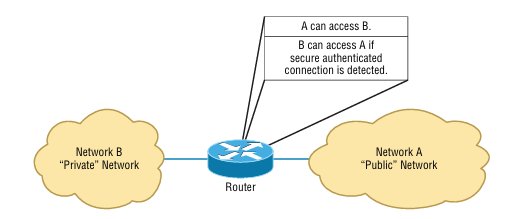
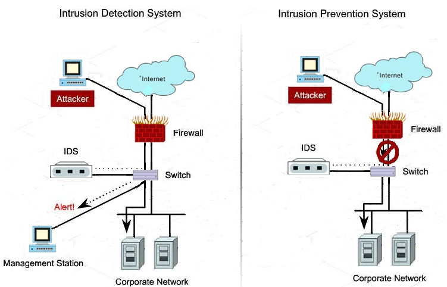
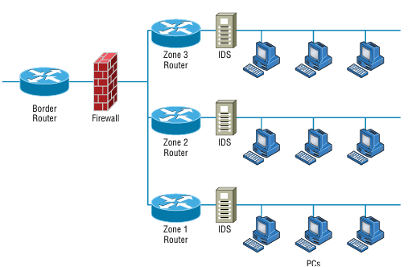
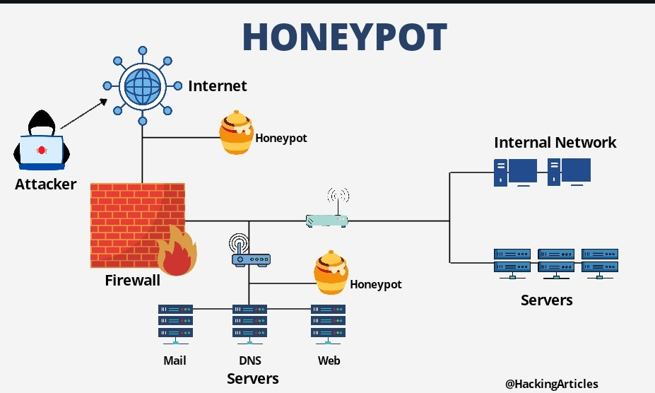
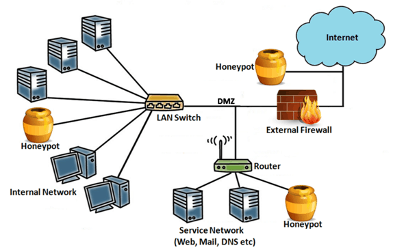

# الموضوع التاسع عشر: الأمن المادي والمخاطر (Physical Security and Risk)

## جدول المحتويات

| # | القسم الرئيسي | المواضيع الفرعية |
|:---:|:---:|:---:|
| 1 | [مقدمة عن الموضوع](#introduction) | [الخطر الداخلي مقابل الخارجي](#internal-vs-external-threats) |
| 2 | [الجدار الناري (Firewall)](#firewall) | [التعريف والوظيفة](#firewall-definition) [تقسيم الشبكات الثلاثة](#firewall-three-zones) [أجيال الجدار الناري](#firewall-generations) [أنواعه: Hardware/Software](#firewall-types) [الجدار الناري كراوتر](#firewall-as-router) [أماكن التركيب](#firewall-placement) [ملخص القدرات](#firewall-capabilities) |
| 3 | [أنظمة كشف ومنع التسلل (IDS/IPS)](#ids-ips) | [إدارة التوقيعات](#signature-management) |
| 4 | [أجهزة ومفاهيم التحكم بالوصول](#access-control-devices) | [ACLs](#acl-servers) [التحكم بالدخول الفيزيائي](#door-access-controls) [بطاقات القرب ومفاتيح الدخول](#proximity-key-fob) [القياسات الحيوية](#biometrics-19) [عوامل المصادقة MFA](#mfa-factors) |
| 5 | [الأمن الفيزيائي للبنية التحتية](#physical-infrastructure) | [غرف/خزائن الشبكة](#network-closets) [مراقبة الكاميرات](#video-monitoring) [أنظمة الإنذار](#alarm-systems) [كبائن الاتصالات](#communication-cabinets) |
| 6 | [مركزات الشبكات الافتراضية الخاصة (VPN Concentrators)](#vpn-concentrators) | - |
| 7 | [إدارة التهديدات الموحدة (UTM)](#utm) | - |
| 8 | [المناطق الأمنية والعزل الشبكي](#security-zones-dmz) | [DMZ](#dmz-19) [مناطق الأمان (Security Zones)](#security-zones) [خصائص الواجهات والتجزئة](#interface-properties) |
| 9 | [المصائد الأمنية (Honeypots, Honeynets & Decoys)](#honeypot) | [Honeypot و Honeynet](#honeypot-definition) [Hardware مقابل Software](#honeypot-hardware-vs-software) [Decoys و DNS Sinkholes](#decoys-dns-sinkholes) |
| 10 | [فحص الثغرات واختبار الاختراق](#vuln-scanners-19) | [Vulnerability Scanners](#vuln-scanners-sub) [Penetration Testing](#pen-testing-19) |
| 11 | [التعافي من الكوارث واستمرارية الأعمال](#drp-bcp) | [Business Continuity مقابل Disaster Recovery](#bcp-vs-drp) [نسخ البيانات الاحتياطية](#backup-types) [استعادة نظام التشغيل](#system-recovery) [مواقع التعافي](#recovery-sites) [إدارة الطاقة](#power-management) [الدوائر الاحتياطية للاتصالات](#redundant-circuits) [المستجيبون الأوائل](#first-responders) |
| 12 | [مفاهيم المخاطر الأساسية](#risk-concepts) | [العقد والأصول الحرجة](#critical-nodes-assets) [التكرارية ونقطة الفشل الواحدة](#redundancy-spof) [خرق البيانات](#data-breach) [توعية وتدريب المستخدمين](#user-awareness-19) |
| 13 | [مقاييس الأداء والاتفاقيات (SLA / MTTR / MTBF)](#sla-mttr-mtbf) | - |
| 14 | [الأجهزة: هاردوير مقابل سوفت وير](#hardware-vs-software) | - |
| 15 | [جدول المراجعة السريع](#cheat-sheet-19) | - |

---

<h2 dir="rtl" align="right" id="introduction">1. مقدمة عن الموضوع</h2>

لو موضوع "تهديدات الشبكة والتخفيف منها" (الموضوع 18) كان بيجاوب على سؤال "إيه اللي ممكن يهاجمنا وإزاي نتصرف بعد وقوع الهجوم"، فموضوع "الأمن المادي والمخاطر" ده بيجاوب على سؤال مختلف شوية: <strong>إزاي نبني البنية التحتية والسياسات من الأساس بحيث تقلل احتمالية وقوع الهجوم أو الكارثة، وتضمن استمرارية العمل حتى لو حصل أسوأ سيناريو؟</strong>

الموضوع ده بيغطي طبقتين أساسيتين من الحماية:

<ol dir="rtl">
<li><strong>الحماية على مستوى الشبكة والأجهزة (Network Security Devices):</strong> جدران نارية، أنظمة كشف تسلل، مركزات VPN، أنظمة إدارة تهديدات موحدة.</li>
<li><strong>الحماية المادية والمخاطر التشغيلية (Physical Security & Risk Management):</strong> كاميرات، بطاقات دخول، خطط التعافي من الكوارث، إدارة الطاقة، ومفاهيم إدارة المخاطر بشكل عام.</li>
</ol>

<h3 dir="rtl" align="right" id="internal-vs-external-threats">1.1 الخطر الداخلي مقابل الخطر الخارجي (Internal vs. External Threats)</h3>

مش كل التهديدات جاية من برّه الشبكة — فهم مصدر التهديد هو أول خطوة لتحديد نوع الحماية المناسبة له:

<ul dir="rtl">
<li><strong>الخطر الخارجي (External Threat):</strong> أي تهديد بيأتي من مهاجمين أو عوامل خارج حدود المؤسسة تماماً — مهاجم عبر الإنترنت بيحاول يخترق الشبكة عن بُعد، أو حتى مهاجم فيزيائي بيحاول يدخل المبنى من برّه بدون تصريح. الحماية منه بتعتمد بشكل أساسي على أجهزة حدود الشبكة (Firewall, IDS/IPS) والحماية الفيزيائية المحيطية (أسوار، حراسة، كاميرات).</li>
<li><strong>الخطر الداخلي (Internal Threat):</strong> أي تهديد بيأتي من داخل المؤسسة نفسها — موظف ساخط بيسيء استخدام صلاحياته عمداً، خطأ بشري غير مقصود (زي إرسال بيانات حساسة لجهة غلط)، أو حتى جهاز داخلي مصاب ببرمجية خبيثة بدون علم صاحبه. الحماية منه بتعتمد على مبادئ زي Least Privilege وتوزيع الصلاحيات (راجع الموضوع 18)، والمراقبة الداخلية، وتوعية المستخدمين.</li>
</ul>

أغلب الأجهزة والتقنيات اللي هنشرحها في الموضوع ده مصممة للتعامل مع النوعين معاً، لأن الاعتماد على حماية الحدود الخارجية بس (Perimeter Security) مش كافي أبداً — نسبة كبيرة من الحوادث الأمنية في الواقع مصدرها داخلي.

---

<h2 dir="rtl" align="right" id="firewall">2. الجدار الناري (Firewall)</h2>

<h3 dir="rtl" align="right" id="firewall-definition">2.1 التعريف والأهمية والوظيفة</h3>

الجدار الناري هو أهم وأقدم جهاز أمني في أي شبكة — دوره الأساسي إنه <strong>يفحص حركة البيانات الداخلة والخارجة</strong> ويقرر يسمح بمرورها أو يمنعها، بناءً على مجموعة قواعد معتمدة مسبقاً (Rule Set / Access Control List). أهميته إنه أول خط دفاع بيفصل بين شبكة موثوقة (زي الشبكة الداخلية للشركة) وشبكة غير موثوقة (زي الإنترنت).

 <em>الدور الأساسي للجدار الناري: يقف بين الشبكة المحلية (LAN) الموثوقة وشبكة الإنترنت الواسعة (WAN) غير الموثوقة، ويتحكم في كل حركة المرور بينهما</em>

<h3 dir="rtl" align="right" id="firewall-three-zones">2.2 تقسيم الشبكات داخل الجدار الناري إلى ثلاثة أنواع</h3>

الإعداد الكلاسيكي لأي جدار ناري بيقسّم الشبكة لثلاث مناطق أساسية، لكل منها مستوى ثقة مختلف:

<ol dir="rtl">
<li><strong>Trusted Network (الشبكة الموثوقة):</strong> الشبكة الداخلية الخاصة بالمؤسسة — أعلى مستوى ثقة، وبتحتوي على أجهزة المستخدمين والموارد الحساسة.</li>
<li><strong>Untrusted Network (الشبكة غير الموثوقة):</strong> عادةً الإنترنت — أقل مستوى ثقة على الإطلاق، وأي حركة قادمة منها بتخضع لأشد فحص.</li>
<li><strong>DMZ (المنطقة المنزوعة السلاح):</strong> منطقة وسيطة بمستوى ثقة متوسط، بتوضع فيها الخدمات اللي لازم تكون متاحة للإنترنت (Web, Mail, DNS Servers) بدون ما تعرّض الشبكة الداخلية للخطر المباشر.</li>
</ol>

 <em>التقسيم الثلاثي الكلاسيكي: الإنترنت (غير موثوق) ← الجدار الناري ← DMZ (خوادم Email/Web/FTP، ثقة متوسطة) ← الشبكة الداخلية المحمية (Protected Intranet، أعلى ثقة)</em>

<h3 dir="rtl" align="right" id="firewall-generations">2.3 أجيال (تقنيات) الجدار الناري</h3>

تطوّر الجدار الناري عبر عدة أجيال، كل جيل بيفحص حركة البيانات بعمق أكبر من اللي قبله:

<ul dir="rtl">
<li><strong>Packet Filtering Firewall (الجيل الأول):</strong> بيفحص كل حزمة (Packet) بشكل منفرد ومستقل — بيقارن عنوان الـ IP المصدر والوجهة ورقم المنفذ (Port) بقواعد ثابتة، وبيقرر يسمح أو يمنع. بسيط وسريع لكنه ساذج: مبيفهمش سياق الاتصال (Session) ككل.</li>
<li><strong>Stateful Inspection Firewall (الجيل الثاني):</strong> بيحتفظ بجدول حالة (State Table) بيتتبع فيه كل جلسة اتصال نشطة (مين بعت إيه ومستني إيه بعده). أي حزمة مش متطابقة مع الحالة المتوقعة للجلسة بتترفض فوراً، حتى لو شكلها سليم على مستوى الحزمة المنفردة.</li>
</ul>

 <em>مثال Stateful Inspection: الجدار الناري يحتفظ بجدول حالة يتوقع الحزمة رقم 1239 التالية في الجلسة، فيرفض تلقائياً محاولة المهاجم بحزمة رقم 1211 غير متوقعة رغم شكلها السليم ظاهرياً</em>

<ul dir="rtl">
<li><strong>Proxy / Application-Level Firewall (جيل وسيط):</strong> بدل ما الأجهزة تتواصل مباشرة مع الإنترنت، كل الطلبات بتمر أولاً عبر خادم وسيط (Proxy) بيفحص المحتوى على مستوى التطبيق نفسه (Layer 7) قبل ما يمرره للجدار الناري والإنترنت. بيدّي مستوى فحص أعمق بس بيأثر على الأداء (زيادة زمن الاستجابة).</li>
</ul>

 <em>معمارية Proxy Firewall: كل أجهزة المستخدمين تمرّ عبر خادم Proxy وسيط أولاً، ثم الجدار الناري، قبل الوصول للإنترنت</em>

<ul dir="rtl">
<li><strong>Next-Generation Firewall (NGFW / Layer 7 Firewall):</strong> الجيل الأحدث، وبيدمج كل مميزات الأجيال السابقة (Stateful Inspection + فحص على مستوى التطبيق) مع قدرات إضافية زي التعرف على البرامج المحددة (Application Awareness) بغض النظر عن رقم المنفذ، ودمج وظائف IDS/IPS ومكافحة الفيروسات في جهاز واحد.</li>
</ul>

<h3 dir="rtl" align="right" id="firewall-types">2.4 أنواع الجدار الناري (Hardware مقابل Software)</h3>

بعيداً عن تقنية الفحص، الجدار الناري بيُصنَّف كمان حسب شكله الفيزيائي:

<ul dir="rtl">
<li><strong>Hardware Firewall (جدار ناري هاردوير):</strong> جهاز فيزيائي مستقل بيوضع عند حدود الشبكة (Network Perimeter)، وبيحمي كل الأجهزة المتصلة خلفه دفعة واحدة. مناسب أكتر للشركات والشبكات الكبيرة.</li>
<li><strong>Software Firewall (جدار ناري سوفت وير):</strong> برنامج بيتثبّت على جهاز منفرد (Host-based Firewall) زي Windows Defender Firewall، وبيحمي الجهاز ده بس. مفيد كطبقة حماية إضافية حتى لو الشبكة كلها محمية بجدار هاردوير (Defense in Depth).</li>
</ul>

<h3 dir="rtl" align="right" id="firewall-as-router">2.5 قيام الجدار الناري بدور الراوتر</h3>

في كتير من الإعدادات الصغيرة والمتوسطة، الجدار الناري مش بس بيفحص الحركة، لكنه كمان بيقوم بوظيفة <strong>التوجيه (Routing)</strong> بين الشبكات المختلفة — يعني بيجمع بين وظيفة الراوتر ووظيفة الفحص الأمني في جهاز واحد. القرار بتاعه مش بس "أوجّه الحزمة فين" زي راوتر عادي، لكن كمان "هل أسمح بمرورها من الأساس" بناءً على اتجاه الاتصال ومستوى الثقة بين الشبكتين.

 <em>مثال على قاعدة وصول غير متماثلة (Asymmetric Access Rule): الشبكة العامة (Network A) تقدر توصل للشبكة الخاصة (Network B) فقط لو تم اكتشاف اتصال آمن وموثّق مسبقاً — وهو نفس المبدأ اللي تُبنى عليه قوائم التحكم بالوصول (ACLs)</em>

<h3 dir="rtl" align="right" id="firewall-placement">2.6 أماكن تركيب الجدار الناري في الشبكة (Placement Scenarios)</h3>

مكان تركيب الجدار الناري بيحدد شكل الحماية بالكامل. من أشهر السيناريوهات العملية:

<ul dir="rtl">
<li><strong>جدار ناري واحد بثلاث واجهات (Three-Legged Firewall):</strong> جهاز واحد بس بثلاث واجهات شبكة منفصلة — واجهة للإنترنت، واجهة للشبكة الداخلية، وواجهة للـ DMZ. اقتصادي لكن نقطة فشل واحدة (SPOF — راجع القسم 12.2) لو الجهاز نفسه اتخترق أو تعطّل.</li>
<li><strong>Screened Subnet (جدارين ناريين):</strong> جدار ناري خارجي (Front-end) بين الإنترنت والـ DMZ، وجدار ناري داخلي (Back-end) تاني بين الـ DMZ والشبكة الداخلية. حماية أقوى بكتير لأن أي مهاجم يخترق الجدار الخارجي لسه لازم يخترق جدار تاني منفصل قبل ما يوصل للشبكة الداخلية الحساسة.</li>
<li><strong>خلف الراوتر الحدودي مباشرة (Border Router):</strong> الترتيب الأشيع — الراوتر الحدودي بيستقبل الحركة من الإنترنت أولاً (وممكن يعمل فلترة أولية بسيطة)، وبعدين الجدار الناري بيقوم بالفحص التفصيلي قبل ما تدخل أي حركة للشبكة الداخلية أو مناطق الأمان (Security Zones — راجع القسم 8.2).</li>
</ul>

<h3 dir="rtl" align="right" id="firewall-capabilities">2.7 ملخص: كل ما يستطيع الجدار الناري القيام به</h3>

<ul dir="rtl">
<li>فلترة الحركة بناءً على IP، Port، أو Protocol.</li>
<li>تتبّع حالة الجلسات (Stateful Inspection) ومنع أي حزمة خارج السياق.</li>
<li>فحص محتوى الحركة على مستوى التطبيق (في NGFW).</li>
<li>القيام بدور الـ NAT (ترجمة عناوين الشبكة) وإخفاء بنية الشبكة الداخلية.</li>
<li>القيام بدور التوجيه (Routing) بين الشبكات المختلفة.</li>
<li>تسجيل الأحداث (Logging) لأغراض المراجعة والتدقيق الأمني.</li>
<li>فرض سياسات وصول مختلفة حسب اتجاه الاتصال ومستوى ثقة كل منطقة (Trusted/Untrusted/DMZ).</li>
</ul>

---

<h2 dir="rtl" align="right" id="ids-ips">3. أنظمة كشف ومنع التسلل (IDS / IPS)</h2>

تذكير سريع (اتشرحت بالتفصيل في قسم تقنيات التخفيف بالموضوع 18): <strong>IDS (Intrusion Detection System)</strong> نظام مراقبة سلبي بيكتشف الأنشطة المشبوهة ويصدر تنبيه (Alert) فقط دون تدخل مباشر، بينما <strong>IPS (Intrusion Prevention System)</strong> يعمل بشكل نشط داخل مسار البيانات مباشرة (In-line) ويقدر يمنع التهديد فوراً بمجرد اكتشافه.

 <em>الفرق العملي: في IDS الهجوم يمر فعلياً للشبكة الداخلية مع إرسال تنبيه فقط لمحطة الإدارة، بينما في IPS يُمنع الهجوم من الوصول للشبكة الداخلية من الأساس</em>

<h3 dir="rtl" align="right" id="signature-management">3.1 إدارة التوقيعات (Signature Management)</h3>

سواء IDS أو IPS أو حتى برامج مكافحة الفيروسات، أغلبها بيعتمد بشكل أساسي على <strong>التوقيعات (Signatures)</strong> — أنماط معروفة ومسجّلة لهجمات أو برمجيات خبيثة سابقة، بيقارن بيها الجهاز حركة الشبكة أو الملفات لحظياً. <strong>إدارة التوقيعات</strong> هي العملية المستمرة لتحديث قاعدة بيانات التوقيعات دي بأحدث الأنماط المكتشفة عالمياً، والتأكد من تفعيلها بشكل صحيح، وإزالة أي توقيعات قديمة بتسبب إنذارات كاذبة (False Positives) غير ضرورية. جهاز بتوقيعات قديمة عملياً بيكون أعمى تماماً عن أي هجوم جديد ظهر بعد آخر تحديث — فمهما كان الجهاز قوياً، فعاليته محكومة بمدى حداثة قاعدة التوقيعات بتاعته.

---

<h2 dir="rtl" align="right" id="access-control-devices">4. أجهزة ومفاهيم التحكم بالوصول</h2>

<h3 dir="rtl" align="right" id="acl-servers">4.1 خوادم التحكم بالوصول (Access Control Lists – ACLs)</h3>

ACL هي قائمة قواعد بتحدد بدقة مين المسموح له بالوصول لمورد معين ومين الممنوع، وبتُطبَّق عادةً على الراوترات والجدران النارية والسويتشات. كل قاعدة بتحدد عادةً: عنوان المصدر، عنوان الوجهة، نوع البروتوكول أو رقم المنفذ، والإجراء (سماح أو منع). دورها أساسي في فرض مبدأ <strong>Least Privilege</strong> على مستوى الشبكة نفسها، مش بس على مستوى صلاحيات المستخدمين.

<h3 dir="rtl" align="right" id="door-access-controls">4.2 التحكم بالدخول الفيزيائي (Door Access Controls)</h3>

أنظمة بتتحكم فعلياً في مين يقدر يفتح باب معين (غرفة سيرفرات، مبنى بالكامل) — سواء عن طريق قفل إلكتروني بيتفعّل ببطاقة أو رمز، أو نظام مركزي بيسجّل كل عملية دخول وخروج (Access Log) لأغراض المراجعة.

<h3 dir="rtl" align="right" id="proximity-key-fob">4.3 بطاقات القرب ومفاتيح الدخول (Proximity Readers / Key Fob)</h3>

<strong>Proximity Reader:</strong> جهاز قراءة بيتفاعل مع بطاقة أو جهاز صغير بمجرد الاقتراب منه (بدون تلامس مباشر)، باستخدام تقنية RFID غالباً. <strong>Key Fob:</strong> جهاز صغير (زي الميدالية) بيحمل نفس فكرة البطاقة لكن في شكل أصغر وأسهل حملاً، وبيُستخدم للفتح عن بعد أو عند الاقتراب من القارئ.

<h3 dir="rtl" align="right" id="biometrics-19">4.4 القياسات الحيوية (Biometrics)</h3>

التحقق من الهوية باستخدام سمة جسدية فريدة للشخص — بصمة الإصبع، بصمة الوجه، أو قزحية العين. من أقوى طرق المصادقة لأنها مبنية على "شيء أنت عليه" (Something You Are) ويصعب تزويره أو نسيانه، على عكس كلمة المرور أو البطاقة.

<h3 dir="rtl" align="right" id="mfa-factors">4.5 عوامل المصادقة متعددة العوامل (Multifactor Authentication – MFA)</h3>

المصادقة القوية بتعتمد على الجمع بين أكتر من "عامل" مختلف من فئات مختلفة (مش نفس الفئة مرتين) عشان تضمن إن الشخص فعلاً هو صاحب الهوية المُدَّعاة. الفئات الخمس المعتمدة:

<ul dir="rtl">
<li><strong>Something You Know (شيء تعرفه):</strong> كلمة مرور، رقم PIN، أو إجابة سؤال أمني.</li>
<li><strong>Something You Have (شيء تملكه):</strong> بطاقة ذكية، Key Fob (الموضّح في القسم 4.3)، أو تطبيق توليد رموز مؤقتة (Authenticator App).</li>
<li><strong>Something You Are (شيء أنت عليه):</strong> القياسات الحيوية الموضّحة فوق مباشرة (بصمة، وجه، قزحية).</li>
<li><strong>Somewhere You Are (مكان تواجدك):</strong> التحقق من الموقع الجغرافي أو عنوان الشبكة (IP) اللي بيحاول المستخدم الدخول منه، ورفض أو تنبيه المحاولات من مواقع غير معتادة.</li>
<li><strong>Something You Do (شيء تفعله):</strong> نمط سلوكي مميز للشخص، زي طريقة كتابته على لوحة المفاتيح (Keystroke Dynamics) أو توقيعه اليدوي بحركة معينة.</li>
</ul>

<strong>المبدأ الأساسي للـ MFA:</strong> كل ما زاد عدد الفئات المختلفة المستخدمة معاً، كل ما زادت صعوبة انتحال الهوية على المهاجم — لأنه لازم يخترق أكتر من نوع حماية مختلف تماماً في نفس الوقت (مثلاً سرقة كلمة المرور وحدها معناها معدومة لو الحساب محمي كمان ببصمة أو رمز مؤقت من الهاتف).

---

<h2 dir="rtl" align="right" id="physical-infrastructure">5. الأمن الفيزيائي للبنية التحتية</h2>

<h3 dir="rtl" align="right" id="network-closets">5.1 غرف/خزائن الشبكة (Network Closets)</h3>

المساحات أو الخزائن اللي بتحتوي على معدات الشبكة الحساسة (سويتشات، راوترات، لوحات توزيع الكابلات). لازم تكون مقفلة دايماً ومحدودة الوصول لأقل عدد ممكن من الأفراد المصرّح لهم، لأن أي وصول فيزيائي مباشر لمعدات الشبكة بيتخطى كل طبقات الحماية البرمجية فوراً.

<h3 dir="rtl" align="right" id="video-monitoring">5.2 مراقبة الكاميرات (Video Monitoring / IP Camera)</h3>

كاميرات مراقبة (غالباً كاميرات IP متصلة بالشبكة نفسها) بتراقب المناطق الحساسة بشكل مستمر وبتسجّل أي نشاط. دورها كشفي (Detective) بالأساس — بتوثّق وقوع محاولة اختراق فيزيائي، وبتُستخدم كدليل لاحقاً، وبيكون وجودها الظاهر رادع (Deterrent) في نفس الوقت.

<h3 dir="rtl" align="right" id="alarm-systems">5.3 أنظمة الإنذار (Alarm Systems)</h3>

أنظمة بتصدر تنبيهاً فورياً (صوتي أو صامت لفريق الأمن) عند اكتشاف حدث غير طبيعي — فتح باب بدون تصريح، كسر نافذة، أو حركة غير متوقعة في منطقة محظورة بعد ساعات العمل. بتشتغل غالباً بالتكامل مع أجهزة الكشف الأخرى (حساسات الحركة، أجهزة فتح الأبواب).

<h3 dir="rtl" align="right" id="communication-cabinets">5.4 كبائن الاتصالات (Communication Cabinets)</h3>

كبائن الاتصالات هي صناديق أو كبائن معدنية مغلقة (بأقفال مخصصة) بتستضيف معدات توزيع الشبكة والاتصالات القريبة من نقاط الاستخدام النهائية — زي لوحات التوصيل (Patch Panels)، سويتشات الطابق، ونقاط توزيع الكابلات. الفرق عن Network Closets (الموضّحة في القسم 5.1): الـ Network Closet غالباً غرفة كاملة مخصصة لمعدات الشبكة الأساسية والحساسة، بينما كبينة الاتصالات وحدة أصغر بتتوزع في أماكن متعددة (كل طابق أو كل قسم مثلاً) لتوصيل الأجهزة القريبة منها بالشبكة الرئيسية، وأحياناً بتكون كبائن خارجية مقاومة للعوامل الجوية لو كانت بتخدم توزيع خارج المبنى. حمايتها الفيزيائية (بالقفل والمراقبة) بنفس أهمية حماية غرف الشبكة الرئيسية، لأن أي وصول غير مصرح بيها بيسمح بالتنصت على الكابلات أو توصيل أجهزة غير مصرح بها مباشرة على الشبكة الداخلية.

---

<h2 dir="rtl" align="right" id="vpn-concentrators">6. مركزات الشبكات الافتراضية الخاصة (VPN Concentrators)</h2>

الـ VPN Concentrator هو جهاز متخصص مصمم للتعامل مع عدد ضخم من اتصالات VPN المشفّرة في نفس الوقت — بيتولى عملية التشفير وفك التشفير، وإدارة المصادقة، وإنشاء الأنفاق الآمنة (Tunnels) بين المستخدمين البعيدين (Remote Users) أو الفروع المختلفة والشبكة المركزية للمؤسسة. بيُستخدم في المؤسسات الكبيرة اللي عندها عدد كبير من الموظفين اللي بيشتغلوا عن بعد أو فروع متعددة، لأن جدار ناري عادي أو راوتر قد ميكونش مجهّز للتعامل مع هذا الحجم من عمليات التشفير في نفس الوقت بكفاءة.

---

<h2 dir="rtl" align="right" id="utm">7. إدارة التهديدات الموحدة (UTM – Unified Threat Management)</h2>

جهاز الـ UTM هو حل أمني "الكل في واحد" — بيدمج عدة وظائف أمنية كانت تقليدياً موزّعة على أجهزة منفصلة، في جهاز واحد: جدار ناري، مكافحة فيروسات وبرمجيات خبيثة (على مستوى الشبكة)، نظام كشف ومنع تسلل (IDS/IPS)، فلترة محتوى الويب (Content Filtering)، مكافحة البريد المزعج (Anti-Spam)، وأحياناً VPN Concentrator بالكامل.

<strong>الميزة:</strong> إدارة مركزية أبسط بكتير (لوحة تحكم واحدة بدل عدة أجهزة منفصلة)، وتكلفة أقل للشركات الصغيرة والمتوسطة.

<strong>العيب:</strong> نقطة فشل واحدة محتملة (Single Point of Failure — راجع القسم 12) لأن كل الوظائف الأمنية معتمدة على جهاز واحد، وأداء أضعف نسبياً تحت الضغط الشديد مقارنة بأجهزة متخصصة منفصلة لكل وظيفة.

---

<h2 dir="rtl" align="right" id="security-zones-dmz">8. المناطق الأمنية والعزل الشبكي</h2>

<h3 dir="rtl" align="right" id="dmz-19">8.1 المنطقة المنزوعة السلاح (DMZ)</h3>

تذكير سريع (اتشرحت بالتفصيل في الموضوع 18): الـ DMZ شبكة فرعية معزولة بتستضيف الخدمات اللي لازم تكون متاحة للإنترنت (Web, Mail Servers)، وبتفصل بجدار ناري عن الشبكة الداخلية الخاصة، بحيث لو حصل اختراق لخادم في الـ DMZ، الشبكة الداخلية الحساسة تفضل محمية.

<h3 dir="rtl" align="right" id="security-zones">8.2 مناطق الأمان (Security Zones)</h3>

مفهوم أوسع من الـ DMZ — تقسيم الشبكة الداخلية نفسها لعدة "مناطق" (Zones) منفصلة منطقياً، كل منطقة ليها راوتر ونظام كشف تسلل (IDS) خاص بيها، ومستوى ثقة وقواعد وصول مختلفة عن باقي المناطق. الفكرة إنه حتى لو مهاجم قدر يخترق منطقة واحدة، الاختراق بيفضل محصور فيها ومايقدرش ينتشر بسهولة لباقي مناطق الشبكة — نفس مبدأ الـ Segmentation لكن على مستوى أوسع من مجرد فصل الشبكة الداخلية عن الخارجية.

 <em>تقسيم الشبكة لثلاث مناطق أمان منفصلة (Zone 1, 2, 3)، كل منطقة لها راوتر وIDS مستقل خلف الجدار الناري الرئيسي والراوتر الحدودي (Border Router)</em>

<h3 dir="rtl" align="right" id="interface-properties">8.3 خصائص الواجهات وتجزئة الشبكة (Interface Properties & Segmentation)</h3>

تجزئة الشبكة (Segmentation) مش بس على مستوى مناطق أمان كاملة (زي فوق)، لكن كمان على مستوى إعدادات <strong>الواجهة (Interface)</strong> نفسها لكل منفذ في السويتش أو الراوتر. من أهم الخصائص اللي بتتحكم في التجزئة والأمان على مستوى المنفذ:

<ul dir="rtl">
<li><strong>VLAN Assignment:</strong> تحديد أي VLAN ينتمي لها المنفذ، وده اللي بيحدد مع مين الجهاز المتصل بيه هيقدر يتواصل منطقياً حتى لو كانوا على نفس السويتش الفيزيائي.</li>
<li><strong>Port Security:</strong> تقييد المنفذ للسماح فقط بعدد محدد (أو عناوين MAC محددة سلفاً) من الأجهزة المتصلة بيه، ومنع أي جهاز غير مصرح به من الاتصال حتى لو وصل فيزيائياً للكابل.</li>
<li><strong>Speed / Duplex:</strong> إعدادات سرعة الاتصال ونمط الإرسال (Half/Full Duplex) — إعداد غلط بينهم مش بس بيأثر على الأداء، لكن ممكن كمان يفتح ثغرات في بعض السيناريوهات.</li>
<li><strong>Native VLAN:</strong> الـ VLAN الافتراضي لأي حركة غير موسومة (Untagged) على رابط Trunk — إعداده بشكل غلط هو الأساس اللي بيُستغل في هجوم Double Tagging (الموضّح بالتفصيل في الموضوع 18).</li>
</ul>

باختصار، تجزئة الشبكة الفعّالة بتحتاج طبقتين متكاملتين: تصميم عام صحيح (DMZ + Security Zones)، وإعدادات دقيقة وصحيحة على مستوى كل واجهة منفردة.

---

<h2 dir="rtl" align="right" id="honeypot">9. المصائد الأمنية (Honeypots, Honeynets & Decoys)</h2>

<h3 dir="rtl" align="right" id="honeypot-definition">9.1 تعريف الـ Honeypot و Honeynet</h3>

الـ Honeypot هو نظام أو خادم <strong>وهمي مصمم عمداً ليبدو كهدف جذاب وسهل الاختراق</strong> — بيانات مزيّفة، ثغرات ظاهرية، خدمات وهمية — بهدف جذب المهاجمين لمهاجمته هو بدلاً من الأنظمة الحقيقية. أي حركة تجاه الـ Honeypot تُعتبر مشبوهة بشكل شبه مؤكد (لأن محدش شرعي المفروض يتفاعل معاه أصلاً)، وده بيدّي فريق الأمن معلومات قيّمة عن أساليب المهاجمين الفعلية (Threat Intelligence) من غير ما يعرّض أي أصل حقيقي للخطر.

 <em>توزيع الـ Honeypot الشائع: نسخة أمام الجدار الناري مباشرة (تجذب المهاجمين قبل وصولهم للشبكة)، ونسخة أخرى داخل منطقة الخوادم لمراقبة أي محاولة اختراق داخلية</em>

<strong>Honeynet:</strong> امتداد لفكرة الـ Honeypot، لكن بدل نظام وهمي واحد، بيتم بناء <strong>شبكة كاملة</strong> من الأنظمة الوهمية المترابطة (خوادم، أجهزة، حتى شبكة فرعية بأكملها) لمحاكاة بيئة إنتاج حقيقية بالكامل، وده بيدّي صورة أشمل عن سلوك المهاجم لما يتحرك بين عدة أنظمة بعد الاختراق الأولي.

 <em>معمارية Honeynet متكاملة: نقاط Honeypot موزّعة في أكثر من موقع (قبل الجدار الناري، داخل الـ DMZ، وبجانب الشبكة الداخلية) لتغطية أكبر قدر من مسارات الهجوم المحتملة</em>

<h3 dir="rtl" align="right" id="honeypot-hardware-vs-software">9.2 التنفيذ: Hardware Appliance مقابل Software / Virtual Honeypot</h3>

زي أي جهاز أمني تاني في الموضوع ده، الـ Honeypot ممكن يتنفّذ بطريقتين مختلفتين:

<ul dir="rtl">
<li><strong>Hardware Appliance Honeypot:</strong> جهاز فيزيائي مستقل بالكامل، مخصص فقط لدور المصيدة. بيدّي عزلاً حقيقياً وكاملاً عن باقي البنية التحتية (لو المهاجم قدر "يخترق" المصيدة فعلياً، مفيش أي احتمال إنه يوصل لأي نظام حقيقي منها لأنها مش متصلة بيهم من الأساس)، لكنه أغلى وأصعب في النشر والتوسع لو المؤسسة محتاجة مصايد متعددة في أماكن مختلفة.</li>
<li><strong>Software / Virtual Honeypot:</strong> برنامج أو آلة افتراضية (Virtual Machine) بتحاكي نظام حقيقي بالكامل، بتتشغل على بنية تحتية موجودة أصلاً (سيرفر افتراضي أو حتى Container). أرخص وأسهل بكتير في النشر والتكرار (تقدر تنشر عشرات المصايد الافتراضية بسرعة في مواقع مختلفة)، لكن لازم تُدار بعناية أكبر لضمان عزلها الحقيقي (Isolation) عن الشبكة الفعلية — لأن أي غلطة في إعداد العزل الافتراضي ممكن تفتح مسار حقيقي للمهاجم بدل ما تحاصره.</li>
</ul>

<h3 dir="rtl" align="right" id="decoys-dns-sinkholes">9.3 الطُّعوم (Decoys) وحُفَر DNS (DNS Sinkholes)</h3>

بعيداً عن الـ Honeypot الكامل، فيه أدوات مصيدة أبسط وأكثر تخصصاً بتخدم نفس الهدف العام (تضليل المهاجم أو قطع الطريق عليه):

<ul dir="rtl">
<li><strong>Decoys (الطُّعوم):</strong> مصطلح أعم من الـ Honeypot — أي عنصر مزيّف (ملف، حساب مستخدم وهمي، بيانات اعتماد وهمية، أو حتى جهاز كامل) بيُزرع عمداً وسط البيانات أو الأنظمة الحقيقية بهدف تضليل المهاجم أو كشف تحركه. الفرق العملي إن الـ Decoy مش شرط يكون نظام متكامل قائم بذاته زي الـ Honeypot — ممكن يكون مجرد ملف واحد اسمه "passwords.xlsx" مزروع في مجلد حقيقي، وأي محاولة لفتحه بتُطلق تنبيهاً فورياً لأن محدش شرعي المفروض يحتاجه.</li>
<li><strong>DNS Sinkhole (حفرة الـ DNS):</strong> تقنية بتُستخدم لاعتراض وإعادة توجيه طلبات DNS الخاصة بنطاقات معروفة إنها خبيثة (زي نطاقات التحكم والسيطرة C2 الخاصة ببرمجية خبيثة أو Botnet) إلى عنوان IP وهمي أو خاضع لسيطرة فريق الأمن، بدلاً من عنوان المهاجم الحقيقي. النتيجة: أي جهاز داخلي مصاب بيحاول يتواصل مع سيرفر التحكم بتاعه (زي اللي اتشرح في هجوم TFN بالموضوع 18) بيتقطع اتصاله فعلياً ("يسقط في الحفرة")، وفي نفس الوقت فريق الأمن بيقدر يحدد بالظبط أي الأجهزة الداخلية مصابة بناءً على مين اللي حاول يوصل للنطاق الخبيث ده.</li>
</ul>

---

<h2 dir="rtl" align="right" id="vuln-scanners-19">10. فحص الثغرات واختبار الاختراق</h2>

<h3 dir="rtl" align="right" id="vuln-scanners-sub">10.1 أدوات فحص الثغرات (Vulnerability Scanners)</h3>

تذكير سريع (اتشرح بالتفصيل في الموضوع 18 ضمن مقارنة Vulnerability Scanning و Penetration Testing): أداة آلية بتفحص الأنظمة والشبكة وتقارنها بقاعدة بيانات ثغرات معروفة، وتطلع تقرير بكل نقاط الضعف المكتشفة <strong>دون استغلالها فعلياً</strong> — خطوة استباقية أساسية ضمن أي برنامج إدارة مخاطر متكامل.

<h3 dir="rtl" align="right" id="pen-testing-19">10.2 اختبار الاختراق (Penetration Testing)</h3>

تذكير سريع (اتشرح بالتفصيل في الموضوع 18): على عكس الفحص الآلي، اختبار الاختراق عملية يقوم بيها هاكر أخلاقي (White Hat) بمحاكاة هجوم حقيقي كامل ومحاولة <strong>استغلال</strong> الثغرات فعلياً، عشان يثبت مدى تأثيرها الحقيقي على النظام. بيُعتبر من أهم تقنيات التخفيف الاستباقية لأنه بيكشف نقاط ضعف حقيقية (بما فيها نقاط ضعف فيزيائية زي محاولة تجاوز أجهزة التحكم بالدخول الموضّحة في القسم 4) قبل ما يكتشفها مهاجم حقيقي.

---

<h2 dir="rtl" align="right" id="drp-bcp">11. التعافي من الكوارث واستمرارية الأعمال (Disaster Recovery & Business Continuity)</h2>

<h3 dir="rtl" align="right" id="bcp-vs-drp">11.1 Business Continuity مقابل Disaster Recovery</h3>

المصطلحان مرتبطان جداً لكن مش نفس الحاجة: <strong>Business Continuity (BCP)</strong> هي الخطة الشاملة اللي بتضمن استمرار العمليات الأساسية للمؤسسة أثناء وبعد وقوع أي حدث كارثي (مش بس تقني — ممكن يكون كارثة طبيعية أو انقطاع كهرباء) بأقل تعطيل ممكن. أما <strong>Disaster Recovery (DRP)</strong> فهي جزء فرعي من الـ BCP، ومركّزة بالتحديد على <strong>استعادة الأنظمة التقنية والبيانات</strong> بعد وقوع الكارثة فعلياً.

<h3 dir="rtl" align="right" id="backup-types">11.2 التعافي من ناحية البيانات: أنواع النسخ الاحتياطي</h3>

<table>
<tr><th align="center">النوع</th><th align="center">الوصف</th><th align="center">وقت النسخ</th><th align="center">وقت الاستعادة</th></tr>
<tr><td align="center"><strong>Full Backup</strong></td><td align="center">نسخة كاملة من كل البيانات في كل مرة</td><td align="center">الأطول</td><td align="center">الأسرع (نسخة واحدة فقط)</td></tr>
<tr><td align="center"><strong>Incremental Backup</strong></td><td align="center">نسخ التغييرات منذ آخر نسخة (كاملة أو تزايدية)</td><td align="center">الأسرع</td><td align="center">الأبطأ (يحتاج كل النسخ بالترتيب)</td></tr>
<tr><td align="center"><strong>Differential Backup</strong></td><td align="center">نسخ كل التغييرات منذ آخر نسخة كاملة فقط</td><td align="center">متوسط</td><td align="center">متوسط (يحتاج آخر Full + آخر Differential فقط)</td></tr>
</table>

<h3 dir="rtl" align="right" id="system-recovery">11.3 استعادة نظام التشغيل (System Recovery)</h3>

بعيداً عن استعادة البيانات نفسها، لازم يكون فيه خطة لاستعادة النظام (نظام التشغيل والإعدادات والبرامج) لحالته التشغيلية الطبيعية — سواء عن طريق صور نظام جاهزة (System Images/Snapshots) بيتم تحميلها مباشرة على جهاز بديل، أو إعادة تثبيت كاملة وفق دليل إعداد موثّق (Configuration Baseline — راجع الموضوع 18).

<h3 dir="rtl" align="right" id="recovery-sites">11.4 مواقع التعافي (Recovery Sites)</h3>

مواقع بديلة جاهزة لنقل العمليات إليها في حالة تعطّل الموقع الأساسي بالكامل، وبتُصنَّف حسب مدى جاهزيتها للتشغيل الفوري:

<ul dir="rtl">
<li><strong>Cold Site:</strong> مساحة فارغة بمرافق أساسية بس (كهرباء، تكييف) بدون أي معدات مثبّتة — أرخص خيار لكن بيحتاج وقت طويل (أيام لأسابيع) للتجهيز والتشغيل الفعلي.</li>
<li><strong>Warm Site:</strong> حل وسط — فيه بعض المعدات والاتصالات جاهزة جزئياً، لكن البيانات مش محدّثة بشكل لحظي؛ وقت التجهيز أسرع من الـ Cold Site (ساعات لأيام قليلة).</li>
<li><strong>Hot Site:</strong> نسخة طبق الأصل جاهزة بالكامل من البيئة الأساسية، بأحدث نسخة من البيانات (أو قريبة جداً منها)، وجاهزة للتشغيل الفوري تقريباً (دقائق) — أغلى خيار لكن أسرع تعافٍ ممكن.</li>
</ul>

<h3 dir="rtl" align="right" id="power-management">11.5 إدارة الطاقة (Power Management)</h3>

استمرارية العمل بتعتمد بشكل أساسي على استمرارية التيار الكهربائي:

<ul dir="rtl">
<li><strong>Battery Backups / UPS (Uninterruptible Power Supply):</strong> بطاريات احتياطية بتوفر طاقة فورية لحظة انقطاع التيار الرئيسي، بتديّ وقت كافٍ (دقائق) لإغلاق الأنظمة بأمان أو التبديل لمصدر طاقة بديل قبل ما تتلف البيانات أو المعدات.</li>
<li><strong>Power Generators (مولدات الطاقة):</strong> توفر طاقة بديلة لفترات أطول بكتير من الـ UPS (ساعات أو أيام) في حالة انقطاع كهرباء ممتد، وبتشتغل غالباً بالديزل أو الغاز.</li>
<li><strong>Dual Power Supplies (مصادر طاقة مزدوجة):</strong> تجهيز الأجهزة الحساسة (سيرفرات، سويتشات رئيسية) بمصدرين منفصلين للطاقة، بحيث لو مصدر واحد فشل، الجهاز يفضل شغال من المصدر التاني بدون أي انقطاع.</li>
</ul>

<h3 dir="rtl" align="right" id="redundant-circuits">11.6 الدوائر الاحتياطية للاتصالات (Redundant Circuits)</h3>

وجود أكتر من خط اتصال (Circuit) واحد فعلي ومستقل لتوفير الاتصال بالإنترنت أو بين مواقع المؤسسة المختلفة — لو خط واحد اتقطع (عطل فني، قطع كابل)، الخط الاحتياطي بيكمّل العمل بدون توقف. نفس مبدأ الـ Dual Power Supplies، بس مطبّق على الاتصالات بدل الكهرباء.

<h3 dir="rtl" align="right" id="first-responders">11.7 المستجيبون الأوائل (First Responders)</h3>

الفريق أو الأفراد المسؤولين عن أول رد فعل فوري لحظة اكتشاف حادث أمني أو كارثة — بيكونوا جزء أساسي من خطة الاستجابة للحوادث (Incident Response Policy الموضّحة في الموضوع 18)، ودورهم يبدأ من مرحلة <strong>Identification و Containment</strong> مباشرة قبل ما يتدخل باقي فريق الأمن الأشمل.

---

<h2 dir="rtl" align="right" id="risk-concepts">12. مفاهيم المخاطر الأساسية (Risk-Related Concepts)</h2>

<h3 dir="rtl" align="right" id="critical-nodes-assets">12.1 العقد الحرجة والأصول الحرجة (Critical Nodes / Critical Assets)</h3>

<strong>Critical Asset:</strong> أي مورد (بيانات، نظام، جهاز) لو تعطّل أو فُقد، هيسبب ضرر جسيم لعمل المؤسسة — زي قاعدة بيانات العملاء الرئيسية. <strong>Critical Node:</strong> نقطة محددة في البنية التحتية للشبكة (راوتر أساسي، سويتش رئيسي) لو تعطّلت، هتقطع الاتصال عن جزء كبير أو كل الشبكة. تحديد الأصول والعقد الحرجة هو أول خطوة في أي تحليل مخاطر (Risk Assessment)، لأنها بتحدد أولويات الحماية والتعافي.

<h3 dir="rtl" align="right" id="redundancy-spof">12.2 التكرارية ونقطة الفشل الواحدة (Redundancy & Single Point of Failure)</h3>

<strong>Single Point of Failure (SPOF):</strong> أي عنصر واحد في النظام لو فشل، النظام كله بيتوقف — زي سيرفر واحد بس بيستضيف خدمة حرجة بدون أي نسخة احتياطية. <strong>Redundancy (التكرارية):</strong> هي الحل المباشر لمشكلة الـ SPOF — توفير أكتر من نسخة من نفس المكوّن الحرج (سيرفرات متعددة، مصادر طاقة متعددة، دوائر اتصال متعددة زي ما اتشرح فوق) بحيث فشل نسخة واحدة ميوقفش الخدمة بالكامل.

<h3 dir="rtl" align="right" id="data-breach">12.3 خرق البيانات (Data Breach)</h3>

أي حادثة يتم فيها الوصول غير المصرح به لبيانات حساسة أو سرية والاطلاع عليها أو سرقتها أو تسريبها — سواء نتيجة هجوم إلكتروني مباشر، أو خطأ بشري (إرسال بيانات لجهة غلط)، أو فقدان جهاز يحتوي على بيانات غير مشفّرة. غالباً بتستوجب التزامات قانونية بالإبلاغ عنها للجهات المتضررة والجهات الرقابية حسب القوانين المعمول بها.

<h3 dir="rtl" align="right" id="user-awareness-19">12.4 توعية وتدريب المستخدمين (End User Awareness and Training)</h3>

تذكير سريع (اتشرح بالتفصيل في الموضوع 18): تدريب دوري للموظفين على التعرف على التهديدات (خصوصاً الهندسة الاجتماعية) والممارسات الآمنة — يفضل أحد أهم وأرخص خطوط الدفاع لأن العنصر البشري غالباً أضعف حلقة في منظومة الأمان.

---

<h2 dir="rtl" align="right" id="sla-mttr-mtbf">13. مقاييس الأداء والاتفاقيات (SLA / MTTR / MTBF)</h2>

مقاييس أساسية لقياس الموثوقية والالتزام في عالم إدارة المخاطر واستمرارية الخدمة:

<ul dir="rtl">
<li><strong>SLA (Service Level Agreement) — اتفاقية مستوى الخدمة:</strong> عقد رسمي بين مزوّد خدمة والعميل بيحدد بالأرقام المستوى المتوقع من الخدمة (نسبة التوافرية، زمن الاستجابة عند حدوث عطل، وقت الحل المتوقع)، ومعاه غالباً تعويضات أو عقوبات في حالة عدم الالتزام.</li>
<li><strong>MTTR (Mean Time To Repair) — متوسط وقت الإصلاح:</strong> متوسط الوقت اللي بياخده النظام أو الجهاز عشان يتصلح ويرجع للعمل بعد وقوع عطل. كل ما الرقم أقل، كل ما الاستجابة والتعافي أسرع.</li>
<li><strong>MTBF (Mean Time Between Failures) — متوسط الوقت بين الأعطال:</strong> متوسط الفترة الزمنية المتوقعة إن الجهاز يشتغل بشكل طبيعي قبل ما يحصل فيه عطل تاني. كل ما الرقم أعلى، كل ما الجهاز أكثر موثوقية.</li>
</ul>

---

<h2 dir="rtl" align="right" id="hardware-vs-software">14. الأجهزة: هاردوير مقابل سوفت وير (Hardware vs Software Security Appliances)</h2>

معظم الوظائف الأمنية المذكورة في الموضوع ده (جدار ناري، IDS/IPS، VPN Concentrator، UTM) متاحة في نسختين:

<table>
<tr><th align="center">المقارنة</th><th align="center">Hardware Appliance</th><th align="center">Software Solution</th></tr>
<tr><td align="center">الأداء</td><td align="center">أعلى (معالج ومكونات مخصصة للمهمة)</td><td align="center">أقل (يشارك موارد الجهاز المضيف)</td></tr>
<tr><td align="center">التكلفة الأولية</td><td align="center">أعلى</td><td align="center">أقل غالباً</td></tr>
<tr><td align="center">سهولة التوسع (Scalability)</td><td align="center">أصعب (يحتاج شراء جهاز إضافي)</td><td align="center">أسهل (ترخيص إضافي أو Virtual Instance)</td></tr>
<tr><td align="center">الاستخدام المثالي</td><td align="center">حماية شبكة كاملة عند حدودها</td><td align="center">حماية جهاز منفرد كطبقة إضافية</td></tr>
</table>

---

<h2 dir="rtl" align="right" id="cheat-sheet-19">15. جدول المراجعة السريع (Cheat Sheet)</h2>

| المفهوم / الجهاز | الفئة | الفكرة الأساسية |
|:---:|:---:|:---:|
| Internal Threat | مصدر التهديد | تهديد ينشأ من داخل المؤسسة نفسها (موظف، خطأ بشري، جهاز مصاب) |
| External Threat | مصدر التهديد | تهديد يأتي من خارج حدود المؤسسة (مهاجم عبر الإنترنت أو فيزيائياً) |
| Packet Filtering Firewall | جدار ناري | فحص كل حزمة منفردة بدون سياق |
| Stateful Inspection Firewall | جدار ناري | تتبّع حالة الجلسة الكاملة |
| Proxy / Application-Level Firewall | جدار ناري | فحص على مستوى التطبيق عبر وسيط |
| NGFW (Layer 7 Firewall) | جدار ناري | يدمج كل الأجيال + وعي بالتطبيقات |
| Screened Subnet | تصميم شبكة | جداران ناريان (خارجي وداخلي) لحماية مضاعفة حول DMZ |
| IDS | كشف تسلل | تنبيه فقط (Passive) |
| IPS | كشف ومنع تسلل | منع فوري (In-line/Active) |
| Signature Management | كشف تسلل | تحديث قاعدة أنماط الهجمات المعروفة باستمرار |
| ACL | تحكم بالوصول | قواعد سماح/منع دقيقة على الشبكة |
| Door Access Control | أمن فيزيائي | التحكم الفعلي في فتح الأبواب |
| Proximity Reader / Key Fob | أمن فيزيائي | مصادقة بالاقتراب دون تلامس |
| Biometrics | أمن فيزيائي | مصادقة بسمة جسدية فريدة |
| MFA (Multifactor Authentication) | مصادقة | دمج فئتين مختلفتين أو أكتر: تعرفه/تملكه/أنت عليه/مكانك/تفعله |
| Network Closet | أمن فيزيائي | حماية معدات الشبكة الحساسة فيزيائياً |
| Video Monitoring | أمن فيزيائي | كشف وردع وتوثيق بصري |
| Alarm System | أمن فيزيائي | تنبيه فوري عند حدث غير طبيعي |
| Communication Cabinets | أمن فيزيائي | كبائن أصغر موزّعة توصّل الأجهزة القريبة بالشبكة الرئيسية |
| VPN Concentrator | جهاز شبكة | إدارة عدد ضخم من اتصالات VPN المشفّرة |
| UTM | جهاز شبكة موحّد | يدمج عدة وظائف أمنية في جهاز واحد |
| DMZ | عزل شبكي | منطقة وسيطة لخدمات متاحة للإنترنت |
| Security Zones | عزل شبكي | تقسيم الشبكة الداخلية لمناطق ثقة متعددة |
| Interface Properties | تجزئة شبكة | إعدادات المنفذ (VLAN, Port Security, Native VLAN) على مستوى الواجهة |
| Honeypot | مصيدة أمنية | نظام وهمي لجذب المهاجمين ودراسة أساليبهم |
| Honeynet | مصيدة أمنية | شبكة كاملة من الأنظمة الوهمية المترابطة |
| Hardware Honeypot | مصيدة أمنية | جهاز فيزيائي مستقل ومعزول بالكامل عن الشبكة الحقيقية |
| Software / Virtual Honeypot | مصيدة أمنية | آلة افتراضية على بنية موجودة، أرخص وأسهل نشراً لكن تحتاج عزلاً دقيقاً |
| Decoys | مصيدة أمنية | عنصر مزيّف (ملف، حساب) يُزرع وسط بيانات حقيقية لتضليل وكشف المهاجم |
| DNS Sinkhole | مصيدة أمنية / تخفيف | إعادة توجيه طلبات DNS الخبيثة بعيداً عن سيرفر التحكم الحقيقي (C2) |
| Vulnerability Scanner | فحص استباقي | كشف الثغرات دون استغلالها |
| Penetration Testing | فحص استباقي | محاكاة هجوم حقيقي واستغلال الثغرات فعلياً |
| Business Continuity (BCP) | تعافٍ | استمرار العمليات الأساسية أثناء أي كارثة |
| Disaster Recovery (DRP) | تعافٍ | استعادة الأنظمة والبيانات بعد الكارثة |
| Full / Incremental / Differential Backup | نسخ احتياطي | استراتيجيات مختلفة لموازنة سرعة النسخ والاستعادة |
| Cold / Warm / Hot Site | موقع تعافٍ | درجات جاهزية مختلفة للتشغيل الفوري بعد كارثة |
| UPS / Battery Backup | إدارة طاقة | طاقة فورية مؤقتة عند انقطاع الكهرباء |
| Power Generator | إدارة طاقة | طاقة بديلة لفترات طويلة |
| Dual Power Supplies | إدارة طاقة | مصدرين طاقة مستقلين لنفس الجهاز |
| Redundant Circuits | اتصالات | أكتر من خط اتصال مستقل لضمان استمرارية الشبكة |
| First Responders | استجابة للحوادث | أول فريق يتدخل فور اكتشاف الحادث |
| Critical Asset / Critical Node | إدارة مخاطر | موارد أو نقاط لو تعطّلت تضر المؤسسة بشدة |
| Single Point of Failure (SPOF) | إدارة مخاطر | عنصر واحد يوقف النظام بالكامل لو فشل |
| Redundancy | إدارة مخاطر | نسخ متعددة من المكوّن الحرج لتفادي SPOF |
| Data Breach | إدارة مخاطر | وصول أو تسريب غير مصرح به لبيانات حساسة |
| SLA | مقياس اتفاقي | التزام رسمي بمستوى خدمة محدد بالأرقام |
| MTTR | مقياس أداء | متوسط وقت إصلاح العطل |
| MTBF | مقياس أداء | متوسط الوقت بين عطل وآخر |

