

# الموضوع العشرون: الشبكات الواسعة (Wide Area Networks – WAN)

## جدول المحتويات

| # | القسم الرئيسي | المواضيع الفرعية |
|:---:|:---:|:---:|
| 1 | [مقدمة عن الموضوع](#introduction) | [تعريف WAN](#wan-definition) [الجهة المسؤولة عن ربط الفروع](#who-connects-branches) [من المسؤول عن إنشائها عالمياً](#who-governs-wan) [مقارنة LAN/MAN/WAN](#lan-man-wan-comparison) |
| 2 | [مصطلحات الشبكة الواسعة الأساسية](#wan-terminology) | CPE, DTE, DCE, ISP, CSU/DSU, Demarc, Local Loop, CO, POP, Toll Network, PSTN, POTS |
| 3 | [أنواع اتصالات الشبكة الواسعة](#wan-connection-types) | [Dedicated](#dedicated-connection) [Circuit-Switched](#circuit-switched) [Packet-Switched](#packet-switched) |
| 4 | [وسائط النقل الفيزيائية](#transmission-mediums) | [Copper](#copper-medium) [Fiber](#fiber-medium) [Wireless](#wireless-medium) [Satellite](#satellite-medium) |
| 5 | [تقنية DMVPN](#dmvpn) | [SD-WAN](#sd-wan) |
| 6 | [البدائل الرقمية لخطوط الهاتف التقليدية](#digital-alternatives) | [ISDN](#isdn) [DSL](#dsl) [Cable Broadband](#cable-broadband) [Dial-up](#dial-up) [PRI](#pri) |
| 7 | [تقنية ATM](#atm) | - |
| 8 | [بروتوكول ترحيل أُطر المعلومات (Frame Relay)](#frame-relay) | [التعريف](#frame-relay-definition) [أشكال الربط](#frame-relay-topologies) [إشارات Frame Relay وLMI](#frame-relay-signaling) [معدل تدفق البيانات](#frame-relay-data-rate) |
| 9 | [بروتوكول PPP](#ppp) | [PAP و CHAP](#ppp-authentication) [دور NCP](#ppp-ncp) |
| 10 | [مكونات شبكة WAN وتقنية MPLS](#wan-components-mpls) | [مكونات الشبكة](#wan-components) [تقنية MPLS](#mpls-tech) [أجهزة MPLS](#mpls-devices) [عملية الـ Label](#mpls-label) [الفرق بين WAN طبقة 2 و3](#l2-vs-l3-wan) |
| 11 | [معايير سرعة الشبكة الواسعة](#wan-speed-standards) | [T1/T3, E1/E3](#t-carrier) [OC-3 – OC-192 (SONET)](#sonet-oc) |
| 12 | [تقنية Metro Ethernet](#metro-ethernet) | - |
| 13 | [بروتوكول SIP Trunk](#sip-trunk) | - |
| 14 | [مزود الخدمة (ISP) وخدماته](#isp-services) | [خدمة الإنترنت](#internet-service) [خدمة ربط الفروع](#branch-connectivity-service) [إدارة الخدمات](#service-management) |
| 15 | [مقاييس مراقبة أداء الشبكة الواسعة](#wan-monitoring-metrics) | [مقاييس الفحص الأساسية](#scanning-metrics) [مقاييس جودة الأداء](#performance-metrics) |
| 16 | [تقنيات تحسين أداء الشبكة الواسعة (WAN Optimization)](#wan-optimization) | - |
| 17 | [جدول المراجعة السريع](#cheat-sheet-20) | - |

---

<h2 dir="rtl" align="right" id="introduction">1. مقدمة عن الموضوع</h2>

<h3 dir="rtl" align="right" id="wan-definition">1.1 تعريف الشبكة الواسعة (WAN)</h3>

الشبكة الواسعة (WAN) هي شبكة بتربط بين شبكات محلية (LANs) منفصلة جغرافياً — بين مدن، أو دول، أو حتى قارات مختلفة — بعكس الـ LAN اللي بتغطي مساحة محدودة زي مبنى واحد أو حرم جامعي. على عكس الـ LAN اللي المؤسسة نفسها بتملك وتدير كل معداتها، الـ WAN غالباً بتعتمد على بنية تحتية <strong>مملوكة لجهات خارجية</strong> (شركات الاتصالات ومزودي الخدمة) بتأجرها المؤسسة أو تشترك فيها.

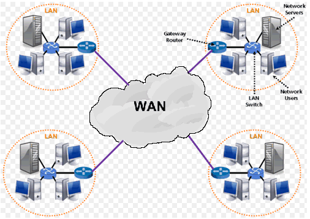 <em>الفكرة الأساسية: عدة شبكات محلية (LAN) منفصلة جغرافياً، متصلة ببعضها عبر سحابة الشبكة الواسعة (WAN) في المنتصف</em>

<h3 dir="rtl" align="right" id="who-connects-branches">1.2 الجهة المسؤولة عن ربط فروع الشبكة الواسعة</h3>

المؤسسة نفسها مبتمدش كابلات بين فروعها المتباعدة جغرافياً — ده غير عملي وغير اقتصادي تماماً. بدل كده، الربط بيتم عن طريق <strong>شركات الاتصالات ومزودي الخدمة (Telco / Service Providers)</strong> اللي عندها البنية التحتية الجاهزة أصلاً (كابلات ألياف، أقمار صناعية، شبكات هاتفية) والمنتشرة على مستوى الدولة أو العالم، وبتأجّر للمؤسسات "قناة" (Circuit) أو خدمة اتصال بين مواقعها المختلفة مقابل اشتراك دوري.

<h3 dir="rtl" align="right" id="who-governs-wan">1.3 المسؤول عن إنشاء الشبكة الواسعة عبر العالم وتعاون الشركات</h3>

الشبكة الواسعة العالمية (وعلى رأسها الإنترنت نفسه) مش مملوكة لجهة واحدة — هي نتاج <strong>تعاون آلاف شركات الاتصالات ومزودي الخدمة</strong> حول العالم، كل واحدة بتدير جزء من البنية التحتية وبتتبادل حركة البيانات مع الشركات التانية عبر نقاط تبادل (Peering Points). عشان الشركات المختلفة دي (بمعدات وتقنيات مختلفة) تقدر تتواصل مع بعض بسلاسة، فيه هيئات معايير عالمية بتحدد البروتوكولات والمواصفات الموحدة اللي الكل لازم يلتزم بيها — زي <strong>ITU-T</strong> (الاتحاد الدولي للاتصالات) و <strong>ANSI</strong> و <strong>IEEE</strong>. من غير المعايير الموحدة دي، مستحيل شبكة شركة اتصالات في بلد تتواصل بسلاسة مع شبكة شركة تانية في بلد مختلف تماماً.

<h3 dir="rtl" align="right" id="lan-man-wan-comparison">1.4 مقارنة بين LAN و MAN و WAN</h3>

قبل ما نتعمّق في تقنيات الـ WAN، مهم نوضّح الفرق بينها وبين النوعين التانيين من الشبكات من حيث المساحة والملكية والأداء:

<table>
<tr><th align="center">وجه المقارنة</th><th align="center">LAN (شبكة محلية)</th><th align="center">MAN (شبكة حضرية)</th><th align="center">WAN (شبكة واسعة)</th></tr>
<tr><td align="center">المساحة الجغرافية</td><td align="center">مبنى واحد أو حرم واحد</td><td align="center">مدينة أو منطقة حضرية واحدة</td><td align="center">دول أو قارات متعددة</td></tr>
<tr><td align="center">الملكية</td><td align="center">مملوكة بالكامل للمؤسسة نفسها</td><td align="center">غالباً مشتركة بين المؤسسة ومزود خدمة محلي</td><td align="center">غالباً مؤجَّرة من شركات اتصالات ومزودي خدمة متعددين</td></tr>
<tr><td align="center">السرعة النمطية</td><td align="center">الأعلى (Gigabit Ethernet وأكثر)</td><td align="center">متوسطة إلى عالية (Metro Ethernet)</td><td align="center">متفاوتة حسب التقنية، وغالباً أقل من LAN</td></tr>
<tr><td align="center">نسبة الخطأ (Error Rate)</td><td align="center">الأقل (وسيط قصير ومُتحكَّم فيه بالكامل)</td><td align="center">منخفضة إلى متوسطة</td><td align="center">الأعلى نسبياً (مسافات أطول ووسطاء متعددون)</td></tr>
<tr><td align="center">أمثلة تقنيات</td><td align="center">Ethernet, Wi-Fi</td><td align="center">Metro Ethernet</td><td align="center">Frame Relay, MPLS, ATM, DMVPN, SD-WAN</td></tr>
</table>

---

<h2 dir="rtl" align="right" id="wan-terminology">2. مصطلحات الشبكة الواسعة الأساسية</h2>

قبل الدخول في تفاصيل التقنيات، لازم تتقن المصطلحات دي لأنها بتتكرر في كل موضوع WAN لاحق:

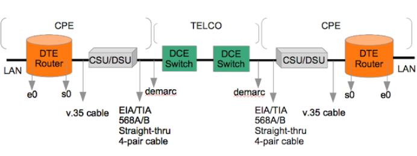 <em>الصورة الشاملة: من جهة العميل (CPE) عبر DTE→CSU/DSU→نقطة التسليم (Demarc)→شبكة شركة الاتصالات (Telco)→حتى الطرف الآخر</em>

<ul dir="rtl">
<li><strong>CPE (Customer Premises Equipment):</strong> أي معدات موجودة فعلياً في موقع العميل (المؤسسة) نفسه — الراوتر، السويتش، أو أي جهاز طرفي بيملكه أو يستأجره العميل.</li>
<li><strong>DTE (Data Terminal Equipment):</strong> الجهاز اللي بيولّد أو بيستقبل البيانات فعلياً — غالباً الراوتر بتاع العميل. هو "مصدر ووجهة" البيانات من منظور الاتصال.</li>
<li><strong>DCE (Data Circuit-terminating Equipment):</strong> الجهاز اللي بيربط الـ DTE بخط الاتصال الفعلي، وبيتحكم في توقيت الإشارة (Clocking) بين الطرفين — غالباً هو الـ CSU/DSU أو المودم.</li>
</ul>

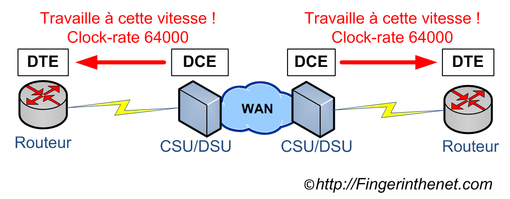 <em>العلاقة بين DTE وDCE: الـ DCE هو اللي بيحدد سرعة التوقيت (Clock Rate) للاتصال، والـ DTE (الراوتر) بيلتزم بالسرعة دي</em>

<ul dir="rtl">
<li><strong>ISP (Internet Service Provider):</strong> مزود خدمة الإنترنت — الشركة اللي بتوفر الاتصال الفعلي بالإنترنت أو بالشبكة الواسعة للعميل.</li>
<li><strong>CSU/DSU (Channel Service Unit / Data Service Unit):</strong> جهاز (أو وحدتين مدمجتين) بيقوم بدور الـ DCE — بيحوّل إشارة البيانات الرقمية من الراوتر لصيغة مناسبة للإرسال عبر خط شركة الاتصالات، والعكس. الـ CSU مسؤولة عن حماية الخط وضبط التوقيت، والـ DSU مسؤولة عن تحويل صيغة البيانات.</li>
<li><strong>Demarc (Demarcation Point / نقطة التحديد):</strong> النقطة الفاصلة اللي بتحدد المسؤولية — كل حاجة قبلها مسؤولية شركة الاتصالات، وكل حاجة بعدها (داخل مبنى العميل) مسؤولية العميل نفسه. غالباً بتكون صندوق صغير عند دخول الكابل للمبنى.</li>
<li><strong>Smart Jack (NIU – Network Interface Unit):</strong> جهاز بيتركّب عادةً عند نقطة الـ Demarc نفسها بالظبط، ووظيفته الأساسية إنه بيسمح لشركة الاتصالات (ISP) بعمل <strong>اختبار حلقي عن بعد (Remote Loopback Testing)</strong> — يعني الشركة تقدر تتأكد من سلامة الخط لحد نقطة التسليم من غير ما تحتاج ترسل فني فعلياً لموقع العميل، وده بيسهّل كتير عملية تشخيص الأعطال وتحديد مكانها بالظبط (هل المشكلة قبل الـ Demarc، يعني مسؤولية الشركة، ولا بعده، يعني مسؤولية العميل).</li>
<li><strong>Local Loop (الحلقة المحلية):</strong> الكابل الفعلي اللي بيربط موقع العميل بأقرب مقسم أو مكتب لشركة الاتصالات (CO).</li>
<li><strong>CO (Central Office / المكتب المركزي):</strong> أقرب منشأة لشركة الاتصالات بتستقبل فيها كل خطوط الـ Local Loop من العملاء في منطقة معينة، وبتوجّه حركة البيانات منها لباقي الشبكة.</li>
</ul>

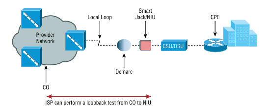 <em>رحلة الإشارة كاملة: من شبكة المزوّد (Provider Network) عبر المكتب المركزي (CO)، الحلقة المحلية (Local Loop)، نقطة التحديد (Demarc)، جهاز Smart Jack، حتى CSU/DSU وصولاً لجهاز العميل (CPE)</em>

<ul dir="rtl">
<li><strong>POP (Point of Presence / نقطة الحضور):</strong> النقطة اللي بيتصل فيها مزود الخدمة (ISP) فعلياً بشبكة العميل أو بشبكة مزود خدمة تاني — نقطة الدخول لشبكة المزود.</li>
<li><strong>Toll Network (الشبكة الرسومية):</strong> الجزء من شبكة الهاتف اللي بيربط بين المكاتب المركزية المختلفة (بين المدن أو المناطق)، وبيُستخدم للمكالمات طويلة المسافة اللي بيتحاسب عليها المستخدم برسوم إضافية (Toll Charges).</li>
<li><strong>PSTN (Public Switched Telephone Network):</strong> الشبكة العامة لتحويل الهاتف — الشبكة التقليدية العالمية اللي بتربط كل خطوط الهاتف الأرضية ببعضها عبر تبديل الدوائر (Circuit Switching).</li>
<li><strong>POTS (Plain Old Telephone Service):</strong> خدمة الهاتف التقليدية الأساسية اللي بتشتغل بالكامل في <strong>النطاق التناظري (Analog)</strong> — مش رقمي. لما احتجنا ننقل بيانات فوقها (قبل ظهور DSL)، كان لازم نستخدم مودم (Modem) يحوّل البيانات الرقمية لإشارة تناظرية تتوافق مع الخط، وده كان بيحدد سرعة قصوى نظرية حوالي <strong>56Kbps</strong> بس — بطيئة جداً بمعايير اليوم، وده اللي دفع لظهور بدائل رقمية أسرع بكتير زي ISDN وDSL الموضّحين في القسم 6.</li>
</ul>

---

<h2 dir="rtl" align="right" id="wan-connection-types">3. أنواع اتصالات الشبكة الواسعة</h2>

اتصالات الـ WAN بتُصنَّف حسب طريقة إنشاء المسار بين الطرفين إلى ثلاثة أنواع رئيسية:

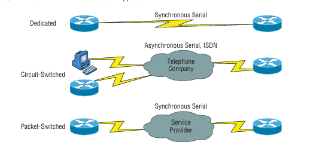 <em>الأنواع الثلاثة جنباً إلى جنب: Dedicated (خط مخصص دائم)، Circuit-Switched (تبديل دوائر عبر شركة الهاتف)، Packet-Switched (تبديل حزم عبر مزود الخدمة)</em>

<h3 dir="rtl" align="right" id="dedicated-connection">3.1 الاتصال المخصص (Dedicated / Leased Line)</h3>

خط اتصال <strong>ثابت ومخصص بالكامل</strong> بين نقطتين، متاح على مدار الساعة بدون الحاجة لإنشاء الاتصال في كل مرة (زي خط تليفون بتكلم عليه طول الوقت من غير ما تقفل السماعة). بيستخدم اتصال تسلسلي متزامن (Synchronous Serial).

<strong>المميزات:</strong> أمان عالي (مفيش مشاركة مع عملاء تانيين)، عرض نطاق ترددي ثابت ومضمون، زمن استجابة منخفض وموثوق. <strong>العيوب:</strong> التكلفة الأعلى بين الأنواع الثلاثة (بتدفع تكلفة الخط كاملة بغض النظر عن الاستخدام الفعلي)، وأقل مرونة في التوسع.

<strong>بروتوكولات طبقة الوصلة (Data Link) المستخدمة:</strong> <strong>HDLC</strong> (البروتوكول الافتراضي الأبسط، خصوصاً على أجهزة سيسكو) أو <strong>PPP</strong> (لو محتاج مميزات إضافية زي المصادقة — الاتنين موضّحين بالتفصيل لاحقاً في القسم 9 وقسم معايير السرعة).

<h3 dir="rtl" align="right" id="circuit-switched">3.2 الاتصال بتبديل الدوائر (Circuit-Switched)</h3>

بيتم إنشاء مسار مخصص مؤقت بين الطرفين <strong>وقت الحاجة فقط</strong> (زي مكالمة تليفون عادية — بتتصل، الخط بيتحجز لك طول المكالمة، وبعد ما تقفل الخط بيتحرر لعميل تاني). بيستخدم اتصال تسلسلي غير متزامن (Asynchronous Serial) غالباً عبر شبكة الهاتف أو ISDN.

<strong>المميزات:</strong> اقتصادي لو الاستخدام متقطع (بتدفع حسب مدة الاتصال الفعلية)، إعداد بسيط نسبياً. <strong>العيوب:</strong> وقت تأخير في إنشاء الاتصال (Call Setup Time) في كل مرة، وسرعات أقل عموماً من الخطوط المخصصة.

<strong>بروتوكولات طبقة الوصلة المستخدمة:</strong> <strong>PPP</strong> غالباً (خصوصاً في اتصالات Dial-up وISDN)، أو <strong>SLIP (Serial Line Internet Protocol)</strong> — بروتوكول أقدم وأبسط بكتير من PPP، بينقل حزم IP بس فوق خط تسلسلي بدون أي دعم للمصادقة أو ضغط البيانات، وده اللي خلى PPP يحل محله في كل الاستخدامات العملية الحديثة تقريباً.

<h3 dir="rtl" align="right" id="packet-switched">3.3 الاتصال بتبديل الحزم (Packet-Switched)</h3>

البيانات بتتقسم لحزم (Packets)، وكل حزمة بتاخد أنسب مسار متاح عبر شبكة المزود المشتركة بين عدة عملاء في نفس الوقت (زي Frame Relay وMPLS الموضّحين لاحقاً). بيستخدم اتصال تسلسلي متزامن عبر شبكة مزود الخدمة.

<strong>المميزات:</strong> استخدام أكفأ للبنية التحتية المشتركة (وبالتالي تكلفة أقل من الخط المخصص)، مرونة عالية في التوسع وإضافة مواقع جديدة بسهولة. <strong>العيوب:</strong> عرض النطاق الترددي مش مضمون بنفس ثبات الخط المخصص (بيتشارك مع عملاء تانيين)، واحتمالية تأخير أعلى في أوقات الازدحام.

<strong>بروتوكولات طبقة الوصلة المستخدمة:</strong> <strong>Frame Relay</strong> و <strong>ATM</strong> و <strong>MPLS</strong> — الثلاثة موضّحين بالتفصيل الكامل في الأقسام اللاحقة (7، 8، 10).

---

<h2 dir="rtl" align="right" id="transmission-mediums">4. وسائط النقل الفيزيائية (Transmission Mediums)</h2>

بغض النظر عن نوع الاتصال أو التقنية المستخدمة، لازم يكون فيه وسيط فيزيائي بينقل الإشارة فعلياً بين الطرفين:

<h3 dir="rtl" align="right" id="copper-medium">4.1 النحاس (Copper)</h3>

أقدم وأرخص وسيط، بيُستخدم في خطوط الهاتف التقليدية وأغلب تقنيات DSL. عيبه الأساسي إن الإشارة بتضعف بسرعة مع المسافة (Attenuation) وبتتأثر بالتداخل الكهرومغناطيسي (EMI)، فبيحتاج مسافات أقصر ومكررات إشارة (Repeaters) أكتر.

<h3 dir="rtl" align="right" id="fiber-medium">4.2 الألياف الضوئية (Fiber)</h3>

بينقل البيانات كإشارات ضوئية بدل كهربائية — أسرع بكثير، مسافات أطول بدون تدهور ملحوظ في الإشارة، ومحصّن تماماً ضد التداخل الكهرومغناطيسي. الأساس اللي عليه مبنية تقنيات SONET (OC-x) الموضّحة لاحقاً، وأغلب العمود الفقري (Backbone) لشبكات الإنترنت العالمية.

<h3 dir="rtl" align="right" id="wireless-medium">4.3 اللاسلكي (Wireless)</h3>

نقل الإشارة عبر موجات راديوية بدون كابلات فيزيائية — مفيد جداً في المناطق صعبة أو مكلفة الوصول لها بالكابلات (مناطق نائية، ربط سريع مؤقت). العيب الأساسي إنه أكتر عرضة للتداخل والتشويش، وعرض النطاق الترددي غالباً أقل من الوسائط السلكية بنفس التكلفة.

<h3 dir="rtl" align="right" id="satellite-medium">4.4 الأقمار الصناعية (Satellite)</h3>

وسيط لاسلكي متخصص بيعتمد على قمر صناعي في مدار حول الأرض لإعادة توجيه الإشارة بين نقطتين بعيدتين جداً عن بعض جغرافياً — الحل شبه الوحيد للمناطق النائية جداً اللي مفيش فيها أي بنية تحتية أرضية (سفن في عرض البحر، مناطق صحراوية، غواصات). العيب الأساسي هو <strong>زمن الوصول العالي (High Latency)</strong> بسبب المسافة الهائلة اللي الإشارة لازم تقطعها لحد القمر الصناعي ورجوع، وده بيخليه غير مثالي للتطبيقات الحساسة للتأخير.

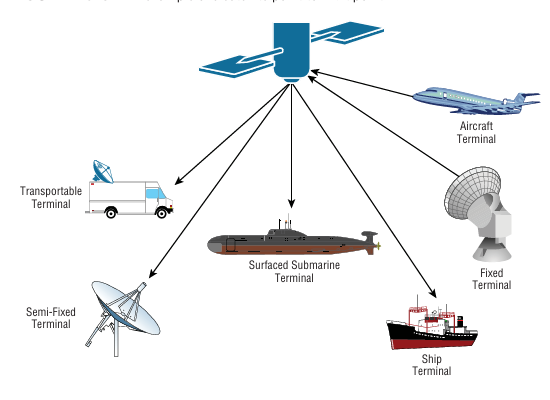 <em>أنواع محطات الاستقبال الأرضية اللي بتتواصل مع القمر الصناعي: محطات ثابتة، شبه ثابتة، متنقلة، وحتى محطات على متن الطائرات والسفن والغواصات</em>

---

<h2 dir="rtl" align="right" id="dmvpn">5. تقنية DMVPN (Dynamic Multipoint VPN)</h2>

الـ VPN التقليدي بيحتاج إعداد نفق (Tunnel) ثابت ومُعدّ يدوياً بين كل موقعين عايزين يتواصلوا مع بعض — لو عندك 10 فروع وعايز كل فرع يتواصل مباشرة مع الباقي، هتحتاج تعدّ عشرات الأنفاق يدوياً (Full Mesh VPN)، وده معقد جداً وصعب الصيانة كل ما زاد عدد الفروع.

الـ DMVPN بيحل المشكلة دي بفكرة مختلفة: بيتم إعداد <strong>نفق دائم واحد بس بين كل فرع (Spoke) والمركز الرئيسي (Hub)</strong>، وبعدين لو فرعين احتاجوا يتواصلوا مباشرة مع بعض، بيتم إنشاء <strong>نفق مؤقت (Temporary Tunnel)</strong> بينهم تلقائياً وديناميكياً وقت الحاجة بس، من غير أي إعداد يدوي مسبق.

<strong>التوليفة التقنية اللي بيقوم عليها DMVPN فعلياً ثلاث تقنيات مجتمعة معاً:</strong>

<ul dir="rtl">
<li><strong>mGRE (Multipoint Generic Routing Encapsulation):</strong> بيسمح لواجهة نفق واحدة على الـ Hub إنها تتواصل مع عدد غير محدود من الـ Spokes، بدل ما تحتاج واجهة GRE منفصلة لكل فرع زي الـ VPN التقليدي.</li>
<li><strong>NHRP (Next Hop Resolution Protocol):</strong> بروتوكول بيسمح للـ Spokes إنها "تسأل" عن بعض، وبيشتغل بمعمارية Client/Server واضحة:
<ul dir="rtl">
<li><strong>NHRP Server:</strong> دور بيقوم بيه راوتر الـ <strong>Hub</strong> — بيحتفظ بجدول (NHRP Cache) فيه تسجيل لكل Spoke: عنوان النفق الداخلي بتاعه (Tunnel IP) مربوط بعنوانه الحقيقي على الإنترنت (Public/NBMA IP).</li>
<li><strong>NHRP Client:</strong> دور بيقوم بيه كل راوتر <strong>Spoke</strong> — أول ما بيشتغل، بيسجّل نفسه تلقائياً عند الـ Hub (NHRP Registration) بعنوانه الحقيقي.</li>
</ul>
لما Spoke A يحتاج يتواصل مباشرة مع Spoke B لأول مرة، بيبعت طلب استفسار (NHRP Resolution Request) لراوتر الـ Hub (بصفته NHRP Server) سائلاً: "إيه العنوان الحقيقي بتاع Spoke B؟". الـ Hub بيرد بالعنوان المسجّل عنده، وعلى أساسه Spoke A يقدر ينشئ النفق المؤقت المباشر (Dynamic Tunnel) مباشرة مع Spoke B من غير ما تفضل الحركة بينهم مضطرة تمر على الـ Hub في كل مرة.</li>
<li><strong>IPsec:</strong> طبقة التشفير اللي بتؤمّن كل الأنفاق (الدائمة والمؤقتة) — من غيرها، mGRE وNHRP بس بيوفروا الاتصال والتوجيه الديناميكي بدون أي حماية أو تشفير للبيانات المارة، فـ IPsec هو اللي بيضمن سرية البيانات فعلياً فوق البنية دي.</li>
</ul>

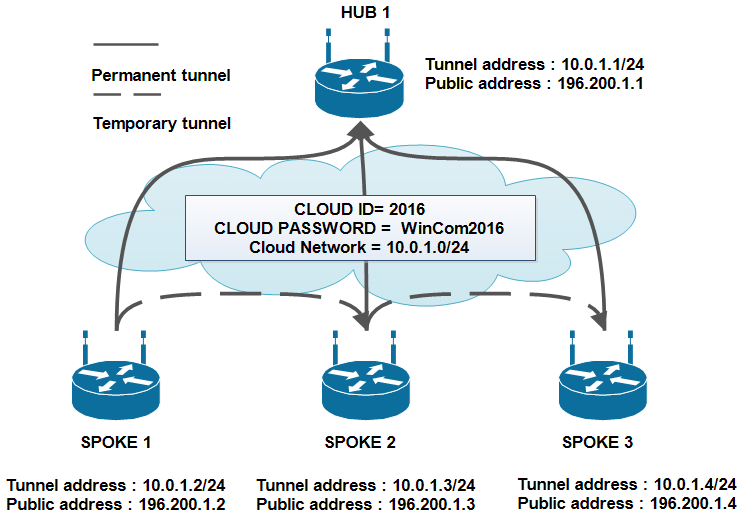 <em>معمارية DMVPN: نفق دائم (خط متصل) بين كل Spoke والـ Hub، ونفق مؤقت (خط متقطع) بيتنشئ تلقائياً مباشرة بين الفروع وقت الحاجة</em>

<strong>الفرق عن الـ VPN العادي:</strong> الـ VPN التقليدي إعداده ثابت وستاتيكي (Static) — أي اتصال جديد بين موقعين لازم إعداد يدوي مسبق. الـ DMVPN ديناميكي بالكامل — الشبكة بتتوسع أو تتغير من غير ما تحتاج تعيد إعداد كل الأنفاق يدوياً في كل مرة.

<strong>الفوائد:</strong> تقليل الحمل على الـ Hub (مش كل حركة البيانات بين الفروع لازم تمر عليه)، سهولة إضافة فروع جديدة، وكفاءة أكبر في استخدام النطاق الترددي (الفروع بتتواصل مباشرة بدل ما تلف على المركز). <strong>العيوب:</strong> تعقيد أكبر في الإعداد الأولي والفهم التقني مقارنة بالـ VPN التقليدي، ويحتاج دعم من أجهزة الراوتر للبروتوكولات الثلاثة مجتمعة.

<h3 dir="rtl" align="right" id="sd-wan">5.1 البديل الحديث: SD-WAN (Software-Defined WAN)</h3>

الـ SD-WAN هو التطور الطبيعي الأحدث لفكرة ربط الفروع، وبيمثّل نقلة نوعية عن كل التقنيات التقليدية اللي اتشرحت في الموضوع ده (Frame Relay, MPLS, DMVPN...). الفكرة الأساسية: بدل ما تعتمد على نوع اتصال واحد فقط (خط MPLS مخصص مثلاً)، الـ SD-WAN بيسمح للفرع إنه يستخدم <strong>أكتر من نوع اتصال إنترنت في نفس الوقت</strong> (خط MPLS + خط Broadband + حتى اتصال 4G/5G) ويوزّع حركة البيانات بذكاء بينهم تلقائياً حسب نوع التطبيق وحالة كل خط لحظياً (Latency, Jitter, Packet Loss).

<strong>أهم ما يميّز SD-WAN:</strong>

<ul dir="rtl">
<li><strong>الإدارة السحابية المركزية (Centralized Cloud Management):</strong> كل الفروع بتتُدار من لوحة تحكم واحدة سحابية، بدل الإعداد اليدوي لكل راوتر فرع بمفرده — وده بيقلل وقت نشر فرع جديد من أيام لدقائق.</li>
<li><strong>التوجيه الذكي حسب التطبيق (Application-Aware Routing):</strong> النظام بيقدر يميّز نوع حركة البيانات (مكالمة فيديو، بريد إلكتروني، نسخ احتياطي) ويوجّهها تلقائياً لأنسب خط متاح لحظياً، بدل مسار ثابت بغض النظر عن حالة الشبكة.</li>
<li><strong>استقلالية عن نوع الاتصال الأساسي (Transport Independence):</strong> بيشتغل فوق أي وسيط نقل متاح (MPLS, Broadband, LTE) في نفس الوقت، وده بيقلل الاعتماد الكامل على خط WAN تقليدي واحد مكلف.</li>
</ul>

<strong>الفصل بين Control Plane و Data Plane:</strong> الفلسفة المعمارية الأساسية اللي قايم عليها SD-WAN هي فصل واضح بين طبقتين مختلفتين تماماً في الدور:

<ul dir="rtl">
<li><strong>Control Plane (طبقة التحكم):</strong> "العقل" المركزي للنظام — بيتمثّل في مكونات سحابية زي <strong>vManage</strong> (لوحة الإدارة والمراقبة المركزية اللي منها بتحدد كل السياسات) و <strong>vSmart</strong> (المتحكم اللي بيوزّع سياسات التوجيه والأمان على كل الفروع، وبيقرر إيه أفضل مسار لكل نوع حركة بيانات). كل القرارات الذكية بتتاخد هنا، في مكان مركزي واحد بعيد عن أجهزة الفروع نفسها.</li>
<li><strong>Data Plane (طبقة نقل البيانات):</strong> التنفيذ الفعلي على الأرض — بيتمثّل في أجهزة الحافة عند كل فرع، زي <strong>vEdge</strong> (جهاز Cisco/Viptela المتخصص) أو <strong>cEdge</strong> (راوتر سيسكو عادي بيشتغل بنفس دور الـ Edge بعد تفعيل برمجية SD-WAN عليه). الأجهزة دي مسؤولة بس عن تنفيذ القرارات اللي جاتلها من الـ Control Plane وتمرير حركة البيانات الفعلية عبرها، من غير ما تحتاج تاخد قرارات توجيه معقدة بنفسها محلياً.</li>
</ul>

<strong>فايدة الفصل ده:</strong> أي تغيير في السياسة (زي إضافة قاعدة أمان جديدة أو تغيير أولوية تطبيق معين) بيتم مرة واحدة على الـ Control Plane المركزي، وبينتشر تلقائياً لكل أجهزة الـ Data Plane في كل الفروع — بدل ما تحتاج تدخل على كل راوتر فرع بمفرده وتعدّل فيه يدوياً، وده جوهر السهولة الإدارية اللي SD-WAN بيوفرها.

<strong>الفرق عن DMVPN:</strong> الـ DMVPN حل ذكي لكنه لسه معتمد على بروتوكولات توجيه وشبكة تقليدية (Routing-Centric)، بينما SD-WAN طبقة تحكم كاملة فوق الشبكة (Policy-Centric) بتدير كل أنواع الاتصال المتاحة معاً بذكاء مركزي، وده اللي بيخليه الاتجاه السائد حالياً في تصميم شبكات المؤسسات متعددة الفروع.

---

<h2 dir="rtl" align="right" id="digital-alternatives">6. البدائل الرقمية لخطوط الهاتف التقليدية</h2>

<h3 dir="rtl" align="right" id="isdn">6.1 الشبكة الرقمية للخدمات المتكاملة (ISDN)</h3>

ISDN هي أول بديل رقمي حقيقي لخط الهاتف التناظري التقليدي (POTS) — بتنقل الصوت والبيانات كإشارة رقمية بالكامل بدل التناظرية، وده بيدّي جودة أعلى وسرعة أكبر وإمكانية نقل البيانات والصوت في نفس الوقت على نفس الخط.

<strong>أنواعه:</strong>

<ul dir="rtl">
<li><strong>BRI (Basic Rate Interface):</strong> يوفر قناتين للبيانات (B Channels) بسرعة 64Kbps لكل واحدة، وقناة تحكم واحدة (D Channel) بسرعة 16Kbps — يعني سرعة إجمالية حوالي <strong>144Kbps</strong> (2×64 + 16). مناسب للاستخدام المنزلي والمكاتب الصغيرة.</li>
<li><strong>PRI (Primary Rate Interface):</strong> يوفر عدد أكبر بكثير من القنوات — <strong>23 قناة B + قناة D واحدة (إجمالي 1.544Mbps، بنفس سرعة T1)</strong> في أمريكا الشمالية، أو <strong>30 قناة B + قناة D (إجمالي 2.048Mbps، بنفس سرعة E1)</strong> في أوروبا. مناسب للمؤسسات الكبيرة اللي محتاجة سعة أكبر — وده نفس الـ PRI المذكور في القسم 6.5 كأحد أنواع خدمة الـ WAN.</li>
</ul>

<strong>التطور:</strong> ISDN كان تقنية ثورية وقت ظهورها لكنها اتجاوزتها تقنيات أحدث بكتير من ناحية السرعة (زي DSL والفايبر)، فبقت محدودة الاستخدام حالياً وبتُعتبر تقنية "جسر" بين العصر التناظري والعصر الرقمي الكامل.

<h3 dir="rtl" align="right" id="dsl">6.2 خط المشترك الرقمي (DSL – Digital Subscriber Line)</h3>

تقنية بتستخدم نفس أسلاك الهاتف النحاسية الموجودة أصلاً (Copper — راجع القسم 4.1)، لكن بتستغل نطاق ترددي أعلى من اللي بيستخدمه الصوت العادي، وده بيسمح بنقل بيانات بسرعة أعلى بكتير من المودم التقليدي <strong>مع إبقاء خط الهاتف شغال في نفس الوقت</strong> بدون تعارض.

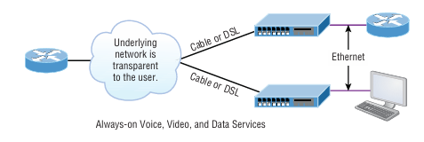 <em>من منظور المستخدم، الشبكة الأساسية (Cable أو DSL) شفافة تماماً — الخدمة بتبان وكأنها اتصال دائم (Always-on) لنقل الصوت والفيديو والبيانات معاً عبر Ethernet</em>

<h3 dir="rtl" align="right" id="cable-broadband">6.3 النطاق العريض عبر الكابل (Cable Broadband)</h3>

بديل تاني لـ DSL، بيستخدم نفس البنية التحتية لكابل التلفزيون (Coaxial Cable) بدل أسلاك الهاتف، غالباً بمعمارية <strong>HFC (Hybrid Fiber-Coaxial)</strong> — كابل ألياف ضوئية من مركز البث (Headend) لحد نقطة توزيع قريبة من المشتركين (Node)، وبعدين كابل نحاسي (Coaxial) من الـ Node لحد المنزل نفسه. المعيار التقني اللي بيحكم العملية دي بيُعرف بـ <strong>DOCSIS</strong>.

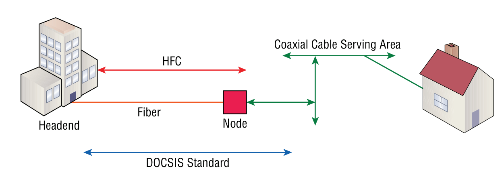 <em>معمارية HFC: ألياف ضوئية من الـ Headend لحد الـ Node، ثم كابل نحاسي (Coaxial) يغطي منطقة خدمة معينة وصولاً للمنازل، وفق معيار DOCSIS</em>

<h3 dir="rtl" align="right" id="dial-up">6.4 الاتصال الهاتفي (Dial-up)</h3>

أقدم طريقة للاتصال بالإنترنت أو بشبكة بعيدة — المودم بيحوّل البيانات الرقمية لإشارة تناظرية عشان تنتقل عبر خط الهاتف العادي (POTS)، والعكس في الطرف الآخر. بطيء جداً بمعايير اليوم (أقصى سرعة نظرية حوالي 56Kbps)، وبيشغل خط الهاتف بالكامل طول فترة الاتصال (منعاً لاستخدامه للمكالمات في نفس الوقت). اتجاوزته كل التقنيات الحديثة تماماً، لكن لسه بيُذكر كمرجع تاريخي وكخيار احتياطي نادر في مناطق معزولة جداً.

<h3 dir="rtl" align="right" id="pri">6.5 الواجهة الأساسية للمعدل (PRI – Primary Rate Interface)</h3>

تذكير سريع (اتشرح كنوع من ISDN في القسم 6.1): خدمة ISDN بسعة أكبر بكتير من الـ BRI، بتوفر عدد كبير من القنوات الرقمية (23 أو 30 قناة B حسب المعيار المحلي) على خط واحد — مناسبة للمؤسسات اللي محتاجة تشغّل عدد كبير من خطوط الهاتف أو الاتصالات الرقمية في نفس الوقت من نفس نقطة الاتصال.

---

<h2 dir="rtl" align="right" id="atm">7. تقنية الوضع غير المتزامن للنقل (ATM – Asynchronous Transfer Mode)</h2>

تقنية نقل بيانات بتعتمد على تقسيم البيانات لوحدات <strong>ثابتة الحجم تماماً</strong> بتُسمى Cells (بحجم 53 بايت لكل خلية: 48 بايت بيانات + 5 بايت رأس/Header) — على عكس معظم التقنيات التانية (زي Frame Relay وEthernet) اللي بتستخدم إطارات (Frames) متغيرة الحجم.

<strong>ليه حجم ثابت؟</strong> الحجم الثابت للخلايا بيخلي عملية معالجة وتوجيه البيانات عبر الأجهزة الوسيطة أسرع وأكثر قابلية للتنبؤ (Predictable)، وده كان مهم جداً وقت ظهور ATM لضمان جودة خدمة (QoS) عالية ومستقرة، خصوصاً لنقل الصوت والفيديو المباشر اللي حساس جداً للتأخير غير المنتظم.

<strong>الاستخدام حالياً:</strong> ATM كانت تقنية مسيطرة في شبكات مزودي الخدمة والعمود الفقري في التسعينات ومطلع الألفية، لكن معظمها استُبدلت حالياً بتقنيات أحدث وأبسط زي MPLS (الموضّحة لاحقاً في القسم 10)، رغم إن مبادئ الـ QoS اللي أسستها ATM لسه مؤثرة في تصميم الشبكات الحديثة.

---

<h2 dir="rtl" align="right" id="frame-relay">8. بروتوكول ترحيل أُطر المعلومات (Frame Relay)</h2>

<h3 dir="rtl" align="right" id="frame-relay-definition">8.1 التعريف</h3>

Frame Relay هي تقنية اتصال بتبديل الحزم (Packet-Switched — راجع القسم 3.3) بتربط بين مواقع متعددة عبر شبكة مزود خدمة مشتركة، باستخدام إطارات (Frames) متغيرة الحجم. بتوفر بديل أرخص وأبسط بكتير من الخطوط المخصصة (Leased Lines) لو المؤسسة عندها فروع متعددة محتاجة تتواصل مع بعض.

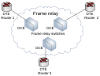 <em>البنية العامة: أجهزة DTE (الراوترات) في أطراف الشبكة، متصلة عبر سويتشات Frame Relay اللي بتقوم بدور الـ DCE داخل شبكة مزود الخدمة</em>

<h3 dir="rtl" align="right" id="frame-relay-topologies">8.2 أشكال الربط في Frame Relay</h3>

فيه ثلاثة أشكال أساسية لتصميم شبكة Frame Relay بين الفروع:

<ul dir="rtl">
<li><strong>Hub-and-Spoke (نجمي):</strong> كل الفروع (Spokes) بتتصل بموقع مركزي واحد (Hub) بس، ومفيش اتصال مباشر بين الفروع مع بعضها — أي حركة بين فرعين لازم تمر على المركز أولاً. <strong>المميزات:</strong> أرخص تصميم (أقل عدد من الدوائر الافتراضية المطلوبة)، إدارة مركزية أسهل. <strong>العيوب:</strong> المركز نقطة فشل واحدة (Single Point of Failure)، وزمن استجابة أعلى للتواصل بين الفروع لأنه لازم يمر بمسارين.</li>
<li><strong>Full Mesh (شبكي كامل):</strong> كل فرع متصل مباشرة بكل الفروع التانية بدائرة افتراضية منفصلة. <strong>المميزات:</strong> أقصر مسار ممكن بين أي فرعين، لا يوجد نقطة فشل مركزية واحدة. <strong>العيوب:</strong> عدد الدوائر الافتراضية المطلوبة بيزيد بسرعة كبيرة جداً مع زيادة عدد الفروع (بمعادلة n(n-1)/2)، وتكلفة أعلى بكثير، ومشكلة تكرار حركة البث (Broadcast Replication) الموضّحة تحت.</li>
<li><strong>Partial Mesh (شبكي جزئي):</strong> حل وسط — بعض الفروع (المهمة أو كثيرة التواصل) متصلة ببعضها مباشرة، والباقي بيمر عبر مسار غير مباشر. توازن بين التكلفة والأداء.</li>
</ul>

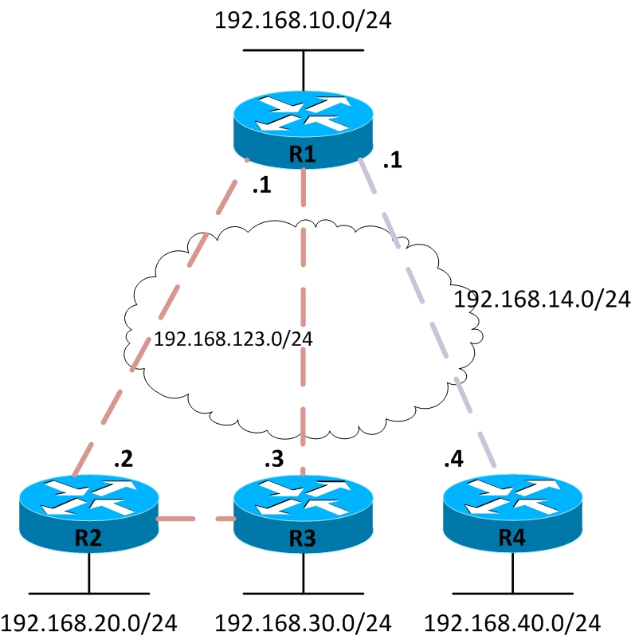 <em>مثال Hub-and-Spoke: كل الراوترات (R2, R3, R4) متصلة بالراوتر المركزي R1 عبر شبكة Frame Relay مشتركة (192.168.123.0/24)</em>

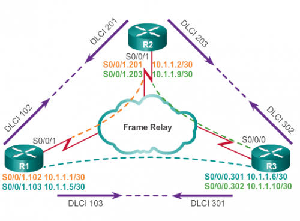 <em>مثال Full Mesh: كل راوتر متصل مباشرة بكل الراوترات التانية بواجهات فرعية (Sub-interfaces) ومعرّفات DLCI منفصلة لكل اتصال</em>

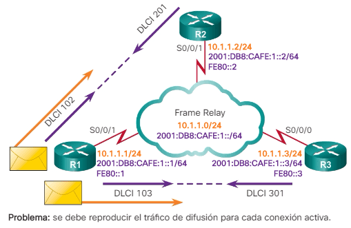 <em>مشكلة شائعة في Full Mesh: حركة البث (Broadcast) لازم تتكرر إرسالها بشكل منفصل عبر كل دائرة افتراضية نشطة على حدة، وده بيستهلك عرض نطاق ترددي إضافي مع زيادة عدد الفروع</em>

<h3 dir="rtl" align="right" id="frame-relay-signaling">8.3 إشارات بروتوكول ترحيل أُطر المعلومات</h3>

كل اتصال Frame Relay بيمر عبر <strong>دائرة افتراضية (Virtual Circuit)</strong> — إما:

<ul dir="rtl">
<li><strong>PVC (Permanent Virtual Circuit):</strong> مسار افتراضي دائم ومُعدّ مسبقاً، متاح طول الوقت — الأشيع استخداماً في اتصالات الفروع الثابتة.</li>
<li><strong>SVC (Switched Virtual Circuit):</strong> مسار افتراضي بيتنشئ ديناميكياً وقت الحاجة بس، زي مكالمة هاتفية، وبيتقفل بعد انتهاء الاتصال.</li>
</ul>

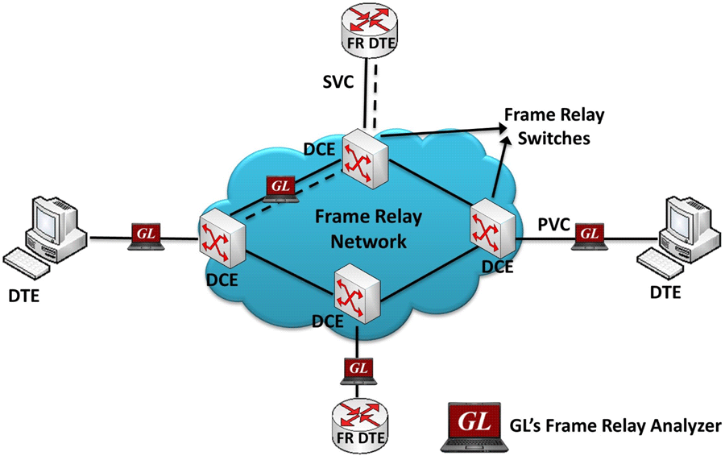 <em>الفرق بين PVC (مسار دائم بين طرفين ثابتين) و SVC (مسار مؤقت بيتنشئ ديناميكياً لجهاز DTE آخر عند الحاجة)</em>

كل دائرة افتراضية بتتحدد بمعرّف فريد اسمه <strong>DLCI (Data Link Connection Identifier)</strong>، وهو اللي بيحدد لأي فرع تروح الحزمة عبر شبكة Frame Relay المشتركة. هيكل الإطار نفسه بيحتوي على حقول إشارة إضافية مهمة جداً للتحكم في الازدحام:

<ul dir="rtl">
<li><strong>FECN (Forward Explicit Congestion Notification):</strong> بت بيتفعّل في الإطار لإخطار الجهاز <strong>المستقبِل</strong> إن فيه ازدحام حصل في اتجاه إرسال الإطار ده.</li>
<li><strong>BECN (Backward Explicit Congestion Notification):</strong> بت بيتفعّل لإخطار الجهاز <strong>المُرسِل</strong> إن فيه ازدحام في الاتجاه المعاكس، عشان يبطّئ معدل الإرسال.</li>
<li><strong>DE (Discard Eligibility):</strong> بت بيحدد إن الإطار ده "قابل للإسقاط" أولاً لو حصل ازدحام شديد في الشبكة واضطرت الأجهزة تتخلص من بعض الإطارات — بيُستخدم للإطارات الأقل أهمية.</li>
</ul>

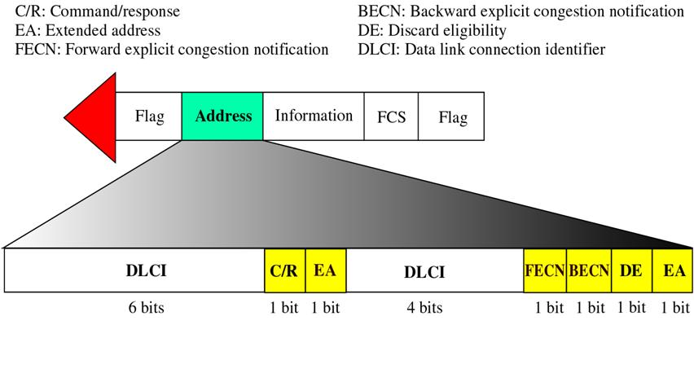 <em>هيكل إطار Frame Relay بالتفصيل: حقل DLCI (10 بت مقسّمة)، ثم C/R وEA، وفي نهاية الإطار حقول FECN وBECN وDE وEA للتحكم في الازدحام</em>

<strong>LMI (Local Management Interface):</strong> بروتوكول إشارة إضافي ومهم جداً بيشتغل بين جهاز العميل (DTE/الراوتر) وسويتش مزود الخدمة (DCE) — دوره الأساسي إنه بيبعت رسائل <strong>نبضات حياة دورية (Keepalive)</strong> بين الطرفين للتحقق المستمر من حالة كل دائرة افتراضية (PVC) متاحة على الخط: هل لسه شغالة (Active)، معطّلة مؤقتاً (Inactive)، أم غير موجودة أصلاً (Deleted). لو الراوتر مستقبلش رسائل LMI لفترة معينة، بيفترض إن الخط أو الدائرة الافتراضية واقعة، وبيبلّغ عن المشكلة فوراً بدل ما يفضل يرسل بيانات لمسار مش شغال أصلاً.

<h3 dir="rtl" align="right" id="frame-relay-data-rate">8.4 معدل تدفق البيانات في Frame Relay (Data Rate)</h3>

مزود الخدمة بيضمن للعميل حد أدنى من عرض النطاق الترددي مضمون طول الوقت، بيُعرف بـ <strong>CIR (Committed Information Rate)</strong> — ده المعدل اللي العميل متأكد إنه هيقدر يرسل بيه بيانات دايماً بدون ضمان تخطيه. ممكن العميل يرسل بمعدل أعلى من الـ CIR مؤقتاً (Burst) وقت إن الشبكة مش مزدحمة، لكن مفيش ضمان رسمي للسرعة الزيادة دي، وأول ما يحصل ازدحام، الإطارات الزيادة عن الـ CIR (خصوصاً المعلَّمة بـ DE) هي أول اللي بتتسقط.

---

<h2 dir="rtl" align="right" id="ppp">9. بروتوكول نقطة إلى نقطة (PPP – Point-to-Point Protocol)</h2>

PPP هو بروتوكول طبقة الوصلة (Data Link Layer) بيُستخدم لإنشاء اتصال مباشر بين نقطتين (Point-to-Point) عبر خط تسلسلي — سواء كان خط مخصص، أو اتصال Dial-up، أو حتى عبر ISDN. بيتكوّن من مكونات فرعية بتقوم كل واحدة بدور محدد أثناء إنشاء الاتصال:

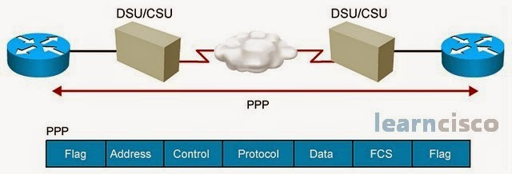 <em>اتصال PPP بين راوترين عبر CSU/DSU وشبكة مزود الخدمة، مع هيكل الإطار: Flag, Address, Control, Protocol, Data, FCS, Flag</em>

<h3 dir="rtl" align="right" id="ppp-authentication">9.1 بروتوكولات المصادقة: PAP و CHAP</h3>

<ul dir="rtl">
<li><strong>PAP (Password Authentication Protocol):</strong> أبسط طريقة مصادقة في PPP — الطرف اللي بيحاول يتصل بيبعت اسم المستخدم وكلمة المرور <strong>كنص واضح غير مشفّر (Cleartext)</strong> مرة واحدة بس وقت إنشاء الاتصال. سهل الإعداد لكنه ضعيف جداً من الناحية الأمنية لأن أي حد بيراقب الخط يقدر يشوف بيانات الدخول بسهولة.</li>
<li><strong>CHAP (Challenge Handshake Authentication Protocol):</strong> أكثر أماناً بكثير — بدل إرسال كلمة المرور مباشرة، الطرف المستقبِل بيبعت "تحدي" (Challenge) عشوائي للطرف التاني، وده بيرد بقيمة مشفّرة (Hash) ناتجة من دمج كلمة المرور مع التحدي ده. العملية دي بتتكرر بشكل دوري طول مدة الاتصال (مش مرة واحدة بس زي PAP)، وبما إن كلمة المرور نفسها مبتتبعتش أبداً عبر الخط، ده بيخليه محصّن ضد هجمات التنصت وإعادة الإرسال (Replay Attacks).</li>
</ul>

<h3 dir="rtl" align="right" id="ppp-ncp">9.2 دور NCP (Network Control Protocol)</h3>

بعد ما مرحلة المصادقة (PAP/CHAP) بتخلص بنجاح، دور الـ <strong>NCP</strong> بييجي — وهو مسؤول عن إعداد وضبط <strong>بروتوكول طبقة الشبكة</strong> اللي هيشتغل فوق اتصال PPP (زي IPCP لبروتوكول IPv4، أو IPv6CP لبروتوكول IPv6). بما إن PPP بيدعم أكتر من بروتوكول طبقة شبكة في نفس الوقت على نفس الخط (Multiplexing)، كل بروتوكول شبكة محتاج نسخة NCP خاصة بيه عشان يتفاوض على الإعدادات المطلوبة (زي عناوين IP) قبل ما تبدأ البيانات الفعلية تتحرك.

<strong>ليه PPP مهم:</strong> بيدّي مرونة أكبر من HDLC (اللي هو البروتوكول الافتراضي الأبسط في أجهزة سيسكو، والموضّح لاحقاً في القسم 11) لأنه بيدعم أكتر من بروتوكول طبقة شبكة في نفس الوقت بفضل NCP، ودعم مصادقة مدمج (PAP/CHAP)، وده اللي بيخليه الخيار المفضّل في اتصالات كتير من الـ WAN اللي محتاجة مستوى أمان أو تحكم أعلى من مجرد نقل بيانات بسيط.

---

<h2 dir="rtl" align="right" id="wan-components-mpls">10. مكونات شبكة الـ WAN وتقنية MPLS</h2>

<h3 dir="rtl" align="right" id="wan-components">10.1 مكونات شبكة الـ WAN</h3>

أي شبكة WAN بتتكون بشكل أساسي من: أجهزة العميل الطرفية (CPE/DTE)، جهاز تحويل الإشارة (CSU/DSU أو Modem بدور DCE)، الوسيط الفيزيائي للنقل (راجع القسم 4)، وشبكة مزود الخدمة الداخلية (اللي بتحتوي على سويتشات وراوترات متخصصة زي أجهزة الـ MPLS الموضّحة تحت) اللي بتوجّه حركة البيانات بين كل عملاء المزود المختلفين بكفاءة.

<h3 dir="rtl" align="right" id="mpls-tech">10.2 تقنية MPLS (Multiprotocol Label Switching)</h3>

MPLS هي التقنية اللي حلّت محل أغلب استخدامات ATM وFrame Relay في شبكات مزودي الخدمة الحديثة. الفكرة الأساسية: بدل ما كل راوتر في المسار يفحص عنوان الـ IP الكامل ويحسب أفضل مسار من جدول التوجيه في كل مرة (عملية بطيئة نسبياً)، MPLS بيلصق <strong>وسم صغير (Label)</strong> على كل حزمة أول ما تدخل شبكة المزود، والراوترات الوسيطة بس بتحتاج تقرأ الوسم ده (رقم بسيط) وتوجّه الحزمة بسرعة فائقة بناءً عليه، من غير ما تحتاج تفتح وتحلل عنوان الـ IP الكامل في كل قفزة.

<h3 dir="rtl" align="right" id="mpls-devices">10.3 أجهزة MPLS</h3>

<ul dir="rtl">
<li><strong>CE (Customer Edge):</strong> راوتر العميل نفسه، في حافة شبكة العميل، متصل مباشرة بشبكة المزود.</li>
<li><strong>PE (Provider Edge):</strong> راوتر في حافة شبكة المزود، وهو أول جهاز بيستقبل حركة العميل ويضيف الوسم (Label) عليها، وآخر جهاز بيشيله قبل ما توصل للعميل التاني.</li>
<li><strong>P (Provider):</strong> راوتر داخل شبكة المزود نفسها (Core)، مش بيتواصل مباشرة مع أي عميل — دوره بس توجيه الحزم الموسومة بأقصى سرعة ممكنة بناءً على الوسم فقط.</li>
</ul>

<h3 dir="rtl" align="right" id="mpls-label">10.4 عملية الـ Label في MPLS</h3>

الوسم (Label) بيتحط في رأس إضافي (MPLS Header) بحجم 32 بت (4 بايت)، بيتوضع بين رأس طبقة الوصلة (Layer 2 Header) ورأس حزمة الـ IP الأصلية:

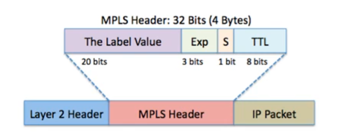 <em>هيكل رأس MPLS: قيمة الوسم (Label Value - 20 بت)، حقل Exp للأولوية (3 بت)، بت S لتحديد آخر وسم في المكدّس (Bottom of Stack)، وTTL (8 بت) لمنع الحلقات اللانهائية</em>

<strong>آلية العمل:</strong> راوتر PE الداخل بيفحص عنوان الحزمة مرة واحدة بس ويحدد المسار المناسب لها (Label Switched Path)، وبيلصق الوسم المناسب. كل راوتر P بعد كده بيقرأ الوسم بس (مش عنوان IP)، بيستبدله بوسم جديد حسب جدول تحويل الوسوم بتاعه (Label Swapping)، ويمرر الحزمة للراوتر التالي — لحد ما توصل لراوتر PE الخارج، اللي بيشيل الوسم تماماً قبل تسليم الحزمة الأصلية للعميل التاني.

بالتحديد، العملية دي بتتكون من ثلاث عمليات أساسية على الوسم، كل واحدة بتحصل في نوع مختلف من الراوترات:

<ul dir="rtl">
<li><strong>Push (الإضافة):</strong> بتحصل عند <strong>أول راوتر PE</strong> اللي الحزمة بتدخل منه شبكة المزود. الراوتر بيفحص عنوان الـ IP الأصلي مرة واحدة بس، بيحدد المسار المناسب (Label Switched Path)، وبيضيف ("يدفع") الوسم الجديد فوق الحزمة الأصلية.</li>
<li><strong>Swap (الاستبدال):</strong> بتحصل عند <strong>كل راوتر P</strong> داخل نواة شبكة المزود. الراوتر بيستقبل الحزمة بوسم معين، بيدوّر عليه في جدول تحويل الوسوم بتاعه (Label Forwarding Table)، وبيستبدله بوسم جديد مناسب للقفزة التالية، من غير ما يفتح أو يفحص عنوان الـ IP الأصلي خالص — وده اللي بيدّي MPLS سرعته المميزة.</li>
<li><strong>Pop (الإزالة):</strong> بتحصل عند <strong>آخر راوتر PE</strong> (أو غالباً عند الراوتر اللي قبله مباشرة، المعروف بـ <strong>Penultimate Hop Popping - PHP</strong>، كتحسين أداء شائع) — الوسم بيتشال بالكامل ("يُسحب") من الحزمة، وبترجع الحزمة لشكلها الأصلي (IP Packet عادية) قبل ما تتسلم للعميل النهائي. فايدة الـ PHP إنها بتوفر خطوة معالجة كاملة على راوتر PE الأخير، لأنه بيستقبل حزمة IP جاهزة بدل ما يضطر هو نفسه يشيل الوسم ويفحص الحزمة بعده.</li>
</ul>

<h3 dir="rtl" align="right" id="l2-vs-l3-wan">10.5 الفرق بين الشبكة الواسعة على الطبقة الثانية والثالثة</h3>

<strong>WAN على الطبقة الثانية (Layer 2):</strong> زي Frame Relay وATM التقليدي — المزود بيوصّل العميل بدائرة افتراضية (Virtual Circuit) بس، والعميل هو المسؤول الكامل عن التوجيه (Routing) بين فروعه بنفسه فوق الدائرة دي.

<strong>WAN على الطبقة الثالثة (Layer 3):</strong> زي معظم خدمات MPLS الحديثة (MPLS VPN تحديداً) — مزود الخدمة نفسه بيشارك في عملية التوجيه (Routing) بين فروع العميل المختلفة، مش بس بينقل البيانات. ده بيقلل التعقيد على العميل (مش محتاج يدير بروتوكولات توجيه معقدة بين كل فروعه بنفسه) لكن بيدّي المزود دور أكبر وتحكم أكتر في شبكة العميل.

---

<h2 dir="rtl" align="right" id="wan-speed-standards">11. معايير سرعة الشبكة الواسعة</h2>

<h3 dir="rtl" align="right" id="t-carrier">11.1 خطوط T-Carrier / E-Carrier (T1/T3, E1/E3)</h3>

معيار T-Carrier هو نظام أمريكي/شمال أمريكي لتقسيم خط رقمي واحد لعدة قنوات، وE-Carrier هو المعيار الأوروبي المكافئ له بسرعات مختلفة قليلاً. كل خط T1 بيتكون فعلياً من 24 قناة صوت/بيانات رقمية (بسرعة 64Kbps لكل قناة)، والخطوط الأعلى (T3) بتجمّع عدد كبير من خطوط T1 مع بعض.

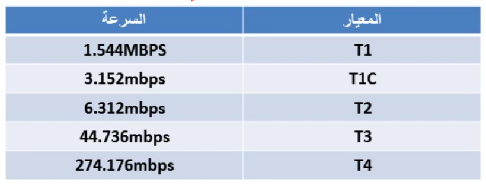 <em>سرعات معيار T-Carrier: من T1 (1.544Mbps) وصولاً لـ T4 (274.176Mbps)</em>

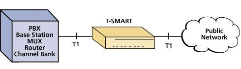 <em>مثال عملي لاتصال T1: من معدات العميل (PBX/Router/Channel Bank) عبر جهاز CSU/DSU متخصص وصولاً للشبكة العامة لمزود الخدمة</em>

<strong>ملاحظة تقنية:</strong> خطوط T1/T3 و E1/E3 غالباً بتعمل بترميز إطار افتراضي مبني على بروتوكول <strong>HDLC (High-Level Data Link Control)</strong> كطبقة وصلة أساسية — وهو بروتوكول بسيط سابق لـ PPP (الموضّح في القسم 9)، بيستخدم هيكل إطار كلاسيكي (Flag, Address, Control, Information, FCS, Flag) وبيحدد ثلاثة أنواع أطر أساسية (I, S, U frames) للتحكم في تدفق البيانات والأخطاء.

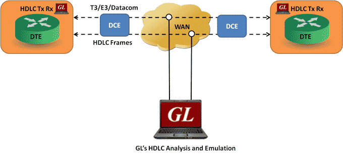 <em>إطارات HDLC وهي بتنتقل عبر خطوط T3/E3 بين جهازي DTE/DCE من الطرفين، عبر شبكة الـ WAN في المنتصف</em>

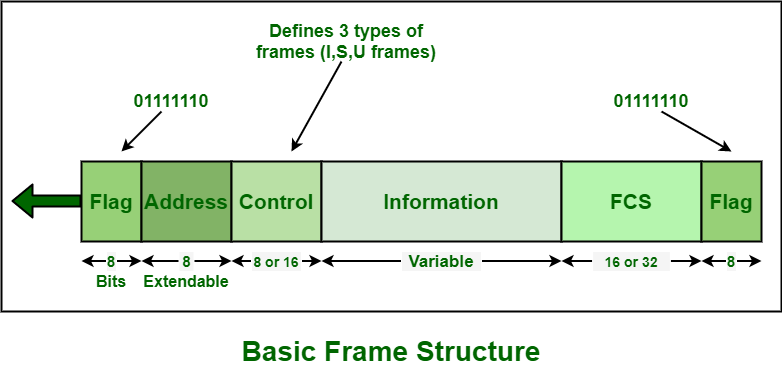 <em>هيكل إطار HDLC الأساسي بالتفصيل، موضّحاً حقل التحكم اللي بيحدد نوع الإطار (I/S/U)</em>

<strong>نسخة سيسكو الخاصة (Cisco Proprietary HDLC):</strong> نقطة مهمة جداً لازم تتنبّه ليها — بروتوكول <strong>HDLC القياسي (Standard ISO)</strong> الأصلي مصمم أساساً لنقل بروتوكول طبقة شبكة واحد بس فوق الخط، ومبيدعمش نقل أكتر من بروتوكول في نفس الوقت (Multi-protocol). سيسكو عدّلت النسخة بتاعتها من HDLC وضافت <strong>حقل Type</strong> غير موجود في المعيار الأصلي جوه الإطار، وده اللي بيسمح للراوتر يميّز أي بروتوكول طبقة شبكة (IP, IPX...) بتاع كل حزمة. النتيجة: HDLC بتاع سيسكو (اللي هو الإعداد الافتراضي على واجهات الـ Serial في أجهزة سيسكو) <strong>غير متوافق</strong> مع أجهزة HDLC قياسية من شركات تانية — لو محتاج توصيل بين جهاز سيسكو وجهاز من شركة مختلفة على نفس الخط، الحل الأضمن هو استخدام PPP (الموضّح في القسم 9) بدل HDLC، لأنه معيار مفتوح ومتوافق بين كل الشركات المصنّعة.

<h3 dir="rtl" align="right" id="sonet-oc">11.2 شبكات الألياف الضوئية المتزامنة (SONET) ومعايير OC</h3>

<strong>SONET (Synchronous Optical Network)</strong> هو المعيار المستخدم لنقل البيانات بسرعات فائقة عبر كابلات الألياف الضوئية، وبيُقاس بمستويات <strong>OC (Optical Carrier)</strong> — كل ما زاد الرقم بعد OC، زادت السرعة.

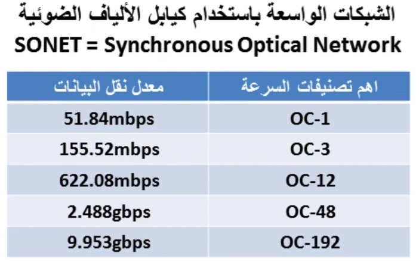 <em>سرعات معيار SONET: من OC-1 (51.84Mbps) وصولاً لـ OC-192 (9.953Gbps) — أهم التصنيفات المستخدمة في العمود الفقري لشبكات مزودي الخدمة</em>

---

<h2 dir="rtl" align="right" id="metro-ethernet">12. تقنية Metro Ethernet</h2>

Metro Ethernet هي تقنية بتوسّع استخدام بروتوكول Ethernet المألوف (نفس البروتوكول المستخدم داخل أي شبكة LAN عادية) خارج حدود المبنى الواحد، ليغطي منطقة حضرية كاملة (Metropolitan Area) وبيربط بين فروع الشركة المختلفة داخل نفس المدينة أو المنطقة.

<strong>الميزة الأساسية:</strong> بساطة الإدارة والتكلفة المنخفضة نسبياً، لأن المؤسسة بتتعامل مع نفس بروتوكول Ethernet المألوف ليها في شبكتها الداخلية، بدون الحاجة لتعلّم أو إدارة بروتوكولات WAN تقليدية معقدة زي Frame Relay أو ATM. بيوفر أيضاً سرعات أعلى بكثير مقارنة بمعظم تقنيات WAN التقليدية بتكلفة تنافسية، وده اللي خلاه بديل شائع جداً حالياً لربط الفروع داخل نفس المدينة.

---

<h2 dir="rtl" align="right" id="sip-trunk">13. بروتوكول SIP Trunk</h2>

SIP Trunk هي خدمة بتسمح للمؤسسة بربط نظام الهاتف الداخلي بتاعها (PBX) مباشرة بشبكة الهاتف العامة (PSTN) <strong>عبر الإنترنت أو شبكة IP</strong> بدل الخطوط التقليدية المنفصلة (زي PRI الموضّحة فوق). الفكرة الأساسية إنها بتدمج الصوت (VoIP) والبيانات على نفس البنية التحتية الواحدة (Converged Network) بدل ما يكون لكل نوع بنيته المنفصلة.

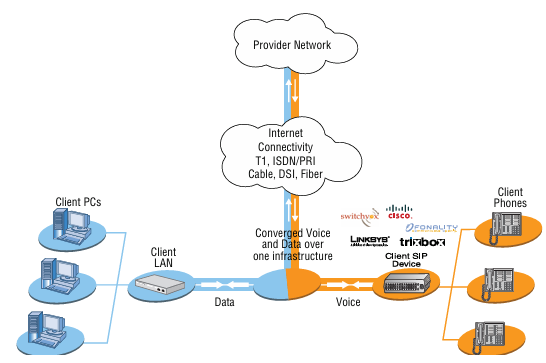 <em>معمارية SIP Trunk: الصوت (من هواتف SIP) والبيانات (من أجهزة الشبكة الداخلية) بيتحدوا فوق بنية تحتية واحدة نحو شبكة مزود الخدمة، سواء عبر T1، ISDN/PRI، Cable، DSL، أو الألياف</em>

<strong>الفائدة الأساسية:</strong> توفير التكلفة (خط اتصال واحد مشترك بدل خطوط منفصلة للصوت والبيانات)، ومرونة أكبر في التوسع (إضافة خطوط هاتف جديدة أسهل بكتير من تمديد خطوط PRI فيزيائية جديدة).

---

<h2 dir="rtl" align="right" id="isp-services">14. مزود الخدمة (ISP) وخدماته</h2>

مزود الخدمة (ISP) مش بس بيبيع "اتصال بالإنترنت" — هو بيقدم مجموعة خدمات متكاملة لنوعين مختلفين من العملاء، ولكل نوع احتياجات ومستوى خدمة مختلف:

<ul dir="rtl">
<li><strong>عملاء أفراد (Residential Customers):</strong> غالباً بياخدوا خدمة عبر DSL أو Cable Broadband، بسرعات ومتطلبات أقل، وبدون ضمانات مستوى خدمة رسمية (SLA) في العادة.</li>
<li><strong>عملاء مؤسسات (Business / Enterprise Customers):</strong> محتاجين سرعات أعلى وموثوقية أكبر، وغالباً بيتعاقدوا على خطوط مخصصة (Dedicated) أو خدمات MPLS/Frame Relay، مع اتفاقية مستوى خدمة رسمية (SLA — راجع الموضوع 19) بتضمن نسبة توافرية معينة ووقت استجابة محدد عند حدوث أي عطل.</li>
</ul>

<h3 dir="rtl" align="right" id="internet-service">14.1 خدمة الإنترنت</h3>

الخدمة الأساسية والأشهر — توفير اتصال بالإنترنت العالمي بسرعات وأنواع مختلفة (DSL, Cable, Fiber, Dedicated Line) حسب احتياج العميل وميزانيته.

<h3 dir="rtl" align="right" id="branch-connectivity-service">14.2 خدمة ربط الفروع</h3>

للمؤسسات اللي عندها فروع متعددة، الـ ISP بيقدر يوفر خدمة ربط الفروع دي ببعضها مباشرة (زي خدمات MPLS VPN أو Frame Relay أو حتى DMVPN عبر بنيته التحتية) بدل ما يكون كل فرع بيتصل بالإنترنت بشكل منفصل تماماً.

<h3 dir="rtl" align="right" id="service-management">14.3 إدارة الخدمات</h3>

خدمات إضافية بيقدمها بعض مزودي الخدمة زي المراقبة المستمرة للاتصال، الدعم الفني، ضمانات مستوى الخدمة (SLA — راجع الموضوع 19)، وأحياناً إدارة كاملة لمعدات العميل الطرفية (Managed CPE) نيابة عن العميل نفسه.

---

<h2 dir="rtl" align="right" id="wan-monitoring-metrics">15. مقاييس مراقبة أداء الشبكة الواسعة</h2>

<h3 dir="rtl" align="right" id="scanning-metrics">15.1 مقاييس الفحص والمراقبة الأساسية</h3>

عملياً، إزاي تعرف إن اتصال الـ WAN بتاعك شغال بكفاءة؟ فيه ثلاث مقاييس أساسية لازم تتابعها باستمرار:

<ul dir="rtl">
<li><strong>Error Rate (معدل الأخطاء):</strong> نسبة الحزم أو البتات اللي وصلت تالفة أو فيها أخطاء مقارنة بإجمالي البيانات المرسلة. معدل خطأ مرتفع بيدل غالباً على مشكلة فيزيائية في الخط (كابل تالف، تداخل، أو مسافة زايدة عن الحد المسموح للوسيط المستخدم).</li>
<li><strong>Utilization (نسبة الاستخدام):</strong> النسبة المئوية من عرض النطاق الترددي المتاح واللي فعلياً بيُستخدم في وقت معين. نسبة استخدام قريبة من 100% باستمرار بتدل على اقتراب الخط من التشبع الكامل، وده بيستوجب التفكير في الترقية لخط أعلى سعة.</li>
<li><strong>Packet Drops (الحزم المفقودة):</strong> عدد الحزم اللي اتسقطت ومتوصلتش للوجهة أصلاً — غالباً بسبب ازدحام شديد في الشبكة (زي الحالة الموضّحة في CIR بقسم Frame Relay) أو تجاوز سعة قوائم الانتظار (Buffer/Queue) في الأجهزة الوسيطة. نسبة فقدان حزم مرتفعة بتأثر بشكل مباشر وملحوظ على جودة التطبيقات الحساسة للوقت زي المكالمات الصوتية (VoIP/SIP Trunk) والفيديو المباشر.</li>
</ul>

<h3 dir="rtl" align="right" id="performance-metrics">15.2 مقاييس جودة الأداء الإضافية</h3>

بجانب المقاييس التلاتة فوق، فيه تلات مفاهيم أساسية تانية بتوصف جودة اتصال الـ WAN من زاوية مختلفة — الأداء الفعلي من منظور المستخدم مش بس سلامة نقل البيانات:

<ul dir="rtl">
<li><strong>Bandwidth مقابل Throughput:</strong> الـ Bandwidth هو <strong>السعة النظرية القصوى</strong> المتاحة على الخط (زي 100Mbps مثلاً حسب نوع الاشتراك)، أما الـ Throughput فهو <strong>السرعة الفعلية المُحققة</strong> عملياً أثناء نقل البيانات الحقيقي — وغالباً بيكون أقل من الـ Bandwidth النظري بسبب عوامل زي الازدحام، الـ Overhead البروتوكولي، أو جودة الخط نفسه.</li>
<li><strong>Latency (زمن الوصول):</strong> الوقت اللي بتاخده الحزمة عشان توصل من نقطة المصدر لنقطة الوجهة. بيتأثر بشكل كبير بالمسافة الفيزيائية والوسيط المستخدم (زي الـ Latency العالي في اتصالات الأقمار الصناعية الموضّح في القسم 4.4 بسبب المسافة الهائلة للقمر الصناعي). تطبيقات زي المكالمات الصوتية والفيديو المباشر حساسة جداً لأي زيادة في الـ Latency.</li>
<li><strong>Jitter (التذبذب):</strong> التفاوت في زمن وصول الحزم المتتالية بعضها عن بعض — يعني مش بس المهم إن الحزم توصل بسرعة، لازم كمان توصل <strong>بمعدل منتظم ومتسق</strong>. لو حزمة وصلت بسرعة والتانية بعدها اتأخرت، ده بيسبب تقطيع ملحوظ جداً في المكالمات الصوتية (زي اتصالات SIP Trunk الموضّحة في القسم 13) والفيديو المباشر، حتى لو متوسط سرعة الاتصال العام كان جيد.</li>
</ul>

مراقبة المقاييس الستة دي مجتمعة (عبر أدوات المراقبة الموضّحة في الموضوع 18 وقسم IDS/IPS بالموضوع 19) بتدّي صورة كاملة عن صحة اتصال الـ WAN قبل ما المشكلة تتفاقم وتأثر بشكل ملموس على المستخدمين.

---

<h2 dir="rtl" align="right" id="wan-optimization">16. تقنيات تحسين أداء الشبكة الواسعة (WAN Optimization)</h2>

بما إن خطوط الـ WAN غالباً محدودة السعة و/أو عالية الـ Latency مقارنة بالشبكة المحلية (LAN)، فيه مجموعة أجهزة وتقنيات مخصصة (تُعرف مجتمعة بـ <strong>WAN Optimization</strong> أو WAN Accelerators) بتُستخدم لتحسين الأداء الفعلي فوق البنية التحتية المحدودة دي، بدل الاضطرار لدفع تكلفة ترقية الخط نفسه في كل مرة:

<ul dir="rtl">
<li><strong>Compression (الضغط):</strong> ضغط البيانات قبل إرسالها عبر خط الـ WAN وفك ضغطها في الطرف الآخر، وده بيقلل الحجم الفعلي اللي محتاج ينتقل عبر الخط المحدود السعة.</li>
<li><strong>Caching (التخزين المؤقت المحلي):</strong> الاحتفاظ بنسخة من البيانات أو الملفات كثيرة الطلب في موقع الفرع نفسه (بدل ما كل طلب يروح للمركز الرئيسي عبر خط الـ WAN كل مرة)، وده بيقلل الحمل على الخط بشكل كبير للبيانات المتكررة.</li>
<li><strong>Deduplication (إزالة التكرار):</strong> اكتشاف وإزالة أي أجزاء بيانات مكررة قبل إرسالها عبر الخط (زي لو نفس الملف اتبعت أكتر من مرة)، وإرسال إشارة مرجعية بسيطة بدل تكرار إرسال نفس البيانات كل مرة.</li>
</ul>

<strong>الفائدة الإجمالية:</strong> تحسين ملموس في سرعة الاستجابة والـ Throughput الفعلي للمستخدم النهائي، بدون الحاجة لترقية سعة خط الـ WAN نفسه (وهو غالباً الخيار الأغلى)، وده بيخلي WAN Optimization استثمار فعّال جداً خصوصاً للمؤسسات اللي عندها فروع بعيدة أو خطوط اتصال محدودة السعة.

---

<h2 dir="rtl" align="right" id="cheat-sheet-20">17. جدول المراجعة السريع (Cheat Sheet)</h2>

| المصطلح / التقنية | الفئة | الفكرة الأساسية |
|:---:|:---:|:---:|
| LAN vs MAN vs WAN | نطاق شبكة | مبنى واحد ← مدينة واحدة ← دول/قارات متعددة |
| CPE | مصطلح WAN | معدات العميل في موقعه |
| DTE | مصطلح WAN | مصدر/وجهة البيانات (غالباً الراوتر) |
| DCE | مصطلح WAN | يتحكم في توقيت الإشارة (غالباً CSU/DSU) |
| CSU/DSU | مصطلح WAN | يحوّل الإشارة الرقمية لصيغة مناسبة لخط الناقل |
| Demarc | مصطلح WAN | نقطة الفصل بين مسؤولية المزود والعميل |
| Smart Jack (NIU) | مصطلح WAN | جهاز عند Demarc يتيح اختبار Loopback عن بعد |
| Local Loop | مصطلح WAN | الكابل من موقع العميل لأقرب مكتب مركزي |
| CO | مصطلح WAN | المكتب المركزي لمزود الخدمة |
| POP | مصطلح WAN | نقطة اتصال العميل بشبكة المزود |
| Toll Network | مصطلح WAN | الشبكة الرابطة بين المكاتب المركزية للمكالمات البعيدة |
| PSTN | مصطلح WAN | الشبكة العامة لتحويل الهاتف |
| POTS | مصطلح WAN | خدمة الهاتف التناظرية التقليدية |
| Dedicated / Leased Line | نوع اتصال | خط ثابت مخصص دائم الإتاحة (HDLC/PPP) |
| Circuit-Switched | نوع اتصال | مسار مؤقت يُحجز وقت الحاجة فقط (PPP/SLIP) |
| Packet-Switched | نوع اتصال | حزم بيانات تشارك بنية شبكة واحدة (Frame Relay/ATM/MPLS) |
| Copper / Fiber / Wireless / Satellite | وسيط نقل | الوسائط الفيزيائية الأربعة الأساسية لنقل الإشارة |
| DMVPN | تقنية VPN | mGRE + NHRP + IPsec: نفق دائم للـ Hub + أنفاق مؤقتة ديناميكية |
| NHRP Server / Client | DMVPN | الـ Hub يسجّل عناوين الـ Spokes الحقيقية ويردّ على استفساراتهم |
| SD-WAN | تقنية WAN حديثة | إدارة سحابية مركزية + توجيه ذكي عبر عدة خطوط اتصال معاً |
| Control Plane / Data Plane | SD-WAN | vManage/vSmart للقرارات مقابل vEdge/cEdge لتنفيذ نقل البيانات |
| ISDN (BRI/PRI) | بديل رقمي | بديل رقمي مبكر لخط الهاتف التناظري |
| DSL | بديل رقمي | بيانات عالية السرعة عبر أسلاك الهاتف النحاسية |
| Cable Broadband (HFC/DOCSIS) | بديل رقمي | بيانات عبر بنية كابل التلفزيون التحتية |
| Dial-up | بديل رقمي | اتصال تناظري بطيء عبر المودم وخط الهاتف |
| ATM | تقنية نقل | خلايا ثابتة الحجم (53 بايت) لضمان جودة خدمة ثابتة |
| Frame Relay | بروتوكول WAN | تبديل حزم بإطارات متغيرة الحجم عبر دوائر افتراضية |
| PVC / SVC | Frame Relay | دائرة افتراضية دائمة مقابل دائرة مؤقتة عند الطلب |
| DLCI | Frame Relay | معرّف الدائرة الافتراضية |
| FECN / BECN / DE | Frame Relay | إشارات التحكم في الازدحام والأولوية عند الإسقاط |
| CIR | Frame Relay | الحد الأدنى المضمون لعرض النطاق الترددي |
| LMI | Frame Relay | رسائل Keepalive للتحقق من حالة الدائرة الافتراضية (PVC) |
| PPP | بروتوكول WAN | اتصال نقطة لنقطة مع دعم مصادقة ومرونة بروتوكولات متعددة |
| PAP | مصادقة PPP | اسم مستخدم وكلمة مرور نص واضح، مرة واحدة فقط |
| CHAP | مصادقة PPP | تحدي عشوائي متكرر + استجابة مشفّرة، أكثر أماناً |
| NCP | PPP | يهيّئ بروتوكول طبقة الشبكة (IPCP) فوق اتصال PPP |
| HDLC | بروتوكول WAN | بروتوكول طبقة وصلة بسيط، أساس خطوط T-Carrier |
| Cisco HDLC | بروتوكول WAN | نسخة سيسكو المعدّلة بحقل Type لدعم Multi-protocol، غير متوافقة مع الأجهزة الأخرى |
| MPLS | تقنية توجيه | توجيه سريع بالوسوم (Labels) بدل فحص IP كامل |
| PE / P / CE Router | أجهزة MPLS | حافة المزود / نواة المزود / حافة العميل |
| Push / Swap / Pop | MPLS | إضافة الوسم عند PE الداخل، استبداله عند P، وإزالته عند PE الخارج (أو PHP) |
| Layer 2 WAN مقابل Layer 3 WAN | تصميم WAN | العميل يوجّه بنفسه مقابل المزود يشارك في التوجيه |
| T1/T3, E1/E3 | معيار سرعة | معايير أمريكية/أوروبية لتقسيم الخطوط الرقمية |
| SONET / OC-x | معيار سرعة | معيار نقل فائق السرعة عبر الألياف الضوئية |
| Metro Ethernet | تقنية WAN | امتداد بروتوكول Ethernet لربط فروع داخل منطقة حضرية |
| SIP Trunk | تقنية VoIP | دمج الصوت والبيانات عبر بنية تحتية IP واحدة |
| Error Rate | مقياس مراقبة | نسبة البيانات التالفة أو الخاطئة |
| Utilization | مقياس مراقبة | نسبة استخدام عرض النطاق الترددي المتاح |
| Packet Drops | مقياس مراقبة | عدد الحزم المفقودة بسبب الازدحام أو الامتلاء |
| Bandwidth مقابل Throughput | مقياس أداء | السعة النظرية القصوى مقابل السرعة الفعلية المُحققة |
| Latency | مقياس أداء | زمن وصول البيانات من المصدر للوجهة |
| Jitter | مقياس أداء | التذبذب في زمن وصول الحزم المتتالية |
| WAN Optimization | تحسين أداء | Compression + Caching + Deduplication لتحسين الأداء الفعلي |

