

# الموضوع الثالث والعشرون (الأخير): إدارة ومراقبة وتحسين أداء الشبكة (Management, Monitoring, and Optimization)

## جدول المحتويات

| # | القسم الرئيسي | المواضيع الفرعية |
|:---:|:---:|:---:|
| 1 | [مقدمة والتعريف بالموضوع](#introduction) | [المسؤول عن المراقبة](#who-monitors) [ماذا يتم من خلال المراقبة](#what-monitoring-does) [تحديد الأداء عبر المراقبة](#determining-performance) |
| 2 | [بروتوكول SNMP](#snmp) | [التعريف والأهمية](#snmp-definition) [الوظائف](#snmp-functions) [المكونات](#snmp-components) [الإصدارات](#snmp-versions) [الأوامر والمنافذ](#snmp-commands) [الأمان والـ OID](#snmp-extras) |
| 3 | [بروتوكول Syslog](#syslog) | [التعريف وآلية العمل](#syslog-definition) [سيرفر Syslog ومكوناته](#syslog-server) [مستويات الرسائل](#syslog-levels) [تحديد مستوى الاستقبال](#syslog-level-selection) [شكل الرسالة و PRI](#syslog-message-format) [نظام SIEM وربط السجلات](#siem) |
| 4 | [بروتوكول NetFlow](#netflow) | [التعريف وآلية العمل](#netflow-definition) [المكونات وطريقة العمل](#netflow-mechanism) [الاعتمادية في التحليل](#netflow-dependency) [سيرفر NetFlow](#netflow-server) [الإصدارات](#netflow-versions) [مفهوم Flow](#netflow-flow) [تقنية sFlow](#sflow) [بروتوكول IPFIX](#ipfix) |
| 5 | [برنامج Wireshark](#wireshark) | [التعريف](#wireshark-definition) [آلية العمل والوظيفة](#wireshark-mechanism) [المكونات](#wireshark-components) [طرق الالتقاط SPAN/TAP](#capture-methods) [الفلاتر](#wireshark-filters) |
| 6 | [برنامج NMAP](#nmap-tool) | [أشهر أوامر Nmap](#nmap-commands) [برامج فحص الثغرات](#vulnerability-scanners) |
| 7 | [نظام كشف التسلل IDS](#ids-topic23) | - |
| 8 | [نظام كشف ومنع التسلل IPS](#ips-topic23) | [مقارنة IDS و IPS](#ids-vs-ips) |
| 9 | [توثيق الشبكة (Network Documentation)](#network-documentation) | [المخططات وأنواعها](#diagrams) [الفيزيائي مقابل المنطقي](#physical-vs-logical) [مستندات إضافية](#extra-documents) [إدارة الأصول](#asset-management) [IPAM](#ipam) [توثيق المورّدين](#vendor-documentation) [خطوط الأساس](#baselines-topic23) |
| 10 | [قياسات ومؤشرات أداء الشبكة](#performance-metrics) | [Bandwidth / Throughput / Goodput](#bandwidth-throughput-goodput) [Latency / Jitter / Packet Loss](#latency-jitter-packet-loss) [Availability / Five Nines](#availability-uptime) [Baseline / Benchmarking](#baseline-benchmarking) [مؤشرات الواجهات](#interface-statistics) |
| 11 | [جودة الخدمة (QoS)](#qos) | - |
| 12 | [أنواع QoS](#qos-types) | - |
| 13 | [حل مشكلة الازدحام بواسطة QoS](#qos-congestion-solution) | - |
| 14 | [أنواع التأخير في الشبكة](#delay-types) | [Processing Delay](#processing-delay) [Queuing Delay](#queuing-delay) [Serialization Delay](#serialization-delay) [Propagation Delay](#propagation-delay) |
| 15 | [أضرار الازدحام في الشبكة](#congestion-damages) | [Lack of Bandwidth](#lack-bandwidth) [Packet Loss](#packet-loss) [Delay](#delay-damage) [Jitter](#jitter-damage) |
| 16 | [التصنيف والتعليم (Classification and Marking)](#classification-marking) | - |
| 17 | [صفوف البيانات (Queues) وأنواعها](#queues) | - |
| 18 | [نظام CoS](#cos) | - |
| 19 | [درجات البيانات في QoS (DSCP)](#dscp) | - |
| 20 | [توزيع الحمل (Load Balancing / NLB / Cluster)](#load-balancing) | [NLB و Cluster](#nlb-cluster-types) [مستويات التوزيع](#load-balancing-levels) [Load Balancers والخوارزميات](#load-balancers-algorithms) [بروتوكولات FHRP](#fhrp) |
| 21 | [السياسات والإجراءات واللوائح](#policies-procedures) | [السياسات](#policies-list) [الإجراءات](#procedures-list) [المستندات القياسية](#business-documents) [اللوائح التنظيمية](#regulations) |
| 22 | [إجراءات السلامة](#safety-practices) | [السلامة الكهربائية](#electrical-safety) [سلامة التركيب](#installation-safety) [إجراءات الطوارئ](#emergency-procedures) [HVAC](#hvac) [ESD ومكافحة الحرائق](#esd-fire) |
| 23 | [تجزئة الشبكة](#network-segmentation) | [Medianets](#medianets) [VTC](#vtc) [الأنظمة القديمة](#legacy-systems) [فصل الشبكات الخاصة/العامة](#public-private-separation) [Honeypot/Honeynet](#honeypot-topic23) [بيئة الاختبار](#testing-lab) [الامتثال](#compliance) |
| 24 | [إضافات تحسين الأداء](#optimization-additions) | [الاتصالات الموحدة](#unified-communications) [Traffic Shaping vs Policing](#traffic-shaping) [Traffic Policing](#traffic-policing) [محركات التخزين المؤقت](#caching-engines) [Proxy و Web Caching](#proxy-web-caching) [CDN](#cdn) [High Availability](#ha-topic23) [Fault Tolerance](#ft-topic23) [النسخ الاحتياطي](#backups-topic23) [CARP](#carp) |
| 25 | [الشبكات الافتراضية (Virtual Networking)](#virtual-networking) | [Hypervisor](#hypervisor) [vSwitch](#vswitch) [vNIC](#vnic) [أنماط vNIC](#vnic-modes) [vRouter](#vrouter) [vFirewall](#vfirewall) [SDN](#sdn) [معمارية SDN و NFV](#sdn-architecture) [Jumbo Frame](#jumbo-frame) |
| 26 | [شبكات التخزين](#storage-networks) | [SAN](#san) [مصطلحات SAN](#san-terms) [NAS](#nas) [iSCSI](#iscsi) [Fibre Channel / FCoE](#fibre-channel) [InfiniBand](#infiniband) |
| 27 | [الحوسبة السحابية](#cloud-computing) | [نماذج الخدمة](#cloud-service-models) [نماذج النشر](#cloud-deployment-models) [طرق الاتصال](#cloud-connectivity) [الاعتبارات الأمنية](#cloud-security) [العلاقة بين المحلي والسحابي](#cloud-vs-local) [مفاهيم سحابية أساسية](#cloud-concepts) |
| 28 | [تركيب المعدات وموقعها](#equipment-location) | [MDF/IDF](#mdf-idf) [إدارة الكابلات](#cable-management) [إدارة الطاقة](#power-management-topic23) [وضع الأجهزة](#device-placement) [التسميات](#labeling) [مراقبة وأمان الـ Rack](#rack-monitoring-security) [أساسيات الـ Rack و Demarc](#rack-basics) |
| 29 | [إدارة التغيير (Change Management)](#change-management) | - |
| 30 | [جدول المراجعة السريع](#cheat-sheet-23) | [جدول المنافذ](#ports-table) [أسئلة مراجعة](#quick-review-questions) |

---

<h2 dir="rtl" align="right" id="introduction">1. مقدمة والتعريف بالموضوع</h2>

ده آخر موضوع في السلسلة كاملة، وهو عملياً موضوع "ختامي" بيجمع خيوط كتير من كل المواضيع اللي فاتت. لو بنيت شبكة صح (المواضيع من 1 لـ 20)، وعرفت تأمّنها (18، 19)، وتشخّص مشاكلها (21، 22) — السؤال الأخير هو: <strong>إزاي تدير الشبكة دي بشكل احترافي ومستمر، وتراقب أداءها، وتحسّنه باستمرار؟</strong> ده بالظبط اللي الموضوع ده بيجاوب عليه.

<h3 dir="rtl" align="right" id="who-monitors">1.1 من المسؤول عن مراقبة الشبكة؟</h3>

المسؤولية دي مش شخص واحد بالضرورة — بتتوزع حسب حجم المؤسسة: في الشركات الصغيرة، غالباً مهندس الشبكات نفسه أو مسؤول تقنية المعلومات (IT Admin) بيتولى المراقبة بجانب مهامه التانية. في المؤسسات الكبيرة، بيكون فيه فريق متخصص بالكامل (Network Operations Center - NOC) شغله الوحيد مراقبة الشبكة على مدار الساعة، وأحياناً بيتكامل مع فريق الأمن (SOC - Security Operations Center) لو المراقبة ليها بعد أمني.

<h3 dir="rtl" align="right" id="what-monitoring-does">1.2 ما الذي يتم من خلال مراقبة الشبكة؟</h3>

مراقبة الشبكة مش مجرد "مشاهدة" — هي عملية جمع مستمر للبيانات عن حالة كل مكونات الشبكة (أجهزة، روابط، خدمات)، وتحليلها، واكتشاف أي شذوذ أو تدهور في الأداء <strong>قبل ما يتحول لمشكلة حقيقية تأثر على المستخدمين</strong>. ده بيشمل تتبع استخدام النطاق الترددي، حالة الأجهزة (شغالة/معطّلة)، معدلات الأخطاء، وسجلات الأحداث (Logs) من كل الأجهزة.

<h3 dir="rtl" align="right" id="determining-performance">1.3 تحديد أداء الشبكة من خلال المراقبة</h3>

أداء الشبكة بيتحدد بمقارنة الحالة الحالية بخط الأساس (Baseline — تذكير سريع من المواضيع السابقة، وموضّح بالتفصيل في القسم 9.4) — القياس المرجعي للأداء الطبيعي. من غير مراقبة مستمرة، مفيش طريقة موضوعية تعرف بيها هل الشبكة "بطيئة دلوقتي" فعلاً أو ده أداءها الطبيعي. الأدوات الأساسية اللي بتوفر البيانات دي هي البروتوكولات الموضّحة في الأقسام الجاية (SNMP, Syslog, NetFlow) بالإضافة لأدوات التحليل المباشر (Wireshark, NMAP) وأنظمة الحماية (IDS/IPS).

---

<h2 dir="rtl" align="right" id="snmp">2. بروتوكول SNMP (Simple Network Management Protocol)</h2>

<h3 dir="rtl" align="right" id="snmp-definition">2.1 التعريف بالبروتوكول وأهميته وكيف يعمل</h3>

SNMP هو البروتوكول القياسي لإدارة ومراقبة أجهزة الشبكة عن بعد (راوترات، سويتشات، سيرفرات، طابعات — أي جهاز "متوافق مع SNMP"). أهميته إنه بيوفر <strong>طريقة موحّدة</strong> لجمع معلومات عن حالة مئات أو آلاف الأجهزة من نقطة مركزية واحدة، بدل ما تدخل على كل جهاز بمفرده.

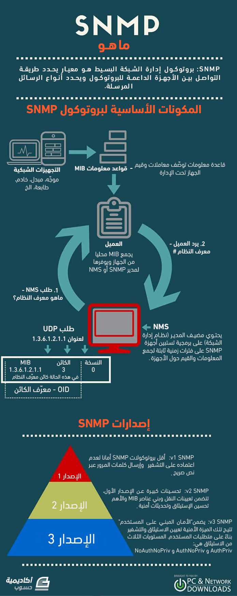
 
<em>شكل: إنفوجرافيك يلخّص تعريف SNMP ومكوناته الأساسية وإصداراته الثلاثة</em>

<strong>آلية العمل:</strong> محطة إدارة مركزية (Management Station / NMS - Network Management System) بتقوم بعملية <strong>استقصاء (Polling)</strong> للأجهزة على فترات زمنية ثابتة أو عشوائية، بتطلب منها تكشف عن معلومات معينة. البروتوكول بيستخدم UDP لنقل الرسائل (Datagrams) بين محطة الإدارة والـ Agent الشغال على كل جهاز مُدار.

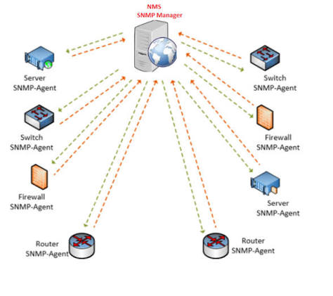
 
<em>شكل: محطة الإدارة (NMS / SNMP Manager) بتتواصل مع الـ Agents الشغالة على الراوترات والسويتشات والسيرفرات والفايروولات</em>

<h3 dir="rtl" align="right" id="snmp-functions">2.2 وظائف البروتوكول</h3>

<ul dir="rtl">
<li><strong>جمع المعلومات:</strong> الحصول على حالة الجهاز الحالية (استخدام المعالج، الذاكرة، حالة الواجهات).</li>
<li><strong>تعديل الإعدادات عن بعد:</strong> إرسال أوامر لتغيير إعداد معين على الجهاز مباشرة.</li>
<li><strong>التنبيه الفوري (Trapping):</strong> إعلام محطة الإدارة فوراً بحدث مهم من غير ما تستني دورة الاستقصاء التالية.</li>
</ul>

<h3 dir="rtl" align="right" id="snmp-components">2.3 مكونات بروتوكول SNMP</h3>

<ul dir="rtl">
<li><strong>Manager (محطة الإدارة / NMS):</strong> النظام المركزي اللي بيجمع ويحلل البيانات من كل الأجهزة.</li>
<li><strong>Agent (الوكيل):</strong> برنامج صغير شغال على كل جهاز مُدار، مسؤول عن جمع بيانات الجهاز محلياً والرد على استفسارات الـ Manager.</li>
<li><strong>MIB (Management Information Base):</strong> قاعدة بيانات هرمية بتحدد كل قطعة معلومة يقدر الـ Agent يبلّغ عنها (زي رقم تعريفي لكل متغير — Object Identifier / OID).</li>
</ul>

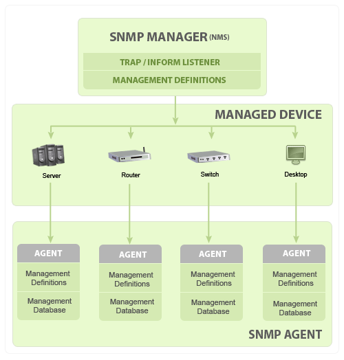
 
<em>شكل: مكونات SNMP — الـ Manager في الأعلى، والأجهزة المُدارة، وعلى كل جهاز Agent معاه قاعدة بيانات الإدارة (MIB)</em>

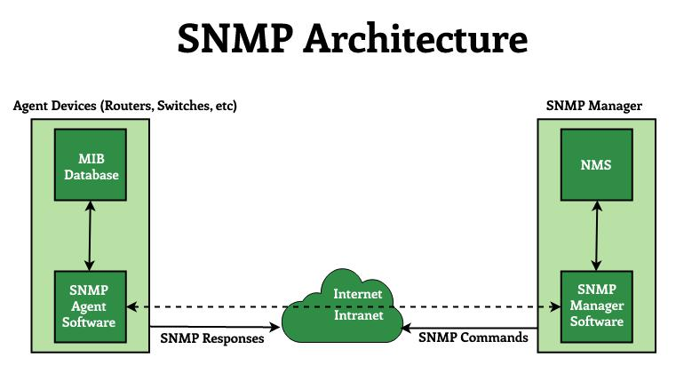
 
<em>شكل: معمارية SNMP — الأوامر (Commands) رايحة من الـ Manager والردود (Responses) راجعة من الـ Agent</em>

<h3 dir="rtl" align="right" id="snmp-versions">2.4 إصدارات بروتوكول SNMP</h3>

<table>
<tr><th align="center">الإصدار</th><th align="center">أهم خصائصه</th></tr>
<tr><td align="center"><strong>SNMPv1</strong></td><td align="center">الإصدار الأصلي — مصادقة ضعيفة جداً عبر "Community String" (زي كلمة مرور نص واضح غير مشفّر)</td></tr>
<tr><td align="center"><strong>SNMPv2 (SNMPv2c)</strong></td><td align="center">تحسينات في الأداء ونقل حجم بيانات أكبر، لكن لسه بيستخدم Community String غير مشفّر لنفس مشكلة v1 الأمنية</td></tr>
<tr><td align="center"><strong>SNMPv3</strong></td><td align="center">الإصدار الآمن — بيضيف <strong>مصادقة حقيقية وتشفير كامل</strong> للرسائل، وهو الموصى به حصرياً في البيئات الحديثة</td></tr>
</table>

<h3 dir="rtl" align="right" id="snmp-commands">2.5 أوامر بروتوكول SNMP والمنافذ</h3>

<table>
<tr><th align="center">الأمر</th><th align="center">الوظيفة</th><th align="center">المنفذ (Port)</th></tr>
<tr><td align="center"><code>GetRequest</code></td><td align="center">طلب من الـ Manager للـ Agent للحصول على قيمة معينة (بيانات عن حالة الجهاز)</td><td align="center">UDP 161</td></tr>
<tr><td align="center"><code>SetRequest</code></td><td align="center">طلب من الـ Manager لتعديل إعداد معين على الجهاز</td><td align="center">UDP 161</td></tr>
<tr><td align="center"><code>GetResponse</code></td><td align="center">رد الـ Agent على طلب GetRequest بالقيمة المطلوبة</td><td align="center">UDP 161</td></tr>
<tr><td align="center"><code>GetNextRequest</code></td><td align="center">طلب القيمة التالية في شجرة الـ MIB، وتكراره بيعمل SNMP Walk للمرور على شجرة كاملة</td><td align="center">UDP 161</td></tr>
<tr><td align="center"><code>GetBulkRequest</code> (v2c / v3)</td><td align="center">طلب مجموعة كبيرة من القيم في رسالة واحدة بدل طلبات متكررة</td><td align="center">UDP 161</td></tr>
<tr><td align="center"><code>InformRequest</code> (v2c / v3)</td><td align="center">زي الـ Trap لكن بيحتاج <strong>إقرار استلام</strong> من الـ Manager، فبيتأكد إن التنبيه وصل</td><td align="center">UDP 162</td></tr>
<tr><td align="center"><code>Trap</code></td><td align="center">تنبيه غير مطلوب (Unsolicited) بيرسله الـ Agent تلقائياً لحدث مهم محدد مسبقاً من الإدارة</td><td align="center">UDP 162</td></tr>
</table>

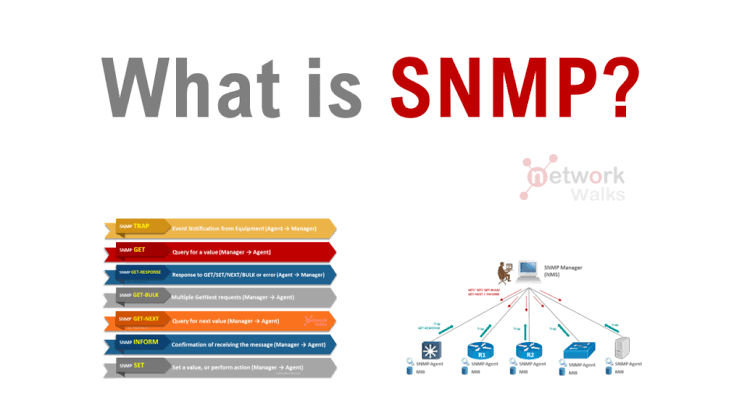
 
<em>شكل: أنواع رسائل SNMP (TRAP, GET, GET-RESPONSE, GET-BULK, GET-NEXT, INFORM, SET) واتجاه كل رسالة</em>

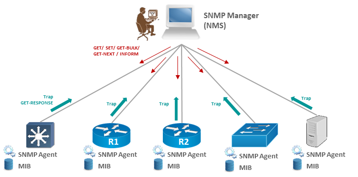
 
<em>شكل: الأوامر نازلة من الـ Manager للـ Agents (GET / SET / GET-BULK / GET-NEXT / INFORM) والـ Trap والـ Response طالعين من الـ Agents</em>

<h3 dir="rtl" align="right" id="snmp-extras">2.6 معلومات إضافية: الأمان، الـ OID، و Polling مقابل Trap</h3>

<strong>مستويات الأمان في SNMPv3:</strong> بيعتمد على مبدأ "الأمان المبني على المستخدم" (User-based Security Model) بدل الـ Community String، وله ثلاث مستويات:

<table>
<tr><th align="center">المستوى</th><th align="center">المصادقة</th><th align="center">التشفير</th></tr>
<tr><td align="center"><strong>noAuthNoPriv</strong></td><td align="center">اسم مستخدم فقط</td><td align="center">لا يوجد</td></tr>
<tr><td align="center"><strong>authNoPriv</strong></td><td align="center">مصادقة بـ MD5 أو SHA</td><td align="center">لا يوجد</td></tr>
<tr><td align="center"><strong>authPriv</strong></td><td align="center">مصادقة بـ MD5 أو SHA</td><td align="center">تشفير (DES أو AES) — أعلى مستوى أماناً</td></tr>
</table>

<strong>Community Strings في v1 و v2c:</strong> هي كلمات مرور بتتبعت كنص واضح. القيم الافتراضية الشائعة <code>public</code> (قراءة فقط) و <code>private</code> (قراءة وكتابة)، وتركها كما هي من أشهر الثغرات الأمنية في الشبكات.

<strong>الـ OID:</strong> المتغيرات في الـ MIB بتترتب على شكل شجرة، وكل متغير ليه رقم تعريفي يتقرا من الجذر للفرع، مثلاً: <code>1.3.6.1.2.1.1.1</code> هو وصف النظام (sysDescr). الفرع <code>1.3.6.1.2.1</code> هو الـ MIB القياسي (MIB-2) المشترك بين كل المصنّعين، أما الفرع <code>1.3.6.1.4.1</code> فمخصص للمتغيرات الخاصة بكل شركة (Enterprise MIBs). وأمر <strong>SNMP Walk</strong> هو تكرار GetNext لعرض شجرة كاملة أو جزء منها.

<table>
<tr><th align="center">وجه المقارنة</th><th align="center">Polling (الاستقصاء)</th><th align="center">Trap / Inform (التنبيه)</th></tr>
<tr><td align="center">مَن يبدأ؟</td><td align="center">الـ Manager بيسأل الـ Agent بشكل دوري</td><td align="center">الـ Agent بيبلّغ لما يحصل الحدث</td></tr>
<tr><td align="center">الاستخدام الأنسب</td><td align="center">رسم منحنيات الأداء ومتابعة الاتجاهات</td><td align="center">اكتشاف الأعطال فوراً (واجهة وقعت، حرارة عالية)</td></tr>
<tr><td align="center">العيب</td><td align="center">ممكن يفوّت حدث بين دورتين</td><td align="center">Trap مفيش ضمان إنه وصل (UDP) — Inform بيحلها بالإقرار</td></tr>
</table>

<strong>أفضل ممارسات تأمين SNMP:</strong> استخدام SNMPv3 قدر الإمكان، تغيير الـ Community Strings الافتراضية، تفعيل القراءة فقط (Read-Only) إلا لو الكتابة مطلوبة فعلاً، تقييد الوصول بـ ACL لعناوين الـ Manager فقط، وتعطيل SNMP على الأجهزة اللي مش بتحتاجه.

---

<h2 dir="rtl" align="right" id="syslog">3. بروتوكول Syslog</h2>

<h3 dir="rtl" align="right" id="syslog-definition">3.1 ما هو وكيف يعمل</h3>

Syslog هو بروتوكول ومعيار قياسي لإرسال وتجميع <strong>رسائل السجلات (Log Messages)</strong> من أجهزة الشبكة والسيرفرات المختلفة إلى مكان مركزي واحد. بدل ما تدخل على كل جهاز بمفرده تقرا سجلاته، كل الأجهزة بترسل رسائلها لسيرفر Syslog مركزي، وده بيسهّل جداً عملية المراجعة والتدقيق (Auditing) والربط بين أحداث حصلت في أجهزة مختلفة في نفس الوقت.

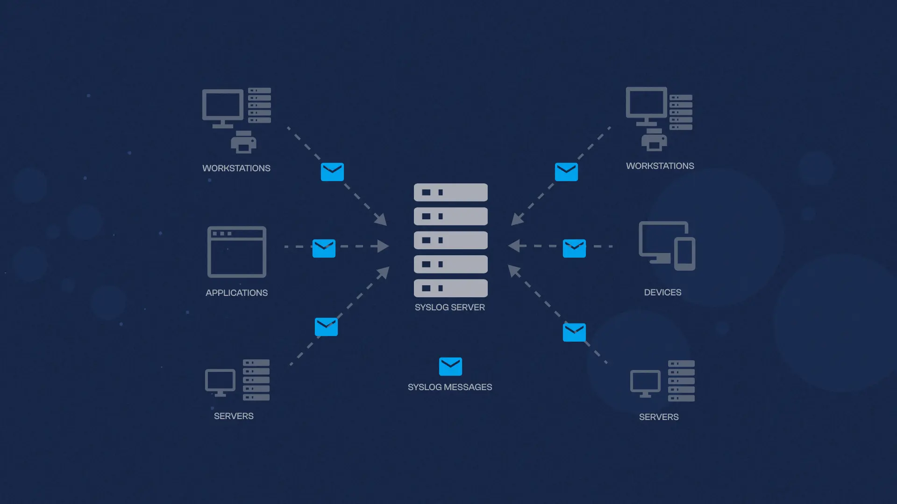
 
<em>شكل: سيرفر Syslog المركزي بيستقبل الرسائل من Workstations وApplications وServers وDevices</em>

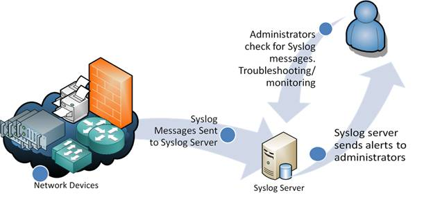
 
<em>شكل: الأجهزة بترسل رسائل Syslog للسيرفر، والسيرفر بيبعت تنبيهات للإداريين اللي بيراجعوها للتشخيص والمراقبة</em>

<h3 dir="rtl" align="right" id="syslog-server">3.2 سيرفر Syslog ومكوناته</h3>

سيرفر Syslog هو النقطة المركزية اللي بتستقبل وتخزّن وتصنّف كل الرسائل الواردة من الأجهزة المختلفة. بيتكوّن نظام Syslog من:

<ul dir="rtl">
<li><strong>المُرسِل (Originator):</strong> الجهاز اللي بيولّد الرسالة (راوتر، سويتش، سيرفر، فايروول).</li>
<li><strong>المُوجِّه/المُرحِّل (Relay):</strong> جهاز وسيط اختياري بيمرر الرسائل من عدة مصادر للسيرفر المركزي.</li>
<li><strong>المُجمِّع (Collector / Syslog Server):</strong> السيرفر النهائي اللي بيستقبل ويخزّن كل الرسائل لتحليلها لاحقاً.</li>
</ul>

كل رسالة Syslog بتتصنّف بناءً على مكوّنين أساسيين: <strong>Facility</strong> (المصدر أو نوع العملية اللي ولّدت الرسالة — زي kernel, mail, auth) و <strong>Severity</strong> (مستوى الخطورة، موضّح بالتفصيل تحت).

<strong>منافذ النقل الشائعة:</strong> Syslog بيتنقل تقليدياً عبر <code>UDP 514</code> (سريع لكن من غير ضمان تسليم)، أو <code>TCP 514</code> (بضمان تسليم)، أو <code>TCP 6514</code> مع تشفير TLS لو الرسائل حساسة وعايز تحميها أثناء العبور.

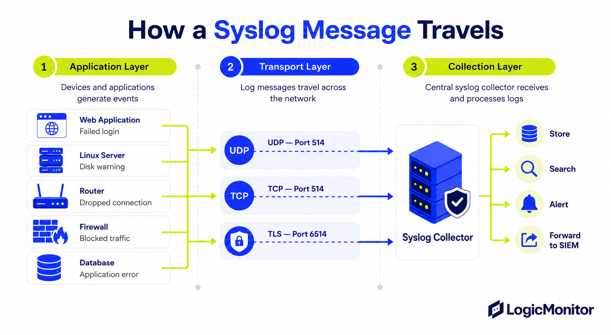
 
<em>شكل: رحلة رسالة Syslog — توليد الحدث، النقل عبر UDP/TCP/TLS، ثم المعالجة في الـ Collector (تخزين، بحث، تنبيه، تمرير لـ SIEM)</em>

<h3 dir="rtl" align="right" id="syslog-levels">3.3 مستويات Syslog (أنواع الرسائل)</h3>

كل رسالة Syslog ليها مستوى خطورة (Severity Level) من 0 لـ 7 — كل ما الرقم أقل، كل ما الخطورة أعلى:

<table>
<tr><th align="center">الرقم</th><th align="center">الاسم</th><th align="center">الوصف</th></tr>
<tr><td align="center">0</td><td align="center">Emergency</td><td align="center">النظام غير قابل للاستخدام تماماً — أعلى درجة خطورة</td></tr>
<tr><td align="center">1</td><td align="center">Alert</td><td align="center">يجب اتخاذ إجراء فوري</td></tr>
<tr><td align="center">2</td><td align="center">Critical</td><td align="center">حالة حرجة</td></tr>
<tr><td align="center">3</td><td align="center">Error</td><td align="center">حالة خطأ فعلية</td></tr>
<tr><td align="center">4</td><td align="center">Warning</td><td align="center">تحذير من حالة محتملة الخطورة</td></tr>
<tr><td align="center">5</td><td align="center">Notice</td><td align="center">حدث طبيعي لكنه مهم بما يكفي للتسجيل</td></tr>
<tr><td align="center">6</td><td align="center">Informational</td><td align="center">رسائل معلوماتية عادية</td></tr>
<tr><td align="center">7</td><td align="center">Debug</td><td align="center">أدق التفاصيل، تُستخدم غالباً لتشخيص برمجي — أقل درجة خطورة</td></tr>
</table>

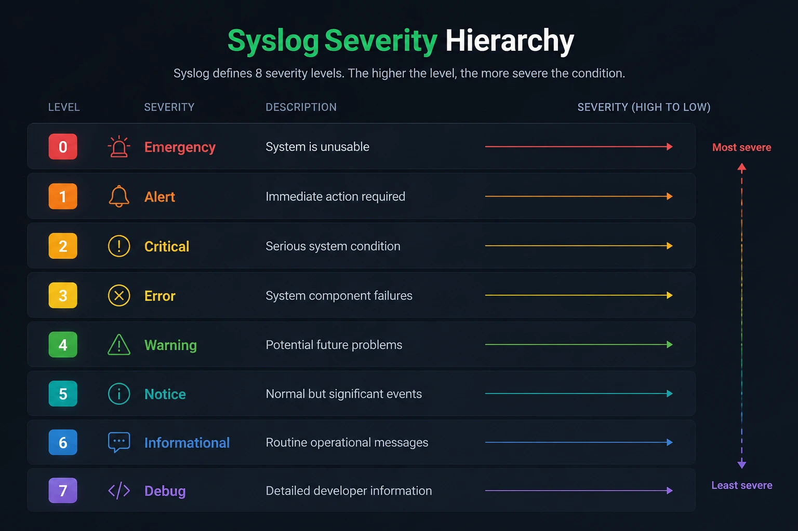
 
<em>شكل: هرم مستويات Syslog Severity من 0 (Emergency الأخطر) إلى 7 (Debug الأقل خطورة)</em>

<h3 dir="rtl" align="right" id="syslog-level-selection">3.4 تحديد مستوى رسائل Syslog المطلوب استلامه</h3>

عند إعداد Syslog على جهاز، بتحدد <strong>الحد الأدنى</strong> لمستوى الخطورة اللي عايز تستقبله — ولازم تفهم إن اختيار مستوى معين بيعني استلام <strong>كل الرسائل من المستوى ده وأعلى منه خطورة</strong> (يعني أرقام أقل أو مساوية). مثلاً لو حددت "Warning" (مستوى 4)، هتستقبل كل رسائل Warning وError وCritical وAlert وEmergency، لكن مش هتستقبل Notice أو Informational أو Debug. الاختيار الصح بيوازن بين تفويت معلومة مهمة (لو المستوى عالي جداً) وإغراق السيرفر برسائل زيادة عن اللزوم (لو المستوى منخفض جداً زي Debug في بيئة إنتاج).

<h3 dir="rtl" align="right" id="syslog-message-format">3.5 شكل رسالة Syslog وقيمة الـ PRI</h3>

كل رسالة Syslog بتبدأ بقيمة <strong>PRI</strong> بين علامتي <code>&lt; &gt;</code>، وبتتحسب كالتالي: <strong>PRI = (Facility × 8) + Severity</strong>. وبعدها يجي الـ Timestamp واسم الجهاز (Hostname) ثم نص الرسالة. مثال: الرسالة اللي بتبدأ بـ <code>&lt;34&gt;</code> معناها Facility رقم 4 (auth) و Severity رقم 2 (Critical)، لأن 4 × 8 + 2 = 34.

<table>
<tr><th align="center">الرقم</th><th align="center">Facility</th><th align="center">المصدر</th></tr>
<tr><td align="center">0</td><td align="center">kern</td><td align="center">رسائل نواة النظام</td></tr>
<tr><td align="center">1</td><td align="center">user</td><td align="center">عمليات المستخدمين</td></tr>
<tr><td align="center">2</td><td align="center">mail</td><td align="center">نظام البريد</td></tr>
<tr><td align="center">3</td><td align="center">daemon</td><td align="center">خدمات النظام</td></tr>
<tr><td align="center">4</td><td align="center">auth</td><td align="center">الأمان والمصادقة</td></tr>
<tr><td align="center">5</td><td align="center">syslog</td><td align="center">رسائل خدمة Syslog نفسها</td></tr>
<tr><td align="center">9</td><td align="center">cron</td><td align="center">المهام المجدولة</td></tr>
<tr><td align="center">16 – 23</td><td align="center">local0 – local7</td><td align="center">مخصصة لاستخدام المؤسسة (غالباً أجهزة الشبكة)</td></tr>
</table>

وبما إن الساعات لازم تكون متزامنة عشان ترتيب الأحداث يبقى صح، لازم كل الأجهزة تستخدم <strong>NTP</strong> (منفذ <code>UDP 123</code>) كما في القسم 3.6.

<h3 dir="rtl" align="right" id="siem">3.6 نظام SIEM وربط وتحليل السجلات (Log Aggregation &amp; Correlation)</h3>

سيرفر Syslog بيجمّع الرسائل ويخزّنها، لكنه <strong>مش بيفهمها</strong>. لو عندك مئات الأجهزة بتبعت آلاف الرسائل في الثانية، محتاج نظام أذكى فوقه بيربط الأحداث ببعض ويطلّع التنبيه المهم من وسط الزحمة. ده بالظبط دور <strong>SIEM (Security Information and Event Management)</strong> — منصة بتجمّع السجلات من كل مصادر الشبكة، وتوحّدها، وتحلّلها، وتربط بين أحداث من أجهزة مختلفة عشان تكتشف الهجمات والمشاكل اللي مستحيل تتشاف من جهاز واحد لوحده.

الـ SIEM هو في الأصل دمج لوظيفتين:

<ul dir="rtl">
<li><strong>SIM (Security Information Management):</strong> التخزين طويل المدى للسجلات وتحليلها وإصدار تقارير الالتزام (Compliance Reports).</li>
<li><strong>SEM (Security Event Management):</strong> المراقبة اللحظية للأحداث (Real-Time) والتنبيه الفوري عند اكتشاف نشاط مشبوه.</li>
</ul>

وبيشتغل على عدة مراحل متتالية:

<table>
<tr><th align="center">المرحلة</th><th align="center">الوظيفة</th><th align="center">مثال</th></tr>
<tr><td align="center"><strong>Log Aggregation (التجميع)</strong></td><td align="center">سحب السجلات من كل المصادر في مكان مركزي واحد</td><td align="center">رسائل Syslog من الراوترات، سجلات Windows، فايروول، IDS/IPS، سجلات تطبيقات</td></tr>
<tr><td align="center"><strong>Normalization (التوحيد)</strong></td><td align="center">تحويل صيغ السجلات المختلفة لشكل موحّد بنفس أسماء الحقول عشان تتقارن ببعض</td><td align="center">حقول موحّدة زي: Source IP / User / Action / Timestamp</td></tr>
<tr><td align="center"><strong>Correlation (الربط)</strong></td><td align="center">قواعد بتربط أحداث من أجهزة مختلفة وبتطلّع تنبيه لما تتحقق سلسلة معينة</td><td align="center">مسح منافذ ← محاولات دخول فاشلة ← دخول ناجح من نفس الـ IP</td></tr>
<tr><td align="center"><strong>Alerting &amp; Dashboards (التنبيه والعرض)</strong></td><td align="center">إرسال تنبيهات حسب الأولوية وعرض الحالة في لوحات متابعة</td><td align="center">تنبيه بالبريد أو تذكرة دعم فني + Dashboard للـ SOC</td></tr>
<tr><td align="center"><strong>Retention &amp; Reporting (الاحتفاظ والتقارير)</strong></td><td align="center">حفظ السجلات المدة المطلوبة قانونياً وإصدار تقارير التدقيق</td><td align="center">احتفاظ بالسجلات 12 شهر لأغراض المراجعة والتحقيق (Forensics)</td></tr>
</table>

<strong>مثال على الـ Correlation:</strong> فايروول سجّل محاولات اتصال مرفوضة من نفس الـ IP على منافذ كتيرة (Port Scan)، وبعدها سيرفر سجّل عشرات محاولات تسجيل دخول فاشلة من الـ IP نفسه، وبعدها تسجيل دخول ناجح. كل حدث لوحده ممكن يعدّي كإنذار بسيط، لكن اجتماعهم بالترتيب ده خلال دقايق معناه غالباً <strong>هجوم تخمين كلمة مرور (Brute-Force) نجح</strong> — وده اللي الـ SIEM بيطلّعه كتنبيه عالي الأولوية.

<strong>نقطة مهمة:</strong> الربط بين الأحداث بيعتمد على دقة التوقيت، فلازم كل الأجهزة تكون متزامنة الساعة عبر <strong>NTP</strong> — لو ساعة جهاز متأخرة أو متقدمة، ترتيب الأحداث هيتلخبط والـ Correlation هيفشل أو يدّي نتيجة مضللة.

<table>
<tr><th align="center">وجه المقارنة</th><th align="center">سيرفر Syslog</th><th align="center">نظام SIEM</th></tr>
<tr><td align="center">الطبيعة</td><td align="center">بروتوكول + سيرفر استقبال وتخزين</td><td align="center">منصة تحليل متكاملة</td></tr>
<tr><td align="center">الفهم</td><td align="center">بيستقبل الرسائل ويخزّنها كما هي</td><td align="center">بيوحّد الرسائل ويفهم سياقها ويربط بينها</td></tr>
<tr><td align="center">التنبيه</td><td align="center">محدود (حسب الـ Severity غالباً)</td><td align="center">تنبيهات ذكية قائمة على قواعد الـ Correlation</td></tr>
<tr><td align="center">المصادر</td><td align="center">غالباً رسائل Syslog فقط</td><td align="center">Syslog + سجلات أنظمة + NetFlow + أدوات أمنية وغيرها</td></tr>
</table>

من أشهر منصات الـ SIEM: Splunk وIBM QRadar وMicrosoft Sentinel وElastic Security، ومن البدائل المفتوحة المصدر: Wazuh.

---

<h2 dir="rtl" align="right" id="netflow">4. بروتوكول NetFlow</h2>

<h3 dir="rtl" align="right" id="netflow-definition">4.1 ما هو وكيف يعمل</h3>

NetFlow هو بروتوكول (طوّرته شركة سيسكو في الأصل، وله تقنيات مشابهة من شركات تانية زي J-Flow من Juniper، وبديل مفتوح المعيار هو sFlow الموضّح في 4.7) مخصص لجمع وتحليل <strong>إحصائيات حركة البيانات (Traffic Statistics)</strong> المارة عبر جهاز شبكة (غالباً راوتر أو سويتش من المستوى الثالث). على عكس Syslog (اللي بيسجّل أحداث) أو SNMP (اللي بيجمع حالة الجهاز)، NetFlow متخصص تحديداً في الإجابة على سؤال: <strong>"مين بيتواصل مع مين، وبإيه بروتوكول، وبكام؟"</strong>

<h3 dir="rtl" align="right" id="netflow-mechanism">4.2 المكونات وطريقة العمل</h3>

بيتكوّن نظام NetFlow من ثلاثة عناصر أساسية:

<ul dir="rtl">
<li><strong>Exporter (المُصدِّر):</strong> جهاز الشبكة نفسه (الراوتر/السويتش) اللي بيراقب الحركة المارة عبره ويولّد سجلات الـ Flow.</li>
<li><strong>Collector (المُجمِّع):</strong> سيرفر بيستقبل ويخزّن سجلات الـ Flow المُرسَلة من كل أجهزة الـ Exporter في الشبكة.</li>
<li><strong>Analyzer (المُحلِّل):</strong> أداة أو برنامج بيحلل البيانات المُجمَّعة ويطلع تقارير وإحصائيات مفهومة للإداري (استخدام النطاق الترددي حسب التطبيق، أكتر المستخدمين استهلاكاً، إلخ).</li>
</ul>

<h3 dir="rtl" align="right" id="netflow-dependency">4.3 على ماذا يعتمد في تحليل حركة البيانات</h3>

NetFlow بيعتمد في التصنيف على مجموعة خصائص بتُعرف بـ <strong>"المفتاح ذو السبع عناصر" (7-Tuple)</strong> — عنوان IP المصدر، عنوان IP الوجهة، منفذ المصدر، منفذ الوجهة، نوع البروتوكول (TCP/UDP)، نوع الخدمة (ToS)، وواجهة الإدخال. أي حزم بتشترك في نفس القيم السبعة دي بتُعتبر جزء من نفس الـ Flow الواحد.

<h3 dir="rtl" align="right" id="netflow-server">4.4 سيرفر NetFlow</h3>

سيرفر NetFlow (الـ Collector) هو نظام مركزي بيستقبل سجلات الـ Flow من كل أجهزة الشبكة، وبيخزّنها لفترة معينة عشان تتحلل لاحقاً — سواء لتحليل الأداء، أو التخطيط للسعة المستقبلية (Capacity Planning)، أو حتى التحقيقات الأمنية بعد وقوع حادثة (Forensics).

<h3 dir="rtl" align="right" id="netflow-versions">4.5 إصدارات بروتوكول NetFlow</h3>

الإصدارات الأشهر هي <strong>NetFlow v5</strong> (الأكثر انتشاراً تاريخياً، لكنه محدود لدعم IPv4 بس) و <strong>NetFlow v9</strong> (مرن أكتر، بيدعم IPv6 والقوالب القابلة للتخصيص Templates). وفيه معيار صناعي مفتوح مبني على NetFlow v9 اسمه <strong>IPFIX (IP Flow Information Export)</strong> بقى معتمد رسمياً من IETF.

<h3 dir="rtl" align="right" id="netflow-flow">4.6 مفهوم الـ Flow</h3>

الـ <strong>Flow</strong> هو تسلسل من الحزم بتشترك في نفس القيم السبعة الموضّحة فوق (نفس عنواني المصدر والوجهة، نفس المنافذ، نفس البروتوكول...) وبتُعتبر جزء من نفس "محادثة" واحدة منطقياً — زي كل الحزم المكوّنة لجلسة تصفّح واحدة لموقع معين. بدل ما NetFlow يسجّل كل حزمة بمفردها (وده هيكون ضخم جداً)، بيلخّص كل الـ Flow في سجل واحد (كام بايت اتبعتوا، كام حزمة، من إمتى لإمتى)، وده بيخلي التحليل عملي وفعّال حتى على شبكات ضخمة جداً.

<h3 dir="rtl" align="right" id="sflow">4.7 تقنية sFlow والفرق بينها وبين NetFlow من حيث أخذ العينات (Sampling)</h3>

<strong>sFlow (Sampled Flow)</strong> هي تقنية مراقبة حركة بيانات مفتوحة المعيار (تديرها منظمة sFlow.org)، وهدفها نفس هدف NetFlow (معرفة مين بيستهلك الشبكة وفي إيه) لكن بآلية جمع مختلفة تماماً: بدل ما تتبّع <em>كل</em> الـ Flows، بتعتمد على <strong>أخذ العينات (Sampling)</strong>. الإشارة اللي في 4.1 لإن sFlow "مشابه" لـ NetFlow صحيحة من حيث الهدف، لكن الفرق الجوهري في طريقة العمل:

<ul dir="rtl">
<li><strong>Packet Sampling (عينات الحزم):</strong> الـ Agent جوه السويتش أو الراوتر بياخد عينة عشوائية <strong>حزمة واحدة من كل N حزمة</strong> (مثلاً 1:1000)، وبيبعت رأس الحزمة (Header) وأول جزء من محتواها فقط للـ Collector.</li>
<li><strong>Counter Sampling (عينات العدّادات):</strong> الـ Agent بيبعت بشكل دوري (مثلاً كل 20 إلى 30 ثانية) قراءة عدّادات الواجهات (Interface Counters) زي عدد البايتات والأخطاء.</li>
<li><strong>النقل:</strong> رسائل sFlow بتتبعت عبر UDP، والمنفذ الافتراضي <code>UDP 6343</code>، وبتتبعت فوراً من غير ما تستنى انتهاء الـ Flow (يعني قريبة من الوقت الفعلي).</li>
<li><strong>بدون حالة (Stateless):</strong> الجهاز مش بيحتفظ بجدول Flows في الذاكرة، وده بيخلّي استهلاك المعالج والذاكرة قليل جداً حتى على روابط 10/40/100 جيجابت.</li>
</ul>

<strong>الخلاصة:</strong> sFlow بيدّي <strong>صورة إحصائية تقريبية</strong> دقيقة كفاية للاتجاهات العامة (أكبر المستهلكين، توزيع البروتوكولات)، لكن ممكن يفوّت Flows صغيرة جداً لأنها ممكن ما تقعش في أي عينة.

<table>
<tr><th align="center">وجه المقارنة</th><th align="center">NetFlow</th><th align="center">sFlow</th></tr>
<tr><td align="center">آلية الجمع</td><td align="center">بيتتبّع الـ Flows ويسجّلها في Flow Cache (مع إمكانية Sampled NetFlow)</td><td align="center">أخذ عينات عشوائية 1:N من الحزم + عدّادات الواجهات</td></tr>
<tr><td align="center">حفظ الحالة</td><td align="center">Stateful (جدول Flows في الذاكرة)</td><td align="center">Stateless (لا يحتفظ بجدول Flows)</td></tr>
<tr><td align="center">الدقة</td><td align="center">أعلى — سجل لكل Flow</td><td align="center">إحصائية تقريبية تعتمد على معدل العينات</td></tr>
<tr><td align="center">حمل الجهاز</td><td align="center">أعلى (معالج + ذاكرة)</td><td align="center">أقل بكثير</td></tr>
<tr><td align="center">توقيت التصدير</td><td align="center">بعد انتهاء الـ Flow أو انتهاء مهلة الـ Timeout</td><td align="center">فوري تقريباً مع كل عينة</td></tr>
<tr><td align="center">الرؤية على Layer 2</td><td align="center">محدودة في الإصدارات القديمة</td><td align="center">ممتازة — عينة الحزمة الخام بتحتوي عناوين MAC وVLAN</td></tr>
<tr><td align="center">المعيار</td><td align="center">نشأ كتقنية خاصة بسيسكو</td><td align="center">معيار مفتوح مدعوم من مصنّعين كتير</td></tr>
<tr><td align="center">منفذ التصدير</td><td align="center">غير موحّد (شائع: UDP 2055)</td><td align="center">UDP 6343</td></tr>
</table>

<h3 dir="rtl" align="right" id="ipfix">4.8 بروتوكول IPFIX كمعيار مفتوح لـ NetFlow</h3>

<strong>IPFIX (IP Flow Information Export)</strong> هو معيار IETF الرسمي لتصدير معلومات الـ Flows، وبيُعتبر النسخة الموحّدة المفتوحة من NetFlow (مبني على NetFlow v9 اللي اتذكر في 4.5، وأحياناً بيتسمّى "NetFlow v10" لأن رقم الإصدار في رأس الرسالة هو 10). فكرته إن أي مصنّع يقدر يصدّر بيانات الـ Flow بصيغة قياسية يفهمها أي Collector، من غير ما تعتمد على شركة معينة.

<ul dir="rtl">
<li><strong>Templates (القوالب):</strong> الجهاز بيبعت الأول قالب بيوصف شكل السجلات (أي حقول موجودة وبأي ترتيب)، وبعدها يبعت السجلات نفسها — وده بيخلّي التصدير مرن وقابل للتوسع.</li>
<li><strong>حقول مخصصة (Enterprise-Specific Fields):</strong> المصنّع يقدر يضيف حقول خاصة بيه (زي معلومات التطبيق أو الـ URL) من غير ما يكسر التوافق مع المعيار.</li>
<li><strong>دعم IPv6 وطول الحقول المتغيّر (Variable-Length Fields):</strong> ميزة مش موجودة في NetFlow v5.</li>
<li><strong>النقل:</strong> يدعم <code>UDP</code> و <code>TCP</code> و <code>SCTP</code>، والمنفذ المسجّل لـ IPFIX هو <code>4739</code> (وفيه 4740 للنقل المشفّر عبر TLS/DTLS).</li>
<li><strong>عناصر النظام:</strong> Exporting Process (المُصدِّر) و Collecting Process (المُجمِّع) و Observation Point (نقطة المراقبة) — نفس مفهوم Exporter / Collector في NetFlow.</li>
</ul>

<table>
<tr><th align="center">البروتوكول</th><th align="center">الجهة / المعيار</th><th align="center">آلية الجمع</th><th align="center">أهم ميزة</th></tr>
<tr><td align="center">NetFlow v5</td><td align="center">سيسكو (تقنية خاصة)</td><td align="center">Flows بقالب ثابت</td><td align="center">الأكثر انتشاراً تاريخياً — IPv4 فقط</td></tr>
<tr><td align="center">NetFlow v9</td><td align="center">سيسكو (أساس IPFIX)</td><td align="center">Flows بقوالب (Templates)</td><td align="center">مرن، يدعم IPv6</td></tr>
<tr><td align="center"><strong>IPFIX</strong></td><td align="center">IETF (معيار مفتوح)</td><td align="center">Flows بقوالب (Templates)</td><td align="center">توافق بين المصنّعين + حقول مخصصة</td></tr>
<tr><td align="center">sFlow</td><td align="center">sFlow.org (معيار مفتوح)</td><td align="center">عينات حزم وعدّادات</td><td align="center">حمل منخفض جداً على الروابط السريعة</td></tr>
</table>

---

<h2 dir="rtl" align="right" id="wireshark">5. برنامج Wireshark</h2>

<h3 dir="rtl" align="right" id="wireshark-definition">5.1 التعريف</h3>

Wireshark هو أشهر برنامج مجاني ومفتوح المصدر لالتقاط وتحليل حزم البيانات (Packet Analyzer / Protocol Analyzer) بواجهة رسومية — النسخة الرسومية المكافئة لأداة <code>tcpdump</code> السطرية (الموضّحة بالتفصيل في الموضوع 20).

<h3 dir="rtl" align="right" id="wireshark-mechanism">5.2 آلية العمل والوظيفة</h3>

البرنامج بيشغّل كارت الشبكة في وضع <strong>Promiscuous Mode</strong> (بيلتقط كل الحزم المارة على الوسط الناقل، مش بس اللي موجّهة له تحديداً)، وبيعرضها في الوقت الفعلي مع تحليل تلقائي لكل طبقة من طبقات البروتوكول (من Ethernet Frame وصولاً لبيانات التطبيق نفسه). بيدّي شفافية كاملة لمحتوى الحركة، وده اللي بيخليه أداة أساسية جداً في التشخيص العميق والتحليل الأمني — وأداة اختراق قوية في نفس الوقت لو استُخدم على شبكة غير مشفّرة (Packet Sniffing، الموضّح في الموضوع 18).

<h3 dir="rtl" align="right" id="wireshark-components">5.3 المكونات</h3>

<ul dir="rtl">
<li><strong>Capture Filters (فلاتر الالتقاط):</strong> بتحدد مسبقاً أي حركة بس تتلقط (زي التقاط حركة جهاز معين بس)، وده بيقلل حجم البيانات الملتقطة من الأساس.</li>
<li><strong>Display Filters (فلاتر العرض):</strong> بتفلتر الحزم اللي اتلقطت بالفعل عشان تعرض بس اللي محتاجه (زي <code>http</code> أو <code>ip.addr == 192.168.1.1</code>).</li>
<li><strong>Packet List / Packet Details / Packet Bytes:</strong> ثلاث أجزاء أساسية في الواجهة — قائمة الحزم، تفاصيل الحزمة المختارة طبقة بطبقة، والبيانات الخام بالـ Hex.</li>
</ul>

<h3 dir="rtl" align="right" id="capture-methods">5.4 طرق التقاط الحزم على الشبكة (Port Mirroring / SPAN و TAP)</h3>

في الشبكات اللي بتستخدم سويتشات، السويتش بيبعت الإطار للمنفذ المقصود بس، فكارت الشبكة (حتى في Promiscuous Mode) مش هيشوف حركة الأجهزة التانية. عشان كده بنحتاج إحدى الطرق دي:

<table>
<tr><th align="center">الطريقة</th><th align="center">الفكرة</th><th align="center">ملاحظات</th></tr>
<tr><td align="center"><strong>Port Mirroring (SPAN)</strong></td><td align="center">إعداد على السويتش بينسخ حركة منفذ أو VLAN لمنفذ تاني موصّل عليه جهاز التحليل</td><td align="center">لا يحتاج جهاز إضافي، لكن ممكن يفقد حزم لو السويتش مشغول</td></tr>
<tr><td align="center"><strong>Network TAP</strong></td><td align="center">جهاز فيزيائي بيتركّب بين الطرفين وبينسخ الحركة بالكامل للمحلل</td><td align="center">لا يفقد حزم وبيشتغل حتى لو السويتش وقع، لكن بيحتاج جهاز إضافي وتركيب</td></tr>
<tr><td align="center"><strong>على الجهاز نفسه</strong></td><td align="center">تشغيل Wireshark على الجهاز المراد تحليل حركته</td><td align="center">الأبسط، يقتصر على حركة الجهاز ده فقط</td></tr>
</table>

<h3 dir="rtl" align="right" id="wireshark-filters">5.5 الفرق بين صيغتي الفلاتر وأمثلة شائعة</h3>

<strong>Capture Filters</strong> بتستخدم صيغة <strong>BPF</strong> (نفس صيغة tcpdump)، أما <strong>Display Filters</strong> فلها صيغة Wireshark الخاصة، والاتنين مختلفين، لازم ما يتخلطوش:

<table>
<tr><th align="center">الغرض</th><th align="center">Capture Filter (BPF)</th><th align="center">Display Filter</th></tr>
<tr><td align="center">حركة جهاز معين</td><td align="center"><code>host 192.168.1.10</code></td><td align="center"><code>ip.addr == 192.168.1.10</code></td></tr>
<tr><td align="center">منفذ معين</td><td align="center"><code>port 80</code></td><td align="center"><code>tcp.port == 80</code></td></tr>
<tr><td align="center">بروتوكول معين</td><td align="center"><code>udp</code></td><td align="center"><code>dns</code> أو <code>http</code> أو <code>icmp</code></td></tr>
<tr><td align="center">حزم SYN فقط</td><td align="center"><code>tcp[tcpflags] &amp; tcp-syn != 0</code></td><td align="center"><code>tcp.flags.syn == 1</code></td></tr>
<tr><td align="center">استثناء بروتوكول</td><td align="center"><code>not arp</code></td><td align="center"><code>!arp</code></td></tr>
</table>

ومن المميزات المفيدة: <strong>Follow TCP Stream</strong> لإعادة تجميع المحادثة كاملة، و <strong>Statistics</strong> لعرض توزيع البروتوكولات وأكتر الأجهزة اتصالاً، وحفظ الالتقاط بصيغة <code>.pcap</code> أو <code>.pcapng</code>. ولازم تتذكر إن الحركة المشفّرة (HTTPS، SSH) مش هتتفتح محتواها، بتشوف بس الـ Headers والمعلومات الظاهرة. ⚠️ التقاط حزم على شبكة مش بتاعتك من غير إذن مخالف للقانون.

---

<h2 dir="rtl" align="right" id="nmap-tool">6. برنامج NMAP</h2>

تذكير سريع (اتشرح بالتفصيل الكامل في الموضوع 21) — <code>nmap</code> (Network Mapper) هو الأداة المرجعية القياسية لفحص المنافذ (Port Scanning) واكتشاف الخدمات الشغالة على الأجهزة، وبتُستخدم في سياق الموضوع ده كأداة مراقبة استباقية: مراجعة دورية لأي منافذ مفتوحة بدون داعٍ على الشبكة، كجزء من عمليات الفحص الدوري (Scanning) الموضّحة في المواضيع السابقة.

<h3 dir="rtl" align="right" id="nmap-commands">6.1 أشهر أوامر الفحص في Nmap (SYN Scan, UDP Scan, OS Detection)</h3>

<strong>Nmap</strong> بيحدد حالة كل منفذ بعد الفحص من خلال رد الجهاز المستهدف. الحالات الأربع الأشهر:

<table>
<tr><th align="center">الحالة</th><th align="center">المعنى</th></tr>
<tr><td align="center"><strong>open</strong></td><td align="center">فيه خدمة شغالة وبتقبل اتصالات على المنفذ ده</td></tr>
<tr><td align="center"><strong>closed</strong></td><td align="center">المنفذ بيرد لكن مفيش خدمة شغالة عليه</td></tr>
<tr><td align="center"><strong>filtered</strong></td><td align="center">مفيش رد — غالباً فايروول أو فلتر بيمنع الحزم، فـ Nmap مش قادر يحدد</td></tr>
<tr><td align="center"><strong>open|filtered</strong></td><td align="center">Nmap مش قادر يفرّق بين مفتوح ومفلتر (شائع في فحص UDP)</td></tr>
</table>

<table>
<tr><th align="center">الأمر</th><th align="center">نوع الفحص</th><th align="center">الشرح</th></tr>
<tr><td align="center"><code>nmap 192.168.1.10</code></td><td align="center">الفحص الافتراضي</td><td align="center">بيفحص أشهر 1000 منفذ TCP على الجهاز</td></tr>
<tr><td align="center"><code>nmap -sS 192.168.1.10</code></td><td align="center"><strong>SYN Scan</strong> (Half-Open / Stealth)</td><td align="center">بيبعت SYN بس. لو جه SYN/ACK يبقى المنفذ <em>open</em> (وبعدها الاتصال بيتقفل بـ RST قبل ما يكتمل — فمبيتسجّلش كاتصال كامل في سجلات التطبيق غالباً)، لو جه RST يبقى <em>closed</em>، ولو مفيش رد يبقى <em>filtered</em>. أسرع وأقل ظهوراً في سجلات التطبيقات، لكن مش خفي عن الـ IDS. محتاج صلاحيات Root/Administrator</td></tr>
<tr><td align="center"><code>nmap -sT 192.168.1.10</code></td><td align="center">TCP Connect Scan</td><td align="center">بيكمّل الـ 3-Way Handshake كاملاً — بيشتغل من غير صلاحيات إدارية لكنه أبطأ وأوضح في السجلات</td></tr>
<tr><td align="center"><code>nmap -sU 192.168.1.10</code></td><td align="center"><strong>UDP Scan</strong></td><td align="center">بيبعت حزم UDP. لو جه رد ICMP "Port Unreachable" يبقى <em>closed</em>، ولو جه رد من الخدمة يبقى <em>open</em>، ولو مفيش رد يبقى <em>open|filtered</em>. بطيء جداً بطبيعته، لكنه ضروري لخدمات زي DNS (53) وSNMP (161) وDHCP (67/68)</td></tr>
<tr><td align="center"><code>nmap -O 192.168.1.10</code></td><td align="center"><strong>OS Detection</strong></td><td align="center">بيخمّن نظام تشغيل الجهاز عبر بصمة تصرّف حزم TCP/IP (OS Fingerprinting). دقته بتتحسن لو لقى منفذ مفتوح وآخر مغلق. محتاج صلاحيات إدارية</td></tr>
<tr><td align="center"><code>nmap -sV 192.168.1.10</code></td><td align="center">Service Version Detection</td><td align="center">بيحدد اسم وإصدار الخدمة الشغالة على كل منفذ مفتوح</td></tr>
<tr><td align="center"><code>nmap -p 22,80,443 192.168.1.10</code></td><td align="center">تحديد منافذ</td><td align="center">بيفحص منافذ معينة بس. <code>-p-</code> معناها كل المنافذ (1–65535)</td></tr>
<tr><td align="center"><code>nmap -sn 192.168.1.0/24</code></td><td align="center">Ping Sweep (اكتشاف الأجهزة)</td><td align="center">بيكتشف الأجهزة الشغالة في النطاق من غير فحص المنافذ</td></tr>
<tr><td align="center"><code>nmap -A 192.168.1.10</code></td><td align="center">Aggressive Scan</td><td align="center">بيجمع <code>-O</code> و <code>-sV</code> وسكريبتات افتراضية وتتبّع المسار — شامل لكنه صاخب</td></tr>
</table>

كل أمر منهم ممكن يتجمّع مع غيره (مثلاً <code>nmap -sS -sU -O target</code>). وفي سياق المراقبة، الأفضل إنك تعمل فحص دوري مجدول وتقارن النتيجة بالفحص السابق (أو بخط الأساس) عشان تكتشف أي منفذ اتفتح من غير ما حد يعرف.

⚠️ <strong>تنبيه قانوني:</strong> فحص المنافذ على شبكة أو أجهزة مش بتاعتك وبدون إذن كتابي صريح ممكن يُعتبر نشاط اختراق ومخالفة قانونية. اتدرب على أجهزتك أو على بيئة المعمل (Lab) بس.

<h3 dir="rtl" align="right" id="vulnerability-scanners">6.2 برامج فحص الثغرات (Vulnerability Scanners مثل Nessus و OpenVAS)</h3>

Nmap بيجاوب على سؤال "إيه المنافذ والخدمات المفتوحة؟"، أما <strong>Vulnerability Scanner</strong> فبيجاوب على سؤال أعمق: <strong>"هل الخدمات والأنظمة دي فيها ثغرات معروفة؟"</strong>. هو أداة آلية بتقارن إصدارات أنظمة التشغيل والخدمات وإعداداتها بقاعدة بيانات ضخمة من الثغرات المعروفة (CVE) وبتطلّع تقرير بالثغرات مرتبة حسب الخطورة.

<ul dir="rtl">
<li><strong>Nessus (من شركة Tenable):</strong> من أشهر الفاحصات في العالم، تجاري (وله نسخة مجانية محدودة)، وبيعتمد على Plugins بتتحدّث باستمرار.</li>
<li><strong>OpenVAS (جزء من Greenbone Vulnerability Management):</strong> بديل مفتوح المصدر ومجاني، بيستخدم خلاصات اختبارات (Feeds) متجددة لفحص الثغرات.</li>
<li>فاحصات تانية معروفة: Qualys وRapid7 Nexpose.</li>
</ul>

<strong>أهم مفاهيم الفحص:</strong>

<ul dir="rtl">
<li><strong>CVE (Common Vulnerabilities and Exposures):</strong> رقم تعريفي قياسي لكل ثغرة معروفة (مثال: CVE-2021-44228).</li>
<li><strong>CVSS (Common Vulnerability Scoring System):</strong> تقييم خطورة الثغرة من 0 لـ 10 — Low (0.1–3.9)، Medium (4.0–6.9)، High (7.0–8.9)، Critical (9.0–10.0).</li>
<li><strong>Credentialed (Authenticated) Scan:</strong> الفاحص بيدخل بحساب فعلي على الجهاز، فبيشوف الإعدادات والتحديثات من الداخل — نتائج أدق وإيجابيات كاذبة (False Positives) أقل. مقابل <strong>Non-Credentialed Scan</strong> اللي بيشوف الجهاز من برّه زي ما يشوفه مهاجم.</li>
<li><strong>False Positive:</strong> الفاحص بيبلّغ عن ثغرة غير موجودة فعلاً. <strong>False Negative:</strong> الثغرة موجودة لكن الفاحص مالقاهاش.</li>
</ul>

<table>
<tr><th align="center">وجه المقارنة</th><th align="center">Port Scanner (Nmap)</th><th align="center">Vulnerability Scanner (Nessus / OpenVAS)</th></tr>
<tr><td align="center">السؤال اللي بيجاوبه</td><td align="center">إيه المنافذ والخدمات المفتوحة؟</td><td align="center">هل فيه ثغرات معروفة في الخدمات دي؟</td></tr>
<tr><td align="center">المخرجات</td><td align="center">قائمة منافذ وخدمات وأنظمة تشغيل</td><td align="center">تقرير ثغرات (CVE) مرتبة بدرجة الخطورة (CVSS) مع توصيات الإصلاح</td></tr>
<tr><td align="center">العمق</td><td align="center">اكتشاف وحصر</td><td align="center">تقييم أمني وتحليل ضعف</td></tr>
</table>

<strong>دورة العمل المعتادة:</strong> اكتشاف الأصول ← الفحص ← تحليل النتائج وترتيبها حسب الخطورة ← الإصلاح (Patching أو تعديل الإعدادات) ← إعادة الفحص للتأكد. ولازم تعرف إن Vulnerability Scan <strong>مش هو</strong> اختبار الاختراق (Penetration Test): الفاحص بيكتشف الثغرات وبيبلّغ عنها بس، لكن مش بيستغلها فعلياً.

⚠️ الفحص النشط ممكن يسبب بطء أو توقف خدمة حساسة، فلازم يتجدول في نافذة صيانة ويتم بتصريح مكتوب من صاحب الشبكة.

---

<h2 dir="rtl" align="right" id="ids-topic23">7. نظام كشف التسلل (IDS)</h2>

تذكير سريع (اتشرح بالتفصيل في الموضوعين 18 و19) — نظام مراقبة سلبي (Passive) بيكتشف الأنشطة المشبوهة عبر مقارنة الحركة بتوقيعات هجمات معروفة أو سلوك غير طبيعي، ويصدر تنبيه (Alert) فقط دون تدخل مباشر. في سياق المراقبة المستمرة، الـ IDS بيُعتبر مصدر بيانات إضافي مهم بيتكامل مع سيرفرات Syslog وSNMP لإعطاء صورة أمنية شاملة عن حالة الشبكة.

---

<h2 dir="rtl" align="right" id="ips-topic23">8. نظام كشف ومنع التسلل (IPS)</h2>

تذكير سريع (اتشرح بالتفصيل في الموضوعين 18 و19) — نفس آلية كشف الـ IDS، لكن بيعمل بشكل نشط (Active/In-line) ضمن مسار حركة البيانات مباشرة، وبمجرد اكتشاف تهديد بيقدر يمنعه فوراً بدون انتظار تدخل بشري.

<h3 dir="rtl" align="right" id="ids-vs-ips">8.1 مقارنة IDS و IPS وطرق الكشف</h3>

<strong>طرق الكشف:</strong>

<ul dir="rtl">
<li><strong>Signature-Based (قائم على التوقيعات):</strong> بيقارن الحركة بقاعدة بيانات أنماط هجمات معروفة. دقيق ومعدل الإنذارات الكاذبة قليل، لكن مبيكتشفش هجمات جديدة (Zero-Day) لحد ما التوقيع يتحدّث.</li>
<li><strong>Anomaly-Based (قائم على الشذوذ):</strong> بيتعلم السلوك الطبيعي للشبكة (Baseline) ويبلّغ عن أي انحراف. بيكتشف هجمات جديدة، لكن إنذاراته الكاذبة أكتر.</li>
</ul>

<strong>أنواعهم حسب مكان التركيب:</strong> <strong>NIDS / NIPS</strong> بيراقبوا حركة الشبكة نفسها، و <strong>HIDS / HIPS</strong> بيتركّبوا كبرنامج على جهاز واحد (سيرفر مثلاً) ويراقبوا ملفاته وعملياته وسجلاته.

<table>
<tr><th align="center">وجه المقارنة</th><th align="center">IDS</th><th align="center">IPS</th></tr>
<tr><td align="center">طريقة العمل</td><td align="center">سلبي (Passive) — بيكتشف وينبّه</td><td align="center">نشط (Active) — بيكتشف ويمنع</td></tr>
<tr><td align="center">موقعه في الشبكة</td><td align="center">خارج مسار الحركة (Out-of-Band)، بيستقبل نسخة عبر SPAN أو TAP</td><td align="center">داخل مسار الحركة (In-line)، كل الحركة بتعدّي من خلاله</td></tr>
<tr><td align="center">تأثيره على الأداء</td><td align="center">لا يؤثر على سرعة الشبكة</td><td align="center">ممكن يضيف تأخير</td></tr>
<tr><td align="center">لو الجهاز وقع</td><td align="center">الشبكة تفضل شغالة بس بدون مراقبة</td><td align="center">ممكن يقطع الشبكة (Fail-Closed) أو يعدّي الحركة بدون فحص (Fail-Open)</td></tr>
<tr><td align="center">خطر الإنذار الكاذب</td><td align="center">تنبيه زيادة</td><td align="center">ممكن يحجب حركة مشروعة</td></tr>
</table>

أمثلة معروفة: Snort وSuricata (مفتوحة المصدر، وتشتغل كـ IDS أو IPS)، ومنتجات تجارية زي Cisco Firepower. مصطلحات مهمة: <strong>False Positive</strong> (تنبيه عن نشاط مش هجوم)، و <strong>False Negative</strong> (هجوم حقيقي لم يتم اكتشافه) — وده الأخطر.

---

<h2 dir="rtl" align="right" id="network-documentation">9. توثيق الشبكة (Network Documentation)</h2>

التوثيق الجيد هو "مفاتيح المملكة" لأي شبكة — من غيره، أي عملية تشخيص أو توسعة مستقبلية بتاخد وقت أطول بكثير وبتعتمد على حفظ الشخص القائم بالصيانة لتفاصيل الشبكة من دماغه بس. أفضل ممارسة: الاحتفاظ بالتوثيق في <strong>ثلاث نسخ</strong> — نسخة إلكترونية سهلة التعديل، نسخة ورقية في مكان يسهل الوصول له، ونسخة على قرص خارجي (ويُفضّل خارج الموقع نفسه) كحماية إضافية لو حصل كارثة فيزيائية.

<h3 dir="rtl" align="right" id="diagrams">9.1 المخططات وأنواعها (Schematics and Diagrams)</h3>

<ul dir="rtl">
<li><strong>Wiring Diagrams/Schematics (مخططات التوصيلات):</strong> توضّح مسار كل كابل فيزيائياً — من أي منفذ لأي منفذ، عبر أي مسار في المبنى.</li>
<li><strong>Physical Network Diagrams (المخططات الفيزيائية):</strong> بتوضح الموقع الفعلي للأجهزة في العالم الحقيقي — في أي غرفة، أي طابق، أي رف.</li>
<li><strong>Logical Network Diagrams (المخططات المنطقية):</strong> بتوضح إزاي البيانات بتتحرك منطقياً بين الأجهزة (عناوين IP، VLANs، مسارات التوجيه)، بغض النظر عن الموقع الفيزيائي الفعلي.</li>
</ul>

<h4 dir="rtl" align="right" id="physical-vs-logical">9.1.1 مقارنة سريعة: المخطط الفيزيائي مقابل المنطقي</h4>

<table>
<tr><th align="center">وجه المقارنة</th><th align="center">Physical Diagram</th><th align="center">Logical Diagram</th></tr>
<tr><td align="center">بيوضّح إيه؟</td><td align="center">الموقع الفعلي للأجهزة والكابلات (غرفة، طابق، Rack)</td><td align="center">تدفق البيانات والعناوين (IP، VLANs، الشبكات الفرعية، المسارات)</td></tr>
<tr><td align="center">بيجاوب على سؤال</td><td align="center">الجهاز ده فين والكابل ده رايح لفين؟</td><td align="center">إزاي الجهاز ده بيكلّم الجهاز ده؟</td></tr>
<tr><td align="center">الاستخدام الأنسب</td><td align="center">الصيانة الميدانية وتتبّع الكابلات والتوسعة الفيزيائية</td><td align="center">تشخيص مشاكل الاتصال والتوجيه وتصميم الشبكات الفرعية</td></tr>
<tr><td align="center">بيتغيّر لما</td><td align="center">ينتقل جهاز أو كابل فعلياً</td><td align="center">يتغيّر إعداد IP أو VLAN أو مسار حتى لو الأجهزة ثابتة</td></tr>
</table>

وغالباً بتتعمل المخططات دي ببرامج رسم متخصصة زي Microsoft Visio أو draw.io أو Lucidchart، وبتتحدّث مع كل تغيير في الشبكة (راجع إدارة التغيير، القسم 29).

<h4 dir="rtl" align="right" id="extra-documents">9.1.2 مستندات توثيق إضافية</h4>

<ul dir="rtl">
<li><strong>Rack Diagram (مخطط الـ Rack):</strong> رسم لمحتويات كل Rack بالترتيب من أعلى لأسفل (كل جهاز في أي وحدة U).</li>
<li><strong>Floor Plan (مخطط الطابق):</strong> رسم معماري بيوضّح مواقع الغرف ونقاط الشبكة (Wall Jacks) وأماكن الـ Access Points وغرف التوزيع.</li>
<li><strong>Wiring and Port Locations:</strong> جدول بيربط كل منفذ في الـ Patch Panel بنقطة النهاية الفعلية في المبنى.</li>
<li><strong>Site Survey / Heat Map (مسح الموقع):</strong> قياس قوة وتغطية الإشارة اللاسلكية، وإنتاج خريطة حرارية بتوضح مناطق القوة والضعف.</li>
<li><strong>SOP – Standard Operating Procedures:</strong> إجراءات تشغيل قياسية مكتوبة للمهام المتكررة (زي إضافة جهاز جديد أو استبدال سويتش).</li>
<li><strong>Rollback / Network Configuration Backups:</strong> نسخ احتياطية لإعدادات الأجهزة (Config Backups) كجزء من التوثيق.</li>
</ul>

<h3 dir="rtl" align="right" id="asset-management">9.2 إدارة الأصول (Asset Management)</h3>

سجل شامل بكل الأجهزة والمعدات المملوكة للمؤسسة — الموديل، الرقم التسلسلي، تاريخ الشراء، حالة الضمان، والموقع الحالي. مهم جداً لتخطيط دورة حياة الأجهزة (راجع System Life Cycle في الموضوع 19) ولأغراض الجرد والتأمين.

<strong>إضافات على إدارة الأصول:</strong> الأصول الفيزيائية بتتميّز بـ <strong>Asset Tag</strong> (ملصق برقم تعريفي أو باركود أو RFID) بيتربط بسجل الجهاز، وفي المؤسسات الكبيرة بتتجمع المعلومات دي كلها مع علاقات الأجهزة ببعض في قاعدة بيانات مركزية اسمها <strong>CMDB (Configuration Management Database)</strong>.

<h4 dir="rtl" align="right" id="ipam">9.2.1 إدارة عناوين IP (IPAM – IP Address Management)</h4>

<strong>IPAM</strong> هو نظام (أو أداة) لتخطيط وتتبّع وإدارة مساحة عناوين IP في الشبكة، وبيتكامل عادةً مع خدمتي <strong>DHCP</strong> و<strong>DNS</strong>. بدل جدول إكسيل بيتنسى تحديثه، IPAM بيعرف كل عنوان مين واخده وإيه حالته. بيسجّل غالباً:

<ul dir="rtl">
<li>الشبكات الفرعية (Subnets) ونطاقاتها وأرقام الـ VLAN المرتبطة بيها والبوابة (Gateway).</li>
<li>العناوين المستخدمة والمتاحة، والعناوين الثابتة (Static) وحجوزات DHCP (Reservations).</li>
<li>الجهاز أو المستخدم أو الإدارة اللي واخدة كل عنوان، وتاريخ التخصيص.</li>
</ul>

<strong>فوايده:</strong> منع تعارض العناوين (IP Conflict)، تسهيل تخطيط الشبكات الفرعية الجديدة، مزامنة سجلات DNS مع DHCP، وتسريع التحقيق في أي حادثة (تعرف بسرعة مين كان واخد العنوان ده وقت الحادثة). من الأدوات المعروفة: Windows Server IPAM وphpIPAM وNetBox وInfoblox، وفي الشبكات الصغيرة ممكن جدول منظّم يكفي.

<h3 dir="rtl" align="right" id="vendor-documentation">9.3 توثيق المورّدين (Vendor Documentation)</h3>

الاحتفاظ بكل الأدلة والوثائق الرسمية اللي بتوفرها الشركة المصنّعة لكل جهاز — مواصفات فنية، أدلة الإعداد، ومعلومات الدعم الفني والضمان.

<h3 dir="rtl" align="right" id="baselines-topic23">9.4 خطوط الأساس (Baselines)</h3>

تذكير سريع (اتشرحت بالتفصيل في المواضيع 18 و19 و22) — القياس المرجعي للأداء الطبيعي للشبكة، وهو الأساس اللي بيبنى عليه أي تحليل مراقبة لاحق في القسم الأول من الموضوع ده.

---

<h2 dir="rtl" align="right" id="performance-metrics">10. قياسات ومؤشرات أداء الشبكة (Network Performance Metrics)</h2>

عشان تقول "الشبكة بطيئة" أو "الشبكة كويسة" بشكل موضوعي، لازم يكون عندك مقاييس واضحة بالأرقام. القسم ده بيشرح المؤشرات الأساسية اللي بتتقاس بيها جودة الشبكة (بالاستعانة بأدوات المراقبة اللي فاتت زي SNMP وNetFlow)، وبيمهّد لفهم أسباب التأخير والازدحام في الأقسام اللي بعده.

<h3 dir="rtl" align="right" id="bandwidth-throughput-goodput">10.1 الفرق بين Bandwidth و Throughput و Goodput</h3>

التلات مصطلحات بيتقاسوا بنفس الوحدة (bps / Mbps / Gbps) لكنهم مش نفس الحاجة. تخيّل <strong>طريق سريع</strong>: عرض الطريق = Bandwidth، عدد العربيات اللي بتعدّي فعلياً في الساعة = Throughput، وعدد الركاب اللي وصلوا فعلاً لوجهتهم (من غير العربيات الفاضية أو اللي رجعت) = Goodput.

<table>
<tr><th align="center">المصطلح</th><th align="center">التعريف</th><th align="center">بيتأثر بإيه؟</th></tr>
<tr><td align="center"><strong>Bandwidth (النطاق الترددي)</strong></td><td align="center">أقصى سعة نظرية للرابط — اللي مكتوب على الكارت أو في عقد الخدمة (مثلاً 1 Gbps)</td><td align="center">نوع الوسط وسرعة الواجهة وباقة الخدمة</td></tr>
<tr><td align="center"><strong>Throughput (الإنتاجية)</strong></td><td align="center">كمية البيانات الفعلية اللي بتعدّي على الرابط في الثانية — بتشمل الـ Headers وإعادة الإرسال</td><td align="center">الازدحام، الأخطاء، أداء الأجهزة، الـ Latency، سياسات QoS</td></tr>
<tr><td align="center"><strong>Goodput</strong></td><td align="center">الجزء <em>المفيد</em> بس من البيانات (بيانات التطبيق الفعلية) اللي وصلت سليمة — من غير Headers (Ethernet/IP/TCP) ولا إعادة إرسال ولا حزم تحكم</td><td align="center">كل اللي بيأثر على Throughput + حجم الـ Overhead</td></tr>
</table>

<strong>مثال توضيحي:</strong> رابط 1 Gbps (الـ Bandwidth)، القياس الفعلي لكل الحركة العابرة 700 Mbps (الـ Throughput)، ومنها 650 Mbps بس بيانات تطبيقات فعلية والباقي Headers وحزم أُعيد إرسالها (الـ Goodput). ودايماً: <strong>Bandwidth ≥ Throughput ≥ Goodput</strong>. ولو نقلت ملف 100 ميجابايت في 10 ثواني، الـ Goodput = (100 × 8) ÷ 10 = <strong>80 Mbps</strong>.

<h3 dir="rtl" align="right" id="latency-jitter-packet-loss">10.2 المفاهيم التفصيلية لـ Latency و Jitter و Packet Loss وتأثيرها على ترافيك الصوت والفيديو</h3>

<ul dir="rtl">
<li><strong>Latency (زمن التأخير):</strong> الوقت اللي بتاخده الحزمة من المصدر للوجهة (One-Way). والأشهر قياسه كـ <strong>RTT (Round-Trip Time)</strong> — الذهاب والعودة — عبر أمر <code>ping</code>. أنواع التأخير المكوّنة له موضّحة في القسم 14.</li>
<li><strong>Jitter (التذبذب):</strong> التفاوت في زمن وصول الحزم المتتالية. مثلاً لو حزم وصلت بتأخير 20 و25 و18 و40 مللي ثانية، فالتذبذب عالي حتى لو المتوسط معقول. أسبابه موضّحة في القسم 15.</li>
<li><strong>Packet Loss (فقدان الحزم):</strong> نسبة الحزم اللي ماوصلتش = (المُرسَل − المُستلَم) ÷ المُرسَل × 100. أسبابه: ازدحام وامتلاء الطوابير، أخطاء فيزيائية، أو أجهزة معطوبة.</li>
</ul>

<strong>تأثيرها على الصوت والفيديو:</strong> حركة الصوت والفيديو التفاعلي بتتنقل غالباً عبر <strong>UDP (RTP)</strong> يعني <strong>مفيش إعادة إرسال</strong> للحزم المفقودة (لأن إعادة الإرسال هتوصل متأخرة ومالهاش لازمة). فكل حزمة مفقودة أو متأخرة بتتحول فوراً لعيب مسموع أو مرئي:

<ul dir="rtl">
<li><strong>Latency عالي:</strong> المتحدثين بيقاطعوا بعض ويحصل "صدى" وبطء في المحادثة.</li>
<li><strong>Jitter عالي:</strong> صوت متقطع أو روبوتي، وفيديو بيتجمّد. الأجهزة بتعالجه بـ <strong>Jitter Buffer</strong> بيخزّن الحزم لحظة ويرتبها، لكنه بيضيف تأخير.</li>
<li><strong>Packet Loss:</strong> كلمات بتختفي من المكالمة، وصورة فيديو بتتكسّر لمربعات (Pixelation).</li>
</ul>

قيم إرشادية شائعة (الأرقام بتختلف حسب المصنّع والمعيار):

<table>
<tr><th align="center">نوع الحركة</th><th align="center">Latency (اتجاه واحد)</th><th align="center">Jitter</th><th align="center">Packet Loss</th></tr>
<tr><td align="center"><strong>الصوت (VoIP)</strong></td><td align="center">حتى 150 مللي ثانية</td><td align="center">حتى 30 مللي ثانية</td><td align="center">حتى 1%</td></tr>
<tr><td align="center"><strong>الفيديو التفاعلي (Video Conferencing)</strong></td><td align="center">حتى 150 مللي ثانية</td><td align="center">حتى 30 مللي ثانية</td><td align="center">حتى 1%</td></tr>
<tr><td align="center"><strong>الفيديو المبثوث (Streaming)</strong></td><td align="center">متساهل (بيعتمد على Buffer)</td><td align="center">متساهل</td><td align="center">حتى حوالي 5%</td></tr>
<tr><td align="center"><strong>الويب وتحميل الملفات</strong></td><td align="center">متساهل</td><td align="center">غير حساس غالباً</td><td align="center">TCP بيعوّض بإعادة الإرسال (على حساب السرعة)</td></tr>
</table>

<h3 dir="rtl" align="right" id="availability-uptime">10.3 حساب نسبة التوفر والعمل بدون انقطاع (Uptime / Availability / Five Nines)</h3>

<strong>Uptime</strong> هو الوقت اللي النظام اشتغل فيه فعلاً من غير توقف، و<strong>Availability (نسبة التوفر)</strong> هي النسبة المئوية لوقت التشغيل من الوقت الكلي:

<strong>Availability % = Uptime ÷ (Uptime + Downtime) × 100</strong>

وبتتكتب كمان بمقاييس الأعطال: <strong>Availability = MTBF ÷ (MTBF + MTTR)</strong>، حيث <strong>MTBF</strong> (Mean Time Between Failures) هو متوسط الوقت بين عطلين، و<strong>MTTR</strong> (Mean Time To Repair) هو متوسط وقت الإصلاح. يعني كل ما قلّلت وقت الإصلاح زادت نسبة التوفر.

<table>
<tr><th align="center">نسبة التوفر</th><th align="center">الاسم الشائع</th><th align="center">أقصى توقف سنوي</th><th align="center">أقصى توقف شهري</th></tr>
<tr><td align="center">99%</td><td align="center">Two Nines</td><td align="center">حوالي 3.65 يوم</td><td align="center">حوالي 7.3 ساعة</td></tr>
<tr><td align="center">99.9%</td><td align="center">Three Nines</td><td align="center">حوالي 8.76 ساعة</td><td align="center">حوالي 43.8 دقيقة</td></tr>
<tr><td align="center">99.99%</td><td align="center">Four Nines</td><td align="center">حوالي 52.6 دقيقة</td><td align="center">حوالي 4.4 دقيقة</td></tr>
<tr><td align="center"><strong>99.999%</strong></td><td align="center"><strong>Five Nines</strong></td><td align="center"><strong>حوالي 5.26 دقيقة</strong></td><td align="center">حوالي 26 ثانية</td></tr>
</table>

<strong>Five Nines (99.999%)</strong> هو المعيار الذهبي لأنظمة الاتصالات والخدمات الحرجة، وتحقيقه محتاج تكرارية كاملة (Redundancy) وتبديل تلقائي عند العطل (Failover) كما في القسم 20 و24.4. ودايماً وقت التوقف <strong>المخطط له (Planned Downtime)</strong> للصيانة بيتحسب أو بيتم استثناؤه حسب نص اتفاقية الـ SLA، فاقرا الصياغة كويس.

<strong>ملاحظة:</strong> لو جهازين متصلين على التوالي (Series) وكل واحد توفره 99.9%، فتوفر المنظومة = 99.9% × 99.9% ≈ <strong>99.8%</strong> — يعني كل حلقة بتزود نقاط الضعف، وعشان كده التكرارية بتتطبق بالتوازي (Parallel) مش على التوالي.

<h3 dir="rtl" align="right" id="baseline-benchmarking">10.4 الخط المرجعي للشبكة (Baseline) والمعايير القياسية (Benchmarking)</h3>

<strong>Baseline (خط الأساس):</strong> قياس الأداء <em>الطبيعي</em> لشبكتك الفعلية على مدى فترة كافية (أسابيع تشمل أوقات الذروة والهدوء)، عشان تعرف شكل "الوضع الطبيعي" وتكتشف أي انحراف عنه. (راجع الإشارة السريعة في 9.4.) الخطوات:

<ul dir="rtl">
<li><strong>1. تحديد المقاييس:</strong> استخدام النطاق الترددي، حمل المعالج والذاكرة على الأجهزة، Latency وPacket Loss، معدل الأخطاء، أكبر المستهلكين (Top Talkers)، وتوزيع البروتوكولات.</li>
<li><strong>2. جمع البيانات:</strong> باستخدام SNMP وNetFlow/sFlow/IPFIX وSyslog وأدوات القياس.</li>
<li><strong>3. التسجيل والتحليل:</strong> حساب المتوسطات وقمم الاستهلاك والأنماط الزمنية.</li>
<li><strong>4. التحديث:</strong> إعادة قياس الـ Baseline بعد أي تغيير جوهري في الشبكة أو التطبيقات.</li>
</ul>

وبتستفيد منه في اكتشاف الشذوذ (Anomalies)، وتخطيط السعة (Capacity Planning)، والتحقق من أثر أي تغيير، وتسريع تشخيص الأعطال.

<strong>Benchmarking (المقارنة بالمعايير):</strong> مقارنة أداء الشبكة أو الجهاز بمعيار مرجعي — مواصفات المصنّع، أداء فترة سابقة، شبكات مماثلة، أو معايير صناعية — عشان تحكم هل الأداء ده مقبول. أدوات شائعة: <code>iperf</code> لقياس الـ Throughput بين جهازين، واختبارات السرعة. وفي المنظومات الاحترافية بيتم اختبار أجهزة الشبكة نفسها بمنهجية معيارية زي <strong>RFC 2544</strong> (قياس Throughput وLatency وFrame Loss).

<table>
<tr><th align="center">وجه المقارنة</th><th align="center">Baseline</th><th align="center">Benchmarking</th></tr>
<tr><td align="center">بيقارن بإيه؟</td><td align="center">بأداء شبكتك أنت في الوضع الطبيعي</td><td align="center">بمعيار خارجي أو مرجعي</td></tr>
<tr><td align="center">الهدف</td><td align="center">اكتشاف الانحراف والمشاكل داخل شبكتك</td><td align="center">الحكم على كفاءة الأداء وجودة التصميم أو الجهاز</td></tr>
<tr><td align="center">متى؟</td><td align="center">بشكل مستمر ومحدَّث دورياً</td><td align="center">عند الشراء أو الترقية أو التقييم</td></tr>
</table>

<h3 dir="rtl" align="right" id="interface-statistics">10.5 مؤشرات الواجهات وحالة الأجهزة (Interface Statistics &amp; Device Health)</h3>

قبل ما تحكم على أداء الشبكة ككل، بتبدأ بقراءة عدّادات كل واجهة وجهاز (بتتجمع غالباً عبر SNMP وبتظهر على الأجهزة بأوامر زي <code>show interfaces</code>). أهم المؤشرات:

<table>
<tr><th align="center">المؤشر</th><th align="center">معناه</th><th align="center">السبب المحتمل لو القيمة عالية</th></tr>
<tr><td align="center"><strong>Link Status</strong></td><td align="center">حالة الرابط: up / down / administratively down</td><td align="center">كابل مفصول أو معطوب، أو المنفذ مقفول يدوياً</td></tr>
<tr><td align="center"><strong>Speed / Duplex</strong></td><td align="center">سرعة الرابط ونمط الإرسال (Half / Full)</td><td align="center">عدم تطابق (Duplex Mismatch) بيسبب Collisions وأداء ضعيف</td></tr>
<tr><td align="center"><strong>Utilization</strong></td><td align="center">نسبة استخدام الرابط = (البيانات المنقولة بالثانية ÷ سرعة الرابط) × 100</td><td align="center">ازدحام مستمر — محتاج ترقية سعة أو QoS</td></tr>
<tr><td align="center"><strong>CRC Errors</strong></td><td align="center">إطارات وصلت تالفة وفشل فحص الـ CRC</td><td align="center">كابل معطوب، تداخل كهرومغناطيسي (EMI)، أو مشكلة في الكارت</td></tr>
<tr><td align="center"><strong>Runts</strong></td><td align="center">إطارات أصغر من الحد الأدنى (64 بايت)</td><td align="center">تصادمات (Collisions) أو Duplex Mismatch</td></tr>
<tr><td align="center"><strong>Giants</strong></td><td align="center">إطارات أكبر من الحد الأقصى المسموح (MTU)</td><td align="center">إعداد MTU غير متطابق أو جهاز يرسل إطارات خاطئة</td></tr>
<tr><td align="center"><strong>Drops / Discards</strong></td><td align="center">حزم اتسقطت لأن الطابور امتلأ</td><td align="center">ازدحام (Congestion) — راجع القسم 15.2</td></tr>
<tr><td align="center"><strong>Interface Resets / Flaps</strong></td><td align="center">الرابط بيتقلب بين up و down</td><td align="center">كابل أو SFP تالف، أو مشكلة طاقة</td></tr>
</table>

<strong>مؤشرات صحة الجهاز:</strong> استخدام المعالج (CPU) والذاكرة (Memory)، حرارة الجهاز، حالة المراوح ومصدر الطاقة (Power Supply)، ومساحة التخزين. ومعظم أنظمة المراقبة بتسمح بتحديد <strong>حدود تنبيه (Thresholds)</strong> بمستويين: تحذير (Warning) وحرج (Critical)، عشان تتنبه قبل ما المشكلة توصل لتوقف الخدمة. وفي غرف السيرفرات بتتراقب كمان <strong>الحساسات البيئية (Environmental Sensors)</strong>: الحرارة والرطوبة وتسرب المياه (راجع القسم 22.4).

---

<h2 dir="rtl" align="right" id="qos">11. جودة الخدمة (QoS – Quality of Service)</h2>

QoS هي مجموعة تقنيات بتتحكم في <strong>كيفية توزيع موارد الشبكة المحدودة</strong> عشان تضمن مستوى أداء معين لأنواع معينة من الحركة، بدل ما تعامل كل حركة البيانات بنفس الأولوية. الفكرة الأساسية: تعطي أولوية أعلى لأنواع حركة حساسة للوقت (زي مكالمات VoIP والفيديو المباشر) على حساب حركة أقل حساسية (زي تنزيل ملف كبير في الخلفية)، عشان لو حصل ازدحام، الحركة الحساسة تفضل سليمة والحركة الأقل أهمية هي اللي تتأثر.

---

<h2 dir="rtl" align="right" id="qos-types">12. أنواع QoS</h2>

QoS بتتحقق عملياً عبر آليتين أساسيتين مكمّلتين لبعض:

<ul dir="rtl">
<li><strong>Integrated Services (IntServ):</strong> نموذج بيحجز موارد معينة (Bandwidth) لتدفق بيانات محدد مسبقاً من البداية للنهاية عبر الشبكة كلها (End-to-End)، باستخدام بروتوكول زي RSVP (Resource Reservation Protocol). دقيق جداً لكنه معقّد وصعب التوسع على شبكات كبيرة.</li>
<li><strong>Differentiated Services (DiffServ):</strong> النموذج الأكثر شيوعاً في الشبكات الحديثة — بدل حجز موارد لكل تدفق بيانات على حدة، الحركة بتُصنَّف لفئات (Classes) عريضة، وكل فئة بتاخد معاملة معينة عند كل جهاز على المسار بناءً على علامة (Marking) موجودة في رأس الحزمة نفسها (موضّحة بالتفصيل في قسم DSCP، القسم 19). أبسط وأكثر قابلية للتوسع.</li>
</ul>

---

<h2 dir="rtl" align="right" id="qos-congestion-solution">13. حل مشكلة الازدحام في الشبكة بواسطة QoS</h2>

لو الشبكة عندها نطاق ترددي زيادة عن الحاجة، مفيش داعي أصلاً لـ QoS — كل الحركة هتعدي بسلاسة. المشكلة بتظهر تحديداً وقت <strong>الازدحام (Congestion)</strong>، لما حجم الحركة المطلوب أكبر من السعة المتاحة على رابط معين. QoS بتحل المشكلة دي مش بزيادة النطاق الترددي الفعلي، لكن بإدارة أذكى للأولويات: الحركة المهمة (زي الصوت) بتتعامل معاها الأجهزة أولاً وبأقل تأخير ممكن، بينما الحركة الأقل أهمية (زي تحديثات الخلفية) بتنتظر دورها أو تتأخر شوية من غير ما يلاحظ المستخدم فرق حقيقي.

---

<h2 dir="rtl" align="right" id="delay-types">14. أنواع التأخير في الشبكة (Types of Network Delay)</h2>

زمن الاستجابة الكلي (End-to-End Delay) اللي بتحسه أي تطبيق فعلياً هو مجموع أربع أنواع تأخير مختلفة بتحصل في كل قفزة على مسار الحزمة:

<h3 dir="rtl" align="right" id="processing-delay">14.1 وقت المعالجة (Processing Delay)</h3>

الوقت اللي بياخده الجهاز (راوتر أو سويتش) عشان يفحص رأس الحزمة الواردة ويقرر إيه المفروض يعمله بيها (يوجّهها لفين، يطبّق عليها أي قاعدة أمنية أو QoS). كل ما زادت القواعد والفحوصات المُعدّة على الجهاز (زي ACLs معقدة)، كل ما زاد وقت المعالجة.

<h3 dir="rtl" align="right" id="queuing-delay">14.2 وقت الانتظار في الطابور (Queuing Delay)</h3>

الوقت اللي الحزمة بتقضيه منتظرة في طابور الانتظار (Queue) بتاع الجهاز، قبل ما يجيلها دورها للمعالجة أو الإرسال. ده التأخير اللي بيتأثر بشكل مباشر جداً بمدى الازدحام على الجهاز، وهو تحديداً النوع اللي آليات صفوف البيانات (Queues، الموضّحة في القسم 17) بتحاول تديره بذكاء.

<h3 dir="rtl" align="right" id="serialization-delay">14.3 وقت التسلسل (Serialization Delay)</h3>

الوقت اللي بياخده الجهاز عشان "يحوّل" الحزمة من بيانات في الذاكرة لإشارة كهربائية أو ضوئية فعلية بترسل عبر الوسيط، بت بت بشكل متسلسل. بيعتمد بشكل مباشر على حجم الحزمة وسرعة الرابط — رابط أبطأ (زي خط WAN قديم) بياخد وقت تسلسل أطول بكثير من رابط Ethernet سريع.

<h3 dir="rtl" align="right" id="propagation-delay">14.4 وقت الانتشار (Propagation Delay)</h3>

الوقت اللي الإشارة نفسها بتاخده عشان "تسافر" فيزيائياً عبر الوسيط الناقل من نقطة لنقطة — بيعتمد بشكل مباشر على <strong>المسافة الفيزيائية</strong> وسرعة انتقال الإشارة في الوسيط المستخدم. ده اللي بيفسّر الـ Latency العالي جداً في اتصالات الأقمار الصناعية (الموضّحة في الموضوع 20) — المسافة الهائلة للقمر الصناعي بتعني وقت انتشار طويل جداً، بغض النظر عن سرعة أي جهاز على المسار.

---

<h2 dir="rtl" align="right" id="congestion-damages">15. الأضرار الناتجة عن الازدحام داخل الشبكة</h2>

<h3 dir="rtl" align="right" id="lack-bandwidth">15.1 نقص النطاق الترددي (Lack of Bandwidth)</h3>

لما الطلب على السعة يتجاوز السعة الفعلية المتاحة على رابط معين باستمرار، النتيجة تدهور عام في الأداء لكل المستخدمين المشتركين في نفس الرابط — الحل الجذري طويل المدى هو ترقية السعة نفسها، وQoS هنا بس بتدير الأولويات مؤقتاً لحد ما الترقية تحصل.

<h3 dir="rtl" align="right" id="packet-loss">15.2 فقدان الحزم (Packet Loss)</h3>

لما طابور الانتظار (Queue) في جهاز معين يمتلئ بالكامل بسبب الازدحام، أي حزمة جديدة وصلت بعد كده بتتسقط تلقائياً (Tail Drop) لأنه مفيش مكان ليها. النتيجة: إعادة إرسال متكررة (بتزود الحمل أكتر) وتدهور ملحوظ في جودة التطبيقات الحساسة.

<h3 dir="rtl" align="right" id="delay-damage">15.3 التأخير (Delay)</h3>

مجموع أنواع التأخير الأربعة الموضّحة في القسم 14 مجتمعة — كل ما زاد الازدحام، زاد بشكل خاص وقت الانتظار في الطابور (Queuing Delay)، وده بيزود زمن الاستجابة الكلي بشكل واضح للمستخدم.

<h3 dir="rtl" align="right" id="jitter-damage">15.4 التذبذب (Jitter)</h3>

عدم انتظام زمن وصول الحزم المتتالية بعضها عن بعض بسبب التفاوت في مستوى الازدحام لحظة بلحظة — حزمة بتوصل بسرعة والتانية بعدها بتتأخر بسبب طابور انتظار امتلأ فجأة. مضر بشكل خاص جداً لتطبيقات الوقت الحقيقي زي VoIP والفيديو المباشر، حتى لو مفيش فقدان حزم خالص.

---

<h2 dir="rtl" align="right" id="classification-marking">16. التصنيف والتعليم (Classification and Marking)</h2>

قبل ما أي جهاز يقدر يعامل أنواع حركة مختلفة بأولويات مختلفة، لازم أولاً <strong>يميّز</strong> بينها. العملية دي بتتم على خطوتين:

<ul dir="rtl">
<li><strong>Classification (التصنيف):</strong> فحص الحزمة وتحديد أي "فئة" (Class) هي تنتمي ليها — بناءً على البروتوكول، المنفذ، عنوان المصدر أو الوجهة، أو حتى فحص أعمق لمحتوى الحزمة نفسها (Deep Packet Inspection).</li>
<li><strong>Marking (التعليم):</strong> بعد ما تحدد الفئة، الجهاز بيحط "علامة" في رأس الحزمة (زي قيمة DSCP في رأس IP، أو قيمة CoS في رأس Ethernet) عشان أي جهاز تاني على المسار يقدر يتعرف على الفئة دي فوراً من غير ما يحتاج يعيد عملية التصنيف الكاملة من الصفر في كل قفزة — ده بيوفر أداء كبير جداً.</li>
</ul>

أفضل ممارسة: التصنيف والتعليم بيتم <strong>أقرب ما يمكن لمصدر الحركة</strong> (عند حافة الشبكة)، وباقي الأجهزة على المسار بتعتمد على العلامة الموجودة أصلاً بدل ما تعيد الفحص من جديد.

---

<h2 dir="rtl" align="right" id="queues">17. صفوف البيانات (Queues) وأنواعها</h2>

بعد ما الحزمة اتصنّفت وعُلِّمت، الجهاز بيحتاج آلية لتحديد <strong>ترتيب إرسالها</strong> من بين كل الحزم المنتظرة. من أشهر آليات الطوابير:

<ul dir="rtl">
<li><strong>FIFO (First In, First Out):</strong> أبسط آلية — أول حزمة توصل هي أول حزمة تتبعت، من غير أي اعتبار للأولوية. مناسبة بس لو مفيش ازدحام حقيقي أو تفاوت في أهمية الحركة.</li>
<li><strong>Priority Queuing (PQ):</strong> عدة طوابير بأولويات مختلفة تماماً — الطابور الأعلى أولوية بيتفرّغ بالكامل الأول قبل ما أي حزمة من طابور أقل أولوية تتبعت. خطر: لو الطابور عالي الأولوية مزدحم باستمرار، الطوابير الأقل ممكن "تتجوّع" (Starvation) تماماً.</li>
<li><strong>Weighted Fair Queuing (WFQ):</strong> بتوزّع النطاق الترددي المتاح بين كل الطوابير بشكل عادل نسبياً حسب "وزن" كل فئة، بحيث حتى الفئات الأقل أولوية بتاخد نصيبها ولو أقل، من غير ما تتجوّع تماماً.</li>
<li><strong>Class-Based Queuing (CBQ):</strong> بتخصص عرض نطاق ترددي مضمون لكل فئة (Class) بناءً على التصنيف اللي تم في القسم السابق، مع إمكانية استعارة سعة إضافية من فئات تانية مش مستخدمة لسعتها كاملة وقتياً.</li>
</ul>

<strong>آليات إضافية مهمة:</strong>

<ul dir="rtl">
<li><strong>LLQ (Low Latency Queuing):</strong> بتجمع <strong>طابور أولوية صارم (PQ)</strong> للصوت مع <strong>CBWFQ</strong> لباقي الفئات. الصوت بياخد أولوية مطلقة بحد أقصى للسعة (عشان ميجوّعش الباقي)، وهي الآلية الأشهر لحماية VoIP.</li>
<li><strong>Tail Drop:</strong> أبسط آلية للتعامل مع امتلاء الطابور — أي حزمة جديدة بتتسقط. عيبها إن اتصالات TCP كتيرة بتقلل سرعتها في نفس اللحظة (Global Synchronization).</li>
<li><strong>RED / WRED (Random Early Detection / Weighted RED):</strong> بتبدأ تسقط حزم <em>عشوائياً قبل</em> ما الطابور يمتلئ تماماً، فاتصالات TCP تقلل سرعتها تدريجياً مش مرة واحدة. الـ WRED بتسقط حزم الأولوية الأقل (حسب DSCP) أسرع من الأعلى.</li>
</ul>

وبتتقسم أدوات QoS عموماً إلى: <strong>تصنيف وتعليم</strong> (القسم 16)، <strong>إدارة الازدحام</strong> (الطوابير)، <strong>تجنب الازدحام</strong> (RED/WRED)، و<strong>تنظيم الحركة</strong> (Shaping/Policing في 24.2).

---

<h2 dir="rtl" align="right" id="cos">18. نظام CoS (Class of Service)</h2>

CoS هي آلية تصنيف وتعليم (زي DSCP، لكن على مستوى مختلف) بتشتغل على <strong>طبقة الوصلة (Layer 2 – Ethernet)</strong> بدل طبقة الشبكة. بتستخدم حقل بحجم 3 بت اسمه <strong>PCP (Priority Code Point)</strong> موجود جوه رأس إطار Ethernet المُوسوم بـ VLAN (حسب معيار IEEE 802.1Q)، ومُعرَّفة رسمياً في معيار <strong>IEEE 802.1p</strong>.

<strong>الفرق الجوهري عن DSCP:</strong> CoS بتشتغل بس داخل الشبكة المحلية (LAN) على مستوى الإطار (Frame)، ومش بتنتقل عبر أجهزة التوجيه (Routers) اللي بتشتغل على مستوى الحزمة (Packet) — لأن رأس Ethernet بيتشال ويتبنى من جديد في كل قفزة راوتر. لو عايز تحافظ على الأولوية عبر شبكات متعددة ومتصلة براوترات، DSCP هي الآلية المناسبة، أما CoS فهي الأنسب داخل نطاق شبكة محلية واحدة (LAN Segment).

---

<h2 dir="rtl" align="right" id="dscp">19. درجات البيانات في جودة الخدمة (DSCP Levels / CoS Levels)</h2>

معيار <strong>DSCP (Differentiated Services Code Point)</strong> — أو DiffServ — بيستخدم حقل بحجم 6 بت جوه حقل الـ 8 بت (DS Field) في رأس حزمة IP للتصنيف، وده نظرياً بيسمح بـ 64 فئة حركة مختلفة، لكن عملياً معظم الشبكات بتستخدم أربع تصنيفات أساسية:

<ul dir="rtl">
<li><strong>Default:</strong> حركة "أفضل جهد ممكن" (Best-Effort) بدون أي أولوية خاصة — التصنيف الافتراضي لمعظم الحركة العادية.</li>
<li><strong>Expedited Forwarding (EF):</strong> مخصصة للحركة الأكثر حساسية للتأخير والفقدان (زي VoIP) — أعلى أولوية.</li>
<li><strong>Assured Forwarding (AF):</strong> بتضمن مستوى معين من التسليم تحت شروط محددة مسبقاً — مناسبة لتطبيقات مهمة لكن أقل حساسية من الصوت المباشر.</li>
<li><strong>Class Selector (CS):</strong> بتحافظ على التوافق العكسي مع حقل IP Precedence القديم (اللي كان جزء من حقل Type of Service - TOS الأصلي).</li>
</ul>

وعلى مستوى CoS (Layer 2)، معيار IEEE 802.1p بيحدد <strong>ثماني مستويات</strong> (0 لـ 7) عبر حقل PCP الموضّح في القسم السابق:

<table>
<tr><th align="center">المستوى</th><th align="center">الوصف</th></tr>
<tr><td align="center">0</td><td align="center">Best Effort (أفضل جهد ممكن)</td></tr>
<tr><td align="center">1</td><td align="center">Background (حركة خلفية)</td></tr>
<tr><td align="center">2</td><td align="center">Standard (احتياطي)</td></tr>
<tr><td align="center">3</td><td align="center">Excellent Load (تطبيقات أعمال حرجة)</td></tr>
<tr><td align="center">4</td><td align="center">Controlled Load (بث وسائط مستمر - Streaming)</td></tr>
<tr><td align="center">5</td><td align="center">Voice and Video (صوت وفيديو تفاعلي، أقل من 100ms تأخير وتذبذب)</td></tr>
<tr><td align="center">6</td><td align="center">Layer 3 Network Control (أقل من 10ms تأخير وتذبذب)</td></tr>
<tr><td align="center">7</td><td align="center">Layer 2 Network Control (أقل تأخير وتذبذب على الإطلاق)</td></tr>
</table>

مستويات QoS غالباً بتُحدَّد لكل مكالمة أو جلسة، أو مسبقاً عبر اتفاقية مستوى خدمة (SLA — راجع الموضوع 19).

<strong>ملاحظة على جدول مستويات 802.1p:</strong> التسميات اللي فوق هي الشائعة في مناهج الشهادات. بعض المراجع الحديثة (معيار 802.1Q الأحدث) بتسمي المستويات بطريقة مختلفة شوية (مثلاً المستوى 1 = Background هو الأقل أولوية فعلياً، و 5 = Voice)، فلو اختلفت تسمية في مرجع تاني متتلخبطش — الفكرة ثابتة: الرقم الأعلى = أولوية أعلى، و 0 هو الافتراضي.

<strong>القيم الشائعة لـ DSCP:</strong>

<table>
<tr><th align="center">الفئة</th><th align="center">القيمة الرقمية</th><th align="center">الاستخدام النموذجي</th></tr>
<tr><td align="center"><strong>Default (BE)</strong></td><td align="center">0</td><td align="center">حركة عادية بأفضل جهد</td></tr>
<tr><td align="center"><strong>EF</strong></td><td align="center">46</td><td align="center">الصوت (VoIP)</td></tr>
<tr><td align="center"><strong>AF41</strong></td><td align="center">34</td><td align="center">فيديو تفاعلي</td></tr>
<tr><td align="center"><strong>AF31</strong></td><td align="center">26</td><td align="center">بيانات مهمة / إشارات المكالمات</td></tr>
<tr><td align="center"><strong>AF21</strong></td><td align="center">18</td><td align="center">بيانات عمليات (Transactional)</td></tr>
<tr><td align="center"><strong>AF11</strong></td><td align="center">10</td><td align="center">بيانات عادية بسيطة الأهمية</td></tr>
<tr><td align="center"><strong>CS6</strong></td><td align="center">48</td><td align="center">بروتوكولات التحكم في الشبكة (توجيه...)</td></tr>
<tr><td align="center"><strong>CS1</strong></td><td align="center">8</td><td align="center">حركة خلفية (Scavenger)</td></tr>
</table>

وبتتكوّن فئات الـ AF من رقمين <strong>AFxy</strong>: الرقم الأول (x من 1 لـ 4) هو الفئة، والتاني (y من 1 لـ 3) هو درجة احتمال الإسقاط (Drop Precedence)، وكل ما y زاد زاد احتمال إسقاط الحزمة وقت الازدحام. وعشان التعليم يكون موثوق لازم تحدد <strong>حدود الثقة (Trust Boundary)</strong>: النقطة اللي عندها الشبكة بتصدّق علامات الأجهزة اللي بتوصلها (مثلاً تثق في تليفون IP لكن مش في كمبيوتر المستخدم)، وأي علامة خارج الحدود دي بتتمسح وتتعاد.

---

<h2 dir="rtl" align="right" id="load-balancing">20. عملية توزيع الحمل (Load Balancing / NLB / Cluster)</h2>

توزيع الحمل هو توزيع الطلبات الواردة على أكتر من مورد (سيرفر، رابط، مسار) عوضاً عن الاعتماد على مورد واحد بس، وده بيحقق هدفين مهمين في نفس الوقت: <strong>تحسين الأداء</strong> (كل الموارد شغالة معاً بدل واحد بس) و <strong>التكرارية/التوافرية العالية</strong> (لو مورد واحد فشل، الباقي يكمّل الشغل).

<h3 dir="rtl" align="right" id="nlb-cluster-types">20.1 أنواع NLB و Cluster</h3>

<ul dir="rtl">
<li><strong>NLB (Network Load Balancing):</strong> توزيع طلبات الشبكة (غالباً على مستوى تطبيق ويب أو خدمة) على عدة سيرفرات متطابقة تبدو للمستخدم النهائي وكأنها خدمة واحدة، عبر جهاز أو برنامج موزّع أحمال (Load Balancer) يقف أمام السيرفرات دي.</li>
<li><strong>Cluster (العنقود):</strong> مجموعة سيرفرات مرتبطة ببعض بتشتغل معاً كوحدة واحدة منطقياً — بتشارك نفس المهمة وبتعرف حالة بعضها البعض، بحيث لو سيرفر واحد فشل، سيرفر تاني في العنقود يقدر ياخد مكانه فوراً (Failover) من غير انقطاع ملحوظ للخدمة.</li>
</ul>

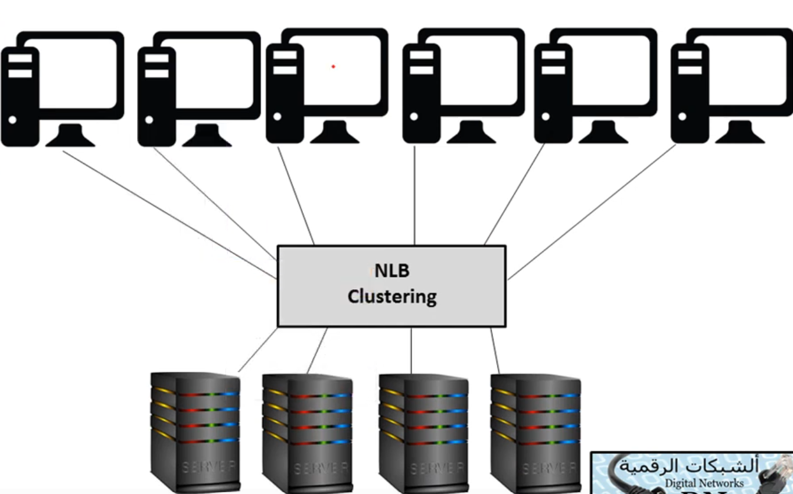
 
<em>شكل: موزّع الأحمال (NLB Clustering) واقف بين المستخدمين ومجموعة سيرفرات متطابقة</em>

<h3 dir="rtl" align="right" id="load-balancing-levels">20.2 توزيع الحمل على مستوى المسارات والسيرفرات والراوترات</h3>

<ul dir="rtl">
<li><strong>على مستوى السيرفرات:</strong> الشكل الأشيع — عدة سيرفرات ويب أو تطبيقات متطابقة، وموزّع الأحمال بيقرر يوجّه كل طلب جديد لأي سيرفر بناءً على خوارزمية معينة (Round Robin، أقل عدد اتصالات نشطة، أو حسب حمل المعالج الفعلي).</li>
<li><strong>على مستوى المسارات (الروابط):</strong> توزيع حركة البيانات على أكتر من رابط اتصال متاح بين نفس النقطتين بدل الاعتماد على رابط واحد بس (زي مفهوم Redundant Circuits الموضّح في الموضوع 20) — بيزود عرض النطاق الترددي الكلي المتاح وبيوفر تكرارية لو رابط واحد فشل.</li>
<li><strong>على مستوى الراوترات:</strong> بروتوكولات زي <strong>HSRP</strong> (Hot Standby Router Protocol) أو <strong>VRRP</strong> (Virtual Router Redundancy Protocol) بتسمح لأكتر من راوتر فيزيائي يشتركوا في تمثيل "بوابة افتراضية واحدة" (Virtual IP) للأجهزة في الشبكة المحلية — لو الراوتر النشط فشل، راوتر احتياطي ياخد مكانه فوراً وبشكل شفاف تماماً من منظور الأجهزة المتصلة، من غير ما تحتاج تغيّر إعداد البوابة عندها خالص.</li>
</ul>

<h3 dir="rtl" align="right" id="load-balancers-algorithms">20.3 أجهزة توزيع الحمل (Load Balancers) وخوارزميات التوزيع (Round Robin, Least Connections)</h3>

<strong>Load Balancer</strong> هو الجهاز أو البرنامج الواقف قدام مجموعة السيرفرات (الصورة في 20.1). بيستقبل الطلبات على عنوان واحد افتراضي (<strong>Virtual IP – VIP</strong>) ويوزّعها على السيرفرات الفعلية في مجموعة اسمها <strong>Server Pool / Backend</strong>. أشكاله:

<ul dir="rtl">
<li><strong>Hardware Load Balancer:</strong> جهاز متخصص عالي الأداء (زي F5 BIG-IP وCitrix ADC).</li>
<li><strong>Software Load Balancer:</strong> برنامج على سيرفر عادي (زي HAProxy وNGINX).</li>
<li><strong>Cloud Load Balancer:</strong> خدمة جاهزة من مزوّد السحابة (زي AWS Elastic Load Balancing).</li>
</ul>

وبيشتغل على مستويين مختلفين: <strong>Layer 4</strong> (يوزّع على أساس عنوان IP والمنفذ، أسرع وأبسط) أو <strong>Layer 7</strong> (يفهم محتوى التطبيق مثل HTTP، فيقدر يوجّه حسب الـ URL أو الـ Cookies). ومن وظائفه المهمة:

<ul dir="rtl">
<li><strong>Health Checks:</strong> فحص دوري لكل سيرفر، وأي سيرفر مش بيرد بيتشال من التوزيع تلقائياً.</li>
<li><strong>Session Persistence (Sticky Sessions):</strong> توجيه نفس المستخدم لنفس السيرفر طول جلسته لو التطبيق محتاج كده.</li>
<li><strong>SSL/TLS Offloading:</strong> فك التشفير على الـ Load Balancer نفسه لتخفيف الحمل عن السيرفرات.</li>
</ul>

<strong>خوارزميات التوزيع الأشهر:</strong>

<table>
<tr><th align="center">الخوارزمية</th><th align="center">طريقة العمل</th><th align="center">مناسبة لـ</th></tr>
<tr><td align="center"><strong>Round Robin</strong></td><td align="center">بيوزّع الطلبات بالدور: سيرفر 1 ثم 2 ثم 3 ثم يرجع للأول</td><td align="center">سيرفرات متطابقة في القدرة وطلبات متشابهة</td></tr>
<tr><td align="center"><strong>Weighted Round Robin</strong></td><td align="center">نفس الدور لكن السيرفر الأقوى بياخد نصيب أكبر حسب "وزنه"</td><td align="center">سيرفرات بقدرات مختلفة</td></tr>
<tr><td align="center"><strong>Least Connections</strong></td><td align="center">الطلب الجديد يروح للسيرفر اللي عنده أقل عدد اتصالات نشطة حالياً</td><td align="center">جلسات طويلة أو طلبات متفاوتة في الحجم</td></tr>
<tr><td align="center"><strong>Least Response Time</strong></td><td align="center">الطلب يروح للسيرفر الأسرع استجابة</td><td align="center">التطبيقات الحساسة لزمن الاستجابة</td></tr>
<tr><td align="center"><strong>IP Hash (Source IP)</strong></td><td align="center">عنوان IP العميل بيتحول لقيمة تحدد السيرفر، فنفس العميل يروح لنفس السيرفر</td><td align="center">لما نحتاج ثبات الجلسة بدون Cookies</td></tr>
</table>

<strong>نقطة مهمة:</strong> الـ Load Balancer نفسه ممكن يتحول لنقطة فشل واحدة (Single Point of Failure)، فعادةً بيتركّب <strong>زوج منه (Active/Standby)</strong> بتبديل تلقائي، باستخدام نفس فكرة بروتوكولات الـ FHRP اللي في القسم التالي.

<h3 dir="rtl" align="right" id="fhrp">20.4 بروتوكولات توفير المسارات البديلة (FHRP مثل HSRP و VRRP)</h3>

<strong>FHRP (First Hop Redundancy Protocols)</strong> بتحل مشكلة إن الأجهزة في الشبكة المحلية معمول لها Default Gateway واحد بس — لو الراوتر ده وقع، الشبكة كلها تفقد الخروج حتى لو فيه راوتر تاني جاهز. الحل: راوترين أو أكتر بيشتركوا في <strong>عنوان IP افتراضي (Virtual IP)</strong> و<strong>عنوان MAC افتراضي</strong>، والأجهزة بتتظبط على الـ Virtual IP كبوابة. لو الراوتر النشط فشل، الاحتياطي ياخد الدور فوراً من غير ما أي جهاز يغيّر أي إعداد (تفصيل أكتر لفكرة 20.2).

<table>
<tr><th align="center">وجه المقارنة</th><th align="center">HSRP</th><th align="center">VRRP</th><th align="center">GLBP</th></tr>
<tr><td align="center">الاسم الكامل</td><td align="center">Hot Standby Router Protocol</td><td align="center">Virtual Router Redundancy Protocol</td><td align="center">Gateway Load Balancing Protocol</td></tr>
<tr><td align="center">المعيار</td><td align="center">خاص بسيسكو</td><td align="center">معيار مفتوح (IETF)</td><td align="center">خاص بسيسكو</td></tr>
<tr><td align="center">الأدوار</td><td align="center">Active / Standby</td><td align="center">Master / Backup</td><td align="center">AVG (Active Virtual Gateway) + عدة AVF</td></tr>
<tr><td align="center">توزيع الحمل</td><td align="center">لا — راوتر واحد بس نشط لكل مجموعة</td><td align="center">لا — راوتر واحد بس Master لكل مجموعة</td><td align="center"><strong>نعم</strong> — كل الراوترات تشارك في تمرير الحركة</td></tr>
<tr><td align="center">الأولوية الافتراضية</td><td align="center">100 (الأعلى يفوز)</td><td align="center">100 (الأعلى يفوز)</td><td align="center">100</td></tr>
<tr><td align="center">Preempt (استرجاع الدور)</td><td align="center">معطّل افتراضياً</td><td align="center">مفعّل افتراضياً</td><td align="center">معطّل افتراضياً للـ AVG</td></tr>
<tr><td align="center">الرسائل الدورية</td><td align="center">Hello كل 3 ثواني (Hold 10 ثواني)</td><td align="center">Advertisement كل 1 ثانية</td><td align="center">Hello كل 3 ثواني</td></tr>
</table>

وجود <strong>CARP</strong> (الموضّح في 24.7) كبديل مفتوح المصدر لنفس الفكرة بيكمّل الصورة: HSRP وGLBP لسيسكو، VRRP وCARP بدائل مفتوحة. ومن أسئلة الامتحان المتكررة: <em>HSRP وVRRP = تكرارية للبوابة (Failover)، أما GLBP فبيجمع التكرارية مع توزيع الحمل.</em>

<strong>نمطا التكرارية:</strong>

<table>
<tr><th align="center">النمط</th><th align="center">الفكرة</th><th align="center">المميزات والعيوب</th></tr>
<tr><td align="center"><strong>Active / Passive (Active / Standby)</strong></td><td align="center">جهاز واحد بيشتغل والتاني احتياطي مستني</td><td align="center">أبسط في الإعداد، لكن موارد الاحتياطي معطّلة</td></tr>
<tr><td align="center"><strong>Active / Active</strong></td><td align="center">كل الأجهزة بتشتغل وبتتشارك الحمل</td><td align="center">استغلال أمثل للموارد، لكن لازم كل جهاز يقدر لوحده يشيل الحمل الكامل لو التاني وقع</td></tr>
</table>

---

<h2 dir="rtl" align="right" id="policies-procedures">21. السياسات والإجراءات واللوائح</h2>

إدارة الشبكة مش بس تقنية — جزء كبير منها إداري وقانوني. القسم ده بيغطي الإطار المؤسسي اللي بيحكم كل قرار تقني.

<h3 dir="rtl" align="right" id="policies-list">21.1 السياسات (Policies)</h3>

<ul dir="rtl">
<li><strong>Privileged User Agreement (اتفاقية المستخدم المتميز):</strong> وثيقة رسمية بيوقّعها أي موظف عنده صلاحيات إدارية عالية (زي مدير نظام أو شبكة)، بتوضح مسؤولياته الإضافية والقيود المفروضة على استخدام صلاحياته دي.</li>
<li><strong>Password Policy (سياسة كلمات المرور):</strong> القواعد الرسمية لتعقيد وطول ودورية تغيير كلمات المرور — راجع مبادئها في الموضوع 18.</li>
<li><strong>On-boarding/Off-boarding Procedures (إجراءات التعيين وإنهاء الخدمة):</strong> خطوات موحّدة لإنشاء (أو حذف فوري) حسابات وصلاحيات الموظف عند التحاقه بالعمل أو تركه — التأخير في إجراءات Off-boarding من أشهر الثغرات الأمنية الحقيقية في المؤسسات.</li>
<li><strong>Licensing Restrictions / International Export Controls:</strong> تذكير سريع (اتشرحوا بالتفصيل في الموضوع 18).</li>
<li><strong>Data Loss Prevention – DLP (منع فقدان البيانات):</strong> سياسات وأدوات تقنية بتمنع تسريب البيانات الحساسة خارج المؤسسة (عبر البريد، أجهزة USB، أو رفعها لخدمات سحابية غير مصرح بها).</li>
<li><strong>Remote Access Policies (سياسات الوصول عن بعد):</strong> القواعد الحاكمة لاتصال الموظفين بشبكة المؤسسة من خارجها (عبر VPN غالباً)، وبتحدد مين مسموح له، وبأي أجهزة، وتحت أي شروط أمنية.</li>
<li><strong>Incident Response Policies:</strong> تذكير سريع (اتشرحت بالتفصيل في الموضوع 18).</li>
<li><strong>BYOD (Bring Your Own Device):</strong> سياسة تحدد شروط استخدام الموظفين لأجهزتهم الشخصية (موبايل، لابتوب) للوصول لموارد الشركة، وبتوازن بين مرونة الموظف ومخاطر أمنية إضافية (جهاز غير مُدار بالكامل من الشركة).</li>
<li><strong>AUP (Acceptable Use Policy – سياسة الاستخدام المقبول):</strong> توضح بالتفصيل الاستخدامات المسموحة والممنوعة لموارد الشبكة والإنترنت التابعة للمؤسسة.</li>
<li><strong>NDA (Non-Disclosure Agreement – اتفاقية عدم الإفصاح):</strong> عقد قانوني بيلزم الموظف أو المتعاقد بعدم الإفصاح عن معلومات سرية خاصة بالمؤسسة، حتى بعد انتهاء علاقته بيها.</li>
<li><strong>System Life Cycle:</strong> تذكير سريع (اتشرح بالتفصيل في الموضوع 18)، شاملاً Asset Disposal (التخلص السليم من الأصول).</li>
</ul>

<h3 dir="rtl" align="right" id="procedures-list">21.2 الإجراءات (Procedures)</h3>

الإجراءات هي "التطبيق العملي" للسياسات — خطوات محددة ومفصّلة خطوة بخطوة لتنفيذ سياسة معينة عملياً (زي الخطوات الفنية بالتفصيل لإنشاء حساب مستخدم جديد ضمن سياسة On-boarding). الفرق الجوهري: السياسة بتقول "إيه المطلوب"، والإجراء بيقول "إزاي بالضبط يتم تنفيذه".

<h3 dir="rtl" align="right" id="business-documents">21.3 المستندات القياسية للأعمال (Standard Business Documents)</h3>

<ul dir="rtl">
<li><strong>SLA (Service Level Agreement):</strong> تذكير سريع (اتشرح في الموضوع 19) — التزام رسمي بمستوى خدمة محدد بالأرقام.</li>
<li><strong>MOU (Memorandum of Understanding):</strong> مذكرة تفاهم غير ملزمة قانونياً بشكل كامل، بتوثق اتفاق عام بين طرفين على التعاون في مجال معين.</li>
<li><strong>MSA (Master Service Agreement):</strong> عقد إطاري شامل بيحدد الشروط العامة اللي هتحكم كل التعاملات المستقبلية بين طرفين، بحيث مفيش داعي يتفاوضوا من الصفر في كل مرة.</li>
</ul>

<h3 dir="rtl" align="right" id="regulations">21.4 اللوائح التنظيمية (Regulations)</h3>

معايير قانونية أو صناعية إلزامية بتفرضها جهات خارجية (حكومية أو صناعية) على المؤسسة، وعدم الالتزام بيها بيعرّض المؤسسة لعقوبات قانونية أو مالية — زي معايير حماية بيانات معينة حسب طبيعة الصناعة (المالية، الصحية، إلخ) أو حسب الدولة اللي بتعمل فيها المؤسسة.

---

<h2 dir="rtl" align="right" id="safety-practices">22. إجراءات السلامة (Safety Practices)</h2>

<h3 dir="rtl" align="right" id="electrical-safety">22.1 السلامة الكهربائية (Electrical Safety)</h3>

إجراءات لحماية الأفراد من مخاطر الصعق الكهربائي عند التعامل مع معدات الشبكة، والحماية من الحرائق الناتجة عن مشاكل كهربائية — زي استخدام مقابس مؤرَّضة (Grounded) بشكل صحيح، وعدم تحميل دوائر كهربائية زيادة عن طاقتها.

<h3 dir="rtl" align="right" id="installation-safety">22.2 سلامة التركيب (Installation Safety)</h3>

ممارسات آمنة أثناء تركيب المعدات والكابلات نفسها — زي تجنّب مد كابلات عبر أرضية مفتوحة (خطر تعثّر وتلف الكابل، زي ما اتشرح في الموضوع 22)، والالتزام بأقصى نصف قطر انحناء (Bend Radius) مسموح لكابلات الألياف الضوئية.

<h3 dir="rtl" align="right" id="emergency-procedures">22.3 إجراءات الطوارئ (Emergency Procedures)</h3>

خطط واضحة وموثّقة للتصرف في حالات الطوارئ (حريق، زلزال، انقطاع كهرباء طويل) — تشمل مسارات إخلاء واضحة، ومواقع أزرار قطع الطاقة الفورية (EPO – Emergency Power Off) في غرف السيرفرات.

<h3 dir="rtl" align="right" id="hvac">22.4 التحكم بالحرارة والتهوية (HVAC)</h3>

أنظمة التكييف والتهوية (Heating, Ventilation, and Air Conditioning) ضرورية جداً لغرف السيرفرات — المعدات بتولّد حرارة كبيرة، والحرارة الزايدة أو الرطوبة غير المضبوطة بتقلل عمر المعدات وبتزود احتمالية الأعطال بشكل كبير (راجع الظروف الفيزيائية في الموضوع 22).

<h3 dir="rtl" align="right" id="esd-fire">22.5 الحماية من التفريغ الكهروستاتيكي (ESD) ومكافحة الحرائق ومعدات الوقاية</h3>

<ul dir="rtl">
<li><strong>ESD (Electrostatic Discharge):</strong> الكهرباء الساكنة ممكن تتلف مكونات إلكترونية حساسة من غير ما تحس. الوقاية: سوار الحماية (Anti-static Wrist Strap) متوصّل بنقطة تأريض، سجاد مضاد للاستاتيك، وتخزين المكونات في أكياس مضادة للاستاتيك.</li>
<li><strong>مكافحة الحرائق في غرف السيرفرات:</strong> الماء بيتلف المعدات الكهربائية، فبتفضّل أنظمة <strong>الغازات النظيفة (Clean Agent)</strong> زي FM-200 والغازات الخاملة اللي بتطفي النار من غير ما تسيب بقايا، وبتُستخدم طفايات مخصصة للحرائق الكهربائية. وفي حالة الرش المائي بيُستخدم نظام <strong>Pre-action</strong> اللي بيحتاج حدثين (حساس دخان + سخونة) قبل ما يطلّق الماء.</li>
<li><strong>PPE (معدات الوقاية الشخصية):</strong> نظارات واقية وقفازات وأحذية سلامة حسب المهمة.</li>
<li><strong>SDS (Safety Data Sheet):</strong> ورقة بيانات السلامة الخاصة بأي مادة كيميائية أو بطارية، بتوضح مخاطرها وطريقة التعامل معاها والتخلص منها.</li>
<li><strong>Lockout/Tagout:</strong> قفل وتعليم مصدر الطاقة قبل الصيانة عشان محدش يشغّله بالغلط أثناء الشغل.</li>
<li><strong>الرفع الآمن:</strong> معدات الـ Rack تقيلة، فبترفع بثني الركبتين وبمساعدة شخص تاني أو رافعة لو لزم.</li>
</ul>

---

<h2 dir="rtl" align="right" id="network-segmentation">23. تجزئة الشبكة (Network Segmentation)</h2>

<h3 dir="rtl" align="right" id="medianets">23.1 Medianets</h3>

شبكات مُصمَّمة ومُهيَّأة خصيصاً لنقل وسائط الاتصال الحساسة (صوت وفيديو) بأفضل جودة ممكنة، غالباً بتطبيق QoS بشكل مكثّف ومخصص لهذا النوع من الحركة تحديداً.

<h3 dir="rtl" align="right" id="vtc">23.2 مؤتمرات الفيديو (VTC – Video Teleconferencing)</h3>

أنظمة الاتصال المرئي بين مواقع متعددة — بتحتاج عرض نطاق ترددي عالي وثابت وحساسية شديدة لكل من الـ Latency والـ Jitter (الموضّحين في القسم 14/15)، وده بيخليها من أكبر المستفيدين من تطبيق QoS بشكل صحيح.

<h3 dir="rtl" align="right" id="legacy-systems">23.3 الأنظمة القديمة (Legacy Systems)</h3>

أجهزة أو أنظمة قديمة لسه شغالة في الشبكة لكنها مش بتدعم معايير أو بروتوكولات حديثة (زي أجهزة مش بتدعم تشفير حديث). أفضل ممارسة أمنية: عزل الأنظمة دي في شبكة فرعية منفصلة (VLAN مخصص) عشان تقلل خطرها على باقي الشبكة الحديثة.

<h3 dir="rtl" align="right" id="public-private-separation">23.4 فصل الشبكات الخاصة عن العامة</h3>

مبدأ أساسي في تصميم الشبكة — فصل الشبكة الداخلية الخاصة (اللي فيها بيانات وأنظمة حساسة) تماماً عن أي شبكة عامة أو متاحة للزوار (Guest Wi-Fi مثلاً)، بحيث اختراق واحدة ميديش وصول مباشر للتانية. نفس المبدأ اللي عليه مبنية فكرة الـ DMZ (الموضّحة بالتفصيل في الموضوع 19).

<h3 dir="rtl" align="right" id="honeypot-topic23">23.5 Honeypot / Honeynet</h3>

تذكير سريع (اتشرحت بالتفصيل الكامل في الموضوع 19، شاملة Hardware مقابل Software Honeypot وDecoys وDNS Sinkholes) — أنظمة وهمية مصممة لجذب المهاجمين ودراسة أساليبهم بمعزل عن الأصول الحقيقية.

<h3 dir="rtl" align="right" id="testing-lab">23.6 بيئة الاختبار (Testing Lab)</h3>

شبكة فرعية معزولة تماماً عن بيئة الإنتاج (Production)، مخصصة لتجربة تحديثات أو إعدادات جديدة قبل تطبيقها فعلياً على الشبكة الحقيقية — بتقلل جذرياً من مخاطر إن تغيير جديد يسبب مشكلة غير متوقعة في بيئة العمل الفعلية.

<h3 dir="rtl" align="right" id="compliance">23.7 الامتثال (Compliance)</h3>

التأكد من إن تصميم وتجزئة الشبكة متوافقين مع اللوائح التنظيمية المطلوبة (الموضّحة في القسم 21.4) — أحياناً التجزئة نفسها بتكون شرط إلزامي قانوني (زي عزل بيانات مالية حساسة في شبكة فرعية منفصلة تماماً).

---

<h2 dir="rtl" align="right" id="optimization-additions">24. إضافات تحسين الأداء</h2>

<h3 dir="rtl" align="right" id="unified-communications">24.1 الاتصالات الموحدة (Unified Communications – UC)</h3>

دمج خدمات الاتصال الفوري (زي الرسائل الفورية) مع خدمات غير فورية (زي البريد الصوتي والفاكس) في منظومة واحدة متكاملة، بحيث الشخص يقدر يستقبل نفس الرسالة عبر وسيط مختلف عن اللي أُرسلت بيه. بتتكوّن من: <strong>UC Servers</strong> (قلب النظام، بيدير التحكم بالمكالمات)، <strong>UC Devices</strong> (نقاط النهاية زي الكمبيوترات والهواتف الذكية)، و <strong>UC Gateways</strong> (بتربط الشبكة القائمة على IP بشبكة الهاتف التقليدية PSTN).

<h3 dir="rtl" align="right" id="traffic-shaping">24.2 تشكيل الحركة وتحديدها (Traffic Shaping vs Traffic Policing)</h3>

تقنية تحسين أخرى — بتأخّر عمداً حزم معينة (بتخزينها مؤقتاً في طابور FIFO) بتستوفي شروط معينة، عشان تضمن عرض نطاق ترددي كافٍ لحركة تانية أهم. بتستخدم مبدأ "عقد حركة" (Traffic Contract) بيحدد أي حزم مسموح لها تعدي ومتى — بتُطبَّق غالباً على الاتجاه الخارج من الواجهة (Egress) عند حافة الشبكة.

<h4 dir="rtl" align="right" id="traffic-shaping-details">24.2.1 تفاصيل Traffic Shaping (التنعيم والاحتفاظ في الطابور Buffer)</h4>

الـ Shaping بيحوّل الحركة المتقطعة المندفعة (Bursty) لتدفق أنعم وثابت حسب سرعة متفق عليها. لما الحركة تتجاوز المعدل المسموح، الجهاز <strong>مش بيرمي الحزم الزيادة</strong> — بيحطها في <strong>طابور (Buffer)</strong> وبيطلّعها بعدين بالمعدل المسموح. بيتحكم في المعدل عادةً بآلية <strong>Token Bucket</strong>: "دلو" بيتملي بعلامات (Tokens) بمعدل ثابت (CIR)، وكل حزمة محتاجة علامات بحجمها عشان تعدّي، فلو العلامات خلصت الحزمة تستنى لحد ما تتجدد. وبيتطبق غالباً على الاتجاه الخارج (Egress) من الواجهة. نتيجته: <strong>لا فقدان حزم تقريباً، لكن بيزيد التأخير والتذبذب</strong>، وبيحتاج ذاكرة للطوابير.

<h4 dir="rtl" align="right" id="traffic-policing">24.2.2 تقنية Traffic Policing (تحديد السرعة وإسقاط الحزم الزائدة Drop)</h4>

الـ Policing بيقيس معدل الحركة ويقارنه بالحد المسموح (CIR) <strong>من غير أي Buffer</strong>. كل حزمة بتتصنّف لحظياً: <strong>Conform</strong> (ضمن الحد) فتعدّي، أو <strong>Exceed</strong> (تجاوزت الحد) فتتعامل معاها السياسة بإحدى طريقتين: <strong>إسقاط (Drop)</strong> أو <strong>إعادة وسم (Re-mark)</strong> بأولوية أقل (مثلاً تخفيض قيمة DSCP). ممكن يتطبق على الاتجاه الداخل أو الخارج. مناسب لمقدمي الخدمة اللي بيفرضوا حد السرعة اللي العميل دفع تمنه. نتيجته: <strong>مفيش تأخير إضافي، لكن الحزم الزيادة بتضيع</strong>، وده بيخلّي TCP يقلّل سرعته ويعيد الإرسال فيحصل تذبذب في الأداء.

<h4 dir="rtl" align="right" id="shaping-vs-policing">24.2.3 مقارنة Traffic Shaping مقابل Traffic Policing</h4>

<table>
<tr><th align="center">وجه المقارنة</th><th align="center">Traffic Shaping</th><th align="center">Traffic Policing</th></tr>
<tr><td align="center">التعامل مع الحزم الزيادة</td><td align="center">تتخزن في Buffer وتتبعت لاحقاً</td><td align="center">تتسقط (Drop) أو يُعاد وسمها (Re-mark)</td></tr>
<tr><td align="center">استخدام الـ Buffer</td><td align="center">نعم</td><td align="center">لا</td></tr>
<tr><td align="center">تأثير على التأخير والتذبذب</td><td align="center">بيزودهم</td><td align="center">مفيش تأخير إضافي</td></tr>
<tr><td align="center">فقدان الحزم</td><td align="center">قليل جداً (لحد امتلاء الـ Buffer)</td><td align="center">وارد عند تجاوز الحد</td></tr>
<tr><td align="center">الاتجاه</td><td align="center">غالباً Egress (خارج من الواجهة)</td><td align="center">Ingress أو Egress</td></tr>
<tr><td align="center">تأثيره على TCP</td><td align="center">أنعم — بيحافظ على تدفق مستقر</td><td align="center">بيسبب إعادة إرسال وتذبذب في السرعة</td></tr>
<tr><td align="center">استهلاك الموارد</td><td align="center">ذاكرة أكتر للطوابير</td><td align="center">أخف على الجهاز</td></tr>
<tr><td align="center">الاستخدام النموذجي</td><td align="center">عميل بينعّم حركته قبل الخروج لمزوّد الخدمة</td><td align="center">مزوّد الخدمة بيفرض الحد المتعاقد عليه</td></tr>
</table>

<strong>للتذكر:</strong> <em>Shaping = Buffer / تأخير. Policing = Drop / قطع.</em> وعملياً الاتنين بيشتغلوا مع بعض: العميل بيعمل Shaping بنفس السرعة المتعاقد عليها عشان ما يتعرضش لـ Policing من المزوّد.

<h3 dir="rtl" align="right" id="caching-engines">24.3 محركات التخزين المؤقت (Caching Engines) وسيرفرات Proxy وشبكات CDN</h3>

أجهزة أو برامج بتحتفظ بنسخة محلية من محتوى كثير الطلب (صفحات ويب، ملفات) قريبة من المستخدمين، بدل ما كل طلب يروح لمصدره الأصلي البعيد في كل مرة — بيقلل استهلاك النطاق الترددي بشكل كبير للمحتوى المتكرر، وبيسرّع زمن الاستجابة للمستخدم.

<h4 dir="rtl" align="right" id="proxy-web-caching">24.3.1 سيرفرات الـ Proxy والـ Web Caching</h4>

<strong>Proxy Server</strong> هو سيرفر وسيط بين المستخدمين والمصدر. الأنواع الأشهر:

<ul dir="rtl">
<li><strong>Forward Proxy:</strong> واقف قدام المستخدمين، وبيطلب الإنترنت نيابةً عنهم — بيستخدم للتحكم في الوصول وفلترة المحتوى وإخفاء هوية الداخلين وتخزين المحتوى مؤقتاً.</li>
<li><strong>Reverse Proxy:</strong> واقف قدام السيرفرات، وبيستقبل طلبات الإنترنت نيابةً عنها — بيستخدم لتوزيع الحمل وتخفيف التشفير (SSL Offload) وحماية السيرفرات وتخزين المحتوى مؤقتاً.</li>
</ul>

<strong>Web Caching:</strong> الـ Proxy بيحتفظ بنسخة من المحتوى المطلوب بكثرة (صور، CSS، JavaScript، صفحات ثابتة). الطلب الأول بيروح للموقع الأصلي (<strong>Cache Miss</strong>)، والطلبات التالية بتتلبّى من النسخة المخزّنة محلياً (<strong>Cache Hit</strong>) بسرعة أكبر واستهلاك نطاق أقل. نسبة النجاح = <strong>Cache Hit Ratio</strong>. ومدة صلاحية النسخة بتتحدد بـ <strong>TTL</strong> وترويسات HTTP زي <code>Cache-Control</code>، وبعد ما تنتهي بيتحقق السيرفر هل المحتوى اتغيّر أو لأ. أمثلة: Squid وVarnish وNGINX.

<strong>عيوبه:</strong> ممكن يعرض محتوى قديم (Stale)، ولا يصلح للمحتوى الديناميكي الشخصي، وتخزين صفحات حساسة في الـ Cache لازم يتحكم فيه.

<h4 dir="rtl" align="right" id="cdn">24.3.2 شبكات توزيع المحتوى (CDN - Content Delivery Network)</h4>

<strong>CDN</strong> هي شبكة سيرفرات موزعة جغرافياً حول العالم (<strong>Edge Servers / PoPs – Points of Presence</strong>) بتخزّن نسخ من محتوى الموقع وتقدمها للمستخدم من <strong>أقرب نقطة جغرافياً ليه</strong> بدل ما كل الطلبات تروح لسيرفر المصدر الأصلي (<strong>Origin Server</strong>) البعيد. توجيه المستخدم لأقرب نقطة بيتم عبر DNS ذكي (GeoDNS) أو تقنية Anycast. وبيتم تحميل المحتوى للـ Edge إما بشكل Pull (عند أول طلب) أو Push (رفع مسبق).

<ul dir="rtl">
<li><strong>تقليل Latency:</strong> المسافة أقصر، فـ Propagation Delay (القسم 14.4) بيقل بشكل واضح.</li>
<li><strong>تخفيف الحمل:</strong> سيرفر المصدر والنطاق الترددي بتاعه بيتوفروا.</li>
<li><strong>التوفر العالي:</strong> لو نقطة وقعت، الطلبات بتتحول لأقرب نقطة تانية.</li>
<li><strong>الحماية:</strong> بتمتص جزء كبير من هجمات DDoS لأن الحركة بتتوزع على عدد ضخم من النقاط.</li>
</ul>

أشهر مزودي الـ CDN: Cloudflare وAkamai وAmazon CloudFront وFastly.

<table>
<tr><th align="center">وجه المقارنة</th><th align="center">Proxy Cache المحلي</th><th align="center">CDN</th></tr>
<tr><td align="center">مكان التركيب</td><td align="center">داخل شبكة المؤسسة (أو قدام السيرفر)</td><td align="center">نقاط موزعة عالمياً قريبة من المستخدمين</td></tr>
<tr><td align="center">المستفيد الأساسي</td><td align="center">مستخدمو المؤسسة</td><td align="center">زوار الموقع في أي مكان</td></tr>
<tr><td align="center">من يديره</td><td align="center">المؤسسة نفسها</td><td align="center">مزوّد خدمة CDN (غالباً طرف ثالث)</td></tr>
<tr><td align="center">الهدف</td><td align="center">توفير نطاق الإنترنت وتسريع التصفح الداخلي</td><td align="center">تسريع وتوفير وحماية المحتوى المنشور للعالم</td></tr>
</table>

<h3 dir="rtl" align="right" id="ha-topic23">24.4 التوافرية العالية (High Availability)</h3>

تذكير سريع — تصميم بيضمن استمرار الخدمة شغالة بأقل قدر ممكن من التوقف، غالباً بالجمع بين التكرارية (Redundancy) والتبديل التلقائي عند العطل (Failover)، ومرتبطة مباشرة بمفاهيم Load Balancing وClustering الموضّحة في القسم 20.

<strong>مصطلحات مرتبطة بالتوفر والتعافي:</strong>

<table>
<tr><th align="center">المصطلح</th><th align="center">المعنى</th></tr>
<tr><td align="center"><strong>RTO (Recovery Time Objective)</strong></td><td align="center">أقصى وقت مقبول لرجوع الخدمة بعد العطل</td></tr>
<tr><td align="center"><strong>RPO (Recovery Point Objective)</strong></td><td align="center">أقصى كمية بيانات (محسوبة بالزمن) مقبول فقدانها — بتحدد دورية النسخ الاحتياطي</td></tr>
<tr><td align="center"><strong>MTBF / MTTR</strong></td><td align="center">متوسط الوقت بين الأعطال / متوسط وقت الإصلاح (راجع القسم 10.3)</td></tr>
<tr><td align="center"><strong>Hot Site</strong></td><td align="center">موقع بديل مجهّز بالكامل وشغال، بيتحول له فوراً</td></tr>
<tr><td align="center"><strong>Warm Site</strong></td><td align="center">موقع بديل فيه المعدات لكن البيانات والإعدادات محتاجة وقت للتحديث</td></tr>
<tr><td align="center"><strong>Cold Site</strong></td><td align="center">مساحة فاضية بالبنية الأساسية فقط (كهرباء وتبريد) — أرخص وأبطأ في التعافي</td></tr>
</table>

<h3 dir="rtl" align="right" id="ft-topic23">24.5 تحمّل الأعطال (Fault Tolerance)</h3>

تذكير سريع (اتشرح كمفهوم في المواضيع السابقة) — قدرة النظام على الاستمرار في العمل حتى لو فشل أحد مكوناته، عادةً عبر مكونات احتياطية (زي NIC Teaming الموضّح في الموضوع 22، أو Dual Power Supplies الموضّحة في الموضوع 19).

<h3 dir="rtl" align="right" id="backups-topic23">24.6 النسخ الاحتياطي (Archives/Backups)</h3>

تذكير سريع (اتشرحت أنواعه الثلاثة بالتفصيل الكامل في الموضوع 19: Full, Differential, Incremental).

<h3 dir="rtl" align="right" id="carp">24.7 بروتوكول CARP (Common Address Redundancy Protocol)</h3>

بروتوكول مفتوح المصدر (بديل غير مسجّل ملكية لبروتوكولات زي HSRP وVRRP الموضّحة في القسم 20.2) بيسمح لمجموعة من الأجهزة (غالباً فايروولات أو راوترات) تشترك في عنوان IP واحد (Virtual IP)، بحيث لو الجهاز النشط فشل، جهاز تاني في المجموعة ياخد مكانه فوراً بشكل شفاف تماماً.

---

<h2 dir="rtl" align="right" id="virtual-networking">25. الشبكات الافتراضية (Virtual Networking)</h2>

فكرة الافتراضية بسيطة: بدل تخصيص جهاز فيزيائي منفصل لكل سيرفر، بتشغّل عدة نسخ من نظام التشغيل، كل واحدة في "بيئة افتراضية" مستقلة، على نفس القطعة الفيزيائية الواحدة — ده بيوفر في الطاقة، وبيعظّم استغلال موارد المعالج والذاكرة.

<h3 dir="rtl" align="right" id="hypervisor">25.1 الـ Hypervisor</h3>

البرنامج المسؤول عن إدارة توزيع موارد الجهاز الفيزيائي (Host) على كل الأجهزة الافتراضية (VMs) الشغالة فوقه. نوعان أساسيان:

<ul dir="rtl">
<li><strong>Type I (Native / Bare Metal):</strong> بيشتغل مباشرة فوق هاردوير الجهاز المضيف بدون نظام تشغيل وسيط — أمثلة: VMware vSphere و Microsoft Hyper-V. أداء أعلى، وشائع في بيئات السيرفرات والإنتاج.</li>
<li><strong>Type II (Hosted):</strong> بيشتغل فوق نظام تشغيل عادي موجود بالفعل على الجهاز — أمثلة: VMware Workstation و VirtualBox. أسهل في الإعداد، وشائع للاستخدام الشخصي والتجريبي.</li>
</ul>

<h3 dir="rtl" align="right" id="vswitch">25.2 السويتش الافتراضي (vSwitch)</h3>

نسخة برمجية من سويتش الطبقة الثانية، بتقدر تنشئ VLANs وتوصّل السيرفرات الافتراضية ببعضها، وكل ده داخل نفس الجهاز الفيزيائي الواحد. الـ <strong>Distributed Virtual Switch</strong> نوع متقدم منه بيمتد عبر عدة أجهزة Hosts فيزيائية مختلفة، وبيربط الأجهزة الافتراضية اللي في نفس العنقود (Cluster) حتى لو موزّعة على أجهزة مختلفة.

<h3 dir="rtl" align="right" id="vnic">25.3 كارت الشبكة الافتراضي (vNIC)</h3>

كل جهاز افتراضي (VM) عنده كارت شبكة افتراضي خاص بيه (vNIC) بيتصل بالسويتش الافتراضي، واللي بدوره بيتصل بكارت الشبكة الفيزيائي الحقيقي (NIC) على الجهاز المضيف. نقطة مهمة للامتحان: كارت الشبكة الفيزيائي الواحد بيقدر ينقل حركة بعناوين MAC افتراضية متعددة مختلفة في نفس الوقت، واحد لكل VM.

<h4 dir="rtl" align="right" id="vnic-modes">25.3.1 أنماط اتصال كارت الشبكة الافتراضي</h4>

<table>
<tr><th align="center">النمط</th><th align="center">كيف يتصل الجهاز الافتراضي؟</th><th align="center">الاستخدام</th></tr>
<tr><td align="center"><strong>Bridged</strong></td><td align="center">بيتصل مباشرة بالشبكة الفعلية ويحصل على عنوان IP من نفس الشبكة كأي جهاز حقيقي</td><td align="center">لما الجهاز الافتراضي لازم يكون ظاهر ومتاح على الشبكة</td></tr>
<tr><td align="center"><strong>NAT</strong></td><td align="center">بيتشارك عنوان الجهاز المضيف للخروج للإنترنت، لكن مش ظاهر من الشبكة للداخل</td><td align="center">خروج للإنترنت بأمان من غير تعريض الجهاز</td></tr>
<tr><td align="center"><strong>Host-Only</strong></td><td align="center">شبكة خاصة بين الجهاز المضيف والأجهزة الافتراضية فقط، من غير وصول للشبكة الخارجية</td><td align="center">المعامل المعزولة واختبار البرمجيات الخطرة</td></tr>
<tr><td align="center"><strong>Internal</strong></td><td align="center">شبكة بين الأجهزة الافتراضية فقط، حتى الجهاز المضيف مش جزء منها</td><td align="center">عزل كامل بين أجهزة افتراضية</td></tr>
</table>

<h3 dir="rtl" align="right" id="vrouter">25.4 الراوتر الافتراضي (vRouter)</h3>

برمجية بتنفّذ وظيفة التوجيه بشكل مستقل — كل راوتر افتراضي عنده جدول توجيه خاص بيه منفصل عن باقي الراوترات الافتراضية التانية على نفس الجهاز المضيف.

<h3 dir="rtl" align="right" id="vfirewall">25.5 الجدار الناري الافتراضي (vFirewall)</h3>

نفس فكرة الجدار الناري الفيزيائي، لكن كبرنامج بالكامل — بيُستخدم للتحكم في الحركة بين الشبكات الفرعية الافتراضية اللي أنشأها الـ vRouter.

<h3 dir="rtl" align="right" id="sdn">25.6 الشبكات مُعرَّفة البرمجيات (SDN – Software-Defined Networking)</h3>

منهج حديث بيفصل بين <strong>طبقة التحكم (Control Plane)</strong> — اللي بتقرر إزاي تتوجه الحركة — و <strong>طبقة نقل البيانات الفعلي (Data Plane)</strong> على الأجهزة نفسها، وبيخلي التحكم في الشبكة كله <strong>قابل للبرمجة مركزياً</strong> بدل ما يكون موزّع على كل جهاز بمفرده. نفس الفلسفة اللي بُنيت عليها معمارية SD-WAN الموضّحة بالتفصيل في الموضوع 20 (Control Plane مقابل Data Plane)، لكن هنا مطبّقة على مستوى الشبكة الداخلية (LAN/Data Center) بدل الـ WAN.

<h4 dir="rtl" align="right" id="sdn-architecture">25.6.1 معمارية SDN ومفهوم NFV</h4>

بتتكوّن معمارية SDN من ثلاث طبقات: <strong>Application Layer</strong> (التطبيقات اللي بتطلب خدمات من الشبكة)، <strong>Control Layer</strong> (الـ SDN Controller — العقل المركزي)، و <strong>Infrastructure Layer</strong> (الأجهزة اللي بتنقل البيانات). والتواصل بينهم عبر واجهات برمجة (APIs):

<ul dir="rtl">
<li><strong>Northbound API:</strong> بين التطبيقات والـ Controller (غالباً REST).</li>
<li><strong>Southbound API:</strong> بين الـ Controller والأجهزة، والمثال الأشهر هو <strong>OpenFlow</strong>.</li>
</ul>

أما <strong>NFV (Network Functions Virtualization)</strong> فهي فكرة مكمّلة بتحوّل وظائف الشبكة (راوتر، جدار ناري، Load Balancer) من أجهزة مخصصة إلى برامج بتشتغل على سيرفرات عادية — زي الـ vRouter والـ vFirewall في 25.4 و25.5. الفرق: SDN بتتكلم عن <em>فصل التحكم</em>، وNFV بتتكلم عن <em>تحويل الوظائف لبرامج</em>، وبيشتغلوا مع بعض كتير.

<h3 dir="rtl" align="right" id="jumbo-frame">25.7 الإطارات العملاقة (Jumbo Frame)</h3>

إطارات Ethernet بحمولة بيانات أكبر من الحد الافتراضي (1500 بايت) — ممكن توصل لأكتر من 9000 بايت. استخدامها بيقلل الحمل الإضافي (Overhead) ودورات معالجة المعالج المطلوبة لكل نفس الكمية من البيانات، لأن عدد الإطارات المطلوبة يقل بشكل كبير. مفيدة جداً في الشبكات عالية السرعة، وخصوصاً في بيئات شبكات التخزين (SAN، الموضّحة في القسم التالي) حيث بتتحسّن الأداء بشكل ملحوظ.

---

<h2 dir="rtl" align="right" id="storage-networks">26. شبكات التخزين (Storage Networks)</h2>

<h3 dir="rtl" align="right" id="san">26.1 شبكة منطقة التخزين (SAN – Storage Area Network)</h3>

شبكة عالية السعة مخصصة بالكامل لتوصيل أجهزة تخزين البيانات، ومنفصلة فيزيائياً عن شبكة LAN العادية، عبر سويتش متخصص في التخزين. الفكرة: عزل حركة التخزين الثقيلة عن حركة المستخدمين العادية، لضمان أداء عالٍ ومستقر لكليهما.

<h4 dir="rtl" align="right" id="san-terms">26.1.1 مصطلحات أساسية في SAN</h4>

<ul dir="rtl">
<li><strong>HBA (Host Bus Adapter):</strong> كارت بيركّب في السيرفر لتوصيله بشبكة الـ SAN (زي كارت الشبكة لكن للتخزين).</li>
<li><strong>LUN (Logical Unit Number):</strong> وحدة تخزين منطقية مقتطعة من مساحة التخزين الكلية، وبتظهر للسيرفر كأنها قرص محلي.</li>
<li><strong>Zoning:</strong> تقسيم الـ SAN لمجموعات منطقية بتحدد أي سيرفر يقدر يتصل بأي جهاز تخزين.</li>
<li><strong>LUN Masking:</strong> تحديد أي سيرفرات تشوف كل LUN، لمنع سيرفر من العبث ببيانات سيرفر تاني.</li>
<li><strong>Block-Level Storage:</strong> السيرفر بيتعامل مع التخزين كقرص خام وبيضيف عليه نظام الملفات الخاص بيه.</li>
</ul>

<h3 dir="rtl" align="right" id="nas">26.2 التخزين المتصل بالشبكة (NAS – Network-Attached Storage)</h3>

بديل أبسط للـ SAN — بيوفر نفس الوظيفة (تخزين مركزي مشترك) لكن أي جهاز متصل بشبكة LAN العادية يقدر يوصله ويشارك ملفات معاه مباشرة، باستخدام بروتوكولات مألوفة زي NFS وCIFS وHTTP، بدون الحاجة لبنية تحتية متخصصة منفصلة زي الـ SAN.

<table>
<tr><th align="center">المقارنة</th><th align="center">SAN</th><th align="center">NAS</th></tr>
<tr><td align="center">مستوى الوصول</td><td align="center">مستوى الكتلة (Block-Level) عبر بروتوكول Fibre Channel متخصص</td><td align="center">مستوى الملف (File-Level) عبر بروتوكولات شبكة عادية (NFS/CIFS)</td></tr>
<tr><td align="center">البنية التحتية</td><td align="center">شبكة منفصلة تماماً عن LAN</td><td align="center">تستخدم نفس شبكة LAN الموجودة</td></tr>
<tr><td align="center">التعقيد والتكلفة</td><td align="center">أعلى تعقيداً وتكلفة</td><td align="center">أبسط وأرخص في الإعداد</td></tr>
<tr><td align="center">الأداء المتخصص</td><td align="center">أعلى أداءً للأحمال الثقيلة جداً</td><td align="center">كافٍ لمعظم احتياجات مشاركة الملفات العادية</td></tr>
</table>

<h3 dir="rtl" align="right" id="iscsi">26.3 بروتوكول iSCSI</h3>

معيار بيسمح بتغليف أوامر SCSI (البروتوكول التقليدي للتخزين) داخل حزم IP عادية — وده بيسمح باستخدام نفس شبكة IP العادية لنقل حركة التخزين بدل الحاجة لبنية تحتية منفصلة تماماً زي الـ Fibre Channel. حل اقتصادي شائع جداً للحصول على مميزات SAN من غير تكلفة البنية التحتية المتخصصة الكاملة.

<h3 dir="rtl" align="right" id="fibre-channel">26.4 Fibre Channel و FCoE</h3>
<ul dir="rtl">
<li><strong>Fibre Channel (FC):</strong> تقنية شبكية عالية السرعة (بسرعات شائعة 2، 4، 8، 16 جيجابت في الثانية) مخصصة أساساً لتوصيل أجهزة تخزين البيانات، وبتشتغل عبر شبكة ضوئية منفصلة تماماً وغير متوافقة مع شبكة IP العادية.</li>
<li><strong>FCoE (Fibre Channel over Ethernet):</strong> بتغلّف حركة Fibre Channel داخل إطارات Ethernet عادية (بنفس فكرة iSCSI تقريباً، لكن مش بتستخدم IP خالص) — بتسمح بمرور حركة التخزين المتخصصة دي عبر شبكة Ethernet موجودة بالفعل.</li>
</ul>

<h3 dir="rtl" align="right" id="infiniband">26.5 معيار InfiniBand</h3>

معيار اتصال بأداء عالي جداً وزمن استجابة منخفض جداً، بيُستخدم كوصلة مباشرة أو مُبدَّلة (Switched) بين السيرفرات وأنظمة التخزين، أو بين أنظمة التخزين مع بعضها. بيستخدم معمارية "نسيج تبديل" (Switched Fabric)، ومحولاته بتقدر تتبادل معلومات عن جودة الخدمة (QoS) بينها مباشرة.

---

<h2 dir="rtl" align="right" id="cloud-computing">27. الحوسبة السحابية (Cloud Concepts)</h2>

التخزين السحابي بيضع البيانات على سيرفر مركزي، لكن على عكس مركز البيانات الداخلي التقليدي، البيانات دي متاح الوصول ليها من أي مكان وغالباً من أنواع أجهزة مختلفة جداً. الحلول السحابية عادةً بتوفر تحمّل أعطال وتخصيص موارد حوسبة ديناميكي (معالج، ذاكرة، شبكة) حسب الحاجة الفعلية.

<h3 dir="rtl" align="right" id="cloud-service-models">27.1 نماذج الخدمة السحابية (Service Models)</h3>

<table>
<tr><th align="center">النموذج</th><th align="center">ماذا يوفّر المزوّد</th><th align="center">ماذا تدير المؤسسة بنفسها</th></tr>
<tr><td align="center"><strong>IaaS (Infrastructure as a Service)</strong></td><td align="center">البنية التحتية أو مركز البيانات (الهاردوير فقط)</td><td align="center">أنظمة التشغيل والتطبيقات بالكامل</td></tr>
<tr><td align="center"><strong>PaaS (Platform as a Service)</strong></td><td align="center">البنية التحتية + نظام التشغيل والمنصة البرمجية</td><td align="center">التطبيقات نفسها بس</td></tr>
<tr><td align="center"><strong>SaaS (Software as a Service)</strong></td><td align="center">كل شيء — البنية التحتية، النظام، التطبيق كامل جاهز للاستخدام</td><td align="center">لا شيء تقريباً، فقط الاستخدام</td></tr>
</table>

<h3 dir="rtl" align="right" id="cloud-deployment-models">27.2 نماذج النشر السحابي (Deployment Models)</h3>

<ul dir="rtl">
<li><strong>Private Cloud (سحابة خاصة):</strong> مملوكة ومُدارة من مؤسسة واحدة لاستخدامها الحصري بس.</li>
<li><strong>Public Cloud (سحابة عامة):</strong> بتوفرها جهة خارجية (طرف ثالث) — بتنقل التفاصيل التقنية للمزوّد لكن بتتنازل عن جزء من التحكم، وممكن تفتح ثغرات أمنية إضافية.</li>
<li><strong>Hybrid Cloud (سحابة هجينة):</strong> مزيج بين الخاصة والعامة — مثلاً تستخدم بنية المزوّد التحتية لكن تدير بياناتك بنفسك.</li>
<li><strong>Community Cloud (سحابة مجتمعية):</strong> مملوكة ومُدارة من مجموعة مؤسسات بتشترك في هدف مشترك واحد.</li>
</ul>

<h3 dir="rtl" align="right" id="cloud-connectivity">27.3 طرق الاتصال بالسحابة (Connectivity Methods)</h3>

<ul dir="rtl">
<li><strong>VPN:</strong> الطريقة الأكثر مباشرة — زي خدمة Amazon VPC اللي بتنشئ اتصال VPN كامل بين شبكة المؤسسة بأكملها والسحابة.</li>
<li><strong>Remote Desktop (RDP):</strong> اتصال مباشر بسيرفر معين بدل الشبكة كاملة — RDP لسيرفرات Windows، وSSH (الموضّح في الموضوع 21) لسيرفرات Linux.</li>
<li><strong>FTP:</strong> مناسب لعمليات نقل البيانات بالجملة (Bulk Downloads).</li>
<li><strong>VMware Remote Console:</strong> بيسمح بتوصيل قرص DVD محلي افتراضياً للسيرفر السحابي، مفيد لرفع ملفات تثبيت أو صور ISO.</li>
</ul>

<h3 dir="rtl" align="right" id="cloud-security">27.4 الاعتبارات الأمنية للحوسبة السحابية</h3>

<ul dir="rtl">
<li>السحابة معرّضة لنفس أنواع الهجمات اللي بتتعرضلها البيئات المحلية بالضبط (زي هجمات التصيّد اللي بتستهدف موظفي المزوّد نفسه).</li>
<li>كتير من العملاء بيفشلوا يتأكدوا إن المزوّد فعلاً بيحمي بياناتهم بنفس الجدية في البيئات متعددة المستأجرين (Multi-tenant).</li>
<li>مفيش معيار عالمي موحّد بيحكم خصوصية البيانات عند كل مزودي الخدمة.</li>
<li>أمان البيانات بيختلف بشكل كبير حسب الدولة، والعميل غالباً مش عارف بياناته فعلياً فين جغرافياً في أي لحظة.</li>
</ul>

<h3 dir="rtl" align="right" id="cloud-vs-local">27.5 العلاقة بين الموارد المحلية والسحابية</h3>

<table>
<tr><th align="center">وجه المقارنة</th><th align="center">البيئة المحلية (Local)</th><th align="center">البيئة السحابية (Cloud)</th></tr>
<tr><td align="center">الاستثمار الأولي في البنية التحتية</td><td align="center">مرتفع (معدات + فريق إدارة)</td><td align="center">منخفض جداً</td></tr>
<tr><td align="center">قابلية التوسع</td><td align="center">تحتاج استثمار إضافي في كل مرة</td><td align="center">فورية وسريعة جداً</td></tr>
<tr><td align="center">نموذج التكلفة</td><td align="center">نفقات رأسمالية (CapEx)</td><td align="center">اشتراكات شهرية دورية (OpEx)</td></tr>
<tr><td align="center">مستوى التحكم</td><td align="center">تحكم كامل للمؤسسة</td><td align="center">تحكم جزئي، بعضه بيد المزوّد</td></tr>
<tr><td align="center">معرفة موقع البيانات</td><td align="center">معروف ومؤكد دائماً</td><td align="center">قد يتغيّر ومش دائماً واضح</td></tr>
</table>

<h3 dir="rtl" align="right" id="cloud-concepts">27.6 مفاهيم سحابية أساسية</h3>

<table>
<tr><th align="center">المفهوم</th><th align="center">الشرح</th></tr>
<tr><td align="center"><strong>Scalability (قابلية التوسع)</strong></td><td align="center">القدرة على زيادة الموارد لتحمّل حمل أكبر. <strong>Vertical</strong> = تقوية السيرفر نفسه (معالج وذاكرة أكتر)، <strong>Horizontal</strong> = إضافة سيرفرات جديدة بجانبه</td></tr>
<tr><td align="center"><strong>Elasticity (المرونة)</strong></td><td align="center">الزيادة والنقص <em>التلقائي</em> للموارد حسب الطلب لحظة بلحظة، وبتدفع بس مقابل اللي استخدمته</td></tr>
<tr><td align="center"><strong>Multitenancy</strong></td><td align="center">عدة عملاء بيشتركوا في نفس البنية التحتية المادية مع عزل منطقي بينهم</td></tr>
<tr><td align="center"><strong>VPC (Virtual Private Cloud)</strong></td><td align="center">شبكة افتراضية معزولة خاصة بالعميل داخل السحابة العامة، فيها الشبكات الفرعية والجداول وقواعد الحماية</td></tr>
<tr><td align="center"><strong>Security Groups / NACL</strong></td><td align="center">قواعد جدار ناري سحابية: Security Group بتتطبق على مستوى الجهاز الافتراضي، و NACL على مستوى الشبكة الفرعية</td></tr>
<tr><td align="center"><strong>Internet Gateway / NAT Gateway</strong></td><td align="center">بوابة الوصول للإنترنت / بوابة بتسمح للأجهزة الخاصة بالخروج للإنترنت من غير ما تكون متاحة من الخارج</td></tr>
<tr><td align="center"><strong>Dedicated Connection</strong></td><td align="center">خط اتصال مخصص بين مركز بيانات المؤسسة والسحابة (زي AWS Direct Connect أو Azure ExpressRoute) — أكثر ثباتاً وأماناً من VPN عبر الإنترنت لكنه أغلى</td></tr>
<tr><td align="center"><strong>Shared Responsibility Model</strong></td><td align="center">مسؤولية الأمان مشتركة: المزوّد مسؤول عن أمان السحابة نفسها (الهاردوير والمنشأة)، والعميل مسؤول عن اللي بيحطه جواها (البيانات والحسابات والإعدادات). وكل ما اتجهت من IaaS لـ SaaS، مسؤولية المزوّد بتزيد</td></tr>
</table>

---

<h2 dir="rtl" align="right" id="equipment-location">28. تركيب المعدات وموقعها</h2>

<h3 dir="rtl" align="right" id="mdf-idf">28.1 غرفة التوزيع الرئيسية والفرعية (MDF / IDF)</h3>
<ul dir="rtl">
<li><strong>MDF (Main Distribution Frame):</strong> النقطة المركزية اللي فيها كل خطوط الاتصال الخارجية والداخلية بتتجمع — غالباً غرفة السيرفرات الرئيسية.</li>
<li><strong>IDF (Intermediate Distribution Frame):</strong> نقاط توزيع فرعية (غالباً غرفة أو خزانة على كل طابق أو منطقة) بتتصل بالـ MDF وبتوزّع الاتصال للمستخدمين النهائيين في منطقتها.</li>
</ul>

<h3 dir="rtl" align="right" id="cable-management">28.2 إدارة الكابلات (Cable Management)</h3>

تنظيم فيزيائي منهجي للكابلات (حاملات كابلات، ترقيم، تجميع منظّم) — بيسهّل التتبع والتشخيص المستقبلي بشكل كبير جداً، ويقلل مخاطر التلف الفيزيائي والتشابك.

<h3 dir="rtl" align="right" id="power-management-topic23">28.3 إدارة الطاقة (Power Management)</h3>

تذكير سريع (اتشرحت بالتفصيل في الموضوع 19: UPS، المولدات، مصادر الطاقة المزدوجة) — التخطيط السليم لتوزيع الطاقة على كل معدات الـ Rack بأمان وبدون تحميل زيادة.

<h3 dir="rtl" align="right" id="device-placement">28.4 وضع الأجهزة (Device Placement)</h3>

مبدأ عملي مهم: الأجهزة المتاحة للإنترنت (زي سيرفر الويب العام) لازم توضع في الـ DMZ، بينما الأجهزة الداخلية الحساسة (زي سيرفر ملفات داخلي) توضع داخل الشبكة الداخلية المحمية. الجدار الناري نفسه غالباً بيوضع مباشرة بعد الراوتر الحدودي (Border Router) القادم من الإنترنت.

<h3 dir="rtl" align="right" id="labeling">28.5 التسميات (Labeling)</h3>

تسمية واضحة ومتسقة لكل كابل، منفذ، وجهاز — تبدو تفصيلة بسيطة، لكنها بتوفر وقت هائل في أي عملية تشخيص أو صيانة مستقبلية، خصوصاً لو الشخص اللي بيصلّح المشكلة مش هو اللي ركّب الشبكة أصلاً.

<h3 dir="rtl" align="right" id="rack-monitoring-security">28.6 مراقبة وأمان الـ Rack</h3>

مراقبة الظروف الفيزيائية للـ Rack (الحرارة، الرطوبة) بشكل مستمر، مع تأمين فيزيائي للـ Rack نفسه (أقفال، تحكم بالوصول) لمنع أي وصول فيزيائي غير مصرح به للمعدات الحساسة.

<h3 dir="rtl" align="right" id="rack-basics">28.7 أساسيات الـ Rack والتبريد ونقطة التسليم (Demarc)</h3>

<ul dir="rtl">
<li><strong>Rack Unit (U):</strong> وحدة قياس ارتفاع الأجهزة داخل الـ Rack. الوحدة الواحدة = 1.75 بوصة (حوالي 4.45 سم)، والعرض القياسي 19 بوصة، والارتفاع الشائع 42U.</li>
<li><strong>Hot Aisle / Cold Aisle:</strong> ترتيب الـ Racks في صفوف متقابلة بحيث واجهات سحب الهواء البارد تواجه ممر بارد، وخلفيات طرد الهواء الساخن تواجه ممر ساخن، لمنع اختلاط الهواء وتحسين كفاءة التبريد.</li>
<li><strong>Airflow (اتجاه الهواء):</strong> أغلب الأجهزة تسحب الهواء من الأمام (Front-to-Back)، فلازم كل الأجهزة في نفس الـ Rack تتركّب بنفس الاتجاه. وبتتغطى الوحدات الفاضية بـ <strong>Blanking Panels</strong> عشان الهواء الساخن ميرجعش للأمام.</li>
<li><strong>Patch Panel:</strong> لوحة بتنهي كابلات المبنى الثابتة، ويتوصل منها للسويتش بكابلات قصيرة (Patch Cords)، فبتحمي الكابلات الثابتة من التلف وبتسهّل التنظيم.</li>
<li><strong>Punch-Down Blocks:</strong> نقط إنهاء الأسلاك — <strong>66 Block</strong> أقدم وغالباً للهاتف، و<strong>110 Block</strong> للبيانات (Cat5 وأحدث) وأكثر شيوعاً حالياً.</li>
<li><strong>Demarc (Demarcation Point):</strong> النقطة اللي تنتهي عندها مسؤولية مزوّد الخدمة وتبدأ مسؤولية العميل. وجهاز المزوّد عند نقطة التسليم بيتسمى غالباً <strong>Smart Jack</strong> أو NID، وبيسمح باختبار الخط عن بُعد (Loopback). أي مشكلة قبله مسؤولية المزوّد، وأي مشكلة بعده مسؤولية العميل.</li>
</ul>

---

<h2 dir="rtl" align="right" id="change-management">29. إدارة التغيير (Change Management Procedures)</h2>

عملية إدارة التغيير هي إطار عمل رسمي بيضمن إن أي تعديل على الشبكة (حتى لو بسيط) بيتم بطريقة منظّمة ومدروسة، بدل ما يحصل بشكل عشوائي وممكن يسبب أعطال غير متوقعة.

<ul dir="rtl">
<li><strong>Change Request (طلب التغيير):</strong> الخطوة الأولى — توثيق رسمي لأي تغيير مقترح قبل تنفيذه، بيوضح إيه المطلوب بالظبط وليه.</li>
<li><strong>Configuration Procedures (إجراءات التنفيذ):</strong> الخطوات الفنية التفصيلية اللازمة لتطبيق التغيير عملياً.</li>
<li><strong>Rollback Process (عملية التراجع):</strong> تذكير سريع (اتشرحت بالتفصيل في الموضوع 18 ضمن Patch Management) — خطة جاهزة للتراجع الفوري عن التغيير لو سبب مشكلة غير متوقعة.</li>
<li><strong>Potential Impact (التأثير المحتمل):</strong> تقييم مسبق لأي تأثير جانبي ممكن يحصل نتيجة التغيير، على أنظمة أو مستخدمين تانيين غير المستهدَفين مباشرة.</li>
<li><strong>Notification (الإخطار):</strong> إبلاغ كل الأطراف المتأثرة (فريق تقني، مستخدمين) بالتغيير القادم مسبقاً.</li>
<li><strong>Approval Process (عملية الموافقة):</strong> مراجعة واعتماد رسمي للتغيير من جهة مسؤولة (لجنة تغيير - CAB مثلاً) قبل التنفيذ، خصوصاً للتغييرات عالية المخاطر.</li>
<li><strong>Authorized Downtime (فترة التوقف المصرَّح بها):</strong> نافذة زمنية محددة ومتفق عليها مسبقاً يُسمح خلالها بتوقف الخدمة لتنفيذ التغيير، غالباً في أوقات قليلة الاستخدام.</li>
<li><strong>Notification of Change (الإخطار بإتمام التغيير):</strong> إبلاغ كل الأطراف بعد اكتمال التغيير فعلياً ونجاحه.</li>
<li><strong>Documentation (التوثيق):</strong> تسجيل التغيير بالكامل في السجلات الرسمية بعد التنفيذ، ليكون جزء من التاريخ الموثّق للشبكة (راجع القسم 9).</li>
</ul>

---

<h2 dir="rtl" align="right" id="cheat-sheet-23">30. جدول المراجعة السريع (Cheat Sheet)</h2>

| المفهوم / البروتوكول | الفئة | الفكرة الأساسية |
|:---:|:---:|:---:|
| SNMP | بروتوكول إدارة | استقصاء دوري لحالة الأجهزة عبر UDP 161/162 |
| SNMPv3 | بروتوكول إدارة | الإصدار الآمن الوحيد بمصادقة وتشفير حقيقيين |
| MIB / OID | SNMP | قاعدة بيانات هرمية لكل متغير يمكن الاستعلام عنه |
| Syslog | بروتوكول تسجيل | تجميع مركزي لسجلات الأحداث من كل الأجهزة |
| Syslog Severity 0-7 | Syslog | 0=Emergency (الأخطر) حتى 7=Debug (الأقل خطورة) |
| SIEM | تحليل سجلات | تجميع وتوحيد وربط (Correlation) السجلات من مصادر مختلفة لاكتشاف الهجمات |
| NetFlow | بروتوكول تحليل حركة | إحصائيات "مين بيتكلم مع مين" عبر Flows |
| 7-Tuple | NetFlow | المفاتيح السبعة التي تحدد الـ Flow الواحد |
| sFlow | بروتوكول تحليل حركة | أخذ عينات 1:N من الحزم + عدّادات الواجهات (UDP 6343) — أخف حملاً وأقل دقة من NetFlow |
| IPFIX | بروتوكول تحليل حركة | معيار IETF المفتوح المبني على NetFlow v9 بقوالب وحقول مخصصة (المنفذ 4739) |
| Wireshark | أداة تحليل حزم | التقاط وتحليل رسومي كامل لمحتوى الحزم |
| SPAN / TAP | التقاط حزم | نسخ حركة المنفذ على السويتش / جهاز فيزيائي ينسخ الحركة بدون فقد |
| IDS / IPS | حماية | كشف وتنبيه خارج المسار / كشف ومنع داخل المسار (In-line) |
| Nmap (-sS / -sU / -O) | فحص منافذ | SYN Scan نصف مفتوح / UDP Scan / كشف نظام التشغيل |
| Nessus / OpenVAS | فحص ثغرات | مقارنة الأنظمة بقاعدة ثغرات CVE وتقييمها بدرجة CVSS من 0 لـ 10 |
| Physical vs Logical Diagram | توثيق | موقع الأجهزة والكابلات الفعلي مقابل العناوين وتدفق البيانات |
| IPAM | توثيق | نظام تخطيط وتتبّع عناوين IP متكامل مع DHCP وDNS |
| Bandwidth / Throughput / Goodput | قياس أداء | السعة النظرية ≥ الإنتاجية الفعلية ≥ البيانات المفيدة فقط |
| Latency / Jitter / Packet Loss | قياس أداء | الصوت والفيديو يحتاجون غالباً: تأخير ≤150ms، تذبذب ≤30ms، فقدان ≤1% |
| Availability / Five Nines | قياس أداء | 99.999% = أقل من حوالي 5.26 دقيقة توقف في السنة |
| Baseline / Benchmarking | قياس أداء | الأداء الطبيعي لشبكتك مقابل المقارنة بمعيار مرجعي |
| CRC / Runts / Giants / Drops | مؤشرات واجهة | كابل تالف أو EMI / تصادمات / MTU خاطئ / ازدحام |
| QoS | تحسين أداء | أولوية مختلفة لأنواع حركة مختلفة |
| IntServ / DiffServ | أنواع QoS | حجز موارد End-to-End مقابل تصنيف بعلامات |
| Processing/Queuing/Serialization/Propagation Delay | أنواع التأخير | معالجة / انتظار / تحويل لإشارة / انتقال فيزيائي |
| DSCP | تصنيف Layer 3 | 6 بت في رأس IP: Default, EF, AF, CS |
| CoS / PCP | تصنيف Layer 2 | 3 بت في إطار 802.1Q، 8 مستويات (802.1p) |
| FIFO / PQ / WFQ / CBQ | صفوف البيانات | آليات مختلفة لترتيب إرسال الحزم المنتظرة |
| Traffic Shaping / Policing | تنظيم حركة | Shaping يخزّن الزيادة في Buffer، Policing يسقطها أو يعيد وسمها |
| LLQ / WRED | صفوف وازدحام | أولوية صارمة للصوت / إسقاط مبكر عشوائي حسب الأولوية |
| EF = 46 | DSCP | القيمة المخصصة للصوت (VoIP) |
| HSRP / VRRP / CARP | تكرارية راوتر | بروتوكولات Virtual IP للتبديل التلقائي بين راوترات |
| NLB / Cluster | توزيع حمل | توزيع طلبات على سيرفرات متعددة تعمل كوحدة واحدة |
| Round Robin / Least Connections | خوارزميات توزيع | بالدور / للسيرفر الأقل اتصالات نشطة |
| HSRP / VRRP / GLBP | FHRP | تكرارية بوابة افتراضية (GLBP تضيف توزيع الحمل) |
| RTO / RPO | تعافٍ | أقصى وقت لعودة الخدمة / أقصى بيانات مسموح بفقدها |
| Proxy Cache / CDN | تسريع الاستجابة | تخزين محلي للمحتوى / نقاط توزيع عالمية قريبة من المستخدم |
| DLP | سياسة | منع تسريب البيانات الحساسة خارج المؤسسة |
| BYOD / AUP / NDA | سياسات | الأجهزة الشخصية / الاستخدام المقبول / عدم الإفصاح |
| SLA / MOU / MSA | مستندات أعمال | اتفاقية خدمة / تفاهم / عقد إطاري شامل |
| Honeypot/Honeynet | تجزئة أمنية | تذكير من الموضوع 19 |
| Type I / Type II Hypervisor | افتراضية | Bare Metal مباشر مقابل فوق نظام تشغيل مضيف |
| vSwitch / vNIC / vRouter / vFirewall | مكونات افتراضية | نسخ برمجية من أجهزة الشبكة الفيزيائية |
| SDN | شبكات معرّفة برمجياً | فصل Control Plane عن Data Plane مركزياً |
| Jumbo Frame | أداء | إطار Ethernet بحمولة أكبر من 1500 بايت |
| SAN | تخزين | شبكة تخزين منفصلة عالية السعة (Block-Level) |
| NAS | تخزين | تخزين مشترك عبر LAN العادية (File-Level) |
| iSCSI | تخزين | تغليف أوامر SCSI داخل حزم IP |
| Fibre Channel / FCoE | تخزين | شبكة ضوئية متخصصة / تغليفها داخل Ethernet |
| InfiniBand | تخزين | اتصال فائق السرعة ومنخفض التأخير |
| IaaS / PaaS / SaaS | نماذج سحابية | هاردوير فقط / + منصة / + تطبيق كامل |
| Elasticity vs Scalability | سحابة | زيادة ونقص تلقائي فوري / القدرة على التوسع (رأسي أو أفقي) |
| Shared Responsibility | سحابة | المزوّد يؤمّن السحابة، والعميل يؤمّن ما بداخلها |
| Private/Public/Hybrid/Community Cloud | نشر سحابي | درجات مختلفة من الملكية والإدارة المشتركة |
| MDF / IDF | تركيب معدات | نقطة توزيع رئيسية / فرعية |
| Demarc | تركيب معدات | حد المسؤولية بين مزوّد الخدمة والعميل (Smart Jack) |
| 1U | تركيب معدات | 1.75 بوصة ارتفاعاً، و Rack بعرض 19 بوصة |
| Change Request / Rollback / CAB Approval | إدارة التغيير | عملية رسمية منظّمة لأي تعديل على الشبكة |

<h3 dir="rtl" align="right" id="ports-table">30.1 جدول المنافذ والبروتوكولات المرتبطة بالموضوع</h3>

<table>
<tr><th align="center">الخدمة / البروتوكول</th><th align="center">المنفذ / الرقم</th><th align="center">النقل</th><th align="center">ملاحظة</th></tr>
<tr><td align="center">SNMP (الاستعلام)</td><td align="center">161</td><td align="center">UDP</td><td align="center">Get / Set / Walk / Bulk</td></tr>
<tr><td align="center">SNMP Trap / Inform</td><td align="center">162</td><td align="center">UDP</td><td align="center">من الـ Agent إلى الـ Manager</td></tr>
<tr><td align="center">Syslog</td><td align="center">514</td><td align="center">UDP (وTCP اختيارياً)</td><td align="center">الأشهر UDP، بدون ضمان تسليم</td></tr>
<tr><td align="center">Syslog عبر TLS</td><td align="center">6514</td><td align="center">TCP</td><td align="center">مشفّر</td></tr>
<tr><td align="center">NetFlow</td><td align="center">2055 (شائع)</td><td align="center">UDP</td><td align="center">غير موحّد، وقد تُستخدم 9995 / 9996</td></tr>
<tr><td align="center">sFlow</td><td align="center">6343</td><td align="center">UDP</td><td align="center">معيار مفتوح</td></tr>
<tr><td align="center">IPFIX</td><td align="center">4739</td><td align="center">UDP / TCP / SCTP</td><td align="center">4740 للنقل المشفّر</td></tr>
<tr><td align="center">NTP</td><td align="center">123</td><td align="center">UDP</td><td align="center">مزامنة الوقت</td></tr>
<tr><td align="center">SSH</td><td align="center">22</td><td align="center">TCP</td><td align="center">إدارة آمنة عن بعد</td></tr>
<tr><td align="center">Telnet</td><td align="center">23</td><td align="center">TCP</td><td align="center">غير مشفّر — يُمنع استخدامه</td></tr>
<tr><td align="center">HTTP / HTTPS</td><td align="center">80 / 443</td><td align="center">TCP</td><td align="center">الويب</td></tr>
<tr><td align="center">DNS</td><td align="center">53</td><td align="center">UDP / TCP</td><td align="center">تحويل الأسماء</td></tr>
<tr><td align="center">DHCP</td><td align="center">67 / 68</td><td align="center">UDP</td><td align="center">السيرفر / العميل</td></tr>
<tr><td align="center">FTP</td><td align="center">20 / 21</td><td align="center">TCP</td><td align="center">نقل ملفات</td></tr>
<tr><td align="center">TFTP</td><td align="center">69</td><td align="center">UDP</td><td align="center">نقل ملفات بسيط (إعدادات الأجهزة)</td></tr>
<tr><td align="center">RDP</td><td align="center">3389</td><td align="center">TCP</td><td align="center">سطح المكتب البعيد</td></tr>
<tr><td align="center">SMB / CIFS</td><td align="center">445</td><td align="center">TCP</td><td align="center">مشاركة ملفات Windows</td></tr>
<tr><td align="center">NFS</td><td align="center">2049</td><td align="center">TCP / UDP</td><td align="center">مشاركة ملفات Unix/Linux</td></tr>
<tr><td align="center">iSCSI</td><td align="center">3260</td><td align="center">TCP</td><td align="center">تخزين عبر IP</td></tr>
<tr><td align="center">RADIUS</td><td align="center">1812 / 1813</td><td align="center">UDP</td><td align="center">مصادقة / محاسبة</td></tr>
<tr><td align="center">TACACS+</td><td align="center">49</td><td align="center">TCP</td><td align="center">مصادقة أجهزة الشبكة</td></tr>
<tr><td align="center">LDAP / LDAPS</td><td align="center">389 / 636</td><td align="center">TCP</td><td align="center">الدليل (Directory)</td></tr>
<tr><td align="center">HSRP</td><td align="center">1985</td><td align="center">UDP</td><td align="center">Multicast: 224.0.0.2 (v1) و 224.0.0.102 (v2)</td></tr>
<tr><td align="center">GLBP</td><td align="center">3222</td><td align="center">UDP</td><td align="center">Multicast: 224.0.0.102</td></tr>
<tr><td align="center">VRRP / CARP</td><td align="center">بروتوكول IP رقم 112</td><td align="center">IP</td><td align="center">Multicast: 224.0.0.18 — بدون منفذ TCP/UDP</td></tr>
</table>

<h3 dir="rtl" align="right" id="quick-review-questions">30.2 أسئلة مراجعة سريعة</h3>

<table>
<tr><th align="center">السؤال</th><th align="center">الإجابة</th></tr>
<tr><td align="center">إيه الفرق بين Trap و Inform في SNMP؟</td><td align="center">الاتنين تنبيه من الـ Agent على UDP 162، لكن Inform بيحتاج إقرار استلام من الـ Manager</td></tr>
<tr><td align="center">لو ضبطت Syslog على مستوى Warning، إيه الرسائل اللي هتستقبلها؟</td><td align="center">المستويات من 0 لـ 4: Emergency وAlert وCritical وError وWarning</td></tr>
<tr><td align="center">إيه الفرق الجوهري بين NetFlow و sFlow؟</td><td align="center">NetFlow بيتتبع الـ Flows (Stateful وأدق)، و sFlow بياخد عينات 1:N من الحزم (Stateless وأخف)</td></tr>
<tr><td align="center">إيه أمر Nmap لفحص SYN؟ ولفحص UDP؟</td><td align="center"><code>nmap -sS</code> و <code>nmap -sU</code></td></tr>
<tr><td align="center">إيه الفرق بين Shaping و Policing؟</td><td align="center">Shaping بيخزّن الزيادة في Buffer (تأخير)، و Policing بيسقطها أو يعيد وسمها (فقدان)</td></tr>
<tr><td align="center">أي منهم يشتغل على Layer 2: DSCP ولا CoS؟</td><td align="center">CoS (802.1p) على Layer 2، و DSCP على Layer 3 في رأس IP</td></tr>
<tr><td align="center">إيه الفرق بين Throughput و Goodput؟</td><td align="center">Throughput كل البيانات العابرة بما فيها الـ Headers وإعادة الإرسال، و Goodput بيانات التطبيق المفيدة فقط</td></tr>
<tr><td align="center">كام دقيقة توقف سنوياً مسموحة في Five Nines؟</td><td align="center">حوالي 5.26 دقيقة</td></tr>
<tr><td align="center">أي بروتوكول FHRP يدعم توزيع الحمل؟</td><td align="center">GLBP (أما HSRP و VRRP فراوتر واحد نشط لكل مجموعة)</td></tr>
<tr><td align="center">فين بيتركّب الـ IDS والـ IPS؟</td><td align="center">IDS خارج المسار (SPAN/TAP)، و IPS داخل المسار (In-line)</td></tr>
<tr><td align="center">في PaaS، مين المسؤول عن نظام التشغيل؟</td><td align="center">مزوّد السحابة، والعميل مسؤول عن التطبيقات فقط</td></tr>
<tr><td align="center">إيه الفرق بين Port Scanner و Vulnerability Scanner؟</td><td align="center">الأول بيكتشف المنافذ والخدمات المفتوحة، والتاني بيقيّم الثغرات المعروفة (CVE) ودرجة خطورتها (CVSS)</td></tr>
</table>

