<div align="center">

# نموذج OSI (OSI Model)
 
---
 
## جدول المحتويات

| المحتويات |
|---|
| [مقدمة عن الموضوع](#مقدمة-عن-الموضوع) |
| [خصائص وسمات الـ OSI Model](#خصائص-وسمات-الـ-osi-model) |
| [الطبقات السبعة بالترتيب](#الطبقات-السبعة-بالترتيب) |
| [1) طبقة الـ Application Layer](#1-طبقة-الـ-application-layer-الطبقة-السابعة) |
| [2) طبقة الـ Presentation Layer](#2-طبقة-الـ-presentation-layer-الطبقة-السادسة) |
| [3) طبقة الـ Session Layer](#3-طبقة-الـ-session-layer-الطبقة-الخامسة) |
| [4) طبقة الـ Transport Layer](#4-طبقة-الـ-transport-layer-الطبقة-الرابعة) |
| [5) طبقة الـ Network Layer](#5-طبقة-الـ-network-layer-الطبقة-الثالثة) |
| [6) طبقة الـ Data Link Layer](#6-طبقة-الـ-data-link-layer-الطبقة-الثانية) |
| [7) طبقة الـ Physical Layer](#7-طبقة-الـ-physical-layer-الطبقة-الأولى) |
| [جدول ملخص لكل الطبقات السبعة](#جدول-ملخص-لكل-الطبقات-السبعة-للمراجعة-السريعة) |
| [الأجهزة اللي بتشتغل في كل طبقة](#الأجهزة-اللي-بتشتغل-في-كل-طبقة) |
| [مقارنة سريعة: OSI مقابل TCP/IP](#مقارنة-سريعة-osi-مقابل-tcpip) |
| [طريقة حفظ ترتيب الطبقات (Mnemonic)](#طريقة-حفظ-ترتيب-الطبقات-mnemonic) |
| [خلاصة سريعة](#خلاصة-سريعة) |
 
---
</div>
 
## مقدمة عن الموضوع
 
الـ **OSI Model** (Open Systems Interconnection Model) هو نموذج مرجعي بيوضح إزاي عملية الاتصال بين جهازين على الشبكة بتتم، من لحظة إن المستخدم يكتب أو يبعت بيانات لحد ما البيانات دي توصل للجهاز التاني وتترجم مرة تانية لحاجة مفهومة.
 
قبل ظهور الـ OSI Model، كانت كل شركة بتصنع أجهزتها وبروتوكولاتها الخاصة بيها من غير معايير موحدة، وده كان بيسبب مشكلة كبيرة: **إن الأجهزة والشركات المختلفة مكنتش تقدر تتواصل مع بعضها** لأن كل واحدة ماشية بطريقتها الخاصة، ومفيش "لغة مشتركة" بينهم.
 
عشان كده، تم تقسيم عملية الاتصال كلها إلى **7 طبقات (Layers)** منفصلة ومنظمة، بحيث كل طبقة ليها وظيفة محددة، ومفيهاش تداخل بين وظايف الطبقات. وده خلى الشركات المختلفة تقدر تصنع أجهزة وبرامج تتبع نفس المعايير، وبالتالي تقدر تتواصل مع بعضها البعض مهما اختلف المصنّع.
 
> **ملحوظة:** الـ OSI Model هو نموذج **نظري/مرجعي** (Reference Model) بيشرح إزاي المفروض الاتصال يحصل بالتفصيل، وهو مختلف عن نموذج الـ **TCP/IP Model** اللي هو النموذج **العملي** المُستخدم فعليًا في الإنترنت والشبكات، وبيدمج بعض طبقات الـ OSI مع بعضها. هنتكلم عنه بالتفصيل في ملف منفصل لاحقًا.
 
---
 
## خصائص وسمات الـ OSI Model
 
### 1. تقسيم الطبقات لمجموعتين رئيسيتين
 
الـ 7 طبقات بتتقسم لمجموعتين حسب قربهم من المستخدم أو من الشبكة:
 
| المجموعة | الطبقات | الوصف |
|---|---|---|
| **<span dir="ltr">Upper Layers</span> (طبقات عليا)** | <span dir="ltr">Application – Presentation – Session (7, 6, 5)</span> | قريبة من المستخدم، وظيفتها التعامل مع البيانات وتجهيزها بشكل يفهمه البرنامج والمستخدم |
| **<span dir="ltr">Lower Layers</span> (طبقات سفلى)** | <span dir="ltr">Transport – Network – Data Link – Physical (4, 3, 2, 1)</span> | قريبة من الشبكة والوسط الناقل (<span dir="ltr">Media</span>)، ووظيفتها نقل البيانات فعليًا من جهاز لجهاز |
 
### 2. كل طبقة عندها وحدة بيانات خاصة بيها (PDU - Protocol Data Unit)
 
كل طبقة بتستقبل البيانات من الطبقة اللي فوقها، وبتضيف عليها **Header** (وأحيانًا Trailer) خاص بيها يحتوي على معلومات بيستخدمها نفس البروتوكول في الطبقة المقابلة عند الجهاز المستقبل. العملية دي اسمها **Encapsulation**.
 
| الطبقة | اسم وحدة البيانات (PDU) |
|---|---|
| Application / Presentation / Session | Data |
| Transport | Segment |
| Network | Packet |
| Data Link | Frame |
| Physical | Bits |
 
**مسار البيانات بالتفصيل:**
 
```
Data (من طبقة Session)
   ↓ (Transport Layer)
Data Segment
   ↓ (Network Layer) → بيضاف IP Source + IP Destination
Packet [IPs | IPr | Data Segment]
   ↓ (Data Link Layer) → بيضاف MAC Source + MAC Destination
Frame [MACs | MACr | IP Packet]
   ↓ (Physical Layer)
Bits → 0100111001011100010 → إشارات (Signals) تتبعت عبر الوسط الناقل (Air, Cable, Fiber...)
```
 
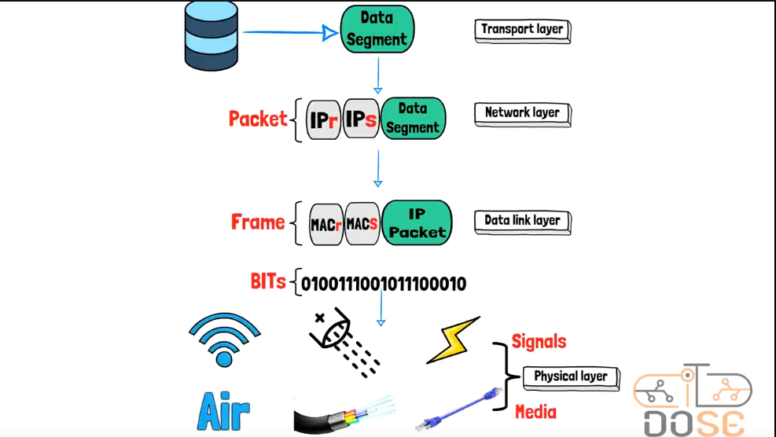
 
عند الجهاز المستقبل، العملية بتحصل بالعكس تمامًا وتتسمى **Decapsulation**: كل طبقة بتشيل الـ Header الخاص بيها وتبعت الباقي للطبقة اللي فوقها، لحد ما البيانات ترجع لصورتها الأصلية (Data) وتوصل لطبقة الـ Application عند المستقبل.
 
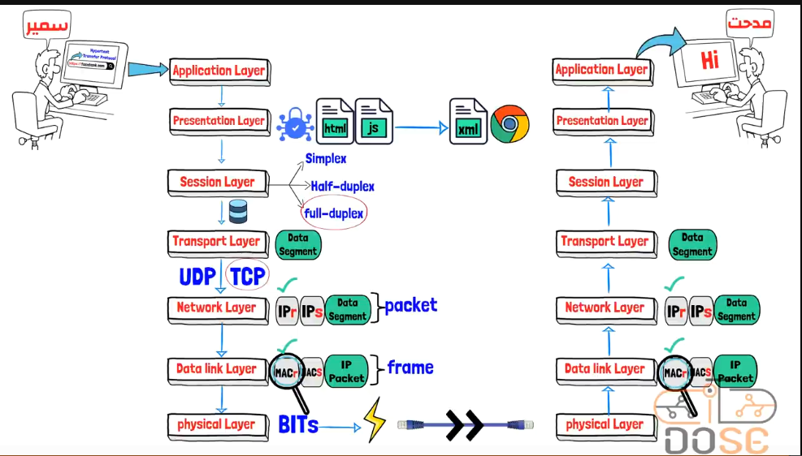
 
### 3. الاتصال المنطقي بين نفس الطبقة (Peer-to-Peer Communication)
 
كل طبقة في جهاز الإرسال "بتتكلم" منطقيًا مع نفس الطبقة المقابلة لها في جهاز الاستقبال، باستخدام بروتوكول خاص بكل طبقة (مثلاً: Application protocol, Transport protocol, إلخ)، حتى لو فعليًا البيانات بتنزل لحد الطبقة الفيزيائية وتعدي على الوسط الناقل الفعلي.
 
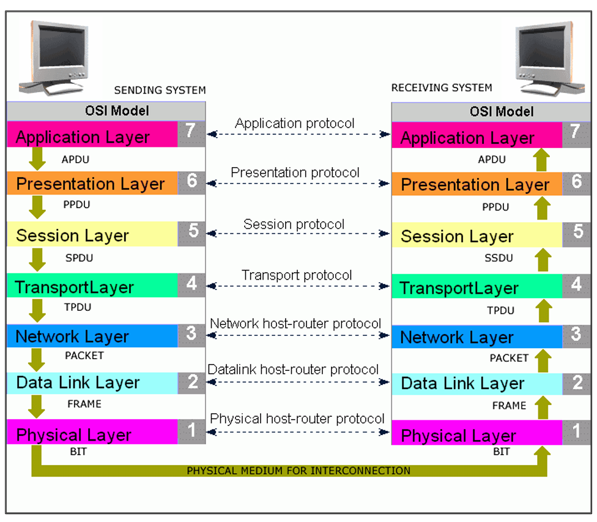
 
---
 
## الطبقات السبعة بالترتيب
 
- 7 - Application Layer
- 6 - Presentation Layer
- 5 - Session Layer
- 4 - Transport Layer
- 3 - Network Layer
- 2 - Data Link Layer
- 1 - Physical Layer
 
هنشرح كل طبقة بالتفصيل بدايةً من الطبقة رقم 7 (الأقرب للمستخدم) نزولًا للطبقة رقم 1 (الأقرب للوسط الناقل)، بنفس ترتيب رحلة البيانات وقت الإرسال.
 
---
 
## 1) طبقة الـ Application Layer (الطبقة السابعة)
 
دي الطبقة اللي بيتعامل معاها المستخدم بشكل مباشر، وهي "واجهة" التطبيقات مع الشبكة. الطبقة دي **مش هي البرنامج نفسه** (زي المتصفح أو تطبيق الإيميل)، لكنها المسؤولة عن توفير الخدمات والبروتوكولات اللي البرنامج بيحتاجها عشان يتواصل عبر الشبكة.
 
يعني لما تفتح متصفح وتكتب رابط موقع، طبقة الـ Application هي اللي بتحدد "إيه البروتوكول" اللي هيُستخدم عشان الطلب ده يتنفذ (زي HTTP أو HTTPS).
 
### أشهر بروتوكولات الـ Application Layer
 
| البروتوكول | الاسم الكامل | الوظيفة |
|---|---|---|
| **HTTP** | HyperText Transfer Protocol | نقل صفحات الويب بين المتصفح والسيرفر (بدون تشفير) |
| **HTTPS** | HTTP Secure | نفس وظيفة HTTP لكن مع تشفير البيانات (باستخدام SSL/TLS) |
| **FTP** | File Transfer Protocol | نقل ورفع وتحميل الملفات بين جهازين على الشبكة |
| **SMTP** | Simple Mail Transfer Protocol | إرسال الإيميلات |
| **DNS** | Domain Name System | ترجمة أسماء المواقع (زي google.com) إلى عناوين IP |
| **IMAP / POP3** | Internet Message Access Protocol / Post Office Protocol | استقبال وقراءة الإيميلات من السيرفر |
 
كل خدمة أو برنامج بيحتاج الطبقة دي بيستخدم البروتوكول المناسب ليه حسب نوع النشاط اللي عايز يعمله على الإنترنت.
 
---
 
## 2) طبقة الـ Presentation Layer (الطبقة السادسة)
 
هي الطبقة المسؤولة عن **"عرض" البيانات بشكل تقدر الطبقات التانية تفهمه**، يعني بتشتغل كـ "مترجم" بين طبقة الـ Application (اللي بتفهم لغة البرنامج) والطبقات الأقل منها (اللي بتفهم بيانات في شكل معين موحّد زي الـ Binary).
 
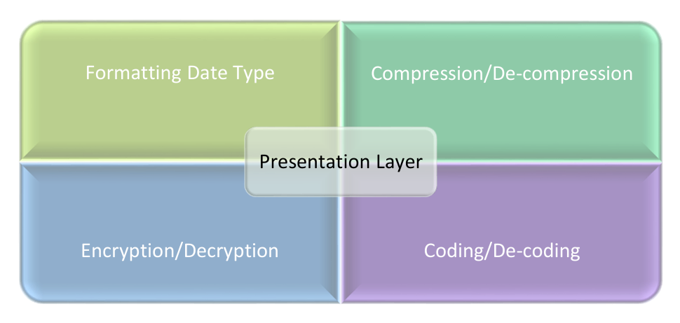
 
### وظائف الطبقة الأساسية
 
#### أ) Translation / Coding & Decoding
عملية تحويل أي بيانات (نصوص، صور، فيديوهات...) من الصيغة اللي فاهمها التطبيق، إلى صيغة الـ **Binary (0/1)** اللي هي اللغة الوحيدة اللي الأجهزة بتفهمها فعليًا، والعكس صحيح عند الاستقبال (تحويل الـ Binary لصورته الأصلية اللي يقدر التطبيق يستخدمها ويعرضها).
 
#### ب) Encryption / Decryption
عملية تشفير البيانات المرسلة قبل ما تتبعت، عشان تحميها من إن أي جهة غير مصرح لها تقدر تفتحها أو تفهمها لو قدرت تعترض الاتصال. من أشهر تقنيات التشفير: **SSL/TLS**، وخوارزميات الـ **Hashing** زي **MD5**.
 
#### ج) Compression / De-compression
عملية ضغط حجم البيانات قبل الإرسال، بهدف:
- تقليل الحجم الكلي للبيانات المنقولة.
- تقليل الوقت المستغرق في النقل.
- ترشيد استهلاك عرض النطاق الترددي (Bandwidth).
#### د) Formatting Data Type
التأكد من إن صيغة البيانات (زي نوع الملف: صورة، فيديو، نص...) متوافقة مع الجهاز أو البرنامج المستقبِل، خصوصًا لما يكون فيه اختلاف بين نظام تشغيل المُرسِل والمُستقبِل، أو بين البرامج المستخدمة في الطرفين.
 
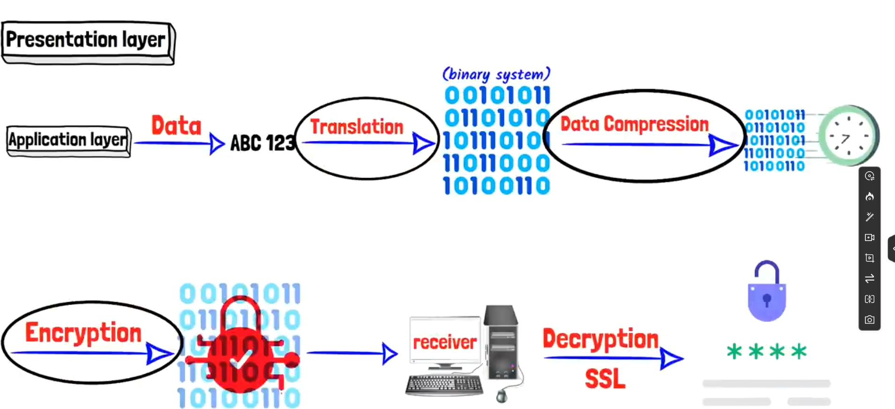
 
**أمثلة على بروتوكولات/صيغ الطبقة دي:** SSL/TLS، JPEG، PNG، MPEG.
 
---
 
## 3) طبقة الـ Session Layer (الطبقة الخامسة)
 
وظيفة الطبقة دي إنها مسؤولة عن **إنشاء وإدارة وإنهاء الجلسات (Sessions)** بين جهازين أو أكثر عايزين يتواصلوا مع بعض، بحيث تفضل الجلسة محافظة على استمراريتها طول فترة انتقال البيانات، وتضمن إن الاتصال ينقطع بشكل آمن في حالة انتهاء المحادثة أو حصول أي مشكلة.
 
### وظائف الطبقة بالتفصيل
 
#### أ) إنشاء وإدارة وإنهاء الجلسات (Session Establishment, Maintenance & Termination)
- بتفتح قناة اتصال بين البرنامجين/الجهازين وتتفق معاهم على بروتوكولات الاتصال.
- بتحافظ على استمرارية الاتصال طول مدة تبادل البيانات.
- بتتأكد من إغلاق الاتصال بشكل آمن عند انتهاء الحاجة إليه أو عند حدوث أي مشكلة تمنع استكمال الجلسة.
#### ب) Synchronization (التزامن)
في حالة نقل البيانات الكبيرة، بتضيف الطبقة دي "نقاط تحقق" (Checkpoints) دوريّة جوه تدفق البيانات المُرسَل. فلو حصل انقطاع في الاتصال أو تعطل في نقل البيانات، مش هيبقى ضروري إعادة إرسال البيانات من أولها تاني، وإنما بيتم استئناف الإرسال من عند آخر نقطة تحقق ناجحة، وده بيوفر وقت وموارد كبيرة.
 
#### ج) Dialog Control (التحكم في الحوار / اتجاه تدفق البيانات)
بتحدد الطريقة اللي البيانات بتتدفق بيها بين الطرفين، وفيه 3 أنواع:
 
| النوع | الوصف |
|---|---|
| **Simplex** | تدفق البيانات في اتجاه واحد فقط (طرف بيرسل والتاني بيستقبل بس، ولا يقدر يرد) |
| **Half-Duplex** | تدفق البيانات في الاتجاهين، لكن مش في نفس الوقت (زي الووكي توكي) |
| **Full-Duplex** | تدفق البيانات في الاتجاهين في نفس الوقت (زي المكالمة التليفونية العادية) |
 
**أمثلة على بروتوكولات الطبقة دي:** NetBIOS، RPC (Remote Procedure Call)، SMB (Server Message Block).
 
---
 
## 4) طبقة الـ Transport Layer (الطبقة الرابعة)
 
طبقة مهمة جدًا، وظيفتها الأساسية إنها **تضمن وصول البيانات كاملة وبالترتيب الصحيح** من جهاز المُرسِل لجهاز المُستقبِل، وبمعدل نقل (سرعة) يتناسب مع إمكانيات الجهازين، عن طريق تقسيم البيانات القادمة من الطبقات العليا إلى وحدات أصغر يسهل إدارتها ونقلها، ثم إعادة تجميعها تاني بشكل صحيح عند الوصول.
 
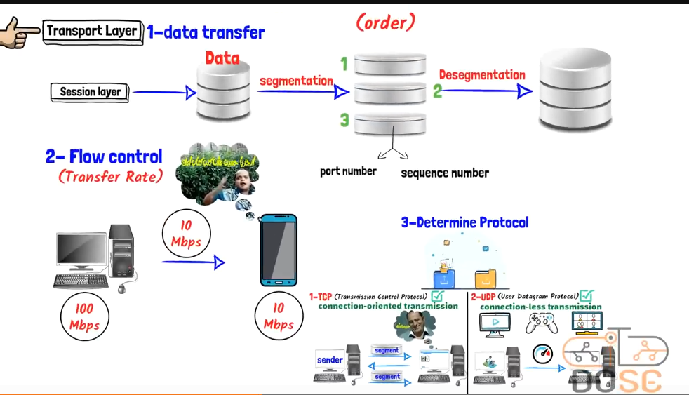
 
### وظائف الطبقة بالتفصيل
 
#### أ) Segmentation & Sequencing (التقسيم والترقيم)
- **Segmentation:** تقسيم البيانات القادمة من الطبقات العليا (اللي بتكون بحجم كبير) إلى أجزاء أصغر تُسمى **Segments**، عشان يسهل نقلها عبر الشبكة بدل إرسالها كوحدة واحدة ضخمة (وده بيقلل فرصة الأخطاء وبيسهل إعادة الإرسال لو جزء منها اتلف بدل الرسالة كلها).
- عند الاستقبال، بتتم عملية **De-segmentation**: إعادة تجميع الأجزاء دي مرة تانية بنفس ترتيبها الأصلي عشان تتكون البيانات الكاملة زي ما كانت.
- **Sequencing:** كل Segment بياخد رقم تسلسلي (Sequence Number)، عشان لو وصلت الأجزاء بترتيب مختلف (بسبب اختلاف المسارات في الشبكة)، يقدر الجهاز المستقبِل يرتبها صح تاني حسب الرقم بتاعها.
#### ب) Flow Control (التحكم في التدفق)
بيضمن إن معدل نقل البيانات (Transfer Rate) يكون مناسب لإمكانيات كل الأجهزة المشتركة في الاتصال. فمثلاً لو جهاز بيرسل بسرعة 100 Mbps، وجهاز الاستقبال (زي موبايل) مش قادر يستوعب غير 10 Mbps، الطبقة دي بتظبط سرعة الإرسال على 10 Mbps عشان منعش يحصل فقد في البيانات (Data Loss) بسبب إن جهاز الاستقبال متغرقش (Overwhelmed).
 
#### ج) Determine Protocol (اختيار البروتوكول المناسب)
الطبقة دي هي اللي بتحدد نوع البروتوكول المناسب لطبيعة البيانات المرسلة والنشاط المطلوب، وفيه بروتوكولين أساسيين:
 
### مقارنة تفصيلية بين TCP و UDP
 
| | **TCP (Transmission Control Protocol)** | **UDP (User Datagram Protocol)** |
|---|---|---|
| **نوع الاتصال** | Connection-Oriented (يفتح اتصال ثابت قبل نقل البيانات) | Connectionless (بيرسل البيانات بدون فتح اتصال ثابت) |
| **الأساس** | بيعتمد على الـ **Reliability** والـ **Security**، يعني بيضمن وصول البيانات كاملة 100% | بيعتمد على **السرعة فقط**، وممكن يضحي ببعض البيانات مقابل السرعة |
| **اكتشاف وتصحيح الأخطاء** | لو حصل أي خطأ أثناء النقل، بيكتشفه ويصححه (Detect & Correct) عن طريق إعادة إرسال البيانات المفقودة | مبيهتمش لو حصل خطأ أو ضاع جزء من البيانات؛ بيكمل عادي زي ما لو لم يحصل شيء |
| **Flow Control** | بيستخدمها بشكل دقيق عشان يظبط معدل النقل المناسب لكل الأجهزة | غير موجودة بنفس الدقة |
| **أمثلة استخدام** | تحميل الملفات، خدمة الإيميل، تصفح المواقع (أي حاجة لازم توصل كاملة صح) | المكالمات الصوتية والفيديو (VoIP)، البث المباشر (Live Streaming/Broadcasting)، الألعاب أونلاين |
| **السبب في الاستخدام** | لو بتنزل ملف أو بتبعت إيميل، مينفعش يوصل جزء منه ناقص أو فيه خطأ | لو بتتفرج على مباراة لايف وحصل تقطيع بسيط، الفيديو بيكمل عادي وميرجعش يعيد الجزء الناقص، لأن الأهم هو استمرارية البث في الوقت الحقيقي (Real-Time) |
 
### آلية الـ Three-Way Handshake (خاصة بـ TCP)
 
عشان TCP يضمن إن الاتصال "موثوق" (Reliable)، بيستخدم آلية تُسمى **Three-Way Handshake** قبل ما يبدأ نقل البيانات الفعلي، بتتكون من 3 خطوات:
 
1. المُرسِل (Source) بيبعت طلب **SYN** (Synchronize) للمستقبِل.
2. المُستقبِل (Destination) بيرد بـ **SYN-ACK** (Synchronize-Acknowledge) لتأكيد استلام الطلب واستعداده للاتصال.
3. المُرسِل بيرد بـ **ACK** (Acknowledge) لتأكيد بدء الاتصال فعليًا.
بعد الخطوات الثلاثة دي، الاتصال بيتأسس رسميًا (Connection Established) ويبدأ نقل البيانات الفعلي بين الطرفين، وكل طرف بيستخدم **Window Size** بتحدد عدد الـ Segments اللي ممكن تتبعت قبل ما يستنى تأكيد (ACK) من الطرف التاني.
 
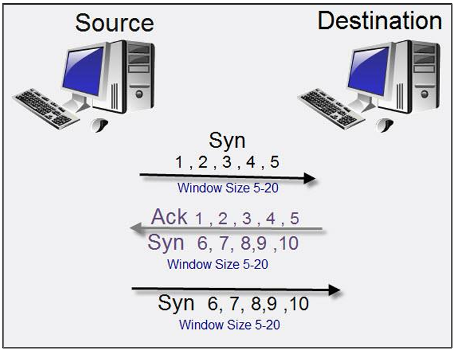
 
---
 
## 5) طبقة الـ Network Layer (الطبقة الثالثة)
 
الطبقة دي مسؤولة بشكل أساسي عن حاجتين: **تحديد عنوان كل جهاز على الشبكة**، و**اختيار أفضل مسار لنقل البيانات** من المُرسِل للمُستقبِل، حتى لو كانوا على شبكات مختلفة تمامًا.
 
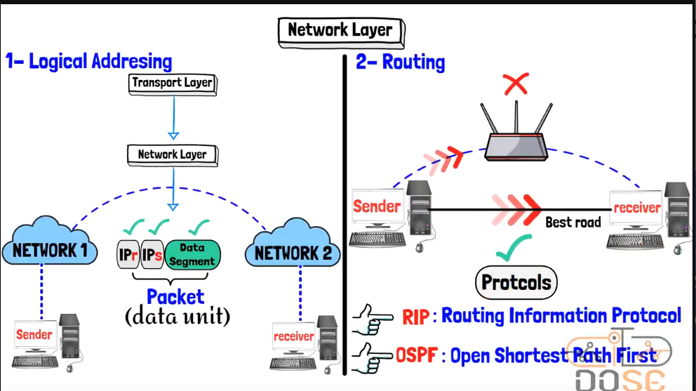
 
### وظائف الطبقة بالتفصيل
 
#### أ) Logical Addressing (العنونة المنطقية)
كل جهاز متصل بالشبكة بياخد عنوان **IP** مميز وفريد بيميزه عن باقي الأجهزة، وده أساسي جدًا خصوصًا لو الاتصال هيعدي بين شبكات مختلفة (زي الإنترنت). الطبقة دي بتاخد الـ **Segment** القادم من طبقة الـ Transport، وتضيف عليه:
- **IP Source (IPs):** عنوان الجهاز المُرسِل.
- **IP Destination (IPr):** عنوان الجهاز المُستقبِل.
وناتج الإضافة دي بيتكون وحدة بيانات جديدة اسمها **Packet**، بالشكل ده:
 
```
Packet = [ IP Source | IP Destination | Data Segment ]
```
 
#### ب) Routing (توجيه المسار)
هي عملية اختيار **أفضل مسار (Best Path)** ممكن تاخده البيانات عشان توصل من الشبكة المصدر للشبكة الهدف، عن طريق أجهزة متخصصة اسمها **Routers** بتستخدم بروتوكولات معينة (Routing Protocols) عشان تحدد أنسب طريق بناءً على معايير زي: عدد القفزات (Hops)، السرعة، الازدحام على الشبكة... إلخ.
 
### أشهر بروتوكولات الـ Routing
 
| البروتوكول | الاسم الكامل | الفكرة |
|---|---|---|
| **<span dir="ltr">RIP</span>** | <span dir="ltr">Routing Information Protocol</span> | بيحدد أفضل مسار بناءً على أقل عدد من القفزات (<span dir="ltr">Hop Count</span>) بين الشبكات |
| **<span dir="ltr">OSPF</span>** | <span dir="ltr">Open Shortest Path First</span> | بروتوكول أكثر تطورًا، بيحسب أقصر مسار فعليًا بناءً على حالة الروابط (<span dir="ltr">Link State</span>) مش بس عدد القفزات، وده بيخليه أدق وأنسب للشبكات الكبيرة |
| **<span dir="ltr">EIGRP</span>** | <span dir="ltr">Enhanced Interior Gateway Routing Protocol</span> | بروتوكول خاص بشركة <span dir="ltr">Cisco</span>، بيجمع بين مميزات البروتوكولات اللي بتعتمد على عدد القفزات واللي بتعتمد على حالة الروابط، وبيُستخدم غالبًا جوه الشبكة الداخلية للمؤسسة الواحدة |
| **<span dir="ltr">BGP</span>** | <span dir="ltr">Border Gateway Protocol</span> | البروتوكول المسؤول عن توجيه البيانات **بين الشبكات الكبيرة المختلفة** (زي الشركات ومزودي خدمة الإنترنت)، وهو أساسًا اللي بيشغل الإنترنت العالمي ويوصل بين كل الـ <span dir="ltr">Networks</span> المستقلة عن بعضها |

**أمثلة أخرى على بروتوكولات الطبقة دي:** <span dir="ltr">IP</span>، <span dir="ltr">ICMP</span>، <span dir="ltr">IPSec</span>.
 
---
 
## 6) طبقة الـ Data Link Layer (الطبقة الثانية)
 
هي الطبقة المسؤولة عن **تجهيز البيانات بشكل نهائي قبل ما تتحول لإشارات فعلية على الوسط الناقل**، وكمان مسؤولة عن التأكد من وصول البيانات بدون أخطاء بين جهازين متصلين مباشرة على نفس الشبكة المحلية.

### تقسيم الطبقة لـ Sublayers

فعليًا، الطبقة دي بتتقسم لطبقتين فرعيتين (<span dir="ltr">Sublayers</span>) عشان تقدر توزع مسؤولياتها بشكل أدق:

| الـ <span dir="ltr">Sublayer</span> | المسؤولية |
|---|---|
| **<span dir="ltr">LLC (Logical Link Control)</span>** | الجزء العلوي، بيتواصل مباشرة مع طبقة الـ <span dir="ltr">Network</span> اللي فوقها، ومسؤول عن التحكم في تدفق البيانات (<span dir="ltr">Flow Control</span>) واكتشاف الأخطاء (<span dir="ltr">Error Detection</span>)، وكمان بيحدد نوع البروتوكول اللي هيُستخدم في الطبقة اللي فوقه (زي <span dir="ltr">IP</span>) |
| **<span dir="ltr">MAC (Media Access Control)</span>** | الجزء السفلي، وهو المسؤول عن العنونة الفيزيائية (<span dir="ltr">MAC Addressing</span>) وتنظيم الوصول للوسط الناقل المشترك بين الأجهزة |

> **ملحوظة:** لازم متلخبطش بين اختصار الـ **<span dir="ltr">MAC</span>** الخاص بالـ <span dir="ltr">Sublayer</span> دي، واختصار الـ **<span dir="ltr">MAC Address</span>** نفسه؛ الاتنين مرتبطين ببعض لكن مش نفس الحاجة بالظبط.

### وظائف الطبقة بالتفصيل
 
#### أ) Framing (التأطير)
عملية تحويل الـ **Packet** القادم من طبقة الـ Network إلى وحدة بيانات جديدة اسمها **Frame**، عن طريق إضافة:
- **MAC Source (MACs):** العنوان الفيزيائي (MAC Address) الخاص بكرت الشبكة (NIC) بتاع الجهاز المُرسِل.
- **MAC Destination (MACr):** العنوان الفيزيائي بتاع الجهاز المُستقبِل.
```
Frame = [ MAC Source | MAC Destination | IP Packet ]
```
 
العملية دي بتُسمى كمان **Frame Encapsulation**، وهي آخر مرحلة قبل ما البيانات تتحول لـ Bits وتترسل فعليًا عبر الوسط الناقل.
 

 
#### ب) Error Detection and Correction (اكتشاف وتصحيح الأخطاء)
دي وظيفة تانية مهمة جدًا للطبقة دي، بتضمن إن البيانات اللي وصلت للطبقة المقابلة عند المستقبِل هي فعلًا نفس البيانات اللي اتبعتت من غير أي تلف أو تشويه حصل أثناء انتقالها عبر الوسط الناقل (بسبب تشويش كهرومغناطيسي مثلًا، أو أي عائق فيزيائي).
 
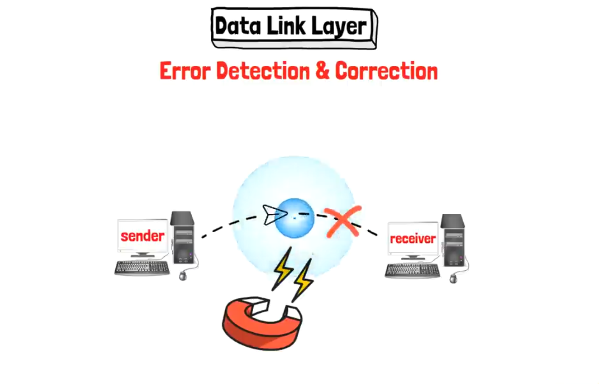
 
من أشهر تقنيات اكتشاف الأخطاء:
 
| التقنية | الفكرة |
|---|---|
| **Parity Checking** | إضافة بت إضافي (Parity Bit) للبيانات بحيث يخلي مجموع البتات (زوجي أو فردي حسب النوع) ثابت، ولو تغير المجموع عند الاستقبال معناه حصل خطأ |
| **Checksum** | حساب قيمة رقمية معينة (Checksum) بناءً على محتوى البيانات، وإعادة حسابها عند الاستقبال؛ لو القيمتين مختلفتين معناه حصل تلف في البيانات |
| **CRC (Cyclic Redundancy Check)** | تقنية أكثر دقة من الاتنين اللي قبلها، بتُستخدم بشكل واسع في شبكات الإيثرنت للتأكد من سلامة الـ Frame كامل |
 
#### ج) Access for Media for Upper Layers (التحكم في الوصول للوسط الناقل)
الطبقة دي كمان بتنظم إزاي الأجهزة المتصلة على نفس الوسط الناقل (زي كابل واحد أو شبكة لاسلكية واحدة) تقدر "تاخد دورها" في الإرسال من غير ما يحصل تصادم (Collision) بين البيانات المرسلة من أكتر من جهاز في نفس الوقت.
 
من أهم التقنيات المستخدمة في الموضوع ده: **<span dir="ltr">CSMA (Carrier Sense Multiple Access)</span>**، وفكرتها إن الجهاز قبل ما يبعت بياناته، بيتأكد الأول (<span dir="ltr">Sense</span>) إن الوسط الناقل (<span dir="ltr">Carrier</span>) فاضي ومفيهوش نقل بيانات تاني شغال، عشان يتجنب حدوث تصادم (<span dir="ltr">Collision</span>) مع بيانات جهاز تاني بيرسل في نفس اللحظة.

وليها نوعين مختلفين حسب نوع الشبكة، ومهم جدًا متتلخبطش بينهم لأنهم بيتلخبط فيهم ناس كتير وقت المذاكرة:

| النوع | يُستخدم في | الفكرة |
|---|---|---|
| **<span dir="ltr">CSMA/CD (Collision Detection)</span>** | الشبكات السلكية القديمة (<span dir="ltr">Ethernet</span> بالـ <span dir="ltr">Hubs</span>) | الجهاز بيبعت بياناته، ولو حصل تصادم فعليًا مع جهاز تاني، الاتنين بيكتشفوا التصادم ده وبيوقفوا الإرسال ويعيدوا المحاولة بعد فترة عشوائية |
| **<span dir="ltr">CSMA/CA (Collision Avoidance)</span>** | الشبكات اللاسلكية (<span dir="ltr">Wi-Fi</span>) | لأن الأجهزة اللاسلكية مش قادرة تكتشف التصادم فعليًا زي السلكية، فبتحاول **تتجنبه من الأساس** قبل ما يحصل، عن طريق إرسال إشارة صغيرة الأول تحجز بيها الوسط الناقل لفترة معينة قبل ما تبعت البيانات الفعلية |

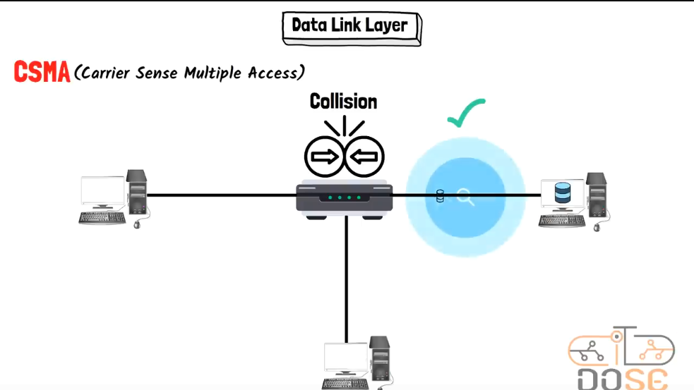
 
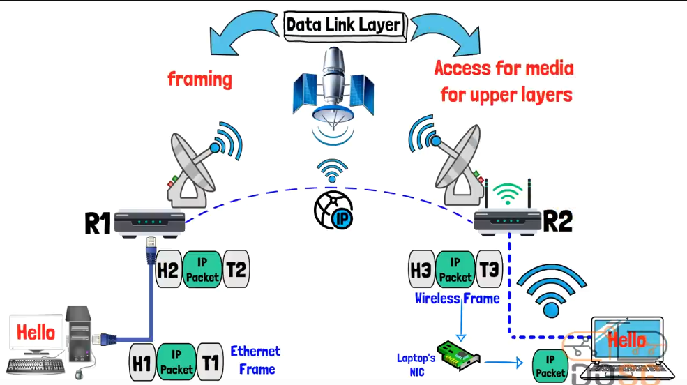
 
**أمثلة على بروتوكولات/تقنيات الطبقة دي:** Ethernet، Wi-Fi، PPP (Point-to-Point Protocol).
 
---
 
## 7) طبقة الـ Physical Layer (الطبقة الأولى)
 
هي آخر طبقة في رحلة الإرسال، ومسؤوليتها إنها تاخد الـ **Frame** القادم من طبقة الـ Data Link وتحوله لسلسلة من **Bits** (0 و 1)، وبعدين تحول الـ Bits دي إلى **إشارات فيزيائية فعلية** (كهربائية، ضوئية، أو راديوية) بتنتقل عبر الوسط الناقل (Media) الفعلي زي الكابلات أو الهواء.
 
الطبقة دي مسؤولة عن كل التفاصيل الفيزيائية والهاردوير للاتصال، زي:
- نوع الكابلات المستخدمة (Copper, Fiber Optic).
- المُوصِّلات (Connectors) زي RJ45.
- طبيعة الإشارة نفسها: هل هي **كهربائية** (عبر كابلات النحاس)، **ضوئية** (عبر الألياف الضوئية Fiber)، ولا **راديوية** (عبر الموجات اللاسلكية Wi-Fi)؟
- سرعة النقل (Data Rate) ومواصفات المنافذ (Ports) والأجهزة المستخدمة في التوصيل الفيزيائي.
عند الاستقبال، العملية بتحصل بالعكس تمامًا: الجهاز المُستقبِل بيستقبل الإشارة الفيزيائية، ويحولها مرة تانية لـ <span dir="ltr">Bits</span>، وبعدين يبعتها لطبقة الـ <span dir="ltr">Data Link</span> عشان تبدأ رحلة الـ <span dir="ltr">Decapsulation</span> صعودًا لحد ما توصل البيانات لصورتها الأصلية عند المستخدم.

### Encoding: إزاي الـ Bits بتتحول لإشارة فعلية؟

مش كفاية إن الجهاز يبعت الإشارة، لازم كمان الجهاز المستقبِل يعرف يميز أصلًا مين الـ **0** ومين الـ **1** جوه الإشارة اللي وصلته. العملية دي اسمها **<span dir="ltr">Encoding</span>**، ومن أشهر طرقها: **<span dir="ltr">Manchester Encoding</span>**، وهي طريقة بتعتمد على تغيير اتجاه الإشارة (من عالي لواطي أو العكس) في منتصف كل نبضة (<span dir="ltr">Pulse</span>) عشان تحدد هل دي 0 ولا 1، وده بيدي ميزة إضافية إن الجهاز المستقبِل يقدر "يتزامن" (<span dir="ltr">Synchronize</span>) مع توقيت الإرسال بسهولة أكتر.

### معايير الـ Ethernet الشائعة

كل معيار من معايير الـ <span dir="ltr">Ethernet</span> بيحدد نوع الكابل المستخدم والسرعة القصوى للنقل، وده جزء أساسي من مسؤوليات الـ <span dir="ltr">Physical Layer</span>:

| المعيار | السرعة | نوع الكابل |
|---|---|---|
| **<span dir="ltr">10BASE-T</span>** | 10 <span dir="ltr">Mbps</span> | نحاس (<span dir="ltr">Copper</span>) |
| **<span dir="ltr">100BASE-TX</span>** | 100 <span dir="ltr">Mbps</span> (<span dir="ltr">Fast Ethernet</span>) | نحاس (<span dir="ltr">Copper</span>) |
| **<span dir="ltr">1000BASE-T</span>** | 1 <span dir="ltr">Gbps</span> (<span dir="ltr">Gigabit Ethernet</span>) | نحاس (<span dir="ltr">Copper</span>) |
| **<span dir="ltr">10GBASE-T</span>** | 10 <span dir="ltr">Gbps</span> | نحاس (<span dir="ltr">Copper</span>) أو ألياف ضوئية |

**أمثلة على مكونات/تقنيات الطبقة دي:** الكابلات (<span dir="ltr">Cables</span>)، الألياف الضوئية (<span dir="ltr">Fiber Optic</span>)، الموجات الراديوية (<span dir="ltr">Radio Waves</span>)، الموزعات (<span dir="ltr">Hubs</span>)، المُكررات (<span dir="ltr">Repeaters</span>).
 
---
 
## جدول ملخص لكل الطبقات السبعة (للمراجعة السريعة)
 
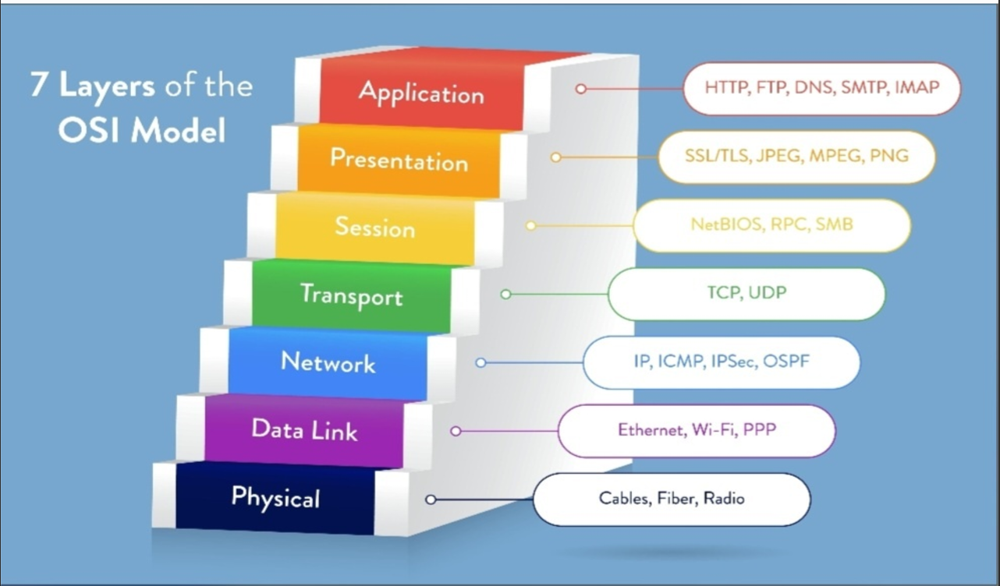
 
| # | الطبقة (Layer) | وحدة البيانات (PDU) | الوظيفة باختصار | أمثلة بروتوكولات/تقنيات |
|---|---|---|---|---|
| 7 | **Application** | Data | واجهة التطبيقات مع الشبكة، تحديد نوع الخدمة/البروتوكول المطلوب | HTTP, HTTPS, FTP, SMTP, DNS |
| 6 | **Presentation** | Data | ترجمة، تشفير، ضغط، وتنسيق صيغة البيانات لتكون مفهومة للطرفين | SSL/TLS, JPEG, PNG, MPEG |
| 5 | **Session** | Data | إنشاء وإدارة وإنهاء الجلسات، التزامن، والتحكم في اتجاه تدفق البيانات | NetBIOS, RPC, SMB |
| 4 | **Transport** | Segment | تقسيم البيانات، ترقيمها، التحكم في معدل النقل، واختيار البروتوكول المناسب | TCP, UDP |
| 3 | **Network** | Packet | العنونة المنطقية (IP) واختيار أفضل مسار لنقل البيانات (Routing) | IP, ICMP, IPSec, RIP, OSPF |
| 2 | **Data Link** | Frame | التأطير، العنونة الفيزيائية (MAC)، اكتشاف/تصحيح الأخطاء، والتحكم في الوصول للوسط | Ethernet, Wi-Fi, PPP |
| 1 | **Physical** | Bits | تحويل البيانات لإشارات فيزيائية ونقلها عبر الوسط الناقل الفعلي | Cables, Fiber Optic, Radio Waves |
 
---

## الأجهزة اللي بتشتغل في كل طبقة

بعد ما اتعرفنا على وظيفة كل طبقة من الطبقات السبعة، مهم جدًا كمان نعرف **مين الجهاز (Device) اللي بيشتغل فعليًا على كل طبقة**، ويقرأ الـ Header بتاعها ويتخذ قراره بناءً عليه. الموضوع ده مهم جدًا في الشبكات وفي الأمن السيبراني، لأنه بيوضحلك بالظبط "مين بيشوف إيه" في الشبكة، وبالتالي مين هو الجهاز المسؤول لو حصلت مشكلة أو هجوم عند طبقة معينة.

> **ملحوظة:** بعض الأجهزة الحديثة بقت **متعددة الطبقات (Multilayer Devices)**، يعني بتقدر تشتغل على أكتر من طبقة في نفس الوقت (زي الـ <span dir="ltr">Layer 3 Switch</span> اللي بيجمع بين وظائف السويتش والراوتر). التصنيف اللي جاي دلوقتي هو التصنيف **الأساسي/التقليدي** لكل جهاز حسب الطبقة اللي "بيتخذ قراره" فيها بشكل أساسي.

### 7, 6, 5) طبقات الـ Application / Presentation / Session

الطبقات العليا مالهاش "جهاز هاردوير" مخصص ليها زي باقي الطبقات، لأنها أساسًا شغل برمجي (Software) جوه الأجهزة نفسها. لكن فيه أجهزة/خدمات بتشتغل على مستوى الطبقات دي:

| الجهاز | وظيفته باختصار |
|---|---|
| **<span dir="ltr">Gateway</span>** | جهاز أو برنامج بيربط بين شبكتين مختلفتين تمامًا في البروتوكولات (مش بس عناوين مختلفة)، وبيترجم البيانات بينهم لحد طبقة الـ Application لو احتاج الأمر |
| **<span dir="ltr">Proxy Server</span>** | بيقف "نيابة" عن جهاز العميل (Client) وبيبعت الطلبات نيابة عنه، وبيقدر يشوف ويتحكم في محتوى الطلب نفسه (زي الرابط أو نوع المحتوى) |
| **<span dir="ltr">Application Firewall / NGFW (Next-Generation Firewall)</span>** | بيفحص محتوى البيانات نفسه (زي نوع الملف أو محتوى الطلب) مش بس العنوان أو البورت |
| **<span dir="ltr">Load Balancer (Layer 7)</span>** | بيوزع الطلبات على أكتر من سيرفر بناءً على محتوى الطلب نفسه (زي نوع الرابط المطلوب) |

### 4) طبقة الـ Transport Layer

الطبقة دي بتشتغل على مستوى الـ **Port Numbers** والـ **Segments**، فأي جهاز بيشتغل هنا بياخد قراره بناءً على البورت مثلاً، مش بس العنوان:

| الجهاز | وظيفته باختصار |
|---|---|
| **<span dir="ltr">Firewall (Stateful / Layer 4)</span>** | بيسمح أو يمنع الاتصال بناءً على رقم البورت (Port) وحالة الاتصال (Stateful Inspection)، زي منع أي حد من الاتصال على بورت معين |
| **<span dir="ltr">Load Balancer (Layer 4)</span>** | بيوزع الاتصالات على السيرفرات بناءً على الـ IP والبورت، من غير ما يبص جوه محتوى البيانات |

### 3) طبقة الـ Network Layer

دي أهم طبقة لمعظم أجهزة التوجيه (Routing) في الشبكة، لأنها الطبقة اللي بتشتغل بعنونة الـ **IP Address**:

| الجهاز | وظيفته باختصار |
|---|---|
| **<span dir="ltr">Router</span>** | أهم جهاز في الطبقة دي، بياخد قراره بناءً على عنوان الـ <span dir="ltr">IP Destination</span> ويحدد أفضل مسار (Path) عشان يوصل الـ Packet للشبكة التانية |
| **<span dir="ltr">Layer 3 Switch (Multilayer Switch)</span>** | سويتش بيقدر كمان ياخد قرارات توجيه (Routing) زي الراوتر بين شبكات فرعية (VLANs/Subnets) مختلفة، وده بيدمج وظائف الطبقة 2 والطبقة 3 مع بعض |
| **<span dir="ltr">Traditional/Packet-Filtering Firewall</span>** | بيسمح أو يمنع المرور بناءً على عنوان الـ IP بتاع المصدر أو الوجهة |

### 2) طبقة الـ Data Link Layer

الطبقة دي بتشتغل بعنونة الـ **MAC Address** جوه نفس الشبكة المحلية (LAN)، والجهاز الأشهر فيها هو السويتش:

| الجهاز | وظيفته باختصار |
|---|---|
| **<span dir="ltr">Switch</span>** | بياخد قراره بناءً على عنوان الـ <span dir="ltr">MAC Address</span>، وبيبني جدول داخلي (<span dir="ltr">MAC Address Table</span>) عشان يعرف يبعت كل Frame للجهاز المطلوب بالظبط جوه نفس الشبكة المحلية بدل ما يبعتها لكل الأجهزة |
| **<span dir="ltr">Bridge</span>** | جهاز أقدم من السويتش، وظيفته إنه يقسم الشبكة المحلية الواحدة لجزئين (Segments) عشان يقلل الازدحام، وبيعتبر السويتش نسخة متطورة منه بعدد منافذ أكبر |
| **<span dir="ltr">Wireless Access Point (WAP)</span>** | بيوصل الأجهزة اللاسلكية (Wi-Fi) بالشبكة السلكية، وبيشتغل أساسًا على مستوى الـ MAC Address زي السويتش لكن للأجهزة اللاسلكية |
| **<span dir="ltr">Network Interface Card (NIC)</span>** | كرت الشبكة بتاع الجهاز نفسه، وهو المسؤول عن إضافة/قراءة عنوان الـ MAC Address بتاع الجهاز |

### 1) طبقة الـ Physical Layer

آخر طبقة، ومفيهاش أي "عنونة منطقية" خالص، لأنها بتتعامل مع الإشارة الفيزيائية والوسط الناقل بشكل مباشر:

| الجهاز | وظيفته باختصار |
|---|---|
| **<span dir="ltr">Hub</span>** | جهاز قديم بيستقبل الإشارة وبيكررها (Broadcast) لكل المنافذ التانية من غير أي ذكاء أو معرفة بعناوين، وده كان بيسبب مشاكل تصادم (Collisions) كتير، عشان كده اتستبدل بالسويتش |
| **<span dir="ltr">Repeater</span>** | بياخد الإشارة الضعيفة (اللي هتضمحل بسبب طول الكابل) وبيقويها (Regenerate) عشان تكمل مسارها لمسافة أطول من غير فقدان جودة |
| **<span dir="ltr">Cables / Media</span>** | الوسط الناقل الفعلي زي كابلات النحاس (Copper) والألياف الضوئية (Fiber Optic) |
| **<span dir="ltr">Media Converter</span>** | بيحول الإشارة من نوع وسط ناقل لنوع تاني، زي التحويل من كابل نحاس لألياف ضوئية والعكس |

### جدول ملخص سريع للأجهزة حسب الطبقة

| الطبقة | أشهر جهاز يمثلها | نوع العنونة اللي بيشتغل بيها |
|---|---|---|
| Application / Presentation / Session (7, 6, 5) | Gateway, Proxy, NGFW | محتوى البيانات (Data/Application Data) |
| Transport (4) | Firewall (L4), Load Balancer (L4) | رقم البورت (Port Number) |
| Network (3) | **Router** | عنوان الـ IP (Logical Address) |
| Data Link (2) | **Switch** | عنوان الـ MAC (Physical Address) |
| Physical (1) | Hub, Repeater | إشارات فيزيائية (بدون عنونة) |

---

## مقارنة سريعة: OSI مقابل TCP/IP

زي ما اتقال في المقدمة، الـ <span dir="ltr">TCP/IP Model</span> هو النموذج العملي المستخدم فعليًا، وبيدمج بعض طبقات الـ <span dir="ltr">OSI</span> مع بعضها في طبقة واحدة. الجدول ده بس تمهيد سريع، وهنتكلم عنه بالتفصيل في ملف منفصل:

| طبقات الـ <span dir="ltr">OSI</span> (7 طبقات) | الطبقة المقابلة في <span dir="ltr">TCP/IP</span> (4 طبقات) |
|---|---|
| <span dir="ltr">Application</span> / <span dir="ltr">Presentation</span> / <span dir="ltr">Session</span> | <span dir="ltr">Application</span> |
| <span dir="ltr">Transport</span> | <span dir="ltr">Transport</span> |
| <span dir="ltr">Network</span> | <span dir="ltr">Internet</span> |
| <span dir="ltr">Data Link</span> / <span dir="ltr">Physical</span> | <span dir="ltr">Network Access (Link)</span> |

---

## طريقة حفظ ترتيب الطبقات (<span dir="ltr">Mnemonic</span>)

عشان تحفظ ترتيب الطبقات السبعة بسهولة من فوق لتحت (7 لـ 1)، فيه جملة إنجليزية شهيرة أول حرف من كل كلمة فيها بيرمز لاسم الطبقة:

> **<span dir="ltr">"All People Seem To Need Data Processing"</span>**

| الكلمة | أول حرف | الطبقة |
|---|---|---|
| <span dir="ltr">All</span> | <span dir="ltr">A</span> | <span dir="ltr">Application</span> |
| <span dir="ltr">People</span> | <span dir="ltr">P</span> | <span dir="ltr">Presentation</span> |
| <span dir="ltr">Seem</span> | <span dir="ltr">S</span> | <span dir="ltr">Session</span> |
| <span dir="ltr">To</span> | <span dir="ltr">T</span> | <span dir="ltr">Transport</span> |
| <span dir="ltr">Need</span> | <span dir="ltr">N</span> | <span dir="ltr">Network</span> |
| <span dir="ltr">Data</span> | <span dir="ltr">D</span> | <span dir="ltr">Data Link</span> |
| <span dir="ltr">Processing</span> | <span dir="ltr">P</span> | <span dir="ltr">Physical</span> |

---
 
## خلاصة سريعة
 
- الـ OSI Model بيقسم عملية الاتصال لـ **7 طبقات**، كل طبقة ليها وظيفة مستقلة ومحددة.
- الطبقات العليا (7, 6, 5) قريبة من المستخدم، والطبقات السفلى (4, 3, 2, 1) قريبة من الوسط الناقل.
- كل طبقة بتضيف Header خاص بيها على البيانات (عملية Encapsulation)، وعند الاستقبال بيحصل العكس (Decapsulation).
- أهم طبقتين لازم تتفهموا كويس جدًا في مجال الشبكات والأمن السيبراني هما طبقة الـ **<span dir="ltr">Transport</span>** (<span dir="ltr">TCP/UDP</span>) وطبقة الـ **<span dir="ltr">Network</span>** (<span dir="ltr">IP</span> والـ <span dir="ltr">Routing</span>)، لأنهم أساس أي هجوم أو دفاع في الشبكات.

</div>
