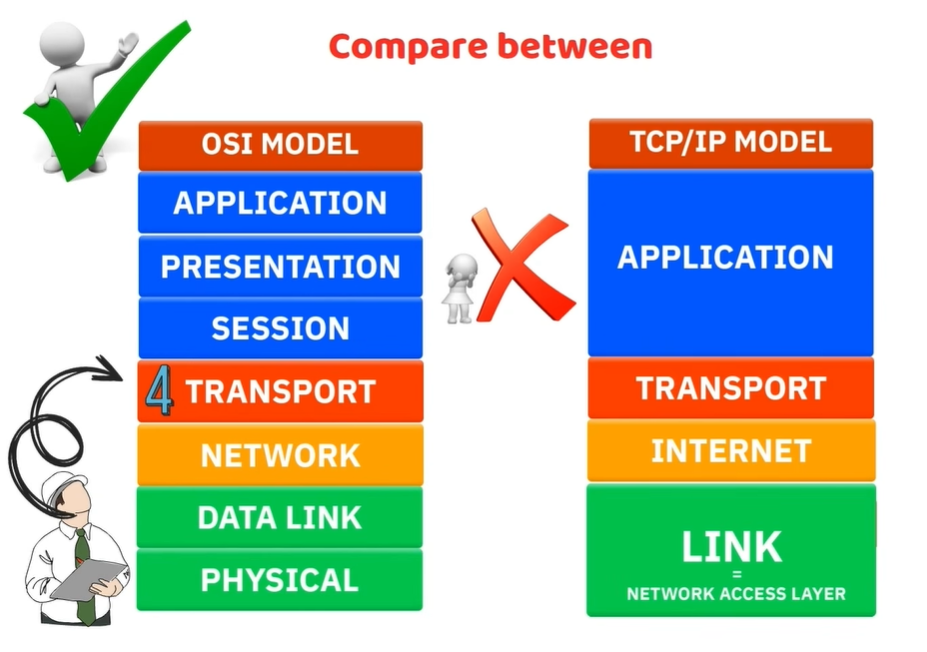
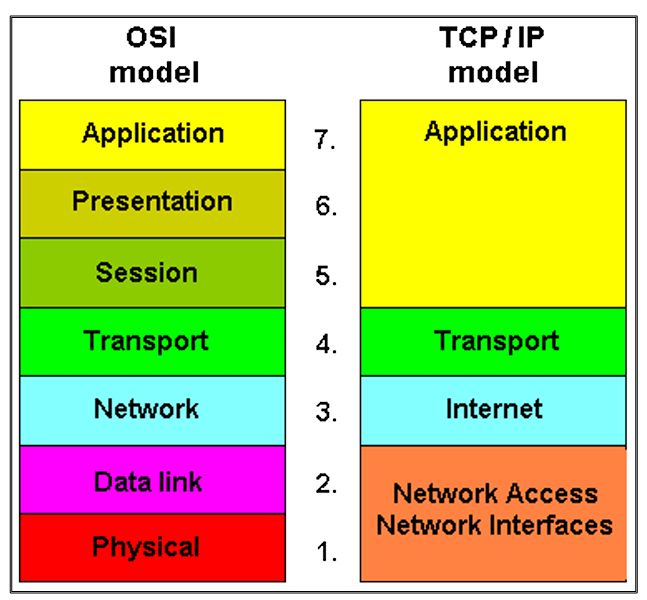
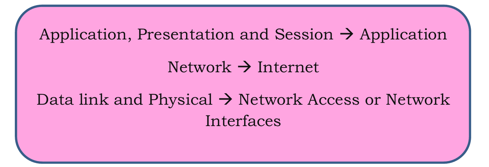
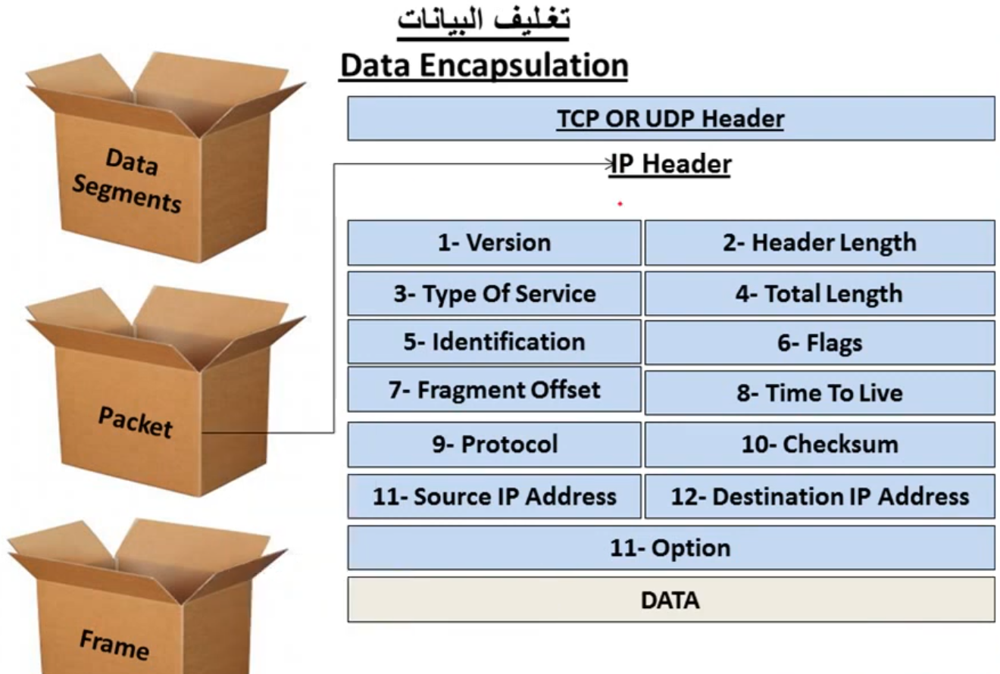
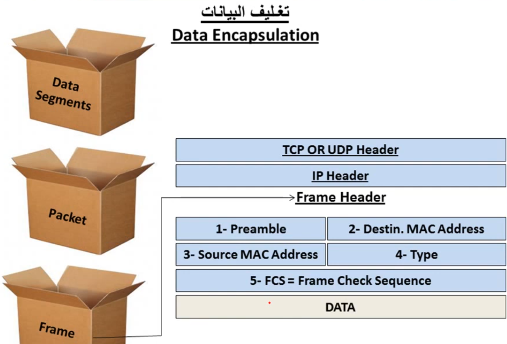
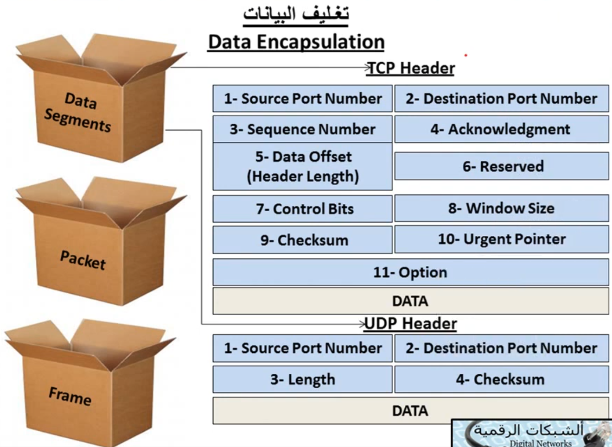
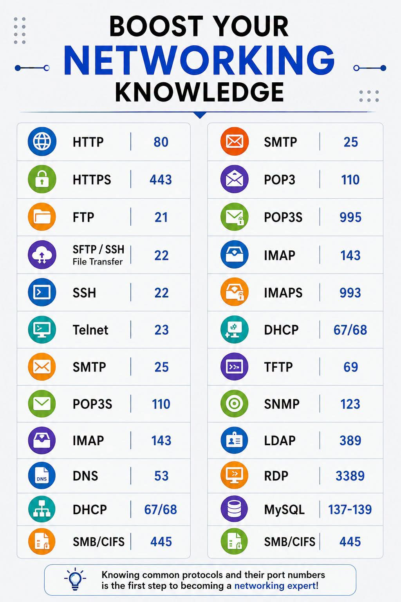

# 🌐 07. نموذج TCP/IP | TCP/IP Model

---

<h2 dir="rtl" align="right">📌 الفهرس السريع</h2>

| الرقم | الموضوع |
|---|---|
| 1 | [تعريف نموذج TCP/IP وأشكال استخدامه](#1-تعريف-نموذج-tcpip-وأشكال-استخدامه) |
| 2 | [ليه لسه بندرس OSI Model والشغال فعليًا هو TCP/IP؟](#2-ليه-لسه-بندرس-osi-model-والشغال-فعليا-هو-tcpip) |
| 3 | [النسخة القديمة (4 طبقات) مقابل النسخة المحدثة (5 طبقات)](#3-النسخة-القديمة-4-طبقات-مقابل-النسخة-المحدثة-5-طبقات) |
| 4 | [المقارنة التفصيلية بين OSI و TCP/IP](#4-المقارنة-التفصيلية-بين-osi-و-tcpip) |
| 5 | [وظيفة كل طبقة في نموذج TCP/IP](#5-وظيفة-كل-طبقة-في-نموذج-tcpip) |
| 6 | [أهم البروتوكولات العاملة في كل طبقة](#6-أهم-البروتوكولات-العاملة-في-كل-طبقة) |
| 7 | [الفرق بين TCP و UDP](#7-الفرق-بين-tcp-و-udp) |
| 8 | [عناوين الـ IP بالتفصيل](#8-عناوين-الـ-ip-بالتفصيل) |
| 9 | [المسميات (PDU) وعملية Encapsulation / Decapsulation وحقول الهيدرز](#9-المسميات-pdu-وعملية-encapsulation--decapsulation-وحقول-الهيدرز) |
| 10 | [سبب التسمية TCP/IP](#10-سبب-التسمية-tcpip) |
| 11 | [جدول مرجعي: أشهر 20 بورت (مراجعة سريعة)](#11-جدول-مرجعي-أشهر-20-بورت-مراجعة-سريعة) |
| 12 | [كبسولة المذاكرة السريعة](#12-كبسولة-المذاكرة-السريعة) |

---

<h2 dir="rtl" align="right" id="1-تعريف-نموذج-tcpip-وأشكال-استخدامه">1️⃣ تعريف نموذج TCP/IP وأشكال استخدامه</h2>

نموذج TCP/IP (اختصار لـ Transmission Control Protocol / Internet Protocol) هو مجموعة البروتوكولات (Protocol Suite) اللي **فعليًا بتشغّل الإنترنت والشبكات في الواقع العملي**، على عكس نموذج OSI اللي هو نموذج نظري مرجعي بس.

باختصار، هو بروتوكول (أو بالأصح مجموعة بروتوكولات) مصمم بفلسفة أساسية: **نقل الداتا بنجاح تحت أي ظروف**، حتى لو كان فيه:

* ضعف أو بطء في الاتصال.
* انقطاعات متكررة في الشبكة.
* فقدان جزء من الحزم (Packet Loss) أثناء النقل.

ده رجّاع لأصل نشأته؛ لأنه اتطور أصلًا من مشروع عسكري أمريكي (ARPANET) في السبعينات، وكان لازم يضمن وصول البيانات حتى لو جزء من الشبكة اتدمر أو انقطع (زي ظروف الحرب الباردة وقتها).

**أشكال استخدامه** (يعني بيتمثل عمليًا في):

* كل مرة بتفتح فيها متصفح وتزور موقع، بتستخدم TCP/IP عشان توصلك الداتا.
* كل تطبيق على الموبايل بيتواصل مع سيرفر (واتساب، انستجرام، تليجرام) بيعتمد على نفس المجموعة دي من البروتوكولات.
* عنونة كل جهاز على الشبكة (IP Addressing) وتوجيه الحزم بين الشبكات (Routing) كلها جزء من نفس النموذج.
* هو النموذج اللي بتتبني عليه كل بروتوكولات الطبقات العليا زي HTTP, FTP, DNS, SMTP وغيرهم.

---

<h2 dir="rtl" align="right" id="2-ليه-لسه-بندرس-osi-model-والشغال-فعليا-هو-tcpip">2️⃣ ليه لسه بندرس OSI Model والشغال فعليًا هو TCP/IP؟</h2>

سؤال منطقي جدًا وبيتسأل كتير: طالما TCP/IP هو اللي شغال فعليًا في كل الأجهزة والشبكات حوالينا، ليه بندرس OSI Model بـ 7 طبقات من الأساس؟ الإجابة في عدة نقاط:

* **الدقة التعليمية:** نموذج OSI بيقسم العملية لـ 7 طبقات منفصلة وواضحة، وده بيسهّل شرح وفهم كل وظيفة لوحدها من غير تداخل، عكس TCP/IP اللي بيدمج عدة وظائف في طبقة واحدة.
* **اللغة المشتركة:** كل مهندسي الشبكات في العالم بيستخدموا مصطلحات OSI (زي "المشكلة في Layer 2" أو "فحص على مستوى Layer 7") كلغة موحدة لوصف أي عطل أو تحليل، حتى لو الأدوات الفعلية شغالة بمنطق TCP/IP.
* **منهجية استكشاف الأعطال (Troubleshooting):** المرور طبقة بطبقة بمنطق OSI (من Physical لحد Application أو العكس) بيدي منهج منظم لعزل أي مشكلة في الشبكة، وده أساسي في امتحان الـ Network+ والعمل الميداني.
* **معيار المقارنة:** أي بروتوكول أو تقنية جديدة بتتقيّم وتتوصف بالنسبة لمكانها في طبقات OSI، حتى لو مش هتشتغل فعليًا كطبقة منفصلة.

باختصار: **OSI نموذج بنتعلم بيه إزاي نفهم ونحلل، وTCP/IP نموذج بيوصف إزاي الشبكة فعلًا بتشتغل.**

---

<h2 dir="rtl" align="right" id="3-النسخة-القديمة-4-طبقات-مقابل-النسخة-المحدثة-5-طبقات">3️⃣ النسخة القديمة (4 طبقات) مقابل النسخة المحدثة (5 طبقات)</h2>

نموذج TCP/IP نفسه اتقدم بيه أكتر من وصف عبر السنين:

* **النسخة الأصلية (Original / Classic) - 4 طبقات:** كانت بتضم Application, Transport, Internet, Link؛ وكانت طبقة الـ Link بتدمج فيها وظائف طبقتين مختلفين تمامًا (Data Link و Physical) في طبقة واحدة بس.
* **النسخة المحدثة (Updated / Modern) - 5 طبقات:** فصلت طبقة الـ Link القديمة لطبقتين منفصلتين وواضحتين: Data Link و Physical، عشان تقرب أكتر من دقة نموذج OSI وتسهّل عملية التدريس والمقارنة.

النسخة المحدثة دي هي اللي بتتدرّس غالبًا دلوقتي، وبتخلي المقارنة مع OSI أسهل بكتير؛ لأن أول 4 طبقات من OSI (من فوق) بتتقابل واحدة لواحدة مع طبقات TCP/IP الخمسة، وباقي الـ 3 طبقات العليا في OSI بتتلخص كلها في طبقة Application واحدة في TCP/IP.

---

<h2 dir="rtl" align="right" id="4-المقارنة-التفصيلية-بين-osi-و-tcpip">4️⃣ المقارنة التفصيلية بين OSI و TCP/IP</h2>

أهم نقطة لازم تتثبت في دماغك: **العدد مش هو المهم، المهم هو التطابق الوظيفي.** يعني طبقة الـ Application في TCP/IP مش بس "بديلة" لطبقة Application في OSI، لكنها **بتلخّص وتدمج وظائف 3 طبقات كاملة** من الـ OSI جوّاها.

**الخطأ الشائع اللي لازم تتجنبه:** كتير بيفتكروا إن طبقة الـ Application في TCP/IP بتقابل بس طبقة الـ Application في OSI وخلاص، وده غلط. الصح إنها بتقابل **3 طبقات مع بعض**: Application + Presentation + Session.

| طبقة OSI | تقابلها في TCP/IP |
|:---:|:---:|
| Application | Application |
| Presentation | Application |
| Session | Application |
| Transport | Transport |
| Network | Internet |
| Data Link | Data Link (أو Network Access في النسخة القديمة) |
| Physical | Physical (أو Network Access في النسخة القديمة) |

يعني ملخص التجميع كده:

* Application + Presentation + Session ➜ طبقة Application واحدة.
* Network ➜ طبقة Internet.
* Data Link + Physical ➜ طبقة Network Access (في النسخة القديمة) أو طبقتين منفصلتين بنفس الاسم في النسخة المحدثة.

---

<h2 dir="rtl" align="right" id="5-وظيفة-كل-طبقة-في-نموذج-tcpip">5️⃣ وظيفة كل طبقة في نموذج TCP/IP</h2>

هنا هنشرح وظيفة كل طبقة (بالنسخة المحدثة بـ 5 طبقات) بترتيب من الأعلى للأسفل:

* **طبقة Application:** الطبقة اللي بيتفاعل معاها المستخدم مباشرة والبرامج اللي بتنتج وتستقبل البيانات (المتصفح، تطبيق الإيميل، إلخ). هي المسؤولة عن تجهيز البيانات بصيغة يفهمها البرنامج، وبتدمج جوّاها كل وظائف التنسيق (Formatting) والتشفير وإدارة الجلسات اللي كانت متقسمة في OSI.
* **طبقة Transport:** مسؤولة عن نقل البيانات بين البرنامج المصدر والبرنامج الوجهة (Process-to-Process Communication)، وبتحدد هل النقل هيكون موثوق ومضمون (TCP) ولا سريع من غير ضمانات (UDP)، وبتستخدم أرقام البورتات (Port Numbers) لتوجيه البيانات للبرنامج الصح.
* **طبقة Internet:** مسؤولة عن العنونة المنطقية (Logical Addressing) باستخدام عناوين الـ IP، وتحديد أفضل مسار (Routing) عشان توصل الحزمة من الشبكة المصدر للشبكة الوجهة، حتى لو فيه شبكات كتير بينهم.
* **طبقة Network Access (أو Data Link + Physical في النسخة المحدثة):** مسؤولة عن النقل الفعلي للبيانات كإشارات كهربائية أو ضوئية أو راديوية عبر الوسط الفيزيائي (كابل، فايبر، واي فاي)، وكمان مسؤولة عن العنونة الفيزيائية (MAC Address) والتحكم في الوصول للوسط الناقل.

---

<h2 dir="rtl" align="right" id="6-أهم-البروتوكولات-العاملة-في-كل-طبقة">6️⃣ أهم البروتوكولات العاملة في كل طبقة</h2>

| الطبقة | البروتوكولات |
|:---:|:---|
| Application | HTTP/HTTPS — تصفح المواقع FTP — نقل الملفات SSH — التحكم عن بُعد بشكل مشفّر وآمن Telnet — التحكم عن بُعد (بدون تشفير) DNS — ترجمة أسماء النطاقات لعناوين IP DHCP — توزيع إعدادات الـ IP تلقائيًا على الأجهزة SMTP — إرسال البريد الإلكتروني POP3 — استقبال البريد الإلكتروني (وبيمسحه من السيرفر بعد التحميل) IMAP — استقبال البريد الإلكتروني (وبيسيبه متزامن على السيرفر) SNMP — مراقبة وإدارة أجهزة الشبكة عن بُعد TFTP — نقل ملفات بسيط وسريع بدون تسجيل دخول NTP — مزامنة الوقت بين الأجهزة على الشبكة NetBIOS — تسمية الأجهزة ومشاركة الموارد في شبكات Windows القديمة SMB — مشاركة الملفات والطابعات بين الأجهزة RDP — التحكم عن بُعد بسطح مكتب جهاز تاني بالكامل |
| Transport | TCP — نقل بيانات موثوق ومضمون UDP — نقل بيانات سريع من غير ضمانات SCTP — بروتوكول أقل شهرة، بيجمع بين مميزات TCP وUDP |
| Internet | IP (IPv4/IPv6) — العنونة المنطقية والتوجيه بين الشبكات ICMP — رسائل تشخيص وأخطاء الشبكة (زي أمر Ping) ARP — ترجمة عنوان IP لعنوان MAC المقابل له IGMP — إدارة عضوية مجموعات الإرسال المتعدد (Multicast) |
| Network Access | Ethernet — تقنية الشبكات المحلية السلكية Wi-Fi (802.11) — تقنية الشبكات المحلية اللاسلكية PPP — اتصال نقطة لنقطة (زي خطوط الاتصال الهاتفي القديمة) CSMA/CD — منع التصادم في الشبكات السلكية القديمة CSMA/CA — تجنب التصادم في الشبكات اللاسلكية |

---

<h2 dir="rtl" align="right" id="7-الفرق-بين-tcp-و-udp">7️⃣ الفرق بين TCP و UDP</h2>

أهم نقطة في طبقة الـ Transport، وأكتر حاجة بتتسأل في الامتحان بشكل مباشر:

| المعيار | TCP | UDP |
|:---:|:---:|:---:|
| الاسم الكامل | Transmission Control Protocol | User Datagram Protocol |
| نوع الاتصال | موجه بالاتصال (Connection-Oriented) | بلا اتصال (Connectionless) |
| الموثوقية | مضمون 100% (تأكيد استلام + إعادة إرسال) | غير مضمون، من غير تأكيد استلام |
| السرعة | أبطأ نسبيًا بسبب الفحص والتأكيد | أسرع بكتير لعدم وجود أي فحص |
| ترتيب البيانات | بيحافظ على ترتيب وصول الحزم | مفيش ترتيب مضمون للحزم |
| مرحلة الاتصال | يبدأ بمصافحة (3-Way Handshake) | بيبدأ الإرسال على طول من غير أي مصافحة |
| أفضل استخدام له | نقل ملفات، مواقع، إيميلات (دقة أهم من السرعة) | بث فيديو مباشر، مكالمات صوتية (سرعة أهم من الدقة) |

**قاعدة تفتكرها بيها بسهولة:** لو البيانات لازم توصل **كاملة وصح** حتى لو أبطأ ➜ TCP. لو البيانات لازم توصل **بسرعة** حتى لو جزء منها ضاع ➜ UDP.

---

<h2 dir="rtl" align="right" id="8-عناوين-الـ-ip-بالتفصيل">8️⃣ عناوين الـ IP بالتفصيل</h2>

بعد ما اتكلمنا عن بروتوكولات طبقة الـ Transport بالتفصيل، هنركّز دلوقتي على أهم بروتوكول في طبقة الـ Internet: بروتوكول الـ **IP (Internet Protocol)** وعنونته.

**تعريف عنوان الـ IP:** هو عنوان **منطقي (Logical Address)** بيتحدد بشكل برمجي (مش ثابت على الهاردوير زي عنوان الـ MAC)، ومهمته إنه يحدد هوية الجهاز على الشبكة وموقعه، بحيث تقدر البيانات توصله من أي شبكة تانية في العالم عن طريق التوجيه (Routing). وده الفرق الجوهري بينه وبين عنوان الـ MAC اللي بيشتغل بس جوه نفس الشبكة المحلية.

**تركيب العنوان — جزء الشبكة وجزء الجهاز:** أي عنوان IPv4 بيتكون من **32 بت** مقسّمة لـ 4 أجزاء (Octets) كل جزء 8 بت، والعنوان نفسه بينقسم منطقيًا لجزئين:

* **جزء الشبكة (Network Portion):** بيحدد الشبكة اللي الجهاز موجود فيها، وبيكون متطابق بين كل الأجهزة على نفس الشبكة.
* **جزء الجهاز (Host Portion):** بيحدد الجهاز نفسه بشكل فريد جوه الشبكة دي.

الحد الفاصل بين الجزئين بيتحدد عن طريق **قناع الشبكة الفرعية (Subnet Mask)**؛ فمثلًا لو عندك عنوان `192.168.1.10` بقناع `255.255.255.0` (يعني `/24`)، الـ 24 بت الأولى (`192.168.1`) دي جزء الشبكة، والـ 8 بت الأخيرة (`10`) دي جزء الجهاز.

**فئات العناوين (Classes) وأسباب تقسيمها:** قديمًا (قبل ظهور نظام الـ CIDR المرن)، كانت عناوين الـ IPv4 بتتقسم لفئات ثابتة حسب حجم الشبكة المطلوبة، عشان تسهّل توزيع العناوين على المؤسسات المختلفة حسب حجمها:

| الفئة | أول بتات ثابتة | المدى (أول Octet) | القناع الافتراضي | الاستخدام |
|:---:|:---:|:---:|:---:|:---:|
| Class A | `0` | 1 – 126 | `/8` | شبكات ضخمة جدًا (عدد أجهزة هائل) |
| Class B | `10` | 128 – 191 | `/16` | شبكات متوسطة لكبيرة (مؤسسات وجامعات) |
| Class C | `110` | 192 – 223 | `/24` | شبكات صغيرة (بيوت وشركات صغيرة) |
| Class D | `1110` | 224 – 239 | — | مخصصة للإرسال المتعدد (Multicast) |
| Class E | `1111` | 240 – 255 | — | محجوزة للتجارب والاستخدام المستقبلي |

**سبب التقسيم:** الفكرة كانت توفير مرونة في توزيع العناوين حسب حجم المؤسسة (شبكة صغيرة مالهاش داعي تاخد نفس عدد العناوين اللي شبكة ضخمة محتاجاها)، لكن النظام ده أثبت إنه **مُهدر جدًا للعناوين** (لو مؤسسة محتاجة 300 جهاز بس، كانت مضطرة تاخد Class B كاملة وفيها أكتر من 65 ألف عنوان)، وده كان من أهم أسباب ظهور نظام الـ CIDR (Classless Inter-Domain Routing) لاحقًا اللي بيسمح بتقسيم مرن للعناوين بأي حجم مش بس الفئات الثابتة دي.

**العناوين الخاصة والعامة (Private vs Public) ونطاق الـ RFC:**

* **العناوين العامة (Public IP):** فريدة على مستوى العالم كله، وقابلة للتوجيه مباشرة على الإنترنت.
* **العناوين الخاصة (Private IP):** محجوزة للاستخدام جوه الشبكات المحلية بس، ومش قابلة للتوجيه على الإنترنت مباشرة (محتاجة NAT عشان تطلع بره)، ومحددة رسميًا في معيار **RFC 1918** بالنطاقات دي:

| الفئة | النطاق الخاص |
|:---:|:---:|
| Class A | `10.0.0.0` – `10.255.255.255` |
| Class B | `172.16.0.0` – `172.31.255.255` |
| Class C | `192.168.0.0` – `192.168.255.255` |

**أنواع الإرسال (Transmission Types) والفرق بينهم:**

| النوع | الوصف |
|:---:|:---|
| Unicast | إرسال من جهاز واحد لجهاز واحد بالتحديد (الأكثر شيوعًا) |
| Broadcast | إرسال من جهاز واحد لكل الأجهزة على الشبكة المحلية كلها دفعة واحدة |
| Multicast | إرسال من جهاز واحد لمجموعة محددة من الأجهزة المشتركة في نفس المجموعة بس (باستخدام عناوين Class D وبروتوكول IGMP) |
| Anycast | إرسال لأقرب جهاز من مجموعة أجهزة بتشترك في نفس العنوان (شائع في شبكات الـ CDN وسيرفرات الـ DNS) |

**تركيب حزمة الـ IP وحقول الهيدر:** كل حزمة IP بتتكون من هيدر بيحتوي على معلومات ضرورية للتوجيه والتسليم، أهم حقوله:

| الحقل | الوظيفة |
|:---:|:---|
| Version | يحدد نوع البروتوكول (4 لـ IPv4 أو 6 لـ IPv6) |
| Header Length (IHL) | طول الهيدر نفسه |
| Type of Service (ToS/DSCP) | يحدد أولوية الحزمة لأغراض الـ QoS |
| Total Length | الطول الكلي للحزمة (هيدر + بيانات) |
| Identification | رقم تعريفي للحزمة، مهم في حالة التجزئة (Fragmentation) |
| Flags | تحدد هل مسموح بتجزئة الحزمة ولا لأ |
| Fragment Offset | بيحدد ترتيب الجزء ده لو الحزمة اتقسّمت لأجزاء |
| TTL (Time to Live) | عدد القفزات (Hops) المسموح بيها قبل ما الحزمة تتلغي، لمنعها من الدوران للأبد |
| Protocol | بيحدد نوع البروتوكول في الطبقة اللي فوق (TCP، UDP، ICMP...) |
| Header Checksum | للتحقق من سلامة الهيدر نفسه من غير أخطاء |
| Source IP Address | عنوان الجهاز المُرسِل |
| Destination IP Address | عنوان الجهاز المُرسَل إليه |
| Options (اختياري) | حقول إضافية نادرة الاستخدام لأغراض خاصة |

**عناوين الـ IPv4 مقابل الـ IPv6:**

| المعيار | IPv4 | IPv6 |
|:---:|:---:|:---:|
| الطول | 32 بت | 128 بت |
| عدد العناوين المتاحة | حوالي 4.3 مليار عنوان | عدد هائل جدًا (يقارب اللانهاية عمليًا) |
| صيغة الكتابة | عشري مفصول بنقاط (Dotted Decimal) | ست عشري مفصول بنقطتين (Hexadecimal) |
| مثال | `192.168.1.1` | `2001:0db8:85a3:0000:0000:8a2e:0370:7334` |
| الحاجة لـ NAT | شائعة جدًا (بسبب نقص العناوين) | مش محتاجها غالبًا (وفرة هائلة في العناوين) |

**إزاي العناوين بتتكتب:**

* **IPv4:** بتتكتب بصيغة **عشرية مفصولة بنقاط (Dotted Decimal Notation)**، يعني 4 أرقام من 0 لـ 255 مفصولين بنقطة، وكل رقم منهم هو تمثيل عشري لـ 8 بت ثنائية (مثال: `11000000.10101000.00000001.00000001` = `192.168.1.1`).
* **IPv6:** بتتكتب بصيغة **ست عشرية (Hexadecimal)** مقسّمة لـ 8 مجموعات (كل مجموعة 16 بت) مفصولة بنقطتين `:`، ومسموح باختصار أي مجموعة أصفار متتالية بعلامة `::` مرة واحدة بس في العنوان (مثال: `2001:db8::8a2e:370:7334`).

**تقسيمات الشبكات (Subnetting):** هي عملية تقسيم شبكة كبيرة واحدة لعدة شبكات فرعية أصغر (Subnets)، عن طريق "استعارة" بتات من جزء الجهاز وإضافتها لجزء الشبكة (باستخدام قناع شبكة فرعية مخصص، ومكتوب بصيغة CIDR زي `/26` أو `/28`). أهم أسباب استخدامها:

* **استغلال أفضل للعناوين المتاحة** بدل هدرها في فئات ثابتة كبيرة.
* **تقليل حجم مجال البث (Broadcast Domain)** في كل شبكة فرعية، وده بيحسّن الأداء.
* **تنظيم وعزل أمني** بين أقسام الشبكة المختلفة (زي فصل شبكة الموظفين عن شبكة الضيوف).

---

<h2 dir="rtl" align="right" id="9-المسميات-pdu-وعملية-encapsulation--decapsulation-وحقول-الهيدرز">9️⃣ المسميات (PDU) وعملية Encapsulation / Decapsulation وحقول الهيدرز</h2>

كل طبقة من طبقات TCP/IP بتضيف "غلاف" (Header) خاص بيها فوق البيانات القادمة من الطبقة اللي فوقها، وده اللي بيتسمى **Protocol Data Unit (PDU)** - يعني اسم البيانات بيتغير حسب الطبقة اللي هي فيها دلوقتي:

| الطبقة | اسم الـ PDU |
|:---:|:---:|
| Application | Data |
| Transport | Segment (لو TCP) أو Datagram (لو UDP) |
| Internet | Packet |
| Network Access | Frame |

**عملية Encapsulation (التغليف):** بتحصل عند **جهاز الإرسال**؛ البيانات بتنزل من طبقة Application للأسفل، وكل طبقة بتضيف Header خاص بيها (فيه معلومات زي رقم البورت، عنوان الـ IP، عنوان الـ MAC) لحد ما توصل لطبقة Network Access وتتحول لإشارات وتتبعت فعليًا على الوسط الناقل.

**عملية Decapsulation (فك التغليف):** بتحصل عند **جهاز الاستقبال**، وهي عكس العملية بالظبط؛ البيانات بتطلع من طبقة Network Access لفوق، وكل طبقة بتشيل الـ Header بتاعها وتقرأ المعلومة اللي محتاجاها، وتسلّم الباقي للطبقة اللي فوقها، لحد ما توصل البيانات الأصلية لطبقة الـ Application عند المستقبل.

**مفهوم Same-Layer Interaction:** المهم إنك تفهم إن كل طبقة عند جهاز الإرسال بتتواصل منطقيًا مع **نفس الطبقة بالظبط** عند جهاز الاستقبال (مثلًا طبقة Transport عند الاثنين بتتفاهم مع بعض بمنطق Host-to-Host Communication)، حتى لو فعليًا البيانات مرّت بكل الطبقات التانية وعدّت على أجهزة توجيه (Routers) في النص.

**حقول هيدر Frame (طبقة Network Access):** آخر هيدر بيتضاف في رحلة التغليف، وهو المسؤول عن التوصيل الفعلي جوه الشبكة المحلية باستخدام عنوان الـ MAC:

| الحقل | الوظيفة |
|:---:|:---|
| Preamble | نمط ثابت لمزامنة توقيت الاستقبال بين الجهازين |
| Destination MAC Address | عنوان الجهاز المُرسَل إليه |
| Source MAC Address | عنوان الجهاز المُرسِل |
| Type | يحدد نوع البروتوكول الأعلى (زي IPv4 أو ARP) |
| FCS (Frame Check Sequence) | قيمة تدقيق لاكتشاف أي خطأ حصل أثناء النقل |

دلوقتي بعد ما شفنا هيدر الطبقة الأخيرة، هنرجع نفصّل حقول هيدرات الطبقات اللي قبلها: طبقة الـ Transport (هيدر TCP و UDP).

**حقول هيدر TCP:** (هيدر الـ IP نفسه اتشرح بالتفصيل بحقوله كاملة في القسم 8️⃣ فوق، وده هيدر بروتوكولات طبقة الـ Transport اللي بتتغلف جواه)

| الحقل | الوظيفة |
|:---:|:---|
| Source Port | رقم بورت البرنامج المُرسِل |
| Destination Port | رقم بورت البرنامج المُستقبِل |
| Sequence Number | رقم تسلسلي لترتيب البيانات وإعادة تجميعها صح عند الوصول |
| Acknowledgment Number | رقم تأكيد استلام البيانات، بيستخدم في آلية التأكيد بتاعة TCP |
| Flags (SYN, ACK, FIN...) | أعلام تتحكم في حالة الاتصال (بدء، تأكيد، إنهاء الاتصال) |
| Window Size | بيحدد كمية البيانات المسموح إرسالها قبل انتظار تأكيد (التحكم في التدفق) |
| Checksum | للتحقق من سلامة البيانات من غير أخطاء |

**حقول هيدر UDP:** (أبسط بكتير من هيدر TCP، ومفيهوش أي حقول خاصة بالتأكيد أو الترتيب لأن UDP أصلًا بلا اتصال)

| الحقل | الوظيفة |
|:---:|:---|
| Source Port | رقم بورت البرنامج المُرسِل |
| Destination Port | رقم بورت البرنامج المُستقبِل |
| Length | الطول الكلي لهيدر وبيانات الـ UDP مع بعض |
| Checksum | للتحقق من سلامة البيانات (اختياري في IPv4) |

---

<h2 dir="rtl" align="right" id="10-سبب-التسمية-tcpip">🔟 سبب التسمية TCP/IP</h2>

النموذج اتسمى بالاسم ده لأنه في الأساس مسمى على اسم **أهم وأشهر بروتوكولين** فيه، واللي بيمثلوا العمود الفقري لعملية النقل كلها:

* **TCP (Transmission Control Protocol):** ممثل طبقة الـ Transport، ومسؤول عن ضمان وصول البيانات بشكل موثوق ومرتب.
* **IP (Internet Protocol):** ممثل طبقة الـ Internet، ومسؤول عن العنونة والتوجيه بين الشبكات.

رغم إن النموذج فعليًا بيضم عشرات البروتوكولات التانية (زي UDP, ICMP, ARP, DNS...)، إلا إن الاسم اتثبت تاريخيًا على أشهر بروتوكولين فيه، بالظبط زي ما بيحصل مع أسماء تجارية كتير بتتسمى على أول أو أشهر منتج فيها.

---

<h2 dir="rtl" align="right" id="11-جدول-مرجعي-أشهر-20-بورت-مراجعة-سريعة">1️⃣1️⃣ جدول مرجعي: أشهر 20 بورت (مراجعة سريعة)</h2>

جدول مرجعي سريع لأشهر البورتات اللي بتشتغل فوق طبقة الـ Transport (تفاصيلها الكاملة موجودة في ملف [05-Port-Number.md](05-Port-Number.md))، مفيد هنا كمراجعة سريعة وربط بين البروتوكول والطبقة اللي بيشتغل عليها:

| البورت | البروتوكول | الاستخدام |
|:---:|:---:|:---:|
| 20 | TCP | FTP (نقل البيانات) |
| 21 | TCP | FTP (التحكم) |
| 22 | TCP | SSH |
| 23 | TCP | Telnet |
| 53 | UDP/TCP | DNS |
| 67 | UDP | DHCP (من السيرفر للعميل) |
| 68 | UDP | DHCP (من العميل للسيرفر) |
| 69 | UDP | TFTP |
| 80 | TCP | HTTP |
| 110 | TCP | POP3 |
| 123 | UDP | NTP |
| 138 / 139 | UDP / TCP | NetBIOS |
| 143 | TCP | IMAP |
| 161 | UDP | SNMP |
| 443 | TCP | HTTPS |
| 445 | TCP | SMB |
| 3389 | TCP | RDP |

---

<h2 dir="rtl" align="right" id="12-كبسولة-المذاكرة-السريعة">📝 كبسولة المذاكرة السريعة (Cheat Sheet)</h2>

| النقطة | الملخص |
|:---:|:---:|
| التعريف | مجموعة بروتوكولات فعليًا بتشغّل الإنترنت، تصميمها الأساسي لضمان نقل الداتا رغم الأعطال |
| ليه بندرس OSI برضو | عشان الدقة التعليمية واللغة المشتركة ومنهجية استكشاف الأعطال |
| عدد الطبقات | 4 طبقات (النسخة القديمة) أو 5 طبقات (النسخة المحدثة اللي فصلت Data Link عن Physical) |
| المطابقة مع OSI | Application+Presentation+Session ➜ Application \| Network ➜ Internet \| Data Link+Physical ➜ Network Access |
| بروتوكولات Transport | TCP (موثوق وبطيء) و UDP (سريع وغير موثوق) |
| تركيب عنوان IP | جزء شبكة (Network) + جزء جهاز (Host)، بيتحددوا بالـ Subnet Mask |
| فئات IPv4 | Class A (شبكات ضخمة) \| Class B (متوسطة) \| Class C (صغيرة) \| Class D (Multicast) \| Class E (تجريبية) |
| العناوين الخاصة (RFC 1918) | `10.0.0.0/8`، `172.16.0.0/12`، `192.168.0.0/16` |
| أنواع الإرسال | Unicast (لجهاز واحد) \| Broadcast (للكل) \| Multicast (لمجموعة) \| Anycast (لأقرب جهاز) |
| IPv4 مقابل IPv6 | 32 بت عشري بالنقاط، مقابل 128 بت ست عشري بالنقطتين |
| Subnetting | تقسيم شبكة كبيرة لشبكات فرعية أصغر لتحسين الاستغلال والأداء والأمان |
| PDU بالترتيب | Data ➜ Segment/Datagram ➜ Packet ➜ Frame |
| Encapsulation | تغليف البيانات بإضافة Headers عند جهاز الإرسال (من فوق لتحت) |
| Decapsulation | فك التغليف عند جهاز الاستقبال (من تحت لفوق) |
| سبب التسمية | نسبة لأشهر بروتوكولين فيه: TCP و IP |

