

# الموضوع العاشر: أجهزة الشبكة Network Devices

## 📌 جدول المحتويات

| المحتويات |
|---:|
| [1️⃣ مقدمة عن الموضوع](#intro) |
| [2️⃣ أولاً: مهايئات الشبكة (Network Adapters)](#adapters) |
| &nbsp;&nbsp;&nbsp;[2️⃣.1 كرت الشبكة (NIC)](#nic) |
| &nbsp;&nbsp;&nbsp;[2️⃣.2 المودم (Modem) وتقنية ADSL](#modem-adsl) |
| &nbsp;&nbsp;&nbsp;[2️⃣.3 مجمّع خطوط المشتركين الرقمية (DSLAM)](#dslam) |
| &nbsp;&nbsp;&nbsp;[2️⃣.4 الـ Transceiver: الأشكال والأنواع (SFP و XFP)](#transceiver) |
| &nbsp;&nbsp;&nbsp;[2️⃣.5 محول الوسائط (Media Converter)](#media-converter) |
| &nbsp;&nbsp;&nbsp;[2️⃣.6 الموصلات ومقاومات الإنهاء (Connectors و Terminators)](#connectors-terminators) |
| [3️⃣ ثانياً: أجهزة الشبكة الأساسية (Network Devices)](#network-devices) |
| &nbsp;&nbsp;&nbsp;[3️⃣.1 Hub](#hub) |
| &nbsp;&nbsp;&nbsp;[3️⃣.2 Bridge](#bridge) |
| &nbsp;&nbsp;&nbsp;[3️⃣.3 Switch](#switch) |
| &nbsp;&nbsp;&nbsp;[3️⃣.4 نقطة الوصول اللاسلكية (WAP) وطرق التنافس (Contention Methods)](#wap-contention) |
| [4️⃣ ثالثاً: أجهزة الربط بين الشبكات (Internetwork Devices)](#internetwork-devices) |
| &nbsp;&nbsp;&nbsp;[4️⃣.1 الراوتر (Router)](#router) |
| &nbsp;&nbsp;&nbsp;[4️⃣.2 جدار الحماية (Firewall)](#firewall) |
| &nbsp;&nbsp;&nbsp;[4️⃣.3 السويتش متعدد الطبقات (Multilayer Switch)](#multilayer-switch) |
| [5️⃣ رابعاً: أجهزة وخدمات إضافية في الشبكة](#other-devices) |
| &nbsp;&nbsp;&nbsp;[5️⃣.1 Repeater](#repeater) |
| &nbsp;&nbsp;&nbsp;[5️⃣.2 IDS و IPS](#ids-ips) |
| &nbsp;&nbsp;&nbsp;[5️⃣.3 CSU/DSU](#csu-dsu) |
| &nbsp;&nbsp;&nbsp;[5️⃣.4 السيرفر (Server)](#server) |
| &nbsp;&nbsp;&nbsp;[5️⃣.5 موسّع المدى اللاسلكي (Wireless Range Extender)](#range-extender) |
| &nbsp;&nbsp;&nbsp;[5️⃣.6 موزّع الأحمال (Load Balancer)](#load-balancer) |
| &nbsp;&nbsp;&nbsp;[5️⃣.7 مُركّز الـ VPN (VPN Concentrator)](#vpn-concentrator) |
| &nbsp;&nbsp;&nbsp;[5️⃣.8 فلتر المحتوى ومُشكّل الحزم (Content Filter و Packet Shaper)](#content-filter-shaper) |
| &nbsp;&nbsp;&nbsp;[5️⃣.9 أجهزة الـ VoIP: Endpoint، PBX، وGateway](#voip-devices) |
| &nbsp;&nbsp;&nbsp;[5️⃣.10 السيرفر الوسيط (Proxy Server)](#proxy-server) |
| [6️⃣ خامساً: خدمتا DNS و DHCP](#dns-dhcp) |
| &nbsp;&nbsp;&nbsp;[6️⃣.1 خدمة DNS](#dns) |
| &nbsp;&nbsp;&nbsp;[6️⃣.2 خدمة DHCP وعملية DORA](#dhcp) |
| [7️⃣ مقارنة شاملة بين كل الأجهزة](#devices-comparison) |
| [8️⃣ البروتوكولات المستخدمة في كل جهاز](#devices-protocols) |
| [📝 جدول ملخص شامل للمراجعة السريعة](#summary-table) |

---

<h2 dir="rtl" align="right" id="intro">1️⃣ مقدمة عن الموضوع</h2>

الشبكة مش بس كابلات وبروتوكولات، هي كمان مجموعة **أجهزة (Devices)** بتشتغل مع بعض عشان توصّل البيانات من مصدرها لوجهتها. كل جهاز من الأجهزة دي بيشتغل على مستوى طبقة معينة (أو أكتر) من نموذج OSI، وليه دور مختلف تمامًا عن الجهاز التاني، وفهم الفرق بينهم هو أساس أي شغل شبكات أو أمن معلومات.

هنقسّم الأجهزة في الموضوع ده لأربع مجموعات رئيسية:

1. **مهايئات الشبكة (Network Adapters)** — الأجهزة اللي بتوصّل الجهاز نفسه بالشبكة (زي كرت الشبكة والمودم).
2. **أجهزة الشبكة الأساسية (Network Devices)** — الأجهزة اللي بتوصّل الأجهزة ببعضها **جوه** نفس الشبكة المحلية.
3. **أجهزة الربط بين الشبكات (Internetwork Devices)** — الأجهزة اللي بتوصّل شبكات مختلفة ببعضها.
4. **أجهزة وخدمات إضافية** — أجهزة متخصصة لوظائف معينة (أمان، توزيع أحمال، مراقبة... إلخ).

ولكل جهاز هنشرح: تعريفه، دوره ووظائفه، الطبقة اللي بيشتغل عليها من OSI، فكرة عمله بالتفصيل، مميزاته وعيوبه، أنواعه (لو موجودة)، والفرق بينه وبين أقرب جهاز شبيه له.

---

<h2 dir="rtl" align="right" id="adapters">2️⃣ أولاً: مهايئات الشبكة (Network Adapters)</h2>

<h3 dir="rtl" align="right" id="nic">2️⃣.1 كرت الشبكة (NIC)</h3>

**NIC (Network Interface Card)** هو كرت (أو دائرة مدمجة جوه اللوحة الأم) بيسمح للجهاز إنه يتصل بالشبكة فيزيائيًا ويبعت ويستقبل بيانات. بيشتغل بشكل أساسي على **الطبقة الثانية (Data Link)** والطبقة الأولى (Physical) من نموذج OSI، وهو المسؤول عن حمل عنوان الـ MAC Address الخاص بالجهاز.

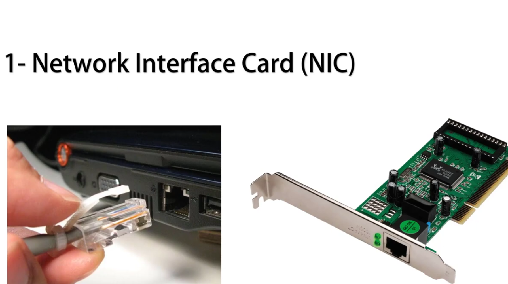
 
<em>كرت الشبكة (NIC) وطريقة توصيل الكابل بيه</em>

**دوره وعملياته:** بيحوّل البيانات الرقمية جوه الجهاز لإشارات كهربائية أو ضوئية أو راديوية تناسب الوسيط الناقل (وقت الإرسال)، والعكس (وقت الاستقبال)، وبيبني إطار الإيثرنت ويضيفله عنوان الـ MAC المصدر والوجهة.

**ملاءمته لمعمارية ووسيط الشبكة:** لازم كرت الشبكة يكون متوافق مع نوع الشبكة نفسها (Ethernet, Token Ring... إلخ) ومع نوع الوسيط المستخدم (كابل نحاس، فايبر، أو لاسلكي)، فمينفعش تركّب كرت شبكة سلكي على شبكة لاسلكية بالكامل مثلاً.

**الـ Transceiver ووظائفه:** جوه كرت الشبكة (أو كمكوّن منفصل قابل للاستبدال في بعض الأنواع) فيه دائرة اسمها **Transceiver** (اختصار Transmitter + Receiver)، ومهمتها تحويل البيانات لإشارة تناسب الوسيط الناقل وقت الإرسال، واستقبال الإشارة وتحويلها لبيانات رقمية وقت الاستقبال. بيختلف شكل ونوع الـ Transceiver حسب الوسيط (نحاس، فايبر) وحسب طريقة تعامله مع البيانات (إرسال واستقبال في نفس الوقت أو بالتبادل).

**التوقيت (Timing/Clock):** كرت الشبكة بيحتوي كمان على دائرة توقيت (Clock/Timer) مسؤولة عن ضبط توقيت إرسال واستقبال البتات (Bits) بدقة، عشان الجهازين المتصلين يقدروا يفهموا بداية ونهاية كل بت بالظبط ويتجنبوا أي تداخل أو فقدان بيانات.

**وحدات وأنواع NIC:** بييجي على شكل كرت داخلي (PCIe)، أو USB خارجي، أو مدمج في اللوحة الأم (Onboard)، وممكن يكون سلكي (Ethernet) أو لاسلكي (Wi-Fi).

**البروتوكولات المرتبطة:** بروتوكول Ethernet (IEEE 802.3) لبناء الإطار، وبروتوكول ARP لربط عنوان الـ IP بعنوان الـ MAC.

<h3 dir="rtl" align="right" id="modem-adsl">2️⃣.2 المودم (Modem) وتقنية ADSL</h3>

**Modem** (اختصار **Mo**dulator-**Dem**odulator) هو جهاز بيوصّل الشبكة المحلية بشبكة خارجية (زي الإنترنت) عبر خطوط الهاتف أو الكابل أو الألياف الضوئية، وسمّي بالاسم ده لأن وظيفته الأساسية هي **التضمين (Modulation)**: تحويل الإشارة الرقمية (Digital) من جهاز الكمبيوتر لإشارة تناظرية (Analog) تقدر تتنقل على خط الهاتف مثلاً، و**فك التضمين (Demodulation)**: تحويل الإشارة التناظرية القادمة من الخط لإشارة رقمية يفهمها الجهاز.

**مهامه:** ربط الشبكة المحلية بمزوّد خدمة الإنترنت (ISP)، وتحويل نوع الإشارة بين الشبكتين المختلفتين.

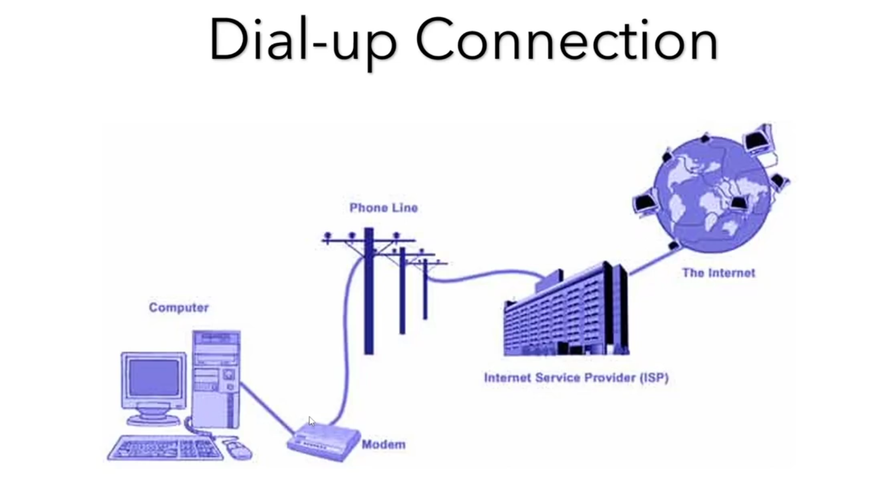
 
<em>فكرة اتصال المودم بخط الهاتف (Dial-up Connection) لربط الشبكة المحلية بالإنترنت</em>

**تقنية ADSL (Asymmetric Digital Subscriber Line):** هي أشهر تقنية مودم مستخدمة لتوصيل الإنترنت عبر خطوط الهاتف النحاسية العادية، وسُميت **"Asymmetric" (غير متماثلة)** لأن سرعة التحميل (Download) بتكون أعلى بكتير من سرعة الرفع (Upload)، وده مناسب لطبيعة استخدام أغلب المستخدمين (تصفح وتحميل أكتر من رفع). الميزة الكبيرة فيها إنها بتستخدم **نطاق ترددي مختلف** عن نطاق المكالمات الصوتية العادية على نفس الخط، فتقدر تستخدم الإنترنت والتليفون في نفس الوقت من غير تعارض.

**البروتوكولات المرتبطة:** بروتوكول PPP (Point-to-Point Protocol)، وبروتوكول PPPoE (PPP over Ethernet) في اتصالات ADSL الحديثة.

<h3 dir="rtl" align="right" id="dslam">2️⃣.3 مجمّع خطوط المشتركين الرقمية (DSLAM)</h3>

**DSLAM (Digital Subscriber Line Access Multiplexer)** هو جهاز بيقعد في **مقسم شركة الاتصالات (Central Office)** بتاعة مزوّد الخدمة، مش عند المستخدم، ومهمته إنه **يجمّع (Multiplex)** إشارات الـ ADSL القادمة من عدد كبير من خطوط المشتركين المختلفة (كل واحد منهم عنده مودم في بيته) في اتصال واحد عالي السرعة، ويبعتها لشبكة مزوّد الخدمة الأساسية، والعكس.

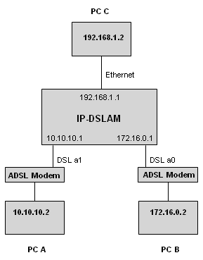
 
<em>موقع جهاز DSLAM بين مودمات المشتركين وشبكة مزوّد خدمة الإنترنت</em>

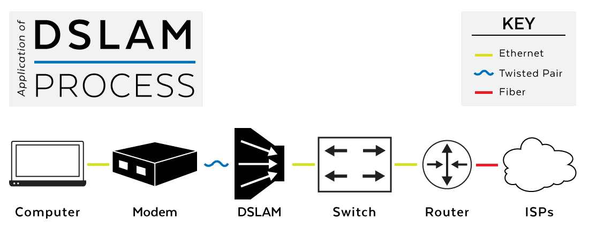
 
<em>رسم توضيحي لفكرة عمل DSLAM في تجميع خطوط ADSL المتعددة</em>

**الفرق بينه وبين المودم:** المودم جهاز موجود **عند المستخدم** ويخدم اتصال واحد بس، بينما الـ DSLAM جهاز موجود **عند مزوّد الخدمة** ويجمّع مئات أو آلاف الاتصالات مع بعض في نفس الوقت.

**البروتوكولات المرتبطة:** كان يعتمد تاريخيًا على ATM (Asynchronous Transfer Mode) لنقل بيانات المشتركين المجمّعة، والأجهزة الحديثة بقت تعتمد على Ethernet.

<h3 dir="rtl" align="right" id="transceiver">2️⃣.4 الـ Transceiver: الأشكال والأنواع (SFP و XFP)</h3>

الـ Transceiver مش شكل واحد بس؛ بييجي في أشكال وأحجام مختلفة حسب الجهاز والاستخدام، وأشهر نوعين قابلين للاستبدال (Hot-swappable Modules) هما:

**SFP (Small Form-factor Pluggable):** وحدة إرسال/استقبال صغيرة الحجم وقابلة للتركيب والإزالة في منافذ مخصصة على أجهزة الشبكة (زي السويتشات)، بتستخدم غالبًا في اتصالات الجيجابت (1 Gbps) عبر كابلات نحاس أو فايبر.

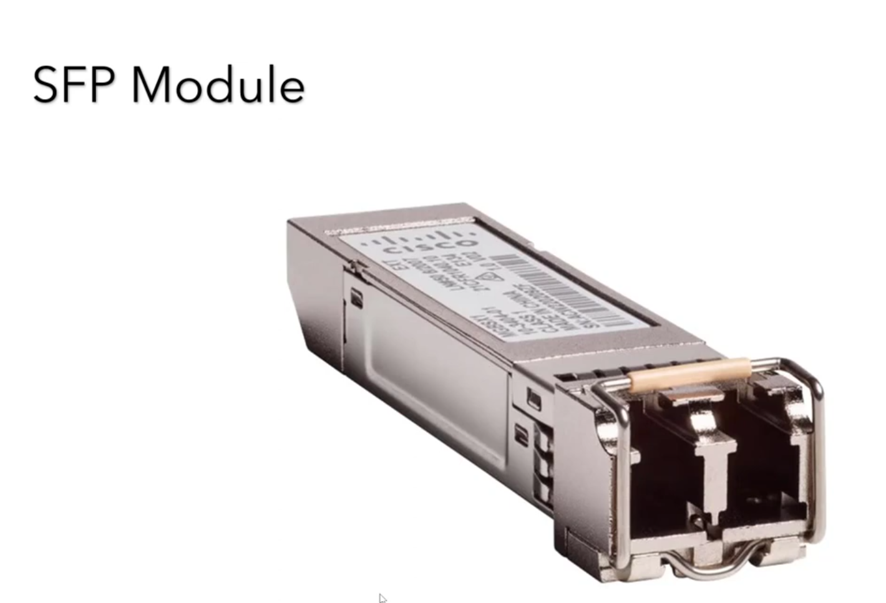
 
<em>وحدة SFP وشكلها الفعلي</em>

**XFP (10 Gigabit Small Form-factor Pluggable):** نسخة مشابهة للـ SFP لكن مصممة لسرعات أعلى بكتير، بتدعم عادة **10 Gbps**.

**الفرق بينهم:** الفرق الجوهري هو **السرعة**؛ الـ SFP مصمم بشكل أساسي لسرعات حتى 1 Gbps، بينما الـ XFP مصمم لسرعات 10 Gbps، وده بيخليه أكبر شوية في الحجم ومستهلك طاقة أكتر من الـ SFP التقليدي.

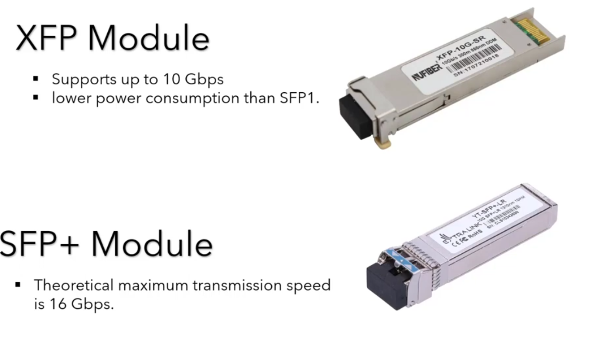
 
<em>مقارنة شكلية بين وحدات SFP و XFP</em>

<h3 dir="rtl" align="right" id="media-converter">2️⃣.5 محول الوسائط (Media Converter)</h3>

مشكلة شائعة في الشبكات: لو جهاز بيستخدم نوع منفذ أو وسيط مختلف عن الجهاز اللي عايز يتوصل بيه (مثلاً جهاز بمنفذ كابل نحاسي وعايز يتوصل بسيرفر منفذه فايبر)، هنا بييجي دور **Media Converter (محول الوسائط)**، وهو جهاز بسيط مهمته إنه يحوّل الإشارة من نوع وسيط لنوع تاني (زي التحويل من كابل نحاس لفايبر أو العكس)، عشان يوصل بين جهازين بمنافذ مختلفة من غير ما يحتاج تغيير كرت الشبكة نفسه.

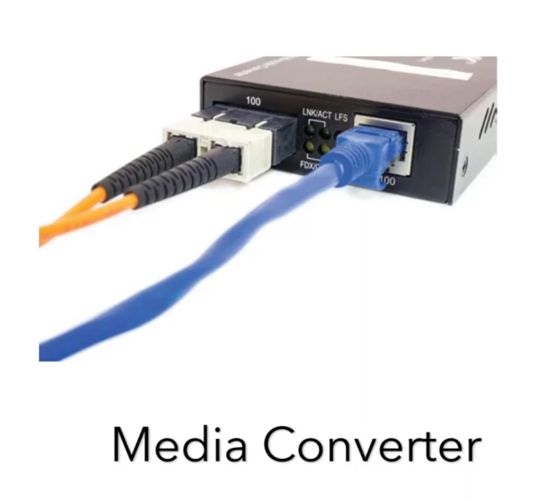
 
<em>محول الوسائط (Media Converter) وطريقة عمله بين نوعين مختلفين من الكابلات</em>

<h3 dir="rtl" align="right" id="connectors-terminators">2️⃣.6 الموصلات ومقاومات الإنهاء (Connectors و Terminators)</h3>

**Connectors (الموصلات):** هي القطع المعدنية/البلاستيكية اللي بتتركب في نهاية الكابل عشان تسمح بتوصيله فعليًا بمنفذ الجهاز أو السويتش، وكل نوع كابل له نوع موصل مخصص بيه (زي RJ-45 لكابلات الشبكة النحاسية، وRJ-11 لخطوط الهاتف، وموصلات زي SC وLC لكابلات الفايبر).

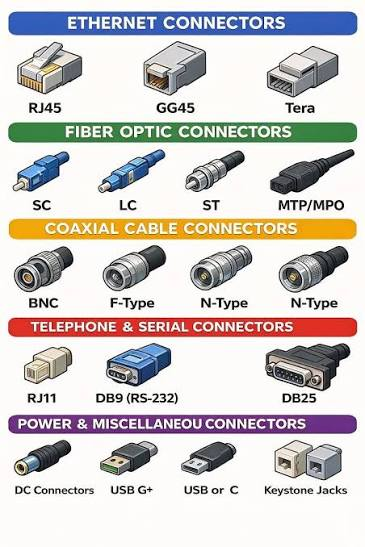
 
<em>مثال على موصل (Connector) بيتركب في نهاية الكابل</em>

**Terminators (مقاومات الإنهاء):** قطعة صغيرة بتتركب في **نهاية** الكابل (خصوصًا في طوبولوجيا الـ Bus القديمة اللي بتستخدم كابل محوري Coaxial)، ومهمتها إنها **تمتص** الإشارة الكهربائية وتمنعها من الارتداد (Reflection) وترجع تاني على الكابل، لأن ارتداد الإشارة كان بيسبب تشويش وتصادم في الشبكات القديمة. من غير الـ Terminator في آخر الكابل، الشبكة كلها مكانتش هتشتغل صح.

---

<h2 dir="rtl" align="right" id="network-devices">3️⃣ ثانياً: أجهزة الشبكة الأساسية (Network Devices)</h2>

المجموعة دي بتوضح إزاي تطورت أجهزة توصيل الشبكة المحلية عبر الوقت، من أبسط جهاز (Hub) لأذكى جهاز (Switch)، وكل جهاز جديد كان بيحل مشكلة الجهاز اللي قبله.

<h3 dir="rtl" align="right" id="hub">3️⃣.1 Hub</h3>

**التعريف:** جهاز يعمل على **الطبقة الأولى (Physical Layer)** بس، ومهمته الوحيدة إنه يستقبل الإشارة الكهربائية من أي منفذ ويكررها (Repeat) لكل باقي المنافذ بالكامل، من غير أي "ذكاء" أو معرفة بعناوين الأجهزة المتصلة بيه.

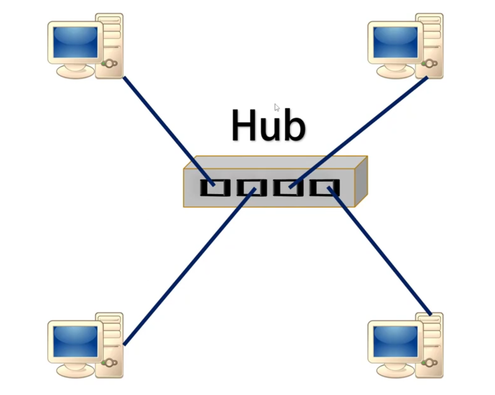
 
<em>جهاز Hub وطريقة توصيل الأجهزة بيه</em>

**فكرة عمله:** لما إشارة توصله من جهاز معين، بيعمل **Broadcast** ليها لكل المنافذ التانية كلها، وكل الأجهزة المتصلة بيه بتستقبل الإشارة وتقرر بنفسها هل هي المُرسَل ليها ولا لأ.

**عيوبه:** بيخلي كل الأجهزة المتصلة بيه في **مجال تصادم واحد (Collision Domain)** ومجال بث واحد، فكلما زاد عدد الأجهزة زادت احتمالية التصادم وقل أداء الشبكة، وبيشتغل في وضع **Half Duplex** بس (إرسال أو استقبال، مش الاتنين مع بعض).

**أنواعه:** فيه **Active Hub** (بيقوّي الإشارة قبل ما يعيد بثها، ومحتاج مصدر كهرباء) و**Passive Hub** (مجرد موزّع بدون تقوية للإشارة).

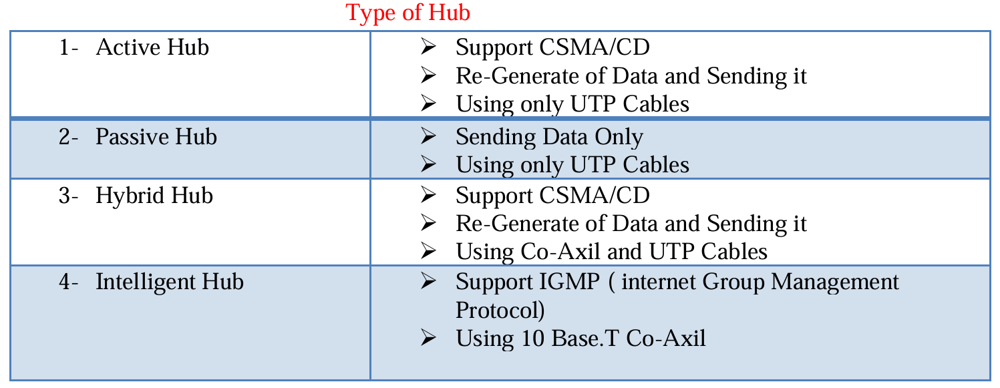
 
<em>الفرق بين Active Hub و Passive Hub</em>

**الفرق بينه وبين Switch:** الـ Hub بيعمل Broadcast لكل حاجة بيستقبلها، أما الـ Switch فبيبعت البيانات للجهاز المطلوب بس. وده خلى الـ Hub يختفي عمليًا من الاستخدام لصالح الـ Switch.

**البروتوكولات المرتبطة:** مفيش — الهاب بيشتغل على الطبقة الفيزيائية بس من غير أي فهم أو معالجة للبروتوكولات، وبس بيكرر الإشارة الكهربائية زي ما هي.

<h3 dir="rtl" align="right" id="bridge">3️⃣.2 Bridge</h3>

**التعريف:** جهاز يعمل على **الطبقة الثانية (Data Link Layer)**، ومهمته إنه يقسّم الشبكة المحلية الواحدة لجزئين (Segments) منفصلين، عشان يقلل من حجم مجال التصادم في كل جزء.

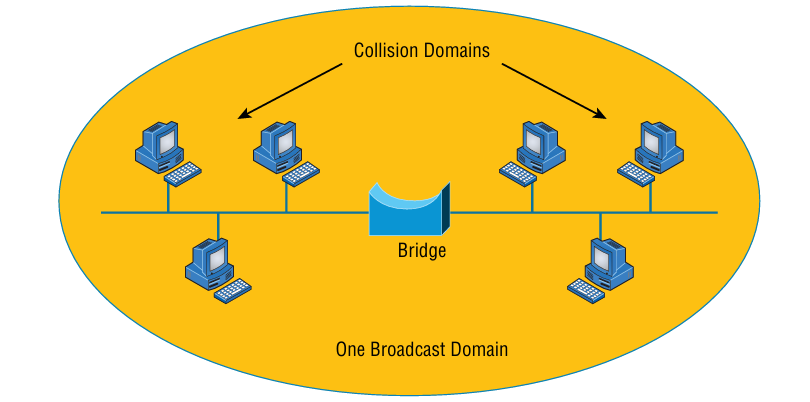
 
<em>جهاز Bridge وموقعه بين جزئين من الشبكة</em>

**فكرة عمله:** بيتعلم عناوين الـ MAC Address بتاعة الأجهزة الموجودة في كل جزء من الشبكة، وبيستخدم المعلومة دي عشان يقرر: لو البيانات جاية من جزء ورايحة لجهاز في نفس الجزء، مايعديهاش للجزء التاني (فلترة)؛ ولو رايحة لجهاز في الجزء التاني، يعديها بس للجزء ده.

**أنواعه:** Transparent Bridge (بيبني جدول العناوين بنفسه أوتوماتيكيًا)، وTranslation Bridge (بيربط شبكتين بمعيارين مختلفين، زي Ethernet وToken Ring).

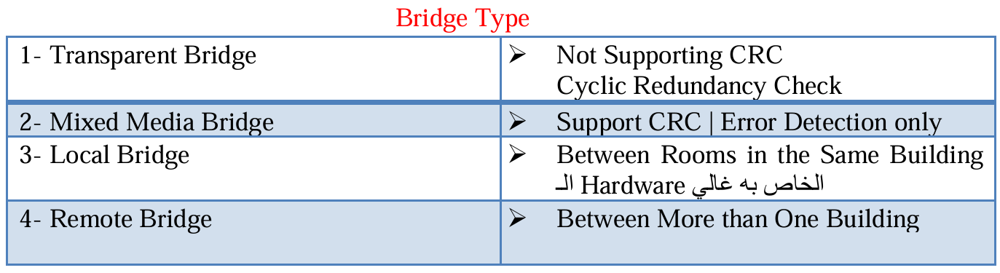
 
<em>أنواع الـ Bridge المختلفة</em>

**الفرق بينه وبين Switch:** الـ Switch عمليًا هو تطور طبيعي للـ Bridge — ممكن تقول إن **السويتش هو "Bridge متعدد المنافذ"**، لكن بأداء أسرع بكتير (لأن الفلترة بتتم عن طريق هاردوير مخصص Hardware-based بدل السوفتوير)، وبمنافذ أكتر بكتير.

**البروتوكولات المرتبطة:** بروتوكول Spanning Tree Protocol (STP) لمنع الحلقات (Loops) لو فيه أكتر من مسار بين الأجزاء المختلفة.

<h3 dir="rtl" align="right" id="switch">3️⃣.3 Switch</h3>

**التعريف:** جهاز يعمل على **الطبقة الثانية (Data Link Layer)**، وهو الجهاز الأساسي في أي شبكة محلية حديثة، بيوصّل الأجهزة ببعضها بذكاء عن طريق عنوان الـ MAC Address.

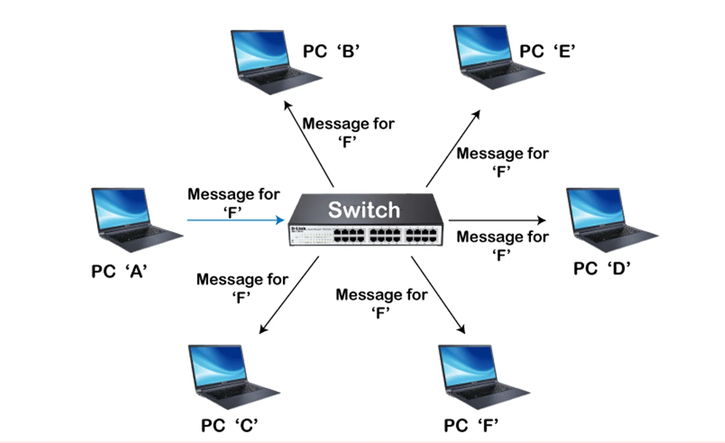
 
<em>جهاز Switch وطريقة توصيل الأجهزة بيه</em>

**فكرة عمله (كيفية بناء جدول العناوين):** لما يستقبل السويتش أول Frame من جهاز معين على منفذ معين، بيسجّل في جدول داخلي اسمه **MAC Address Table** إن عنوان الـ MAC ده موجود على المنفذ ده. بعدين، لما يستقبل Frame وعنوان الوجهة بتاعه موجود في الجدول، بيبعته **مباشرة** على المنفذ الصح بس (Forwarding). لو عنوان الوجهة **مش** موجود في الجدول لسه، بيعمل **Flooding** (يبعته لكل المنافذ ماعدا اللي جاله منه) لحد ما الجهاز المطلوب يرد ويتسجل عنوانه في الجدول.

**طرق التحويل الداخلية (Switching Modes):** السويتش بيقدر يعالج الإطار بأكتر من طريقة: **Store-and-Forward** (بيستقبل الإطار كامل ويتأكد من سلامته عن طريق FCS قبل ما يحوّله، أدق لكن أبطأ شوية)، و**Cut-Through** (بيبدأ يحوّل الإطار بمجرد ما يقرا عنوان الوجهة بس من غير انتظار الإطار كامل، أسرع لكن من غير فحص أخطاء)، و**Fragment-Free** (حل وسط بين الاتنين، بيستنى أول 64 بايت بس قبل التحويل).

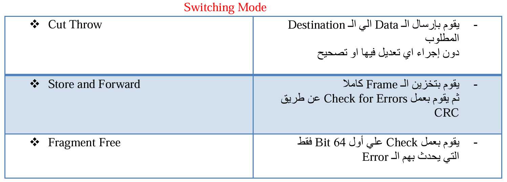
 
<em>مقارنة بين طرق التحويل المختلفة في السويتش: Store-and-Forward وCut-Through</em>

**مميزاته:** كل منفذ في السويتش بيمثل **مجال تصادم منفصل**، وبيدعم وضع **Full Duplex** (إرسال واستقبال في نفس الوقت)، وده بيلغي التصادم تمامًا وبيحسّن الأداء بشكل كبير جدًا مقارنة بالـ Hub.

**أنواعه:** Unmanaged Switch (بدون إعدادات، Plug and Play)، وManaged Switch (بيدعم إعدادات متقدمة زي VLANs ومراقبة الأداء).

**الفرق بينه وبين Hub:** زي ما اتوضح، السويتش بيبعت البيانات للجهاز المطلوب بس (Unicast ذكي)، بينما الـ Hub بيعمل Broadcast لكل حاجة.

**البروتوكولات المرتبطة:** Spanning Tree Protocol (STP) لمنع الحلقات، وIEEE 802.1Q لدعم الـ VLANs، وLACP لتجميع الروابط (EtherChannel).

<h3 dir="rtl" align="right" id="wap-contention">3️⃣.4 نقطة الوصول اللاسلكية (WAP) وطرق التنافس (Contention Methods)</h3>

**Wireless Access Point (WAP)** هو جهاز بيسمح للأجهزة اللاسلكية (Wi-Fi) إنها تتصل بالشبكة السلكية، وبيشتغل بشكل أساسي على **الطبقة الثانية (Data Link Layer)**، وممكن يُعتبر بمثابة "جسر" بين العالم اللاسلكي والعالم السلكي.

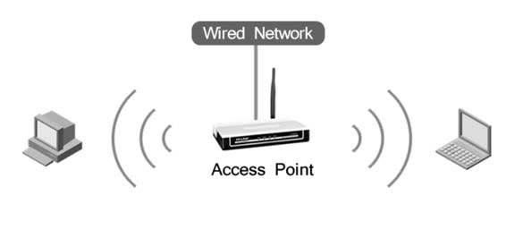
 
<em>نقطة الوصول اللاسلكية (Wireless Access Point) وطريقة ربطها بين الشبكة السلكية والأجهزة اللاسلكية</em>

**فكرة عمله:** بيبث اسم الشبكة (SSID) عشان الأجهزة تقدر تكتشفه وتتصل بيه، وبيحوّل البيانات بين الإطارات اللاسلكية (802.11) وإطارات الإيثرنت السلكية العادية.

**طرق التنافس على الوسيط (Contention Methods):** لأن الوسيط اللاسلكي **مشترك** بين كل الأجهزة (زي الهواء نفسه)، محتاجة آلية تحكم في الوصول له، وهنا بييجي الفرق بين طريقتين مهمين:

- **CSMA/CD (Carrier Sense Multiple Access with Collision **Detection**):** المستخدمة في الإيثرنت السلكية القديمة — الجهاز يكتشف التصادم **بعد** ما يحصل ويتعامل معاه.
- **CSMA/CA (Carrier Sense Multiple Access with Collision **Avoidance**):** المستخدمة في الشبكات اللاسلكية — بما إن اكتشاف التصادم صعب جدًا في الوسط اللاسلكي، الجهاز بيحاول **يتجنب** حدوث التصادم من الأساس، عن طريق انتظار فترة عشوائية قبل الإرسال وإرسال إشارة تنبيه (RTS/CTS) قبل البيانات الفعلية.

**الفرق بينها وبين Router:**

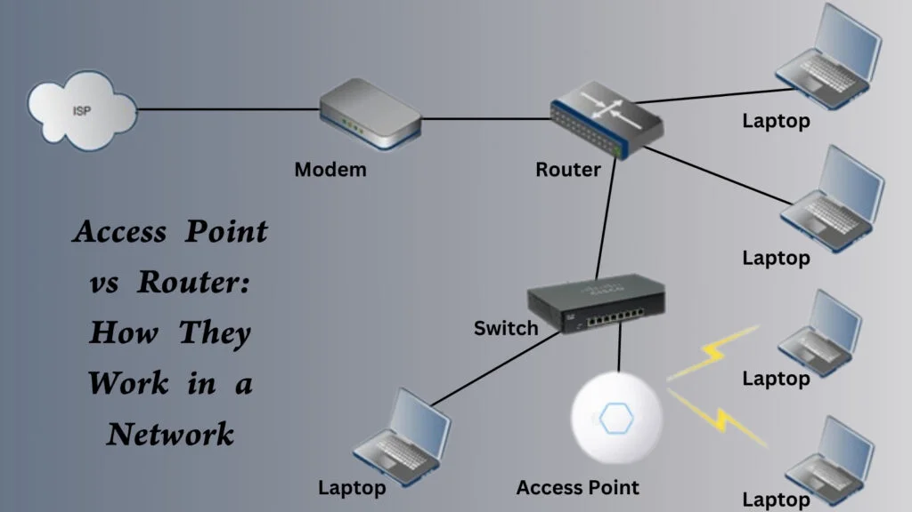
 
<em>الفرق بين نقطة الوصول اللاسلكية (WAP) والراوتر من ناحية الوظيفة والاتصالات</em>

نقطة الوصول بتوصّل الأجهزة اللاسلكية **بشبكة سلكية موجودة بالفعل** بس (وظيفتها في حدود الطبقة الثانية)، بينما الراوتر بيوصّل شبكات مختلفة ببعضها ويوجّه البيانات بينها (وظيفته في الطبقة الثالثة) — وأغلب أجهزة الراوتر المنزلية دلوقتي بتجمع الوظيفتين مع بعض (Router + Switch + WAP) في جهاز واحد.

**البروتوكولات المرتبطة:** معايير 802.11 (a/b/g/n/ac/ax) لتنظيم الاتصال اللاسلكي، وبروتوكولات التشفير WPA2/WPA3 لتأمين الشبكة.

**الفرق بينها وبين Range Extender:** الـ WAP بتوصّل الشبكة اللاسلكية بالشبكة **السلكية** الأساسية، بينما موسّع المدى بيكرر ويقوّي إشارة شبكة لاسلكية موجودة بالفعل من غير ما يضيف اتصال سلكي جديد (هنشرحه بالتفصيل لاحقًا).

---

<h2 dir="rtl" align="right" id="internetwork-devices">4️⃣ ثالثاً: أجهزة الربط بين الشبكات (Internetwork Devices)</h2>

المجموعة دي بتضم الأجهزة اللي بتوصّل شبكات مختلفة تمامًا ببعضها، مش بس أجهزة جوه نفس الشبكة المحلية.

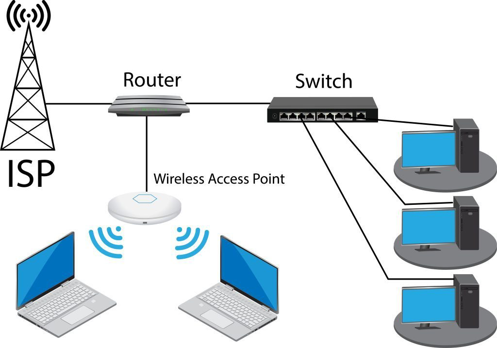
 
<em>الصورة الكاملة: إزاي مزوّد الخدمة (ISP) بيتوصل بالراوتر، والراوتر بالسويتش ونقطة الوصول اللاسلكية، وصولاً للأجهزة النهائية</em>

<h3 dir="rtl" align="right" id="router">4️⃣.1 الراوتر (Router)</h3>

**التعريف:** جهاز يعمل على **الطبقة الثالثة (Network Layer)**، ومهمته الأساسية إنه يوصّل شبكات مختلفة ببعضها ويوجّه البيانات بينها بناءً على عنوان الـ IP.

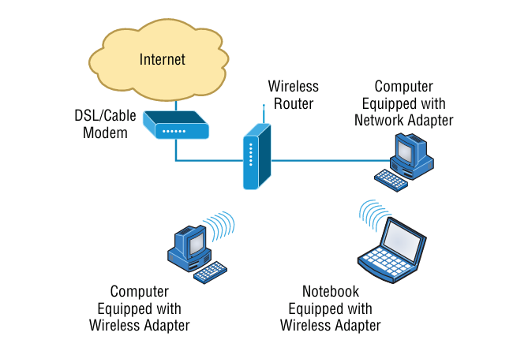
 
<em>راوتر لاسلكي منزلي نموذجي</em>

**فكرة عمله (عملية الـ Forwarding بالتفصيل):** لما يستقبل الراوتر حزمة بيانات (Packet)، بيعمل الخطوات دي:

1. بيفك تغليف الإطار (Frame) لحد ما يوصل لطبقة الـ **IP (Layer 3)**، ويقرا عنوان الـ **IP الوجهة** الموجود في الـ Header بتاعها.
2. بيرجع لجدول داخلي اسمه **Routing Table**، وبيدوّر على أفضل مسار (Best Path) يوصل بيه لشبكة عنوان الـ IP ده.
3. بمجرد ما يحدد المنفذ الصح (Interface) اللي هيبعت منه، بيحتاج يعرف عنوان الـ **MAC** بتاع الجهاز التالي في المسار (Next Hop) — ولو مش عارفه، بيستخدم بروتوكول **ARP** عشان يجيبه.
4. بيبني إطار إيثرنت **جديد بالكامل** بعنوان MAC مصدر ووجهة جديدين (بتاعة الراوتر نفسه والجهاز التالي)، لكن **عنوان الـ IP المصدر والوجهة بيفضلوا زي ما هما** من البداية للنهاية طول رحلة الحزمة (إلا في حالات NAT).

النقطة دي مهمة جدًا تفهمها: **عنوان الـ IP بيفضل ثابت طول الرحلة، لكن عنوان الـ MAC بيتغير في كل قفزة (Hop) بين راوتر وراوتر** — وده الفرق الجوهري بين العنونة على الطبقة التالتة والطبقة التانية.

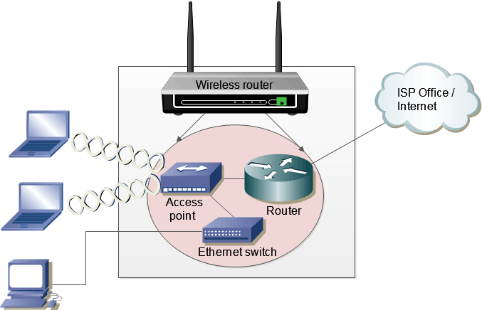
 
<em>المكوّنات الداخلية لراوتر لاسلكي نموذجي</em>

**مميزاته:** يقدر يربط شبكات بتستخدم تقنيات مختلفة تمامًا، وبيقسّم مجالات البث (Broadcast Domains).

**أنواعه:** Edge Router (بيربط الشبكة الداخلية بالإنترنت)، وCore Router (بيوجّه البيانات جوه شبكة كبيرة بين راوترات تانية).

**الفرق بينه وبين Switch:** السويتش بيوصّل أجهزة **جوه** نفس الشبكة باستخدام MAC Address، أما الراوتر فبيوصّل **بين** شبكات مختلفة تمامًا باستخدام IP Address، وبياخد قرار "أفضل مسار" مش مجرد توصيل مباشر.

**البروتوكولات المرتبطة:** بروتوكولات IP وARP وICMP بشكل أساسي، بالإضافة لبروتوكولات التوجيه زي OSPF وEIGRP وBGP لتبادل معلومات المسارات مع راوترات تانية، وبروتوكول NAT لترجمة العناوين.

<h3 dir="rtl" align="right" id="firewall">4️⃣.2 جدار الحماية (Firewall)</h3>

**التعريف:** جهاز (أو برنامج) مهمته **فلترة حركة المرور (Traffic)** الداخلة والخارجة من الشبكة بناءً على مجموعة قواعد (Rules) محددة مسبقًا، عشان يسمح بالمرور المسموح ويمنع المرور المشبوه أو غير المصرّح بيه.

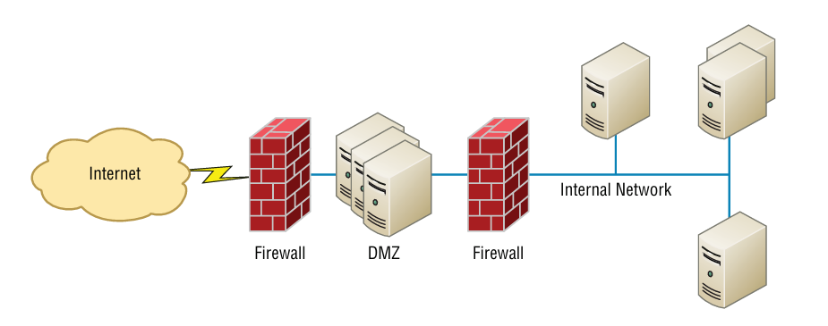
 
<em>جدار الحماية (Firewall) وموقعه بين الشبكة الداخلية والعالم الخارجي</em>

**فكرة عمله:** بيفحص كل حزمة بيانات عابرة ويقارنها بقواعده (زي عنوان IP، رقم البورت، أو حتى محتوى البيانات نفسها في الأنواع المتقدمة)، وبيقرر يسمح بالمرور أو يمنعه.

**أنواعه:**

- **Packet-Filtering Firewall:** يعمل على الطبقة الثالثة، بيفحص عنوان IP والبورت بس، من غير معرفة بحالة الاتصال.
- **Stateful Firewall:** يعمل على الطبقة الرابعة، بيتابع **حالة الاتصال** بالكامل (Stateful Inspection)، مش بس الحزمة المنفردة.
- **NGFW (Next-Generation Firewall) / Layer 7 Firewall:** يعمل على طبقة الـ Application، بيفحص **محتوى** البيانات نفسها (زي نوع الملف أو الموقع المطلوب)، وبيقدر يميز بين التطبيقات المختلفة حتى لو بتستخدم نفس البورت.

**الفرق بينه وبين Router:** بعض الراوترات بتقدر تعمل فلترة بسيطة (Access Control Lists)، لكن وظيفة الراوتر الأساسية هي **التوجيه**، بينما وظيفة الـ Firewall الأساسية هي **الفحص والحماية**، وممكن الجهاز الواحد يجمع الوظيفتين في أجهزة الشبكات المنزلية الصغيرة.

**البروتوكولات المرتبطة:** بيفحص حركة TCP/UDP/IP بشكل أساسي، والأنواع المتقدمة (NGFW) بتفهم بروتوكولات الطبقة السابعة زي HTTP/HTTPS.

<h3 dir="rtl" align="right" id="multilayer-switch">4️⃣.3 السويتش متعدد الطبقات (Multilayer Switch)</h3>

**التعريف:** جهاز بيجمع بين وظائف **السويتش العادي (Layer 2)** ووظائف **الراوتر (Layer 3)** في جهاز واحد، ولذلك بيُعرف كمان باسم **Layer 3 Switch**.

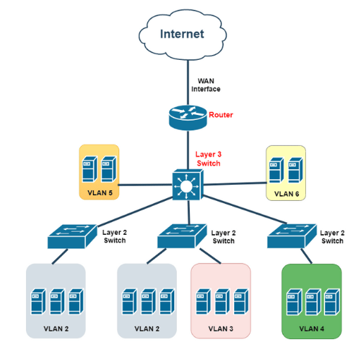
 
<em>الفرق بين Layer 2 Switch و Layer 3 Switch</em>

**فكرة عمله:** بيقدر يوجّه البيانات بين شبكات فرعية مختلفة (زي بين VLANs مختلفة) باستخدام عنوان الـ IP، بنفس سرعة السويتش العادي تقريبًا (لأن التوجيه بيتم عن طريق هاردوير متخصص مش سوفتوير زي الراوتر التقليدي)، بالإضافة لوظائفه العادية كسويتش.

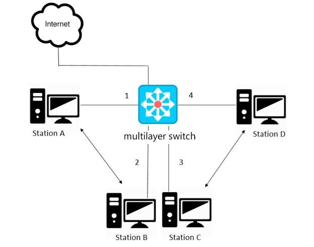
 
<em>السويتش متعدد الطبقات (Multilayer Switch) واستخدامه في الشبكات الكبيرة</em>

**استخدامه:** بيُستخدم غالبًا في الشبكات الكبيرة (زي شبكات الشركات ومراكز البيانات) عشان يقلل الحاجة لراوتر منفصل لكل عملية توجيه بين الـ VLANs.

**الفرق بينه وبين الراوتر العادي:** الراوتر التقليدي أقوى في وظائف التوجيه المعقدة والاتصال بشبكات خارجية بعيدة (WAN)، بينما السويتش متعدد الطبقات أسرع وأنسب للتوجيه **الداخلي** بين شبكات فرعية جوه نفس المؤسسة.

**البروتوكولات المرتبطة:** نفس بروتوكولات السويتش (STP، 802.1Q)، بالإضافة لبروتوكولات توجيه زي OSPF للتوجيه الداخلي بين الـ VLANs.

---

<h2 dir="rtl" align="right" id="other-devices">5️⃣ رابعاً: أجهزة وخدمات إضافية في الشبكة</h2>

المجموعة دي بتضم أجهزة متخصصة لوظائف معينة، مش بالضرورة أساسية لتوصيل الشبكة، لكنها بتحسّن أداءها أو أمانها أو بتوفر خدمات إضافية.

<h3 dir="rtl" align="right" id="repeater">5️⃣.1 Repeater</h3>

جهاز يعمل على **الطبقة الأولى (Physical)**، مهمته إنه يستقبل الإشارة الضعيفة (اللي هتضمحل بسبب طول الكابل) ويقويها (Regenerate) من غير أي تعديل في المحتوى، عشان تكمل مسارها لمسافة أطول من غير فقدان جودة. **الفرق بينه وبين Media Converter:** الـ Repeater بيقوّي نفس نوع الإشارة على نفس نوع الوسيط، بينما محول الوسائط بيحوّل الإشارة من نوع وسيط لنوع تاني تمامًا.

**البروتوكولات المرتبطة:** مفيش — بيشتغل على الطبقة الفيزيائية بس زي الهاب تمامًا.

<h3 dir="rtl" align="right" id="ids-ips">5️⃣.2 IDS و IPS</h3>

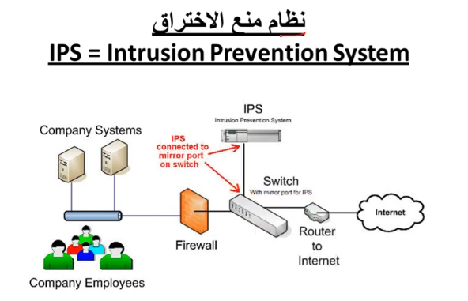
 
<em>موقع جهاز IPS في مسار حركة المرور</em>

| المقارنة | IDS (Intrusion Detection System) | IPS (Intrusion Prevention System) |
|:---:|:---:|:---:|
| طريقة العمل | مراقبة فقط (Passive) | مراقبة وتدخّل فعلي (Active) |
| الاستجابة للتهديد | بيكتشف ويُبلّغ (Alert) بس | بيكتشف **ويمنع** التهديد مباشرة |
| موقعه في الشبكة | خارج مسار البيانات (Out-of-band) | داخل مسار البيانات مباشرة (Inline) |
| التأثير على الأداء | أقل تأثيرًا | ممكن يسبب تأخير بسيط لأنه Inline |

**الفرق الجوهري بينهم:** الـ IDS بيشتغل زي "كاميرا مراقبة" بتصور وتبلّغ، أما الـ IPS بيشتغل زي "حارس أمن" بيوقف التهديد فعليًا في اللحظة.

**البروتوكولات المرتبطة:** بيراقب حركة كل البروتوكولات على الشبكة (زي TCP/IP وHTTP) عن طريق مقارنتها بتوقيعات هجمات معروفة (Signatures).

<h3 dir="rtl" align="right" id="csu-dsu">5️⃣.3 CSU/DSU</h3>

**CSU/DSU (Channel Service Unit / Data Service Unit)** جهاز يعمل على **الطبقة الأولى (Physical)**، بيستخدم في الاتصال بخطوط الشبكات الواسعة المؤجرة (WAN Leased Lines زي T1/E1)، ومهمته إنه يحوّل الإشارة الرقمية بتاعة الشبكة المحلية لصيغة متوافقة مع خط الـ WAN، والعكس.

**البروتوكولات المرتبطة:** بروتوكولات خطوط الـ WAN زي HDLC وPPP وFrame Relay.

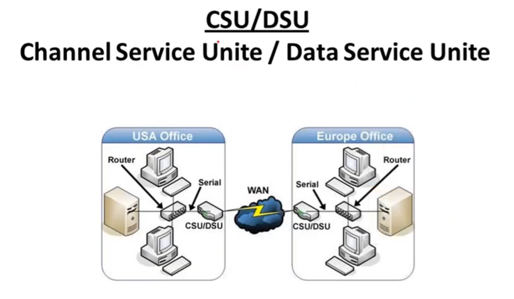
 
<em>جهاز CSU/DSU وموقعه بين الشبكة المحلية وخط الـ WAN</em>

<h3 dir="rtl" align="right" id="server">5️⃣.4 السيرفر (Server)</h3>

جهاز (هاردوير) أو برنامج (سوفتوير) بيقدّم خدمة معينة لباقي الأجهزة على الشبكة (Clients)، زي تخزين الملفات، استضافة المواقع، توزيع عناوين IP (DHCP Server)، أو ترجمة الأسماء (DNS Server). السيرفر مش مرتبط بطبقة واحدة محددة من OSI؛ دوره بيختلف حسب نوع الخدمة اللي بيقدمها.

**البروتوكولات المرتبطة:** بتختلف حسب نوع الخدمة، زي HTTP/HTTPS لسيرفر الويب، وFTP لنقل الملفات، وSMTP/POP3/IMAP للبريد الإلكتروني، وDNS وDHCP للخدمات المساعدة.

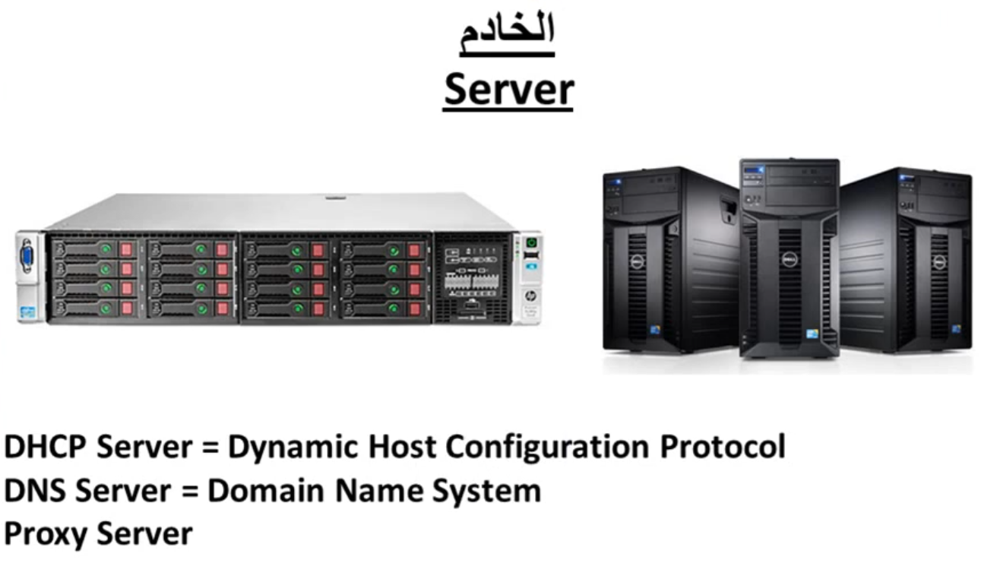
 
<em>جهاز سيرفر نموذجي</em>

<h3 dir="rtl" align="right" id="range-extender">5️⃣.5 موسّع المدى اللاسلكي (Wireless Range Extender)</h3>

جهاز بيستقبل إشارة شبكة لاسلكية موجودة بالفعل ويعيد بثها بعد تقويتها، عشان يوسّع نطاق تغطية الشبكة اللاسلكية لمناطق بعيدة عن نقطة الوصول الأساسية. **الفرق بينه وبين WAP:** موسّع المدى بيكرر شبكة موجودة، بينما نقطة الوصول هي المصدر الأساسي اللي بيوصّل الشبكة اللاسلكية بالشبكة السلكية.

**البروتوكولات المرتبطة:** نفس معايير 802.11 المستخدمة في الشبكة اللاسلكية الأصلية اللي بيكررها.

<h3 dir="rtl" align="right" id="load-balancer">5️⃣.6 موزّع الأحمال (Load Balancer)</h3>

جهاز مهمته إنه يوزّع حركة المرور (Traffic) القادمة على أكتر من سيرفر بدل ما تتركز على سيرفر واحد، عشان يحسّن الأداء ويمنع تحميل سيرفر واحد فوق طاقته. بيعمل على مستوى **الطبقة الرابعة** (بناءً على IP والبورت) أو **الطبقة السابعة** (بناءً على محتوى الطلب نفسه، زي نوع الرابط المطلوب).

**البروتوكولات المرتبطة:** HTTP/HTTPS وTCP، وأحيانًا بيتولى فك تشفير SSL/TLS نيابة عن السيرفرات (SSL Offloading).

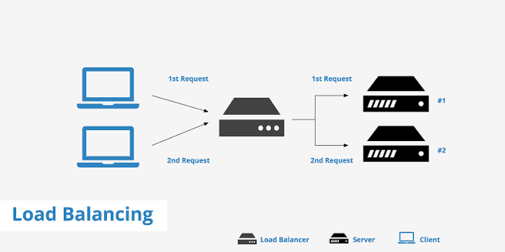
 
<em>جهاز Load Balancer وإعداداته الأساسية</em>

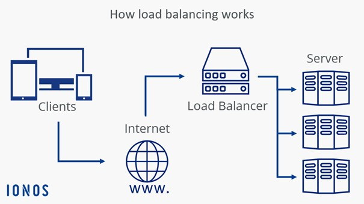
 
<em>فكرة عمل موزّع الأحمال في توزيع الطلبات على أكتر من سيرفر</em>

<h3 dir="rtl" align="right" id="vpn-concentrator">5️⃣.7 مُركّز الـ VPN (VPN Concentrator)</h3>

جهاز متخصص مهمته إنه يدير عدد كبير من اتصالات الـ VPN (Virtual Private Network) في نفس الوقت، وبيتولى عملية التشفير وفك التشفير لكل الاتصالات المشفّرة دي بشكل مركزي، بدل ما كل جهاز يعالج تشفيره بنفسه.

**البروتوكولات المرتبطة:** IPsec وSSL/TLS، وبروتوكولات أقدم زي PPTP وL2TP.

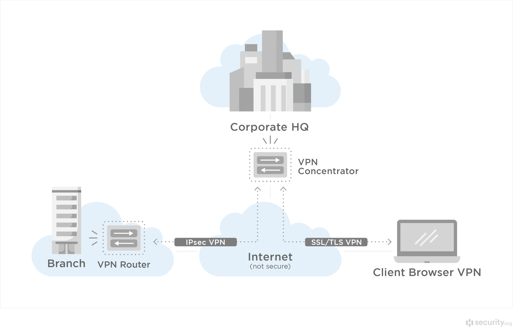
 
<em>جهاز VPN Concentrator وإدارته لعدة اتصالات VPN في نفس الوقت</em>

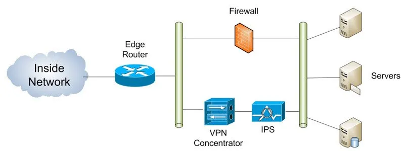
 
<em>شرح موسّع لفكرة عمل شبكات الـ VPN</em>

<h3 dir="rtl" align="right" id="content-filter-shaper">5️⃣.8 فلتر المحتوى ومُشكّل الحزم (Content Filter و Packet Shaper)</h3>

**Content Filter:** جهاز أو برنامج بيمنع الوصول لمحتوى أو مواقع معينة بناءً على سياسة محددة (زي منع مواقع التواصل الاجتماعي في شبكة شركة).

**Packet Shaper (Traffic Shaping):** جهاز أو وظيفة بتتحكم في **كمية وأولوية** حركة المرور على الشبكة، عن طريق إعطاء أولوية لأنواع معينة من البيانات (زي مكالمات الفيديو) على حساب أنواع تانية أقل أهمية (زي تحميل ملف)، وده جزء من مفهوم أشمل اسمه **QoS (Quality of Service)**.

**البروتوكولات المرتبطة:** فلتر المحتوى بيراقب حركة HTTP/HTTPS وDNS بشكل أساسي، ومُشكّل الحزم بيستخدم آليات QoS زي DSCP لتحديد أولوية البيانات.

<h3 dir="rtl" align="right" id="voip-devices">5️⃣.9 أجهزة الـ VoIP: Endpoint، PBX، وGateway</h3>

مجموعة أجهزة مرتبطة بنقل المكالمات الصوتية عبر الشبكة (Voice over IP):

- **VoIP Endpoint:** الجهاز النهائي اللي بيستخدمه المستخدم، زي تليفون IP.
- **VoIP PBX (Private Branch Exchange):** جهاز/نظام بيدير المكالمات الداخلية بين موظفي المؤسسة الواحدة، ويوجّهها للخط الخارجي عند الحاجة.
- **VoIP Gateway:** جهاز بيحوّل بين مكالمات الـ VoIP (الرقمية عبر الشبكة) ونظام الهاتف التقليدي (Analog/PSTN)، بشكل مشابه لفكرة الـ Media Converter لكن للصوت.

**البروتوكولات المرتبطة:** بروتوكول SIP (Session Initiation Protocol) لإنشاء وإدارة المكالمة، وبروتوكول RTP (Real-time Transport Protocol) لنقل الصوت الفعلي أثناء المكالمة.

<h3 dir="rtl" align="right" id="proxy-server">5️⃣.10 السيرفر الوسيط (Proxy Server)</h3>

جهاز بيقف "نيابة" عن جهاز العميل (Client) وبيبعت الطلبات نيابة عنه لسيرفرات تانية، وبيقدر يخزّن نسخ مؤقتة من المحتوى (Caching) لتسريع الطلبات المتكررة، وكمان يستخدم للفلترة والتحكم في المحتوى وإخفاء هوية العميل الحقيقية.

**البروتوكولات المرتبطة:** HTTP/HTTPS بشكل أساسي، وأحيانًا بروتوكول SOCKS.

---

<h2 dir="rtl" align="right" id="dns-dhcp">6️⃣ خامساً: خدمتا DNS و DHCP</h2>

الخدمتين دول من أهم الخدمات الأساسية اللي بتشتغل في خلفية أي شبكة، وبيعتمد عليهم كل جهاز تقريبًا عشان يقدر يتصل ويتصفح بشكل طبيعي.

<h3 dir="rtl" align="right" id="dns">6️⃣.1 خدمة DNS</h3>

**DNS (Domain Name System)** هي خدمة مهمتها **ترجمة أسماء النطاقات (Domain Names)** اللي بيكتبها المستخدم (زي `google.com`) لعنوان **IP** المقابل ليها اللي بيفهمه الجهاز فعليًا، لأن الإنسان بيتعامل بسهولة مع أسماء لكن الأجهزة بتتعامل بعناوين IP بس.

**أنواع سجلات الـ DNS (Record Types):** كل نوع بيانات بيتخزن في نوع سجل مختلف داخل خادم DNS:

| نوع السجل | وظيفته |
|:---:|:---|
| A | بيربط اسم النطاق بعنوان IPv4 |
| AAAA | بيربط اسم النطاق بعنوان IPv6 |
| CNAME | اسم مستعار (Alias) بيوجّه لاسم نطاق تاني بدل ما يتكرر نفس الـ IP |
| MX | بيحدد سيرفر البريد الإلكتروني المسؤول عن استقبال إيميلات النطاق |
| NS | بيحدد سيرفرات الأسماء (Name Servers) المسؤولة رسميًا عن النطاق |
| PTR | عكس سجل A تمامًا؛ بيربط عنوان IP باسم النطاق (تستخدم في البحث العكسي) |
| SRV | بيحدد موقع خدمة معينة (زي بروتوكول أو تطبيق محدد) على السيرفر مع رقم البورت |
| TXT | سجل نصي حر، بيُستخدم غالبًا للتحقق من ملكية النطاق وحماية البريد الإلكتروني (زي سجلات SPF وDKIM لمنع انتحال البريد) |

**الـ DNS الداخلي مقابل الخارجي (Internal vs External DNS):**

* **Internal DNS:** سيرفر DNS خاص بشبكة داخلية (زي شبكة شركة)، بيترجم أسماء أجهزة وموارد داخلية مش متاحة أو معروفة على الإنترنت العام.
* **External DNS:** سيرفرات DNS عامة بتترجم أسماء النطاقات المتاحة للجميع على الإنترنت.

**استضافة الـ DNS عند طرف ثالث (Third-party / Cloud-hosted DNS):** بدل ما المؤسسة تدير سيرفر DNS بنفسها، ممكن تستخدم خدمة DNS جاهزة من طرف تالت (زي Cloudflare أو Google DNS)، وده بيوفر سرعة وموثوقية وحماية إضافية من غير عبء إدارة السيرفر بنفسها.

**التسلسل الهرمي للـ DNS (Hierarchy):** نظام الـ DNS بيشتغل بترتيب هرمي من أعلى لأسفل: **Root Servers** (الجذر، بيمثله `.` في آخر أي اسم نطاق) ⬅ **TLD Servers** (سيرفرات النطاقات العليا زي `.com` أو `.net`) ⬅ **Authoritative Servers** (السيرفر الرسمي المسؤول عن النطاق نفسه زي `example.com`)، وكل مستوى بيوجّه الطلب للمستوى اللي تحته لحد ما يوصل للإجابة النهائية.

**منطقة التوجيه مقابل منطقة العكس (Forward Zone vs Reverse Zone):**

* **Forward Lookup Zone:** بتترجم **اسم النطاق ➜ عنوان IP** (الاستخدام الأشهر والأكثر شيوعًا، زي سجل A).
* **Reverse Lookup Zone:** بتترجم **عنوان IP ➜ اسم النطاق** (عن طريق سجل PTR)، وبتُستخدم غالبًا في أغراض أمنية وتشخيصية زي التحقق من مصدر بريد إلكتروني.

**البروتوكولات والبورت المرتبط:** خدمة DNS بتشتغل على **البورت 53**، وممكن تستخدم UDP (للاستعلامات العادية السريعة) أو TCP (للاستعلامات الأكبر حجمًا أو عمليات نقل المنطقة الكاملة بين السيرفرات).

<h3 dir="rtl" align="right" id="dhcp">6️⃣.2 خدمة DHCP وعملية DORA</h3>

**DHCP (Dynamic Host Configuration Protocol)** هو بروتوكول (وممكن يشتغل كخدمة على سيرفر أو راوتر) مهمته إنه يمنح الأجهزة على الشبكة إعدادات الـ IP بشكل **تلقائي**، بدل ما المستخدم يدخلها يدويًا لكل جهاز.

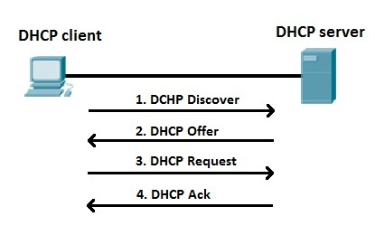
 
<em>بروتوكولا DHCP وDNS ودورهما في تجهيز الجهاز للاتصال بالشبكة</em>

**الهدف منه:** توفير الوقت والجهد وتقليل أخطاء الإعداد اليدوي، وضمان إن كل جهاز ياخد عنوان IP فريد ومناسب للشبكة اللي هو متصل بيها.

**الإعدادات اللي بيوزعها:** عنوان الـ **IP Address**، **Subnet Mask**، عنوان الـ **Default Gateway**، عناوين **DNS Servers**، ومدة صلاحية العنوان (**Lease Time**).

**عملية منح العنوان (DORA):** الجهاز الجديد على الشبكة بياخد عنوان الـ IP بتاعه من سيرفر الـ DHCP عبر 4 خطوات معروفة باسم **DORA**:

1. **D — Discover:** الجهاز الجديد بيبعت رسالة Broadcast يسأل فيها "فيه سيرفر DHCP في الشبكة دي؟".
2. **O — Offer:** سيرفر الـ DHCP (لو موجود) بيرد بعرض يحتوي على عنوان IP متاح وباقي الإعدادات.
3. **R — Request:** الجهاز بيرد بطلب رسمي يأكد فيه إنه عايز يستخدم العنوان المعروض ده تحديدًا.
4. **A — Acknowledge:** السيرفر بيأكد ويمنح العنوان رسميًا للجهاز، وبيبدأ عداد مدة الصلاحية (Lease Time).

**إعدادات إدارة الـ DHCP بالتفصيل:** غير الإعدادات الأساسية اللي بيوزعها، فيه مصطلحات إدارية مهمة بتتحكم في طريقة توزيع العناوين:

| المصطلح | الشرح |
|:---:|:---|
| Pool (Scope) | نطاق العناوين المتاحة للتوزيع التلقائي على أي جهاز يطلب عنوان (مثلًا من `192.168.1.10` لـ `192.168.1.200`) |
| IP Exclusions | عناوين معينة **جوه** نطاق الـ Pool لكن مستثناة من التوزيع التلقائي، عادةً لأنها محجوزة لأجهزة بعنوان ثابت يدوي (زي راوتر أو سيرفر) |
| Reservations (MAC/IP Reservations) | ربط عنوان IP معين بشكل دائم بعنوان MAC معين، بحيث الجهاز ده ياخد **نفس العنوان** في كل مرة يطلب فيها من DHCP (مفيد لأجهزة زي الطابعات أو الكاميرات اللي محتاجة IP ثابت من غير ما تتوصل يدويًا) |
| Scope Options | إعدادات إضافية بتتوزع مع العنوان لكل نطاق (Scope) على حدة، زي بوابة افتراضية أو سيرفرات DNS مختلفة لكل شبكة فرعية |
| Lease Time | المدة اللي الجهاز يقدر يستخدم فيها العنوان قبل ما يحتاج يجدده أو ياخد عنوان جديد |

**البروتوكولات المرتبطة:** بروتوكول DHCP نفسه بيشتغل فوق UDP على البورت **67** (للسيرفر) والبورت **68** (للعميل).

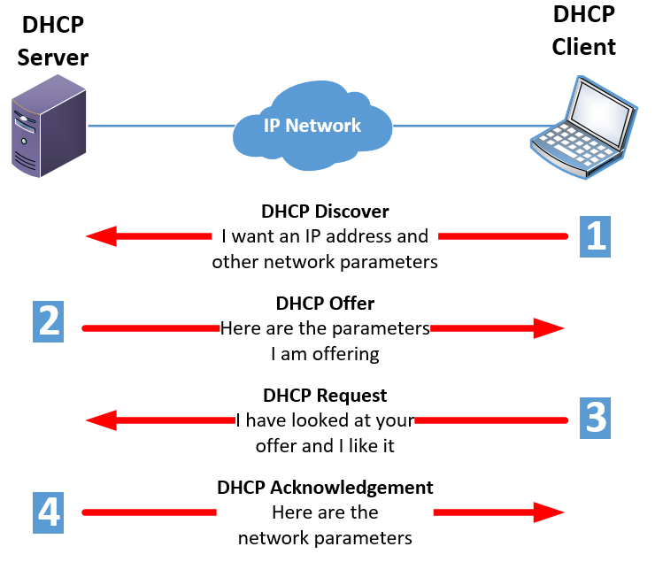
 
<em>مثال على إعدادات وخيارات DHCP إضافية (DHCP Options) بتستخدم في تجهيز أجهزة معينة زي هواتف VoIP</em>

---

<h2 dir="rtl" align="right" id="devices-comparison">7️⃣ مقارنة شاملة بين كل الأجهزة</h2>

| الجهاز | طبقة OSI | العنونة المستخدمة | الوظيفة الأساسية |
|:---:|:---:|:---:|:---:|
| Hub | 1 (Physical) | — | تكرار الإشارة لكل المنافذ (Broadcast) |
| Repeater | 1 (Physical) | — | تقوية الإشارة الضعيفة |
| Media Converter | 1 (Physical) | — | تحويل نوع الوسيط الناقل |
| CSU/DSU | 1 (Physical) | — | تحويل الإشارة لتناسب خطوط WAN |
| DSLAM | 1 (Physical) | — | تجميع خطوط ADSL المتعددة عند مزوّد الخدمة |
| Bridge | 2 (Data Link) | MAC Address | تقسيم مجالات التصادم بين جزئين |
| Switch | 2 (Data Link) | MAC Address | توصيل ذكي داخل الشبكة المحلية |
| Wireless Access Point | 2 (Data Link) | MAC Address | ربط الأجهزة اللاسلكية بالشبكة السلكية |
| Router | 3 (Network) | IP Address | التوجيه بين شبكات مختلفة |
| Multilayer Switch | 2 و 3 | MAC + IP | سويتش + توجيه داخلي بين VLANs |
| Firewall (تقليدي/Stateful) | 3 و 4 | IP + Port | فلترة حركة المرور |
| Firewall (NGFW) | 7 (Application) | محتوى البيانات | فلترة متقدمة حسب التطبيق |
| Load Balancer | 4 أو 7 | IP/Port أو محتوى الطلب | توزيع الحمل على السيرفرات |
| Proxy Server | 7 (Application) | — | وسيط للطلبات والتخزين المؤقت |

---

<h2 dir="rtl" align="right" id="devices-protocols">8️⃣ البروتوكولات المستخدمة في كل جهاز</h2>

بعد ما شرحنا البروتوكولات المرتبطة بكل جهاز على حدة جوه قسمه، الجدول ده بيجمّعهم كلهم في مكان واحد للمراجعة السريعة:

| الجهاز | البروتوكولات المرتبطة |
|:---:|:---|
| NIC | Ethernet (802.3)، ARP |
| Modem | PPP، PPPoE |
| DSLAM | ATM (تاريخيًا)، Ethernet |
| Hub / Repeater / Media Converter / Connector / Terminator | لا يوجد (أجهزة طبقة فيزيائية بحتة) |
| Bridge | STP |
| Switch | STP، 802.1Q، LACP |
| Wireless Access Point / Range Extender | 802.11، WPA2/WPA3 |
| Router | IP، ARP، ICMP، OSPF، EIGRP، BGP، NAT |
| Firewall | TCP/UDP/IP، HTTP/HTTPS (في NGFW) |
| Multilayer Switch | STP، 802.1Q، OSPF |
| IDS / IPS | يراقب كل البروتوكولات عبر توقيعات الهجمات |
| CSU/DSU | HDLC، PPP، Frame Relay |
| Server | HTTP/HTTPS، FTP، SMTP/POP3/IMAP، DNS، DHCP |
| Load Balancer | HTTP/HTTPS، TCP، SSL/TLS |
| VPN Concentrator | IPsec، SSL/TLS، PPTP، L2TP |
| Content Filter | HTTP/HTTPS، DNS |
| Packet Shaper | QoS (DSCP) |
| VoIP Devices (Endpoint/PBX/Gateway) | SIP، RTP |
| Proxy Server | HTTP/HTTPS، SOCKS |
| DHCP Server | DHCP عبر UDP (بورت 67/68) |

---

<h2 dir="rtl" align="right" id="summary-table">📝 جدول ملخص شامل للمراجعة السريعة</h2>

| النقطة | التفاصيل |
|:---:|:---|
| NIC | كرت الشبكة، طبقة 1+2، يحمل عنوان MAC |
| Modem | يحوّل بين الإشارة الرقمية والتناظرية (Modulation/Demodulation) |
| ADSL | تقنية مودم غير متماثلة السرعة (تحميل أسرع من رفع) عبر خط الهاتف |
| DSLAM | جهاز عند مزوّد الخدمة بيجمّع خطوط ADSL متعددة |
| SFP مقابل XFP | الفرق الأساسي هو السرعة: 1 Gbps مقابل 10 Gbps |
| Connector مقابل Terminator | الأول بيوصّل الكابل بالجهاز، والتاني بيمنع ارتداد الإشارة في آخر الكابل |
| Hub مقابل Switch | Hub يعمل Broadcast للكل، Switch يوصّل للجهاز المطلوب بس |
| Bridge مقابل Switch | Switch هو تطور للـ Bridge بمنافذ أكتر وأداء هاردوير أسرع |
| مبدأ عمل Switch | يبني MAC Address Table بالتعلّم، ويعمل Flooding للعناوين غير المعروفة |
| Router | طبقة 3، يقرأ IP الوجهة، يستخدم Routing Table، وMAC بيتغير كل Hop |
| Firewall | 3 أنواع: Packet-Filtering (L3)، Stateful (L4)، NGFW (L7) |
| Multilayer Switch | يجمع Switch + Router في جهاز واحد لتوجيه سريع بين VLANs |
| CSMA/CD مقابل CSMA/CA | CD يكتشف التصادم بعد حدوثه (سلكي)، CA يتجنبه قبل حدوثه (لاسلكي) |
| IDS مقابل IPS | IDS يراقب وينبّه فقط، IPS يمنع التهديد فعليًا |
| DHCP DORA | Discover → Offer → Request → Acknowledge |
| DNS | يترجم أسماء النطاقات لعناوين IP، بيشتغل على البورت 53 |
| أهم سجلات DNS | A (IPv4)، AAAA (IPv6)، CNAME (اسم مستعار)، MX (بريد)، PTR (بحث عكسي)، TXT (تحقق/حماية) |
| DHCP Reservations | ربط IP ثابت بعنوان MAC معين، بحيث الجهاز ياخد نفس العنوان دايمًا |
| Proxy Server | وسيط للطلبات، بيعمل Caching وفلترة |

