

# الموضوع التاسع: تقنية Ethernet في الشبكات المحلية

## 📌 جدول المحتويات

| المحتويات |
|---|
| [مقدمة عن الموضوع](#intro) |
| [التقنيات الثلاث المستخدمة في الشبكات المحلية](#lan-technologies) |
| [أولاً: تقنية Token Ring](#token-ring) |
| &nbsp;&nbsp;&nbsp;[التعريف والمعيار والخواص](#token-ring-overview) |
| &nbsp;&nbsp;&nbsp;[جهاز الـ MAU: الاستخدام وطريقة العمل](#token-ring-mau) |
| &nbsp;&nbsp;&nbsp;[تفاصيل تشغيلية: عدد الأجهزة، السرعة، والمراقبة](#token-ring-operational-details) |
| &nbsp;&nbsp;&nbsp;[عيوبها ولماذا اختفت](#token-ring-drawbacks) |
| [خاصية Token Passing و Ring Topology](#token-passing) |
| &nbsp;&nbsp;&nbsp;[التعريف وطريقة العمل](#token-passing-overview) |
| &nbsp;&nbsp;&nbsp;[حالة الـ Token، السرعة، ومنع التصادم](#token-passing-details) |
| [ثانياً: تقنية ARC-Net](#arcnet) |
| &nbsp;&nbsp;&nbsp;[التعريف والاستخدام والتطور](#arcnet-overview) |
| &nbsp;&nbsp;&nbsp;[آلية العمل، الطوبولوجيا، المعايير والكابلات](#arcnet-details) |
| [مقارنة سريعة بين التقنيات الثلاث](#lan-tech-comparison) |
| [ثالثاً: تقنية Ethernet](#ethernet) |
| &nbsp;&nbsp;&nbsp;[التعريف، الطبقات، الأجهزة، وأسباب انتشارها](#ethernet-overview) |
| &nbsp;&nbsp;&nbsp;[نشأة الإيثرنت: من رسمة Xerox لمعيار IEEE الرسمي](#ethernet-history) |
| &nbsp;&nbsp;&nbsp;[المعايير، نظام التسمية، والسرعات](#ethernet-standards-speeds) |
| &nbsp;&nbsp;&nbsp;[مجالا التصادم والبث: Collision Domain و Broadcast Domain](#ethernet-domains) |
| &nbsp;&nbsp;&nbsp;[التحكم في الوصول للوسيط: أوضاع الإرسال وآلية CSMA/CD](#ethernet-access-control) |
| &nbsp;&nbsp;&nbsp;[الطوبولوجيا ومهام الإيثرنت الأساسية](#ethernet-topology-tasks) |
| &nbsp;&nbsp;&nbsp;[عنوان الإيثرنت (MAC Address)](#ethernet-mac-address) |
| &nbsp;&nbsp;&nbsp;[صيغة إطار الإيثرنت (Ethernet Frame Format)](#ethernet-frame-format) |
| &nbsp;&nbsp;&nbsp;[خصائص وبروتوكولات مكمّلة: Channel Bonding، ARP، وPoE](#ethernet-extra-features) |
| &nbsp;&nbsp;&nbsp;[علاقة الإيثرنت بنموذج OSI والفروق المفاهيمية المهمة](#ethernet-osi-concepts) |
| [جدول ملخص شامل للمراجعة السريعة](#summary-table) |

---

<h2 dir="rtl" align="right" id="intro">مقدمة عن الموضوع</h2>

الـ **الشبكة المحلية (LAN - Local Area Network)** هي شبكة بتربط مجموعة من الأجهزة (كمبيوترات، سيرفرات، طابعات) في نطاق جغرافي محدود ومتقارب، زي مبنى واحد أو مكتب أو حرم جامعي واحد.

الأجهزة دي عشان تقدر "تتكلم" مع بعضها وتتبادل بيانات، محتاجة **تقنية (Technology)** تحدد إزاي البيانات دي بتتنقل فعليًا بينها على مستوى الطبقتين الأولى والثانية من نموذج OSI. عبر تاريخ الشبكات المحلية ظهرت عدة تقنيات لعمل الوظيفة دي، وأشهرها ثلاثة: **Token Ring** (طورتها IBM)، **ARC-Net** (من أقدم التقنيات التجارية)، و**Ethernet** (التقنية اللي كسبت المنافسة في النهاية وبقت المعيار العالمي المستخدم في كل شبكات اللان تقريبًا حاليًا).

هنشرح الأولى والتانية بإيجاز، وبعدين نركز بالتفصيل الكامل على الـ Ethernet لأنها التقنية اللي محتاج تفهمها كويس جدًا كمتخصص شبكات أو أمن معلومات.

---

<h2 dir="rtl" align="right" id="lan-technologies">التقنيات الثلاث المستخدمة في الشبكات المحلية</h2>

قبل ما نتعمق في كل تقنية، مهم تعرف إن التقنيات التلاتة دي كانت بتتنافس مع بعضها في التسعينات وأول الألفية، وكل واحدة كان ليها طريقة مختلفة تمامًا في التحكم في الوصول للوسيط الناقل (Media Access Control) ومنع تصادم البيانات:

| التقنية | فكرة التحكم في الوصول | الحالة حاليًا |
|:---:|:---:|:---:|
| Token Ring | تمرير رمز (Token) دوري | انقرضت عمليًا |
| ARC-Net | تمرير رمز (Token) بترتيب العناوين | انقرضت عمليًا (باقية في أنظمة صناعية قديمة) |
| Ethernet | تنافسية (CSMA/CD قديمًا) / Full Duplex حاليًا | **المعيار السائد عالميًا** |

الصورة التالية بتلخّص إزاي كل تقنية من التلاتة بتترجم لمعيار IEEE مختلف، وإزاي كلهم بيشتغلوا على نفس الطبقتين (Physical + Data Link) لكن بمعايير Sub-layer مختلفة تحت مظلة LLC مشتركة:

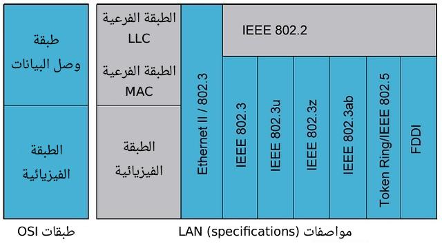
 
<em>مقارنة تقنيات الشبكات المحلية (Token Ring, Ethernet, FDDI) وموقعها من طبقتي OSI السفليتين</em>

---

<h2 dir="rtl" align="right" id="token-ring">أولاً: تقنية Token Ring</h2>

<h3 dir="rtl" align="right" id="token-ring-overview">التعريف والمعيار والخواص</h3>

**Token Ring** هي تقنية شبكات محلية طورتها شركة **IBM** في الثمانينات، وبتعتمد على مبدأ تمرير "رمز" إلكتروني صغير اسمه **Token** بين الأجهزة، بحيث تكون الأجهزة مرتبة **منطقيًا** على هيئة حلقة (Ring)، والجهاز اللي بيمسك الـ Token هو الوحيد اللي يحق له الإرسال في تلك اللحظة. المعيار الرسمي المعتمد من IEEE للتقنية دي هو **IEEE 802.5**.

من أهم خواصها إنها بتوفر وصول **حتمي (Deterministic Access)** للوسيط، يعني كل جهاز هياخد فرصته للإرسال بالتساوي وبدون عشوائية (على عكس الإيثرنت القديمة)، وبتكون **خالية تمامًا من التصادم** لأن جهاز واحد بس هو اللي معاه حق الإرسال في كل لحظة، وده بيديها أداء ثابت ومتوقع حتى مع زيادة الحمل على الشبكة. في المقابل، سرعاتها فضلت محدودة نسبيًا مقارنة بما توصلت له الإيثرنت لاحقًا.

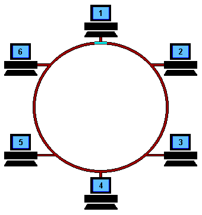
 
<em>الشكل المنطقي البسيط لطوبولوجيا الحلقة (Ring) اللي بتشتغل عليها Token Ring</em>

<h3 dir="rtl" align="right" id="token-ring-mau">جهاز الـ MAU: الاستخدام وطريقة العمل</h3>

كانت Token Ring بتستخدم في الشبكات المؤسسية (خصوصًا شبكات IBM وأجهزة Mainframe) في الثمانينات والتسعينات قبل ما تنتشر الإيثرنت. من الناحية الفيزيائية، الأجهزة مش بتتوصل فعليًا على شكل حلقة دائرية بكابلات، وإنما بتتوصل بجهاز مركزي اسمه **MAU (Multistation Access Unit)**، وهو اللي بيمثل الحلقة **منطقيًا** من جواه، فالشكل الفيزيائي للتوصيل بيبقى **نجمة (Star)** بينما الشكل المنطقي لحركة البيانات بيفضل **حلقة (Ring)**.

جهاز الـ MAU بيحتوي على مجموعة منافذ (Ports)، وكل منفذ فيه دائرة تُعرف باسم **Relay**. الفكرة إن كل جهاز متصل بالـ MAU بيكمّل الدائرة الكهربائية للحلقة من جوه المنفذ. لو جهاز معين اتفصل أو اتقفل، الـ Relay بتاعه بيقفل الدائرة تلقائيًا ويعدّي الإشارة للجهاز اللي بعده، عشان الحلقة متتقطعش وتفضل شغالة حتى لو جهاز واحد أو أكتر مش موجود.

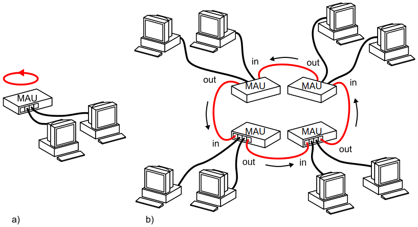
 
<em>رسم توضيحي لتوصيل الأجهزة عبر جهاز MAU على هيئة حلقة منطقية</em>

<h3 dir="rtl" align="right" id="token-ring-operational-details">تفاصيل تشغيلية: عدد الأجهزة، السرعة، والمراقبة</h3>

العدد الأقصى للأجهزة المسموح بيها في حلقة Token Ring واحدة بيختلف حسب **نوع الكابل المستخدم** (كابلات STP بتسمح بعدد أكبر يوصل لحوالي 260 جهاز، مقابل حوالي 72 جهاز بس مع UTP) وحسب **نوع أجهزة الـ MAU** المستخدمة، لأن كل موديل ليه عدد منافذ معين، وممكن توصيل أكتر من MAU ببعض (Cascading) لزيادة العدد في حدود معينة.

أما معدل نقل البيانات، فالتقنية بتشتغل بسرعتين أساسيتين: **4 Mbps** (النسخة الأولى) أو **16 Mbps** (النسخة المطوّرة).

من ناحية إدارة الشبكة، أول جهاز يشتغل على الحلقة بياخد دور خاص اسمه **Active Monitor** (الجهاز المراقب النشط)، ومهمته التأكد إن فيه Token واحد بس بيدور على الحلقة في كل وقت، واكتشاف وإصلاح مشاكل زي فقدان الـ Token بالكامل (عن طريق توليد Token جديد)، وضبط التوقيت العام للحلقة. لو الجهاز اللي بيلعب الدور ده نزل من الشبكة، فيه آلية انتخاب تلقائي (Monitor Contention) بين باقي الأجهزة عشان يتحدد مراقب جديد.

<h3 dir="rtl" align="right" id="token-ring-drawbacks">عيوبها ولماذا اختفت</h3>

رغم موثوقيتها، فقدت Token Ring المنافسة بالكامل لصالح الإيثرنت بسبب مجموعة عيوب تراكمت مع الوقت: **تكلفة عالية** لأجهزة الـ MAU وكروت الشبكة الخاصة بيها مقارنة بمعدات الإيثرنت، **تعقيد في الإدارة والتوسع** (إضافة أو إزالة جهاز من الحلقة كانت عملية حساسة)، **سرعات محدودة** فضلت عالقة عند 16 Mbps بينما الإيثرنت كانت بتتطور بسرعة كبيرة، وده كله أدى لـ**انتشار ضعيف** جدًا وانقراضها العملي حاليًا.

---

<h2 dir="rtl" align="right" id="token-passing">خاصية Token Passing و Ring Topology</h2>

<h3 dir="rtl" align="right" id="token-passing-overview">التعريف وطريقة العمل</h3>

**Token Passing** هي طريقة (Method) للتحكم في الوصول للوسيط الناقل، بتعتمد على تمرير إطار خاص صغير جدًا اسمه Token بين الأجهزة بترتيب معين، والجهاز اللي معاه الـ Token هو الوحيد اللي مسموحله يرسل بيانات. أما **Ring Topology** فهي الشكل المنطقي (Logical Topology) اللي بتتحرك بيه البيانات، بحيث كل جهاز متصل بجهازين بس (اللي قبله واللي بعده) في شكل دائري مغلق.

طريقة العمل بترتيب: الـ Token بيدور باستمرار على الحلقة من جهاز للتاني، والجهاز اللي عايز يبعت بيانات بينتظر لحد ما يوصله الـ Token الفاضي، وبمجرد ما ياخده بيحوله لإطار بيانات (بيضيف عليه عنوان الوجهة والبيانات نفسها) ويبعته على الحلقة. الإطار بيمر على كل جهاز في طريقه لحد ما يوصل تاني للجهاز المُرسِل الأصلي، اللي بيسحبه من الحلقة (بعد ما يتأكد إنه استُقبل بنجاح) ويطلق Token فاضي جديد عشان يقدر جهاز تاني يستخدمه. وجهاز الـ MAU هو اللي بيخلي الفكرة دي ممكنة فيزيائيًا، لأنه بيدير التوصيل الداخلي بحيث الإشارة بتدخل من منفذ وتخرج من التاني بترتيب حلقي ثابت، رغم إن التوصيل الظاهر من برّا شكله نجمة.

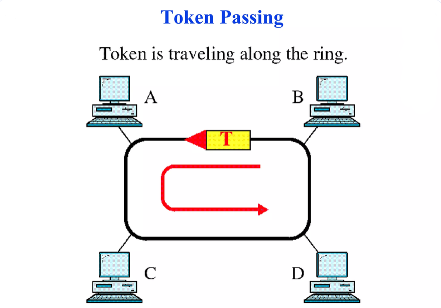
 
<em>Token بيدور على الحلقة بين الأجهزة A و B و C و D — الجهاز اللي معاه الـ Token هو الوحيد اللي يقدر يرسل</em>

<h3 dir="rtl" align="right" id="token-passing-details">حالة الـ Token، السرعة، ومنع التصادم</h3>

الـ Token بيكون دايمًا في واحدة من حالتين: **Free Token** (فاضي، أي جهاز يقدر ياخده ويستخدمه للإرسال)، أو **Busy Token / Data Frame** (محمّل ببيانات، بعد ما جهاز ياخد الـ Token الفاضي ويحوله لإطار فعلي بيدور على الحلقة لحد ما يرجع لصاحبه). والسرعات المستخدمة زي Token Ring نفسها: **4 Mbps** أو **16 Mbps**، ثابتة مش بتتغير بتغير عدد الأجهزة.

السبب الأساسي إن التقنية دي **خالية من التصادم بالكامل** هو إن جهاز واحد بس في كل لحظة زمنية يملك "حق الإرسال" (وهو اللي معاه الـ Token الفاضي)، فمفيش أي احتمال إن جهازين يبعتوا في نفس الوقت على نفس الوسيط، عكس الإيثرنت القديمة اللي كانت محتاجة آلية زي CSMA/CD عشان تتعامل مع احتمال التصادم.

---

<h2 dir="rtl" align="right" id="arcnet">ثانياً: تقنية ARC-Net</h2>

<h3 dir="rtl" align="right" id="arcnet-overview">التعريف والاستخدام والتطور</h3>

**ARC-Net (Attached Resource Computer Network)** هي من **أقدم تقنيات الشبكات المحلية التجارية** على الإطلاق، طورتها شركة Datapoint Corporation سنة 1977، يعني سبقت حتى الإيثرنت في الانتشار التجاري الواسع بفترة. كانت بتُستخدم بكثرة في البيئات **الصناعية وأنظمة التحكم الآلي (Industrial Control Systems)**، بسبب موثوقيتها العالية واستقرارها حتى لو كانت أبطأ من التقنيات التانية.

ظهرت لاحقًا نسخة محسّنة اسمها **ARCnet Plus** بسرعة أعلى بكتير (توصل لـ 20 Mbps) مقارنة بالنسخة الأصلية (2.5 Mbps)، في محاولة للمنافسة مع الإيثرنت اللي كانت بتنمو بسرعة في نفس الفترة.

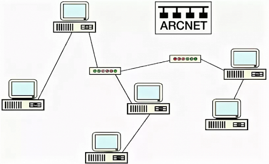
 
<em>مثال على شكل شبكة ARCNET وتوصيل الأجهزة فيها</em>

<h3 dir="rtl" align="right" id="arcnet-details">آلية العمل، الطوبولوجيا، المعايير والكابلات</h3>

زي Token Ring تقريبًا، تقنية ARC-Net بتستخدم مبدأ **Token Passing** للتحكم في الوصول للوسيط ومنع التصادم، لكن الاختلاف الأساسي إن الـ Token بيتمرر حسب **ترتيب رقمي للعناوين (Node ID)** المُبرمجة يدويًا على كل جهاز، مش حسب الترتيب الفيزيائي للتوصيل.

من ناحية الطوبولوجي، بتجمع بين نوعين: **Star Topology** فيزيائيًا (الأجهزة بتتوصل بجهاز مركزي اسمه Hub، وبييجي في نوعين — **Active Hub** اللي بيقوّي الإشارة ويعيد بثها ومحتاج كهرباء، و**Passive Hub** اللي مجرد موزّع بدون تقوية للإشارة)، و**Ring/Bus Topology** منطقيًا (حركة الـ Token بترتيب حلقي وهمي بين العناوين).

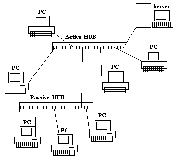
 
<em>مثال قديم على توصيل شبكة عبر Active Hub و Passive Hub، وهو المفهوم اللي بنيت عليه شبكات ARCNet</em>

على عكس Token Ring والإيثرنت، تقنية ARC-Net **ماكانش ليها معيار موحّد رسمي معتمد من IEEE**، وفضلت لفترة طويلة تقنية شبه ملكية (Proprietary) خاصة بشركة Datapoint ومصنّعين محدودين. والكابلات المستخدمة فيها بالأساس كانت **RG-62 Coaxial Cable** في النسخة الأصلية، ولاحقًا دعمت كابلات **Twisted Pair** و**Fiber Optic** في النسخ المطوّرة.

---

<h2 dir="rtl" align="right" id="lan-tech-comparison">مقارنة سريعة بين التقنيات الثلاث</h2>

قبل ما نتعمق في الإيثرنت بالتفصيل الكامل، الجدول ده بيلخّصلك الفروقات الجوهرية بين التقنيات التلاتة اللي شرحناها في مكان واحد للمراجعة السريعة:

| وجه المقارنة | Token Ring | ARC-Net | Ethernet |
|:---:|:---:|:---:|:---:|
| الشركة المطوّرة | IBM | Datapoint | Xerox ثم تحالف DIX |
| سنة الظهور | 1985 تقريبًا | 1977 | 1973 |
| معيار IEEE رسمي | IEEE 802.5 | لا يوجد (Proprietary) | IEEE 802.3 |
| طريقة الوصول للوسيط | Token Passing | Token Passing | CSMA/CD (قديمًا) / Full Duplex (حاليًا) |
| الطوبولوجيا الفيزيائية | Star (عبر MAU) | Star (عبر Hub) | Star (عبر Switch) |
| الطوبولوجيا المنطقية | Ring | Ring/Bus | Bus (قديمًا) |
| أقصى سرعة | 16 Mbps | 20 Mbps (ARCnet Plus) | 100+ Gbps |
| الحالة حاليًا | منقرضة عمليًا | منقرضة عمليًا (نادرة صناعيًا) | **المعيار العالمي السائد** |

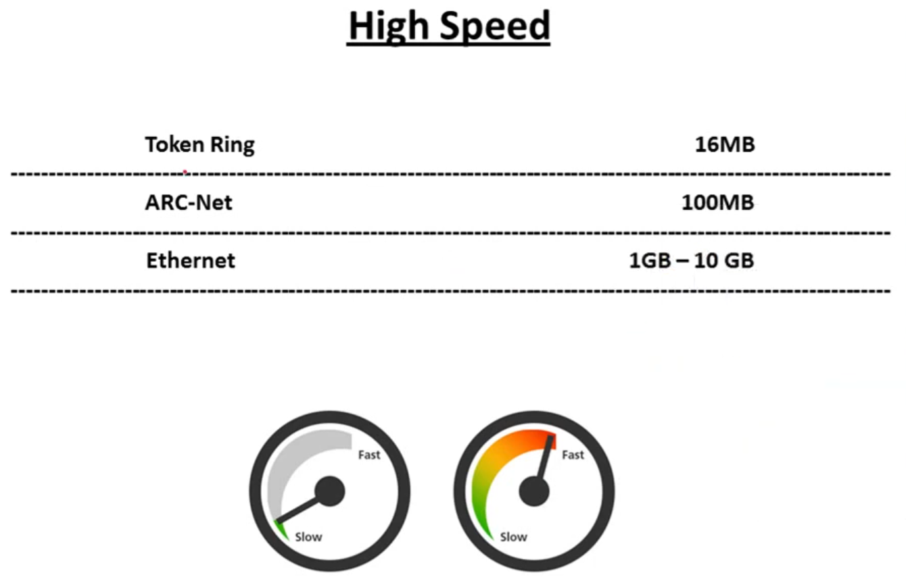
 
<em>مقارنة بصرية للسرعات: Token Ring مقابل ARC-Net مقابل Ethernet</em>

الفرق الجوهري اللي خلى الإيثرنت تكسب المنافسة بالكامل هو **قدرتها المستمرة على التطور لسرعات أعلى** بينما باقي التقنيات فضلت عالقة عند سرعاتها القديمة، زي ما هيتضح بالتفصيل دلوقتي.

---

<h2 dir="rtl" align="right" id="ethernet">ثالثاً: تقنية Ethernet</h2>

<h3 dir="rtl" align="right" id="ethernet-overview">التعريف، الطبقات، الأجهزة، وأسباب انتشارها</h3>

**Ethernet** هي التقنية الأشهر والأكثر انتشارًا على الإطلاق لنقل البيانات داخل الشبكات المحلية (LAN)، وهي دلوقتي **المعيار العالمي الفعلي** لكل الشبكات السلكية تقريبًا. بتغطي الطبقتين السفليتين من نموذج OSI: طبقة **Data Link Layer** (الثانية) وطبقة **Physical Layer** (الأولى)، وأهم جهاز مرتبط بيها هو **Switch**، بالإضافة لكرت الشبكة **NIC** الموجود في كل جهاز (وكان فيه قديمًا جهاز Hub لكنه اختفى تقريبًا لصالح السويتش).

الإيثرنت بقت التقنية المهيمنة بالكامل تقريبًا على مستوى العالم، سواء في المنازل أو الشركات أو مراكز البيانات، وده بسبب مجموعة مميزات جمعتها مع بعض: **تكلفة منخفضة نسبيًا** لمعداتها، **سهولة التركيب والصيانة والتوسع**، **تطور سرعاتها المستمر** من 10 Mbps لحد مئات الـ Gbps (بينما باقي التقنيات فضلت واقفة عند سرعات محدودة)، **توافقية عكسية (Backward Compatibility)** قوية بين الأجيال المختلفة، و**دعم صناعي وعالمي ضخم** من كل الشركات المصنّعة بفضل اعتمادها كمعيار مفتوح من IEEE.

<h3 dir="rtl" align="right" id="ethernet-history">نشأة الإيثرنت: من رسمة Xerox لمعيار IEEE الرسمي</h3>

اتخترعت تقنية الإيثرنت سنة **1973** في معامل شركة **Xerox PARC** على يد المهندسَين **Robert Metcalfe** و**David Boggs**، بهدف إيجاد طريقة تربط أجهزة الكمبيوتر بالطابعات الليزرية الجديدة وقتها داخل نفس المعمل.

سنة 1980، اتحدت ثلاث شركات كبرى لتطوير وتوحيد مواصفات الإيثرنت رسميًا: **Digital Equipment Corporation (DEC)**، **Intel**، و**Xerox**، والتحالف ده عُرف باسم **DIX** (اختصار الحروف الأولى من أسماء الشركات). الهدف الأساسي من التحالف كان **توحيد مواصفات تقنية الإيثرنت** وإخراجها كمعيار صناعي موحّد ومفتوح، بدل ما تفضل تقنية ملكية (Proprietary) خاصة بشركة Xerox بس، عشان تقدر باقي الشركات تصنّع أجهزة متوافقة معاها وتزيد انتشارها في السوق.

نتيجة التحالف ده، اتنشرت أول نسخة موحّدة رسميًا باسم **Ethernet II (DIX Ethernet)** سنة 1982، بسرعة نقل بيانات **10 Mbps**. وبعد نجاح معيار DIX، تبنّت هيئة **IEEE** التقنية دي رسميًا سنة 1983 تحت مظلة لجنة **IEEE 802.3**، وأصدرت معيارها الرسمي الخاص بيها (بفروقات بسيطة عن نسخة DIX الأصلية زي استبدال حقل Type بحقل Length في الإطار). ومن ساعتها بقت الإيثرنت معيار عالمي رسمي مفتوح للجميع.

<h3 dir="rtl" align="right" id="ethernet-standards-speeds">المعايير، نظام التسمية، والسرعات</h3>

| المعيار | الاسم الشائع | السرعة | التاريخ |
|:---:|:---:|:---:|:---:|
| — | Ethernet الأصلية | 2 Mbps | 1973 |
| — | Ethernet II (DIX v2.0) | 10 Mbps | 1982 |
| IEEE 802.3 | Ethernet الأساسي (LLC + CSMA/CD) | 10 Mbps | 1983 |
| IEEE 802.3x | دعم Full Duplex | 10 Mbps | 1997 |
| IEEE 802.3u | Fast Ethernet | 100 Mbps | 1998 |
| IEEE 802.3z | Gigabit Ethernet | 1000 Mbps | 1998 |
| IEEE 802.3ae | 10 Gigabit Ethernet | 1 GB وما فوق | 2002 |
| IEEE 802.3af | دعم PoE عبر منافذ الإيثرنت | — | 2003 |

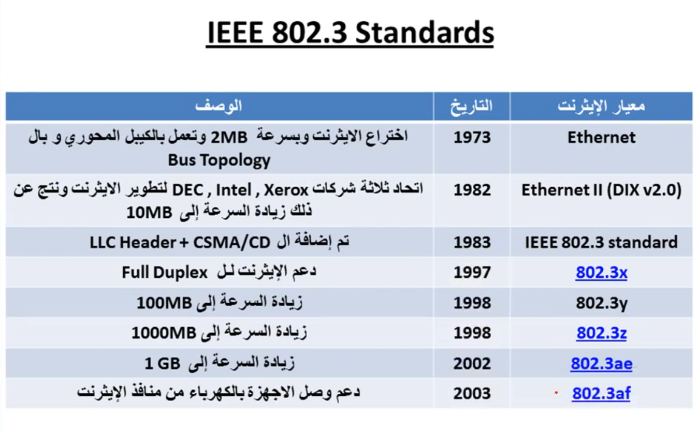
 
<em>الخط الزمني لتطور معايير IEEE 802.3 من نشأة الإيثرنت لحد دعم PoE</em>

كل معيار إيثرنت بياخد كمان اسم مختصر بيوضح ثلاث معلومات في نفس الوقت، بالصيغة العامة **`<السرعة><نوع الإشارة><نوع الوسيط>`**. مثال شهير: **10BASE-T** يعني `10` = السرعة (10 Mbps)، `BASE` = نوع الإشارة (Baseband)، و`T` = نوع الوسيط (Twisted Pair). أمثلة تانية شائعة:

| الاسم | السرعة | الوسيط/المسافة |
|:---:|:---:|:---:|
| 10BASE-T | 10 Mbps | Twisted Pair (حتى 100 متر) |
| 100BASE-TX | 100 Mbps | Twisted Pair (Cat5) |
| 1000BASE-T | 1 Gbps | Twisted Pair (Cat5e/Cat6) |
| 1000BASE-SX | 1 Gbps | Fiber Optic (Multi-mode، مسافة قصيرة) |
| 10GBASE-LR | 10 Gbps | Fiber Optic (Single-mode، مسافة طويلة) |

بشكل عام، السرعات اللي وصلتلها تقنية الإيثرنت عبر تطورها التاريخي: `10 Mbps → 100 Mbps → 1 Gbps → 10 Gbps → 40 Gbps → 100 Gbps` وأكتر حاليًا في مراكز البيانات الكبرى.

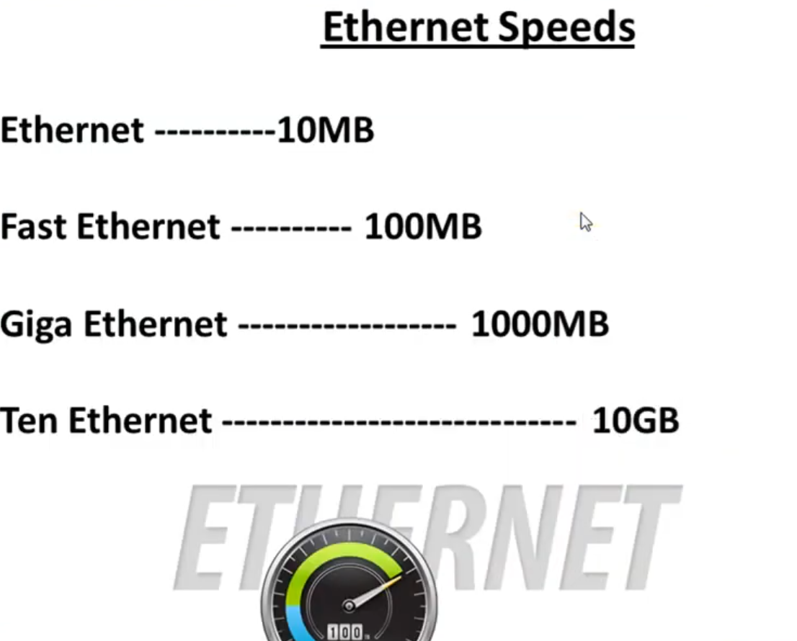
 
<em>السرعات المتتالية للإيثرنت من 10 ميجابت وصولاً لـ 10 جيجابت</em>

<h3 dir="rtl" align="right" id="ethernet-domains">مجالا التصادم والبث: Collision Domain و Broadcast Domain</h3>

**Collision Domain (مجال التصادم)** هي المنطقة أو المجموعة من الأجهزة اللي لو بعتوا بيانات في نفس اللحظة على نفس الوسيط المشترك، ممكن يحصل تصادم بين الإشارتين. كل الأجهزة المتصلة بجهاز Hub واحد بتكون في نفس مجال التصادم، أما كل منفذ في جهاز Switch فبيمثل مجال تصادم منفصل بمفرده.

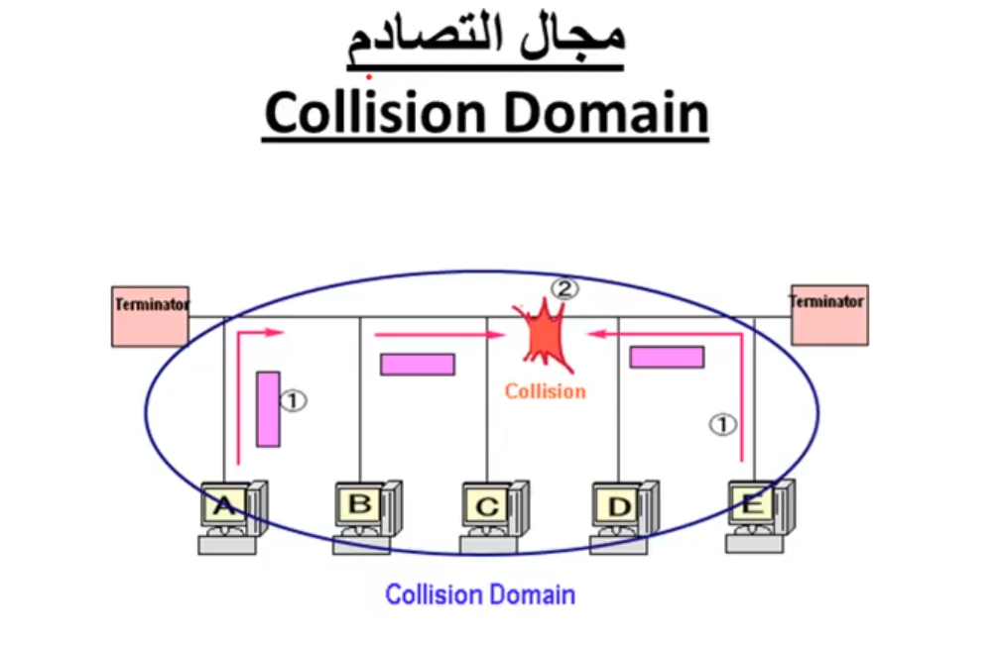
 
<em>مجال التصادم (Collision Domain) — كل الأجهزة على نفس الوسيط المشترك معرّضة للتصادم</em>

أما **Broadcast Domain (مجال البث)** فهي المنطقة اللي بتوصلها رسالة البث العام (Broadcast)، يعني كل الأجهزة المتصلة ببعض عبر Switch واحد أو مجموعة Switches بدون وجود Router بينهم بتكون في نفس مجال البث.

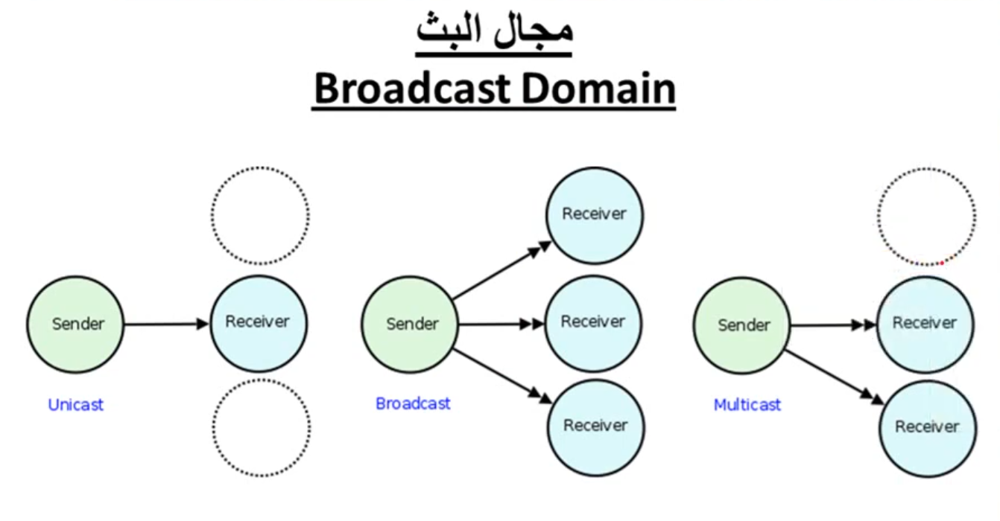
 
<em>الفرق بين Unicast و Broadcast و Multicast، وعلاقتهم بمجال البث</em>

> 💡 **قاعدة سريعة للحفظ:** الـ Switch بيقسّم مجالات التصادم (كل منفذ = مجال تصادم منفصل)، لكنه **مش** بيقسّم مجال البث. اللي بيقسّم مجال البث فعليًا هو **الراوتر** أو تقسيم الشبكة لـ VLANs.

<h3 dir="rtl" align="right" id="ethernet-access-control">التحكم في الوصول للوسيط: أوضاع الإرسال وآلية CSMA/CD</h3>

قبل ما نشرح آلية منع التصادم، لازم نفرّق بين وضعين أساسيين للاتصال: **Half Duplex** (نصف مزدوج) اللي فيه الجهاز يقدر يرسل أو يستقبل بس في نفس اللحظة، وكان ده الوضع الإجباري وقت استخدام جهاز Hub لأن كل الأجهزة بتشارك نفس الوسيط، و**Full Duplex** (مزدوج كامل) اللي فيه الجهاز يقدر يرسل ويستقبل في نفس اللحظة بالظبط بفضل مسارين منفصلين، وهو الوضع الافتراضي دلوقتي مع أي اتصال عبر Switch وبيلغي احتمالية التصادم تمامًا.

في وضع Half Duplex القديم، كانت الإيثرنت محتاجة آلية اسمها **CSMA/CD (Carrier Sense Multiple Access with Collision Detection)** للتحكم في الوصول للوسيط المشترك، والاسم بيلخّص فكرتها: **Carrier Sense** (الجهاز بيتأكد إن الوسيط فاضي قبل ما يبعت)، **Multiple Access** (أي جهاز يقدر يحاول يرسل في أي وقت طالما الوسيط فاضي، من غير ترتيب مسبق زي Token Passing)، و**Collision Detection** (لو حصل تصادم فعلي لأن جهازين بعتوا في نفس اللحظة بالظبط، الجهازين بيكتشفوه فورًا). ولما يحصل التصادم، الجهازين بيبعتوا إشارة **Jam Signal** لتبليغ باقي الأجهزة، بيوقفوا الإرسال، وبينتظروا فترة عشوائية قصيرة (**Random Backoff Time**) قبل ما يحاولوا يرسلوا تاني.

> ⚠️ آلية CSMA/CD بقت شبه غير مستخدمة حاليًا، لأن الشبكات الحديثة بتشتغل عبر Switch في وضع Full Duplex بشكل شبه دائم واللي بيلغي احتمالية التصادم من الأساس، لكن لازم تفهمها كويس لأنها لسه بتتسأل بكثرة في شهادات زي Network+.

وعشان الجهازين المتصلين ببعض (حتى لو قدراتهم مختلفة) يقدروا يتفقوا تلقائيًا على أفضل سرعة ووضع إرسال، بتستخدم الإيثرنت خاصية **Auto-Negotiation** (تفاوض تلقائي على Auto-Speed و Auto-Duplex لحظة الاتصال):

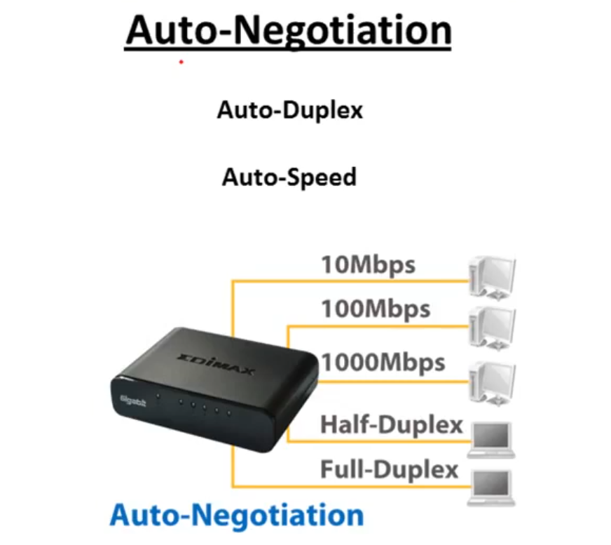
 
<em>Auto-Negotiation: الجهاز بيتفاوض تلقائيًا على السرعة (10/100/1000 Mbps) ووضع الإرسال (Half/Full Duplex)</em>

<h3 dir="rtl" align="right" id="ethernet-topology-tasks">الطوبولوجيا ومهام الإيثرنت الأساسية</h3>

الإيثرنت **الحديثة** بتشتغل فيزيائيًا بطوبولوجيا **Star**، يعني كل جهاز متصل بشكل مباشر ومستقل بمنفذ على الـ Switch المركزي (بعكس الأجيال الأولى اللي كانت بتستخدم طوبولوجيا Bus على كابل محوري مشترك). أهم مميزات ده: **عزل الأعطال** (كابل جهاز واحد لو اتقطع، الباقي مش بيتأثر)، **سهولة التوسع والإدارة**، و**أداء أعلى** لأن كل جهاز بياخد مجال تصادم منفصل بمفرده.

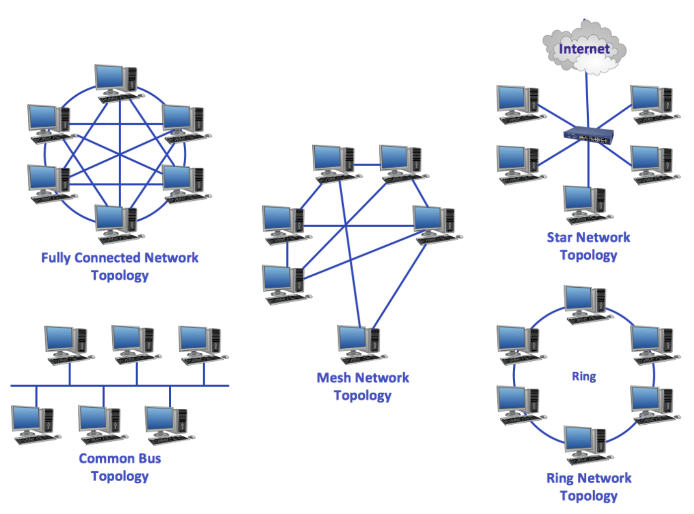
 
<em>مقارنة بين طوبولوجيات الشبكات المختلفة — الإيثرنت الحديثة بتستخدم Star Topology</em>

من أهم المهام الأساسية اللي بتقوم بيها تقنية الإيثرنت: **تحويل البيانات إلى إشارات والعكس** (ترميز البيانات الرقمية 0 و1 لإشارات كهربائية أو ضوئية وقت الإرسال، وفك الترميز وقت الاستقبال)، **تأطير البيانات (Framing)** بتغليفها في إطار بصيغة ثابتة، **كشف الأخطاء (Error Detection)** عن طريق حقل الـ FCS، و**التحكم في الوصول للوسيط** بتحديد إمتى ومين يقدر يبعت.

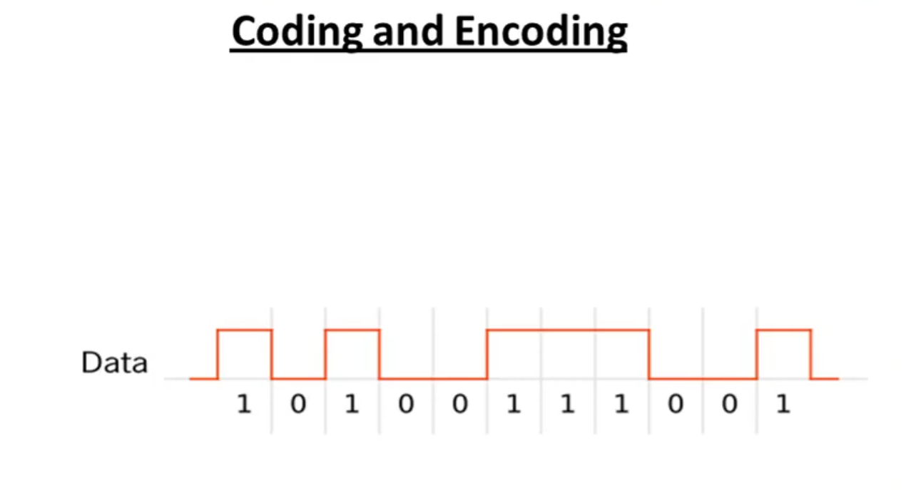
 
<em>تحويل تسلسل البتات (0 و 1) لإشارة كهربائية متذبذبة (Coding and Encoding)</em>

<h3 dir="rtl" align="right" id="ethernet-mac-address">عنوان الإيثرنت (MAC Address)</h3>

عنوان الإيثرنت أو **MAC Address (Media Access Control Address)** هو عنوان فيزيائي فريد بطول **48 بت (6 بايت)**، مبرمج على كرت الشبكة (NIC) من المصنّع نفسه، وبيُكتب عادة بصيغة **Hexadecimal** مقسّم لستة أزواج مفصولة بـ `:` أو `-`، مثال: `00:1A:2B:3C:4D:5E`. بيُستخدم للتوصيل والتوجيه على مستوى **الشبكة المحلية فقط (Layer 2)**، بعكس عنوان الـ IP اللي بيُستخدم للتوجيه بين الشبكات المختلفة (Layer 3).

بيتقسم لجزئين: أول 24 بت (3 بايت) هي **OUI (Organizationally Unique Identifier)** — رقم فريد يمثل الشركة المصنّعة، وآخر 24 بت (3 بايت) هي **Device ID** — رقم تسلسلي فريد يحدد الجهاز نفسه. وله ثلاثة أقسام حسب الوجهة: **Unicast** (جهاز واحد بعينه)، **Multicast** (مجموعة معينة من الأجهزة)، و**Broadcast** (كل الأجهزة، وقيمته دايمًا `FF:FF:FF:FF:FF:FF`).

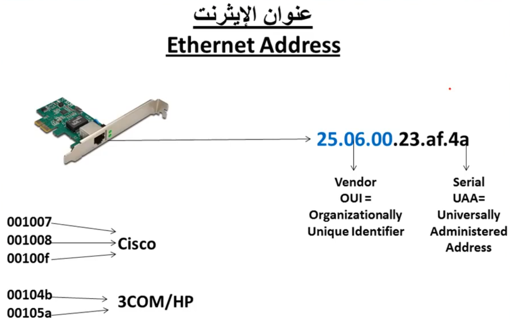
 
<em>تركيبة عنوان الإيثرنت: Vendor OUI + Serial UAA، وأمثلة على OUI لشركات زي Cisco و 3COM/HP</em>

<h3 dir="rtl" align="right" id="ethernet-frame-format">صيغة إطار الإيثرنت (Ethernet Frame Format)</h3>

الإطار (Frame) بتاع الإيثرنت بيتكون من الحقول التالية بالترتيب:

| الحقل | الحجم | الوظيفة |
|:---:|:---:|:---|
| Preamble | 7 بايت | نمط ثابت لمزامنة توقيت الاستقبال بين الجهازين |
| SFD (Start Frame Delimiter) | 1 بايت | يشير لبداية الإطار الفعلية |
| Destination MAC Address | 6 بايت | عنوان الجهاز المُرسَل إليه |
| Source MAC Address | 6 بايت | عنوان الجهاز المُرسِل |
| EtherType / Length | 2 بايت | يحدد نوع البروتوكول الأعلى (زي IPv4 أو ARP) أو طول البيانات |
| Data / Payload | 46 – 1500 بايت | البيانات الفعلية المُراد نقلها |
| FCS (Frame Check Sequence) | 4 بايت | قيمة تدقيق (Checksum عبر CRC) لاكتشاف أي خطأ حصل أثناء النقل |

أشهر قيم حقل EtherType: `0x0800` لـ IPv4، `0x0806` لـ ARP، و`0x86DD` لـ IPv6.

> 💡 **قاعدة الحد الأدنى (Minimum Size Rule):** لو حجم بيانات الـ Payload أقل من 46 بايت، بيتم إضافة بيانات فارغة (Padding) عشان توصل الإطار لأقل حجم مسموح بيه. القاعدة دي أساسية جدًا في الإيثرنت القديمة عشان تضمن إن آلية CSMA/CD تقدر تكتشف أي تصادم بنجاح قبل ما الجهاز يخلّص إرسال الإطار كامل. الحجم الكلي للإطار بعد كل الحقول بيتراوح من **64 لـ 1518 بايت**.

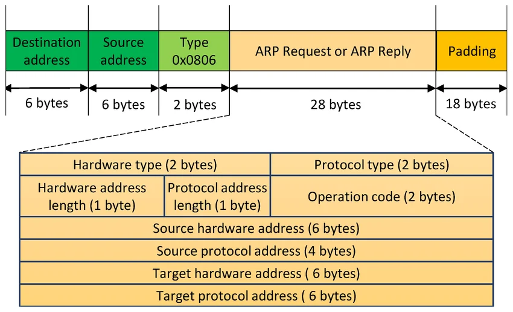
 
<em>صيغة إطار الإيثرنت وعلاقته بحزمة ARP</em>

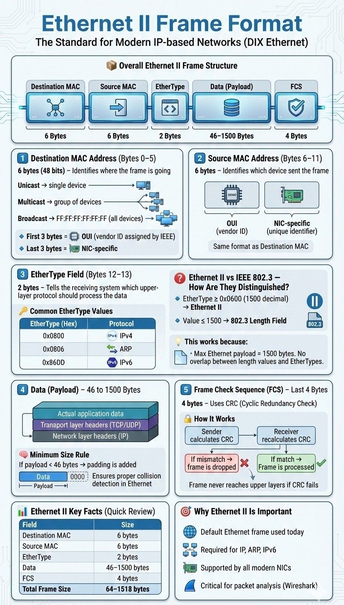
 
<em>شرح تفصيلي أعمق لكل حقل من حقول إطار Ethernet II وقاعدة الـ Padding</em>

<h3 dir="rtl" align="right" id="ethernet-extra-features">خصائص وبروتوكولات مكمّلة: Channel Bonding، ARP، وPoE</h3>

**Channel Bonding** (أو **EtherChannel** عند شركة Cisco) هي تقنية بتسمح بتجميع أكتر من رابط فيزيائي بين نفس الجهازين (غالبًا بين Switch وSwitch) عشان يشتغلوا سوا كأنهم رابط منطقي واحد بسرعة إجمالية أعلى، وبتوفر كمان تكرار احتياطي (Redundancy): لو رابط وقع، الباقي بيفضلوا شغالين.

بروتوكول **ARP (Address Resolution Protocol)** مهمته إنه **يحوّل عنوان الـ IP (Layer 3) لعنوان MAC (Layer 2)** المقابل له، لأن الإيثرنت بتتعامل بعنوان MAC بس في بناء الإطار. الجهاز المُرسِل بيبعت طلب **ARP Request** على هيئة Broadcast يسأل فيه "مين معاه IP كذا؟"، والجهاز صاحب العنوان بيرد برسالة **ARP Reply** (Unicast) فيها عنوان الـ MAC بتاعه، وبيتخزن الاتنين في جدول مؤقت اسمه **ARP Cache** لتوفير الوقت في المرات الجاية.

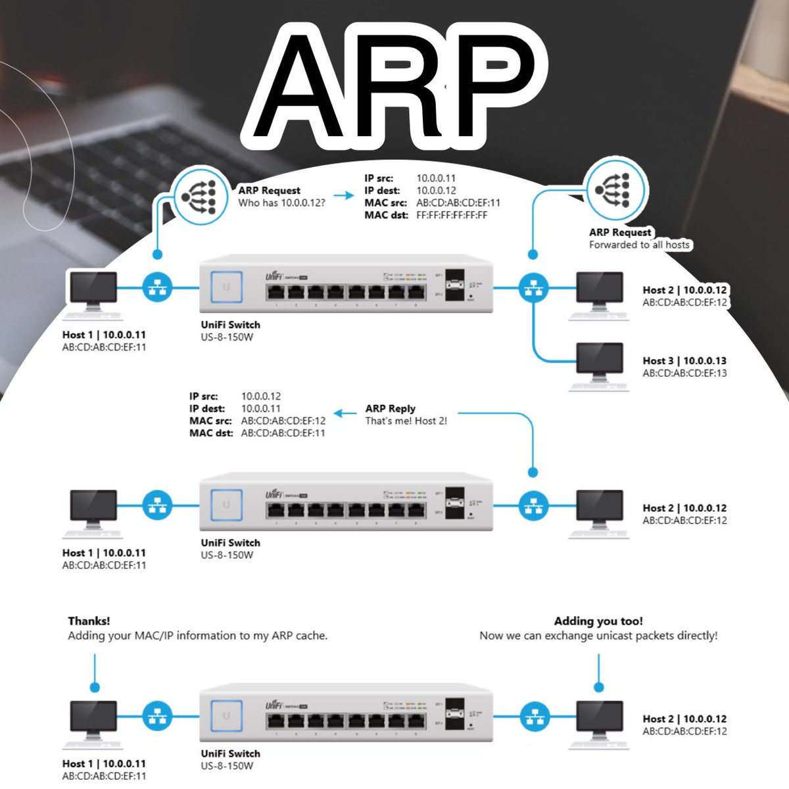
 
<em>خطوات عمل بروتوكول ARP: طلب Broadcast، رد Unicast، وتحديث ARP Cache</em>

أما **PoE (Power over Ethernet)** فهي تقنية بتسمح بنقل الكهرباء مع البيانات في نفس كابل الإيثرنت (Cat5e أو Cat6)، وده بيلغي الحاجة لمصدر كهرباء منفصل لأجهزة زي كاميرات المراقبة IP ونقاط الوصول اللاسلكية وهواتف VoIP:

| المعيار | الاسم الشائع | أقصى قدرة كهربائية |
|:---:|:---:|:---:|
| IEEE 802.3af | PoE | ~15.4 وات |
| IEEE 802.3at | PoE+ | ~30 وات |
| IEEE 802.3bt | PoE++ / 4PPoE | 60 – 100 وات |

<h3 dir="rtl" align="right" id="ethernet-osi-concepts">علاقة الإيثرنت بنموذج OSI والفروق المفاهيمية المهمة</h3>

زي ما اتذكر في البداية، الإيثرنت بتغطي طبقتين بس من السبعة طبقات بتاعة نموذج OSI: طبقة **Data Link Layer** (وبتنقسم فرعيًا لـ **LLC** و**MAC**) وطبقة **Physical Layer**.

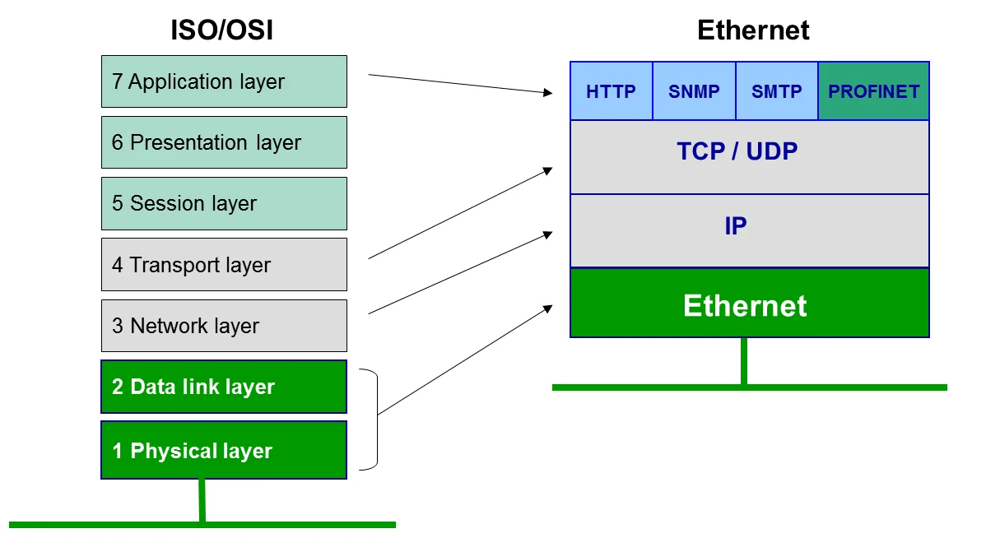
 
<em>موقع تقنية الإيثرنت من نموذج OSI</em>

فيه لبس شائع محتاج توضيح: **الإيثرنت** هي تقنية/بروتوكول بيحدد إزاي البيانات بتتنقل وتتأطر وتتوجه على مستوى الطبقتين الأولى والثانية، أما **الطوبولوجيا** فهي الشكل الفيزيائي أو المنطقي لطريقة توصيل الأجهزة (Star, Bus, Ring...). الإيثرنت ممكن تشتغل بأشكال طوبولوجيا مختلفة عبر تاريخها (كانت Bus، وبقت Star)، يعني الطوبولوجيا هي "الشكل"، والإيثرنت هي "القاعدة اللي بتتحكم في حركة البيانات جوه الشكل ده".

وفيه فرق جوهري كمان بين نقل البيانات في الإيثرنت وعملية الـ Routing في الطبقة الثالثة:

| المقارنة | الإيثرنت (Ethernet) | التوجيه (Routing) |
|:---:|:---:|:---:|
| الطبقة المسؤولة | الطبقة الثانية (Data Link) | الطبقة الثالثة (Network) |
| العنونة المستخدمة | MAC Address | IP Address |
| نطاق العمل | داخل نفس الشبكة المحلية فقط | بين شبكات مختلفة |
| الجهاز المسؤول | Switch | Router |
| طبيعة القرار | توصيل مباشر بدون اختيار مسار | اختيار "أفضل مسار" (Best Path) بين عدة احتمالات |

باختصار: الإيثرنت بتوصّل البيانات **جوه** نفس الشبكة المحلية بشكل مباشر باستخدام عنوان الـ MAC، أما الـ **Routing** فهي عملية توجيه البيانات **بين** شبكات مختلفة تمامًا عبر الراوتر باستخدام عنوان الـ IP، وبتحتاج اتخاذ قرار بخصوص أفضل مسار توصل بيه البيانات لوجهتها.

---

<h2 dir="rtl" align="right" id="summary-table">جدول ملخص شامل للمراجعة السريعة</h2>

| النقطة | التفاصيل |
|:---:|:---|
| التقنيات الثلاث للشبكات المحلية | Token Ring, ARC-Net, Ethernet |
| مخترع الإيثرنت | Robert Metcalfe و David Boggs في معامل Xerox PARC سنة 1973 |
| تحالف DIX | Digital + Intel + Xerox، هدفه توحيد معيار الإيثرنت |
| معيار IEEE الرسمي | IEEE 802.3 |
| الطبقات اللي تعمل بها الإيثرنت | Data Link Layer + Physical Layer |
| الجهاز الأساسي للإيثرنت | Switch |
| طوبولوجيا الإيثرنت الحديثة | Star |
| آلية منع التصادم القديمة | CSMA/CD (في وضع Half Duplex) |
| وضع الإرسال الحالي | Full Duplex |
| عنونة الإيثرنت | MAC Address (48 بت) |
| حجم إطار البيانات (Payload) | من 46 إلى 1500 بايت (الإطار كامل: 64 – 1518 بايت) |
| مثال تسمية معيار | 10BASE-T = سرعة + Baseband + Twisted Pair |
| بروتوكول ترجمة IP لـ MAC | ARP |
| تقنية نقل الكهرباء مع البيانات | PoE |
| السرعات الحالية | من 10 Mbps حتى 100+ Gbps |

