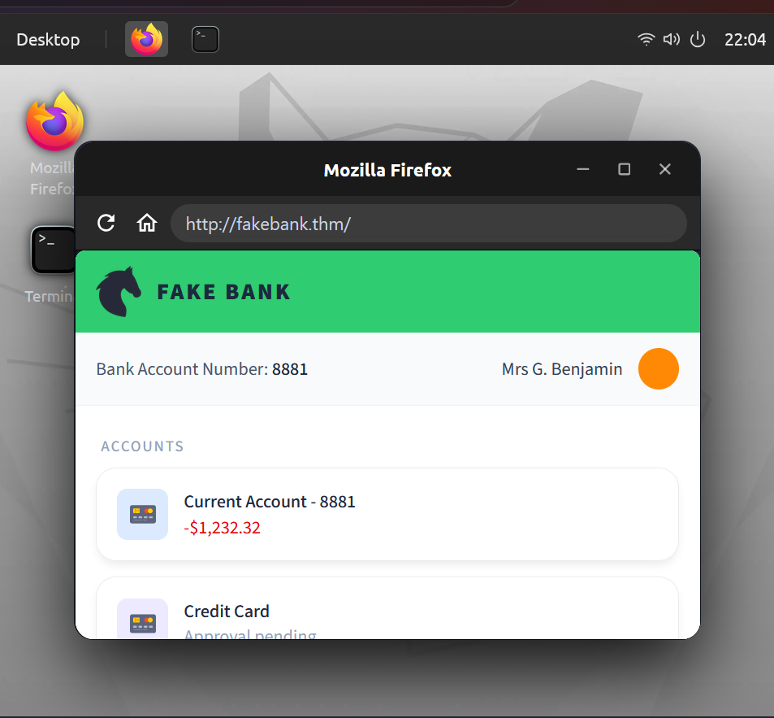
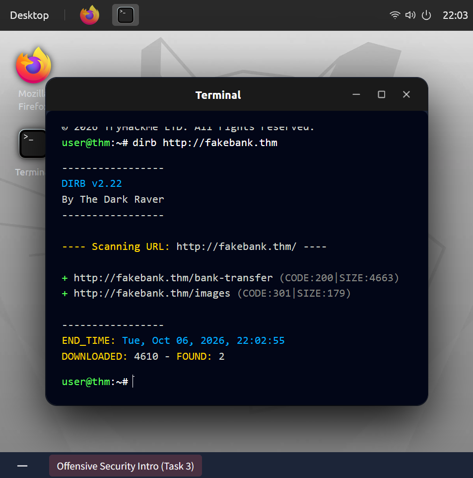
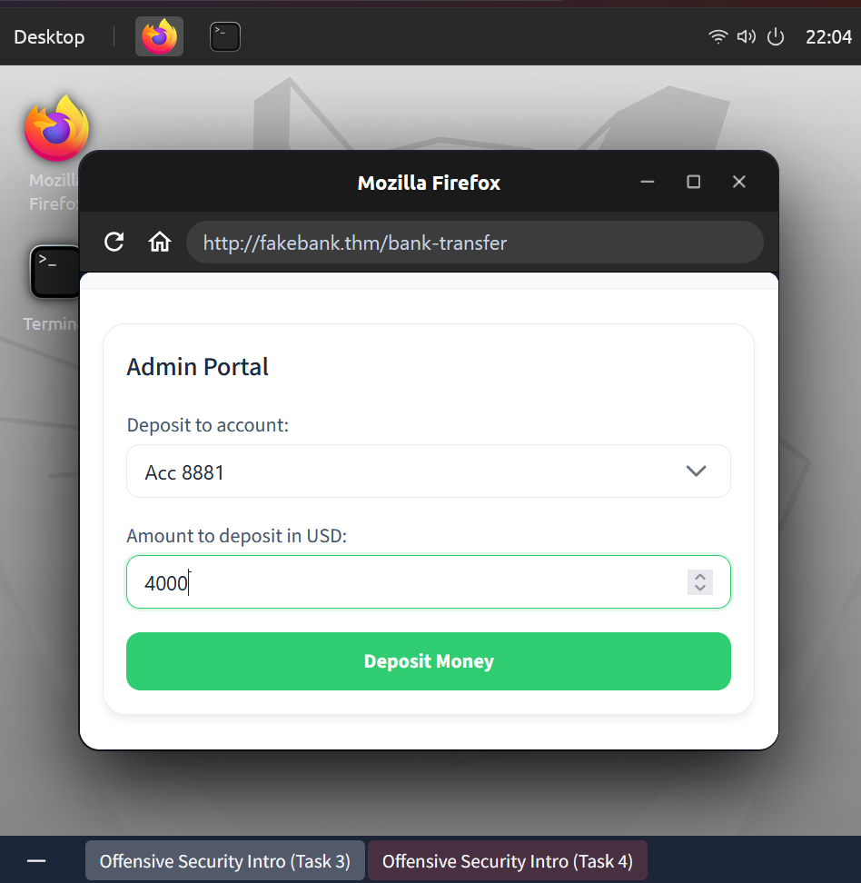
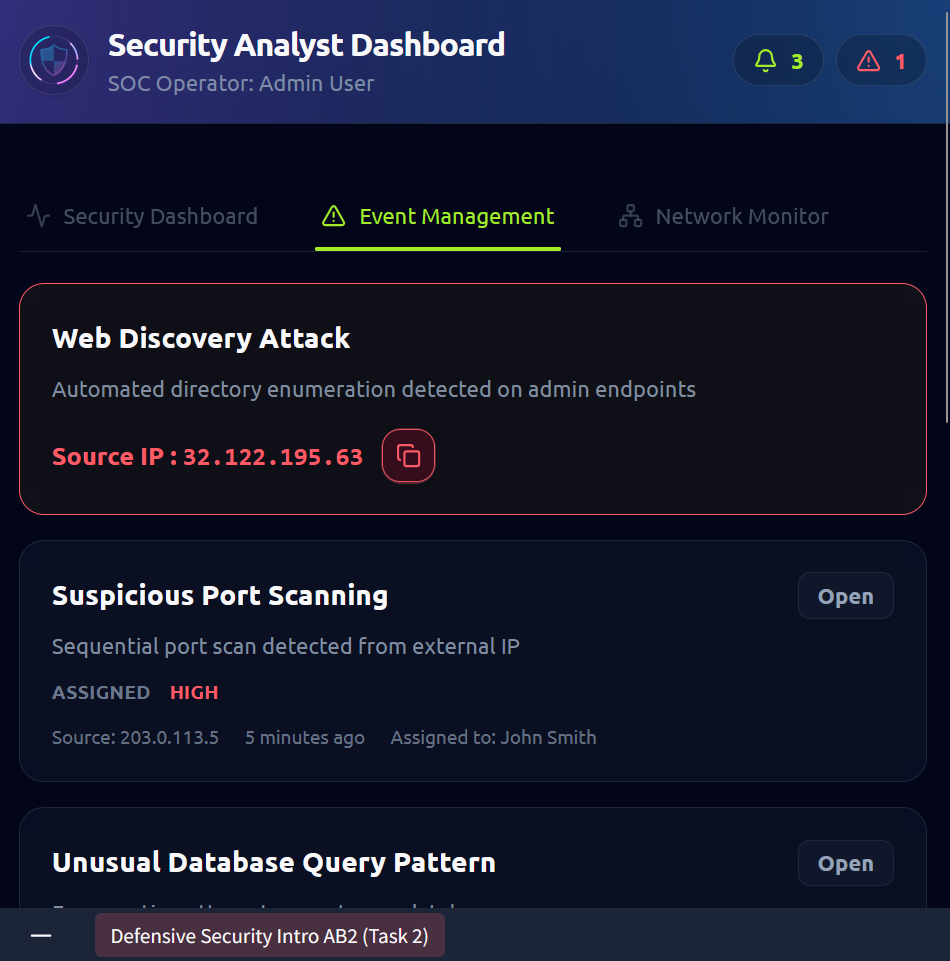
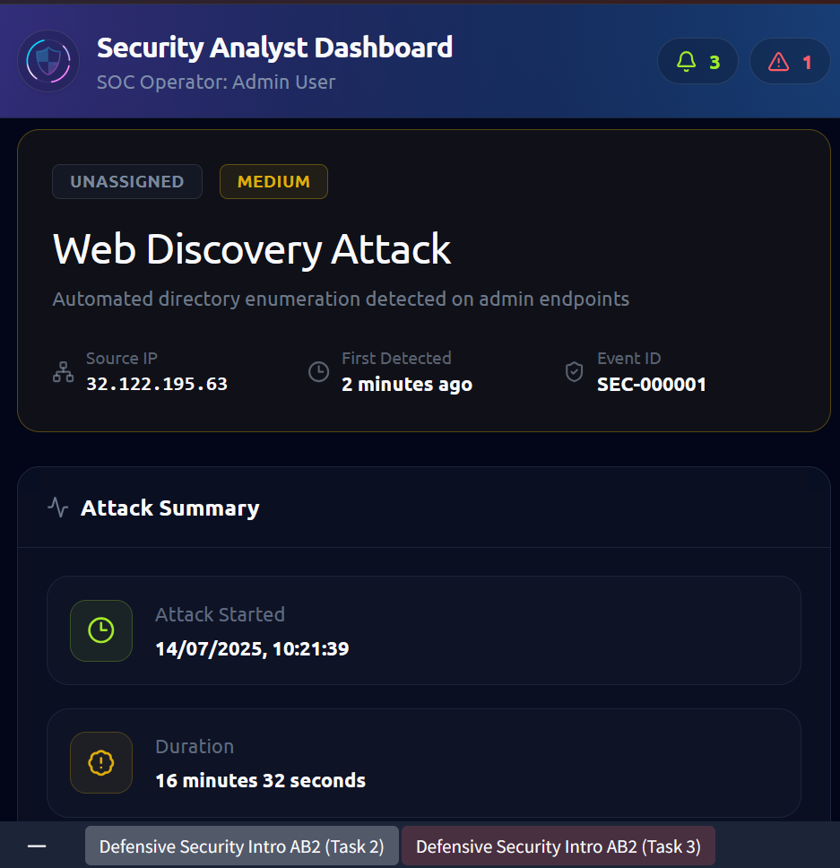
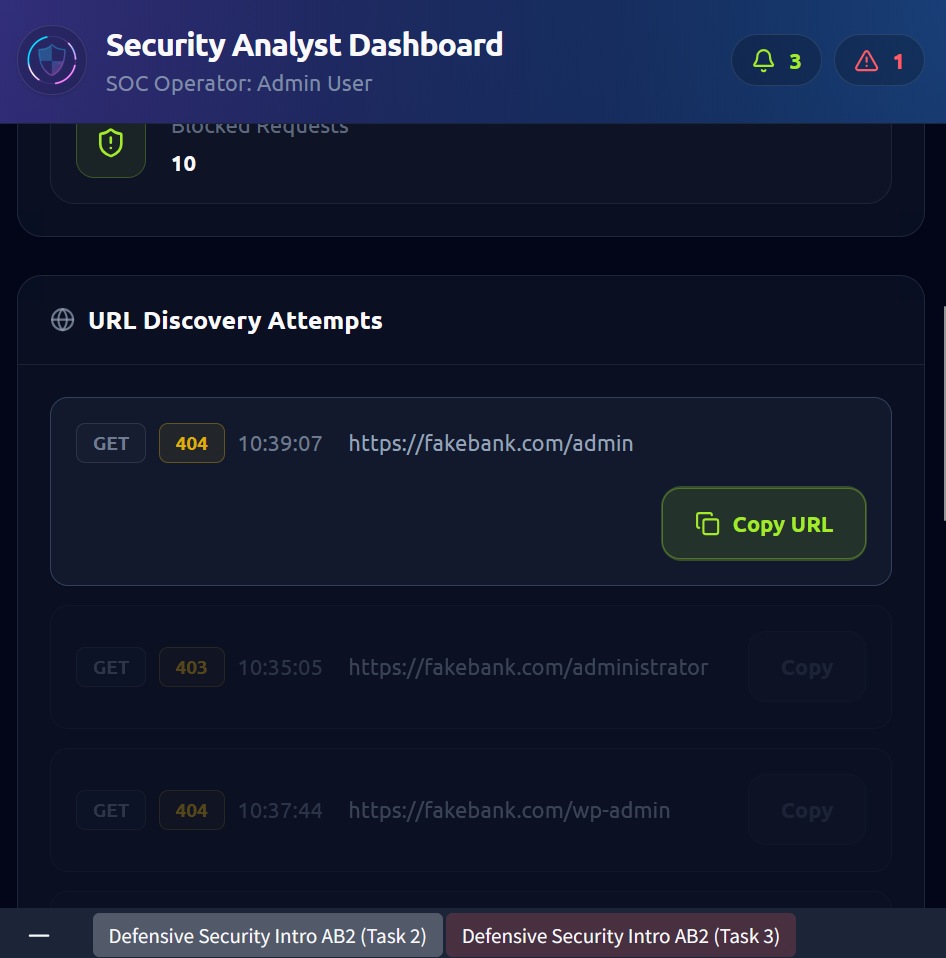
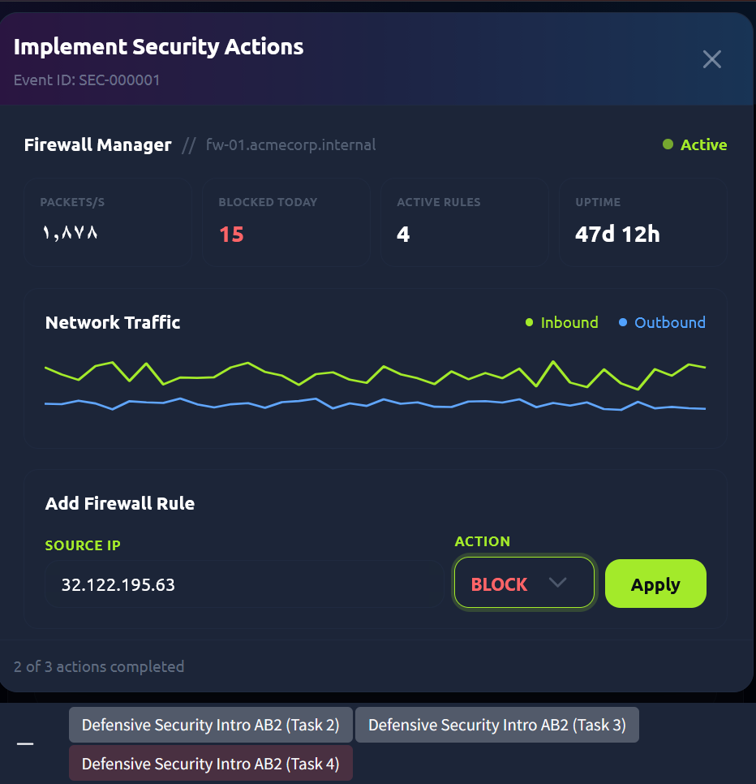

<div dir="rtl" align="right">

# الوحدة الأولى: Introduction to Cyber Security

## 📑 فهرس الوحدة

<table dir="rtl" width="100%">
<thead><tr><th align="right" style="text-align:right">#</th><th align="right" style="text-align:right">الغرفة</th><th align="right" style="text-align:right">الموضوعات بالترتيب</th></tr></thead>
<tbody>
<tr><td align="right" style="text-align:right">—</td><td align="right" style="text-align:right"><a href="#module-intro">مقدمة الوحدة</a></td><td align="right" style="text-align:right">تعريف الأمن السيبراني، وما ستتناوله الوحدة</td></tr>
<tr><td align="right" style="text-align:right">1</td><td dir="ltr" align="left" style="text-align:left"><a href="#room-1">Offensive Security Intro</a></td><td align="right" style="text-align:right"><a href="#t1-1">1.1 التعريف بالأمن الهجومي وهدف الغرفة</a><br><a href="#t1-2">1.2 المفاهيم الأساسية</a><br><a href="#t1-3">1.3 أكواد الاستجابة (HTTP Status Codes)</a><br><a href="#t1-4">1.4 تجهيز البيئة</a><br><a href="#t1-5">1.5 البحث عن الصفحات المخفية بأمر dirb</a><br><a href="#t1-6">1.6 قراءة مخرجات dirb</a><br><a href="#t1-7">1.7 سيناريو: من الاستكشاف إلى اكتشاف الثغرة</a></td></tr>
<tr><td align="right" style="text-align:right">2</td><td dir="ltr" align="left" style="text-align:left"><a href="#room-2">Defensive Security Intro</a></td><td align="right" style="text-align:right"><a href="#t2-1">2.1 التعريف بالأمن الدفاعي وأهميته</a><br><a href="#t2-2">2.2 مقارنة بين الأمن الهجومي والدفاعي</a><br><a href="#t2-3">2.3 المفاهيم الأساسية</a><br><a href="#t2-4">2.4 فتح لوحة المراقبة وكشف النشاط المشبوه</a><br><a href="#t2-5">2.5 تحليل الهجوم (Investigation)</a><br><a href="#t2-6">2.6 الاستجابة (Response) بحظر المصدر</a><br><a href="#t2-7">2.7 سيناريو: محلل SOC يتعامل مع حدث حقيقي</a></td></tr>
<tr><td align="right" style="text-align:right">3</td><td dir="ltr" align="left" style="text-align:left"><a href="#room-3">Careers in Cyber</a></td><td align="right" style="text-align:right"><a href="#t3-1">3.1 التعريف بالمجال والغرفة</a><br><a href="#t3-2">3.2 المفاهيم الأساسية</a><br><a href="#t3-3">3.3 أشهر الوظائف</a><br><a href="#t3-4">3.4 اختيار المجال</a><br><a href="#t3-5">3.5 سيناريو: مؤسسة واحدة وأدوار مختلفة</a></td></tr>
<tr><td align="right" style="text-align:right">—</td><td align="right" style="text-align:right"><a href="#module-commands">جدول الأوامر المستخدمة</a></td><td align="right" style="text-align:right">ملخص الأوامر المستخدمة في الوحدة ووظيفة كل منها</td></tr>
</tbody>
</table>

<a id="module-intro"></a>

## 🧭 مقدمة عن الوحدة

**الأمن السيبراني (Cyber Security)** هو مجال حماية الأنظمة والشبكات والتطبيقات والبيانات من الهجمات الرقمية والوصول غير المصرح به (Unauthorized Access) والتلاعب والتسريب والتعطيل. وبما أن كل شيء تقريبًا أصبح متصلًا بالإنترنت (البنوك، المستشفيات، المتاجر، الهواتف) فكل نظام مهم يحتاج إلى من يحميه، ومن هنا جاءت أهمية المجال.

الوحدة الأولى في مسار **Pre Security** على منصة TryHackMe هي نقطة البداية، وهدفها أن تعطيك الصورة الكاملة قبل الدخول في التفاصيل التقنية:

- كيف يفكر **المهاجم** ولماذا نتعلم أساليبه؟ (الأمن الهجومي)
- كيف يعمل **المدافع** وكيف يكتشف الهجوم ويوقفه؟ (الأمن الدفاعي)
- ما هي **الوظائف** المتاحة في المجال وكيف تختار مسارك؟

يتبع الأمن السيبراني دائمًا فكرة أن الأمن لعبة بين طرفين: طرف يبحث عن نقطة ضعف (Vulnerability) وطرف يحاول سدها قبل أن تُستغل (Exploit). لذلك تبدأ الوحدة بالطرفين معًا، ثم تنتهي بالوظائف.

<br>

<a id="room-1"></a>
<table align="center" width="100%"><tr><td align="right" style="text-align:right">

### 🚪 الغرفة 1: Offensive Security Intro (مقدمة في الأمن الهجومي)

</td></tr></table>

<h1 dir="ltr" align="left" style="text-align:left">Offensive Security Intro</h1>

### <a id="t1-1"></a>1.1 التعريف بالأمن الهجومي وهدف الغرفة

**الأمن الهجومي (Offensive Security)** هو أسلوب في الحماية يقوم على فكرة بسيطة: *"لكي تحمي نظامًا، فكّر كما يفكر من سيهاجمه."* يقوم المتخصص بمحاكاة هجوم حقيقي على النظام (بإذن رسمي ومكتوب) ليجد نقاط الضعف قبل أن يجدها المهاجم الحقيقي، ثم يُبلغ عنها لتُصلح.

الغرفة تُعرّفنا بهذا المفهوم عمليًا من خلال موقع بنك وهمي اسمه **FakeBank**، هدفنا فيه أن نبحث عن نقطة ضعف باستخدام **الصفحات المخفية (Hidden Pages)**. وهي صفحات موجودة على الخادم لكن لا يوجد أي رابط يؤدي إليها من الموقع، فيظن صاحب الموقع أنها "آمنة لأنها غير ظاهرة".

الهدف الكلي من الغرفة أن نفهم أن:
- الهجوم يبدأ بالاستكشاف وليس بالاختراق المباشر.
- أدوات بسيطة جدًا قد تكشف مداخل خطيرة.
- فهم عقلية المهاجم هو الخطوة الأولى لبناء دفاع قوي.

<h2 dir="ltr" align="left" style="text-align:left">📌 Concepts Covered</h2>

### <a id="t1-2"></a>1.2 المفاهيم الأساسية

<table dir="rtl" width="100%">
<thead><tr><th align="right" style="text-align:right">المفهوم</th><th align="right" style="text-align:right">الشرح</th></tr></thead>
<tbody>
<tr><td dir="ltr" align="left" style="text-align:left"><b>Offensive Security</b></td><td align="right" style="text-align:right">محاكاة هجمات حقيقية لاكتشاف الثغرات قبل المهاجمين الفعليين.</td></tr>
<tr><td dir="ltr" align="left" style="text-align:left"><b>Ethical Hacking</b></td><td align="right" style="text-align:right">الاختراق الأخلاقي: نفس أدوات المهاجم لكن بإذن وبهدف الحماية.</td></tr>
<tr><td dir="ltr" align="left" style="text-align:left"><b>Attack Surface</b></td><td align="right" style="text-align:right">كل نقاط الدخول الممكنة للنظام (صفحات، منافذ، حسابات…). كلما زادت زادت فرص الهجوم.</td></tr>
<tr><td dir="ltr" align="left" style="text-align:left"><b>Reconnaissance / Enumeration</b></td><td align="right" style="text-align:right">مرحلة جمع المعلومات وسرد ما هو موجود على الهدف قبل أي هجوم.</td></tr>
<tr><td dir="ltr" align="left" style="text-align:left"><b>Content Discovery</b></td><td align="right" style="text-align:right">اكتشاف الصفحات والمجلدات غير المعلنة على موقع ويب.</td></tr>
<tr><td dir="ltr" align="left" style="text-align:left"><b>Hidden Pages</b></td><td align="right" style="text-align:right">صفحات موجودة على الخادم ولا يوجد رابط لها (مثل صفحات الإدارة أو الاختبار).</td></tr>
<tr><td dir="ltr" align="left" style="text-align:left"><b>Wordlist</b></td><td align="right" style="text-align:right">قائمة كلمات (أسماء صفحات شائعة مثل admin, login, backup) تجرّبها الأداة واحدة واحدة.</td></tr>
<tr><td dir="ltr" align="left" style="text-align:left"><b>Security through Obscurity</b></td><td align="right" style="text-align:right">الاعتماد على "الإخفاء" فقط كوسيلة حماية، وهي فكرة ضعيفة لأن الأدوات تكشف المخفي بسهولة.</td></tr>
<tr><td dir="ltr" align="left" style="text-align:left"><b>HTTP Status Codes</b></td><td align="right" style="text-align:right">أرقام يرد بها الخادم لتوضح نتيجة الطلب (انظر 1.3).</td></tr>
<tr><td dir="ltr" align="left" style="text-align:left"><b>Broken Access Control</b></td><td align="right" style="text-align:right">غياب أو ضعف التحقق من صلاحيات من يدخل صفحة حساسة.</td></tr>
</tbody>
</table>

### <a id="t1-3"></a>1.3 أكواد الاستجابة (HTTP Status Codes)

أكواد الاستجابة التي ستظهر في الغرفة وغيرها:

<table dir="rtl" width="100%">
<thead><tr><th align="right" style="text-align:right">الكود</th><th align="right" style="text-align:right">المعنى</th><th align="right" style="text-align:right">ماذا نستنتج كمهاجم أو محلل؟</th></tr></thead>
<tbody>
<tr><td dir="ltr" align="left" style="text-align:left"><code>200</code></td><td align="right" style="text-align:right">الصفحة موجودة وتم عرضها (OK)</td><td align="right" style="text-align:right">صفحة متاحة وتستحق الفحص</td></tr>
<tr><td dir="ltr" align="left" style="text-align:left"><code>301</code></td><td align="right" style="text-align:right">إعادة توجيه دائمة (Moved Permanently)</td><td align="right" style="text-align:right">غالبًا مجلد (Directory) تم تحويله لمساره الصحيح</td></tr>
<tr><td dir="ltr" align="left" style="text-align:left"><code>403</code></td><td align="right" style="text-align:right">ممنوع (Forbidden)</td><td align="right" style="text-align:right">الصفحة موجودة لكن الوصول محجوب</td></tr>
<tr><td dir="ltr" align="left" style="text-align:left"><code>404</code></td><td align="right" style="text-align:right">غير موجودة (Not Found)</td><td align="right" style="text-align:right">لا يوجد شيء بهذا الاسم</td></tr>
</tbody>
</table>

<h2 dir="ltr" align="left" style="text-align:left">🛠 Commands &amp; Hands-on</h2>

### <a id="t1-4"></a>1.4 تجهيز البيئة

استخدمنا جهازًا افتراضيًا بنظام **Linux** يوفره الموقع داخل المتصفح، وفيه برنامجان نحتاجهما:
- الطرفية **Terminal** لتشغيل الأوامر.
- المتصفح **Firefox** لفتح موقع FakeBank وفحص الصفحات.

تبدأ بفتح الموقع في المتصفح للتعرف على الشكل العام (الصفحة الرئيسية لحساب العميل). ما يظهر لك هنا هو "الواجهة المعلنة" فقط.

<p align="center">
  <br>
  <sub>الواجهة المعلنة التي يراها أي مستخدم، وهي الصفحة الرئيسية لموقع FakeBank</sub>
</p>

### <a id="t1-5"></a>1.5 البحث عن الصفحات المخفية بأمر dirb

```bash
dirb http://fakebank.thm
```

**شرح الأمر جزءًا جزءًا:**

<table dir="rtl" width="100%">
<thead><tr><th align="right" style="text-align:right">الجزء</th><th align="right" style="text-align:right">الشرح</th></tr></thead>
<tbody>
<tr><td dir="ltr" align="left" style="text-align:left"><code>dirb</code></td><td align="right" style="text-align:right">أداة <b>Directory Brute-forcer</b>: ترسل طلبات HTTP كثيرة للموقع، كل طلب باسم مختلف من قائمة كلمات، وتسجل ما يرد عليه الخادم بشكل مختلف عن 404.</td></tr>
<tr><td dir="ltr" align="left" style="text-align:left"><code>http://fakebank.thm</code></td><td align="right" style="text-align:right">عنوان الهدف (Target URL) الذي سيجري عليه الفحص.</td></tr>
<tr><td align="right" style="text-align:right">(لا توجد خيارات إضافية)</td><td align="right" style="text-align:right">لم نحدد Wordlist ولا أي Flag، فتستخدم الأداة تلقائيًا قائمتها الافتراضية المسماة <code>common.txt</code></td></tr>
</tbody>
</table>

**أهم الخيارات (Flags) التي يمكن إضافتها لاحقًا في الأمر (غير مستخدمة في الغرفة):**

<table dir="rtl" width="100%">
<thead><tr><th align="right" style="text-align:right">الخيار</th><th align="right" style="text-align:right">الشرح</th></tr></thead>
<tbody>
<tr><td dir="ltr" align="left" style="text-align:left"><code>dirb &lt;URL&gt; &lt;wordlist&gt;</code></td><td align="right" style="text-align:right">تحديد ملف قائمة كلمات مخصص بدل الافتراضي.</td></tr>
<tr><td dir="ltr" align="left" style="text-align:left"><code>-o &lt;file&gt;</code></td><td align="right" style="text-align:right">حفظ نتيجة الفحص في ملف.</td></tr>
<tr><td dir="ltr" align="left" style="text-align:left"><code>-X .php,.txt</code></td><td align="right" style="text-align:right">تجربة كل كلمة مع امتدادات محددة (مثل <code>admin.php</code>).</td></tr>
<tr><td dir="ltr" align="left" style="text-align:left"><code>-r</code></td><td align="right" style="text-align:right">عدم الفحص التكراري داخل المجلدات المكتشفة (Non-recursive).</td></tr>
<tr><td dir="ltr" align="left" style="text-align:left"><code>-S</code></td><td align="right" style="text-align:right">الوضع الصامت (Silent)، لا يطبع كل مجلد يفحصه.</td></tr>
<tr><td dir="ltr" align="left" style="text-align:left"><code>-z &lt;ms&gt;</code></td><td align="right" style="text-align:right">إضافة تأخير بين الطلبات بالميلي ثانية لتخفيف الضغط.</td></tr>
<tr><td dir="ltr" align="left" style="text-align:left"><code>-u user:pass</code></td><td align="right" style="text-align:right">تمرير بيانات دخول (Basic Auth) إذا كان الموقع يطلبها.</td></tr>
</tbody>
</table>

### <a id="t1-6"></a>1.6 قراءة مخرجات dirb

<p align="center">
  <br>
  <sub>مخرجات تشغيل <code>dirb</code> على الهدف داخل الـ Terminal</sub>
</p>

<table dir="rtl" width="100%">
<thead><tr><th align="right" style="text-align:right">السطر في المخرجات</th><th align="right" style="text-align:right">المعنى</th></tr></thead>
<tbody>
<tr><td dir="ltr" align="left" style="text-align:left"><code>DIRB v2.22 By The Dark Raver</code></td><td align="right" style="text-align:right">اسم الأداة ونسختها ومطورها.</td></tr>
<tr><td dir="ltr" align="left" style="text-align:left"><code>Scanning URL: http://fakebank.thm/</code></td><td align="right" style="text-align:right">الهدف الذي يجري فحصه الآن.</td></tr>
<tr><td dir="ltr" align="left" style="text-align:left"><code>+ http://fakebank.thm/... (CODE:200|SIZE:...)</code></td><td align="right" style="text-align:right">علامة <code>+</code> تعني اكتشاف صفحة. بعدها كود الاستجابة (<code>CODE</code>) وحجم الرد بالبايت (<code>SIZE</code>).</td></tr>
<tr><td dir="ltr" align="left" style="text-align:left"><code>DOWNLOADED: 4610 - FOUND: 2</code></td><td align="right" style="text-align:right">عدد الطلبات التي أرسلتها الأداة (كلمات القائمة) وعدد النتائج المكتشفة.</td></tr>
</tbody>
</table>

نقرأ النتيجتين هكذا: واحدة بكود `301` (مجلد عادي يخص صور الموقع غالبًا) وواحدة بكود `200` باسم يوحي بوظيفة حساسة، وهي التي تستحق الفحص أولًا.

<h2 dir="ltr" align="left" style="text-align:left">🖼 Practical Scenarios</h2>

### <a id="t1-7"></a>1.7 سيناريو: من الاستكشاف إلى اكتشاف الثغرة

1. **نظرة المستخدم العادي:** نفتح FakeBank فنرى حسابًا عاديًا وروابط معلنة فقط، ولا يوجد أي رابط لصفحة إدارة.
2. **نظرة المهاجم:** نسأل: "هل هناك صفحات لم يُرد لنا أن نراها؟" فنشغل `dirb` على الهدف.
3. **تحليل النتائج:** نستبعد المجلدات العادية (مثل الصور) ونركز على الصفحة التي ردّت بـ `200` وباسم إداري.
4. **فتح الصفحة في المتصفح:** نجد **Admin Portal** مفتوحة دون أي تسجيل دخول، وفيها نموذج يسمح بإيداع مبلغ في أي حساب.
5. **الأثر (Impact):** أي شخص يعرف العنوان يستطيع تحويل أموال إلى حساب يتحكم به (اختلاس). وهذا يوضح كيف تتحول "صفحة مخفية" إلى ثغرة مالية خطيرة.

<p align="center">
  <br>
  <sub>صفحة الإدارة التي تم اكتشافها وهي متاحة دون أي مصادقة</sub>
</p>

<h2 dir="ltr" align="left" style="text-align:left">📝 Practical Takeaways</h2>

- المهاجم لا يبدأ بالاختراق، يبدأ بـ **الاستكشاف (Enumeration)**.
- **الإخفاء ليس حماية.** صفحة بلا رابط تبقى قابلة للاكتشاف بأداة بسيطة.
- صفحات الإدارة يجب أن تكون خلف **مصادقة (Authentication)** وصلاحيات (Authorization) وليست مخفية فقط.
- أسلوب العمل: شغّل الأداة، افهم كل سطر في المخرجات، ثم اختر ما يستحق الفحص.
- كود `200` يعني صفحة موجودة، و`301` غالبًا مجلد، و`403` موجودة لكنها محمية، و`404` غير موجودة.
- فهم الهجوم هو ما يمكّن المدافع من صياغة الحماية، وهذا ما ستراه في الغرفة التالية.

<br>

<a id="room-2"></a>
<table align="center" width="100%"><tr><td align="right" style="text-align:right">

### 🚪 الغرفة 2: Defensive Security Intro (مقدمة في الأمن الدفاعي)

</td></tr></table>

<h1 dir="ltr" align="left" style="text-align:left">Defensive Security Intro</h1>

### <a id="t2-1"></a>2.1 التعريف بالأمن الدفاعي وأهميته

**الأمن الدفاعي (Defensive Security)** يسمى أيضًا **Blue Team**، وهو الجانب المسؤول عن **منع** الهجمات، و**اكتشافها** إن حدثت، و**الاستجابة** لها والتقليل من أثرها. إذا كان الأمن الهجومي يسأل "كيف أدخل؟" فالدفاعي يسأل "كيف أمنع الدخول، وكيف أعرف أن أحدًا يحاول؟".

أهمية الغرفة أنها تُظهر الصورة المقابلة للغرفة السابقة: نفس الهجوم على FakeBank، لكن هذه المرة من **داخل مركز المراقبة**، حيث نرى الهجوم كتنبيهات وأرقام، ونقرر كيف نوقفه.

أبرز المهام الدفاعية:

<table dir="rtl" width="100%">
<thead><tr><th align="right" style="text-align:right">المهمة</th><th align="right" style="text-align:right">الشرح</th></tr></thead>
<tbody>
<tr><td dir="ltr" align="left" style="text-align:left"><b>Security Operations Center (SOC)</b></td><td align="right" style="text-align:right">فريق ومركز يراقب الأنظمة على مدار الساعة ويكتشف الأنشطة المشبوهة.</td></tr>
<tr><td dir="ltr" align="left" style="text-align:left"><b>Threat Intelligence</b></td><td align="right" style="text-align:right">جمع معلومات عن المهاجمين وأساليبهم لتجهيز الدفاع مسبقًا.</td></tr>
<tr><td dir="ltr" align="left" style="text-align:left"><b>Digital Forensics and Incident Response (DFIR)</b></td><td align="right" style="text-align:right">التحقيق في ما حدث بعد الهجوم وجمع الأدلة والتعافي منه.</td></tr>
<tr><td dir="ltr" align="left" style="text-align:left"><b>Malware Analysis</b></td><td align="right" style="text-align:right">تحليل البرمجيات الخبيثة لفهم سلوكها وطريقة إيقافها.</td></tr>
</tbody>
</table>

<h2 dir="ltr" align="left" style="text-align:left">📌 Concepts Covered</h2>

### <a id="t2-2"></a>2.2 مقارنة بين الأمن الهجومي والدفاعي

<table dir="rtl" width="100%">
<thead><tr><th align="right" style="text-align:right">وجه المقارنة</th><th align="right" style="text-align:right">Offensive Security (Red Team)</th><th align="right" style="text-align:right">Defensive Security (Blue Team)</th></tr></thead>
<tbody>
<tr><td align="right" style="text-align:right"><b>السؤال الأساسي</b></td><td align="right" style="text-align:right">كيف أخترق؟</td><td align="right" style="text-align:right">كيف أمنع وأكتشف وأستجيب؟</td></tr>
<tr><td align="right" style="text-align:right"><b>الهدف</b></td><td align="right" style="text-align:right">إيجاد الثغرات واستغلالها (بإذن)</td><td align="right" style="text-align:right">حماية الأنظمة والتعامل مع الحوادث</td></tr>
<tr><td align="right" style="text-align:right"><b>الأدوات</b></td><td align="right" style="text-align:right">أدوات فحص واستغلال مثل <code>dirb</code></td><td align="right" style="text-align:right">لوحات مراقبة وجدران حماية وأنظمة تنبيه</td></tr>
<tr><td align="right" style="text-align:right"><b>الوقت</b></td><td align="right" style="text-align:right">قبل الحادث (اختبار)</td><td align="right" style="text-align:right">قبل وأثناء وبعد الحادث (مراقبة مستمرة)</td></tr>
<tr><td align="right" style="text-align:right"><b>المخرج</b></td><td align="right" style="text-align:right">تقرير بالثغرات وكيفية استغلالها</td><td align="right" style="text-align:right">تنبيهات وقواعد حماية وتقارير حوادث</td></tr>
</tbody>
</table>

### <a id="t2-3"></a>2.3 المفاهيم الأساسية

<table dir="rtl" width="100%">
<thead><tr><th align="right" style="text-align:right">المفهوم</th><th align="right" style="text-align:right">الشرح</th></tr></thead>
<tbody>
<tr><td dir="ltr" align="left" style="text-align:left"><b>Defensive Security / Blue Team</b></td><td align="right" style="text-align:right">حماية الأنظمة عبر المنع والكشف والاستجابة.</td></tr>
<tr><td dir="ltr" align="left" style="text-align:left"><b>Offensive vs Defensive</b></td><td align="right" style="text-align:right">الهجومي يبحث عن الثغرات، والدفاعي يسدها ويراقب (انظر 2.2).</td></tr>
<tr><td dir="ltr" align="left" style="text-align:left"><b>Monitoring Dashboard</b></td><td align="right" style="text-align:right">لوحة مراقبة تعرض الأحداث والتنبيهات والإحصاءات في مكان واحد.</td></tr>
<tr><td dir="ltr" align="left" style="text-align:left"><b>Alert / Event</b></td><td align="right" style="text-align:right">تنبيه يظهر عندما يطابق نشاطٌ ما قاعدة كشف (مثل كثرة طلبات لصفحات إدارة).</td></tr>
<tr><td dir="ltr" align="left" style="text-align:left"><b>Severity</b></td><td align="right" style="text-align:right">درجة خطورة الحدث (Low, Medium, High) وتحدد أولوية التعامل.</td></tr>
<tr><td dir="ltr" align="left" style="text-align:left"><b>Source IP</b></td><td align="right" style="text-align:right">عنوان الـ IP الذي صدر منه النشاط المشبوه.</td></tr>
<tr><td dir="ltr" align="left" style="text-align:left"><b>Indicators of Compromise / Attack</b></td><td align="right" style="text-align:right">الدلائل التي تكشف الهجوم: عنوان IP، طلبات متكررة لصفحات غير موجودة، توقيت الهجوم…</td></tr>
<tr><td dir="ltr" align="left" style="text-align:left"><b>Firewall</b></td><td align="right" style="text-align:right">جدار الحماية: يسمح بحركة المرور أو يحجبها وفق قواعد (Rules).</td></tr>
<tr><td dir="ltr" align="left" style="text-align:left"><b>Rule</b></td><td align="right" style="text-align:right">قاعدة في الجدار تتكون من مصدر (Source) وإجراء (Action) مثل <code>BLOCK</code>.</td></tr>
<tr><td dir="ltr" align="left" style="text-align:left"><b>Rate Limiting</b></td><td align="right" style="text-align:right">تحديد عدد المحاولات المسموحة خلال وقت معين.</td></tr>
<tr><td dir="ltr" align="left" style="text-align:left"><b>Detection → Analysis → Response</b></td><td align="right" style="text-align:right">تسلسل عمل المدافع: اكتشف، افهم، ثم تصرف.</td></tr>
</tbody>
</table>

<h2 dir="ltr" align="left" style="text-align:left">🛠 Commands &amp; Hands-on</h2>

هذه الغرفة لا تعتمد على أوامر في الـ Terminal، بل على **التعامل مع لوحة المراقبة (Security Analyst Dashboard)**. التطبيق العملي مكوّن من خطوات المحلل الأمني (SOC Analyst) الثلاث:

### <a id="t2-4"></a>2.4 فتح لوحة المراقبة وكشف النشاط المشبوه

لوحة المراقبة فيها ثلاث تبويبات رئيسية:

<table dir="rtl" width="100%">
<thead><tr><th align="right" style="text-align:right">التبويب</th><th align="right" style="text-align:right">الوظيفة</th></tr></thead>
<tbody>
<tr><td dir="ltr" align="left" style="text-align:left"><b>Security Dashboard</b></td><td align="right" style="text-align:right">نظرة عامة على الحالة الأمنية.</td></tr>
<tr><td dir="ltr" align="left" style="text-align:left"><b>Event Management</b></td><td align="right" style="text-align:right">قائمة التنبيهات والأحداث وحالتها (Open / Assigned) وخطورتها وإلى من أُسندت.</td></tr>
<tr><td dir="ltr" align="left" style="text-align:left"><b>Network Monitor</b></td><td align="right" style="text-align:right">مراقبة حركة الشبكة.</td></tr>
</tbody>
</table>

وفي أعلى اللوحة عدّادات تنبيهات تلفت النظر إلى وجود أحداث تحتاج مراجعة. بعد فتح **Event Management** يظهر حدث بارز باسم **Web Discovery Attack**، ووصفه أن هناك "فحصًا آليًا للمجلدات (Automated directory enumeration) على نقاط الإدارة"، ومعه **Source IP** صاحب النشاط.

<p align="center">
  <br>
  <sub>التنبيه المشبوه وعنوان الـ IP المصدر داخل تبويب Event Management</sub>
</p>

### <a id="t2-5"></a>2.5 تحليل الهجوم (Investigation)

اكتشاف أن هناك خطأ **نصف المعركة فقط**. النصف الثاني: *ماذا يحاول المهاجم أن يفعل؟* وتجيب عنه تفاصيل الحدث:

<table dir="rtl" width="100%">
<thead><tr><th align="right" style="text-align:right">الحقل</th><th align="right" style="text-align:right">المعنى</th></tr></thead>
<tbody>
<tr><td dir="ltr" align="left" style="text-align:left"><b>Status / Severity</b></td><td align="right" style="text-align:right">حالة الإسناد (مثل Unassigned) ودرجة الخطورة (مثل Medium).</td></tr>
<tr><td dir="ltr" align="left" style="text-align:left"><b>Source IP</b></td><td align="right" style="text-align:right">مصدر الهجوم.</td></tr>
<tr><td dir="ltr" align="left" style="text-align:left"><b>First Detected</b></td><td align="right" style="text-align:right">متى اكتُشف أول مرة.</td></tr>
<tr><td dir="ltr" align="left" style="text-align:left"><b>Event ID</b></td><td align="right" style="text-align:right">رقم مرجعي للحدث للمتابعة والتوثيق.</td></tr>
<tr><td dir="ltr" align="left" style="text-align:left"><b>Attack Summary</b></td><td align="right" style="text-align:right">ملخص: وقت بداية الهجوم، ومدته، وعدد الطلبات المحجوبة (Blocked Requests).</td></tr>
<tr><td dir="ltr" align="left" style="text-align:left"><b>URL Discovery Attempts</b></td><td align="right" style="text-align:right">سجل بالطلبات التي حاول المهاجم الوصول إليها.</td></tr>
</tbody>
</table>

<p align="center">
  <br>
  <sub>تفاصيل الحدث وملخص الهجوم: بدايته ومدته</sub>
</p>

قسم **URL Discovery Attempts** يعرض تاريخ ما يحاول المهاجم اكتشافه في موقعنا. كل سطر يتكون من: **طريقة الطلب** (مثل `GET`)، و**كود الاستجابة** (404 / 403 …)، و**وقت المحاولة**، و**الرابط** المطلوب. من قراءة هذه الأسطر نكتشف أن المهاجم يجرّب أسماء مألوفة لصفحات الإدارة (مثل admin, administrator, wp-admin)، أي أنه **يحاول الوصول إلى صفحة الأدمن**، وهو نفس سلوك `dirb` الذي رأيناه في الغرفة الأولى.

<p align="center">
  <br>
  <sub>سجل المحاولات: طلبات متتابعة لأسماء صفحات إدارة</sub>
</p>

### <a id="t2-6"></a>2.6 الاستجابة (Response) بحظر المصدر

بعد فهم الهجوم نتحرك لوقفه عبر **Firewall Manager** الظاهر في نافذة **Implement Security Actions**. تعرض النافذة مؤشرات مثل: حزم الشبكة في الثانية (Packets/s)، وعدد المحجوب اليوم (Blocked Today)، وعدد القواعد الفعالة (Active Rules)، ومدة التشغيل (Uptime)، ورسمًا لحركة المرور الداخلة والخارجة (Inbound / Outbound).

لإنشاء قاعدة **Add Firewall Rule** نملأ:

<table dir="rtl" width="100%">
<thead><tr><th align="right" style="text-align:right">الحقل</th><th align="right" style="text-align:right">القيمة</th><th align="right" style="text-align:right">الشرح</th></tr></thead>
<tbody>
<tr><td dir="ltr" align="left" style="text-align:left"><code>SOURCE IP</code></td><td align="right" style="text-align:right">عنوان الـ IP الذي ظهر في التنبيه</td><td align="right" style="text-align:right">الجهة التي ستُطبق عليها القاعدة.</td></tr>
<tr><td dir="ltr" align="left" style="text-align:left"><code>ACTION</code></td><td dir="ltr" align="left" style="text-align:left"><code>BLOCK</code></td><td align="right" style="text-align:right">الإجراء: حجب كل حركة مرور قادمة من هذا المصدر.</td></tr>
<tr><td dir="ltr" align="left" style="text-align:left"><code>Apply</code></td><td align="right" style="text-align:right">زر التنفيذ</td><td align="right" style="text-align:right">يضيف القاعدة للجدار ويبدأ تطبيقها فورًا.</td></tr>
</tbody>
</table>

<p align="center">
  <br>
  <sub>إضافة قاعدة <code>BLOCK</code> لعنوان المصدر في جدار الحماية</sub>
</p>

<h2 dir="ltr" align="left" style="text-align:left">🖼 Practical Scenarios</h2>

### <a id="t2-7"></a>2.7 سيناريو: محلل SOC يتعامل مع حدث حقيقي

1. **الكشف (Detect):** يظهر تنبيه في لوحة المراقبة باسم Web Discovery Attack على صفحات الإدارة.
2. **الفهم (Analyze):** نفتح التفاصيل فنعرف المصدر والتوقيت والمدة، ونراجع سجل الروابط فنتأكد أن المهاجم يبحث عن لوحة الأدمن.
3. **التقييم (Assess):** هل وصل لشيء؟ نلاحظ أن الكثير من محاولاته رجع بـ 404 أو 403، وأن هناك طلبات حُجبت.
4. **الاحتواء (Contain):** نضيف قاعدة جدار حماية تحجب الـ IP المصدر لمنع استمرار التسلل.
5. **التوثيق (Document):** نسجل الحدث برقمه المرجعي ليتابعه الفريق ويحسّن القواعد مستقبلًا.

**إجراءات أخرى تتيحها أنظمة المراقبة** بجانب حظر الـ IP:
- تحديد عدد المحاولات المسموحة في وقت معين (**Rate Limiting**).
- تحديث قواعد الحماية بحسب نوع الهجوم الذي ظهر.
- إسناد الحدث لمحلل ومتابعة حالته حتى يُغلق.

<h2 dir="ltr" align="left" style="text-align:left">📝 Practical Takeaways</h2>

- المدافع يعمل بتسلسل: **اكتشف ← حلل ← استجب ← وثّق**.
- معرفة أن هناك مشكلة لا تكفي، يجب معرفة **ماذا يحاول المهاجم** وما حجم الأثر.
- لوحة المراقبة تجمع **التنبيهات، الخطورة، المصدر، التوقيت، وسجل المحاولات** في مكان واحد.
- سجل الطلبات (Logs) هو الذي كشف سلوك الـ Directory Discovery، وهو نفس أثر أداة `dirb` من الجهة المقابلة.
- أدوات الإيقاف الأساسية: **حظر IP**، **تحديد عدد المحاولات**، **تحديث قواعد الحماية**.
- الجانبان الهجومي والدفاعي يكمل أحدهما الآخر: ما يكتشفه المهاجم الأخلاقي يُسد، وما يراه المدافع يوجّه الاختبار القادم.

<br>

<a id="room-3"></a>
<table align="center" width="100%"><tr><td align="right" style="text-align:right">

### 🚪 الغرفة 3: Careers in Cyber (الوظائف في الأمن السيبراني)

</td></tr></table>

<h1 dir="ltr" align="left" style="text-align:left">Careers in Cyber</h1>

### <a id="t3-1"></a>3.1 التعريف بالمجال والغرفة

الغرفة الثالثة تتحدث عن **مجال الأمن السيبراني بصفة عامة** وأشهر تفرعاته: **Red Team** (الجانب الهجومي) و**Blue Team** (الجانب الدفاعي)، وعن الوظائف الموجودة فيهما، وكيف تختار الاتجاه المناسب لك.

الهدف هنا ليس تعلّم أداة، بل تكوين **خريطة ذهنية** للمجال: ما الذي يعمله كل دور؟ وما الذي يحتاجه من مهارات؟ حتى تبني خطة تعلم واضحة.

<h2 dir="ltr" align="left" style="text-align:left">📌 Concepts Covered</h2>

### <a id="t3-2"></a>3.2 المفاهيم الأساسية

<table dir="rtl" width="100%">
<thead><tr><th align="right" style="text-align:right">المفهوم</th><th align="right" style="text-align:right">الشرح</th></tr></thead>
<tbody>
<tr><td dir="ltr" align="left" style="text-align:left"><b>Cyber Security Career</b></td><td align="right" style="text-align:right">مجال واسع فيه أدوار هجومية ودفاعية وإدارية وتحليلية.</td></tr>
<tr><td dir="ltr" align="left" style="text-align:left"><b>Red Team</b></td><td align="right" style="text-align:right">فريق يحاكي المهاجمين لاختبار قوة الدفاع.</td></tr>
<tr><td dir="ltr" align="left" style="text-align:left"><b>Blue Team</b></td><td align="right" style="text-align:right">فريق يدافع ويراقب ويستجيب للحوادث.</td></tr>
<tr><td dir="ltr" align="left" style="text-align:left"><b>Protecting Assets</b></td><td align="right" style="text-align:right">أصل المجال: حماية كل ما له قيمة (بيانات، أنظمة، خدمات، أشخاص).</td></tr>
<tr><td dir="ltr" align="left" style="text-align:left"><b>Continuous Evolution</b></td><td align="right" style="text-align:right">المجال في تجدد دائم لأن كل تقنية جديدة تحتاج حماية وتأتي بمخاطر جديدة.</td></tr>
<tr><td dir="ltr" align="left" style="text-align:left"><b>Choosing a Path</b></td><td align="right" style="text-align:right">الاختيار بحسب الميول والمهارات، وغالبًا يُحدَّد باختبار أو أسئلة تقييم.</td></tr>
</tbody>
</table>

### <a id="t3-3"></a>3.3 أشهر الوظائف

<table dir="rtl" width="100%">
<thead><tr><th align="right" style="text-align:right">الوظيفة</th><th align="right" style="text-align:right">الفريق</th><th align="right" style="text-align:right">ماذا تفعل؟</th></tr></thead>
<tbody>
<tr><td dir="ltr" align="left" style="text-align:left"><b>Penetration Tester</b></td><td dir="ltr" align="left" style="text-align:left">Red</td><td align="right" style="text-align:right">اختبار أنظمة وتطبيقات وشبكات بإذن للعثور على الثغرات وكتابة تقرير بها.</td></tr>
<tr><td dir="ltr" align="left" style="text-align:left"><b>Red Teamer</b></td><td dir="ltr" align="left" style="text-align:left">Red</td><td align="right" style="text-align:right">محاكاة مهاجم حقيقي بسيناريو كامل لاختبار قدرة المؤسسة على الكشف والاستجابة.</td></tr>
<tr><td dir="ltr" align="left" style="text-align:left"><b>Security Analyst / SOC Analyst</b></td><td dir="ltr" align="left" style="text-align:left">Blue</td><td align="right" style="text-align:right">مراقبة التنبيهات وتحليلها كما رأينا في الغرفة الثانية.</td></tr>
<tr><td dir="ltr" align="left" style="text-align:left"><b>Security Engineer</b></td><td dir="ltr" align="left" style="text-align:left">Blue</td><td align="right" style="text-align:right">تصميم وبناء وصيانة أدوات الحماية والأنظمة الأمنية (جدران حماية، أنظمة كشف…).</td></tr>
<tr><td dir="ltr" align="left" style="text-align:left"><b>Incident Responder</b></td><td dir="ltr" align="left" style="text-align:left">Blue</td><td align="right" style="text-align:right">الاستجابة للحوادث لاحتواء الهجوم وتقليل الخسائر.</td></tr>
<tr><td dir="ltr" align="left" style="text-align:left"><b>Digital Forensics Examiner</b></td><td dir="ltr" align="left" style="text-align:left">Blue</td><td align="right" style="text-align:right">جمع وتحليل الأدلة الرقمية لمعرفة ما حدث.</td></tr>
<tr><td dir="ltr" align="left" style="text-align:left"><b>Malware Analyst</b></td><td dir="ltr" align="left" style="text-align:left">Blue</td><td align="right" style="text-align:right">تحليل البرمجيات الخبيثة لفهم عملها وطرق الوقاية منها.</td></tr>
</tbody>
</table>

### <a id="t3-4"></a>3.4 اختيار المجال

يمكن ترشيح المجال المناسب بناءً على عدة أسئلة تتعلق بميولك (هل تحب التفكير كالمهاجم أم المراقبة والحماية؟)، لكننا اخترنا المجال قبل بدء المسار وهو **Blue Team**.

<h2 dir="ltr" align="left" style="text-align:left">🛠 Commands &amp; Hands-on</h2>

هذه الغرفة نظرية تعريفية ولا تتضمن أوامر أو تطبيقًا عمليًا في الـ Terminal. التطبيق الوحيد فيها هو **تقييم الاتجاه المهني** عبر أسئلة تساعد على ترشيح المجال المناسب (هجومي أم دفاعي)، ولا يلزم أي إعداد تقني.

<h2 dir="ltr" align="left" style="text-align:left">🖼 Practical Scenarios</h2>

### <a id="t3-5"></a>3.5 سيناريو: مؤسسة واحدة وأدوار مختلفة

1. يقوم **Penetration Tester** بفحص موقع المؤسسة قبل إطلاقه ويجد صفحة إدارة مفتوحة (مثل التي رأيناها في الغرفة الأولى).
2. يضع **Security Engineer** حماية وجدار حماية وقواعد أفضل.
3. يرصد **SOC Analyst** محاولات الهجوم عبر لوحة المراقبة (الغرفة الثانية).
4. عند حدوث اختراق فعلي يتدخل **Incident Responder** ثم **Digital Forensics Examiner** و**Malware Analyst** لمعرفة ما حدث.

كل دور مكمل للآخر، ولا يوجد دور "أفضل" من غيره، بل هو اختلاف في الميول: من يحب التفكير كالمهاجم، ومن يحب المراقبة والتحليل والدفاع.

<h2 dir="ltr" align="left" style="text-align:left">📝 Practical Takeaways</h2>

- المجال واسع ويضم وظائف هجومية ودفاعية متعددة، ولكل منها مهارات مختلفة.
- **Red Team** يبحث عن نقاط الضعف، و**Blue Team** يحمي ويراقب ويستجيب.
- المجال **يتجدد باستمرار** لأن كل تقنية جديدة تحتاج حماية، لذلك التعلم المستمر جزء أساسي منه.
- الاختيار يتم بحسب الميول، لكن **قرارنا: اختيار المجال من قبل بدء المسار، وهو Blue Team**، لنبني تعلمنا ومشاريعنا على الاتجاه الدفاعي.
- لا يعني اختيار Blue Team تجاهل الهجومي؛ فهم المهاجم (كما في الغرفة الأولى) يجعل المدافع أقوى.

<br>

<a id="module-commands"></a>

## 🧾 جدول الأوامر المستخدمة في الوحدة

<table dir="rtl" width="100%">
<thead><tr><th align="right" style="text-align:right">الأمر</th><th align="right" style="text-align:right">وظيفته</th><th align="right" style="text-align:right">كيف ومن أين يعمل</th></tr></thead>
<tbody>
<tr><td dir="ltr" align="left" style="text-align:left"><code>dirb http://fakebank.thm</code></td><td align="right" style="text-align:right">فحص الموقع بحثًا عن صفحات ومجلدات مخفية بتجربة أسماء من قائمة كلمات</td><td align="right" style="text-align:right">يُنفَّذ من الـ Terminal على جهاز Linux الافتراضي؛ يرسل طلبات HTTP للهدف ويعرض ما رد بكود غير 404 مع الحجم</td></tr>
<tr><td dir="ltr" align="left" style="text-align:left"><code>dirb &lt;URL&gt; &lt;wordlist&gt;</code></td><td align="right" style="text-align:right">نفس الفحص لكن بقائمة كلمات مخصصة (مثال إضافي، غير مستخدم في الغرفة)</td><td align="right" style="text-align:right">يُنفَّذ من الـ Terminal؛ تُحدد مسار ملف القائمة بعد عنوان الهدف</td></tr>
<tr><td dir="ltr" align="left" style="text-align:left"><code>dirb &lt;URL&gt; -o &lt;file&gt;</code></td><td align="right" style="text-align:right">حفظ نتيجة الفحص في ملف (مثال إضافي، غير مستخدم في الغرفة)</td><td align="right" style="text-align:right">يُنفَّذ من الـ Terminal؛ يكتب المخرجات في الملف المحدد للرجوع إليها</td></tr>
<tr><td dir="ltr" align="left" style="text-align:left"><code>dirb &lt;URL&gt; -X .php</code></td><td align="right" style="text-align:right">تجربة امتدادات محددة مع كل كلمة (مثال إضافي، غير مستخدم في الغرفة)</td><td align="right" style="text-align:right">يُنفَّذ من الـ Terminal؛ مفيد للبحث عن ملفات بعينها</td></tr>
</tbody>
</table>

</div>