

# الوحدة الثانية: Computer Fundamentals

## 📑 فهرس الوحدة

<table dir="rtl" width="100%">
<thead><tr><th align="right" style="text-align:right">#</th><th align="right" style="text-align:right">الغرفة</th><th align="right" style="text-align:right">الموضوعات بالترتيب</th></tr></thead>
<tbody>
<tr><td align="right" style="text-align:right">—</td><td align="right" style="text-align:right"><a href="#module-intro">مقدمة الوحدة</a></td><td align="right" style="text-align:right">تعريف الحوسبة وما ستتناوله الوحدة</td></tr>
<tr><td align="right" style="text-align:right">1</td><td dir="ltr" align="left" style="text-align:left"><a href="#room-1">Inside a Computer System</a></td><td align="right" style="text-align:right"><a href="#t1-1">1.1 التعريف بالغرفة وأهميتها</a> <a href="#t1-2">1.2 ما هو الكمبيوتر وكيف تترابط مكوناته</a> <a href="#t1-3">1.3 المكونات الأساسية في نظرة واحدة</a> <a href="#t1-4">1.4 اللوحة الأم (Motherboard)</a> <a href="#t1-5">1.5 المعالج (CPU)</a> <a href="#t1-6">1.6 الذاكرة العشوائية (RAM)</a> <a href="#t1-7">1.7 وحدات التخزين (HDD و SSD)</a> <a href="#t1-8">1.8 كرت الشاشة (GPU) ومزود الطاقة (PSU)</a> <a href="#t1-9">1.9 كرت الشبكة (NIC)</a> <a href="#t1-10">1.10 الأجهزة الطرفية (Peripherals)</a> <a href="#t1-11">1.11 الزاوية الأمنية: أمن مكونات الجهاز</a> <a href="#t1-12">1.12 تدريب: تركيب القطع على اللوحة الأم</a> <a href="#t1-13">1.13 ماذا يحدث عند الضغط على زر الباور؟</a> <a href="#t1-14">1.14 تدريب: تتبّع عملية الإقلاع</a> <a href="#t1-15">1.15 سيناريو: رحلة معلومة داخل الجهاز</a></td></tr>
<tr><td align="right" style="text-align:right">2</td><td dir="ltr" align="left" style="text-align:left"><a href="#room-2">Computer Types</a></td><td align="right" style="text-align:right"><a href="#t2-1">2.1 التعريف بالغرفة وأهميتها</a> <a href="#t2-2">2.2 معايير التصنيف</a> <a href="#t2-3">2.3 أنواع الأجهزة الرئيسية (Types of Computers)</a> <a href="#t2-4">2.4 الأجهزة المدمجة والمحمولة (Embedded & Mobile Devices)</a> <a href="#t2-5">2.5 المقارنة بين الأنواع</a> <a href="#t2-6">2.6 الزاوية الأمنية: لكل نوع جهاز تهديداته</a> <a href="#t2-7">2.7 سيناريو: أجهزة مؤسسة واحدة</a></td></tr>
<tr><td align="right" style="text-align:right">3</td><td dir="ltr" align="left" style="text-align:left"><a href="#room-3">Client-Server Basics</a></td><td align="right" style="text-align:right"><a href="#t3-1">3.1 التعريف بالغرفة وأهميتها</a> <a href="#t3-2">3.2 العميل والخادم</a> <a href="#t3-3">3.3 أنواع الخوادم</a> <a href="#t3-4">3.4 دورة الطلب والاستجابة</a> <a href="#t3-5">3.5 الزاوية الأمنية: أين يُهاجَم نموذج العميل والخادم؟</a> <a href="#t3-6">3.6 سيناريو: زيارة موقع بنك</a></td></tr>
<tr><td align="right" style="text-align:right">4</td><td dir="ltr" align="left" style="text-align:left"><a href="#room-4">Virtualisation Basics</a></td><td align="right" style="text-align:right"><a href="#t4-1">4.1 التعريف بالغرفة وأهميتها</a> <a href="#t4-2">4.2 المفاهيم الأساسية</a> <a href="#t4-3">4.3 أنواع الـ Hypervisor</a> <a href="#t4-4">4.4 مكونات الآلة الافتراضية (Virtual Machine)</a> <a href="#t4-5">4.5 الفوائد والاستخدامات في الأمن السيبراني</a> <a href="#t4-6">4.6 الجهاز الافتراضي مقابل الحاوية</a> <a href="#t4-7">4.7 الزاوية الأمنية: الافتراضية سلاح ذو حدين</a> <a href="#t4-8">4.8 سيناريو: مختبر أمني آمن</a></td></tr>
<tr><td align="right" style="text-align:right">5</td><td dir="ltr" align="left" style="text-align:left"><a href="#room-5">Cloud Computing Fundamentals</a></td><td align="right" style="text-align:right"><a href="#t5-1">5.1 التعريف بالغرفة وأهميتها</a> <a href="#t5-2">5.2 خصائص الحوسبة السحابية</a> <a href="#t5-3">5.3 نماذج الخدمة</a> <a href="#t5-4">5.4 نماذج النشر</a> <a href="#t5-5">5.5 مسؤولية الأمن المشتركة (Shared Responsibility)</a> <a href="#t5-6">5.6 الزاوية الأمنية: أين تقع الأخطاء في السحابة؟</a> <a href="#t5-7">5.7 سيناريو: نقل موقع شركة إلى السحابة</a></td></tr>
<tr><td align="right" style="text-align:right">—</td><td align="right" style="text-align:right"><a href="#module-glossary">جدول المصطلحات</a></td><td align="right" style="text-align:right">أهم مصطلحات الوحدة بمعانيها وأرقام الغرف</td></tr>
</tbody>
</table>

## 🧭 مقدمة عن الوحدة

**أساسيات الحاسوب (Computer Fundamentals)** هي الوحدة التي تشرح ما بداخل الأجهزة التي نتعامل معها كل يوم، وكيف تعمل مع بعضها لتقدم لنا الخدمات. وهي الأساس الذي يُبنى عليه كل ما بعده في الأمن السيبراني: لا يمكن حماية نظام لا نعرف مكوناته، ولا فهم هجوم على خادم أو جهاز افتراضي أو خدمة سحابية دون معرفة ما هو الخادم والجهاز الافتراضي والسحابة أصلًا.

تنتقل الوحدة من **الداخل إلى الخارج**، وكل غرفة تبني على التي قبلها:

- ماذا يوجد **داخل** الجهاز الواحد من مكونات؟ (Inside a Computer System)
- ما **أنواع** الأجهزة التي نتعامل معها؟ (Computer Types)
- كيف **تتحدث** الأجهزة مع بعضها؟ (Client-Server Basics)
- كيف نشغّل **أكثر من جهاز** على جهاز واحد؟ (Virtualisation Basics)
- كيف تُقدَّم هذه الأجهزة **كخدمة** عبر الإنترنت؟ (Cloud Computing Fundamentals)

وفكرة الوحدة الأساسية أن الحوسبة كلها تدور حول **معالجة المعلومات**: مدخلات تدخل، ثم معالجة، ثم تخزين، ثم مخرجات تظهر. وكل مكون وكل نوع جهاز وكل خدمة تخدم جزءًا من هذه الرحلة.

 

<table align="center" width="100%"><tr><td align="right" style="text-align:right">

### 🚪 الغرفة 1: Inside a Computer System (داخل نظام الكمبيوتر)

</td></tr></table>

<h1 dir="ltr" align="left" style="text-align:left">Inside a Computer System</h1>

### 1.1 التعريف بالغرفة وأهميتها

**نظام الكمبيوتر (Computer System)** هو مجموعة من المكونات المادية (Hardware) والبرمجية (Software) تعمل معًا لاستقبال المعلومات ومعالجتها وتخزينها وعرض نتيجتها. أهمية هذا النظام أنه **محطة المعالجة** في رحلة المعلومات: كل ما نكتبه أو نفتحه أو نرسله يمر على مكوناته بالترتيب.

الهدف الأساسي من الغرفة هو تكوين **فكرة عامة** عن:
- كيف تتفاعل مكونات الكمبيوتر مع بعضها لتقديم الخدمات للمستخدم.
- وظيفة كل مكون وشكله ومكانه في اللوحة الأم.
- ماذا يحدث بالضبط من لحظة الضغط على زر الباور حتى تظهر واجهة العمل.

<h2 dir="ltr" align="left" style="text-align:left">📌 Concepts Covered</h2>

### 1.2 ما هو الكمبيوتر وكيف تترابط مكوناته

الكمبيوتر جهاز إلكتروني ينفذ التعليمات (Instructions) على البيانات (Data) في دورة ثابتة:

<table dir="rtl" width="100%">
<thead><tr><th align="right" style="text-align:right">المرحلة</th><th align="right" style="text-align:right">الشرح</th><th align="right" style="text-align:right">مثال</th></tr></thead>
<tbody>
<tr><td align="right" style="text-align:right"><b>Input</b> (الإدخال)</td><td align="right" style="text-align:right">استقبال البيانات من المستخدم أو من جهاز آخر</td><td align="right" style="text-align:right">الضغط على مفتاح في لوحة المفاتيح</td></tr>
<tr><td align="right" style="text-align:right"><b>Processing</b> (المعالجة)</td><td align="right" style="text-align:right">تنفيذ العمليات الحسابية والمنطقية على البيانات</td><td align="right" style="text-align:right">المعالج يحوّل الضغطة إلى حرف</td></tr>
<tr><td align="right" style="text-align:right"><b>Storage</b> (التخزين)</td><td align="right" style="text-align:right">حفظ البيانات مؤقتًا أو دائمًا</td><td align="right" style="text-align:right">حفظ المستند على القرص</td></tr>
<tr><td align="right" style="text-align:right"><b>Output</b> (الإخراج)</td><td align="right" style="text-align:right">عرض النتيجة للمستخدم</td><td align="right" style="text-align:right">ظهور الحرف على الشاشة</td></tr>
</tbody>
</table>

أما **الترابط**: لا يتصل كل مكون بكل مكون بشكل مباشر، بل تتصل جميعها بـ **اللوحة الأم (Motherboard)** التي تحمل المسارات (Buses) الناقلة للبيانات والطاقة بينها، بينما يغذي **مزود الطاقة (PSU)** الجميع بالكهرباء.

### 1.3 المكونات الأساسية في نظرة واحدة

الصورة التالية تلخص المكونات الرئيسية، وقد شبّهتها الغرفة بأعضاء الجسم لتسهل الحفظ:

  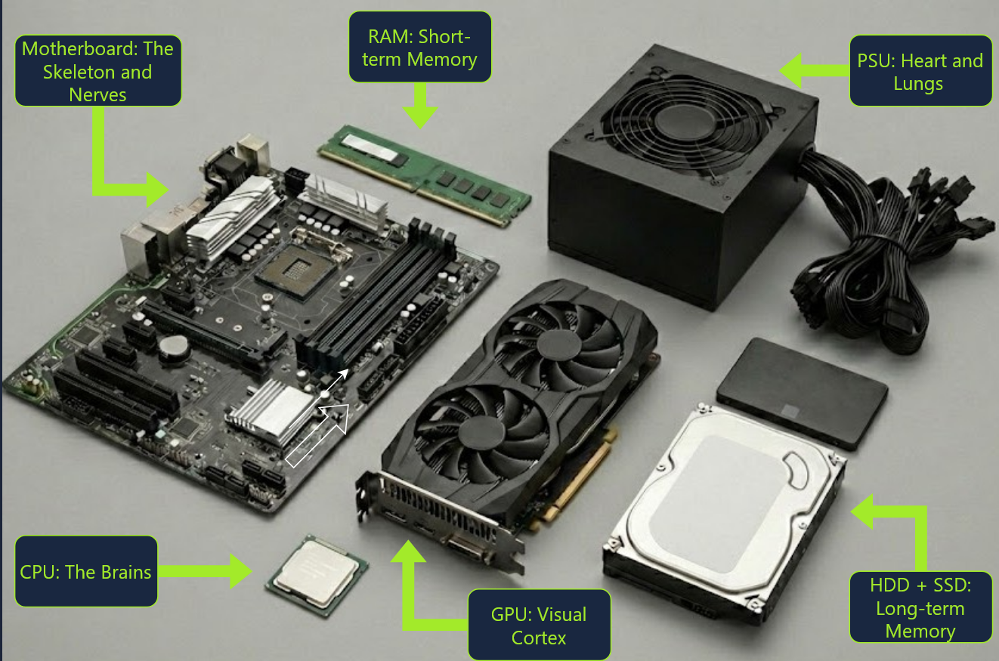 
  المكونات الأساسية للكمبيوتر وتشبيه كل منها بعضو في الجسم

<table dir="rtl" width="100%">
<thead><tr><th align="right" style="text-align:right">المكون</th><th align="right" style="text-align:right">التشبيه</th><th align="right" style="text-align:right">وظيفته باختصار</th></tr></thead>
<tbody>
<tr><td dir="ltr" align="left" style="text-align:left"><b>Motherboard</b></td><td align="right" style="text-align:right">الهيكل والأعصاب</td><td align="right" style="text-align:right">تربط كل المكونات وتنقل البيانات والطاقة بينها</td></tr>
<tr><td dir="ltr" align="left" style="text-align:left"><b>CPU</b></td><td align="right" style="text-align:right">العقل</td><td align="right" style="text-align:right">ينفذ التعليمات ويعالج البيانات</td></tr>
<tr><td dir="ltr" align="left" style="text-align:left"><b>RAM</b></td><td align="right" style="text-align:right">الذاكرة قصيرة المدى</td><td align="right" style="text-align:right">تحفظ ما يعمل عليه الجهاز الآن بسرعة عالية</td></tr>
<tr><td dir="ltr" align="left" style="text-align:left"><b>HDD + SSD</b></td><td align="right" style="text-align:right">الذاكرة طويلة المدى</td><td align="right" style="text-align:right">تخزن النظام والملفات بشكل دائم</td></tr>
<tr><td dir="ltr" align="left" style="text-align:left"><b>GPU</b></td><td align="right" style="text-align:right">القشرة البصرية</td><td align="right" style="text-align:right">تعالج الصورة والرسومات وترسلها للشاشة</td></tr>
<tr><td dir="ltr" align="left" style="text-align:left"><b>PSU</b></td><td align="right" style="text-align:right">القلب والرئتان</td><td align="right" style="text-align:right">تحوّل كهرباء المقبس إلى الجهد المناسب وتوزعه</td></tr>
</tbody>
</table>

### 1.4 اللوحة الأم (Motherboard)

هي اللوحة الإلكترونية الرئيسية التي **تُركَّب عليها** باقي القطع. بدونها تبقى القطع منفصلة لا تستطيع التواصل. أهم ما يوجد عليها:

<table dir="rtl" width="100%">
<thead><tr><th align="right" style="text-align:right">الجزء</th><th align="right" style="text-align:right">وظيفته</th></tr></thead>
<tbody>
<tr><td dir="ltr" align="left" style="text-align:left"><b>CPU Socket</b></td><td align="right" style="text-align:right">مكان تركيب المعالج</td></tr>
<tr><td dir="ltr" align="left" style="text-align:left"><b>RAM Slots</b></td><td align="right" style="text-align:right">فتحات تركيب شرائح الذاكرة</td></tr>
<tr><td dir="ltr" align="left" style="text-align:left"><b>PCIe Slots</b></td><td align="right" style="text-align:right">فتحات توصيل كروت التوسعة مثل كرت الشاشة وكرت الشبكة</td></tr>
<tr><td dir="ltr" align="left" style="text-align:left"><b>SATA / M.2 Ports</b></td><td align="right" style="text-align:right">منافذ توصيل وحدات التخزين</td></tr>
<tr><td dir="ltr" align="left" style="text-align:left"><b>Power Connectors</b></td><td align="right" style="text-align:right">وصلات الطاقة القادمة من مزود الطاقة</td></tr>
<tr><td dir="ltr" align="left" style="text-align:left"><b>Firmware Chip (BIOS/UEFI)</b></td><td align="right" style="text-align:right">شريحة تحمل البرنامج الأول الذي يعمل عند التشغيل</td></tr>
<tr><td dir="ltr" align="left" style="text-align:left"><b>Chipset</b></td><td align="right" style="text-align:right">يدير الاتصال بين المعالج وباقي المكونات</td></tr>
<tr><td dir="ltr" align="left" style="text-align:left"><b>I/O Ports</b></td><td align="right" style="text-align:right">منافذ الخلفية: USB والشبكة والصوت والشاشة</td></tr>
</tbody>
</table>

  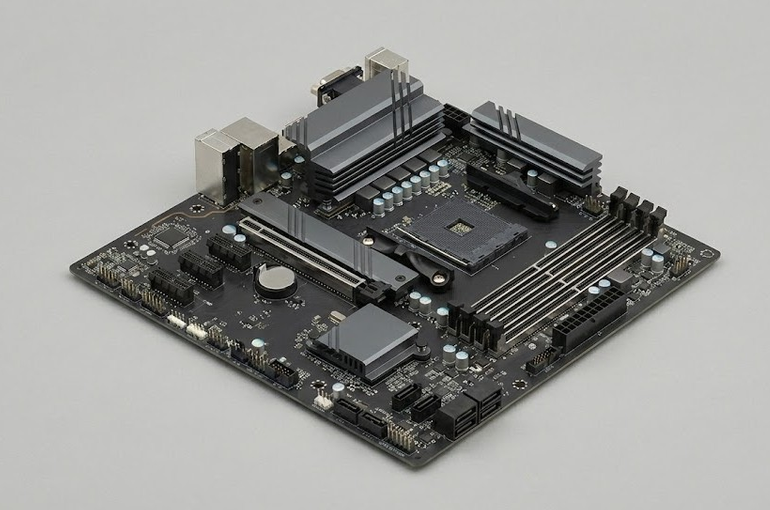 
  لوحة أم ويظهر عليها مكان المعالج وفتحات الذاكرة وفتحات التوسعة

ولحل أي تحدي لتركيب القطع، لا تحفظ المكان، بل **اقرأ شكل القطعة وشكل فتحتها**: كل قطعة لها فتحة بشكل وحجم خاص بها.

### 1.5 المعالج (CPU)

**Central Processing Unit** هو المسؤول عن تنفيذ التعليمات: يجلب التعليمة من الذاكرة، يفكّها، ينفذها، ثم يكتب النتيجة. من أهم مفاهيمه:

<table dir="rtl" width="100%">
<thead><tr><th align="right" style="text-align:right">المفهوم</th><th align="right" style="text-align:right">الشرح</th></tr></thead>
<tbody>
<tr><td align="right" style="text-align:right"><b>Core</b> (النواة)</td><td align="right" style="text-align:right">وحدة معالجة مستقلة؛ كلما زادت النوى زادت القدرة على تنفيذ مهام متزامنة</td></tr>
<tr><td align="right" style="text-align:right"><b>Clock Speed</b> (السرعة)</td><td align="right" style="text-align:right">عدد الدورات في الثانية ويقاس بالجيجاهرتز (GHz)</td></tr>
<tr><td dir="ltr" align="left" style="text-align:left"><b>Cache</b></td><td align="right" style="text-align:right">ذاكرة صغيرة جدًا وسريعة داخل المعالج تحفظ ما يتكرر استخدامه</td></tr>
<tr><td dir="ltr" align="left" style="text-align:left"><b>Socket</b></td><td align="right" style="text-align:right">نوع القاعدة التي يركب عليها؛ يجب أن يطابق قاعدة اللوحة الأم</td></tr>
</tbody>
</table>

  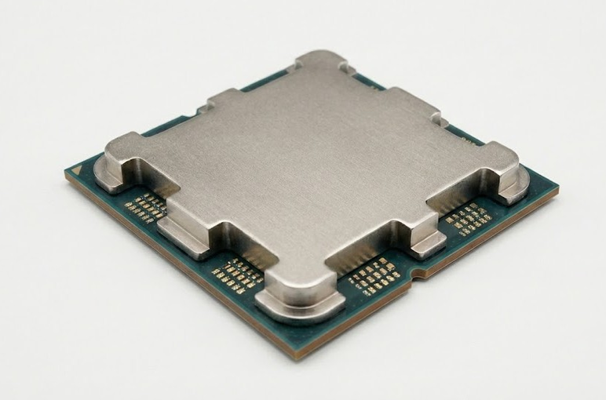 
  معالج CPU ويظهر الغطاء المعدني الذي يحمي النواة من الأعلى

المعالج يسخن أثناء العمل، لذلك يُركَّب فوقه **مبرّد (Cooler)** ومروحة.

### 1.6 الذاكرة العشوائية (RAM)

**Random Access Memory** هي مساحة العمل السريعة التي يضع فيها الجهاز البرامج والبيانات **التي يستخدمها الآن**، لأن المعالج يستطيع الوصول إليها أسرع بكثير من وحدة التخزين. وهي **متطايرة (Volatile)**: تفقد محتواها بمجرد انقطاع الكهرباء.

  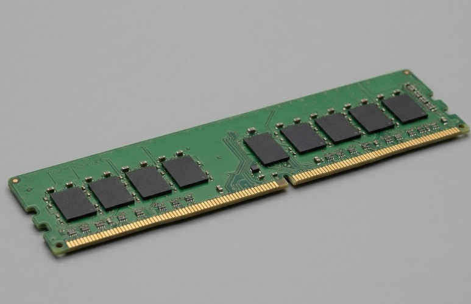 
  شريحة RAM بما عليها من رقائق الذاكرة والأطراف الذهبية

<table dir="rtl" width="100%">
<thead><tr><th align="right" style="text-align:right">المقارنة</th><th align="right" style="text-align:right">RAM</th><th align="right" style="text-align:right">وحدة التخزين</th></tr></thead>
<tbody>
<tr><td align="right" style="text-align:right"><b>السرعة</b></td><td align="right" style="text-align:right">سريعة جدًا</td><td align="right" style="text-align:right">أبطأ</td></tr>
<tr><td align="right" style="text-align:right"><b>الحفظ</b></td><td align="right" style="text-align:right">مؤقت (يُمسح عند الإغلاق)</td><td align="right" style="text-align:right">دائم</td></tr>
<tr><td align="right" style="text-align:right"><b>السعة</b></td><td align="right" style="text-align:right">أصغر</td><td align="right" style="text-align:right">أكبر</td></tr>
</tbody>
</table>

### 1.7 وحدات التخزين (HDD و SSD)

هي الذاكرة **الدائمة** التي تحفظ نظام التشغيل والبرامج والملفات حتى بعد إطفاء الجهاز.

<table dir="rtl" width="100%">
<thead><tr><th align="right" style="text-align:right">المقارنة</th><th align="right" style="text-align:right">HDD (Hard Disk Drive)</th><th align="right" style="text-align:right">SSD (Solid State Drive)</th></tr></thead>
<tbody>
<tr><td align="right" style="text-align:right"><b>طريقة العمل</b></td><td align="right" style="text-align:right">أقراص معدنية تدور ورأس قراءة متحرك</td><td align="right" style="text-align:right">رقائق ذاكرة إلكترونية بلا أجزاء متحركة</td></tr>
<tr><td align="right" style="text-align:right"><b>السرعة</b></td><td align="right" style="text-align:right">أبطأ</td><td align="right" style="text-align:right">أسرع بكثير</td></tr>
<tr><td align="right" style="text-align:right"><b>التكلفة لكل جيجابايت</b></td><td align="right" style="text-align:right">أرخص</td><td align="right" style="text-align:right">أغلى</td></tr>
<tr><td align="right" style="text-align:right"><b>الصدمات</b></td><td align="right" style="text-align:right">أكثر عرضة للتلف</td><td align="right" style="text-align:right">أكثر تحملًا</td></tr>
</tbody>
</table>

  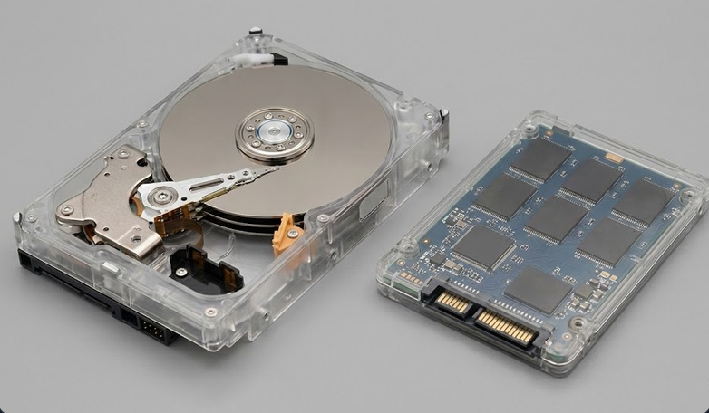 
  قرص HDD بأقراصه الدوارة (يسار) وقرص SSD برقائق الذاكرة (يمين)

### 1.8 كرت الشاشة (GPU) ومزود الطاقة (PSU)

**كرت الشاشة (Graphics Processing Unit):** معالج متخصص في الرسومات والعمليات المتوازية الكثيرة، ويتولى إخراج الصورة إلى الشاشة. بعض الأجهزة تعتمد على وحدة رسومات مدمجة داخل المعالج بدل كرت مستقل.

**مزود الطاقة (Power Supply Unit):** يحوّل التيار المتردد (AC) القادم من المقبس إلى تيار مستمر (DC) بجهود مختلفة تناسب كل مكون، ويوزعها عبر كابلات إلى اللوحة الأم والكروت ووحدات التخزين. وسبب تشبيهه بـ "القلب والرئتين" أنه بدونه لا يعمل شيء.

### 1.9 كرت الشبكة (NIC)

**Network Interface Card** هو المكون الذي يتيح للجهاز الاتصال بالشبكة والإنترنت، سواء بالكابل (Ethernet) أو لاسلكيًا (Wi-Fi). ولكل كرت عنوان فيزيائي فريد يسمى **MAC Address**. وفي أغلب الأجهزة يكون مدمجًا في اللوحة الأم، ويمكن إضافته ككرت توسعة في فتحة PCIe.

  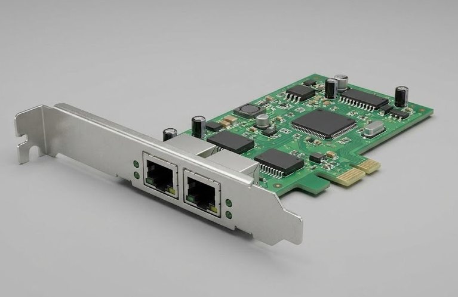 
  كرت شبكة بمنفذي Ethernet يُركَّب في فتحة PCIe

### 1.10 الأجهزة الطرفية (Peripherals)

هي الأجهزة التي تُوصَّل بالكمبيوتر من الخارج وتقسم بحسب اتجاه البيانات:

<table dir="rtl" width="100%">
<thead><tr><th align="right" style="text-align:right">النوع</th><th align="right" style="text-align:right">أمثلة</th></tr></thead>
<tbody>
<tr><td align="right" style="text-align:right"><b>Input</b> (إدخال)</td><td align="right" style="text-align:right">لوحة المفاتيح، الفأرة، الميكروفون</td></tr>
<tr><td align="right" style="text-align:right"><b>Output</b> (إخراج)</td><td align="right" style="text-align:right">الشاشة، السماعات، الطابعة</td></tr>
<tr><td align="right" style="text-align:right"><b>Input/Output</b> (إدخال وإخراج)</td><td align="right" style="text-align:right">سماعة الرأس بميكروفون، الفلاشة، شاشة اللمس</td></tr>
</tbody>
</table>

   
  شاشة ولوحة مفاتيح وفأرة وسماعة رأس متصلة بالكمبيوتر

### 1.11 الزاوية الأمنية: أمن مكونات الجهاز

الأمن لا يبدأ من نظام التشغيل، بل من **العتاد نفسه**. وكل مكون تعلمناه له زاوية أمنية:

<table dir="rtl" width="100%">
<thead><tr><th align="right" style="text-align:right">المكون</th><th align="right" style="text-align:right">الزاوية الأمنية</th><th align="right" style="text-align:right">الحماية</th></tr></thead>
<tbody>
<tr><td dir="ltr" align="left" style="text-align:left"><b>Firmware (BIOS / UEFI)</b></td><td align="right" style="text-align:right">هو أول كود يعمل عند التشغيل، فإذا عُدّل بشكل خبيث سبق نظام التشغيل وأخفى نفسه عنه</td><td align="right" style="text-align:right">تحديث الـ Firmware، تفعيل <code>Secure Boot</code>، حماية إعداداته بكلمة مرور</td></tr>
<tr><td align="right" style="text-align:right"><b>ترتيب الإقلاع (Boot Order)</b></td><td align="right" style="text-align:right">يمكن الإقلاع من وحدة خارجية والتحايل على حماية نظام التشغيل</td><td align="right" style="text-align:right">تقييد الإقلاع من الوسائط الخارجية</td></tr>
<tr><td dir="ltr" align="left" style="text-align:left"><b>Storage (HDD / SSD)</b></td><td align="right" style="text-align:right">سرقة القرص تعني سرقة كل ما عليه، ولو كان الجهاز مطفأ</td><td align="right" style="text-align:right">تشفير القرص (مثل <code>BitLocker</code> أو <code>LUKS</code>)</td></tr>
<tr><td dir="ltr" align="left" style="text-align:left"><b>RAM</b></td><td align="right" style="text-align:right">تحتوي مؤقتًا على بيانات حساسة مثل كلمات المرور والمفاتيح أثناء استخدامها</td><td align="right" style="text-align:right">قفل الجهاز وعدم تركه، وتقييد الوصول الفيزيائي إليه</td></tr>
<tr><td dir="ltr" align="left" style="text-align:left"><b>Peripherals (USB)</b></td><td align="right" style="text-align:right">قد يتنكر جهاز USB على هيئة لوحة مفاتيح ويكتب أوامر</td><td align="right" style="text-align:right">عدم توصيل أجهزة غير معروفة، وتقييد منافذ USB</td></tr>
<tr><td dir="ltr" align="left" style="text-align:left"><b>NIC</b></td><td align="right" style="text-align:right">كل اتصال يمر عبره، وعنوانه (MAC) يمكن انتحاله</td><td align="right" style="text-align:right">جدار ناري وتقسيم للشبكة</td></tr>
</tbody>
</table>

والخلاصة أن **الوصول الفيزيائي للجهاز يتجاوز كثيرًا من الحمايات البرمجية**، لذلك يُعد الأمن الفيزيائي جزءًا من الأمن السيبراني.

<h2 dir="ltr" align="left" style="text-align:left">🛠 Commands &amp; Hands-on</h2>

هذه الغرفة لا تعتمد على أوامر في الـ Terminal، بل على **تدريبين تفاعليين**: تركيب القطع، ثم تتبّع عملية الإقلاع.

### 1.12 تدريب: تركيب القطع على اللوحة الأم

المطلوب في التدريب هو وضع كل قطعة في مكانها الصحيح على اللوحة الأم. وبدل البحث عن الإجابة، نتبع منهجية ثابتة تصلح لأي تركيب:

1. **تعرّف على القطعة** من شكلها: شريحة طويلة رفيعة (RAM)، مربع صغير بأطراف (CPU)، كرت عريض بمراوح (GPU).
2. **تعرّف على فتحتها** على اللوحة: قاعدة مربعة (Socket)، فتحات طويلة متوازية (RAM Slots)، فتحة طويلة (PCIe).
3. **طابق الشكل والحجم والاتجاه**: القطعة تُركَّب في اتجاه واحد فقط (علامة مثلث على المعالج، وحز في منتصف الذاكرة).
4. **اسأل عن الوظيفة**: هل هذه القطعة تعالج؟ تحفظ مؤقتًا؟ تحفظ دائمًا؟ ثم اربطها بمكانها.

### 1.13 ماذا يحدث عند الضغط على زر الباور؟

بين الضغط على الزر وظهور سطح المكتب تمر عملية الإقلاع (**Booting**) بخمس خطوات متتابعة:

<table dir="rtl" width="100%">
<thead><tr><th align="right" style="text-align:right">#</th><th align="right" style="text-align:right">الخطوة</th><th align="right" style="text-align:right">الشرح</th></tr></thead>
<tbody>
<tr><td align="right" style="text-align:right">1</td><td align="right" style="text-align:right"><b>تشغيل الطاقة (Power On)</b></td><td align="right" style="text-align:right">زر الباور يرسل إشارة، فيبدأ مزود الطاقة بتغذية اللوحة الأم والمكونات</td></tr>
<tr><td align="right" style="text-align:right">2</td><td align="right" style="text-align:right"><b>تشغيل الـ Firmware</b></td><td align="right" style="text-align:right">يبدأ المعالج بتنفيذ برنامج صغير مخزن على شريحة اللوحة الأم (BIOS أو UEFI)</td></tr>
<tr><td align="right" style="text-align:right">3</td><td align="right" style="text-align:right"><b>الفحص الذاتي (POST)</b></td><td align="right" style="text-align:right"><b>Power-On Self-Test</b>: فحص سريع للمعالج والذاكرة وكرت الشاشة وبقية القطع للتأكد من سلامتها</td></tr>
<tr><td align="right" style="text-align:right">4</td><td align="right" style="text-align:right"><b>تحميل الـ Bootloader</b></td><td align="right" style="text-align:right">يبحث الـ Firmware عن وحدة التخزين التي عليها نظام التشغيل ويحمّل منها برنامج الإقلاع إلى الـ RAM</td></tr>
<tr><td align="right" style="text-align:right">5</td><td align="right" style="text-align:right"><b>تحميل نظام التشغيل</b></td><td align="right" style="text-align:right">يحمّل الـ Bootloader نواة النظام (Kernel)، ثم تبدأ الخدمات وتظهر واجهة المستخدم</td></tr>
</tbody>
</table>

  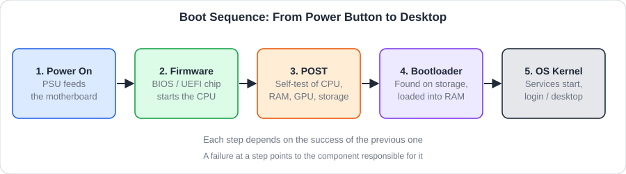 
  مخطط يلخص خطوات الإقلاع الخمس بالترتيب

### 1.14 تدريب: تتبّع عملية الإقلاع

التدريب الثاني يركز على **ماذا سيفعل الكمبيوتر عند الضغط على الباور وتشغيل المكونات**، أي ترتيب العملية. والطريقة العملية لحله:

- اربط كل خطوة بالمكون المسؤول عنها: الطاقة ← مزود الطاقة، الـ Firmware ← شريحة اللوحة الأم، الفحص ← المعالج وبقية القطع، التحميل ← وحدة التخزين ثم الـ RAM.
- تذكّر أن **كل خطوة تعتمد على نجاح التي قبلها**، فلا يمكن تحميل النظام قبل نجاح الفحص.
- إن ظهر خطأ، فالمكان الذي توقف عنده الإقلاع يدل على المكون المعطوب.

<h2 dir="ltr" align="left" style="text-align:left">🖼 Practical Scenarios</h2>

### 1.15 سيناريو: رحلة معلومة داخل الجهاز

نتتبع ما يحدث عند فتح ملف مستند بالضغط عليه مرتين:

1. **الإدخال:** النقر بالفأرة (جهاز إدخال) يرسل إشارة عبر اللوحة الأم إلى المعالج.
2. **المعالجة:** يفهم المعالج أن المطلوب فتح ملف، فيطلب من النظام جلبه.
3. **التخزين:** يُقرأ الملف من الـ SSD أو الـ HDD.
4. **الذاكرة:** تُنسخ نسخة العمل إلى الـ RAM لأن المعالج يتعامل معها بسرعة.
5. **الإخراج:** يرسل المعالج الصورة إلى كرت الشاشة (GPU) فتظهر على الشاشة.
6. **الطاقة:** طوال العملية يغذي مزود الطاقة كل هذه القطع.

وإذا كان الملف على الشبكة فيدخل **كرت الشبكة (NIC)** في الرحلة أيضًا.

<h2 dir="ltr" align="left" style="text-align:left">📝 Practical Takeaways</h2>

- الكمبيوتر يعمل بدورة: **إدخال ← معالجة ← تخزين ← إخراج**.
- **اللوحة الأم** هي التي تربط المكونات كلها، و**مزود الطاقة** يغذيها.
- **RAM** سريعة ومؤقتة، و**HDD / SSD** أبطأ لكنها دائمة، و**SSD** أسرع وأكثر تحملًا من **HDD**.
- **CPU** ينفذ التعليمات، و**GPU** متخصص في الرسومات، و**NIC** يربط الجهاز بالشبكة.
- عملية الإقلاع خمس خطوات مرتبة: طاقة ← Firmware ← POST ← Bootloader ← نظام التشغيل.
- في تركيب القطع: ابدأ بالشكل والوظيفة، ولا تحفظ الأماكن حفظًا أعمى.
- معرفة مكونات الجهاز أساس لفهم أين تُخزَّن البيانات وأين تحدث المعالجة، وهو ما يحتاجه المدافع والمهاجم معًا.
- الأمن يبدأ من العتاد: الـ Firmware والإقلاع والتشفير والوصول الفيزيائي كلها نقاط حماية.

 

<table align="center" width="100%"><tr><td align="right" style="text-align:right">

### 🚪 الغرفة 2: Computer Types (أنواع الحواسيب)

</td></tr></table>

<h1 dir="ltr" align="left" style="text-align:left">Computer Types</h1>

### 2.1 التعريف بالغرفة وأهميتها

لا يوجد نوع واحد من الحواسيب؛ فالهاتف في يدك، والخادم في مركز البيانات، والكاميرا الذكية في الشارع، كلها حواسيب بمكونات متشابهة (معالج وذاكرة وتخزين) لكنها تختلف في **الحجم والقدرة والغرض**. وتصنيفها مهم في الأمن السيبراني لأن لكل نوع **نقاط ضعف وسطح هجوم (Attack Surface)** مختلف.

والهدف من الغرفة هو **فهم هذا التنوع** ومعرفة كيف يختلف دور كل نوع في البيئات التقنية والمعلوماتية.

<h2 dir="ltr" align="left" style="text-align:left">📌 Concepts Covered</h2>

### 2.2 معايير التصنيف

تتنوع أجهزة الحوسبة بحسب ثلاثة معايير رئيسية:

<table dir="rtl" width="100%">
<thead><tr><th align="right" style="text-align:right">المعيار</th><th align="right" style="text-align:right">الشرح</th></tr></thead>
<tbody>
<tr><td align="right" style="text-align:right"><b>الحجم (Size)</b></td><td align="right" style="text-align:right">من جهاز صغير يوضع في الجيب إلى أنظمة تملأ غرفًا كاملة</td></tr>
<tr><td align="right" style="text-align:right"><b>القوة الحوسبية (Computing Power)</b></td><td align="right" style="text-align:right">كم يعالج الجهاز من البيانات وبأي سرعة</td></tr>
<tr><td align="right" style="text-align:right"><b>الغرض من الاستخدام (Purpose)</b></td><td align="right" style="text-align:right">لماذا صُمّم الجهاز: استخدام شخصي، أم خدمة عدد كبير من المستخدمين، أم مهمة محددة</td></tr>
</tbody>
</table>

### 2.3 أنواع الأجهزة الرئيسية (Types of Computers)

<table dir="rtl" width="100%">
<thead><tr><th align="right" style="text-align:right">النوع</th><th align="right" style="text-align:right">الوصف</th></tr></thead>
<tbody>
<tr><td dir="ltr" align="left" style="text-align:left"><b>Personal Computers (PCs / Laptops)</b></td><td align="right" style="text-align:right">الأجهزة الشخصية المخصصة للمستخدم الفردي والأعمال اليومية، مكتبية أو محمولة</td></tr>
<tr><td align="right" style="text-align:right"><b>Servers</b> (الخوادم)</td><td align="right" style="text-align:right">أجهزة عالية الكفاءة مخصصة لتقديم الخدمات والبيانات لعدة مستخدمين عبر الشبكة</td></tr>
<tr><td dir="ltr" align="left" style="text-align:left"><b>Mainframes &amp; Supercomputers</b></td><td align="right" style="text-align:right">أنظمة حوسبة ضخمة تُستخدم في معالجة البيانات العملاقة والمحاكاة العلمية</td></tr>
</tbody>
</table>

### 2.4 الأجهزة المدمجة والمحمولة (Embedded & Mobile Devices)

<table dir="rtl" width="100%">
<thead><tr><th align="right" style="text-align:right">النوع</th><th align="right" style="text-align:right">الوصف</th></tr></thead>
<tbody>
<tr><td dir="ltr" align="left" style="text-align:left"><b>Mobile Devices</b> (Smartphones / Tablets)</td><td align="right" style="text-align:right">الأجهزة الذكية المحمولة، ولها أنظمة تشغيل مخصصة (مثل Android وiOS)</td></tr>
<tr><td align="right" style="text-align:right"><b>Embedded Systems</b> (الأنظمة المدمجة)</td><td align="right" style="text-align:right">أجهزة كمبيوتر مخصصة لوظيفة واحدة داخل نظام أكبر، مثل السيارات وأجهزة IoT</td></tr>
</tbody>
</table>

### 2.5 المقارنة بين الأنواع

<table dir="rtl" width="100%">
<thead><tr><th align="right" style="text-align:right">النوع</th><th align="right" style="text-align:right">القدرة</th><th align="right" style="text-align:right">التنقل</th><th align="right" style="text-align:right">الاستخدام الأساسي</th></tr></thead>
<tbody>
<tr><td dir="ltr" align="left" style="text-align:left"><b>PCs / Laptops</b></td><td align="right" style="text-align:right">متوسطة إلى عالية</td><td align="right" style="text-align:right">ثابت أو محمول</td><td align="right" style="text-align:right">العمل اليومي والترفيه</td></tr>
<tr><td dir="ltr" align="left" style="text-align:left"><b>Servers</b></td><td align="right" style="text-align:right">عالية جدًا</td><td align="right" style="text-align:right">ثابت في مركز بيانات</td><td align="right" style="text-align:right">تقديم الخدمات لعدة مستخدمين</td></tr>
<tr><td dir="ltr" align="left" style="text-align:left"><b>Mainframes &amp; Supercomputers</b></td><td align="right" style="text-align:right">ضخمة</td><td align="right" style="text-align:right">ثابت</td><td align="right" style="text-align:right">معالجة البيانات العملاقة والمحاكاة العلمية</td></tr>
<tr><td dir="ltr" align="left" style="text-align:left"><b>Mobile Devices</b></td><td align="right" style="text-align:right">متوسطة</td><td align="right" style="text-align:right">محمول جدًا</td><td align="right" style="text-align:right">الاتصال والتطبيقات</td></tr>
<tr><td dir="ltr" align="left" style="text-align:left"><b>Embedded Systems</b></td><td align="right" style="text-align:right">منخفضة</td><td align="right" style="text-align:right">مدمج داخل نظام أكبر</td><td align="right" style="text-align:right">مهمة واحدة محددة</td></tr>
</tbody>
</table>

  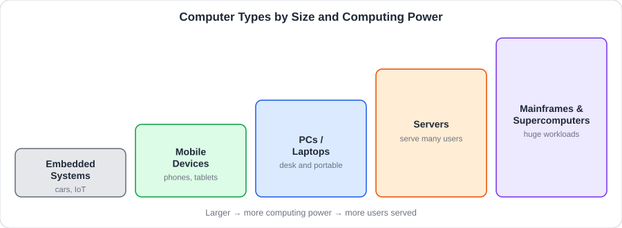 
  ترتيب أنواع الحواسيب من الأصغر إلى الأكبر قوة وحجمًا

### 2.6 الزاوية الأمنية: لكل نوع جهاز تهديداته

<table dir="rtl" width="100%">
<thead><tr><th align="right" style="text-align:right">النوع</th><th align="right" style="text-align:right">تهديدات شائعة</th><th align="right" style="text-align:right">حماية أساسية</th></tr></thead>
<tbody>
<tr><td dir="ltr" align="left" style="text-align:left"><b>PCs / Laptops</b></td><td align="right" style="text-align:right">الضياع أو السرقة، البرمجيات الخبيثة، رسائل التصيد</td><td align="right" style="text-align:right">تشفير القرص، التحديثات الدورية، برنامج حماية</td></tr>
<tr><td dir="ltr" align="left" style="text-align:left"><b>Servers</b></td><td align="right" style="text-align:right">استهداف مباشر من الإنترنت، ثغرات الخدمات، هجمات تعطيل الخدمة</td><td align="right" style="text-align:right">التحديث، جدار ناري، أقل صلاحيات ممكنة، مراقبة السجلات</td></tr>
<tr><td dir="ltr" align="left" style="text-align:left"><b>Mainframes &amp; Supercomputers</b></td><td align="right" style="text-align:right">بيانات عالية القيمة، وأنظمة قديمة يصعب تحديثها</td><td align="right" style="text-align:right">عزل الوصول، إدارة صارمة للصلاحيات، مراقبة مستمرة</td></tr>
<tr><td dir="ltr" align="left" style="text-align:left"><b>Mobile Devices</b></td><td align="right" style="text-align:right">تطبيقات خبيثة، شبكات Wi-Fi العامة، رسائل تصيد</td><td align="right" style="text-align:right">التثبيت من المتاجر الرسمية، التحديث، قفل الجهاز</td></tr>
<tr><td dir="ltr" align="left" style="text-align:left"><b>Embedded Systems / IoT</b></td><td align="right" style="text-align:right">كلمات مرور افتراضية، وأجهزة قلّما تُحدَّث</td><td align="right" style="text-align:right">تغيير كلمات المرور، عزلها في شبكة منفصلة، تحديثها عند توفر تحديث</td></tr>
</tbody>
</table>

القاعدة العامة أن **كل جهاز متصل بالشبكة هو نقطة دخول محتملة**، وأضعف جهاز في الشبكة قد يكون بوابة الوصول إلى الأقوى.

<h2 dir="ltr" align="left" style="text-align:left">🛠 Commands &amp; Hands-on</h2>

هذه الغرفة نظرية تعريفية ولا تعتمد على أوامر؛ التطبيق فيها هو **ربط كل نوع بالاستخدام المناسب له**.

<h2 dir="ltr" align="left" style="text-align:left">🖼 Practical Scenarios</h2>

### 2.7 سيناريو: أجهزة مؤسسة واحدة

شركة صغيرة تستخدم أكثر من نوع في الوقت نفسه، ولكل نوع خطر مختلف:

<table dir="rtl" width="100%">
<thead><tr><th align="right" style="text-align:right">الجهاز</th><th align="right" style="text-align:right">دوره في الشركة</th><th align="right" style="text-align:right">ما يشغل بال المدافع</th></tr></thead>
<tbody>
<tr><td dir="ltr" align="left" style="text-align:left"><b>Server</b></td><td align="right" style="text-align:right">استضافة موقع الشركة وبريدها</td><td align="right" style="text-align:right">هو الهدف الأكبر لأنه يحتوي بيانات الجميع ويعمل دائمًا</td></tr>
<tr><td dir="ltr" align="left" style="text-align:left"><b>PCs / Laptops</b></td><td align="right" style="text-align:right">عمل الموظفين</td><td align="right" style="text-align:right">قد يضيع أو يُسرق، ويتصل بشبكات غير آمنة</td></tr>
<tr><td dir="ltr" align="left" style="text-align:left"><b>Mobile Devices</b></td><td align="right" style="text-align:right">البريد والتطبيقات</td><td align="right" style="text-align:right">تطبيقات خبيثة ورسائل تصيّد</td></tr>
<tr><td dir="ltr" align="left" style="text-align:left"><b>Embedded Systems / IoT</b></td><td align="right" style="text-align:right">كاميرات المراقبة وأجهزة المكتب الذكية</td><td align="right" style="text-align:right">غالبًا لا يتم تحديثها، فتبقى ثغراتها مفتوحة</td></tr>
</tbody>
</table>

<h2 dir="ltr" align="left" style="text-align:left">📝 Practical Takeaways</h2>

- كل الحواسيب تشترك في الفكرة نفسها (معالج، ذاكرة، تخزين) وتختلف في الغرض والقدرة والتنقل.
- الخادم يقدم خدمة لغيره، بينما الأجهزة الشخصية تستهلك الخدمة.
- التصنيف يتم بحسب **الحجم** و**القوة الحوسبية** و**الغرض** من الاستخدام.
- الجهاز المحمول له أنظمة تشغيل مخصصة، والنظام المدمج مخصص لوظيفة واحدة داخل نظام أكبر.
- أجهزة **IoT** والأجهزة المدمجة كثيرًا ما تُهمَل أمنيًا لأنها "صغيرة".
- كل نوع جديد يضيف إلى المؤسسة **سطح هجوم** جديدًا يجب أن يُحمى.
- لكل نوع جهاز تهديدات وحماية خاصة به، وأضعف جهاز في الشبكة قد يكون بوابة للأقوى.

 

<table align="center" width="100%"><tr><td align="right" style="text-align:right">

### 🚪 الغرفة 3: Client-Server Basics (أساسيات العميل والخادم)

</td></tr></table>

<h1 dir="ltr" align="left" style="text-align:left">Client-Server Basics</h1>

### 3.1 التعريف بالغرفة وأهميتها

معظم ما نفعله على الإنترنت قائم على نموذج واحد هو **العميل والخادم (Client-Server)**: جهاز يطلب خدمة، وجهاز آخر يقدمها. فهم هذا النموذج هو مفتاح فهم كيف تعمل المواقع والبريد والتطبيقات، وأين تقع الهجمات: على العميل أم على الخادم أم على الاتصال بينهما.

والهدف من الغرفة هو فهم أساسيات **البنية التحتية لتطبيقات الويب والشبكات**، وكيف تتفاعل الأنظمة وتتداول البيانات بين المستخدم والأنظمة المركزية.

<h2 dir="ltr" align="left" style="text-align:left">📌 Concepts Covered</h2>

### 3.2 العميل والخادم

<table dir="rtl" width="100%">
<thead><tr><th align="right" style="text-align:right">المفهوم</th><th align="right" style="text-align:right">الشرح</th></tr></thead>
<tbody>
<tr><td align="right" style="text-align:right"><b>Client</b> (العميل)</td><td align="right" style="text-align:right">الجهاز أو التطبيق الذي <b>يطلب</b> الخدمات أو البيانات من الخادم، مثل المتصفح</td></tr>
<tr><td align="right" style="text-align:right"><b>Server</b> (الخادم)</td><td align="right" style="text-align:right">الجهاز أو النظام الذي <b>يستقبل الطلبات</b> ويقدم الخدمة المطلوبة</td></tr>
<tr><td align="right" style="text-align:right"><b>Request</b> (الطلب)</td><td align="right" style="text-align:right">الرسالة التي يرسلها العميل للخادم</td></tr>
<tr><td align="right" style="text-align:right"><b>Response</b> (الاستجابة)</td><td align="right" style="text-align:right">الرسالة التي يرد بها الخادم</td></tr>
<tr><td align="right" style="text-align:right"><b>Protocol</b> (البروتوكول)</td><td align="right" style="text-align:right">القواعد المتفق عليها لشكل الرسائل بين الطرفين، مثل <code>HTTP</code> و <code>HTTPS</code></td></tr>
</tbody>
</table>

### 3.3 أنواع الخوادم

<table dir="rtl" width="100%">
<thead><tr><th align="right" style="text-align:right">الخادم</th><th align="right" style="text-align:right">وظيفته</th><th align="right" style="text-align:right">بروتوكول شائع</th></tr></thead>
<tbody>
<tr><td dir="ltr" align="left" style="text-align:left"><b>Web Server</b></td><td align="right" style="text-align:right">يقدم صفحات المواقع</td><td dir="ltr" align="left" style="text-align:left"><code>HTTP / HTTPS</code></td></tr>
<tr><td dir="ltr" align="left" style="text-align:left"><b>Mail Server</b></td><td align="right" style="text-align:right">يرسل البريد ويستقبله</td><td dir="ltr" align="left" style="text-align:left"><code>SMTP</code></td></tr>
<tr><td dir="ltr" align="left" style="text-align:left"><b>File Server</b></td><td align="right" style="text-align:right">يخزن الملفات ويشاركها</td><td dir="ltr" align="left" style="text-align:left"><code>FTP</code></td></tr>
<tr><td dir="ltr" align="left" style="text-align:left"><b>DNS Server</b></td><td align="right" style="text-align:right">يترجم أسماء المواقع إلى عناوين IP</td><td dir="ltr" align="left" style="text-align:left"><code>DNS</code></td></tr>
<tr><td dir="ltr" align="left" style="text-align:left"><b>Database Server</b></td><td align="right" style="text-align:right">يخزن البيانات ويسترجعها للتطبيقات</td><td align="right" style="text-align:right">يختلف بحسب النوع</td></tr>
</tbody>
</table>

### 3.4 دورة الطلب والاستجابة

عند كتابة عنوان موقع في المتصفح يحدث الآتي بالترتيب:

1. العميل (المتصفح) يجهز **طلبًا (Request)** للصفحة المطلوبة عبر بروتوكول مثل `HTTP` أو `HTTPS`.
2. يُترجم اسم الموقع إلى **عنوان IP** للخادم.
3. يصل الطلب عبر الشبكة إلى الخادم على **منفذ (Port)** الخدمة المناسبة.
4. الخادم يعالج الطلب ويجهز **الاستجابة (Response)** (الصفحة أو رسالة خطأ).
5. تعود الاستجابة إلى العميل فيعرضها.

وهنا تظهر أكواد الاستجابة التي رأيناها في الوحدة الأولى (200 و404 وغيرها).

  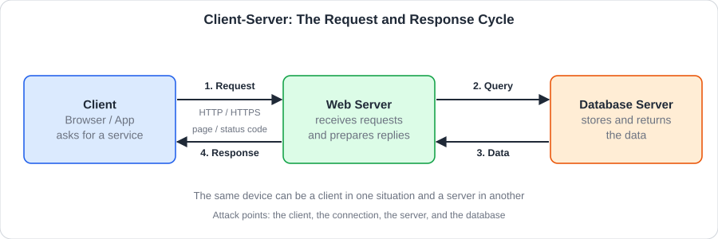 
  دورة الطلب والاستجابة بين العميل والخادم وقاعدة البيانات

### 3.5 الزاوية الأمنية: أين يُهاجَم نموذج العميل والخادم؟

كل طرف في النموذج وكل خطوة بينهما نقطة هجوم محتملة:

<table dir="rtl" width="100%">
<thead><tr><th align="right" style="text-align:right">نقطة الهجوم</th><th align="right" style="text-align:right">الخطر</th><th align="right" style="text-align:right">الحماية</th></tr></thead>
<tbody>
<tr><td dir="ltr" align="left" style="text-align:left"><b>Client</b></td><td align="right" style="text-align:right">التصيد والبرمجيات الخبيثة على جهاز المستخدم</td><td align="right" style="text-align:right">تحديث المتصفح والنظام، والحذر من الروابط</td></tr>
<tr><td align="right" style="text-align:right"><b>الاتصال (Connection)</b></td><td align="right" style="text-align:right">التنصت أو تعديل الرسائل إذا كان الاتصال غير مشفر (<code>HTTP</code>)</td><td align="right" style="text-align:right">استخدام <code>HTTPS</code></td></tr>
<tr><td dir="ltr" align="left" style="text-align:left"><b>Web Server</b></td><td align="right" style="text-align:right">صفحات إدارة بلا حماية (كما في FakeBank)، وثغرات الخدمة، وإغراقها بالطلبات</td><td align="right" style="text-align:right">مصادقة للصفحات الحساسة، تحديث، جدار ناري</td></tr>
<tr><td dir="ltr" align="left" style="text-align:left"><b>Database Server</b></td><td align="right" style="text-align:right">حقن استعلامات خبيثة (SQL Injection) وتسريب البيانات</td><td align="right" style="text-align:right">التحقق من المدخلات، صلاحيات محدودة، عدم كشفه للإنترنت</td></tr>
<tr><td dir="ltr" align="left" style="text-align:left"><b>Ports</b></td><td align="right" style="text-align:right">كل منفذ مفتوح بابٌ إضافي للهجوم</td><td align="right" style="text-align:right">إغلاق المنافذ غير المستخدمة</td></tr>
</tbody>
</table>

وهذه النقاط هي ما يراقبه المدافع في لوحة المراقبة التي رأيناها في الوحدة الأولى.

<h2 dir="ltr" align="left" style="text-align:left">🛠 Commands &amp; Hands-on</h2>

هذه الغرفة نظرية تعريفية ولا تعتمد على أوامر؛ التطبيق فيها هو **تتبّع الطلب والاستجابة** ومعرفة دور كل طرف.

<h2 dir="ltr" align="left" style="text-align:left">🖼 Practical Scenarios</h2>

### 3.6 سيناريو: زيارة موقع بنك

1. تكتب عنوان البنك في المتصفح (أنت **العميل**).
2. يصل طلبك إلى **Web Server** البنك.
3. يطلب الخادم بياناتك من **Database Server** داخلي.
4. يرد على متصفحك بصفحة حسابك (الاستجابة).

وتتضح هنا نقاط الهجوم المحتملة: العميل (جهازك)، الاتصال بينكما، الخادم نفسه، وقاعدة البيانات. وهذا ما رأيناه في **FakeBank** حين وُجدت صفحة إدارة على الخادم بلا حماية.

<h2 dir="ltr" align="left" style="text-align:left">📝 Practical Takeaways</h2>

- العميل يطلب، والخادم يقدم، والبروتوكول هو لغة التفاهم بينهما.
- الجهاز الواحد قد يكون عميلًا في موقف وخادمًا في موقف آخر.
- كل طلب يقابله استجابة، والأكواد (مثل 200 و404) تخبرنا بنتيجة الطلب.
- الخادم هدف جذاب للمهاجم لأنه يخدم عددًا كبيرًا من المستخدمين.
- الهجوم قد يقع على العميل أو الاتصال أو الخادم أو قاعدة البيانات، والحماية تكون في كل نقطة منها.

 

<table align="center" width="100%"><tr><td align="right" style="text-align:right">

### 🚪 الغرفة 4: Virtualisation Basics (أساسيات المحاكاة الافتراضية)

</td></tr></table>

<h1 dir="ltr" align="left" style="text-align:left">Virtualisation Basics</h1>

### 4.1 التعريف بالغرفة وأهميتها

**المحاكاة الافتراضية (Virtualisation)** هي تقنية تتيح تشغيل **عدة أنظمة معزولة** على جهاز فيزيائي واحد، كأن كل نظام منها جهاز كامل مستقل. وهي أساس مراكز البيانات والسحابة، وأساس مختبرات التدريب الأمني، فالأجهزة التي نتدرب عليها تعمل كآلات افتراضية.

والهدف من الغرفة هو إدراك كيف تعمل البيئات الافتراضية التي تُبنى عليها **معظم المختبرات الأمنية والخوادم الحديثة**.

<h2 dir="ltr" align="left" style="text-align:left">📌 Concepts Covered</h2>

### 4.2 المفاهيم الأساسية

<table dir="rtl" width="100%">
<thead><tr><th align="right" style="text-align:right">المفهوم</th><th align="right" style="text-align:right">الشرح</th></tr></thead>
<tbody>
<tr><td dir="ltr" align="left" style="text-align:left"><b>Virtual Machine (VM)</b></td><td align="right" style="text-align:right">جهاز افتراضي: نظام كامل (نظام تشغيل وبرامج) يعمل داخل برنامج</td></tr>
<tr><td dir="ltr" align="left" style="text-align:left"><b>Host</b></td><td align="right" style="text-align:right">الجهاز الفيزيائي الحقيقي الذي يشغل الأجهزة الافتراضية</td></tr>
<tr><td dir="ltr" align="left" style="text-align:left"><b>Guest</b></td><td align="right" style="text-align:right">النظام الذي يعمل داخل الجهاز الافتراضي</td></tr>
<tr><td dir="ltr" align="left" style="text-align:left"><b>Hypervisor</b></td><td align="right" style="text-align:right">البرنامج الذي ينشئ الأجهزة الافتراضية ويوزع عليها موارد الجهاز (معالج وذاكرة وتخزين)</td></tr>
<tr><td dir="ltr" align="left" style="text-align:left"><b>Snapshot</b></td><td align="right" style="text-align:right">لقطة تحفظ حالة الجهاز الافتراضي للعودة إليها لاحقًا</td></tr>
</tbody>
</table>

### 4.3 أنواع الـ Hypervisor

<table dir="rtl" width="100%">
<thead><tr><th align="right" style="text-align:right">النوع</th><th align="right" style="text-align:right">الشرح</th><th align="right" style="text-align:right">أمثلة</th></tr></thead>
<tbody>
<tr><td dir="ltr" align="left" style="text-align:left"><b>Type 1</b> (Bare-Metal)</td><td align="right" style="text-align:right">يعمل مباشرة على العتاد الفيزيائي دون نظام تشغيل وسيط؛ شائع في مراكز البيانات</td><td dir="ltr" align="left" style="text-align:left"><code>VMware ESXi</code>, <code>Proxmox</code></td></tr>
<tr><td dir="ltr" align="left" style="text-align:left"><b>Type 2</b> (Hosted)</td><td align="right" style="text-align:right">يعمل كبرنامج فوق نظام التشغيل الأساسي؛ شائع للاستخدام الشخصي والتعلم</td><td dir="ltr" align="left" style="text-align:left"><code>VirtualBox</code>, <code>VMware Workstation</code></td></tr>
</tbody>
</table>

  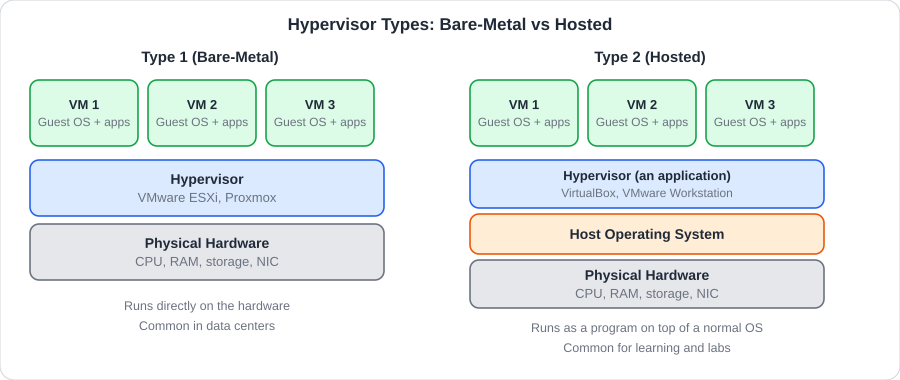 
  مقارنة بين Hypervisor من النوع الأول والنوع الثاني

### 4.4 مكونات الآلة الافتراضية (Virtual Machine)

كل جهاز افتراضي يُخصَّص له جزء من موارد المضيف، فيرى كأنه جهاز مستقل بمكونات خاصة به:

<table dir="rtl" width="100%">
<thead><tr><th align="right" style="text-align:right">المكون الافتراضي</th><th align="right" style="text-align:right">يقابل في الجهاز الحقيقي</th><th align="right" style="text-align:right">الشرح</th></tr></thead>
<tbody>
<tr><td dir="ltr" align="left" style="text-align:left"><b>vCPU</b></td><td align="right" style="text-align:right">المعالج (CPU)</td><td align="right" style="text-align:right">عدد أنوية المعالج المخصصة للآلة</td></tr>
<tr><td dir="ltr" align="left" style="text-align:left"><b>vRAM</b></td><td align="right" style="text-align:right">الذاكرة (RAM)</td><td align="right" style="text-align:right">مقدار الذاكرة المخصصة للآلة</td></tr>
<tr><td dir="ltr" align="left" style="text-align:left"><b>Virtual Disk</b></td><td align="right" style="text-align:right">وحدة التخزين (HDD / SSD)</td><td align="right" style="text-align:right">ملف على المضيف يعمل كقرص للآلة</td></tr>
<tr><td dir="ltr" align="left" style="text-align:left"><b>Virtual NIC</b></td><td align="right" style="text-align:right">كرت الشبكة (NIC)</td><td align="right" style="text-align:right">كرت شبكة افتراضي يوصل الآلة بالشبكة</td></tr>
</tbody>
</table>

وهذا يربط الغرفة بما تعلمناه في الغرفة الأولى: نفس مكونات الجهاز، لكنها هنا **برمجية**.

### 4.5 الفوائد والاستخدامات في الأمن السيبراني

<table dir="rtl" width="100%">
<thead><tr><th align="right" style="text-align:right">الجانب</th><th align="right" style="text-align:right">الفائدة</th></tr></thead>
<tbody>
<tr><td align="right" style="text-align:right"><b>العزل (Sandboxing)</b></td><td align="right" style="text-align:right">تشغيل البيئات أو الملفات المشبوهة داخل آلة معزولة دون تعريض الجهاز الحقيقي للخطر</td></tr>
<tr><td align="right" style="text-align:right"><b>توفير الموارد</b></td><td align="right" style="text-align:right">جهاز فيزيائي واحد بدل عدة أجهزة، فتقل التكلفة</td></tr>
<tr><td align="right" style="text-align:right"><b>المعامل والتجارب (Labs)</b></td><td align="right" style="text-align:right">إنشاء بيئات للتدريب والتجربة وإعادتها بسرعة عبر اللقطات (Snapshots)</td></tr>
<tr><td align="right" style="text-align:right"><b>الحد</b></td><td align="right" style="text-align:right">تتشارك الآلات موارد المضيف، فاستهلاك مفرط من واحدة يبطئ البقية</td></tr>
</tbody>
</table>

### 4.6 الجهاز الافتراضي مقابل الحاوية

<table dir="rtl" width="100%">
<thead><tr><th align="right" style="text-align:right">المقارنة</th><th align="right" style="text-align:right">VM</th><th align="right" style="text-align:right">Container</th></tr></thead>
<tbody>
<tr><td align="right" style="text-align:right"><b>الحجم</b></td><td align="right" style="text-align:right">أثقل (نظام تشغيل كامل)</td><td align="right" style="text-align:right">أخف (تشارك نواة المضيف)</td></tr>
<tr><td align="right" style="text-align:right"><b>العزل</b></td><td align="right" style="text-align:right">أقوى</td><td align="right" style="text-align:right">أخف</td></tr>
<tr><td align="right" style="text-align:right"><b>زمن التشغيل</b></td><td align="right" style="text-align:right">أبطأ</td><td align="right" style="text-align:right">أسرع</td></tr>
</tbody>
</table>

### 4.7 الزاوية الأمنية: الافتراضية سلاح ذو حدين

العزل يمنح أمانًا، لكن الافتراضية لها مخاطرها أيضًا:

<table dir="rtl" width="100%">
<thead><tr><th align="right" style="text-align:right">الخطر</th><th align="right" style="text-align:right">الشرح</th><th align="right" style="text-align:right">الحماية</th></tr></thead>
<tbody>
<tr><td dir="ltr" align="left" style="text-align:left"><b>VM Escape</b></td><td align="right" style="text-align:right">ثغرة نادرة تتيح لما بداخل الآلة (Guest) الوصول إلى المضيف (Host)</td><td align="right" style="text-align:right">تحديث الـ Hypervisor باستمرار</td></tr>
<tr><td align="right" style="text-align:right"><b>Snapshots وملفات الأقراص</b></td><td align="right" style="text-align:right">قد تحتوي كلمات مرور وبيانات حساسة محفوظة وقت اللقطة</td><td align="right" style="text-align:right">حماية ملفات الآلات وتشفيرها وحذف القديم منها</td></tr>
<tr><td dir="ltr" align="left" style="text-align:left"><b>VM Sprawl</b></td><td align="right" style="text-align:right">آلات منسية تعمل دون تحديث فتصبح ثغرة مفتوحة</td><td align="right" style="text-align:right">جرد دوري للآلات وإزالة غير المستخدم</td></tr>
<tr><td align="right" style="text-align:right"><b>الموارد المشتركة</b></td><td align="right" style="text-align:right">استهلاك واحدة للموارد يؤثر على غيرها، وبعض الهجمات تستغل التشارك</td><td align="right" style="text-align:right">فصل الأحمال الحساسة عن غيرها</td></tr>
<tr><td align="right" style="text-align:right"><b>تحليل البرمجيات الخبيثة</b></td><td align="right" style="text-align:right">تشغيل عينة مشبوهة يجب أن يكون داخل آلة معزولة عن الشبكة الحقيقية</td><td align="right" style="text-align:right">عزل الشبكة، واللقطات للرجوع للحالة النظيفة</td></tr>
</tbody>
</table>

والفكرة أن الجهاز الافتراضي **ليس سحرًا أمنيًا**؛ هو جهاز كامل يحتاج تحديثات وصلاحيات وحماية كأي جهاز آخر.

<h2 dir="ltr" align="left" style="text-align:left">🛠 Commands &amp; Hands-on</h2>

هذه الغرفة نظرية تعريفية ولا تعتمد على أوامر؛ التطبيق فيها هو **فهم بنية الجهاز الافتراضي** والعلاقة بين المضيف والضيف.

<h2 dir="ltr" align="left" style="text-align:left">🖼 Practical Scenarios</h2>

### 4.8 سيناريو: مختبر أمني آمن

يريد متدرب أن يجرّب أدوات الفحص دون تعريض جهازه الحقيقي للخطر:

1. ينشئ جهازًا افتراضيًا بنظام Linux (Guest) على جهازه (Host).
2. يأخذ **Snapshot** قبل البدء.
3. يجرّب الأدوات ويقع خطأ أو يصاب الجهاز ببرمجية خبيثة.
4. يعيد الجهاز إلى اللقطة السابقة في ثوانٍ، ويبقى جهازه الحقيقي سليمًا.

<h2 dir="ltr" align="left" style="text-align:left">📝 Practical Takeaways</h2>

- الـ **Hypervisor** هو القلب الذي يجعل الأجهزة الافتراضية ممكنة.
- العزل هو الفائدة الأمنية الأهم، لكنه ليس مطلقًا، ويجب تحديث الـ Hypervisor كأي برنامج.
- اللقطات (Snapshots) تسهّل التجربة والتراجع.
- كل آلة افتراضية لها مكوناتها الافتراضية: **vCPU** و**vRAM** و**Virtual Disk** و**Virtual NIC**.
- الافتراضية تخدم الأمن السيبراني بالعزل (**Sandboxing**) وسهولة بناء المعامل (**Labs**).
- الجهاز الافتراضي يحتاج تحديثات وحماية كأي جهاز، ومن مخاطره VM Escape وVM Sprawl.
- الحاويات أخف من الأجهزة الافتراضية لكنها أقل عزلًا.

 

<table align="center" width="100%"><tr><td align="right" style="text-align:right">

### 🚪 الغرفة 5: Cloud Computing Fundamentals (أساسيات الحوسبة السحابية)

</td></tr></table>

<h1 dir="ltr" align="left" style="text-align:left">Cloud Computing Fundamentals</h1>

### 5.1 التعريف بالغرفة وأهميتها

**الحوسبة السحابية (Cloud Computing)** هي تقديم موارد الحوسبة (خوادم، تخزين، قواعد بيانات، برامج) **كخدمة عبر الإنترنت** حسب الطلب، بدل شراء الأجهزة وتشغيلها بنفسك. هي الامتداد الطبيعي للمحاكاة الافتراضية: شركات كبرى تملك مراكز بيانات ضخمة وتؤجّر لك أجزاء منها. وتشمل الخدمات: الخوادم والتخزين وقواعد البيانات والشبكات، بدل امتلاك بنية تحتية محلية (On-premises).

والهدف من الغرفة هو استيعاب مفاهيم السحابة، وفهم كيف تنتقل الأنظمة الحديثة والأمن السيبراني نحو **حماية بيئات الـ Cloud**.

<h2 dir="ltr" align="left" style="text-align:left">📌 Concepts Covered</h2>

### 5.2 خصائص الحوسبة السحابية

<table dir="rtl" width="100%">
<thead><tr><th align="right" style="text-align:right">الخاصية</th><th align="right" style="text-align:right">الشرح</th></tr></thead>
<tbody>
<tr><td dir="ltr" align="left" style="text-align:left"><b>On-demand</b></td><td align="right" style="text-align:right">تحصل على المورد وقت الحاجة دون انتظار</td></tr>
<tr><td dir="ltr" align="left" style="text-align:left"><b>Scalability / Elasticity</b></td><td align="right" style="text-align:right">تكبّر الموارد أو تصغّرها حسب الحمل</td></tr>
<tr><td dir="ltr" align="left" style="text-align:left"><b>Pay-as-you-go</b></td><td align="right" style="text-align:right">تدفع مقابل ما تستخدمه فقط</td></tr>
<tr><td dir="ltr" align="left" style="text-align:left"><b>Broad Network Access</b></td><td align="right" style="text-align:right">الوصول عبر الإنترنت من أي مكان</td></tr>
</tbody>
</table>

### 5.3 نماذج الخدمة

<table dir="rtl" width="100%">
<thead><tr><th align="right" style="text-align:right">النموذج</th><th align="right" style="text-align:right">ما تحصل عليه</th><th align="right" style="text-align:right">من يدير ماذا</th><th align="right" style="text-align:right">مثال</th></tr></thead>
<tbody>
<tr><td dir="ltr" align="left" style="text-align:left"><b>IaaS</b> (Infrastructure as a Service)</td><td align="right" style="text-align:right">تأجير البنية التحتية الأساسية: خوادم وتخزين وشبكة افتراضية</td><td align="right" style="text-align:right">أنت تدير نظام التشغيل والتطبيقات</td><td dir="ltr" align="left" style="text-align:left"><code>AWS EC2</code>, <code>Azure VMs</code></td></tr>
<tr><td dir="ltr" align="left" style="text-align:left"><b>PaaS</b> (Platform as a Service)</td><td align="right" style="text-align:right">بيئة جاهزة لتطوير ونشر التطبيقات بدون إدارة العتاد</td><td align="right" style="text-align:right">أنت تدير تطبيقك فقط</td><td dir="ltr" align="left" style="text-align:left"><code>Google App Engine</code></td></tr>
<tr><td dir="ltr" align="left" style="text-align:left"><b>SaaS</b> (Software as a Service)</td><td align="right" style="text-align:right">استخدام برامج جاهزة عبر الإنترنت</td><td align="right" style="text-align:right">المزود يدير كل شيء</td><td dir="ltr" align="left" style="text-align:left"><code>Google Workspace</code>, <code>Office 365</code></td></tr>
</tbody>
</table>

### 5.4 نماذج النشر

<table dir="rtl" width="100%">
<thead><tr><th align="right" style="text-align:right">النموذج</th><th align="right" style="text-align:right">الشرح</th></tr></thead>
<tbody>
<tr><td align="right" style="text-align:right"><b>Public Cloud</b> (سحابة عامة)</td><td align="right" style="text-align:right">بنية يملكها مزود خارجي ويشاركها عدة عملاء</td></tr>
<tr><td align="right" style="text-align:right"><b>Private Cloud</b> (سحابة خاصة)</td><td align="right" style="text-align:right">بنية مخصصة لمؤسسة واحدة</td></tr>
<tr><td align="right" style="text-align:right"><b>Hybrid Cloud</b> (سحابة هجينة)</td><td align="right" style="text-align:right">مزيج من العامة والخاصة</td></tr>
</tbody>
</table>

### 5.5 مسؤولية الأمن المشتركة (Shared Responsibility)

الأمن في السحابة **مسؤولية مشتركة**: مزوّد الخدمة السحابية (Cloud Provider) يحمي البنية التحتية (المباني والعتاد والشبكة الأساسية)، والعميل (Customer) يحمي ما يضعه فوقها (بياناته وحساباته وإعداداته). وكلما اقتربنا من **SaaS** زادت مسؤولية المزود، وكلما اقتربنا من **IaaS** زادت مسؤولية العميل.

  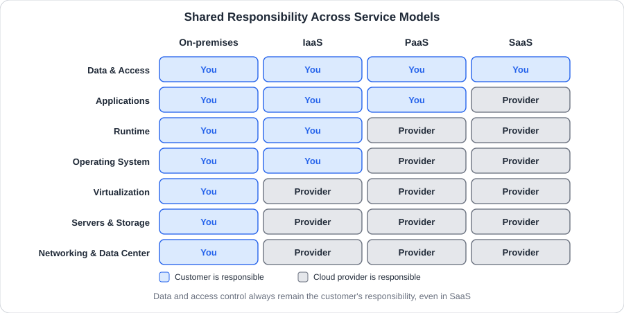 
  توزيع المسؤولية الأمنية بين مزود السحابة والعميل في كل نموذج خدمة

### 5.6 الزاوية الأمنية: أين تقع الأخطاء في السحابة؟

أغلب حوادث السحابة سببها **أخطاء العميل** وليس اختراق المزود:

<table dir="rtl" width="100%">
<thead><tr><th align="right" style="text-align:right">الخطر</th><th align="right" style="text-align:right">الشرح</th><th align="right" style="text-align:right">الحماية</th></tr></thead>
<tbody>
<tr><td dir="ltr" align="left" style="text-align:left"><b>Misconfiguration</b></td><td align="right" style="text-align:right">إعداد خاطئ، مثل تخزين مفتوح للعامة أو صفحة إدارة بلا حماية</td><td align="right" style="text-align:right">مراجعة الإعدادات بشكل دوري</td></tr>
<tr><td align="right" style="text-align:right"><b>ضعف الهوية والوصول</b></td><td align="right" style="text-align:right">كلمات مرور ضعيفة وحسابات بلا تحقق إضافي</td><td align="right" style="text-align:right">مبدأ أقل الصلاحيات، وتفعيل المصادقة متعددة العوامل (MFA)</td></tr>
<tr><td align="right" style="text-align:right"><b>تسرب مفاتيح الوصول</b></td><td align="right" style="text-align:right">مفاتيح أو كلمات مرور تُنشر بالخطأ في الشيفرة أو الملفات</td><td align="right" style="text-align:right">عدم تخزين الأسرار في الشيفرة، وتدويرها دوريًا</td></tr>
<tr><td align="right" style="text-align:right"><b>غياب المراقبة</b></td><td align="right" style="text-align:right">هجوم يمر دون أن ينتبه له أحد</td><td align="right" style="text-align:right">تفعيل السجلات (Logging) والتنبيهات</td></tr>
<tr><td align="right" style="text-align:right"><b>سوء فهم المسؤولية</b></td><td align="right" style="text-align:right">افتراض أن المزود يحمي كل شيء</td><td align="right" style="text-align:right">فهم نموذج المسؤولية المشتركة لكل خدمة</td></tr>
</tbody>
</table>

وكلما انتقلت الأنظمة للسحابة زاد الطلب على **أمن السحابة (Cloud Security)** كتخصص مستقل.

<h2 dir="ltr" align="left" style="text-align:left">🛠 Commands &amp; Hands-on</h2>

هذه الغرفة نظرية تعريفية ولا تعتمد على أوامر؛ التطبيق فيها هو **فهم من يتحمل المسؤولية** في كل نموذج.

<h2 dir="ltr" align="left" style="text-align:left">🖼 Practical Scenarios</h2>

### 5.7 سيناريو: نقل موقع شركة إلى السحابة

شركة نقلت موقعها إلى مزود سحابي:

1. اختارت **IaaS** فصارت مسؤولة عن تحديث نظام التشغيل وإعداد الجدار الناري.
2. أنشأت الخادم الافتراضي وفتحت صفحة الإدارة للإنترنت **بلا حماية** بالخطأ.
3. وجدها مهاجم عبر فحص الصفحات (كما في FakeBank) رغم أن المزود سليم من ناحيته.

الدرس أن **السحابة لا تحمي أخطاءك**؛ المزود يؤمّن المنصة، لكن الإعداد الخاطئ مسؤولية العميل.

<h2 dir="ltr" align="left" style="text-align:left">📝 Practical Takeaways</h2>

- السحابة هي خدمة حوسبة عبر الإنترنت حسب الطلب، وتقوم على المحاكاة الافتراضية.
- النماذج الثلاثة **IaaS** و**PaaS** و**SaaS** تختلف في ما يديره المزود وما يديره العميل.
- النشر قد يكون عامًا أو خاصًا أو هجينًا.
- **الإعداد الخاطئ (Misconfiguration)** من أكثر أسباب الاختراقات في السحابة.
- فهم **المسؤولية المشتركة** أول خطوة لتأمين أي بيئة سحابية.
- أغلب حوادث السحابة سببها أخطاء العميل: إعدادات خاطئة وهوية ضعيفة ومفاتيح مسرّبة.

 

## 📖 جدول المصطلحات

<table dir="rtl" width="100%">
<thead><tr><th align="right" style="text-align:right">المصطلح</th><th align="right" style="text-align:right">المعنى</th><th align="right" style="text-align:right">الغرفة</th></tr></thead>
<tbody>
<tr><td dir="ltr" align="left" style="text-align:left"><b>Hardware</b></td><td align="right" style="text-align:right">المكونات المادية للجهاز</td><td align="right" style="text-align:right">1</td></tr>
<tr><td dir="ltr" align="left" style="text-align:left"><b>Software</b></td><td align="right" style="text-align:right">البرامج التي تعمل على الجهاز</td><td align="right" style="text-align:right">1</td></tr>
<tr><td dir="ltr" align="left" style="text-align:left"><b>Motherboard</b></td><td align="right" style="text-align:right">اللوحة الأم التي تربط كل المكونات</td><td align="right" style="text-align:right">1</td></tr>
<tr><td dir="ltr" align="left" style="text-align:left"><b>CPU</b></td><td align="right" style="text-align:right">المعالج المركزي الذي ينفذ التعليمات</td><td align="right" style="text-align:right">1</td></tr>
<tr><td dir="ltr" align="left" style="text-align:left"><b>RAM</b></td><td align="right" style="text-align:right">الذاكرة العشوائية السريعة والمؤقتة</td><td align="right" style="text-align:right">1</td></tr>
<tr><td dir="ltr" align="left" style="text-align:left"><b>Volatile Memory</b></td><td align="right" style="text-align:right">ذاكرة متطايرة تفقد محتواها عند انقطاع الكهرباء</td><td align="right" style="text-align:right">1</td></tr>
<tr><td dir="ltr" align="left" style="text-align:left"><b>HDD / SSD</b></td><td align="right" style="text-align:right">وحدات التخزين الدائم: الأولى بأقراص دوارة والثانية برقائق إلكترونية</td><td align="right" style="text-align:right">1</td></tr>
<tr><td dir="ltr" align="left" style="text-align:left"><b>GPU</b></td><td align="right" style="text-align:right">معالج الرسومات المسؤول عن إخراج الصورة</td><td align="right" style="text-align:right">1</td></tr>
<tr><td dir="ltr" align="left" style="text-align:left"><b>PSU</b></td><td align="right" style="text-align:right">مزود الطاقة الذي يغذي المكونات بالكهرباء</td><td align="right" style="text-align:right">1</td></tr>
<tr><td dir="ltr" align="left" style="text-align:left"><b>NIC</b></td><td align="right" style="text-align:right">كرت الشبكة الذي يوصل الجهاز بالشبكة</td><td align="right" style="text-align:right">1</td></tr>
<tr><td dir="ltr" align="left" style="text-align:left"><b>MAC Address</b></td><td align="right" style="text-align:right">عنوان فيزيائي فريد لكرت الشبكة</td><td align="right" style="text-align:right">1</td></tr>
<tr><td dir="ltr" align="left" style="text-align:left"><b>Peripherals</b></td><td align="right" style="text-align:right">الأجهزة الطرفية: إدخال وإخراج</td><td align="right" style="text-align:right">1</td></tr>
<tr><td dir="ltr" align="left" style="text-align:left"><b>Firmware (BIOS / UEFI)</b></td><td align="right" style="text-align:right">البرنامج الأول المخزن على اللوحة الأم ويعمل عند التشغيل</td><td align="right" style="text-align:right">1</td></tr>
<tr><td dir="ltr" align="left" style="text-align:left"><b>POST</b></td><td align="right" style="text-align:right">فحص ذاتي للمكونات عند بدء التشغيل</td><td align="right" style="text-align:right">1</td></tr>
<tr><td dir="ltr" align="left" style="text-align:left"><b>Bootloader</b></td><td align="right" style="text-align:right">برنامج يحمّل نظام التشغيل من التخزين إلى الذاكرة</td><td align="right" style="text-align:right">1</td></tr>
<tr><td dir="ltr" align="left" style="text-align:left"><b>Kernel</b></td><td align="right" style="text-align:right">نواة نظام التشغيل</td><td align="right" style="text-align:right">1</td></tr>
<tr><td dir="ltr" align="left" style="text-align:left"><b>Booting</b></td><td align="right" style="text-align:right">عملية الإقلاع من الضغط على الباور حتى ظهور الواجهة</td><td align="right" style="text-align:right">1</td></tr>
<tr><td dir="ltr" align="left" style="text-align:left"><b>Attack Surface</b></td><td align="right" style="text-align:right">مجموع نقاط الدخول الممكنة للهجوم على نظام</td><td align="right" style="text-align:right">2</td></tr>
<tr><td dir="ltr" align="left" style="text-align:left"><b>Server</b></td><td align="right" style="text-align:right">حاسوب يقدم خدمات لأجهزة أخرى عبر الشبكة</td><td align="right" style="text-align:right">2، 3</td></tr>
<tr><td dir="ltr" align="left" style="text-align:left"><b>Mainframe / Supercomputer</b></td><td align="right" style="text-align:right">حواسيب ضخمة لمعالجة البيانات العملاقة والمحاكاة</td><td align="right" style="text-align:right">2</td></tr>
<tr><td dir="ltr" align="left" style="text-align:left"><b>Embedded System</b></td><td align="right" style="text-align:right">حاسوب مخصص لوظيفة واحدة داخل نظام أكبر</td><td align="right" style="text-align:right">2</td></tr>
<tr><td dir="ltr" align="left" style="text-align:left"><b>IoT</b></td><td align="right" style="text-align:right">أجهزة ذكية متصلة بالإنترنت مثل الكاميرات</td><td align="right" style="text-align:right">2</td></tr>
<tr><td dir="ltr" align="left" style="text-align:left"><b>Client</b></td><td align="right" style="text-align:right">الجهاز أو التطبيق الذي يطلب الخدمة</td><td align="right" style="text-align:right">3</td></tr>
<tr><td dir="ltr" align="left" style="text-align:left"><b>Request / Response</b></td><td align="right" style="text-align:right">الطلب من العميل والاستجابة من الخادم</td><td align="right" style="text-align:right">3</td></tr>
<tr><td dir="ltr" align="left" style="text-align:left"><b>Protocol</b></td><td align="right" style="text-align:right">القواعد المتفق عليها لشكل الرسائل بين الأطراف</td><td align="right" style="text-align:right">3</td></tr>
<tr><td dir="ltr" align="left" style="text-align:left"><b>HTTP / HTTPS</b></td><td align="right" style="text-align:right">بروتوكول الويب، والثاني منه مشفر</td><td align="right" style="text-align:right">3</td></tr>
<tr><td dir="ltr" align="left" style="text-align:left"><b>Port</b></td><td align="right" style="text-align:right">منفذ على الجهاز تتصل به خدمة معينة</td><td align="right" style="text-align:right">3</td></tr>
<tr><td dir="ltr" align="left" style="text-align:left"><b>Virtualisation</b></td><td align="right" style="text-align:right">تشغيل عدة أنظمة معزولة على جهاز فيزيائي واحد</td><td align="right" style="text-align:right">4</td></tr>
<tr><td dir="ltr" align="left" style="text-align:left"><b>Virtual Machine (VM)</b></td><td align="right" style="text-align:right">جهاز افتراضي كامل يعمل داخل برنامج</td><td align="right" style="text-align:right">4</td></tr>
<tr><td dir="ltr" align="left" style="text-align:left"><b>Host / Guest</b></td><td align="right" style="text-align:right">الجهاز الحقيقي، والنظام الذي يعمل بداخله</td><td align="right" style="text-align:right">4</td></tr>
<tr><td dir="ltr" align="left" style="text-align:left"><b>Hypervisor</b></td><td align="right" style="text-align:right">برنامج ينشئ الأجهزة الافتراضية ويوزع الموارد عليها</td><td align="right" style="text-align:right">4</td></tr>
<tr><td dir="ltr" align="left" style="text-align:left"><b>Snapshot</b></td><td align="right" style="text-align:right">لقطة تحفظ حالة الجهاز الافتراضي للرجوع إليها</td><td align="right" style="text-align:right">4</td></tr>
<tr><td dir="ltr" align="left" style="text-align:left"><b>Sandboxing</b></td><td align="right" style="text-align:right">تشغيل شيء مشبوه في بيئة معزولة</td><td align="right" style="text-align:right">4</td></tr>
<tr><td dir="ltr" align="left" style="text-align:left"><b>Container</b></td><td align="right" style="text-align:right">بيئة تشغيل خفيفة تشارك نواة المضيف</td><td align="right" style="text-align:right">4</td></tr>
<tr><td dir="ltr" align="left" style="text-align:left"><b>Cloud Computing</b></td><td align="right" style="text-align:right">تقديم موارد الحوسبة كخدمة عبر الإنترنت</td><td align="right" style="text-align:right">5</td></tr>
<tr><td dir="ltr" align="left" style="text-align:left"><b>IaaS / PaaS / SaaS</b></td><td align="right" style="text-align:right">تأجير البنية التحتية، أو منصة التطوير، أو برنامج جاهز</td><td align="right" style="text-align:right">5</td></tr>
<tr><td dir="ltr" align="left" style="text-align:left"><b>Public / Private / Hybrid Cloud</b></td><td align="right" style="text-align:right">سحابة عامة، أو خاصة، أو هجينة</td><td align="right" style="text-align:right">5</td></tr>
<tr><td dir="ltr" align="left" style="text-align:left"><b>Shared Responsibility Model</b></td><td align="right" style="text-align:right">توزيع مسؤولية الأمن بين المزود والعميل</td><td align="right" style="text-align:right">5</td></tr>
<tr><td dir="ltr" align="left" style="text-align:left"><b>Misconfiguration</b></td><td align="right" style="text-align:right">إعداد خاطئ يفتح ثغرة</td><td align="right" style="text-align:right">5</td></tr>
</tbody>
</table>

