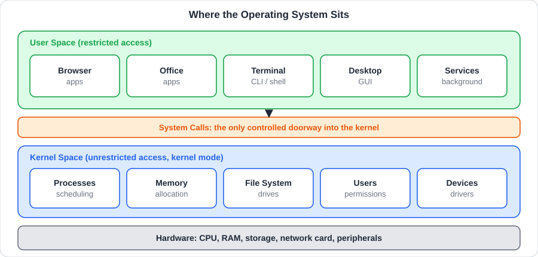
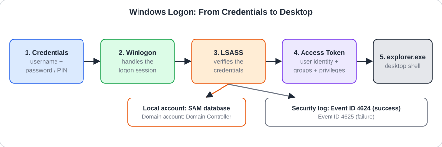
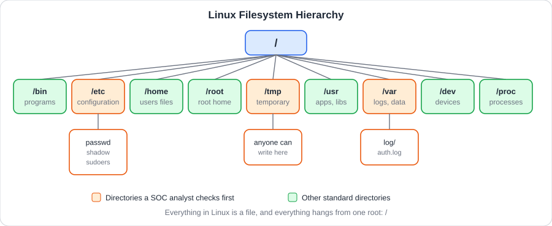
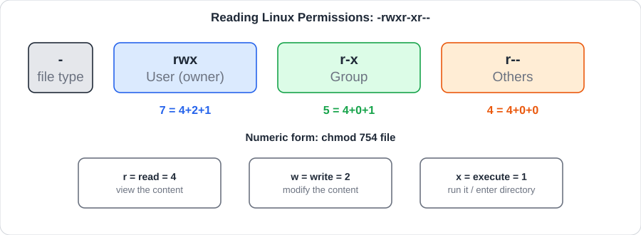
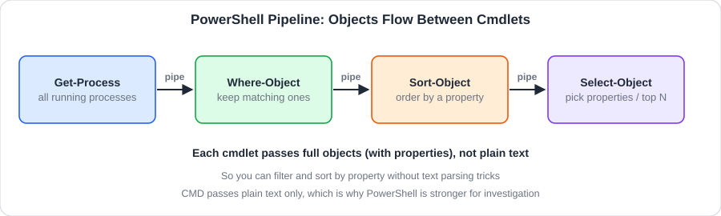
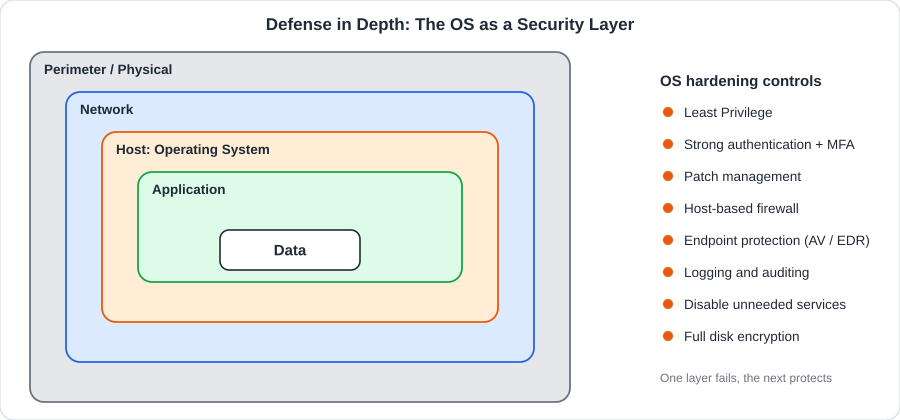

<div dir="rtl" align="right">

# الوحدة الثالثة: Operating Systems Basics

## 📑 فهرس الوحدة

<table dir="rtl" width="100%">
<thead><tr><th align="right" style="text-align:right">#</th><th align="right" style="text-align:right">الغرفة</th><th align="right" style="text-align:right">الموضوعات بالترتيب</th></tr></thead>
<tbody>
<tr><td align="right" style="text-align:right">—</td><td align="right" style="text-align:right"><a href="#module-intro">مقدمة الوحدة</a></td><td align="right" style="text-align:right">تعريف نظام التشغيل ولماذا تُعد الوحدة محورية للمحلل الأمني</td></tr>
<tr><td align="right" style="text-align:right">1</td><td dir="ltr" align="left" style="text-align:left"><a href="#room-1">Operating Systems Introduction</a></td><td align="right" style="text-align:right"><a href="#t1-1">1.1 التعريف بالغرفة وهدفها</a><br><a href="#t1-2">1.2 ما هو نظام التشغيل وأين يقع</a><br><a href="#t1-3">1.3 واجبات نظام التشغيل</a><br><a href="#t1-4">1.4 أنواع أنظمة التشغيل واستخداماتها</a><br><a href="#t1-5">1.5 عائلات أنظمة التشغيل الرئيسية</a><br><a href="#t1-6">1.6 لماذا توجد أنظمة تشغيل كثيرة</a><br><a href="#t1-7">1.7 أدوات نظام التشغيل</a><br><a href="#t1-8">1.8 كيف نتفاعل مع نظام التشغيل: GUI و CLI</a><br><a href="#t1-9">1.9 النواة ومساحتا النواة والمستخدم</a><br><a href="#t1-10">1.10 مكالمات النظام (System Calls)</a><br><a href="#t1-11">1.11 أمن نظام التشغيل</a><br><a href="#t1-12">1.12 سيناريو: ماذا يحدث عند فتح ملف مستند</a></td></tr>
<tr><td align="right" style="text-align:right">2</td><td dir="ltr" align="left" style="text-align:left"><a href="#room-2">Windows Basics</a></td><td align="right" style="text-align:right"><a href="#t2-1">2.1 التعريف بالغرفة وأهدافها</a><br><a href="#t2-2">2.2 نبذة تاريخية عن ويندوز</a><br><a href="#t2-3">2.3 تسجيل الدخول والمصادقة</a><br><a href="#t2-4">2.4 أنواع الحسابات في ويندوز</a><br><a href="#t2-5">2.5 سطح المكتب وشريط المهام وقائمة ابدأ</a><br><a href="#t2-6">2.6 الأدوات والتطبيقات المدمجة</a><br><a href="#t2-7">2.7 معلومات النظام وصفحة حول الكمبيوتر</a><br><a href="#t2-8">2.8 استكشاف الملفات وإدارتها</a><br><a href="#t2-9">2.9 الإعدادات ولوحة التحكم</a><br><a href="#t2-10">2.10 تحديث ويندوز وإدارة التطبيقات</a><br><a href="#t2-11">2.11 مدير المهام (Task Manager)</a><br><a href="#t2-12">2.12 أمان ويندوز (Windows Security)</a><br><a href="#t2-13">2.13 الزاوية الأمنية: ما الذي يهم المحلل في ويندوز</a><br><a href="#t2-14">2.14 التطبيق العملي: يوم موظف جديد</a><br><a href="#t2-15">2.15 سيناريو: فحص محطة عمل مشبوهة</a></td></tr>
<tr><td align="right" style="text-align:right">3</td><td dir="ltr" align="left" style="text-align:left"><a href="#room-3">Linux CLI Basics</a></td><td align="right" style="text-align:right"><a href="#t3-1">3.1 التعريف بالغرفة وأهميتها</a><br><a href="#t3-2">3.2 الـ Shell والـ Terminal والـ CLI</a><br><a href="#t3-3">3.3 هيكل نظام الملفات</a><br><a href="#t3-4">3.4 الأذونات (Permissions)</a><br><a href="#t3-5">3.5 التنقل: pwd و cd و ls</a><br><a href="#t3-6">3.6 قراءة الملفات: cat و less و head و tail</a><br><a href="#t3-7">3.7 إنشاء وإدارة الملفات والمجلدات: mkdir و touch و cp و mv و rm</a><br><a href="#t3-8">3.8 تغيير الأذونات والمالك: chmod و chown</a><br><a href="#t3-9">3.9 الصلاحيات العالية: sudo</a><br><a href="#t3-10">3.10 البحث: find و grep</a><br><a href="#t3-11">3.11 إدارة العمليات: ps و top و kill</a><br><a href="#t3-12">3.12 استكشاف الشبكة: ip و ifconfig و netstat</a><br><a href="#t3-13">3.13 الزاوية الأمنية: لينكس في عين المحلل</a><br><a href="#t3-14">3.14 سيناريو: خادم لينكس يتعرض لتخمين كلمات المرور</a></td></tr>
<tr><td align="right" style="text-align:right">4</td><td dir="ltr" align="left" style="text-align:left"><a href="#room-4">Windows CLI Basics</a></td><td align="right" style="text-align:right"><a href="#t4-1">4.1 التعريف بالغرفة وأهميتها</a><br><a href="#t4-2">4.2 الفرق بين CMD و PowerShell</a><br><a href="#t4-3">4.3 أوامر CMD: التنقل واستكشاف الملفات</a><br><a href="#t4-4">4.4 أوامر CMD: إدارة الملفات والمجلدات</a><br><a href="#t4-5">4.5 أوامر CMD: الشبكة</a><br><a href="#t4-6">4.6 أوامر CMD: الحسابات والمجموعات والمشاركات</a><br><a href="#t4-7">4.7 PowerShell: الأساسيات والعمليات والخدمات</a><br><a href="#t4-8">4.8 PowerShell: البحث عن الملفات والنصوص</a><br><a href="#t4-9">4.9 PowerShell: سجلات الأحداث</a><br><a href="#t4-10">4.10 أهم أرقام الأحداث (Event IDs) في ويندوز</a><br><a href="#t4-11">4.11 الزاوية الأمنية: كشف النشاط المشبوه بأوامر ويندوز</a><br><a href="#t4-12">4.12 سيناريو: حساب جديد وتخمين سابق</a></td></tr>
<tr><td align="right" style="text-align:right">5</td><td dir="ltr" align="left" style="text-align:left"><a href="#room-5">Operating System Security</a></td><td align="right" style="text-align:right"><a href="#t5-1">5.1 التعريف بالغرفة وأهميتها</a><br><a href="#t5-2">5.2 تقليل سطح الهجوم</a><br><a href="#t5-3">5.3 المبادئ الأساسية</a><br><a href="#t5-4">5.4 تعطيل الخدمات والبروتوكولات غير الضرورية</a><br><a href="#t5-5">5.5 إدارة المصادقة (Authentication)</a><br><a href="#t5-6">5.6 إدارة الصلاحيات والوصول (Access Control و RBAC)</a><br><a href="#t5-7">5.7 إدارة التحديثات والترقيعات (Patch Management)</a><br><a href="#t5-8">5.8 جدار الحماية المحلي (Host-Based Firewall)</a><br><a href="#t5-9">5.9 حماية النقاط النهائية (Endpoint Protection)</a><br><a href="#t5-10">5.10 التسجيل والتدقيق (Logging و Auditing)</a><br><a href="#t5-11">5.11 تشفير القرص (Full Disk Encryption)</a><br><a href="#t5-12">5.12 قائمة تحصين مختصرة</a><br><a href="#t5-13">5.13 الزاوية الأمنية: كيف نتحقق أن النظام مُحصَّن</a><br><a href="#t5-14">5.14 سيناريو: تحصين خادم قبل نشره</a></td></tr>
<tr><td align="right" style="text-align:right">—</td><td align="right" style="text-align:right"><a href="#module-cheatsheet">جدول الأوامر (Cheatsheet)</a></td><td align="right" style="text-align:right">ملخص أوامر لينكس وويندوز: الأمر واستخدامه ومثال عملي</td></tr>
<tr><td align="right" style="text-align:right">—</td><td align="right" style="text-align:right"><a href="#module-glossary">جدول المصطلحات</a></td><td align="right" style="text-align:right">أهم مصطلحات الوحدة بمعانيها وأرقام الغرف</td></tr>
</tbody>
</table>

<a id="module-intro"></a>

## 🧭 مقدمة عن الوحدة

**نظام التشغيل (Operating System - OS)** هو البرنامج الأساسي الذي يقف بين **العتاد (Hardware)** و**التطبيقات (Applications)**: يدير موارد الجهاز، ويقدم للمستخدم والبرامج طريقة آمنة ومنظمة لاستخدامها. وكل ما تفعله على أي جهاز، من فتح ملف إلى تشغيل متصفح، يمر عبر نظام التشغيل.

وهذه الوحدة **محورية جدًا** في المسار، لأن معظم ما يعمل عليه المحلل الأمني هو في الحقيقة **أنظمة تشغيل**: السجلات (Logs) تصدر منها، والهجمات تستهدفها، والحماية الأولى تُبنى عليها، والتحقيق في أي حادثة يبدأ بفهم ما جرى داخلها.

تسير الوحدة في خمس غرف متدرجة من الفكرة إلى التطبيق:

- **Operating Systems Introduction:** ما هو نظام التشغيل ومهامه وأنواعه وأمنه.
- **Windows Basics:** التعامل مع ويندوز بالواجهة الرسومية.
- **Linux CLI Basics:** التعامل مع لينكس بسطر الأوامر.
- **Windows CLI Basics:** التعامل مع ويندوز بسطر الأوامر (CMD و PowerShell).
- **Operating System Security:** كيف نحصّن نظام التشغيل ونقلل سطح الهجوم.

وفي كل غرفة **زاوية أمنية** تربط ما نتعلمه بعمل فريق الدفاع (Blue Team / SOC): المسارات الحساسة، والسجلات، وأرقام الأحداث (Event IDs)، وكيف تُستخدم الأوامر في كشف الأنشطة المشبوهة. وفي آخر الوحدة جدول أوامر (Cheatsheet) وجدول مصطلحات.

<br>

<a id="room-1"></a>
<table align="center" width="100%"><tr><td align="right" style="text-align:right">

### 🚪 الغرفة 1: Operating Systems Introduction (مقدمة في أنظمة التشغيل)

</td></tr></table>

<h1 dir="ltr" align="left" style="text-align:left">Operating Systems Introduction</h1>

### <a id="t1-1"></a>1.1 التعريف بالغرفة وهدفها

الغرفة هي المدخل إلى الوحدة كلها: تُعرّفنا **ما هو نظام التشغيل، وأين يقع، وماذا يفعل، وكيف يحمي النظام**. وتجيب عن أسئلة أساسية: لماذا لا يتعامل التطبيق مع العتاد مباشرة؟ وما الفرق بين ما يستطيع المستخدم فعله وما تستطيع النواة فعله؟ ولماذا توجد أنظمة تشغيل كثيرة؟

ومن أهداف الغرفة أن نكون قادرين في نهايتها على:
- التفريق بين أنواع أنظمة التشغيل واستخدام كل نوع.
- فهم مفهوم **النواة (Kernel)** ومساحتي **Kernel Space** و**User Space**.
- معرفة واجبات نظام التشغيل الخمسة.
- فهم كيف يوفر نظام التشغيل **الأساس الأمني** قبل أي برنامج مكافحة فيروسات.
- التمييز بين **GUI** و**CLI**.

<h2 dir="ltr" align="left" style="text-align:left">📌 Concepts Covered</h2>

### <a id="t1-2"></a>1.2 ما هو نظام التشغيل وأين يقع

نظام التشغيل طبقة وسيطة تجعل التطبيقات **مستقلة عن تفاصيل العتاد**. فمبرمج المتصفح لا يحتاج أن يعرف نوع القرص أو كرت الشبكة؛ يطلب من نظام التشغيل "اقرأ هذا الملف" أو "أرسل هذه البيانات" وهو يتولى الباقي.

<p align="center">
  <br>
  <sub>طبقات النظام: التطبيقات في مساحة المستخدم، والنواة في مساحتها، والعتاد في الأسفل</sub>
</p>

### <a id="t1-3"></a>1.3 واجبات نظام التشغيل

يقوم نظام التشغيل بخمس مهام رئيسية:

<table dir="rtl" width="100%">
<thead><tr><th align="right" style="text-align:right">الواجب</th><th align="right" style="text-align:right">ماذا يفعل</th><th align="right" style="text-align:right">مثال</th></tr></thead>
<tbody>
<tr><td align="right" style="text-align:right"><b>إدارة العمليات</b> (Process Management)</td><td align="right" style="text-align:right">ينشئ العمليات وينهيها ويوزع وقت المعالج بينها (Scheduling)</td><td align="right" style="text-align:right">تشغيل المتصفح ومشغل الموسيقى معًا دون أن يعطل أحدهما الآخر</td></tr>
<tr><td align="right" style="text-align:right"><b>إدارة الذاكرة</b> (Memory Management)</td><td align="right" style="text-align:right">يخصص الذاكرة لكل عملية ويمنع تداخلها</td><td align="right" style="text-align:right">عملية لا تستطيع قراءة ذاكرة عملية أخرى</td></tr>
<tr><td align="right" style="text-align:right"><b>نظام الملفات والمحركات</b> (File System &amp; Drives)</td><td align="right" style="text-align:right">ينظم تخزين الملفات وقراءتها وكتابتها على الأقراص</td><td align="right" style="text-align:right"><code>NTFS</code> في ويندوز و<code>ext4</code> في لينكس</td></tr>
<tr><td align="right" style="text-align:right"><b>إدارة المستخدمين</b> (User Management)</td><td align="right" style="text-align:right">ينشئ الحسابات ويحدد هوية كل مستخدم وصلاحياته</td><td align="right" style="text-align:right">حساب عادي وحساب مدير</td></tr>
<tr><td align="right" style="text-align:right"><b>إدارة الأجهزة</b> (Device Management)</td><td align="right" style="text-align:right">يتعامل مع الأجهزة عبر برامج التشغيل (Drivers)</td><td align="right" style="text-align:right">الطابعة والفأرة وكرت الشبكة</td></tr>
</tbody>
</table>

### <a id="t1-4"></a>1.4 أنواع أنظمة التشغيل واستخداماتها

يُصنف نظام التشغيل بحسب **الجهاز الذي يعمل عليه والغرض منه**:

<table dir="rtl" width="100%">
<thead><tr><th align="right" style="text-align:right">النوع</th><th align="right" style="text-align:right">حالة الاستخدام الأساسية</th><th align="right" style="text-align:right">الخصائص الأساسية</th></tr></thead>
<tbody>
<tr><td align="right" style="text-align:right"><b>Desktop OS</b> (سطح المكتب)</td><td align="right" style="text-align:right">العمل اليومي للمستخدم على حاسوب مكتبي أو محمول</td><td align="right" style="text-align:right">واجهة رسومية سهلة، دعم واسع للتطبيقات والأجهزة الطرفية</td></tr>
<tr><td align="right" style="text-align:right"><b>Server OS</b> (الخادم)</td><td align="right" style="text-align:right">تقديم خدمات لعدة مستخدمين على مدار الساعة</td><td align="right" style="text-align:right">استقرار وأداء عاليان، إدارة عن بعد، غالبًا بلا واجهة رسومية، وصلاحيات وأمن أشد</td></tr>
<tr><td align="right" style="text-align:right"><b>Mobile OS</b> (الهاتف)</td><td align="right" style="text-align:right">الهواتف واللوحيات</td><td align="right" style="text-align:right">واجهة لمس، توفير في البطارية، متجر تطبيقات، وعزل صارم بين التطبيقات</td></tr>
<tr><td align="right" style="text-align:right"><b>Embedded OS</b> (المدمج)</td><td align="right" style="text-align:right">أجهزة بوظيفة محددة مثل أجهزة الراوتر والسيارات والأجهزة الطبية</td><td align="right" style="text-align:right">صغير وخفيف، موارد محدودة، مصمم لمهمة واحدة وكثيرًا ما يعمل في الزمن الحقيقي</td></tr>
<tr><td align="right" style="text-align:right"><b>Virtual / Cloud OS</b> (الافتراضي والسحابي)</td><td align="right" style="text-align:right">أنظمة تعمل داخل أجهزة افتراضية أو في مزودي السحابة</td><td align="right" style="text-align:right">تُنشأ وتُحذف بسرعة، تُدار آليًا، وتعتمد على صور جاهزة (Images)</td></tr>
</tbody>
</table>

### <a id="t1-5"></a>1.5 عائلات أنظمة التشغيل الرئيسية

كل فئة من الفئات السابقة تعمل عليها عائلات معروفة:

<table dir="rtl" width="100%">
<thead><tr><th align="right" style="text-align:right">الفئة</th><th align="right" style="text-align:right">أمثلة على الأنظمة</th></tr></thead>
<tbody>
<tr><td dir="ltr" align="left" style="text-align:left"><b>Desktop</b></td><td align="right" style="text-align:right"><code>Windows</code>, <code>macOS</code>, توزيعات <code>Linux</code> مثل Ubuntu وKali</td></tr>
<tr><td dir="ltr" align="left" style="text-align:left"><b>Server</b></td><td align="right" style="text-align:right"><code>Windows Server</code>, توزيعات <code>Linux</code> مثل Ubuntu Server وRHEL</td></tr>
<tr><td dir="ltr" align="left" style="text-align:left"><b>Mobile</b></td><td dir="ltr" align="left" style="text-align:left"><code>Android</code>, <code>iOS</code></td></tr>
<tr><td dir="ltr" align="left" style="text-align:left"><b>Embedded</b></td><td align="right" style="text-align:right"><code>Embedded Linux</code>, <code>RTOS</code> (أنظمة الزمن الحقيقي)</td></tr>
<tr><td dir="ltr" align="left" style="text-align:left"><b>Virtual / Cloud</b></td><td align="right" style="text-align:right">أي نظام من الأنظمة السابقة يعمل داخل <code>VM</code> أو على سحابة مثل AWS وAzure</td></tr>
</tbody>
</table>

ويلاحظ أن **Linux** تقريبًا في كل فئة، ولهذا فهمه ضروري لأي محلل.

### <a id="t1-6"></a>1.6 لماذا توجد أنظمة تشغيل كثيرة

لا يوجد نظام واحد يناسب كل الأغراض، والسبب أن **الاحتياجات تتعارض**:

- جهاز **بطارية صغيرة** يحتاج نظامًا موفرًا للطاقة، وخادم **عالي الأداء** يحتاج نظامًا يدير مئات المستخدمين.
- الأجهزة الطبية تحتاج **استجابة لحظية مضمونة**، بينما الحاسوب المكتبي يحتاج **سهولة وتنوع تطبيقات**.
- بعض الأنظمة **مفتوحة المصدر** (Open Source) يمكن تعديلها (مثل Linux)، وبعضها **مغلق** تتحكم فيه شركة (مثل Windows).
- اختلاف **نماذج العمل** والتراخيص والبيئات التي ورثت منها كل شركة.

ولهذا يتعامل المحلل الأمني مع بيئة **متنوعة** من الأنظمة، ولكل منها سجلاتها وأدواتها.

### <a id="t1-7"></a>1.7 أدوات نظام التشغيل

يأتي نظام التشغيل مع **أدوات (Utilities)** مدمجة تتيح للمستخدم والمدير التعامل مع هذه الواجبات:

<table dir="rtl" width="100%">
<thead><tr><th align="right" style="text-align:right">الغرض</th><th align="right" style="text-align:right">في ويندوز</th><th align="right" style="text-align:right">في لينكس</th></tr></thead>
<tbody>
<tr><td align="right" style="text-align:right"><b>إدارة الملفات</b></td><td dir="ltr" align="left" style="text-align:left"><code>File Explorer</code></td><td align="right" style="text-align:right"><code>ls</code>, <code>cp</code>, <code>mv</code> ومدير ملفات</td></tr>
<tr><td align="right" style="text-align:right"><b>مراقبة العمليات</b></td><td dir="ltr" align="left" style="text-align:left"><code>Task Manager</code></td><td dir="ltr" align="left" style="text-align:left"><code>ps</code>, <code>top</code></td></tr>
<tr><td align="right" style="text-align:right"><b>الإعدادات</b></td><td dir="ltr" align="left" style="text-align:left"><code>Settings</code>, <code>Control Panel</code></td><td align="right" style="text-align:right">ملفات الإعداد في <code>/etc</code></td></tr>
<tr><td align="right" style="text-align:right"><b>إدارة المستخدمين</b></td><td dir="ltr" align="left" style="text-align:left"><code>Computer Management</code></td><td dir="ltr" align="left" style="text-align:left"><code>useradd</code>, <code>passwd</code></td></tr>
<tr><td align="right" style="text-align:right"><b>السجلات</b></td><td dir="ltr" align="left" style="text-align:left"><code>Event Viewer</code></td><td align="right" style="text-align:right">ملفات <code>/var/log</code> و <code>journalctl</code></td></tr>
<tr><td align="right" style="text-align:right"><b>الشبكة</b></td><td dir="ltr" align="left" style="text-align:left"><code>ipconfig</code>, <code>ping</code></td><td dir="ltr" align="left" style="text-align:left"><code>ip</code>, <code>ping</code>, <code>ss</code></td></tr>
<tr><td align="right" style="text-align:right"><b>التحديثات والتثبيت</b></td><td dir="ltr" align="left" style="text-align:left"><code>Windows Update</code>, <code>winget</code></td><td dir="ltr" align="left" style="text-align:left"><code>apt</code>, <code>dnf</code></td></tr>
<tr><td align="right" style="text-align:right"><b>الأمان</b></td><td dir="ltr" align="left" style="text-align:left"><code>Windows Security</code>, <code>Firewall</code></td><td dir="ltr" align="left" style="text-align:left"><code>ufw</code>, <code>iptables</code></td></tr>
</tbody>
</table>

### <a id="t1-8"></a>1.8 كيف نتفاعل مع نظام التشغيل: GUI و CLI

<table dir="rtl" width="100%">
<thead><tr><th align="right" style="text-align:right">الواجهة</th><th align="right" style="text-align:right">الشرح</th><th align="right" style="text-align:right">المميزات</th><th align="right" style="text-align:right">العيوب</th></tr></thead>
<tbody>
<tr><td dir="ltr" align="left" style="text-align:left"><b>GUI</b> (Graphical User Interface)</td><td align="right" style="text-align:right">واجهة رسومية بالنوافذ والأيقونات والفأرة</td><td align="right" style="text-align:right">سهلة وبديهية للمبتدئ</td><td align="right" style="text-align:right">أبطأ في المهام المتكررة، تستهلك موارد أكثر</td></tr>
<tr><td dir="ltr" align="left" style="text-align:left"><b>CLI</b> (Command Line Interface)</td><td align="right" style="text-align:right">واجهة نصية نكتب فيها الأوامر</td><td align="right" style="text-align:right">سريعة ودقيقة وقابلة للأتمتة (Scripts)، وتعمل على الخوادم والاتصال البعيد</td><td align="right" style="text-align:right">تحتاج حفظ الأوامر وتدريبًا</td></tr>
</tbody>
</table>

والمحلل الأمني يستخدم **الاثنين**، لكن CLI هو الأقوى في التحقيق لأنه يتيح البحث والتصفية في آلاف الأسطر بأمر واحد.

### <a id="t1-9"></a>1.9 النواة ومساحتا النواة والمستخدم

**النواة (Kernel)** هي القلب الذي يعمل بأعلى صلاحية في النظام، فهي التي تتحكم في المعالج والذاكرة والأجهزة. ولحماية النظام يُقسَّم تنفيذ الكود إلى مساحتين:

<table dir="rtl" width="100%">
<thead><tr><th align="right" style="text-align:right">المساحة</th><th align="right" style="text-align:right">من يعمل فيها</th><th align="right" style="text-align:right">مستوى الوصول</th></tr></thead>
<tbody>
<tr><td align="right" style="text-align:right"><b>Kernel Space</b> (مساحة النواة)</td><td align="right" style="text-align:right">النواة وبرامج التشغيل (Drivers)</td><td align="right" style="text-align:right"><b>وصول غير مقيد</b> إلى العتاد وكل الذاكرة، ويسمى <b>وضع النواة (Kernel Mode)</b></td></tr>
<tr><td align="right" style="text-align:right"><b>User Space</b> (مساحة المستخدم)</td><td align="right" style="text-align:right">التطبيقات والخدمات العادية</td><td align="right" style="text-align:right"><b>وصول مقيد</b>، لا تتعامل مع العتاد مباشرة، ويسمى <b>وضع المستخدم (User Mode)</b></td></tr>
</tbody>
</table>

والفصل بينهما هو أحد أسس الأمان: إذا تعطل متصفح (في User Space) لا ينهار النظام كله، أما خلل في **Driver** (في Kernel Space) فقد يُسقط الجهاز كاملًا، ولذلك يسعى المهاجمون إلى الوصول للنواة لأنها تمنحهم السيطرة الكاملة.

### <a id="t1-10"></a>1.10 مكالمات النظام (System Calls)

كيف يستفيد التطبيق من خدمات النواة وهو محظور عليه الوصول لها؟ عبر **مكالمة النظام (System Call)**: وهي **الباب الوحيد المنظم** الذي يطلب منه التطبيق خدمة من النواة، مثل فتح ملف أو إرسال بيانات أو إنشاء عملية.

1. التطبيق (في User Space) يستدعي دالة مثل "افتح الملف".
2. تتحول الدالة إلى **System Call** فينتقل المعالج من User Mode إلى **Kernel Mode**.
3. النواة تتحقق من **الصلاحيات** وتنفذ الطلب على العتاد.
4. تعود النتيجة إلى التطبيق وينتقل المعالج مجددًا إلى User Mode.

والنواة في الخطوة (3) هي التي تقرر **السماح أو الرفض**، وهذا ما يجعل مكالمات النظام نقطة تحكم أمنية.

### <a id="t1-11"></a>1.11 أمن نظام التشغيل

نظام التشغيل هو **الأساس الأمني** لأي جهاز، فهو يعمل **قبل أي برنامج مكافحة فيروسات**، وبرنامج الحماية نفسه يعتمد عليه. ويحمي النظام عبر أربع آليات:

<table dir="rtl" width="100%">
<thead><tr><th align="right" style="text-align:right">الآلية</th><th align="right" style="text-align:right">الشرح</th><th align="right" style="text-align:right">مثال</th></tr></thead>
<tbody>
<tr><td align="right" style="text-align:right"><b>المصادقة</b> (Authentication)</td><td align="right" style="text-align:right">التحقق من هوية المستخدم قبل السماح له بالدخول</td><td align="right" style="text-align:right">كلمة المرور أو البصمة أو المصادقة متعددة العوامل</td></tr>
<tr><td align="right" style="text-align:right"><b>الأذونات</b> (Permissions)</td><td align="right" style="text-align:right">تحديد ما يستطيع كل مستخدم فعله في كل ملف ومورد</td><td align="right" style="text-align:right">هذا الملف للقراءة فقط لهذا المستخدم</td></tr>
<tr><td align="right" style="text-align:right"><b>العزل</b> (Isolation)</td><td align="right" style="text-align:right">فصل العمليات والتطبيقات بعضها عن بعض وعن النواة</td><td align="right" style="text-align:right">لا يقرأ تطبيق ذاكرة تطبيق آخر</td></tr>
<tr><td align="right" style="text-align:right"><b>حماية النظام</b> (System Protection)</td><td align="right" style="text-align:right">حماية ملفات النظام والإعدادات الحرجة من التعديل</td><td align="right" style="text-align:right">تحديثات الأمان، والتحكم في حسابات المستخدمين (UAC)</td></tr>
</tbody>
</table>

وكثير من الهجمات هدفها **كسر إحدى هذه الآليات**: كلمة مرور مسروقة (المصادقة)، أو **رفع الصلاحيات** (الأذونات)، أو الهروب من العزل، أو تعطيل الحماية.

<h2 dir="ltr" align="left" style="text-align:left">🛠 Commands &amp; Hands-on</h2>

هذه الغرفة نظرية تعريفية ولا تعتمد على أوامر؛ التطبيق فيها هو **فهم الطبقات والمفاهيم** وربطها ببعضها. وتبدأ الأوامر من الغرفة الثالثة.

<h2 dir="ltr" align="left" style="text-align:left">🖼 Practical Scenarios</h2>

### <a id="t1-12"></a>1.12 سيناريو: ماذا يحدث عند فتح ملف مستند

1. المستخدم يضغط مرتين على ملف في **GUI**.
2. الواجهة (User Space) تطلب من النظام فتح الملف عبر **System Call**.
3. النواة تتحقق من **المصادقة والأذونات**: هل هذا المستخدم مسموح له بقراءة هذا الملف؟
4. إن كان مسموحًا، تطلب النواة من **نظام الملفات** و**القرص** قراءة البيانات (عبر برنامج التشغيل).
5. تضع النواة البيانات في **ذاكرة** العملية الخاصة بالمحرر فقط (العزل).
6. يظهر المستند، وكل خطوة منها سُجّلت أو يمكن تسجيلها في سجلات النظام.

وإذا رفضت النواة في الخطوة (3) ظهرت رسالة **Access Denied**، وهذه الرسالة نفسها حدث يهتم به المحلل الأمني حين يتكرر.

<h2 dir="ltr" align="left" style="text-align:left">📝 Practical Takeaways</h2>

- نظام التشغيل طبقة وسيطة بين العتاد والتطبيقات، وكل شيء يمر عبره.
- أنواعه: سطح المكتب، الخادم، الهاتف، المدمج، الافتراضي والسحابي؛ ولكل نوع غرضه وخصائصه.
- يوجد عدة أنظمة لأن الاحتياجات تتعارض (أداء، بطارية، زمن حقيقي، ترخيص).
- واجباته الخمسة: العمليات، الذاكرة، الملفات والمحركات، المستخدمون، الأجهزة.
- **Kernel Space** بصلاحية غير مقيدة، و**User Space** بصلاحية مقيدة، والباب بينهما **System Call**.
- الأمن يبدأ من نظام التشغيل: **مصادقة، أذونات، عزل، حماية النظام**.
- **GUI** أسهل، و**CLI** أقوى وأسرع في التحقيق والأتمتة.

## 🛡 أهم النقاط للمحلل الأمني (SOC Takeaways)

- كل حدث في السجلات سببه عملية مرت عبر **System Call** وقرار من النواة بالسماح أو الرفض، لذلك تكرار **Access Denied** من مستخدم واحد مؤشر يستحق الفحص.
- أي طلب من تطبيق عادي للوصول إلى **Kernel Space** (تحميل Driver غير معروف مثلًا) يُعد سلوكًا حساسًا.
- السؤال الأول في التحقيق: **من المستخدم؟ وبأي صلاحية؟** وأي رفع غير مبرر للصلاحيات علامة تحذير.
- تعرّف على نظام التشغيل في كل جهاز تراقبه، فمكان السجلات وأسماؤها يختلف بين Windows وLinux.

<br>

<a id="room-2"></a>
<table align="center" width="100%"><tr><td align="right" style="text-align:right">

### 🚪 الغرفة 2: Windows Basics (أساسيات ويندوز)

</td></tr></table>

<h1 dir="ltr" align="left" style="text-align:left">Windows Basics</h1>

### <a id="t2-1"></a>2.1 التعريف بالغرفة وأهدافها

**ويندوز (Windows)** هو نظام التشغيل الأكثر انتشارًا على أجهزة المكاتب في العالم، ولهذا فهو **الهدف الأكثر استهدافًا** والنظام الذي يتعامل معه أغلب المحللين. وتُكمل هذه الغرفة ما بدأته الغرفة السابقة: فبعد أن عرفنا ما هو نظام التشغيل عمومًا، ننتقل لنظام محدد بواجهته الرسومية.

وأهداف التعلم:
- التعرف على **سطح مكتب ويندوز** وشريط المهام وقائمة ابدأ والأدوات المدمجة.
- فهم **عملية تسجيل الدخول والمصادقة** وأنواع الحسابات.
- الحصول على **معلومات النظام**، وإدارة الملفات، وتغيير الإعدادات.
- تحديث ويندوز وتثبيت التطبيقات وإلغاء تثبيتها.
- استخدام **مدير المهام (Task Manager)** ومراجعة إعدادات **أمان ويندوز**.

والتطبيق العملي في الغرفة يضعنا في دور **موظف جديد في شركة**: نسجل الدخول إلى محطة العمل، ونتعرف على سطح المكتب وقائمة ابدأ، ونتنقل بين مجلدات الشركة وننشئ الملفات وننظمها، ونغيّر إعدادات النظام، ونتحقق من مدير المهام، ونراجع إعدادات الأمان الأساسية. والفائدة أن يصبح التعامل مع ويندوز طبيعيًا قبل أن نبدأ بمراقبته وتحليله.

<h2 dir="ltr" align="left" style="text-align:left">📌 Concepts Covered</h2>

### <a id="t2-2"></a>2.2 نبذة تاريخية عن ويندوز

لم يبدأ ويندوز بشكله الحالي من الصفر، بل تطور عبر مراحل:

<table dir="rtl" width="100%">
<thead><tr><th align="right" style="text-align:right">المرحلة</th><th align="right" style="text-align:right">الوصف</th></tr></thead>
<tbody>
<tr><td dir="ltr" align="left" style="text-align:left"><b>MS-DOS</b></td><td align="right" style="text-align:right">نظام مايكروسوفت القديم بواجهة <b>أوامر نصية فقط</b></td></tr>
<tr><td align="right" style="text-align:right"><b>Windows 1.0 إلى 3.x</b></td><td align="right" style="text-align:right">واجهات رسومية تعمل <b>فوق</b> DOS وليست نظامًا مستقلًا</td></tr>
<tr><td dir="ltr" align="left" style="text-align:left"><b>Windows 95</b></td><td align="right" style="text-align:right">قدّم <b>شريط المهام وقائمة ابدأ</b> بالشكل المألوف</td></tr>
<tr><td align="right" style="text-align:right"><b>خط Windows NT</b></td><td align="right" style="text-align:right">نواة جديدة أكثر استقرارًا وأمانًا، وهي أساس ويندوز الحديث</td></tr>
<tr><td dir="ltr" align="left" style="text-align:left"><b>Windows XP</b></td><td align="right" style="text-align:right">وحّد خط المستخدمين مع خط NT</td></tr>
<tr><td dir="ltr" align="left" style="text-align:left"><b>Windows 10 / 11</b></td><td align="right" style="text-align:right">الإصدارات الحالية، ولها نسخ خادم (Windows Server)</td></tr>
</tbody>
</table>

وهذا التاريخ يفسر لماذا ما زال ويندوز يحتفظ بأدوات سطر الأوامر ومفاهيم قديمة (مثل `CMD` و `C:\`) جنبًا إلى جنب مع واجهته الحديثة.

### <a id="t2-3"></a>2.3 تسجيل الدخول والمصادقة

قبل ظهور سطح المكتب تمر العملية بمرحلة **المصادقة (Authentication)**، أي إثبات هويتك للنظام. وتتكون من:

<table dir="rtl" width="100%">
<thead><tr><th align="right" style="text-align:right">المكون</th><th align="right" style="text-align:right">الدور</th></tr></thead>
<tbody>
<tr><td align="right" style="text-align:right"><b>الهوية (Identity)</b></td><td align="right" style="text-align:right">اسم المستخدم الذي تدّعي أنك صاحبه</td></tr>
<tr><td align="right" style="text-align:right"><b>بيانات الاعتماد (Credentials)</b></td><td align="right" style="text-align:right">ما يثبت الهوية: كلمة مرور أو <code>PIN</code> أو بصمة أو بطاقة ذكية</td></tr>
<tr><td align="right" style="text-align:right"><b>جهة التحقق</b></td><td align="right" style="text-align:right"><b>SAM</b> المحلية على الجهاز، أو <b>Domain Controller</b> في بيئة الشركات</td></tr>
<tr><td align="right" style="text-align:right"><b>رمز الوصول (Access Token)</b></td><td align="right" style="text-align:right">يُنشأ بعد النجاح ويحمل هويتك ومجموعاتك وصلاحياتك طوال الجلسة</td></tr>
</tbody>
</table>

وعوامل المصادقة ثلاثة: **شيء تعرفه** (كلمة المرور)، و**شيء تملكه** (بطاقة أو مفتاح أمان)، و**شيء أنت عليه** (بصمة أو وجه). وكلما جمعنا أكثر من عامل زادت الحماية (**MFA**).

<p align="center">
  <br>
  <sub>مراحل تسجيل الدخول: من إدخال البيانات إلى ظهور سطح المكتب</sub>
</p>

### <a id="t2-4"></a>2.4 أنواع الحسابات في ويندوز

<table dir="rtl" width="100%">
<thead><tr><th align="right" style="text-align:right">النوع</th><th align="right" style="text-align:right">الشرح</th><th align="right" style="text-align:right">أين يُستخدم</th></tr></thead>
<tbody>
<tr><td dir="ltr" align="left" style="text-align:left"><b>Local Account</b></td><td align="right" style="text-align:right">حساب مخزّن على الجهاز نفسه (في <code>SAM</code>)</td><td align="right" style="text-align:right">الأجهزة الشخصية والمعزولة</td></tr>
<tr><td dir="ltr" align="left" style="text-align:left"><b>Microsoft Account</b></td><td align="right" style="text-align:right">حساب مرتبط ببريد مايكروسوفت ويتزامن عبر الأجهزة</td><td align="right" style="text-align:right">المستخدم المنزلي</td></tr>
<tr><td dir="ltr" align="left" style="text-align:left"><b>Domain Account</b></td><td align="right" style="text-align:right">حساب تديره الشركة مركزيًا عبر <code>Active Directory</code></td><td align="right" style="text-align:right">بيئات المؤسسات</td></tr>
</tbody>
</table>

ومن حيث **الصلاحية**: **Standard User** (مستخدم عادي، لا يغيّر إعدادات النظام) و**Administrator** (مدير، يتحكم في كل شيء). وهناك حسابات مدمجة مثل `Administrator` و `Guest`، وحسابات نظام مثل `SYSTEM` تعمل بها الخدمات بصلاحية أعلى من أي مدير.

### <a id="t2-5"></a>2.5 سطح المكتب وشريط المهام وقائمة ابدأ

**سطح المكتب (Desktop)** هو أول ما يظهر بعد تسجيل الدخول، ويحتوي أيقونات واختصارات (Shortcuts) وسلة المحذوفات (Recycle Bin) وخلفية الشاشة. والملفات الموضوعة عليه موجودة فعليًا في مجلد داخل ملف المستخدم.

**شريط المهام (Taskbar)** في أسفل الشاشة، ويضم:
- زر **Start** وخانة **البحث**.
- **التطبيقات المثبتة** والتطبيقات التي تعمل حاليًا.
- **منطقة الإشعارات (System Tray)**: أيقونات الشبكة والصوت والبطارية والتطبيقات الخلفية، ثم الساعة.

**قائمة ابدأ (Start Menu)** هي بوابة الوصول إلى التطبيقات والإعدادات وخيارات الطاقة وحسابك. وتُفتح بزر **Windows** على لوحة المفاتيح، وهذه اختصارات مهمة:

<table dir="rtl" width="100%">
<thead><tr><th align="right" style="text-align:right">الاختصار</th><th align="right" style="text-align:right">الوظيفة</th></tr></thead>
<tbody>
<tr><td dir="ltr" align="left" style="text-align:left"><code>Win</code></td><td align="right" style="text-align:right">فتح قائمة ابدأ</td></tr>
<tr><td dir="ltr" align="left" style="text-align:left"><code>Win + E</code></td><td align="right" style="text-align:right">فتح File Explorer</td></tr>
<tr><td dir="ltr" align="left" style="text-align:left"><code>Win + R</code></td><td align="right" style="text-align:right">نافذة Run لتشغيل الأدوات بالاسم</td></tr>
<tr><td dir="ltr" align="left" style="text-align:left"><code>Win + X</code></td><td align="right" style="text-align:right">قائمة أدوات المدير السريعة</td></tr>
<tr><td dir="ltr" align="left" style="text-align:left"><code>Ctrl + Shift + Esc</code></td><td align="right" style="text-align:right">فتح Task Manager مباشرة</td></tr>
<tr><td dir="ltr" align="left" style="text-align:left"><code>Win + L</code></td><td align="right" style="text-align:right">قفل الجهاز</td></tr>
</tbody>
</table>

### <a id="t2-6"></a>2.6 الأدوات والتطبيقات المدمجة

يأتي ويندوز بأدوات جاهزة، وبعضها يُفتح من نافذة **Run** (`Win + R`) بكتابة اسمه:

<table dir="rtl" width="100%">
<thead><tr><th align="right" style="text-align:right">الأداة</th><th align="right" style="text-align:right">تُفتح بـ</th><th align="right" style="text-align:right">وظيفتها</th></tr></thead>
<tbody>
<tr><td dir="ltr" align="left" style="text-align:left"><b>Task Manager</b></td><td dir="ltr" align="left" style="text-align:left"><code>taskmgr</code></td><td align="right" style="text-align:right">مراقبة العمليات والأداء وبرامج بدء التشغيل</td></tr>
<tr><td dir="ltr" align="left" style="text-align:left"><b>Event Viewer</b></td><td dir="ltr" align="left" style="text-align:left"><code>eventvwr.msc</code></td><td align="right" style="text-align:right">عرض سجلات النظام والأمان</td></tr>
<tr><td dir="ltr" align="left" style="text-align:left"><b>Services</b></td><td dir="ltr" align="left" style="text-align:left"><code>services.msc</code></td><td align="right" style="text-align:right">إدارة الخدمات (تشغيل وإيقاف وتعطيل)</td></tr>
<tr><td dir="ltr" align="left" style="text-align:left"><b>Registry Editor</b></td><td dir="ltr" align="left" style="text-align:left"><code>regedit</code></td><td align="right" style="text-align:right">عرض وتعديل سجل ويندوز (Registry)</td></tr>
<tr><td dir="ltr" align="left" style="text-align:left"><b>System Information</b></td><td dir="ltr" align="left" style="text-align:left"><code>msinfo32</code></td><td align="right" style="text-align:right">تفاصيل شاملة عن العتاد والنظام</td></tr>
<tr><td dir="ltr" align="left" style="text-align:left"><b>Computer Management</b></td><td dir="ltr" align="left" style="text-align:left"><code>compmgmt.msc</code></td><td align="right" style="text-align:right">المستخدمون والأقراص والخدمات في مكان واحد</td></tr>
<tr><td dir="ltr" align="left" style="text-align:left"><b>Device Manager</b></td><td dir="ltr" align="left" style="text-align:left"><code>devmgmt.msc</code></td><td align="right" style="text-align:right">إدارة الأجهزة وبرامج التشغيل</td></tr>
<tr><td dir="ltr" align="left" style="text-align:left"><b>Windows Defender Firewall</b></td><td dir="ltr" align="left" style="text-align:left"><code>wf.msc</code></td><td align="right" style="text-align:right">قواعد الجدار الناري المتقدمة</td></tr>
<tr><td dir="ltr" align="left" style="text-align:left"><b>Command Prompt / PowerShell</b></td><td dir="ltr" align="left" style="text-align:left"><code>cmd</code> / <code>powershell</code></td><td align="right" style="text-align:right">سطر الأوامر (الغرفة الرابعة)</td></tr>
</tbody>
</table>

وبعض هذه الأدوات يختلف توفره بحسب إصدار ويندوز (مثل `gpedit.msc` غير موجود في النسخة المنزلية).

### <a id="t2-7"></a>2.7 معلومات النظام وصفحة حول الكمبيوتر

للحصول على معلومات الجهاز: **Settings ← System ← About**، وتعرض:

<table dir="rtl" width="100%">
<thead><tr><th align="right" style="text-align:right">المعلومة</th><th align="right" style="text-align:right">فائدتها</th></tr></thead>
<tbody>
<tr><td dir="ltr" align="left" style="text-align:left"><b>Device name</b></td><td align="right" style="text-align:right">اسم الجهاز على الشبكة</td></tr>
<tr><td dir="ltr" align="left" style="text-align:left"><b>Processor / Installed RAM</b></td><td align="right" style="text-align:right">المعالج والذاكرة</td></tr>
<tr><td dir="ltr" align="left" style="text-align:left"><b>System type</b></td><td align="right" style="text-align:right">32 بت أو 64 بت</td></tr>
<tr><td dir="ltr" align="left" style="text-align:left"><b>Edition / Version / OS build</b></td><td align="right" style="text-align:right">إصدار ويندوز ورقم البناء؛ مهم لمعرفة هل النظام محدّث</td></tr>
</tbody>
</table>

وللتفاصيل الكاملة: `msinfo32`، وللإصدار فقط: `winver`. ومعرفة **رقم البناء** مفيدة أمنيًا لأنها تحدد التحديثات والثغرات التي ينطبق عليها الجهاز.

### <a id="t2-8"></a>2.8 استكشاف الملفات وإدارتها

**File Explorer** هو مدير الملفات. ويُنظم ويندوز الملفات على **أقراص** تُسمى بحروف مثل `C:` (قرص النظام)، وبنظام ملفات `NTFS` الذي يدعم الصلاحيات والتشفير. وأهم المجلدات:

<table dir="rtl" width="100%">
<thead><tr><th align="right" style="text-align:right">المسار</th><th align="right" style="text-align:right">محتواه</th></tr></thead>
<tbody>
<tr><td dir="ltr" align="left" style="text-align:left"><code>C:\Windows</code></td><td align="right" style="text-align:right">ملفات نظام التشغيل نفسه</td></tr>
<tr><td align="right" style="text-align:right"><code>C:\Program Files</code> و <code>C:\Program Files (x86)</code></td><td align="right" style="text-align:right">التطبيقات المثبتة (64 بت و32 بت)</td></tr>
<tr><td dir="ltr" align="left" style="text-align:left"><code>C:\Users\&lt;name&gt;</code></td><td align="right" style="text-align:right">ملفات المستخدم: <code>Desktop</code> و <code>Documents</code> و <code>Downloads</code> وغيرها</td></tr>
<tr><td dir="ltr" align="left" style="text-align:left"><code>C:\Users\&lt;name&gt;\AppData</code></td><td align="right" style="text-align:right">إعدادات التطبيقات (مجلد مخفي)</td></tr>
<tr><td dir="ltr" align="left" style="text-align:left"><code>C:\ProgramData</code></td><td align="right" style="text-align:right">بيانات مشتركة لكل التطبيقات (مجلد مخفي)</td></tr>
</tbody>
</table>

وفي تبويب **View** يمكن إظهار **الملفات المخفية (Hidden items)** و**امتدادات الملفات (File name extensions)**، وكلاهما مهم أمنيًا: فملف باسم `invoice.pdf.exe` يخدع من لا يرى الامتداد الحقيقي. ومن **Properties ← Security** يظهر من يملك الملف وما صلاحية كل مستخدم عليه.

### <a id="t2-9"></a>2.9 الإعدادات ولوحة التحكم

ويندوز فيه واجهتان للإعدادات:

<table dir="rtl" width="100%">
<thead><tr><th align="right" style="text-align:right">الواجهة</th><th align="right" style="text-align:right">الشرح</th></tr></thead>
<tbody>
<tr><td dir="ltr" align="left" style="text-align:left"><b>Settings</b></td><td align="right" style="text-align:right">الواجهة الحديثة، مقسمة إلى: System, Network &amp; internet, Personalization, Apps, Accounts, Time &amp; language, Privacy &amp; security, Windows Update</td></tr>
<tr><td dir="ltr" align="left" style="text-align:left"><b>Control Panel</b></td><td align="right" style="text-align:right">الواجهة الكلاسيكية الأقدم، وما زالت تحوي أدوات مثل Programs and Features وWindows Defender Firewall وUser Accounts</td></tr>
</tbody>
</table>

وتتيح الاثنتان **إدارة تفضيلات النظام**: المظهر واللغة والشبكة والحسابات والخصوصية والطاقة. وتتجه مايكروسوفت لنقل كل شيء تدريجيًا إلى Settings.

### <a id="t2-10"></a>2.10 تحديث ويندوز وإدارة التطبيقات

**Windows Update** يوفر التحديثات الأمنية وتحديثات النظام، وتُصدر مايكروسوفت أغلب التحديثات الأمنية في **Patch Tuesday** (ثاني ثلاثاء من كل شهر). وتأخير التحديث يترك الثغرات المعروفة مفتوحة، لذلك التحديث المنتظم من أهم وسائل الحماية.

**تثبيت التطبيقات** يتم بعدة طرق:
- **Microsoft Store:** متجر رسمي بتطبيقات مفحوصة نسبيًا.
- **ملفات التثبيت** مثل `.exe` و `.msi` من موقع المطور.
- **سطر الأوامر:** `winget install <app>`.

**إلغاء التثبيت** بعدة طرق: من **Settings ← Apps**، أو من **Control Panel ← Programs and Features**، أو بالأداة الخاصة بالتطبيق، أو بالأمر `winget uninstall <app>`. و**تحديث التطبيقات** يتم من المتجر أو من التطبيق نفسه أو `winget upgrade`.

وأمنيًا: لا تثبّت إلا من **مصدر موثوق**، وانتبه لنافذة **UAC** (التحكم في حساب المستخدم) التي تسأل عن موافقتك قبل أي تغيير يحتاج صلاحيات مدير.

### <a id="t2-11"></a>2.11 مدير المهام (Task Manager)

الأداة الأولى لمراقبة ما يجري على الجهاز الآن. وتبويباته:

<table dir="rtl" width="100%">
<thead><tr><th align="right" style="text-align:right">التبويب</th><th align="right" style="text-align:right">ماذا يعرض</th></tr></thead>
<tbody>
<tr><td dir="ltr" align="left" style="text-align:left"><b>Processes</b></td><td align="right" style="text-align:right">العمليات الجارية واستهلاك كل منها للمعالج والذاكرة والقرص والشبكة</td></tr>
<tr><td dir="ltr" align="left" style="text-align:left"><b>Performance</b></td><td align="right" style="text-align:right">رسوم حية للمعالج والذاكرة والقرص والشبكة</td></tr>
<tr><td dir="ltr" align="left" style="text-align:left"><b>App history</b></td><td align="right" style="text-align:right">استهلاك التطبيقات عبر الزمن</td></tr>
<tr><td dir="ltr" align="left" style="text-align:left"><b>Startup apps</b></td><td align="right" style="text-align:right">التطبيقات التي تبدأ مع النظام</td></tr>
<tr><td dir="ltr" align="left" style="text-align:left"><b>Users</b></td><td align="right" style="text-align:right">المستخدمون المسجلون ومواردهم</td></tr>
<tr><td dir="ltr" align="left" style="text-align:left"><b>Details</b></td><td align="right" style="text-align:right">تفاصيل العمليات: اسم الملف و <code>PID</code> والمستخدم والحالة</td></tr>
<tr><td dir="ltr" align="left" style="text-align:left"><b>Services</b></td><td align="right" style="text-align:right">الخدمات وحالتها (Running / Stopped)</td></tr>
</tbody>
</table>

وبالنقر بزر الفأرة الأيمن على أي عملية: **Open file location** لمعرفة مسارها الحقيقي، و**End task** لإنهائها.

### <a id="t2-12"></a>2.12 أمان ويندوز (Windows Security)

التطبيق المدمج لحماية الجهاز (Microsoft Defender). وأقسامه الأساسية:

<table dir="rtl" width="100%">
<thead><tr><th align="right" style="text-align:right">القسم</th><th align="right" style="text-align:right">وظيفته</th></tr></thead>
<tbody>
<tr><td dir="ltr" align="left" style="text-align:left"><b>Virus &amp; threat protection</b></td><td align="right" style="text-align:right">الفحص عن البرمجيات الخبيثة، وسجل الحماية والتهديدات</td></tr>
<tr><td dir="ltr" align="left" style="text-align:left"><b>Account protection</b></td><td align="right" style="text-align:right">حماية الحساب وتسجيل الدخول</td></tr>
<tr><td dir="ltr" align="left" style="text-align:left"><b>Firewall &amp; network protection</b></td><td align="right" style="text-align:right">الجدار الناري لملفات تعريف الشبكة: Domain وPrivate وPublic</td></tr>
<tr><td dir="ltr" align="left" style="text-align:left"><b>App &amp; browser control</b></td><td align="right" style="text-align:right">حماية من التطبيقات والمواقع الخطرة</td></tr>
<tr><td dir="ltr" align="left" style="text-align:left"><b>Device security</b></td><td align="right" style="text-align:right">ميزات أمان العتاد</td></tr>
</tbody>
</table>

وأنواع الفحص عن الفيروسات:

<table dir="rtl" width="100%">
<thead><tr><th align="right" style="text-align:right">الفحص</th><th align="right" style="text-align:right">متى يُستخدم</th></tr></thead>
<tbody>
<tr><td dir="ltr" align="left" style="text-align:left"><b>Quick scan</b></td><td align="right" style="text-align:right">فحص سريع للأماكن الأكثر عرضة للإصابة</td></tr>
<tr><td dir="ltr" align="left" style="text-align:left"><b>Full scan</b></td><td align="right" style="text-align:right">فحص كامل لكل الملفات والبرامج، أبطأ وأشمل</td></tr>
<tr><td dir="ltr" align="left" style="text-align:left"><b>Custom scan</b></td><td align="right" style="text-align:right">فحص ملف أو مجلد محدد فقط، وهو الأنسب لملف مشبوه</td></tr>
</tbody>
</table>

وعند اكتشاف تهديد تعرض الأداة اسمه ومستوى خطورته والإجراء المقترح (حجر **Quarantine** أو إزالة أو السماح). ومن **Protection history** يُراجع ما اكتُشف سابقًا.

### <a id="t2-13"></a>2.13 الزاوية الأمنية: ما الذي يهم المحلل في ويندوز

**أولًا، المسارات الحساسة:**

<table dir="rtl" width="100%">
<thead><tr><th align="right" style="text-align:right">المسار</th><th align="right" style="text-align:right">لماذا هو حساس</th></tr></thead>
<tbody>
<tr><td dir="ltr" align="left" style="text-align:left"><code>C:\Windows\System32\winevt\Logs</code></td><td align="right" style="text-align:right">ملفات سجلات الأحداث (<code>.evtx</code>)</td></tr>
<tr><td dir="ltr" align="left" style="text-align:left"><code>C:\Windows\System32\config</code></td><td align="right" style="text-align:right">ملفات السجل (Registry hives) ومنها <code>SAM</code> و <code>SYSTEM</code> و <code>SECURITY</code> وتحوي بيانات حسابات</td></tr>
<tr><td align="right" style="text-align:right"><code>C:\Windows\Temp</code> و <code>%TEMP%</code></td><td align="right" style="text-align:right">مجلد مؤقت يُكثر المهاجمون من الإسقاط والتشغيل منه</td></tr>
<tr><td dir="ltr" align="left" style="text-align:left"><code>C:\Users\&lt;name&gt;\AppData</code></td><td align="right" style="text-align:right">بيانات التطبيقات، ويُستغل لإخفاء البرمجيات الخبيثة</td></tr>
<tr><td align="right" style="text-align:right">مجلدات <code>Startup</code></td><td align="right" style="text-align:right"><code>C:\ProgramData\Microsoft\Windows\Start Menu\Programs\StartUp</code> وما يقابله للمستخدم؛ كل ما فيها يعمل عند الدخول (<b>Persistence</b>)</td></tr>
<tr><td dir="ltr" align="left" style="text-align:left"><code>C:\Windows\System32\drivers\etc\hosts</code></td><td align="right" style="text-align:right">ملف يمكن تعديله لتحويل مواقع إلى عناوين مزيفة</td></tr>
<tr><td dir="ltr" align="left" style="text-align:left"><code>C:\Windows\System32\Tasks</code></td><td align="right" style="text-align:right">المهام المجدولة، وهي وسيلة شائعة للبقاء في النظام</td></tr>
<tr><td dir="ltr" align="left" style="text-align:left"><code>C:\Windows\Prefetch</code></td><td align="right" style="text-align:right">آثار تشغيل البرامج (مفيد في التحقيق)</td></tr>
</tbody>
</table>

**ثانيًا، مفاتيح السجل (Registry) التي تُراجع للبحث عن البقاء في النظام:**

```text
HKLM\Software\Microsoft\Windows\CurrentVersion\Run
HKCU\Software\Microsoft\Windows\CurrentVersion\Run
```

كل برنامج مسجل هنا يعمل تلقائيًا مع بدء النظام أو تسجيل الدخول.

**ثالثًا، Event Viewer:** سجلات ويندوز مقسمة إلى `Application` و `Security` و `System` وغيرها. وأهم ما يهم المحلل سجل **Security** (الدخول والصلاحيات) وسجل **System** (الخدمات والإقلاع)، وأرقام الأحداث المهمة موجودة في الغرفة الرابعة.

**رابعًا، أدوات الفحص السريع:** Task Manager لمراقبة العمليات، وServices لفحص الخدمات، وStartup apps لما يبدأ مع النظام، وWindows Security لنتائج الفحص.

<h2 dir="ltr" align="left" style="text-align:left">🛠 Commands &amp; Hands-on</h2>

هذه الغرفة تعتمد على **الواجهة الرسومية** لا على الأوامر. والتطبيق العملي فيها مبني على سيناريو الموظف الجديد.

### <a id="t2-14"></a>2.14 التطبيق العملي: يوم موظف جديد

مهام التطبيق متتابعة، والمنهجية المفيدة في حلها بدل البحث عن الإجابات:

1. **سجّل الدخول** وراقب ما يظهر: اسم المستخدم، ونوع الحساب، وسطح المكتب.
2. **استكشف سطح المكتب وقائمة ابدأ**: ما التطبيقات المثبتة؟ وما الأدوات المتاحة؟
3. **افتح File Explorer** وتنقل بين مجلدات الشركة، وأنشئ ملفًا ومجلدًا ونظّمهما.
4. **افتح الإعدادات** وراجع **About** و**Windows Update** وغيّر إعدادًا بسيطًا.
5. **افتح Task Manager** وتنقل بين تبويباته وافهم ما يعرضه كل تبويب.
6. **افتح Windows Security** وراجع إعدادات الحماية وجرّب فحصًا مخصصًا لملف على سطح المكتب.
7. اقرأ **كل سؤال بتأنٍ** ثم ارجع إلى المكان المناسب في الواجهة للتحقق بنفسك، فكل معلومة مطلوبة تظهر في واجهة محددة، والمهارة هي معرفة أين تبحث.

وبالنسبة لفحص الملف: لا نهتم بنتيجته بقدر ما نفهم **كيف** نبدأ الفحص المخصص، وأين تظهر النتيجة، وما الإجراءات التي تعرضها الأداة.

<h2 dir="ltr" align="left" style="text-align:left">🖼 Practical Scenarios</h2>

### <a id="t2-15"></a>2.15 سيناريو: فحص محطة عمل مشبوهة

وصل بلاغ من موظف بأن جهازه أصبح بطيئًا. خطوات المحلل بالترتيب:

1. **Task Manager ← Processes:** هل هناك عملية تستهلك المعالج بشكل غير مبرر أو باسم غير مألوف؟
2. **Open file location:** أين يقع ملف العملية؟ مسار مثل `Temp` أو `AppData` يثير الشك، بينما `C:\Windows\System32` متوقع للعمليات الرسمية.
3. **Startup apps:** هل هناك برنامج غريب يبدأ مع النظام؟
4. **Windows Security:** فحص مخصص لملف العملية ومراجعة **Protection history**.
5. **Event Viewer:** هل ظهرت محاولات دخول فاشلة أو تغييرات حديثة؟
6. **التوثيق والاحتواء:** تسجيل ما تم رصده وعزل الجهاز إن ثبتت الإصابة.

وتُظهر هذه الخطوات أن **الواجهة الرسومية وحدها** تكفي لتحليل أولي مفيد.

<h2 dir="ltr" align="left" style="text-align:left">📝 Practical Takeaways</h2>

- ويندوز تطور من DOS إلى نظام رسومي مبني على نواة NT، ولهذا يجمع الواجهة الحديثة وأدوات الأوامر القديمة.
- **المصادقة** تسبق سطح المكتب: هوية، وبيانات اعتماد، وجهة تحقق، ثم **Access Token**.
- أنواع الحسابات: محلي، ومايكروسوفت، ودومين، وبصلاحية عادية أو مدير.
- أدوات النظام المهمة تُفتح بسرعة من **Run**: `taskmgr` و `eventvwr.msc` و `services.msc` و `regedit` و `msinfo32`.
- **Task Manager** يبين العمليات والخدمات وبرامج الإقلاع، و**Windows Security** يفحص الملفات ويعرض الجدار الناري.
- تحديث ويندوز والتثبيت من مصدر موثوق خط دفاع أساسي.
- امتدادات الملفات والملفات المخفية يجب إظهارها عند التحقيق.

## 🛡 أهم النقاط للمحلل الأمني (SOC Takeaways)

- **مسار العملية** أهم من اسمها: العملية الرسمية باسم مألوف تعمل من `System32`، فإذا ظهرت من `Temp` أو `AppData` فهي مشبوهة.
- راجع **Startup** ومفاتيح `Run` والمهام المجدولة عند الشك، فهي أماكن البقاء الأكثر استخدامًا.
- سجل **Security** في Event Viewer هو أول مصدر لمحاولات الدخول، وسجل **System** لتشغيل الخدمات.
- امتدادات الملفات المخفية والملفات ذات الامتداد المزدوج (مثل `.pdf.exe`) من علامات التحايل.
- فحص Windows Security **المخصص** لملف واحد مفيد في التقييم السريع لملف مشبوه، لكن غياب الاكتشاف لا يعني السلامة.
<br>

<a id="room-3"></a>
<table align="center" width="100%"><tr><td align="right" style="text-align:right">

### 🚪 الغرفة 3: Linux CLI Basics (أساسيات سطر أوامر لينكس)

</td></tr></table>

<h1 dir="ltr" align="left" style="text-align:left">Linux CLI Basics</h1>

### <a id="t3-1"></a>3.1 التعريف بالغرفة وأهميتها

**سطر الأوامر (CLI)** هو الطريقة الأساسية للتعامل مع **لينكس**، فأغلب خوادم الشركات وأجهزة الأمن وبيئات الاختبار تعمل بلينكس **بلا واجهة رسومية**. وللمدافعين والمحللين أهمية خاصة: فالتحقيق في حادثة على خادم يتم عادة عبر اتصال بعيد (SSH) وسطر أوامر، والسجلات ملفات نصية تُقرأ وتُفلتر بأوامر بسيطة.

وأهداف التعلم:
- فهم **الهيكل الشجري** لنظام الملفات والتنقل داخله.
- قراءة الملفات وإنشاؤها وتعديلها وحذفها.
- فهم **الأذونات** (Read, Write, Execute) لـ User و Group و Others وتغييرها.
- البحث في الملفات والنصوص بأدوات `find` و `grep`.
- إدارة العمليات واستخدام `sudo` واستكشاف الشبكة.

<h2 dir="ltr" align="left" style="text-align:left">📌 Concepts Covered</h2>

### <a id="t3-2"></a>3.2 الـ Shell والـ Terminal والـ CLI

<table dir="rtl" width="100%">
<thead><tr><th align="right" style="text-align:right">المصطلح</th><th align="right" style="text-align:right">الشرح</th></tr></thead>
<tbody>
<tr><td dir="ltr" align="left" style="text-align:left"><b>Terminal</b></td><td align="right" style="text-align:right">النافذة التي نكتب فيها ونرى النتائج</td></tr>
<tr><td dir="ltr" align="left" style="text-align:left"><b>Shell</b></td><td align="right" style="text-align:right">البرنامج الذي يفسر الأوامر وينفذها، وأشهرها <code>Bash</code></td></tr>
<tr><td dir="ltr" align="left" style="text-align:left"><b>Prompt</b></td><td align="right" style="text-align:right">السطر الذي ينتظر أمرك، مثل <code>user@host:~$</code></td></tr>
</tbody>
</table>

ويقرأ الـ Prompt هكذا: اسم **المستخدم** ثم `@` ثم اسم **الجهاز** ثم المسار الحالي (`~` تعني مجلد المستخدم الرئيسي)، وتنتهي بـ `$` للمستخدم العادي و `#` للمستخدم **root**.

### <a id="t3-3"></a>3.3 هيكل نظام الملفات

نظام ملفات لينكس **شجرة واحدة** جذرها `/`، وكل شيء فيها ملف، حتى الأجهزة والعمليات:

<p align="center">
  <br>
  <sub>الشجرة الرئيسية لنظام الملفات مع المجلدات التي يراجعها المحلل أولًا</sub>
</p>

<table dir="rtl" width="100%">
<thead><tr><th align="right" style="text-align:right">المجلد</th><th align="right" style="text-align:right">محتواه</th><th align="right" style="text-align:right">أهميته الأمنية</th></tr></thead>
<tbody>
<tr><td dir="ltr" align="left" style="text-align:left"><code>/etc</code></td><td align="right" style="text-align:right">ملفات الإعداد للنظام والخدمات</td><td align="right" style="text-align:right">يحوي <code>passwd</code> و <code>shadow</code> و <code>sudoers</code> وإعدادات SSH</td></tr>
<tr><td dir="ltr" align="left" style="text-align:left"><code>/home</code></td><td align="right" style="text-align:right">مجلدات المستخدمين</td><td align="right" style="text-align:right">بيانات المستخدمين و <code>.ssh</code> و <code>.bash_history</code></td></tr>
<tr><td dir="ltr" align="left" style="text-align:left"><code>/root</code></td><td align="right" style="text-align:right">المجلد الرئيسي للمستخدم root</td><td align="right" style="text-align:right">ملفات مدير النظام</td></tr>
<tr><td dir="ltr" align="left" style="text-align:left"><code>/var</code></td><td align="right" style="text-align:right">بيانات متغيرة، أهمها السجلات</td><td align="right" style="text-align:right"><code>/var/log</code> حيث سجلات النظام</td></tr>
<tr><td dir="ltr" align="left" style="text-align:left"><code>/tmp</code></td><td align="right" style="text-align:right">ملفات مؤقتة يكتب فيها الجميع</td><td align="right" style="text-align:right">مكان مفضل للمهاجمين لإسقاط الملفات</td></tr>
<tr><td align="right" style="text-align:right"><code>/bin</code> و <code>/usr/bin</code></td><td align="right" style="text-align:right">البرامج والأوامر</td><td align="right" style="text-align:right">تعديل الأوامر الأساسية علامة اختراق</td></tr>
<tr><td dir="ltr" align="left" style="text-align:left"><code>/dev</code></td><td align="right" style="text-align:right">الأجهزة تمثل كملفات</td><td align="right" style="text-align:right"></td></tr>
<tr><td dir="ltr" align="left" style="text-align:left"><code>/proc</code></td><td align="right" style="text-align:right">معلومات العمليات والنواة الحية</td><td align="right" style="text-align:right"></td></tr>
</tbody>
</table>

### <a id="t3-4"></a>3.4 الأذونات (Permissions)

لكل ملف ومجلد **مالك (User)** و**مجموعة (Group)**، وثلاث فئات للصلاحيات:

<table dir="rtl" width="100%">
<thead><tr><th align="right" style="text-align:right">الرمز</th><th align="right" style="text-align:right">المعنى</th><th align="right" style="text-align:right">على ملف</th><th align="right" style="text-align:right">على مجلد</th></tr></thead>
<tbody>
<tr><td dir="ltr" align="left" style="text-align:left"><code>r</code></td><td dir="ltr" align="left" style="text-align:left">Read (4)</td><td align="right" style="text-align:right">قراءة المحتوى</td><td align="right" style="text-align:right">عرض ما بداخله</td></tr>
<tr><td dir="ltr" align="left" style="text-align:left"><code>w</code></td><td dir="ltr" align="left" style="text-align:left">Write (2)</td><td align="right" style="text-align:right">تعديل المحتوى</td><td align="right" style="text-align:right">إنشاء وحذف ما بداخله</td></tr>
<tr><td dir="ltr" align="left" style="text-align:left"><code>x</code></td><td dir="ltr" align="left" style="text-align:left">Execute (1)</td><td align="right" style="text-align:right">تشغيله كبرنامج</td><td align="right" style="text-align:right">الدخول إليه</td></tr>
</tbody>
</table>

والفئات: **User** (المالك) و**Group** (مجموعته) و**Others** (الجميع). وتُكتب في سلسلة من عشرة رموز عند عرض `ls -l`:

<p align="center">
  <br>
  <sub>تفسير السلسلة -rwxr-xr-- وتحويلها إلى الصيغة الرقمية</sub>
</p>

وتُجمع قيم الفئة لتعطي رقمًا: `rwx = 7` و `r-x = 5` و `r-- = 4`، فتكون الصيغة الرقمية للمثال `754`.

<h2 dir="ltr" align="left" style="text-align:left">🛠 Commands &amp; Hands-on</h2>

كل الأوامر التالية تُكتب في الـ Terminal على جهاز لينكس.

### <a id="t3-5"></a>3.5 التنقل: pwd و cd و ls

```bash
pwd
cd /var/log
cd ..
ls -la
```

<table dir="rtl" width="100%">
<thead><tr><th align="right" style="text-align:right">الأمر / الخيار</th><th align="right" style="text-align:right">الشرح</th></tr></thead>
<tbody>
<tr><td dir="ltr" align="left" style="text-align:left"><code>pwd</code></td><td align="right" style="text-align:right"><b>Print Working Directory</b>: يعرض المسار الحالي</td></tr>
<tr><td dir="ltr" align="left" style="text-align:left"><code>cd &lt;path&gt;</code></td><td align="right" style="text-align:right">الانتقال إلى مجلد؛ و <code>cd ..</code> يعود خطوة للأعلى؛ و <code>cd ~</code> يعود للمجلد الرئيسي؛ و <code>cd -</code> يعود للمجلد السابق</td></tr>
<tr><td dir="ltr" align="left" style="text-align:left"><code>ls</code></td><td align="right" style="text-align:right">عرض محتويات المجلد</td></tr>
<tr><td dir="ltr" align="left" style="text-align:left"><code>-l</code></td><td align="right" style="text-align:right">عرض تفصيلي: الأذونات والمالك والحجم والتاريخ</td></tr>
<tr><td dir="ltr" align="left" style="text-align:left"><code>-a</code></td><td align="right" style="text-align:right">إظهار <b>الملفات المخفية</b> (التي تبدأ باسم بنقطة)</td></tr>
<tr><td dir="ltr" align="left" style="text-align:left"><code>-h</code></td><td align="right" style="text-align:right">عرض الأحجام بصيغة مقروءة (KB وMB) مع <code>-l</code></td></tr>
</tbody>
</table>

### <a id="t3-6"></a>3.6 قراءة الملفات: cat و less و head و tail

```bash
cat /etc/hostname
less /var/log/syslog
head -n 5 file.txt
tail -n 20 /var/log/auth.log
tail -f /var/log/auth.log
```

<table dir="rtl" width="100%">
<thead><tr><th align="right" style="text-align:right">الأمر / الخيار</th><th align="right" style="text-align:right">الشرح</th></tr></thead>
<tbody>
<tr><td dir="ltr" align="left" style="text-align:left"><code>cat</code></td><td align="right" style="text-align:right">يعرض محتوى الملف كله دفعة واحدة، مناسب للملفات الصغيرة</td></tr>
<tr><td dir="ltr" align="left" style="text-align:left"><code>less</code></td><td align="right" style="text-align:right">يعرض الملف صفحة صفحة؛ <code>/</code> للبحث و <code>q</code> للخروج</td></tr>
<tr><td dir="ltr" align="left" style="text-align:left"><code>head</code></td><td align="right" style="text-align:right">يعرض <b>بداية</b> الملف (10 أسطر افتراضيًا)</td></tr>
<tr><td dir="ltr" align="left" style="text-align:left"><code>tail</code></td><td align="right" style="text-align:right">يعرض <b>نهاية</b> الملف، وهي الأحدث في السجلات</td></tr>
<tr><td dir="ltr" align="left" style="text-align:left"><code>-n &lt;N&gt;</code></td><td align="right" style="text-align:right">تحديد عدد الأسطر</td></tr>
<tr><td dir="ltr" align="left" style="text-align:left"><code>-f</code></td><td align="right" style="text-align:right">متابعة الملف <b>لحظيًا</b> مع ظهور أسطر جديدة (للمراقبة المباشرة)</td></tr>
</tbody>
</table>

### <a id="t3-7"></a>3.7 إنشاء وإدارة الملفات والمجلدات: mkdir و touch و cp و mv و rm

```bash
mkdir -p reports/2026
touch notes.txt
cp notes.txt backup.txt
mv backup.txt reports/2026/
rm notes.txt
```

<table dir="rtl" width="100%">
<thead><tr><th align="right" style="text-align:right">الأمر / الخيار</th><th align="right" style="text-align:right">الشرح</th></tr></thead>
<tbody>
<tr><td dir="ltr" align="left" style="text-align:left"><code>mkdir</code></td><td align="right" style="text-align:right">إنشاء مجلد، و <code>-p</code> ينشئ المسار كاملًا بما فيه المجلدات الوسيطة</td></tr>
<tr><td dir="ltr" align="left" style="text-align:left"><code>touch</code></td><td align="right" style="text-align:right">إنشاء ملف فارغ، أو تحديث وقت تعديل ملف موجود</td></tr>
<tr><td dir="ltr" align="left" style="text-align:left"><code>cp &lt;src&gt; &lt;dst&gt;</code></td><td align="right" style="text-align:right">نسخ ملف، و <code>-r</code> لنسخ مجلد بمحتوياته</td></tr>
<tr><td dir="ltr" align="left" style="text-align:left"><code>mv &lt;src&gt; &lt;dst&gt;</code></td><td align="right" style="text-align:right">نقل ملف أو <b>إعادة تسميته</b></td></tr>
<tr><td dir="ltr" align="left" style="text-align:left"><code>rm</code></td><td align="right" style="text-align:right">حذف ملف <b>نهائيًا (لا توجد سلة محذوفات)</b>؛ و <code>-r</code> لحذف مجلد؛ و <code>-f</code> للحذف دون سؤال</td></tr>
</tbody>
</table>

وتحذير: `rm -rf` من أخطر الأوامر؛ تأكد من المسار قبل تنفيذه.

### <a id="t3-8"></a>3.8 تغيير الأذونات والمالك: chmod و chown

```bash
chmod 754 script.sh
chmod u+x script.sh
chmod o-r secret.txt
sudo chown alice:staff report.txt
```

<table dir="rtl" width="100%">
<thead><tr><th align="right" style="text-align:right">الأمر / الصيغة</th><th align="right" style="text-align:right">الشرح</th></tr></thead>
<tbody>
<tr><td dir="ltr" align="left" style="text-align:left"><code>chmod 754 file</code></td><td align="right" style="text-align:right">الصيغة <b>الرقمية</b>: 7 للمالك، 5 للمجموعة، 4 للآخرين</td></tr>
<tr><td dir="ltr" align="left" style="text-align:left"><code>chmod u+x file</code></td><td align="right" style="text-align:right">الصيغة <b>الرمزية</b>: <code>u</code> المالك، <code>g</code> المجموعة، <code>o</code> الآخرون، <code>a</code> الجميع؛ و <code>+</code> إضافة، و <code>-</code> إزالة، و <code>=</code> تحديد</td></tr>
<tr><td dir="ltr" align="left" style="text-align:left"><code>chown user:group file</code></td><td align="right" style="text-align:right">تغيير <b>المالك</b> والمجموعة، ويحتاج <code>sudo</code> عادة</td></tr>
<tr><td dir="ltr" align="left" style="text-align:left"><code>-R</code></td><td align="right" style="text-align:right">تطبيق التغيير على المجلد وكل ما بداخله</td></tr>
</tbody>
</table>

### <a id="t3-9"></a>3.9 الصلاحيات العالية: sudo

```bash
sudo whoami
sudo cat /etc/shadow
```

<table dir="rtl" width="100%">
<thead><tr><th align="right" style="text-align:right">الأمر</th><th align="right" style="text-align:right">الشرح</th></tr></thead>
<tbody>
<tr><td dir="ltr" align="left" style="text-align:left"><code>sudo &lt;cmd&gt;</code></td><td align="right" style="text-align:right">تنفيذ أمر <b>بصلاحية root</b> مؤقتًا إن كان المستخدم مسموحًا له في <code>/etc/sudoers</code></td></tr>
<tr><td dir="ltr" align="left" style="text-align:left"><code>whoami</code></td><td align="right" style="text-align:right">عرض اسم المستخدم الحالي</td></tr>
<tr><td dir="ltr" align="left" style="text-align:left"><code>id</code></td><td align="right" style="text-align:right">عرض هوية المستخدم ومجموعاته</td></tr>
</tbody>
</table>

ومبدأ الأمان هنا: **لا تعمل بحساب root دائمًا**، استخدم `sudo` وقت الحاجة فقط حتى تُسجَّل كل عملية مرفوعة الصلاحية بسجل.

### <a id="t3-10"></a>3.10 البحث: find و grep

```bash
find /home -name "*.txt"
find / -perm -4000 -type f 2>/dev/null
grep "Failed password" /var/log/auth.log
grep -i -n "error" app.log
cat /var/log/auth.log | grep "Failed" | tail -n 10
```

<table dir="rtl" width="100%">
<thead><tr><th align="right" style="text-align:right">الأمر / الخيار</th><th align="right" style="text-align:right">الشرح</th></tr></thead>
<tbody>
<tr><td dir="ltr" align="left" style="text-align:left"><code>find &lt;path&gt;</code></td><td align="right" style="text-align:right">البحث عن <b>ملفات</b> بالاسم أو الصفات</td></tr>
<tr><td dir="ltr" align="left" style="text-align:left"><code>-name "&lt;pattern&gt;"</code></td><td align="right" style="text-align:right">البحث بالاسم، ويقبل <code>*</code></td></tr>
<tr><td dir="ltr" align="left" style="text-align:left"><code>-type f</code></td><td align="right" style="text-align:right">الملفات فقط (و <code>d</code> للمجلدات)</td></tr>
<tr><td dir="ltr" align="left" style="text-align:left"><code>-perm -4000</code></td><td align="right" style="text-align:right">ملفات لها بت <b>SUID</b>، وهي تعمل بصلاحية مالكها وتُراجع أمنيًا</td></tr>
<tr><td dir="ltr" align="left" style="text-align:left"><code>2&gt;/dev/null</code></td><td align="right" style="text-align:right">إخفاء رسائل الخطأ مثل "Permission denied"</td></tr>
<tr><td dir="ltr" align="left" style="text-align:left"><code>grep "&lt;text&gt;" file</code></td><td align="right" style="text-align:right">البحث عن <b>نص</b> داخل ملف</td></tr>
<tr><td dir="ltr" align="left" style="text-align:left"><code>-i</code></td><td align="right" style="text-align:right">تجاهل حالة الأحرف</td></tr>
<tr><td dir="ltr" align="left" style="text-align:left"><code>-n</code></td><td align="right" style="text-align:right">إظهار رقم السطر</td></tr>
<tr><td dir="ltr" align="left" style="text-align:left"><code>-r</code></td><td align="right" style="text-align:right">البحث داخل مجلد وما تحته</td></tr>
<tr><td dir="ltr" align="left" style="text-align:left"><code>|</code> (Pipe)</td><td align="right" style="text-align:right">تمرير ناتج أمر كمدخل للأمر التالي</td></tr>
</tbody>
</table>

### <a id="t3-11"></a>3.11 إدارة العمليات: ps و top و kill

```bash
ps aux
ps aux | grep ssh
top
kill 1234
kill -9 1234
```

<table dir="rtl" width="100%">
<thead><tr><th align="right" style="text-align:right">الأمر / الخيار</th><th align="right" style="text-align:right">الشرح</th></tr></thead>
<tbody>
<tr><td dir="ltr" align="left" style="text-align:left"><code>ps</code></td><td align="right" style="text-align:right">عرض لقطة بالعمليات الحالية</td></tr>
<tr><td dir="ltr" align="left" style="text-align:left"><code>aux</code></td><td align="right" style="text-align:right">كل العمليات (<code>a</code>) لكل المستخدمين، بصيغة المستخدم (<code>u</code>)، حتى التي بلا طرفية (<code>x</code>)</td></tr>
<tr><td dir="ltr" align="left" style="text-align:left"><code>top</code></td><td align="right" style="text-align:right">عرض <b>حي</b> للعمليات مرتبة باستهلاك الموارد؛ و <code>q</code> للخروج</td></tr>
<tr><td dir="ltr" align="left" style="text-align:left"><code>kill &lt;PID&gt;</code></td><td align="right" style="text-align:right">طلب إنهاء العملية بلطف (إشارة <code>SIGTERM</code>)</td></tr>
<tr><td dir="ltr" align="left" style="text-align:left"><code>kill -9 &lt;PID&gt;</code></td><td align="right" style="text-align:right">إنهاء <b>قسري</b> فوري (<code>SIGKILL</code>) حين لا تستجيب</td></tr>
</tbody>
</table>

و`PID` هو رقم العملية الظاهر في `ps` و `top`.

### <a id="t3-12"></a>3.12 استكشاف الشبكة: ip و ifconfig و netstat

```bash
ip a
ifconfig
netstat -tulnp
ss -tulnp
```

<table dir="rtl" width="100%">
<thead><tr><th align="right" style="text-align:right">الأمر / الخيار</th><th align="right" style="text-align:right">الشرح</th></tr></thead>
<tbody>
<tr><td dir="ltr" align="left" style="text-align:left"><code>ip a</code></td><td align="right" style="text-align:right">عرض واجهات الشبكة وعناوين IP (الأحدث والموصى به)</td></tr>
<tr><td dir="ltr" align="left" style="text-align:left"><code>ifconfig</code></td><td align="right" style="text-align:right">الأداة القديمة لنفس الغرض، قد لا تكون مثبتة افتراضيًا</td></tr>
<tr><td dir="ltr" align="left" style="text-align:left"><code>netstat</code></td><td align="right" style="text-align:right">عرض الاتصالات والمنافذ المفتوحة (قديمة)</td></tr>
<tr><td dir="ltr" align="left" style="text-align:left"><code>-t</code> / <code>-u</code></td><td align="right" style="text-align:right">اتصالات TCP / UDP</td></tr>
<tr><td dir="ltr" align="left" style="text-align:left"><code>-l</code></td><td align="right" style="text-align:right">المنافذ في وضع <b>الاستماع</b> (Listening) فقط</td></tr>
<tr><td dir="ltr" align="left" style="text-align:left"><code>-n</code></td><td align="right" style="text-align:right">عرض الأرقام بدل الأسماء (أسرع وأوضح)</td></tr>
<tr><td dir="ltr" align="left" style="text-align:left"><code>-p</code></td><td align="right" style="text-align:right">إظهار <b>العملية</b> صاحبة كل اتصال (يحتاج <code>sudo</code>)</td></tr>
<tr><td dir="ltr" align="left" style="text-align:left"><code>ss</code></td><td align="right" style="text-align:right">البديل الحديث لـ <code>netstat</code> بنفس الخيارات</td></tr>
</tbody>
</table>

### <a id="t3-13"></a>3.13 الزاوية الأمنية: لينكس في عين المحلل

**أولًا، المسارات الحساسة:**

<table dir="rtl" width="100%">
<thead><tr><th align="right" style="text-align:right">المسار</th><th align="right" style="text-align:right">لماذا هو حساس</th></tr></thead>
<tbody>
<tr><td dir="ltr" align="left" style="text-align:left"><code>/etc/passwd</code></td><td align="right" style="text-align:right">قائمة المستخدمين، ويجب مراجعة أي مستخدم جديد أو بصلاحية <code>UID 0</code></td></tr>
<tr><td dir="ltr" align="left" style="text-align:left"><code>/etc/shadow</code></td><td align="right" style="text-align:right">تجزئات كلمات المرور، ولا يقرأه إلا root</td></tr>
<tr><td align="right" style="text-align:right"><code>/etc/sudoers</code> و <code>/etc/sudoers.d/</code></td><td align="right" style="text-align:right">من يملك صلاحية <code>sudo</code></td></tr>
<tr><td dir="ltr" align="left" style="text-align:left"><code>~/.ssh/authorized_keys</code></td><td align="right" style="text-align:right">مفاتيح تسمح بالدخول دون كلمة مرور؛ إضافة مفتاح غريب طريقة بقاء شائعة</td></tr>
<tr><td dir="ltr" align="left" style="text-align:left"><code>/etc/ssh/sshd_config</code></td><td align="right" style="text-align:right">إعدادات خدمة SSH</td></tr>
<tr><td align="right" style="text-align:right"><code>/etc/crontab</code> و <code>/etc/cron.*</code> و <code>/var/spool/cron</code></td><td align="right" style="text-align:right">المهام المجدولة، مكان بقاء شائع</td></tr>
<tr><td align="right" style="text-align:right"><code>/var/log/auth.log</code> (Debian/Ubuntu) أو <code>/var/log/secure</code> (RHEL)</td><td align="right" style="text-align:right">سجل الدخول والمصادقة و<code>sudo</code></td></tr>
<tr><td align="right" style="text-align:right"><code>/var/log/syslog</code> أو <code>/var/log/messages</code></td><td align="right" style="text-align:right">سجل النظام العام</td></tr>
<tr><td align="right" style="text-align:right"><code>/var/log/wtmp</code> و <code>/var/log/btmp</code></td><td align="right" style="text-align:right">سجلات الدخول الناجح والفاشل (تُقرأ بـ <code>last</code> و <code>lastb</code>)</td></tr>
<tr><td align="right" style="text-align:right"><code>/tmp</code> و <code>/dev/shm</code></td><td align="right" style="text-align:right">مجلدات يكتب فيها الجميع، ويُسقط المهاجمون ملفاتهم فيها</td></tr>
<tr><td dir="ltr" align="left" style="text-align:left"><code>~/.bash_history</code></td><td align="right" style="text-align:right">تاريخ أوامر المستخدم</td></tr>
</tbody>
</table>

**ثانيًا، أوامر كشف النشاط المشبوه:**

<table dir="rtl" width="100%">
<thead><tr><th align="right" style="text-align:right">ما نبحث عنه</th><th align="right" style="text-align:right">الأمر</th><th align="right" style="text-align:right">ماذا نلاحظ</th></tr></thead>
<tbody>
<tr><td align="right" style="text-align:right">محاولات دخول فاشلة (تخمين كلمات المرور)</td><td dir="ltr" align="left" style="text-align:left"><code>grep "Failed password" /var/log/auth.log</code></td><td align="right" style="text-align:right">تكرار من نفس العنوان في وقت قصير</td></tr>
<tr><td align="right" style="text-align:right">عدد المحاولات لكل عنوان</td><td dir="ltr" align="left" style="text-align:left"><code>grep "Failed password" /var/log/auth.log | awk '{print $(NF-3)}' | sort | uniq -c | sort -nr</code></td><td align="right" style="text-align:right">العناوين الأكثر محاولة؛ والمواضع قد تختلف بحسب صيغة السجل</td></tr>
<tr><td align="right" style="text-align:right">دخول ناجح بعد فشل متكرر</td><td dir="ltr" align="left" style="text-align:left"><code>grep "Accepted" /var/log/auth.log</code></td><td align="right" style="text-align:right">نجاح بعد سلسلة فشل علامة اختراق محتمل</td></tr>
<tr><td align="right" style="text-align:right">آخر عمليات الدخول</td><td dir="ltr" align="left" style="text-align:left"><code>last</code></td><td align="right" style="text-align:right">دخول من أماكن أو أوقات غير معتادة</td></tr>
<tr><td align="right" style="text-align:right">استخدام <code>sudo</code></td><td dir="ltr" align="left" style="text-align:left"><code>grep "sudo" /var/log/auth.log</code></td><td align="right" style="text-align:right">من رفع صلاحيته وماذا نفّذ</td></tr>
<tr><td align="right" style="text-align:right">منافذ مفتوحة وعملياتها</td><td dir="ltr" align="left" style="text-align:left"><code>sudo ss -tulnp</code></td><td align="right" style="text-align:right">منفذ استماع غير معروف</td></tr>
<tr><td align="right" style="text-align:right">عمليات مشبوهة</td><td dir="ltr" align="left" style="text-align:left"><code>ps aux</code></td><td align="right" style="text-align:right">عملية من <code>/tmp</code> أو باسم غريب</td></tr>
<tr><td align="right" style="text-align:right">مستخدمون بصلاحية root</td><td dir="ltr" align="left" style="text-align:left"><code>awk -F: '$3==0' /etc/passwd</code></td><td align="right" style="text-align:right">يجب أن يظهر <code>root</code> وحده</td></tr>
<tr><td align="right" style="text-align:right">ملفات SUID</td><td dir="ltr" align="left" style="text-align:left"><code>find / -perm -4000 -type f 2&gt;/dev/null</code></td><td align="right" style="text-align:right">ملف غير معتاد بهذا البت</td></tr>
<tr><td align="right" style="text-align:right">ملفات عُدلت حديثًا</td><td dir="ltr" align="left" style="text-align:left"><code>find /etc -mtime -1</code></td><td align="right" style="text-align:right">تعديل غير مبرر على ملفات الإعداد خلال آخر يوم</td></tr>
</tbody>
</table>

وهذه الأوامر تُطبّق على **أنظمة مصرح لك بمراقبتها** فقط.

<h2 dir="ltr" align="left" style="text-align:left">🖼 Practical Scenarios</h2>

### <a id="t3-14"></a>3.14 سيناريو: خادم لينكس يتعرض لتخمين كلمات المرور

وصل تنبيه بأن خادم SSH يتلقى طلبات دخول كثيرة. خطوات المحلل:

1. **الاتصال بالخادم** (عبر SSH) والتنقل إلى `/var/log` بـ `cd`.
2. **قراءة نهاية السجل:** `tail -n 50 /var/log/auth.log` للاطلاع على الأحداث الأحدث.
3. **التصفية:** `grep "Failed password" /var/log/auth.log` لعزل محاولات الفشل.
4. **التحليل:** فرز العناوين وعدّ المحاولات لمعرفة أكثرها نشاطًا.
5. **التحقق من النجاح:** `grep "Accepted" /var/log/auth.log` هل نجح أحد من العنوان نفسه؟
6. **فحص ما بعد الدخول:** `last` و `ps aux` و `ss -tulnp` وملفات `authorized_keys` و cron.
7. **الاستجابة:** حظر العنوان في الجدار الناري وتفعيل سياسة القفل ومفاتيح SSH بدل كلمات المرور، وتوثيق الحادثة.

<h2 dir="ltr" align="left" style="text-align:left">📝 Practical Takeaways</h2>

- لينكس شجرة ملفات واحدة جذرها `/`، وأهم المجلدات للمحلل: `/etc` و `/var/log` و `/tmp` و `/home`.
- للتنقل: `pwd` و `cd` و `ls -la`، وللقراءة: `cat` و `less` و `head` و `tail -f`.
- للإدارة: `mkdir` و `touch` و `cp` و `mv` و `rm` (والحذر مع `rm -rf`).
- الأذونات `rwx` لثلاث فئات، وتُغيَّر بـ `chmod` و `chown`.
- `find` للبحث عن ملفات و`grep` للبحث داخل النصوص، و`|` يربط الأوامر ببعضها.
- `ps` و `top` للعمليات، و`kill` لإنهائها، و`ip a` و `ss` للشبكة.
- `sudo` يمنح صلاحية عالية مؤقتة ويُسجَّل.

## 🛡 أهم النقاط للمحلل الأمني (SOC Takeaways)

- **اقرأ السجل من آخره:** `tail -f /var/log/auth.log` للمراقبة اللحظية و`grep` لعزل الحدث.
- **فشل متكرر ثم نجاح** من العنوان نفسه من أقوى مؤشرات اختراق حساب.
- راجع بعد أي دخول مشبوه أربعة أماكن: `authorized_keys` و cron و `/tmp` والعمليات.
- ملف أو مجلد لـ `root` بأذونات مفتوحة للجميع (`777`) أو بت SUID غير معتاد خلل يحتاج تفسيرًا.
- لا تغيّر ولا تحذف أدلة على نظام قيد التحقيق دون توثيق، فحذف السجلات يفسد التحليل.

<br>

<a id="room-4"></a>
<table align="center" width="100%"><tr><td align="right" style="text-align:right">

### 🚪 الغرفة 4: Windows CLI Basics (أساسيات سطر أوامر ويندوز)

</td></tr></table>

<h1 dir="ltr" align="left" style="text-align:left">Windows CLI Basics</h1>

### <a id="t4-1"></a>4.1 التعريف بالغرفة وأهميتها

كما أن لينكس يُدار بسطر الأوامر، فلويندوز أيضًا بيئتان لسطر الأوامر، وهما أداتان رئيسيتان للمراقبة والتحقيق الرقمي. ففي أغلب حوادث ويندوز لا يكفي النقر على الواجهة؛ المحلل يحتاج أن يسرد العمليات والخدمات والاتصالات والمستخدمين، وأن يقرأ سجلات الأحداث ويفلترها بسرعة، وأن **يكرر العمل على عشرات الأجهزة** بسكربت واحد.

وأهداف التعلم:
- التمييز بين **Command Prompt (CMD)** و**PowerShell**.
- التنقل وإدارة الملفات بأوامر CMD.
- فحص إعدادات الشبكة والاتصالات والحسابات.
- استخدام **Cmdlets** في PowerShell لعرض العمليات والخدمات والبحث وقراءة السجلات.

<h2 dir="ltr" align="left" style="text-align:left">📌 Concepts Covered</h2>

### <a id="t4-2"></a>4.2 الفرق بين CMD و PowerShell

<table dir="rtl" width="100%">
<thead><tr><th align="right" style="text-align:right">وجه المقارنة</th><th align="right" style="text-align:right">Command Prompt (CMD)</th><th align="right" style="text-align:right">PowerShell</th></tr></thead>
<tbody>
<tr><td align="right" style="text-align:right"><b>الأصل</b></td><td align="right" style="text-align:right">وريث MS-DOS</td><td align="right" style="text-align:right">بيئة حديثة مبنية على .NET</td></tr>
<tr><td align="right" style="text-align:right"><b>المخرجات</b></td><td align="right" style="text-align:right">نص عادي</td><td align="right" style="text-align:right"><b>كائنات (Objects)</b> لها خصائص</td></tr>
<tr><td align="right" style="text-align:right"><b>الأوامر</b></td><td align="right" style="text-align:right">أوامر قصيرة مثل <code>dir</code> و <code>ipconfig</code></td><td align="right" style="text-align:right"><b>Cmdlets</b> بصيغة <code>Verb-Noun</code> مثل <code>Get-Process</code></td></tr>
<tr><td align="right" style="text-align:right"><b>الأتمتة</b></td><td align="right" style="text-align:right">محدودة (ملفات <code>.bat</code>)</td><td align="right" style="text-align:right">قوية (سكربتات <code>.ps1</code>)</td></tr>
<tr><td align="right" style="text-align:right"><b>الاستخدام الأمني</b></td><td align="right" style="text-align:right">فحوص سريعة</td><td align="right" style="text-align:right">تحقيق متقدم وسجلات وأتمتة</td></tr>
</tbody>
</table>

<p align="center">
  <br>
  <sub>تمرير الكائنات بين الأوامر عبر الـ Pipeline</sub>
</p>

وبنية الـ Cmdlet دائمًا **فعل ثم اسم**: `Get-Process` (اعرض العمليات) و `Get-Service` (اعرض الخدمات) و `Stop-Process` (أنهِ عملية)، فيمكن **تخمين** أي أمر مثل `Get-LocalUser`. ولمعرفة الأوامر المتاحة: `Get-Command`، ولشرح أي أمر: `Get-Help <cmdlet>`.

<h2 dir="ltr" align="left" style="text-align:left">🛠 Commands &amp; Hands-on</h2>

### <a id="t4-3"></a>4.3 أوامر CMD: التنقل واستكشاف الملفات

```bat
dir
dir /a
cd C:\Users
tree /f
```

<table dir="rtl" width="100%">
<thead><tr><th align="right" style="text-align:right">الأمر / الخيار</th><th align="right" style="text-align:right">الشرح</th></tr></thead>
<tbody>
<tr><td dir="ltr" align="left" style="text-align:left"><code>dir</code></td><td align="right" style="text-align:right">عرض محتويات المجلد</td></tr>
<tr><td dir="ltr" align="left" style="text-align:left"><code>/a</code></td><td align="right" style="text-align:right">تضمين الملفات المخفية وملفات النظام</td></tr>
<tr><td dir="ltr" align="left" style="text-align:left"><code>/s</code></td><td align="right" style="text-align:right">البحث في المجلدات الفرعية أيضًا</td></tr>
<tr><td dir="ltr" align="left" style="text-align:left"><code>/b</code></td><td align="right" style="text-align:right">عرض الأسماء فقط (مفيد للسكربتات)</td></tr>
<tr><td dir="ltr" align="left" style="text-align:left"><code>cd &lt;path&gt;</code></td><td align="right" style="text-align:right">الانتقال إلى مجلد، و<code>cd ..</code> للأعلى، و<code>cd /d D:\</code> لتغيير القرص</td></tr>
<tr><td dir="ltr" align="left" style="text-align:left"><code>tree</code></td><td align="right" style="text-align:right">عرض هيكل المجلدات على شكل شجرة، و<code>/f</code> لإظهار الملفات أيضًا</td></tr>
</tbody>
</table>

### <a id="t4-4"></a>4.4 أوامر CMD: إدارة الملفات والمجلدات

```bat
mkdir reports
type notes.txt
copy notes.txt reports\notes.txt
move reports\notes.txt D:\backup\
del /f /q old.txt
```

<table dir="rtl" width="100%">
<thead><tr><th align="right" style="text-align:right">الأمر / الخيار</th><th align="right" style="text-align:right">الشرح</th></tr></thead>
<tbody>
<tr><td dir="ltr" align="left" style="text-align:left"><code>mkdir</code></td><td align="right" style="text-align:right">إنشاء مجلد</td></tr>
<tr><td dir="ltr" align="left" style="text-align:left"><code>type</code></td><td align="right" style="text-align:right">عرض محتوى ملف نصي (يقابل <code>cat</code>)</td></tr>
<tr><td dir="ltr" align="left" style="text-align:left"><code>copy &lt;src&gt; &lt;dst&gt;</code></td><td align="right" style="text-align:right">نسخ ملف</td></tr>
<tr><td dir="ltr" align="left" style="text-align:left"><code>move &lt;src&gt; &lt;dst&gt;</code></td><td align="right" style="text-align:right">نقل ملف أو إعادة تسميته</td></tr>
<tr><td dir="ltr" align="left" style="text-align:left"><code>del</code></td><td align="right" style="text-align:right">حذف ملف؛ <code>/f</code> يجبر حذف الملفات المقروءة فقط، و<code>/q</code> لتنفيذ بصمت دون سؤال</td></tr>
</tbody>
</table>

### <a id="t4-5"></a>4.5 أوامر CMD: الشبكة

```bat
ipconfig /all
ping -n 4 8.8.8.8
netstat -ano
tasklist /fi "PID eq 1234"
```

<table dir="rtl" width="100%">
<thead><tr><th align="right" style="text-align:right">الأمر / الخيار</th><th align="right" style="text-align:right">الشرح</th></tr></thead>
<tbody>
<tr><td dir="ltr" align="left" style="text-align:left"><code>ipconfig</code></td><td align="right" style="text-align:right">عرض إعدادات الشبكة، و<code>/all</code> يظهر التفاصيل (MAC وDNS وDHCP)، و<code>/displaydns</code> لعرض ذاكرة DNS المؤقتة</td></tr>
<tr><td dir="ltr" align="left" style="text-align:left"><code>ping &lt;host&gt;</code></td><td align="right" style="text-align:right">اختبار الاتصال بجهاز، و<code>-n 4</code> لتحديد عدد الطلبات، و<code>-t</code> للاستمرار حتى الإيقاف</td></tr>
<tr><td dir="ltr" align="left" style="text-align:left"><code>netstat</code></td><td align="right" style="text-align:right">عرض الاتصالات والمنافذ</td></tr>
<tr><td dir="ltr" align="left" style="text-align:left"><code>-a</code></td><td align="right" style="text-align:right">كل الاتصالات والمنافذ المستمعة</td></tr>
<tr><td dir="ltr" align="left" style="text-align:left"><code>-n</code></td><td align="right" style="text-align:right">أرقام بدل الأسماء</td></tr>
<tr><td dir="ltr" align="left" style="text-align:left"><code>-o</code></td><td align="right" style="text-align:right">عرض <b>PID</b> العملية صاحبة الاتصال</td></tr>
<tr><td dir="ltr" align="left" style="text-align:left"><code>tasklist /fi "PID eq &lt;N&gt;"</code></td><td align="right" style="text-align:right">معرفة اسم العملية من رقمها (ربط الاتصال بالعملية)</td></tr>
</tbody>
</table>

### <a id="t4-6"></a>4.6 أوامر CMD: الحسابات والمجموعات والمشاركات

```bat
net user
net user alice
net localgroup administrators
net share
whoami /priv
```

<table dir="rtl" width="100%">
<thead><tr><th align="right" style="text-align:right">الأمر</th><th align="right" style="text-align:right">الشرح</th></tr></thead>
<tbody>
<tr><td dir="ltr" align="left" style="text-align:left"><code>net user</code></td><td align="right" style="text-align:right">عرض الحسابات المحلية، و<code>net user &lt;name&gt;</code> لتفاصيل حساب</td></tr>
<tr><td dir="ltr" align="left" style="text-align:left"><code>net localgroup administrators</code></td><td align="right" style="text-align:right">عرض أعضاء مجموعة المدراء المحلية</td></tr>
<tr><td dir="ltr" align="left" style="text-align:left"><code>net share</code></td><td align="right" style="text-align:right">عرض المجلدات المشاركة على الشبكة</td></tr>
<tr><td dir="ltr" align="left" style="text-align:left"><code>whoami</code></td><td align="right" style="text-align:right">المستخدم الحالي، و<code>/priv</code> للصلاحيات، و<code>/groups</code> للمجموعات</td></tr>
<tr><td dir="ltr" align="left" style="text-align:left"><code>systeminfo</code></td><td align="right" style="text-align:right">معلومات النظام والتحديثات المثبتة</td></tr>
</tbody>
</table>

### <a id="t4-7"></a>4.7 PowerShell: الأساسيات والعمليات والخدمات

```powershell
Get-Command -Verb Get
Get-Help Get-Process
Get-Process
Get-Service | Where-Object {$_.Status -eq "Running"}
Get-Process | Sort-Object CPU -Descending | Select-Object -First 5
```

<table dir="rtl" width="100%">
<thead><tr><th align="right" style="text-align:right">الأمر / الخيار</th><th align="right" style="text-align:right">الشرح</th></tr></thead>
<tbody>
<tr><td dir="ltr" align="left" style="text-align:left"><code>Get-Command</code></td><td align="right" style="text-align:right">عرض كل الأوامر المتاحة، و<code>-Verb</code> أو <code>-Noun</code> للتصفية</td></tr>
<tr><td dir="ltr" align="left" style="text-align:left"><code>Get-Help &lt;cmdlet&gt;</code></td><td align="right" style="text-align:right">شرح الأمر وأمثلته</td></tr>
<tr><td dir="ltr" align="left" style="text-align:left"><code>Get-Process</code></td><td align="right" style="text-align:right">عرض العمليات الجارية مع المعالج والذاكرة والرقم</td></tr>
<tr><td dir="ltr" align="left" style="text-align:left"><code>Get-Service</code></td><td align="right" style="text-align:right">عرض الخدمات وحالتها</td></tr>
<tr><td dir="ltr" align="left" style="text-align:left"><code>Where-Object</code></td><td align="right" style="text-align:right">تصفية الكائنات بشرط، و<code>$_</code> يمثل الكائن الحالي</td></tr>
<tr><td dir="ltr" align="left" style="text-align:left"><code>Sort-Object</code></td><td align="right" style="text-align:right">الترتيب بحسب خاصية، و<code>-Descending</code> تنازليًا</td></tr>
<tr><td dir="ltr" align="left" style="text-align:left"><code>Select-Object</code></td><td align="right" style="text-align:right">اختيار خصائص أو عدد معين، و<code>-First N</code> أول N عنصر</td></tr>
</tbody>
</table>

### <a id="t4-8"></a>4.8 PowerShell: البحث عن الملفات والنصوص

```powershell
Get-ChildItem -Path C:\Users -Recurse -Force -Filter *.ps1 -ErrorAction SilentlyContinue
Select-String -Path .\app.log -Pattern "failed"
Get-Content .\app.log -Tail 20
```

<table dir="rtl" width="100%">
<thead><tr><th align="right" style="text-align:right">الأمر / الخيار</th><th align="right" style="text-align:right">الشرح</th></tr></thead>
<tbody>
<tr><td dir="ltr" align="left" style="text-align:left"><code>Get-ChildItem</code></td><td align="right" style="text-align:right">يقابل <code>dir</code> و <code>ls</code>: عرض الملفات والمجلدات</td></tr>
<tr><td dir="ltr" align="left" style="text-align:left"><code>-Recurse</code></td><td align="right" style="text-align:right">البحث داخل المجلدات الفرعية</td></tr>
<tr><td dir="ltr" align="left" style="text-align:left"><code>-Force</code></td><td align="right" style="text-align:right">إظهار الملفات المخفية وملفات النظام</td></tr>
<tr><td dir="ltr" align="left" style="text-align:left"><code>-Filter</code></td><td align="right" style="text-align:right">تصفية بالاسم أو الامتداد</td></tr>
<tr><td dir="ltr" align="left" style="text-align:left"><code>-ErrorAction SilentlyContinue</code></td><td align="right" style="text-align:right">تجاهل أخطاء الصلاحيات حتى لا تقطع النتائج</td></tr>
<tr><td dir="ltr" align="left" style="text-align:left"><code>Select-String</code></td><td align="right" style="text-align:right">يقابل <code>grep</code>: البحث عن نص داخل الملفات</td></tr>
<tr><td dir="ltr" align="left" style="text-align:left"><code>-Pattern</code></td><td align="right" style="text-align:right">النص أو النمط المطلوب</td></tr>
<tr><td dir="ltr" align="left" style="text-align:left"><code>Get-Content</code></td><td align="right" style="text-align:right">قراءة محتوى ملف، و<code>-Tail</code> لآخر أسطر، و<code>-Wait</code> للمتابعة اللحظية</td></tr>
</tbody>
</table>

### <a id="t4-9"></a>4.9 PowerShell: سجلات الأحداث

```powershell
Get-EventLog -LogName Security -Newest 20
Get-EventLog -LogName Security -InstanceId 4625 -Newest 10
Get-WinEvent -FilterHashtable @{LogName='Security'; Id=4625} -MaxEvents 10
```

<table dir="rtl" width="100%">
<thead><tr><th align="right" style="text-align:right">الأمر / الخيار</th><th align="right" style="text-align:right">الشرح</th></tr></thead>
<tbody>
<tr><td dir="ltr" align="left" style="text-align:left"><code>Get-EventLog</code></td><td align="right" style="text-align:right">قراءة سجلات الأحداث الكلاسيكية (Application / Security / System)، وهو <b>قديم</b> ولا يتوفر في PowerShell 7</td></tr>
<tr><td dir="ltr" align="left" style="text-align:left"><code>-LogName</code></td><td align="right" style="text-align:right">اسم السجل</td></tr>
<tr><td dir="ltr" align="left" style="text-align:left"><code>-Newest N</code></td><td align="right" style="text-align:right">أحدث N حدث</td></tr>
<tr><td dir="ltr" align="left" style="text-align:left"><code>-InstanceId</code></td><td align="right" style="text-align:right">رقم الحدث (Event ID)</td></tr>
<tr><td dir="ltr" align="left" style="text-align:left"><code>Get-WinEvent</code></td><td align="right" style="text-align:right"><b>البديل الأحدث</b> والأقوى، يقرأ كل السجلات بما فيها سجلات التطبيقات والتشغيل</td></tr>
<tr><td dir="ltr" align="left" style="text-align:left"><code>-FilterHashtable</code></td><td align="right" style="text-align:right">تصفية سريعة بالسجل والرقم والتاريخ</td></tr>
<tr><td dir="ltr" align="left" style="text-align:left"><code>-MaxEvents N</code></td><td align="right" style="text-align:right">الحد الأقصى من الأحداث</td></tr>
</tbody>
</table>

وقراءة سجل **Security** تحتاج تشغيل PowerShell **كمدير (Run as administrator)**.

### <a id="t4-10"></a>4.10 أهم أرقام الأحداث (Event IDs) في ويندوز

<table dir="rtl" width="100%">
<thead><tr><th align="right" style="text-align:right">Event ID</th><th align="right" style="text-align:right">السجل</th><th align="right" style="text-align:right">المعنى</th><th align="right" style="text-align:right">أهميته للمحلل</th></tr></thead>
<tbody>
<tr><td align="right" style="text-align:right"><code>4624</code></td><td dir="ltr" align="left" style="text-align:left">Security</td><td align="right" style="text-align:right">تسجيل دخول ناجح</td><td align="right" style="text-align:right">حدد <b>نوع الدخول (Logon Type)</b> و المصدر</td></tr>
<tr><td align="right" style="text-align:right"><code>4625</code></td><td dir="ltr" align="left" style="text-align:left">Security</td><td align="right" style="text-align:right">تسجيل دخول فاشل</td><td align="right" style="text-align:right">تكراره يعني تخمين كلمات مرور</td></tr>
<tr><td align="right" style="text-align:right"><code>4634</code> / <code>4647</code></td><td dir="ltr" align="left" style="text-align:left">Security</td><td align="right" style="text-align:right">تسجيل خروج</td><td align="right" style="text-align:right">بناء خط زمني للجلسة</td></tr>
<tr><td align="right" style="text-align:right"><code>4648</code></td><td dir="ltr" align="left" style="text-align:left">Security</td><td align="right" style="text-align:right">دخول ببيانات اعتماد صريحة</td><td align="right" style="text-align:right">قد يدل على حركة جانبية</td></tr>
<tr><td align="right" style="text-align:right"><code>4672</code></td><td dir="ltr" align="left" style="text-align:left">Security</td><td align="right" style="text-align:right">منح صلاحيات خاصة لجلسة</td><td align="right" style="text-align:right">دخول بحساب مدير</td></tr>
<tr><td align="right" style="text-align:right"><code>4688</code></td><td dir="ltr" align="left" style="text-align:left">Security</td><td align="right" style="text-align:right">إنشاء عملية جديدة</td><td align="right" style="text-align:right">ما الذي تم تشغيله (يحتاج تفعيل التدقيق)</td></tr>
<tr><td align="right" style="text-align:right"><code>4720</code></td><td dir="ltr" align="left" style="text-align:left">Security</td><td align="right" style="text-align:right">إنشاء حساب مستخدم</td><td align="right" style="text-align:right">حساب جديد غير مبرر علامة بقاء</td></tr>
<tr><td align="right" style="text-align:right"><code>4722</code> / <code>4725</code></td><td dir="ltr" align="left" style="text-align:left">Security</td><td align="right" style="text-align:right">تفعيل / تعطيل حساب</td><td align="right" style="text-align:right"></td></tr>
<tr><td align="right" style="text-align:right"><code>4724</code></td><td dir="ltr" align="left" style="text-align:left">Security</td><td align="right" style="text-align:right">إعادة تعيين كلمة مرور</td><td align="right" style="text-align:right"></td></tr>
<tr><td align="right" style="text-align:right"><code>4728</code> / <code>4732</code></td><td dir="ltr" align="left" style="text-align:left">Security</td><td align="right" style="text-align:right">إضافة عضو لمجموعة أمنية</td><td align="right" style="text-align:right">إضافة مستخدم إلى المدراء حدث حساس</td></tr>
<tr><td align="right" style="text-align:right"><code>4740</code></td><td dir="ltr" align="left" style="text-align:left">Security</td><td align="right" style="text-align:right">قفل حساب</td><td align="right" style="text-align:right">نتيجة تخمين متكرر</td></tr>
<tr><td align="right" style="text-align:right"><code>4698</code></td><td dir="ltr" align="left" style="text-align:left">Security</td><td align="right" style="text-align:right">إنشاء مهمة مجدولة</td><td align="right" style="text-align:right">وسيلة بقاء شائعة</td></tr>
<tr><td align="right" style="text-align:right"><code>4697</code> / <code>7045</code></td><td dir="ltr" align="left" style="text-align:left">Security / System</td><td align="right" style="text-align:right">تثبيت خدمة جديدة</td><td align="right" style="text-align:right">خدمة مجهولة قد تكون برمجية خبيثة</td></tr>
<tr><td align="right" style="text-align:right"><code>1102</code></td><td dir="ltr" align="left" style="text-align:left">Security</td><td align="right" style="text-align:right"><b>مسح سجل الأمان</b></td><td align="right" style="text-align:right">محاولة إخفاء آثار، شديد الأهمية</td></tr>
<tr><td align="right" style="text-align:right"><code>4719</code></td><td dir="ltr" align="left" style="text-align:left">Security</td><td align="right" style="text-align:right">تغيير سياسة التدقيق</td><td align="right" style="text-align:right">محاولة تعمية المراقبة</td></tr>
<tr><td align="right" style="text-align:right"><code>4104</code></td><td dir="ltr" align="left" style="text-align:left">PowerShell/Operational</td><td align="right" style="text-align:right">تسجيل كتل أوامر PowerShell (يحتاج تفعيل)</td><td align="right" style="text-align:right">كشف سكربتات مشبوهة</td></tr>
</tbody>
</table>

وأهم **أنواع الدخول (Logon Type)** في الحدث `4624`:

<table dir="rtl" width="100%">
<thead><tr><th align="right" style="text-align:right">النوع</th><th align="right" style="text-align:right">المعنى</th></tr></thead>
<tbody>
<tr><td align="right" style="text-align:right"><code>2</code></td><td align="right" style="text-align:right">تفاعلي: أمام الجهاز</td></tr>
<tr><td align="right" style="text-align:right"><code>3</code></td><td align="right" style="text-align:right">شبكة: الوصول لمجلد مشترك مثلًا</td></tr>
<tr><td align="right" style="text-align:right"><code>5</code></td><td align="right" style="text-align:right">خدمة: تشغيل خدمة</td></tr>
<tr><td align="right" style="text-align:right"><code>7</code></td><td align="right" style="text-align:right">فتح قفل الشاشة</td></tr>
<tr><td align="right" style="text-align:right"><code>10</code></td><td align="right" style="text-align:right"><b>RemoteInteractive</b>: سطح مكتب بعيد (RDP)</td></tr>
</tbody>
</table>

### <a id="t4-11"></a>4.11 الزاوية الأمنية: كشف النشاط المشبوه بأوامر ويندوز

<table dir="rtl" width="100%">
<thead><tr><th align="right" style="text-align:right">ما نبحث عنه</th><th align="right" style="text-align:right">الأمر</th><th align="right" style="text-align:right">ماذا نلاحظ</th></tr></thead>
<tbody>
<tr><td align="right" style="text-align:right">تخمين كلمات المرور</td><td dir="ltr" align="left" style="text-align:left"><code>Get-WinEvent -FilterHashtable @{LogName='Security'; Id=4625} -MaxEvents 50</code></td><td align="right" style="text-align:right">تكرار فشل لنفس الحساب أو من نفس المصدر</td></tr>
<tr><td align="right" style="text-align:right">دخول ناجح مريب</td><td dir="ltr" align="left" style="text-align:left"><code>Get-WinEvent -FilterHashtable @{LogName='Security'; Id=4624} -MaxEvents 50</code></td><td align="right" style="text-align:right">نوع الدخول <code>10</code> أو <code>3</code> من عنوان غير معتاد</td></tr>
<tr><td align="right" style="text-align:right">حساب جديد</td><td align="right" style="text-align:right"><code>net user</code> ثم <code>Get-EventLog -LogName Security -InstanceId 4720 -Newest 10</code></td><td align="right" style="text-align:right">حساب لم يُنشأ بقرار رسمي</td></tr>
<tr><td align="right" style="text-align:right">أعضاء المدراء</td><td dir="ltr" align="left" style="text-align:left"><code>net localgroup administrators</code></td><td align="right" style="text-align:right">اسم غير معروف في المجموعة</td></tr>
<tr><td align="right" style="text-align:right">اتصالات مفتوحة</td><td align="right" style="text-align:right"><code>netstat -ano</code> ثم <code>tasklist /fi "PID eq &lt;N&gt;"</code></td><td align="right" style="text-align:right">اتصال خارجي من عملية غير مألوفة</td></tr>
<tr><td align="right" style="text-align:right">عمليات مشبوهة</td><td dir="ltr" align="left" style="text-align:left"><code>Get-Process | Sort-Object CPU -Descending | Select-Object -First 10</code></td><td align="right" style="text-align:right">عملية بمسار أو باسم غريب</td></tr>
<tr><td align="right" style="text-align:right">خدمات</td><td dir="ltr" align="left" style="text-align:left"><code>Get-Service | Where-Object {$_.Status -eq "Running"}</code></td><td align="right" style="text-align:right">خدمة غير معروفة تعمل</td></tr>
<tr><td align="right" style="text-align:right">مهام مجدولة</td><td dir="ltr" align="left" style="text-align:left"><code>schtasks /query /fo LIST /v</code></td><td align="right" style="text-align:right">مهمة تشغل ملفًا من <code>Temp</code> أو <code>AppData</code></td></tr>
<tr><td align="right" style="text-align:right">بقاء عبر السجل</td><td dir="ltr" align="left" style="text-align:left"><code>reg query HKLM\Software\Microsoft\Windows\CurrentVersion\Run</code></td><td align="right" style="text-align:right">برنامج غير معروف يبدأ مع النظام</td></tr>
<tr><td align="right" style="text-align:right">ملفات حديثة بسكربتات</td><td dir="ltr" align="left" style="text-align:left"><code>Get-ChildItem C:\Users -Recurse -Force -Include *.ps1,*.bat -ErrorAction SilentlyContinue</code></td><td align="right" style="text-align:right">سكربتات في أماكن غير معتادة</td></tr>
<tr><td align="right" style="text-align:right">إخفاء الآثار</td><td dir="ltr" align="left" style="text-align:left"><code>Get-WinEvent -FilterHashtable @{LogName='Security'; Id=1102} -MaxEvents 5</code></td><td align="right" style="text-align:right">أي نتيجة تعني مسح السجل ويجب التحقيق فورًا</td></tr>
</tbody>
</table>

وهذه الأوامر تُنفَّذ على **أجهزة مصرح لك بفحصها** فقط.

<h2 dir="ltr" align="left" style="text-align:left">🖼 Practical Scenarios</h2>

### <a id="t4-12"></a>4.12 سيناريو: حساب جديد وتخمين سابق

مراقبة الأمان رصدت دخولًا من سطح مكتب بعيد على خادم ويندوز خارج ساعات العمل. خطوات المحلل:

1. **فتح PowerShell كمدير** وقراءة أحداث الدخول: `4624` بنوع `10` لمعرفة الحساب والمصدر والوقت.
2. **هل سبقه تخمين؟** البحث عن `4625` من المصدر نفسه قبل النجاح بدقائق.
3. **ماذا فعل بعد الدخول؟** فحص `4688` (العمليات) و `4720` (حسابات جديدة) و `4732` (إضافة لمجموعة المدراء).
4. **فحص البقاء:** `net localgroup administrators` و `schtasks /query` ومفاتيح `Run` والخدمات الجديدة (`7045`).
5. **فحص الشبكة:** `netstat -ano` وربط أي اتصال مشبوه بعمليته عبر `tasklist`.
6. **التحقق من الإخفاء:** هل ظهر `1102` أو `4719`؟
7. **الاحتواء والتوثيق:** عزل الخادم وتعطيل الحساب وجمع الأدلة وكتابة تقرير بالخط الزمني.

<h2 dir="ltr" align="left" style="text-align:left">📝 Practical Takeaways</h2>

- ويندوز له بيئتان: **CMD** بنص عادي، و**PowerShell** بكائنات وأوامر `Verb-Noun` وأتمتة أقوى.
- للتنقل والإدارة في CMD: `dir` و `cd` و `tree` و `mkdir` و `type` و `copy` و `move` و `del`.
- للشبكة: `ipconfig /all` و `ping` و `netstat -ano`، ولربط الاتصال بعمليته: `tasklist`.
- للحسابات: `net user` و `net localgroup` و `net share`.
- في PowerShell: `Get-Process` و `Get-Service` و `Get-ChildItem` و `Select-String` و `Get-EventLog` و `Get-WinEvent`.
- `Get-EventLog` قديم، و`Get-WinEvent` هو الأحدث والأنسب للتحقيق.
- الـ **Pipeline** يمرر الكائنات فيسهل التصفية والترتيب.

## 🛡 أهم النقاط للمحلل الأمني (SOC Takeaways)

- احفظ **الأرقام الأساسية**: `4624` و `4625` و `4672` و `4688` و `4720` و `4732` و `4698` و `7045` و `1102`.
- **الفشل المتكرر `4625` ثم نجاح `4624`** من المصدر نفسه، خاصة بنوع الدخول `10` أو `3`، مؤشر اختراق.
- **`1102`** (مسح السجل) و**`4719`** (تغيير سياسة التدقيق) محاولات لإخفاء الآثار، وأولوية قصوى.
- لا يظهر `4688` ولا `4104` إلا بعد **تفعيل التدقيق والتسجيل**، فتأكد من تفعيلهما قبل الحاجة.
- اربط دائمًا بين **الاتصال** و**العملية** و**الملف**: `netstat -ano` ثم `tasklist` ثم مسار الملف.
- يمكن لـ PowerShell تنفيذ التحقيق نفسه على عشرات الأجهزة بسكربت واحد، وهذا سبب أهميته للفريق.

<br>

<a id="room-5"></a>
<table align="center" width="100%"><tr><td align="right" style="text-align:right">

### 🚪 الغرفة 5: Operating System Security (أمن أنظمة التشغيل)

</td></tr></table>

<h1 dir="ltr" align="left" style="text-align:left">Operating System Security</h1>

### <a id="t5-1"></a>5.1 التعريف بالغرفة وأهميتها

**تحصين نظام التشغيل (OS Hardening)** هو مجموعة الإجراءات التي تجعل النظام أصعب على المهاجم: إغلاق ما لا يلزم، وتضييق الصلاحيات، وتحديث الثغرات، وتفعيل المراقبة. وهو **خط الدفاع الأول**، لأن أي هجوم ينتهي في النهاية بالوصول إلى نظام تشغيل ما، وقوة هذا النظام تحدد حجم الضرر.

وأهداف التعلم:
- فهم كيف يقلل التحصين **سطح الهجوم (Attack Surface)**.
- تطبيق المبادئ الأساسية: **أقل الصلاحيات** و**الدفاع العميق**.
- معرفة ضوابط التحصين: المصادقة والصلاحيات والتحديثات والجدار الناري وحماية النقاط النهائية والتسجيل وتعطيل الخدمات والتشفير.

<h2 dir="ltr" align="left" style="text-align:left">📌 Concepts Covered</h2>

### <a id="t5-2"></a>5.2 تقليل سطح الهجوم

**سطح الهجوم (Attack Surface)** هو مجموع نقاط الدخول الممكنة للهجوم على النظام: الخدمات المفتوحة، والمنافذ، والحسابات، والبرامج المثبتة، والأذونات الواسعة. **كل مكون إضافي = ثغرة محتملة إضافية**، ولذلك القاعدة: *ما لا تحتاجه، أزله أو عطّله.*

### <a id="t5-3"></a>5.3 المبادئ الأساسية

<table dir="rtl" width="100%">
<thead><tr><th align="right" style="text-align:right">المبدأ</th><th align="right" style="text-align:right">الشرح</th><th align="right" style="text-align:right">مثال</th></tr></thead>
<tbody>
<tr><td align="right" style="text-align:right"><b>Least Privilege</b> (أقل الصلاحيات)</td><td align="right" style="text-align:right">يُمنح كل مستخدم وبرنامج <b>الحد الأدنى</b> مما يحتاجه لعمله فقط</td><td align="right" style="text-align:right">موظف المحاسبة لا يملك صلاحية مدير النظام</td></tr>
<tr><td align="right" style="text-align:right"><b>Defense in Depth</b> (الدفاع العميق)</td><td align="right" style="text-align:right"><b>طبقات متعددة</b> من الحماية، فإذا سقطت إحداها تحمي التي بعدها</td><td align="right" style="text-align:right">جدار ناري، وأذونات، وتشفير، ومراقبة معًا</td></tr>
</tbody>
</table>

<p align="center">
  <br>
  <sub>طبقات الدفاع العميق، ونظام التشغيل في الطبقة الوسطى، وأهم ضوابط تحصينه</sub>
</p>

### <a id="t5-4"></a>5.4 تعطيل الخدمات والبروتوكولات غير الضرورية

كل خدمة تعمل هي **باب مفتوح محتمل**. فتُراجع الخدمات والمنافذ وتُعطَّل غير المستخدمة، كبروتوكولات قديمة مثل `SMBv1` و `Telnet` و `FTP`، وخدمات المشاركة غير اللازمة. وفي ويندوز: `services.msc` و PowerShell، وفي لينكس: `systemctl disable --now <service>`.

### <a id="t5-5"></a>5.5 إدارة المصادقة (Authentication)

<table dir="rtl" width="100%">
<thead><tr><th align="right" style="text-align:right">الضابط</th><th align="right" style="text-align:right">الشرح</th></tr></thead>
<tbody>
<tr><td align="right" style="text-align:right"><b>تعقيد كلمة المرور</b></td><td align="right" style="text-align:right">الأفضل <b>الطول</b> (عبارة طويلة) مع منع الكلمات الشائعة والمسربة</td></tr>
<tr><td align="right" style="text-align:right"><b>سياسة القفل (Account Lockout)</b></td><td align="right" style="text-align:right">قفل الحساب مؤقتًا بعد عدد محدد من المحاولات الفاشلة لإيقاف التخمين</td></tr>
<tr><td align="right" style="text-align:right"><b>المصادقة متعددة العوامل (MFA)</b></td><td align="right" style="text-align:right">عامل إضافي (تطبيق أو مفتاح أمان) يعطل أثر سرقة كلمة المرور وحدها</td></tr>
</tbody>
</table>

### <a id="t5-6"></a>5.6 إدارة الصلاحيات والوصول (Access Control و RBAC)

- **Access Control:** تحديد من يصل إلى ماذا (ملفات، مجلدات، خدمات) عبر **الأذونات** (NTFS في ويندوز، و`rwx` في لينكس).
- **RBAC (Role-Based Access Control):** منح الصلاحيات **بحسب الدور الوظيفي** لا لكل شخص على حدة؛ فيرث المستخدم صلاحيات دوره، وتسهل المراجعة والإلغاء.
- **تقييد حسابات المدير:** استخدام حساب عادي في العمل اليومي ورفع الصلاحية عند الحاجة فقط (`UAC` في ويندوز و`sudo` في لينكس)، وتقليل أعضاء مجموعة المدراء.
- **حماية الملفات الحساسة** بأذونات ضيقة وتشفير عند اللزوم.

### <a id="t5-7"></a>5.7 إدارة التحديثات والترقيعات (Patch Management)

أغلب الاختراقات الناجحة تستغل **ثغرات معروفة ولها ترقيع** لم يُثبَّت بعد. ولهذا تُدار التحديثات بخطوات: **جرد** الأجهزة والبرامج، ثم **تقييم** الأهمية، ثم **اختبار** على بيئة تجريبية، ثم **نشر** منتظم، ثم **تحقق**. وتختلف الأدوات: `Windows Update` و `WSUS` في ويندوز، و`apt` و `dnf` في لينكس.

### <a id="t5-8"></a>5.8 جدار الحماية المحلي (Host-Based Firewall)

جدار ناري يعمل **على الجهاز نفسه** ويحدد ما يدخل ويخرج بقواعد (Rules). وفائدته أنه يحمي الجهاز حتى لو كان داخل شبكة آمنة أو متنقلًا: ففي ويندوز **Windows Defender Firewall** بملفات تعريف (Domain / Private / Public)، وفي لينكس `ufw` و `iptables` و `nftables`. والقاعدة الذهبية: **امنع كل شيء افتراضيًا (Default Deny) واسمح بما يلزم فقط**، مع ضبط قواعد **الداخل (Inbound)** و**الخارج (Outbound)**.

### <a id="t5-9"></a>5.9 حماية النقاط النهائية (Endpoint Protection)

<table dir="rtl" width="100%">
<thead><tr><th align="right" style="text-align:right">الأداة</th><th align="right" style="text-align:right">الشرح</th></tr></thead>
<tbody>
<tr><td dir="ltr" align="left" style="text-align:left"><b>Antivirus (AV)</b></td><td align="right" style="text-align:right">يكشف البرمجيات الخبيثة المعروفة بالتواقيع (Signatures) والسلوك</td></tr>
<tr><td dir="ltr" align="left" style="text-align:left"><b>EDR</b> (Endpoint Detection and Response)</td><td align="right" style="text-align:right">يراقب سلوك الجهاز <b>بشكل مستمر</b>، يكشف الأنماط المشبوهة، ويتيح <b>الاستجابة</b> (عزل الجهاز وإنهاء العملية) والتحقيق بعد الحادث</td></tr>
</tbody>
</table>

فالـ AV يمنع المعروف، والـ EDR يرى **ما بعد الاختراق** ويوفر البيانات للتحقيق.

### <a id="t5-10"></a>5.10 التسجيل والتدقيق (Logging و Auditing)

بدون سجلات لا يمكن اكتشاف الاختراق ولا التحقيق فيه. ويشمل:

- **ويندوز:** سجلات الأحداث (Security / System / Application)، وتفعيل **Audit Policy** (الدخول، العمليات، تغيير الحسابات)، وأداة `Sysmon` لتسجيل أعمق.
- **لينكس:** `/var/log` و `journald` و `auditd`.
- **التجميع المركزي:** إرسال السجلات إلى **SIEM** بعيدًا عن الجهاز، حتى لا يمسحها المهاجم.
- **حماية السجلات** وضبط حجمها ومدة حفظها.

### <a id="t5-11"></a>5.11 تشفير القرص (Full Disk Encryption)

يحمي البيانات **إذا سُرق الجهاز أو القرص**، فلا تُقرأ دون المفتاح. وفي ويندوز **BitLocker** (ويعمل غالبًا مع شريحة `TPM`)، وفي لينكس **LUKS**. ويجب حفظ **مفتاح الاسترداد** في مكان آمن منفصل.

### <a id="t5-12"></a>5.12 قائمة تحصين مختصرة

<table dir="rtl" width="100%">
<thead><tr><th align="right" style="text-align:right">المجال</th><th align="right" style="text-align:right">ويندوز</th><th align="right" style="text-align:right">لينكس</th></tr></thead>
<tbody>
<tr><td align="right" style="text-align:right"><b>الحسابات</b></td><td align="right" style="text-align:right">حساب عادي يوميًا، سياسة قفل، MFA</td><td align="right" style="text-align:right"><code>sudo</code> بدل root، تعطيل دخول root عبر SSH، مفاتيح SSH</td></tr>
<tr><td align="right" style="text-align:right"><b>التحديثات</b></td><td align="right" style="text-align:right">Windows Update منتظم</td><td align="right" style="text-align:right"><code>apt upgrade</code> / <code>dnf update</code> منتظم</td></tr>
<tr><td align="right" style="text-align:right"><b>الجدار الناري</b></td><td align="right" style="text-align:right">Windows Defender Firewall مفعل</td><td align="right" style="text-align:right"><code>ufw</code> أو <code>iptables</code> بسياسة Default Deny</td></tr>
<tr><td align="right" style="text-align:right"><b>الحماية</b></td><td dir="ltr" align="left" style="text-align:left">Defender + EDR</td><td align="right" style="text-align:right">AV / EDR متوافق مع لينكس</td></tr>
<tr><td align="right" style="text-align:right"><b>التسجيل</b></td><td align="right" style="text-align:right">Audit Policy و Sysmon</td><td align="right" style="text-align:right"><code>auditd</code> و <code>journald</code> + إرسال مركزي</td></tr>
<tr><td align="right" style="text-align:right"><b>الخدمات</b></td><td align="right" style="text-align:right">تعطيل SMBv1 والخدمات غير اللازمة</td><td dir="ltr" align="left" style="text-align:left"><code>systemctl disable --now</code></td></tr>
<tr><td align="right" style="text-align:right"><b>التشفير</b></td><td dir="ltr" align="left" style="text-align:left">BitLocker</td><td dir="ltr" align="left" style="text-align:left">LUKS</td></tr>
</tbody>
</table>

ومن المراجع المعتمدة لبناء إعدادات محصّنة **CIS Benchmarks** و**Microsoft Security Baselines**.

### <a id="t5-13"></a>5.13 الزاوية الأمنية: كيف نتحقق أن النظام مُحصَّن

<table dir="rtl" width="100%">
<thead><tr><th align="right" style="text-align:right">ما نتحقق منه</th><th align="right" style="text-align:right">ويندوز</th><th align="right" style="text-align:right">لينكس</th></tr></thead>
<tbody>
<tr><td align="right" style="text-align:right"><b>التحديثات المثبتة</b></td><td dir="ltr" align="left" style="text-align:left"><code>Get-HotFix</code></td><td dir="ltr" align="left" style="text-align:left"><code>apt list --upgradable</code></td></tr>
<tr><td align="right" style="text-align:right"><b>حالة الجدار الناري</b></td><td dir="ltr" align="left" style="text-align:left"><code>Get-NetFirewallProfile</code></td><td dir="ltr" align="left" style="text-align:left"><code>sudo ufw status</code></td></tr>
<tr><td align="right" style="text-align:right"><b>الخدمات العاملة</b></td><td dir="ltr" align="left" style="text-align:left"><code>Get-Service | Where-Object {$_.Status -eq "Running"}</code></td><td dir="ltr" align="left" style="text-align:left"><code>systemctl list-unit-files --state=enabled</code></td></tr>
<tr><td align="right" style="text-align:right"><b>المنافذ المفتوحة</b></td><td dir="ltr" align="left" style="text-align:left"><code>netstat -ano</code></td><td dir="ltr" align="left" style="text-align:left"><code>sudo ss -tulnp</code></td></tr>
<tr><td align="right" style="text-align:right"><b>المدراء</b></td><td dir="ltr" align="left" style="text-align:left"><code>net localgroup administrators</code></td><td dir="ltr" align="left" style="text-align:left"><code>getent group sudo</code></td></tr>
<tr><td align="right" style="text-align:right"><b>حالة التشفير</b></td><td dir="ltr" align="left" style="text-align:left"><code>manage-bde -status</code></td><td align="right" style="text-align:right"><code>lsblk -f</code> (ابحث عن <code>crypto_LUKS</code>)</td></tr>
<tr><td align="right" style="text-align:right"><b>سياسة التدقيق</b></td><td dir="ltr" align="left" style="text-align:left"><code>auditpol /get /category:*</code></td><td dir="ltr" align="left" style="text-align:left"><code>sudo systemctl status auditd</code></td></tr>
</tbody>
</table>

وأي انحراف عن الوضع المتوقع (خدمة جديدة، منفذ مفتوح، مدير جديد، جدار معطل) يُعد **حدثًا يستحق الفحص** لأنه قد يدل على تغيير غير مصرح به.

<h2 dir="ltr" align="left" style="text-align:left">🛠 Commands &amp; Hands-on</h2>

هذه الغرفة نظرية تطبيقية بصيغة **قوائم تحقق**، وأوامر التحقق موجودة في جدول الزاوية الأمنية أعلاه، وهي من أوامر الغرفتين الثالثة والرابعة.

<h2 dir="ltr" align="left" style="text-align:left">🖼 Practical Scenarios</h2>

### <a id="t5-14"></a>5.14 سيناريو: تحصين خادم قبل نشره

فريق يجهز خادم ويب جديدًا. المسؤول يتبع قائمة التحصين بالترتيب:

1. **تحديث** النظام بالكامل قبل أي شيء.
2. **تقليل الصلاحيات:** إنشاء حساب إدارة بلا استخدام يومي، وتعطيل الحسابات الافتراضية غير اللازمة.
3. **تفعيل MFA** على الدخول الإداري، وسياسة قفل ضد التخمين.
4. **إغلاق الخدمات والمنافذ غير اللازمة** وإبقاء ما يحتاجه الموقع فقط.
5. **تفعيل الجدار الناري المحلي** بسياسة منع افتراضي.
6. **تثبيت EDR** وتفعيل **التسجيل** وإرسال السجلات إلى SIEM.
7. **تشفير القرص** وحفظ مفتاح الاسترداد.
8. **التحقق:** تشغيل أوامر الفحص ومقارنة النتيجة بالمرجع (مثل CIS)، ثم النشر.

وإذا وقع هجوم لاحقًا فكل طبقة تعمل كحاجز، والسجلات تكشف ما جرى.

<h2 dir="ltr" align="left" style="text-align:left">📝 Practical Takeaways</h2>

- التحصين يقلل **سطح الهجوم** ويجعل النظام خط الدفاع الأول.
- **أقل الصلاحيات** و**الدفاع العميق** مبدآن يحكمان كل الضوابط.
- المصادقة: كلمات مرور قوية وطويلة، وسياسة قفل، و**MFA**.
- الوصول: صلاحيات بحسب الدور (**RBAC**) وتقييد المدراء.
- **التحديثات** تسد الثغرات المعروفة، و**الجدار الناري المحلي** يتحكم في المرور.
- **AV** يمنع المعروف، و**EDR** يكشف ويستجيب.
- **التسجيل** المركزي ضروري للكشف والتحقيق، و**التشفير** يحمي عند السرقة.
- أغلق الخدمات غير الضرورية، وراجع الوضع بأوامر التحقق دوريًا.

## 🛡 أهم النقاط للمحلل الأمني (SOC Takeaways)

- **النظام غير المحدّث** وغير المراقب هدف سهل، فمراجعة التحديثات والتسجيل أول ما يُفحص.
- **المدراء الجدد والخدمات الجديدة والمنافذ الجديدة** تغييرات تستحق التنبيه، فهي أنماط البقاء الشائعة.
- ضوابط التحصين تُقاس: ما لم يمكن التحقق منه بأمر أو تقرير فهو **افتراض** لا حماية.
- تأكد أن **سجلات الأمان تُرسل بعيدًا** عن الجهاز، فمسحها محليًا (`1102`) لا يجب أن يُعمي المراقبة.
- التحصين لا يمنع الاختراق كليًا؛ الهدف **رفع التكلفة على المهاجم** وإعطاء المدافع وقتًا ومعلومات للكشف.

<br>

<a id="module-cheatsheet"></a>

## 🧾 جدول الأوامر (Cheatsheet)

### أوامر لينكس

<table dir="rtl" width="100%">
<thead><tr><th align="right" style="text-align:right">الأمر</th><th align="right" style="text-align:right">الاستخدام الشائع</th><th align="right" style="text-align:right">مثال عملي</th></tr></thead>
<tbody>
<tr><td dir="ltr" align="left" style="text-align:left"><code>pwd</code></td><td align="right" style="text-align:right">معرفة المسار الحالي</td><td dir="ltr" align="left" style="text-align:left"><code>pwd</code></td></tr>
<tr><td dir="ltr" align="left" style="text-align:left"><code>cd</code></td><td align="right" style="text-align:right">الانتقال بين المجلدات</td><td dir="ltr" align="left" style="text-align:left"><code>cd /var/log</code></td></tr>
<tr><td dir="ltr" align="left" style="text-align:left"><code>ls</code></td><td align="right" style="text-align:right">عرض محتويات المجلد</td><td dir="ltr" align="left" style="text-align:left"><code>ls -la /etc</code></td></tr>
<tr><td dir="ltr" align="left" style="text-align:left"><code>cat</code></td><td align="right" style="text-align:right">عرض ملف قصير</td><td dir="ltr" align="left" style="text-align:left"><code>cat /etc/hostname</code></td></tr>
<tr><td dir="ltr" align="left" style="text-align:left"><code>less</code></td><td align="right" style="text-align:right">قراءة ملف طويل بتصفح</td><td dir="ltr" align="left" style="text-align:left"><code>less /var/log/syslog</code></td></tr>
<tr><td dir="ltr" align="left" style="text-align:left"><code>head</code></td><td align="right" style="text-align:right">قراءة بداية ملف</td><td dir="ltr" align="left" style="text-align:left"><code>head -n 5 users.txt</code></td></tr>
<tr><td dir="ltr" align="left" style="text-align:left"><code>tail</code></td><td align="right" style="text-align:right">قراءة نهاية ملف أو متابعته لحظيًا</td><td dir="ltr" align="left" style="text-align:left"><code>tail -f /var/log/auth.log</code></td></tr>
<tr><td dir="ltr" align="left" style="text-align:left"><code>mkdir</code></td><td align="right" style="text-align:right">إنشاء مجلد</td><td dir="ltr" align="left" style="text-align:left"><code>mkdir -p cases/2026</code></td></tr>
<tr><td dir="ltr" align="left" style="text-align:left"><code>touch</code></td><td align="right" style="text-align:right">إنشاء ملف فارغ</td><td dir="ltr" align="left" style="text-align:left"><code>touch notes.txt</code></td></tr>
<tr><td dir="ltr" align="left" style="text-align:left"><code>cp</code></td><td align="right" style="text-align:right">نسخ ملف أو مجلد</td><td dir="ltr" align="left" style="text-align:left"><code>cp -r evidence evidence_copy</code></td></tr>
<tr><td dir="ltr" align="left" style="text-align:left"><code>mv</code></td><td align="right" style="text-align:right">نقل أو إعادة تسمية</td><td dir="ltr" align="left" style="text-align:left"><code>mv notes.txt cases/</code></td></tr>
<tr><td dir="ltr" align="left" style="text-align:left"><code>rm</code></td><td align="right" style="text-align:right">حذف ملف أو مجلد</td><td dir="ltr" align="left" style="text-align:left"><code>rm old.txt</code></td></tr>
<tr><td dir="ltr" align="left" style="text-align:left"><code>chmod</code></td><td align="right" style="text-align:right">تغيير الأذونات</td><td dir="ltr" align="left" style="text-align:left"><code>chmod 600 key.pem</code></td></tr>
<tr><td dir="ltr" align="left" style="text-align:left"><code>chown</code></td><td align="right" style="text-align:right">تغيير المالك والمجموعة</td><td dir="ltr" align="left" style="text-align:left"><code>sudo chown root:root /etc/app.conf</code></td></tr>
<tr><td dir="ltr" align="left" style="text-align:left"><code>find</code></td><td align="right" style="text-align:right">البحث عن ملفات</td><td dir="ltr" align="left" style="text-align:left"><code>find / -perm -4000 -type f 2&gt;/dev/null</code></td></tr>
<tr><td dir="ltr" align="left" style="text-align:left"><code>grep</code></td><td align="right" style="text-align:right">البحث عن نص داخل ملف</td><td dir="ltr" align="left" style="text-align:left"><code>grep "Failed password" /var/log/auth.log</code></td></tr>
<tr><td dir="ltr" align="left" style="text-align:left"><code>ps</code></td><td align="right" style="text-align:right">عرض العمليات</td><td dir="ltr" align="left" style="text-align:left"><code>ps aux | grep ssh</code></td></tr>
<tr><td dir="ltr" align="left" style="text-align:left"><code>top</code></td><td align="right" style="text-align:right">مراقبة العمليات لحظيًا</td><td dir="ltr" align="left" style="text-align:left"><code>top</code></td></tr>
<tr><td dir="ltr" align="left" style="text-align:left"><code>kill</code></td><td align="right" style="text-align:right">إنهاء عملية</td><td dir="ltr" align="left" style="text-align:left"><code>kill -9 1234</code></td></tr>
<tr><td dir="ltr" align="left" style="text-align:left"><code>sudo</code></td><td align="right" style="text-align:right">تنفيذ أمر بصلاحية root</td><td dir="ltr" align="left" style="text-align:left"><code>sudo cat /etc/shadow</code></td></tr>
<tr><td dir="ltr" align="left" style="text-align:left"><code>whoami</code> / <code>id</code></td><td align="right" style="text-align:right">معرفة المستخدم الحالي وصلاحياته</td><td dir="ltr" align="left" style="text-align:left"><code>id</code></td></tr>
<tr><td dir="ltr" align="left" style="text-align:left"><code>last</code></td><td align="right" style="text-align:right">آخر عمليات الدخول</td><td dir="ltr" align="left" style="text-align:left"><code>last -n 10</code></td></tr>
<tr><td dir="ltr" align="left" style="text-align:left"><code>ip a</code></td><td align="right" style="text-align:right">عرض عناوين IP وواجهات الشبكة</td><td dir="ltr" align="left" style="text-align:left"><code>ip a</code></td></tr>
<tr><td dir="ltr" align="left" style="text-align:left"><code>netstat</code> / <code>ss</code></td><td align="right" style="text-align:right">الاتصالات والمنافذ المفتوحة</td><td dir="ltr" align="left" style="text-align:left"><code>sudo ss -tulnp</code></td></tr>
</tbody>
</table>

### أوامر CMD

<table dir="rtl" width="100%">
<thead><tr><th align="right" style="text-align:right">الأمر</th><th align="right" style="text-align:right">الاستخدام الشائع</th><th align="right" style="text-align:right">مثال عملي</th></tr></thead>
<tbody>
<tr><td dir="ltr" align="left" style="text-align:left"><code>dir</code></td><td align="right" style="text-align:right">عرض محتويات المجلد</td><td dir="ltr" align="left" style="text-align:left"><code>dir /a C:\Users</code></td></tr>
<tr><td dir="ltr" align="left" style="text-align:left"><code>cd</code></td><td align="right" style="text-align:right">الانتقال بين المجلدات</td><td dir="ltr" align="left" style="text-align:left"><code>cd C:\Windows\Temp</code></td></tr>
<tr><td dir="ltr" align="left" style="text-align:left"><code>tree</code></td><td align="right" style="text-align:right">عرض هيكل المجلدات</td><td dir="ltr" align="left" style="text-align:left"><code>tree /f C:\Users\Public</code></td></tr>
<tr><td dir="ltr" align="left" style="text-align:left"><code>mkdir</code></td><td align="right" style="text-align:right">إنشاء مجلد</td><td dir="ltr" align="left" style="text-align:left"><code>mkdir evidence</code></td></tr>
<tr><td dir="ltr" align="left" style="text-align:left"><code>type</code></td><td align="right" style="text-align:right">عرض محتوى ملف</td><td dir="ltr" align="left" style="text-align:left"><code>type notes.txt</code></td></tr>
<tr><td dir="ltr" align="left" style="text-align:left"><code>copy</code></td><td align="right" style="text-align:right">نسخ ملف</td><td dir="ltr" align="left" style="text-align:left"><code>copy a.txt D:\backup\a.txt</code></td></tr>
<tr><td dir="ltr" align="left" style="text-align:left"><code>move</code></td><td align="right" style="text-align:right">نقل ملف</td><td dir="ltr" align="left" style="text-align:left"><code>move a.txt D:\archive\</code></td></tr>
<tr><td dir="ltr" align="left" style="text-align:left"><code>del</code></td><td align="right" style="text-align:right">حذف ملف</td><td dir="ltr" align="left" style="text-align:left"><code>del /f /q old.txt</code></td></tr>
<tr><td dir="ltr" align="left" style="text-align:left"><code>ipconfig</code></td><td align="right" style="text-align:right">عرض إعدادات الشبكة</td><td dir="ltr" align="left" style="text-align:left"><code>ipconfig /all</code></td></tr>
<tr><td dir="ltr" align="left" style="text-align:left"><code>ping</code></td><td align="right" style="text-align:right">اختبار الاتصال</td><td dir="ltr" align="left" style="text-align:left"><code>ping -n 4 8.8.8.8</code></td></tr>
<tr><td dir="ltr" align="left" style="text-align:left"><code>netstat</code></td><td align="right" style="text-align:right">الاتصالات والعمليات</td><td dir="ltr" align="left" style="text-align:left"><code>netstat -ano</code></td></tr>
<tr><td dir="ltr" align="left" style="text-align:left"><code>tasklist</code></td><td align="right" style="text-align:right">عرض العمليات أو البحث بالـ PID</td><td dir="ltr" align="left" style="text-align:left"><code>tasklist /fi "PID eq 1234"</code></td></tr>
<tr><td dir="ltr" align="left" style="text-align:left"><code>net user</code></td><td align="right" style="text-align:right">عرض الحسابات المحلية</td><td dir="ltr" align="left" style="text-align:left"><code>net user</code></td></tr>
<tr><td dir="ltr" align="left" style="text-align:left"><code>net localgroup</code></td><td align="right" style="text-align:right">عرض أعضاء مجموعة محلية</td><td dir="ltr" align="left" style="text-align:left"><code>net localgroup administrators</code></td></tr>
<tr><td dir="ltr" align="left" style="text-align:left"><code>net share</code></td><td align="right" style="text-align:right">عرض المشاركات</td><td dir="ltr" align="left" style="text-align:left"><code>net share</code></td></tr>
<tr><td dir="ltr" align="left" style="text-align:left"><code>whoami</code></td><td align="right" style="text-align:right">المستخدم والصلاحيات</td><td dir="ltr" align="left" style="text-align:left"><code>whoami /priv</code></td></tr>
<tr><td dir="ltr" align="left" style="text-align:left"><code>systeminfo</code></td><td align="right" style="text-align:right">معلومات النظام والتحديثات</td><td dir="ltr" align="left" style="text-align:left"><code>systeminfo</code></td></tr>
<tr><td dir="ltr" align="left" style="text-align:left"><code>schtasks</code></td><td align="right" style="text-align:right">عرض المهام المجدولة</td><td dir="ltr" align="left" style="text-align:left"><code>schtasks /query /fo LIST /v</code></td></tr>
<tr><td dir="ltr" align="left" style="text-align:left"><code>reg query</code></td><td align="right" style="text-align:right">قراءة مفاتيح السجل</td><td dir="ltr" align="left" style="text-align:left"><code>reg query HKCU\Software\Microsoft\Windows\CurrentVersion\Run</code></td></tr>
</tbody>
</table>

### أوامر PowerShell

<table dir="rtl" width="100%">
<thead><tr><th align="right" style="text-align:right">الأمر</th><th align="right" style="text-align:right">الاستخدام الشائع</th><th align="right" style="text-align:right">مثال عملي</th></tr></thead>
<tbody>
<tr><td dir="ltr" align="left" style="text-align:left"><code>Get-Command</code></td><td align="right" style="text-align:right">اكتشاف الأوامر المتاحة</td><td dir="ltr" align="left" style="text-align:left"><code>Get-Command -Verb Get</code></td></tr>
<tr><td dir="ltr" align="left" style="text-align:left"><code>Get-Help</code></td><td align="right" style="text-align:right">شرح أي أمر</td><td dir="ltr" align="left" style="text-align:left"><code>Get-Help Get-Process -Examples</code></td></tr>
<tr><td dir="ltr" align="left" style="text-align:left"><code>Get-Process</code></td><td align="right" style="text-align:right">عرض العمليات</td><td dir="ltr" align="left" style="text-align:left"><code>Get-Process | Sort-Object CPU -Descending | Select-Object -First 5</code></td></tr>
<tr><td dir="ltr" align="left" style="text-align:left"><code>Get-Service</code></td><td align="right" style="text-align:right">عرض الخدمات وحالتها</td><td dir="ltr" align="left" style="text-align:left"><code>Get-Service | Where-Object {$_.Status -eq "Running"}</code></td></tr>
<tr><td dir="ltr" align="left" style="text-align:left"><code>Get-ChildItem</code></td><td align="right" style="text-align:right">عرض الملفات أو البحث فيها</td><td dir="ltr" align="left" style="text-align:left"><code>Get-ChildItem C:\Users -Recurse -Force -Filter *.ps1</code></td></tr>
<tr><td dir="ltr" align="left" style="text-align:left"><code>Select-String</code></td><td align="right" style="text-align:right">البحث عن نص في ملفات</td><td dir="ltr" align="left" style="text-align:left"><code>Select-String -Path .\app.log -Pattern "failed"</code></td></tr>
<tr><td dir="ltr" align="left" style="text-align:left"><code>Get-Content</code></td><td align="right" style="text-align:right">قراءة ملف أو متابعته</td><td dir="ltr" align="left" style="text-align:left"><code>Get-Content .\app.log -Tail 20 -Wait</code></td></tr>
<tr><td dir="ltr" align="left" style="text-align:left"><code>Get-EventLog</code></td><td align="right" style="text-align:right">قراءة السجلات الكلاسيكية</td><td dir="ltr" align="left" style="text-align:left"><code>Get-EventLog -LogName Security -InstanceId 4625 -Newest 10</code></td></tr>
<tr><td dir="ltr" align="left" style="text-align:left"><code>Get-WinEvent</code></td><td align="right" style="text-align:right">قراءة السجلات بتصفية متقدمة</td><td dir="ltr" align="left" style="text-align:left"><code>Get-WinEvent -FilterHashtable @{LogName='Security'; Id=4624} -MaxEvents 10</code></td></tr>
<tr><td dir="ltr" align="left" style="text-align:left"><code>Get-NetTCPConnection</code></td><td align="right" style="text-align:right">الاتصالات مع العملية</td><td dir="ltr" align="left" style="text-align:left"><code>Get-NetTCPConnection -State Established</code></td></tr>
<tr><td dir="ltr" align="left" style="text-align:left"><code>Get-LocalUser</code></td><td align="right" style="text-align:right">عرض الحسابات المحلية</td><td dir="ltr" align="left" style="text-align:left"><code>Get-LocalUser</code></td></tr>
<tr><td dir="ltr" align="left" style="text-align:left"><code>Get-HotFix</code></td><td align="right" style="text-align:right">عرض التحديثات المثبتة</td><td dir="ltr" align="left" style="text-align:left"><code>Get-HotFix</code></td></tr>
<tr><td dir="ltr" align="left" style="text-align:left"><code>Get-NetFirewallProfile</code></td><td align="right" style="text-align:right">حالة الجدار الناري</td><td dir="ltr" align="left" style="text-align:left"><code>Get-NetFirewallProfile</code></td></tr>
</tbody>
</table>

<br>

<a id="module-glossary"></a>

## 📖 جدول المصطلحات

<table dir="rtl" width="100%">
<thead><tr><th align="right" style="text-align:right">المصطلح</th><th align="right" style="text-align:right">المعنى</th><th align="right" style="text-align:right">الغرفة</th></tr></thead>
<tbody>
<tr><td dir="ltr" align="left" style="text-align:left"><b>Operating System (OS)</b></td><td align="right" style="text-align:right">البرنامج الأساسي الذي يدير العتاد ويقدم الخدمات للتطبيقات</td><td align="right" style="text-align:right">1</td></tr>
<tr><td dir="ltr" align="left" style="text-align:left"><b>Kernel</b></td><td align="right" style="text-align:right">نواة نظام التشغيل التي تتحكم بالعتاد وبأعلى صلاحية</td><td align="right" style="text-align:right">1</td></tr>
<tr><td dir="ltr" align="left" style="text-align:left"><b>Kernel Space</b></td><td align="right" style="text-align:right">مساحة النواة بوصول غير مقيد</td><td align="right" style="text-align:right">1</td></tr>
<tr><td dir="ltr" align="left" style="text-align:left"><b>User Space</b></td><td align="right" style="text-align:right">مساحة التطبيقات العادية بوصول مقيد</td><td align="right" style="text-align:right">1</td></tr>
<tr><td dir="ltr" align="left" style="text-align:left"><b>Kernel Mode / User Mode</b></td><td align="right" style="text-align:right">وضع تنفيذ المعالج بصلاحية كاملة، ووضعه بصلاحية مقيدة</td><td align="right" style="text-align:right">1</td></tr>
<tr><td dir="ltr" align="left" style="text-align:left"><b>System Call</b></td><td align="right" style="text-align:right">الباب المنظم الذي يطلب به التطبيق خدمة من النواة</td><td align="right" style="text-align:right">1</td></tr>
<tr><td dir="ltr" align="left" style="text-align:left"><b>Process</b></td><td align="right" style="text-align:right">برنامج قيد التشغيل</td><td align="right" style="text-align:right">1</td></tr>
<tr><td dir="ltr" align="left" style="text-align:left"><b>Driver</b></td><td align="right" style="text-align:right">برنامج يتيح للنظام التعامل مع جهاز معين</td><td align="right" style="text-align:right">1</td></tr>
<tr><td dir="ltr" align="left" style="text-align:left"><b>File System</b></td><td align="right" style="text-align:right">الطريقة التي ينظم بها النظام الملفات على القرص (NTFS, ext4)</td><td align="right" style="text-align:right">1</td></tr>
<tr><td dir="ltr" align="left" style="text-align:left"><b>GUI / CLI</b></td><td align="right" style="text-align:right">واجهة رسومية / واجهة سطر أوامر</td><td align="right" style="text-align:right">1</td></tr>
<tr><td dir="ltr" align="left" style="text-align:left"><b>Authentication</b></td><td align="right" style="text-align:right">التحقق من هوية المستخدم</td><td align="right" style="text-align:right">1، 5</td></tr>
<tr><td dir="ltr" align="left" style="text-align:left"><b>Permissions</b></td><td align="right" style="text-align:right">أذونات تحدد ما يفعله المستخدم بكل مورد</td><td align="right" style="text-align:right">1، 3</td></tr>
<tr><td dir="ltr" align="left" style="text-align:left"><b>Isolation</b></td><td align="right" style="text-align:right">فصل العمليات والتطبيقات بعضها عن بعض</td><td align="right" style="text-align:right">1</td></tr>
<tr><td dir="ltr" align="left" style="text-align:left"><b>Access Token</b></td><td align="right" style="text-align:right">رمز يحمل هوية المستخدم وصلاحياته طوال الجلسة</td><td align="right" style="text-align:right">2</td></tr>
<tr><td dir="ltr" align="left" style="text-align:left"><b>SAM</b></td><td align="right" style="text-align:right">قاعدة بيانات الحسابات المحلية في ويندوز</td><td align="right" style="text-align:right">2</td></tr>
<tr><td dir="ltr" align="left" style="text-align:left"><b>Active Directory / Domain Controller</b></td><td align="right" style="text-align:right">خدمة وخادم لإدارة حسابات الشركات مركزيًا</td><td align="right" style="text-align:right">2</td></tr>
<tr><td dir="ltr" align="left" style="text-align:left"><b>UAC</b></td><td align="right" style="text-align:right">التحكم في حساب المستخدم: سؤال قبل التغييرات الإدارية</td><td align="right" style="text-align:right">2</td></tr>
<tr><td dir="ltr" align="left" style="text-align:left"><b>Task Manager</b></td><td align="right" style="text-align:right">أداة مراقبة العمليات والأداء في ويندوز</td><td align="right" style="text-align:right">2</td></tr>
<tr><td dir="ltr" align="left" style="text-align:left"><b>Event Viewer</b></td><td align="right" style="text-align:right">أداة عرض سجلات الأحداث في ويندوز</td><td align="right" style="text-align:right">2</td></tr>
<tr><td dir="ltr" align="left" style="text-align:left"><b>Registry</b></td><td align="right" style="text-align:right">قاعدة بيانات إعدادات ويندوز</td><td align="right" style="text-align:right">2</td></tr>
<tr><td dir="ltr" align="left" style="text-align:left"><b>Persistence</b></td><td align="right" style="text-align:right">بقاء المهاجم في النظام بعد إعادة التشغيل</td><td align="right" style="text-align:right">2</td></tr>
<tr><td dir="ltr" align="left" style="text-align:left"><b>Patch Tuesday</b></td><td align="right" style="text-align:right">يوم إصدار مايكروسوفت للتحديثات الأمنية (ثاني ثلاثاء)</td><td align="right" style="text-align:right">2</td></tr>
<tr><td dir="ltr" align="left" style="text-align:left"><b>Shell / Terminal</b></td><td align="right" style="text-align:right">مفسر الأوامر، والنافذة التي نكتب فيها</td><td align="right" style="text-align:right">3</td></tr>
<tr><td dir="ltr" align="left" style="text-align:left"><b>Bash</b></td><td align="right" style="text-align:right">أشهر Shell في لينكس</td><td align="right" style="text-align:right">3</td></tr>
<tr><td dir="ltr" align="left" style="text-align:left"><b>root</b></td><td align="right" style="text-align:right">مدير النظام في لينكس بصلاحية كاملة</td><td align="right" style="text-align:right">3</td></tr>
<tr><td dir="ltr" align="left" style="text-align:left"><b>sudo</b></td><td align="right" style="text-align:right">تنفيذ أمر بصلاحية root مؤقتة</td><td align="right" style="text-align:right">3</td></tr>
<tr><td dir="ltr" align="left" style="text-align:left"><b>PID</b></td><td align="right" style="text-align:right">رقم تعريف العملية</td><td align="right" style="text-align:right">3، 4</td></tr>
<tr><td dir="ltr" align="left" style="text-align:left"><b>SUID</b></td><td align="right" style="text-align:right">بت يجعل الملف يعمل بصلاحية مالكه</td><td align="right" style="text-align:right">3</td></tr>
<tr><td dir="ltr" align="left" style="text-align:left"><b>Pipe</b></td><td align="right" style="text-align:right">تمرير ناتج أمر كمدخل لأمر آخر</td><td align="right" style="text-align:right">3، 4</td></tr>
<tr><td dir="ltr" align="left" style="text-align:left"><b>CMD</b></td><td align="right" style="text-align:right">موجه الأوامر التقليدي في ويندوز</td><td align="right" style="text-align:right">4</td></tr>
<tr><td dir="ltr" align="left" style="text-align:left"><b>PowerShell</b></td><td align="right" style="text-align:right">بيئة أوامر وأتمتة حديثة في ويندوز</td><td align="right" style="text-align:right">4</td></tr>
<tr><td dir="ltr" align="left" style="text-align:left"><b>Cmdlet</b></td><td align="right" style="text-align:right">أمر PowerShell بصيغة Verb-Noun</td><td align="right" style="text-align:right">4</td></tr>
<tr><td dir="ltr" align="left" style="text-align:left"><b>Event ID</b></td><td align="right" style="text-align:right">رقم يعرّف نوع الحدث في سجلات ويندوز</td><td align="right" style="text-align:right">4</td></tr>
<tr><td dir="ltr" align="left" style="text-align:left"><b>Logon Type</b></td><td align="right" style="text-align:right">نوع تسجيل الدخول (تفاعلي، شبكة، سطح مكتب بعيد)</td><td align="right" style="text-align:right">4</td></tr>
<tr><td dir="ltr" align="left" style="text-align:left"><b>OS Hardening</b></td><td align="right" style="text-align:right">تحصين النظام بتقليل سطح الهجوم وضبط الإعدادات</td><td align="right" style="text-align:right">5</td></tr>
<tr><td dir="ltr" align="left" style="text-align:left"><b>Attack Surface</b></td><td align="right" style="text-align:right">مجموع نقاط الدخول الممكنة للهجوم</td><td align="right" style="text-align:right">5</td></tr>
<tr><td dir="ltr" align="left" style="text-align:left"><b>Least Privilege</b></td><td align="right" style="text-align:right">منح أقل صلاحيات لازمة</td><td align="right" style="text-align:right">5</td></tr>
<tr><td dir="ltr" align="left" style="text-align:left"><b>Defense in Depth</b></td><td align="right" style="text-align:right">طبقات متعددة من الحماية</td><td align="right" style="text-align:right">5</td></tr>
<tr><td dir="ltr" align="left" style="text-align:left"><b>MFA</b></td><td align="right" style="text-align:right">المصادقة متعددة العوامل</td><td align="right" style="text-align:right">5</td></tr>
<tr><td dir="ltr" align="left" style="text-align:left"><b>RBAC</b></td><td align="right" style="text-align:right">التحكم في الوصول بحسب الدور الوظيفي</td><td align="right" style="text-align:right">5</td></tr>
<tr><td dir="ltr" align="left" style="text-align:left"><b>Patch Management</b></td><td align="right" style="text-align:right">إدارة التحديثات والترقيعات الأمنية</td><td align="right" style="text-align:right">5</td></tr>
<tr><td dir="ltr" align="left" style="text-align:left"><b>Host-Based Firewall</b></td><td align="right" style="text-align:right">جدار ناري يعمل على الجهاز نفسه</td><td align="right" style="text-align:right">5</td></tr>
<tr><td dir="ltr" align="left" style="text-align:left"><b>AV / EDR</b></td><td align="right" style="text-align:right">مضاد فيروسات / كشف النقاط النهائية والاستجابة</td><td align="right" style="text-align:right">5</td></tr>
<tr><td dir="ltr" align="left" style="text-align:left"><b>SIEM</b></td><td align="right" style="text-align:right">منصة تجمع السجلات وتحللها مركزيًا</td><td align="right" style="text-align:right">5</td></tr>
<tr><td dir="ltr" align="left" style="text-align:left"><b>Full Disk Encryption</b></td><td align="right" style="text-align:right">تشفير القرص كاملًا (BitLocker, LUKS)</td><td align="right" style="text-align:right">5</td></tr>
<tr><td dir="ltr" align="left" style="text-align:left"><b>CIS Benchmarks</b></td><td align="right" style="text-align:right">معايير مرجعية للإعدادات الآمنة</td><td align="right" style="text-align:right">5</td></tr>
</tbody>
</table>

</div>