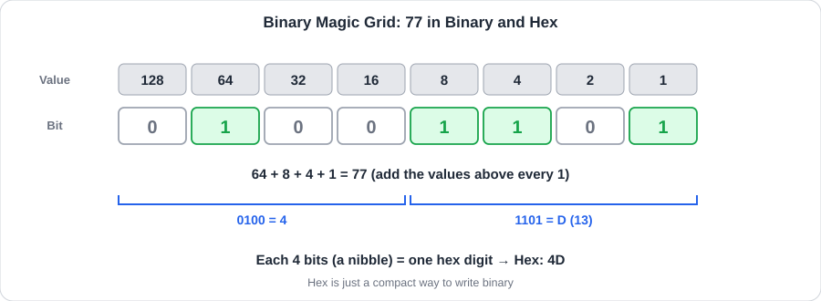
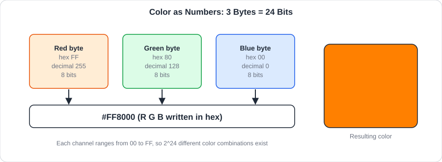
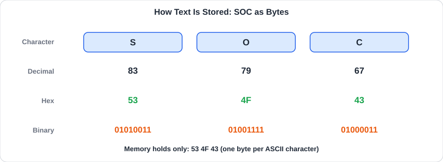
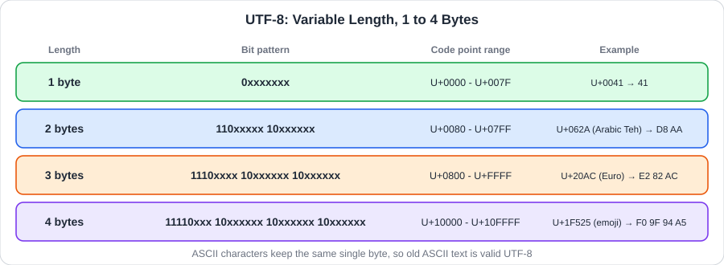
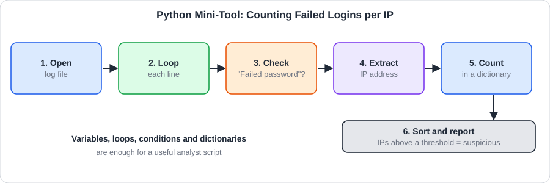
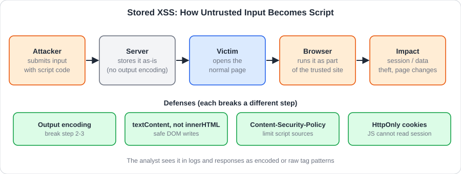
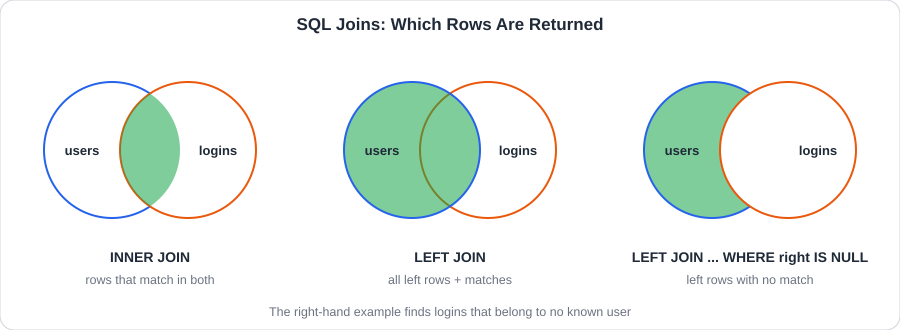

<div dir="rtl" align="right">

# الوحدة الرابعة: Software Basics

## 📑 فهرس الوحدة

<table dir="rtl" width="100%">
<thead><tr><th align="right" style="text-align:right">#</th><th align="right" style="text-align:right">الغرفة</th><th align="right" style="text-align:right">الموضوعات بالترتيب</th></tr></thead>
<tbody>
<tr><td align="right" style="text-align:right">—</td><td align="right" style="text-align:right"><a href="#module-intro">مقدمة الوحدة</a></td><td align="right" style="text-align:right">تعريف البرمجيات وكيف تُبنى على الأرقام والنصوص والبيانات</td></tr>
<tr><td align="right" style="text-align:right">1</td><td dir="ltr" align="left" style="text-align:left"><a href="#room-1">Data Representation</a></td><td align="right" style="text-align:right"><a href="#t1-1">1.1 التعريف بالغرفة وأهدافها</a><br><a href="#t1-2">1.2 لماذا يعتمد الحاسوب على النظام الثنائي</a><br><a href="#t1-3">1.3 البت والبايت ووحدات التخزين</a><br><a href="#t1-4">1.4 الأنظمة العددية الأربعة</a><br><a href="#t1-5">1.5 النظام السداسي عشري بالتفصيل</a><br><a href="#t1-6">1.6 النظام الثماني Octal</a><br><a href="#t1-7">1.7 التحويل بين الأنظمة العددية</a><br><a href="#t1-8">1.8 تمثيل الألوان بالأرقام</a><br><a href="#t1-9">1.9 تخزين القيم الرقمية في ذاكرة الكمبيوتر</a><br><a href="#t1-10">1.10 الزاوية الأمنية: الأرقام والأنظمة في التحقيق</a><br><a href="#t1-11">1.11 أدوات التحويل وقراءة البيانات الخام</a><br><a href="#t1-12">1.12 جدول مرجعي: التحويلات والأوامر (Cheatsheet)</a><br><a href="#t1-13">1.13 سيناريو: مرفق مشبوه بامتداد مزيف</a></td></tr>
<tr><td align="right" style="text-align:right">2</td><td dir="ltr" align="left" style="text-align:left"><a href="#room-2">Data Encoding</a></td><td align="right" style="text-align:right"><a href="#t2-1">2.1 التعريف بالغرفة وربطها بالغرفة السابقة</a><br><a href="#t2-2">2.2 فكرة الترميز Encoding</a><br><a href="#t2-3">2.3 ترميز ASCII</a><br><a href="#t2-4">2.4 كيف نحفظ ونعرض النص</a><br><a href="#t2-5">2.5 Extended ASCII وسلسلة ISO-8859</a><br><a href="#t2-6">2.6 معيار Unicode ونقاط الترميز Code Points</a><br><a href="#t2-7">2.7 صيغ UTF-8 و UTF-16 و UTF-32</a><br><a href="#t2-8">2.8 ترميزات أخرى يراها المحلل في عمله</a><br><a href="#t2-9">2.9 الزاوية الأمنية: الترميز في التحقيق والهجمات</a><br><a href="#t2-10">2.10 أدوات الترميز وفكه</a><br><a href="#t2-11">2.11 جدول مرجعي: الترميز والأوامر (Cheatsheet)</a><br><a href="#t2-12">2.12 سيناريو: قيمة مرمّزة في طلب ويب مشبوه</a></td></tr>
<tr><td align="right" style="text-align:right">3</td><td dir="ltr" align="left" style="text-align:left"><a href="#room-3">Python Simple Demo</a></td><td align="right" style="text-align:right"><a href="#t3-1">3.1 التعريف بالغرفة ولغة Python</a><br><a href="#t3-2">3.2 تشغيل بايثون وبنية الجملة Syntax</a><br><a href="#t3-3">3.3 المتغيرات Variables</a><br><a href="#t3-4">3.4 أنواع البيانات الأساسية</a><br><a href="#t3-5">3.5 العمليات الحسابية والمقارنة والمنطقية</a><br><a href="#t3-6">3.6 الجمل الشرطية Conditional Statements</a><br><a href="#t3-7">3.7 القوائم والقواميس Lists and Dictionaries</a><br><a href="#t3-8">3.8 الحلقات التكرارية Loops</a><br><a href="#t3-9">3.9 الدوال Functions</a><br><a href="#t3-10">3.10 المكتبات والملفات</a><br><a href="#t3-11">3.11 الزاوية الأمنية: بايثون في عمل المحلل</a><br><a href="#t3-12">3.12 أوامر تشغيل بايثون وأداة تحليل عملية</a><br><a href="#t3-13">3.13 جدول مرجعي: أساسيات بايثون (Cheatsheet)</a><br><a href="#t3-14">3.14 سيناريو: كشف تخمين كلمات المرور بسكربت وقراءة سكربت غريب</a></td></tr>
<tr><td align="right" style="text-align:right">4</td><td dir="ltr" align="left" style="text-align:left"><a href="#room-4">JavaScript Simple Demo</a></td><td align="right" style="text-align:right"><a href="#t4-1">4.1 التعريف بالغرفة ولغة JavaScript</a><br><a href="#t4-2">4.2 أين تعمل JavaScript وكيف ندرجها في الصفحة</a><br><a href="#t4-3">4.3 البيئة والطباعة console.log</a><br><a href="#t4-4">4.4 المتغيرات: let و const و var</a><br><a href="#t4-5">4.5 أنواع البيانات</a><br><a href="#t4-6">4.6 الجمل الشرطية والحلقات</a><br><a href="#t4-7">4.7 الدوال Functions</a><br><a href="#t4-8">4.8 التفاعل مع عناصر الصفحة DOM</a><br><a href="#t4-9">4.9 الأحداث Events</a><br><a href="#t4-10">4.10 الزاوية الأمنية: XSS والمتصفح خط الدفاع الأول</a><br><a href="#t4-11">4.11 قراءة جافا سكربت مشبوه</a><br><a href="#t4-12">4.12 أدوات المطور وتجربة الكود</a><br><a href="#t4-13">4.13 جدول مرجعي: أساسيات جافا سكربت (Cheatsheet)</a><br><a href="#t4-14">4.14 سيناريو: الاشتباه بمحاولة XSS في سجلات تطبيق ويب</a></td></tr>
<tr><td align="right" style="text-align:right">5</td><td dir="ltr" align="left" style="text-align:left"><a href="#room-5">Database SQL Basics</a></td><td align="right" style="text-align:right"><a href="#t5-1">5.1 التعريف بالغرفة وقواعد البيانات</a><br><a href="#t5-2">5.2 قاعدة البيانات ونظام إدارتها DBMS</a><br><a href="#t5-3">5.3 هيكل الجداول: الجداول والصفوف والأعمدة</a><br><a href="#t5-4">5.4 لغة الاستعلام الهيكلية SQL وفئات أوامرها</a><br><a href="#t5-5">5.5 الاستعلام الأساسي SELECT و FROM</a><br><a href="#t5-6">5.6 تصفية البيانات WHERE</a><br><a href="#t5-7">5.7 الفرز وتحديد النطاق ORDER BY و LIMIT</a><br><a href="#t5-8">5.8 إدارة وتعديل البيانات INSERT و UPDATE و DELETE</a><br><a href="#t5-9">5.9 التجميع GROUP BY و HAVING</a><br><a href="#t5-10">5.10 ربط الجداول SQL Joins</a><br><a href="#t5-11">5.11 الزاوية الأمنية: SQL Injection</a><br><a href="#t5-12">5.12 تجربة SQL عمليًا</a><br><a href="#t5-13">5.13 جدول مرجعي: أوامر SQL (Cheatsheet)</a><br><a href="#t5-14">5.14 سيناريو: تحقيق في دخول مشبوه وفي طلب يشبه SQL Injection</a></td></tr>
<tr><td align="right" style="text-align:right">—</td><td align="right" style="text-align:right"><a href="#module-glossary">جدول المصطلحات</a></td><td align="right" style="text-align:right">أهم مصطلحات الوحدة بمعانيها وأرقام الغرف</td></tr>
</tbody>
</table>

<a id="module-intro"></a>

## 🧭 مقدمة عن الوحدة

**البرمجيات (Software)** هي مجموعة التعليمات والبيانات التي تُخبر العتاد بما يفعله. وكل برنامج تشغّله، من محرر نصوص إلى متصفح إلى أداة أمنية، يقوم في النهاية على ثلاثة أشياء: **بيانات** تُخزَّن وتُمثَّل بالأرقام، و**كود** يعالج هذه البيانات، و**قواعد بيانات** تحفظها وتسترجعها.

وهذه الوحدة تنقلنا من فهم الجهاز ونظام التشغيل إلى فهم **ما يجري داخل البرمجيات**، وهو ما يحتاجه المحلل الأمني حين يقرأ سجلًا، أو يفحص ملفًا مشبوهًا، أو يحلل سكربتًا مخفيًا، أو يتتبع استعلام قاعدة بيانات غريبًا. والمحلل لا يُطلب منه أن يكون مبرمجًا محترفًا، لكن يُطلب منه **أن يقرأ الكود والبيانات ويفهم ما يفعله**.

تسير الوحدة في خمس غرف:

- **Data Representation:** كيف تمثل الحواسيب الأرقام والألوان (ثنائي، عشري، سداسي عشري).
- **Data Encoding:** كيف تتحول الأرقام إلى حروف ورموز (ASCII و Unicode و UTF).
- **Python Simple Demo:** أساسيات بايثون لكتابة وقراءة أدوات الأتمتة والتحليل.
- **JavaScript Simple Demo:** أساسيات جافا سكربت ولغة المتصفح، ومدخل لفهم XSS.
- **Database SQL Basics:** قواعد البيانات العلائقية ولغة SQL، ومدخل لفهم SQL Injection.

وفي كل غرفة: **زاوية أمنية** تربط الموضوع بعمل فريق الدفاع (Blue Team / SOC)، وجدول مرجعي **Cheatsheet** في نهاية الغرفة، وفقرة **خلاصة المحلل الأمني (SOC Takeaways)**، وفي آخر الوحدة جدول مصطلحات. وجميع الأمثلة في الملف مكتوبة بقيم خاصة بنا للشرح، ولا تتضمن حلولًا لأسئلة المنصة.

<br>

<a id="room-1"></a>
<table align="center" width="100%"><tr><td align="right" style="text-align:right">

### 🚪 الغرفة 1: Data Representation (تمثيل البيانات)

</td></tr></table>

<h1 dir="ltr" align="left" style="text-align:left">Data Representation</h1>

### <a id="t1-1"></a>1.1 التعريف بالغرفة وأهدافها

أول سؤال في البرمجيات: **كيف يخزّن الحاسوب كل شيء؟** الجواب أنه لا يعرف إلا **الأرقام**، وكل ما نراه من ألوان وصور ونصوص وأصوات هو أرقام متفق على معناها. وتشرح هذه الغرفة كيف تُمثَّل الأرقام والألوان، وكيف نكتبها بأنظمة عددية مختلفة، وكيف ننتقل بينها.

ومن أهداف الغرفة أن نكون قادرين في نهايتها على:
- فهم لماذا تعتمد الحواسيب على النظام الثنائي.
- التفريق بين الأنظمة **العشري (Decimal)** و**الثنائي (Binary)** و**السداسي عشري (Hexadecimal)** و**الثماني (Octal)**.
- التحويل بين هذه الأنظمة يدويًا وبالأدوات.
- فهم كيف يُمثَّل اللون بثلاثة بايتات (**RGB**).
- معرفة كيف تُخزَّن القيم الرقمية في الذاكرة وما حدودها.

<h2 dir="ltr" align="left" style="text-align:left">📌 Concepts Covered</h2>

### <a id="t1-2"></a>1.2 لماذا يعتمد الحاسوب على النظام الثنائي

الحاسوب مبني من مفاتيح كهربائية دقيقة (ترانزستورات) لها حالتان فقط: **يمر تيار** أو **لا يمر**. فالأسهل والأكثر ثباتًا أن نعطي كل حالة رمزًا: `1` و`0`. وكل **خانة** من هذين الرمزين تسمى **Bit (بت)**، وهي أصغر وحدة معلومات.

وبتجميع البتات نستطيع تمثيل أي شيء: رقم، حرف، لون، أو تعليمة للمعالج. والمهم أن **البتات نفسها بلا معنى**، والمعنى يأتي من **الاتفاق على كيفية تفسيرها**: نفس البايتات قد تكون رقمًا أو حرفًا أو جزءًا من صورة بحسب البرنامج الذي يقرؤها. وهذه الفكرة هي أساس الغرفة التالية.

### <a id="t1-3"></a>1.3 البت والبايت ووحدات التخزين

<table dir="rtl" width="100%">
<thead><tr><th align="right" style="text-align:right">الوحدة</th><th align="right" style="text-align:right">الحجم</th><th align="right" style="text-align:right">ملاحظة</th></tr></thead>
<tbody>
<tr><td dir="ltr" align="left" style="text-align:left"><b>Bit</b></td><td align="right" style="text-align:right">خانة واحدة</td><td align="right" style="text-align:right"><code>0</code> أو <code>1</code></td></tr>
<tr><td dir="ltr" align="left" style="text-align:left"><b>Nibble</b></td><td align="right" style="text-align:right">4 بت</td><td align="right" style="text-align:right">يساوي رقمًا سداسيًا عشريًا واحدًا</td></tr>
<tr><td dir="ltr" align="left" style="text-align:left"><b>Byte</b></td><td align="right" style="text-align:right">8 بت</td><td align="right" style="text-align:right">أصغر وحدة يمكن عنونتها في الذاكرة، تحمل 256 قيمة</td></tr>
<tr><td dir="ltr" align="left" style="text-align:left"><b>KB</b></td><td align="right" style="text-align:right">1024 بايت</td><td align="right" style="text-align:right">يستخدم أحيانًا 1000 في التسويق</td></tr>
<tr><td dir="ltr" align="left" style="text-align:left"><b>MB / GB / TB</b></td><td align="right" style="text-align:right">كل وحدة 1024 مثل سابقتها</td><td align="right" style="text-align:right">حجم الملفات والأقراص</td></tr>
</tbody>
</table>

و**عدد القيم الممكنة** مع `n` بت هو `2^n`. فبايت واحد (8 بت) يحمل `2^8 = 256` قيمة من 0 إلى 255، و16 بت تحمل `2^16 = 65,536` قيمة، و32 بت تحمل ما يزيد على أربعة مليارات قيمة. وهذه الحدود تظهر في الأمن: **أرقام المنافذ** تحتاج 16 بت، وعنوان **IPv4** يتكون من 4 بايتات، و**IPv6** من 128 بت.

### <a id="t1-4"></a>1.4 الأنظمة العددية الأربعة

النظام العددي يحدد **كم رمزًا** نستخدم قبل أن ننتقل إلى خانة جديدة. وهذا العدد هو **الأساس (Base)**:

<table dir="rtl" width="100%">
<thead><tr><th align="right" style="text-align:right">النظام</th><th align="right" style="text-align:right">الأساس</th><th align="right" style="text-align:right">الرموز المستخدمة</th><th align="right" style="text-align:right">أين نراه</th></tr></thead>
<tbody>
<tr><td align="right" style="text-align:right"><b>Decimal</b> (عشري)</td><td align="right" style="text-align:right">10</td><td align="right" style="text-align:right"><code>0-9</code></td><td align="right" style="text-align:right">الحياة اليومية، أرقام المنافذ، IPv4</td></tr>
<tr><td align="right" style="text-align:right"><b>Binary</b> (ثنائي)</td><td align="right" style="text-align:right">2</td><td align="right" style="text-align:right"><code>0</code> و<code>1</code></td><td align="right" style="text-align:right">ما يفهمه العتاد فعليًا</td></tr>
<tr><td align="right" style="text-align:right"><b>Hexadecimal</b> (سداسي عشري)</td><td align="right" style="text-align:right">16</td><td align="right" style="text-align:right"><code>0-9</code> و<code>A-F</code></td><td align="right" style="text-align:right">الألوان، عناوين MAC، الـ Hashes، تحليل الملفات</td></tr>
<tr><td align="right" style="text-align:right"><b>Octal</b> (ثماني)</td><td align="right" style="text-align:right">8</td><td align="right" style="text-align:right"><code>0-7</code></td><td align="right" style="text-align:right">صلاحيات لينكس مثل <code>755</code></td></tr>
</tbody>
</table>

والجدول التالي يجمع قيم الأرقام من 0 إلى 15 في الأنظمة الأربعة، وهو مرجع مفيد للحفظ:

<table dir="rtl" width="100%">
<thead><tr><th align="right" style="text-align:right">Decimal</th><th align="right" style="text-align:right">Binary</th><th align="right" style="text-align:right">Hex</th><th align="right" style="text-align:right">Octal</th></tr></thead>
<tbody>
<tr><td align="right" style="text-align:right">0</td><td align="right" style="text-align:right">0000</td><td align="right" style="text-align:right">0</td><td align="right" style="text-align:right">0</td></tr>
<tr><td align="right" style="text-align:right">1</td><td align="right" style="text-align:right">0001</td><td align="right" style="text-align:right">1</td><td align="right" style="text-align:right">1</td></tr>
<tr><td align="right" style="text-align:right">2</td><td align="right" style="text-align:right">0010</td><td align="right" style="text-align:right">2</td><td align="right" style="text-align:right">2</td></tr>
<tr><td align="right" style="text-align:right">3</td><td align="right" style="text-align:right">0011</td><td align="right" style="text-align:right">3</td><td align="right" style="text-align:right">3</td></tr>
<tr><td align="right" style="text-align:right">4</td><td align="right" style="text-align:right">0100</td><td align="right" style="text-align:right">4</td><td align="right" style="text-align:right">4</td></tr>
<tr><td align="right" style="text-align:right">5</td><td align="right" style="text-align:right">0101</td><td align="right" style="text-align:right">5</td><td align="right" style="text-align:right">5</td></tr>
<tr><td align="right" style="text-align:right">6</td><td align="right" style="text-align:right">0110</td><td align="right" style="text-align:right">6</td><td align="right" style="text-align:right">6</td></tr>
<tr><td align="right" style="text-align:right">7</td><td align="right" style="text-align:right">0111</td><td align="right" style="text-align:right">7</td><td align="right" style="text-align:right">7</td></tr>
<tr><td align="right" style="text-align:right">8</td><td align="right" style="text-align:right">1000</td><td align="right" style="text-align:right">8</td><td align="right" style="text-align:right">10</td></tr>
<tr><td align="right" style="text-align:right">9</td><td align="right" style="text-align:right">1001</td><td align="right" style="text-align:right">9</td><td align="right" style="text-align:right">11</td></tr>
<tr><td align="right" style="text-align:right">10</td><td align="right" style="text-align:right">1010</td><td dir="ltr" align="left" style="text-align:left">A</td><td align="right" style="text-align:right">12</td></tr>
<tr><td align="right" style="text-align:right">11</td><td align="right" style="text-align:right">1011</td><td dir="ltr" align="left" style="text-align:left">B</td><td align="right" style="text-align:right">13</td></tr>
<tr><td align="right" style="text-align:right">12</td><td align="right" style="text-align:right">1100</td><td dir="ltr" align="left" style="text-align:left">C</td><td align="right" style="text-align:right">14</td></tr>
<tr><td align="right" style="text-align:right">13</td><td align="right" style="text-align:right">1101</td><td dir="ltr" align="left" style="text-align:left">D</td><td align="right" style="text-align:right">15</td></tr>
<tr><td align="right" style="text-align:right">14</td><td align="right" style="text-align:right">1110</td><td dir="ltr" align="left" style="text-align:left">E</td><td align="right" style="text-align:right">16</td></tr>
<tr><td align="right" style="text-align:right">15</td><td align="right" style="text-align:right">1111</td><td dir="ltr" align="left" style="text-align:left">F</td><td align="right" style="text-align:right">17</td></tr>
</tbody>
</table>

وتُكتب بعض الأنظمة بسابقة لتمييزها: `0x4D` للسداسي عشري، و`0b1001101` للثنائي، و`0o115` للثماني، وأحيانًا `4Dh` أو `#4D` في سياقات أخرى.

### <a id="t1-5"></a>1.5 النظام السداسي عشري بالتفصيل

لماذا نستخدم السداسي عشري إذا كان الثنائي هو الأصل؟ لأن الثنائي **طويل وصعب القراءة**، فالبايت الواحد يحتاج ثماني خانات. أما السداسي عشري فكل **رقم واحد منه يساوي 4 بت بالضبط**، فالبايت يُكتب برقمين فقط. فهو **اختصار مريح للثنائي** دون أي حساب معقد.

وقيمة كل خانة في السداسي عشري هي قوة للعدد 16 بحسب موضعها من اليمين: `16^0 = 1` ثم `16^1 = 16` ثم `16^2 = 256`. فمثلًا `0x2F` تساوي `2 × 16 + 15 = 47`، و`0xC8` تساوي `12 × 16 + 8 = 200`.

ولهذا يُستخدم السداسي عشري في كل مكان يتعامل مع البايتات: الألوان، عناوين **MAC**، قيم **Hash**، عرض محتوى الملفات الخام (**Hex Dump**)، وأرقام الأخطاء في ويندوز.

### <a id="t1-6"></a>1.6 النظام الثماني Octal

في **Octal** كل رقم يساوي **3 بتات**، لأن `2^3 = 8`. فالتحويل من الثنائي إليه يتم بتقسيم البتات إلى مجموعات من 3 من اليمين. مثال: الرقم `77` ثنائيًا `1001101`، نقسمه `001 001 101` فيصبح `115`.

وأشهر استخدام له اليوم هو **صلاحيات لينكس** (التي رأيناها في الوحدة السابقة): كل رقم من الأرقام الثلاثة في `755` يمثل صلاحيات المالك والمجموعة والآخرين، وتمثله ثلاث بتات `r` و`w` و`x`:

<table dir="rtl" width="100%">
<thead><tr><th align="right" style="text-align:right">الرقم</th><th align="right" style="text-align:right">الثنائي</th><th align="right" style="text-align:right">الصلاحية</th></tr></thead>
<tbody>
<tr><td align="right" style="text-align:right">7</td><td align="right" style="text-align:right">111</td><td dir="ltr" align="left" style="text-align:left"><code>rwx</code></td></tr>
<tr><td align="right" style="text-align:right">6</td><td align="right" style="text-align:right">110</td><td dir="ltr" align="left" style="text-align:left"><code>rw-</code></td></tr>
<tr><td align="right" style="text-align:right">5</td><td align="right" style="text-align:right">101</td><td dir="ltr" align="left" style="text-align:left"><code>r-x</code></td></tr>
<tr><td align="right" style="text-align:right">4</td><td align="right" style="text-align:right">100</td><td dir="ltr" align="left" style="text-align:left"><code>r--</code></td></tr>
</tbody>
</table>

فالأذونات `644` تعني `rw-` للمالك و`r--` للمجموعة و`r--` للآخرين.

### <a id="t1-7"></a>1.7 التحويل بين الأنظمة العددية

**1) من الثنائي إلى العشري:** نجمع **قيم المواضع** التي بها `1`. وهنا تفيد طريقة **الجدول السحري (Magic Grid)** بقيم القوى: `128, 64, 32, 16, 8, 4, 2, 1`.

<p align="center">
  <br>
  <sub>الجدول السحري: نكتب 1 تحت القيم التي تُجمع لتعطي الرقم، ثم نقسم البتات إلى مجموعتين من 4 لنحصل على الرقم السداسي عشري</sub>
</p>

مثال: `10110010` تساوي `128 + 32 + 16 + 2 = 178`.

**2) من العشري إلى الثنائي:** طريقتان:
- **الطرح من الجدول:** نبدأ من أكبر قيمة في الجدول، فإن كانت أصغر من الرقم أو تساويه وضعنا `1` وطرحناها، وإلا وضعنا `0`، ثم ننتقل للقيمة التالية. مثال `77`: يحتوي على 64 (باقي 13)، ولا يحتوي 32 ولا 16، ويحتوي 8 (باقي 5) و4 (باقي 1) و1 فتكون النتيجة `01001101`.
- **القسمة المتكررة على 2:** نقسم الرقم على 2 ونسجل الباقي (0 أو 1) حتى نصل إلى صفر، ثم **نقرأ الباقي من الأسفل إلى الأعلى**. مثال `45`: الباقي بالترتيب `1, 0, 1, 1, 0, 1` فتكون القراءة العكسية `101101`، أي `00101101` في 8 بت.

**3) من السداسي عشري إلى الثنائي:** نحوّل **كل رقم إلى 4 بت** منفصلة. مثال `3A` يصبح `0011` ثم `1010` فنحصل على `00111010`.

**4) من الثنائي إلى السداسي عشري:** نقسم البتات من اليمين إلى مجموعات من 4، ونحوّل كل مجموعة إلى رقم. مثال `10110010` تصبح `1011` و`0010` أي `B2`.

**5) من السداسي عشري إلى العشري:** نضرب كل رقم في قوة `16` الخاصة بموضعه ونجمع الناتج، كما في مثال `0x2F` السابق. ولتحويل لون إلى قنواته، نفصل الأرقام الستة إلى ثلاثة أزواج، ونحوّل كل زوج إلى عشري كبايت واحد من 0 إلى 255.

**6) من العشري إلى السداسي عشري:** إما عبر الثنائي (نحوله ثم نجمع كل 4 بتات)، أو بالقسمة المتكررة على 16 وقراءة الباقي من الأسفل.

### <a id="t1-8"></a>1.8 تمثيل الألوان بالأرقام

الشاشة تعرض اللون بدمج **ثلاثة ألوان أساسية** من الضوء: **الأحمر (Red)** و**الأخضر (Green)** و**الأزرق (Blue)**، وهو نموذج **RGB**. وكل لون أساسي يُخزَّن في **بايت واحد**، أي بقيمة من 0 (لا شيء من هذا اللون) إلى 255 (أقصى شدة).

<p align="center">
  <br>
  <sub>اللون هو ثلاثة بايتات: أحمر وأخضر وأزرق، تُكتب غالبًا بالنظام السداسي عشري</sub>
</p>

فاللون الواحد يحتاج `3 × 8 = 24` بت، ولذلك يسمى هذا النمط **24-bit color**، ويعطي `2^24` تركيبة مختلفة من الألوان. وبعض أمثلة الألوان الأساسية:

<table dir="rtl" width="100%">
<thead><tr><th align="right" style="text-align:right">اللون</th><th align="right" style="text-align:right">القيمة السداسية</th><th align="right" style="text-align:right">القيم (R, G, B)</th></tr></thead>
<tbody>
<tr><td align="right" style="text-align:right">أحمر</td><td dir="ltr" align="left" style="text-align:left"><code>#FF0000</code></td><td align="right" style="text-align:right">255, 0, 0</td></tr>
<tr><td align="right" style="text-align:right">أخضر</td><td dir="ltr" align="left" style="text-align:left"><code>#00FF00</code></td><td align="right" style="text-align:right">0, 255, 0</td></tr>
<tr><td align="right" style="text-align:right">أزرق</td><td dir="ltr" align="left" style="text-align:left"><code>#0000FF</code></td><td align="right" style="text-align:right">0, 0, 255</td></tr>
<tr><td align="right" style="text-align:right">أسود</td><td align="right" style="text-align:right"><code>#000000</code></td><td align="right" style="text-align:right">0, 0, 0</td></tr>
<tr><td align="right" style="text-align:right">أبيض</td><td dir="ltr" align="left" style="text-align:left"><code>#FFFFFF</code></td><td align="right" style="text-align:right">كل القنوات في أقصاها</td></tr>
<tr><td align="right" style="text-align:right">برتقالي</td><td dir="ltr" align="left" style="text-align:left"><code>#FF8000</code></td><td align="right" style="text-align:right">255, 128, 0</td></tr>
</tbody>
</table>

وبعض الصيغ تضيف بايتًا رابعًا للشفافية (**Alpha**) فيصبح اللون 32 بت (`RGBA`).

### <a id="t1-9"></a>1.9 تخزين القيم الرقمية في ذاكرة الكمبيوتر

الأرقام تُخزَّن في الذاكرة بحجم **ثابت** من البتات، وهذا يفرض عليها حدودًا مهمة:

<table dir="rtl" width="100%">
<thead><tr><th align="right" style="text-align:right">الحجم</th><th align="right" style="text-align:right">عدد البتات</th><th align="right" style="text-align:right">المدى بدون إشارة (Unsigned)</th></tr></thead>
<tbody>
<tr><td align="right" style="text-align:right">بايت</td><td align="right" style="text-align:right">8</td><td align="right" style="text-align:right">0 إلى 255</td></tr>
<tr><td dir="ltr" align="left" style="text-align:left">Word</td><td align="right" style="text-align:right">16</td><td align="right" style="text-align:right">0 إلى 65,535</td></tr>
<tr><td dir="ltr" align="left" style="text-align:left">Double Word</td><td align="right" style="text-align:right">32</td><td align="right" style="text-align:right">0 إلى 4,294,967,295</td></tr>
<tr><td dir="ltr" align="left" style="text-align:left">Quad Word</td><td align="right" style="text-align:right">64</td><td align="right" style="text-align:right">حتى 18 كوينتليون تقريبًا</td></tr>
</tbody>
</table>

**الأرقام السالبة (Signed):** لا يوجد رمز للإشارة في البتات، فيُستخدم تمثيل **المتمم الثنائي (Two's Complement)** حيث يُعتبر أكبر بت هو بت الإشارة. ففي 8 بت: المدى من `-128` إلى `127`، والقيمة `11111111` تمثل `-1`. أي أن **نفس البتات قد تُقرأ برقمين مختلفين** بحسب نوع الرقم.

**الفيض (Overflow):** إذا تجاوزت العملية ما تتسع له الخانات، تلتف القيمة. مثال: في 8 بت، `255 + 1` تعطي `00000000` مع فقد الخانة الزائدة. وهذا الخطأ هو أساس أصناف من الثغرات مثل **Integer Overflow**.

**ترتيب البايتات (Endianness):** حين يزيد الرقم عن بايت، يُخزَّن في الذاكرة بترتيب معين:
- **Big-Endian:** الأكبر أولًا. الرقم `0x12345678` يُخزَّن `12 34 56 78`.
- **Little-Endian:** الأصغر أولًا (يعتمده معالجات x86). الرقم نفسه يُخزَّن `78 56 34 12`.

ولذلك يظهر الرقم **معكوسًا** حين نقرأ الذاكرة أو ملفات بصيغة ثنائية في أدوات التحليل.

### <a id="t1-10"></a>1.10 الزاوية الأمنية: الأرقام والأنظمة في التحقيق

كثير من عمل المحلل يقوم على **قراءة البيانات الخام**، وفهم الأنظمة العددية يجعل هذه القراءة سريعة:

<table dir="rtl" width="100%">
<thead><tr><th align="right" style="text-align:right">الموضع</th><th align="right" style="text-align:right">كيف يظهر</th><th align="right" style="text-align:right">استخدام المحلل</th></tr></thead>
<tbody>
<tr><td align="right" style="text-align:right"><b>Magic Bytes</b> (توقيع الملف)</td><td align="right" style="text-align:right">أول بايتات الملف بالسداسي عشري</td><td align="right" style="text-align:right">معرفة نوع الملف الحقيقي بغض النظر عن امتداده</td></tr>
<tr><td dir="ltr" align="left" style="text-align:left"><b>Hash</b></td><td align="right" style="text-align:right"><code>MD5</code> = 32 رقم هكس، <code>SHA-1</code> = 40، <code>SHA-256</code> = 64</td><td align="right" style="text-align:right">بصمة الملف للمقارنة مع قواعد التهديدات</td></tr>
<tr><td align="right" style="text-align:right"><b>عناوين الشبكة</b></td><td align="right" style="text-align:right"><code>IPv4</code> = 4 بايتات عشرية، <code>MAC</code> = 6 بايتات هكس، <code>IPv6</code> = 128 بت هكس</td><td align="right" style="text-align:right">قراءة السجلات وحزم الشبكة</td></tr>
<tr><td align="right" style="text-align:right"><b>المنافذ</b></td><td align="right" style="text-align:right">رقم 16 بت (0-65535)</td><td align="right" style="text-align:right">معرفة الخدمة وتمييز المنافذ غير المعتادة</td></tr>
<tr><td align="right" style="text-align:right"><b>صلاحيات لينكس</b></td><td align="right" style="text-align:right">رقم ثماني مثل <code>755</code></td><td align="right" style="text-align:right">كشف صلاحيات خطرة مثل <code>777</code></td></tr>
<tr><td align="right" style="text-align:right"><b>الألوان</b></td><td dir="ltr" align="left" style="text-align:left"><code>#RRGGBB</code></td><td align="right" style="text-align:right">كشف نص مخفي في صفحات التصيد (لون الخط يطابق الخلفية)</td></tr>
<tr><td dir="ltr" align="left" style="text-align:left"><b>Endianness</b></td><td align="right" style="text-align:right">البايتات معكوسة في الذاكرة</td><td align="right" style="text-align:right">قراءة أرقام الذاكرة وملفات الـ Dump دون خطأ</td></tr>
</tbody>
</table>

وأشهر **Magic Bytes** التي تفيد في الفرز السريع:

<table dir="rtl" width="100%">
<thead><tr><th align="right" style="text-align:right">النوع</th><th align="right" style="text-align:right">البايتات (Hex)</th><th align="right" style="text-align:right">يقابلها نصيًا</th></tr></thead>
<tbody>
<tr><td align="right" style="text-align:right">ملف تنفيذي ويندوز (PE)</td><td dir="ltr" align="left" style="text-align:left"><code>4D 5A</code></td><td dir="ltr" align="left" style="text-align:left"><code>MZ</code></td></tr>
<tr><td align="right" style="text-align:right">ملف تنفيذي لينكس (ELF)</td><td dir="ltr" align="left" style="text-align:left"><code>7F 45 4C 46</code></td><td dir="ltr" align="left" style="text-align:left"><code>.ELF</code></td></tr>
<tr><td align="right" style="text-align:right">صورة PNG</td><td dir="ltr" align="left" style="text-align:left"><code>89 50 4E 47</code></td><td dir="ltr" align="left" style="text-align:left"><code>.PNG</code></td></tr>
<tr><td align="right" style="text-align:right">صورة JPEG</td><td dir="ltr" align="left" style="text-align:left"><code>FF D8 FF</code></td><td align="right" style="text-align:right">بدون نص مقروء</td></tr>
<tr><td align="right" style="text-align:right">مستند PDF</td><td align="right" style="text-align:right"><code>25 50 44 46</code></td><td dir="ltr" align="left" style="text-align:left"><code>%PDF</code></td></tr>
<tr><td align="right" style="text-align:right">أرشيف ZIP (وكذلك docx و xlsx و jar)</td><td dir="ltr" align="left" style="text-align:left"><code>50 4B 03 04</code></td><td dir="ltr" align="left" style="text-align:left"><code>PK..</code></td></tr>
<tr><td align="right" style="text-align:right">صورة GIF</td><td align="right" style="text-align:right"><code>47 49 46 38</code></td><td dir="ltr" align="left" style="text-align:left"><code>GIF8</code></td></tr>
<tr><td align="right" style="text-align:right">أرشيف GZIP</td><td dir="ltr" align="left" style="text-align:left"><code>1F 8B</code></td><td align="right" style="text-align:right">بدون نص مقروء</td></tr>
</tbody>
</table>

والقاعدة: **الامتداد مجرد اسم يمكن تغييره، أما التوقيع داخل الملف فيصعب تزييفه دون كسر الملف**. فملف باسم `invoice.pdf` يبدأ بالبايتين `4D 5A` هو في الحقيقة **ملف تنفيذي** متنكر.

<h2 dir="ltr" align="left" style="text-align:left">🛠 Commands &amp; Hands-on</h2>

### <a id="t1-11"></a>1.11 أدوات التحويل وقراءة البيانات الخام

نحوّل الأرقام ونقرأ البايتات بالأدوات بدلًا من الحساب اليدوي:

<div dir="ltr" align="left">

```bash
echo $((2#1001101))        # Binary  -> Decimal
echo $((16#4D))            # Hex     -> Decimal
echo $((8#115))            # Octal   -> Decimal
printf '%x\n' 77           # Decimal -> Hex
printf '%o\n' 77           # Decimal -> Octal
xxd invoice.pdf | head -n 2   # hex dump of first bytes
file invoice.pdf              # type from magic bytes
sha256sum invoice.pdf         # file hash
```

</div>

<table dir="rtl" width="100%">
<thead><tr><th align="right" style="text-align:right">الأمر</th><th align="right" style="text-align:right">الشرح</th></tr></thead>
<tbody>
<tr><td align="right" style="text-align:right"><code>$((2#...))</code> / <code>$((16#...))</code></td><td align="right" style="text-align:right">يحوّل رقمًا بأساس معين (2 أو 8 أو 16) إلى عشري داخل Bash</td></tr>
<tr><td dir="ltr" align="left" style="text-align:left"><code>printf '%x'</code> / <code>'%o'</code> / <code>'%d'</code></td><td align="right" style="text-align:right">يطبع الرقم بنظام هكس أو ثماني أو عشري</td></tr>
<tr><td dir="ltr" align="left" style="text-align:left"><code>xxd</code></td><td align="right" style="text-align:right">يعرض محتوى الملف بالسداسي عشري مع النص المقابل</td></tr>
<tr><td align="right" style="text-align:right"><code>-l N</code> (مع xxd)</td><td align="right" style="text-align:right">يقتصر على أول N بايت</td></tr>
<tr><td align="right" style="text-align:right"><code>-b</code> (مع xxd)</td><td align="right" style="text-align:right">يعرض بالنظام الثنائي بدل الهكس</td></tr>
<tr><td dir="ltr" align="left" style="text-align:left"><code>file</code></td><td align="right" style="text-align:right">يحدد نوع الملف من <b>Magic Bytes</b> لا من امتداده</td></tr>
<tr><td dir="ltr" align="left" style="text-align:left"><code>sha256sum</code></td><td align="right" style="text-align:right">يحسب بصمة SHA-256 للملف</td></tr>
</tbody>
</table>

ومثال على مخرج `xxd` لملف PNG، حيث العمود الأوسط هو الهكس والأيمن هو النص المقابل:

<div dir="ltr" align="left">

```text
00000000: 8950 4e47 0d0a 1a0a 0000 000d  .PNG........
```

</div>

وفي Python و PowerShell يمكن إجراء التحويلات نفسها:

<div dir="ltr" align="left">

```python
bin(77)            # '0b1001101'
hex(77)            # '0x4d'
oct(77)            # '0o115'
int('4D', 16)      # 77
int('1001101', 2)  # 77
```

</div>

<div dir="ltr" align="left">

```powershell
[Convert]::ToString(77, 2)      # 1001101
[Convert]::ToString(77, 16)     # 4d
[Convert]::ToInt32('4D', 16)    # 77
```

</div>

وفي ويندوز تعمل **الآلة الحاسبة (Calculator)** بوضع **Programmer** كمحول سريع بين الأنظمة الأربعة.

### <a id="t1-12"></a>1.12 جدول مرجعي: التحويلات والأوامر (Cheatsheet)

**طرق التحويل بين الأنظمة:**

<table dir="rtl" width="100%">
<thead><tr><th align="right" style="text-align:right">التحويل</th><th align="right" style="text-align:right">الطريقة المختصرة</th><th align="right" style="text-align:right">مثال</th></tr></thead>
<tbody>
<tr><td align="right" style="text-align:right">Binary إلى Decimal</td><td align="right" style="text-align:right">جمع قيم المواضع التي بها <code>1</code></td><td align="right" style="text-align:right"><code>1011</code> = <code>8 + 2 + 1</code> = 11</td></tr>
<tr><td align="right" style="text-align:right">Decimal إلى Binary</td><td align="right" style="text-align:right">الطرح من الجدول أو القسمة على 2 وقراءة الباقي عكسيًا</td><td align="right" style="text-align:right"><code>13</code> = <code>1101</code></td></tr>
<tr><td align="right" style="text-align:right">Hex إلى Binary</td><td align="right" style="text-align:right">كل رقم هكس يصبح 4 بت</td><td dir="ltr" align="left" style="text-align:left"><code>3A</code> = <code>0011 1010</code></td></tr>
<tr><td align="right" style="text-align:right">Binary إلى Hex</td><td align="right" style="text-align:right">تجميع كل 4 بت من اليمين</td><td dir="ltr" align="left" style="text-align:left"><code>1011 0010</code> = <code>B2</code></td></tr>
<tr><td align="right" style="text-align:right">Hex إلى Decimal</td><td align="right" style="text-align:right">ضرب كل رقم في <code>16^n</code> والجمع</td><td dir="ltr" align="left" style="text-align:left"><code>0x2F</code> = <code>2×16 + 15</code> = 47</td></tr>
<tr><td align="right" style="text-align:right">Octal إلى Binary</td><td align="right" style="text-align:right">كل رقم ثماني يصبح 3 بت</td><td align="right" style="text-align:right"><code>644</code> = <code>110 100 100</code></td></tr>
<tr><td align="right" style="text-align:right">لون Hex إلى RGB</td><td align="right" style="text-align:right">فصل الأرقام الستة إلى 3 أزواج وتحويل كل زوج</td><td dir="ltr" align="left" style="text-align:left"><code>#FF8000</code> = 255, 128, 0</td></tr>
</tbody>
</table>

**أدوات التحويل والفحص:**

<table dir="rtl" width="100%">
<thead><tr><th align="right" style="text-align:right">الأداة</th><th align="right" style="text-align:right">الاستخدام الشائع</th><th align="right" style="text-align:right">مثال عملي</th></tr></thead>
<tbody>
<tr><td dir="ltr" align="left" style="text-align:left">Bash <code>$((base#n))</code></td><td align="right" style="text-align:right">تحويل رقم بأساس معين إلى عشري</td><td dir="ltr" align="left" style="text-align:left"><code>echo $((16#4D))</code></td></tr>
<tr><td dir="ltr" align="left" style="text-align:left"><code>printf</code></td><td align="right" style="text-align:right">عشري إلى هكس أو ثماني</td><td dir="ltr" align="left" style="text-align:left"><code>printf '%x\n' 77</code></td></tr>
<tr><td dir="ltr" align="left" style="text-align:left"><code>xxd</code></td><td align="right" style="text-align:right">عرض الملف بالسداسي عشري</td><td dir="ltr" align="left" style="text-align:left"><code>xxd -l 16 file.bin</code></td></tr>
<tr><td dir="ltr" align="left" style="text-align:left"><code>file</code></td><td align="right" style="text-align:right">تحديد نوع الملف من توقيعه</td><td dir="ltr" align="left" style="text-align:left"><code>file invoice.pdf</code></td></tr>
<tr><td dir="ltr" align="left" style="text-align:left"><code>sha256sum</code></td><td align="right" style="text-align:right">بصمة الملف</td><td dir="ltr" align="left" style="text-align:left"><code>sha256sum file.bin</code></td></tr>
<tr><td dir="ltr" align="left" style="text-align:left">Python</td><td align="right" style="text-align:right">تحويلات سريعة</td><td dir="ltr" align="left" style="text-align:left"><code>hex(77)</code></td></tr>
<tr><td dir="ltr" align="left" style="text-align:left">PowerShell</td><td align="right" style="text-align:right">تحويل عدد بين الأنظمة</td><td dir="ltr" align="left" style="text-align:left"><code>[Convert]::ToString(77,2)</code></td></tr>
</tbody>
</table>

<h2 dir="ltr" align="left" style="text-align:left">🖼 Practical Scenarios</h2>

### <a id="t1-13"></a>1.13 سيناريو: مرفق مشبوه بامتداد مزيف

وصل إلى البريد مرفق باسم `invoice.pdf`، لكن المستخدم يشتكي أنه "لا يفتح" ثم ظهرت على جهازه أنشطة غريبة. خطوات المحلل (على جهاز معزول، وعلى نسخة من الملف):

1. **عدم فتح الملف مباشرة**، والتعامل معه كنسخة بداخل بيئة معزولة.
2. قراءة نوع الملف الحقيقي: `file invoice.pdf` فتظهر النتيجة أنه ليس PDF.
3. فحص أول بايتات الملف: `xxd -l 16 invoice.pdf`. إذا بدأت بالبايتين `4D 5A` فهو **ملف تنفيذي لويندوز (PE)** متنكر.
4. حساب البصمة: `sha256sum invoice.pdf` والبحث عنها في منصات استخبارات التهديد (Threat Intelligence).
5. البحث في البريد عن بقية الرسائل التي تحمل **نفس البصمة** أو نفس المرسل، وعزل الأجهزة التي فتحتها.
6. توثيق التقرير: الاسم الظاهر، النوع الحقيقي، البصمة، وقائمة المتأثرين.

والدرس هنا أن **الاسم لا يدل على المحتوى**، والتوقيع الثنائي يدل عليه.

<h2 dir="ltr" align="left" style="text-align:left">📝 Practical Takeaways</h2>

- الحاسوب لا يعرف إلا البتات (`0` و`1`)، والمعنى يأتي من **الاتفاق على تفسيرها**.
- **Bit** خانة واحدة، و**Byte** = 8 بت (256 قيمة)، و**Nibble** = 4 بت = رقم هكس واحد.
- الأنظمة الأربعة: **Decimal (10)** و**Binary (2)** و**Hex (16)** و**Octal (8)**، والأساس يحدد الرموز وقيم المواضع.
- اللون في **RGB** ثلاثة بايتات (24 بت)، ويُكتب غالبًا `#RRGGBB`.
- الهكس اختصار للثنائي: كل رقم = 4 بت، والثماني: كل رقم = 3 بت.
- للتحويل: **الجدول السحري** أو **القسمة على 2** للعشري والثنائي، وتجميع **4 بت** للهكس.
- حجم الخانات يضع حدودًا (0-255 في 8 بت)، والمتمم الثنائي للسالب، والفيض خطأ شائع، و**Endianness** تعكس ترتيب البايتات.

## 🛡 خلاصة المحلل الأمني (SOC Takeaways)

- **Magic Bytes** أوثق من الامتداد: `4D 5A` ملف تنفيذي ويندوز، `7F 45 4C 46` ملف ELF، `25 50 44 46` مستند PDF حقيقي.
- بصمات الملفات (**MD5 / SHA-1 / SHA-256**) أرقام هكس بأطوال ثابتة (32 / 40 / 64)، وهي مفتاح البحث في قواعد التهديدات.
- استخدم **Hex Dump** حين لا تثق بما تعرضه الواجهة، فهو يريك البايتات كما هي.
- صلاحية لينكس `777` في المجلدات الحساسة، أو أي رقم ثماني يمنح الكتابة للجميع، مؤشر على ضعف أو تلاعب.
- تذكّر **Little-Endian** عند قراءة أرقام الذاكرة وحقول الملفات الثنائية: القيم تظهر معكوسة.
- لا تفتح مرفقًا مشبوهًا بالنقر، افحصه كبايتات أولًا وعلى بيئة معزولة.

<br>

<a id="room-2"></a>
<table align="center" width="100%"><tr><td align="right" style="text-align:right">

### 🚪 الغرفة 2: Data Encoding (ترميز البيانات)

</td></tr></table>

<h1 dir="ltr" align="left" style="text-align:left">Data Encoding</h1>

### <a id="t2-1"></a>2.1 التعريف بالغرفة وربطها بالغرفة السابقة

تعلّمنا في الغرفة السابقة أن الحاسوب يخزّن كل شيء **أرقامًا**: ثنائية في الأصل، ونكتبها بالسداسي عشري للراحة، ونمثل بها الألوان. لكن إذا كان كل شيء أرقامًا، فكيف نتعامل مع **الحروف وعلامات الترقيم والرموز التعبيرية**؟

الجواب هو **الترميز (Encoding)**: اتفاق على **جدول** يقول "الرقم كذا يمثل الحرف كذا". وهذه الغرفة تشرح أشهر هذه الجداول: **ASCII**، ثم امتداداته، ثم **Unicode** ومعها صيغ **UTF-8** و**UTF-16** و**UTF-32**.

ومن أهداف الغرفة:
- فهم معنى الترميز ولماذا لا بد من الاتفاق عليه.
- معرفة جدول **ASCII** وحدوده.
- فهم مشكلة تضارب الترميزات (**Mojibake**).
- فهم **Unicode** و**Code Points**، والتفريق بين صيغ **UTF** الثلاث.
- معرفة كيف يوظف المهاجمون والمحللون الترميزات في الإخفاء والكشف.

<h2 dir="ltr" align="left" style="text-align:left">📌 Concepts Covered</h2>

### <a id="t2-2"></a>2.2 فكرة الترميز Encoding

الحاسوب لا يفهم إلا البتات، فلكي نخزّن أو نعرض نصًا لا بد من **معيار** يقابل كل حرف أو رمز بنمط ثنائي محدد. فالحرف نفسه يمكن أن يُخزَّن بأكثر من رقم بحسب المعيار المستخدم، ولذلك **على من يقرأ النص أن يعرف الترميز الذي كُتب به**.

ولا يجب الخلط بين **الترميز (Encoding)** و**التشفير (Encryption)**:

<table dir="rtl" width="100%">
<thead><tr><th align="right" style="text-align:right">الجانب</th><th align="right" style="text-align:right">الترميز Encoding</th><th align="right" style="text-align:right">التشفير Encryption</th></tr></thead>
<tbody>
<tr><td align="right" style="text-align:right">الهدف</td><td align="right" style="text-align:right">تمثيل البيانات بصيغة يفهمها النظام</td><td align="right" style="text-align:right">إخفاء البيانات عمن لا يملك المفتاح</td></tr>
<tr><td align="right" style="text-align:right">المفتاح</td><td align="right" style="text-align:right">لا يوجد</td><td align="right" style="text-align:right">يلزم مفتاح</td></tr>
<tr><td align="right" style="text-align:right">الحماية</td><td align="right" style="text-align:right"><b>لا يوفر أي حماية</b></td><td align="right" style="text-align:right">يوفر سرية</td></tr>
<tr><td align="right" style="text-align:right">عكسه</td><td align="right" style="text-align:right">أي أحد يستطيع الفك</td><td align="right" style="text-align:right">لا يُفك إلا بالمفتاح</td></tr>
</tbody>
</table>

وهذا فرق جوهري للمحلل: **Base64 مثلًا ترميز وليس تشفيرًا**، ومن "يخفي" كلمة مرور بـ Base64 لم يحمها.

### <a id="t2-3"></a>2.3 ترميز ASCII

**ASCII** هو **American Standard Code for Information Interchange**، وهو أقدم الجداول المعتمدة. يستخدم **7 بت** فقط، أي `2^7 = 128` إدخالًا من 0 إلى 127، ويقسم إلى:

<table dir="rtl" width="100%">
<thead><tr><th align="right" style="text-align:right">المجال</th><th align="right" style="text-align:right">العدد</th><th align="right" style="text-align:right">المحتوى</th></tr></thead>
<tbody>
<tr><td align="right" style="text-align:right">0 - 31 و 127</td><td align="right" style="text-align:right">33</td><td align="right" style="text-align:right"><b>رموز التحكم (Control Characters)</b> غير المرئية</td></tr>
<tr><td align="right" style="text-align:right">32</td><td align="right" style="text-align:right">1</td><td align="right" style="text-align:right">المسافة (Space)</td></tr>
<tr><td align="right" style="text-align:right">33 - 126</td><td align="right" style="text-align:right">94</td><td align="right" style="text-align:right">الرموز <b>المرئية</b>: الحروف والأرقام وعلامات الترقيم</td></tr>
</tbody>
</table>

ولأن الجدول مرتب بذكاء، نستطيع استنتاج أشياء كثيرة منه:

<table dir="rtl" width="100%">
<thead><tr><th align="right" style="text-align:right">الملاحظة</th><th align="right" style="text-align:right">القيم</th></tr></thead>
<tbody>
<tr><td align="right" style="text-align:right">الحروف الكبيرة متسلسلة</td><td align="right" style="text-align:right"><code>A</code> = 65 (<code>0x41</code>)، <code>B</code> = 66، وهكذا</td></tr>
<tr><td align="right" style="text-align:right">الحروف الصغيرة متسلسلة</td><td align="right" style="text-align:right"><code>a</code> = 97 (<code>0x61</code>)، <code>b</code> = 98</td></tr>
<tr><td align="right" style="text-align:right">الفرق بين الحرف الكبير والصغير</td><td align="right" style="text-align:right"><b>32</b> (<code>0x20</code>) في كل زوج: بت واحد فقط يختلف</td></tr>
<tr><td align="right" style="text-align:right">الأرقام متسلسلة</td><td align="right" style="text-align:right"><code>0</code> = 48 (<code>0x30</code>) إلى <code>9</code> = 57 (<code>0x39</code>)</td></tr>
<tr><td align="right" style="text-align:right">المسافة</td><td dir="ltr" align="left" style="text-align:left">32 (<code>0x20</code>)</td></tr>
</tbody>
</table>

فالنظام **حساس لحالة الحرف (Case-Sensitive)**: لكل من `A` و`a` قيمة مستقلة. وأهم **رموز التحكم**:

<table dir="rtl" width="100%">
<thead><tr><th align="right" style="text-align:right">الرمز</th><th align="right" style="text-align:right">العشري</th><th align="right" style="text-align:right">الهكس</th><th align="right" style="text-align:right">المعنى</th></tr></thead>
<tbody>
<tr><td dir="ltr" align="left" style="text-align:left">NUL</td><td align="right" style="text-align:right">0</td><td align="right" style="text-align:right"><code>00</code></td><td align="right" style="text-align:right">نهاية السلسلة في لغات مثل C</td></tr>
<tr><td dir="ltr" align="left" style="text-align:left">TAB</td><td align="right" style="text-align:right">9</td><td align="right" style="text-align:right"><code>09</code></td><td align="right" style="text-align:right">مسافة جدولة</td></tr>
<tr><td dir="ltr" align="left" style="text-align:left">LF</td><td align="right" style="text-align:right">10</td><td dir="ltr" align="left" style="text-align:left"><code>0A</code></td><td align="right" style="text-align:right">سطر جديد (<code>\n</code>)</td></tr>
<tr><td dir="ltr" align="left" style="text-align:left">CR</td><td align="right" style="text-align:right">13</td><td dir="ltr" align="left" style="text-align:left"><code>0D</code></td><td align="right" style="text-align:right">عودة للبداية (<code>\r</code>)</td></tr>
<tr><td dir="ltr" align="left" style="text-align:left">ESC</td><td align="right" style="text-align:right">27</td><td dir="ltr" align="left" style="text-align:left"><code>1B</code></td><td align="right" style="text-align:right">بداية متتاليات التحكم بالطرفية</td></tr>
<tr><td dir="ltr" align="left" style="text-align:left">DEL</td><td align="right" style="text-align:right">127</td><td dir="ltr" align="left" style="text-align:left"><code>7F</code></td><td align="right" style="text-align:right">حذف</td></tr>
</tbody>
</table>

وبالتالي فإن نهاية السطر تختلف بين الأنظمة: لينكس يستخدم `LF` وحده، وويندوز يستخدم `CR LF` معًا، ولذلك تظهر أحيانًا رموز غريبة حين تُنقل الملفات بينهما.

ومثال التخزين الفعلي لكلمة `SOC`، حيث يُخزَّن كل حرف في بايت واحد:

<p align="center">
  <br>
  <sub>كل حرف يقابل رقمًا، والذاكرة تحتفظ بالبايتات فقط</sub>
</p>

وفي الكتابة بالنظام العشري والسداسي عشري والثماني، تظهر الأرقام بأشكال مختلفة لنفس النص. ومن الأخطاء الشائعة أن نظن أن أي قائمة أرقام هي عشرية: فالقيم مثل `124 162 171` هي في الحقيقة **ثمانية (Octal)** للحروف `T r y`، لأن الحرف `T` قيمته العشرية 84 أي `124` بالثماني. فيجب دائمًا أن نعرف الأساس الذي كُتبت به الأرقام.

### <a id="t2-4"></a>2.4 كيف نحفظ ونعرض النص

الرحلة من الذاكرة إلى الشاشة تمر بأربع مراحل:

1. **البايتات** المخزنة في الملف.
2. **الترميز (Charset)** الذي يحدد كيف تُقرأ البايتات إلى **أرقام حروف**.
3. **جدول الحروف** الذي يحول الرقم إلى حرف محدد (Code Point).
4. **الخط (Font)** الذي يرسم شكل الحرف على الشاشة.

ويتحدد الترميز بإحدى الطرق: إعلان داخل الملف (مثل `charset` في HTML)، أو ترويسة بروتوكول (`Content-Type: text/html; charset=utf-8`)، أو علامة في بداية الملف (**BOM**)، أو تخمين البرنامج. وحين يخطئ التخمين يظهر نص مشوه.

### <a id="t2-5"></a>2.5 Extended ASCII وسلسلة ISO-8859

لأن ASCII لا يدعم غير الإنجليزية، استغلت الأنظمة **البت الثامن** فارتفع المدى إلى `2^8 = 256` قيمة، بإضافة **128 حرفًا إضافيًا** تختلف باختلاف اللغة. ونتج عنها معايير **ISO/IEC 8859** وصفحات الشفرة (Code Pages):

<table dir="rtl" width="100%">
<thead><tr><th align="right" style="text-align:right">المعيار</th><th align="right" style="text-align:right">اللغات التي يغطيها</th></tr></thead>
<tbody>
<tr><td dir="ltr" align="left" style="text-align:left"><code>ISO-8859-1</code> (Latin-1)</td><td align="right" style="text-align:right">غرب أوروبا: الألمانية والفرنسية والإسبانية</td></tr>
<tr><td dir="ltr" align="left" style="text-align:left"><code>ISO-8859-2</code> (Latin-2)</td><td align="right" style="text-align:right">وسط وشرق أوروبا: البولندية والتشيكية</td></tr>
<tr><td dir="ltr" align="left" style="text-align:left"><code>ISO-8859-6</code></td><td align="right" style="text-align:right">العربية</td></tr>
<tr><td dir="ltr" align="left" style="text-align:left"><code>Windows-1256</code></td><td align="right" style="text-align:right">العربية في ويندوز (صفحة شفرة)</td></tr>
</tbody>
</table>

والمشكلة أن **القيمة نفسها تعني حرفًا مختلفًا في كل معيار**. فإذا قُرئ ملف مكتوب بمعيار على أنه مكتوب بمعيار آخر، ظهرت حروف مشوهة تسمى **Mojibake**. ومثال: النص `é` المكتوب بـ UTF-8 يُخزَّن في بايتين، فإذا قرأه برنامج على أنه `ISO-8859-1` ظهر `é`. وإذا كتبت العربية بـ UTF-8 وقرأها برنامج بترميز غربي ظهرت رموز مثل `ت` بدل الحرف.

والنتيجة العملية: **عدم تطابق الترميز يفسد النص**، وهذا ما دفع إلى معيار موحد.

### <a id="t2-6"></a>2.6 معيار Unicode ونقاط الترميز Code Points

لا تكفي 8 بت لتغطية لغات العالم: العربية بأشكال حروفها، والصينية واليابانية بآلاف الرموز (**Hanzi** و**Kanji**). فجاء معيار **Unicode** ليعطي **كل حرف أو رمز رقمًا فريدًا** عبر كل اللغات والمنصات، ويسمى هذا الرقم **Code Point**، ويُكتب بالصيغة `U+` ثم قيمة هكس:

<table dir="rtl" width="100%">
<thead><tr><th align="right" style="text-align:right">الرمز</th><th align="right" style="text-align:right">Code Point</th><th align="right" style="text-align:right">ملاحظة</th></tr></thead>
<tbody>
<tr><td dir="ltr" align="left" style="text-align:left"><code>A</code></td><td dir="ltr" align="left" style="text-align:left"><code>U+0041</code></td><td align="right" style="text-align:right">نفس قيمة ASCII</td></tr>
<tr><td align="right" style="text-align:right"><code>ت</code> (Arabic Teh)</td><td dir="ltr" align="left" style="text-align:left"><code>U+062A</code></td><td align="right" style="text-align:right">حرف عربي</td></tr>
<tr><td align="right" style="text-align:right"><code>Ω</code></td><td dir="ltr" align="left" style="text-align:left"><code>U+03A9</code></td><td align="right" style="text-align:right">حرف يوناني</td></tr>
<tr><td align="right" style="text-align:right"><code>€</code></td><td dir="ltr" align="left" style="text-align:left"><code>U+20AC</code></td><td align="right" style="text-align:right">رمز العملة</td></tr>
<tr><td align="right" style="text-align:right">🔥</td><td dir="ltr" align="left" style="text-align:left"><code>U+1F525</code></td><td align="right" style="text-align:right">رمز تعبيري (Emoji)</td></tr>
</tbody>
</table>

والمهم أن **Unicode ليس ترميزًا للبايتات** بل **جدول أرقام**. أما كيف تُحوَّل هذه الأرقام إلى بايتات تُخزَّن، فهذا دور صيغ **UTF** (Unicode Transformation Format). وقيم Unicode الأولى من `U+0000` إلى `U+007F` تطابق ASCII تمامًا، فهو متوافق معه.

### <a id="t2-7"></a>2.7 صيغ UTF-8 و UTF-16 و UTF-32

<table dir="rtl" width="100%">
<thead><tr><th align="right" style="text-align:right">الصيغة</th><th align="right" style="text-align:right">الطول لكل رمز</th><th align="right" style="text-align:right">الكفاءة والملاحظات</th></tr></thead>
<tbody>
<tr><td dir="ltr" align="left" style="text-align:left"><b>UTF-8</b></td><td align="right" style="text-align:right">من 1 إلى 4 بايت (طول متغير)</td><td align="right" style="text-align:right">الأكثر استخدامًا في الويب، حروف ASCII ببايت واحد وتوافق كامل مع ASCII</td></tr>
<tr><td dir="ltr" align="left" style="text-align:left"><b>UTF-16</b></td><td align="right" style="text-align:right">2 بايت أو 4 بايت (أزواج بديلة Surrogate Pairs)</td><td align="right" style="text-align:right">تستخدمه ويندوز و Java وجافا سكربت داخليًا</td></tr>
<tr><td dir="ltr" align="left" style="text-align:left"><b>UTF-32</b></td><td align="right" style="text-align:right">4 بايت ثابتة</td><td align="right" style="text-align:right">أبسط في الحساب لكنه يستهلك مساحة كبيرة</td></tr>
</tbody>
</table>

وفي **UTF-8** تحدد البتات الأولى من كل بايت دور البايت، فنعرف طول الرمز:

<p align="center">
  <br>
  <sub>عدد البايتات يتحدد من البتات الأولى في أول بايت، وبايتات المتابعة تبدأ بـ 10</sub>
</p>

والجدول التالي يقارن تخزين رموز مختلفة في الصيغ الثلاث (بترتيب Big-Endian):

<table dir="rtl" width="100%">
<thead><tr><th align="right" style="text-align:right">الرمز</th><th align="right" style="text-align:right">Code Point</th><th align="right" style="text-align:right">UTF-8</th><th align="right" style="text-align:right">UTF-16</th><th align="right" style="text-align:right">UTF-32</th></tr></thead>
<tbody>
<tr><td dir="ltr" align="left" style="text-align:left"><code>A</code></td><td dir="ltr" align="left" style="text-align:left"><code>U+0041</code></td><td align="right" style="text-align:right"><code>41</code></td><td align="right" style="text-align:right"><code>00 41</code></td><td align="right" style="text-align:right"><code>00 00 00 41</code></td></tr>
<tr><td align="right" style="text-align:right"><code>ت</code></td><td dir="ltr" align="left" style="text-align:left"><code>U+062A</code></td><td dir="ltr" align="left" style="text-align:left"><code>D8 AA</code></td><td dir="ltr" align="left" style="text-align:left"><code>06 2A</code></td><td dir="ltr" align="left" style="text-align:left"><code>00 00 06 2A</code></td></tr>
<tr><td align="right" style="text-align:right"><code>€</code></td><td dir="ltr" align="left" style="text-align:left"><code>U+20AC</code></td><td dir="ltr" align="left" style="text-align:left"><code>E2 82 AC</code></td><td dir="ltr" align="left" style="text-align:left"><code>20 AC</code></td><td dir="ltr" align="left" style="text-align:left"><code>00 00 20 AC</code></td></tr>
<tr><td align="right" style="text-align:right">🔥</td><td dir="ltr" align="left" style="text-align:left"><code>U+1F525</code></td><td dir="ltr" align="left" style="text-align:left"><code>F0 9F 94 A5</code></td><td dir="ltr" align="left" style="text-align:left"><code>D8 3D DD 25</code></td><td dir="ltr" align="left" style="text-align:left"><code>00 01 F5 25</code></td></tr>
</tbody>
</table>

ولاحظ أن الرمز التعبيري في UTF-16 يحتاج **زوجًا بديلًا** من وحدتين (4 بايت)، وأن الحرف العربي في UTF-8 يستهلك بايتين. وتحتاج UTF-16 و UTF-32 إلى تحديد **ترتيب البايتات (Endianness)** أحيانًا عبر علامة **BOM** (مثل `FE FF` أو `FF FE`)، وهي بدورها تتعلق بما تعلمناه في الغرفة السابقة.

### <a id="t2-8"></a>2.8 ترميزات أخرى يراها المحلل في عمله

غير ترميزات النصوص، توجد ترميزات تُستخدم لنقل البيانات عبر قنوات محددة:

<table dir="rtl" width="100%">
<thead><tr><th align="right" style="text-align:right">الترميز</th><th align="right" style="text-align:right">الفكرة</th><th align="right" style="text-align:right">مثال</th></tr></thead>
<tbody>
<tr><td dir="ltr" align="left" style="text-align:left"><b>Base64</b></td><td align="right" style="text-align:right">تمثيل البايتات بـ 64 رمزًا مقروءًا لنقلها في نصوص (بريد، JSON)</td><td align="right" style="text-align:right"><code>SOC</code> تصبح <code>U09D</code></td></tr>
<tr><td dir="ltr" align="left" style="text-align:left"><b>URL Encoding</b></td><td align="right" style="text-align:right">استبدال الرموز الخاصة بـ <code>%</code> ثم رقم هكس</td><td align="right" style="text-align:right"><code>%41</code> تعني <code>A</code>، <code>%20</code> مسافة</td></tr>
<tr><td dir="ltr" align="left" style="text-align:left"><b>HTML Entities</b></td><td align="right" style="text-align:right">تمثيل رموز HTML بنص آمن</td><td align="right" style="text-align:right"><code>&amp;lt;</code> تعني <code>&lt;</code></td></tr>
<tr><td dir="ltr" align="left" style="text-align:left"><b>Hex Escapes</b></td><td align="right" style="text-align:right">كتابة الحرف بقيمته داخل نصوص البرمجة</td><td align="right" style="text-align:right"><code>\x41</code> تعني <code>A</code></td></tr>
<tr><td dir="ltr" align="left" style="text-align:left"><b>Unicode Escapes</b></td><td align="right" style="text-align:right">كتابة الحرف بنقطة الترميز</td><td align="right" style="text-align:right"><code>A</code> تعني <code>A</code></td></tr>
</tbody>
</table>

وكلها **قابلة للعكس دون مفتاح**، ولذلك لا تعد حماية.

### <a id="t2-9"></a>2.9 الزاوية الأمنية: الترميز في التحقيق والهجمات

وجود طرق كثيرة لتمثيل نفس النص يجعل الترميز **أداة إخفاء (Obfuscation)** بيد المهاجم، و**أداة كشف** بيد المحلل:

<table dir="rtl" width="100%">
<thead><tr><th align="right" style="text-align:right">التقنية</th><th align="right" style="text-align:right">الفكرة</th><th align="right" style="text-align:right">ما يفعله المحلل</th></tr></thead>
<tbody>
<tr><td align="right" style="text-align:right"><b>Base64 / Hex</b> في أوامر وسكربتات</td><td align="right" style="text-align:right">إخفاء الأمر الحقيقي عن العين وعن فلاتر بسيطة</td><td align="right" style="text-align:right">فك الترميز في بيئة معزولة ومعرفة ما سيُنفذ، دون تشغيله</td></tr>
<tr><td align="right" style="text-align:right"><b>Double Encoding</b> (مثل <code>%2541</code>)</td><td align="right" style="text-align:right">ترميز الترميز لتجاوز فلتر يفك مرة واحدة</td><td align="right" style="text-align:right">فك الترميز على مراحل حتى يستقر النص</td></tr>
<tr><td dir="ltr" align="left" style="text-align:left"><b>Homoglyphs</b></td><td align="right" style="text-align:right">استخدام حرف يشبه الحرف المعروف من أبجدية أخرى (مثل <code>а</code> السيريلي بدل <code>a</code> اللاتيني)</td><td align="right" style="text-align:right">مقارنة <b>Code Points</b> والانتباه لنطاقات مخادعة (IDN Homograph)</td></tr>
<tr><td dir="ltr" align="left" style="text-align:left"><b>Right-to-Left Override</b> (<code>U+202E</code>)</td><td align="right" style="text-align:right">حرف تحكم يقلب عرض ما بعده فيخفي الامتداد الحقيقي للملف</td><td align="right" style="text-align:right">فحص اسم الملف بالبايتات وكشف حروف التحكم</td></tr>
<tr><td dir="ltr" align="left" style="text-align:left"><b>Zero-Width Characters</b></td><td align="right" style="text-align:right">حروف غير مرئية تكسر مطابقة الكلمات</td><td align="right" style="text-align:right">البحث عن حروف غير مطبوعة في النصوص المشبوهة</td></tr>
<tr><td align="right" style="text-align:right"><b>عدم تطابق الترميز في السجلات</b></td><td align="right" style="text-align:right">بيانات مشوهة تفسد البحث أو تعطي نتائج ناقصة</td><td align="right" style="text-align:right">توحيد الترميز (UTF-8) قبل التحليل وملاحظة Mojibake</td></tr>
<tr><td align="right" style="text-align:right"><b>نقل البيانات المسروقة</b></td><td align="right" style="text-align:right">إخراج بيانات مرمّزة بـ Base64 أو Hex داخل DNS أو HTTP</td><td align="right" style="text-align:right">رصد سلاسل طويلة أو غير معتادة في الطلبات والاستعلامات</td></tr>
</tbody>
</table>

والقاعدة: **حين ترى نصًا غير مفهوم، افترض أنه مرمّز**، وجرّب فكّه طبقة بعد طبقة، لكن **دائمًا في بيئة معزولة**، ومع **عدم تنفيذ ما ينتج عن الفك**.

<h2 dir="ltr" align="left" style="text-align:left">🛠 Commands &amp; Hands-on</h2>

### <a id="t2-10"></a>2.10 أدوات الترميز وفكه

<div dir="ltr" align="left">

```bash
printf 'SOC' | base64                         # encode
echo 'U09D' | base64 -d                       # decode
printf 'SOC' | xxd                            # bytes as hex
file -i notes.txt                             # guess charset
iconv -f UTF-8 -t ISO-8859-1 in.txt > out.txt # convert encoding
python3 -c "print('ت'.encode().hex(' '))"   # d8 aa
```

</div>

<div dir="ltr" align="left">

```python
import urllib.parse as u
print(u.unquote('%41%42'))      # AB
```

</div>

<table dir="rtl" width="100%">
<thead><tr><th align="right" style="text-align:right">الأمر</th><th align="right" style="text-align:right">الشرح</th></tr></thead>
<tbody>
<tr><td dir="ltr" align="left" style="text-align:left"><code>base64</code></td><td align="right" style="text-align:right">يرمّز البيانات بـ Base64</td></tr>
<tr><td align="right" style="text-align:right"><code>-d</code> (مع base64)</td><td align="right" style="text-align:right">فك الترميز</td></tr>
<tr><td dir="ltr" align="left" style="text-align:left"><code>xxd</code></td><td align="right" style="text-align:right">عرض البايتات بالسداسي عشري</td></tr>
<tr><td dir="ltr" align="left" style="text-align:left"><code>file -i</code></td><td align="right" style="text-align:right">يعرض نوع الملف والـ charset المخمّن</td></tr>
<tr><td dir="ltr" align="left" style="text-align:left"><code>iconv -f ... -t ...</code></td><td align="right" style="text-align:right">يحوّل نصًا من ترميز إلى آخر</td></tr>
<tr><td align="right" style="text-align:right"><code>.encode('utf-8')</code> في Python</td><td align="right" style="text-align:right">يحوّل النص إلى بايتات بترميز معين</td></tr>
<tr><td dir="ltr" align="left" style="text-align:left"><code>urllib.parse.unquote</code></td><td align="right" style="text-align:right">يفك URL Encoding</td></tr>
</tbody>
</table>

وفي PowerShell:

<div dir="ltr" align="left">

```powershell
$b = [Text.Encoding]::UTF8.GetBytes("SOC")
[Convert]::ToBase64String($b)       # U09D
[BitConverter]::ToString($b)         # 53-4F-43
$t = [Convert]::FromBase64String("U09D")
[Text.Encoding]::UTF8.GetString($t)  # SOC
```

</div>

وللاستخدام الجنائي، ما يعطي الأمان هو **فك الترميز دون تشغيل**: أي نتيجة فك تُعامل كنص فقط، ولا تُمرَّر لأي مفسر أوامر.

### <a id="t2-11"></a>2.11 جدول مرجعي: الترميز والأوامر (Cheatsheet)

**مقارنة سريعة بين الترميزات:**

<table dir="rtl" width="100%">
<thead><tr><th align="right" style="text-align:right">الترميز</th><th align="right" style="text-align:right">الحجم</th><th align="right" style="text-align:right">الاستخدام</th><th align="right" style="text-align:right">ملاحظة</th></tr></thead>
<tbody>
<tr><td dir="ltr" align="left" style="text-align:left">ASCII</td><td align="right" style="text-align:right">7 بت (بايت)</td><td align="right" style="text-align:right">الإنجليزية ورموز التحكم</td><td align="right" style="text-align:right">128 قيمة فقط</td></tr>
<tr><td dir="ltr" align="left" style="text-align:left">ISO-8859-x</td><td align="right" style="text-align:right">8 بت</td><td align="right" style="text-align:right">لغات إقليمية قديمة</td><td align="right" style="text-align:right">يتضارب بين اللغات</td></tr>
<tr><td dir="ltr" align="left" style="text-align:left">UTF-8</td><td align="right" style="text-align:right">1-4 بايت</td><td align="right" style="text-align:right">الويب وأغلب الأنظمة</td><td align="right" style="text-align:right">متوافق مع ASCII</td></tr>
<tr><td dir="ltr" align="left" style="text-align:left">UTF-16</td><td align="right" style="text-align:right">2 أو 4 بايت</td><td align="right" style="text-align:right">ويندوز، Java، JavaScript</td><td align="right" style="text-align:right">قد يحتاج BOM</td></tr>
<tr><td dir="ltr" align="left" style="text-align:left">UTF-32</td><td align="right" style="text-align:right">4 بايت</td><td align="right" style="text-align:right">معالجة داخلية</td><td align="right" style="text-align:right">يستهلك مساحة كبيرة</td></tr>
</tbody>
</table>

**قيم ASCII التي يكثر استخدامها:**

<table dir="rtl" width="100%">
<thead><tr><th align="right" style="text-align:right">القيمة</th><th align="right" style="text-align:right">الهكس</th><th align="right" style="text-align:right">الرمز</th></tr></thead>
<tbody>
<tr><td align="right" style="text-align:right">10</td><td dir="ltr" align="left" style="text-align:left"><code>0A</code></td><td align="right" style="text-align:right">LF سطر جديد</td></tr>
<tr><td align="right" style="text-align:right">13</td><td dir="ltr" align="left" style="text-align:left"><code>0D</code></td><td dir="ltr" align="left" style="text-align:left">CR</td></tr>
<tr><td align="right" style="text-align:right">32</td><td align="right" style="text-align:right"><code>20</code></td><td align="right" style="text-align:right">مسافة</td></tr>
<tr><td align="right" style="text-align:right">48 - 57</td><td align="right" style="text-align:right"><code>30</code> - <code>39</code></td><td align="right" style="text-align:right">الأرقام <code>0</code> إلى <code>9</code></td></tr>
<tr><td align="right" style="text-align:right">65 - 90</td><td dir="ltr" align="left" style="text-align:left"><code>41</code> - <code>5A</code></td><td align="right" style="text-align:right">الحروف الكبيرة</td></tr>
<tr><td align="right" style="text-align:right">97 - 122</td><td dir="ltr" align="left" style="text-align:left"><code>61</code> - <code>7A</code></td><td align="right" style="text-align:right">الحروف الصغيرة</td></tr>
</tbody>
</table>

**أوامر الترميز:**

<table dir="rtl" width="100%">
<thead><tr><th align="right" style="text-align:right">الأمر</th><th align="right" style="text-align:right">الاستخدام الشائع</th><th align="right" style="text-align:right">مثال عملي</th></tr></thead>
<tbody>
<tr><td dir="ltr" align="left" style="text-align:left"><code>base64</code></td><td align="right" style="text-align:right">ترميز وفك Base64</td><td dir="ltr" align="left" style="text-align:left"><code>echo U09D | base64 -d</code></td></tr>
<tr><td dir="ltr" align="left" style="text-align:left"><code>xxd</code></td><td align="right" style="text-align:right">عرض هكس</td><td dir="ltr" align="left" style="text-align:left"><code>printf 'SOC' | xxd</code></td></tr>
<tr><td dir="ltr" align="left" style="text-align:left"><code>file -i</code></td><td align="right" style="text-align:right">تخمين الترميز</td><td dir="ltr" align="left" style="text-align:left"><code>file -i log.txt</code></td></tr>
<tr><td dir="ltr" align="left" style="text-align:left"><code>iconv</code></td><td align="right" style="text-align:right">تحويل الترميز</td><td dir="ltr" align="left" style="text-align:left"><code>iconv -f UTF-8 -t ISO-8859-1 a.txt</code></td></tr>
<tr><td dir="ltr" align="left" style="text-align:left"><code>unquote</code></td><td align="right" style="text-align:right">فك URL Encoding</td><td dir="ltr" align="left" style="text-align:left"><code>python3 -c "import urllib.parse as u;print(u.unquote('%41'))"</code></td></tr>
</tbody>
</table>

<h2 dir="ltr" align="left" style="text-align:left">🖼 Practical Scenarios</h2>

### <a id="t2-12"></a>2.12 سيناريو: قيمة مرمّزة في طلب ويب مشبوه

يلاحظ المحلل في سجل خادم الويب طلبًا فيه معامل بقيمة غير مفهومة:

<div dir="ltr" align="left">

```text
GET /search?cmd=d2hvYW1p HTTP/1.1
```

</div>

الخطوات:

1. **تقدير الحالة:** معامل باسم `cmd` وقيمة تبدو **Base64** (حروف وأرقام، وأحيانًا تنتهي بـ `=`).
2. **الفك في بيئة معزولة:** `echo d2hvYW1p | base64 -d` فتظهر قيمة أمر نظام شائع (`whoami`).
3. **التقييم:** ما يُرسَل أمرٌ لنظام التشغيل داخل معامل بحث، فهذا **محاولة تنفيذ أوامر** (Command Injection) وليس طلبًا عاديًا.
4. **البحث الأوسع:** البحث في السجلات عن نفس المصدر ومعامل `cmd` وطلبات أخرى مرمّزة، وفحص استجابات الخادم (هل تحمل ناتج أمر؟).
5. **الاحتواء والإبلاغ:** حجب المصدر مؤقتًا، ومراجعة صاحب التطبيق، وتوثيق الطلبات والقيم المفكوكة.

وفي حالة ظهور `%2541` فهذا **ترميز مزدوج**: فك الأولى يعطي `%41` وفك الثانية يعطي `A`، وهو شائع في محاولات تجاوز الفلاتر.

<h2 dir="ltr" align="left" style="text-align:left">📝 Practical Takeaways</h2>

- **الترميز اتفاق على جدول** يقابل الأرقام بالحروف، ولا يوفر أي حماية، بخلاف التشفير.
- **ASCII** يستخدم 7 بت (128 قيمة)، حساس لحالة الحروف، فيه رموز تحكم مثل `LF` و`CR`.
- **Extended ASCII** و**ISO-8859** تستخدم 8 بت وتتضارب بين اللغات، وينتج عن ذلك **Mojibake**.
- **Unicode** يعطي كل رمز **Code Point** فريدًا بصيغة `U+XXXX`.
- **UTF-8** (1-4 بايت) هو الأشهر ومتوافق مع ASCII، و**UTF-16** (2 أو 4 بايت)، و**UTF-32** (4 ثابتة).
- يوجد ترميزات إضافية للنقل: **Base64** و**URL Encoding** و**HTML Entities** و**Hex / Unicode Escapes**.
- المهاجم يستخدمها للإخفاء، والمحلل يفكها لكشف الحقيقة.

## 🛡 خلاصة المحلل الأمني (SOC Takeaways)

- **الترميز ليس تشفيرًا**: أي نص في Base64 أو Hex يمكن فكه فورًا، فعامله كنص مكشوف.
- حين ترى سلسلة غريبة في سجل أو سكربت أو طلب ويب، جرّب **Base64 / URL / Hex** وفكّها في بيئة معزولة، دون تنفيذ الناتج.
- **الترميز المزدوج** (`%25..`) من علامات التهرب من الفلاتر.
- افحص أسماء الملفات والنطاقات بحثًا عن **حروف مخادعة (Homoglyphs)** أو حروف تحكم مثل `U+202E`.
- وحّد ترميز البيانات إلى **UTF-8** قبل البحث والتحليل، وانتبه لـ **Mojibake** الذي يخفي النتائج.
- سلاسل **Base64 / Hex** الطويلة في طلبات DNS أو HTTP قد تكون **تهريبًا للبيانات (Data Exfiltration)**.
<br>

<a id="room-3"></a>
<table align="center" width="100%"><tr><td align="right" style="text-align:right">

### 🚪 الغرفة 3: Python Simple Demo (بايثون: مقدمة عملية)

</td></tr></table>

<h1 dir="ltr" align="left" style="text-align:left">Python Simple Demo</h1>

### <a id="t3-1"></a>3.1 التعريف بالغرفة ولغة Python

**Python** لغة برمجة عامة، سهلة القراءة، تُكتب تعليماتها بما يقارب اللغة الإنجليزية، وهي **لغة مفسَّرة (Interpreted)** أي أن المفسر ينفذ الكود سطرًا بسطر دون خطوة ترجمة منفصلة. وقد أصبحت اللغة الأولى في الأمن السيبراني للأتمتة وتحليل البيانات وكتابة الأدوات السريعة، لأن كتابة سكربت يعالج ملف سجلات أو يستدعي واجهة API لا تستغرق أكثر من بضعة أسطر.

وتهدف الغرفة إلى أن نقرأ ونكتب سكربتات بسيطة، بتغطية: الطباعة، والمتغيرات، وأنواع البيانات، والعمليات، والشروط، والحلقات، والدوال. وليس المطلوب أن يصبح المحلل مبرمجًا، بل أن **يفهم ما يفعله أي سكربت يقابله**، وأن يبني أدوات تسرّع عمله.

<h2 dir="ltr" align="left" style="text-align:left">📌 Concepts Covered</h2>

### <a id="t3-2"></a>3.2 تشغيل بايثون وبنية الجملة Syntax

يمكن تشغيل بايثون بطريقتين:
- **الوضع التفاعلي (REPL):** نكتب `python3` ثم نجرب سطرًا بسطر ونرى النتيجة فورًا.
- **ملف سكربت:** نكتب الكود في ملف بامتداد `.py` ونشغله بالأمر `python3 script.py`.

وأهم قواعد الصياغة:

<table dir="rtl" width="100%">
<thead><tr><th align="right" style="text-align:right">القاعدة</th><th align="right" style="text-align:right">الشرح</th><th align="right" style="text-align:right">مثال</th></tr></thead>
<tbody>
<tr><td align="right" style="text-align:right"><b>المسافات البادئة (Indentation)</b></td><td align="right" style="text-align:right">تحدد حدود الكتل البرمجية، فهي جزء من اللغة وليست تنسيقًا فقط</td><td align="right" style="text-align:right"><code>if x:</code> ثم 4 مسافات للسطر التالي</td></tr>
<tr><td align="right" style="text-align:right"><b>حساسية الحروف</b></td><td align="right" style="text-align:right"><code>Name</code> تختلف عن <code>name</code></td><td align="right" style="text-align:right"><code>print</code> تعمل و<code>Print</code> خطأ</td></tr>
<tr><td align="right" style="text-align:right"><b>التعليقات</b></td><td align="right" style="text-align:right">ما بعد <code>#</code> يتجاهله المفسر</td><td align="right" style="text-align:right"><code># هذا تعليق</code></td></tr>
<tr><td align="right" style="text-align:right"><b>السطر الجديد</b></td><td align="right" style="text-align:right">ينهي التعليمة دون الحاجة إلى <code>;</code></td><td dir="ltr" align="left" style="text-align:left"><code>x = 5</code></td></tr>
<tr><td align="right" style="text-align:right"><b>النصوص</b></td><td align="right" style="text-align:right">بين علامتي <code>" "</code> أو <code>' '</code></td><td dir="ltr" align="left" style="text-align:left"><code>"hello"</code></td></tr>
</tbody>
</table>

وأبسط برنامج طباعة النص باستخدام الدالة `print()`:

<div dir="ltr" align="left">

```python
print("Hello, SOC")
```

</div>

والدالة تأخذ بين قوسيها ما نريد عرضه، ويمكن عرض أكثر من قيمة بالفصل بينها بفاصلة: `print("Port:", 443)`.

### <a id="t3-3"></a>3.3 المتغيرات Variables

**المتغير** اسم يشير إلى قيمة مخزنة في الذاكرة. ننشئه بالإسناد `=` ولا نحتاج لتعريف نوعه مسبقًا:

<div dir="ltr" align="left">

```python
name = "Sara"
age = 30
age = age + 1      # value can change
print(name, age)
```

</div>

وقواعد التسمية: تبدأ بحرف أو `_`، وتحتوي حروفًا وأرقامًا و`_` فقط، ولا تكون كلمة محجوزة مثل `if` أو `for`. وتُفضَّل **أسماء واضحة** (`failed_logins`) بدل أسماء مبهمة (`x`)، فهي تجعل السكربت مفهومًا للمحلل الذي يقرؤه لاحقًا.

### <a id="t3-4"></a>3.4 أنواع البيانات الأساسية

<table dir="rtl" width="100%">
<thead><tr><th align="right" style="text-align:right">النوع</th><th align="right" style="text-align:right">الاسم</th><th align="right" style="text-align:right">مثال</th><th align="right" style="text-align:right">الاستخدام</th></tr></thead>
<tbody>
<tr><td dir="ltr" align="left" style="text-align:left"><code>int</code></td><td align="right" style="text-align:right">عدد صحيح</td><td align="right" style="text-align:right"><code>443</code></td><td align="right" style="text-align:right">المنافذ، العدادات</td></tr>
<tr><td dir="ltr" align="left" style="text-align:left"><code>float</code></td><td align="right" style="text-align:right">عدد عشري</td><td align="right" style="text-align:right"><code>9.5</code></td><td align="right" style="text-align:right">القياسات والنسب</td></tr>
<tr><td dir="ltr" align="left" style="text-align:left"><code>str</code></td><td align="right" style="text-align:right">نص</td><td dir="ltr" align="left" style="text-align:left"><code>"admin"</code></td><td align="right" style="text-align:right">أسماء، عناوين IP، أسطر سجل</td></tr>
<tr><td dir="ltr" align="left" style="text-align:left"><code>bool</code></td><td align="right" style="text-align:right">منطقي</td><td dir="ltr" align="left" style="text-align:left"><code>True</code> / <code>False</code></td><td align="right" style="text-align:right">نتيجة شرط أو حالة</td></tr>
</tbody>
</table>

ويكشف `type(x)` نوع القيمة، ويمكن **التحويل** بين الأنواع بـ `int()` و`str()` و`float()`. ومن الأخطاء الشائعة جمع نص مع رقم مباشرة (`"Port " + 443`) فيجب تحويل الرقم بـ `str(443)` أو استخدام **f-string**:

<div dir="ltr" align="left">

```python
port = 443
print(f"Open port: {port}")    # Open port: 443
```

</div>

### <a id="t3-5"></a>3.5 العمليات الحسابية والمقارنة والمنطقية

<table dir="rtl" width="100%">
<thead><tr><th align="right" style="text-align:right">النوع</th><th align="right" style="text-align:right">المعاملات</th><th align="right" style="text-align:right">ملاحظة</th></tr></thead>
<tbody>
<tr><td align="right" style="text-align:right">حسابية</td><td align="right" style="text-align:right"><code>+</code> <code>-</code> <code>*</code> <code>/</code></td><td align="right" style="text-align:right"><code>7 / 2</code> = 3.5</td></tr>
<tr><td align="right" style="text-align:right">قسمة صحيحة وباقٍ وأس</td><td align="right" style="text-align:right"><code>//</code> <code>%</code> <code>**</code></td><td align="right" style="text-align:right"><code>7 // 2</code> = 3، <code>7 % 2</code> = 1، <code>2 ** 10</code> = 1024</td></tr>
<tr><td align="right" style="text-align:right">مقارنة</td><td align="right" style="text-align:right"><code>==</code> <code>!=</code> <code>&gt;</code> <code>&lt;</code> <code>&gt;=</code> <code>&lt;=</code></td><td align="right" style="text-align:right">تعطي <code>True</code> أو <code>False</code></td></tr>
<tr><td align="right" style="text-align:right">منطقية</td><td dir="ltr" align="left" style="text-align:left"><code>and</code> <code>or</code> <code>not</code></td><td align="right" style="text-align:right">تجمع الشروط</td></tr>
</tbody>
</table>

وانتبه: `=` للإسناد، و`==` للمقارنة. والمقارنة بين النصوص تتم حرفًا بحرف وتتأثر بحالة الحروف.

### <a id="t3-6"></a>3.6 الجمل الشرطية Conditional Statements

تتيح اتخاذ قرارات بحسب الشرط. نستخدم `if` و`elif` و`else` (والنقطتان `:` والمسافة البادئة ضروريتان):

<div dir="ltr" align="left">

```python
failed = 7
if failed >= 10:
    print("Critical")
elif failed >= 5:
    print("Suspicious")
else:
    print("Normal")
```

</div>

يُقيَّم الشرط من الأعلى، وينفَّذ أول فرع صحيح فقط. وتستعمل الشروط في كل أدوات الأمن تقريبًا: "إذا تجاوز عدد المحاولات حدًا معينًا فنبّه".

### <a id="t3-7"></a>3.7 القوائم والقواميس Lists and Dictionaries

للتعامل مع بيانات متعددة نحتاج هيكلين أساسيين:

<table dir="rtl" width="100%">
<thead><tr><th align="right" style="text-align:right">الهيكل</th><th align="right" style="text-align:right">الصيغة</th><th align="right" style="text-align:right">الاستخدام</th><th align="right" style="text-align:right">مثال</th></tr></thead>
<tbody>
<tr><td align="right" style="text-align:right"><b>List</b> (قائمة مرتبة)</td><td align="right" style="text-align:right"><code>[ ]</code></td><td align="right" style="text-align:right">مجموعة عناصر بترتيب، نصل إليها بالفهرس من 0</td><td align="right" style="text-align:right"><code>ports = [22, 80]</code> ثم <code>ports[0]</code></td></tr>
<tr><td align="right" style="text-align:right"><b>Dictionary</b> (قاموس)</td><td align="right" style="text-align:right"><code>{ }</code></td><td align="right" style="text-align:right">أزواج مفتاح وقيمة</td><td align="right" style="text-align:right"><code>d = {"ip": "10.0.0.1", "n": 3}</code> ثم <code>d["ip"]</code></td></tr>
</tbody>
</table>

ويضيف `append()` عنصرًا إلى القائمة، ويقرأ `d.get("key", 0)` القيمة بقيمة افتراضية إن لم يوجد المفتاح. والقاموس هو الأساس في **العد والتجميع**، مثل عد المحاولات لكل عنوان IP.

### <a id="t3-8"></a>3.8 الحلقات التكرارية Loops

**حلقة for** تكرر العمل على كل عنصر في مجموعة، و**حلقة while** تكرر ما دام الشرط صحيحًا:

<div dir="ltr" align="left">

```python
for port in [22, 80, 443]:
    print("Checking", port)

n = 3
while n > 0:
    n -= 1          # else: infinite loop
```

</div>

وتفيد `range(1, 4)` في توليد الأرقام `1, 2, 3`. وكلمتا `break` و`continue` توقفان الحلقة أو تتخطيان التكرار الحالي. وأكثر استخدامات `for` للمحلل: المرور على **أسطر ملف سجلات**.

### <a id="t3-9"></a>3.9 الدوال Functions

**الدالة** كتلة كود لها اسم، نعرفها بالكلمة `def` ثم نستدعيها كلما احتجنا إليها. تقبل **معاملات (Parameters)** وتعيد نتيجة بـ `return`:

<div dir="ltr" align="left">

```python
def defang(url):
    return url.replace("http", "hxxp").replace(".", "[.]")

print(defang("http://evil.example.com/a"))
# hxxp://evil[.]example[.]com/a
```

</div>

وهذه الدالة مثال حقيقي: **تعطيل الروابط (Defanging)** عند مشاركتها في التقارير حتى لا يضغط عليها أحد بالخطأ. وفائدة الدوال: **إعادة الاستخدام** وتقسيم البرنامج إلى أجزاء صغيرة قابلة للاختبار.

### <a id="t3-10"></a>3.10 المكتبات والملفات

يأتي بايثون بمكتبات جاهزة نستدعيها بـ `import`:

<table dir="rtl" width="100%">
<thead><tr><th align="right" style="text-align:right">المكتبة</th><th align="right" style="text-align:right">الاستخدام الأمني</th></tr></thead>
<tbody>
<tr><td dir="ltr" align="left" style="text-align:left"><code>hashlib</code></td><td align="right" style="text-align:right">حساب بصمات الملفات (MD5, SHA-256)</td></tr>
<tr><td dir="ltr" align="left" style="text-align:left"><code>base64</code></td><td align="right" style="text-align:right">ترميز وفك Base64</td></tr>
<tr><td dir="ltr" align="left" style="text-align:left"><code>re</code></td><td align="right" style="text-align:right">التعبيرات النمطية لاستخراج IP أو روابط</td></tr>
<tr><td dir="ltr" align="left" style="text-align:left"><code>os</code> / <code>sys</code></td><td align="right" style="text-align:right">التعامل مع النظام والملفات</td></tr>
<tr><td dir="ltr" align="left" style="text-align:left"><code>socket</code> / <code>requests</code></td><td align="right" style="text-align:right">الاتصال بالشبكة ومواقع الـ API</td></tr>
<tr><td dir="ltr" align="left" style="text-align:left"><code>json</code> / <code>csv</code></td><td align="right" style="text-align:right">قراءة بيانات منظمة</td></tr>
</tbody>
</table>

وقراءة ملف تتم بالشكل الآمن `with open(...)` الذي يغلق الملف تلقائيًا:

<div dir="ltr" align="left">

```python
with open("log.txt") as f:
    for line in f:
        print(line.strip())
```

</div>

### <a id="t3-11"></a>3.11 الزاوية الأمنية: بايثون في عمل المحلل

لبايثون وجهان للمحلل: **أداة يبنيها**، و**كود مشبوه يقرؤه**.

**أولًا: استخدامات دفاعية:**

<table dir="rtl" width="100%">
<thead><tr><th align="right" style="text-align:right">الاستخدام</th><th align="right" style="text-align:right">الفكرة</th></tr></thead>
<tbody>
<tr><td align="right" style="text-align:right">تحليل السجلات</td><td align="right" style="text-align:right">عد الفشل لكل IP، واستخراج الأوقات والمستخدمين</td></tr>
<tr><td align="right" style="text-align:right">معالجة الـ IOC</td><td align="right" style="text-align:right">استخراج عناوين وروابط وبصمات وتعطيلها (Defang)</td></tr>
<tr><td align="right" style="text-align:right">فحص الملفات</td><td align="right" style="text-align:right">حساب Hash ومقارنته</td></tr>
<tr><td align="right" style="text-align:right">الأتمتة</td><td align="right" style="text-align:right">استدعاء واجهات استخبارات التهديد، وإنشاء التذاكر</td></tr>
</tbody>
</table>

**ثانيًا: علامات تستوجب الحذر عند قراءة سكربت غريب:**

<table dir="rtl" width="100%">
<thead><tr><th align="right" style="text-align:right">العلامة</th><th align="right" style="text-align:right">لماذا هي مهمة</th></tr></thead>
<tbody>
<tr><td align="right" style="text-align:right"><code>exec()</code> و<code>eval()</code></td><td align="right" style="text-align:right">تنفذ نصًا كأنه كود، وغالبًا لتشغيل شيء مخفي</td></tr>
<tr><td align="right" style="text-align:right"><code>base64.b64decode(...)</code> يتبعها تنفيذ</td><td align="right" style="text-align:right">إخفاء الكود الحقيقي بترميز</td></tr>
<tr><td align="right" style="text-align:right"><code>os.system()</code> و<code>subprocess</code></td><td align="right" style="text-align:right">تشغيل أوامر نظام</td></tr>
<tr><td align="right" style="text-align:right"><code>socket</code> أو <code>requests</code> إلى عنوان غير معروف</td><td align="right" style="text-align:right">اتصال بخادم خارجي (Reverse Shell أو تهريب بيانات)</td></tr>
<tr><td align="right" style="text-align:right">أسماء متغيرات عشوائية وسلاسل طويلة</td><td align="right" style="text-align:right"><b>Obfuscation</b> لإخفاء الغرض</td></tr>
<tr><td align="right" style="text-align:right">كلمات مرور أو مفاتيح مكتوبة داخل الكود</td><td align="right" style="text-align:right"><b>Hard-coded Credentials</b> تسرّب أسرارًا</td></tr>
<tr><td align="right" style="text-align:right">تعديل مفاتيح تشغيل بدء النظام أو مهام مجدولة</td><td dir="ltr" align="left" style="text-align:left"><b>Persistence</b></td></tr>
</tbody>
</table>

والقاعدة الذهبية: **اقرأ السكربت ولا تشغّله** قبل أن تفهمه، وإن لزم التشغيل فليكن في بيئة معزولة (VM) بلا اتصال بالشبكة الحقيقية. والأفضل استبدال `exec` بـ `print` لترى ما كان سيُنفذ.

<h2 dir="ltr" align="left" style="text-align:left">🛠 Commands &amp; Hands-on</h2>

### <a id="t3-12"></a>3.12 أوامر تشغيل بايثون وأداة تحليل عملية

<div dir="ltr" align="left">

```bash
python3 --version              # version
python3                        # REPL, leave with exit()
python3 script.py              # run a file
python3 -c "print(2 ** 10)"    # one-liner
python3 -m pip install requests # install a library
```

</div>

<table dir="rtl" width="100%">
<thead><tr><th align="right" style="text-align:right">الأمر</th><th align="right" style="text-align:right">الشرح</th></tr></thead>
<tbody>
<tr><td dir="ltr" align="left" style="text-align:left"><code>python3 --version</code></td><td align="right" style="text-align:right">يعرض إصدار المفسر</td></tr>
<tr><td dir="ltr" align="left" style="text-align:left"><code>python3 file.py</code></td><td align="right" style="text-align:right">يشغل السكربت</td></tr>
<tr><td dir="ltr" align="left" style="text-align:left"><code>-c "code"</code></td><td align="right" style="text-align:right">ينفذ كودًا مكتوبًا في سطر الأوامر</td></tr>
<tr><td dir="ltr" align="left" style="text-align:left"><code>-m pip install</code></td><td align="right" style="text-align:right">يثبت مكتبة من مستودع PyPI</td></tr>
<tr><td dir="ltr" align="left" style="text-align:left"><code>-i</code></td><td align="right" style="text-align:right">يشغل الملف ثم يبقى في الوضع التفاعلي</td></tr>
</tbody>
</table>

وهذه أداة صغيرة تحول المفاهيم السابقة إلى عمل حقيقي: تقرأ ملف سجلات SSH وتعد محاولات الفشل لكل عنوان، وتصنف النتيجة:

<p align="center">
  <br>
  <sub>الأداة تفتح الملف وتمر على كل سطر وتستخرج العنوان وتعده وتعرض الأعلى</sub>
</p>

<div dir="ltr" align="left">

```python
failed = {}                      # dict: IP -> count

with open("log.txt") as f:
    for line in f:
        if "Failed password" in line:
            ip = line.split(" from ")[1].split()[0]
            failed[ip] = failed.get(ip, 0) + 1

for ip, n in sorted(failed.items(), key=lambda kv: -kv[1]):
    level = "HIGH" if n >= 3 else "LOW"
    print(f"{ip:<15} {n} {level}")
```

</div>

وعلى ملف `log.txt` يحتوي سطور فشل متكررة من العنوان `203.0.113.9` (وهو عنوان توثيقي للأمثلة) يظهر الناتج:

<div dir="ltr" align="left">

```text
203.0.113.9     3 HIGH
198.51.100.7    1 LOW
```

</div>

وشرح الأسطر المهمة:

<table dir="rtl" width="100%">
<thead><tr><th align="right" style="text-align:right">السطر</th><th align="right" style="text-align:right">الوظيفة</th></tr></thead>
<tbody>
<tr><td dir="ltr" align="left" style="text-align:left"><code>line.split(" from ")[1]</code></td><td align="right" style="text-align:right">يقسم السطر ويأخذ الجزء بعد <code>from</code></td></tr>
<tr><td dir="ltr" align="left" style="text-align:left"><code>.split()[0]</code></td><td align="right" style="text-align:right">يأخذ أول كلمة، وهي العنوان</td></tr>
<tr><td dir="ltr" align="left" style="text-align:left"><code>failed.get(ip, 0) + 1</code></td><td align="right" style="text-align:right">يزيد العداد، ويبدأ من صفر إن لم يوجد المفتاح</td></tr>
<tr><td dir="ltr" align="left" style="text-align:left"><code>sorted(..., key=lambda kv: -kv[1])</code></td><td align="right" style="text-align:right">يرتب من الأكثر إلى الأقل</td></tr>
<tr><td dir="ltr" align="left" style="text-align:left"><code>f"{ip:&lt;15}"</code></td><td align="right" style="text-align:right">تنسيق نص بعرض 15 محاذاة لليسار</td></tr>
</tbody>
</table>

### <a id="t3-13"></a>3.13 جدول مرجعي: أساسيات بايثون (Cheatsheet)

<table dir="rtl" width="100%">
<thead><tr><th align="right" style="text-align:right">الموضوع</th><th align="right" style="text-align:right">الصيغة</th><th align="right" style="text-align:right">مثال</th></tr></thead>
<tbody>
<tr><td align="right" style="text-align:right">طباعة</td><td dir="ltr" align="left" style="text-align:left"><code>print(x)</code></td><td dir="ltr" align="left" style="text-align:left"><code>print("Hi")</code></td></tr>
<tr><td align="right" style="text-align:right">متغير</td><td dir="ltr" align="left" style="text-align:left"><code>name = value</code></td><td dir="ltr" align="left" style="text-align:left"><code>port = 443</code></td></tr>
<tr><td align="right" style="text-align:right">نوع القيمة</td><td dir="ltr" align="left" style="text-align:left"><code>type(x)</code></td><td dir="ltr" align="left" style="text-align:left"><code>type(5)</code></td></tr>
<tr><td align="right" style="text-align:right">تحويل</td><td dir="ltr" align="left" style="text-align:left"><code>int()</code> <code>str()</code> <code>float()</code></td><td dir="ltr" align="left" style="text-align:left"><code>int("80")</code></td></tr>
<tr><td align="right" style="text-align:right">نص منسق</td><td dir="ltr" align="left" style="text-align:left"><code>f"..."</code></td><td dir="ltr" align="left" style="text-align:left"><code>f"Port {port}"</code></td></tr>
<tr><td align="right" style="text-align:right">شرط</td><td dir="ltr" align="left" style="text-align:left"><code>if</code> / <code>elif</code> / <code>else</code></td><td dir="ltr" align="left" style="text-align:left"><code>if n &gt;= 5:</code></td></tr>
<tr><td align="right" style="text-align:right">حلقة for</td><td dir="ltr" align="left" style="text-align:left"><code>for x in items:</code></td><td dir="ltr" align="left" style="text-align:left"><code>for p in [22, 80]:</code></td></tr>
<tr><td align="right" style="text-align:right">حلقة while</td><td dir="ltr" align="left" style="text-align:left"><code>while cond:</code></td><td dir="ltr" align="left" style="text-align:left"><code>while n &gt; 0:</code></td></tr>
<tr><td align="right" style="text-align:right">قائمة</td><td align="right" style="text-align:right"><code>[ ]</code></td><td dir="ltr" align="left" style="text-align:left"><code>ports = [22, 80]</code></td></tr>
<tr><td align="right" style="text-align:right">إضافة لقائمة</td><td dir="ltr" align="left" style="text-align:left"><code>list.append(x)</code></td><td dir="ltr" align="left" style="text-align:left"><code>ports.append(443)</code></td></tr>
<tr><td align="right" style="text-align:right">قاموس</td><td dir="ltr" align="left" style="text-align:left"><code>{k: v}</code></td><td dir="ltr" align="left" style="text-align:left"><code>d = {"ip": "a"}</code></td></tr>
<tr><td align="right" style="text-align:right">قراءة قاموس بأمان</td><td dir="ltr" align="left" style="text-align:left"><code>d.get(k, default)</code></td><td dir="ltr" align="left" style="text-align:left"><code>d.get("x", 0)</code></td></tr>
<tr><td align="right" style="text-align:right">دالة</td><td dir="ltr" align="left" style="text-align:left"><code>def name(args):</code></td><td dir="ltr" align="left" style="text-align:left"><code>def defang(u): ...</code></td></tr>
<tr><td align="right" style="text-align:right">إرجاع قيمة</td><td dir="ltr" align="left" style="text-align:left"><code>return</code></td><td dir="ltr" align="left" style="text-align:left"><code>return u.lower()</code></td></tr>
<tr><td align="right" style="text-align:right">قراءة ملف</td><td dir="ltr" align="left" style="text-align:left"><code>with open(f) as h:</code></td><td dir="ltr" align="left" style="text-align:left"><code>for line in h:</code></td></tr>
<tr><td align="right" style="text-align:right">بحث بنص</td><td dir="ltr" align="left" style="text-align:left"><code>"text" in line</code></td><td dir="ltr" align="left" style="text-align:left"><code>"Failed" in line</code></td></tr>
<tr><td align="right" style="text-align:right">تقسيم نص</td><td dir="ltr" align="left" style="text-align:left"><code>s.split(sep)</code></td><td dir="ltr" align="left" style="text-align:left"><code>"a,b".split(",")</code></td></tr>
<tr><td align="right" style="text-align:right">تنظيف نص</td><td dir="ltr" align="left" style="text-align:left"><code>s.strip()</code></td><td dir="ltr" align="left" style="text-align:left"><code>line.strip()</code></td></tr>
<tr><td align="right" style="text-align:right">استيراد</td><td dir="ltr" align="left" style="text-align:left"><code>import mod</code></td><td dir="ltr" align="left" style="text-align:left"><code>import hashlib</code></td></tr>
<tr><td align="right" style="text-align:right">بصمة</td><td dir="ltr" align="left" style="text-align:left"><code>hashlib.sha256(b)</code></td><td dir="ltr" align="left" style="text-align:left"><code>hashlib.sha256(b"SOC")</code></td></tr>
<tr><td align="right" style="text-align:right">فك Base64</td><td dir="ltr" align="left" style="text-align:left"><code>b64decode(s)</code></td><td dir="ltr" align="left" style="text-align:left"><code>b64decode("U09D")</code></td></tr>
</tbody>
</table>

<h2 dir="ltr" align="left" style="text-align:left">🖼 Practical Scenarios</h2>

### <a id="t3-14"></a>3.14 سيناريو: كشف تخمين كلمات المرور بسكربت وقراءة سكربت غريب

**الحالة الأولى:** ملف `auth.log` ضخم، والمطلوب معرفة أي عنوان يحاول التخمين.
1. نستخدم سكربتًا كالسابق يعد `Failed password` لكل عنوان.
2. نرتب النتائج ونحدد حدًا (مثلًا 5 محاولات) للتنبيه.
3. نمرر العناوين المشبوهة إلى قاعدة الحجب أو أداة استخبارات التهديد بعد تعطيل شكلها (Defang) في التقرير.
4. نتحقق من وجود سطر `Accepted password` بعد الفشل من نفس العنوان، فهو أخطر مؤشر.

**الحالة الثانية:** عُثر على ملف `update.py` في مجلد مؤقت لا أحد يعرفه:
1. **لا نشغله**، ونفتحه في محرر نصوص.
2. نبحث عن العلامات: `exec` و`eval` و`base64` و`subprocess` و`socket` وعناوين IP أو نطاقات داخل الكود.
3. إن وجدنا نصًا مرمّزًا طويلًا نفكه **كنص فقط** في بيئة معزولة دون تمريره لأي مفسر.
4. نحسب `sha256sum update.py` ونوثق مسار الملف ووقت إنشائه والمستخدم الذي أنشأه.
5. نسأل: كيف وصل؟ وهل له **Persistence** (مهمة مجدولة أو مفتاح تشغيل)؟ ونرفع الحادثة إن لزم.

<h2 dir="ltr" align="left" style="text-align:left">📝 Practical Takeaways</h2>

- بايثون **مفسَّرة**، صياغتها سهلة، و**المسافات البادئة** جزء من الصياغة.
- المتغيرات تخزن القيم، والأنواع الأساسية: `int` و`float` و`str` و`bool`.
- `=` إسناد و`==` مقارنة، و`and` و`or` و`not` للمنطق.
- `if / elif / else` للقرار، و`for / while` للتكرار، و`def` للدوال.
- **القوائم** و**القواميس** أساس معالجة البيانات والعد.
- المكتبات مثل `hashlib` و`base64` و`re` تختصر الكثير من العمل الأمني.

## 🛡 خلاصة المحلل الأمني (SOC Takeaways)

- أتمتة المهام المتكررة (عد الفشل، استخراج IOC، حساب Hash) بسكربت صغير توفر ساعات من العمل اليدوي.
- في السكربت المجهول ابحث أولًا عن: `exec` / `eval` / `base64` / `subprocess` / `socket` / عناوين خارجية / كلمات مرور مكتوبة.
- **اقرأ قبل أن تشغّل**، والتشغيل لا يكون إلا في بيئة معزولة وبدون الشبكة الحقيقية.
- عند مشاركة روابط أو نطاقات خبيثة في تقرير، **عطّل شكلها** (`hxxp` و`[.]`).
- فشل متكرر من عنوان واحد ثم نجاح بعده مؤشر قوي على حساب مخترق.
- بيانات الاعتماد داخل الكود مخاطرة بحد ذاتها: أبلغ عنها وغيّرها.

<br>

<a id="room-4"></a>
<table align="center" width="100%"><tr><td align="right" style="text-align:right">

### 🚪 الغرفة 4: JavaScript Simple Demo (جافا سكربت: مقدمة عملية)

</td></tr></table>

<h1 dir="ltr" align="left" style="text-align:left">JavaScript Simple Demo</h1>

### <a id="t4-1"></a>4.1 التعريف بالغرفة ولغة JavaScript

**JavaScript** هي لغة المتصفح: هي التي تجعل صفحات الويب **تفاعلية وديناميكية**. فالصفحة تتكون من ثلاث طبقات: **HTML** للمحتوى، و**CSS** للشكل، و**JavaScript** للسلوك (مثل التحقق من نموذج، أو عرض قائمة، أو تحديث بيانات دون إعادة تحميل الصفحة).

وتعمل أساسًا **داخل المتصفح عند المستخدم** (Client-Side)، كما تعمل على الخوادم عبر **Node.js**. وهذا يجعلها حاسمة للأمن: كل ما ينفذه المتصفح من كود قادم من الموقع يعمل بصلاحيات ذلك الموقع، ولذلك هي ساحة ثغرات **XSS** المنتشرة. وتهدف الغرفة إلى فهم الأساسيات: الطباعة والمتغيرات والأنواع والدوال والأحداث والتعامل مع عناصر الصفحة (**DOM**).

<h2 dir="ltr" align="left" style="text-align:left">📌 Concepts Covered</h2>

### <a id="t4-2"></a>4.2 أين تعمل JavaScript وكيف ندرجها في الصفحة

لإضافة الكود إلى صفحة نستخدم الوسم `<script>`، إما مباشرة بداخل الصفحة أو بالإشارة إلى ملف خارجي:

<div dir="ltr" align="left">

```html
<script>
  console.log("inline script");
</script>

<script src="app.js"></script>
```

</div>

وتنفذ المتصفحات الكود تلقائيًا عند تحميل الصفحة، دون سؤال المستخدم. ولهذا فإن **أي كود يصل إلى الصفحة يُنفَّذ بثقة الموقع**، وهو جوهر الخطر في الثغرات.

### <a id="t4-3"></a>4.3 البيئة والطباعة console.log

يتيح المتصفح **أدوات المطور (Developer Tools)** تفتح بالضغط على `F12`، وفيها تبويب **Console** لعرض الرسائل وتجربة الأكواد. وأمر الطباعة للمطور هو `console.log()`:

<div dir="ltr" align="left">

```javascript
console.log("Hello, SOC");
console.log("Port:", 443);
```

</div>

وتوجد أوامر أخرى مثل `console.error()` و`console.warn()`. ونكتب التعليقات بـ `//` للسطر الواحد و`/* ... */` لعدة أسطر. وتنتهي التعليمات عادةً بـ `;` وإن كان اختياريًا في كثير من الحالات.

### <a id="t4-4"></a>4.4 المتغيرات: let و const و var

<table dir="rtl" width="100%">
<thead><tr><th align="right" style="text-align:right">الكلمة</th><th align="right" style="text-align:right">إعادة الإسناد</th><th align="right" style="text-align:right">النطاق (Scope)</th><th align="right" style="text-align:right">ملاحظة</th></tr></thead>
<tbody>
<tr><td dir="ltr" align="left" style="text-align:left"><code>let</code></td><td align="right" style="text-align:right">مسموحة</td><td align="right" style="text-align:right">الكتلة <code>{ }</code></td><td align="right" style="text-align:right">الخيار المعتاد للمتغيرات المتغيرة</td></tr>
<tr><td dir="ltr" align="left" style="text-align:left"><code>const</code></td><td align="right" style="text-align:right"><b>غير مسموحة</b></td><td align="right" style="text-align:right">الكتلة <code>{ }</code></td><td align="right" style="text-align:right">للقيم الثابتة، ويُفضَّل استخدامها افتراضيًا</td></tr>
<tr><td dir="ltr" align="left" style="text-align:left"><code>var</code></td><td align="right" style="text-align:right">مسموحة</td><td align="right" style="text-align:right">الدالة كلها</td><td align="right" style="text-align:right">أسلوب قديم، يسبب أخطاء بسبب <b>Hoisting</b> وتسرّب النطاق</td></tr>
</tbody>
</table>

<div dir="ltr" align="left">

```javascript
let attempts = 3;
attempts = attempts + 1;     // allowed
const host = "example.com";
// host = "other.com";       // error: const
```

</div>

والقاعدة العملية: استخدم `const` أولًا، وغيّرها إلى `let` عند الحاجة، وتجنب `var`.

### <a id="t4-5"></a>4.5 أنواع البيانات

<table dir="rtl" width="100%">
<thead><tr><th align="right" style="text-align:right">النوع</th><th align="right" style="text-align:right">مثال</th><th align="right" style="text-align:right">ملاحظة</th></tr></thead>
<tbody>
<tr><td dir="ltr" align="left" style="text-align:left"><code>string</code></td><td dir="ltr" align="left" style="text-align:left"><code>"admin"</code></td><td align="right" style="text-align:right">نص</td></tr>
<tr><td dir="ltr" align="left" style="text-align:left"><code>number</code></td><td align="right" style="text-align:right"><code>443</code>, <code>9.5</code></td><td align="right" style="text-align:right">نوع واحد للأعداد الصحيحة والعشرية</td></tr>
<tr><td dir="ltr" align="left" style="text-align:left"><code>boolean</code></td><td dir="ltr" align="left" style="text-align:left"><code>true</code>, <code>false</code></td><td align="right" style="text-align:right">منطقي</td></tr>
<tr><td dir="ltr" align="left" style="text-align:left"><code>null</code></td><td dir="ltr" align="left" style="text-align:left"><code>null</code></td><td align="right" style="text-align:right">قيمة فارغة مقصودة</td></tr>
<tr><td dir="ltr" align="left" style="text-align:left"><code>undefined</code></td><td dir="ltr" align="left" style="text-align:left"><code>undefined</code></td><td align="right" style="text-align:right">متغير لم تُسند له قيمة</td></tr>
<tr><td align="right" style="text-align:right"><b>Array</b> (مصفوفة)</td><td align="right" style="text-align:right"><code>[22, 80, 443]</code></td><td align="right" style="text-align:right">قائمة مرتبة، الفهرس يبدأ من 0</td></tr>
<tr><td align="right" style="text-align:right"><b>Object</b> (كائن)</td><td dir="ltr" align="left" style="text-align:left"><code>{name: "sara", role: "analyst"}</code></td><td align="right" style="text-align:right">أزواج مفتاح وقيمة</td></tr>
</tbody>
</table>

ويكشف `typeof x` نوع القيمة. ومن النقاط التي تسبب أخطاء: المقارنة `==` تحول الأنواع فتجعل `5 == "5"` صحيحة، أما `===` فتقارن القيمة والنوع معًا فتعطي `false`. ويُفضَّل استخدام `===` دائمًا. ويمكن دمج النصوص والمتغيرات بـ **Template Literals**: `` `${user.name} is ${user.role}` ``.

### <a id="t4-6"></a>4.6 الجمل الشرطية والحلقات

<div dir="ltr" align="left">

```javascript
let score = 7;
if (score >= 8) {
  console.log("high");
} else if (score >= 5) {
  console.log("mid");
} else {
  console.log("low");
}

for (let i = 0; i < 3; i++) { console.log(i); }

const ports = [22, 80, 443];
for (const p of ports) { console.log(p); }

let n = 3;
while (n > 0) { n--; }
```

</div>

وتستخدم المعاملات المنطقية `&&` (و) و`||` (أو) و`!` (ليس). وللمصفوفات دوال مفيدة مثل `push()` للإضافة و`map()` للتحويل و`filter()` للتصفية.

### <a id="t4-7"></a>4.7 الدوال Functions

تُنشأ الدوال بثلاث صيغ شائعة:

<div dir="ltr" align="left">

```javascript
function risk(score) {                 // declaration
  if (score >= 8) return "high";
  return "low";
}

const double = function (x) { return x * 2; };   // expression

const add = (x, y) => x + y;                      // arrow function
```

</div>

ونستدعيها باسمها وبين قوسين القيم: `add(2, 3)`. وتُستخدم الدوال لتنفيذ مهمة عند الطلب، أو **عند وقوع حدث**.

### <a id="t4-8"></a>4.8 التفاعل مع عناصر الصفحة DOM

**DOM (Document Object Model)** هو تمثيل الصفحة كشجرة كائنات يستطيع الكود قراءتها وتعديلها **مباشرة وهي معروضة**. ومن أهم الأوامر:

<table dir="rtl" width="100%">
<thead><tr><th align="right" style="text-align:right">الأمر</th><th align="right" style="text-align:right">الوظيفة</th></tr></thead>
<tbody>
<tr><td dir="ltr" align="left" style="text-align:left"><code>document.getElementById("id")</code></td><td align="right" style="text-align:right">جلب عنصر برقم تعريفه</td></tr>
<tr><td dir="ltr" align="left" style="text-align:left"><code>document.querySelector(".class")</code></td><td align="right" style="text-align:right">جلب أول عنصر يطابق محددًا CSS</td></tr>
<tr><td dir="ltr" align="left" style="text-align:left"><code>element.textContent = "..."</code></td><td align="right" style="text-align:right">وضع <b>نص</b> بحت في العنصر (آمن)</td></tr>
<tr><td dir="ltr" align="left" style="text-align:left"><code>element.innerHTML = "..."</code></td><td align="right" style="text-align:right">وضع <b>HTML</b> في العنصر (يفسَّر ويُنفَّذ، فهو خطير مع مدخلات المستخدم)</td></tr>
<tr><td dir="ltr" align="left" style="text-align:left"><code>document.createElement("p")</code></td><td align="right" style="text-align:right">إنشاء عنصر جديد</td></tr>
<tr><td dir="ltr" align="left" style="text-align:left"><code>element.setAttribute("href", url)</code></td><td align="right" style="text-align:right">تغيير خاصية</td></tr>
<tr><td dir="ltr" align="left" style="text-align:left"><code>element.appendChild(child)</code></td><td align="right" style="text-align:right">إضافة عنصر إلى الصفحة</td></tr>
</tbody>
</table>

<div dir="ltr" align="left">

```javascript
const out = document.getElementById("result");
out.textContent = "Scan complete";     // updates the page live
```

</div>

وبهذا يتغير ما يراه المستخدم دون إعادة تحميل الصفحة، وهذا هو سبب قوة جافا سكربت وسبب خطرها: **من يستطيع حقن كود في الصفحة يستطيع تغيير ما يراه الضحية**.

### <a id="t4-9"></a>4.9 الأحداث Events

**الحدث (Event)** هو ما يحصل في الصفحة: نقرة، ضغط مفتاح، إرسال نموذج، انتهاء تحميل. ونربط دالة بالحدث (**Event Handler**) بالطريقة الحديثة:

<div dir="ltr" align="left">

```javascript
const btn = document.getElementById("scanBtn");
btn.addEventListener("click", function () {
  console.log("Button clicked");
});
```

</div>

وهناك طريقة قديمة كتابة الحدث داخل الوسم (`onclick="..."`)، وهي أقل أمانًا وتصعّب حماية الصفحة بسياسات الأمان، ولذلك يُفضَّل الفصل بين HTML والكود.

### <a id="t4-10"></a>4.10 الزاوية الأمنية: XSS والمتصفح خط الدفاع الأول

**Cross-Site Scripting (XSS)** هي ثغرة تسمح بإدخال **كود جافا سكربت** إلى صفحة يراها مستخدمون آخرون، فيُنفَّذ في متصفح الضحية **بهوية الموقع الموثوق**. والسبب الأساسي: **عرض مدخلات المستخدم كما هي دون ترميز**.

<p align="center">
  <br>
  <sub>الكود يُخزَّن عند الخادم، ثم يُنفَّذ في متصفح الضحية، ولكل دفاع خطوة يكسرها</sub>
</p>

<table dir="rtl" width="100%">
<thead><tr><th align="right" style="text-align:right">النوع</th><th align="right" style="text-align:right">أين يحدث</th><th align="right" style="text-align:right">الفكرة</th></tr></thead>
<tbody>
<tr><td dir="ltr" align="left" style="text-align:left"><b>Stored XSS</b></td><td align="right" style="text-align:right">الخادم</td><td align="right" style="text-align:right">الكود يُحفظ (تعليق، ملف تعريف) ويصيب كل من يفتح الصفحة</td></tr>
<tr><td dir="ltr" align="left" style="text-align:left"><b>Reflected XSS</b></td><td align="right" style="text-align:right">الطلب والاستجابة</td><td align="right" style="text-align:right">الكود موجود في الرابط ويرجع في الصفحة فورًا، يتطلب إقناع الضحية بفتح الرابط</td></tr>
<tr><td dir="ltr" align="left" style="text-align:left"><b>DOM-Based XSS</b></td><td align="right" style="text-align:right">المتصفح فقط</td><td align="right" style="text-align:right">كود الصفحة نفسه يكتب مدخلات غير موثوقة في DOM</td></tr>
</tbody>
</table>

**ما الذي يخسره الضحية؟** سرقة الجلسة (Session) أو بيانات الصفحة، وتنفيذ إجراءات باسم المستخدم، وتغيير محتوى الصفحة (مثل نموذج تصيد)، وتحميل برمجيات خبيثة.

والفرق بين الكود الخطر والآمن عند الكتابة في الصفحة:

<div dir="ltr" align="left">

```javascript
// DANGEROUS: parsed as HTML
element.innerHTML = userInput;

// SAFE: always plain text
element.textContent = userInput;
```

</div>

**الدفاعات الأساسية** (طبقات، وليست واحدة):

<table dir="rtl" width="100%">
<thead><tr><th align="right" style="text-align:right">الدفاع</th><th align="right" style="text-align:right">كيف يحمي</th></tr></thead>
<tbody>
<tr><td dir="ltr" align="left" style="text-align:left"><b>Output Encoding</b></td><td align="right" style="text-align:right">تحويل <code>&lt;</code> و<code>&gt;</code> و<code>"</code> إلى كيانات آمنة قبل عرضها</td></tr>
<tr><td align="right" style="text-align:right">استخدام <code>textContent</code> وواجهات آمنة</td><td align="right" style="text-align:right">منع تفسير المدخل كـ HTML</td></tr>
<tr><td dir="ltr" align="left" style="text-align:left"><b>Content-Security-Policy (CSP)</b></td><td align="right" style="text-align:right">تحديد مصادر الكود المسموح بتنفيذها</td></tr>
<tr><td align="right" style="text-align:right">كوكيز <b>HttpOnly</b></td><td align="right" style="text-align:right">منع الكود من قراءة كوكي الجلسة عبر <code>document.cookie</code></td></tr>
<tr><td align="right" style="text-align:right">كوكيز <b>Secure</b> و<b>SameSite</b></td><td align="right" style="text-align:right">تقليل سرقة الجلسة والطلبات العابرة</td></tr>
<tr><td align="right" style="text-align:right">التحقق من المدخلات في الخادم</td><td align="right" style="text-align:right">رفض ما لا يطابق الشكل المتوقع (مكمّل وليس بديلًا للترميز)</td></tr>
</tbody>
</table>

### <a id="t4-11"></a>4.11 قراءة جافا سكربت مشبوه

يُخفي المهاجمون الكود بتقنيات **Obfuscation**، وتكشفها علامات مثل:

<table dir="rtl" width="100%">
<thead><tr><th align="right" style="text-align:right">العلامة</th><th align="right" style="text-align:right">المعنى</th></tr></thead>
<tbody>
<tr><td align="right" style="text-align:right"><code>eval()</code> و<code>new Function()</code></td><td align="right" style="text-align:right">تنفيذ نص كأنه كود</td></tr>
<tr><td dir="ltr" align="left" style="text-align:left"><code>atob()</code></td><td align="right" style="text-align:right">فك Base64 داخل الصفحة</td></tr>
<tr><td dir="ltr" align="left" style="text-align:left"><code>String.fromCharCode(...)</code></td><td align="right" style="text-align:right">بناء النص من أرقام الحروف (تذكّر ASCII من الغرفة 2)</td></tr>
<tr><td align="right" style="text-align:right"><code>\x53\x4f\x43</code> و<code>S</code></td><td align="right" style="text-align:right">كتابة الحروف بالترميز الهكسي أو Unicode</td></tr>
<tr><td dir="ltr" align="left" style="text-align:left"><code>document.cookie</code></td><td align="right" style="text-align:right">محاولة قراءة الجلسة</td></tr>
<tr><td align="right" style="text-align:right"><code>fetch()</code> أو <code>XMLHttpRequest</code> إلى نطاق غريب</td><td align="right" style="text-align:right">إرسال بيانات إلى خارج الموقع</td></tr>
<tr><td align="right" style="text-align:right"><code>location</code> و<code>window.location</code></td><td align="right" style="text-align:right">إعادة توجيه الضحية</td></tr>
</tbody>
</table>

وطريقة التحليل الآمنة: نحفظ الملف ولا نفتحه في المتصفح العادي، ونفك الطبقات المرمّزة يدويًا أو بأداة، ونبدّل `eval` بـ `console.log` لنرى النص الحقيقي دون تنفيذه، وكل ذلك في بيئة معزولة.

<h2 dir="ltr" align="left" style="text-align:left">🛠 Commands &amp; Hands-on</h2>

### <a id="t4-12"></a>4.12 أدوات المطور وتجربة الكود

<table dir="rtl" width="100%">
<thead><tr><th align="right" style="text-align:right">الأداة</th><th align="right" style="text-align:right">الاستخدام</th></tr></thead>
<tbody>
<tr><td dir="ltr" align="left" style="text-align:left"><code>F12</code> (Developer Tools)</td><td align="right" style="text-align:right">فتح أدوات المتصفح</td></tr>
<tr><td align="right" style="text-align:right">تبويب <b>Console</b></td><td align="right" style="text-align:right">كتابة وتجربة كود وقراءة <code>console.log</code></td></tr>
<tr><td align="right" style="text-align:right">تبويب <b>Elements</b></td><td align="right" style="text-align:right">رؤية DOM الحالي وتعديله مباشرة</td></tr>
<tr><td align="right" style="text-align:right">تبويب <b>Network</b></td><td align="right" style="text-align:right">مراقبة الطلبات والاستجابات والترويسات</td></tr>
<tr><td align="right" style="text-align:right">تبويب <b>Application / Storage</b></td><td align="right" style="text-align:right">عرض الكوكيز و Local Storage</td></tr>
<tr><td align="right" style="text-align:right">تبويب <b>Sources</b></td><td align="right" style="text-align:right">قراءة ملفات الجافا سكربت وضبط نقاط توقف</td></tr>
</tbody>
</table>

وخارج المتصفح يمكن تجربة المفاهيم بواسطة **Node.js**:

<div dir="ltr" align="left">

```bash
node --version                       # version
node script.js                       # run a file
node -e "console.log(atob('U09D'))"  # one-liner, prints SOC
node -e "console.log(String.fromCharCode(83,79,67))"   # SOC
```

</div>

والأمثلتان الأخيرتان تُبيّنان كيف **يخفي الكود الحقيقي** باستخدام Base64 أو أرقام الحروف، وكيف نفكه بأمر واحد.

### <a id="t4-13"></a>4.13 جدول مرجعي: أساسيات جافا سكربت (Cheatsheet)

<table dir="rtl" width="100%">
<thead><tr><th align="right" style="text-align:right">الموضوع</th><th align="right" style="text-align:right">الصيغة</th><th align="right" style="text-align:right">مثال</th></tr></thead>
<tbody>
<tr><td align="right" style="text-align:right">طباعة</td><td dir="ltr" align="left" style="text-align:left"><code>console.log(x)</code></td><td dir="ltr" align="left" style="text-align:left"><code>console.log("Hi")</code></td></tr>
<tr><td align="right" style="text-align:right">متغير قابل للتغيير</td><td dir="ltr" align="left" style="text-align:left"><code>let</code></td><td dir="ltr" align="left" style="text-align:left"><code>let n = 3;</code></td></tr>
<tr><td align="right" style="text-align:right">ثابت</td><td dir="ltr" align="left" style="text-align:left"><code>const</code></td><td dir="ltr" align="left" style="text-align:left"><code>const host = "a.com";</code></td></tr>
<tr><td align="right" style="text-align:right">نوع القيمة</td><td dir="ltr" align="left" style="text-align:left"><code>typeof x</code></td><td dir="ltr" align="left" style="text-align:left"><code>typeof 5</code></td></tr>
<tr><td align="right" style="text-align:right">مقارنة صارمة</td><td align="right" style="text-align:right"><code>===</code></td><td align="right" style="text-align:right"><code>5 === "5"</code> تعطي false</td></tr>
<tr><td align="right" style="text-align:right">شرط</td><td dir="ltr" align="left" style="text-align:left"><code>if / else if / else</code></td><td dir="ltr" align="left" style="text-align:left"><code>if (n &gt; 2) {...}</code></td></tr>
<tr><td align="right" style="text-align:right">حلقة for</td><td dir="ltr" align="left" style="text-align:left"><code>for (let i=0; i&lt;n; i++)</code></td><td dir="ltr" align="left" style="text-align:left"><code>for (const p of ports) {...}</code></td></tr>
<tr><td align="right" style="text-align:right">مصفوفة</td><td align="right" style="text-align:right"><code>[ ]</code></td><td dir="ltr" align="left" style="text-align:left"><code>const ports = [22, 80];</code></td></tr>
<tr><td align="right" style="text-align:right">إضافة لمصفوفة</td><td dir="ltr" align="left" style="text-align:left"><code>arr.push(x)</code></td><td dir="ltr" align="left" style="text-align:left"><code>ports.push(443)</code></td></tr>
<tr><td align="right" style="text-align:right">كائن</td><td dir="ltr" align="left" style="text-align:left"><code>{ key: value }</code></td><td dir="ltr" align="left" style="text-align:left"><code>const u = {name: "sara"};</code></td></tr>
<tr><td align="right" style="text-align:right">قراءة خاصية</td><td dir="ltr" align="left" style="text-align:left"><code>obj.key</code></td><td dir="ltr" align="left" style="text-align:left"><code>u.name</code></td></tr>
<tr><td align="right" style="text-align:right">دالة</td><td dir="ltr" align="left" style="text-align:left"><code>function f(a) {...}</code></td><td dir="ltr" align="left" style="text-align:left"><code>function risk(s) {...}</code></td></tr>
<tr><td align="right" style="text-align:right">دالة سهمية</td><td dir="ltr" align="left" style="text-align:left"><code>(a) =&gt; ...</code></td><td dir="ltr" align="left" style="text-align:left"><code>const add = (x, y) =&gt; x + y;</code></td></tr>
<tr><td align="right" style="text-align:right">ربط حدث</td><td dir="ltr" align="left" style="text-align:left"><code>el.addEventListener()</code></td><td dir="ltr" align="left" style="text-align:left"><code>btn.addEventListener("click", f)</code></td></tr>
<tr><td align="right" style="text-align:right">جلب عنصر</td><td dir="ltr" align="left" style="text-align:left"><code>document.getElementById()</code></td><td dir="ltr" align="left" style="text-align:left"><code>document.getElementById("out")</code></td></tr>
<tr><td align="right" style="text-align:right">نص آمن</td><td dir="ltr" align="left" style="text-align:left"><code>el.textContent = x</code></td><td dir="ltr" align="left" style="text-align:left"><code>out.textContent = name</code></td></tr>
<tr><td align="right" style="text-align:right">HTML (احذر)</td><td dir="ltr" align="left" style="text-align:left"><code>el.innerHTML = x</code></td><td align="right" style="text-align:right">لا تستخدمه مع مدخلات المستخدم</td></tr>
<tr><td align="right" style="text-align:right">فك Base64</td><td dir="ltr" align="left" style="text-align:left"><code>atob(s)</code></td><td dir="ltr" align="left" style="text-align:left"><code>atob("U09D")</code></td></tr>
<tr><td align="right" style="text-align:right">رموز من أرقام</td><td dir="ltr" align="left" style="text-align:left"><code>String.fromCharCode(...)</code></td><td dir="ltr" align="left" style="text-align:left"><code>String.fromCharCode(83,79,67)</code></td></tr>
</tbody>
</table>

<h2 dir="ltr" align="left" style="text-align:left">🖼 Practical Scenarios</h2>

### <a id="t4-14"></a>4.14 سيناريو: الاشتباه بمحاولة XSS في سجلات تطبيق ويب

ينبّه نظام المراقبة إلى طلبات غير معتادة على صفحة التعليقات، ويحتاج المحلل إلى التحقق. أمر البحث الأول في سجل الخادم، ويشمل صيغ الترميز أيضًا:

<div dir="ltr" align="left">

```bash
grep -Ei "<script|%3Cscript|onerror=|javascript:" access.log
```

</div>

ثم الخطوات:

1. **البحث عن الأنماط** بالأمر السابق على سجلات الخادم.
2. **فك الترميز** في القيم الظاهرة (URL / HTML / Base64) لمعرفة المحتوى الفعلي.
3. **تحديد النوع:** هل الكود في الرابط (Reflected)؟ أم في جسم طلب `POST` يُحفظ (Stored)؟
4. **تقدير الأثر:** هل عُرضت الصفحة لمستخدمين؟ وهل أُرسلت طلبات خروج (`fetch` أو صور) إلى نطاق خارجي بعدها؟
5. **الاحتواء:** تنظيف السجل المخزَّن، وإيقاف الصفحة أو تفعيل ترميز المخرجات، وإبطال جلسات المستخدمين المتأثرين.
6. **المعالجة الجذرية:** إبلاغ فريق التطوير بإصلاح الترميز واعتماد **CSP** وكوكيز **HttpOnly**.

والأنماط وحدها لا تثبت الاختراق: طلب يحتوي `<script>` دليل على **محاولة**، أما **النجاح** فيُحكم عليه باستجابة الخادم وما حدث بعدها.

<h2 dir="ltr" align="left" style="text-align:left">📝 Practical Takeaways</h2>

- **JavaScript** تعطي الصفحة السلوك، وتعمل في المتصفح (وفي Node.js على الخادم).
- `console.log` للطباعة، و`F12` لأدوات المطور.
- الأفضل: `const` ثم `let`، وتجنب `var`، واستخدم `===` للمقارنة.
- الأنواع: نصوص وأعداد ومنطقية و**مصفوفات** و**كائنات**.
- **الدوال** تُنفَّذ عند الاستدعاء أو عند **حدث**، و**DOM** يتيح تغيير الصفحة حيًا.
- **XSS** ثغرة تنفيذ كود في متصفح الضحية، سببها عرض مدخلات دون ترميز.
- الدفاع طبقات: ترميز المخرجات، و`textContent`، و**CSP**، وكوكيز **HttpOnly**.

## 🛡 خلاصة المحلل الأمني (SOC Takeaways)

- ابحث في سجلات الويب عن `<script` و`%3Cscript` و`onerror=` و`javascript:`، وكذلك عن الصيغ المرمّزة والمزدوجة.
- طلب يحتوي نمطًا مشبوهًا هو **محاولة**، والتأكد من النجاح يتطلب فحص **الاستجابة** والأحداث اللاحقة (طلبات خارجية، تغير جلسات).
- سرقة الجلسة تظهر كـ **دخول بنفس الجلسة من عنوان IP مختلف**، فراقب ذلك.
- في الجافا سكربت المخفي: `eval` و`atob` و`fromCharCode` و`\x..` علامات ترميز، فكّها دون تنفيذ.
- لا تفتح صفحة أو ملفًا مشبوهًا في متصفحك العادي، استخدم بيئة معزولة.
- الإصلاح الحقيقي في التطبيق: **ترميز المخرجات**، لا تعتمد على تنقية المدخلات وحدها.

<br>

<a id="room-5"></a>
<table align="center" width="100%"><tr><td align="right" style="text-align:right">

### 🚪 الغرفة 5: Database SQL Basics (أساسيات قواعد البيانات و SQL)

</td></tr></table>

<h1 dir="ltr" align="left" style="text-align:left">Database SQL Basics</h1>

### <a id="t5-1"></a>5.1 التعريف بالغرفة وقواعد البيانات

**قاعدة البيانات (Database)** نظام منظم لتخزين كميات كبيرة من البيانات واسترجاعها بسرعة وأمان. وكل تطبيق تقريبًا يعتمد عليها: حسابات المستخدمين، الطلبات، السجلات، وحتى أدوات الأمن (SIEM) تخزن أحداثها في قواعد بيانات. وأشهر أنواعها **قواعد البيانات العلائقية (Relational Databases)** حيث تُنظَّم البيانات في **جداول** مترابطة، ونتعامل معها بلغة **SQL**.

وتهدف الغرفة إلى فهم بنية الجدول، وكتابة استعلامات الاسترجاع والتصفية والفرز، وربط الجداول، وتعديل البيانات، ثم فهم كيف يمهد ذلك لـ **SQL Injection**. وسنستخدم في الأمثلة جدولين من تصميمنا لشرح الفكرة: `users` و`logins`.

<h2 dir="ltr" align="left" style="text-align:left">📌 Concepts Covered</h2>

### <a id="t5-2"></a>5.2 قاعدة البيانات ونظام إدارتها DBMS

يتعامل التطبيق مع قاعدة البيانات عبر برنامج وسيط يسمى **نظام إدارة قواعد البيانات (DBMS)** يستقبل الاستعلامات ويخزن البيانات ويضبط الصلاحيات. ومن أشهر الأنظمة العلائقية: **MySQL** و**PostgreSQL** و**Microsoft SQL Server** و**Oracle** و**SQLite**. وتتبع غالبًا نموذج **العميل والخادم**: التطبيق (العميل) يرسل الاستعلام، والخادم ينفذ ويرجع النتيجة.

### <a id="t5-3"></a>5.3 هيكل الجداول: الجداول والصفوف والأعمدة

<table dir="rtl" width="100%">
<thead><tr><th align="right" style="text-align:right">المفهوم</th><th align="right" style="text-align:right">الاسم</th><th align="right" style="text-align:right">الشرح</th></tr></thead>
<tbody>
<tr><td dir="ltr" align="left" style="text-align:left"><b>Table</b></td><td align="right" style="text-align:right">جدول</td><td align="right" style="text-align:right">مجموعة بيانات عن نوع واحد من الأشياء (مثل المستخدمين)</td></tr>
<tr><td dir="ltr" align="left" style="text-align:left"><b>Column / Field</b></td><td align="right" style="text-align:right">عمود / حقل</td><td align="right" style="text-align:right">خاصية محددة ولها نوع بيانات (مثل <code>username</code>)</td></tr>
<tr><td dir="ltr" align="left" style="text-align:left"><b>Row / Record</b></td><td align="right" style="text-align:right">صف / سجل</td><td align="right" style="text-align:right">مدخل واحد كامل (مستخدم واحد)</td></tr>
<tr><td dir="ltr" align="left" style="text-align:left"><b>Primary Key</b></td><td align="right" style="text-align:right">المفتاح الأساسي</td><td align="right" style="text-align:right">عمود يميز كل صف بقيمة فريدة (مثل <code>id</code>)</td></tr>
<tr><td dir="ltr" align="left" style="text-align:left"><b>Foreign Key</b></td><td align="right" style="text-align:right">المفتاح الأجنبي</td><td align="right" style="text-align:right">عمود يشير إلى المفتاح الأساسي في جدول آخر ويصنع العلاقة</td></tr>
<tr><td dir="ltr" align="left" style="text-align:left"><b>NULL</b></td><td align="right" style="text-align:right">لا قيمة</td><td align="right" style="text-align:right">غياب القيمة، وليس صفرًا أو نصًا فارغًا</td></tr>
</tbody>
</table>

وهذا مثال جدول `users`:

<table dir="rtl" width="100%">
<thead><tr><th align="right" style="text-align:right">id</th><th align="right" style="text-align:right">username</th><th align="right" style="text-align:right">role</th><th align="right" style="text-align:right">active</th></tr></thead>
<tbody>
<tr><td align="right" style="text-align:right">1</td><td dir="ltr" align="left" style="text-align:left">sara</td><td dir="ltr" align="left" style="text-align:left">analyst</td><td align="right" style="text-align:right">1</td></tr>
<tr><td align="right" style="text-align:right">2</td><td dir="ltr" align="left" style="text-align:left">omar</td><td dir="ltr" align="left" style="text-align:left">admin</td><td align="right" style="text-align:right">1</td></tr>
<tr><td align="right" style="text-align:right">3</td><td dir="ltr" align="left" style="text-align:left">lina</td><td dir="ltr" align="left" style="text-align:left">intern</td><td align="right" style="text-align:right">0</td></tr>
<tr><td align="right" style="text-align:right">4</td><td dir="ltr" align="left" style="text-align:left">adam</td><td dir="ltr" align="left" style="text-align:left">analyst</td><td align="right" style="text-align:right">1</td></tr>
</tbody>
</table>

وجدول `logins` فيه `user_id` يشير إلى `users.id` (مفتاح أجنبي)، فيربط كل محاولة دخول بمستخدم:

<table dir="rtl" width="100%">
<thead><tr><th align="right" style="text-align:right">id</th><th align="right" style="text-align:right">user_id</th><th align="right" style="text-align:right">src_ip</th><th align="right" style="text-align:right">status</th><th align="right" style="text-align:right">ts</th></tr></thead>
<tbody>
<tr><td align="right" style="text-align:right">1</td><td align="right" style="text-align:right">1</td><td align="right" style="text-align:right">10.0.0.5</td><td dir="ltr" align="left" style="text-align:left">success</td><td align="right" style="text-align:right">2026-10-10 08:01</td></tr>
<tr><td align="right" style="text-align:right">2</td><td align="right" style="text-align:right">2</td><td align="right" style="text-align:right">203.0.113.9</td><td dir="ltr" align="left" style="text-align:left">failed</td><td align="right" style="text-align:right">2026-10-10 02:11</td></tr>
<tr><td align="right" style="text-align:right">3</td><td align="right" style="text-align:right">2</td><td align="right" style="text-align:right">203.0.113.9</td><td dir="ltr" align="left" style="text-align:left">failed</td><td align="right" style="text-align:right">2026-10-10 02:12</td></tr>
<tr><td align="right" style="text-align:right">4</td><td align="right" style="text-align:right">2</td><td align="right" style="text-align:right">203.0.113.9</td><td dir="ltr" align="left" style="text-align:left">success</td><td align="right" style="text-align:right">2026-10-10 02:13</td></tr>
<tr><td align="right" style="text-align:right">5</td><td align="right" style="text-align:right">3</td><td align="right" style="text-align:right">10.0.0.8</td><td dir="ltr" align="left" style="text-align:left">failed</td><td align="right" style="text-align:right">2026-10-10 09:30</td></tr>
<tr><td align="right" style="text-align:right">6</td><td align="right" style="text-align:right">9</td><td align="right" style="text-align:right">198.51.100.7</td><td dir="ltr" align="left" style="text-align:left">failed</td><td align="right" style="text-align:right">2026-10-10 03:00</td></tr>
</tbody>
</table>

وفكرة الفصل في جدولين تمنع تكرار البيانات: بيانات المستخدم تُخزَّن مرة واحدة وتُربط بغيرها بمفتاح.

### <a id="t5-4"></a>5.4 لغة الاستعلام الهيكلية SQL وفئات أوامرها

**SQL (Structured Query Language)** هي اللغة التي نخاطب بها قواعد البيانات العلائقية لطلب البيانات أو تعديلها. وتُقسم أوامرها بحسب الغرض:

<table dir="rtl" width="100%">
<thead><tr><th align="right" style="text-align:right">الفئة</th><th align="right" style="text-align:right">الغرض</th><th align="right" style="text-align:right">أمثلة</th></tr></thead>
<tbody>
<tr><td align="right" style="text-align:right"><b>DQL</b> (استعلام)</td><td align="right" style="text-align:right">قراءة البيانات</td><td dir="ltr" align="left" style="text-align:left"><code>SELECT</code></td></tr>
<tr><td align="right" style="text-align:right"><b>DML</b> (معالجة)</td><td align="right" style="text-align:right">تعديل البيانات</td><td dir="ltr" align="left" style="text-align:left"><code>INSERT</code> <code>UPDATE</code> <code>DELETE</code></td></tr>
<tr><td align="right" style="text-align:right"><b>DDL</b> (تعريف)</td><td align="right" style="text-align:right">بناء الهيكل</td><td dir="ltr" align="left" style="text-align:left"><code>CREATE</code> <code>ALTER</code> <code>DROP</code></td></tr>
<tr><td align="right" style="text-align:right"><b>DCL</b> (تحكم)</td><td align="right" style="text-align:right">الصلاحيات</td><td dir="ltr" align="left" style="text-align:left"><code>GRANT</code> <code>REVOKE</code></td></tr>
</tbody>
</table>

وأوامر SQL لا تتأثر بحالة الحروف في الكلمات المفتاحية (`select` = `SELECT`) لكن الاصطلاح كتابتها بحروف كبيرة لسهولة القراءة، وتنتهي الجملة بـ `;`. وقيم النصوص توضع بين علامتي اقتباس مفردتين `'...'`.

### <a id="t5-5"></a>5.5 الاستعلام الأساسي SELECT و FROM

`SELECT` تحدد **الأعمدة** المطلوبة، و`FROM` تحدد **الجدول**:

<div dir="ltr" align="left">

```sql
SELECT username, role FROM users;   -- chosen columns
SELECT * FROM users;                -- all columns
SELECT DISTINCT status FROM logins; -- unique values
SELECT username AS name FROM users; -- column alias
```

</div>

وناتج الاستعلام الأول:

<div dir="ltr" align="left">

```text
username | role
sara     | analyst
omar     | admin
lina     | intern
adam     | analyst
```

</div>

وفي بيئة الإنتاج يُفضَّل تحديد الأعمدة المطلوبة بدل `*` لتقليل البيانات المنقولة ولتجنب كشف أعمدة حساسة.

### <a id="t5-6"></a>5.6 تصفية البيانات WHERE

`WHERE` تحصر الصفوف في ما يحقق شرطًا:

<div dir="ltr" align="left">

```sql
SELECT * FROM users WHERE role = 'analyst' AND active = 1;
```

</div>

<div dir="ltr" align="left">

```text
id | username | role    | active
1  | sara     | analyst | 1
4  | adam     | analyst | 1
```

</div>

<table dir="rtl" width="100%">
<thead><tr><th align="right" style="text-align:right">المعامل</th><th align="right" style="text-align:right">المعنى</th><th align="right" style="text-align:right">مثال</th></tr></thead>
<tbody>
<tr><td align="right" style="text-align:right"><code>=</code> <code>&lt;&gt;</code> <code>&gt;</code> <code>&lt;</code> <code>&gt;=</code> <code>&lt;=</code></td><td align="right" style="text-align:right">مقارنة</td><td dir="ltr" align="left" style="text-align:left"><code>id &gt; 2</code></td></tr>
<tr><td dir="ltr" align="left" style="text-align:left"><code>AND</code> <code>OR</code> <code>NOT</code></td><td align="right" style="text-align:right">دمج الشروط</td><td dir="ltr" align="left" style="text-align:left"><code>role='admin' OR role='analyst'</code></td></tr>
<tr><td dir="ltr" align="left" style="text-align:left"><code>LIKE</code></td><td align="right" style="text-align:right">بحث بنمط، <code>%</code> أي عدد من الحروف و<code>_</code> حرف واحد</td><td dir="ltr" align="left" style="text-align:left"><code>username LIKE 'a%'</code></td></tr>
<tr><td dir="ltr" align="left" style="text-align:left"><code>IN</code></td><td align="right" style="text-align:right">ضمن قائمة</td><td dir="ltr" align="left" style="text-align:left"><code>role IN ('admin','intern')</code></td></tr>
<tr><td dir="ltr" align="left" style="text-align:left"><code>BETWEEN</code></td><td align="right" style="text-align:right">ضمن مدى</td><td dir="ltr" align="left" style="text-align:left"><code>id BETWEEN 2 AND 4</code></td></tr>
<tr><td dir="ltr" align="left" style="text-align:left"><code>IS NULL</code> / <code>IS NOT NULL</code></td><td align="right" style="text-align:right">فحص الفراغ</td><td dir="ltr" align="left" style="text-align:left"><code>user_id IS NULL</code></td></tr>
</tbody>
</table>

وانتبه: لا نقارن مع NULL بـ `=` بل بـ `IS NULL`. وتوضع الأقواس لتوضيح أولوية `AND` على `OR`.

### <a id="t5-7"></a>5.7 الفرز وتحديد النطاق ORDER BY و LIMIT

<div dir="ltr" align="left">

```sql
SELECT * FROM logins
WHERE status = 'failed'
ORDER BY ts DESC
LIMIT 2;
```

</div>

<table dir="rtl" width="100%">
<thead><tr><th align="right" style="text-align:right">الكلمة</th><th align="right" style="text-align:right">الوظيفة</th></tr></thead>
<tbody>
<tr><td align="right" style="text-align:right"><code>ORDER BY عمود ASC</code></td><td align="right" style="text-align:right">فرز تصاعدي (الافتراضي)</td></tr>
<tr><td align="right" style="text-align:right"><code>ORDER BY عمود DESC</code></td><td align="right" style="text-align:right">فرز تنازلي (الأحدث أو الأكبر أولًا)</td></tr>
<tr><td dir="ltr" align="left" style="text-align:left"><code>LIMIT n</code></td><td align="right" style="text-align:right">عرض أول n صف فقط (في SQL Server تُكتب <code>TOP n</code>)</td></tr>
<tr><td dir="ltr" align="left" style="text-align:left"><code>OFFSET n</code></td><td align="right" style="text-align:right">تخطي أول n صف (للتصفح بين الصفحات)</td></tr>
</tbody>
</table>

فالأمر السابق يعرض **أحدث محاولتي فشل**. وترتيب الجملة ثابت: `SELECT` ثم `FROM` ثم `WHERE` ثم `ORDER BY` ثم `LIMIT`، وسنضيف `GROUP BY` و`HAVING` بعد `WHERE` في الموضوع التالي.

### <a id="t5-8"></a>5.8 إدارة وتعديل البيانات INSERT و UPDATE و DELETE

<div dir="ltr" align="left">

```sql
INSERT INTO users (id, username, role, active)
VALUES (5, 'nour', 'analyst', 1);                -- add a row

UPDATE users SET active = 0 WHERE username = 'adam';   -- change rows

DELETE FROM logins WHERE id = 6;                       -- delete rows
```

</div>

<table dir="rtl" width="100%">
<thead><tr><th align="right" style="text-align:right">الأمر</th><th align="right" style="text-align:right">الوظيفة</th><th align="right" style="text-align:right">تحذير</th></tr></thead>
<tbody>
<tr><td dir="ltr" align="left" style="text-align:left"><code>INSERT INTO ... VALUES</code></td><td align="right" style="text-align:right">إضافة صف جديد</td><td align="right" style="text-align:right">احترم أنواع الأعمدة والمفاتيح</td></tr>
<tr><td dir="ltr" align="left" style="text-align:left"><code>UPDATE ... SET ... WHERE</code></td><td align="right" style="text-align:right">تعديل قيم</td><td align="right" style="text-align:right">بدون <code>WHERE</code> تتعدل كل الصفوف</td></tr>
<tr><td dir="ltr" align="left" style="text-align:left"><code>DELETE FROM ... WHERE</code></td><td align="right" style="text-align:right">حذف صفوف</td><td align="right" style="text-align:right">بدون <code>WHERE</code> تُحذف كل الصفوف</td></tr>
</tbody>
</table>

والقاعدة العملية: اكتب `SELECT` بنفس شرط `WHERE` أولًا لترى الصفوف المتأثرة، ثم حوّله إلى `UPDATE` أو `DELETE`. وتدعم القواعد **المعاملات (Transactions)** (`BEGIN` ثم `COMMIT` أو `ROLLBACK`) للتراجع عن الأخطاء.

### <a id="t5-9"></a>5.9 التجميع GROUP BY و HAVING

تجمع الدوال التجميعية القيم في ناتج واحد: `COUNT()` للعدد، و`SUM()` المجموع، و`AVG()` المتوسط، و`MIN()` و`MAX()`. ومع `GROUP BY` نجمع بحسب عمود، ومع `HAVING` نصفي المجموعات (فهي كـ `WHERE` لكن بعد التجميع):

<div dir="ltr" align="left">

```sql
SELECT src_ip, COUNT(*) AS n
FROM logins
WHERE status = 'failed'
GROUP BY src_ip
HAVING COUNT(*) >= 2;
```

</div>

<div dir="ltr" align="left">

```text
src_ip      | n
203.0.113.9 | 2
```

</div>

وهذا الاستعلام هو **نسخة SQL من سكربت عد الفشل** في غرفة بايثون: يجمع محاولات الفشل لكل عنوان ويُظهر المتكرر منها فقط.

### <a id="t5-10"></a>5.10 ربط الجداول SQL Joins

تتوزع البيانات على جداول، و`JOIN` تدمج الصفوف بناءً على **عمود مشترك** (المفتاح الأجنبي مع الأساسي):

<p align="center">
  <br>
  <sub>INNER يعيد المطابق فقط، و LEFT يعيد كل صفوف الجدول الأيسر، وربطه مع IS NULL يظهر الصفوف التي بلا مطابقة</sub>
</p>

<table dir="rtl" width="100%">
<thead><tr><th align="right" style="text-align:right">النوع</th><th align="right" style="text-align:right">ما يرجعه</th></tr></thead>
<tbody>
<tr><td dir="ltr" align="left" style="text-align:left"><code>INNER JOIN</code></td><td align="right" style="text-align:right">الصفوف المطابقة في الجدولين فقط</td></tr>
<tr><td dir="ltr" align="left" style="text-align:left"><code>LEFT JOIN</code></td><td align="right" style="text-align:right">كل صفوف الجدول الأيسر مع المطابق من الأيمن (وإلا <code>NULL</code>)</td></tr>
<tr><td dir="ltr" align="left" style="text-align:left"><code>RIGHT JOIN</code></td><td align="right" style="text-align:right">عكس السابق (كل صفوف الأيمن)</td></tr>
<tr><td dir="ltr" align="left" style="text-align:left"><code>FULL JOIN</code></td><td align="right" style="text-align:right">كل الصفوف من الجدولين (غير مدعوم في كل الأنظمة)</td></tr>
</tbody>
</table>

<div dir="ltr" align="left">

```sql
SELECT users.username, logins.src_ip, logins.status
FROM logins
INNER JOIN users ON logins.user_id = users.id;
```

</div>

<div dir="ltr" align="left">

```text
username | src_ip      | status
sara     | 10.0.0.5    | success
omar     | 203.0.113.9 | failed
omar     | 203.0.113.9 | failed
omar     | 203.0.113.9 | success
lina     | 10.0.0.8    | failed
```

</div>

لاحظ أن الصف الأخير في `logins` (المستخدم رقم 9) غير ظاهر لأنه بلا مستخدم مطابق. وإذا أردنا **اكتشاف هذه الحالة** نستخدم الربط الأيسر مع `IS NULL`:

<div dir="ltr" align="left">

```sql
SELECT logins.src_ip, users.username
FROM logins
LEFT JOIN users ON logins.user_id = users.id
WHERE users.id IS NULL;
```

</div>

<div dir="ltr" align="left">

```text
src_ip       | username
198.51.100.7 | NULL
```

</div>

فنجد **محاولة دخول لحساب غير موجود**، وهذا نمط مهم في الأمن (تخمين أسماء مستخدمين).

### <a id="t5-11"></a>5.11 الزاوية الأمنية: SQL Injection

**SQL Injection (SQLi)** ثغرة تحدث حين يبني التطبيق استعلام SQL **بدمج مدخلات المستخدم مباشرة في النص**، فيستطيع المهاجم أن يغيّر **بنية الاستعلام** نفسها، لا قيمة المدخل فقط. والسبب خلط **الكود** مع **البيانات**.

الكود الضعيف (يبني الاستعلام بدمج النص):

<div dir="ltr" align="left">

```python
query = ("SELECT * FROM users WHERE username = '"
         + user_input + "'")
```

</div>

فإذا أرسل المستخدم قيمة عادية مثل `sara` كان الاستعلام سليمًا. أما إذا أرسل قيمة تحتوي علامة اقتباس وشرطًا دائم الصحة، فيتغير معنى الاستعلام:

<div dir="ltr" align="left">

```sql
SELECT * FROM users WHERE username = 'x' OR '1'='1'
```

</div>

والشرط `'1'='1'` صحيح دائمًا، فيرجع الاستعلام **كل صفوف الجدول** بدل مستخدم واحد. وفي نظام دخول قد يعني ذلك تجاوز التحقق، وفي قواعد أخرى قراءة بيانات لا يجوز قراءتها.

**الحل الصحيح: الاستعلامات المهيّأة (Parameterized / Prepared Statements)** التي تفصل الكود عن البيانات:

<div dir="ltr" align="left">

```python
cur.execute("SELECT * FROM users WHERE username = ?",
            (user_input,))
```

</div>

وهنا يعامل المحرك المدخل **كقيمة فقط** مهما احتوى، فلا يغيّر بنية الاستعلام (وعند اختبار المدخل السابق على الاستعلام المهيّأ لا يرجع أي صف).

<table dir="rtl" width="100%">
<thead><tr><th align="right" style="text-align:right">أنواع SQLi</th><th align="right" style="text-align:right">الوصف</th></tr></thead>
<tbody>
<tr><td dir="ltr" align="left" style="text-align:left"><b>In-Band / Error-Based</b></td><td align="right" style="text-align:right">النتيجة أو رسالة الخطأ تظهر مباشرة في الاستجابة</td></tr>
<tr><td dir="ltr" align="left" style="text-align:left"><b>UNION-Based</b></td><td align="right" style="text-align:right">دمج نتيجة استعلام آخر مع نتيجة الاستعلام الأصلي</td></tr>
<tr><td dir="ltr" align="left" style="text-align:left"><b>Blind (Boolean)</b></td><td align="right" style="text-align:right">لا يظهر ناتج، لكن سلوك الصفحة يتغير بحسب صحة الشرط</td></tr>
<tr><td dir="ltr" align="left" style="text-align:left"><b>Time-Based Blind</b></td><td align="right" style="text-align:right">يُستدل على الإجابة من <b>زمن استجابة</b> الخادم</td></tr>
</tbody>
</table>

**الدفاعات:**

<table dir="rtl" width="100%">
<thead><tr><th align="right" style="text-align:right">الدفاع</th><th align="right" style="text-align:right">الأثر</th></tr></thead>
<tbody>
<tr><td dir="ltr" align="left" style="text-align:left"><b>Prepared Statements</b></td><td align="right" style="text-align:right">يمنع اختلاط الكود بالبيانات (الحل الأساسي)</td></tr>
<tr><td align="right" style="text-align:right"><b>أقل صلاحيات لحساب التطبيق</b></td><td align="right" style="text-align:right">حتى لو نجحت الثغرة يقتصر الضرر</td></tr>
<tr><td align="right" style="text-align:right">التحقق من المدخلات بالنوع والطول</td><td align="right" style="text-align:right">طبقة مساعدة</td></tr>
<tr><td align="right" style="text-align:right">عدم عرض أخطاء قاعدة البيانات للمستخدم</td><td align="right" style="text-align:right">يمنع تسريب بنية القاعدة</td></tr>
<tr><td align="right" style="text-align:right"><b>WAF</b> ومراقبة السجلات</td><td align="right" style="text-align:right">كشف ومنع المحاولات المعروفة</td></tr>
</tbody>
</table>

**ما الذي يراه المحلل؟**

<table dir="rtl" width="100%">
<thead><tr><th align="right" style="text-align:right">الدليل</th><th align="right" style="text-align:right">أين يظهر</th><th align="right" style="text-align:right">الدلالة</th></tr></thead>
<tbody>
<tr><td align="right" style="text-align:right">علامة اقتباس <code>'</code> أو <code>%27</code> في معاملات الطلب</td><td align="right" style="text-align:right">سجلات الويب</td><td align="right" style="text-align:right">محاولة كسر الاستعلام</td></tr>
<tr><td align="right" style="text-align:right">كلمات <code>UNION SELECT</code> و<code>OR 1=1</code> و<code>--</code> و<code>/*</code></td><td align="right" style="text-align:right">معاملات الطلب أو الجسم</td><td align="right" style="text-align:right">محاولة تعديل البنية</td></tr>
<tr><td align="right" style="text-align:right"><code>SLEEP(</code> أو <code>WAITFOR DELAY</code> أو <code>pg_sleep</code></td><td align="right" style="text-align:right">معاملات الطلب</td><td align="right" style="text-align:right">حقن زمني</td></tr>
<tr><td align="right" style="text-align:right">سلاسل <code>information_schema</code> أو <code>sqlite_master</code></td><td align="right" style="text-align:right">معاملات الطلب</td><td align="right" style="text-align:right">استكشاف بنية القاعدة</td></tr>
<tr><td align="right" style="text-align:right">أخطاء <code>500</code> متتالية ورسائل SQL في الاستجابة</td><td align="right" style="text-align:right">سجلات التطبيق والخادم</td><td align="right" style="text-align:right">طلبات تكسر الاستعلام</td></tr>
<tr><td align="right" style="text-align:right">طلبات متكررة بزمن استجابة طويل غير معتاد</td><td align="right" style="text-align:right">سجلات الأداء</td><td align="right" style="text-align:right">Blind زمني</td></tr>
<tr><td align="right" style="text-align:right">حجم استجابة أكبر من المعتاد</td><td align="right" style="text-align:right">سجلات الوصول</td><td align="right" style="text-align:right">احتمال خروج بيانات كثيرة</td></tr>
<tr><td align="right" style="text-align:right">استعلامات غريبة أو من حساب غير معتاد</td><td align="right" style="text-align:right"><b>سجلات التدقيق (Audit)</b> في القاعدة</td><td align="right" style="text-align:right">وصول مباشر أو سوء استخدام</td></tr>
</tbody>
</table>

والأنماط وحدها لا تثبت نجاح الهجوم، فنفحص **الاستجابة وحجمها** وما فعلته القاعدة في السجلات.

<h2 dir="ltr" align="left" style="text-align:left">🛠 Commands &amp; Hands-on</h2>

### <a id="t5-12"></a>5.12 تجربة SQL عمليًا

أسهل طريقة للتجربة هي **SQLite**، وهي قاعدة خفيفة في ملف واحد تُشغَّل بسطر الأوامر:

<div dir="ltr" align="left">

```bash
sqlite3 lab.db                         # open or create a DB
```

</div>

<div dir="ltr" align="left">

```text
.tables            -- list tables
.schema users      -- show table definition
.headers on        -- show column names
.mode column       -- aligned columns
.quit              -- exit
```

</div>

وتتصل قواعد الخادم بأوامر مثل `mysql -u user -p` و`psql -U user -d db`. وكلها تقبل نفس صياغة SQL الأساسية مع اختلافات بسيطة (مثل `LIMIT` و`TOP`).

وللتدرب اتبع التسلسل الآتي على جداولنا التجريبية:

1. استعرض كل المستخدمين: `SELECT * FROM users;`
2. اعرض المحللين النشطين فقط بـ `WHERE`.
3. اعرض محاولات الفشل ورتبها من الأحدث بـ `ORDER BY` و`LIMIT`.
4. اعد محاولات الفشل لكل عنوان بـ `GROUP BY` و`HAVING`.
5. اربط `logins` بـ `users` وعرّف المحاولات بلا مستخدم.

ومن المهم **عدم تجربة الاستعلامات إلا على قواعد تدريب خاصة بك** أو أنظمة مصرح لك بها.

### <a id="t5-13"></a>5.13 جدول مرجعي: أوامر SQL (Cheatsheet)

<table dir="rtl" width="100%">
<thead><tr><th align="right" style="text-align:right">الأمر</th><th align="right" style="text-align:right">الاستخدام الشائع</th><th align="right" style="text-align:right">مثال عملي</th></tr></thead>
<tbody>
<tr><td dir="ltr" align="left" style="text-align:left"><code>SELECT</code></td><td align="right" style="text-align:right">تحديد الأعمدة</td><td dir="ltr" align="left" style="text-align:left"><code>SELECT username, role</code></td></tr>
<tr><td dir="ltr" align="left" style="text-align:left"><code>FROM</code></td><td align="right" style="text-align:right">تحديد الجدول</td><td dir="ltr" align="left" style="text-align:left"><code>FROM users</code></td></tr>
<tr><td dir="ltr" align="left" style="text-align:left"><code>WHERE</code></td><td align="right" style="text-align:right">تصفية الصفوف</td><td dir="ltr" align="left" style="text-align:left"><code>WHERE active = 1</code></td></tr>
<tr><td dir="ltr" align="left" style="text-align:left"><code>AND</code> / <code>OR</code> / <code>NOT</code></td><td align="right" style="text-align:right">دمج الشروط</td><td dir="ltr" align="left" style="text-align:left"><code>WHERE a = 1 AND b = 2</code></td></tr>
<tr><td dir="ltr" align="left" style="text-align:left"><code>LIKE</code></td><td align="right" style="text-align:right">بحث بنمط</td><td dir="ltr" align="left" style="text-align:left"><code>WHERE username LIKE 'a%'</code></td></tr>
<tr><td dir="ltr" align="left" style="text-align:left"><code>IN</code></td><td align="right" style="text-align:right">ضمن قائمة</td><td dir="ltr" align="left" style="text-align:left"><code>WHERE role IN ('admin','intern')</code></td></tr>
<tr><td dir="ltr" align="left" style="text-align:left"><code>BETWEEN</code></td><td align="right" style="text-align:right">ضمن مدى</td><td dir="ltr" align="left" style="text-align:left"><code>WHERE id BETWEEN 2 AND 4</code></td></tr>
<tr><td dir="ltr" align="left" style="text-align:left"><code>IS NULL</code></td><td align="right" style="text-align:right">فحص الفراغ</td><td dir="ltr" align="left" style="text-align:left"><code>WHERE user_id IS NULL</code></td></tr>
<tr><td dir="ltr" align="left" style="text-align:left"><code>DISTINCT</code></td><td align="right" style="text-align:right">إزالة التكرار</td><td dir="ltr" align="left" style="text-align:left"><code>SELECT DISTINCT status</code></td></tr>
<tr><td dir="ltr" align="left" style="text-align:left"><code>ORDER BY</code></td><td align="right" style="text-align:right">الفرز</td><td dir="ltr" align="left" style="text-align:left"><code>ORDER BY ts DESC</code></td></tr>
<tr><td dir="ltr" align="left" style="text-align:left"><code>LIMIT</code></td><td align="right" style="text-align:right">تحديد العدد</td><td dir="ltr" align="left" style="text-align:left"><code>LIMIT 10</code></td></tr>
<tr><td dir="ltr" align="left" style="text-align:left"><code>COUNT()</code></td><td align="right" style="text-align:right">العدد</td><td dir="ltr" align="left" style="text-align:left"><code>SELECT COUNT(*) FROM logins</code></td></tr>
<tr><td dir="ltr" align="left" style="text-align:left"><code>GROUP BY</code></td><td align="right" style="text-align:right">التجميع</td><td dir="ltr" align="left" style="text-align:left"><code>GROUP BY src_ip</code></td></tr>
<tr><td dir="ltr" align="left" style="text-align:left"><code>HAVING</code></td><td align="right" style="text-align:right">تصفية المجموعات</td><td dir="ltr" align="left" style="text-align:left"><code>HAVING COUNT(*) &gt;= 2</code></td></tr>
<tr><td dir="ltr" align="left" style="text-align:left"><code>INNER JOIN</code></td><td align="right" style="text-align:right">ربط بالمطابق</td><td dir="ltr" align="left" style="text-align:left"><code>JOIN users ON logins.user_id = users.id</code></td></tr>
<tr><td dir="ltr" align="left" style="text-align:left"><code>LEFT JOIN</code></td><td align="right" style="text-align:right">ربط يحفظ الأيسر</td><td dir="ltr" align="left" style="text-align:left"><code>LEFT JOIN users ON ...</code></td></tr>
<tr><td dir="ltr" align="left" style="text-align:left"><code>INSERT INTO</code></td><td align="right" style="text-align:right">إضافة صف</td><td dir="ltr" align="left" style="text-align:left"><code>INSERT INTO users (...) VALUES (...)</code></td></tr>
<tr><td dir="ltr" align="left" style="text-align:left"><code>UPDATE</code></td><td align="right" style="text-align:right">تعديل</td><td dir="ltr" align="left" style="text-align:left"><code>UPDATE users SET active = 0 WHERE id = 3</code></td></tr>
<tr><td dir="ltr" align="left" style="text-align:left"><code>DELETE</code></td><td align="right" style="text-align:right">حذف</td><td dir="ltr" align="left" style="text-align:left"><code>DELETE FROM logins WHERE id = 6</code></td></tr>
<tr><td align="right" style="text-align:right"><code>--</code></td><td align="right" style="text-align:right">تعليق سطر</td><td align="right" style="text-align:right"><code>SELECT 1 -- تعليق</code></td></tr>
</tbody>
</table>

وللمحلل أنماط جاهزة:

<table dir="rtl" width="100%">
<thead><tr><th align="right" style="text-align:right">الغرض</th><th align="right" style="text-align:right">الاستعلام</th></tr></thead>
<tbody>
<tr><td align="right" style="text-align:right">العناوين الأكثر فشلًا</td><td dir="ltr" align="left" style="text-align:left"><code>SELECT src_ip, COUNT(*) FROM logins WHERE status='failed' GROUP BY src_ip ORDER BY COUNT(*) DESC</code></td></tr>
<tr><td align="right" style="text-align:right">عناوين فشلت ثم نجحت</td><td align="right" style="text-align:right">ربط/تجميع على نفس <code>src_ip</code> والبحث عن الحالتين</td></tr>
<tr><td align="right" style="text-align:right">دخول بحساب غير موجود</td><td dir="ltr" align="left" style="text-align:left"><code>LEFT JOIN ... WHERE users.id IS NULL</code></td></tr>
<tr><td align="right" style="text-align:right">حسابات معطّلة لها نشاط</td><td align="right" style="text-align:right"><code>JOIN</code> ثم <code>WHERE users.active = 0</code></td></tr>
</tbody>
</table>

<h2 dir="ltr" align="left" style="text-align:left">🖼 Practical Scenarios</h2>

### <a id="t5-14"></a>5.14 سيناريو: تحقيق في دخول مشبوه وفي طلب يشبه SQL Injection

**الحالة الأولى: تحقيق بالقاعدة نفسها.** تنبيه عن نشاط ليلي على الحساب الإداري. خطوات المحلل على سجلات الدخول المحمّلة في قاعدة تحليل:

1. نعد محاولات الفشل لكل عنوان بـ `GROUP BY ... HAVING` فيظهر عنوان خارجي بمحاولات متكررة.
2. نربط `logins` بـ `users` لنعرف الحساب المستهدف ودوره.
3. نرتب أحداث ذلك العنوان زمنيًا بـ `ORDER BY ts` فنرى **فشلًا متكررًا ثم نجاحًا** على الحساب الإداري.
4. نبحث بـ `LEFT JOIN ... IS NULL` عن محاولات على حسابات غير موجودة، وهو دليل على **تخمين أسماء**.
5. نوصي بحجب العنوان، وإعادة تعيين كلمة مرور الحساب، وتفعيل المصادقة المتعددة، ومراجعة ما فعله الحساب بعد النجاح.

**الحالة الثانية: طلب ويب مريب.** يظهر في السجل معامل `id` فيه علامة اقتباس وكلمة `UNION`:

1. نفك الترميز (`%27` = `'`) لقراءة القيمة الحقيقية.
2. ننظر هل تكرر الأمر من نفس المصدر بصيغ مختلفة (علامة استكشاف أخطاء، ثم محاولات `UNION`، ثم أنماط زمنية).
3. نفحص **أكواد الاستجابة وحجمها**: ظهور `500` أو رسالة SQL يعني أن المدخل كسر الاستعلام، وكبر الاستجابة قد يعني بيانات خرجت.
4. نراجع **سجل التدقيق** في القاعدة لاستعلامات غير معتادة من حساب التطبيق.
5. نبلغ فريق التطوير بالانتقال إلى **Prepared Statements**، ونقلل صلاحيات حساب القاعدة، ونحجب المصدر مؤقتًا.

<h2 dir="ltr" align="left" style="text-align:left">📝 Practical Takeaways</h2>

- **قاعدة البيانات العلائقية** تخزن البيانات في **جداول** من **صفوف** و**أعمدة**، ويربطها **مفتاح أساسي** و**أجنبي**.
- **SQL** لغة الاستعلام: `SELECT` و`FROM` للقراءة، و`WHERE` للتصفية، و`ORDER BY` و`LIMIT` للفرز والحد.
- `GROUP BY` و`HAVING` مع `COUNT` للتجميع والإحصاء.
- `JOIN` تربط الجداول، و`LEFT JOIN ... IS NULL` تكشف الصفوف بلا مطابقة.
- `INSERT` و`UPDATE` و`DELETE` تعدل البيانات، ودائمًا مع `WHERE` وبعد اختبارها بـ `SELECT`.
- **SQL Injection** سببها دمج المدخلات في نص الاستعلام، وعلاجها **Prepared Statements** وأقل الصلاحيات.

## 🛡 خلاصة المحلل الأمني (SOC Takeaways)

- علامة الاقتباس `'` (`%27`) والكلمات `UNION` و`OR 1=1` و`--` و`SLEEP(` في معاملات الطلب مؤشرات **محاولة SQLi**.
- النجاح يُقاس بـ **الاستجابة**: أكواد `500` ورسائل SQL وزمن الاستجابة وحجمها، وليس بالطلب وحده.
- حساب التطبيق في القاعدة يجب أن يملك **أقل الصلاحيات**، وأي استعلام غريب منه في سجلات التدقيق مؤشر للتحقيق.
- أنماط `GROUP BY` و`HAVING` و`LEFT JOIN ... IS NULL` أدوات يومية للتحقيق في سجلات الدخول.
- لا تعدّل أو تحذف بيانات في أنظمة الإنتاج بدون `WHERE` ودون نسخة احتياطية وإذن.
- جرّب الاستعلامات والاختبارات على **قواعد تدريب خاصة**، لا على أنظمة لا تملك إذنًا بها.

<a id="module-glossary"></a>

## 📖 جدول المصطلحات

<table dir="rtl" width="100%">
<thead><tr><th align="right" style="text-align:right">المصطلح</th><th align="right" style="text-align:right">المعنى</th><th align="right" style="text-align:right">الغرفة</th></tr></thead>
<tbody>
<tr><td dir="ltr" align="left" style="text-align:left"><b>Software</b></td><td align="right" style="text-align:right">مجموعة التعليمات والبيانات التي توجّه العتاد</td><td align="right" style="text-align:right">1</td></tr>
<tr><td dir="ltr" align="left" style="text-align:left"><b>Bit</b></td><td align="right" style="text-align:right">أصغر وحدة معلومات: <code>0</code> أو <code>1</code></td><td align="right" style="text-align:right">1</td></tr>
<tr><td dir="ltr" align="left" style="text-align:left"><b>Nibble</b></td><td align="right" style="text-align:right">4 بت، تعادل رقم هكس واحدًا</td><td align="right" style="text-align:right">1</td></tr>
<tr><td dir="ltr" align="left" style="text-align:left"><b>Byte</b></td><td align="right" style="text-align:right">8 بت، تحمل 256 قيمة</td><td align="right" style="text-align:right">1</td></tr>
<tr><td dir="ltr" align="left" style="text-align:left"><b>Decimal</b></td><td align="right" style="text-align:right">النظام العشري (أساس 10)</td><td align="right" style="text-align:right">1</td></tr>
<tr><td dir="ltr" align="left" style="text-align:left"><b>Binary</b></td><td align="right" style="text-align:right">النظام الثنائي (أساس 2)</td><td align="right" style="text-align:right">1</td></tr>
<tr><td dir="ltr" align="left" style="text-align:left"><b>Hexadecimal</b></td><td align="right" style="text-align:right">النظام السداسي عشري (أساس 16)</td><td align="right" style="text-align:right">1</td></tr>
<tr><td dir="ltr" align="left" style="text-align:left"><b>Octal</b></td><td align="right" style="text-align:right">النظام الثماني (أساس 8)</td><td align="right" style="text-align:right">1</td></tr>
<tr><td dir="ltr" align="left" style="text-align:left"><b>RGB</b></td><td align="right" style="text-align:right">نموذج الألوان من الأحمر والأخضر والأزرق</td><td align="right" style="text-align:right">1</td></tr>
<tr><td dir="ltr" align="left" style="text-align:left"><b>Two's Complement</b></td><td align="right" style="text-align:right">تمثيل الأعداد السالبة في الذاكرة</td><td align="right" style="text-align:right">1</td></tr>
<tr><td dir="ltr" align="left" style="text-align:left"><b>Overflow</b></td><td align="right" style="text-align:right">تجاوز القيمة حدود الخانات المخصصة لها</td><td align="right" style="text-align:right">1</td></tr>
<tr><td dir="ltr" align="left" style="text-align:left"><b>Endianness</b></td><td align="right" style="text-align:right">ترتيب تخزين بايتات الرقم (Big أو Little)</td><td align="right" style="text-align:right">1</td></tr>
<tr><td dir="ltr" align="left" style="text-align:left"><b>Magic Bytes</b></td><td align="right" style="text-align:right">بايتات في بداية الملف تحدد نوعه</td><td align="right" style="text-align:right">1</td></tr>
<tr><td dir="ltr" align="left" style="text-align:left"><b>Hash</b></td><td align="right" style="text-align:right">بصمة ثابتة الطول تمثل محتوى ملف</td><td align="right" style="text-align:right">1، 3</td></tr>
<tr><td dir="ltr" align="left" style="text-align:left"><b>Encoding</b></td><td align="right" style="text-align:right">اتفاق يقابل الأرقام بالحروف والرموز</td><td align="right" style="text-align:right">2</td></tr>
<tr><td dir="ltr" align="left" style="text-align:left"><b>ASCII</b></td><td align="right" style="text-align:right">ترميز 7 بت للحروف الإنجليزية ورموز التحكم</td><td align="right" style="text-align:right">2</td></tr>
<tr><td dir="ltr" align="left" style="text-align:left"><b>Control Character</b></td><td align="right" style="text-align:right">رمز غير مرئي للتحكم مثل <code>LF</code> و<code>CR</code></td><td align="right" style="text-align:right">2</td></tr>
<tr><td dir="ltr" align="left" style="text-align:left"><b>ISO-8859</b></td><td align="right" style="text-align:right">سلسلة ترميزات 8 بت إقليمية</td><td align="right" style="text-align:right">2</td></tr>
<tr><td dir="ltr" align="left" style="text-align:left"><b>Mojibake</b></td><td align="right" style="text-align:right">نص مشوه بسبب قراءة ترميز بمعيار آخر</td><td align="right" style="text-align:right">2</td></tr>
<tr><td dir="ltr" align="left" style="text-align:left"><b>Unicode</b></td><td align="right" style="text-align:right">معيار يعطي كل رمز رقمًا فريدًا</td><td align="right" style="text-align:right">2</td></tr>
<tr><td dir="ltr" align="left" style="text-align:left"><b>Code Point</b></td><td align="right" style="text-align:right">رقم الرمز في Unicode بصيغة <code>U+XXXX</code></td><td align="right" style="text-align:right">2</td></tr>
<tr><td dir="ltr" align="left" style="text-align:left"><b>UTF-8 / UTF-16 / UTF-32</b></td><td align="right" style="text-align:right">صيغ تحويل Unicode إلى بايتات بأطوال مختلفة</td><td align="right" style="text-align:right">2</td></tr>
<tr><td dir="ltr" align="left" style="text-align:left"><b>BOM</b></td><td align="right" style="text-align:right">علامة في بداية الملف تحدد الترميز والترتيب</td><td align="right" style="text-align:right">2</td></tr>
<tr><td dir="ltr" align="left" style="text-align:left"><b>Base64</b></td><td align="right" style="text-align:right">ترميز يمثل البايتات بنص من 64 رمزًا</td><td align="right" style="text-align:right">2</td></tr>
<tr><td dir="ltr" align="left" style="text-align:left"><b>URL Encoding</b></td><td align="right" style="text-align:right">تمثيل الرموز الخاصة بـ <code>%</code> ورقم هكس</td><td align="right" style="text-align:right">2</td></tr>
<tr><td dir="ltr" align="left" style="text-align:left"><b>Obfuscation</b></td><td align="right" style="text-align:right">تعمية الكود أو النص لإخفاء غرضه</td><td align="right" style="text-align:right">2، 3، 4</td></tr>
<tr><td dir="ltr" align="left" style="text-align:left"><b>Homoglyph</b></td><td align="right" style="text-align:right">رمز يشبه رمزًا آخر من أبجدية مختلفة</td><td align="right" style="text-align:right">2</td></tr>
<tr><td dir="ltr" align="left" style="text-align:left"><b>Defang</b></td><td align="right" style="text-align:right">تعطيل الروابط والعناوين الخبيثة في التقارير</td><td align="right" style="text-align:right">3</td></tr>
<tr><td dir="ltr" align="left" style="text-align:left"><b>Interpreter</b></td><td align="right" style="text-align:right">برنامج ينفذ الكود سطرًا سطرًا</td><td align="right" style="text-align:right">3</td></tr>
<tr><td dir="ltr" align="left" style="text-align:left"><b>Variable</b></td><td align="right" style="text-align:right">اسم يشير إلى قيمة مخزنة</td><td align="right" style="text-align:right">3، 4</td></tr>
<tr><td dir="ltr" align="left" style="text-align:left"><b>List / Array</b></td><td align="right" style="text-align:right">مجموعة عناصر مرتبة</td><td align="right" style="text-align:right">3، 4</td></tr>
<tr><td dir="ltr" align="left" style="text-align:left"><b>Dictionary</b></td><td align="right" style="text-align:right">أزواج مفتاح وقيمة في بايثون</td><td align="right" style="text-align:right">3</td></tr>
<tr><td dir="ltr" align="left" style="text-align:left"><b>Function</b></td><td align="right" style="text-align:right">كتلة كود قابلة لإعادة الاستخدام</td><td align="right" style="text-align:right">3، 4</td></tr>
<tr><td dir="ltr" align="left" style="text-align:left"><b>f-string</b></td><td align="right" style="text-align:right">نص بايثون يدمج المتغيرات داخله</td><td align="right" style="text-align:right">3</td></tr>
<tr><td dir="ltr" align="left" style="text-align:left"><b>Persistence</b></td><td align="right" style="text-align:right">بقاء المهاجم بعد إعادة التشغيل</td><td align="right" style="text-align:right">3</td></tr>
<tr><td dir="ltr" align="left" style="text-align:left"><b>Hard-coded Credentials</b></td><td align="right" style="text-align:right">بيانات اعتماد مكتوبة داخل الكود</td><td align="right" style="text-align:right">3</td></tr>
<tr><td dir="ltr" align="left" style="text-align:left"><b>JavaScript</b></td><td align="right" style="text-align:right">لغة المتصفح لتفاعل الصفحات</td><td align="right" style="text-align:right">4</td></tr>
<tr><td dir="ltr" align="left" style="text-align:left"><b>Node.js</b></td><td align="right" style="text-align:right">بيئة تشغيل جافا سكربت على الخادم</td><td align="right" style="text-align:right">4</td></tr>
<tr><td dir="ltr" align="left" style="text-align:left"><b>DOM</b></td><td align="right" style="text-align:right">تمثيل الصفحة كشجرة كائنات يمكن تعديلها</td><td align="right" style="text-align:right">4</td></tr>
<tr><td dir="ltr" align="left" style="text-align:left"><b>Event</b></td><td align="right" style="text-align:right">حدث في الصفحة مثل النقر</td><td align="right" style="text-align:right">4</td></tr>
<tr><td dir="ltr" align="left" style="text-align:left"><b>let / const / var</b></td><td align="right" style="text-align:right">كلمات الإعلان عن المتغيرات</td><td align="right" style="text-align:right">4</td></tr>
<tr><td dir="ltr" align="left" style="text-align:left"><b>XSS</b></td><td align="right" style="text-align:right">حقن كود جافا سكربت في صفحة يراها آخرون</td><td align="right" style="text-align:right">4</td></tr>
<tr><td dir="ltr" align="left" style="text-align:left"><b>Stored / Reflected / DOM XSS</b></td><td align="right" style="text-align:right">أنواع XSS بحسب مكان حدوثه</td><td align="right" style="text-align:right">4</td></tr>
<tr><td dir="ltr" align="left" style="text-align:left"><b>Output Encoding</b></td><td align="right" style="text-align:right">ترميز المخرجات قبل عرضها لمنع تفسيرها ككود</td><td align="right" style="text-align:right">4</td></tr>
<tr><td dir="ltr" align="left" style="text-align:left"><b>CSP</b></td><td align="right" style="text-align:right">سياسة تحدد مصادر الكود المسموح بتنفيذه</td><td align="right" style="text-align:right">4</td></tr>
<tr><td dir="ltr" align="left" style="text-align:left"><b>HttpOnly</b></td><td align="right" style="text-align:right">خاصية كوكي تمنع قراءته من جافا سكربت</td><td align="right" style="text-align:right">4</td></tr>
<tr><td dir="ltr" align="left" style="text-align:left"><b>Database / DBMS</b></td><td align="right" style="text-align:right">نظام تخزين منظم، وبرنامج إدارته</td><td align="right" style="text-align:right">5</td></tr>
<tr><td dir="ltr" align="left" style="text-align:left"><b>Relational Database</b></td><td align="right" style="text-align:right">قاعدة بيانات من جداول مترابطة</td><td align="right" style="text-align:right">5</td></tr>
<tr><td dir="ltr" align="left" style="text-align:left"><b>Table / Row / Column</b></td><td align="right" style="text-align:right">جدول، وصف (سجل)، وعمود (حقل)</td><td align="right" style="text-align:right">5</td></tr>
<tr><td dir="ltr" align="left" style="text-align:left"><b>Primary Key / Foreign Key</b></td><td align="right" style="text-align:right">مفتاح فريد، ومفتاح يشير إلى جدول آخر</td><td align="right" style="text-align:right">5</td></tr>
<tr><td dir="ltr" align="left" style="text-align:left"><b>SQL</b></td><td align="right" style="text-align:right">لغة الاستعلام الهيكلية</td><td align="right" style="text-align:right">5</td></tr>
<tr><td dir="ltr" align="left" style="text-align:left"><b>SELECT / WHERE / ORDER BY / LIMIT</b></td><td align="right" style="text-align:right">قراءة، وتصفية، وفرز، وتحديد عدد</td><td align="right" style="text-align:right">5</td></tr>
<tr><td dir="ltr" align="left" style="text-align:left"><b>GROUP BY / HAVING</b></td><td align="right" style="text-align:right">تجميع الصفوف وتصفية المجموعات</td><td align="right" style="text-align:right">5</td></tr>
<tr><td dir="ltr" align="left" style="text-align:left"><b>JOIN</b></td><td align="right" style="text-align:right">ربط جدولين بعمود مشترك</td><td align="right" style="text-align:right">5</td></tr>
<tr><td dir="ltr" align="left" style="text-align:left"><b>INSERT / UPDATE / DELETE</b></td><td align="right" style="text-align:right">إضافة وتعديل وحذف البيانات</td><td align="right" style="text-align:right">5</td></tr>
<tr><td dir="ltr" align="left" style="text-align:left"><b>NULL</b></td><td align="right" style="text-align:right">غياب القيمة</td><td align="right" style="text-align:right">5</td></tr>
<tr><td dir="ltr" align="left" style="text-align:left"><b>SQL Injection (SQLi)</b></td><td align="right" style="text-align:right">تغيير بنية الاستعلام عبر مدخلات غير آمنة</td><td align="right" style="text-align:right">5</td></tr>
<tr><td dir="ltr" align="left" style="text-align:left"><b>Prepared Statement</b></td><td align="right" style="text-align:right">استعلام يفصل الكود عن البيانات</td><td align="right" style="text-align:right">5</td></tr>
<tr><td dir="ltr" align="left" style="text-align:left"><b>Audit Log</b></td><td align="right" style="text-align:right">سجل يوثق ما جرى داخل القاعدة</td><td align="right" style="text-align:right">5</td></tr>
</tbody>
</table>

</div>