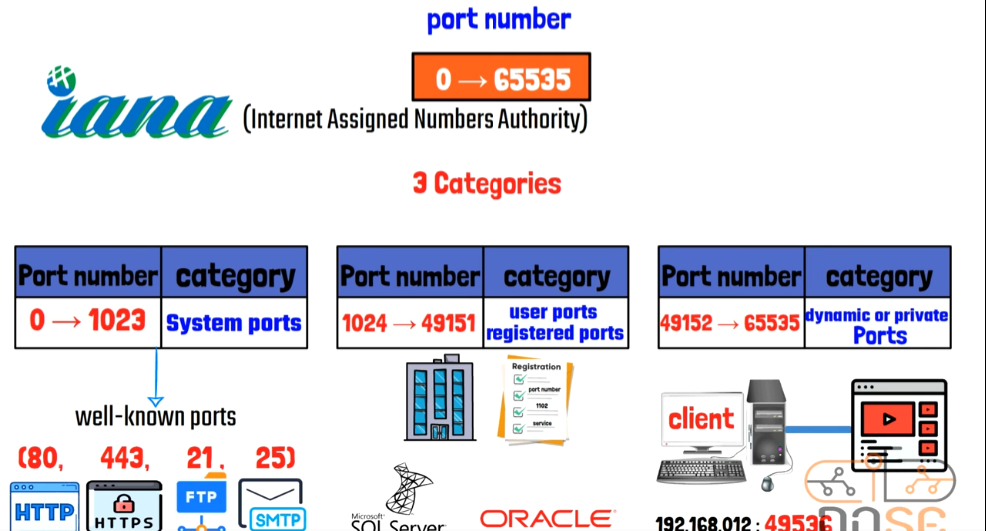
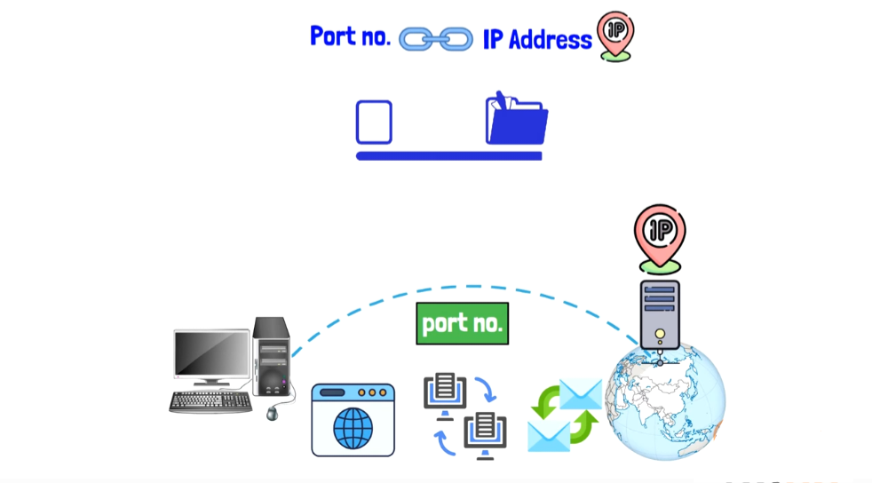
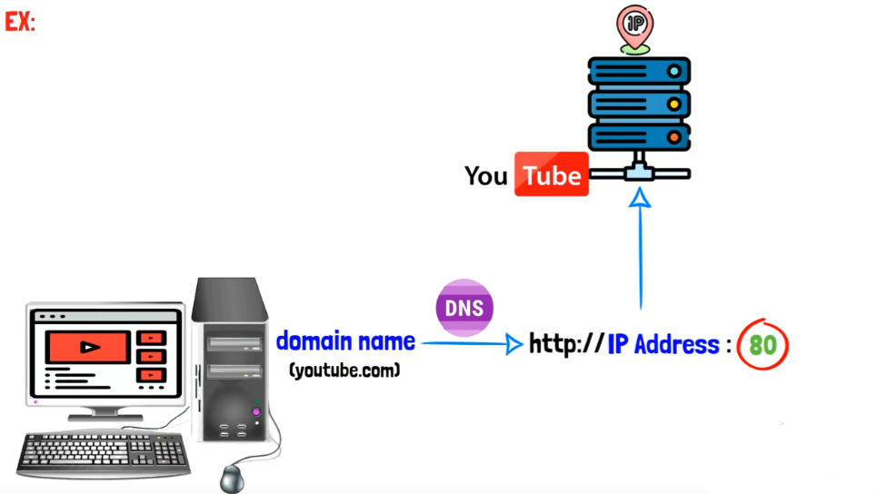
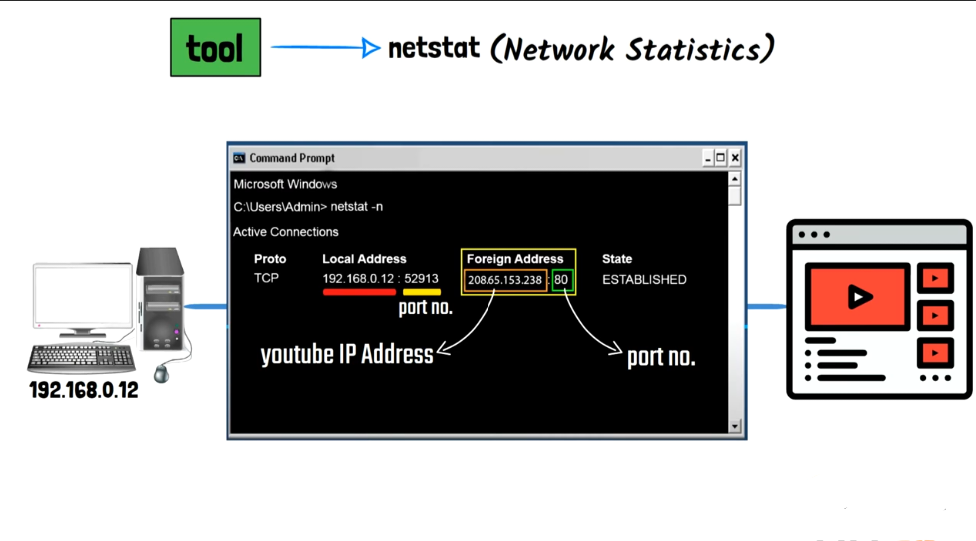
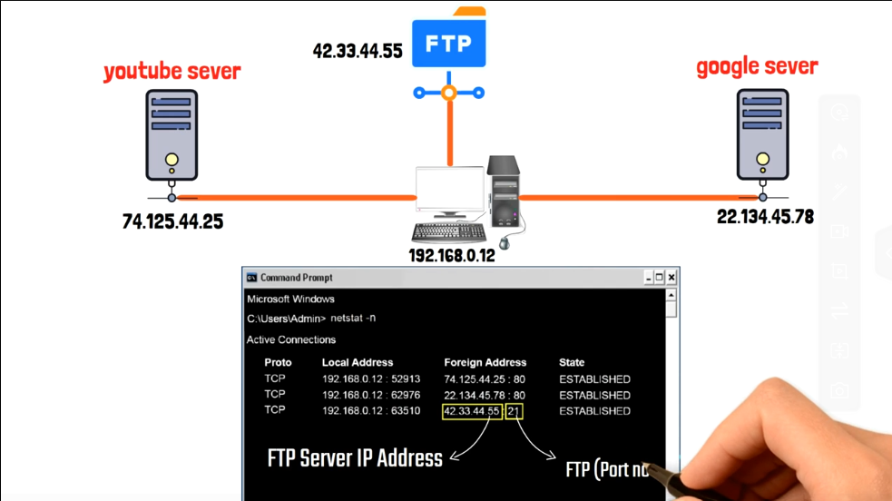

<div align="center">

# 🔌 رقم المنفذ (Port Number)

### الدليل الشامل لكل ما يخص أرقام المنافذ في الشبكات

</div>

---

## 📑 فهرس الموضوعات

| العنوان |
|---|
| [مقدمة عن الموضوع](#مقدمة-عن-الموضوع) |
| [نطاق أرقام البورت (Port Number Range)](#نطاق-أرقام-البورت-port-number-range) |
| [تقسيمات (فئات) أرقام البورت الثلاثة](#تقسيمات-فئات-أرقام-البورت-الثلاثة) |
| [العلاقة بين Port Number و IP Address](#العلاقة-بين-port-number-و-ip-address) |
| [العلاقة بين Port Number و DNS](#العلاقة-بين-port-number-و-dns) |
| [أداة netstat](#أداة-netstat) |
| [جدول أشهر 20 بورت (Common Ports)](#جدول-أشهر-20-بورت-common-ports) |
| [العلاقة بين نوع البروتوكول (TCP/UDP) واختيار البورت](#العلاقة-بين-نوع-البروتوكول-tcpudp-واختيار-البورت) |
| [دور Port Number في عملية الـ Multiplexing / Demultiplexing](#دور-port-number-في-عملية-الـ-multiplexing-demultiplexing) |
| [الجانب الأمني (Security) المرتبط بأرقام البورت](#الجانب-الأمني-security-المرتبط-بأرقام-البورت) |
| [إزاي بيحصل الاختراق من خلال أرقام البورت؟ (نظرة عامة)](#إزاي-بيحصل-الاختراق-من-خلال-أرقام-البورت-نظرة-عامة) |
| [خلاصة سريعة](#خلاصة-سريعة) |

---

## مقدمة عن الموضوع

<div dir="rtl">

الـ **Port Number** هو رقم بيُستخدم عشان يحدد **نوع الخدمة أو التطبيق (Application/Process)** اللي البيانات موجهة له داخل نفس الجهاز، وهو مفهوم أساسي جدًا مرتبط بطبقة الـ **Transport Layer** (الطبقة الرابعة) في نموذج الـ `OSI` اللي اتكلمنا عنها قبل كده.

المشكلة اللي الـ `Port Number` بيحلها بسيطة: لما جهازك (اللي له `IP Address` واحد) بيكون فاتح في نفس الوقت أكتر من برنامج بيستخدم الإنترنت (متصفح فاتح فيديو على يوتيوب، وفي نفس الوقت برنامج بيستقبل إيميلات، وبرنامج تالت بينزل ملف بالـ `FTP`)... إزاي الجهاز المستقبِل (أو حتى جهازك نفسه وقت استقبال الرد) هيعرف "الرد ده يخص أنهي برنامج بالظبط"؟

هنا بييجي دور الـ `Port Number`: كل خدمة أو بروتوكول ليه رقم منفذ خاص بيه، وده بيخلي البيانات توصل بالظبط للبرنامج المطلوب، مش لأي برنامج تاني شغال على نفس الجهاز.

> 💡 **العلاقة بالطبقات السبعة:** الـ `Port Number` هو أحد أهم مكونات الـ **Header** اللي بتضيفه طبقة الـ `Transport Layer` على الـ `Segment`، بيتحط جنب بعضه رقمين: **Source Port** (بورت الجهاز المُرسِل) و **Destination Port** (بورت الخدمة المطلوبة عند المُستقبِل). وده معناه إن كل `Segment` بيحمل معاه مش بس البيانات، وإنما كمان معلومة "لأي برنامج بالظبط البيانات دي رايحة".

</div>

---

## نطاق أرقام البورت (Port Number Range)

<div dir="rtl">

أرقام الـ `Port Number` بتتراوح من : 0  →  65535

يعني إجمالي **65536 رقم منفذ** ممكن استخدامهم (من صفر لحد 65535).

### ليه النطاق بالظبط كده؟

السبب التقني وراء الرقم ده إن حقل الـ `Port Number` جوه الـ **Header** بتاع `TCP` أو `UDP` بيكون بحجم **16 بت (16-bit field)**.

وبما إن أي بت (`Bit`) ممكن ياخد قيمة `0` أو `1` بس، فإجمالي عدد الاحتمالات المختلفة اللي ممكن نمثلها بـ 16 بت هو:

$$2^{16} = 65536$$

وبما إن العدّ بيبدأ من صفر، فالنطاق بيبقى من `0` إلى `65535` بالظبط. ده هو نفس السبب اللي بيخلي كل من `TCP` و `UDP` يستخدموا نفس نطاق البورتات بالظبط، لأن الاتنين بيستخدموا حقل بنفس الحجم (16 بت) لكل من الـ `Source Port` والـ `Destination Port` في الـ `Header` بتاعهم.

### مين اللي بيحدد ويوزع الأرقام دي؟

الجهة المسؤولة عن تنظيم وتوزيع أرقام البورتات عالميًا هي منظمة اسمها:

**`IANA` (Internet Assigned Numbers Authority)**

وهي منظمة دولية مسؤولة عن إدارة وتوزيع الموارد الخاصة بالإنترنت بشكل عام (مش بس أرقام البورتات، لكن كمان عناوين الـ `IP` وأسماء النطاقات `Domain Names`)، وبتتأكد إن كل رقم بورت له استخدام موحّد ومتفق عليه عالميًا، عشان أي جهاز في أي مكان في العالم يفهم إن البورت رقم `80` مثلاً معناه `HTTP`، بغض النظر عن نوع الجهاز أو الشركة المصنعة له.

</div>

---

## تقسيمات (فئات) أرقام البورت الثلاثة

<div dir="rtl">

منظمة الـ `IANA` قسّمت الـ 65536 رقم بورت إلى **3 فئات (Categories)** رئيسية، كل فئة ليها نطاق ووظيفة مختلفة:

</div>



<div dir="rtl">

### 1) System Ports (المعروفة أيضًا بـ Well-Known Ports)

</div>

| الخاصية | التفاصيل |
|---|---|
| **النطاق** | من `0` إلى `1023` |
| **الوصف** | أرقام ثابتة ومحجوزة لأشهر وأهم الخدمات والبروتوكولات المعروفة عالميًا، ومحدد كل رقم منها مسبقًا من الـ `IANA` |
| **مين بيستخدمها** | البروتوكولات الأساسية جدًا في الشبكات والإنترنت |

<div dir="rtl">

**أشهر أمثلة الـ `Well-Known Ports`:**

</div>

| رقم البورت | البروتوكول | الاستخدام |
|---|---|---|
| `80` | `HTTP` | تصفح المواقع بدون تشفير |
| `443` | `HTTPS` | تصفح المواقع بتشفير (SSL/TLS) |
| `21` | `FTP` | نقل الملفات (قناة التحكم - Control) |
| `25` | `SMTP` | إرسال الإيميلات |

<div dir="rtl">

### 2) User Ports (المعروفة أيضًا بـ Registered Ports)

</div>

| الخاصية | التفاصيل |
|---|---|
| **النطاق** | من `1024` إلى `49151` |
| **الوصف** | أرقام بورتات "مسجّلة" (Registered) بتقدر أي شركة أو مؤسسة تسجّل رقم بورت معين باسم برنامج أو خدمة معينة بتاعتها، عن طريق تقديم طلب تسجيل رسمي لمنظمة `IANA` |
| **مين بيستخدمها** | برامج وخدمات الشركات المتخصصة، زي قواعد البيانات وأنظمة الشركات |

<div dir="rtl">

**أمثلة على استخدام الفئة دي:** برامج زي **`Microsoft SQL Server`** و **`Oracle`** بتسجل أرقام بورت خاصة بيها في النطاق ده، عشان تضمن إن مفيش برنامج تاني هيستخدم نفس الرقم ويحصل تعارض (Conflict).

### 3) Dynamic or Private Ports (المعروفة أيضًا بـ Ephemeral Ports)

</div>

| الخاصية | التفاصيل |
|---|---|
| **النطاق** | من `49152` إلى `65535` |
| **الوصف** | أرقام "مؤقتة" (Dynamic) بيتم توليدها بشكل عشوائي وتلقائي من نظام تشغيل جهاز الـ **Client** (المستخدم) في كل مرة بيفتح فيها اتصال جديد مع أي سيرفر |
| **مين بيستخدمها** | جهاز المستخدم (Client) نفسه، مش الخوادم (Servers) |

<div dir="rtl">

**مثال توضيحي:** لما تفتح فيديو على يوتيوب، جهازك (`Client`) هياخد رقم بورت عشوائي من النطاق ده (مثلاً `49536`)، ويستخدمه كـ **Source Port** بتاعه، بينما هيتواصل مع سيرفر يوتيوب على البورت المعروف بتاع `HTTP`/`HTTPS` (`80` أو `443`).

</div>

```
192.168.0.12 : 49536   ←→   youtube server : 443
   (Client - Dynamic Port)      (Server - Well-Known Port)
```

---

## العلاقة بين Port Number و IP Address

<div dir="rtl">

الـ **IP Address** بيحدد **أنهي جهاز** (Device) على الشبكة، بينما الـ **Port Number** بيحدد **أنهي برنامج/خدمة** (Application) جوه الجهاز ده بالظبط.

يعني ببساطة:

- **IP Address** = عنوان "المبنى" (بيحدد مكان الجهاز على الشبكة).
- **Port Number** = رقم "الشقة" جوه المبنى ده (بيحدد البرنامج المطلوب بالظبط).

</div>



<div dir="rtl">

من دمج الاتنين مع بعض (`IP Address` + `Port Number`) بيتكون مفهوم اسمه **Socket**، وهو "العنوان الكامل" اللي بيحدد بدقة الاتصال بين جهازين، وبيُكتب عادةً بالشكل:

</div>

```
IP_Address : Port_Number
```

<div dir="rtl">

مثال: `192.168.0.12 : 49536`

</div>

---

## العلاقة بين Port Number و DNS

<div dir="rtl">

لما تكتب اسم موقع في المتصفح (زي `youtube.com`)، الخطوات اللي بتحصل ورا الكواليس هي:

1. المتصفح بيبعت طلب لخدمة الـ **DNS (Domain Name System)** عشان يترجم اسم النطاق (Domain Name) ده إلى **IP Address** الخاص بسيرفر يوتيوب.
2. بعد ما يوصله الـ `IP Address`، المتصفح بيكوّن الطلب الكامل بالشكل: `http://IP_Address:80` (أو `https://IP_Address:443` لو الاتصال مُشفّر).
3. الطلب بيتبعت لسيرفر يوتيوب على البورت المحدد (`80` أو `443`)، وبيرجع الرد لجهاز المستخدم على نفس البورت العشوائي (Dynamic Port) اللي جهازه استخدمه وقت فتح الاتصال.

</div>



<div dir="rtl">

كده الـ `DNS` بيحل مشكلة إن المستخدم يحفظ أرقام `IP` الصعبة، والـ `Port Number` بيحدد بالظبط نوع الخدمة اللي هيتفتح على السيرفر ده (هل هو موقع ويب، سيرفر إيميل، سيرفر ملفات...).

</div>

---

## أداة netstat

<div dir="rtl">

**`netstat`** اختصار لـ **Network Statistics**، وهي أداة (Tool) بتشتغل من خلال سطر الأوامر (Command Prompt / Terminal)، ووظيفتها إنها **تعرض كل الاتصالات الشبكية النشطة (Active Connections)** اللي جهازك فاتحها في اللحظة دي، مع تفاصيل كل اتصال.

### طريقة الاستخدام

</div>

```
netstat -n
```

<div dir="rtl">

الأمر ده بيعرض جدول فيه الأعمدة دي:

</div>

| العمود | الوصف |
|---|---|
| `Proto` | نوع البروتوكول المستخدم في الاتصال (`TCP` أو `UDP`) |
| `Local Address` | عنوان جهازك (`IP` الخاص بيك) + رقم البورت اللي جهازك استخدمه (Source Port) |
| `Foreign Address` | عنوان السيرفر البعيد (`IP` الخاص بيه) + رقم البورت بتاع الخدمة اللي بتتواصل معاها (Destination Port) |
| `State` | حالة الاتصال، زي **`ESTABLISHED`** (يعني الاتصال شغال وقائم فعليًا) |



<div dir="rtl">

### مثال عملي شامل

لو جهازك فاتح أكتر من اتصال في نفس الوقت (فيديو على يوتيوب + اتصال `FTP` + تصفح جوجل)، أمر `netstat -n` هيوريك كل الاتصالات دي في نفس الوقت، وكل واحد بالـ `IP` والبورت الخاص بيه:

</div>

```
Proto   Local Address          Foreign Address        State
TCP     192.168.0.12 : 52913   74.125.44.25  : 80     ESTABLISHED   → YouTube
TCP     192.168.0.12 : 62976   22.134.45.78  : 80     ESTABLISHED   → Google
TCP     192.168.0.12 : 63510   42.33.44.55   : 21     ESTABLISHED   → FTP Server
```



<div dir="rtl">

كده أداة `netstat` بتساعدك عمليًا إنك تعرف: جهازك متصل بمين دلوقتي؟ وعلى أنهي خدمة (بورت)؟ وده مفيد جدًا في مجال الأمن السيبراني عشان تكتشف لو فيه اتصال مشبوه أو غير معروف شغال على جهازك من غير علمك.

</div>

---

## جدول أشهر 20 بورت (Common Ports)

<div dir="rtl">

الجدول ده بيلخص أشهر أرقام البورتات المستخدمة في الشبكات، ومهم جدًا حفظه لأنه بيتكرر كتير في مجال الشبكات والأمن السيبراني:

</div>

| رقم البورت | البروتوكول (TCP/UDP) | الاستخدام |
|---|---|---|
| `20` | `TCP` | FTP (نقل البيانات - Data Transfer) |
| `21` | `TCP` | FTP (التحكم - Control) |
| `22` | `TCP` | SSH (Secure Shell - اتصال آمن عن بعد) |
| `23` | `TCP` | Telnet (اتصال عن بعد بدون تشفير - Remote Login) |
| `53` | `UDP/TCP` | DNS (ترجمة أسماء النطاقات - Domain Resolution) |
| `67` | `UDP` | DHCP (من السيرفر للعميل - Server to Client) |
| `68` | `UDP` | DHCP (من العميل للسيرفر - Client to Server) |
| `69` | `UDP` | TFTP (نقل ملفات بسيط - Trivial File Transfer) |
| `80` | `TCP` | HTTP (تصفح المواقع - Web Browsing) |
| `110` | `TCP` | POP3 (استقبال الإيميلات - Email Receiving) |
| `123` | `UDP` | NTP (مزامنة الوقت - Time Sync) |
| `138` | `UDP` | NetBIOS (خدمة الأسماء - Name Service) |
| `139` | `TCP` | NetBIOS (نقل البيانات - Datagram Service) |
| `143` | `TCP` | IMAP (استقبال الإيميلات - Email Receiving) |
| `161` | `UDP` | SNMP (إدارة الشبكة - Network Management) |
| `443` | `TCP` | HTTPS (تصفح مواقع آمن - Secure Web Browsing) |
| `445` | `TCP` | SMB (مشاركة الملفات - File Sharing) |
| `3389` | `TCP` | RDP (سطح المكتب البعيد - Remote Desktop) |

<div dir="rtl">

> 💡 **ملحوظة:** لاحظ إن بعض البروتوكولات (زي `DHCP` و `TFTP` و `NTP` و `SNMP`) بتستخدم **`UDP`** لأنها بتحتاج سرعة أكتر من الدقة الكاملة، بينما بروتوكولات زي (`FTP`، `SSH`، `HTTP`، `HTTPS`، `SMB`، `RDP`) بتستخدم **`TCP`** لأنها محتاجة ضمان وصول البيانات كاملة وبالترتيب الصحيح (زي ما اتكلمنا في شرح الفرق بين `TCP` و `UDP` في ملف الـ OSI Model).

</div>


<div dir="rtl">

### بورتات إضافية مهمة (مكملة للجدول السابق)

فيه كمان بورتات تانية مهمة جدًا، خصوصًا في مجال الأمن السيبراني والشبكات المتقدمة، ومنتشر استخدامها بشكل كبير:

</div>

| رقم البورت | البروتوكول (TCP/UDP) | الاستخدام |
|---|---|---|
| `465` | `TCP` | SMTPS (إرسال إيميلات بتشفير SSL) |
| `587` | `TCP` | SMTP (إرسال إيميلات مع TLS - الأكثر استخدامًا حاليًا بدل 25) |
| `993` | `TCP` | IMAPS (استقبال إيميلات بتشفير SSL/TLS) |
| `995` | `TCP` | POP3S (استقبال إيميلات بتشفير SSL/TLS) |
| `389` | `TCP/UDP` | LDAP (الوصول لخدمات الدليل - Directory Access) |
| `636` | `TCP` | LDAPS (نسخة مشفرة من LDAP) |
| `179` | `TCP` | BGP (بروتوكول توجيه بين الشبكات الكبيرة - Border Gateway Protocol) |
| `500` | `UDP` | IKE (تبادل مفاتيح تشفير VPN - يُستخدم مع IPSec) |
| `1433` | `TCP` | Microsoft SQL Server (قواعد بيانات) |
| `1521` | `TCP` | Oracle Database (قواعد بيانات) |
| `3306` | `TCP` | MySQL (قواعد بيانات) |
| `5432` | `TCP` | PostgreSQL (قواعد بيانات) |
| `5060 / 5061` | `TCP/UDP` | SIP (بروتوكول الاتصال الصوتي عبر الإنترنت - VoIP) |
| `8080` | `TCP` | HTTP (منفذ بديل شائع الاستخدام لسيرفرات الويب، خصوصًا للاختبار Proxy/Testing) |

<div dir="rtl">

> 💡 **ملاحظة:** لاحظ إن البورتات `1433`، `1521`، `3306`، `5432` هي أمثلة حقيقية على فئة الـ **User/Registered Ports** اللي اتكلمنا عنها فوق (زي `Microsoft SQL Server` و`Oracle` اللي ذكرناهم كمثال على تسجيل بورت خاص بالشركة).

</div>

---

## العلاقة بين نوع البروتوكول (TCP/UDP) واختيار البورت

<div dir="rtl">

مهم توضيح نقطة دقيقة: نفس رقم البورت ممكن يتسجل ويُستخدم مع **TCP** بشكل منفصل تمامًا عن استخدامه مع **UDP**، لأن كل بروتوكول ليه جدول بورتات خاص بيه في نظام التشغيل (زي ما شفنا في مثال بورت `53` اللي بيشتغل بيه `DNS` مع الاتنين `TCP` و `UDP`، لكن لأغراض مختلفة: `UDP` للاستعلامات العادية، و`TCP` للاستعلامات الكبيرة أو نقل المناطق Zone Transfer بين سيرفرات الـ DNS).

يعني مينفعش نفترض إن "بورت `53 TCP`" هو نفسه "بورت `53 UDP`" من ناحية الاستخدام أو الحالة، حتى لو الرقم واحد.

</div>

---

## دور Port Number في عملية الـ Multiplexing / Demultiplexing

<div dir="rtl">

من أهم الوظائف العملية للـ `Port Number` إنه بيسمح لطبقة الـ `Transport Layer` تعمل حاجة اسمها **Multiplexing** و **Demultiplexing**:

### Multiplexing (وقت الإرسال)
لو جهازك فاتح أكتر من برنامج بيستخدموا الإنترنت في نفس الوقت (متصفح + برنامج إيميل + برنامج تحميل ملفات)، كل برنامج من دول بيبعت بياناته لطبقة الـ `Transport`، والطبقة دي بتاخد كل البيانات دي من مصادر (برامج) مختلفة، وتضيف لكل واحدة منها الـ **Source Port** الخاص بيها، وتدمجهم مع بعض في تدفق واحد بيتبعت عبر نفس كرت الشبكة (`NIC`) واحد بس.

### Demultiplexing (وقت الاستقبال)
لما الردود ترجع لجهازك من كل الاتجاهات دي، طبقة الـ `Transport` بتبقى محتاجة "تفرز" كل رد وتوصله للبرنامج الصح اللي طلبه، وده بيحصل عن طريق قراءة رقم الـ **Destination Port** في كل `Segment` وارد، وتوجيهه للبرنامج المطابق ليه.

> 💡 من غير مفهوم الـ `Port Number`، كان مستحيل تقنيًا إن جهاز واحد بعنوان `IP` واحد يقدر يستخدم أكتر من خدمة إنترنت في نفس الوقت.

</div>

---

## الجانب الأمني (Security) المرتبط بأرقام البورت

<div dir="rtl">

بما إن الموضوع ده جزء أساسي من رحلتك في الأمن السيبراني، فيه كذا مفهوم مرتبط بالبورتات لازم تكون عارفهم:

### 1) Port Scanning (فحص المنافذ)
عملية بيقوم بيها المهاجم (Attacker) أو حتى المتخصص الأمني (Security Analyst) لفحص جهاز أو سيرفر معين ومعرفة **أنهي بورتات مفتوحة (Open)** وشغالة عليه، عشان يعرف إيه الخدمات المتاحة على الجهاز ده، وبالتالي يقدر يحدد نقاط الضعف المحتملة (Vulnerabilities). من أشهر الأدوات المستخدمة في العملية دي أداة اسمها **`Nmap`**.

### 2) حالات البورت (Port States)
لما تعمل فحص لبورت معين، بيرجعلك في واحدة من 3 حالات:

</div>

| الحالة | المعنى |
|---|---|
| `Open` | فيه خدمة شغالة على البورت ده وبتستقبل اتصالات |
| `Closed` | مفيش خدمة شغالة على البورت ده، لكن الجهاز بيرد ويأكد إنه وصل الطلب |
| `Filtered` | فيه جدار حماية (Firewall) بيمنع وصول الطلب للبورت ده أصلاً، فمش بتعرف تحدد حالته بشكل مؤكد |

<div dir="rtl">

### 3) Firewall Rules (قواعد جدار الحماية)
جدار الحماية (`Firewall`) بيستخدم أرقام البورتات بشكل أساسي عشان **يسمح أو يمنع** مرور بيانات معينة. فمثلاً، ممكن الشركة تقفل بورت `23` (`Telnet`) بالكامل لأنه بروتوكول غير مشفّر وخطير أمنيًا، وتسمح بدل منه ببورت `22` (`SSH`) لأنه بديل مشفّر وآمن.

### 4) بورتات مرتبطة بمخاطر أمنية معروفة
بعض البورتات مشهورة إنها بتكون هدف للهجمات لو اتسابت مفتوحة من غير حماية كافية:

</div>

| البورت | الخطورة |
|---|---|
| `23` (Telnet) | بيبعت البيانات (بما فيها كلمات السر) بدون أي تشفير، سهل اعتراضه |
| `21` (FTP) | بروتوكول قديم بينقل بيانات الدخول بدون تشفير في الوضع الافتراضي |
| `3389` (RDP) | هدف شائع جدًا لهجمات الـ `Brute Force` لو كان متاح للإنترنت من غير حماية |
| `445` (SMB) | استُخدم في ثغرات شهيرة (زي ثغرة `EternalBlue` اللي استغلتها فيروسات فدية زي `WannaCry`) |

<div dir="rtl">

### 5) Port Forwarding (إعادة توجيه المنافذ)
تقنية بتُستخدم غالبًا في أجهزة الراوتر (Router)، بتسمح بتوجيه أي طلب جاي من الإنترنت على بورت معين إلى جهاز محدد داخل الشبكة المحلية (زي توجيه بورت `3389` من الراوتر لجهاز معين جوه المنزل عشان تقدر تعمله `RDP` وانت بره البيت). التقنية دي بتُستخدم كتير مع أجهزة الـ **NAT (Network Address Translation)**.

</div>

---

## إزاي بيحصل الاختراق من خلال أرقام البورت؟ (نظرة عامة)

<div dir="rtl">

بشكل عام، فكرة استهداف الأنظمة عن طريق أرقام البورت بتمر غالبًا بثلاث مراحل مفاهيمية:

### 1) اكتشاف البورتات المفتوحة (Discovery)
المهاجم بيستخدم أدوات فحص (زي **`Nmap`**) عشان يعرف إيه البورتات المفتوحة على الجهاز أو السيرفر المستهدف، وبالتالي إيه الخدمات (Services) الشغالة عليه.

### 2) تحديد نوع وإصدار الخدمة (Fingerprinting)
بعد ما يعرف البورتات المفتوحة، المهاجم بيحاول يعرف بالظبط نوع وإصدار البرنامج الشغال على كل بورت (مثلاً: نسخة معينة من سيرفر `FTP` أو `SSH`)، لأن كل نسخة قديمة أو غير محدّثة ممكن يكون ليها ثغرات معروفة ومسجّلة.

### 3) البحث عن ثغرات معروفة ومحاولة الاستغلال (Exploitation Attempt)
لو الخدمة الشغالة على البورت قديمة أو من غير تحديثات أمنية، المهاجم ممكن يستغل ثغرة معروفة فيها للوصول غير المصرح به للنظام. وده سبب ليه الشركات بتاخد بالها جدًا من تحديث الأنظمة بشكل مستمر، وتقفل أي بورت مش محتاجاه فعليًا.

> 💡 **ملحوظة مهمة:** المعلومة دي هنا لغرض الفهم والتوعية الأمنية بس (Defensive Awareness)، وأي تفاصيل تنفيذية عن كيفية تنفيذ أي خطوة من الخطوات دي خارج نطاق الشرح هنا، وينصح بالتعمق فيها لاحقًا وبشكل مسؤول وأخلاقي (Ethical Hacking) في إطار قانوني وتعليمي معتمد زي مسار الـ `CEH`.

</div>

---

## خلاصة سريعة

<div dir="rtl">

- **Port Number** رقم بيحدد نوع الخدمة/التطبيق داخل الجهاز، ونطاقه من **`0` لحد `65535`**، لأن حقله في الـ `Header` بيكون **16 بت**.
- منظمة **`IANA`** هي المسؤولة عن تنظيم وتوزيع أرقام البورتات عالميًا.
- الأرقام مقسّمة لـ **3 فئات**: `System/Well-Known Ports` (0-1023)، `User/Registered Ports` (1024-49151)، `Dynamic/Private Ports` (49152-65535).
- دمج الـ **IP Address** مع الـ **Port Number** بيكوّن ما يُسمى بالـ **Socket**، وهو العنوان الكامل لأي اتصال شبكي.
- الـ **DNS** بيترجم اسم الموقع لـ `IP Address`، وبعدين البورت بيحدد نوع الخدمة المطلوبة على السيرفر ده.
- أداة **`netstat`** بتستخدم لعرض كل الاتصالات النشطة على جهازك، وأداة أساسية جدًا في مجال الشبكات والأمن السيبراني لمراقبة أي نشاط غير طبيعي.
- الـ `Port Number` هو اللي بيسمح لطبقة الـ `Transport` تعمل **Multiplexing/Demultiplexing** لأكتر من خدمة على نفس الجهاز في نفس الوقت.
- من الناحية الأمنية: **Port Scanning**، حالات البورت (`Open`/`Closed`/`Filtered`)، قواعد الـ **Firewall**، وبعض البورتات المعروفة بارتباطها بثغرات أمنية شهيرة، كلها مفاهيم أساسية هتقابلها كتير في مسار الـ `Security+` و`CEH` لاحقًا.
- بشكل عام (ومن غير تفاصيل تنفيذية)، فكرة الاختراق عن طريق البورتات بتمر بـ 3 مراحل مفاهيمية: **اكتشاف البورتات المفتوحة**، **تحديد نوع وإصدار الخدمة**، ثم **البحث عن ثغرات معروفة ومحاولة استغلالها**.

</div>
